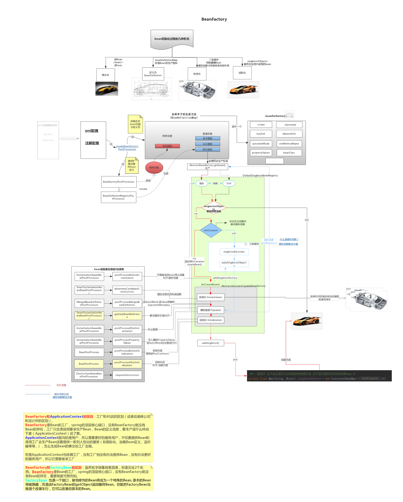
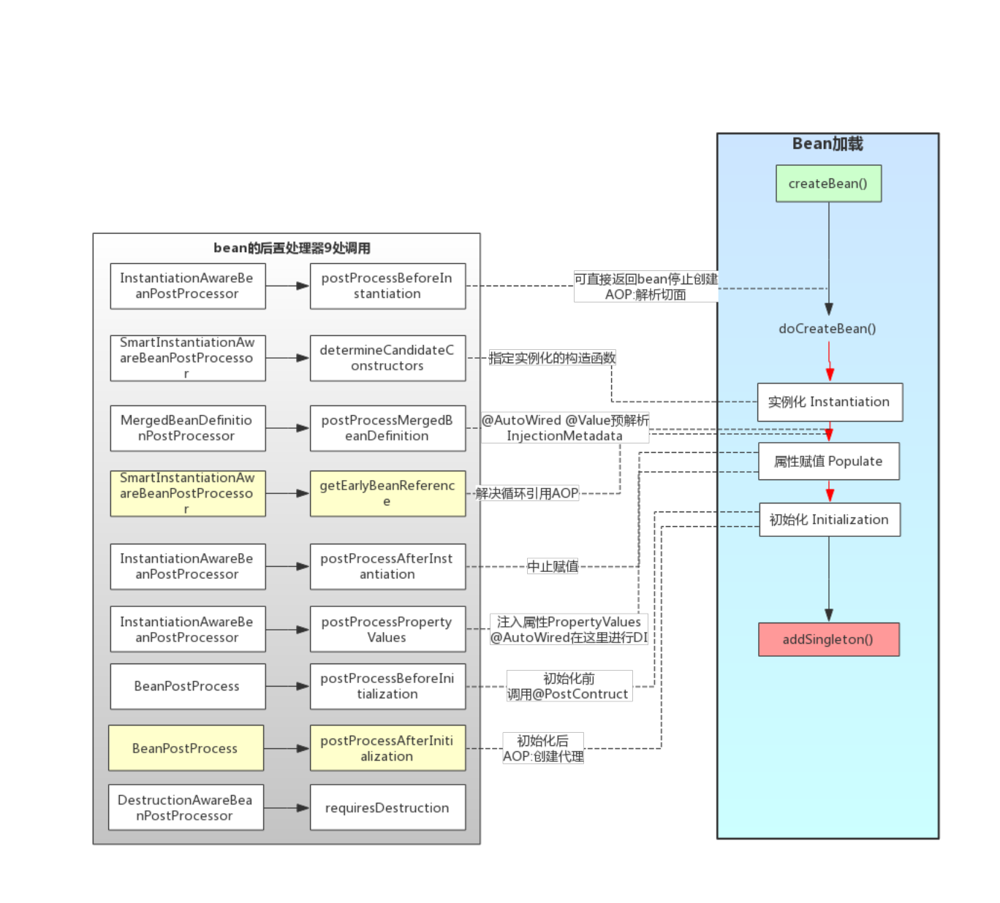

[继续](#####① 初始化前)

## Bean创建过程底层原理详解

[](./springioc的加载过程.png)

bean的后置处理器:



### bean对象和普通对象的区别

**bean对象和普通对象的区别:**

1. bean对象会进行依赖注入(依赖注入在bean创建时进行解析)，普通对象则不会
2. bean默认是单例的

`Config.java`

```java
@ComponentScan
@Configuration
public class ConfigClass {
}
```

`MainRun.java`

```java
// 加载spring上下文创建所有的单例Bean，并根据配置类里面的扫描包(@ComponentScan package com.xi.service下的所有的类，一旦发现类上有@Component)就对该类进行实例化进行依赖注入
AnnotationConfigApplication ioc =
    new AnnotationConfigApplication(ConfigClass.class);

// 获取bean对象(bean对象已经执行依赖注入了)
UserService userService  = (UserService)ioc.getBean("userService");
userService.test(); // com.xi.service.OrderService@3f3afe78
// 普通对象 不会进行依赖注入
UserService userService1 = new UserService();
userServicel.test(); // null
```

`UserService.java`

```java
package com.xi.service
@Component
public class UserService {
    // 依赖注入
    @Autowired
    private OrderService orderService
    // 测试是否可以注入
    public void test(){
    	System.out.println(orderService);
    }
}
```

### Spring bean的创建过程

**Spring bean的创建过程(Spring的生命周期)：**

UserService.class--->实例化---->依赖注入(DI)---->初始化(回调)-变为->完整bean对象(也有可能是AOP动态代理的对象)-->`Map<beanName, Object>`

#### 1.实例化

UserService **实例化** `new UserService()`，通过反射来默认**调用无参构造方法**，成为普通对象
```java
// UserService.java
public class UserService {
    private OrderService orderService
        
    // 通过无参构造方法注入 如果不提供无参构造方法spring就会报错
    /*public UserService() {
        System.out.println(1);
    }*/
    // @Autowired // 可以通过指定@Autowired可以告诉spring调用这个带参的构造方法实例化对象
    public UserService(OrderService orderService) {
        this.orderService orderservice;
        System.out.println(2);
    }
    public UserService(OrderService orderService,OrderService orderService2) {
        this.orderService orderService;
        System.out.println(3);
    }
}
```

#### 2. 依赖注入

**依赖注入**(DI)进行属性赋值

##### ① @Autowired

`@Autowired`: 先根据**类型**进行依赖注入，如果有多个同样类型的根据**`name`**进行依赖注入

byType->byName

- 解析@Autowired，拿到类中的所有属性一个一个循环，看属性上是否有@Autowired注解，如果有进行依赖注入
- **@Autowired依赖注入方式**：`byType()`对`Map<beanName, Object>` 循环所有bean的类型，一旦匹配到多个同类型的属性，那么再根据属性的名字`byName()`进行依赖注入

```java
public class UserService {
    // 依赖注入
    @Autowired
    private OrderService orderService
    // 测试是否可以注入
    public void test(){
    	System.out.println(orderService);
    }
}
```

##### ② @Resource

jdk提供的依赖注入注解

`@Resource`依赖注入方式: `byName()`，直接根据名字进行依赖注入，对`Map<beanName, Object>` 循环所有bean，一旦匹配到同一个名字则进行依赖注入

##### ③ 构造函数方式注入(推荐)

**建议使用构造函数方式进行依赖注入：**

```java
// UserService
@Component
// @AllArgRequredConstractor // lombok的注解，为属性带final的生成构造函数
public class UserService
    // @Autowired // 不建议，原因：依赖注入的bean必须是存在的，这样有可能不存在
    // @Autowired(required = false) // 不建议 可以指定依赖注入的bean可以不存在
    private OrderService orderService;
 	// private final OrderService orderService; // 结合@AllArgRequredConstractor注解生成构造方法

    public void test() {
    	System.out.println(orderService);
    }
	// 使用构造函数的方式，依赖注入的bean不存在会报错，可以保证通过构造函数注入的bean一定是存在的
    public UserService(OrderService orderService){
        this.orderService orderService;
    }
}
```

#### 3. 初始化

回调**初始化方法**(bean 注入所有依赖后执行)，成为完整的bean对象

该过程可以细分为：初始化前(BeanPostProcessor) --> 初始化(回调) --> 初始化后(BeanPostProcessor)

**Spring提供了`BeanPostProcessor`接口专供程序员进行拓展的**

```java
@Component
public class UserService implements BeanPostProcessor { // 这里实现了BeanPostProcessor接口，则使用jdk动态代理
    // 所有的bean初始化前执行
    @Override
    public Object postProcessBeforeInitialization(Object bean, String beanName) throws BeansException {
        return BeanPostProcessor.super.postProcessBeforeInitialization(bean, beanName);
    }

    // 所有的bean初始化后执行
    @Override
    public Object postProcessAfterInitialization(Object bean, String beanName) throws BeansException {
        return BeanPostProcessor.super.postProcessAfterInitialization(bean, beanName);
    }
}
```

**重写bean初始化方法的方式：**

1. 如使用`@PostConstruct`注解
2. 重写`afterPropertiesSet()`方法
3. 在`bean`上配置初始化方法的名字

```java
@PostConstruct // 在 bean 注入所有依赖后，执行一些初始化配置。
public void init(){
	// todo...
}

@Override
public void afterPropertiesset()throws Exception { // 在完成了对 Bean 属性的填充之后，进行一些初始化的操作。
	//todo...
}
```

```java
@ComponentScan
@Configuration
public class Configclass{
    @Bean(initMethod ="init") // 在`bean`上配置初始化方法的名字
    public UserService userService(){
    }
}
```

SpringAOP是初始化后执行的

#### 4.一级缓存

**一级缓存**存到`Map<beanName, Object> singletonObjects`单例池

`getBean()`方法:

- 调用`getBean()`方法，从 `Map<beanName, Object> singletonObjects` 单例池中根据`beanName`获取`Object`对象

## SpringAOP

**[SpringAOP源码](####1.2.1.1 AOP的实现)**

### SpringAOP概述

**SpringAOP**就是运用了**初始化后的**`BeanPostProcessor.postProcessAfterInitialization`**扩展点**

AOP通过动态代理来实现的，**SpringAOP提供了jdk(默认)和cglib两种动态代理方式**

- 如果bean**实现了**`BeanPostProcessor`**接口就会使用jdk动态代理**
- 如果**没有实现`BeanPostProcessor`接口**，就是用**CGlib动态代理**

动态代理是在`BeanPostProcessor.postProcessAfterInitialization`扩展点(初始化后)上写的，初始化后执行

### SpringAOP生成的对象

动态代理对象是在JVM运行时通过动态生成字节码文件创建出来的，我们是看不到的，他生成的样子是这样的：

```java
@ComponentScan
@Configuration
@EnableAspectJAutoProxy // 启用AOP
public class ConfigClass {
}
```

```java
@Aspect
@Comppnent
public class aaaAspect {
    @Pointcut("execution(public void com.xi.service.UserService.test()) || execution(public void com.xi.service.UserService.test2())")
    void pointcut(){
    }
    @Before("pointcut()")
    public void xushuBefore(JoinPoint joinPoint){
        //日志记录、方法托时·：
        System.out.println("增强")：
        Object target=joinPoint.getTarget();
    }
}
```

---

这里没有实现了BeanPostProcessor接口，因此使用CGlib动态代理：

```java
@Component
public class UserService {
    @Autowired
    private OrderService orderService;
    public void test() {
        System.out.println(orderService);
    }
}
```

CGlib动态代理生成的动态代理对象：

```java
public UserServiceCGlib extends UserService {
    Object target = UserService实例化对象(不是bean对象，无法进行依赖注入)
    // 依赖注入的对象是普通对象(不可以进行依赖注入)，不是bean对象，AOP动态代理的对象并没有进行依赖注入
    public void test() {
        // 调用前置
        // 调用目标方法
        target.test(); // null
        // 调用后置通知
    }
}
```

---

这里实现了BeanPostProcessor接口，则使用jdk动态代理：

```java
public class UserService implements BeanPostProcessor {
    Object target = UserService实例化对象(不是bean对象，无法进行依赖注入)
    // 所有的bean初始化前执行
    @Override
    public Object postProcessBeforeInitialization(Object bean, String beanName) throws BeansException {
        return BeanPostProcessor.super.postProcessBeforeInitialization(bean, beanName);
    }

    // 所有的bean初始化后执行
    @Override
    public Object postProcessAfterInitialization(Object bean, String beanName) throws BeansException {
        return BeanPostProcessor.super.postProcessAfterInitialization(bean, beanName);
    }
    // 依赖注入的对象是普通对象(不可以进行依赖注入)，不是bean对象，AOP动态代理的对象并没有进行依赖注入
    public void test() {
        // 调用前置
        // 调用目标方法
        target.test(); // null
        // 调用后置通知
    }
}
```

jdk动态代理生成的动态代理对象：

```java
public UserServiceCGlib implements IUserService {
    Object target = UserService实例化对象(不是bean对象，无法进行依赖注入)
    // 依赖注入的对象是普通对象(不可以进行依赖注入)，不是bean对象，AOP动态代理的对象并没有进行依赖注入
    public void test() {
        // 调用前置
        // 调用目标方法
        target.test(); // null
        // 调用后置通知
    }
}
```

MainRun.java：

```java
// 加载spring上下文创建所有的单例Bean，并根据配置类里面的扫描包(@ComponentScan package com.xi.service下的所有的类，一旦发现类上有@Component)就对该类进行实例化进行依赖注入
AnnotationConfigApplication ioc =
    new AnnotationConfigApplication(ConfigClass.class);

// UserService userService = (UserService)ioc.getBean("userService"); // 如果是jdk动态代理生成的对象则会报错，原因UserServiceCGlib implements IUserService而UserService implements BeanPostProcessor
IUserService userService = (IUserService)ioc.getBean("userService"); // 我们一般使用接口来接收jdk动态代理对象
```

### AOP失效

依然是上述代码

```java
@Aspect
@Comppnent
public class aaaAspect {
    @Pointcut("execution(public void com.xi.service.UserService.test()) || execution(public void com.xi.service.UserService.test2())")
    void pointcut(){
    }
    @Before("pointcut()")
    public void xushuBefore(JoinPoint joinPoint){
        //日志记录、方法托时·：
        System.out.println("增强")：
        Object target=joinPoint.getTarget();
    }
}
```

```java
@Component
public class UserService {
    @Autowired
    private OrderService orderService;
    public void test() {
        System.out.println(orderService);
        test2();
    }
    
     public void test2() {
        System.out.println(orderService);
    }
}
```

测试类：

```java
userService.test(); // 只输出了一次增强 原因在target方法中调用的test2方法，没有经过动态代理对象
```

[生成的对象tartget方法](####SpringAOP生成的对象)

**解决AOP失效的方式：**

1. 通过依赖注入的方式调用自己的方法，解决AOP失效问题，但是这种方式可能会引发循环依赖问题(自己调用自己)，不建议
2. 启用公开代理`@EnableAspectJAutoProxy(exposeProxy = true)`

**方法一：通过依赖注入的方式调用自己的方法，解决AOP失效问题，但是这种方式可能会引发循环依赖问题(自己调用自己)，不建议：**

```java
@Component
public class UserService {
    @Autowired
    private OrderService orderService;
    // 将自己依赖注入进来 在springboot2.6+版本是禁止循环依赖的，会报错
    @Autowired
    private UserService userService; // 这里依赖注入的就是动态代理对象，但是这种方式可能会引发循环依赖问题(自己调用自己)
    public void test() {
        System.out.println(orderService);
        // test2();
        userService.test2(); // 通过依赖注入的方式调用自己的方法，解决AOP失效
    }
    
    public void test2() {
        System.out.println(orderService);
    }
}
```

**方法二：启用公开代理`@EnableAspectJAutoProxy(exposeProxy = true)`，使用`AopContext`类拿到当前代理对象:**

```java
@ComponentScan
@Configuration
// @EnableAspectJAutoProxy // 启用AOP
@EnableAspectJAutoProxy(exposeProxy = true) // 启用AOP 公开代理=true
public class ConfigClass {
}
```

启用公开代理后，在执行方法的时候可以使用AOPContext：

```java
public final class AopContext { // AopContext部分源码
    private static final ThreadLocal<Object> currentProxy = new NamedThreadLocal("Current AOP proxy");
	// ...
}
```

生成的动态代理对象：

```java
// public UserServiceCGlib extends IUserService { // cglib
public UserServiceCGlib implements IUserService { // jdk
    Object target = UserService实例化对象(不是bean对象，无法进行依赖注入)
    // 依赖注入的对象是普通对象(不可以进行依赖注入)，不是bean对象，AOP动态代理的对象并没有进行依赖注入
    public void test() {
        // 调用前置 启用公开代理后会生成这个
        AopContext.ThreadLocal.set(this); // 在执行目标方法之前把当前的代理对象存到AopContext的ThreadLocal里面去
        // ...前置
        // 调用目标方法
        target.test(); // null
        // 调用后置通知
    }
}
```

公开代理解决AOP失效的调用方式：

```java
@Component
public class UserService {
    @Autowired
    private OrderService orderService;
   
    public void test() {
        System.out.println(orderService);
        // test2();
        AopContext.currentProxy()
        ((UserService)AopContext.currentProxy()).test2(); // 通过AopContext拿到当前的动态代理对象，转为需要的对象，调用方法test2
    }
    
    public void test2() {
        System.out.println(orderService);
    }
}
```

## Spring事务

### 事务起步

```xml
<dependencies>  
    <!-- Spring Context依赖 -->  
    <dependency>  
        <groupId>org.springframework</groupId>  
        <artifactId>spring-context</artifactId>  
        <version>5.3.x</version> <!-- 使用适合你的版本 -->  
    </dependency>  
    <!-- Spring JDBC依赖 -->  
    <dependency>  
        <groupId>org.springframework</groupId>  
        <artifactId>spring-jdbc</artifactId>  
        <version>5.3.x</version>  
    </dependency>  
    <!-- 数据库驱动 -->  
    <dependency>  
        <groupId>mysql</groupId>  
        <artifactId>mysql-connector-java</artifactId>  
        <version>8.x.x</version> <!-- 使用适合你的版本 -->  
    </dependency>  
    <!-- Spring事务管理 -->  
    <dependency>  
        <groupId>org.springframework</groupId>  
        <artifactId>spring-tx</artifactId>  
        <version>5.3.x</version>  
    </dependency>  
</dependencies>
```

```java
@ComponentScan
@Configuration
@EnableAspectJAutoProxy(exposeProxy true) // 开启AOP
@EnableTransactionManagement // 开启事务
public class ConfigClass {
     @Bean  
    public DataSource dataSource() {  
        DriverManagerDataSource dataSource = new DriverManagerDataSource(
        	"jdbc:mysql://127.0.0.1:3306/hmdianping?useSSL=false&serverTimezone=UTC&allowPublicKeyRetrieval=true",
            "root", "123456"
        );  
        return dataSource;  
    }  
    @Bean
    public JdbcTemplatejdbcTemplate(DataSource dataSource){
        return new JdbcTemplate(dataSource);
    }
    @Bean
    public TransactionManager transactionManager(DataSource dataSource){
    	return new DataSourceTransactionManager(dataSource);
    }
    @Bean  
    public TransactionTemplate transactionTemplate(PlatformTransactionManager transactionManager) {  
        return new TransactionTemplate((PlatformTransactionManager)transactionManager);  
    }  
}
```

```java
@Component
public class UserService {
    @Autowired
    private OrderService orderService;
    
    // 1.是不是bean 2.有没有加@Transactional 3.是不是private 4.是不是自已try
    @Autowired
    JdbcTemplate jdbcTemplate;
    
    // 声明方法...
}
```

MainRun.java：

```java
// 加载spring上下文创建所有的单例Bean，并根据配置类里面的扫描包(@ComponentScan package com.xi.service下的所有的类，一旦发现类上有@Component)就对该类进行实例化进行依赖注入
AnnotationConfigApplication ioc =
    new AnnotationConfigApplication(ConfigClass.class);

// UserService userService = (UserService)ioc.getBean("userService"); // 如果是jdk动态代理生成的对象则会报错，原因UserServiceCGlib implements IUserService而UserService implements BeanPostProcessor
IUserService userService = (IUserService)ioc.getBean("userService"); // 我们一般使用接口来接收jdk动态代理对象

// 测试调用...
```

### 事务为什么会失效

#### 使用方面

1. 启动类未使用`@EnableTransactionManagement`  开启事务
2. 业务方法上未使用`@Transactional`启用事务
3. 使用`@Transactional`方法所在的类未注册为bean，`@Component`，那么就没有，没有动态代理了
4. 自己加了`try...catch`把异常捕捉了

#### 更深层次的失效场景 

事务使用的AOP，在初始化后拿到当前的bean，如果发现有`@Transactional`启用事务的注解，就会创建动态代理的对象 重写对应的方法

```java
public UserServiceCGlib extends UserService {
    Object target = UserService实例化对象(不是bean对象，无法进行依赖注入)
        // 依赖注入的对象是普通对象(不可以进行依赖注入)，不是bean对象，AOP动态代理的对象并没有进行依赖注入
        public void test() {
        // 调用前置通知
        
        // 调用目标方法
        try {
            // 1. 开启事务
            tran = Connection.setAutoCommit(false); // 设置自动提交为false
            // 2. 目标方法
            target.test();
            
            // 3. 没有异常提交事务
            tran.commit();
        } catch(E e) {
            // 回滚事务
            tran.rollback();
        }
        
        // 调用后置通知
    }
}
```

#### 不太常见的失效场景

##### 1. 抛出 非 RuntimeException及其子异常，事务失效

```java
// UserService
// 场最一，抛出非RuntimeException，事务失效
@Transactional
public void add() {
    jdbcTemplate.execute("INSERT INTO ...");
    throw new TimoutException("异常"); // 事务失效
    // ((UserService)AopContext.currentProxy()).query();
}
```

运行后发现数据库中插入的数据依然插入成功，事务失效

**解决：**`@Transactional(rollbackFor = XXXException.class)`

```java
@Transactional(rollbackFor = TimeoutException.class) // 加上这句就可以抛出该异常的使事务生效
public void add() {
    jdbcTemplate.execute("INSERT INTO ...");
    throw new TimoutException("异常");
}
```

运行后发现事务有效，数据插入失败

**抛出RuntimeException及其子异常，事务成功使用**

```java
// UserService
// 抛出RuntimeException 事务生效
@Transactional(rollbackFor = TimeoutException.class)
public void add() {
    jdbcTemplate.execute("INSERT INTO ...");
    // int a = 1/0; // 抛出 ArithmeticException extends RuntimeException 事务生效
    throw new RuntimeException("异常"); // 事务生效
}
```

运行后发现事务有效，数据插入失败

##### 2. 方法内嵌套调用，事务失效

```java
// UserService
// 场景二：方法内嵌套调用，事务失效
@Transactional(rollbackFor = TimeoutException.class)
public void add() {
    jdbcTemplate.execute("INSERT INTO ...");
    query();
}
```

```java
@Transactional(propagation = Propagation.NEVER) // 事务失效
// 当 add 方法调用 query 方法时，由于 query 的传播行为是 NEVER，如果 add 方法已经在一个事务中运行，那么调用 qvery 会导致抛出 IllegalTransactionStateException extends RuntimeException。因此，query 方法的事务不会生效，因为它根本不会被执行。
// 
public void query() { // 由于指定事务传播行为为never因此事务失效
    jdbcTemplate.execute("SELECT * FROM 'test'.'user'");
}
```

- **`propagation = Propagation.NEVER`使用场景**
  - 避免事务嵌套：在某些情况下，可能希望某个方法的执行不受外部事务的影响，例如不想在一个事务中执行某些只读操作。
  - 提高性能：对于只读操作，可以避免不必要的事务开销。

- **事务失效**
  - `qvery` 方法方法标记为 `@Transactional(propagation = Propagation.NEVER)`，这意味着它不允许在任何现有事务中执行。
  - 当 `add` 方法调用 `query` 时，Spring 会检查当前线程的事务状态。如果发现当前有一个活动的事务（即 `add` 方法中的事务），则会抛出 `IllegalTransactionStateException` extends RuntimeException，这会导致 `qvery` 方法体中的任何代码都不会被执行。在这种情况下，`qvery` 方法的内容**一定**不会被执行，因为在调用时会抛出异常，阻止了方法的正常执行。这是 Spring 事务管理的一部分，用于确保方法的事务传播行为得到遵循。

```java
@Transactional // query 方法没有指定传播行为（默认为 REQUIRED），它会参与到 add 方法的事务中，在 add 方法的事务上下文中执行。
public void query() {  
    // 这里会抛出 IllegalTransactionStateException  
    jdbcTemplate.execute("SELECT * FROM 'test'.'user'");  
}
```

- **事务生效**：
  - 当 `add` 方法调用 `qvery` 方法时，由于 `qvery` 方法没有指定传播行为（默认为 `REQUIRED`），它会参与到 `add` 方法的事务中。因此，`qvery` 方法中的 `jdbcTemplate.execute("SELECT * FROM 'test'.'user'");` 将在 `add` 方法的事务上下文中执行。
  - 这意味着，如果 `qvery` 方法执行成功，所有的操作（包括 `add` 方法中的插入和 `qvery` 方法中的查询）都将在同一个事务中进行。
- **异常处理**：
  - 如果在 `qvery` 方法中发生异常（例如，查询失败），则会导致 `add` 方法中的事务回滚，所有的数据库操作都将被撤销。
  - 如果没有异常发生，`add` 方法的事务将在 `add` 方法执行完毕后提交。

**`propagation = Propagation.NEVER`解决方法：**

- 通过**依赖注入**的方式调用自己的方法，解决AOP失效问题，但是这种方式可能会引发循环依赖问题(自己调用自己)，不建议
- 启用**[公开代理](###AOP失效)**`@EnableAspectJAutoProxy(exposeProxy = true)`，使用`AopContext`获取到当前事务对象，再进行方法内嵌套调用

```java
@ComponentScan
@Configuration
@EnableAspectJAutoProxy(exposeProxy = true) // 启用AOP 公开代理=true
public class ConfigClass {
}
```

```java
// UserService
// 场景二：方法内嵌套调用，使用AopContext使事务生效
@Transactional(rollbackFor = TimeoutException.class)
public void add() {
    jdbcTemplate.execute("INSERT INTO ...");
    ((UserService)AopContext.currentProxy()).query();
}
@Transactional(propagation = Propagation.NEVER)
public void qvery() {
    jdbcTemplate.execute("SELECT * FROM 'test'.'user'");
}
```

##### 3. 多线程事务，事务失效

分布式事务 2PC 3PC SAGA XA ... 事务失效

```java
private final ExecutorService executorService = Executors.newFixedThreadPool(    );
// 场景三，多线程事务分布式事务 2PC 3PC SAGA XA ....
@Transactional
public void mainThread() throws Exception {
    jdbcTemplate.execute("INSERT INTO ...");
    new Thread(()-> {
        ((UserService)AopContext.currentProxy()).childThread();
    }).start();
}
private void childThread(){ // 多线程事务失效
    jdbcTemplate.execute("INSERT INTO ...");
    throw new RuntimeException("出错~ww"):
}
```

**解决多线程事务失效：**

1. 使用**分布式事务**，用事务的协调器(这里不细说)
2. Spring支持的**编程事务**

**解决方式2：Spring支持的编程事务`TransactionTemplate`：**

```java
// UserService
@Autowired
private TransactionTemplate transactionTemplate; // 通过它可以完成spring的编程式事务

private final ExecutorService executorService = Executors.newFixedThreadPool(...);
// 场景三，多线程事务分布式事务 2PC 3PC SAGA XA ....
@Transactional
public void mainThread() throws Exception {
    // spring提供的编程式事务
    transactionTemplate,execute(new TransactionCallback<Void)() {
        @Override
        public Void doInTransaction(TransactionStatus status) {
            try {
                // 主事务的数据库操作
                jdbcTemplate.execute("INSERT INTO ...");
                
                // 启动子线程并执行子事务
                Future<Void> future = executorService.submit(() -> {
                    userService2.childThread();
                    return null;
                });
                // 等待子线程完成
                future.get();
            } catch (Exception e) {
                // 回滚主事务
                status.setRollbackOnly(); // 回滚
                throw new RuntimeException;
            }
        }
    }
}
// 子线程要调用的方法
private void childThread(){
    jdbcTemplate.execute("INSERT INTO ...");
    throw new RuntimeException("出错~ww"):
}
```

**多线程事务失效原因：**

```java
private final ExecutorService executorService = Executors.newFixedThreadPool(    );
// 场景三，多线程事务分布式事务 2PC 3PC SAGA XA ....
@Transactional
public void mainThread() throws Exception {
    jdbcTemplate.execute("INSERT INTO ...");
    new Thread(()-> {
        ((UserService)AopContext.currentProxy()).childThread(); // 多线程事务失效
    }).start();
}
private void childThread(){
    jdbcTemplate.execute("INSERT INTO ...");
    throw new RuntimeException("出错~ww"):
}
```

- **事务失效**：
  - 由于 `childThread` 方法是在新的线程中执行的，Spring 的事务管理不会自动将 `mainThread` 方法的事务上下文传递到新的线程中。
  - 当 `childThread` 方法被调用时，它不会有任何事务上下文，因此在这个方法中的数据库操作将不会在 `mainThread` 的事务中执行，而是独立执行。即便`childThread`方法有`@Transactional`注解它会开启一个新的事务，而不是参与到 `mainThread` 的事务中。这意味着即使 `mainThread` 方法的事务成功提交，`childThread` 方法的操作也不会受到影响。
- **异常处理**：
  - 在 `childThread` 方法中抛出的 `RuntimeException` 只会影响该线程的执行，不会影响到 `mainThread` 方法的事务。
  - 因此，`mainThread` 方法的事务将会正常提交，尽管 `childThread` 方法中的操作失败。

上述多线程事务代码生成的代码分析：

```java
public class UserServiceCGlib extends UserService { // cglib
    private UserService target; // 原始 UserService 实例  

    public void mainThread() throws Exception {  
        // 开始事务  
        Connection connection = DataSource.getConnection();  
        connection.setAutoCommit(false);

        try {  
            // 执行第一次插入  
            target.jdbcTemplate.execute("INSERT INTO ...");  

            // 启动新线程  
            new Thread(() -> {  
                target.childThread(); // 调用子方法  
            }).start();  

            // 如果没有异常则提交事务  
            connection.commit();  
        } catch (RuntimeException e) {  
            connection.rollback(); // 发生错误时回滚  
            throw e; // 重新抛出异常  
        }  
    }  

    public void childThread() {  
        try {  
            if (ThreadLocal.get() != null) { // 检查是否有现有事务  当 childThread 方法在一个新的线程中执行时，ThreadLocal.get() 通常会返回 null，因为事务上下文不会自动传递到新线程中。因此，childThread 方法中的代码将执行到 else 分支，认为没有现有事务。
                // 参与现有事务  
                target.jdbcTemplate.execute("INSERT INTO ...");  
            } else {  
            // 外层没有事务，执行独立的数据库操作  由于这里没有加@Transactional注解，则不会开启新事务直接调用数据库方法
            target.jdbcTemplate.execute("INSERT INTO ...");   
        }  
        } catch (RuntimeException e) {  
            // 处理异常，如果有@Transactional注解则会回滚  
            throw e; // 重新抛出以让主线程处理  
        }  
    }  
}
```

## bean创建过程源码

### 1.doCreateBean()

doCreateBean()方法体现了：实例化---->依赖注入(DI)---->初始化(回调)-变为->完整bean对象

- 实例化createBeanInstance()
- 依赖注入
- 初始化initializeBean()

```java
protected Object doCreateBean(String beanName, RootBeanDefinition mbd, @Nullable Object[] args) throws BeanCreationException {
    BeanWrapper instanceWrapper = null;
    
    if (mbd.isSingleton()) {
        // 有可能在本Bean创建之前，就有其他Bean把当前Bean给创建出来了(比如依赖注入过程中)
        instanceWrapper = (BeanWrapper)this.factoryBeanInstanceCache.remove(beanName);
    }

    if (instanceWrapper == null) {
        // 创建bean实例
        instanceWrapper = this.createBeanInstance(beanName, mbd, args);
    }

    Object bean = instanceWrapper.getWrappedInstance();
    Class<?> beanType = instanceWrapper.getWrappedClass();
    if (beanType != NullBean.class) {
        mbd.resolvedTargetType = beanType;
    }

    // 后置处理合并后的BeanDefinition
	// ALlow post-processors to modify the merged bean definition. 允许后处理器修改合并的bean定义。
    synchronized(mbd.postProcessingLock) {
        if (!mbd.postProcessed) {
            try {
                this.applyMergedBeanDefinitionPostProcessors(mbd, beanType, beanName);
            } catch (Throwable var17) {
                throw new BeanCreationException(mbd.getResourceDescription(), beanName, "Post-processing of merged bean definition failed", var17);
            }

            mbd.postProcessed = true;
        }
    }

    boolean earlySingletonExposure = mbd.isSingleton() && this.allowCircularReferences && this.isSingletonCurrentlyInCreation(beanName);
    if (earlySingletonExposure) {
        if (this.logger.isTraceEnabled()) {
            this.logger.trace("Eagerly caching bean '" + beanName + "' to allow for resolving potential circular references");
        }

        this.addSingletonFactory(beanName, () -> {
            return this.getEarlyBeanReference(beanName, mbd, bean);
        });
    }

    // 初始化bean实例
    Object exposedObject = bean;

    try {
        // 属性填充
        this.populateBean(beanName, mbd, instanceWrapper); // getBean()
        // 初始化
        exposedObject = this.initializeBean(beanName, exposedObject, mbd);
    } catch (Throwable var18) {
        if (var18 instanceof BeanCreationException && beanName.equals(((BeanCreationException)var18).getBeanName())) {
            throw (BeanCreationException)var18;
        }

        throw new BeanCreationException(mbd.getResourceDescription(), beanName, "Initialization of bean failed", var18);
    }

    if (earlySingletonExposure) {
        Object earlySingletonReference = this.getSingleton(beanName, false);
        if (earlySingletonReference != null) {
            if (exposedObject == bean) {
                exposedObject = earlySingletonReference;
            } else if (!this.allowRawInjectionDespiteWrapping && this.hasDependentBean(beanName)) {
                String[] dependentBeans = this.getDependentBeans(beanName);
                Set<String> actualDependentBeans = new LinkedHashSet(dependentBeans.length);
                String[] var12 = dependentBeans;
                int var13 = dependentBeans.length;

                for(int var14 = 0; var14 < var13; ++var14) {
                    String dependentBean = var12[var14];
                    if (!this.removeSingletonIfCreatedForTypeCheckOnly(dependentBean)) {
                        actualDependentBeans.add(dependentBean);
                    }
                }

                if (!actualDependentBeans.isEmpty()) {
                    throw new BeanCurrentlyInCreationException(beanName, "Bean with name '" + beanName + "' has been injected into other beans [" + StringUtils.collectionToCommaDelimitedString(actualDependentBeans) + "] in its raw version as part of a circular reference, but has eventually been wrapped. This means that said other beans do not use the final version of the bean. This is often the result of over-eager type matching - consider using 'getBeanNamesForType' with the 'allowEagerInit' flag turned off, for example.");
                }
            }
        }
    }

    try {
        this.registerDisposableBeanIfNecessary(beanName, bean, mbd);
        return exposedObject;
    } catch (BeanDefinitionValidationException var16) {
        throw new BeanCreationException(mbd.getResourceDescription(), beanName, "Invalid destruction signature", var16);
    }
}
```

### 1.1 createBeanInstance()实例化bean

```java
protected BeanWrapper createBeanInstance(String beanName, RootBeanDefinition mbd, @Nullable Object[] args) {
    Class<?> beanClass = this.resolveBeanClass(mbd, beanName, new Class[0]);
    if (beanClass != null && !Modifier.isPublic(beanClass.getModifiers()) && !mbd.isNonPublicAccessAllowed()) {
        throw new BeanCreationException(mbd.getResourceDescription(), beanName, "Bean class isn't public, and non-public access not allowed: " + beanClass.getName());
    } else {
        Supplier<?> instanceSupplier = mbd.getInstanceSupplier();
        if (instanceSupplier != null) {
            return this.obtainFromSupplier(instanceSupplier, beanName);
        } else if (mbd.getFactoryMethodName() != null) {
            return this.instantiateUsingFactoryMethod(beanName, mbd, args);
        } else {
            boolean resolved = false;
            boolean autowireNecessary = false;
            if (args == null) {
                synchronized(mbd.constructorArgumentLock) {
                    if (mbd.resolvedConstructorOrFactoryMethod != null) {
                        resolved = true;
                        autowireNecessary = mbd.constructorArgumentsResolved;
                    }
                }
            }

            if (resolved) {
                return autowireNecessary ? this.autowireConstructor(beanName, mbd, (Constructor[])null, (Object[])null) : this.instantiateBean(beanName, mbd);
            } else {
                Constructor<?>[] ctors = this.determineConstructorsFromBeanPostProcessors(beanClass, beanName);
                if (ctors == null && mbd.getResolvedAutowireMode() != 3 && !mbd.hasConstructorArgumentValues() && ObjectUtils.isEmpty(args)) {
                    ctors = mbd.getPreferredConstructors();
                    return ctors != null ? this.autowireConstructor(beanName, mbd, ctors, (Object[])null) : this.instantiateBean(beanName, mbd);
                } else {
                    return this.autowireConstructor(beanName, mbd, ctors, args);
                }
            }
        }
    }
}
```

### 1.2 initializeBean()初始化bean

```java
// 初始化bean
protected Object initializeBean(String beanName, Object bean, @Nullable RootBeanDefinition mbd) {
    if (System.getSecurityManager() != null) {
        AccessController.doPrivileged(() -> {
            this.invokeAwareMethods(beanName, bean);
            return null;
        }, this.getAccessControlContext());
    } else {
        this.invokeAwareMethods(beanName, bean);
    }

    Object wrappedBean = bean;
    // 初始化前
    if (mbd == null || !mbd.isSynthetic()) {
        wrappedBean = this.applyBeanPostProcessorsBeforeInitialization(bean, beanName);
    }

    // 初始化
    try {
        this.invokeInitMethods(beanName, wrappedBean, mbd);
    } catch (Throwable var6) {
        throw new BeanCreationException(mbd != null ? mbd.getResourceDescription() : null, beanName, "Invocation of init method failed", var6);
    }

    // 初始化后
    if (mbd == null || !mbd.isSynthetic()) {
        wrappedBean = this.applyBeanPostProcessorsAfterInitialization(wrappedBean, beanName);
    }

    return wrappedBean;
}
```

### 1.2.1 applyBeanPostProcessorsAfterInitialization初始化后

```java
public Object applyBeanPostProcessorsAfterInitialization(Object existingBean, String beanName) throws BeansException {
    Object result = existingBean;

    Object current;
    for(Iterator var4 = this.getBeanPostProcessors().iterator(); var4.hasNext(); result = current) {
        BeanPostProcessor processor = (BeanPostProcessor)var4.next();
        // 调用初始化后执行的方法(可自定义的接口方法)
        current = processor.postProcessAfterInitialization(result, beanName);
        if (current == null) {
            return result;
        }
    }

    return result;
}
```

### 1.2.1.1 AOP的实现

```java
public interface SmartInstantiationAwareBeanPostProcessor extends InstantiationAwareBeanPostProcessor {
    // ...
}
```

```java
// AOP的实现 实现了InstantiationAwareBeanPostProcessor初始化的扩展
public abstract class AbstractAutoProxyCreator extends ProxyProcessorSupport implements SmartInstantiationAwareBeanPostProcessor, BeanFactoryAware {
    // ...
    // 重写初始化后执行的方法 AOP的后置
    public Object postProcessAfterInitialization(@Nullable Object bean, String beanName) {
        if (bean != null) {
            Object cacheKey = this.getCacheKey(bean.getClass(), beanName);
            if (this.earlyProxyReferences.remove(cacheKey) != bean) {
                // 在初始化之后这一步，会拿到当前正在创建的bean，根据bean的类型与切点表达式进行匹配
                // 一旦切点表达式成立就会走代理
                // 匹配切点表达式中的类是否符合(该类是否使用AOP)
                return this.wrapIfNecessary(bean, beanName, cacheKey); // 源码见下
            }
        }
        return bean;
    }
}
```

```java
protected Object wrapIfNecessary(Object bean, String beanName, Object cacheKey) {
    if (StringUtils.hasLength(beanName) && this.targetSourcedBeans.contains(beanName)) {
        return bean;
    } else if (Boolean.FALSE.equals(this.advisedBeans.get(cacheKey))) {
        return bean;
    } else if (!this.isInfrastructureClass(bean.getClass()) && !this.shouldSkip(bean.getClass(), beanName)) {
        Object[] specificInterceptors = this.getAdvicesAndAdvisorsForBean(bean.getClass(), beanName, (TargetSource)null);
        if (specificInterceptors != DO_NOT_PROXY) { // 切点表达式成立
            this.advisedBeans.put(cacheKey, Boolean.TRUE);
            // 切点表达式成立，创建proxy,在创建proxy过程中会调用getProxy()方法
            Object proxy = this.createProxy(bean.getClass(), beanName, specificInterceptors, new SingletonTargetSource(bean));
            this.proxyTypes.put(cacheKey, proxy.getClass());
            return proxy;
        } else {
            this.advisedBeans.put(cacheKey, Boolean.FALSE);
            return bean;
        }
    } else {
        this.advisedBeans.put(cacheKey, Boolean.FALSE);
        return bean;
    }
}
```

getProxy方法：

```java
public Object getProxy(@Nullable ClassLoader classLoader) {
    return this.createAopProxy().getProxy(classLoader); // getProxy返回值的实现类有：CglibAopProxy和JdkDynamicAopProxy即SpringAOP提供的jdk(默认)和cglib两种动态代理方式
}
```