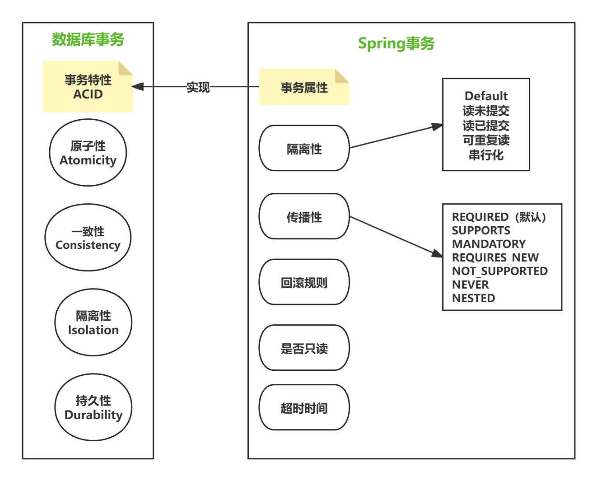
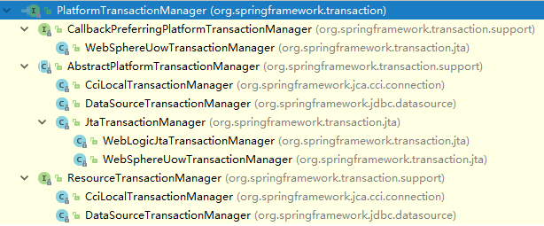
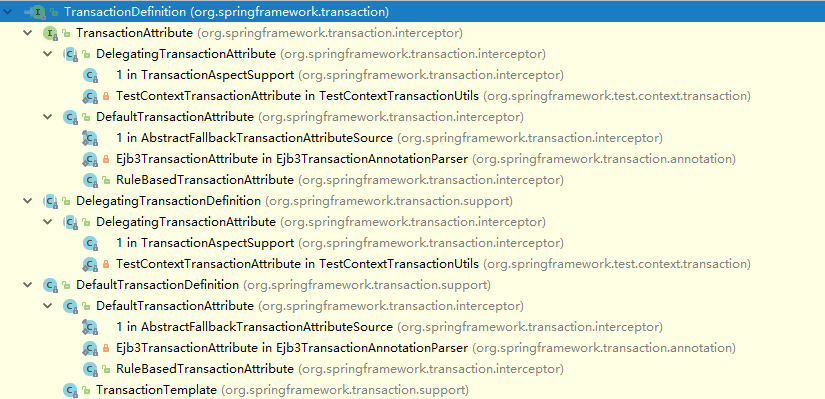
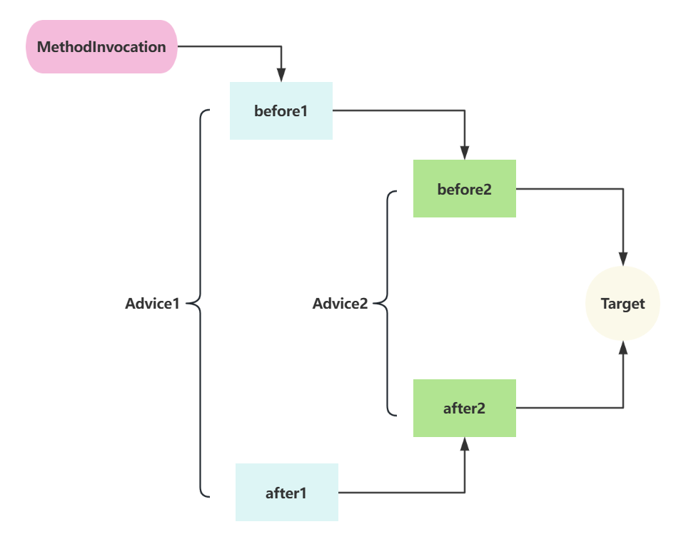
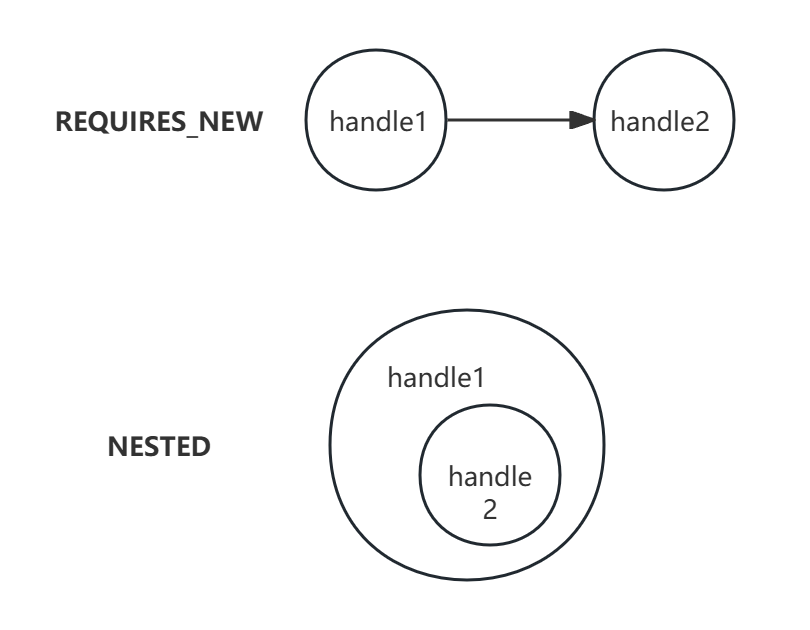
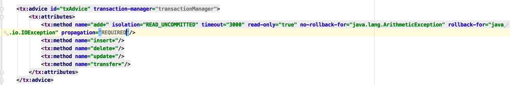
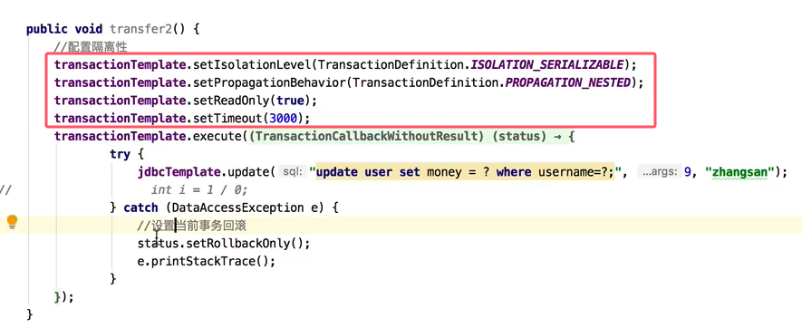
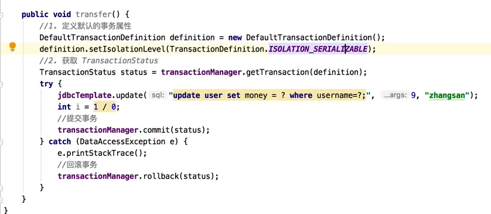

[仙可-B站视频](https://www.bilibili.com/video/BV1FnR9YhEwH/?spm_id_from=333.1387.upload.video_card.click&vd_source=104c235925b0c6eba43f5d550810fd21)

## 1. 什么是事务

我们常说的事务，一般指的就是数据库事务

数据库事务是指  一个逻辑工作单元中执行的一系列（数据库）操作，要么一起成功，要么一起失败

（当工作单元中的所以操作全部正确完成时，工作单元里的操作才会生效。如果检测到一个错误，程序执行回滚操作，恢复程序原状。即要么都执行要么都不执行）

（逻辑工作单元就是一个不可分割的操作序列，操作序列就是一系列的数据库操作）

Spring的事务是对数据库的事务的封装，最后本质的实现还是在数据库，假如数据库不支持事务的话，Spring的事务是没有作用的。

数据库的事务有开启、执行（数据库操作）、提交、回滚，还有个关闭是数据库连接操作

### ACID

事务四大特性：

- **原子性 Atomicity：** 一个事务中的所有操作，要么全部完成，要么全部不完成。事务在执行过程中发生错误，会被回滚到事务开始前的状态（在化学中原子是最小单元，“原子性”借鉴了原子不可分割的特性，故名原子性）
- **一致性 Consistency：**一个事务执行后，数据库的数据必须符合所有的要求（一致性是事务的最终目标，原子性、隔离性和持久性是实现一致性的手段）
- **隔离性 Isolation：** 数据库允许多个并发事务同时对其数据进行读写和修改，防止并发条件下 出现数据不一致的情况（mysql 的默认隔离级别是可重复读，一个事务中无论读多少次，读到的数据都不会发生变化）
- **持久性 Durability:**  事务处理结束后，对数据的修改就是永久的，即便系统故障也不会丢失（只要不对他额外进行删除和修改，这个数据永远不会变化）

**记住以上事务的四大特性，是事务的本质特征和最终目标，不是实现方式。**

**事务属性是实现事务四大特性的重要组成部分**



## 2. Spring 中的事务

### 2.1. 两种用法

Spring 支持两种类型的事务，声明式事务和编程式事务。

编程式事务类似于 jdbc 事务的写法，需要将事务的代码嵌入到业务逻辑中，代码的耦合度较高

声明式事务通过 AOP 的思想，将事务和业务逻辑代码解耦（基于@Transactional 注解 或 基于 XML 配置）

### 2.2. 三大基础设施（了解）

Spring 中对事务的支持提供了三大基础设施

1. **PlatformTransactionManager**
2. **TransactionDefinition**
3. **TransactionStatus**

这三个核心类是 Spring 处理事务的核心类。

#### PlatformTransactionManager

PlatformTransactionManager 是事务处理的核心，它有诸多的实现类：



```java
public interface PlatformTransactionManager {
    TransactionStatus getTransaction(@Nullable TransactionDefinition definition);
    void commit(TransactionStatus status) throws TransactionException;
    void rollback(TransactionStatus status) throws TransactionException;
}
```

可以看到 `PlatformTransactionManager `中定义了基本的事务操作方法，这些事务操作方法都是平台无关的，具体的实现都是由不同的子类来实现的。`PlatformTransactionManager` 中主要有如下三个方法：

1. **getTransaction()**
   getTransaction() 是根据传入的 TransactionDefinition 获取一个事务对象，TransactionDefinition 中定义了一些事务的基本规则，例如传播性、隔离级别等。
2. **commit()**
   commit() 方法用来提交事务。
3. **rollback()**
   rollback() 方法用来回滚事务。

#### TransactionDefinition

用来描述事务的具体规则，也称作事务的属性。事务的属性：

1. 隔离性
2. 传播性
3. 回滚规则
4. 超时时间
5. 是否只读

`TransactionDefinition` 类中的方法如下：

1. getIsolationLevel()，获取事务的隔离级别
2. getName()，获取事务的名称
3. getPropagationBehavior()，获取事务的传播性
4. getTimeout()，获取事务的超时时间
5. isReadOnly()，获取事务是否是只读事务

如果开发者使用了编程式事务的话，直接使用 `DefaultTransactionDefinition` 即可



#### TransactionStatus

TransactionStatus 可以直接理解为事务本身，该接口源码如下：

```java
public interface TransactionStatus extends SavepointManager, Flushable {
    boolean isNewTransaction();
    boolean hasSavepoint();
    void setRollbackOnly();
    boolean isRollbackOnly();
    void flush();
    boolean isCompleted();
}
```

1. isNewTransaction() 方法获取当前事务是否是一个新事务。
2. hasSavepoint() 方法判断是否存在 savePoint()。
3. setRollbackOnly() 方法设置事务必须回滚。
4. isRollbackOnly() 方法获取事务只能回滚。
5. flush() 方法将底层会话中的修改刷新到数据库，一般用于 Hibernate/JPA 的会话，对如 JDBC 类型的事务无任何影响。
6. isCompleted() 方法用来获取是一个事务是否结束。

**这就是 Spring 中支持事务的三大基础设施**

## 3. 编程式事务

通过 `PlatformTransactionManager `或者 `TransactionTemplate `可以实现编程式事务

在 **Spring Boot 项目中，这两个对象 Spring Boot 会自动提供**，我们直接使用即可

但是如果是在**传统的 SSM 项目**中，则需要我们通过配置来提供这两个对象，**下面是一个简单的配置参考：**

```xml
<bean class="org.springframework.jdbc.datasource.DriverManagerDataSource" id="dataSource">
  <property name="driverClassName" value="com.mysql.cj.jdbc.Driver"/>
  <property name="url" value="jdbc:mysql:///spring_tran?serverTimezone=Asia/Shanghai"/>
  <property name="username" value="root"/>
  <property name="password" value="123"/>
</bean>
<bean class="org.springframework.jdbc.datasource.DataSourceTransactionManager" id="transactionManager">
  <property name="dataSource" ref="dataSource"/>
</bean>
<bean class="org.springframework.transaction.support.TransactionTemplate" id="transactionTemplate">
  <property name="transactionManager" ref="transactionManager"/>
</bean>
<bean class="org.springframework.jdbc.core.JdbcTemplate" id="jdbcTemplate">
  <property name="dataSource" ref="dataSource"/>
</bean>
```

```java
@Service
public class TransferService {
    @Autowired
    JdbcTemplate jdbcTemplate;
    @Autowired
    PlatformTransactionManager txManager;

    public void transfer() {
        DefaultTransactionDefinition definition = new DefaultTransactionDefinition();
        TransactionStatus status = txManager.getTransaction(definition);
        try {
            jdbcTemplate.update("update user set account=account+100 where username='zhangsan'");
            int i = 1 / 0;
            jdbcTemplate.update("update user set account=account-100 where username='lisi'");
            txManager.commit(status);
        } catch (DataAccessException e) {
            e.printStackTrace();
            txManager.rollback(status);
        }
    }
}
```

在 `try...catch...` 中进行业务操作，没问题就 commit，有问题就 rollback；如果我们需要配置事务的隔离性、传播性等，可以在 DefaultTransactionDefinition 对象中进行配置

```java
import com.waves.task.dao.TaskCopyDao;
import com.waves.task.domain.entity.TaskCopy;
import org.springframework.dao.DataAccessException;
import org.springframework.stereotype.Service;
import org.springframework.transaction.TransactionStatus;
import org.springframework.transaction.annotation.Transactional;
import org.springframework.transaction.support.TransactionCallbackWithoutResult;
import org.springframework.transaction.support.TransactionSynchronizationManager;
import org.springframework.transaction.support.TransactionTemplate;
import javax.annotation.Resource;
import java.util.concurrent.CompletableFuture;

/**
 * 编程式事务
 */
@Service
public class TxDService {

    @Resource
    private TaskCopyDao taskCopyDao;

    @Resource
    TransactionTemplate transactionTemplate;

    public void handle4(Integer id) {
        TaskCopy taskCopy = taskCopyDao.getById(id);
        taskCopy.setDescription("DService描述");
        transactionTemplate.execute(new TransactionCallbackWithoutResult() {
            @Override
            protected void doInTransactionWithoutResult(TransactionStatus status) {
                try {
                    taskCopyDao.updateById(taskCopy);
                    if (1 == 1) {
                        throw new RuntimeException();
                    }
                } catch (Exception e) {
                    status.setRollbackOnly();
                    e.printStackTrace();
                }
            }
        });
    }
}
```

直接注入 `TransactionTemplate`，然后在 execute 方法中添加回调写核心的业务即可，当抛出异常时，将当前事务标注为只能回滚即可。注意，execute 方法中，如果不需要获取事务执行的结果，则直接使用 TransactionCallbackWithoutResult 类即可，如果要获取事务执行结果，则使用 TransactionCallback 即可。

编程式事务由于代码入侵太严重了，因为在实际开发中使用的很少，我们在项目中更多的是使用声明式事务。

但声明式事务很容易不生效，有一些情况不得不使用编程式事务

```java
import com.waves.task.dao.TaskCopyDao;
import com.waves.task.domain.entity.TaskCopy;
import org.springframework.dao.DataAccessException;
import org.springframework.stereotype.Service;
import org.springframework.transaction.TransactionStatus;
import org.springframework.transaction.annotation.Transactional;
import org.springframework.transaction.support.TransactionCallbackWithoutResult;
import org.springframework.transaction.support.TransactionSynchronizationManager;
import org.springframework.transaction.support.TransactionTemplate;

import javax.annotation.Resource;
import java.util.concurrent.CompletableFuture;

/**
 * 编程式事务
 */
@Service
public class TxDService {

    @Resource
    private TaskCopyDao taskCopyDao;

    @Resource
    TransactionTemplate transactionTemplate;

    public void handle4(Integer id) {
        TaskCopy taskCopy = taskCopyDao.getById(id);
        taskCopy.setDescription("DService描述");
        transactionTemplate.execute(new TransactionCallbackWithoutResult() {
            @Override
            protected void doInTransactionWithoutResult(TransactionStatus status) {
                try {
                    taskCopyDao.updateById(taskCopy);
                    method01(id);
                } catch (Exception e) {
                    status.setRollbackOnly();
                    e.printStackTrace();
                }
            }
        });
    }

    public void method01(Integer id) {
        TaskCopy taskCopy = taskCopyDao.getById(id + 1);
        taskCopy.setDescription("DService描述");
        taskCopyDao.updateById(taskCopy);
        if (1 == 1) {
            throw new RuntimeException();
        }
    }
}
```

```java
import com.waves.task.dao.TaskCopyDao;
import com.waves.task.domain.entity.TaskCopy;
import org.springframework.dao.DataAccessException;
import org.springframework.stereotype.Service;
import org.springframework.transaction.TransactionStatus;
import org.springframework.transaction.annotation.Transactional;
import org.springframework.transaction.support.TransactionCallbackWithoutResult;
import org.springframework.transaction.support.TransactionSynchronizationManager;
import org.springframework.transaction.support.TransactionTemplate;

import javax.annotation.Resource;
import java.util.concurrent.CompletableFuture;

/**
 * 编程式事务
 */
@Service
public class TxDService {

    @Resource
    private TaskCopyDao taskCopyDao;

    @Resource
    TransactionTemplate transactionTemplate;

    public void testPrivate(Integer id){
        handle4(id);
    }

    private void handle4(Integer id) {
        TaskCopy taskCopy = taskCopyDao.getById(id);
        taskCopy.setDescription("DService描述");
        transactionTemplate.execute(new TransactionCallbackWithoutResult() {
            @Override
            protected void doInTransactionWithoutResult(TransactionStatus status) {
                try {
                    taskCopyDao.updateById(taskCopy);
                    if (1 == 1) {
                        throw new RuntimeException();
                    }
                } catch (Exception e) {
                    status.setRollbackOnly();
                    e.printStackTrace();
                }
            }
        });
    }


}
```

## 4. 声明式事务

声明式事务如果使用 `XML` 配置，可以做到无侵入；如果使用 `Java` 配置，也只有一个 `@Transactional` 注解侵入而已，相对来说非常容易

**以下部分配置针对传统 SSM 项目（因为在 Spring Boot 项目中，事务相关的组件已经配置好了）**

### 4.1. 底层实现

1.当目标类被Spring管理时，Spring 会为目标对象创建一个代理对象。代理对象负责拦截目标方法的调用，并在必要时应用事务管理

2.代理对象内部包含一个事务拦截器TransactionInterceptor，负责处理事务相关的逻辑

3.事务拦截器会检查方法上是否添加了@Transactional注解，来决定是否应用事务

4.事务拦截器在目标方法执行前后应用事务通知。在方法执行前，事务拦截器启动事务；在方法执行后，根据方法的执行结果决定事务的提交或回滚

（事务拦截器还负责处理事务的传播行为）

如果想更深入了解@Transactional，建议最好先了解一下 AOP



### 4.2. XML 配置（了解）

XML 配置声明式事务分为三个步骤，如下：

1. 配置事务管理器

```xml
<bean class="org.springframework.jdbc.datasource.DriverManagerDataSource" id="dataSource">
  <property name="driverClassName" value="com.mysql.cj.jdbc.Driver"/>
  <property name="url" value="jdbc:mysql:///spring_tran?serverTimezone=Asia/Shanghai"/>
  <property name="username" value="root"/>
  <property name="password" value="123"/>
</bean>
<bean class="org.springframework.jdbc.datasource.DataSourceTransactionManager" id="transactionManager">
  <property name="dataSource" ref="dataSource"/>
</bean>
```

1. 配置事务通知

```xml
<tx:advice transaction-manager="transactionManager" id="txAdvice">
  <tx:attributes>
    <tx:method name="m3"/>
    <tx:method name="m4"/>
  </tx:attributes>
</tx:advice>
// 定义了一个名为 txAdvice 的事务通知，它将应用于所有名为 m3 和 m4 的方法
```

1. 配置 AOP

```xml
<aop:config>
  <aop:pointcut id="pc1" expression="execution(* org.javaboy.demo.*.*(..))"/>
  <aop:advisor advice-ref="txAdvice" pointcut-ref="pc1"/>
</aop:config>
```

- 定义一个切点，切点表达式会匹配 org.javaboy.demo 包下所有类的所有方法的执行
- 定义一个通知器（advisor）。通知器将一个通知（txAdvice）和一个切点（pc1）绑定在一起


第二步和第三步中定义出来的方法交集，就是我们要添加事务的方法。

（如果 org.javaboy.demo 包下的某个类有 m3 或 m4 方法，这些方法将会受到事务管理。 此外，org.javaboy.demo 包下所有其他方法（即使不是 m3 或 m4）也会应用 txAdvice 的默认事务属性，即使在<tx:advice>里面没有明确配置的方法）


配置完成后，如下方法就自动具备事务了：

```java
public class UserService {
    public void m3(){
        jdbcTemplate.update("update user set money=997 where username=?", "zhangsan");
    }
}
```

### 4.3. Java 配置

这里要配置的东西其实和 XML 中配置的都差不多，最最关键的就两个：

- 事务管理器 PlatformTransactionManager
- @EnableTransactionManagement 注解开启事务支持

```java
@Configuration
@ComponentScan
//开启事务注解支持
@EnableTransactionManagement
public class JavaConfig {
    @Bean
    DataSource dataSource() {
        DriverManagerDataSource ds = new DriverManagerDataSource();
        ds.setPassword("123");
        ds.setUsername("root");
        ds.setUrl("jdbc:mysql:///test01?serverTimezone=Asia/Shanghai");
        ds.setDriverClassName("com.mysql.cj.jdbc.Driver");
        return ds;
    }

    @Bean
    JdbcTemplate jdbcTemplate(DataSource dataSource) {
        return new JdbcTemplate(dataSource);
    }

    @Bean
    PlatformTransactionManager transactionManager() {
        return new DataSourceTransactionManager(dataSource());
    }
}
```

配置完成后，添加 `@Transactional` 注解即可，当`@Transactional` 注解加在类上面的时候，表示该类的所有方法都有事务，该注解加在方法上面的时候，表示该方法有事务

```java
@Transactional(noRollbackFor = ArithmeticException.class)
public void update4() {
    jdbcTemplate.update("update account set money = ? where username=?;", 998, "lisi");
    int i = 1 / 0;
}
```

### 4.4. 混合配置（了解）

也可以 Java 代码和 XML 混合配置来实现声明式事务，一部分配置用 XML 来实现，一部分配置用 Java 代码来实现：

在 XML 配置中配置事务管理器：

```xml
<?xml version="1.0" encoding="UTF-8"?>
<beans xmlns="http://www.springframework.org/schema/beans"
  xmlns:xsi="http://www.w3.org/2001/XMLSchema-instance"
  xmlns:tx="http://www.springframework.org/schema/tx"
  xsi:schemaLocation="http://www.springframework.org/schema/beans http://www.springframework.org/schema/beans/spring-beans.xsd   http://www.springframework.org/schema/tx http://www.springframework.org/schema/tx/spring-tx.xsd">

  <!--
  开启事务的注解配置，添加了这个配置，就可以直接在代码中通过 @Transactional 注解来开启事务了
  -->
  <tx:annotation-driven />

</beans>
@Configuration
@ComponentScan
@ImportResource(locations = "classpath:applicationContext3.xml")
public class JavaConfig {
    @Bean
    DataSource dataSource() {
        DriverManagerDataSource ds = new DriverManagerDataSource();
        ds.setPassword("123");
        ds.setUsername("root");
        ds.setUrl("jdbc:mysql:///test01?serverTimezone=Asia/Shanghai");
        ds.setDriverClassName("com.mysql.cj.jdbc.Driver");
        return ds;
    }

    @Bean
    JdbcTemplate jdbcTemplate(DataSource dataSource) {
        return new JdbcTemplate(dataSource);
    }

    @Bean
    PlatformTransactionManager transactionManager() {
        return new DataSourceTransactionManager(dataSource());
    }
}
```

Java 配置中通过 @ImportResource 注解导入了 XML 配置，XML 配置中的内容就是开启 `@Transactional` 注解的支持，所以 Java 配置中省略了 @EnableTransactionManagement 注解。

### 4.5. 事务失效

1. **类的自调用**，如果我们不通过代理对象来调用，那代理对象内部的事务拦截器就不会拦截到这次行为，行为都没有获取到怎么可能对他应用事务
2. **在私有方法上**，添加 @Transactional 注解也不会生效，Spring 的事务管理是基于 AOP实现的，AOP 代理无法拦截 目标对象内部的私有方法调用
3. **使用了多线程**，在主线程中开启的事务不会自动传播到其创建并执行的子线程中
4. 事务回滚必须要有运行时异常，如果被**捕获**了自然也不会生效了
5. 使用了一些可以脱离当前线程的传播性行为，如REQUIRES_NEW和NOT_SUPPORTED

## 5. Spring 事务属性


常用的五种事务属性，分别是隔离性、传播性、回滚规则、是否只读、超时时间

我们说的事务属性，通常指的是 Spring 事务属性

| 事务属性 | 数据库事务                                                   | Spring 事务                        |
| -------- | ------------------------------------------------------------ | ---------------------------------- |
| 隔离性   | 四种事务隔离级别                                             | 五种事务隔离级别（多一个 Default） |
| 传播性   | 没有传播性概念                                               | Spring 事务管理属性                |
| 回滚规则 | 没有细粒度、可配置的“回滚规则"（有内置的错误处理机制触发回滚） | Spring 事务管理属性                |
| 是否只读 | 由数据库引擎自身实现                                         | Spring 事务管理属性                |
| 超时时间 | 设置数据库系统参数 控制超时时间                              | Spring 事务管理属性                |

### 5.1. 隔离性

事务特性的隔离性是最终目的，事务属性的隔离性则是真正的实现方式，比如四种隔离级别就代表有四种隔离性的实现方式

#### 隔离级别

事务属性的隔离性就是隔离级别

MySQL 中有四种不同的隔离级别  Spring 中默认的事务隔离级别是 default，即数据库本身的隔离级别是啥就是啥

- **Isolation.DEFAULT：默认的事务隔离级别，以连接的数据库的事务隔离级别为准**
- Isolation.READ_UNCOMMITTED：读未提交，可以读取到未提交的事务，存在脏读
- Isolation.READ_COMMITTED：读已提交，只能读取到已经提交的事务，解决了脏读，存在不可重复读
- Isolation.REPEATABLE_READ：可重复读，解决了不可重复读，但存在幻读（MySQL 数据库默认的事务隔离级别）
- Isolation.SERIALIZABLE：串行化，可以解决所有并发问题，但性能太低

**编程式事务设置隔离级别：**

如果是编程式事务，通过如下方式修改事务的隔离级别（TransactionDefinition 中定义了各种隔离级别）

```java
public void update2() {
    //创建事务的默认配置
    DefaultTransactionDefinition definition = new DefaultTransactionDefinition();
    definition.setIsolationLevel(TransactionDefinition.ISOLATION_SERIALIZABLE);
    TransactionStatus status = platformTransactionManager.getTransaction(definition);
    try {
        jdbcTemplate.update("update account set money = ? where username=?;", 999, "zhangsan");
        int i = 1 / 0;
        //提交事务
        platformTransactionManager.commit(status);
    } catch (DataAccessException e) {
        e.printStackTrace();
        //回滚
        platformTransactionManager.rollback(status);
    }
}
```

声明式事务设置隔离级别：

如果是声明式事务通过如下方式修改隔离级别：

```xml
<tx:advice id="txAdvice" transaction-manager="transactionManager">
  <tx:attributes>
    <!--以 add 开始的方法，添加事务-->
    <tx:method name="add*"/>
    <tx:method name="insert*" isolation="SERIALIZABLE"/>
  </tx:attributes>
</tx:advice>
```

```java
@Transactional(isolation = Isolation.SERIALIZABLE)
public void update4() {
    jdbcTemplate.update("update account set money = ? where username=?;", 998, "lisi");
    int i = 1 / 0;
}
```

### 5.2. 传播性

事务传播行为是为了解决业务层方法之间互相调用的事务问题，当一个事务方法被另一个事务方法调用时（即 A 方法调用 B 方法）

当方法之间互相调用，事务会以何种状态存在，这些规则就涉及到事务的传播性

三条规则来定义这7种传播性：

① 创建新事务还是加入当前事务

② 多个事务并存的时候是否会互相影响

③ 有事务抛异常、还是没事务抛异常

```java
public enum Propagation {
    REQUIRED(TransactionDefinition.PROPAGATION_REQUIRED),
    SUPPORTS(TransactionDefinition.PROPAGATION_SUPPORTS),
    MANDATORY(TransactionDefinition.PROPAGATION_MANDATORY),
    REQUIRES_NEW(TransactionDefinition.PROPAGATION_REQUIRES_NEW),
    NOT_SUPPORTED(TransactionDefinition.PROPAGATION_NOT_SUPPORTED),
    NEVER(TransactionDefinition.PROPAGATION_NEVER),
    NESTED(TransactionDefinition.PROPAGATION_NESTED);
    private final int value;
    Propagation(int value) { this.value = value; }
    public int value() { return this.value; }
}
```

| 传播性           | 描述                                                         |
| ---------------- | ------------------------------------------------------------ |
| REQUIRED（默认） | 如果当前存在事务，则加入该事务；如果当前没有事务，则创建一个新的事务 |
| SUPPORTS         | 如果当前存在事务，则加入该事务；如果当前没有事务，则以非事务的方式继续运行 |
| MANDATORY        | 如果当前存在事务，则加入该事务；如果当前没有事务，则抛出异常 |
| REQUIRES_NEW     | 创建一个新的事务，如果当前存在事务，则把当前事务挂起（脱离当前事务的影响） |
| NOT_SUPPORTED    | 以非事务方式运行，如果当前存在事务，则把当前事务挂起（脱离当前事务的影响） |
| NEVER            | 以非事务方式运行，如果当前存在事务，则抛出异常               |
| NESTED           | 如果当前存在事务，则创建一个事务作为当前事务的嵌套事务来运行；如果当前没有事务，就创建一个新的事务 |

```java
public void update2() {
    //创建事务的默认配置
    DefaultTransactionDefinition definition = new DefaultTransactionDefinition();
    definition.setIsolationLevel(TransactionDefinition.ISOLATION_SERIALIZABLE);
    definition.setPropagationBehavior(TransactionDefinition.PROPAGATION_REQUIRED);
    TransactionStatus status = platformTransactionManager.getTransaction(definition);
    try {
        jdbcTemplate.update("update account set money = ? where username=?;", 999, "zhangsan");
        int i = 1 / 0;
        //提交事务
        platformTransactionManager.commit(status);
    } catch (DataAccessException e) {
        e.printStackTrace();
        //回滚
        platformTransactionManager.rollback(status);
    }
}
<tx:advice id="txAdvice" transaction-manager="transactionManager">
  <tx:attributes>
    <!--以 add 开始的方法，添加事务-->
    <tx:method name="add*"/>
    <tx:method name="insert*" isolation="SERIALIZABLE" propagation="REQUIRED"/>
  </tx:attributes>
</tx:advice>
@Transactional(noRollbackFor = ArithmeticException.class,propagation = Propagation.REQUIRED)
public void update4() {
    jdbcTemplate.update("update account set money = ? where username=?;", 998, "lisi");
    int i = 1 / 0;
}
```

#### REQUIRED

REQUIRED 表示如果当前存在事务，则加入该事务；如果当前没有事务，则创建一个新的事务。

```java


import com.waves.task.dao.TaskCopyDao;
import com.waves.task.domain.entity.TaskCopy;
import org.springframework.stereotype.Service;
import org.springframework.transaction.annotation.Transactional;
import org.springframework.transaction.support.TransactionSynchronizationManager;

import javax.annotation.Resource;

@Service
public class TxAService {

    @Resource
    private TxBService bService;

    @Resource
    private TaskCopyDao taskCopyDao;

    @Transactional
    public void handle1(Integer id) {
        TaskCopy taskCopy = taskCopyDao.getById(id);
        taskCopy.setDescription("AService描述");
        taskCopyDao.updateById(taskCopy);
        String name = TransactionSynchronizationManager.getCurrentTransactionName();
        System.out.println("handle1加入的事务名称："+name);
        // 调用BService方法
        bService.handle2(id);
        if (1 == 1) {
            throw new RuntimeException();
        }
    }
}


import com.waves.task.dao.TaskCopyDao;
import com.waves.task.domain.entity.TaskCopy;
import org.springframework.stereotype.Service;
import org.springframework.transaction.support.TransactionSynchronizationManager;

import javax.annotation.Resource;

@Service
public class TxBService {

    @Resource
    private TaskCopyDao taskCopyDao;

    public void handle2(Integer id) {
        TaskCopy taskCopy = taskCopyDao.getById(id+1);
        taskCopy.setDescription("BService描述");
        taskCopyDao.updateById(taskCopy);
        String name = TransactionSynchronizationManager.getCurrentTransactionName();
        System.out.println("handle2加入的事务名称："+name);
        if (1==1) {
//            throw new RuntimeException();
        }
    }
}
```

解释：

1. 如果 handle1 方法本身是有事务的，则 handle2 方法就会加入到 handle1 方法所在的事务中，这样两个方法将处于同一个事务中，一起成功或者一起失败
2. 如果 handle1 方法本身是没有事务的，则 handle2 方法就会自己开启一个新的事务。

#### REQUIRES_NEW

REQUIRES_NEW 表示**强制**创建一个新的事务，如果当前存在事务，则把**当前事务挂起**。

（挂起：意味着脱离当前事务的影响）

```java
import com.waves.task.dao.TaskCopyDao;
import com.waves.task.domain.entity.TaskCopy;
import org.springframework.stereotype.Service;
import org.springframework.transaction.annotation.Transactional;
import org.springframework.transaction.support.TransactionSynchronizationManager;

import javax.annotation.Resource;

@Service
public class TxAService {

    @Resource
    private TxBService bService;

    @Resource
    private TaskCopyDao taskCopyDao;

    @Transactional
    public void handle1(Integer id) {
        TaskCopy taskCopy = taskCopyDao.getById(id);
        taskCopy.setDescription("AService描述");
        taskCopyDao.updateById(taskCopy);
        String name = TransactionSynchronizationManager.getCurrentTransactionName();
        System.out.println("handle1加入的事务名称："+name);
        // 调用BService方法
        bService.handle2(id);
        if (1 == 1) {
            throw new RuntimeException();
        }
    }
}


import com.waves.task.dao.TaskCopyDao;
import com.waves.task.domain.entity.TaskCopy;
import org.springframework.stereotype.Service;
import org.springframework.transaction.annotation.Propagation;
import org.springframework.transaction.annotation.Transactional;
import org.springframework.transaction.support.TransactionSynchronizationManager;

import javax.annotation.Resource;

@Service
public class TxBService {

    @Resource
    private TaskCopyDao taskCopyDao;

    @Transactional(propagation = Propagation.REQUIRES_NEW)
    public void handle2(Integer id) {
        TaskCopy taskCopy = taskCopyDao.getById(id+1);
        taskCopy.setDescription("BService描述");
        taskCopyDao.updateById(taskCopy);
        String name = TransactionSynchronizationManager.getCurrentTransactionName();
        System.out.println("handle2加入的事务名称："+name);
        if (1==1) {
//            throw new RuntimeException();
        }
    }
}
```

handle1无论报不报错，都不会影响到handle2。但是反过来就不行了，如果handle2报错，他就会把错误往上抛，handle1就会拿到报错就会回滚

（这种传播性适合那种，有一个方法很大概率会出现报错，但是又不想影响其他方法正常执行就可以用这种）

#### NESTED

NESTED 表示如果当前存在事务，则创建一个事务作为当前事务的嵌套事务来运行；如果当前没有事务，就会创建一个新的事务

```java
import com.waves.task.dao.TaskCopyDao;
import com.waves.task.domain.entity.TaskCopy;
import org.springframework.stereotype.Service;
import org.springframework.transaction.annotation.Transactional;
import org.springframework.transaction.support.TransactionSynchronizationManager;

import javax.annotation.Resource;

@Service
public class TxAService {

    @Resource
    private TxBService bService;

    @Resource
    private TaskCopyDao taskCopyDao;

    @Transactional
    public void handle1(Integer id) {
        TaskCopy taskCopy = taskCopyDao.getById(id);
        taskCopy.setDescription("AService描述");
        taskCopyDao.updateById(taskCopy);
        String name = TransactionSynchronizationManager.getCurrentTransactionName();
        System.out.println("handle1加入的事务名称："+name);
        // 调用BService方法
        bService.handle2(id);
        if (1 == 1) {
            throw new RuntimeException();
        }
    }
}


import com.waves.task.dao.TaskCopyDao;
import com.waves.task.domain.entity.TaskCopy;
import org.springframework.stereotype.Service;
import org.springframework.transaction.annotation.Propagation;
import org.springframework.transaction.annotation.Transactional;
import org.springframework.transaction.support.TransactionSynchronizationManager;

import javax.annotation.Resource;

@Service
public class TxBService {

    @Resource
    private TaskCopyDao taskCopyDao;

    @Transactional(propagation = Propagation.NESTED)
    public void handle2(Integer id) {
        TaskCopy taskCopy = taskCopyDao.getById(id+1);
        taskCopy.setDescription("BService描述");
        taskCopyDao.updateById(taskCopy);
        String name = TransactionSynchronizationManager.getCurrentTransactionName();
        System.out.println("handle2加入的事务名称："+name);
        if (1==1) {
//            throw new RuntimeException();
        }
    }
}
```

handle1 有事务报错，handle2创建的嵌套事务也会报错回滚。反过来handle2 报错回滚，只要把嵌套事务的报错捕获了，handle1 就不会回滚


REQUIRES_NEW 和NESTED 有点像，都是会创建两个事务，REQUIRES_NEW 是创建一个新的事物，脱离当前事务，而NESTED 是在新的事务中嵌套一个



#### MANDATORY

MANDATORY 表示如果当前存在事务，则加入该事务；如果当前没有事务，则抛出异常

```java
import com.waves.task.dao.TaskCopyDao;
import com.waves.task.domain.entity.TaskCopy;
import org.springframework.stereotype.Service;
import org.springframework.transaction.support.TransactionSynchronizationManager;

import javax.annotation.Resource;

@Service
public class TxAService {

    @Resource
    private TxBService bService;

    @Resource
    private TaskCopyDao taskCopyDao;

    public void handle1(Integer id) {
        TaskCopy taskCopy = taskCopyDao.getById(id);
        taskCopy.setDescription("AService描述");
        taskCopyDao.updateById(taskCopy);
        String name = TransactionSynchronizationManager.getCurrentTransactionName();
        System.out.println("handle1加入的事务名称："+name);
        // 调用BService方法
        bService.handle2(id);
        if (1 == 1) {
            //            throw new RuntimeException();
        }
    }
}


import com.waves.task.dao.TaskCopyDao;
import com.waves.task.domain.entity.TaskCopy;
import org.springframework.stereotype.Service;
import org.springframework.transaction.annotation.Propagation;
import org.springframework.transaction.annotation.Transactional;
import org.springframework.transaction.support.TransactionSynchronizationManager;

import javax.annotation.Resource;

@Service
public class TxBService {

    @Resource
    private TaskCopyDao taskCopyDao;

    @Transactional(propagation = Propagation.MANDATORY)
    public void handle2(Integer id) {
        TaskCopy taskCopy = taskCopyDao.getById(id+1);
        taskCopy.setDescription("BService描述");
        taskCopyDao.updateById(taskCopy);
        String name = TransactionSynchronizationManager.getCurrentTransactionName();
        System.out.println("handle2加入的事务名称："+name);
        if (1==1) {
            throw new RuntimeException();
        }
    }
}
```

handle1 方法无事务，handle2 方法有事务且传播性为 MANDATORY，那么最终执行时会抛出异常

#### SUPPORTS

SUPPORTS 表示如果当前存在事务，则加入该事务；如果当前没有事务，则以非事务的方式继续运行。

```java
import com.waves.task.dao.TaskCopyDao;
import com.waves.task.domain.entity.TaskCopy;
import org.springframework.stereotype.Service;
import org.springframework.transaction.support.TransactionSynchronizationManager;

import javax.annotation.Resource;

@Service
public class TxAService {

    @Resource
    private TxBService bService;

    @Resource
    private TaskCopyDao taskCopyDao;

    public void handle1(Integer id) {
        TaskCopy taskCopy = taskCopyDao.getById(id);
        taskCopy.setDescription("AService描述");
        taskCopyDao.updateById(taskCopy);
        String name = TransactionSynchronizationManager.getCurrentTransactionName();
        System.out.println("handle1加入的事务名称："+name);
        // 调用BService方法
        bService.handle2(id);
        if (1 == 1) {
            //            throw new RuntimeException();
        }
    }
}


import com.waves.task.dao.TaskCopyDao;
import com.waves.task.domain.entity.TaskCopy;
import org.springframework.stereotype.Service;
import org.springframework.transaction.annotation.Propagation;
import org.springframework.transaction.annotation.Transactional;
import org.springframework.transaction.support.TransactionSynchronizationManager;

import javax.annotation.Resource;

@Service
public class TxBService {

    @Resource
    private TaskCopyDao taskCopyDao;

    @Transactional(propagation = Propagation.SUPPORTS)
    public void handle2(Integer id) {
        TaskCopy taskCopy = taskCopyDao.getById(id+1);
        taskCopy.setDescription("BService描述");
        taskCopyDao.updateById(taskCopy);
        String name = TransactionSynchronizationManager.getCurrentTransactionName();
        System.out.println("handle2加入的事务名称："+name);
        if (1==1) {
            throw new RuntimeException();
        }
    }
}
```

如果handle1没有加事务，handle2就不会给自己加事务

我们执行这个代码，报了错但是没有回滚。只有handle1加了事务，就会回滚

#### NOT_SUPPORTED

NOT_SUPPORTED 表示以非事务方式运行，如果当前存在事务，则把当前事务挂起。

```java
import com.waves.task.dao.TaskCopyDao;
import com.waves.task.domain.entity.TaskCopy;
import org.springframework.stereotype.Service;
import org.springframework.transaction.annotation.Transactional;
import org.springframework.transaction.support.TransactionSynchronizationManager;

import javax.annotation.Resource;

@Service
public class TxAService {

    @Resource
    private TxBService bService;

    @Resource
    private TaskCopyDao taskCopyDao;

    @Transactional
    public void handle1(Integer id) {
        TaskCopy taskCopy = taskCopyDao.getById(id);
        taskCopy.setDescription("AService描述");
        taskCopyDao.updateById(taskCopy);
        String name = TransactionSynchronizationManager.getCurrentTransactionName();
        System.out.println("handle1加入的事务名称：" + name);
        // 调用BService方法
        bService.handle2(id);
        if (1 == 1) {
            //            throw new RuntimeException();
        }
    }
}


import com.waves.task.dao.TaskCopyDao;
import com.waves.task.domain.entity.TaskCopy;
import org.springframework.stereotype.Service;
import org.springframework.transaction.annotation.Propagation;
import org.springframework.transaction.annotation.Transactional;
import org.springframework.transaction.support.TransactionSynchronizationManager;

import javax.annotation.Resource;

@Service
public class TxBService {

    @Resource
    private TaskCopyDao taskCopyDao;

    @Transactional(propagation = Propagation.NOT_SUPPORTED)
    public void handle2(Integer id) {
        TaskCopy taskCopy = taskCopyDao.getById(id+1);
        taskCopy.setDescription("BService描述");
        taskCopyDao.updateById(taskCopy);
        String name = TransactionSynchronizationManager.getCurrentTransactionName();
        System.out.println("handle2加入的事务名称："+name);
        if (1==1) {
            throw new RuntimeException();
        }
    }
}
```

handle1无论有没有事务，handle2都不会加入这个事务也不会创建事务，永远以非事务的方式运行

#### NEVER

NEVER 表示以非事务方式运行，如果当前存在事务，则抛出异常。

假设 handle1 方法有事务，handle2 方法也有事务且传播性为 NEVER，那么最终会抛出如下异常：

```
Existing transaction found for transaction marked with propagation 'never'
```

### 5.3. 回滚规则

默认情况下，事务只有遇到运行期异常（RuntimeException 的子类）以及 Error 时才会回滚，在遇到检查型（Checked Exception）异常时不会回滚

例如 发生 IOException 并不会导致事务回滚。如果在发生 IOException 时也能触发事务回滚，可以按照如下方式配置：

```java
@Transactional(rollbackFor = IOException.class)
public void handle2() {
    jdbcTemplate.update("update user set money = ? where username=?;", 1, "zhangsan");
    accountService.handle1();
}
<tx:advice transaction-manager="transactionManager" id="txAdvice">
  <tx:attributes>
    <tx:method name="m3" rollback-for="java.io.IOException"/>
  </tx:attributes>
</tx:advice>
```

我们也可以指定在发生某些异常时不回滚，例如当系统抛出 ArithmeticException 异常并不触发事务回滚，配置方式如下：

```java
@Transactional(noRollbackFor = ArithmeticException.class)
public void handle2() {
    jdbcTemplate.update("update user set money = ? where username=?;", 1, "zhangsan");
    accountService.handle1();
}
<tx:advice transaction-manager="transactionManager" id="txAdvice">
  <tx:attributes>
    <tx:method name="m3" no-rollback-for="java.lang.ArithmeticException"/>
  </tx:attributes>
</tx:advice>
```

### 5.4. 是否只读

一般用在一个业务方法中全部都是查询的代码，没有增删改。作用就是让这些相同的查询可以查到相同的结果。

只要在Transactional注解中添加readOnly = true，就能让这些相同的查询查到相同的结果。

那这个不就是事务隔离级别中的可重复读吗？就算不加readOnly = true不也可以实现这个效果？确实加个Transactional就可以将这些相同的查询添加到一个事务中，利用隔离级别的可重复读也可以做到，但是加了readOnly = true，事务就会知道你这是一个只读事件，就可以获得数据库和驱动的优化，性能就会更好。

当然了解一下就可以了，如果你的方法里，出现了大量的一样的查询，还是比较推荐的

```java
@Transactional(readOnly = true)
<tx:advice transaction-manager="transactionManager" id="txAdvice">
  <tx:attributes>
    <tx:method name="m3" read-only="true"/>
  </tx:attributes>
</tx:advice>
```

### 5.5. 超时时间

超时时间是一个事务允许执行的最长时间，如果超过该时间限制但事务还没有完成，则自动回滚事务

```java
@Transactional(timeout = 10)
<tx:advice transaction-manager="transactionManager" id="txAdvice">
  <tx:attributes>
    <tx:method name="m3" read-only="true" timeout="10"/>
  </tx:attributes>
</tx:advice>
```

在 `TransactionDefinition`中以 int 的值来表示超时时间，其单位是秒，默认值为-1。

### 5.6. Spring事务属性配置方式

propagation：传播行为定义，枚举类型（支持当前事务，不存在则新建）

isolation：隔离级别，对应数据库的隔离级别实现

timeout：超时时间，默认使用数据库的超时，mysql默认的事务等待超时为5分钟

readOnly：是否只读，默认是false

rollbackFor：异常回滚列表，默认的是RuntimeException异常回滚

```java
@Transactional(propagation = Propagation.NESTED,
               isolation = Isolation.READ_COMMITTED,
               timeout = 10,
               readOnly = true,
               rollbackFor = IOException.class)
```






