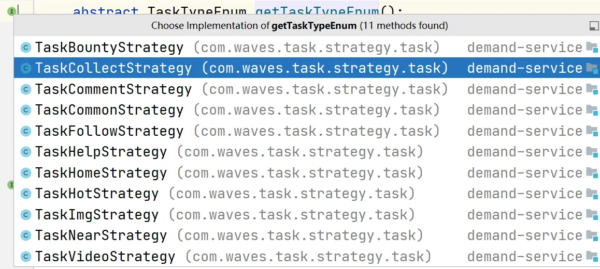
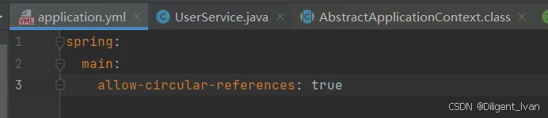

Spring在创需网中的实际应用

[仙可-B站视频](https://www.bilibili.com/video/BV1foPXeJE4P/?spm_id_from=333.1387.upload.video_card.click&vd_source=104c235925b0c6eba43f5d550810fd21)

### Bean 生命周期 

#### 1. 初始化环节 

在我们创需网项目之中，很多地方用到工厂+策略模式。比如任务工厂。

创需网的任务类型有很多，比如赏金、征召、求助、交流、热门等等

我们需要执行什么样策略的任务，就向这个工厂获取什么策略。但是这个工厂的策略我们应该通过什么方式来存储呢？

存在 yml 配置文件？或者存在数据库中？显然这都不是最优解。

我们可以在创建 bean 的时候，就把这些策略直接存在这个任务工厂的集合中。

那么我们在项目接口开发中，就可以根据不同的类型，直接从这个集合中获取对应的策略。



将这 11 种策略，存到STRATEGY_MAP集合中，获取的时候就可以直接 STRATEGY_MAP.get(type)

使用@PostConstruct实现初始化操作：

```java
@PostConstruct
private void init() {
    TaskFactory.register(getTaskTypeEnum().getType(), this);
}
```

任务工厂：

```java
public class TaskFactory {
    private static final Map<Integer, AbstractTaskStrategy> STRATEGY_MAP = new HashMap<>();
    public static void register(Integer markType, AbstractTaskStrategy strategy) {
        STRATEGY_MAP.put(markType, strategy);
    }

    public static AbstractTaskStrategy getStrategyNoNull(Integer type) {
        AbstractTaskStrategy strategy = STRATEGY_MAP.get(type);
        AssertUtil.isNotEmpty(strategy,BusinessErrorEnum.TASK_ERROR.getErrorMsg());
        return strategy;
    }
}
```

#### 2. 循环依赖 

上面我们说到循环依赖，虽然 spring 使用三级缓存，帮助我们**成功创建了 bean 对象，但是启动的时候还是会报错。**

原因是在2.6.0版本后，就默认关闭循环依赖的开关。

其实循环依赖说到底是因为编写代码不规范导致的，为了约束代码规范，于是spring官方默认关闭了开关，但仍然保留开启循环依赖



但是我们项目中，还是**有一些场景用到了循环依赖，除了改配置之外，有什么办法能让项目正常启动呢？**

由于需要互相调用对方的一些方法，在GroupMemberDao 和GroupMemberCache互相依赖注入了彼此。

**在不更改代码的前提，可以加一个`@Lazy` 注解，就是通过延迟对某个 bean  进行依赖注入。等要用的时候，再进行依赖注入。**

（在我们启动过程中，这个 bean 不会依赖注入，自然也就不会出现循环依赖的问题）

一般情况下，我们会选择一些比较简单的对象进行懒加载，因为这样加载起来更快，执行代码的时候也会更快一些

```java
@Service
public class GroupMemberDao extends ServiceImpl<GroupMemberMapper,GroupMember>{
    @Resource
    @Lazy
    private GroupMemberCache groupMemberCache;
    public List<Long>getMemberUidList(Long groupId){
        List<GroupMember>list = LambdaQuery()
            .eq(GroupMember::getGroupId,groupId)
            .select(GroupMember::getUid)
            .list();
        return list.stream().map(GroupMember::getUid).collect(Collectors.tolist());
    }
}
```

### 3. ApplicationContextAware 回调 

在我们项目之中**有一些 util工具包里的类，却没有办法通过`@Autowired` 来依赖注入某个对象**，

**原因在于：**工具类通常被设计成**静态方法**的集合，它们**不应该被实例化**，更不需要被 Spring 管理和注入。

**但是我们需要在工具类中引用怎么办？**比如想要封装 redis 的工具类，就得注入`RedisTemplate`。想要封装多线程的工具类，就得注入`ThreadPoolTaskExecutor`。

这时候就可以**通过实现ApplicationContextAware回调接口**，我们就能获取到这个ApplicationContext，ApplicationContext可以直接获取到创建好的 Bean 对象。

实际上很多开源工具包里已经帮我们实现 了这个功能，就是通过实现ApplicationContextAware里的`setApplicationContext()`获取到`ApplicationContext` 容器，然后获取 `bean` 对象，调用`SpringUtil.getBean(ThreadPoolTaskExecutor.class);`、`SpringUtil.getBean(RedisTemplate.class);`就可以了。

比如hutool的SpringUtil

```java
@Component
public class SpringUtil implements BeanFactoryPostProcessor, ApplicationContextAware {
    private static ConfigurableListableBeanFactory beanFactory;

    private static ApplicationContext applicationContext;
    public SpringUtil() {
    }
    // 存储applicationContext
    public void setApplicationContext(ApplicationContext applicationContext) {
        SpringUtil.applicationContext = applicationContext;
    }
    // 通过applicationContext获取bean对象
    public <T> T getBean(Class<T> clazz) {
        return applicationContext.getBean(clazz);
    }
}
```

