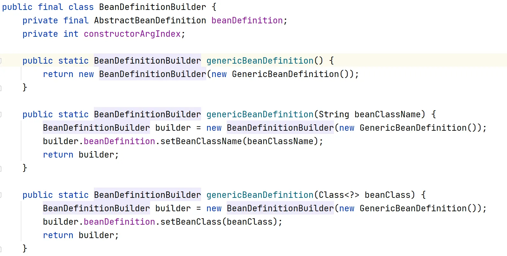
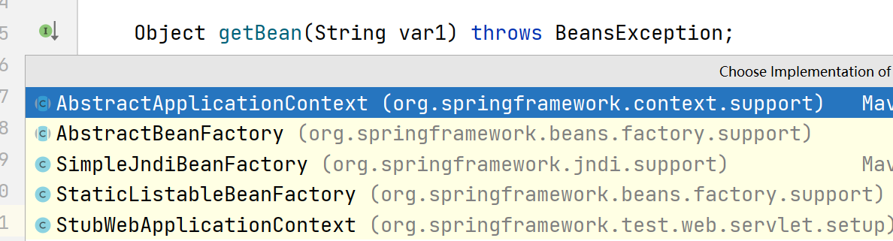
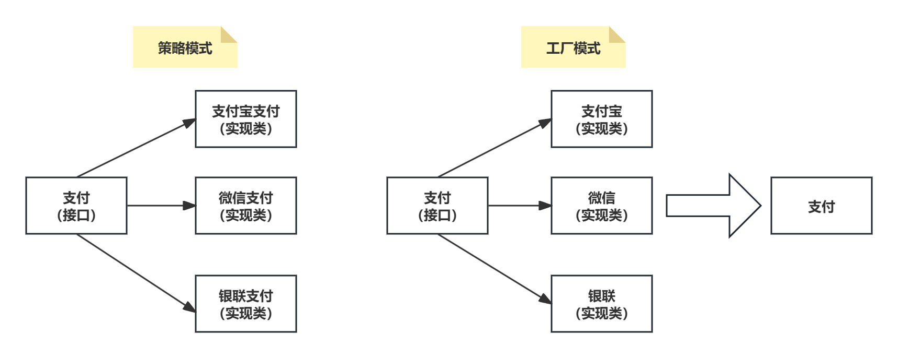
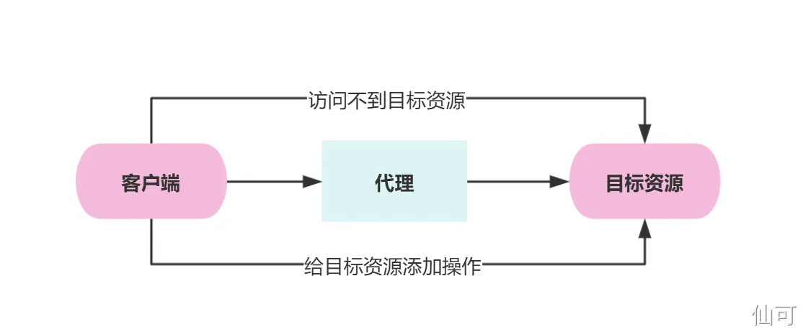
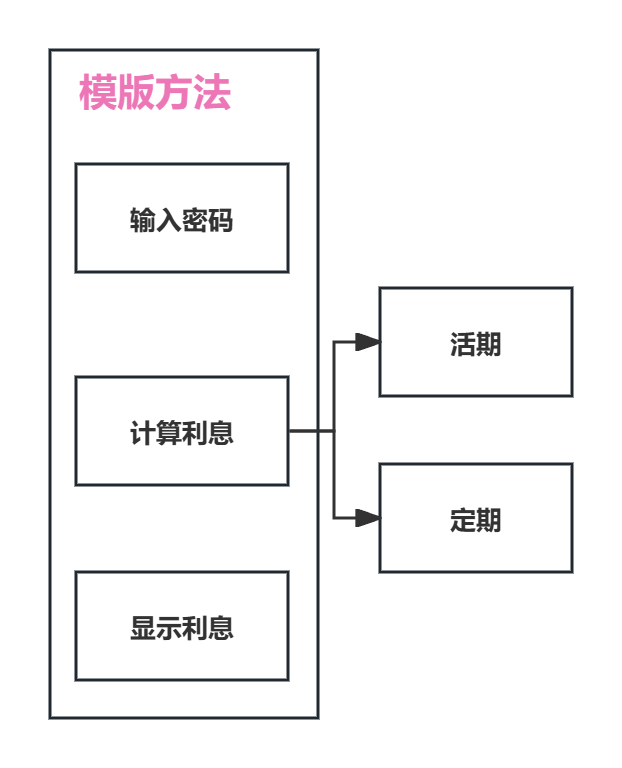

[仙可-B站视频](https://www.bilibili.com/video/BV1UNjVz5ESr/?spm_id_from=333.1387.homepage.video_card.click)


设计模式一共有23种分为三类：

1. 创建型模式5种，用于创建对象；
2. 结构型模式7种，用于处理类或对象的组合；
3. 行为型模式11种，用于描述类或对象怎样交互和分配职责

[设计模式完整文档](https://www.yuque.com/xianer-9khdn/wrs7mp/odtqarg4gvokp3f8)


## 单例模式

基本概念：每个类只有一个实例对象，并提供一个全局访问点来访问这个实例

Spring 概念：在 IoC 容器中，对于单例作用域的 Bean 定义，容器只创建一个实例对象

我们每次从容器中获取bean，只要容器中有就会直接获取，而不是再创建一个。Spring的单例模式更加接近于饿汉模式，就是在容器启动的时候就创建Bean，但只要我们在Bean类上加@Lazy注解，这个Bean就会在第一次访问的时候才会创建

```java
// 饿汉模式
public class Singleton01 {

    private Singleton01(){ }
    // 唯一实例对象
    private static Singleton01 singleton01 = new Singleton01();
    // 全局访问点
    public static Singleton01 getInstance() {
        return singleton01;
    }
}

// 懒汉模式
public class Singleton01 {

    private Singleton01(){ }
    // 唯一实例对象
    private static Singleton01 singleton01;
    // 全局访问点
    public static Singleton01 getInstance() {
        if(singleton01==null){
           singleton01 = new Singleton01();
        }
        return singleton01;
    }
}
@Component
@Lazy // 懒加载
public class MyBean {

    public MyBean() {
        
    }
}
```

## 建造者模式

基本概念：将一个复杂对象的构建与它的展示分离，使得同样的构建过程可以创建不同的展示

在 Spring 中，使用了建造者模式的类一般后缀都是为 Builder，比如 BeanDefinitionBuilder 类用来构建BeanDefinition 对象



```java
public class ChatBuilder {

    public static Room buildRoom(RoomTypeEnum typeEnum) {
        Room room = new Room();
        room.setType(typeEnum.getType());
        room.setHotFlag(HotFlagEnum.NOT.getType());
        return room;
    }

    public static RoomFriend buildFriendRoom(Long roomId, List<Long> uidList) {
        List<Long> collect = uidList.stream().sorted().collect(Collectors.toList());
        RoomFriend roomFriend = new RoomFriend();
        roomFriend.setRoomId(roomId);
        roomFriend.setUid1(collect.get(0));
        roomFriend.setUid2(collect.get(1));
        roomFriend.setRoomKey(generateRoomKey(uidList));
        roomFriend.setStatus(NormalOrNoEnum.NORMAL.getStatus());
        return roomFriend;
    }

    public static RoomGroup buildGroupRoom(User user, Long roomId) {
        RoomGroup roomGroup = new RoomGroup();
        roomGroup.setName(user.getName() + "的群组");
        roomGroup.setAvatar(user.getAvatar());
        roomGroup.setRoomId(roomId);
        return roomGroup;
    }
}
```

## 工厂模式

基本概念：定义一个创建产品（对象）的接口，让产品（对象）的创建延迟到其子类。有了工厂模式，我们就不需要关注产品的创建过程，需要什么产品就告诉工厂什么产品

BeanFactory、ApplicationContext、FactoryBean、ObjectFactory 用的都是工厂模式：

1. BeanFactory、ApplicationContext 就是 IoC 容器，也就是 Bean 工厂，定义了一个`getBean`方法用于获取Bean对象，我们无需知道Bean对象是如何创建的
2. FactoryBean 用来创建复杂 Bean，通过调用 `getObject`方法来获取 FactoryBean 创建的对象，同样无需知道对象的创建细节
3. ObjectFactory 用来延迟获取 Bean，通过调用 `getObject`方法来获取对象，同样无需知道对象的创建细节



我们开发一个支付系统，如果是策略模式，就是创建几个支付的策略类，比如支付宝支付、微信支付、银联支付等。而工厂模式，则是创建3个对象，支付宝、微信和银联。我们获取到指定的对象，自然就能使用他的方法，支付宝总不可能给我提供微信支付的方法吧



```java
// 1. 支付接口 (Payment)
interface Payment {
    void pay(double amount);
}

// 2. 具体支付方式
class AlipayPayment implements Payment {
    private String accountId;

    public AlipayPayment(String accountId) {
        this.accountId = accountId;
    }

    @Override
    public void pay(double amount) {
        System.out.println("Paying " + amount + " using Alipay account: " + accountId);
        //  实际的 Alipay 支付逻辑
    }
}

class WechatPayment implements Payment {
    private String openId;

    public WechatPayment(String openId) {
        this.openId = openId;
    }

    @Override
    public void pay(double amount) {
        System.out.println("Paying " + amount + " using WeChat Pay openId: " + openId);
        //  实际的 WeChat Pay 支付逻辑
    }
}

class UnionPayPayment implements Payment {
    private String cardNumber;

    public UnionPayPayment(String cardNumber) {
        this.cardNumber = cardNumber;
    }

    @Override
    public void pay(double amount) {
        System.out.println("Paying " + amount + " using UnionPay card number: " + cardNumber);
        //  实际的 UnionPay 支付逻辑
    }
}

// 3. 支付工厂 (PaymentFactory)
class PaymentFactory {
    public Payment createPayment(String paymentType, String paymentDetails) {
        switch (paymentType) {
            case "Alipay":
                return new AlipayPayment(paymentDetails);
            case "Wechat":
                return new WechatPayment(paymentDetails);
            case "UnionPay":
                return new UnionPayPayment(paymentDetails);
            default:
                throw new IllegalArgumentException("Invalid payment type: " + paymentType);
        }
    }
}

// 4. 客户端代码 (PaymentService)
class PaymentService {
    private PaymentFactory paymentFactory;

    public PaymentService(PaymentFactory paymentFactory) {
        this.paymentFactory = paymentFactory;
    }

    public void processPayment(String paymentType, String paymentDetails, double amount) {
        Payment payment = paymentFactory.createPayment(paymentType, paymentDetails);
        payment.pay(amount);
    }
}

// 客户端使用示例
public class Main {
    public static void main(String[] args) {
        // 1. 创建工厂
        PaymentFactory paymentFactory = new PaymentFactory();

        // 2. 创建 PaymentService 并注入工厂
        PaymentService paymentService = new PaymentService(paymentFactory);

        // 3. 执行支付
        paymentService.processPayment("Alipay", "myAlipayAccount", 100.0);   // 输出: Paying 100.0 using Alipay account: myAlipayAccount
        paymentService.processPayment("Wechat", "myWechatOpenId", 50.0);    // 输出: Paying 50.0 using WeChat Pay openId: myWechatOpenId
        paymentService.processPayment("UnionPay", "myUnionPayCardNumber", 200.0); // 输出: Paying 200.0 using UnionPay card number: myUnionPayCardNumber
    }
}
```

## 代理模式

基本概念：通过代理对象对目标对象的方法进行调用，作用就是在不改变目标对象代码的情况下，增加额外的功能



```java
// 支付接口
public interface PayService {
    //支付回调
    String pay(String outTradeNo);
}

// 支付实现类
public class PayServiceImpl implements PayService {
    public String pay(String outTradeNo) {
        System.out.println("支付中！");
        return outTradeNo;
    }
}

public class StaticProxyPayServiceImpl implements PayService {
    private PayService payService;
    //使用有参构造函数将PayService接口注入进来
    public  StaticProxyPayServiceImpl(PayService payService){
        this.payService = payService;
    }

    public String callback(String outTradeNo) {
        System.out.println("前置通知切面");
        String result = payService.pay(outTradeNo);
        System.out.println("后置通知切面");
        return result;
    }
}
```

在 Spring 中，只要一个 Bean 对象应用了 AOP 切面，Spring 就会使用代理模式来创建该 Bean 对象的代理对象，例如方法中添加了@Transactional事务注解

[代理模式知识扩展文档链接](https://www.yuque.com/xianer-9khdn/yb4z3n/lrvcmflxngz2ga63)  

## 适配器模式

基本概念：通过一个适配器类，让两个没有关联的类可以一起协作

在 Spring AOP 中各种类型的通知，适配成统一的环绕通知 MethodInterceptor，Spring 进行统一的调用链的方式执行

```java
// 目标接口
interface MyService {
    String doSomething();
}

// 目标类
class MyServiceImpl implements MyService {
    @Override
    public String doSomething() {
        System.out.println("MyService is doing something...");
        return "Result";
    }
}

// 前置通知
class MyBeforeAdvice implements  MethodInterceptor {
    @Override
    public Object invoke(MethodInvocation invocation) throws Throwable {
       
    }
}
// 后置返回通知
class MyAfterReturningAdvice implements  MethodInterceptor {
    @Override
    public Object invoke(MethodInvocation invocation) throws Throwable {
        
    }
}
// 环绕通知
class MyAroundAdvice implements  MethodInterceptor {
    @Override
    public Object invoke(MethodInvocation invocation) throws Throwable {
       
    }
}

// MethodInvocation 的实现 (模拟)
class MyMethodInvocation implements MethodInvocation {
    private Object target;
    private Method method;
    private Object[] arguments;
    private List<MethodInterceptor> interceptors;
    private int currentInterceptorIndex = 0;

    public MyMethodInvocation(Object target, Method method, Object[] arguments, List<MethodInterceptor> interceptors) {
        this.target = target;
        this.method = method;
        this.arguments = arguments;
        this.interceptors = interceptors;
    }

    @Override
    public Object proceed() throws Throwable {
        if (currentInterceptorIndex == interceptors.size()) {
            //  执行目标方法
            return method.invoke(target, arguments);
        }
        MethodInterceptor interceptor = interceptors.get(currentInterceptorIndex++);
        return interceptor.invoke(this);  // 递归调用
    }

    @Override
    public Object getThis() {
        return target;
    }
}

// 客户端代码
public class Main {
    public static void main(String[] args) throws Throwable {
        MyServiceImpl target = new MyServiceImpl();
        Method method = MyServiceImpl.class.getMethod("doSomething");

        // 创建拦截器链
        List<MethodInterceptor> interceptors = new ArrayList<>();
        interceptors.add(new MyBeforeAdvice());
        interceptors.add(new MyAroundAdvice());
        interceptors.add(new MyAfterReturningAdvice());

        // 创建 MethodInvocation
        MyMethodInvocation invocation = new MyMethodInvocation(target, method, null, interceptors);

        // 启动拦截器链的执行
        Object result = invocation.proceed();  // 启动执行

        System.out.println("Result: " + result);
    }
}
```


在 Spring MVC 中的 handlerAdapter将各种类型的处理器 适配成统一的接口交给 DispatcherServlet 来处理请求

## 责任链模式

基本概念：将请求的处理过程委托给一系列对象，每个对象都有机会处理该请求

AOP适配成统一的环绕通知，就将这些通知以调用链的形式进行执行，用的就是责任链模式

Spring MVC 中的 HandlerInterceptor 拦截器，有三个方法preHandle、postHandle和afterCompletion

1. preHandle：在请求到达Controller 方法之前执行
2. postHandle：在Controller 方法执行完毕，且 DispatcherServlet 准备渲染视图之前调用
3. afterCompletion：在 DispatcherServlet 完成视图渲染之后调用

这三个方法定义了责任链模式的每个环节中 应该执行什么操作

```java
public class TokenInterceptor implements HandlerInterceptor {

    @Override
    public boolean preHandle(HttpServletRequest request, HttpServletResponse response, Object handler) {
       
        return true;
    }

    @Override
    public void postHandle(HttpServletRequest request, HttpServletResponse response, Object handler, ModelAndView modelAndView) throws Exception {
        
    }

    @Override
    public void afterCompletion(HttpServletRequest request, HttpServletResponse response, Object handler, Exception ex) {

    }
}
```

## 模板方法模式

基本概念：在一个抽象类中定义一个算法的框架，再将一些具体步骤延迟到子类中实现

模版方法模式，就是你首先要定义一个模版步骤，每一个步骤里面的细节可以变化，但是整体的步骤不能变化


比如去银行存钱，先输入密码，再选择存钱的方式并计算利息，最后显示利息，那么具体选择哪种方式来计算利息，这个步骤就可以通过延迟到子类实现



**JdbcTemplate**、**TransactionTemplate**、**RestTemplate**等等，名字是 xxxTemplate 的都是模板方法，包括还有一些非Spring框中的，如 **RedisTemplate** 也是模版方法


以JdbcTemplate的源码为列，并没有实现类，他的模版方法就是这个 execute，但是这个模版中的一些具体步骤，不是通过子类实现的方式，而是通过回调接口来实现的，我们在调用这个模版方法的时候，在他的回调方法中实现这个具体的步骤

```java
public class JdbcTemplate {

    // 模板方法
    public <T> T execute(StatementCallback<T> action) throws DataAccessException {
        Connection con = null;
        Statement stmt = null;
        try {
            con = getConnection();
            stmt = con.createStatement();
            return action.doInStatement(stmt);  // 执行用户提供的回调方法
        } catch (SQLException ex) {
            //  ... 异常处理 ...
        } finally {
            //  ... 释放资源 ...
        }
    }

    //  ... 其他方法 ...
}

// 回调接口
interface StatementCallback<T> {
    T doInStatement(Statement stmt) throws SQLException, DataAccessException;
}

// 用户代码
public class MyDao {
    private JdbcTemplate jdbcTemplate;

    public void doSomething() {
        jdbcTemplate.execute(new StatementCallback<Void>() {
            @Override
            public Void doInStatement(Statement stmt) throws SQLException, DataAccessException {
                //  执行具体的 SQL 语句
                String sql = "SELECT * FROM my_table";
                ResultSet rs = stmt.executeQuery(sql);
                //  ... 处理结果集 ...
                return null;
            }
        });
    }
}
```