# SpringBoot控制台乱码

## 修改

### VM optioin的值为 -Dfile.encoding=GBK

如下图:

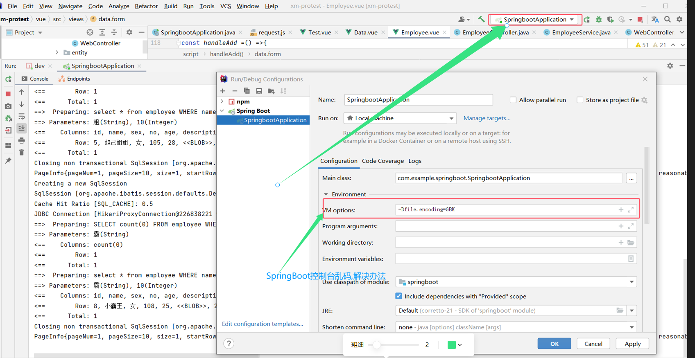

# 从0搭建Vue3工程

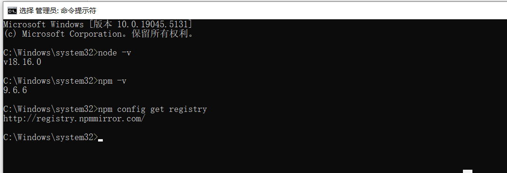

## 镜像设置

npm 是一个包管理工具，可以帮助我们下载vue工程所需得依赖，npm 需要配置淘宝镜像，否则下载速度非常慢，配置方式：在命令行输入以下的指令：

```shell
npm config set registry http://registry.npmmirror.com # 配置淘宝镜像
npm config get registry # 获取node当前的镜像仓库地址
```

# 创建第一个vue工程

[vue快速上手](https://cn.vuejs.org/guide/quick-start.html)

## 创建vue工程

**流程**就是：

```shell
npm create vue@latest # 创建这个项目
# 输入项目名 这里的项目名是vue
```

- 创建一个文件夹,进入这个文件夹

  请输入项目名称：`vue   `

- 之后，
  ```shell
  cd ... # 进入你创建的这个项目 
  npm install # 安装所需要的包
  npm run dev # 运行
  ```

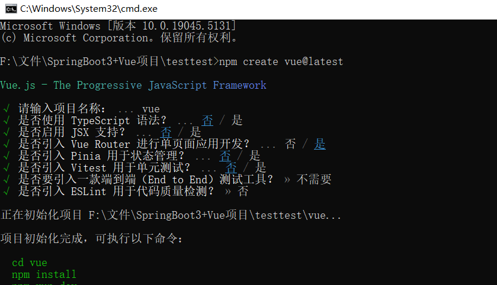

```shell
D:\workspace\stuspace\javaProject\stu_quickbootvue3\xm-pro>npm create vue@latest
Need to install the following packages:
create-vue@3.16.4
Ok to proceed? (y) y

> npx
> create-vue

T  Vue.js - The Progressive JavaScript Framework
|
o  请输入项目名称：
|  vue
|
o  请选择要包含的功能： (↑/↓ 切换，空格选择，a 全选，回车确认)
|  Router（单页面应用开发）

正在初始化项目 D:\workspace\stuspace\javaProject\stu_quickbootvue3\xm-pro\vue...
|
—  项目初始化完成，可执行以下命令：

   cd vue
   npm install
   npm run dev

| 可选：使用以下命令在项目目录中初始化 Git：

   git init && git add -A && git commit -m "initial commit"

npm notice
npm notice New major version of npm available! 10.8.2 -> 11.4.2
npm notice Changelog: https://github.com/npm/cli/releases/tag/v11.4.2
npm notice To update run: npm install -g npm@11.4.2
npm notice

D:\workspace\stuspace\javaProject\stu_quickbootvue3\xm-pro>cd vue

D:\workspace\stuspace\javaProject\stu_quickbootvue3\xm-pro\vue>npm install

added 147 packages in 14s

44 packages are looking for funding
  run `npm fund` for details

D:\workspace\stuspace\javaProject\stu_quickbootvue3\xm-pro\vue>npm run dev

> vue@0.0.0 dev
> vite
  
  VITE v6.3.5  ready in 761 ms

  ➜  Local:   http://localhost:5173/
  ➜  Network: use --host to expose
  ➜  Vue DevTools: Open http://localhost:5173/__devtools__/ as a separate window
  ➜  Vue DevTools: Press Alt(⌥)+Shift(⇧)+D in App to toggle the Vue DevTools
  ➜  press h + enter to show help
```

## idea打开该项目

 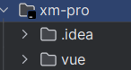

## 启动项目

 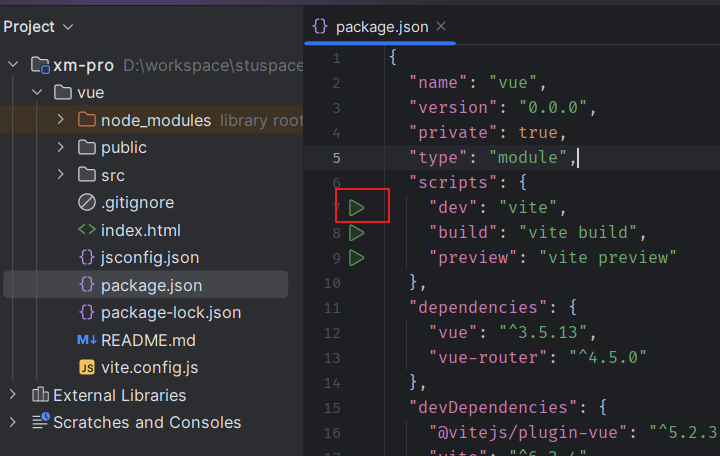

## 项目瘦身

**1. 删除文件**

 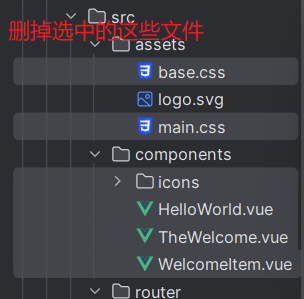

**2. 修改vue文件**

删除`AboutView,vue`，将`HomeView.vue`改为`Home.vue`，并修改`Home.vue`文件内容。

`Home.vue`：

```vue
<template>
  <div>
    这是主页
  </div>
</template>
<script setup>

</script>
```

> `setup`是必备的一个属性，是一个语法糖，有这个就可以使用vue3的特性

**3. 精简路由，删除没必要的路由**

```js
import { createRouter, createWebHistory } from 'vue-router'
// import HomeView from '../views/HomeView.vue'

const router = createRouter({
    history: createWebHistory(import.meta.env.BASE_URL),
    routes: [
        {
            path: '/',
            name: 'home',
            // component: HomeView,
            component: () => import('../views/Home.vue'),
        }
        /*
      ,
    {
      path: '/about',
      name: 'about',
      // route level code-splitting
      // this generates a separate chunk (About.[hash].js) for this route
      // which is lazy-loaded when the route is visited.
      component: () => import('../views/AboutView.vue'),
    },
    */
    ],
})

export default router
```

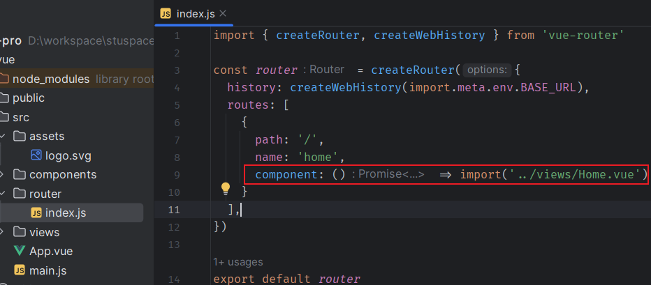

**4. 精简`App.vue` 只是作为项目的入口文件，没用的全部删除**

 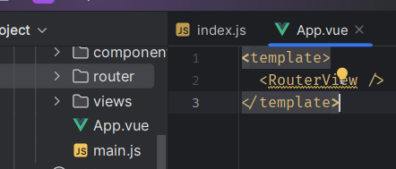

**5. `main.js` 删除无用的导包**

```js
// import './assets/main.css'
import { createApp } from 'vue'
import App from './App.vue'
import router from './router'
const app = createApp(App)
app.use(router)
app.mount('#app')
```

**6. 启动项目**

 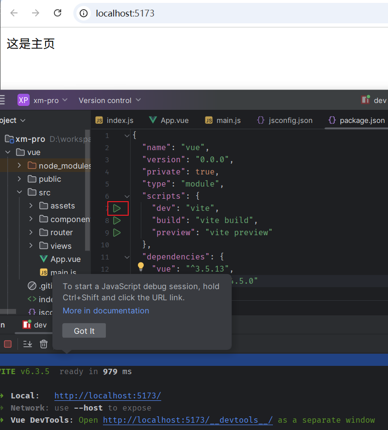

## 引入一个全局的 css

在`assests`目录下新建一个`global.css`文件作为全局的css：

```css
body {
    margin: 0;
    padding: 0;
    font-size: 14px;
    color: #333;
}
```

在`main.js`中引入该全局css文件：

```js
import '@/assets/global.css'
```


# 浏览器显示两个页面

比如，想：localhost:5173/manager/data想在一个浏览器页面同时显示manager页面和data页面，就需要在manager的页面中想显示data页面的div标签里面写一个`<RouterView/>`标签

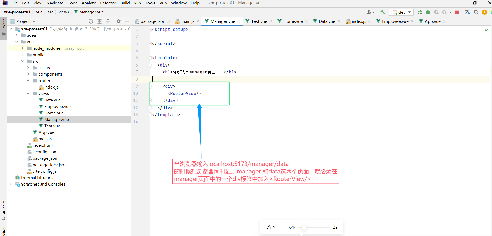

# Vue3集成Element-Plus

## 首先在idea中打开命令窗：

```sh
cd vue 	 #进入vue目录中

npm install element-plus -s	 #安装element-plus的命令


#另外提供一个卸载element-plus的命令
npm uninstall element-plus
```

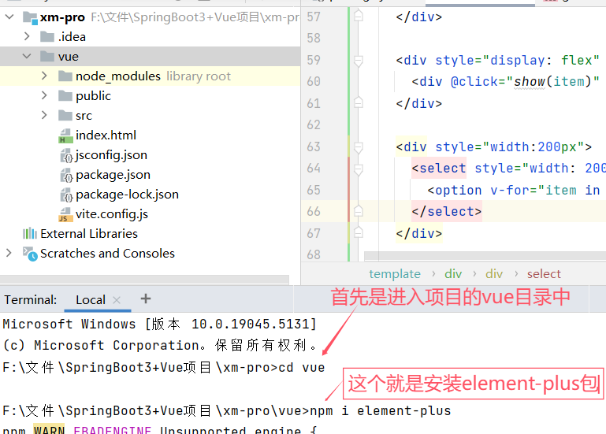

这个是安装好的element-Plus包

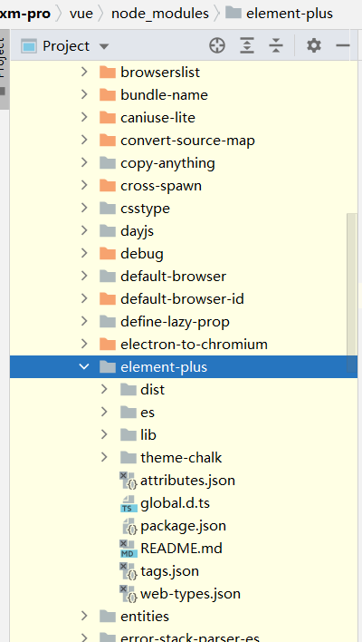

其次就是需要在main.js中引入element-plus

```sh
import ElementPlus  from 'element-plus'   	#导入element-plus
import 'element-plus/dist/index.css'
import zhCn from 'element-plus/es/locale/lang/zh-cn'   #将Elment-plus转化为中文

app.use(router) 
#这个是使用element-plus ，{}中是将emement-plus是汉化的...
app.use(ElementPlus,{
    locale:zhCn,
})
```

这个就是一个最简单的使用element-plus组件

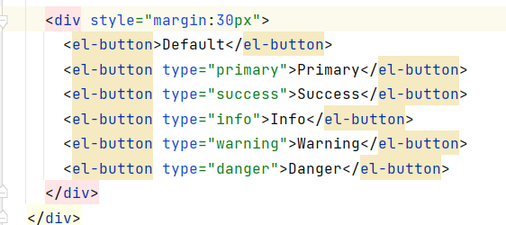

使用图:

#### 

 如果想使用icon 需要安装 :npm install @element-plus/icons-vue  如下如

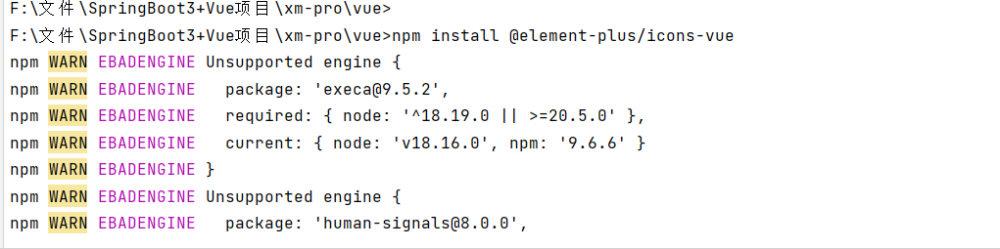

 还需要再main.js中引入 ,

`import * as ElementPlusVue from '@element-plus/icons-vue'`

使用代码:

```vue
for (const [key ,component] of Object.entries(ElementPlusIconsVue)){
    app.component(key,component)
}
```

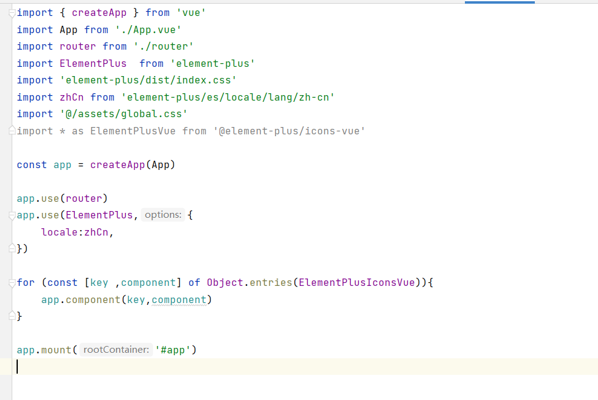

当你在按钮里面使用图标

你需要单独导入`import {Delete} from '@element-plus/icons-vue';`

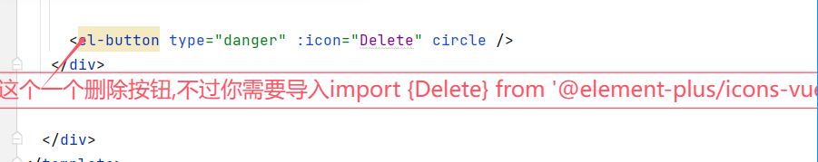

## Element-Plus组件的大小

想使用element-plus中的icon图标

```sh
npm install @element-plus/icons-vue

# main.js

# 如果您正在使用CDN引入，请删除下面一行。
import * as ElementPlusIconsVue from '@element-plus/icons-vue'

const app = createApp(App)
for (const [key, component] of Object.entries(ElementPlusIconsVue)) {
  app.component(key, component)
}
```

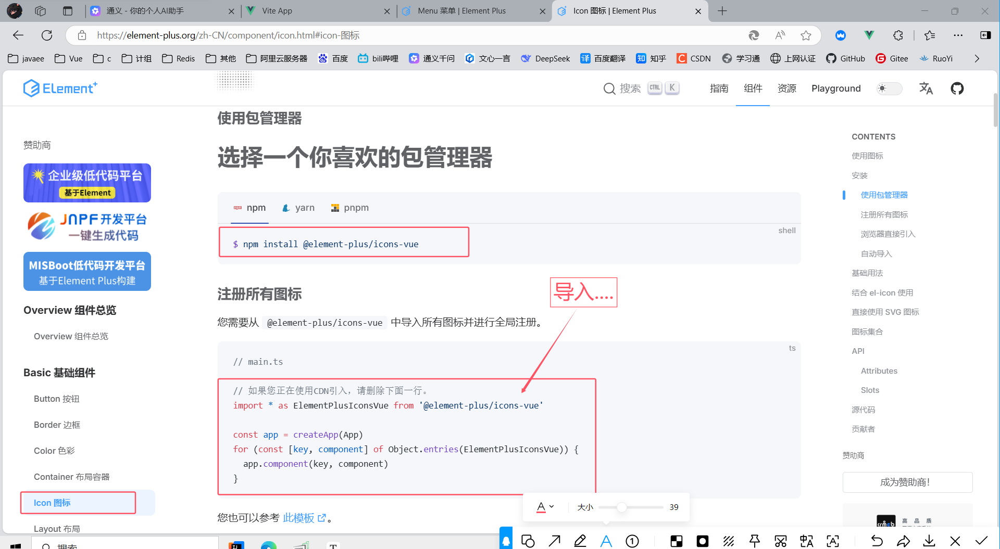

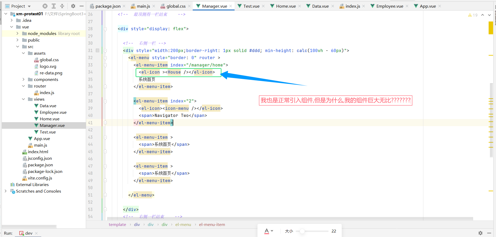

### 如下图:

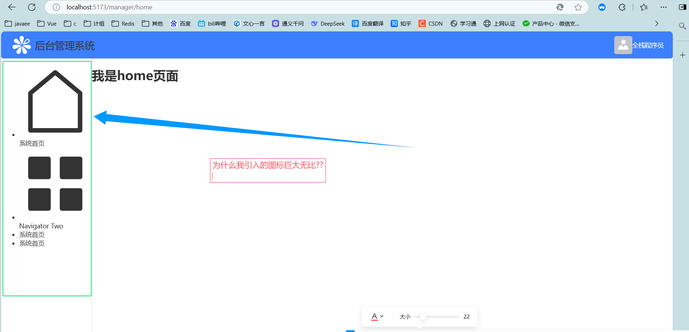

那是因为我们需要在main.js中引入----    		

```vue
import 'element-plus/dist/index.css'
```

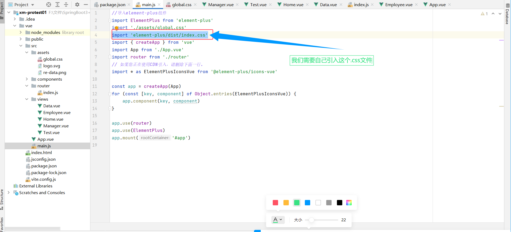

通义解释: 在main.js中加入import 'element-plus/dist/index.css'是干嘛的

​		在 `main.js` 文件中加入 `import 'element-plus/dist/index.css';` 这行代码是为了引入 Element Plus 组件库的默认样式文件。这是使用 Element Plus 时的一个重要步骤，因为它确保了所有 Element Plus 组件都能正确显示并具有统一的样式风格。

# Element-plus汉化

默认情况下,element-plus组件中所有的字都是英文的比如:

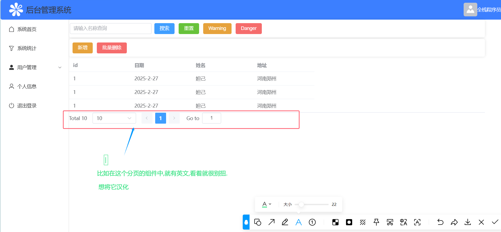


### 汉化就是在main.js中添加东西,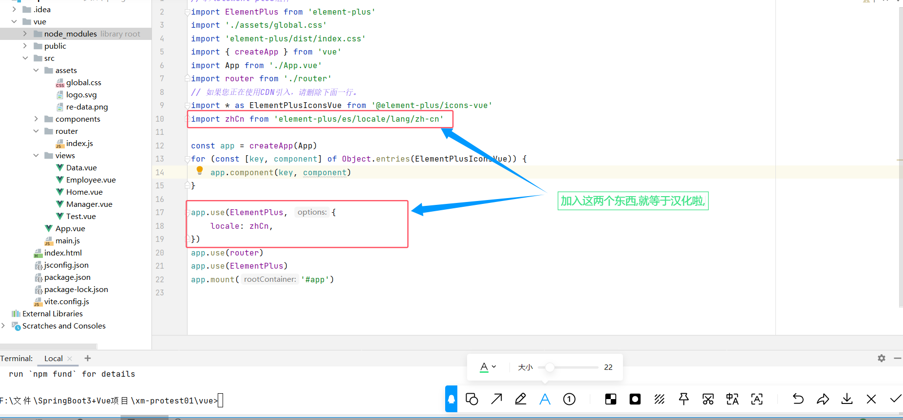

注意：

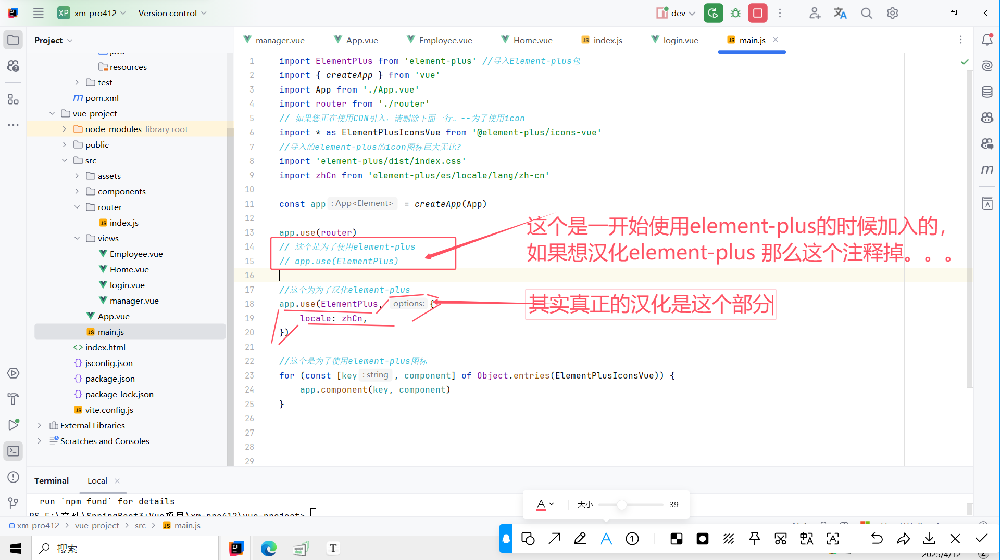

```vue
import zhCn from 'element-plus/es/locale/lang/zh-cn'

app.use(ElementPlus, {
    locale: zhCn,
})
```

其实Element-Plus官网中也有提醒

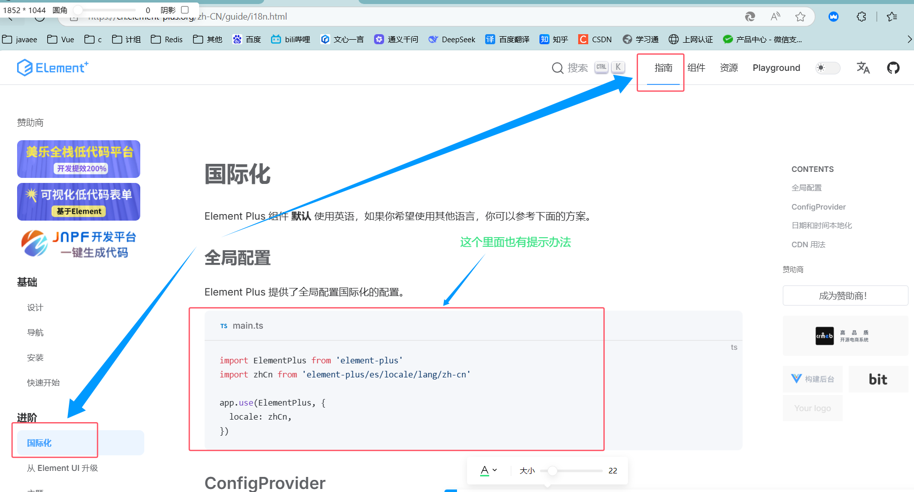


# Element-Plus 主题颜色设置

(最好不要设置了 ,,2025-2-27)

## 安装依赖

```vue
npm i sass@1.71 -D

npm i unplugin-auto-import -D

npm i unplugin-element-plus -D

npm i unplugin-vue-components -D
```

安装好之后就可以在package.json中看到啦

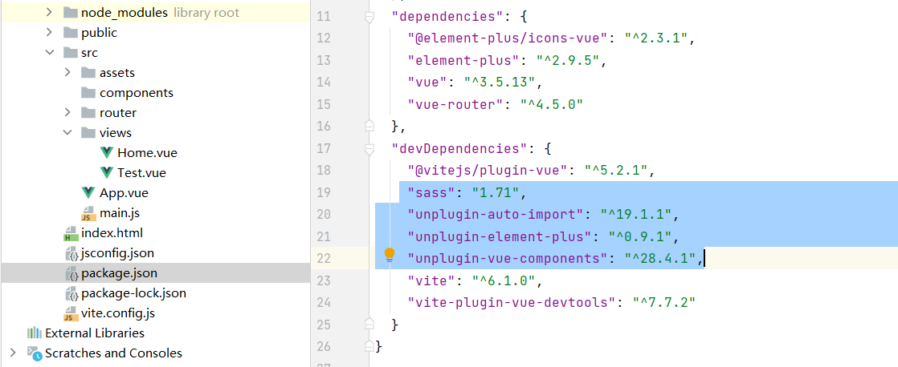

# Element-Plus组件使用速成

```vue
<template>
  <div>
    <div>
      <el-input v-model="data.input" style="width: 240px" placeholder="请输入账号" readonly /> {{data.input}}
        //其中要input中加readonly之后,input中的内容就不能能改了
    </div>
  </div>
</template>

<script setup>
  import {reactive} from "vue";

  const  data = reactive({
    input:null
  })
</script>
```

## 下拉框el-select

```vue
<div style="margin:20px 0">
  <el-select v-model="data.value" placeholder="Select" size="large" style="width: 240px" >
    <el-option
        v-for="item in data.options" :key="item" :label="item" :value="item" />
    </el-select>>{{data.value}}
</div>


<script setup>
  import {reactive} from "vue";

  const data = reactive({
    input:null,
    value:'',
    options:['苹果','香蕉','橘子']
  })
</script>
```

# 路由中的children属性的使用

## 举例子

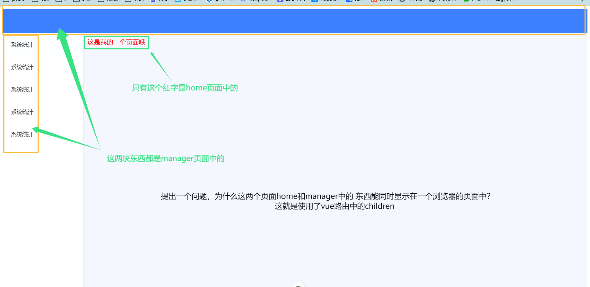

### 代码解释什么是children

```vue
import { createRouter, createWebHistory } from 'vue-router'
import Home from '../views/Home.vue'
import Manager from '../views/Manager.vue'
import Test from '../views/Test.vue'
import Data from '../views/Data.vue'
import failue from '../views/404.vue'

const router = createRouter({
  history: createWebHistory(import.meta.env.BASE_URL),
  routes: [
    {
      path: '/',
      name: 'home',
      component: Home
    },
    {
      path: '/manager',
      component: Manager,
      children: [
        {
          path: 'home',  	//注意,children中,path不能写成 '/home'
          component: Home,
          meta: {title: '主页'}
        },
        {
          path: 'test',		//注意,children中,path不能写成 '/test'
          component: Test,
          meta: {title: '测试数据展示页面'}
        },
        {
          path: 'data',		//注意,children中,path不能写成 '/data'
          component: Data,
          meth: {title: '数据展示页面'}
        }
      ]
    },
    // {
    // path: '/test',
    // component: Test
    // },
    // {
    // path: '/data',
    //   component: Data
    // },
    {
      path: '/404',
      component: failue
    }
  ],
})

export default router
```

就是说，data、test、home这三个页面，我们是写在，manager路由中的children属性中的。

> 还有就是要注意   	//注意,children中,path不能写成 '/home'   ,否则页面不能正常显示

# 配置导航菜单栏

## 点击menu里面的某一项 跳转页面怎么做？

### 官网解释：如下图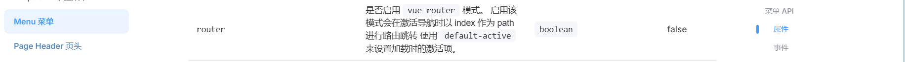

#### 具体实现如下：

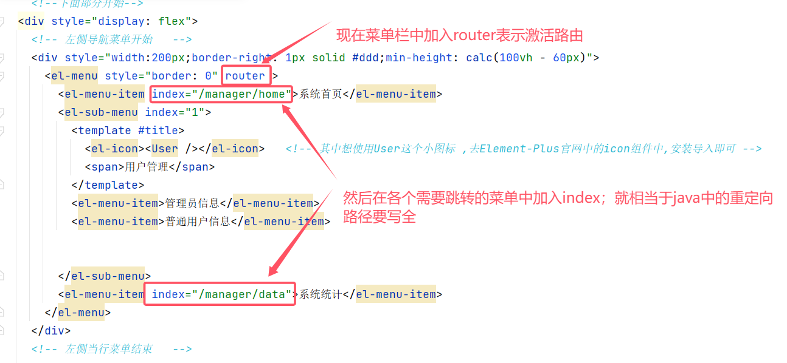

##### 高亮效果

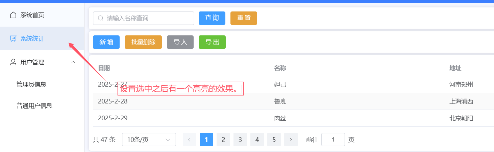

加如下代码，

```vue
<style>
.el-menu .is-active{
  background-color: #e6ecf7 !important;
}
</style>
```

# Mysql语法简介

## 模糊查询

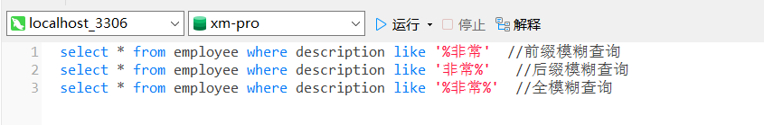

## 分页查询

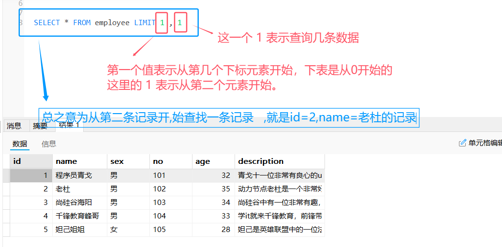

select * from employee limit 第一个数字，第二个数字

第一个数字+1 表示从第几条记录开始 

第二个数字表示取几条记录

排序查询

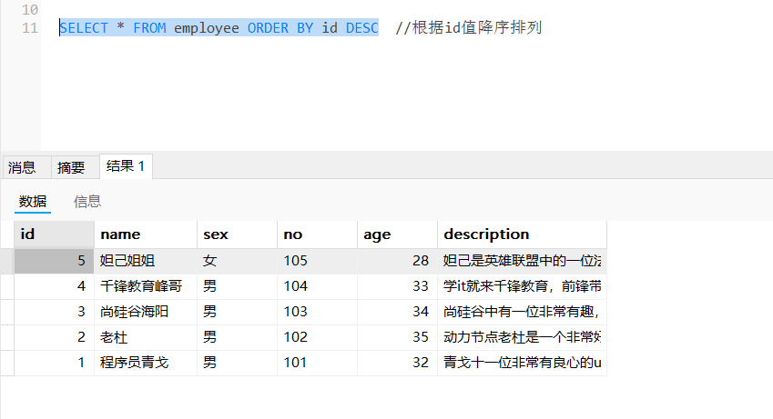

## 分组查询

​	一般用于统计个数


## 关联查询

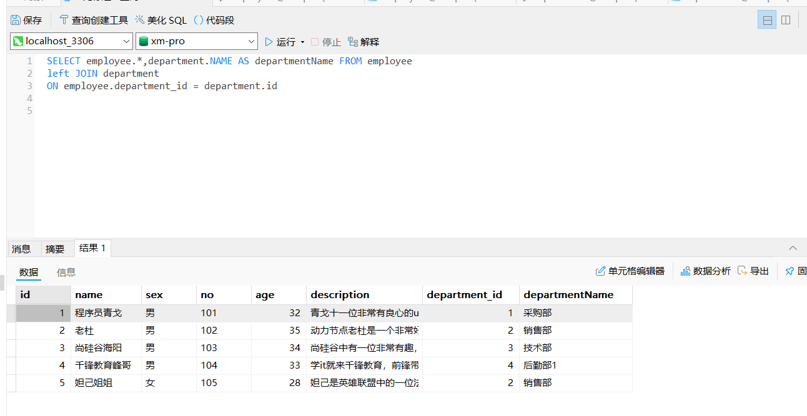

这里是一个左连接，左连接非常实用。

## 关联分页查询

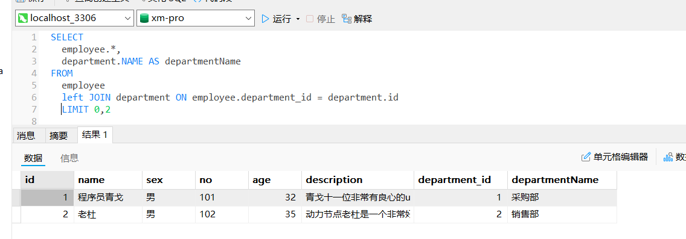

## insert语句

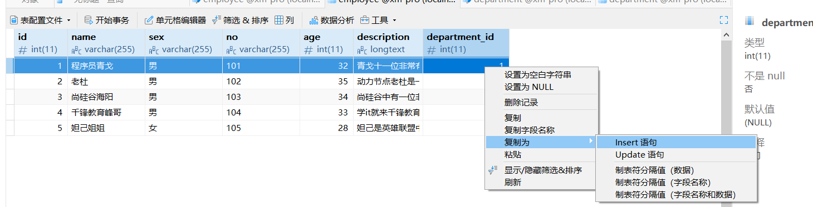

## update语句

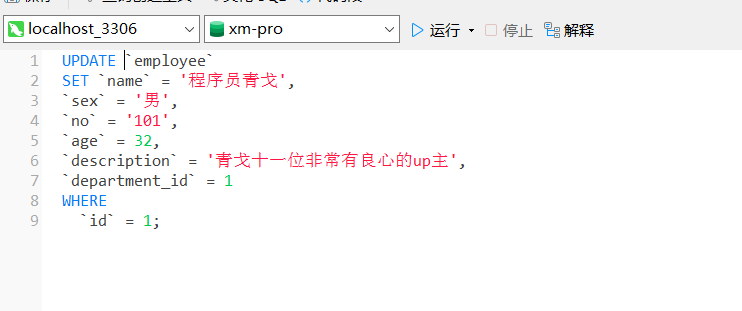

## delete语句

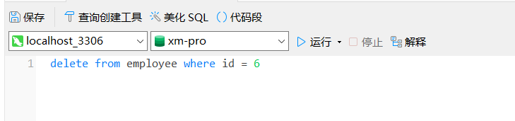

## truncate语句

​	清空表中所有数据自增键从1开始

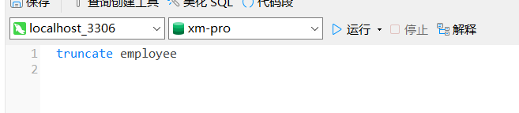

## 唯一索引

当no为唯一索引之后，再插入一条已经存在的no时就会报错，插不进去

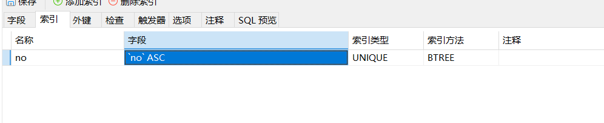

## 统计数据函数（sum、count）

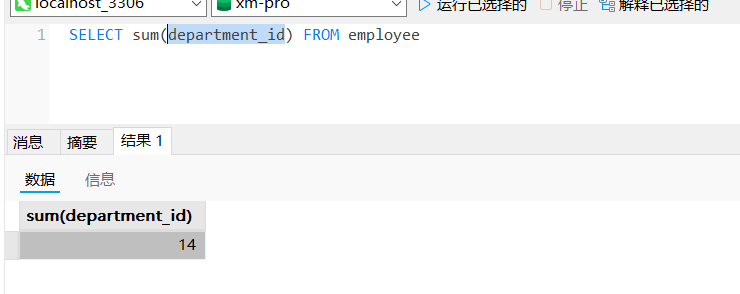

# 在xm-pro中创建springboot模块

红标的表示没用的，可全部删除

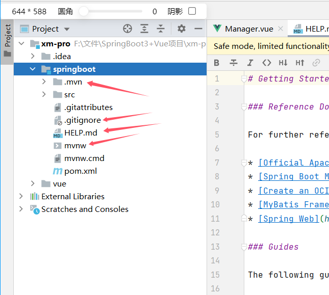

## pom.xml

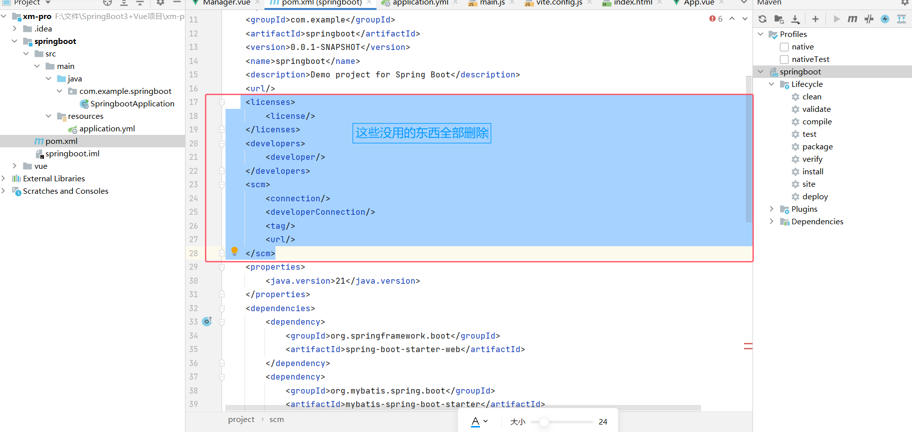

## application.yml

```yaml
# 配置数据库
spring:
  datasource:
    driver-class-name: com.mysql.cj.jdbc.Driver
    url: jdbc:mysql://localhost:3306/xm-pro?useUnicode=true&characterEncoding=utf-8&allowMultiQueries=true&useSSL=false&serverTimezone=GMT%2b8allowPublicKeyRetrieval=true
    username: root
    password: root
    
#设置端口号
server:
  port: 8888
```

# 设置统一的包装类

```java
package com.example.springboot.controller;

import com.example.springboot.common.Result;
import org.springframework.web.bind.annotation.GetMapping;
import org.springframework.web.bind.annotation.PostMapping;
import org.springframework.web.bind.annotation.RestController;

import java.util.HashMap;
import java.util.Map;

@RestController
public class WebController {

    @GetMapping("/hello")
    public String hello(){
        return "Hello";
    }

    @GetMapping("/weather")
    public Result weather(){
        return Result.success("今天天气晴朗，阳光明媚");
    }

    @GetMapping("/map")
    public Result map(){
        HashMap<String, Object> map = new HashMap<>();
        map.put("name","张三");
        map.put("age",25);
        return Result.success(map);
    }
    @GetMapping("/count")
    public Result count(){
        return Result.success();
    }
}
```

## 下面代码是一个包装类

就是把controller层返回的数据用Result类包装一下,如果有返回的数据就调用Result类的有参数的success方法,

若没有返回参数就调用没有参数的success,  controller没有返回参数调用无参数的success方法就意味着将data的值设置为null,...当有参数返回的时候 ,调用有参的success方法的时候也就意味着现再有参中调用一下无参的success方法,再额外设置一下controller层返回的值,赋值给data.. 反正这些都是成功的...

```java
package com.example.springboot.common;

/**
 * 同意后端返回数据
 */
public class Result {
    private String code;
    private String msg;
    private Object data;


    public static Result success(){
        Result result = new Result();
        result.setCode("200");
        result.setMsg("请求成功");
        return result;
    }

    public static Result success(Object data){
        Result result = success();
        result.setData(data);
        return result;
    }

    public static Result error(){
        Result result = new Result();
        result.setCode("500");
        result.setMsg("系统错误");
        return result;
    }


    public String getCode() {
        return code;
    }

    public void setCode(String code) {
        this.code = code;
    }

    public String getMsg() {
        return msg;
    }

    public void setMsg(String msg) {
        this.msg = msg;
    }

    public Object getData() {
        return data;
    }

    public void setData(Object data) {
        this.data = data;
    }
}

```

## 异常处理类

表示controller中如果有异常就会直接跳转到GlobalExceptionHandler这个类上面来

```java
package com.example.springboot.exception;

import com.example.springboot.common.Result;
import org.springframework.web.bind.annotation.ControllerAdvice;
import org.springframework.web.bind.annotation.ExceptionHandler;
import org.springframework.web.bind.annotation.ResponseBody;

@ControllerAdvice("com.example.springboot.controller")  //表示捕获controller中所有的异常
public class GlobalExceptionHandler {

    @ExceptionHandler(Exception.class)
    @ResponseBody  //返回json串
    public Result error(Exception e){
        e.printStackTrace();  //捕获异常信息,并打印在控制台..
        return  Result.error();
    }
}
```

异常:  这个异常是因为 webController.java类中33行: int a= 1 / 0;

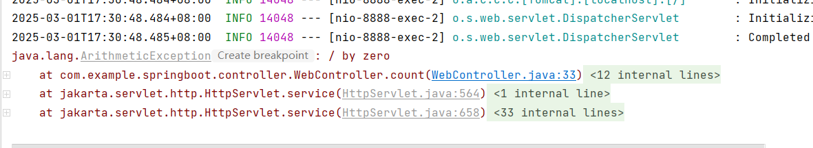

## 用户自定义异常

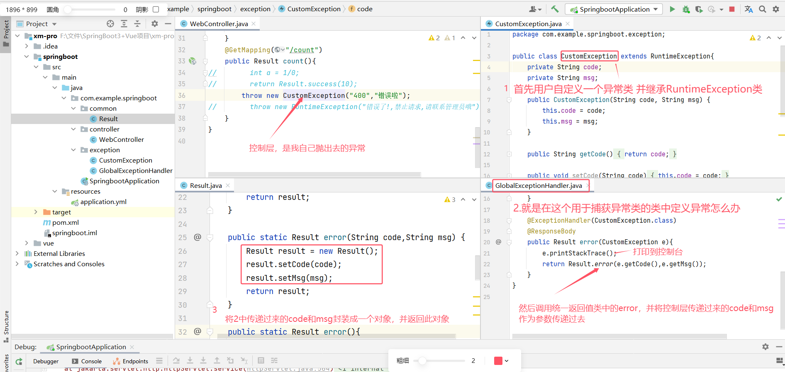

# SpringBoot3集成Mybatis

官网：https://mybatis.org/mybatis-3/zh_CN/index.html

## mapper的xml的基本格式

```java
<?xml version="1.0" encoding="UTF-8" ?>
<!DOCTYPE mapper
        PUBLIC "-//mybatis.org//DTD Config 3.0//EN"
        "https://mybatis.org/dtd/mybatis-3-mapper.dtd">
<mapper namespace="">
    
</mapper>
```

## 快速复制类的全限定类名

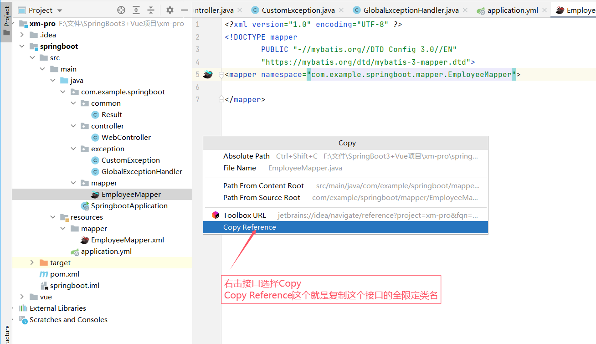

## 实体类

数据库中的字段，与实体类字段一一对应，数据库中时int java实体类中就得是Integer，数据库中时varchar java实体类中那个就得是 String类型。如下图

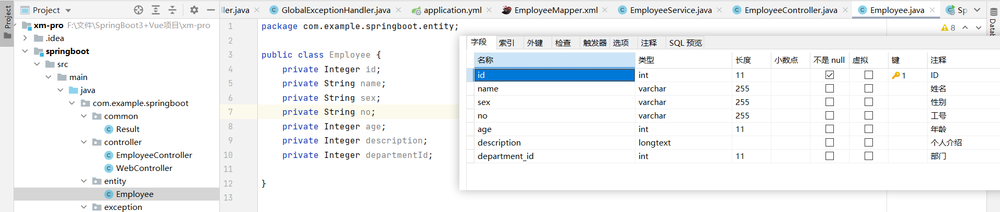

# 两个参数注解的区别

@PathVariable和@RequestParam这两个注解都是参数注解，但是用法天差地别

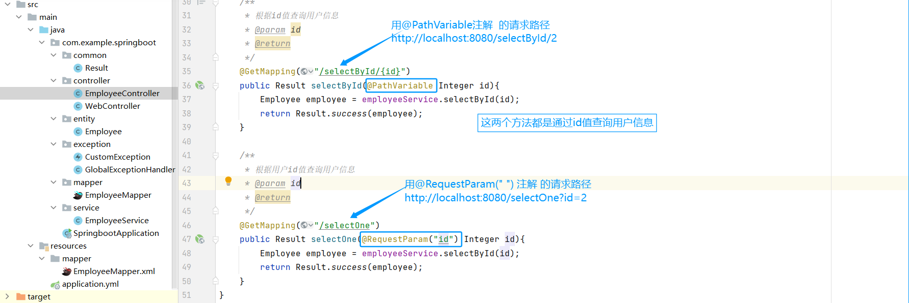

注意区分：


## 实体类作为参数

实体类作为参数，实体类中的字段可以选择性地填写 http://localhost:8080/employee/selectlist?id=1&no=101

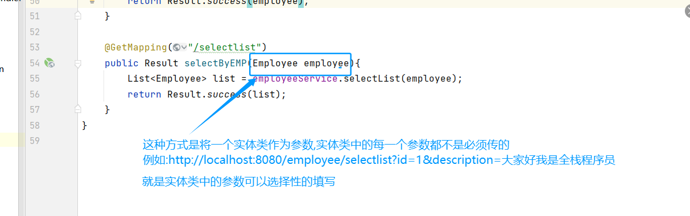

# 使用Mybatis实现数据库的增删改

## 分页查询

分页查询首先先导入一个分页查询的一个插件

```java
<!--分页查询插件pagehelper-->
<dependency>
    <groupId>com.github.pagehelper</groupId>
    <artifactId>pagehelper-spring-boot-starter</artifactId>
    <version>1.4.6</version>
    <exclusions>
        <exclusion>
            <groupId>org.mybatis</groupId>
            <artifactId>mybatis</artifactId>
        </exclusion>
    </exclusions>
</dependency>
```

#### 控制层

```java
/**
 *  分页查询必须有 pageNum 和 pageSize 这两个值
 * @param pageNum 当前页码
 * @param pageSize 每页的个数
 * @return
 */
@GetMapping("/selectPage")
public Result selectPage(@RequestParam(defaultValue = "1") Integer pageNum,
                         @RequestParam(defaultValue = "10") Integer pageSize){
    PageInfo<Employee> pageInfo = employeeService.selectPage(pageNum, pageSize);
    return Result.success(pageInfo);

}
```

#### Service层

再Service里面通过三行代码实现了分页查询

值得注意的是selectAll(),对应的Sql语句是:`select * from employee`   

分页查询需要用到一个插件,这个插件能让我们少些Sql语句.

```java
public PageInfo<Employee> selectPage(Integer pageNum,Integer pageSize) {
    PageHelper.startPage(pageNum,pageSize);
    List<Employee> list = employeeMapper.selectAll();
    return PageInfo.of(list);
}
```

它的原理就是帮助你通过使用他的一个插件，进行了一个分页的查询，它内部加了limit，不需要我们自己去加

#### 漂亮的控制台

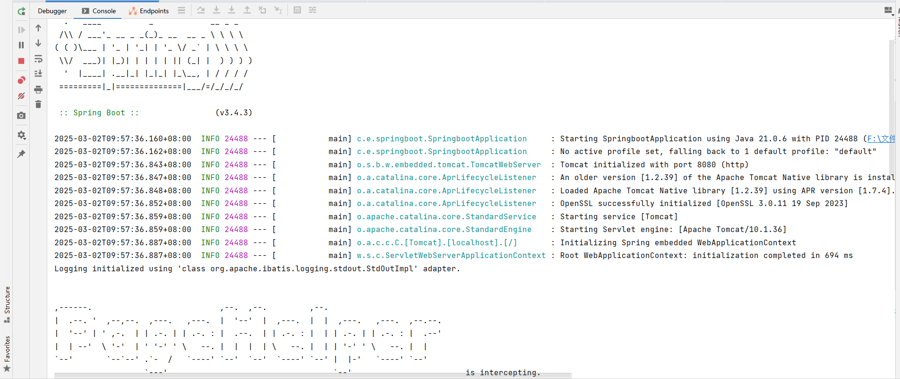

#### 返回给浏览器的json格式

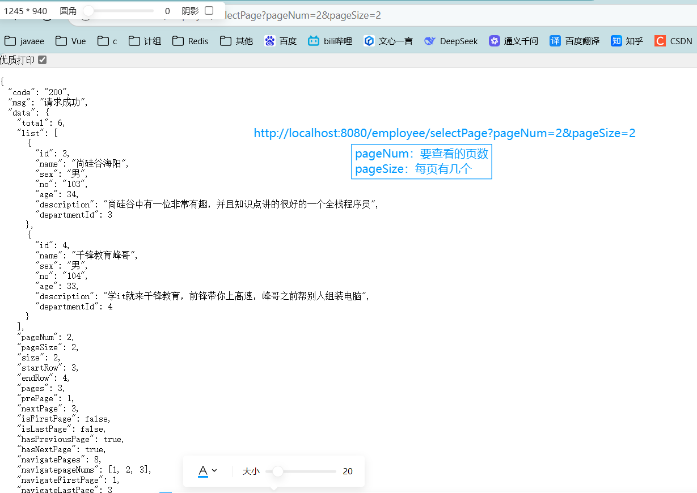

## 增删改

### 增删改对应的请求方式

get : 查询操作

post : 新增操作

put : 修改操作

delete : 删除操作

#### RequestBody

@RequestBody:可以把前端传递过来的 json 字符串映射成 java 对象,或者数组

### post请求


当我写了一个新增操作,用的是Post请求,这个时候可就不能使用浏览器发送了,因为浏览器只能发送Get请求,不能发送post请求  ,这个时候只能用postman测试工具了,或者时候Windows黑窗口的curl 

#### Postman


### 更新操作


对应的Sql语句

```java
<update id="updateById">
    update employee
        set name = #{name}, sex = #{sex}, no = #{no}, description = #{description}, department_id = #{departmentId}
    where id = #{id}
</update>
```

### 删除操作

```java
/**
 * 根据id值删除用户信息
 * @param id 前端传送过来的id
 * @return 返回Result类中的srccess()方法
 *
 */
@DeleteMapping("/deleteById/{id}")
public Result deleteById(@PathVariable Integer id){
    employeeService.deleteById(id);
    return Result.success();
}
```

下面是postman中发送的delete请求


# SpringBoot3+Vue3实现基本的增删改查功能

安装axios封装前后端对接数据工具

## npm i axios -s

```vue
npm i axios -s
```

安装axios之前，一定先进入vue目录


## request.js

在vue项目中的src目录中新建utils目录，并在中新建request.js文件,文件代码如下

封装一个工具request.js--->封装 `axios` 实例，提供统一的请求和响应处理。

通过它可以帮助我们往后端发送请求

```vue
import axios from "axios"
import {ElMessage} from "element-plus";

const request = axios.create({
    baseURL: 'http://localhost:8080',
    timeout: 30000  //后台对接接口超时时间
})

//request 拦截器
//可以自请求发送前对请求做一些处理

request.interceptors.request.use(config =>{
    config.headers['Content-Type'] = 'application/json;charset=utf-8';
    return config
},error =>{
 return Promise.reject(error)
});

//response拦截器
//可以在接口响应后统一处理结果
request.interceptors.response.use(
    response => {
        let res = response.data;
        //兼容服务器返回的字符串数据
        if (typeof res === 'string') {
            res = res ? JSON.parse(res) : res
        }
        return res;
    },
    error => {
        if (error.response.status === 404) {
            ElMessage.error('未找到请求接口')
        }else if (error.response.status ===500) {
            ElMessage.error("系统异常,请查看后端控制台报错")
        } else {
          console.error(error.message)
        }
        return Promise.reject(error)
    }
)

export default request //导出request 暴露出去
```

## 解决跨域问题

在Springboot中设置统一的跨域处理--------->在common包中创建CorsConfig类


### 解决跨域问题代码如下:

在后端加入:

```java
package com.example.springboot.common;

import org.springframework.web.filter.CorsFilter;
import org.springframework.context.annotation.Bean;
import org.springframework.context.annotation.Configuration;
import org.springframework.web.cors.CorsConfiguration;
import org.springframework.web.cors.UrlBasedCorsConfigurationSource;

/**
 * 跨域配置
 * 这个类是一个解决跨域问题的类,如果有跨域问题打印在控制台,我们只需要加上这个类就可以解决了
 */
@Configuration
public class CorsConfig {

    @Bean
    public CorsFilter corsFilter(){
        UrlBasedCorsConfigurationSource source = new UrlBasedCorsConfigurationSource();
        CorsConfiguration corsConfiguration = new CorsConfiguration();
        corsConfiguration.addAllowedOrigin("*");
        corsConfiguration.addAllowedHeader("*");
        corsConfiguration.addAllowedMethod("*");
        source.registerCorsConfiguration("/**", corsConfiguration);
        return new CorsFilter(source);
    }
}
```

#### 因为跨域问题的报错


## 一个简单的前端发送请求到后端


### 启动前后端

直接看控制台即可......

## 分析网络请求

### 学会分析网络请求 (以后排查问题的关键手段)


## 又是一个请求

总之请求都要调用request.js帮助我们来发送,第一步在script标签中先导入request...如下图


#### 控制台,分页情况如下:


#### 分页组件不生效


因为我们还需要新增东西---->下面是官网


## 动态分页查询

### 给分页的控制器新增实体类参数


### 对应的Service层


### 对应的Sql用动态Sql语句


### 具体实现


# 增删改查

## 新增数据

新增按钮,添加一个点击事件

```vue
    <div class="card" style="margin-bottom: 5px">
      <el-button type="primary" @click="handleAdd">新 增</el-button>
      <el-button type="warning">批量删除</el-button>
    </div>
```

具体表单

### 1.首先得有一个弹窗组件,并设置弹窗


handleAdd

通过handleAdd打开弹窗

```vue
const handleAdd = () =>{
  data.formVisible = true
  data.form = {}
}
```

### 2.点击报错按钮,发起请求

```vue
const save = () =>{
  request.post('/employee/add', data.form).then(res => {
    if (res.code === '200') {
      data.formVisible = false
      ElMessage.success('操作成功')
      load()   //新增之后一定要重新再在数据
    } else {
      ElMessage.error(res.msg)
    }
  })
}
```

点击发送之后,浏览器的网络控制台如下


## 编辑数据

### 1.打开弹窗


弹窗所示：


代码示例：


### 注意

注意一个深浅拷贝的问题，还有一个是新增是post请求，编辑是put请求，最后注意就是新增没有id 编辑有id值  可以通过这个有没有id来决定是执行新增还是编辑


```vue
const save = () => { //在一个保存里面做两个操作, 一个是新增(新增是Post请求) , 一个就是编辑(编辑是Put请求)
  data.form.id ? update() : add()
}
const add = () => {
  request.post('/employee/add', data.form).then(res => {  //新增的对象里面没有id
    if (res.code === '200') {
      data.formVisible = false
      ElMessage.success('操作成功')
      load()   //新增之后一定要重新再在数据
    } else {
      ElMessage.error(res.msg)
    }
  })
}
const update = () => {
  request.put('/employee/update', data.form).then(res => {  //编辑的对象里面包含id
    if (res.code === '200') {
      data.formVisible = false
      ElMessage.success('操作成功')
      load()   //编辑完之后一定要重新再在数据
    } else {
      ElMessage.error(res.msg)
    }
  })
}
const handleUpdate = (row) =>{
  // data.form =row   /*这个是一个浅拷贝,就是放我们点击编辑,修改完数据之后,如果用户取消了,那么展示页面也会变化..这就是浅拷贝*/
  data.form = JSON.parse(JSON.stringify(row))  //深拷贝一个新的对象 用户编辑  这样就不会影响对象
  data.formVisible = true
}
```

## 删除数据

单个删除


### 代码如下：

```vue
const del = (id) => {
  ElMessageBox.confirm('删除数据后无法恢复,您确认删除吗?','删除确认', {type: 'waring'}).then(() => {
    request.delete('/employee/deleteById/' + id).then(res => {
      if (res.code === '200') {
        ElMessage.success('操作成功!')
        load()
      }else {
        ElMessage.error(res.msg)
      }
    })
  }).catch()
}
```

## 批量删除

### 前端代码


后端接口必须使用@RequestBody接收数组


# Vue3开发登录注册页面

## 在数据库中加字段


## Login表单设计


前端新建Login.vue页

具体实现代码：

```vue
<template>
  <div class="login-container">

    <div class="login-box">

     <div style="padding: 50px 30px;background-color: white;margin-left: 0px;border-radius: 5px;box-shadow: 0 0 10px rgba(0,0,0,0.1)">
       <el-form ref="formRef" :model="data.form" style="width: 350px">
       <div style="margin-bottom: 30px; font-size: 24px;color: #0742b1;font-width: bold;text-align: center;" >欢迎登陆后台管理系统</div>
         <el-form-item>
           <el-input size="large" v-model="data.form.username" placeholder=" 请输入账号" prefix-icon="User"></el-input>
         </el-form-item>

         <el-form-item>
           <el-input size="large" v-model="data.form.password" placeholder=" 请输入密码" prefix-icon="Lock"></el-input>
         </el-form-item>

         <div style="margin-bottom: 20px">
           <el-button type="primary" size="large" style="width: 100%">登录</el-button>
         </div>

         <div style="text-align: right;margin-bottom: 2px;">还没有账号?请<a href="/register" style="color: #0742b1;text-decoration: none">注册</a></div>
       </el-form>
     </div>

    </div>

  </div>
</template>

<script setup>
import {reactive } from "vue"

const data = reactive({
  form: {}

})

</script>

<style scoped>

.login-container{
  height: 100vh;
  background-image: url("../boot+vue3快速入门Img/WelCome.png");
  overflow: hidden;
  background-size: cover;
  background-position: -600px -200px;
}

.login-box{
  width: 50%;
  height: 100%;
  display: flex;
  align-items: center;
  right: 0;
  position: absolute;

}

</style>
```

## rules规则


忘记了还有一个ref="formRef"   ((这个其实加不加都一个样))


### 在script中定义具体的规则和提示信息


# 登录逻辑(后端)

## Controller

```java
@PostMapping("/login")
public Result login(@RequestBody Employee employee){
    employeeService.login(employee);
    return Result.success();
}
```

## service层逻辑

```java
public Employee login(Employee employee) {
    String username = employee.getUsername(); //获取账号
    Employee dbEmployee = employeeMapper.selectByUsername(username);
    if (dbEmployee == null ){ // 没查询到任何用户  说明没有这个账号
        throw new CustomException("500","账号不存在");
    }
    //数据库中存在这个账号
    String password = employee.getPassword(); //获取密码
    if (!dbEmployee.getPassword().equals(password)) { //用户输入的密码 跟数据库账号的密码不匹配
        throw new CustomException("500","账号或者密码错误");
    }

    return dbEmployee;
}
```

##  前端中的本地存储

前端中将登陆成功之后 用户的名字,存储到一个地方,然后有manager页面中把这个名字取出来用于展示...

下图是,存


下图是 取


下图是 展示


# 注册页面的设计

## 官网中有表单自定义验证规则:

https://cn.element-plus.org/zh-CN/component/form.html#form-%E8%A1%A8%E5%8D%95

注册页面有两个输入密码的框,需要检验两次密码的输入是否一致,Element-Plus提供的有一种 表单检验如下图


上面这个图片别看了,直接看下面这个一样的... 直接把下图中的红框中的内容复制过去一样的,哈哈哈哈


从官网拿下来之后,写到Register.vue表单中的格式:如下图


## confirmPassword

将confirmPassword写道再次输入密码的输入框中  .如下图:


浏览器页面上的效果图: 如下


## 注册-后端代码


```java
@Controller
public class Register {

    @Autowired
    private EmployeeService employeeService;


    @PostMapping("/register")
    @ResponseBody
    public Result register(@RequestBody Employee employee) {
        System.out.println(employee);
        employeeService.register(employee);
        return Result.success();
    }
}
```

### service层


```java
public void register(Employee employee) {
    String username = employee.getUsername();
    Employee dbEmployee = employeeMapper.selectByUsername(username);
    System.out.println(username);
    if (dbEmployee != null) { //表示数据库中已经有这个账号了
        throw new CustomException("500", "用户名已经存在");
    }
    if (StrUtil.isBlank(employee.getPassword())) {
        employee.setPassword("123");
    }
    if (StrUtil.isBlank(employee.getName())) { //StrUtil.isBlank() 判断括号中的内容是否为空,如果为空就返回true
        employee.setName(employee.getUsername());
    }
    employee.setRole("EMP");
    employeeMapper.insert(employee);

}
```

# 没有缓存报错

但我们启动前端（vue） 访问http://localhost:5173/manager/employee的时候 ，如果浏览器没有缓存xm-pro-user就会报如下错误


## 浏览器上的缓存


我们一般不需要用这个缓存，因为不登陆就能直接访问manager/employee这个页面吗？？显然是不行的。

我们在路由中 设置当浏览器打开vue项目的时候就直接跳转到登录页面就行了。说白了就是先让你登陆。

路由中的设置：


## 退出登录

退出登录清除缓存  清除manager.vue页面中本地缓存


清楚缓存跳转到login.vue页面中,之后浏览器中就没有缓存咯  如下图浏览器的本地缓存


# 管理员相关的增删改查

admin的创建sql

```mysql
CREATE TABLE `admin` (
  `id` int(11) NOT NULL COMMENT 'ID',
  `username` varchar(255) COLLATE utf8mb4_unicode_ci DEFAULT NULL COMMENT '账号',
  `password` varchar(255) COLLATE utf8mb4_unicode_ci DEFAULT NULL COMMENT '名称',
  `role` varchar(255) COLLATE utf8mb4_unicode_ci DEFAULT NULL COMMENT '角色',
  PRIMARY KEY (`id`)
) ENGINE=InnoDB DEFAULT CHARSET=utf8mb4 COLLATE=utf8mb4_unicode_ci COMMENT='管理员信息';

```

## 后端接口

写后端的一个流程： entity、controller、service、mapper.xml

entity对应管理员的实体类，单独写一个管理员controller，单独写一个管理员service，单独写一个管理员的mapper.xml

如下图：


## 前端页面

页面  路由  菜单

页面的话就把employee.vue页面修改修改就行啦。写写路由，在manager页面下面，。

其中管理员页面 包含这几个字段就行了，不需要现实的字段 直接删除掉即可。。其他的要和employee.vue页面中有一样操作效果


## 未找到接口(404)错误

1.前端写错了接口

2.后端没启动

# 用户登录  管理员登陆

## 首先 第0步


浏览器效果图


## 后端修改

### 第一步:

增加基类(超类),就是一个父类,同时也让 Admin类 和 Employee这 两个类都继承 Account类


管理员类和员工类都继承这个基类


### 第二步:

需要我们理解的是，前端只负责增加单选框(也就是增加一个role字段的值 ,也就是第0步中的), 其他的不管,直接调用了后端的/login..........后端需要根据role的值 去判断下一步的执行...

修改WebController层:

根据不同的身份,去不同的service层,(最后去不同的 表 中查询)

注意:我接受前端的form的时候用的是 基类,用的是@RequestBody这个注解 哈哈哈哈,你别再分不清楚了,这个注解能不前端返回的字符串 转换成java对象 


 管理员的service层:


员工的service层:


# 个人信息页面

## 在前端页面中新建Person.vue页面


## 拿缓存

Person.vue页面中直接使用

```vue
user: JSON.parse(localStorage.getItem("xm-pro-user")),
```

拿到,登陆的时候存到浏览器中的缓存...并根据缓存中的role的属性值判断用户信息是"EMP"还是"ADMIN" ,如果是EMP就拿到id重新去数据库中查询 ,因为我们放到浏览器缓存中的是Account对象,对于EMP来说是缺少数据信息的


## 动态判定

v-if判断是否是EMP(用户表)


可以将账号栏添加一个disabled,在浏览器显示的时候这个输入框不能被修改


# 子组件更新父组件(重点)


子组件发送请求更新父组件的数据：

第一步：先定义emit这个事件


第二步： 发射这个事件   （直接看第四步）


第三步：在父级中接收第二步中发射的那个事件


第四步： 具体来说应该说第二步就应该完成的东西


## 总结  

:子组件更新父组件

第一步:


第二步


第三步:


第五步:成功了


# 修改密码

新建一个Password.vue文件


下面的请求发送:


## 具体代码 (Password.vue)

```java
<template>
  <div class="card" style="width:50%">
    <el-form ref="formRef" :rules="data.rules" :model="data.form" style="padding-right: 40px;padding-top: 15px;" label-width="100px">
      <!-- :rules="data.rules" 这个属性是给表格增加条件约束   被增加的条件约束需要填写prop属性-->
      <el-form-item label="原密码" prop="password">
        <el-input show-password v-model="data.form.username" autocomplete="off" placeholder="请输入原密码" />
      </el-form-item>

      <el-form-item label="新密码" prop="newPassword">
        <el-input show-password v-model="data.form.newPassword" autocomplete="off" placeholder="请输入新密码" />
      </el-form-item>

      <el-form-item label="确认新密码" prop="confirmPassword">
        <el-input show-password v-model="data.form.confirmPassword" autocomplete="off" placeholder="请再次确认新密码" />
      </el-form-item>

      <div style="text-align: center">
        <el-button type="primary" size="large" style="padding: 20px 30px" @click="updatePassword">立即修改</el-button>
      </div>
    </el-form>
  </div>
</template>

<script setup>
import {reactive, ref} from "vue";
import request from "../utils/request";
import {ElMessage} from "element-plus";

const data = reactive({
  user: JSON.parse(localStorage.getItem('xm-pro-user')),  //取到缓存中的数据
  form: {},
  rules: {
    username: [
      {required: true , message: "请输入账号" ,trigger: 'blur'}
    ]
  }
})

const formRef = ref()

const updatePassword = () =>{
  data.form.id = data.user.id //调用缓存中的id 给表单数据
  request.put('/updatePassword',data.form).then(res=> {
    if (res.code = '200') {
      ElMessage.success("修改成功")
      localStorage.setItem('xm-pro-user')
      // location.href = '/login'
    }else {
      ElMessage.error(res.msg)
    }

  })
}

</script>
```

## 后端

controller层:


### 管理员service层:


### 员工层service层


# 文件上传 与 下载

## 后端部分

### 上传的接口

```java
// System.getProperty("user.dir")  获取到你当前这个项目的根路径
//文件上传的目录的路径
private static final String filePath = System.getProperty("user.dir") + "/files/";

/**
 * 文件上传接口
 * @param file
 * @return
 */
@PostMapping("/upload")
public Result upload(MultipartFile file) {  //文件流的形式接收前端发送过来的文件
    String originalFilename = file.getOriginalFilename();  //xxx.png    备注:老杜的第9个模块中有，file。getOriginalFilename()表示获取文件的一个真实的名字,其中file是MultipartFile的对象
    if (!FileUtil.isDirectory(filePath)) {  //如果目录不存在 需要先创建目录
        FileUtil.mkdir(filePath);  //创建一个 file 目录
    }
    //提供文件存储的完整的路径
    //给文件名 加一个唯一的标识
    String fileName = System.currentTimeMillis() + "_" +originalFilename;  //564532_xxx.png
    String realPath = filePath + fileName;  //完整的文件路径
    try {
        FileUtil.writeBytes(file.getBytes(),realPath);
    } catch (IOException e) {
        e.printStackTrace();
        throw new CustomException("500","文件上传失败");
    }
    //返回一个网络连接
    //http://localhost:8080/files/download/xxx.jpg
    String url = "http://localhost:8080/files/download/" + fileName;
    return Result.success(url);
}
```

后端上传用Postman测试:

Postman:测试中KEY是 接口中的参数:


当写好下载的接口之后，我再上传接口中的最后直接给你返回一个 下载的路径：下载的路径要求知道文件的一个真实名字，这个真实名字还是上传的时候设置的，它肯定知道的。所以上传接口中能动态地根据文件的真实名字 去生成一个下载链接


输出流解释：


```java
/**
 * 文件下载
 * @param fileName
 * @param response
 */
@GetMapping("/download/{fileName}")
public void download(@PathVariable String fileName, HttpServletResponse response){ //这里的response的作用就是将文件字节流写到客户端
    try {
        //下面这两行 是防止文件中文乱码的
        response.addHeader("Content-Disposition","attachment;filename=" + URLEncoder.encode(fileName, StandardCharsets.UTF_8));
        response.setContentType("application/octet-stream");
        OutputStream os = response.getOutputStream();
        String realPath = filePath + fileName;
        //获取到文件的字节数组
        byte[] bytes = FileUtil.readBytes(realPath);
        os.write(bytes);
        os.flush();
        os.close();
    } catch (IOException e) {
        e.printStackTrace();
        throw new CustomException("500","文件下载失败");
    }

}
```


## 前端部分

### 前端上传头像


上传头像表单: 这个是Employee.vue中的

```vue
<el-form-item label="头像" >
          <el-upload
              action="http://localhost:8080/files/upload"
              list-type="picture"
              :on-success="handleAvatarSuccess">
            <el-button type="primary">上传头像</el-button>
          </el-upload>
</el-form-item>


//回调函数
const handleAvatarSuccess = (res) => {
  console.log(res.data)
  data.form.avatar = res.data
}

```

官网栏的一个复制


样式也复制过去：


具体代码：


定义的函数：


### 后端上传文件接口中的参数名能改?

#### 什么意思?


如果你后端的上传接口中的参数 不是file这个名字,你的Element-Plus组件中的上传组件中就要加一个name属性  


Element-Plus组件中增加name属性


浏览器效果图：


### 增加数据库字段

分别在admin表和employee表增加字段avatar表示头像,varchar类型


在后端Account类中增加字段avatar String类型 和对应的getter和setter方法


并在admin和employee对应的Mapper.xml中的update和insert中增加对应的avatar  如下图:

admin对应的Mapper.xml


employee对应的Mapper.xml


### 修改Manager.vue中的头像


### 员工信息里展示头像

表格里面显示头像


在编辑的时候也可以上传图片:


效果:


在管理员信息表中展示:


效果:


#  SpringBoot3+Vue3实现富文本编辑器功能

官网：https://www.wangeditor.com/

## 安装wangeditor5

```vue
npm install @wangeditor/editor

npm install @wangeditor/editor-for-vue@next
```

## 引入和使用wangeditor5

## 新模块：文章管理

创建数据库表


### 对应Sql语句：

```mysql
CREATE TABLE `article` (
  `id` int(11) NOT NULL AUTO_INCREMENT COMMENT 'ID',
  `title` varchar(255) COLLATE utf8mb4_unicode_ci DEFAULT NULL COMMENT '标题',
  `img` varchar(255) COLLATE utf8mb4_unicode_ci DEFAULT NULL COMMENT '封面',
  `description` varchar(255) COLLATE utf8mb4_unicode_ci DEFAULT NULL COMMENT '简介',
  `content` longtext COLLATE utf8mb4_unicode_ci COMMENT '内容',
  `time` varchar(255) COLLATE utf8mb4_unicode_ci DEFAULT NULL COMMENT '发布时间',
  PRIMARY KEY (`id`)
) ENGINE=InnoDB DEFAULT CHARSET=utf8mb4 COLLATE=utf8mb4_unicode_ci COMMENT='文章信息';
```

## 开发后端

### 创建实体类

先创建实体类Article，直接复制Admin相关的 controller、service、mapper、mapper.xml 做一下修改即可

controller层代码：

```java
public class Article {
    private Integer id;
    private String title;
    private String img;
    private String description;
    private String content;
    private String time;
}
//这个省略了getter和setter方法。。。
```

复制Admin相关的一些类东西...

```java
@Controller
@RequestMapping("/article")
public class ArticleController {


    @Autowired
    private ArticleService articleService;

    /**
     * 管理员的新增业务
     * @param article
     * @return
     */
    @PostMapping("/add")
    @ResponseBody
    public Result add(@RequestBody Article article) {
        article.setTime(DateUtil.now());   //获取当前的最新的时间 是字符串
        Integer add = articleService.add(article);
        return Result.success(add);
    }


    @GetMapping("/selectPage")
    @ResponseBody
    public Result selectPage(Article article,
                             @RequestParam(defaultValue = "1") Integer pageNum,
                             @RequestParam(defaultValue = "10") Integer pageSize){

        PageInfo<Article> articlePageInfo = articleService.selectPage(article, pageNum, pageSize);
        return Result.success(articlePageInfo);

    }

    @DeleteMapping("/deleteById")
    @ResponseBody
    public Result deleteById(@RequestParam Integer id) {
        System.out.println(id);
        articleService.deleteById(id);
        return Result.success();
    }

    /**
     * 批量删除多个用户
     * @param ids
     * @return
     */
    @DeleteMapping("/deleteBatch")
    @ResponseBody
    public Result deleteBatch(@RequestBody List<Integer> ids) {
        System.out.println(ids);
        articleService.delete(ids);
        return Result.success();
    }

    @PutMapping("/update")
    @ResponseBody
    public Result update (@RequestBody Article article) {
        System.out.println(article);
        Integer i = articleService.update(article);
        return Result.success(i);
    }
}
```


#### Idea中的小技巧

在import 的包中 有的是没有用的 使用ctrl+alt+o 一块删除   ----删除无用的导包-快捷键


ctrl+R快速替换单词


## 前端页面

前端的Article.vue页面复制Admin.vue的修改修改就行啦

修改一:   就看着修改吧,


问题：为什么我跟着敲完了，数据没写到数据库里面 页面也不显示数据？？？


### Article.vue代码

```vue
<template>
  <div>
    <!-- data页面中的第一栏   -->
    <div class="card" style="margin-bottom: 5px">
      <el-input  style="width: 240px" placeholder="请输入名称查询" v-model="data.name"prefix-icon="Search" ></el-input>
      {{data.name}}
      <el-button type="primary" style="margin-left: 10px" @click="load">查询</el-button>
      <el-button type="success" @click="reset" >重置</el-button>
    </div>


    <!--data页面中的第二栏      -->
    <div class="card" style="margin-bottom: 5px">
      <el-button type="primary" @click="handleAdd">新增</el-button>
      <el-button type="danger" @click="delBatch">批量删除</el-button>
      <!--      <el-button type="warning">Warning</el-button>-->
      <!--      <el-button type="danger">Danger</el-button>-->
    </div>

    <!-- 这一栏是一个表格,用户后期的一个数据展示    -->
    <div class="card" style="margin-bottom: 5px">
      <el-table :data="data.tableData" stripe @selection-change="handleSelectionChange">
        <el-table-column type="selection" width="55" />
        <el-table-column prop="title" label="标题" />

        <el-table-column label="封面">
          <template #default="scope">
            
          </template>
        </el-table-column>

        <el-table-column prop="description" label="简介"  />

        <el-table-column label="内容">
          <template #default="scope">
            <el-button type="primary" @click="view(scope.row.content)">查看内容</el-button>
          </template>
        </el-table-column>

        <el-table-column label="发布时间" prop="time"/>


        <el-table-column fixed="right" label="操作" min-width="120">
          <template #default="scope">
            <el-button @click="edit(scope.row)" type="success" size="small" :icon="Edit"></el-button>
            <el-button type="primary" size="small" @click="handleClick(scope.row)" :icon="Delete"></el-button>
          </template>
        </el-table-column>

      </el-table>

      <!-- 这里是一个分页查询的组件      -->
      <div class="card" style="margin-bottom: 5px">
        <el-pagination
            @size-change="load()"
            @current-change="load()"
            v-model:current-page="data.pageNum"
            v-model:page-size="data.pageSize"
            :page-sizes="[5,10,15,20]"
            layout="total, sizes, prev, pager, next, jumper"
            :total="data.total"/>
      </div>
    </div>

    <el-dialog v-model="data.formVisible" title="文章信息" width="500" >
      <el-form :model="data.form" style="padding: 20px" ref="formRef" :rules="data.rules">

        <el-form-item label="标题" prop="title">
          <el-input v-model="data.form.title" autocomplete="off" placeholder="请输入标题" />
        </el-form-item>

        <el-form-item label="封面" >
          <el-upload
              action="http://localhost:8080/files/upload"
              list-type="picture"
              :on-success="handleImgSuccess">
            <el-button type="primary">上传封面</el-button>
          </el-upload>
        </el-form-item>

        <el-form-item label="简介" prop="description">
          <el-input type="textarea" :row="3" v-model="data.form.description" autocomplete="off" placeholder="请输入简介" />
        </el-form-item>

        <el-form-item label="内容">
          <div style="border: 1px solid #cccccc;width:100%">
            <Toolbar
                style="border-bottom: 1px solid #cccccc"
                :editor="editorRef"
                :mode="mode"
            />
            <Editor
                style="height: 500px; overflow-y: hidden;"
                v-model="data.form.content"
                :defaultConfig="editorConfig"
                :mode="mode"
                @onCreated="handleCreated"
            />
          </div>
        </el-form-item>

      </el-form>
      <template #footer>
        <div class="dialog-footer">
          <el-button @click="data.formVisible = false">取消</el-button>
          <el-button type="primary" @click="save">保存</el-button>
        </div>
      </template>
    </el-dialog>
                          <!--这个也是一个弹窗-->
    <el-dialog title="内容" v-model="data.viewVisible" width="50%" :close-on-click-modal="false" destroy-on-close>
      <div class="editor-content-view" style="padding: 20px" v-html="data.content">  </div>
      <template #footer>
        <span class="dialog-footer">
          <el-button @click="data.viewVisible = false">关 闭</el-button>
        </span>
      </template>
    </el-dialog>
  </div>
</template>

<script setup>

import {reactive, ref} from "vue";
import {Edit,Delete} from "@element-plus/icons-vue"
import request from "../utils/request";
import {ElMessage,ElMessageBox} from "element-plus";

import '@wangeditor/editor/dist/css/style.css' // 引入 css
import { onBeforeUnmount, shallowRef, onMounted } from 'vue'
import { Editor, Toolbar } from '@wangeditor/editor-for-vue'
import Divider2 from "element-plus/es/components/divider/src/divider2.mjs";

const data = reactive({
  name: null,
  tableData: [],
  pageNum: 1,
  pageSize: 10,
  total: 0,
  formVisible: false,
  form: {},
  ids: [],
  rules: {
    username: [
      {required: true,message: "请输入账号",trigger: 'blur'}
    ],
    name: [
      {required: true,message: "请输入姓名", trigger: 'blur'}
    ]
  }
})


/*wangEditor5 初始化开始*/
const baseUrl = 'http://localhost:8080'
const editorRef = shallowRef() //编辑器实例,必须使用 shallowRef
const mode = 'default'
const editorConfig = {MENU_CONF:{}}
//图片上传配置
editorConfig.MENU_CONF['uploadImage'] = {
  server: baseUrl + '/files/wang/upload',  //服务端上传接口
  fieldName: 'file'  //服务器图片上传接口参数
}
//组件销毁时,也即是销毁编辑器,否则可能会造成内存泄露
onBeforeUnmount(() => {
  const editor = editorRef.value
  if (editor == null ) return
  editor.destroy()
})
//记录editor 实例,重要!
const handleCreated = (editor) => {
  editorRef.value = editor
}
/* wangEditor5 初始化结束*/


const formRef = ref()

const load = () =>{
  request.get('/article/selectPage',{
    params: {
      pageNum: data.pageNum,
      pageSize: data.pageSize,
      name: data.name
    }
  }).then(res => {
    data.tableData = res.data.list
    data.total = res.data.total

  })

}


load()

const handleImgSuccess =(res) =>{
  data.form.img = res.data
}


const view =(content) =>{
  data.content = content
  data.viewVisible = true
}

const handleAdd = () =>{
  data.formVisible = true
  data.form = {}
}


const save = () => {
  data.form.id ? update() : add()
}


const add = () =>{
  request.post('/article/add',data.form).then(res =>{
    if (res.code === '200'){
      data.formVisible= false
      load()
      ElMessage.success('操作成功啦```')
    } else {
      ElMessage.error(res.msg)
    }
  })
}

const update = () => {
  request.put('/article/update', data.form).then(res => {
    if (res.code === '200') {
      data.formVisible = false
      load()
      ElMessage.success('操作成功啦')
    } else {
      ElMessage.error(res.msg)
    }
  })
}

const edit = (row) => {
  data.form = JSON.parse(JSON.stringify(row))  //这个是深拷贝的问题
  data.formVisible = true
}


const handleSelectionChange = (rows) => {
  data.ids = rows.map(row => row.id)  // 提取每行的id值 并赋值给data.ids数组
  console.log(data.ids)
}

const delBatch = () => {
  //需要重新定义一个后端接口
  request.delete('/article/deleteBatch',{data: data.ids}).then(res => {
    console.log(data.ids)
    if (res.code === '200') {
      ElMessage.success("操作成功啦")
      load()
    }else {
      ElMessage.error(res.msg)
    }
  })
}

const handleClick = (row) => {
  ElMessageBox.confirm("删除数据后无法恢复,您确认删除吗?","删除确认",{type: 'waring'}).then(() => {
    request.delete('/employee/deleteById/'+row.id).then(res => {
      if (res.code === "200") {
        ElMessage.success("成功啦!")
        load()
      }else {
        ElMessage.error(res.msg)
      }

    })
  }).catch()
}

const reset =() => {
  data.name = null
  load()
}
</script>
<style>


</style>
```


放大展示页面中的图片


总之，能在表格里面预览图片   下面的这个代码是Article.vue展示页面中的,

```vue
<el-table-column label="封面">
  <template #default="scope">
    <el-image v-if="scope.row.img" :src="scope.row.img" preview-teleported :preview-src-list=[scope.row.img] style="display: block;width: 40px ;height: 60px;" />
  </template>
</el-table-column>
```


### 简介


### 查看内容

点击页面中的"查看内容" 查看文章的内容信息   (这里和 引入富文本 中的 第四步 一样)


这个对话框是 重新定义的一个  和  新增 编辑 的那个对话框不是一个东西哦


浏览器中的展示


点击之后能跳出来刚才的那个 对话框


文章内容对话框代码

```java
<el-dialog title="内容" v-model="data.viewVisible" width="50%" :close-on-click-modal="false" destroy-on-close>
  <div class="editor-content-view" style="padding: 20px" v-html="data.content">  </div>
  <template #footer>
    <span class="dialog-footer">
      <el-button @click="data.viewVisible = false">关 闭</el-button>
    </span>
  </template>
</el-dialog>
```


## 点击封面的图片放大效果

就是将img标签更换为el-image标签,在加两个属性


```java
<el-table-column label="封面">
  <template #default="scope">
    <el-image v-if="scope.row.img" :src="scope.row.img" preview-teleported :preview-src-list=[scope.row.img] style="display: block;width: 40px ;height: 60px;" />
  </template>
</el-table-column>
```

## 引入富文本

### 第一步:引入import


```vue
import '@wangeditor/editor/dist/css/style.css' // 引入 css
import { onBeforeUnmount, shallowRef, onMounted } from 'vue'
import { Editor, Toolbar } from '@wangeditor/editor-for-vue'
```


### 第二部:初始化(表单中)

wangEditor5 富文本字段可以直接和form表中的字段使用v-model进行绑定


```vue
<div style="border: 1px solid #cccccc;width:100%">
  <Toolbar
      style="border-bottom: 1px solid #cccccc"
      :editor="editorRef"
      :mode="mode"
  />
  <Editor
      style="height: 500px; overflow-y: hidden;"
      v-model="data.form.content"
      :defaultConfig="editorConfig"
      :mode="mode"
      @onCreated="handleCreated"
  />
</div>
```

### 第三步:


```vue
/*wangEditor5 初始化开始*/
const baseUrl = 'http://localhost:8080'
const editorRef = shallowRef() //编辑器实例,必须使用 shallowRef
const mode = 'default'
const editorConfig = {MENU_CONF:{}}
//图片上传配置
editorConfig.MENU_CONF['uploadImage'] = {
  server: baseUrl + '/files/wang/upload',  //服务端上传接口
  fieldName: 'file'  //服务器图片上传接口参数
}
//组件销毁时,也即是销毁编辑器,否则可能会造成内存泄露
onBeforeUnmount(() => {
  const editor = editorRef.value
  if (editor == null ) return
  editor.destroy()
})
//记录editor 实例,重要!
const handleCreated = (editor) => {
  editorRef.value = editor
}
/* wangEditor5 初始化结束*/
```

### 第四步:表格里面查看富文本


```vue
<el-table-column label="内容">
  <template #default="scope">
    <el-button type="primary" @click="view(scope.row.content)">查看内容</el-button>
  </template>
</el-table-column>
```

里面有一个view的一个函数,需要写一下  如下:


data中的加入viewVisible:false 和content:null   


#### 点击 查看内容就会跳出这个对话框


```java
<el-dialog title="内容" v-model="data.viewVisible" width="50%" :close-on-click-modal="false" destroy-on-close>
  <div class="editor-content-view" style="padding: 20px" v-html="data.content">  </div>
  <template #footer>
    <span class="dialog-footer">
      <el-button @click="data.viewVisible = false">关 闭</el-button>
    </span>
  </template>
</el-dialog>
```

这个就是 我 说的网页中的  "查看内容 "


第四步:写后端文件接口


```java
/*富文本*/
@PostMapping("/wang/upload")
public Map<String,Object> wangEditorUpload(MultipartFile file) {
    String originalFilename = file.getOriginalFilename();
    if (!FileUtil.isDirectory(filePath)) {  //如果目录不存在 需要先创建目录
        FileUtil.mkdir(filePath);  //创建一个 file 目录
    }
    //提供文件存储的完整的路径
    //给文件名 加一个唯一的标识
    String fileName = System.currentTimeMillis() + "_" +originalFilename;  
    String realPath = filePath + fileName;  //完整的文件路径
    try {
        FileUtil.writeBytes(file.getBytes(),realPath);
    } catch (IOException e) {
        e.printStackTrace();
        throw new CustomException("500","文件上传失败");
    }
    String url = "http://localhost:8080/files/download/" + fileName;

    //wangEditor上传图片成功后,需要返回的参数
    Map<String, Object> resMap = new HashMap<>();
    List<Map<String,Object>> list = new ArrayList<>();
    Map<String, Object> urlMap = new HashMap<>();
    urlMap.put("url",url);
    list.add(urlMap);
    resMap.put("errno",0);
    resMap.put("data",list);
    return resMap;
}
```

上面那个后端接口(@PostMapping("/wang/upload"))什么时候用?

以及它会返回的结构是怎样的???   如下图......


# Springboot3 + Vue3实现数据批量导入导出功能

Excel的导入,导出

## 后端部分

新建实体类Department.java


Controller 层  Service 层  mapper层  mapper.xml 都需要写,直接复制EmployeeController的就行.....

mapper.xml具体代码

```java
<?xml version="1.0" encoding="UTF-8" ?>
<!DOCTYPE mapper
        PUBLIC "-//mybatis.org//DTD Config 3.0//EN"
        "https://mybatis.org/dtd/mybatis-3-mapper.dtd">
<mapper namespace="com.example.springboot.mapper.DepartmentMapper">
    <select id="selectAll" resultType="com.example.springboot.entity.Department">
        select * from department
        <where>
            <if test="name != null">name like concat('%',#{name},'%')</if>
        </where>
        order by id desc
    </select>

    <select id="selectById" resultType="com.example.springboot.entity.Department">
        select * from department where id = #{id}
    </select>

    <insert id="insert" parameterType="com.example.springboot.entity.Department">
        insert into `department` (name)
        values (#{name})
    </insert>

    <update id="updateById">
        update `department`
        set
            name = #{name}
        where id = #{id}
    </update>
</mapper>
```

## 前端部分

复制一个Employee.vue更名为Department.vue   删除不必要的东西...之后加入Manager.vue中,路由中配置


Department.vue具体代码


### 在Employee.vue中的新增中添加部门选项


在Employee.vue中 定义查询department的数据库给data中定义的departmentList赋值


下拉选项中 少绑定一个v-model="data.departmentList.id" ,不然 数据在页面中选择不上


上图中,有个地方写错啦!!!!!!  下图有改正......

意思就是,在下拉选项中 ,选择之后,这个<el-select 就直接将你选择的部门名字对应的id赋值给data中form表单中的departmentId,这个form表单最有是要,发送给后端的.所以后端中的Employee类中有对应的departmentId字段....


在Employee类中加一个新字段,,,不然查询到的departmentName字段,无法封装到Employee类中,也就是没办法返回


## 导出导入

### 导出

#### 第一步


#### 第二步：


页面上点击导出按钮 报了500


后端报错信息


Hutool官网


#### 第三步：


#### 第四步

再次在浏览器点击 导出按钮


Excel表中的信息


上图中的导出，很危险的，就连密码也导出了，


writer.addHeaderAliad("username","账号")；这个就是起别名呀，意思就是说，将查询到的数据中username字段的表头命名为“账号”，，，，我就起了这一个别名，也就说，在导出的Excel表中只有这一个字段，。。想要Excel表中有多个字段，姐接着起别名。


#### 导出数据的后端代码

```java
/**
 * 导出excel
 */
@GetMapping("/export")
public void export(HttpServletResponse response) throws Exception {
    //1.拿到所有的员工数据
    List<Employee> employeeList = employeeService.selectAll(null);  //这里我传 null 表示查询所有的数据
    //2.构建 ExcelWriter
    //在内存操作,写出到浏览器
    ExcelWriter writer = ExcelUtil.getWriter(true);   //getWriter(boolean isXlsx)  true 表示他是一个以xlsx为后缀的文件,因为Excel文件的后后缀是xlsx
    //3.设置中文的表头
    writer.addHeaderAlias("username","账号");
    writer.addHeaderAlias("name","名称");
    writer.addHeaderAlias("sex","性别");
    writer.addHeaderAlias("no","工号");
    writer.addHeaderAlias("age","年龄");
    writer.addHeaderAlias("description","个人介绍");
    writer.addHeaderAlias("departmentName","部门");
    //默认的,未添加alias的属性也会写出,如果只想写出加了别名的字段,可以调用此方法排除之
    writer.setOnlyAlias(true);  //就是意思说,只有在上面写writer.addHeaderAlias的才会在Excel表中导出
    //4.写出数据到 writer  这个writer是Hutool中拿到的对象
    writer.write(employeeList,true);
    //5.设置输出的文件的名称  以及输出流的头信息
    //设置浏览器响应的格式
    response.setContentType("application/vnd.openxmlformats-officedocument.spreadsheetml.sheet;charset=utf-8");
    String fileName = URLEncoder.encode("员工信息", "UTF-8");
    response.setHeader("Content-Disposition","attachment;filename=" + fileName + ".xlsx");
    //6. 写出到输出流  并关闭 write
    ServletOutputStream os = response.getOutputStream();
    writer.flush(os);
    writer.close();
}
```

### 导入

添加 导入 按钮放入el-upload标签中 


后端代码：


上传Excel表之后，浏览器中员工信息中的部门是空的，为什么？


我在Excel中明明写了，部门字段，为什么浏览器没有展示出来，在Excel表中写的数据最终是要添加到数据库employee表中的，但是数据库employee表中并没有departName字段，那为什么，浏览器能展示别的部门名称？那是因为在前端load()中的分页查询中,后端用了一个关联查询,


那怎样才能,将部门名称写道Excel表中的,也能在浏览器中展示部门名字呢??

那就需要,你将Excel表的部门名字获取过来,根据这个名字去数据库中查找对应的id ,最终将id值 添加到employee表中.......

# SpringBoot3 + Vue3实现数据统计图表功能

## Ecahrts官网

https://echarts.apache.org/zh/index.html

## 安装使用 Echarts

就是引入第三方的一个库

```vue
npm i echarts -s
```

安装完之后


### 使用Echarts

#### 定义柱状图

##### 第一步

定义一个div容器


##### 第二步:


##### 第三步


代码如下:

```java
//第一步中的
	<!-- 为 ECharts 准备一个定义了宽高的 DOM -->
    <div id="main" style="width: 600px;height:400px;"></div>

//第二步中的
import * as echarts from 'echarts';


const option ={
  title: {
    text: 'ECharts 入门示例'
  },
  tooltip: {},
  xAxis: {
    data: ['衬衫', '羊毛衫', '雪纺衫', '裤子', '高跟鞋', '袜子']
  },
  yAxis: {},
  series: [
    {
      name: '销量',
      type: 'bar',
      data: [5, 20, 36, 10, 10, 20]
    }
  ]
};


//第三步中
//下面的这个东西应该放到,onMounted中的 ,否则就会报错

//onMounted 表示页面的所有dom元素都初始化完成了
onMounted(()=>{
  //基于准备好的dom，初始化echarts实例
  const myChart = echarts.init(document.getElementById('main'))
 //使用刚指定的配置项和数据显示图标
  myChart.setOption(option)
})
```

如果 第三步 中 不写到onMounted中的就会报错 如下:

##### 报错

注意：必须在dom准备好的时候再去设置初始化 ecahrts 示例


上面错误怎样解决？就是引入onMounted

引入onMounted

```java
import {reactive,onMounted} from "vue";

//onMounted 表示页面的所有dom元素都初始化完成了
onMounted(()=>{
  //基于准备好的dom，初始化echarts实例
  const myChart = echarts.init(document.getElementById('main'))
  //使用刚指定的配置项和数据显示图标
  myChart.setOption(option)
})
```

##### 效果：


#### 定义折线图

##### 第一步


##### 第二步


##### 第三步


##### 效果


#### 多个形状


## 柱状图展示

### 后端: 


后端代码:

```java
@GetMapping("/barData")
    public Result getBarData() {
        HashMap<String, Object> map = new HashMap<>();
        List<Employee> employeeList = employeeService.selectAll(null);
//      Set<String> departmentNameSet = employeeList.stream().map(Employee::getDepartmentName).collect(Collectors.toSet());   /*和下面效果一样*/
        Set<String> departmentNameSet = employeeList.stream().map(employee -> employee.getDepartmentName()).collect(Collectors.toSet());
        map.put("department",departmentNameSet);
        ArrayList<Long> countList = new ArrayList<>();
        for (String departmentName : departmentNameSet) {
            //统计这个部门下面的员工数量
            long count = employeeList.stream().filter(employee -> employee.getDepartmentName().equals(departmentName)).count();
            countList.add(count);
        }
        map.put("count",countList);  //y轴员工数量数据
        System.out.println(map);
        return Result.success(map);
        /*这个方式,如果员工表中有一个部门的id是空的 就会报错*/
    }
```

### 前端


### 浏览器

浏览器,网络中的返回结果,很清晰,   部门名称返回的是一个Set集合, 数量返回的是一个List结合


## 折线图展示

### 后端

#### 第一步：

流程就是，获取一个当前时间，再获取一个七天前的时间，用这两个时间之间，每个一个天就进行分割，，分割之后总共八天。将这个八天换成stream流 用map 格式化时间 “MM月dd日”，自然排序，最后进行收集到Set集合中


### 前端

#### 第二步：

前端部分


第三步：


#### 第三步：


#### 效果图


## 饼图展示

### 后端

#### 第一步


### 前端

#### 第二步


#### 第三步


#### 第四步


#### 展示图


#### 关于

关于饼图展示中前端页面中接收到后端返回的数据格式，样式


##### 饼图官网展示


# 数据库

## admin

```sql
CREATE TABLE `admin` (
  `id` int(11) NOT NULL AUTO_INCREMENT COMMENT 'ID',
  `username` varchar(255) COLLATE utf8mb4_unicode_ci DEFAULT NULL COMMENT '账号',
  `password` varchar(255) COLLATE utf8mb4_unicode_ci DEFAULT NULL COMMENT '名称',
  `name` varchar(255) COLLATE utf8mb4_unicode_ci DEFAULT NULL COMMENT '名称',
  `role` varchar(255) COLLATE utf8mb4_unicode_ci DEFAULT NULL COMMENT '角色',
  `avatar` varchar(255) COLLATE utf8mb4_unicode_ci DEFAULT NULL COMMENT '头像',
  PRIMARY KEY (`id` DESC) USING BTREE
) ENGINE=InnoDB AUTO_INCREMENT=13 DEFAULT CHARSET=utf8mb4 COLLATE=utf8mb4_unicode_ci COMMENT='管理员信息';
```

## article

```sql
CREATE TABLE `article` (
  `id` int(11) NOT NULL AUTO_INCREMENT COMMENT 'ID',
  `title` varchar(255) COLLATE utf8mb4_unicode_ci DEFAULT NULL COMMENT '标题',
  `img` varchar(255) COLLATE utf8mb4_unicode_ci DEFAULT NULL COMMENT '封面',
  `description` varchar(255) CHARACTER SET utf8mb4 COLLATE utf8mb4_unicode_ci DEFAULT NULL COMMENT '简介',
  `content` longtext COLLATE utf8mb4_unicode_ci COMMENT '内容',
  `time` varchar(255) COLLATE utf8mb4_unicode_ci DEFAULT NULL COMMENT '发布时间',
  PRIMARY KEY (`id`)
) ENGINE=InnoDB AUTO_INCREMENT=23 DEFAULT CHARSET=utf8mb4 COLLATE=utf8mb4_unicode_ci COMMENT='文章信息';
```

## department

```sql
CREATE TABLE `department` (
  `id` int(11) NOT NULL AUTO_INCREMENT COMMENT 'ID',
  `name` varchar(255) COLLATE utf8mb4_unicode_ci DEFAULT NULL COMMENT '部门名称',
  PRIMARY KEY (`id`)
) ENGINE=InnoDB AUTO_INCREMENT=25 DEFAULT CHARSET=utf8mb4 COLLATE=utf8mb4_unicode_ci COMMENT='部门信息表';
```

## employee

```sql
CREATE TABLE `employee` (
  `id` int(11) NOT NULL AUTO_INCREMENT COMMENT 'ID',
  `username` varchar(255) CHARACTER SET utf8mb4 COLLATE utf8mb4_unicode_ci DEFAULT NULL COMMENT '账号',
  `password` varchar(255) CHARACTER SET utf8mb4 COLLATE utf8mb4_unicode_ci DEFAULT NULL COMMENT '密码',
  `role` varchar(255) CHARACTER SET utf8mb4 COLLATE utf8mb4_unicode_ci DEFAULT NULL COMMENT '角色',
  `name` varchar(255) COLLATE utf8mb4_unicode_ci DEFAULT NULL COMMENT '姓名',
  `sex` varchar(255) COLLATE utf8mb4_unicode_ci DEFAULT NULL COMMENT '性别',
  `no` varchar(255) COLLATE utf8mb4_unicode_ci DEFAULT NULL COMMENT '工号',
  `age` int(11) DEFAULT NULL COMMENT '年龄',
  `description` longtext COLLATE utf8mb4_unicode_ci COMMENT '个人介绍',
  `department_id` int(11) DEFAULT NULL COMMENT '部门',
  `avatar` varchar(255) COLLATE utf8mb4_unicode_ci DEFAULT NULL COMMENT '头像',
  PRIMARY KEY (`id`),
  UNIQUE KEY `no` (`no`) USING BTREE
) ENGINE=InnoDB AUTO_INCREMENT=165 DEFAULT CHARSET=utf8mb4 COLLATE=utf8mb4_unicode_ci COMMENT='员工信息表';
```

