[简介 ·GitBook 软件 --- Introduction · GitBook](https://google-developer-training.github.io/android-developer-fundamentals-course-concepts-v2/)

Android是Google公司基于Linux平台开发的手机及平板电脑的操作系统，它自问世以来，受到了前所未有的关注，并迅速成为移动平台最受欢迎的操作系统之一。Android手机随处可见，如果能加入Android开发者行列，编写自己的应用程序供别人使用，想必是件诱人的事情。那么从今天开始，我们将开启Android:开发之旅，并逐渐成为一名出色的Android开发者。

# 1. Android简介

## 1.1 Android 的体系结构


## 1.2 Dalvik虚拟机

Dalvik是Google公司设计的，用于在Android平台上运行的虚拟机，其指令集基于寄存器架构，执行其特有的dx文件来完成对象生命周期管理、堆栈管理、线程管理、安全异常管理、垃圾回收等重要功能。每一个Android)应用在底层都会对应一个独立的Dvik虚拟机实例，其代码在虚拟机的解释下得以执行。

**Dalvik虚拟机编译文件的过程:**

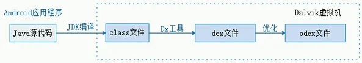


## 1.3 第一个Android应用

### Gradle files Gradle 文件

首次创建应用程序项目时，将显示 **Project > Android** 窗格，其中展开了 `Gradle Scripts` 文件夹，如下所示。如果 `Gradle Scripts` 文件夹未展开，请单击三角形以将其展开。此文件夹包含构建系统所需的所有文件。

`build.gradle(Module:app)` 文件指定其他库和模块的构建配置。您选择的 `Activity` 模板将创建此文件。该文件包括 `minSdkVersion` 属性(用于声明应用程序的最低版本)和 `targetSdkVersion` 属性(用于声明应用程序已针对的最高(最新)版本)。

此文件还包含一个依赖项列表，这些*依赖项*是代码所需的库，例如用于支持各种 Android 版本的 `AppCompat` 库。

### java代码

要查看和编辑 Java 代码，请展开 `app` 文件夹、`java` 文件夹和 `com.example.android.helloworld` 文件夹。双击 `MainActivity.java` 文件，在代码编辑器中将其打开。

`java` 文件夹包含 Java 类文件。每个 [`Activity`](https://developer.android.com/reference/android/app/Activity.html)、[`Service`](https://developer.android.com/reference/android/app/Service.html) 或其他组件(如 [`Fragment`](https://developer.android.com/reference/android/app/Fragment.html))都定义为一个 Java 类，通常位于其自己的文件中。测试和其他 Java 类文件也位于此处。

`java` 文件夹包含三个子文件夹:

1. `com.example.hello.helloworld`(或您指定的**域名):软件包**的所有文件都位于以软件包命名的文件夹中。对于 Hello World 应用程序，有一个包，它仅包含 `MainActivity.java`。用户看到的第一个 `Activity`(屏幕)也初始化应用范围的资源，通常称为 `MainActivity`。(Project **> Android** 窗格中省略了文件扩展名。
2. `com.example.hello.helloworld(androidTest)` :此文件夹用于您的插桩测试，从框架测试文件开始。
3. `com.example.hello.helloworld(test)` :此文件夹用于您的单元测试，从自动创建的框架单元测试文件开始。

### Layout files 布局文件

要查看和编辑布局文件，请展开 `res` 文件夹和 `layout` 文件夹以查看布局文件。这里，布局文件为 `activity_main.xml`。

### Resource files 资源文件

`res` 文件夹包含布局、字符串和图像等资源。`活动`通常与定义为 XML 文件的 UI 视图布局相关联。此 XML 文件通常以其 `Activity` 命名。

**`res` 文件夹包括以下子文件夹:**

- `drawable`:将应用的所有图片都存储在此文件夹中。
- `layout`:每个 `Activity` 至少有一个描述 UI 的 XML 布局文件。对于 Hello World，此文件夹包含 `activity_main.xml`。
- `mipmap`:启动器图标存储在此文件夹中。每个支持的屏幕密度都有一个子文件夹。Android 使用屏幕密度 (每英寸的像素数) 来确定所需的图像分辨率。Android 将所有实际屏幕密度分组为广义密度，例如中等 (mdpi)、高 (hdpi) 或超超高 (xxxhdpi)。`ic_launcher.png` 文件夹包含应用程序支持的所有密度的默认启动器图标。
- `values`:与其在 XML 和 Java 文件中对字符串、尺寸和颜色等值进行硬编码，不如在各自的`值`文件中定义它们。这种做法可以更轻松地更改值，并使值在整个应用程序中保持一致。

**`values` 子文件夹包括以下子文件夹:**

- `colors.xml`:显示所选主题的默认颜色。您可以添加自己的颜色，也可以根据应用程序的要求更改颜色。
- `dimens.xml`:存储不同分辨率的视图和对象的大小。
- `strings.xml`:为所有字符串创建资源。这样做可以很容易地将字符串翻译成其他语言。
- `styles.xml`**:**您的应用程序和主题的所有样式都在此处。样式有助于为您的应用程序提供所有 UI 元素的一致外观。


应用程序中的每个 `Activity` 都作为 Java 类实现。以下类声明扩展了 `AppCompatActivity` 类，以便以与以前版本的 Android 向后兼容的方式实现功能:

```
public class MainActivity extends AppCompatActivity {
    // ... Rest of the code for the class.
}
```

### AndroidManifest文件

Android 系统必须先知道该 `Activity` 存在，然后 Android 系统才能启动应用组件(如 `Activity`)。它通过读取应用的 `AndroidManifest.xml` 文件来实现此目的，该文件描述了 Android 应用的所有组件。此 XML 文件中必须列出每个`活动`以及应用程序的所有组件。

要查看和编辑 `AndroidManifest.xml` 文件，请展开 **Project > Android** 窗格中的 `manifests` 文件夹，然后双击 `AndroidManifest.xml`。其内容显示在编辑窗格中:

```tex
<?xml version="1.0" encoding="utf-8"?>
<manifest xmlns:android="http://schemas.android.com/apk/res/android"
    package="com.example.android.helloworld"> # 命名空间和应用程序标记,Android 清单以 XML 编码，并始终使用 Android 命名空间。package 表达式显示新应用程序的唯一 package 名称。请勿在应用程序发布后更改包表达式。
	# <application> 标记及其结束 </application> 标记定义整个应用程序的清单设置。
    <application
        android:allowBackup="true" # android:allowBackup 属性启用自动应用程序数据备份:
        android:icon="@mipmap/ic_launcher" # 将 mipmap 文件夹中的图标分配给应用程序
        android:label="@string/app_name" # 会突出显示字符串 “Hello World”。如果单击该字符串，它将更改为显示字符串 resource @string/app_name:
        android:roundIcon="@mipmap/ic_launcher_round"
        android:supportsRtl="true"
        android:theme="@style/AppTheme"> # 设置应用的主题，该主题定义 UI 元素(如文本)的外观
        <activity android:name=".MainActivity">
            <intent-filter>
               <action android:name="android.intent.action.MAIN" />

               <category android:name="android.intent.category.LAUNCHER" />
            </intent-filter>
        </activity>
    </application>
</manifest>
```

##  1.4 UI 的布局和资源

### view 视图

UI 由称为 *views* 的对象层次结构组成 — 屏幕的每个元素都是一个 [`View`](https://developer.android.com/reference/android/view/View.html)。`View` 类表示所有 UI 组件的基本构建块，以及提供交互式 UI 组件(如按钮、复选框和文本输入字段)的类的基类。

`View` 有一个位置(表示为一对 left 和 top 坐标)和两个维度(表示为 width 和 height)。位置和尺寸的单位是与密度无关的像素 (dp)。

Android 系统提供了数百个预定义的 `View` 子类。在几节课中介绍的常用 `View` 子类包括:

- [`TextView`](http://developer.android.com/reference/android/widget/TextView.html) 用于显示文本
- [`EditText`](https://developer.android.com/reference/android/widget/EditText.html) 使用户能够输入和编辑文本
- [`Button`](https://developer.android.com/reference/android/widget/Button.html) 和其他可单击元素(例如 [`RadioButton`](https://developer.android.com/reference/android/widget/RadioButton.html)、[`CheckBox`](https://developer.android.com/reference/android/widget/CheckBox.html) 和 [`Spinner`](https://developer.android.com/reference/android/widget/Spinner.html))来提供交互行为
- [`ScrollView`](https://developer.android.com/reference/android/widget/ScrollView.html) 和 [`RecyclerView`](https://developer.android.com/reference/android/support/v7/widget/RecyclerView.html)，用于显示可滚动项
- [`ImageView`](https://developer.android.com/reference/android/widget/ImageView.html) 用于显示图像
- [`ConstraintLayout`](https://developer.android.com/reference/android/support/constraint/ConstraintLayout.html) 和 [`LinearLayout`](https://developer.android.com/reference/android/widget/LinearLayout.html)，用于包含其他视图并对其进行定位

您可以定义一个 `View` 以在屏幕上显示并响应用户点击。还可以将 `View` 定义为接受文本输入，或在需要时不可见。

您可以在布局资源文件中指定 `View` 元素。布局资源以 XML 格式编写，并在 **Project > Android** 窗格的 **res** 文件夹的**布局**文件夹中列出。

### ViewGroup 组

`View` 元素可以在 ViewGroup 中进行分组，[`ViewGroup`](https://developer.android.com/reference/android/view/ViewGroup.html) 充当容器。父子关系为父子关系，其中*父*关系为 `ViewGroup`，*子*关系为 `View` 或其他 `ViewGroup`。以下是常用的 `ViewGroup` 组:

- [`ConstraintLayout`](https://developer.android.com/reference/android/support/constraint/ConstraintLayout.html):一个组，它使用约束连接将界面元素(子 `View` 元素)放置到其他元素和布局边缘(父 `View`)。
- [`ScrollView`](https://developer.android.com/reference/android/widget/ScrollView.html):一个包含另一个子 `View` 元素并允许滚动子 `View` 元素的组。
- [`RecyclerView`](https://developer.android.com/reference/android/support/v7/widget/RecyclerView.html):一个包含其他 `View` 元素或 `ViewGroup` 组列表的组，并支持通过在屏幕上动态添加和移除 `View` 元素来滚动它们。

### Layout ViewGroup

界面的 `View` 元素按层次结构进行组织。此层次结构的*根*目录是一个 [`ViewGroup`](https://developer.android.com/reference/android/view/ViewGroup.html)，其中包含整个屏幕的布局。`ViewGroup` 可以包含子 `View` 元素或其他 `ViewGroup` 组，如下图所示。

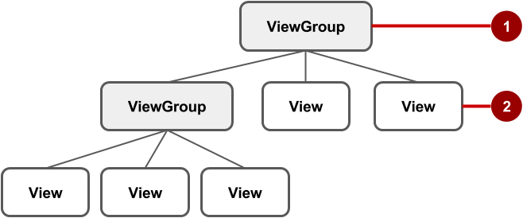

在上图中:

1. *根* `ViewGroup`。
2. 第一组子 `View` 元素和父元素为根的 `ViewGroup` 组。

某些 `ViewGroup` 组被指定为*布局*，因为它们以特定方式组织子 `View` 元素，并且通常用作根 `ViewGroup`。布局的一些示例包括:

- [`ConstraintLayout`](http://tools.android.com/tech-docs/layout-editor):一组子 `View` 元素，使用约束条件、边缘和参考线来控制元素相对于布局中其他元素的定位方式。`ConstraintLayout` 旨在让您在布局编辑器中轻松点击和拖动 `View` 元素。
- [`LinearLayout`](https://developer.android.com/reference/android/widget/LinearLayout.html):一组水平或垂直放置和对齐的子 `View` 元素。
- [`RelativeLayout`](https://developer.android.com/reference/android/widget/RelativeLayout.html):一组子 `View` 元素，其中每个元素都相对于 `ViewGroup` 中的其他元素进行定位和对齐。换句话说，子 `View` 元素的位置可以相对于彼此或与父 `ViewGroup` 进行描述。
- [`TableLayout`](https://developer.android.com/reference/android/widget/TableLayout.html):一组子 `View` 元素，排列成行和列。
- [`FrameLayout`](https://developer.android.com/reference/android/widget/FrameLayout.html):堆栈中的一组子 `View` 元素。`FrameLayout` 旨在在屏幕上屏蔽一个区域以显示一个 `View`。Child `View` 元素以堆栈形式绘制，最近添加的 child 元素位于顶部。`FrameLayout` 的大小是其最大的子 `View` 元素的大小。
- [`GridLayout`](https://developer.android.com/reference/android/widget/GridLayout.html):将其子 `View` 元素放置在可滚动的矩形网格中的组。

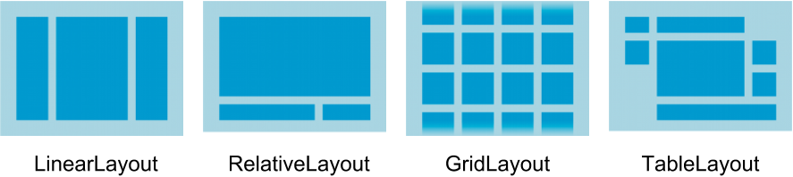

**提示**: 在 [Common Layout Objects](https://developer.android.com/guide/topics/ui/layout-objects.html) 中了解有关不同布局类型的更多信息。

下面显示了一个带有子 `View` 元素的 `LinearLayout` 的简单示例，如布局文件图 (`activity_main.xml`)、层次结构图 (右上角) 和实际完成布局的屏幕截图 (右下角)。

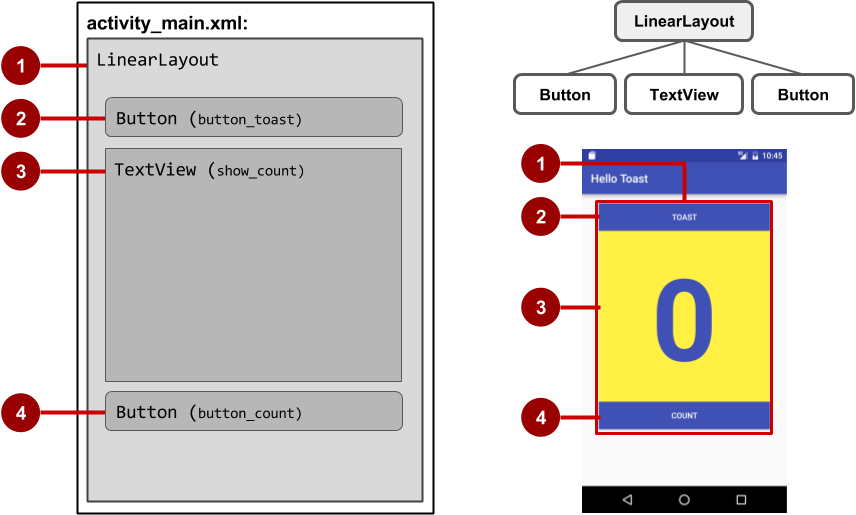

在上图中:

1. `LinearLayout`(根 `ViewGroup`)包含垂直方向的所有子 `View` 元素。
2. `Button` (`button_toast`)。第一个子 `View` 元素显示在 `LinearLayout` 的顶部。
3. `TextView` (`show_count`) 的第二个子 `View` 元素显示在 `LinearLayout` 中第一个子 `View` 元素的下。
4. `Button` (`button_count`)。第三个子 `View` 元素显示在 `LinearLayout` 中第二个子 `View` 元素的下。

对于在屏幕上显示许多 `View` 元素的应用来说，布局层次结构可能会变得复杂。了解层次结构非常重要，因为它会影响 `View` 元素是否可见以及绘制它们的效率。

**提示**:您可以使用 [Hierarchy Viewer](https://developer.android.com/studio/profile/hierarchy-viewer-walkthru.html) 浏览应用的布局层次结构。它显示层次结构的树状视图，并允许您分析 `View` 元素在 Android 设备上的性能。性能问题将在下一章中介绍。

### layout 编辑器

您可以在布局编辑器中或通过输入 XML 代码来定义布局。

布局编辑器显示 XML 代码的可视化表示形式。您可以将 View elements (`View`元素) 拖动到 design 或 blueprint 窗格中，并为其排列、调整大小和指定属性。您会立即看到所做更改的效果。

要使用布局编辑器，请双击 XML 布局文件 (**activity_main.xml**)。此时将显示布局编辑器，其中突出显示了底部的 **Design** 选项卡。(如果 **Text** 选项卡突出显示并且您看到 XML 代码，请单击 **Design** 选项卡。对于 Empty Activity 模板，布局如下图所示。

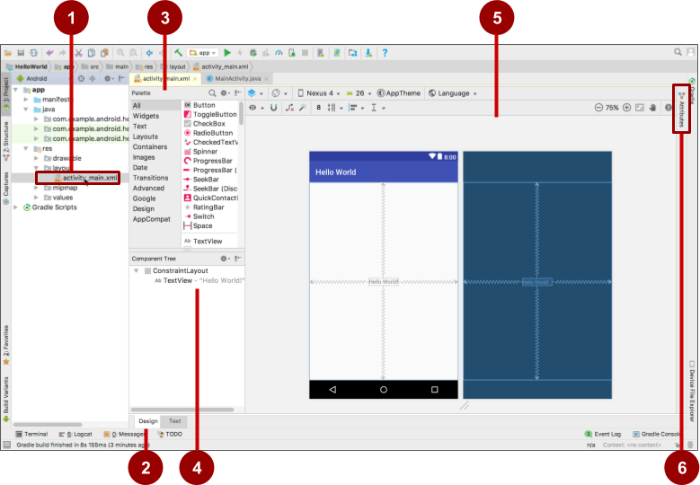

1. XML 布局文件 (**activity_main.xml**)。
2. **Design (设计**) 和 **Text (文本**) 选项卡。单击 **Design** 查看布局编辑器，单击 **Text** 查看 XML 代码。
3. **调色板**窗格。Palette (调色板) 窗格提供 UI 元素和布局的列表。通过将元素或布局拖动到设计窗格中，将元素或布局添加到 UI 中。
4. **Component Tree (组件树**)。Component Tree 窗格显示布局层次结构。单击此窗格中的 `View` 元素或 `ViewGroup` 以将其选中。`视图`元素被组织成父级和子级的树层次结构，其中子级继承其父级的属性。在上图中，`TextView` 是 `ConstraintLayout` 的子级。
5. Design 和 Blueprint 窗格。将 `View` elements (视图元素) 从 **Palette (调色板**) 窗格拖动到设计或 Blueprint 窗格，以将它们放置在布局中。在上图中，布局只显示了一个元素:显示 “Hello World” 的 `TextView`。
6. **Attributes (属性)** 选项卡。单击 **Attributes** 以显示 **Attributes** 窗格，用于设置 `View` 元素的属性。

### 直接编辑 XML

有时，直接编辑 XML 代码会更快、更容易，尤其是在复制和粘贴类似视图的代码时。

要查看和编辑 XML 代码，请打开 XML 布局文件。此时将显示布局编辑器，其中突出显示了底部的 **Design** 选项卡。单击 **Text** 选项卡以查看 XML 代码。下面显示了一个 `LinearLayout` 的 XML 代码，其中有两个 `Button` 元素，中间有一个 `TextView`:

```xml
<LinearLayout xmlns:android="http://schemas.android.com/apk/res/android"
    xmlns:app="http://schemas.android.com/apk/res-auto"
    xmlns:tools="http://schemas.android.com/tools"
    android:layout_width="match_parent"
    android:layout_height="match_parent"
    android:orientation="vertical"
    tools:context="com.example.android.hellotoast.MainActivity">

    <Button
        android:id="@+id/button_toast"
        android:layout_width="match_parent"
        android:layout_height="wrap_content"
        android:layout_marginEnd="8dp"
        android:layout_marginStart="8dp"
        android:layout_marginTop="8dp"
        android:background="@color/colorPrimary"
        android:onClick="showToast"
        android:text="@string/button_label_toast"
        android:textColor="@android:color/white" />

    <TextView
        android:id="@+id/show_count"
        android:layout_width="match_parent"
        android:layout_height="wrap_content"
        android:gravity="center_vertical"
        android:layout_marginBottom="8dp"
        android:layout_marginEnd="8dp"
        android:layout_marginStart="8dp"
        android:layout_marginTop="8dp"
        android:background="#FFFF00"
        android:text="@string/count_initial_value"
        android:textAlignment="center"
        android:textColor="@color/colorPrimary"
        android:textSize="160sp"
        android:textStyle="bold"
        android:layout_weight="1"/>

    <Button
        android:id="@+id/button_count"
        android:layout_width="match_parent"
        android:layout_height="wrap_content"
        android:layout_marginBottom="8dp"
        android:layout_marginEnd="8dp"
        android:layout_marginStart="8dp"
        android:background="@color/colorPrimary"
        android:onClick="countUp"
        android:text="@string/button_label_count"
        android:textColor="@android:color/white" />
</LinearLayout>
```

### 视图属性

视图具有一些*属性*，这些属性定义视图在屏幕上的显示位置、大小、视图与其他视图的关系以及它如何响应用户输入。在 XML 中或在布局编辑器的 **Attributes** 窗格中定义视图时，这些属性称为 *attributes*。

例如，在以下 `TextView` 的 XML 说明中，`android:id`、`android:layout_width`、`android:layout_height`、`android:background` 是自动转换为 `TextView` 属性的 XML 属性:

```xml
<TextView
       android:id="@+id/show_count"
       android:layout_width="match_parent"
       android:layout_height="wrap_content"
       android:background="@color/myBackgroundColor"
       android:textStyle="bold"
       android:text="@string/count_initial_value" />
```

属性通常采用以下形式:

- `android:attribute_name="value"`
- `android:attribute_name="值"`

*attribute_name* 是属性的名称。*该值*是具有属性值的字符串。例如:

```xml
android:textStyle="bold"
```

如果*值*是资源(如颜色)，`则 @` 符号指定资源的类型。例如:

```xml
android:background="@color/myBackgroundColor"
```

background 属性设置为标识为 `myBackgroundColor` 的颜色资源，该资源声明为 `#FFF043`。本章的 [样式相关属性](https://google-developer-training.github.io/android-developer-fundamentals-course-concepts-v2/unit-1-get-started/lesson-1-build-your-first-app/1-2-c-layouts-and-resources-for-the-ui/1-2-c-layouts-and-resources-for-the-ui.html#style_related) 中介绍了颜色资源。

每个 `View` 和 `ViewGroup` 都支持其自己的各种 XML 属性:

- 某些属性特定于 `View` 子类。例如，`TextView` 子类支持 `textSize` 属性。扩展 `TextView` 子类的任何元素都会继承这些特定于子类的属性。
- 某些属性对于所有 `View` 元素都是通用的，因为它们是从根 [`View`](https://developer.android.com/reference/android/view/View.html) 类继承的。`android:id` 属性就是一个例子。

有关特定属性的描述，请参阅 [`View`](https://developer.android.com/reference/android/view/View.html) 类文档的概述部分

### 标识视图

要唯一标识 `View` 并从代码中引用它，您必须为其指定一个 `id`。`android:id` 属性允许您指定唯一 `ID`，即 `View` 的资源标识符。

例如:

```xml
android:id="@+id/button_count"
```

该属性的 `@+id/button_count` 部分为 `Button`(`View` 的子类)创建一个名为 `button_count` `的 ID`。您使用加号 `(+`) 表示您正在创建新 `ID`。

### 引用视图

要引用现有资源标识符，请省略加号 `(+`)。例如，要在*另一个*属性(例如 `android:layout_toLeftOf`(如下一节所述))中通过其 `id` 来引用 `View` 以控制 `View` 的位置，您可以使用:

```xml
android:layout_toLeftOf="@id/show_count"
```

在上面的属性中，`@id/show_count` 指的是资源标识符`为 show_count` `的 View`。该属性将元素定位在 `show_count``View` 的 “左侧”。

### 定位视图

`View` 或 `ViewGroup` 需要一些与布局相关的定位属性，这些属性会在您将 `View` 或 `ViewGroup` 添加到 XML 布局时自动显示。

#### LinearLayout 定位

`LinearLayout` 需要设置以下属性:

- [`android:layout_width`](https://developer.android.com/reference/android/view/ViewGroup.LayoutParams.html#attr_android:layout_width)
- [`android:layout_height`](https://developer.android.com/reference/android/view/ViewGroup.LayoutParams.html#attr_android:layout_height)
- [`android:orientation`](https://developer.android.com/reference/android/widget/LinearLayout.html#attr_android:orientation)

`android:layout_width` 和 `android:layout_height` 属性可以采用以下三个值之一:

- `match_parent` 将展开 UI 元素以按宽度或高度填充其父元素。当 LinearLayout 是根 `ViewGroup` 时，它会扩展到设备屏幕的大小。对于根 `ViewGroup` 中的 UI 元素，它会扩展到父 `ViewGroup` 的大小。
- `wrap_content` 将 UI 元素缩小到其内容的大小。如果没有内容，则元素将变为不可见。
- 使用固定数量的 `dp`([与密度无关的像素](https://developer.android.com/training/multiscreen/screendensities.html))来指定固定大小，并根据设备的屏幕大小进行调整。例如，`16dp` 表示 16 个与密度无关的像素。与密度无关的像素和其他尺寸在本章的“[尺寸](https://google-developer-training.github.io/android-developer-fundamentals-course-concepts-v2/unit-1-get-started/lesson-1-build-your-first-app/1-2-c-layouts-and-resources-for-the-ui/1-2-c-layouts-and-resources-for-the-ui.html#dimensions)”中介绍。

`android:orientation` 可以是:

- `horizontal`**:**视图从左到右排列。
- `vertical`**:**视图从上到下排列。

其他与布局相关的属性包括:

- `android:layout_gravity`:此属性与 UI 元素一起使用，以控制元素在其父元素中的排列位置。例如，以下属性使 UI 元素在父 `ViewGroup` 中水平居中:

```
android:layout_gravity="center_horizontal"
```

- `Padding` 是 UI 元素边缘与元素内容之间的空间，以与密度无关的像素为单位，如下图所示。
  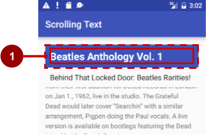

  上图中:(1) *Padding* 是 `TextView` 的边缘(虚线)和 `TextView` 的内容(实线)之间的空间。Padding 与 margin 不同，*margin*是从 `View` 边缘到其父级的空间。

- `View` 的大小包括其内边距。以下是常用的 `padding` 属性:

  - `android:padding`:设置所有四个边缘的内边距。
  - `android:paddingTop`:设置顶部边缘的内边距。
  - `android:paddingBottom`:设置底部边缘的内边距。
  - `android:paddingLeft`:设置左边缘的内边距。
  - `android:paddingRight`:设置右边缘的内边距。
  - `android:paddingStart`:设置视图开头的内边距(以像素为单位)。用于代替上面列出的 padding 属性，尤其是对于长而窄的视图。
  - `android:paddingEnd`:设置视图结束边缘的内边距(以像素为单位)。与 `android:paddingStart` 一起使用。

**提示**:如需查看 `LinearLayout` 的所有 XML 属性，请参阅 [`LinearLayout`](https://developer.android.com/reference/android/widget/LinearLayout.html) 类定义的 Summary 部分。其他根布局(例如 [`RelativeLayout`](http://developer.android.com/guide/topics/ui/layout/relative.html) 和 [`AbsoluteLayout`](https://developer.android.com/reference/android/widget/AbsoluteLayout.html))也在 Summary 部分中列出了它们的 XML 属性。

#### RelativeLayout 定位

另一个有用的布局 `Viewgroup` 是 [`RelativeLayout`](https://developer.android.com/reference/android/widget/RelativeLayout.html)，您可以使用它来相对于彼此或相对于父 View 元素定位子 `View` 元素。可与 `RelativeLayout` 一起使用的属性包括:

- [`android:layout_toLeftOf`](https://developer.android.com/reference/android/widget/RelativeLayout.LayoutParams.html#attr_android:layout_toLeftOf):将此 `View` 的右边缘定位到另一个 `View`(由其 `ID` 标识)的左侧。
- [`android:layout_toRightOf`](https://developer.android.com/reference/android/widget/RelativeLayout.LayoutParams.html#attr_android:layout_toRightOf):将此 `View` 的左边缘定位到另一个 `View`(由其 `ID` 标识)的右侧。
- [`android:layout_centerHorizontal` ](https://developer.android.com/reference/android/widget/RelativeLayout.LayoutParams.html#attr_android:layout_centerHorizontal):将此 `View` 在其父级中水平居中。
- [`android:layout_centerVertical`](https://developer.android.com/reference/android/widget/RelativeLayout.LayoutParams.html#attr_android:layout_centerVertical):将此 `View` 在其父级中垂直居中。
- [`android:layout_alignParentTo`p](https://developer.android.com/reference/android/widget/RelativeLayout.LayoutParams.html#attr_android:layout_alignParentTop):定位此 `View` 的上边缘，使其与父级的上边缘匹配。
- [`android:layout_alignParentBottom` ](https://developer.android.com/reference/android/widget/RelativeLayout.LayoutParams.html#attr_android:layout_alignParentBottom):定位此`视图`的下边缘以匹配父视图的下边缘。

有关 `RelativeLayout` 中 `View` 和 `View` 子类元素的属性的完整列表，请参阅 [`RelativeLayout.LayoutParams`](https://developer.android.com/reference/android/widget/RelativeLayout.LayoutParams.html)。

### 与样式相关的属性

您可以指定 style 属性来自定义 `View` 的外观。*没有* style 属性(例如 `android:textColor`、`android:textSize` 和 `android:background`)的 `View` 采用应用主题中定义的样式。

以下是有关使用布局编辑器的课程中使用的与样式相关的属性:

- `android:background`:指定要用作背景的颜色或可绘制资源。
- `android:text`:指定要在视图中显示的文本。
- `android:textColor`:指定文本颜色。
- `android:textSize`:指定文本大小。
- `android:textStyle`:指定文本样式，例如`粗体`。

### Resource files 资源文件

资源文件是一种将静态值与代码分离的方法，这样您就不必更改代码本身来更改值。您可以将所有字符串、布局、尺寸、颜色、样式和菜单文本单独存储在资源文件中。

在查看 Project > Android 窗格时，资源文件存储在位于 `res` 文件夹中的文件夹中。这些文件夹包括:

- `drawable`:用于图片和图标
- `layout`:用于布局资源文件
- `menu`:用于菜单项
- `mipmap`:用于 Launcher 使用的预先计算、优化的应用程序图标集合
- The syntax to reference a resource in an XML layout is as follows:
  在 XML 布局中引用资源的语法如下:

`@`*package_name*`:`*resource_type*`/`*resource_name*

- *package_name* 是资源所在的包的名称。当您引用存储在工程的 `res` 文件夹中的资源时，不需要包名称，因为这些资源来自同一个包。
- *resource_type* 是资源类型的 `R` 子类。有关资源类型以及如何引用它们的更多信息，请参阅[资源类型](https://developer.android.com/guide/topics/resources/available-resources.html)。
- *resource_name* 是不带扩展名的资源文件名，或者是 XML 元素中的 `android:name` 属性值。

例如，以下 XML 布局语句将 `android:text` 属性设置为`字符串`资源:

```
android:text="@string/button_label_toast"
```

- 不包含*任何package_name*，因为资源存储在项目的 `strings.xml` 文件中。
- *resource_type* 是`字符串`。
- *resource_name* `是 button_label_toast。`

另一个示例:此 XML 布局语句将 `android:background` 属性设置为 `color` 资源，并且由于该资源是在项目(在 `colors.xml` 文件中)中定义的，因此未指定 *package_name*:

```
android:background="@color/colorPrimary"
```

在以下示例中，XML 布局语句将 `android:textColor` 属性设置为`颜色`资源。但是，资源不是在项目中定义的，而是由 Android 提供的，因此您需要指定*package_name*，即 `android`，后跟一个冒号:

```
android:textColor="@android:color/white"
```

**提示**: 有关从代码访问资源的更多信息，请参阅[访问资源](http://developer.android.com/guide/topics/resources/accessing-resources.html)。有关 Android 颜色常量，请参阅 [Android 标准 R.color 资源](http://developer.android.com/reference/android/R.color.html)。

### Values 资源文件

将字符串和颜色等值保存在单独的资源文件中可以更轻松地管理它们，尤其是在布局中多次使用它们时。

例如，必须将字符串保存在单独的资源文件中，以便翻译和本地化您的应用程序，以便您可以为每种语言创建一个字符串资源文件，而无需更改代码。图像、颜色、尺寸和其他属性的资源文件对于开发适用于不同设备屏幕大小和方向的应用程序非常方便。

#### Strings 字符串

字符串资源位于 `strings.xml` 文件中(位于 **Project > Android** 窗格中的 **res > 值**内)。您可以通过在编辑器窗格中打开此文件来直接编辑它:

```
<resources>
    <string name="app_name">Hello Toast</string>
    <string name="button_label_count">Count</string>
    <string name="button_label_toast">Toast</string>
    <string name="count_initial_value">0</string>
</resources>
```

`name`(例如，`button_label_count`)是您在 XML 代码中使用的资源名称，如以下属性所示:

```
android:text="@string/button_label_count"
```

此`name`的字符串值是 `<string></string>` 标记中包含的单词 (`Count`)。(除非引号是字符串值的一部分，否则不要使用引号。

#### Extracting strings to resources 将字符串提取到资源

您还应该*将* XML 布局文件中的硬编码字符串提取到字符串资源中。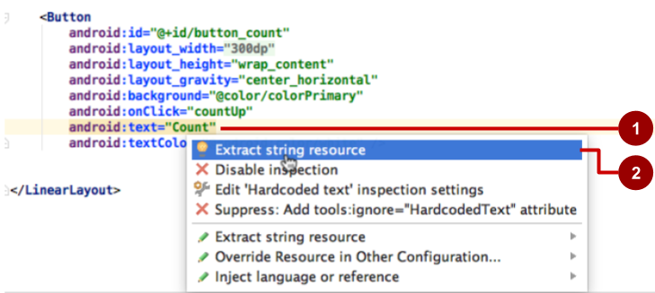

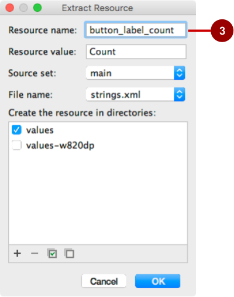

要在 XML 布局中提取硬编码字符串，请执行以下步骤，如上图所示:

1. 单击硬编码字符串，然后按 **Alt-Enter**(在 Windows 中)或 **Option-Return**(在 Mac OS X 中)。
2. 选择 **Extract string resource (提取字符串资源**)。
3. 编辑字符串值的 **Resource name (资源名称**)。

然后，您可以在 XML 代码中使用资源名称。使用表达式 `“@string/resource_name”` (包括引号) 来引用字符串资源:

```
android:text="@string/button_label_count"
```

#### Colors 颜色

颜色资源位于 `colors.xml` 文件中(位于 **Project > Android** 窗格中的 **res > 值**内)。您可以直接在编辑器窗格中编辑此文件:

```
<resources>
    <color name="colorPrimary">#3F51B5</color>
    <color name="colorPrimaryDark">#303F9F</color>
    <color name="colorAccent">#FF4081</color>
    <color name="myBackgroundColor">#FFF043</color>
</resources>
```

`name`(例如，`colorPrimary`)是您在 XML 代码中使用的资源名称:

```
android:textColor="@color/colorPrimary"
```

此`name`的颜色值是 `<color></color>` 标记中包含的十六进制颜色值 (`#3F51B5`)。十六进制值指定红色、绿色和蓝色 (RGB) 值。该值始终以井号 (`#`) 字符开头，后跟 Alpha-红-绿-蓝信息。例如，black 的十六进制值为 #000000，而 sky blue 变体的十六进制值为 #559fe3。基色值在 [Color](https://developer.android.com/reference/android/graphics/Color.html) 类文档中列出。

`colorPrimary` 颜色是预定义的基色之一，用于应用程序栏。例如，在生产应用程序中，您可以自定义此应用程序以适合您的品牌。对其他 UI 元素使用基色可创建统一的 UI。

**提示**:有关 Android 颜色的 Material Design 规范，请参阅[样式](https://material.google.com/style/color.html#)[和使用 Material 主题](https://developer.android.com/training/material/theme.html)。有关常见的颜色十六进制值，请参阅[颜色十六进制颜色代码](http://www.color-hex.com/)。有关 Android 颜色常量，请参阅 [Android 标准 R.color 资源](http://developer.android.com/reference/android/R.color.html)。

您可以在 `colors.xml` 中颜色资源声明旁边的左旁注中，以及使用布局 XML 文件中资源名称的属性旁边的左旁注中看到一小块颜色选择。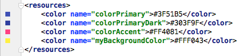

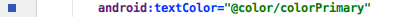

**提示**: 要查看弹出窗口中的颜色，请打开 Autopopup 文档功能。选择**首选项 > 编辑器 > 常规 > 代码完成**，然后选择“自动弹出文档(毫秒)”选项。然后，您可以将光标悬停在颜色资源名称上以查看颜色。

#### Dimensions 尺寸

为了使维度更易于管理，您应该将维度与代码分开，尤其是在需要为具有不同屏幕密度的设备调整布局时。将维度与代码分开还可以轻松地为 UI 元素提供一致的大小，并通过更改一个维度资源来更改多个元素的大小。

维度资源位于 `dimens.xml` 文件中(位于 **Project > Android** 窗格中的 **res > 值**内)。`dimens.xml` 文件实际上可以是一个文件夹，其中包含多个 `dimens.xml` 文件 — 每个设备屏幕分辨率对应一个文件。您可以直接编辑每个 `dimens.xml` 文件:

```
<resources>
    <!-- Default screen margins, per the Android Design guidelines. -->
    <dimen name="activity_horizontal_margin">16dp</dimen>
    <dimen name="activity_vertical_margin">16dp</dimen>
    <dimen name="my_view_width">300dp</dimen>
    <dimen name="count_text_size">200sp</dimen>
    <dimen name="counter_height">300dp</dimen>
</resources>
```

`name`(例如，`activity_horizontal_margin`)是您在 XML 代码中使用的资源名称:

```
android:paddingLeft="@dimen/activity_horizontal_margin"
```

此`name`的值是 `<dimen></dimen>` 标签中包含的测量值 (`16dp`)。

您可以采用与字符串相同的方式提取维度:

1. 单击硬编码维度，然后在 Windows 中按 **Alt-Enter**，或在 Mac OS X 中按 **Option-Return**。
2. 选择 **Extract dimension resource(提取维度资源**)。
3. 编辑维度值的 **Resource name (资源名称**)。

[与密度无关的像素](https://developer.android.com/training/multiscreen/screendensities.html) (`dp`) 与屏幕分辨率无关。例如，`10px`(10 个固定像素)在更高分辨率的屏幕上看起来要小得多，但 Android 会缩放 1`0dp`(10 个与设备无关的像素)以在不同分辨率的屏幕上看起来正确。还可以使用*缩放像素* (`sp`) 大小将文本大小设置为在不同分辨率的屏幕上正确显示。

**提示**: 有关 `dp` 和 `sp` 单位的更多信息，请参阅[支持不同的密度](http://developer.android.com/training/multiscreen/screendensities.html)。

#### Styles 风格

样式是一种资源，用于指定常见属性，例如高度、填充、字体颜色、字体大小、背景颜色。样式用于修改视图外观的属性。

样式在 `styles.xml` 文件中定义(在 **Project > Android** 窗格的 **res > 值**内)。您可以直接编辑此文件。样式将在后面的章节中介绍 Material Design 规范。

#### Other resource files 其他资源文件

Android Studio 定义了其他章节中介绍的其他资源:

- 图片和图标:`drawable` 文件夹提供图标和图片资源。如果您的应用没有 `drawable` 文件夹，您可以在 `res` 文件夹中手动创建该文件夹。有关可绘制资源的更多信息，请参阅 Android 开发者指南的“应用资源”部分中的[可绘制资源](https://developer.android.com/guide/topics/resources/drawable-resource.html)。
- 优化的图标:`mipmap` 文件夹通常包含 Launcher 使用的预先计算、优化的应用程序图标集合。展开该文件夹，可以看到图标版本是否存储为不同屏幕密度的资源。
- 菜单:您可以使用 XML 资源文件定义菜单项，并将它们存储在项目中`的 menu` 文件夹中。菜单将在后面的章节中介绍。

### 响应 View clicks

当用户点击或单击可点击的 `View`(如 [`Button`](https://developer.android.com/reference/android/widget/Button.html)、[`ImageButton`](https://developer.android.com/reference/android/widget/ImageButton.html)、[`ImageView`](https://developer.android.com/reference/android/widget/ImageView.html) 或 [`FloatingActionButton`](https://developer.android.com/reference/android/support/design/widget/FloatingActionButton.html))时，将触发 *click 事件*。当此类事件发生时，您的代码将执行一个作。为了使此模式正常工作，您必须:

- 编写一个 Java 方法，用于执行您希望应用程序在此事件发生时执行的特定作。此方法通常称为*事件处理程序*。
- 将此事件处理程序方法关联到 `View`，以便在事件发生时执行该方法。

#### onClick 属性

Android Studio 提供了`设置可点击`视图以及将事件处理程序与 `View` 关联的快捷方式:在 XML 布局中使用 `android:onClick` 属性。

例如，以下 XML 属性将 `Button` 设置为可单击，并将 `showToast()` 设置为事件处理程序:

```xml
<Button
    android:id="@+id/button_toast"
    android:onClick="showToast"
```

当用户点按 `button_toast``Button`时，该按钮的 `android:onClick` 属性会调用 `showToast()` 方法。要使用 `android:onClick` 属性，`showToast()` 方法必须是 `public` 并返回 `void`。要知道哪个 `View` 调用了该方法，`showToast()` 方法必须需要一个 `view` 参数。

Android Studio 提供了一个快捷方式，用于在与 XML 布局关联的 `Activity` 的代码中创建事件处理程序*存根*(您稍后可以填写的方法的占位符)。请执行以下步骤:

1. 在 XML 布局文件(例如 `activity_main.xml`)中，点击 `android:onClick` 属性语句(上面 XML 代码段中的 `showToast`)中的方法名称。
2. 在 Windows 中按 **Alt-Enter**，在 Mac OS X 中按 **Option-Return**，然后选择**“创建 onClick 事件处理程序**”。
3. 选择与布局文件关联的 `Activity`(如 **MainActivity**)，然后单击 **OK。**Android Studio 会在 `MainActivity.java` 中创建一个占位符方法存根，如下所示。

```java
public void showToast(View view) {
        // Do something in response to the button click.
}
```

#### 更新视图

要更新 `View`(例如替换 `TextView` 中的文本)，您的代码必须首先从 `View` 实例化一个对象。然后，您的代码可以更新对象，从而更新屏幕。

要在代码中引用 `View`，请使用 `View` 类的 [`findViewById()`](https://developer.android.com/reference/android/view/View.html#findViewById(int)) 方法，该方法根据资源 `ID` 查找 `View`。例如，以下语句将 `mShowCount` 设置为布局中资源 ID `show_count`的 `TextView`:

```java
mShowCount = (TextView) findViewById(R.id.show_count);
```

从此时起，您的代码可以使用 `mShowCount` 来表示 `TextView`，以便在更新 `mShowCount` 时，`TextView` 也会更新。

例如，当点击以下具有 `android:onClick` 属性的 `Button` 时，`onClick` 会调用 `countUp()` 方法:

```xml
android:onClick="countUp"
```

您可以实现 `countUp()` 来增加计数，将计数转换为字符串，并将字符串设置为 `mShowCount` 对象的文本:

```java
public void countUp(View view) {
        mCount++;
        if (mShowCount != null)
            mShowCount.setText(Integer.toString(mCount));
}
```

由于您已经将 `mShowCount` 与 `TextView` 相关联以显示计数，因此 `mShowCount.setText()` 方法会更新屏幕上的 `TextView`。

## 1.5 文本和滚动视图

本章介绍了应用程序中最常用的 [`View`](https://developer.android.com/reference/android/view/View.html) 子类之一：[`TextView`](https://developer.android.com/reference/android/widget/TextView.html)，它在屏幕上显示文本内容。`TextView` 可用于显示消息、来自数据库的响应，甚至是用户可以滚动的整篇杂志样式的文章。本章还介绍了如何创建文本和其他元素的滚动视图。

### TextView 文本视图

您可能经常使用的一个 `View` 子类是 [`TextView`](https://developer.android.com/reference/android/widget/TextView.html) 类，它在屏幕上显示文本。您可以将 `TextView` 用于任何大小的 `View`，从单个字符或单词到整个屏幕的文本。您可以向布局中的 `TextView` 添加资源 `ID`，并使用布局文件中的属性控制文本的显示方式。
您可以使用 TextView 的资源 `ID` 在 Java 代码中引用 `TextView`，以便从代码中更新文本或其属性。如果要允许用户编辑文本，请使用 [`EditText`](https://developer.android.com/reference/android/widget/EditText.html)，它是 `TextView` 的一个子类，允许文本输入和编辑。您将在另一节课中了解有关 `EditText` 的所有信息。

#### TextView 属性

您可以使用 `TextView` 的 XML 属性来控制：

- `TextView` 在布局中的位置（与任何其他视图一样）
- `TextView` 本身的显示方式，例如使用背景颜色
- 文本在 `TextView` 中的外观，例如初始文本及其样式、大小和颜色

例如，要设置视图的宽度、高度和初始文本值：

```xml
<TextView
   android:layout_width="wrap_content"
   android:layout_height="wrap_content"
   android:text="Hello World!"
   <!-- more attributes -->
/>
```

您可以将文本字符串提取到字符串资源（可能称为 `hello_world`）中，以便于应用程序的多语言版本维护，或者将来需要更改字符串。提取字符串后，使用带有 `@string/` 的字符串 resource name 指定文本：

```xml
<TextView
   android:layout_width="wrap_content"
   android:layout_height="wrap_content"
   android:text="@string/hello_world"
   <!-- more attributes -->
/>
```

除了 `android：layout_width` 和 `android：layout_height`（`TextView` 需要）之外，`TextView` 最常用的属性如下：

- [`android：text`](https://developer.android.com/reference/android/widget/TextView.html#attr_android:text)：设置要显示的文本。
- [`android：textColor`](https://developer.android.com/reference/android/widget/TextView.html#attr_android:textColor)：设置文本的颜色。您可以将属性设置为颜色值、预定义资源或主题。颜色资源和主题在其他章节中介绍。
- [`android：textAppearance`](https://developer.android.com/reference/android/widget/TextView.html#attr_android:textAppearance)：文本的外观，包括其颜色、字体、样式和大小。将此属性设置为已定义这些值的预定义样式资源或主题。
- [`android：textSize`](https://developer.android.com/reference/android/widget/TextView.html#attr_android:textSize)：设置文本大小（如果 `android：textAppearance` 尚未设置）。使用 `sp`（缩放像素）大小，例如 `20sp` 或 `14.5sp`，或将属性设置为预定义的资源或主题。
- [`android：textStyle`](https://developer.android.com/reference/android/widget/TextView.html#attr_android:textStyle)：设置文本样式（如果尚未由 `android：textAppearance` 设置）。使用 `normal`、`bold`、`italic`， or `bold`|`斜体`。
- [`android：typeface`](https://developer.android.com/reference/android/widget/TextView.html#attr_android:typeface)：设置文本字体（如果尚未由 `android：textAppearance` 设置）。使用 `normal`、`sans`、`serif` 或 `monospace`。
- [`android：lineSpacingExtra`](https://developer.android.com/reference/android/widget/TextView.html#attr_android:lineSpacingExtra)：设置文本行之间的额外间距。使用 `sp` （缩放像素） 或 dp （与设备无关的像素） 大小，或将属性设置为预定义的资源或主题。
- [`android：autoLink`](https://developer.android.com/reference/android/widget/TextView.html#attr_android:autoLink)：控制是否自动查找 URL 和电子邮件地址等链接并将其转换为可点击（可触摸）的链接。

将以下选项之一与 `android：autoLink` 结合使用：

- `none`：不匹配任何模式（默认）。
- `web`：匹配 Web URL。
- `email`：匹配电子邮件地址。
- `phone`：匹配电话号码。
- `map`：匹配地图地址。
- `all`：匹配所有模式（相当于 web|email|phone|map）。

例如，要设置属性以匹配 Web URL，请使用 `android：autoLink=“web”。`

在文本中使用嵌入的标签

在访问杂志或报纸文章的应用程序中，出现的文章可能来自在线资源，或者可能提前保存在设备上的数据库中。您还可以在 strings.xml 资源中将文本创建为单个长字符串。

在任一情况下，文本都可能包含嵌入的 HTML 标签或其他文本格式代码。要在文本视图中正确显示，必须按照以下规则设置文本格式：

- 输入 **\n** 表示行尾，输入 **\n** 表示空行。您需要添加行尾字符，以防止段落相互碰撞。
- 如果文本中有撇号 （`'`），则必须在它前面加上反斜杠 （**\'**） 来*转义*它。如果文本中有双引号，则还必须对其进行转义 （**\”）。** 您还必须转义任何其他非 ASCII 字符。有关更多详细信息，请参阅 String Resources 的 “[Formatting and Styling](https://developer.android.com/guide/topics/resources/string-resource.html#FormattingAndStyling)” 部分。
- 在应为粗体的单词周围输入 HTML 和 **</b>** 标记。
- 在应为斜体的单词周围输入 HTML 和 **</i>** 标记。但是请注意，如果在斜体短语中使用卷曲的撇号，则应将它们替换为直撇号。
- 您可以通过组合标签来组合粗体和斜体，如 ***\**...\*\**** 的话。。。**</i></b>**.其他 HTML 标记将被忽略。
- 要在 `strings.xml` 文件中创建长文本字符串，请将整个文本括在 `<string name=“`*your_string_name*`”></string>`（*your_string_name* 是您为字符串资源提供的名称，例如 `article_text`）中。
- 当您在 `strings.xml` 文件中输入或粘贴文本时，文本行不会回绕到下一行，而是延伸到右边距之外。这是正确的行为 — 从左边距开始的每行新文本代表一个完整的段落。

**提示：** 如果要查看以 strings.xml 括起来的文本，可以按 Return 键输入硬行尾，或者先在文本编辑器中使用硬行尾设置文本格式。结局不会显示在屏幕上。

#### 在代码中引用 TextView

要在 Java 代码中引用 `TextView`，请使用其资源 `ID`。例如，要使用新文本更新 `TextView`，您可以：

1. 找到 `TextView` 并将其分配给一个变量。您可以使用 `View` 类的 [`findViewById（）`](https://developer.android.com/reference/android/view/View.html#findViewById(int)) 方法，并使用以下格式引用要查找的视图：
   ```xml
   R.id.view_id
   ```

   其中 view_id 是视图的资源标识符（如 `show_count`）：
   ```java
   mShowCount = (TextView) findViewById(R.id.show_count);
   ```

2. 将 `View` 作为 `TextView` 成员变量检索后，您可以使用 `TextView` 类的 `setText（）` 方法将文本设置为新文本（在本例中为 mCount_text）：
   ```java
   mShowCount.setText(mCount_text);
   ```

### 滚动视图

如果要在应用程序中显示的信息大于设备显示屏的大小，您可以创建一个*滚动视图* ，用户可以通过向上或向下滑动来垂直滚动，或者通过向右或向左滑动来水平滚动。

您通常会对新闻报道、文章或任何不完全适合显示屏的冗长文本使用滚动视图。您还可以使用滚动视图将视图（例如 `TextView` 和 `Button`）合并到滚动视图中。

#### 使用 ScrollView 创建布局

[`ScrollView`](https://developer.android.com/reference/android/widget/ScrollView.html) 类提供垂直滚动视图的布局。（对于水平滚动，您将使用 [`HorizontalScrollView`](https://developer.android.com/reference/android/widget/HorizontalScrollView.html)。`ScrollView` 是 [`FrameLayout`](https://developer.android.com/reference/android/widget/FrameLayout.html) 的子类，这意味着您只能将*一个* `View` 作为子类放置在其中;该子项包含要滚动的所有内容。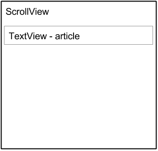

尽管您只能在 `ScrollView` 中放置一个子 `View`，但子 `View` 可以是具有子 `View` 元素层次结构的 [`ViewGroup`](https://developer.android.com/reference/android/view/ViewGroup.html)，例如 [`LinearLayout`](https://developer.android.com/reference/android/widget/LinearLayout.html)。`ScrollView` 中的 `View` 是一个不错的选择，它是按垂直方向排列的 `LinearLayout`。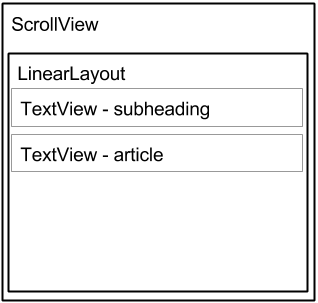

#### ScrollView 和性能

`ScrollView` 的所有内容（例如具有 `View` 元素的 `ViewGroup`）都会占用内存和视图层次结构，即使部分内容未显示在屏幕上也是如此。这使得 `ScrollView` 可用于平滑滚动自由格式文本的页面，因为文本已经在内存中。但是，具有 `ViewGroup` 和 `View` 元素的 ScrollView 可能会占用大量内存，这可能会影响应用其余部分的性能。

使用 `LinearLayout` 的嵌套实例还可能导致视图层次结构过深，从而降低性能。嵌套多个使用 `android：layout_weight` 属性的 `LinearLayout` 实例可能特别昂贵，因为每个子 `View` 都需要测量两次。请考虑使用更扁平的布局，例如 [`RelativeLayout`](https://developer.android.com/reference/android/widget/RelativeLayout.html) 或 [`GridLayout`](https://developer.android.com/reference/android/widget/GridLayout.html) 来提高性能。

使用 `ScrollView` 的复杂布局可能会遇到性能问题，尤其是图像。我们建议您*不要*在 `ScrollView` 中使用图像。要显示较长的项目或图像列表，请考虑使用 [`RecyclerView`](https://developer.android.com/reference/android/support/v7/widget/RecyclerView.html)，这将在另一节课中介绍。

#### 带有 TextView 的 ScrollView

要在屏幕上显示可滚动的杂志文章，可以使用 [`RelativeLayout`](https://developer.android.com/reference/android/widget/RelativeLayout.html)，其中包括一个单独的 TextView 用于文章标题，另一个 `TextView` 用于文章副标题，第三个 `TextView` 用于滚动文章文本（见下图），在 `ScrollView` 中设置。屏幕中唯一会滚动的部分是带有文章文本的 `ScrollView`。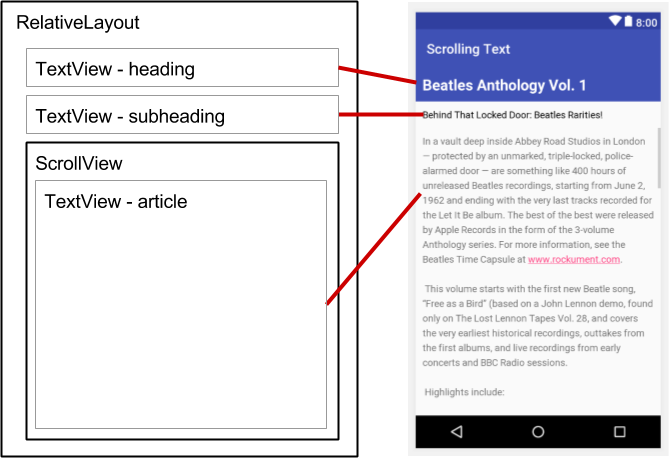

#### 具有 LinearLayout 的 ScrollView

`一个 ScrollView` 只能包含一个子 `View`;不过，该 `View` 可以是包含多个 `View` 元素（例如 [`LinearLayout）`](https://developer.android.com/reference/android/widget/LinearLayout.html) 的 [`ViewGroup`](https://developer.android.com/reference/android/view/ViewGroup.html)。您可以在 `ScrollView` *中**嵌套* `ViewGroup`（例如 `LinearLayout`），从而滚动 `LinearLayout` 中的所有内容。

例如，如果您希望文章的副标题随文章一起滚动，即使它们是单独的 `TextView` 元素，请将 `LinearLayout` 作为单个子 `View` 添加到 `ScrollView` 中，如下图所示，然后将 `TextView` 副标题和 article 元素移动到 `LinearLayout` 中。用户滚动整个 `LinearLayout`，其中包括副标题和文章。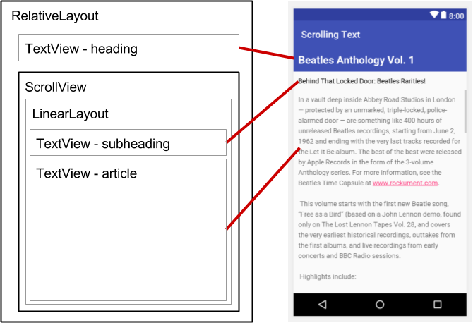

在 `ScrollView` 中添加 `LinearLayout` 时，请对 `LinearLayout``android：layout_width` 属性使用 `match_parent` 以匹配父 `ScrollView` 的宽度，并对 `LinearLayout``android：layout_height` 属性使用 `wrap_content` 以使其仅足够大以包含其内容。

由于 `ScrollView` 仅支持垂直滚动，因此您必须将 `LinearLayout` orientation 属性设置为 vertical （ `android:orientation="vertical"` ），以便整个 `LinearLayout` 垂直滚动。例如，下面的 XML 布局将`文章 ``TextView` 与 `article_subheading``TextView` 一起滚动：

```xml
<ScrollView
   android:layout_width="wrap_content"
   android:layout_height="wrap_content"
   android:layout_below="@id/article_heading">

   <LinearLayout
      android:layout_width="match_parent"
      android:layout_height="wrap_content"
      android:orientation="vertical">

      <TextView
         android:id="@+id/article_subheading"
         android:layout_width="match_parent"
         android:layout_height="wrap_content"
         android:padding="@dimen/padding_regular"
         android:text="@string/article_subtitle"
         android:textAppearance=
                       "@android:style/TextAppearance.DeviceDefault" />

      <TextView
         android:id="@+id/article"
         android:layout_width="wrap_content"
         android:layout_height="wrap_content"
         android:autoLink="web"
         android:lineSpacingExtra="@dimen/line_spacing"
         android:padding="@dimen/padding_regular"
         android:text="@string/article_text" />
   </LinearLayout>

</ScrollView>
```
