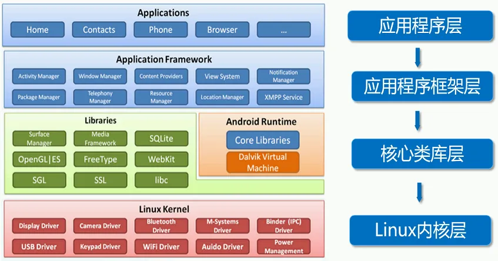

[简介 ·GitBook 软件 --- Introduction · GitBook](https://google-developer-training.github.io/android-developer-fundamentals-course-concepts-v2/)

Android是Google公司基于Linux平台开发的手机及平板电脑的操作系统，它自问世以来，受到了前所未有的关注，并迅速成为移动平台最受欢迎的操作系统之一。Android手机随处可见，如果能加入Android开发者行列，编写自己的应用程序供别人使用，想必是件诱人的事情。那么从今天开始，我们将开启Android:开发之旅，并逐渐成为一名出色的Android开发者。

# 1. Android简介

## 1.1 Android 的体系结构



## 1.2 Dalvik虚拟机

Dalvik是Google公司设计的，用于在Android平台上运行的虚拟机，其指令集基于寄存器架构，执行其特有的dx文件来完成对象生命周期管理、堆栈管理、线程管理、安全异常管理、垃圾回收等重要功能。每一个Android)应用在底层都会对应一个独立的Dvik虚拟机实例，其代码在虚拟机的解释下得以执行。

**Dalvik虚拟机编译文件的过程：**


## 1.3 第一个Android应用

### Gradle files Gradle 文件

首次创建应用程序项目时，将显示 **Project > Android** 窗格，其中展开了 `Gradle Scripts` 文件夹，如下所示。如果 `Gradle Scripts` 文件夹未展开，请单击三角形以将其展开。此文件夹包含构建系统所需的所有文件。

`build.gradle（Module：app）` 文件指定其他库和模块的构建配置。您选择的 `Activity` 模板将创建此文件。该文件包括 `minSdkVersion` 属性（用于声明应用程序的最低版本）和 `targetSdkVersion` 属性（用于声明应用程序已针对的最高（最新）版本）。

此文件还包含一个依赖项列表，这些*依赖项*是代码所需的库，例如用于支持各种 Android 版本的 `AppCompat` 库。

### java代码

要查看和编辑 Java 代码，请展开 `app` 文件夹、`java` 文件夹和 `com.example.android.helloworld` 文件夹。双击 `MainActivity.java` 文件，在代码编辑器中将其打开。

`java` 文件夹包含 Java 类文件。每个 [`Activity`](https://developer.android.com/reference/android/app/Activity.html)、[`Service`](https://developer.android.com/reference/android/app/Service.html) 或其他组件（如 [`Fragment`](https://developer.android.com/reference/android/app/Fragment.html)）都定义为一个 Java 类，通常位于其自己的文件中。测试和其他 Java 类文件也位于此处。

`java` 文件夹包含三个子文件夹：

1. `com.example.hello.helloworld`（或您指定的**域名）：软件包**的所有文件都位于以软件包命名的文件夹中。对于 Hello World 应用程序，有一个包，它仅包含 `MainActivity.java`。用户看到的第一个 `Activity`（屏幕）也初始化应用范围的资源，通常称为 `MainActivity`。（Project **> Android** 窗格中省略了文件扩展名。
2. `com.example.hello.helloworld(androidTest)` ：此文件夹用于您的插桩测试，从框架测试文件开始。
3. `com.example.hello.helloworld(test)` ：此文件夹用于您的单元测试，从自动创建的框架单元测试文件开始。

### Layout files 布局文件

要查看和编辑布局文件，请展开 `res` 文件夹和 `layout` 文件夹以查看布局文件。这里，布局文件为 `activity_main.xml`。

### Resource files 资源文件

`res` 文件夹包含布局、字符串和图像等资源。`活动`通常与定义为 XML 文件的 UI 视图布局相关联。此 XML 文件通常以其 `Activity` 命名。

**`res` 文件夹包括以下子文件夹：**

- `drawable`：将应用的所有图片都存储在此文件夹中。
- `layout`：每个 `Activity` 至少有一个描述 UI 的 XML 布局文件。对于 Hello World，此文件夹包含 `activity_main.xml`。
- `mipmap`：启动器图标存储在此文件夹中。每个支持的屏幕密度都有一个子文件夹。Android 使用屏幕密度 （每英寸的像素数） 来确定所需的图像分辨率。Android 将所有实际屏幕密度分组为广义密度，例如中等 （mdpi）、高 （hdpi） 或超超高 （xxxhdpi）。`ic_launcher.png` 文件夹包含应用程序支持的所有密度的默认启动器图标。
- `values`：与其在 XML 和 Java 文件中对字符串、尺寸和颜色等值进行硬编码，不如在各自的`值`文件中定义它们。这种做法可以更轻松地更改值，并使值在整个应用程序中保持一致。

**`values` 子文件夹包括以下子文件夹：**

- `colors.xml`：显示所选主题的默认颜色。您可以添加自己的颜色，也可以根据应用程序的要求更改颜色。
- `dimens.xml`：存储不同分辨率的视图和对象的大小。
- `strings.xml`：为所有字符串创建资源。这样做可以很容易地将字符串翻译成其他语言。
- `styles.xml`**：**您的应用程序和主题的所有样式都在此处。样式有助于为您的应用程序提供所有 UI 元素的一致外观。


应用程序中的每个 `Activity` 都作为 Java 类实现。以下类声明扩展了 `AppCompatActivity` 类，以便以与以前版本的 Android 向后兼容的方式实现功能：

```
public class MainActivity extends AppCompatActivity {
    // ... Rest of the code for the class.
}
```

### AndroidManifest文件

Android 系统必须先知道该 `Activity` 存在，然后 Android 系统才能启动应用组件（如 `Activity`）。它通过读取应用的 `AndroidManifest.xml` 文件来实现此目的，该文件描述了 Android 应用的所有组件。此 XML 文件中必须列出每个`活动`以及应用程序的所有组件。

要查看和编辑 `AndroidManifest.xml` 文件，请展开 **Project > Android** 窗格中的 `manifests` 文件夹，然后双击 `AndroidManifest.xml`。其内容显示在编辑窗格中：

```tex
<?xml version="1.0" encoding="utf-8"?>
<manifest xmlns:android="http://schemas.android.com/apk/res/android"
    package="com.example.android.helloworld"> # 命名空间和应用程序标记,Android 清单以 XML 编码，并始终使用 Android 命名空间。package 表达式显示新应用程序的唯一 package 名称。请勿在应用程序发布后更改包表达式。
	# <application> 标记及其结束 </application> 标记定义整个应用程序的清单设置。
    <application
        android:allowBackup="true" # android：allowBackup 属性启用自动应用程序数据备份：
        android:icon="@mipmap/ic_launcher" # 将 mipmap 文件夹中的图标分配给应用程序
        android:label="@string/app_name" # 会突出显示字符串 “Hello World”。如果单击该字符串，它将更改为显示字符串 resource @string/app_name：
        android:roundIcon="@mipmap/ic_launcher_round"
        android:supportsRtl="true"
        android:theme="@style/AppTheme"> # 设置应用的主题，该主题定义 UI 元素（如文本）的外观
        <activity android:name=".MainActivity">
            <intent-filter>
               <action android:name="android.intent.action.MAIN" />

               <category android:name="android.intent.category.LAUNCHER" />
            </intent-filter>
        </activity>
    </application>
</manifest>
```

##  1.4 UI 的布局和资源

### view 视图

UI 由称为 *views* 的对象层次结构组成 — 屏幕的每个元素都是一个 [`View`](https://developer.android.com/reference/android/view/View.html)。`View` 类表示所有 UI 组件的基本构建块，以及提供交互式 UI 组件（如按钮、复选框和文本输入字段）的类的基类。

`View` 有一个位置（表示为一对 left 和 top 坐标）和两个维度（表示为 width 和 height）。位置和尺寸的单位是与密度无关的像素 （dp）。

Android 系统提供了数百个预定义的 `View` 子类。在几节课中介绍的常用 `View` 子类包括：

- [`TextView`](http://developer.android.com/reference/android/widget/TextView.html) 用于显示文本
- [`EditText`](https://developer.android.com/reference/android/widget/EditText.html) 使用户能够输入和编辑文本
- [`Button`](https://developer.android.com/reference/android/widget/Button.html) 和其他可单击元素（例如 [`RadioButton`](https://developer.android.com/reference/android/widget/RadioButton.html)、[`CheckBox`](https://developer.android.com/reference/android/widget/CheckBox.html) 和 [`Spinner`](https://developer.android.com/reference/android/widget/Spinner.html)）来提供交互行为
- [`ScrollView`](https://developer.android.com/reference/android/widget/ScrollView.html) 和 [`RecyclerView`](https://developer.android.com/reference/android/support/v7/widget/RecyclerView.html)，用于显示可滚动项
- [`ImageView`](https://developer.android.com/reference/android/widget/ImageView.html) 用于显示图像
- [`ConstraintLayout`](https://developer.android.com/reference/android/support/constraint/ConstraintLayout.html) 和 [`LinearLayout`](https://developer.android.com/reference/android/widget/LinearLayout.html)，用于包含其他视图并对其进行定位

您可以定义一个 `View` 以在屏幕上显示并响应用户点击。还可以将 `View` 定义为接受文本输入，或在需要时不可见。

您可以在布局资源文件中指定 `View` 元素。布局资源以 XML 格式编写，并在 **Project > Android** 窗格的 **res** 文件夹的**布局**文件夹中列出。

### ViewGroup 组

`View` 元素可以在 ViewGroup 中进行分组，[`ViewGroup`](https://developer.android.com/reference/android/view/ViewGroup.html) 充当容器。父子关系为父子关系，其中*父*关系为 `ViewGroup`，*子*关系为 `View` 或其他 `ViewGroup`。以下是常用的 `ViewGroup` 组：

- [`ConstraintLayout`](https://developer.android.com/reference/android/support/constraint/ConstraintLayout.html)：一个组，它使用约束连接将界面元素（子 `View` 元素）放置到其他元素和布局边缘（父 `View`）。
- [`ScrollView`](https://developer.android.com/reference/android/widget/ScrollView.html)：一个包含另一个子 `View` 元素并允许滚动子 `View` 元素的组。
- [`RecyclerView`](https://developer.android.com/reference/android/support/v7/widget/RecyclerView.html)：一个包含其他 `View` 元素或 `ViewGroup` 组列表的组，并支持通过在屏幕上动态添加和移除 `View` 元素来滚动它们。

### Layout ViewGroup

界面的 `View` 元素按层次结构进行组织。此层次结构的*根*目录是一个 [`ViewGroup`](https://developer.android.com/reference/android/view/ViewGroup.html)，其中包含整个屏幕的布局。`ViewGroup` 可以包含子 `View` 元素或其他 `ViewGroup` 组，如下图所示。


在上图中：

1. *根* `ViewGroup`。
2. 第一组子 `View` 元素和父元素为根的 `ViewGroup` 组。

某些 `ViewGroup` 组被指定为*布局*，因为它们以特定方式组织子 `View` 元素，并且通常用作根 `ViewGroup`。布局的一些示例包括：

- [`ConstraintLayout`](http://tools.android.com/tech-docs/layout-editor)：一组子 `View` 元素，使用约束条件、边缘和参考线来控制元素相对于布局中其他元素的定位方式。`ConstraintLayout` 旨在让您在布局编辑器中轻松点击和拖动 `View` 元素。
- [`LinearLayout`](https://developer.android.com/reference/android/widget/LinearLayout.html)：一组水平或垂直放置和对齐的子 `View` 元素。
- [`RelativeLayout`](https://developer.android.com/reference/android/widget/RelativeLayout.html)：一组子 `View` 元素，其中每个元素都相对于 `ViewGroup` 中的其他元素进行定位和对齐。换句话说，子 `View` 元素的位置可以相对于彼此或与父 `ViewGroup` 进行描述。
- [`TableLayout`](https://developer.android.com/reference/android/widget/TableLayout.html)：一组子 `View` 元素，排列成行和列。
- [`FrameLayout`](https://developer.android.com/reference/android/widget/FrameLayout.html)：堆栈中的一组子 `View` 元素。`FrameLayout` 旨在在屏幕上屏蔽一个区域以显示一个 `View`。Child `View` 元素以堆栈形式绘制，最近添加的 child 元素位于顶部。`FrameLayout` 的大小是其最大的子 `View` 元素的大小。
- [`GridLayout`](https://developer.android.com/reference/android/widget/GridLayout.html)：将其子 `View` 元素放置在可滚动的矩形网格中的组。


**提示**： 在 [Common Layout Objects](https://developer.android.com/guide/topics/ui/layout-objects.html) 中了解有关不同布局类型的更多信息。

下面显示了一个带有子 `View` 元素的 `LinearLayout` 的简单示例，如布局文件图 （`activity_main.xml`）、层次结构图 （右上角） 和实际完成布局的屏幕截图 （右下角）。


在上图中：

1. `LinearLayout`（根 `ViewGroup`）包含垂直方向的所有子 `View` 元素。
2. `Button` （`button_toast`）。第一个子 `View` 元素显示在 `LinearLayout` 的顶部。
3. `TextView` （`show_count`） 的第二个子 `View` 元素显示在 `LinearLayout` 中第一个子 `View` 元素的下。
4. `Button` （`button_count`）。第三个子 `View` 元素显示在 `LinearLayout` 中第二个子 `View` 元素的下。

对于在屏幕上显示许多 `View` 元素的应用来说，布局层次结构可能会变得复杂。了解层次结构非常重要，因为它会影响 `View` 元素是否可见以及绘制它们的效率。

**提示**：您可以使用 [Hierarchy Viewer](https://developer.android.com/studio/profile/hierarchy-viewer-walkthru.html) 浏览应用的布局层次结构。它显示层次结构的树状视图，并允许您分析 `View` 元素在 Android 设备上的性能。性能问题将在下一章中介绍。

### layout 编辑器

您可以在布局编辑器中或通过输入 XML 代码来定义布局。

布局编辑器显示 XML 代码的可视化表示形式。您可以将 View elements （`View`元素） 拖动到 design 或 blueprint 窗格中，并为其排列、调整大小和指定属性。您会立即看到所做更改的效果。

要使用布局编辑器，请双击 XML 布局文件 （**activity_main.xml**）。此时将显示布局编辑器，其中突出显示了底部的 **Design** 选项卡。（如果 **Text** 选项卡突出显示并且您看到 XML 代码，请单击 **Design** 选项卡。对于 Empty Activity 模板，布局如下图所示。


1. XML 布局文件 （**activity_main.xml**）。
2. **Design （设计**） 和 **Text （文本**） 选项卡。单击 **Design** 查看布局编辑器，单击 **Text** 查看 XML 代码。
3. **调色板**窗格。Palette （调色板） 窗格提供 UI 元素和布局的列表。通过将元素或布局拖动到设计窗格中，将元素或布局添加到 UI 中。
4. **Component Tree （组件树**）。Component Tree 窗格显示布局层次结构。单击此窗格中的 `View` 元素或 `ViewGroup` 以将其选中。`视图`元素被组织成父级和子级的树层次结构，其中子级继承其父级的属性。在上图中，`TextView` 是 `ConstraintLayout` 的子级。
5. Design 和 Blueprint 窗格。将 `View` elements （视图元素） 从 **Palette （调色板**） 窗格拖动到设计或 Blueprint 窗格，以将它们放置在布局中。在上图中，布局只显示了一个元素：显示 “Hello World” 的 `TextView`。
6. **Attributes （属性）** 选项卡。单击 **Attributes** 以显示 **Attributes** 窗格，用于设置 `View` 元素的属性。

### 直接编辑 XML

有时，直接编辑 XML 代码会更快、更容易，尤其是在复制和粘贴类似视图的代码时。

要查看和编辑 XML 代码，请打开 XML 布局文件。此时将显示布局编辑器，其中突出显示了底部的 **Design** 选项卡。单击 **Text** 选项卡以查看 XML 代码。下面显示了一个 `LinearLayout` 的 XML 代码，其中有两个 `Button` 元素，中间有一个 `TextView`：

```xml
<LinearLayout xmlns:android="http://schemas.android.com/apk/res/android"
    xmlns:app="http://schemas.android.com/apk/res-auto"
    xmlns:tools="http://schemas.android.com/tools"
    android:layout_width="match_parent"
    android:layout_height="match_parent"
    android:orientation="vertical"
    tools:context="com.example.android.hellotoast.MainActivity">

    <Button
        android:id="@+id/button_toast"
        android:layout_width="match_parent"
        android:layout_height="wrap_content"
        android:layout_marginEnd="8dp"
        android:layout_marginStart="8dp"
        android:layout_marginTop="8dp"
        android:background="@color/colorPrimary"
        android:onClick="showToast"
        android:text="@string/button_label_toast"
        android:textColor="@android:color/white" />

    <TextView
        android:id="@+id/show_count"
        android:layout_width="match_parent"
        android:layout_height="wrap_content"
        android:gravity="center_vertical"
        android:layout_marginBottom="8dp"
        android:layout_marginEnd="8dp"
        android:layout_marginStart="8dp"
        android:layout_marginTop="8dp"
        android:background="#FFFF00"
        android:text="@string/count_initial_value"
        android:textAlignment="center"
        android:textColor="@color/colorPrimary"
        android:textSize="160sp"
        android:textStyle="bold"
        android:layout_weight="1"/>

    <Button
        android:id="@+id/button_count"
        android:layout_width="match_parent"
        android:layout_height="wrap_content"
        android:layout_marginBottom="8dp"
        android:layout_marginEnd="8dp"
        android:layout_marginStart="8dp"
        android:background="@color/colorPrimary"
        android:onClick="countUp"
        android:text="@string/button_label_count"
        android:textColor="@android:color/white" />
</LinearLayout>
```

### 视图属性

视图具有一些*属性*，这些属性定义视图在屏幕上的显示位置、大小、视图与其他视图的关系以及它如何响应用户输入。在 XML 中或在布局编辑器的 **Attributes** 窗格中定义视图时，这些属性称为 *attributes*。

例如，在以下 `TextView` 的 XML 说明中，`android：id`、`android：layout_width`、`android：layout_height`、`android：background` 是自动转换为 `TextView` 属性的 XML 属性：

```xml
<TextView
       android:id="@+id/show_count"
       android:layout_width="match_parent"
       android:layout_height="wrap_content"
       android:background="@color/myBackgroundColor"
       android:textStyle="bold"
       android:text="@string/count_initial_value" />
```

属性通常采用以下形式：

- `android:attribute_name="value"`
- `android:attribute_name="值"`

*attribute_name* 是属性的名称。*该值*是具有属性值的字符串。例如：

```xml
android:textStyle="bold"
```

如果*值*是资源（如颜色），`则 @` 符号指定资源的类型。例如：

```xml
android:background="@color/myBackgroundColor"
```

background 属性设置为标识为 `myBackgroundColor` 的颜色资源，该资源声明为 `#FFF043`。本章的 [样式相关属性](https://google-developer-training.github.io/android-developer-fundamentals-course-concepts-v2/unit-1-get-started/lesson-1-build-your-first-app/1-2-c-layouts-and-resources-for-the-ui/1-2-c-layouts-and-resources-for-the-ui.html#style_related) 中介绍了颜色资源。

每个 `View` 和 `ViewGroup` 都支持其自己的各种 XML 属性：

- 某些属性特定于 `View` 子类。例如，`TextView` 子类支持 `textSize` 属性。扩展 `TextView` 子类的任何元素都会继承这些特定于子类的属性。
- 某些属性对于所有 `View` 元素都是通用的，因为它们是从根 [`View`](https://developer.android.com/reference/android/view/View.html) 类继承的。`android：id` 属性就是一个例子。

有关特定属性的描述，请参阅 [`View`](https://developer.android.com/reference/android/view/View.html) 类文档的概述部分

### 标识视图

要唯一标识 `View` 并从代码中引用它，您必须为其指定一个 `id`。`android：id` 属性允许您指定唯一 `ID`，即 `View` 的资源标识符。

例如：

```xml
android:id="@+id/button_count"
```

该属性的 `@+id/button_count` 部分为 `Button`（`View` 的子类）创建一个名为 `button_count` `的 ID`。您使用加号 `（+`） 表示您正在创建新 `ID`。

### 引用视图

要引用现有资源标识符，请省略加号 `（+`）。例如，要在*另一个*属性（例如 `android：layout_toLeftOf`（如下一节所述））中通过其 `id` 来引用 `View` 以控制 `View` 的位置，您可以使用：

```xml
android:layout_toLeftOf="@id/show_count"
```

在上面的属性中，`@id/show_count` 指的是资源标识符`为 show_count` `的 View`。该属性将元素定位在 `show_count``View` 的 “左侧”。

### 定位视图

`View` 或 `ViewGroup` 需要一些与布局相关的定位属性，这些属性会在您将 `View` 或 `ViewGroup` 添加到 XML 布局时自动显示。

#### LinearLayout 定位

`LinearLayout` 需要设置以下属性：

- [`android:layout_width`](https://developer.android.com/reference/android/view/ViewGroup.LayoutParams.html#attr_android:layout_width)
- [`android:layout_height`](https://developer.android.com/reference/android/view/ViewGroup.LayoutParams.html#attr_android:layout_height)
- [`android:orientation`](https://developer.android.com/reference/android/widget/LinearLayout.html#attr_android:orientation)

`android：layout_width` 和 `android：layout_height` 属性可以采用以下三个值之一：

- `match_parent` 将展开 UI 元素以按宽度或高度填充其父元素。当 LinearLayout 是根 `ViewGroup` 时，它会扩展到设备屏幕的大小。对于根 `ViewGroup` 中的 UI 元素，它会扩展到父 `ViewGroup` 的大小。
- `wrap_content` 将 UI 元素缩小到其内容的大小。如果没有内容，则元素将变为不可见。
- 使用固定数量的 `dp`（[与密度无关的像素](https://developer.android.com/training/multiscreen/screendensities.html)）来指定固定大小，并根据设备的屏幕大小进行调整。例如，`16dp` 表示 16 个与密度无关的像素。与密度无关的像素和其他尺寸在本章的“[尺寸](https://google-developer-training.github.io/android-developer-fundamentals-course-concepts-v2/unit-1-get-started/lesson-1-build-your-first-app/1-2-c-layouts-and-resources-for-the-ui/1-2-c-layouts-and-resources-for-the-ui.html#dimensions)”中介绍。

`android：orientation` 可以是：

- `horizontal`**：**视图从左到右排列。
- `vertical`**：**视图从上到下排列。

其他与布局相关的属性包括：

- `android：layout_gravity`：此属性与 UI 元素一起使用，以控制元素在其父元素中的排列位置。例如，以下属性使 UI 元素在父 `ViewGroup` 中水平居中：

```
android:layout_gravity="center_horizontal"
```

- Padding 是 UI 元素边缘与元素内容之间的空间，以与密度无关的像素为单位，如下图所示。
  

  上图中：（1） *Padding* 是 `TextView` 的边缘（虚线）和 `TextView` 的内容（实线）之间的空间。Padding 与 margin 不同，*margin*是从 `View` 边缘到其父级的空间。

- `View` 的大小包括其内边距。以下是常用的 padding 属性：

  - `android：padding`：设置所有四个边缘的内边距。
  - `android：paddingTop`：设置顶部边缘的内边距。
  - `android：paddingBottom`：设置底部边缘的内边距。
  - `android：paddingLeft`：设置左边缘的内边距。
  - `android：paddingRight`：设置右边缘的内边距。
  - `android：paddingStart`：设置视图开头的内边距（以像素为单位）。用于代替上面列出的 padding 属性，尤其是对于长而窄的视图。
  - `android：paddingEnd`：设置视图结束边缘的内边距（以像素为单位）。与 `android：paddingStart` 一起使用。

**提示**：如需查看 `LinearLayout` 的所有 XML 属性，请参阅 [`LinearLayout`](https://developer.android.com/reference/android/widget/LinearLayout.html) 类定义的 Summary 部分。其他根布局（例如 [`RelativeLayout`](http://developer.android.com/guide/topics/ui/layout/relative.html) 和 [`AbsoluteLayout`](https://developer.android.com/reference/android/widget/AbsoluteLayout.html)）也在 Summary 部分中列出了它们的 XML 属性。

#### RelativeLayout 定位

另一个有用的布局 `Viewgroup` 是 [`RelativeLayout`](https://developer.android.com/reference/android/widget/RelativeLayout.html)，您可以使用它来相对于彼此或相对于父 View 元素定位子 `View` 元素。可与 `RelativeLayout` 一起使用的属性包括：

- [`android：layout_toLeftOf`](https://developer.android.com/reference/android/widget/RelativeLayout.LayoutParams.html#attr_android:layout_toLeftOf)：将此 `View` 的右边缘定位到另一个 `View`（由其 `ID` 标识）的左侧。
- [`android：layout_toRightOf`](https://developer.android.com/reference/android/widget/RelativeLayout.LayoutParams.html#attr_android:layout_toRightOf)：将此 `View` 的左边缘定位到另一个 `View`（由其 `ID` 标识）的右侧。
- [`android:layout_centerHorizontal` ](https://developer.android.com/reference/android/widget/RelativeLayout.LayoutParams.html#attr_android:layout_centerHorizontal)：将此 `View` 在其父级中水平居中。
- [`android：layout_centerVertical`](https://developer.android.com/reference/android/widget/RelativeLayout.LayoutParams.html#attr_android:layout_centerVertical)：将此 `View` 在其父级中垂直居中。
- [`android：layout_alignParentTo`p](https://developer.android.com/reference/android/widget/RelativeLayout.LayoutParams.html#attr_android:layout_alignParentTop)：定位此 `View` 的上边缘，使其与父级的上边缘匹配。
- [`android:layout_alignParentBottom` ](https://developer.android.com/reference/android/widget/RelativeLayout.LayoutParams.html#attr_android:layout_alignParentBottom)：定位此`视图`的下边缘以匹配父视图的下边缘。

有关 `RelativeLayout` 中 `View` 和 `View` 子类元素的属性的完整列表，请参阅 [`RelativeLayout.LayoutParams`](https://developer.android.com/reference/android/widget/RelativeLayout.LayoutParams.html)。

### 与样式相关的属性

您可以指定 style 属性来自定义 `View` 的外观。*没有* style 属性（例如 `android：textColor`、`android：textSize` 和 `android：background`）的 `View` 采用应用主题中定义的样式。

以下是有关使用布局编辑器的课程中使用的与样式相关的属性：

- `android：background`：指定要用作背景的颜色或可绘制资源。
- `android：text`：指定要在视图中显示的文本。
- `android：textColor`：指定文本颜色。
- `android：textSize`：指定文本大小。
- `android：textStyle`：指定文本样式，例如`粗体`。
