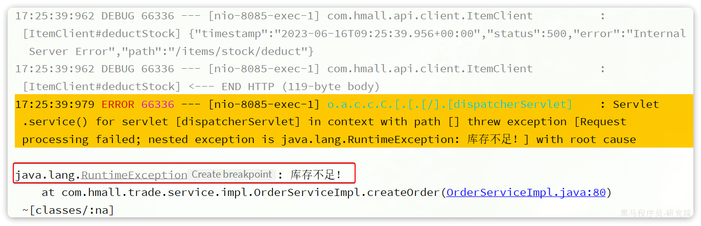
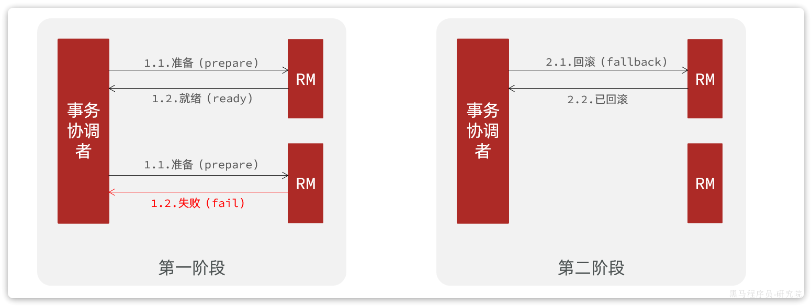

# 11. 分布式事务

首先我们看看项目中的下单业务整体流程：


由于订单、购物车、商品分别在三个不同的微服务，而每个微服务都有自己独立的数据库，因此下单过程中就会跨多个数据库完成业务。而每个微服务都会执行自己的本地事务：

- 交易服务：下单事务
- 购物车服务：清理购物车事务
- 库存服务：扣减库存事务

整个业务中，各个本地事务是有关联的。因此每个微服务的本地事务，也可以称为**分支事务**。多个有关联的分支事务一起就组成了**全局事务**。我们必须保证整个全局事务同时成功或失败。

我们知道每一个分支事务就是传统的**单体事务**，都可以满足ACID特性，但全局事务跨越多个服务、多个数据库，是否还能满足呢？

我们来做一个测试，先进入购物车页面：


目前有4个购物车，然结算下单，进入订单结算页面：


然后将购物车中某个商品的库存修改为`0`：


然后，提交订单，最终因库存不足导致下单失败：



然后我们去查看购物车列表，发现购物车数据依然被清空了，并未回滚：


事务并未遵循ACID的原则，归其原因就是参与事务的多个子业务在不同的微服务，跨越了不同的数据库。虽然每个单独的业务都能在本地遵循ACID，但是它们互相之间没有感知，不知道有人失败了，无法保证最终结果的统一，也就无法遵循ACID的事务特性了。

这就是分布式事务问题，出现以下情况之一就可能产生分布式事务问题：

- 业务跨多个服务实现
- 业务跨多个数据源实现

接下来这一章我们就一起来研究下如何解决分布式事务问题。

## 11.1 认识Seata

解决分布式事务的方案有很多，但实现起来都比较复杂，因此我们一般会使用开源的框架来解决分布式事务问题。在众多的开源分布式事务框架中，功能最完善、使用最多的就是阿里巴巴在2019年开源的Seata了。

https://seata.io/zh-cn/docs/overview/what-is-seata.html

其实**分布式事务产生的一个重要原因，就是参与事务的多个分支事务互相无感知，不知道彼此的执行状态**。因此解决分布式事务的思想非常简单：

就是找一个统一的**事务协调者**，与多个分支事务通信，检测每个分支事务的执行状态，保证全局事务下的每一个分支事务同时成功或失败即可。大多数的分布式事务框架都是基于这个理论来实现的。

Seata也不例外，在Seata的事务管理中有三个重要的角色：

-  **TC(Transaction Coordinator) - 事务协调者：**维护全局和分支事务的状态，协调全局事务提交或回滚。
-  **TM (Transaction Manager) -** **事务管理器：**定义全局事务的范围、开始全局事务、提交或回滚全局事务。 
-  **RM (Resource Manager) -** **资源管理器：**管理分支事务，与TC交谈以注册分支事务和报告分支事务的状态，并驱动分支事务提交或回滚。 

Seata的工作架构如图所示：


其中，**TM**和**RM**可以理解为Seata的客户端部分，引入到参与事务的微服务依赖中即可。将来**TM**和**RM**就会协助微服务，实现本地分支事务与**TC**之间交互，实现事务的提交或回滚。

而**TC**服务则是事务协调中心，是一个独立的微服务，需要单独部署。

## 11.2 部署TC服务

### 11.2.1 准备数据库表

Seata支持多种存储模式，但考虑到持久化的需要，我们一般选择基于数据库存储。执行课前资料提供的`《seata-tc.sql》`，导入数据库表：


### 11.2.2 准备配置文件

课前资料准备了一个seata目录，其中包含了seata运行时所需要的配置文件：


其中包含中文注释，大家可以自行阅读。

我们将整个seata文件夹拷贝到虚拟机的`/root`目录：


### 11.2.3 Docker部署

需要注意，要确保nacos、mysql都在hm-net网络中。如果某个容器不再hm-net网络，可以参考下面的命令将某容器加入指定网络：

```Shell
docker network connect [网络名] [容器名]
```

```shell
docker network ls # 查看网络

docker inspect mysql # 查看mysql网络

docker network connect hmail nacos # 将nacos容器加入hmall网络中
# seata需要和mysql及nacos在同一个网络
```

在虚拟机的`/root`目录执行下面的命令：

```Shell
docker run --name seata \
-p 8099:8099 \
-p 7099:7099 \
-e SEATA_IP=192.168.244.130 \
-v ./seata:/seata-server/resources \
--privileged=true \
--network hmall \
-d \
seataio/seata-server:1.5.2
```

如果镜像下载困难，也可以把课前资料提供的镜像上传到虚拟机并加载：


## 11.3 微服务集成Seata

参与分布式事务的每一个微服务都需要集成Seata，我们以`trade-service`为例。

### 11.3.1 引入依赖

```xml
<!--seata 分布式事务-->
<dependency>
    <groupId>com.alibaba.cloud</groupId>
    <artifactId>spring-cloud-starter-alibaba-seata</artifactId>
</dependency>
```

为了方便各个微服务集成seata，我们需要把seata配置共享到nacos，因此`trade-service`模块不仅仅要引入seata依赖，还要引入nacos依赖:

```XML
<!--nacos 统一配置管理-->
<dependency>
    <groupId>com.alibaba.cloud</groupId>
    <artifactId>spring-cloud-starter-alibaba-nacos-config</artifactId>
</dependency>
<!--读取bootstrap文件-->
<dependency>
    <groupId>org.springframework.cloud</groupId>
    <artifactId>spring-cloud-starter-bootstrap</artifactId>
</dependency>
<!--seata 分布式事务-->
<dependency>
    <groupId>com.alibaba.cloud</groupId>
    <artifactId>spring-cloud-starter-alibaba-seata</artifactId>
</dependency>
```

### 11.3.2 改造配置

首先在nacos上添加一个共享的seata配置，命名为`shared-seata.yaml`：


内容如下：

```YAML
seata:
  registry: # TC服务注册中心的配置，微服务根据这些信息去注册中心获取tc服务地址
    type: nacos # 注册中心类型 nacos
    nacos:
      server-addr: 192.168.244.130:8848 # nacos地址
      namespace: "" # namespace，默认为空
      group: DEFAULT_GROUP # 分组，默认是DEFAULT_GROUP
      application: seata-server # seata服务名称
      username: nacos
      password: nacos
  tx-service-group: hmall # 事务组名称
  service:
    vgroup-mapping: # 事务组与tc集群的映射关系
      hmall: "default"
```

然后，改造`trade-service`模块，添加`bootstrap.yaml`：


内容如下:

```YAML
spring:
  application:
    name: trade-service # 服务名称
  profiles:
    active: dev
  cloud:
    nacos:
      server-addr: 192.168.150.101 # nacos地址
      config:
        file-extension: yaml # 文件后缀名
        shared-configs: # 共享配置
          - dataId: shared-jdbc.yaml # 共享mybatis配置
          - dataId: shared-log.yaml # 共享日志配置
          - dataId: shared-swagger.yaml # 共享日志配置
          - dataId: shared-seata.yaml # 共享seata配置
```

可以看到这里加载了共享的seata配置。

然后改造application.yaml文件，内容如下：

```YAML
server:
  port: 8085
feign:
  okhttp:
    enabled: true # 开启OKHttp连接池支持
  sentinel:
    enabled: true # 开启Feign对Sentinel的整合
hm:
  swagger:
    title: 交易服务接口文档
    package: com.hmall.trade.controller
  db:
    database: hm-trade
```

参考上述办法分别改造`hm-cart`和`hm-item`两个微服务模块。

### 11.3.3 添加数据库表

seata的客户端在解决分布式事务的时候需要记录一些中间数据，保存在数据库中。因此我们要先准备一个这样的表。

将课前资料的seata-at.sql分别文件导入hm-trade、hm-cart、hm-item三个数据库中：


结果：


OK，至此为止，微服务整合的工作就完成了。可以参考上述方式对`hm-item`和`hm-cart`模块完成整合改造。

### 11.3.4 测试

接下来就是测试的分布式事务的时候了。

我们找到`trade-service`模块下的`com.hmall.trade.service.impl.OrderServiceImpl`类中的`createOrder`方法，也就是下单业务方法。

将其上的`@Transactional`注解改为Seata提供的`@GlobalTransactional`：


`@GlobalTransactional`注解就是在标记事务的起点，将来TM就会基于这个方法判断全局事务范围，初始化全局事务。

我们重启`trade-service`、`item-service`、`cart-service`三个服务。再次测试，发现分布式事务的问题解决了！

那么，Seata是如何解决分布式事务的呢？

## 11.4 XA模式

Seata支持四种不同的分布式事务解决方案：

- **XA**
- **TCC**
- **AT**
- **SAGA**

这里我们以`XA`模式和`AT`模式来给大家讲解其实现原理。

`XA` 规范 是` X/Open` 组织定义的分布式事务处理（DTP，Distributed Transaction Processing）标准，XA 规范 描述了全局的`TM`与局部的`RM`之间的接口，几乎所有主流的数据库都对 XA 规范 提供了支持。
**XA模式保证了数据强一致性，但是性能较低**

### 11.4.1 两阶段提交

A是规范，目前主流数据库都实现了这种规范，实现的原理都是基于两阶段提交。

正常情况：


异常情况：



一阶段：

- 事务协调者通知每个事务参与者执行本地事务
- 本地事务执行完成后报告事务执行状态给事务协调者，此时事务不提交，继续持有数据库锁

二阶段：

- 事务协调者基于一阶段的报告来判断下一步操作
- 如果一阶段都成功，则通知所有事务参与者，提交事务
- 如果一阶段任意一个参与者失败，则通知所有事务参与者回滚事务

### 11.4.2 Seata的XA模型

XA 规范 是 X/Open 组织定义的分布式事务处理（DTP，Distributed Transaction Processing）标准，XA 规范 描述了全局的TM与局部的RM之间的接口，几乎所有主流的关系型数据库都对 XA 规范 提供了支持。S

Seata对原始的XA模式做了简单的封装和改造，以适应自己的事务模型，基本架构如图：


`RM`一阶段的工作：

1. 注册分支事务到`TC`
2. 执行分支业务sql但不提交
3. 报告执行状态到`TC`

`TC`二阶段的工作：

1.  `TC`检测各分支事务执行状态
    1. 如果都成功，通知所有RM提交事务
    2. 如果有失败，通知所有RM回滚事务 

`RM`二阶段的工作：

- 接收`TC`指令，提交或回滚事务

### 11.4.3 优缺点

`XA`模式的**优点**是什么？

- 事务的**强一致性**，满足ACID原则
- 常用数据库都支持，实现简单，并且没有代码侵入

`XA`模式的**缺点**是什么？

- 因为一阶段需要锁定数据库资源，等待二阶段结束才释放，**性能较差**
- 依赖关系型数据库实现事务

### 11.4.4 实现步骤

首先，我们要在配置文件中**指定要采用的分布式事务模式**。我们可以在Nacos中的共享shared-seata.yaml配置文件中设置：

```YAML
seata:
  data-source-proxy-mode: XA # 告诉seata我们用XA模式
```

其次，我们要**利用`@GlobalTransactional`标记分布式事务的入口方法**：


## 11.5 AT模式

`AT`模式同样是分阶段提交的事务模型，不过缺弥补了`XA`模型中资源锁定周期过长的缺陷。

**基于快照，短暂的数据不一致，最终一致，效率高**

### 11.5.1 Seata的AT模型

基本流程图：


阶段一`RM`的工作：

- 注册分支事务
- 记录undo-log（数据快照）
- 执行业务sql并提交
- 报告事务状态

阶段二提交时`RM`的工作：

- 删除undo-log即可

阶段二回滚时`RM`的工作：

- 根据undo-log恢复数据到更新前

### 11.5.2 流程梳理

我们用一个真实的业务来梳理下AT模式的原理。

比如，现在有一个数据库表，记录用户余额：

| **id** | **money** |
| :----- | :-------- |
| 1      | 100       |

其中一个分支业务要执行的SQL为：

```SQL
 update tb_account set money = money - 10 where id = 1
```

AT模式下，当前分支事务执行流程如下：

**一阶段**：

1. `TM`发起并注册全局事务到`TC`
2. `TM`调用分支事务
3. 分支事务准备执行业务SQL
4. `RM`拦截业务SQL，根据where条件查询原始数据，形成快照。

```JSON
{
  "id": 1, "money": 100
}
```

1. `RM`执行业务SQL，提交本地事务，释放数据库锁。此时 money = 90
2. `RM`报告本地事务状态给`TC`

**二阶段**：

1. `TM`通知`TC`事务结束
2. `TC`检查分支事务状态
   1. 如果都成功，则立即删除快照
   2. 如果有分支事务失败，需要回滚。读取快照数据（{"id": 1, "money": 100}），将快照恢复到数据库。此时数据库再次恢复为100

流程图：


### 11.5.3 实现步骤

每个使用seata的微服务的数据库都要创建一个undo_log的表用于回滚

```sql
-- for AT mode you must to init this sql for you business database. the seata server not need it.
CREATE TABLE IF NOT EXISTS `undo_log`
(
    `branch_id`     BIGINT       NOT NULL COMMENT 'branch transaction id',
    `xid`           VARCHAR(128) NOT NULL COMMENT 'global transaction id',
    `context`       VARCHAR(128) NOT NULL COMMENT 'undo_log context,such as serialization',
    `rollback_info` LONGBLOB     NOT NULL COMMENT 'rollback info',
    `log_status`    INT(11)      NOT NULL COMMENT '0:normal status,1:defense status',
    `log_created`   DATETIME(6)  NOT NULL COMMENT 'create datetime',
    `log_modified`  DATETIME(6)  NOT NULL COMMENT 'modify datetime',
    UNIQUE KEY `ux_undo_log` (`xid`, `branch_id`)
) ENGINE = InnoDB
  AUTO_INCREMENT = 1
  DEFAULT CHARSET = utf8mb4 COMMENT ='AT transaction mode undo table';
```

首先，我们要在配置文件中**指定要采用的分布式事务模式**。我们可以在Nacos中的共享shared-seata.yaml配置文件中设置：

```YAML
seata:
  data-source-proxy-mode: AT # 告诉seata我们用AT模式
```

其次，我们要**利用`@GlobalTransactional`标记分布式事务的入口方法**

### 11.5.4 AT与XA的区别

简述`AT`模式与`XA`模式最大的区别是什么？

- `XA`模式一阶段不提交事务，锁定资源；`AT`模式一阶段直接提交，不锁定资源。
- `XA`模式依赖数据库机制实现回滚；`AT`模式利用数据快照实现数据回滚。
- `XA`模式强一致；`AT`模式最终一致

可见，AT模式使用起来更加简单，无业务侵入，性能更好。因此企业90%的分布式事务都可以用AT模式来解决。