# XI. SpringCloud Alibaba Seata处理分布式事务

## 面试题

**问题一：**
你简历上写用微服务boot/cloud做过项目，你不可能只有一个数据库吧？请你谈谈多个数据库之间你如何处理分布式事务？

在订单支付成功后，交易中心会调用订单中心的服务把订单状态更新，并调用物流中心的服务通知商品发货，同时还要调用积分中心的服务为用户增加相应的积分。**如何保障分布式事务一致性，成为了确保订单业务稳定运行的核心诉求之一。**


以下场景如何应对？：
下订单、冻库存、做支付、减库存、抵扣减(积分冲抵、XX豆冲抵、礼品卷冲抵...)、送积分、做推送、派物流...

**问题二：**
阿里巴巴的Seata-AT模式如何做到对业务的无侵入？

**问题三：**
对于分布式事务问题，你知道的解决方案有哪些？请你谈谈？

1. 2PC(两阶段提交)
2. 3PC(三阶段提交)
3. TCC方案
   - TCC(Try-Confirm-Cancel)又被称补偿事务
   - 类以2PC的柔性分布式解决方案，2PC改良版
4. LocalMessage本地消息表
5. 独立消息微服务+RabbitMQ/KafKa组件，实现可靠消息最终一致性方案
6. 最大努力通知方案

## 分布式事务的产生

***上述面试问题都指向一个重要问题：*** 

- 一次业务操作需要**跨多个数据源**或需要跨多个系统进行远程调用，就会产生分布式事务问题
- 关系型数据库提供的能力是基于**单机事务**的，一旦遇到分布式事务场景，就需要通过更多其他技术手段来解决问题。

***需要分布式事务之前：***

- 单机单库没这个问题
- 表结构的关系从1:1→1:N→N:N

***需要分布式事务之后：***

- 

- 单体应用被拆分成微服务应用，原来的三个模块被拆分成**三个独立的应用**，分别使用**三个独立的数据源**，业务操作需要调用三个服务来完成。
- **此时每个服务自己内部的数据一致性由*本地*事务来保证，但是*全局*的数据一致性问题没法保证。**

***结论：***迫切希望提供一种分布式事务框架，解决微服务架构下的分布式事务问题

## Seata 简介

***Seata 概念：***

**Simple Extensible Autonomous Transaction Architecture**：简单可扩展自治事务框架

**官网解释**：Seata是一款开源的分布式事务解决方案，致力于在微服务
架构下提供高性能和简单易用的分布式事务服务。

**Seata 发展历程**：阿里巴巴作为国内最早一批进行应用分布式（微服务化）改造的企业，很早就遇到微服务架构下的分布式事务问题。

1. 2019年1月份蚂蚁金服和阿里巴巴共同开源的分布式事务解决方案
2. 2014 年，阿里中间件团队发布 TXC（Taobao Transaction Constructor），为集团内应用提供分布式事务服务。
3. 2016 年，TXC 在经过产品化改造后，以 GTS（Global Transaction Service） 的身份登陆阿里云，成为当时业界唯一一款云上分布式事务产品。在阿云里的公有云、专有云解决方案中，开始服务于众多外部客户。
4. 2019 年起，基于 TXC 和 GTS 的技术积累，阿里中间件团队发起了开源项目 Fescar（Fast & EaSy Commit And Rollback, FESCAR），和社区一起建设这个分布式事务解决方案。
5. 2019 年 **fescar(全称fast easy commit and rollback)** 被重命名为了seata（simple extensiable autonomous transaction architecture）。TXC、GTS、Fescar 以及 seata 一脉相承，为解决微服务架构下的分布式事务问题交出了一份与众不同的答卷。

***Seata 功能***

Seata是一款开源的分布式事务解决方案，致力于在微服务架构下
提供高性能和简单易用的分布式事务服务。

***Seata 下载***

[Seasta源码地址-github](https://github.com/apache/incubator-seata)

[Seata官网地址](https://seata.apache.org/docs/user/quickstart/)

***Seata用法***

- 本地`@Transactional`
- 全局`@GlobalTransactional`
- Seata的分布式交易解决方案
  - [](./cloudImg/image-20240926175124250.png)

## Seata 工作流程简介

- 纵观整个分布式事务的管理，就是**全局事务ID的传递和变更**，要让开发者无感知
  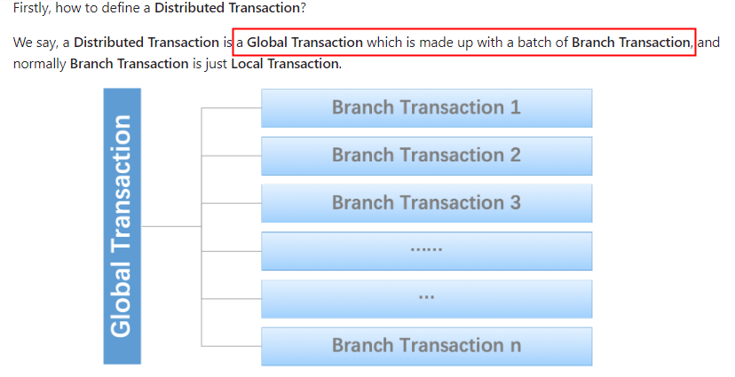

- Seata对分布式事务的协调和控制，就是1+3

  - 1个XID  XID是全局事务的唯一标识，它可以在服务的调用链路中传递，绑定到服务的事务上下文中。
  - 官网版3个概念(TC→TM-→RM)
    1. TC (Transaction Coordinator) - 事务协调者
       维护全局和分支事务的状态，驱动全局事务提交或回滚。
    2. TM (Transaction Manager) - 事务管理器
       定义全局事务的范围：开始全局事务、提交或回滚全局事务。
    3. RM (Resource Manager) - 资源管理器
       管理分支事务处理的资源，与TC交谈以注册分支事务和报告分支事务的状态，并驱动分支事务提交或回滚。
  - 3个概念简单理解(TC-→TM→RM)
    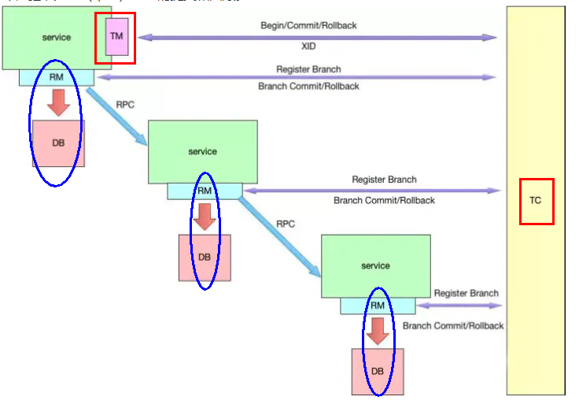
    1. TC (Transaction Coordinator)事务协调器
       **就是Seata**,负责维护全局事务和分支事务的状态，驱动全局事务提交或回滚。
    2. TM (Transaction Manager)事务管理器
       **标注全局`@GlobalTransactional`启动入口动作的微服务模块**（比如订单模块），它是事务的发起者，负责定义全局事务的范围，并根据TC维护的全局事务和分支事务状态，做出开始事务、提交事务、回滚事务的决议
    3. RM (Resource Manager)资源管理器
       **就是mysql数据库本身**，可以是多个RM,负责管理分支事务上的资源，向TC注册分支事分，汇报分支事务状态，驱动分支事务的提交或回滚

- 分布式事务的执行流程-小总结
  三个组件相互协作，TC以Seata 服务器(Server)形式独立部署，TM和RM则是以Seata Client的形式集成在微服务中运行，

  流程如下：
  

  1. TM 向 TC 申请开启一个全局事务，全局事务创建成功并生成一个全局唯一的 XID；
  2. XID 在微服务调用链路的上下文中传播；
  3. RM 向 TC 注册分支事务，将其纳入 XID 对应全局事务的管辖；
  4. TM 向 TC 发起针对 XID 的全局提交或回滚决议；
  5. TC 调度 XID 下管辖的全部分支事务完成提交或回滚请求。

- 各事务模式[官网](https://seata.apache.org/zh-cn/docs/user/mode/at)
  Seata AT模式、Seata TCC模式、Seata Saga模式、Seata XA模式

  <iframe src="https://seata.apache.org/zh-cn/docs/user/mode/at" width="600" height="340"></iframe>

  日常工作+企业调研+本次课时安排限制，以AT模式作为入手突破

## Seata-Server2.0.0 安装及配置

### Seata-Server2.0.0 安装

官网下载：[Seata Java Download官网下载](https://seata.apache.org/zh-cn/unversioned/download/seata-server)

github下载：[Release v2.0.0 github下载)](https://github.com/apache/incubator-seata/releases/tag/v2.0.0)

各种seata参数官网参考：[参数配置 | Apache Seata](https://seata.apache.org/zh-cn/docs/v2.0/user/configurations)

<iframe src="https://seata.apache.org/zh-cn/docs/v2.0/user/configurations" width="600" height="340"></iframe>

Seatai新手部署指南：[新人文档 | Apache Seata](https://seata.apache.org/zh-cn/docs/v2.0/ops/deploy-guide-beginner)

### Seata-Server2.0.0 配置

**mySQL8.0数据库里面建库+建表：**

1. 建库Seata

   ```sql
   CREATE DATABASE seata;
   USE seata;
   ```

2. 在seata库里建表

   建表地址：[mysql.sql at develop (github.com)](https://github.com/apache/incubator-seata/blob/develop/script/server/db/mysql.sql)

   ```sql
   -- -------------------------------- The script used when storeMode is 'db' --------------------------------
   -- the table to store GlobalSession data
   CREATE TABLE IF NOT EXISTS `global_table`
   (
       `xid`                       VARCHAR(128) NOT NULL,
       `transaction_id`            BIGINT,
       `status`                    TINYINT      NOT NULL,
       `application_id`            VARCHAR(32),
       `transaction_service_group` VARCHAR(32),
       `transaction_name`          VARCHAR(128),
       `timeout`                   INT,
       `begin_time`                BIGINT,
       `application_data`          VARCHAR(2000),
       `gmt_create`                DATETIME,
       `gmt_modified`              DATETIME,
       PRIMARY KEY (`xid`),
       KEY `idx_status_gmt_modified` (`status` , `gmt_modified`),
       KEY `idx_transaction_id` (`transaction_id`)
   ) ENGINE = InnoDB
     DEFAULT CHARSET = utf8mb4;
   
   -- the table to store BranchSession data
   CREATE TABLE IF NOT EXISTS `branch_table`
   (
       `branch_id`         BIGINT       NOT NULL,
       `xid`               VARCHAR(128) NOT NULL,
       `transaction_id`    BIGINT,
       `resource_group_id` VARCHAR(32),
       `resource_id`       VARCHAR(256),
       `branch_type`       VARCHAR(8),
       `status`            TINYINT,
       `client_id`         VARCHAR(64),
       `application_data`  VARCHAR(2000),
       `gmt_create`        DATETIME(6),
       `gmt_modified`      DATETIME(6),
       PRIMARY KEY (`branch_id`),
       KEY `idx_xid` (`xid`)
   ) ENGINE = InnoDB
     DEFAULT CHARSET = utf8mb4;
   
   -- the table to store lock data
   CREATE TABLE IF NOT EXISTS `lock_table`
   (
       `row_key`        VARCHAR(128) NOT NULL,
       `xid`            VARCHAR(128),
       `transaction_id` BIGINT,
       `branch_id`      BIGINT       NOT NULL,
       `resource_id`    VARCHAR(256),
       `table_name`     VARCHAR(32),
       `pk`             VARCHAR(36),
       `status`         TINYINT      NOT NULL DEFAULT '0' COMMENT '0:locked ,1:rollbacking',
       `gmt_create`     DATETIME,
       `gmt_modified`   DATETIME,
       PRIMARY KEY (`row_key`),
       KEY `idx_status` (`status`),
       KEY `idx_branch_id` (`branch_id`),
       KEY `idx_xid` (`xid`)
   ) ENGINE = InnoDB
     DEFAULT CHARSET = utf8mb4;
   
   CREATE TABLE IF NOT EXISTS `distributed_lock`
   (
       `lock_key`       CHAR(20) NOT NULL,
       `lock_value`     VARCHAR(20) NOT NULL,
       `expire`         BIGINT,
       primary key (`lock_key`)
   ) ENGINE = InnoDB
     DEFAULT CHARSET = utf8mb4;
   
   INSERT INTO `distributed_lock` (lock_key, lock_value, expire) VALUES ('AsyncCommitting', ' ', 0);
   INSERT INTO `distributed_lock` (lock_key, lock_value, expire) VALUES ('RetryCommitting', ' ', 0);
   INSERT INTO `distributed_lock` (lock_key, lock_value, expire) VALUES ('RetryRollbacking', ' ', 0);
   INSERT INTO `distributed_lock` (lock_key, lock_value, expire) VALUES ('TxTimeoutCheck', ' ', 0);
   ```

3. 结果：
   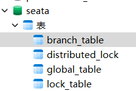

**更改配置：**

1. 修改`seata-server-2.0.0\conf\application.yml`配置文件，记得先备份
   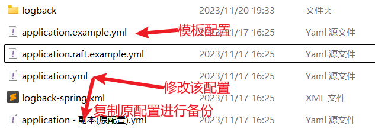
   修改后`application.yml`

   ```yaml
   #  Copyright 1999-2019 Seata.io Group.
   #
   #  Licensed under the Apache License, Version 2.0 (the "License");
   #  you may not use this file except in compliance with the License.
   #  You may obtain a copy of the License at
   #
   #  http://www.apache.org/licenses/LICENSE-2.0
   #
   #  Unless required by applicable law or agreed to in writing, software
   #  distributed under the License is distributed on an "AS IS" BASIS,
   #  WITHOUT WARRANTIES OR CONDITIONS OF ANY KIND, either express or implied.
   #  See the License for the specific language governing permissions and
   #  limitations under the License.
    
   server:
     port: 7091
   
   spring:
     application:
       name: seata-server
   
   logging:
     config: classpath:logback-spring.xml
     file:
       path: ${log.home:${user.home}/logs/seata}
     extend:
       logstash-appender:
         destination: 127.0.0.1:4560
       kafka-appender:
         bootstrap-servers: 127.0.0.1:9092
         topic: logback_to_logstash
   
   console:
     user:
       username: seata
       password: seata
   
   seata:
     config:
       type: nacos
       nacos:
         server-addr: 127.0.0.1:8848
         namespace:
         group: SEATA_GROUP #后续自己在nacos里面新建,不想新建SEATA_GROUP，就写DEFAULT_GROUP
         username: nacos
         password: nacos
     registry:
       type: nacos
       nacos:
         application: seata-server
         server-addr: 127.0.0.1:8848
         group: SEATA_GROUP #后续自己在nacos里面新建,不想新建SEATA_GROUP，就写DEFAULT_GROUP
         namespace:
         cluster: default
         username: nacos
         password: nacos    
     store:
       mode: db
       # 这个数据库就是我们刚建的库
       db:
         datasource: druid
         db-type: mysql
         driver-class-name: com.mysql.cj.jdbc.Driver
         url: jdbc:mysql://localhost:3306/seata?characterEncoding=utf8&useSSL=false&serverTimezone=GMT%2B8&rewriteBatchedStatements=true&allowPublicKeyRetrieval=true
         user: root
         password: 123456
         min-conn: 10
         max-conn: 100
         global-table: global_table
         branch-table: branch_table
         lock-table: lock_table
         distributed-lock-table: distributed_lock
         query-limit: 1000
         max-wait: 5000
   
     #  server:
     #    service-port: 8091 #If not configured, the default is '${server.port} + 1000'
     security:
       secretKey: SeataSecretKey0c382ef121d778043159209298fd40bf3850a017
       tokenValidityInMilliseconds: 1800000
       ignore:
         urls: /,/**/*.css,/**/*.js,/**/*.html,/**/*.map,/**/*.svg,/**/*.png,/**/*.jpeg,/**/*.ico,/api/v1/auth/login,/metadata/v1/**
   ```

2. 启动nacos2.2.3
   命令：`startup.cmd -m standalone`
   访问：http://localhost:8848/nacos

3. 启动seata-server-2.0.0
   命令：`seata-server.bat`
   访问：http://localhost:7091

4. 看看cacos
   

## Seata 案例实战-数据库和表准备

订单+库存+账户 3个业务数据库MySQL准备

### 业务说明

以下演示都需要先启动Nacos后          启动Seata，保证两个都OK

分布式事务本案例**业务说明**：这里我们创建三个服务，一个订单服务，一个库存服务，一个账户服务

1. 当用户下单时，会在订单服务中创建一个订单，然后通过远程调用库存服务来扣减下单商品的库存
2. 再通过远程调用账户服务来扣减用户账户里面的余额
3. 最后在订单服务中修改订单状态为已完成。该操作跨越三个数据库，有两次远程调用，很明显会有分布式事务问题

*下订单 → 减库存 → 扣余额 → 改(订单)状态：*


### 建表

1. 创建3个业务数据库DATABASE

   ```sql
   CREATE DATABASE seata_order;
   CREATE DATABASE seata_storage;
   CREATE DATABASE seata_account;
   ```

   > seata order:存储订单的数据库；
   > seata storage:存储库存的数据库；
   > seata account:存储账户信息的数据库。

2. 按照上述3库分别建对应的undo_log回滚日志表（at 模式专用）

   - 订单-库存-账户3个库下都需要建各自的undo_log回滚日志表

   - undo log建表SQL，AT模式专用，其它模式不需要

   - [github上mysql数据库模板](https://github.com/apache/incubator-seata/blob/2.x/script/client/at/db/mysql.sql)

     ```sql
     -- for AT mode you must to init this sql for you business database. the seata server not need it.
     CREATE TABLE IF NOT EXISTS `undo_log`
     (
         `branch_id`     BIGINT       NOT NULL COMMENT 'branch transaction id',
         `xid`           VARCHAR(128) NOT NULL COMMENT 'global transaction id',
         `context`       VARCHAR(128) NOT NULL COMMENT 'undo_log context,such as serialization',
         `rollback_info` LONGBLOB     NOT NULL COMMENT 'rollback info',
         `log_status`    INT(11)      NOT NULL COMMENT '0:normal status,1:defense status',
         `log_created`   DATETIME(6)  NOT NULL COMMENT 'create datetime',
         `log_modified`  DATETIME(6)  NOT NULL COMMENT 'modify datetime',
         UNIQUE KEY `ux_undo_log` (`xid`, `branch_id`)
     ) ENGINE = InnoDB AUTO_INCREMENT = 1 DEFAULT CHARSET = utf8mb4 COMMENT ='AT transaction mode undo table';
     ALTER TABLE `undo_log` ADD INDEX `ix_log_created` (`log_created`);
     ```

3. 按照上述3库分别建对应业务表

   - t_order脚本SQL

     ```sql
     CREATE TABLE t_order(
     `id` BIGINT(11) NOT NULL AUTO_INCREMENT PRIMARY KEY,
     `user_id` BIGINT(11) DEFAULT NULL COMMENT '用户id',
     `product_id` BIGINT(11)DEFAULT NULL COMMENT '产品id',
     `count` INT(11) DEFAULT NULL COMMENT '数量',
     `money` DECIMAL(11,0) DEFAULT NULL COMMENT '金额',
     `status` INT(1) DEFAULT NULL COMMENT '订单状态: 0:创建中; 1:已完结'
     )ENGINE=INNODB AUTO_INCREMENT=1 DEFAULT CHARSET=utf8;
     
     SELECT * FROM t_order;
     ```

   - t_account脚本SQL

     ```sql
     CREATE TABLE t_account(
     `id` BIGINT(11) NOT NULL AUTO_INCREMENT PRIMARY KEY COMMENT 'id',
     `user_id` BIGINT(11) DEFAULT NULL COMMENT '用户id',
     `total` DECIMAL(10,0) DEFAULT NULL COMMENT '总额度',
     `used` DECIMAL(10,0) DEFAULT NULL COMMENT '已用账户余额',
     `residue` DECIMAL(10,0) DEFAULT '0' COMMENT '剩余可用额度'
     )ENGINE=INNODB AUTO_INCREMENT=2 DEFAULT CHARSET=utf8;
     INSERT INTO t_account(`id`,`user_id`,`total`,`used`,`residue`)VALUES('1','1','1000','0','1000');
     SELECT * FROM t_account;
     ```

   - t_storage脚本SQL

     ```sql
     CREATE TABLE t_storage(
     `id` BIGINT(11) NOT NULL AUTO_INCREMENT PRIMARY KEY,
     `product_id` BIGINT(11) DEFAULT NULL COMMENT '产品id',
     `total` INT(11) DEFAULT NULL COMMENT '总库存',
     `used` INT(11) DEFAULT NULL COMMENT '已用库存',
     `residue` INT(11) DEFAULT NULL COMMENT '剩余库存'
     )ENGINE=INNODB AUTO_INCREMENT=1 DEFAULT CHARSET=utf8;
     INSERT INTO t_storage(`id`,`product_id`,`total`,`used`,`residue`)VALUES('1','1','100','0','100');
     
     SELECT * FROM t_storage;
     ```

4. 最终效果
   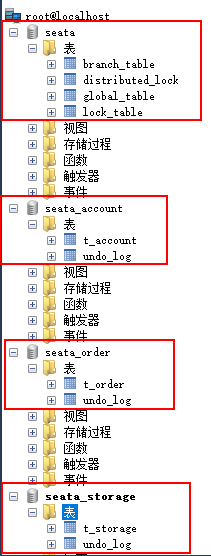

## Seata 案例实战-微服务编码落地实现

订单/库存账户业务微服务Java开发准备

业务需求：下订单→减库存→扣余额→改（订单）状态

### 1. MyBatis 一键生成

config.properties:

```properties
#t_pay表包名
package.name=com.atguigu.cloud

# mysql8.0
jdbc.driverClass = com.mysql.cj.jdbc.Driver
jdbc.url= jdbc:mysql://localhost:3306/db2024?characterEncoding=utf8&useSSL=false&serverTimezone=GMT%2B8&rewriteBatchedStatements=true&allowPublicKeyRetrieval=true
jdbc.user = root
jdbc.password =123456

# seata_order
#jdbc.driverClass = com.mysql.cj.jdbc.Driver
#jdbc.url = jdbc:mysql://localhost:3306/seata_order?characterEncoding=utf8&useSSL=false&serverTimezone=GMT%2B8&rewriteBatchedStatements=true&allowPublicKeyRetrieval=true
#jdbc.user = root
#jdbc.password =123456

# seata_storage
#jdbc.driverClass = com.mysql.cj.jdbc.Driver
#jdbc.url = jdbc:mysql://localhost:3306/seata_storage?characterEncoding=utf8&useSSL=false&serverTimezone=GMT%2B8&rewriteBatchedStatements=true&allowPublicKeyRetrieval=true
#jdbc.user = root
#jdbc.password =123456

# seata_account
#jdbc.driverClass = com.mysql.cj.jdbc.Driver
#jdbc.url = jdbc:mysql://localhost:3306/seata_account?characterEncoding=utf8&useSSL=false&serverTimezone=GMT%2B8&rewriteBatchedStatements=true&allowPublicKeyRetrieval=true
#jdbc.user = root
#jdbc.password =123456
```

generatorConfig.xml:

```xml
<?xml version="1.0" encoding="UTF-8"?>
<!DOCTYPE generatorConfiguration
        PUBLIC "-//mybatis.org//DTD MyBatis Generator Configuration 1.0//EN"
        "http://mybatis.org/dtd/mybatis-generator-config_1_0.dtd">

<generatorConfiguration>
    <properties resource="config.properties"/>

    <context id="Mysql" targetRuntime="MyBatis3Simple" defaultModelType="flat">
        <property name="beginningDelimiter" value="`"/>
        <property name="endingDelimiter" value="`"/>

        <plugin type="tk.mybatis.mapper.generator.MapperPlugin">
            <property name="mappers" value="tk.mybatis.mapper.common.Mapper"/>
            <property name="caseSensitive" value="true"/>
        </plugin>

        <jdbcConnection driverClass="${jdbc.driverClass}"
                        connectionURL="${jdbc.url}"
                        userId="${jdbc.user}"
                        password="${jdbc.password}">
        </jdbcConnection>

        <javaModelGenerator targetPackage="${package.name}.entities" targetProject="src/main/java"/>

        <sqlMapGenerator targetPackage="${package.name}.mapper" targetProject="src/main/java"/>

        <javaClientGenerator targetPackage="${package.name}.mapper" targetProject="src/main/java" type="XMLMAPPER"/>

        <table tableName="t_pay" domainObjectName="Pay">
            <generatedKey column="id" sqlStatement="JDBC"/>
        </table>

        <!--  seata_order -->
        <!--<table tableName="t_order" domainObjectName="Order">
            <generatedKey column="id" sqlStatement="JDBC"/>
        </table>-->

        <!--seata_storage-->
        <!--<table tableName="t_storage" domainObjectName="Storage">
            <generatedKey column="id" sqlStatement="JDBC"/>
        </table>-->

        <!--seata_account-->
        <!--<table tableName="t_account" domainObjectName="Account">
            <generatedKey column="id" sqlStatement="JDBC"/>
        </table>-->

    </context>
</generatorConfiguration>
```


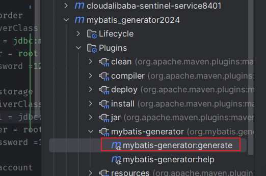

### 2. 修改公共cloud-api-commons

新增库存和账户两个Feign服务接口

- StorageFeignApi接口

  ```java
  @FeignClient(value = "seata-storage-service")
  public interface StorageFeignApi {
      /**
       * 扣减库存
       */
      @PostMapping(value = "/storage/decrease")
      ResultData decrease(@RequestParam("productId") Long productId, @RequestParam("count") Integer count);
  }
  ```

- AccountFeignApi接口

  ```java
  @FeignClient(value = "seata-account-service")
  public interface AccountFeignApi {
      //扣减账户余额
      @PostMapping("/account/decrease")
      ResultData decrease(@RequestParam("userId") Long userId, @RequestParam("money") Long money);
  }
  ```

### 3. 新建订单Order微服务

1. 建module：[seata-order-service2001](./seata-order-service2001)（[seata-storage-service2002](./seata-storage-service2002)及[seata-account-service2003](./seata-account-service2003)模块详情看[项目代码](./)，笔记中不再展示）

2. 改pom

   ```html
   <?xml version="1.0" encoding="UTF-8"?>
   <project xmlns="http://maven.apache.org/POM/4.0.0"
            xmlns:xsi="http://www.w3.org/2001/XMLSchema-instance"
            xsi:schemaLocation="http://maven.apache.org/POM/4.0.0 http://maven.apache.org/xsd/maven-4.0.0.xsd">
       <modelVersion>4.0.0</modelVersion>
       <parent>
           <groupId>com.atguigu.cloud</groupId>
           <artifactId>mscloudV5</artifactId>
           <version>1.0-SNAPSHOT</version>
       </parent>
   
       <artifactId>seata-order-service2001</artifactId>
   
       <properties>
           <maven.compiler.source>17</maven.compiler.source>
           <maven.compiler.target>17</maven.compiler.target>
           <project.build.sourceEncoding>UTF-8</project.build.sourceEncoding>
       </properties>
   
   
   
       <dependencies>
           <!-- nacos -->
           <dependency>
               <groupId>com.alibaba.cloud</groupId>
               <artifactId>spring-cloud-starter-alibaba-nacos-discovery</artifactId>
           </dependency>
           <!--alibaba-seata-->
           <dependency>
               <groupId>com.alibaba.cloud</groupId>
               <artifactId>spring-cloud-starter-alibaba-seata</artifactId>
           </dependency>
           <!--openfeign-->
           <dependency>
               <groupId>org.springframework.cloud</groupId>
               <artifactId>spring-cloud-starter-openfeign</artifactId>
           </dependency>
           <!--loadbalancer-->
           <dependency>
               <groupId>org.springframework.cloud</groupId>
               <artifactId>spring-cloud-starter-loadbalancer</artifactId>
           </dependency>
           <!--cloud-api-commons-->
           <dependency>
               <groupId>com.atguigu.cloud</groupId>
               <artifactId>cloud-api-commons</artifactId>
               <version>1.0-SNAPSHOT</version>
           </dependency>
           <!--web + actuator-->
           <dependency>
               <groupId>org.springframework.boot</groupId>
               <artifactId>spring-boot-starter-web</artifactId>
           </dependency>
           <dependency>
               <groupId>org.springframework.boot</groupId>
               <artifactId>spring-boot-starter-actuator</artifactId>
           </dependency>
           <!--SpringBoot集成druid连接池-->
           <dependency>
               <groupId>com.alibaba</groupId>
               <artifactId>druid-spring-boot-starter</artifactId>
           </dependency>
           <!-- Swagger3 调用方式 http://你的主机IP地址:5555/swagger-ui/index.html -->
           <dependency>
               <groupId>org.springdoc</groupId>
               <artifactId>springdoc-openapi-starter-webmvc-ui</artifactId>
           </dependency>
           <!--mybatis和springboot整合-->
           <dependency>
               <groupId>org.mybatis.spring.boot</groupId>
               <artifactId>mybatis-spring-boot-starter</artifactId>
           </dependency>
           <!--Mysql数据库驱动8 -->
           <dependency>
               <groupId>mysql</groupId>
               <artifactId>mysql-connector-java</artifactId>
           </dependency>
           <!--persistence-->
           <dependency>
               <groupId>javax.persistence</groupId>
               <artifactId>persistence-api</artifactId>
           </dependency>
           <!--通用Mapper4-->
           <dependency>
               <groupId>tk.mybatis</groupId>
               <artifactId>mapper</artifactId>
           </dependency>
           <!--hutool-->
           <dependency>
               <groupId>cn.hutool</groupId>
               <artifactId>hutool-all</artifactId>
           </dependency>
           <!-- fastjson2 -->
           <dependency>
               <groupId>com.alibaba.fastjson2</groupId>
               <artifactId>fastjson2</artifactId>
           </dependency>
           <!--lombok-->
           <dependency>
               <groupId>org.projectlombok</groupId>
               <artifactId>lombok</artifactId>
               <version>1.18.28</version>
               <scope>provided</scope>
           </dependency>
           <!--test-->
           <dependency>
               <groupId>org.springframework.boot</groupId>
               <artifactId>spring-boot-starter-test</artifactId>
               <scope>test</scope>
           </dependency>
       </dependencies>
   
       <build>
           <plugins>
               <plugin>
                   <groupId>org.springframework.boot</groupId>
                   <artifactId>spring-boot-maven-plugin</artifactId>
               </plugin>
           </plugins>
       </build>
   </project>
   ```

3. application.yml

   ```yaml
   server:
     port: 2001
   
   spring:
     application:
       name: seata-order-service
     cloud:
       nacos:
         discovery:
           server-addr: localhost:8848         #Nacos服务注册中心地址
   # ==========applicationName + druid-mysql8 driver===================
     datasource:
       type: com.alibaba.druid.pool.DruidDataSource
       driver-class-name: com.mysql.cj.jdbc.Driver
       url: jdbc:mysql://localhost:3306/seata_order?characterEncoding=utf8&useSSL=false&serverTimezone=GMT%2B8&rewriteBatchedStatements=true&allowPublicKeyRetrieval=true
       username: root
       password: 123456
   # ========================mybatis===================
   mybatis:
     mapper-locations: classpath:mapper/*.xml
     type-aliases-package: com.xi.cloud.entities
     configuration:
       map-underscore-to-camel-case: true
   
   # ========================seata简洁版===================
   seata:
     registry:
       type: nacos
       nacos:
         server-addr: 127.0.0.1:8848
         namespace: ""
         group: SEATA_GROUP
         application: seata-server
     tx-service-group: default_tx_group # 事务组，由它获得TC服务的集群名称  DEFAULT_TX_GROUP_OLD:老版本，后续不能用此值
     service:
       vgroup-mapping: # 点击源码分析
         default_tx_group: default # 事务组与TC服务集群的映射关系
     data-source-proxy-mode: AT
   
   #  # ========================seata 详细版(了解即可，太详细了不好维护)===================
   #  seata:
   #    registry: # seata注册配置
   #      type: nacos # seata注册类型
   #      nacos:
   #        application: seata-server #seata应用名称
   #        server-addr: 127.0.0.1:8848
   #        namespace: ""
   #        group: SEATA_GROUP
   #        cluster: default
   #    config:             # seata配置抓取
   #      nacos:
   #        server-addr: 127.0.0.1:8848
   #        namespace: ""
   #        group: SEATA_GROUP
   #        username: nacos
   #        password: nacos
   #    tx-service-group: default_tx_group # 事务组，由它获得TC服务的集群名称
   #    service:
   #      vgroup-mapping:
   #        default_tx_group: default # 事务群组的映射配置关系
   #    data-source-proxy-mode: AT
   #    application-id: seata-server
   
   logging:
     level:
       io:
         seata: info
   ```

   - Namespace+Group+DataId三者关系
     Nacos数据模型Key由三元组唯一确定，Namespace默认是空串，公共命名空间(public),分组默认是DEFAULT_GROUP.
     

   - 对应说明
     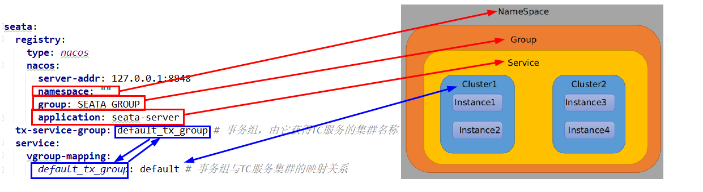
     `DEFAULT_TX_GROUP_OLD`老版本，此值后续版本不会使用，不要再用这个

     

     

### 4. 主启动

```java
@SpringBootApplication
@MapperScan("com.xi.cloud.mapper") //import tk.mybatis.spring.annotation.MapperScan;
@EnableDiscoveryClient //服务注册和发现
@EnableFeignClients
public class SeataOrderMainApp2001 {
    public static void main(String[] args) {
        SpringApplication.run(SeataOrderMainApp2001.class,args);
    }
}
```

### 5. 业务类

entitie 和 Mapper复制mybatis_generator2024模块里自动生成的然后

entry：添加ToString方法，实现`Serializable`接口

...

**最终：**


## Seata 案例实战-测试

> 下订单->减库存->扣余额->改(订单)状态

**启动服务：**

- 启动Nacos
- 启动Seata
- 启动订单微服务2001
- 启动库存微服务2002
- 启动账户微服务2003

**数据库初始数据：**
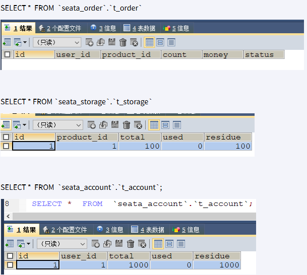

### 正常下单

此时我们没有在订单模块添加`@GlobalTransactional`

1. http://localhost:2001/order/create?userId=1&productId=1&count=10&money=100
   1号用户花费100块钱买了10个1号产品

   - 故障
     

   - 原因：springboot-+springcloud版本太高导致和阿里巴巴Seata不兼容

   - 解决方案：总体父工程

     - 方式一：boot+cloud降低版本

       ```html
       <!--<spring.boot.version>3.2.0</spring.boot.version>-->
       <!--<spring.cloud.version>2023.0.0</spring.cloud.version>-->
       <!--
       上面的配置暂时为本案例注释掉，版本降级一下。
       讲解完后请恢复上述高版本保持前后配置一致，请用下面的任一个版本替代上述
       -->
       <spring.boot.version>3.0.9</spring.boot.version>
       <spring.cloud.version>2022.0.2</spring.cloud.version>
       <!--仅为了整合openfeign + alibaba seata的案例，降低版本处理下-->
       <spring.boot.version>3.1.7</spring.boot.version>
       <spring.cloud.version>2022.0.4</spring.cloud.version>
       ```

     - SpringBoot+SpringCloud 版本太高导致和阿里巴巴Sentinel版本不兼容问题处理：可以升级SpringCloudAlibaba版本到2023.0.0.0-RC1,springboot继续用3.2.0，完美解决。（实测可以）

       ```html
       <spring.boot.version>3.2.0</spring.boot.version>
       <spring.cloud.version>2023.0.0</spring.cloud.version>
       <!-- 仅为了整合openfeign + alibaba seata的案例提升版本处理下(用的这个)-->
       <spring.cloud.alibaba.version>2023.0.0.0-RC1</spring.cloud.alibaba.version>
       ```

2. 降低版本后继续访问

   - http://localhost:2001/order/create?userId=1&productId=1&count=10&money=100
     1号用户花费100块钱买了10个1号产品
   - 成功访问

### 超时异常出错，无`@GlobalTransaction`

微服务2003(最深的那个微服务)分别添加`myTimeOut();`模拟超时异常和`int age = 10/0;`模拟异常

```java
public void decrease(Long userId, Long money) {
    ...
        myTimeOut(); // 超时错误
    	// int age = 10/0;  // 分母为0错误
    ...
}
private static void myTimeOut() {
    try { TimeUnit.SECONDS.sleep(65); } catch (InterruptedException e) { e.printStackTrace(); }
}
```

当库存和账户金额扣减后，订单状态并没有设置为已经完成，没有从零改为1
数据库情况没有**进行回滚**

### 超时异常出错，有`@GlobalTransaction`

微服务2003(最深的那个微服务)保留`myTimeOut();`模拟超时异常

2001(最外层的)微服务impl方法上加上`@GlobalTransaction`

```java
// name 为分布式事务命名，rollbackFor为发生什么异常时回滚
@GlobalTransactional(name = "xi-create-order",rollbackFor = Exception.class) //AT 模式
//@GlobalTransactional @Transactional(rollbackFor = Exception.class) //XA 模式
public void create(Order order) {
    ...
}
```

此时，订单模块就是TM(事务控制器，有且仅有一个)，也是其中一个RM(各个数据库)，TC(就是Seata)

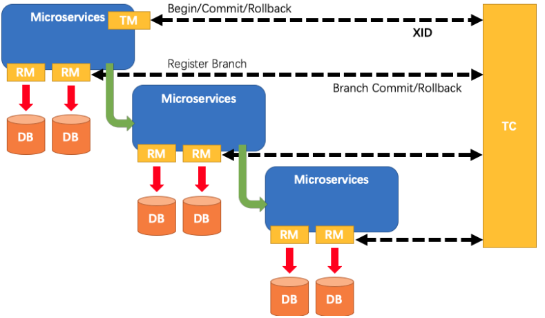

查看Seata后台：http://localhost:7091/#/transaction/list

- 全局事务id:
  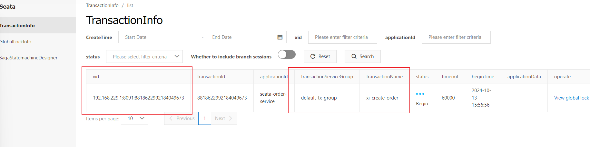
- 全局锁
  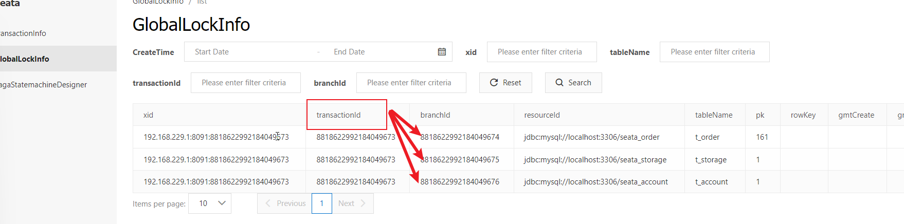

下单后数据库3个库数据并没有任何改变，被回滚了

undolog数据库表中记录事务开始时表的原始状态，如需回滚则回滚到undolog表中记录的情况，并删掉undolog表中记录的原始状态，如不需回滚，该事务结束后undolog中该记录自动删除

## Seata 原理小总结和面试题

**AT模式如何做到对业务的无侵入:**

- Seata是什么？
  - Seata是一款开源的分布式事务解决方案，致力于提供高性能和简单易用的分布式事务服务。Seata将为用户提供了AT、TCC、SAGA和XA事务模式，为用户打造一站式的分布式解决方案。
- AT模式
  - 前提
    基于支持本地ACID事务的关系型数据库。
  - Java应用，通过DBC访问数据库。
- 整体机制
  两阶段提交协议的演变：
  - 一阶段：
    业务数据和回滚日志记录在同一个本地事务中提交，释放本地锁和连接资源。
  - 二阶段：
    - 提交异步化，非常快速地完成。
    - 回滚涌过一阶段的回滚日志讲行反向补偿

```java
public class OrderService {
	@GlobalTransactional// --->TM
	public void saveorder() {
		//1下订单，本地事务也即一个分支，它就是RM

		//2减库存，
    }
}
```

---

在**一阶段**，Seata 会拦截“业务 SQL”,

1. 解析 SQL 语义，找到“业务 SQL”要更新的业务数据，在业务数据被更新前，将其保存成“before image”，
2. 执行“业务 SQL”更新业务数据，在业务数据更新之后，
3. 其保存成“after image”，最后生成行锁。

以上操作全部在一个数据库事务内完成，这样保证了一阶段操作的原子性。


---

**二阶段**分2种情况：正常提交、异常回滚

- 二阶段**正常提交**：
  二阶段如是顺利提交的话，因为“业务 SQL”在一阶段已经提交至数据库，所以**Seata框架只需将一阶段保存的快照数据和行锁删掉，完成数据清理即可。**
  

- 二阶段回滚：
  二阶段如果是**回滚**的话，**Seata 就需要回滚一阶段已经执行的“业务 SQL”，还原业务数据**。

  回滚方式便是用“before image”还原业务数据；但在还原前要首先要校验脏写，对比“数据库当前业务数据”和 “after image”，

  如果两份数据完全一致就说明没有脏写，可以还原业务数据，如果不一致就说明有脏写，出现脏写就需要转人工处理。
  