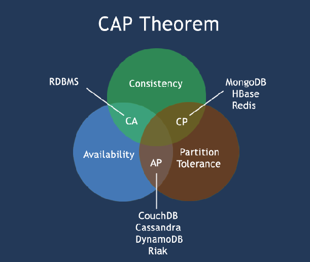
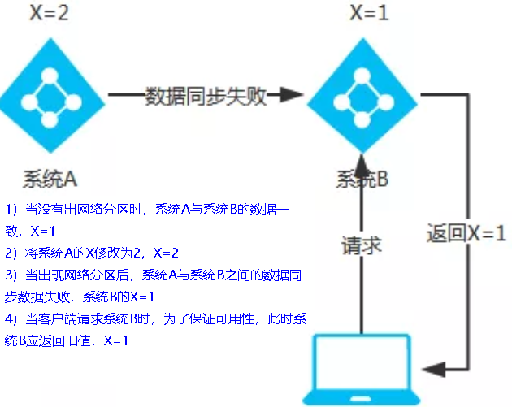

# Consul服务注册与发现

微服务所在的IP地址和端口号硬编码到订单微服务中，会存在非常多的问题

1. 如果订单微服务和支付微服务的IP地址或者端口号发生了变化，则支付微服务将变得不可用，需要同步修改订单微服务中调用支付微服务的IP地址和端口号。
2. 如果系统中提供了多个订单微服务和支付微服务，则无法实现微服务的负载均衡功能。
3. 如果系统需要支持更高的并发，需要部署更多的订单微服务和支付微服务，硬编码订单微服务则后续的维护会变得异常复杂。

所以，在微服务开发的过程中，需要引入服务治理功能，实现微服务之间的动态注册与发现，从此刻开始我们正式进入SpringCloud实战

## consul 简介

[consul官网](https://developer.hashicorp.com/consul/docs)

Consul 是一套开源的**分布式服务发现和配置管理系统**，由 HashiCorp 公司用 Go 语言开发。

提供了微服务系统中的服务治理、配置中心、控制总线等功能。这些功能中的每一个都可以根据需要单独使用，也可以一起使用以构建全方位的服务网格，总之Consul提供了一种完整的服务网格解决方案。它具有很多优点。包括： 基于 raft 协议，比较简洁； 支持健康检查, 同时支持 HTTP 和 DNS 协议 支持跨数据中心的 WAN 集群 提供图形界面 跨平台，支持 Linux、Mac、Windows

[Spring Cloud consul官网](https://spring.io/projects/spring-cloud-consul)

Spring Cloud Consul 功能：

- 服务发现：提供HTTP和DNS两种发现方式
- 健康监测：支持多种方式，HTTP、TCP、Docker、Shell脚本定制
- KV存储：Key、Value的存储方式
- 多数据中心：Consul支持多数据中心

## consul使用

下载consul[Install | Consul | HashiCorp Developer](https://developer.hashicorp.com/consul/install#windows)

安装路径下`consul agent -dev`以开发模式启动

通过http://localhost:8500可以访问Consul的首页

**步骤**

1. pom引入坐标(下方有优化)

   ```html
   <!--SpringCloud consul discovery -->
   <dependency>
       <groupId>org.springframework.cloud</groupId>
       <artifactId>spring-cloud-starter-consul-discovery</artifactId>
   </dependency>
   ```

2. yml

   ```yaml
   spring:
     application:
       name: ???
     ####Spring Cloud Consul for Service Discovery(服务发现)
     cloud:
       consul:
         # 要入驻进的是哪个consul
         host: localhost
         port: 8500
         discovery:
           # 此模块将要以这个名字入驻进Consul
           service-name: ${spring.application.name}
   ```

3. 主启动
   `@EnableDiscoveryClient`: 放在启动类上， 开启服务发现

**启动时出现警告**

启动此服务控制台出现`Standard Commons Logging discovery in action with spring-jcl: please remove commons-logging.jar from classpath in order to avoid potential conflicts`提示，即“使用spring-jcl进行标准Commons日志发现:请从类路径中删除Commons - Logging .jar，以避免潜在的冲突”，可以正常运行，有代码洁癖可以使用以下方法解决

```html
<!--SpringCloud consul discovery -->
<dependency>
    <groupId>org.springframework.cloud</groupId>
    <artifactId>spring-cloud-starter-consul-discovery</artifactId>
    <!-- 排除Commons-Logging.jar，以避免潜在的冲突 -->
    <exclusions>
        <exclusion>
            <groupId>commons-logging</groupId>
            <artifactId>commons-logging</artifactId>
        </exclusion>
    </exclusions>
</dependency>
```

## 硬编码写死问题解决

**原问题**:

```java
public static final String PaymentSrv_URL = "http://localhost:8001";// 硬编码
```

**解决**：

```java
public static final String PaymentSrv_URL = "http://cloud-payment-service";// 入驻进spring cloud consul时8001微服务的名字
```

**但由此引发另一个问题**：`Caused by: java.net.UnknownHostException: cloud-payment-service`，如果通过微服务名称调用，consul默认有负载均衡，后面是多个(一个集群)，因此需要告诉[RestTemplate](###RestTemplate访问远程Http)(远程访问Http)要支持负载均衡

**解决**：
修改RestTemplate的配置类，在构造方法上加`@LoadBalanced`注解，提供RestTemplate(远程访问Http)对负载均衡的支撑

```java
@Configuration// 使用 @Configuration 标记类作为配置类替换 xml 配置文件
public class RestTemplateConfig {
    @Bean
    @LoadBalanced// 提供RestTemplate(远程访问Http)对负载均衡的支撑
    public RestTemplate restTemplate() {
        return new RestTemplate();
    }
}
```

## 三个注册中心异同点

| 组件名    | 语言 | CAP  | 服务健康检查 | 对外暴露接口 | SpriongCloud集成 |
| --------- | ---- | ---- | ------------ | ------------ | ---------------- |
| Eureka    | Java | AP   | 可配支持     | HTTP         | 已集成           |
| Consul    | Go   | CP   | 支持         | HTTP/DNS     | 已集成           |
| Zookeeper | Java | CP   | 支持         | 客户端       | 已集成           |

**CAP**

- C: Consistency（强一致性）
- A: Avaliblity（可用性）
- P: Partition tolerance（分区容错性）

**经典CAP图**

最多只能同时较好的满足两个。

 **CAP理论的核心**：一个分布式系统不可能同时很好的满足一致性，可用性和分区容错性这三个需求，

因此，根据 CAP 原理将 NoSQL 数据库分成了满足 CA 原则、满足 CP 原则和满足 AP 原则三 大类：

- CA - 单点集群，满足一致性，可用性的系统，通常在可扩展性上不太强大。
- CP - 满足一致性，分区容忍必的系统，通常性能不是特别高。
- AP - 满足可用性，分区容忍性的系统，通常可能对一致性要求低一些。



### AP架构



如Eureka，当网络分区出现后，为了保证可用性，系统B**可以返回旧值**，保证系统的可用性。

当数据出现不一致时，虽然A, B上的注册信息不完全相同，但每个Eureka节点依然能够正常对外提供服务，这会出现查询服务信息时如果请求A查不到，但请求B就能查到。如此保证了可用性但牺牲了一致性

**结论**：**违背了一致性**C的要求，只**满足可用性和分区容错**，即AP

### CP架构


如Zookeeper/Consul，当网络分区出现后，为了保证一致性，**就必须拒接请求**，否则无法保证一致性

Consul 遵循CAP原理中的CP原则，保证了强一致性和分区容错性，且使用的是Raft算法，比zookeeper使用的Paxos算法更加简单。虽然保证了强一致性，但是可用性就相应下降了，例如服务注册的时间会稍长一些，因为 Consul 的 raft 协议要求**必须过半数的节点都写入成功才认为注册成功 ；在leader挂掉了之后，重新选举出leader之前会导致Consul 服务不可用**。

**结论**：**违背了可用性**A的要求，只**满足一致性和分区容错**，即CP

## Consul服务的配置与刷新

微服务意味着要将单体应用中的业务拆分成一个个子服务，每个服务的粒度相对较小，因此系统中会出现**大量的服务**。由于**每个服务都需要必要的配置信息**才能运行，**所以一套集中式的、动态的配置管理设施是必不可少的**。

比如某些配置文件中的内容大部分都是相同的，只有个别的配置项不同。就拿数据库配置来说吧，如果每个微服务使用的技术栈都是相同的，则每个微服务中关于数据库的配置几乎都是相同的，有时候主机迁移了，**我希望一次修改，处处生效**。

当下我们每一个微服务自己带着一个application.yml，上百个配置文件的管理....../(ㄒoㄒ)/~~

### 服务配置**步骤**

**需求**

通过全局配置信息，直接注册进Consul服务器，从Consul获取，因此要遵守Consul的配置规则要求

 **步骤**

1. pom

   ```html
   <!--SpringCloud consul config consul配置管理-->
   <dependency>
       <groupId>org.springframework.cloud</groupId>
       <artifactId>spring-cloud-starter-consul-config</artifactId>
   </dependency>
   <dependency>
       <groupId>org.springframework.cloud</groupId>
       <artifactId>spring-cloud-starter-bootstrap</artifactId>
   </dependency>
   ```

2. yml
   [yml配置规则说明](####yml配置规则说明)

   新增bootstrop.yml

   ```yaml
   # 系统级配置
   spring:
     application:
       name: XXX
       ####Spring Cloud Consul for Service Discovery
     cloud:
       consul:
         host: localhost
         port: 8500
         discovery:
           service-name: ${spring.application.name}
         config:
           profile-separator: '-' # 官方默认分隔符为 ","，我们把它更新为 '-'
           format: YAML
   ```

   修改application.yml

   ```yaml
   # 用户级配置
   server:
     port: 8001
   
   # ==========applicationName + druid-mysql8 driver===================
   spring:
     datasource:
       type: com.alibaba.druid.pool.DruidDataSource
       driver-class-name: com.mysql.cj.jdbc.Driver
       url: jdbc:mysql://localhost:3306/db_name?characterEncoding=utf8&useSSL=false&serverTimezone=GMT%2B8&rewriteBatchedStatements=true&allowPublicKeyRetrieval=true
       username: root
       password: password
     profiles:
       active: dev # 多环境配置加载内容dev/prod,不写就是默认default配置
   
   # ========================mybatis===================
   mybatis:
     mapper-locations: classpath:mapper/*.xml
     type-aliases-package: com.xi.cloud.entities
     configuration:
       map-underscore-to-camel-case: true
   ```

3. [Consul服务器key/value配置填写](####Consul服务器key/value配置填写)
   创建文件

   - config/分布式微服务名字/data
   - ​             /分布式微服务名字-dev/data
   - ​             /分布式微服务名字-prod/data

   

4. 

   

#### yml配置规则说明


新增配置文件bootstrop.yml

- bootstrop.yml是什么？
  applicaiton.yml是**用户级**的资源配置项
  bootstrap.yml是**系统级**的，**优先级更加高**

  Spring Cloud会创建一个“Bootstrap Context”，作为Spring应用的`Application Context`的**父上下文**。初始化的时候，`Bootstrap Context`负责从外部源加载配置属性并解析配置。这两个上下文共享一个从外部获取的`Environment`。

  `Bootstrap`属性有高优先级，默认情况下，它们不会被本地配置覆盖。 `Bootstrap context`和`Application Context`有着不同的约定，所以新增了一个`bootstrap.yml`文件，保证`Bootstrap Context`和`Application Context`配置的分离。

   **application.yml文件改为bootstrap.yml,这是很关键的或者两者共存**

  因为bootstrap.yml是比application.yml先加载的。bootstrap.yml优先级高于application.yml

#### Consul服务器key/value配置填写

参考规则

```yaml
# config/分布式微服务名字/data # 不写就是默认default配置
#       /分布式微服务名字-dev/data
#       /分布式微服务名字-prod/data
```

1. 创建config文件夹，以/结尾

   

2. config文件下分别创建三个文件夹，以/结尾
   由于我们配置了`spring: cloud: consul: config: profile-separator: '-' # 官方默认分隔符为 ","，我们把它更新为 '-'`
   所以在config文件夹下创建`分布式微服务名字`、`分布式微服务名字-dev`、`分布式微服务名字-prod`三个文件夹，以/结尾
   

3. 第二步创建的三个文件夹下分别创建data文件(可写入内容)，data不再是文件夹
   

### 动态刷新步骤

主启动类上加上`@RefreshScope`注解，可以在服务器配置变更时自动刷新 默认间隔为55s后自动刷新

可修改配置文件`spring.cloud.consul.config.watch.tait-time: ?`?为秒数，修改间隔时间

## 引出问题

Consul重启后consul里的配置消失了

由此我们需要做Consul的配置持久化

## LoadBalancer之Consul持久化

Consul数据持久化配置，并且注册为Windows服务

1. consul下载目录下新建空文件夹`mydata`和`consul_start.bat`文件

2. `consul_start.bat`内容信息

   ```bash
   @echo.服务启动......  
   @echo off  
   @sc create Consul binpath= "D:\devSoft\consul_1.17.0_windows_386\consul.exe agent -server -ui -bind=127.0.0.1 -client=0.0.0.0 -bootstrap-expect  1  -data-dir D:\devSoft\consul_1.17.0_windows_386\mydata   "
   @net start Consul
   @sc config Consul start= AUTO  
   @echo.Consul start is OK......success
   @pause
   ```

   - `@sc create Consul binpath= "Consul安装路径\consul.exe agent -server(以服务器后台形式启动) -ui -bind=127.0.0.1(绑定本机) -client=0.0.0.0 -bootstrap-expect  1  -data-dir consul的配置数据存储路径"`
   - `@sc config Consul start= AUTO (是否每次开机启动) `

3. 右键管理员权限打开

4. 后续consul的配置数据会保存进mydata文件夹

这样每次开机都会自动启动consul服务