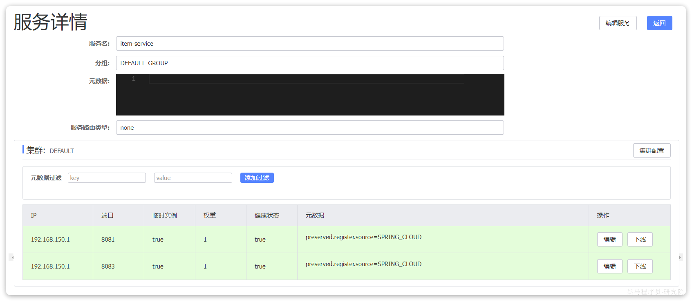
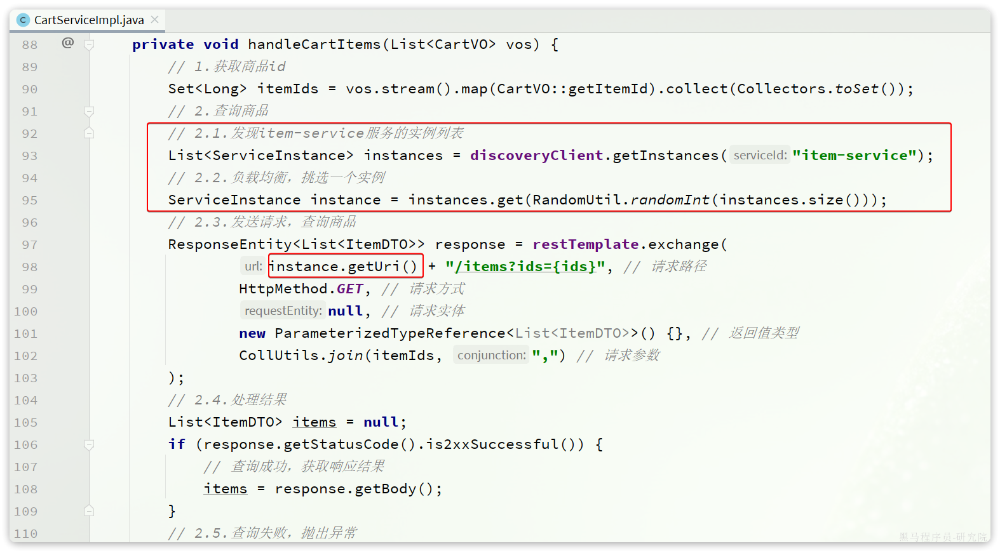
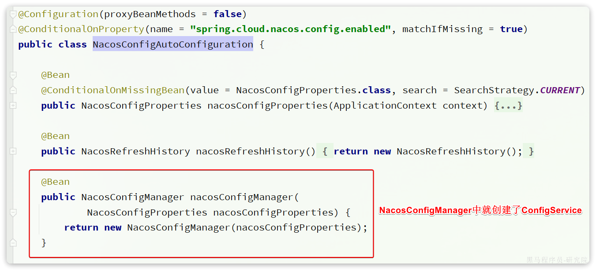

# 服务注册和发现

在上一章我们实现了微服务拆分，并且通过Http请求实现了跨微服务的远程调用。不过这种手动发送Http请求的方式存在一些问题。

试想一下，假如商品微服务被调用较多，为了应对更高的并发，我们进行了多实例部署，如图：


此时，每个`item-service`的实例其IP或端口不同，问题来了：

- item-service这么多实例，cart-service如何知道每一个实例的地址？
- http请求要写url地址，`cart-service`服务到底该调用哪个实例呢？
- 如果在运行过程中，某一个`item-service`实例宕机，`cart-service`依然在调用该怎么办？
- 如果并发太高，`item-service`临时多部署了N台实例，`cart-service`如何知道新实例的地址？

为了解决上述问题，就必须引入注册中心的概念了，接下来我们就一起来分析下注册中心的原理。

## 3.1.注册中心原理

在微服务远程调用的过程中，包括两个角色：

- 服务提供者：提供接口供其它微服务访问，比如`item-service`
- 服务消费者：调用其它微服务提供的接口，比如`cart-service`

在大型微服务项目中，服务提供者的数量会非常多，为了管理这些服务就引入了**注册中心**的概念。注册中心、服务提供者、服务消费者三者间关系如下：


流程如下：

- 服务启动时就会注册自己的服务信息（服务名、IP、端口）到注册中心
- 调用者可以从注册中心订阅想要的服务，获取服务对应的实例列表（1个服务可能多实例部署）
- 调用者自己对实例列表负载均衡，挑选一个实例
- 调用者向该实例发起远程调用

当服务提供者的实例宕机或者启动新实例时，调用者如何得知呢？

- 服务提供者会定期向注册中心发送请求，报告自己的健康状态（心跳请求）
- 当注册中心长时间收不到提供者的心跳时，会认为该实例宕机，将其从服务的实例列表中剔除
- 当服务有新实例启动时，会发送注册服务请求，其信息会被记录在注册中心的服务实例列表
- 当注册中心服务列表变更时，会主动通知微服务，更新本地服务列表

## 3.2.Nacos注册中心

目前开源的注册中心框架有很多，国内比较常见的有：

- Eureka：Netflix公司出品，目前被集成在SpringCloud当中，一般用于Java应用
- Nacos：Alibaba公司出品，目前被集成在SpringCloudAlibaba中，一般用于Java应用
- Consul：HashiCorp公司出品，目前集成在SpringCloud中，不限制微服务语言

以上几种注册中心都遵循SpringCloud中的API规范，因此在业务开发使用上没有太大差异。由于Nacos是国内产品，中文文档比较丰富，而且同时具备**配置管理**功能（后面会学习），因此在国内使用较多，课堂中我们会Nacos为例来学习。

官方网站：[AI 应用企业开发者沙龙](https://summit.aliyun.com/cloudnative2024-AI-shenzhen)

我们基于Docker来部署Nacos的注册中心，首先我们要准备MySQL数据库表，用来存储Nacos的数据。由于是Docker部署，所以大家需要将资料中的SQL文件导入到你**Docker中的MySQL容器**中：


最终表结构如下：


然后，找到课前资料下的nacos文件夹：


其中的`nacos/custom.env`文件中，有一个MYSQL_SERVICE_HOST也就是mysql地址，需要修改为你自己的虚拟机IP地址：

```bash
PREFER_HOST_MODE=hostname
MODE=standalone
SPRING_DATASOURCE_PLATFORM=mysql
MYSQL_SERVICE_HOST=192.168.244.129
MYSQL_SERVICE_DB_NAME=nacos
MYSQL_SERVICE_PORT=3306
MYSQL_SERVICE_USER=root
MYSQL_SERVICE_PASSWORD=123456
MYSQL_SERVICE_DB_PARAM=characterEncoding=utf8&connectTimeout=1000&socketTimeout=3000&autoReconnect=true&useSSL=false&allowPublicKeyRetrieval=true&serverTimezone=Asia/Shanghai
```

然后，将课前资料中的`nacos`目录上传至虚拟机的`/root`目录。

进入root目录，然后执行下面的docker命令：

```PowerShell
docker run -d \
--name nacos \
--env-file ./nacos/custom.env \
-p 8848:8848 \
-p 9848:9848 \
-p 9849:9849 \
--restart=always \
nacos/nacos-server:v2.1.0-slim
```

启动完成后，访问下面地址：http://192.168.244.129:8848/nacos/，注意将`192.168.244.129`替换为你自己的虚拟机IP地址。

首次访问会跳转到登录页，**账号密码都是nacos**


## 3.3.服务注册

接下来，我们把`item-service`注册到Nacos，步骤如下：

- 引入依赖
- 配置Nacos地址
- 重启

### 3.3.1.添加依赖

在`item-service`的`pom.xml`中添加依赖：

```XML
<!--nacos 服务注册发现-->
<dependency>
    <groupId>com.alibaba.cloud</groupId>
    <artifactId>spring-cloud-starter-alibaba-nacos-discovery</artifactId>
</dependency>
```

### 3.3.2.配置Nacos

在`item-service`的`application.yml`中添加nacos地址配置：

```YAML
spring:
  application:
    name: item-service # 服务名称
  cloud:
    nacos:
      server-addr: 192.168.244.129:8848 # nacos地址
```

### 3.3.3.启动服务实例

为了测试一个服务多个实例的情况，我们再配置一个`item-service`的部署实例：


然后配置启动项，注意重命名并且配置新的端口，避免冲突：


重启`item-service`的两个实例：


访问nacos控制台，可以发现服务注册成功：


点击详情，可以查看到`item-service`服务的两个实例信息：



## 3.4.服务发现

服务的消费者要去nacos订阅服务，这个过程就是服务发现，步骤如下：

- 引入依赖
- 配置Nacos地址
- 发现并调用服务

### 3.4.1.引入依赖

服务发现除了要引入nacos依赖以外，由于还需要负载均衡，因此要引入SpringCloud提供的LoadBalancer依赖。

我们在`cart-service`中的`pom.xml`中添加下面的依赖：

```XML
<!--nacos 服务注册发现-->
<dependency>
    <groupId>com.alibaba.cloud</groupId>
    <artifactId>spring-cloud-starter-alibaba-nacos-discovery</artifactId>
</dependency>
```

可以发现，这里Nacos的依赖于服务注册时一致，这个依赖中同时包含了服务注册和发现的功能。因为任何一个微服务都可以调用别人，也可以被别人调用，即可以是调用者，也可以是提供者。

因此，等一会儿`cart-service`启动，同样会注册到Nacos

### 3.4.2.配置Nacos地址

在`cart-service`的`application.yml`中添加nacos地址配置：

```YAML
spring:
  cloud:
    nacos:
      server-addr: 192.168.244.129:8848
```

### 3.4.3.发现并调用服务

接下来，服务调用者`cart-service`就可以去订阅`item-service`服务了。不过item-service有多个实例，而真正发起调用时只需要知道一个实例的地址。

因此，服务调用者必须利用负载均衡的算法，从多个实例中挑选一个去访问。常见的负载均衡算法有：

- 随机
- 轮询
- IP的hash
- 最近最少访问
- ...

这里我们可以选择最简单的随机负载均衡。

另外，服务发现需要用到一个工具，DiscoveryClient，SpringCloud已经帮我们自动装配，我们可以直接注入使用：


接下来，我们就可以对原来的远程调用做修改了，之前调用时我们需要写死服务提供者的IP和端口：


但现在不需要了，我们通过DiscoveryClient发现服务实例列表，然后通过负载均衡算法，选择一个实例去调用：



经过swagger测试，发现没有任何问题。

# 配置管理

到目前为止我们已经解决了微服务相关的几个问题：

- 微服务远程调用
- 微服务注册、发现
- 微服务请求路由、负载均衡
- 微服务登录用户信息传递

不过，现在依然还有几个问题需要解决：

- 网关路由在配置文件中写死了，如果变更必须重启网关微服务
- 某些业务配置在配置文件中写死了，每次修改都要重启服务
- 每个微服务都有很多重复的配置，维护成本高

这些问题都可以通过统一的**配置管理器服务**解决。而Nacos不仅仅具备注册中心功能，也具备配置管理的功能：


微服务共享的配置可以统一交给Nacos保存和管理，在Nacos控制台修改配置后，Nacos会将配置变更推送给相关的微服务，并且无需重启即可生效，实现配置热更新。

网关的路由同样是配置，因此同样可以基于这个功能实现动态路由功能，无需重启网关即可修改路由配置。

## 8.1 Nacos配置共享

我们可以把微服务共享的配置抽取到Nacos中统一管理，这样就不需要每个微服务都重复配置了。分为两步：

- 在Nacos中添加共享配置
- 微服务拉取配置

### 8.1.1 添加共享配置

以cart-service为例，我们看看有哪些配置是重复的，可以抽取的：

首先是jdbc相关配置：


然后是日志配置：


然后是swagger以及OpenFeign的配置：


我们在nacos控制台分别添加这些配置。

首先是jdbc相关配置，在`配置管理`->`配置列表`中点击`+`新建一个配置：


在弹出的表单中填写信息：


其中详细的配置如下：

```YAML
spring:
  datasource:
    url: jdbc:mysql://${hm.db.host:192.168.244.130}:${hm.db.port:3306}/${hm.db.database}?useUnicode=true&characterEncoding=UTF-8&autoReconnect=true&serverTimezone=Asia/Shanghai
    driver-class-name: com.mysql.cj.jdbc.Driver
    username: ${hm.db.un:root}
    password: ${hm.db.pw:123456}
mybatis-plus:
  configuration:
    default-enum-type-handler: com.baomidou.mybatisplus.core.handlers.MybatisEnumTypeHandler
  global-config:
    db-config:
      update-strategy: not_null
      id-type: auto
```

注意这里的jdbc的相关参数并没有写死，例如：

- `数据库ip`：通过`${hm.db.host:192.168.150.101}`配置了默认值为`192.168.150.101`，同时允许通过`${hm.db.host}`来覆盖默认值
- `数据库端口`：通过`${hm.db.port:3306}`配置了默认值为`3306`，同时允许通过`${hm.db.port}`来覆盖默认值
- `数据库database`：可以通过`${hm.db.database}`来设定，无默认值

然后是统一的日志配置，命名为`shared-log.yaml`，配置内容如下：

```YAML
logging:
  level:
    com.hmall: debug
  pattern:
    dateformat: HH:mm:ss:SSS
  file:
    path: "logs/${spring.application.name}"
```

然后是统一的swagger配置，命名为`shared-swagger.yaml`，配置内容如下：

```YAML
knife4j:
  enable: true
  openapi:
    title: ${hm.swagger.title:黑马商城接口文档}
    description: ${hm.swagger.description:黑马商城接口文档}
    email: ${hm.swagger.email:zhanghuyi@itcast.cn}
    concat: ${hm.swagger.concat:虎哥}
    url: https://www.itcast.cn
    version: v1.0.0
    group:
      default:
        group-name: default
        api-rule: package
        api-rule-resources:
          - ${hm.swagger.package}
```

注意，这里的swagger相关配置我们没有写死，例如：

- `title`：接口文档标题，我们用了`${hm.swagger.title}`来代替，将来可以有用户手动指定
- `email`：联系人邮箱，我们用了`${hm.swagger.email:``zhanghuyi@itcast.cn``}`，默认值是`zhanghuyi@itcast.cn`，同时允许用户利用`${hm.swagger.email}`来覆盖。

### 8.1.2 拉取共享配置

接下来，我们要在微服务拉取共享配置。将拉取到的共享配置与本地的`application.yaml`配置合并，完成项目上下文的初始化。

不过，需要注意的是，读取Nacos配置是SpringCloud上下文（`ApplicationContext`）初始化时处理的，发生在项目的引导阶段。然后才会初始化SpringBoot上下文，去读取`application.yaml`。

也就是说引导阶段，`application.yaml`文件尚未读取，根本不知道nacos 地址，该如何去加载nacos中的配置文件呢？

SpringCloud在初始化上下文的时候会先读取一个名为`bootstrap.yaml`(或者`bootstrap.properties`)的文件，如果我们将nacos地址配置到`bootstrap.yaml`中，那么在项目引导阶段就可以读取nacos中的配置了。


因此，微服务整合Nacos配置管理的步骤如下：

1）引入依赖：

在cart-service模块引入依赖：

```XML
<!--nacos配置管理-->
<dependency>
    <groupId>com.alibaba.cloud</groupId>
    <artifactId>spring-cloud-starter-alibaba-nacos-config</artifactId>
</dependency>
<!--读取bootstrap文件-->
<dependency>
    <groupId>org.springframework.cloud</groupId>
    <artifactId>spring-cloud-starter-bootstrap</artifactId>
</dependency>
```

2）新建bootstrap.yaml

在cart-service中的resources目录新建一个bootstrap.yaml文件：


内容如下：

```YAML
spring:
  application:
    name: cart-service # 服务名称
  profiles:
    active: dev
  cloud:
    nacos:
      server-addr: 192.168.150.101 # nacos地址
      config:
        file-extension: yaml # 文件后缀名
        shared-configs: # 共享配置
          - dataId: shared-jdbc.yaml # 共享mybatis配置
          - dataId: shared-log.yaml # 共享日志配置
          - dataId: shared-swagger.yaml # 共享日志配置
```

3）修改application.yaml

由于一些配置挪到了bootstrap.yaml，因此application.yaml需要修改为：

```YAML
server:
  port: 8082
feign:
  okhttp:
    enabled: true # 开启OKHttp连接池支持
hm:
  swagger:
    title: 购物车服务接口文档
    package: com.hmall.cart.controller
  db:
    database: hm-cart
```

重启服务，发现所有配置都生效了。

## 8.2 配置热更新

**配置热更新**：当修改配置文件中的配置时，微服务无需重启即可使配置生效。

**前提条件：**

1. nacos中要有一个与微服务名有关的配置文件，dataId的格式如下：`[spring.applicaition.name]-[spring.active.profile].[file-extension]`即
   `[微服务名称]-[项目profile(可选)].文件后缀名`

2. 微服务中要以特定方式读取需要热更新的配置属性
   推荐使用第一种

   ```java
   @Data
   @ConfigurationProperties(prefix = "hm.cart")
   public class CartProperties {
       private int maxItems;
   }
   ```

   或

   ```java
   @Data
   @RefreshScope // 标记热更新
   public class CartProperties {
       @Value("${hm.cart.maxItems}")
       private int maxItems;
   }
   ```

微服务中要以特定方式读取需要热更新的配置属性

有很多的业务相关参数，将来可能会根据实际情况临时调整。例如购物车业务，购物车数量有一个上限，默认是10，对应代码如下：


现在这里购物车是写死的固定值，我们应该将其配置在配置文件中，方便后期修改。

但现在的问题是，即便写在配置文件中，修改了配置还是需要重新打包、重启服务才能生效。能不能不用重启，直接生效呢？

这就要用到Nacos的配置热更新能力了，分为两步：

- 在Nacos中添加配置
- 在微服务读取配置

### 8.2.1 添加配置到Nacos

首先，我们在nacos中添加一个配置文件，**将购物车的上限数量添加到配置中**：


**注意文件的dataId格式：**
`[spring.applicaition.name]-[spring.active.profile].[file-extension]`即
`[微服务名称]-[项目profile即环境(可选)].文件后缀名`

文件名称由三部分组成：

- **`服务名`**：我们是购物车服务，所以是`cart-service`
- **`spring.active.profile`**：就是spring boot中的`spring.active.profile`，可以省略，则所有profile共享该配置
- **`后缀名`**：例如yaml

nacos中这里我们直接使用`cart-service.yaml`这个名称，则不管是dev还是local环境都可以共享该配置。

配置内容如下：

```YAML
hm:
  cart:
    maxItems: 1 # 购物车商品数量上限
```

提交配置，在控制台能看到新添加的配置：


### 8.2.2 配置热更新

接着，我们在微服务中读取配置，实现配置热更新。

在`cart-service`中新建一个属性读取类：


代码如下：

```Java
package com.hmall.cart.config;

import lombok.Data;
import org.springframework.boot.context.properties.ConfigurationProperties;
import org.springframework.stereotype.Component;

@Data
@Component
@ConfigurationProperties(prefix = "hm.cart")
public class CartProperties {
    private Integer maxItems; // 购物车商品数量上限
}
```

接着，在业务中使用该属性加载类：


测试，向购物车中添加多个商品：


我们在nacos控制台，将购物车上限配置为5：


无需重启，再次测试购物车功能：


加入成功！

无需重启服务，配置热更新就生效了！

## 8.3 动态路由

网关的路由配置全部是在项目启动时由`org.springframework.cloud.gateway.route.CompositeRouteDefinitionLocator`在项目启动的时候加载，并且一经加载就会缓存到内存中的路由表内（一个Map），不会改变。也不会监听路由变更，所以，我们无法利用上节课学习的配置热更新来实现路由更新。

因此，**我们必须:**

1. **监听Nacos配置变更的消息**
2. **当配置变更时，将最新的路由信息更新到网关路由表**

这里有两个难点：

- 如何监听Nacos配置变更？
- 如何把路由信息更新到路由表？

### 8.3.1 监听Nacos配置变更

在Nacos官网中给出了手动监听Nacos配置变更的SDK：

https://nacos.io/zh-cn/docs/sdk.html

如果希望 Nacos 推送配置变更，可以使用 Nacos 动态监听配置接口来实现。

```Java
public void addListener(String dataId, String group, Listener listener)
```

请求参数说明：

| **参数名** | **参数类型** | **描述**                                                     |
| :--------- | :----------- | :----------------------------------------------------------- |
| `dataId`   | `string`     | 配置 ID，保证全局唯一性，只允许英文字符和 4 种特殊字符（`.` `:` `-` `_`）。不超过 256 字节。 |
| `group`    | `string`     | 配置分组，一般是默认的`DEFAULT_GROUP`。                      |
| `listener` | `Listener`   | 监听器，配置变更进入监听器的回调函数。                       |

示例代码：

```Java
String serverAddr = "{serverAddr}";
String dataId = "{dataId}";
String group = "{group}";
// 1.创建ConfigService，连接Nacos
Properties properties = new Properties();
properties.put("serverAddr", serverAddr);
ConfigService configService = NacosFactory.createConfigService(properties);
// 2.读取配置
String content = configService.getConfig(dataId, group, 5000);
// 3.添加配置监听器
configService.addListener(dataId, group, new Listener() {
        @Override
        public void receiveConfigInfo(String configInfo) {
        // 配置变更的通知处理
                System.out.println("recieve1:" + configInfo);
        }
        @Override
        public Executor getExecutor() {
                return null;
        }
});
```

这里核心的步骤有2步：

- 创建ConfigService，目的是连接到Nacos
- 添加配置监听器，编写配置变更的通知处理逻辑

由于我们采用了`spring-cloud-starter-alibaba-nacos-config`自动装配，因此`ConfigService`已经在`com.alibaba.cloud.nacos.NacosConfigAutoConfiguration`中自动创建好了：



NacosConfigManager中是负责管理Nacos的ConfigService的，具体代码如下：


因此，只要我们拿到`NacosConfigManager`就等于拿到了`ConfigService`，第一步就实现了。

第二步，编写监听器。虽然官方提供的SDK是ConfigService中的addListener，不过项目第一次启动时不仅仅需要添加监听器，也需要读取配置，因此建议使用的API是这个：

```Java
String getConfigAndSignListener(
    String dataId, // 配置文件id
    String group, // 配置组，走默认
    long timeoutMs, // 读取配置的超时时间
    Listener listener // 监听器
) throws NacosException;
```

既可以配置监听器，并且会根据dataId和group读取配置并返回。我们就可以在项目启动时先更新一次路由，后续随着配置变更通知到监听器，完成路由更新。

### 8.3.2 更新路由

更新路由要用到`org.springframework.cloud.gateway.route.RouteDefinitionWriter`这个接口：

```Java
package org.springframework.cloud.gateway.route;

import reactor.core.publisher.Mono;

/**
 * @author Spencer Gibb
 */
public interface RouteDefinitionWriter {
    /**
     * 更新路由到路由表，如果路由id重复，则会覆盖旧的路由
     */
    Mono<Void> save(Mono<RouteDefinition> route);
    /**
     * 根据路由id删除某个路由
     */
    Mono<Void> delete(Mono<String> routeId);

}
```

这里更新的路由，也就是RouteDefinition，之前我们见过，包含下列常见字段：

- id：路由id
- predicates：路由匹配规则
- filters：路由过滤器
- uri：路由目的地

将来我们保存到Nacos的配置也要符合这个对象结构，将来我们以JSON来保存，格式如下：

```JSON
{
  "id": "item",
  "predicates": [{
    "name": "Path",
    "args": {"_genkey_0":"/items/**", "_genkey_1":"/search/**"}
  }],
  "filters": [],
  "uri": "lb://item-service"
}
```

以上JSON配置就等同于：

```YAML
spring:
  cloud:
    gateway:
      routes:
        - id: item
          uri: lb://item-service
          predicates:
            - Path=/items/**,/search/**
```

OK，我们所需要用到的SDK已经齐全了。

### 8.3.3 实现动态路由

首先， 我们在网关gateway引入依赖：

```XML
<!--统一配置管理-->
<dependency>
    <groupId>com.alibaba.cloud</groupId>
    <artifactId>spring-cloud-starter-alibaba-nacos-config</artifactId>
</dependency>
<!--加载bootstrap-->
<dependency>
    <groupId>org.springframework.cloud</groupId>
    <artifactId>spring-cloud-starter-bootstrap</artifactId>
</dependency>
```

然后在网关`gateway`的`resources`目录创建`bootstrap.yaml`文件，内容如下：

```YAML
spring:
  application:
    name: gateway
  cloud:
    nacos:
      server-addr: 192.168.150.101
      config:
        file-extension: yaml
        shared-configs:
          - dataId: shared-log.yaml # 共享日志配置
```

接着，修改`gateway`的`resources`目录下的`application.yml`，把之前的路由移除，最终内容如下：

```YAML
server:
  port: 8080 # 端口
hm:
  jwt:
    location: classpath:hmall.jks # 秘钥地址
    alias: hmall # 秘钥别名
    password: hmall123 # 秘钥文件密码
    tokenTTL: 30m # 登录有效期
  auth:
    excludePaths: # 无需登录校验的路径
      - /search/**
      - /users/login
      - /items/**
```

然后，在`gateway`中定义配置监听器：


其代码如下：

```Java
package com.hmall.gateway.route;

import cn.hutool.json.JSONUtil;
import com.alibaba.cloud.nacos.NacosConfigManager;
import com.alibaba.nacos.api.config.listener.Listener;
import com.alibaba.nacos.api.exception.NacosException;
import com.hmall.common.utils.CollUtils;
import lombok.RequiredArgsConstructor;
import lombok.extern.slf4j.Slf4j;
import org.springframework.cloud.gateway.route.RouteDefinition;
import org.springframework.cloud.gateway.route.RouteDefinitionWriter;
import org.springframework.stereotype.Component;
import reactor.core.publisher.Mono;

import javax.annotation.PostConstruct;
import java.util.HashSet;
import java.util.List;
import java.util.Set;
import java.util.concurrent.Executor;

@Slf4j
@Component
@RequiredArgsConstructor
public class DynamicRouteLoader {

    private final RouteDefinitionWriter writer;
    private final NacosConfigManager nacosConfigManager;

    // 路由配置文件的id和分组
    private final String dataId = "gateway-routes.json"; // nacos的配置文件名
    private final String group = "DEFAULT_GROUP";
    // 保存更新过的路由id
    private final Set<String> routeIds = new HashSet<>();

    @PostConstruct
    public void initRouteConfigListener() throws NacosException {
        // 1.注册监听器并首次拉取配置
        String configInfo = nacosConfigManager.getConfigService()
                .getConfigAndSignListener(dataId, group, 5000, new Listener() {
                    @Override
                    public Executor getExecutor() {
                        return null;
                    }

                    @Override
                    public void receiveConfigInfo(String configInfo) {
                        updateConfigInfo(configInfo);
                    }
                });
        // 2.首次启动时，更新一次配置
        updateConfigInfo(configInfo);
    }

    private void updateConfigInfo(String configInfo) {
        log.debug("监听到路由配置变更，{}", configInfo);
        // 1.反序列化
        List<RouteDefinition> routeDefinitions = JSONUtil.toList(configInfo, RouteDefinition.class);
        // 2.更新前先清空旧路由
        // 2.1.清除旧路由
        for (String routeId : routeIds) {
            writer.delete(Mono.just(routeId)).subscribe();
        }
        routeIds.clear();
        // 2.2.判断是否有新的路由要更新
        if (CollUtils.isEmpty(routeDefinitions)) {
            // 无新路由配置，直接结束
            return;
        }
        // 3.更新路由
        routeDefinitions.forEach(routeDefinition -> {
            // 3.1.更新路由
            writer.save(Mono.just(routeDefinition)).subscribe();
            // 3.2.记录路由id，方便将来删除
            routeIds.add(routeDefinition.getId());
        });
    }
}
```

重启网关，任意访问一个接口，比如 http://localhost:8080/search/list?pageNo=1&pageSize=1：


发现是404，无法访问。

接下来，我们直接在Nacos控制台添加路由，路由文件名为`gateway-routes.json`，类型为`json`：


配置内容如下：

```JSON
[
    {
        "id": "item",
        "predicates": [{
            "name": "Path",
            "args": {"_genkey_0":"/items/**", "_genkey_1":"/search/**"}
        }],
        "filters": [],
        "uri": "lb://item-service"
    },
    {
        "id": "cart",
        "predicates": [{
            "name": "Path",
            "args": {"_genkey_0":"/carts/**"}
        }],
        "filters": [],
        "uri": "lb://cart-service"
    },
    {
        "id": "user",
        "predicates": [{
            "name": "Path",
            "args": {"_genkey_0":"/users/**", "_genkey_1":"/addresses/**"}
        }],
        "filters": [],
        "uri": "lb://user-service"
    },
    {
        "id": "trade",
        "predicates": [{
            "name": "Path",
            "args": {"_genkey_0":"/orders/**"}
        }],
        "filters": [],
        "uri": "lb://trade-service"
    },
    {
        "id": "pay",
        "predicates": [{
            "name": "Path",
            "args": {"_genkey_0":"/pay-orders/**"}
        }],
        "filters": [],
        "uri": "lb://pay-service"
    }
]
```

无需重启网关，稍等几秒钟后，再次访问刚才的地址：


网关路由成功了！