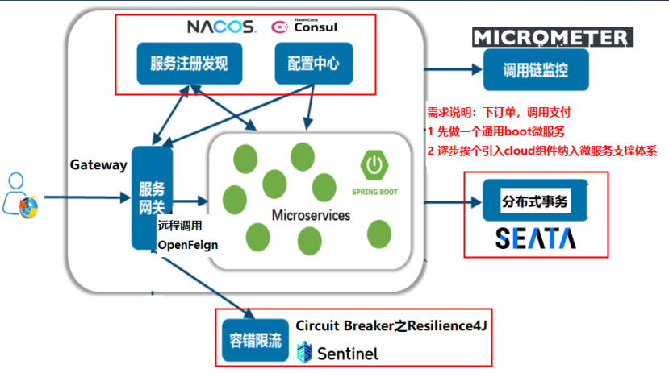
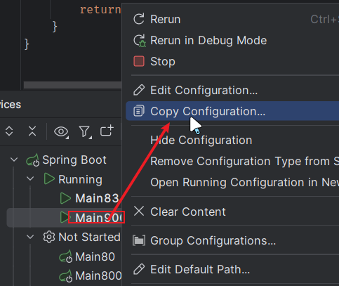
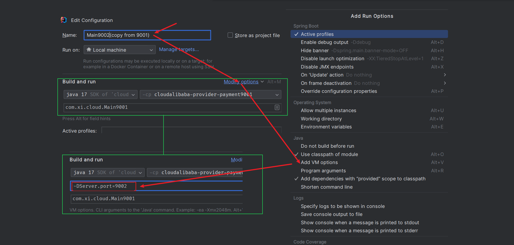
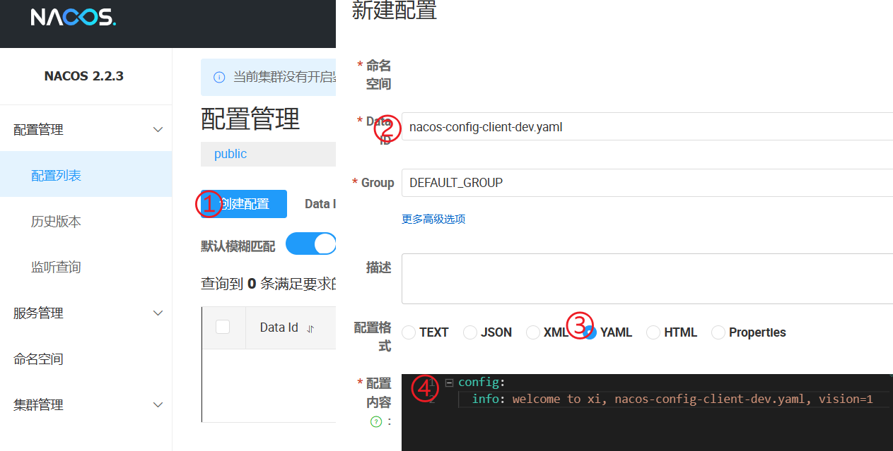
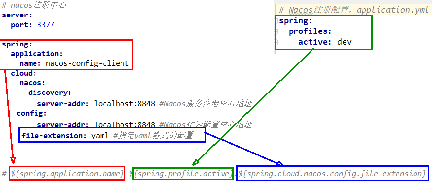
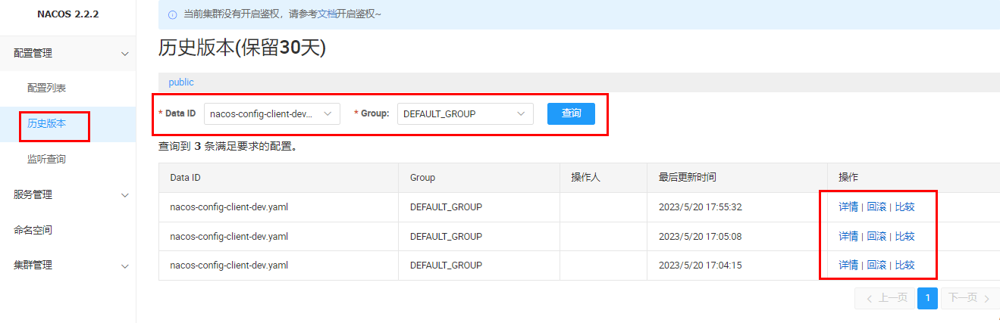
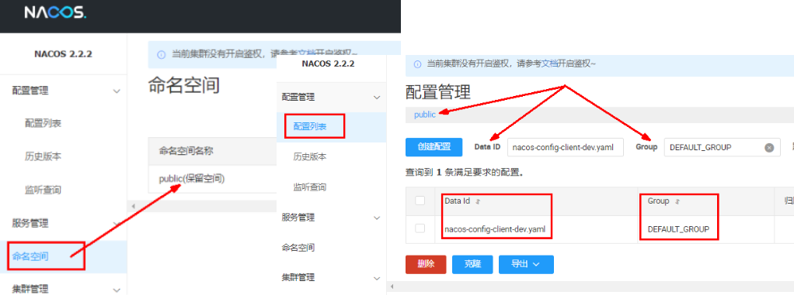
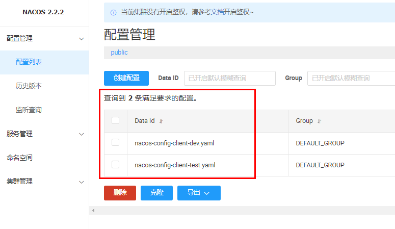
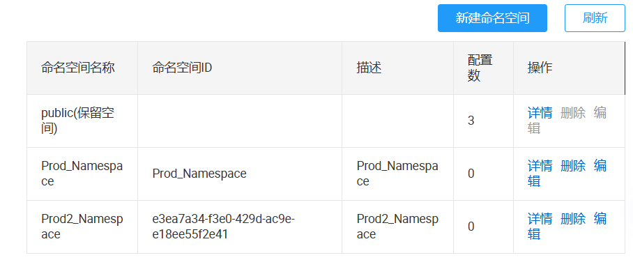
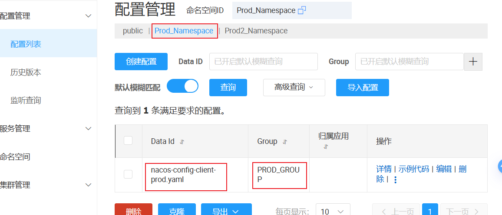

# SpringCloudAlibaba Nacos 服务注册和配置中心



## Nacos简介

[Nacos 快速开始 | Nacos 官网](https://nacos.io/docs/v2/quickstart/quick-start/)

<iframe src="https://nacos.io/docs/v2/quickstart/quick-start/" title="Nacos 快速入门文档" style="width: 100%; height: 400px; border: none;"></iframe>  

Nacos一个更易于构建云原生应用的动态服务发现、配置管理和服务管理平台

Nacos就是注册中心+配置中心的组合 

等价于 :

- Nacos=Eureka+Config +Bus
- Nacos=Spring Cloud Consul

**功能：**

1. 替代Eureka/Consul做服务注册中心
2. 替代(Config+Bus)/Consul做服务配置中心和满足动态刷新广播通知

**跟其他注册中心的比较：**

| 服务注册和发现框架 | CAP模型 | 控制台管理 | 社区活跃度       |
| ------------------ | ------- | ---------- | ---------------- |
| Eureka             | AP      | 支持       | 低(2.x 版本闭源) |
| Zookeeper          | CP      | 不支持     | 中               |
| Consul             | CP      | 支持       | 高               |
| Nacos              | AP      | 支持       | 高               |

据说 Nacos 在阿里巴巴内部有超过 10 万的实例运行，已经过了类似双十一等各种大型流量的考验，**Nacos默认是AP模式**，但也可以调整切换为CP，我们一般用默认AP即可。

## Nacos下载安装

[nacos安装](https://github.com/alibaba/nacos/releases?q=2023&expanded=true)

[Nacos 快速开始 | Nacos 官网](https://nacos.io/docs/v2/quickstart/quick-start/)

[Spring Cloud Alibaba 参考文档 (spring-cloud-alibaba-group.github.io)](https://spring-cloud-alibaba-group.github.io/github-pages/2022/zh-cn/2022.0.0.0-RC2.html)

官网下载，本地安装，成功运行独立于微服务的第三方的服务注册中心

1. 从官网下载nacos
2. 解压安装包，直接运行bin目录下的startup.cmd，即bin目录下，启动命令：(standalone代表着单机模式运行，非集群模式):`startup.cmd -m standalone`
3. 命令运行后直接访问http://localhost:8848/nacos/，账密都是nacos
4. 关闭服务器`shutdown.cmd`

## Nacos Discovery 服务注册中心

### Nacos Discovery 介绍

通过 Nacos Server 和 spring-cloud-starter-alibaba-nacos-discovery 实现服务的注册与发现。

[Spring Cloud Alibaba 参考文档 (spring-cloud-alibaba-group.github.io)](https://spring-cloud-alibaba-group.github.io/github-pages/2022/zh-cn/2022.0.0.0-RC2.html#_spring_cloud_alibaba_nacos_discovery)

<iframe src="https://spring-cloud-alibaba-group.github.io/github-pages/2022/zh-cn/2022.0.0.0-RC2.html#_spring_cloud_alibaba_nacos_discovery" title="Spring Cloud Alibaba 参考文档" style="width: 100%; height: 400px; border: none;"></iframe>  

### Nacos Discovery 服务注册步骤

#### 基于Nacos的服务提供者

1. 新建模块`cloudalibaba-provider-payment9001`

2. pom

   ```html
   <!-- nacos-discovery 服务注册发现 -->
   <dependency>
       <groupId>com.alibaba.cloud</groupId>
       <artifactId>spring-cloud-starter-alibaba-nacos-discovery</artifactId>
   </dependency>
   ```

3. yml

   ```yaml
   server:
     port: 9001
   
   spring:
     application:
       name: nacos-payment-provider # 入驻进nacos后的微服务名字
     cloud:
       nacos:
         discovery:
           server-addr: localhost:8848 # 配置Nacos地址
   ```

   > application.properties 配置。一些关于 Nacos 基本的配置也必须在 application.properties(也可以是application.yaml)配置，如下所示：
   >
   > application.properties:
   >
   > ```properties
   > server.port=8081
   > spring.application.name=nacos-provider
   > spring.cloud.nacos.discovery.server-addr=127.0.0.1:8848
   > management.endpoints.web.exposure.include=*
   > ```

4. 启动类

   ```java
   @SpringBootApplication
   @EnableDiscoveryClient
   public class Main9001 {
       public static void main(String[] args) {
           SpringApplication.run(Main9001.class,args);
       }
   }
   ```

5. 测试
   启动nacos`startup.cmd -m standalone`
   http://localhost:8848/nacos/
   http://localhost:9001/pay/nacos/11

#### 基于Nacos的服务消费者

Consumer (消费者)应用可能还没像启动一个 Provider 应用那么简单。因为在 Consumer 端需要去调用 Provider 端提供的REST 服务。例子中我们使用最原始的一种方式， 即显示的使用 **LoadBalanceClient 和 RestTemplate** 结合的方式(**负载均衡**)来访问。【通过带有负载均衡的RestTemplate 和 FeignClient 也是可以访问的。】

作为消费者，后面可能是有多个服务为我提供服务(一个微服务名字下有多个服务)，就需要负载均衡。

**步骤**

1. 新建模块`cloudalibaba-consumer-nacos-order83`

2. pom

   ```html
   <!-- nacos-discovery 服务注册发现 -->
   <dependency>
       <groupId>com.alibaba.cloud</groupId>
       <artifactId>spring-cloud-starter-alibaba-nacos-discovery</artifactId>
   </dependency>
   
   <!--loadbalancer 负载均衡 消费端需要负载均衡-->
   <dependency>
       <groupId>org.springframework.cloud</groupId>
       <artifactId>spring-cloud-starter-loadbalancer</artifactId>
   </dependency>
   ```

3. yml

   ```yaml
   server:
     port: 83
   
   spring:
     application:
       name: nacos-order-consumer # 注册进nacos后的微服务名称
     cloud:
       nacos:
         discovery:
           server-addr: localhost:8848
   # 消费者将要去访问的微服务名称(nacos微服务提供者叫什么你写什么)
   service-url:
     nacos-user-service: http://nacos-payment-provider
   ```

4. 主启动

   ```java
   @EnableDiscoveryClient // 启用服务注册发现
   @SpringBootApplication
   public class Main83 {
       public static void main(String[] args) {
           SpringApplication.run(Main83.class,args);
       }
   }
   ```

5. 配置类

   ```java
   @Configuration
   public class RestTemplateConfig {
       @Bean
       @LoadBalanced //赋予RestTemplate负载均衡的能力
       public RestTemplate restTemplate() {
           return new RestTemplate();
       }
   }
   ```

6. 业务类

   ```java
   public class OrderNacosController {
       @Resource
       private RestTemplate restTemplate;
   
       @Value("${service-url.nacos-user-service}")
       private String serverURL;
   
       @GetMapping("/consumer/pay/nacos/{id}")
       public String paymentInfo(@PathVariable("id") Integer id) {
           String result = restTemplate.getForObject(serverURL + "/pay/nacos/" + id, String.class);
           return result+"\t"+" 我是OrderNacosController83调用者";
       }
   }
   ```

7. 测试
   启动nacos、83(服务消费者)、9001(服务提供者)
   http://localhost:8848/nacos/查看是否成功入驻进入nacos
   http://localhost:83/consumer/pay/nacos/11

#### 负载均衡

参照9001新建9002，要么老实新建要么直接拷贝虚拟端口映射

直接拷贝虚拟端口映射: 





输入`-DServer.port=9002`,设置端口号为9002

**测试：**

1. 运行nacos、83(服务消费者)、9001(服务提供者)、9002(服务提供者)
2. http://localhost:8848/nacos/查看是否成功入驻进入nacos
3. 多次运行http://localhost:83/consumer/pay/nacos/11达到负载均衡

## Nacos Config 服务配置中心

### Nacos Config 服务配置中心介绍

通过 Nacos Server 和 spring-cloud-starter-alibaba-nacos-config 实现配置的动态变更。

[Spring Cloud Alibaba 参考文档 (spring-cloud-alibaba-group.github.io)](https://spring-cloud-alibaba-group.github.io/github-pages/2022/zh-cn/2022.0.0.0-RC2.html#_spring_cloud_alibaba_nacos_config)

<iframe src="https://spring-cloud-alibaba-group.github.io/github-pages/2022/zh-cn/2022.0.0.0-RC2.html#_spring_cloud_alibaba_nacos_config" title="Spring Cloud Alibaba 参考文档" style="width: 100%; height: 400px; border: none;"></iframe>  

### Nacos Config 服务配置中心步骤

1. 建module`cloudalibaba-config-nacos-client3377`

2. pom

   ```html
   <!--bootstrap-->
   <dependency>
       <groupId>org.springframework.cloud</groupId>
       <artifactId>spring-cloud-starter-bootstrap</artifactId>
   </dependency>
   <!--nacos-config 服务配置中心-->
   <dependency>
       <groupId>com.alibaba.cloud</groupId>
       <artifactId>spring-cloud-starter-alibaba-nacos-config</artifactId>
   </dependency>
   <!--nacos-discovery 服务注册-->
   <dependency>
       <groupId>com.alibaba.cloud</groupId>
       <artifactId>spring-cloud-starter-alibaba-nacos-discovery</artifactId>
   </dependency>
   ```

3. yml
   bootstrop.yml

   ```yaml
   # nacos配置
   spring:
     application:
       name: nacos-config-client
     cloud:
       nacos:
         discovery:
           server-addr: localhost:8848 #Nacos服务注册中心地址
         config:
           server-addr: localhost:8848 #Nacos作为配置中心地址
           file-extension: yaml #指定yaml格式的配置
   
   # nacos端配置文件DataId的命名规则是：
   # ${spring.application.name}-${spring.profile.active}.${spring.cloud.nacos.config.file-extension}
   # 本案例的DataID是:nacos-config-client-dev.yaml
   ```

   application.yml

   ```yaml
   server:
     port: 3377
   
   spring:
     profiles:
       active: dev # 表示开发环境
          #active: prod # 表示生产环境
          #active: test # 表示测试环境
   ```

   > Nacos同Consul一样，在项目初始化时，要保证先从配置中心进行配置拉取，拉取配置之后，才能保证项目的正常启动，为了满足动态刷新和全局广播通知springboot中配置文件的加载是存在优先级顺序的，**bootstrap优先级高于application**

4. 业务类

   ```java
   @RestController
   @RefreshScope //在控制器类加入@RefreshScope注解使当前类下的配置支持Nacos的动态刷新功能。
   public class NacosConfigClientController {
       @Value("${config.info}")
       private String configInfo;
   
       @GetMapping("/config/info")
       public String getConfigInfo() {
           return configInfo;
       }
   }
   ```

5. 在Nacos中添加配置信息
   

   > 本案例的dataId为`nacos-config-client-dev.yaml`
   >
   > 在 Nacos Spring Cloud 中，`dataId` 的**完整格式如下**：
   >
   > ```
   > ${prefix}-${spring.profiles.active}.${file-extension}
   > ```
   >
   > - `prefix` 默认为 `spring.application.name` 的值，也可以通过配置项 `spring.cloud.nacos.config.prefix`来配置。
   > - `spring.profiles.active` 即为**当前对应的 profile**，详情可以参考 [Spring Boot文档](https://docs.spring.io/spring-boot/docs/current/reference/html/boot-features-profiles.html#boot-features-profiles)。 **注意：当 `spring.profiles.active` 为空时，对应的连接符 `-` 也将不存在，dataId 的拼接格式变成 `${prefix}.${file-extension}`**
   > - `file-exetension` 为配置内容的**数据格式**，可以通过配置项 `spring.cloud.nacos.config.file-extension` 来配置。目前只支持 `properties` 和 `yaml` 类型。
   >
   > 因此最后公式为`${spring.application.name}-${spring.profiles.active}.${spring.cloud.nacos.config.file-extension}`
   >
   > 

6. 测试

   1. 启动Nacos且在nacos后台管理-配置列表下已经存在对应的yaml配置文件
      
   2. 运行cloud-config-nacos-client3377的主启动类
   3. 调用接口查看配置信息 http://localhost:3377/config/info

7. 自带动态刷新
   修改下Nacos中的yaml配置文件，再次调用查看配置的接口，就会发现配置已经刷新

8. 历史配置

   - Nacos会记录配置文件的历史版本默认保留30天，此外还有一键回滚功能，回滚操作将会触发配置更新
   - 回滚
     

## Nacos 数据模型之Namespace-Group-DataId

### Nacos 问题

**问题1：**

实际开发中，通常一个系统会准备

1. dev开发环境
2. test测试环境
3. prod生产环境。

如何保证指定环境启动时服务能正确读取到Nacos上相应环境的配置文件呢？

**问题2：**

一个大型分布式微服务系统会有很多微服务子项目，每个微服务项目又都会有相应的开发环境、测试环境、预发环境、正式环境......

那怎么**对这些微服务配置进行分组和命名空间管理**呢？

 [Nacos 架构 | Nacos 官网](https://nacos.io/docs/v2/architecture/)

<iframe src="https://nacos.io/docs/v2/architecture/" style="width: 100%; height: 400px; border: none;"></iframe>  

### Namespace+Group+DataId三者关系

Nacos 数据模型 Key 由三元组唯一确定, Namespace默认是空串，公共命名空间（public），分组默认是 DEFAULT_GROUP。


1. 是什么
   类似Java里面的package名和类名，最外层的Namespace是可以用于区分部署环境的，Group和DataID逻辑上区分两个目标对象
2. 默认值
   **默认情况：Namespace=public，Group=DEFAULT_GROUP**
   Nacos默认的命名空间是public，Namespace主要用来实现隔离。比方说我们现在有三个环境：开发、测试、生产环境，我们就可以创建三个Namespace，不同的Namespace之间是隔离的。
   Group默认是DEFAULT_GROUP，Group可以把不同的微服务划分到同一个分组里面去
3. Service就是微服务
   一个Service可以包含一个或者多个Cluster（集群），Nacos默认Cluster是DEFAULT，Cluster是对指定微服务的一个虚拟划分。


### Nacos的图形化管理界面



### 三种方案加载配置

#### 1. DataId 方案

指定`spring.profile.active`和配置文件的`DataID`来使不同环境下读取不同的配置

1. 默认空间public+默认分组DEFAULT_GROUP+新建DatalD

   - 新建test配置DataId: `nacos-config-client-test.yaml`
     
   - nacos后台：
     

2. 通过`spring.profile.active`属性就能进行多环境下配置文件的读取

   - application.yml

     ```yaml
     # nacos配置 第一种:默认空间+默认分组+新建DataID
     server:
       port: 3377
     
     spring:
       profiles:
         # active: dev # 表示开发环境
         # active: prod # 表示生产环境
         active: test # 表示测试环境
     ```

   - bootstrap.yml

     ```yaml
     # nacos配置
     spring:
       application:
         name: nacos-config-client
       cloud:
         nacos:
           discovery: # 入驻进哪儿
             server-addr: localhost:8848 # Nacos服务注册中心地址
           config: # 配到哪儿
             server-addr: localhost:8848 # Nacos作为配置中心地址
             file-extension: yaml #指定yaml格式的配置
     ```

3. 测试
   http://localhost:3377/config/info

#### 2. Group 方案

通过Group实现环境区分

1. 默认空间public+新建PROD_GROUP+新建DataID
   

2. 修改YML 

   - 在config下增加一条group的配置即可。可配置为PROD_GROUP

   - bootstrap.yml

     ```yaml
     # nacos配置 第2种:默认空间+新建分组+新建DataID
     spring:
       application:
         name: nacos-config-client
       cloud:
         nacos:
           discovery:
             server-addr: localhost:8848 #Nacos服务注册中心地址
           config:
             server-addr: localhost:8848 #Nacos作为配置中心地址
             file-extension: yaml #指定yaml格式的配置
             group: PROD_GROUP # 指定分组
     ```

   - application.yml

     ```yaml
     server:
       port: 3377
     
     spring:
       profiles:
         #active: dev # 表示开发环境
         #active: test # 表示测试环境
         active: prod # 表示生产环境
     ```

     

3. 测试http://localhost:3377/config/info测试配置是什么就加载什么

#### 3. Namespace 方案

通过Namespace实现命名空间环境区分

- 新建Namespace:Prod_Namespace
  

- 新建Namespace但命名空间ID不填（系统自动生成）：Prod2_Namespace
  

- 后台
  

  

Prod_Namespace+PROD_GROUP+DatalD(nacos-config-client-prod.yaml)

1. 选中Prod_Namespace后新建
   
   后台
   

2. 修改yml

   - application.yml

     ```yaml
     server:
       port: 3377
     
     spring:
       profiles:
     #     active: dev # 表示开发环境
         active: prod # 表示生产环境
     #    active: test # 表示测试环境
     ```

   - bootstrap.yml

     ```yaml
     # nacos配置
     spring:
       application:
         name: nacos-config-client
       cloud:
         nacos:
           discovery: # 入驻进哪儿
             server-addr: localhost:8848 # Nacos服务注册中心地址
           config: # 配到哪儿
             server-addr: localhost:8848 # Nacos作为配置中心地址
             file-extension: yaml #指定yaml格式的配置
             group: PROD_GROUP # 指定group 不指定默认DEFAULT_GROUP
             namespace: Prod_Namespace
     ```

   