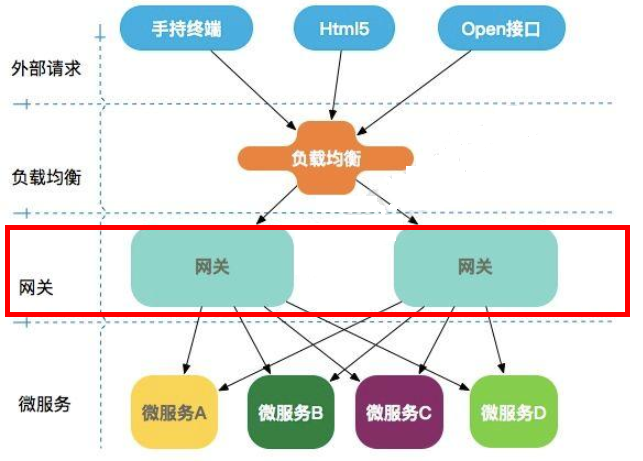
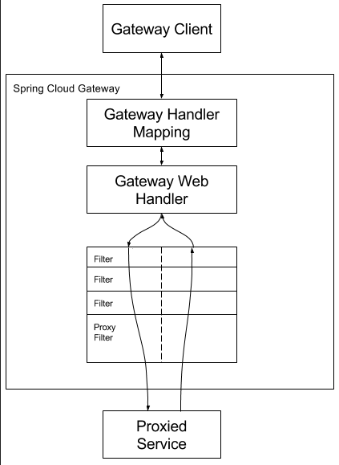
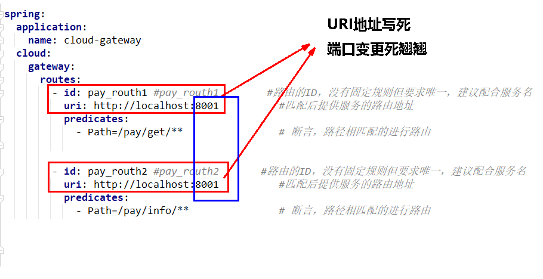

# Ⅶ. Gateway网关

## Gataway概述

**介绍**

Gateway是在Spring生态系统之上构建的API网关服务，基于Spring6，Spring Boot 3和Project Reactor等技术。它旨在为微服务架构提供一种简单有效的**统一的 API 路由管理方式**，并为它们提供跨领域的关注点，例如：安全性、监控/度量和恢复能力。

[Spring Cloud Gateway官网](https://docs.spring.io/spring-cloud-gateway/docs/current/reference/html/)

**体系定位**

Cloud全家桶中有个很重要的组件就是网关，在1.x版本中都是采用的Zuul网关；但在2.x版本中，zuul的升级一直跳票，SpringCloud最后自己研发了一个网关SpringCloud Gateway替代Zuul，那就是SpringCloud Gateway

一句话：**gateway是原zuul1.x版的替代**


**微服务架构中网关的位置：**



**Gateway网关的功能**

- 反向代理
- 鉴权
- 流量控制
- 熔断
- 日志监控

**总结**

Spring Cloud Gateway组件的**核心是一系列的过滤器**，通过这些过滤器可以将客户端发送的请求转发(路由)到对应的微服务。 Spring Cloud Gateway是加在整个微服务**最前沿的防火墙和代理器**，隐藏微服务结点IP端口信息，从而加强安全保护。
Spring Cloud Gateway**本身也是一个微服务**，需要注册进服务注册中心。


## Gateway三大核心

1. Route(路由)
   路由是构建网关的基本模块，它由ID、目标URL、一系列的断言和过滤器组成，如果断言为true则匹配该路由
2. Predicate(断言)
   参考的是Java8的java.util.function.Predicate
   开发人员可以匹配HTTP请求中的所有内容（例如请求头或请求参数），**如果请求与断言相匹配则进行路由**
3. Filter(过滤)
   指的是Spring框架中GatewayFilter的实例，使用过滤器，可以在请求被路由前或者之后对请求进行修改。

web前端请求，通过一些匹配条件，定位到真正的服务节点。并在这个转发过程的前后，进行一些精细化控制。
predicate就是我们的匹配条件；
filter，就可以理解为一个无所不能的拦截器。有了这两个元素，再加上目标uri，就可以实现一个具体的路由了


## Gateway工作流程

核心逻辑：**路由转发+断言判断+执行过滤器链**



客户端向 Spring Cloud Gateway 发出请求。然后在 Gateway Handler Mapping 中找到与请求相匹配的路由，将其发送到 Gateway Web Handler。Handler 再通过指定的过滤器链来将请求发送到我们实际的服务执行业务逻辑，然后返回。

过滤器之间用虚线分开是因为过滤器可能会在发送代理请求之前(Pre)或之后(Post)执行业务逻辑。

在“pre”类型的过滤器可以做参数校验、权限校验、流量监控、日志输出、协议转换等;

在“post”类型的过滤器中可以做响应内容、响应头的修改，日志的输出，流量监控等有着非常重要的作用。

## 入门配置

建model

改pom：

```html
<!--gateway-->
<dependency>
    <groupId>org.springframework.cloud</groupId>
    <artifactId>spring-cloud-starter-gateway</artifactId>
</dependency>
```

```html
<?xml version="1.0" encoding="UTF-8"?>
<project xmlns="http://maven.apache.org/POM/4.0.0"
         xmlns:xsi="http://www.w3.org/2001/XMLSchema-instance"
         xsi:schemaLocation="http://maven.apache.org/POM/4.0.0 http://maven.apache.org/xsd/maven-4.0.0.xsd">
    <modelVersion>4.0.0</modelVersion>
    <parent>
        <groupId>com.atguigu.cloud</groupId>
        <artifactId>mscloudV5</artifactId>
        <version>1.0-SNAPSHOT</version>
    </parent>

    <artifactId>cloud-gateway9527</artifactId>

    <properties>
        <maven.compiler.source>17</maven.compiler.source>
        <maven.compiler.target>17</maven.compiler.target>
        <project.build.sourceEncoding>UTF-8</project.build.sourceEncoding>
    </properties>


    <dependencies>
        <!--gateway-->
        <dependency>
            <groupId>org.springframework.cloud</groupId>
            <artifactId>spring-cloud-starter-gateway</artifactId>
        </dependency>
        <!--服务注册发现consul discovery,网关也要注册进服务注册中心统一管控-->
        <dependency>
            <groupId>org.springframework.cloud</groupId>
            <artifactId>spring-cloud-starter-consul-discovery</artifactId>
        </dependency>
        <!-- 指标监控健康检查的actuator,网关是响应式编程删除掉spring-boot-starter-web dependency-->
        <dependency>
            <groupId>org.springframework.boot</groupId>
            <artifactId>spring-boot-starter-actuator</artifactId>
        </dependency>
    </dependencies>

    <build>
        <plugins>
            <plugin>
                <groupId>org.springframework.boot</groupId>
                <artifactId>spring-boot-maven-plugin</artifactId>
            </plugin>
        </plugins>
    </build>
</project>
```

写yml：

```yaml
server:
  port: 9527

spring:
  application:
    name: cloud-gateway #以微服务注册进consul或nacos服务列表内
  cloud:
    consul: #配置consul地址
      host: localhost
      port: 8500
      discovery:
        prefer-ip-address: true
        service-name: ${spring.application.name}
```

主启动：

```java
@SpringBootApplication
@EnableDiscoveryClient //服务注册和发现   spring cloud consul 服务发现
public class Main9527 {
    public static void main(String[] args) {
        SpringApplication.run(Main9527.class,args);
    }
}
```

业务类：无，不写任何业务代码，网关和业务无关

测试：

1. 先启动8500服务中心Consul
2. 再启动9527网关入驻进Consul

## 路由映射

诉求：我们目前不想暴露8001瑞口，希望在8001真正的支付微服务外面套一层9527网关

### 修改

8001新增Controller

```java
@RestController
public class PayGateWayController {
    @Resource
    PayService payService;

    @GetMapping(value = "/pay/gateway/get/{id}")
    public ResultData<Pay> getById(@PathVariable("id") Integer id) {
        Pay pay = payService.getById(id);
        return ResultData.success(pay);
    }

    @GetMapping(value = "/pay/gateway/info")
    public ResultData<String> getGatewayInfo() {
        return ResultData.success("gateway info test："+ IdUtil.simpleUUID());
    }
}
```

网关yml新增配置

```yaml
spring:
  cloud
	gateway: # 网关
      routes: # 路由
        - id: pay_routh1 #pay_routh1                #路由的ID(类似mysql主键ID)，没有固定规则但要求唯一，建议配合服务名
          uri: http://localhost:8001                #匹配后提供服务的路由地址
          predicates:
            - Path=/pay/gateway/get/**              # 断言，路径相匹配的进行路由

        - id: pay_routh2 #pay_routh2                #路由的ID(类似mysql主键ID)，没有固定规则但要求唯一，建议配合服务名
          uri: http://localhost:8001                #匹配后提供服务的路由地址
          predicates:
            - Path=/pay/gateway/info/**              # 断言，路径相匹配的进行路由
```

### 测试9527→8001

测试9527网关→8001微服务提供者

1. 启动Consul8500服务
2. 启动8001支付
3. 启动9527网关
4. 访问说明
   - 添加网管前
     - http://localhost:8001/pay/gateway/get/1
     - http://localhost:8001/pay/gateway/info
   - 隐真示假，映射说明
     
   - 添加网关后
     - http://localhost:9527/pay/gateway/get/1
     - http://localhost:9527/pay/gateway/info

### 测试80→9527→8001

测试80微服务消费者→9527网关→8001微服务提供者

#### 测试error

我们启动80订单微服务，它从Consul注册中心通过微服务名称找到8001支付微服务进行调用，

80 → 9527 → 8001

**要求访问9527网关后才能访问8001，如果我们此时启动80订单，可以做到吗？**


修改cloud-api-commons的PayFeignApi接口

```java
 /**
   * GateWay进行网关测试案例01
   * @param id
   * @return
   */
@GetMapping(value = "/pay/gateway/get/{id}")
public ResultData getById(@PathVariable("id") Integer id);

/**
  * GateWay进行网关测试案例02
  * @return
  */
@GetMapping(value = "/pay/gateway/info")
public ResultData<String> getGatewayInfo();
```

新建OrderGateWayController

```java
@RestController
public class OrderGateWayController {
    @Resource
    private PayFeignApi payFeignApi;

    @GetMapping(value = "/feign/pay/gateway/get/{id}")
    public ResultData getById(@PathVariable("id") Integer id) {
        return payFeignApi.getById(id);
    }

    @GetMapping(value = "/feign/pay/gateway/info")
    public ResultData<String> getGatewayInfo() {
        return payFeignApi.getGatewayInfo();
    }
}
```

网关开启 测试通过

- http://localhost/feign/pay/gateway/get/1
- http://localhost/feign/pay/gateway/info

网关开启 测试通过

- http://localhost/feign/pay/gateway/get/1
- http://localhost/feign/pay/gateway/info

结论：9527网管是否启动，毫无影响，目前的配置来看，**网关被绕开了**

#### 测试success

**同一家公司自己人，系统内环境，直接找微服务**

```java
@FeignClient(value = "cloud-payment-service")//自己人内部，自己访问自己，写微服务名字OK
public interface PayFeignApi {
    /**
     * GateWay进行网关测试案例01
     * @param id
     * @return
     */
    @GetMapping(value = "/pay/gateway/get/{id}")
    public ResultData getById(@PathVariable("id") Integer id);

    /**
     * GateWay进行网关测试案例02
     * @return
     */
    @GetMapping(value = "/pay/gateway/info")
    public ResultData<String> getGatewayInfo();
}
```

**不同家公司有外人，系统外访问，先找网关再服务**

```java
@FeignClient("cloud-gateway")
//@FeignClient("cloud-payment-service")
public interface PayFeignApi {
    /**
     * GateWay进行网关测试案例01
     * @param id
     * @return
     */
    @GetMapping(value = "/pay/gateway/get/{id}")
    public ResultData getById(@PathVariable("id") Integer id);

    /**
     * GateWay进行网关测试案例02
     * @return
     */
    @GetMapping(value = "/pay/gateway/info")
    public ResultData<String> getGatewayInfo();
}
```

1. 刷新feign接口jar包
2. 重启80订单微服务
3. 有网关正常success
4. 无网关异常

**还有问题**

网关9527，yml映射写死问题，[解决](###Route以微服务名动态获取服务URI)



## Gateway高级特性

### 一. Route以微服务名动态获取服务URI

**痛点：**网关9527，yml映射写死问题，端口变更死翘翘

**是什么：**

**网关修改配置：**

```yaml
server:
  port: 9527

spring:
  application:
    name: cloud-gateway #以微服务注册进consul或nacos服务列表内
  cloud:
    consul: #配置consul地址
      host: localhost
      port: 8500
      discovery:
        prefer-ip-address: true
        service-name: ${spring.application.name}
    gateway:
      routes:
        - id: pay_routh1 #pay_routh1                #路由的ID(类似mysql主键ID)，没有固定规则但要求唯一，建议配合服务名
          #uri: http://localhost:8001                #匹配后提供服务的路由地址 映射写死，端口变更死翘翘
          uri: lb://cloud-payment-service          #匹配后提供服务的路由地址  lb(负载均衡)
          predicates: # 断言
            - Path=/pay/gateway/get/**              # 断言，路径相匹配的进行路由

        - id: pay_routh2 #pay_routh2                #路由的ID(类似mysql主键ID)，没有固定规则但要求唯一，建议配合服务名
          #uri: http://localhost:8001                #匹配后提供服务的路由地址 映射写死，端口变更死翘翘
          uri: lb://cloud-payment-service                #匹配后提供服务的路由地址  lb(负载均衡)
          predicates: # 断言
            - Path=/pay/gateway/info/**              # 断言，路径相匹配的进行路由
```

**测试**

1. 测试1 success
   重启网关9527,80/8001保持不变，http://localhost/feign/pay/gateway/get/1
2. 测试2 success
   如果将8001微服务yml文件**端口修改**为8007，照样访问我实际启动的程序是main8001但是端口名改为8007
   我们依据微服务名字，匹配查找即可 uri:1b://cloud-payment-service，http://localhost/feign/pay/gateway/get/1

### 二. Predicate断言(谓词)

#### 断言介绍

Spring Cloud Gateway将路由匹配作为Spring WebFlux HandlerMapping基础架构的一部分。 

Spring Cloud Gateway包括许多内置的Route Predicate工厂。所有这些Predicate都与HTTP请求的不同属性匹配。多个 Route Predicate.工厂可以进行组合 

Spring Cloud Gateway创建Route对象时，使用RoutePredicateFactory创建Predicate对象，Predicate对象可以赋值给 Route。Spring Cloud Gateway包含许多内置的Route Predicate Factories。所有这些谓词都匹配HTTP请求的不同属性。**多种谓词工厂可以组合，并通过逻辑`and`**。

#### 常用的内置Route Predicate

##### 两种配置断言的方式

[两种配置方式官网](https://docs.spring.io/spring-cloud-gateway/reference/spring-cloud-gateway/configuring-route-predicate-factories-and-filter-factories.html)

1. Shortcut Configuration 快捷方式配置方式
   
2. Full Expanded Arguments 完整的扩展参数配置方式
   

##### 常用断言Api

After Route Predicate、Before Route Predicate、Between Route Predicate、Cookie Route Predicate、Header route 、redicate、Host Route Predicate、Path Route Predicate、Query Route Predicate、RemoteAddr route predicate、Method Route Predicate

```yaml
  #id：我们自定义的路由 ID，保持唯一
  ##uri：目标服务地址
  ##predicates：路由条件，Predicate接受一个输入参数返回一个布尔值。
  ##            该属性包含多种默认方法来将Predicate组合成其他复杂的逻辑(比如：与，或，非)
```

各种断言eg

```yaml
spring:
  cloud:
    gateway: # 网关
      routes: # 路由
        - id: pay_routh1 #pay_routh1 #路由的ID(类似mysql主键ID)，没有固定规则但要求唯一，建议配合服务名
#          uri: http://localhost:8001  #匹配后提供服务的路由地址 映射写死，端口变更死翘翘
          uri: lb://cloud-payment-service #匹配后提供服务的路由地址  lb(负载均衡) 以微服务名动态获取服务URI
          predicates: # 断言&
            - Path=/pay/gateway/get/** # 断言，路径相匹配的进行路由
            - After=2024-08-22T14:20:57.333524+08:00[Asia/Shanghai] # 此谓词匹配在指定日期时间之后发生的请求。  ZonedDateTime zbj = ZonedDateTime.now(); //获得默认时区
#            - Before=2024-08-24T14:59:57.333524+08:00[Asia/Shanghai] # 此谓词匹配在指定日期时间之前发生的请求。  ZonedDateTime zbj = ZonedDateTime.now(); //获得默认时区
#            - Between=2024-08-22T14:20:57.333524+08:00[Asia/Shanghai], 2024-08-22T14:29:11.810761500+08:00[Asia/Shanghai] # 此路线与此时间段之间提出的任何请求匹配。 这对于维护时段可能很有用。
#            - Cookie=username, xi # 此路由与请求的Cookie name值和该正则表达式相同的请求相匹配
#            - Header=X-Request-Id, \d+ # 两个参数：一个是请求头的属性名称和一个正则表达式，这个属性值和正则表达式匹配则执行。  请求头要有X-Request-Id属性并且值为整数的正则表达式
#            - Host=**.xi.com,**.anotherhost.netHost # 接收一组参数，一组匹配的域名列表，这个模板是一个 ant 分隔的模板，用.号作为分隔符。它通过参数中的主机地址作为匹配规则*
#            - Query=username, \d+  # 要有路径参数 参数名username并且值还要是整数才能路由 eg: 路径+?username=1
#            - RemoteAddr=192.168.1.1/24 # 外部访问我的IP限制，最大跨度不超过32，目前是1~24它们是 CIDR 表示法。
            - Method=GET,POST # 配置某个请求地址，只能用Get/Post方法访问，方法限制
```

[各种断言Api介绍及配置：](https://docs.spring.io/spring-cloud-gateway/reference/spring-cloud-gateway/request-predicates-factories.html)

<iframe src="https://docs.spring.io/spring-cloud-gateway/reference/spring-cloud-gateway/request-predicates-factories.html" width="600" height="340"></iframe>  

1. After Route Predicate
   After Route Predicate有一个参数。 此谓词**匹配在指定日期时间之后发生的请求**。 

   - yml

     ```yaml
     spring:
       cloud:
         gateway:
           routes:
             - id: after_route
               uri: https://example.org
               predicates:
                 - Path=/pay/gateway/get/** # 断言，路径相匹配的进行路由
                 - After=2024-08-22T14:10:57.333524+08:00[Asia/Shanghai] # 此路线与该时间之后提出的任何请求匹配。
     ```

   - 获得ZonedDateTime
     `ZonedDateTime zbj = ZonedDateTime.now(); //默认时区`

2. Before Route Predicate
   Before Route Predicate有一个参数。 此谓词**匹配在指定日期时间前发生的请求**。 

   - yml

     ```yaml
     spring:
       cloud:
         gateway:
           routes:
             - id: before_route
               uri: https://example.org
               predicates:
                 - Before=2024-08-22T14:10:57.333524+08:00[Asia/Shanghai] # 此路线与该时间之前提出的任何请求匹配。
     ```

3. Between Route Predicate
   Between Route Predicate需要两个参数，一个是开始时间 ,一个是结束时间。路由规则会**匹配当前时间与此时间段是否匹配**，如果匹配上就会执行路由，如果没有匹配上则不执行。

   - yml

     ```yaml
     spring:
       cloud:
         gateway:
           routes:
           - id: between_route
             uri: https://example.org
             predicates:
             - Between=2017-01-20T17:42:47.789-07:00[America/Denver], 2017-01-21T17:42:47.789-07:00[America/Denver] # 此路线与此时间段之间提出的任何请求匹配。 这对于维护时段可能很有用。
     ```

4. Cookie Route Predicate
   Cookie Route Predicate需要两个参数，一个是 Cookie name ,一个是正则表达式。路由规则会通过获取对应的 **Cookie name 值和正则表达式去匹配**，如果匹配上就会执行路由，如果没有匹配上则不执行

   - yml

     ```yaml
     spring:
       cloud:
         gateway:
           routes:
           - id: cookie_route
             uri: https://example.org
             predicates:
             - Cookie=chocolate, ch.p # 此路由与请求的Cookie name值和该正则表达式相同的请求相匹配
     ```

   - 测试

     - 原生命令
       不带cookie参数  `curl http://localhost:9527/pay/gateway/get/1` err
       自带cookie参数  `curl http://localhost:9527/pay/gateway/get/1 --cookie "username=xi"`
     - postman
       

5. Header route predicate
   两个参数：一个是请求头的属性名称和一个正则表达式，这个**请求头**属性名称的**属性值和正则表达式匹配**则执行。

   - yml

     ```yaml
     spring:
       cloud:
         gateway:
           routes:
           - id: header_route
             uri: https://example.org
             predicates:
             - Header=X-Request-Id, \d+ # 两个参数：一个是请求头的属性名称和一个正则表达式，这个属性值和正则表达式匹配则执行。  请求头要有X-Request-Id属性并且值为整数的正则表达式
     ```

   - 测试

     - 原生命令
       curl http://localhost:9527/pay/gateway/get/1 -H "X-Request-Id:123456"
       curl http://localhost:9527/pay/gateway/get/1 -H "X-Request-Id:abcd" err
     - postman
       

6. Host Route Predicate
   Host Route Predicate 接收一组参数，一组**匹配的域名列表**，这个模板是一个 ant 分隔的模板，**用.号作为分隔符**。它通过**参数中的主机地址作为匹配规则**。

   - yml

     ```yaml
     spring:
       cloud:
         gateway:
           routes:
           - id: host_route
             uri: https://example.org
             predicates:
             - Host=**.xi.com,**.anotherhost.net
     ```

   - 测试

     - 原生命令
       `curl http://localhost:9527/pay/gateway/get/3 -H "Host:www.xi.com"`
       `curl http://localhost:9527/pay/gateway/get/3 -H "Host:java.anotherhost.com" `
       `curl http://localhost:9527/pay/gateway/get/3 -H  "Host:www.zz.net"` err
     - postman
       

7. Path Route Predicate
   断言，路径相匹配的进行路由

   - yml

     ```yaml
     spring:
       cloud:
         gateway:
           routes:
             - id: after_route
               uri: https://example.org
               predicates:
               - Path=/pay/gateway/get/** # 断言，路径相匹配的进行路由
     ```

8. Query Route Predicate
   Query Route Predicate支持传入两个参数，一个是**路径参数的属性名，一个为属性值**，属性值**可以是正则表达式**。

   - yml

     ```yaml
     spring:
       cloud:
         gateway:
           routes:
             - id: after_route
               uri: https://example.org
               predicates:
               - Query=username, \d+  # 要有路径参数 参数名username并且值还要是整数才能路由
     ```

   - 测试
     http://localhost:9527/pay/gateway/get/3?username=123
     http://localhost:9527/pay/gateway/get/3?username=ab1 err

9. RemoteAddr route predicate
   CIDR网路IP划分(无类别域间路由Classless Inter--Domain Routing缩写)

   - yml

     ```yaml
     spring:
       cloud:
         gateway:
           routes:
             - id: after_route
               uri: https://example.org
               predicates:
     		  - RemoteAddr=192.168.124.1/24 # 外部访问我的IP限制，最大跨度不超过32，目前是1~24它们是 CIDR 表示法。
     ```

   - ip地址表示方法(CIDR)
     在许多的项目中，如果涉及到的拦截和访问控制都会有这样的写法192.168.31.1/24，这种写法是一个网络标记的标准规范，这种写法称为无类别域间路由(CIDR)
     以ipv4为例解释CIDR标记ipv4/number  number标记网络标识中的连续1的位数计算方式： 
     ipv4&number=dest&number
     192.168.31.1/24标识192.168.31.0-192.168.31.255    /24是指前24位都被占了
     192.168.31.2/30标识192.168.31.0-192.168.31.3

10. Method Route Predicate
    配置某个请求地址，只能用Get/Post方法访问，方法限制

    - yml

      ```yaml
      spring:
        cloud:
          gateway:
            routes:
              - id: after_route
                uri: https://example.org
                predicates:
      		  - Method=GET,POST
      ```

#### 自定义断言

##### 为什么需要自定义断言

**痛点**：原有的断言配置不符合业务要求

**看看AfterRoutePredicateFactory的源码**`public class AfterRoutePredicateFactory extends AbstractRoutePredicateFactory<Config> {`

```java
public abstract class AbstractRoutePredicateFactory<C> extends AbstractConfigurable<C> implements RoutePredicateFactory<C> {
  public AbstractRoutePredicateFactory(Class<C> configClass) {
    super(configClass);
  }
}
```

**模板套路**

- 要么继承AbstractRoutePredicateFactory抽象类(抽象类实现了下面这个接口，功能更强大，因此一般继承抽象类)
- 要么实现RoutePredicateFactory接口
- 类名要求：开头任意取名，但是必须以RoutePredicateFactory后缀结尾

##### 自定义断言步骤

~~可以参考AfterRoutePredicateFactory的源码写~~

步骤

1. 新建类名XXX需要以RoutePredicateFactory结尾并继承AbstractRoutePredicateFactory类 
2. 重写apply方法
3. 新建appIy方法所需要的静态内部类RoutePredicateFactory.Config**这个Config类就是我们的路由断言规则，重要** 
4. 空参构造方法，内部调用super
5. 重写apply方法第二版

自定义断言：

```java
/**
 *  需求说明：自定义配置会员等级userType，按照钻、金、银和yml配置的会员等级，以适配是否可以访问
 */
@Component
// 1. 类名必须以RoutePredicateFactory结尾并继承AbstractRoutePredicateFactory类
public class MyRoutePredicateFactory extends AbstractRoutePredicateFactory<MyRoutePredicateFactory.Config> {

    // 4. 空参构造方法，内部调用super
    public MyRoutePredicateFactory() {
        super(MyRoutePredicateFactory.Config.class);
    }

    // 3. 新建appIy方法所需要的静态内部类RoutePredicateFactory.Config 这个Config类就是我们的路由断言规则，重要
    @Validated
    public static class Config {
        @Setter
        @Getter
        @NotEmpty
        private String userType;// 用户类型

    }

    // 2. 重写apply方法
    @Override
    public Predicate<ServerWebExchange> apply(MyRoutePredicateFactory.Config config) {
        // 重写apply方法第二版
        return new Predicate<ServerWebExchange>() {
            @Override
            public boolean test(ServerWebExchange serverWebExchange) {
                // 检查request的参数里面，userType是否为指定的值，符合配置就通过
                String userType = serverWebExchange.getRequest().getQueryParams().getFirst("userType");
                if (userType == null) {
                    return false;
                }
                // 如果说参数存在，就和config的数据进行比较
                if (userType.equalsIgnoreCase(config.getUserType())) {// 忽略大小写比对
                    return true;
                }
                return false;
            }
        };
    }
    
    // yml短格式配置 不重写这个方法yml中只能使用满格式方式配置
    @Override
    public List<String> shortcutFieldOrder() {
        return Collections.singletonList("userType");
    }
}
```

yml：

```yaml
spring:
  cloud:
    gateway:
      routes:
        - id: after_route
          uri: https://example.org
          predicates:
          - My=diamond # 自定义断言 diamond钻石用户可以访问
```

启动9527可以看到[My]生效了


但是报错 不能使用短促方式


修改

```yaml
spring:
  cloud:
    gateway:
      routes:
        - id: after_route
          uri: https://example.org
          predicates:
          - name: My # Fully Expanded Arguments方式进行配置
            args:
              userType: diamond
```

bug分析：**缺少shortcutFieldOrder方法的实现，所以不支持短格式**

新增方法

```java
@Override
public List<String> shortcutFieldOrder() {
  return Collections.singletonList("userType");
}
```

**完整MyRoutePredicateFactory:**

```java
package com.xi.cloud.mygateway;

import jakarta.validation.constraints.NotEmpty;
import lombok.Getter;
import lombok.Setter;
import org.springframework.cloud.gateway.handler.predicate.AbstractRoutePredicateFactory;
import org.springframework.stereotype.Component;
import org.springframework.validation.annotation.Validated;
import org.springframework.web.server.ServerWebExchange;

import java.util.Collections;
import java.util.List;
import java.util.function.Predicate;

/**
 * @author Wu
 * @date 2024/8/23 15:12:10
 * @description gateway自定义断言
 * 1. 新建类名XXX需要以RoutePredicateFactory结尾并继承AbstractRoutePredicateFactory类
 * 2. 重写apply方法
 * 3. 新建appIy方法所需要的静态内部类RoutePredicateFactory.Config**这个Config类就是我们的路由断言规则，重要**
 * 4. 空参构造方法，内部调用super
 * 5. 重写apply方法第二版
 * 需求说明：自定义配置会员等级userType，按照钻、金、银和yml配置的会员等级，以适配是否可以访问
 */
@Component
// 1. 类名必须以RoutePredicateFactory结尾并继承AbstractRoutePredicateFactory类
public class MyRoutePredicateFactory extends AbstractRoutePredicateFactory<MyRoutePredicateFactory.Config> {

    // 4. 空参构造方法，内部调用super
    public MyRoutePredicateFactory() {
        super(MyRoutePredicateFactory.Config.class);
    }

    // 3. 新建appIy方法所需要的静态内部类RoutePredicateFactory.Config 这个Config类就是我们的路由断言规则，重要
    @Validated
    public static class Config {
        @Setter
        @Getter
        @NotEmpty
        private String userType;// 用户类型

    }

    // 2. 重写apply方法
    @Override
    public Predicate<ServerWebExchange> apply(MyRoutePredicateFactory.Config config) {
        return new Predicate<ServerWebExchange>() {
            @Override
            public boolean test(ServerWebExchange serverWebExchange) {
                // 检查request的参数里面，userType是否为指定的值，符合配置就通过
                // http://localhost:9527/pay/gateway/get/1?userType=diamond 进行测试 // 钻石用户允许访问  yml中配置 `- My=diamond` # 自定义断言 diamond钻石用户可以访问
                String userType = serverWebExchange.getRequest().getQueryParams().getFirst("userType");// 获取路径参数userType的值
                if (userType == null) {
                    return false;
                }
                // 如果说参数存在，就和config的数据进行比较
                if (userType.equalsIgnoreCase(config.getUserType())) {// 忽略大小写比对
                    return true;
                }
                return false;
            }
        };
    }
    
    // yml短格式配置 不重写这个方法只能使用满格式写
    @Override
    public List<String> shortcutFieldOrder() {
        return Collections.singletonList("userType");
    }
}
```

### 三. Filter过滤

#### Filter概述

**概念：**

SpringMvc里面的的拦截器interceptor，Servlet的过滤器 

`pre`和`post`分别会在请求被执行前调用和被执行后调用，用来修改请求和响应信息

[Spring Cloud Gateway-gatewayfilter-factories](https://docs.spring.io/spring-cloud-gateway/docs/current/reference/html/#gatewayfilter-factories)

**作用：**

- 请求鉴权
- 异常处理
- **记录接口调用时长统计**，<u>重点，大厂面试设计题</u>

**类型：**

1. 过滤器GlobalFilters
   gatewat出厂默认已拥有的，直接用即可，不需要在配置文件中配置，作用在所有的路由上，实现GlobalFilter接口即可
2. 单一内置过滤器GatewayFilter
   也可以称为网关过滤器，这种过滤器主要是作用于单一路由或者某个路由分组
3. 自定义过滤器

#### Gateway内置过滤器

<iframe src="https://docs.spring.io/spring-cloud-gateway/docs/current/reference/html/#gatewayfilter-factories" width="600" height="440"></iframe>  

由于内置过滤器过多，这里只讲解常用的过滤器

##### 1. 请求头(RequestHeader)相关组

[测试filter的本地路径](http://localhost:9527/pay/gateway/filter)

1. `- AddRequestHeader=k,v`: 添加请求头
2. `- RemoveRequestHeader=k`: 将请求头中叫k的干掉
3. `- SetRequestHeader=k,v`: 修改请求头的值

```yaml
spring:
  cloud:
    gateway:
      routes:
      - id: add_request_header_route
        uri: https://example.org
        filters:
        - AddRequestHeader=X-Request-red, blue # 添加请求头X-Request-red:blue
        - RemoveRequestHeader=X-Request-Foo # 删除请求头X-Request-Foo信息
        - SetRequestHeader=sec-fetch-mode, Blue-updatebyxi # 将请求头sec-fetch-mode对应的值修改为Blue-updatebyxi
```

##### 2. 请求参数(RequestParameter)相关组

[测试filter的本地路径1](http://localhost:9527/pay/gateway/filter)

[测试filter的本地路径2](http://localhost:9527/pay/gateway/filter?customerId=9999&customerName=z3)

- `- AddRequestParameter=k,v`: 添加路径参数，值为默认值，可被传过来的参数覆盖
- `- RemoveRequestParameter=k`:   删掉路径参数，即使传递过来b也是null

```yaml
spring:
  cloud:
    gateway:
      routes:
      - id: add_request_header_route
        uri: https://example.org
        filters:
        - AddRequestParameter=a,1 # 添加param路径参数a=1，传递过来a可以覆盖默认值1
        - RemoveRequestParameter=b # 删掉param路径参数b,即使传递过来b也是null
```

##### 3. 回应头(ResponseHeader)相关组

[测试filter的本地路径](http://localhost:9527/pay/gateway/filter)

- `- AddResponseHeader=k,v`: 添加response响应头属性
- `- SetResponseHeader=k,v`: 修改响应头信息
- `- RemoveResponseHeader=k`: 删除响应头信息

```yaml
spring:
  cloud:
    gateway:
      routes:
      - id: add_request_header_route
        uri: https://example.org
        filters:
        - AddResponseHeader=X-Response-a, 1 # 添加response响应头属性X-Response-a
        - SetResponseHeader=X-Response-Red, Blue # 将响应头X-Response-Red对应的值修改为Blue
        - RemoveResponseHeader=X-Response-Foo # 删除响应头X-Response-Foo信息
```

##### 4. 前缀和路径相关组

> - `- PrefixPath=/pay`： 添加路径前缀
> - `- SetPath=/aa/bb/{segment}`: 带占位符的地址替换
> - `- RedirectTo=XXX, http://www.example.com/`: 报XXX错就重定向 

**`- PrefixPath=/pay`添加路径前缀：**

- `- PrefixPath=/pay`: 自动添加路径前缀, 解析后路径为PrefixPath+Path

- ```yaml
  spring:
    cloud:
      gateway:
        routes:
        - id: add_request_header_route
          uri: https://example.org
          predicates:
          - Path=/gateway/filter/** # 路径断言
          filters:
          - PrefixPath=/pay # 自动添加路径前缀/pay
  ```

- 测试：原地址 http://localhost:9527/pay/gateway/filter -变为-> http://localhost:9527/gateway/filter实际解析为http://localhost:9527/pay/gateway/filter

**`- SetPath=/aa/bb/{segment}`带占位符的地址替换：**

- `- SetPath=/pay/gateway/{segment}`：修改路径,，{segment}表示占位符，写abc也行但要上下一致

- ```yaml
  spring:
    cloud:
      gateway:
        routes:
        - id: add_request_header_route
          uri: https://example.org
          predicates:
          - Path=/XYZ/abc/{segment} # 断言，为配合SetPath测试，{segment}的内容最后被SetPath的{segment}取代
          filters:
          - SetPath=/pay/gateway/{segment}  # 访问路径修改 {segment}表示占位符
  ```

- 测试：原地址http://localhost:9527/pay/gateway/filter -变为-> http://localhost:9527/XYZ/abc/filter被解析为http://localhost:9527/pay/gateway/filter

**`- RedirectTo=XXX, http://www.example.com/`重定向：** 

- `- RedirectTo=302, http://www.atguigu.com/`: 如果报302的错，访问http://localhost:9527/pay/gateway/filter就会跳转到http://www.atguigu.com/

- ```yaml
  spring:
    cloud:
      gateway:
        routes:
        - id: add_request_header_route
          uri: https://example.org
          predicates:
          - Path=/pay/gateway/filter/** # 路径断言
          filters:
          - RedirectTo=302, http://www.atguigu.com/ # 重定向 访问http://localhost:9527/pay/gateway/filter如果报302的错就会跳转到http://www.atguigu.com/
  ```

##### 5. 其他

配置在此处相当于全局通用，自定义秒变Global

```yaml
spring:
  cloud:
    gateway:
      default-filters: # 添加过滤器应用到所有路由
      - AddResponseHeader=X-Response-Default-Red, Default-Blue
      - PrefixPath=/httpbin
```

还有其他的默认过滤器，详情看[官网](https://docs.spring.io/spring-cloud-gateway/docs/current/reference/html/#gatewayfilter-factories)

#### 自定义过滤器

[Spring Cloud 自定义过滤器](https://docs.spring.io/spring-cloud-gateway/docs/current/reference/html/#global-filters)

##### 1. 自定义全局过滤器

官方给的案例：

```java
@Bean
public GlobalFilter customFilter() {
    return new CustomGlobalFilter();
}

public class CustomGlobalFilter implements GlobalFilter, Ordered {

    @Override
    public Mono<Void> filter(ServerWebExchange exchange, GatewayFilterChain chain) {
        log.info("custom global filter");
        return chain.filter(exchange);
    }

    @Override
    public int getOrder() {
        return -1;
    }
}
```

**案例 自定义全局过滤器实现统计接口调用耗时情况**

```java
/**
 * 案例 自定义全局过滤器实现统计接口调用耗时情况
 */
@Component
@Slf4j
public class MyGlobalFilter implements GlobalFilter, Ordered {
    public static final String BEGIN_VISIT_TIME = "begin_visit_time";// 开始调用方法的时间
    
    @Override
    public Mono<Void> filter(ServerWebExchange exchange, GatewayFilterChain chain) {
        // 1. 先记录下访问接口的开始时间
        exchange.getAttributes().put(BEGIN_VISIT_TIME, System.currentTimeMillis());
        // 2. 返回统计的各个结果给后台
        return chain.filter(exchange).then(Mono.fromRunnable(() -> {
            Long beginVisitTime = exchange.getAttribute(BEGIN_VISIT_TIME);// 获取开始时间
            if (beginVisitTime != null) {// 有接口访问
                log.info("自定义全局过滤器开始: ###################################################");
                log.info("自定义全局过滤器实现统计接口调用耗时情况--访问接口主机：" + exchange.getRequest().getURI().getHost());
                log.info("自定义全局过滤器实现统计接口调用耗时情况--访问接口端口：" + exchange.getRequest().getURI().getPort());
                log.info("自定义全局过滤器实现统计接口调用耗时情况--访问接口URL：" + exchange.getRequest().getURI().getPath());
                log.info("自定义全局过滤器实现统计接口调用耗时情况--访问接口URL后面的参数：" + exchange.getRequest().getURI().getRawQuery());
                log.info("自定义全局过滤器实现统计接口调用耗时情况--访问接口耗时：" + (System.currentTimeMillis() - beginVisitTime) + "毫秒");
                log.info("自定义全局过滤器结束: ###################################################");
                System.out.println();
            }
        }));
    }

    /**
     * 数字越小优先级越高
     * @return
     */
    @Override
    public int getOrder() {
        return 0;
    }
}
```

访问下方路径(红色)会走全局过滤器


##### 2. 自定义条件过滤器

类名除去后面的GatewayFilterFactory剩下的就是yml中的配置项
`AddResponseHeaderGatewayFilterFactory`->`- AddRequestParameter`

**步骤：**

1. 新建类名XXX需要以GatewayFilterFactory结尾并继承AbstractGatewayFilterFactory类
2. 新建XXXGatewayFilterFactory.Config内部类
3. 重写apply方法
4. 重写shortcutFieldOrder空参构造方法，内部调用super

java:

```java
@Component
public class MyGatewayFilterFactory extends AbstractGatewayFilterFactory<MyGatewayFilterFactory.Config> {// 类名去掉GatewayFilterFactory剩下的就是yml中的配置项 - My
    public MyGatewayFilterFactory() {
        super(MyGatewayFilterFactory.Config.class);
    }


    @Override
    public GatewayFilter apply(MyGatewayFilterFactory.Config config) {
        return new GatewayFilter() {
            @Override
            public Mono<Void> filter(ServerWebExchange exchange, GatewayFilterChain chain) {
                ServerHttpRequest request = exchange.getRequest();
                System.out.println("进入了自定义网关过滤器MyGatewayFilterFactory，status："+config.getStatus());
                if(request.getQueryParams().containsKey(config.getStatus())){// queryParam路径参数包含属性xi(这个值在yml文件里)
                    return chain.filter(exchange);
                }else{
                    exchange.getResponse().setStatusCode(HttpStatus.BAD_REQUEST);
                    return exchange.getResponse().setComplete();
                }
            }
        };
    }

    @Override
    public List<String> shortcutFieldOrder() {
        return Arrays.asList("status");
    }

    public static class Config {
        @Getter
        @Setter
        private String status;//设定一个状态值/标志位，它等于多少，匹配后才可以访问
    }
}
```

yml:

```yaml
spring:
  cloud:
    gateway:
      routes:
      - id: add_request_parameter_route
        uri: https://example.org
        predicates:
        - Host: {segment}.myhost.org
        filters:
        - My=xi
```
