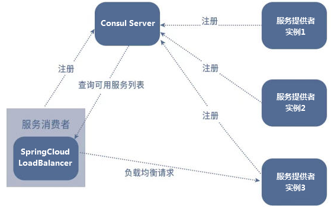

# LoadBalancer负载均衡服务调用

前身是Ribbon目前已进入维护模式

Spring Cloud Ribbon是基于Netflix Ribbon实现的一套**客户端    负载均衡**的工具。

简单的说，Ribbon是Netflix发布的开源项目，主要功能是**提供客户端的软件负载均衡算法和服务调用**。Ribbon客户端组件提供一系列完善的配置项如连接超时，重试等。简单的说，就是在配置文件中列出Load Balancer（简称LB）后面所有的机器，Ribbon会自动的帮助你基于某种规则（如简单轮询，随机连接等）去连接这些机器。我们很容易使用Ribbon实现自定义的负载均衡算法。

Ribbon未来替换方案：**spring-cloud-loadbalancer**

[spring-cloud-loadbalancer官网](https://docs.spring.io/spring-cloud-commons/docs/current/reference/html/#spring-cloud-loadbalancer)

## spring-cloud-loadbalancer是什么

**LB负载均衡(Load Balance)是什么**

简单的说就是将用户的请求平摊的分配到多个服务上，从而达到系统的HA（高可用），常见的负载均衡有软件Nginx，LVS，硬件 F5等

**spring-cloud-starter-loadbalancer组件是什么**

Spring Cloud LoadBalancer是由SpringCloud官方提供的一个开源的、简单易用的**客户端负载均衡器**，它包含在SpringCloud-commons中**用它来替换了以前的Ribbon组件**。相比较于Ribbon，SpringCloud LoadBalancer不仅能够支持RestTemplate，还支持WebClient（WeClient是Spring Web Flux中提供的功能，可以实现响应式异步请求）

## loadBalancer负载均衡

### 客户端和服务器端负载均衡的区别

loadbalancer本地负载均衡客户端和Nginx服务端负载均衡区别

- Nginx是**服务器负载均衡**，客户端所有请求都会交给nginx，然后由**nginx实现转发请求**，即负载均衡是由服务端实现的。
- loadbalancer**本地负载均衡**，在调用微服务接口时候，会在**注册中心上获取注册信息服务列表之后缓存到JVM本地**，从而在**本地实现RPC远程服务调用技术**。

### 负载均衡案例

#### 理论

80通过轮询负载访问8001、8002、8003



LoadBalancer 在工作时分成两步：

- **第一步**，先选择ConsulServer从服务端查询并拉取服务列表，知道了它有多个服务(上图3个服务)，这3个实现是完全一样的，默认轮询调用谁都可以正常执行。类似生活中求医挂号，某个科室今日出诊的全部医生，客户端你自己选一个。
- **第二步**，按照指定的负载均衡策略从server取到的服务注册列表中由客户端自己选择一个地址，所以LoadBalancer是一个**客户端的**负载均衡器。

#### 实操

1. 启动Consul，将8001、8002启动后注册进微服务

2. 订单80模块(客户端，消费者侧)**修改POM**并注册进consul**新增LoadBalancer组件**

   ```html
   <!--loadbalancer-->
   <dependency>
       <groupId>org.springframework.cloud</groupId>
       <artifactId>spring-cloud-starter-loadbalancer</artifactId>
   </dependency>
   ```

3. 修改Controller进行测试

   ```java
   @GetMapping(value = "/consumer/pay/get/info")
   private String getInfoByConsul() {
       // PaymentSrv_URL是注册进consul中的微服务名字(同一微服务名可能有多个不同端口的相同微服务)
       return restTemplate.getForObject(PaymentSrv_URL + "/pay/get/info", String.class);
   }
   ```

4. 发现交替访问8001、8002

### 负载均衡算法

默认**轮询**： $rest接口第几次请求数 \% 服务器集群总数量 = 实际调用服务器位置下标$ ，每次服务重启动后rest接口计数从1开始。

`List<ServiceInstance> instances = discoveryClient.getInstances("cloud-payment-service");`

如：` List [0] instances = 127.0.0.1:8002`

　　`　List [1] instances = 127.0.0.1:8001`

8001+ 8002 组合成为集群，它们共计2台机器，集群总数为2， 按照**轮询算法**原理：

- 当总请求数为1时： 1 % 2 =1 对应下标位置为1 ，则获得服务地址为127.0.0.1:8001
- 当总请求数位2时： 2 % 2 =0 对应下标位置为0 ，则获得服务地址为127.0.0.1:8002
- 当总请求数位3时： 3 % 2 =1 对应下标位置为1 ，则获得服务地址为127.0.0.1:8001
- 当总请求数位4时： 4 % 2 =0 对应下标位置为0 ，则获得服务地址为127.0.0.1:8002
- 如此类推......

默认有两种算法 轮询和随机，一般来说轮询就够用了

**修改负载均衡算法**

```java
@Configuration// 使用 @Configuration 标记类作为配置类替换 xml 配置文件
@LoadBalancerClient(value = "cloud-payment-service",configuration = RestTemplateConfig.class)// @LoadBalancerClient 将要对value这个微服务执行实现新的RestTemplate配置 这个配置在configuration这个类中      value值大小写一定要和consul里面的名字一样，必须一样       不使用这个注解默认为轮询
public class RestTemplateConfig {
    @Bean
    @LoadBalanced //使用@LoadBalanced注解赋予RestTemplate负载均衡的能力 提供RestTemplate(远程访问Http)对负载均衡的支撑
    public RestTemplate restTemplate(){
        return new RestTemplate();
    }

    /**
     * 默认轮询 加此方法，修改为了随机
     * @param environment
     * @param loadBalancerClientFactory
     * @return
     */
    @Bean    ReactorLoadBalancer<ServiceInstance> randomLoadBalancer(Environment environment,
                                                           LoadBalancerClientFactory loadBalancerClientFactory) {
        String name = environment.getProperty(LoadBalancerClientFactory.PROPERTY_NAME);

        return new RandomLoadBalancer(loadBalancerClientFactory.getLazyProvider(name, ServiceInstanceListSupplier.class), name);
    }
}
```

## LoadBalancer之Consul持久化

Consul数据持久化配置，并且注册为Windows服务

1. consul下载目录下新建空文件夹`mydata`和`consul_start.bat`文件

2. `consul_start.bat`内容信息

   ```bash
   @echo.服务启动......  
   @echo off  
   @sc create Consul binpath= "D:\devSoft\consul_1.17.0_windows_386\consul.exe agent -server -ui -bind=127.0.0.1 -client=0.0.0.0 -bootstrap-expect  1  -data-dir D:\devSoft\consul_1.17.0_windows_386\mydata   "
   @net start Consul
   @sc config Consul start= AUTO  
   @echo.Consul start is OK......success
   @pause
   ```

   - `@sc create Consul binpath= "Consul安装路径\consul.exe agent -server(以服务器后台形式启动) -ui -bind=127.0.0.1(绑定本机) -client=0.0.0.0 -bootstrap-expect  1  -data-dir consul的配置数据存储路径"`
   - `@sc config Consul start= AUTO (是否每次开机启动) `

3. 右键管理员权限打开

4. 后续consul的配置数据会保存进mydata文件夹

这样每次开机都会自动启动consul服务

# OpenFeign服务接口调用

## Spring Cloud OpenFeign

**OpenFeign默认集成了LoadBalancer负载均衡功能**

Feign是一个**声明性web服务客户端**。它使编写web服务客户端变得更容易。**使用Feign创建一个接口并对其进行注释**。它具有可插入的注释支持，包括Feign注释和JAX-RS注释。Feign还支持可插拔编码器和解码器。Spring Cloud添加了对Spring MVC注释的支持，以及对使用Spring Web中默认使用的HttpMessageConverter的支持。Spring Cloud集成了Eureka、Spring Cloud CircuitBreaker以及Spring Cloud LoadBalancer，以便在使用Feign时提供负载平衡的http客户端。

**OpenFeign是一个声明式的Web服务客户端，只需创建一个Rest接口，并在该接口上添加注解`@FeignClient`即可**

OpenFeign基本上就是当前微服务之间调用的事实标准

**OpenFeign功能**

1. 可插拔的注解支持，包括Feign注解和JAX-RS注解
2. 支持可插拔的HTTP编码器和解码器
3. 支持Sentinel和它的Fallback
4. 支持SpringCloudLoadBalancer的负载均衡
5. 支持HTTP请求和响应的压缩

前面在使用**SpringCloud LoadBalancer**+RestTemplate时，利用RestTemplate对http请求的封装处理形成了一套模版化的调用方法。

**但是在实际开发中**，由于对服务依赖的调用可能不止一处，**往往一个接口会被多处调用，所以通常都会针对每个微服务自行封装一些客户端类来包装这些依赖服务的调用**。所以，OpenFeign在此基础上做了进一步封装，由他来帮助我们定义和实现依赖服务接口的定义。在OpenFeign的实现下，**我们只需创建一个接口并使用注解的方式来配置它(在一个微服务接口上面标注一个`@FeignClient`注解即可)**，即可完成对服务提供方的接口绑定，统一对外暴露可以被调用的接口方法，大大简化和降低了调用客户端的开发量，也即由服务提供者给出调用接口清单，消费者直接通过OpenFeign调用即可。

**OpenFeign同时还集成SpringCloud LoadBalancer**
可以在使用OpenFeign时提供Http客户端的负载均衡，也可以集成阿里巴巴Sentinel来提供熔断、降级等功能。而与SpringCloud LoadBalancer不同的是，**通过OpenFeign只需要定义服务绑定接口且以声明式的方法**，优雅而简单的实现了服务调用。

## OpenFeign通用步骤

OpenFeign默认集成了LoadBalancer负载均衡功能

微服务Api接口+`@FeignClient`注解标签


服务消费者80 → 调用含有@FeignClient注解的Api服务接口 → 服务提供者(8001/8002)

**流程步骤**

修改客户端

- pom

  ```html
  <!--openfeign-->
  <dependency>
      <groupId>org.springframework.cloud</groupId>
      <artifactId>spring-cloud-starter-openfeign</artifactId>
  </dependency>
  ```

- yml

  ```yaml
  server:
    port: XX
  spring:
    application:
      name: XXX
    ####Spring Cloud Consul for Service Discovery(服务发现)
    cloud:
      consul:
        host: localhost
        port: 8500
        discovery:
          # 80将要以这个名字入驻进Consul
          prefer-agent-address: true # 是否优先使用ip进行注册
          service-name: ${spring.application.name}
  ```

- 启动类

  ```java
  @SpringBootApplication
  @EnableDiscoveryClient // 该注解用于向使用consul为注册中心时注册服务
  @EnableFeignClients// 启用feign客户端,定义服务+绑定接口，以声明式的方法优雅而简单的实现服务调用
  ```

业务类
订单模块要去调用支付模块，订单和支付两个微服务，需要通过Api接口解耦，一般不要在订单模块写非订单相关的业务。
自己的业务自己做 + 其它模块走FeignApi接口调用

**修改对外暴露的通用模块**

- 引入pom

  ```html
  <!--openfeign-->
  <dependency>
      <groupId>org.springframework.cloud</groupId>
      <artifactId>spring-cloud-starter-openfeign</artifactId>
  </dependency>
  ```

- 新建服务接口`PayFeignApi`，头上配置`@FeignClient`注解

  ```java
  @FeignClient("注册进consul中的微服务名")
  public interface PayFeignApi
  ```

- 参考微服务8001的Controller层，新建PayFeignApi中的接口
  

- Controller

  ```java
  @RestController
  @Slf4j
  public class OrderController
  {
      @Resource
      private PayFeignApi payFeignApi;
  
      @PostMapping("/feign/pay/add")
      public ResultData addOrder(@RequestBody PayDTO payDTO) {
          System.out.println("第一步：模拟本地addOrder新增订单成功(省略sql操作)，第二步：再开启addPay支付微服务远程调用");
          ResultData resultData = payFeignApi.addPay(payDTO);
          return resultData;
      }
  }
  ```

## OpenFeign高级特性

配置类:

```java
@Configuration
public class FeignConfig {

    /**
     * OpenFeign配置重试机制bean
     * @return
     */
    @Bean
    public Retryer myRetryer() {
//        return Retryer.NEVER_RETRY; //Feign默认配置是不走重试策略的

        //修改最大请求次数为3(1初始次数+2重复次数)，初始间隔时间为100ms，重试间最大间隔时间为1s
        return new Retryer.Default(100,1,3);
    }

    /**
     * OpenFeign配置日志bean
     * @return
     */
    @Bean
    Logger.Level feignLoggerLevel() {
        return Logger.Level.FULL;
    }
}
```

yml:

```yaml
spring:
  cloud:
    openfeign:
      client:
        config:
#          default: # 全局通用配置
#            #连接超时时间
#            connectTimeout: 3000
#            #读取超时时间
#            readTimeout: 3000
          cloud-payment-service: # 全局通用配置
            #连接超时时间
            connectTimeout: 3000
            #读取超时时间
            readTimeout: 3000
      httpclient:
        hc5:
          enabled: true # 启用httpclient5提升性能. OpenFeign使用 Apache HttpClient 5 替换OpenFeign默认的HttpURLConnection 以提升性能
      compression: # 请求回应压缩
        request: # 请求
          enabled: true # 开启请求压缩功能
          min-request-size: 2048 # 最小触发压缩的大小
          mime-types: text/xml,application/xml,application/json # 触发压缩数据类型
        response: # 响应
          enabled: true # 开启响应压缩功能

# logging.level + 含有@FeignClient注解的完整带包名的接口名+debug级别
# feign日志以什么级别监控哪个接口(OpenFeign对外暴露服务功能清单的接口)
logging:
  level:
    com:
      xi:
        cloud:
          apis:
            # 日志级别:
            #- `NONE`：默认的，不显示任何日志；
            #- `BASIC`：仅记录请求方法、URL、响应状态码及执行时间；
            #- `HEADERS`：除了 `BASIC` 中定义的信息之外，还有请求和响应的头信息；
            #- `FULL`：除了 `HEADERS` 中定义的信息之外，还有请求和响应的正文及元数据。
            PayFeignApi: debug
```


### OpenFeign之超时控制

默认OpenFeign客户端等待60秒钟，但是服务端处理超过规定时间会导致Feign客户端返回报错。

为了避免这样的情况，有时候我们需要设置Feign客户端的超时控制，默认60秒太长或者业务时间太短都不好

**yml文件中开启配置**：

全局配置方式：

```yaml
spring:
 cloud:
  openfeign:
   client:
    config:
     default: # 全局通用配置
      connectTimeout: ??? # 连接超时时间
      readTimeout: ??? # 请求处理超时时间
```

指定配置方式：

```yaml
spring:
 cloud:
  openfeign:
   client:
    config:
     cloud-payment-service: # 调用此微服务的配置
      connectTimeout: ??? # 连接超时时间
      readTimeout: ??? # 请求处理超时时间
```

注：当全局和指定配置都有时，以更细致(指定)的为准

### OpenFeign之重试机制

默认重试机制是关闭的，给了默认值。

默认情况下会创建Retryer.NEVER_RETRY类型为Retryer的bean,这将禁用重试。
请注意，这种重试行为与Feign默认行为不同，它会自动重试 IOExceptions,.将它们视为与网络相关的瞬态异常，以及从ErrorDecoder抛出的任何RetryableException

**修改重试机制：**

```java
@Configuration
public class FeignConfig {
   /**
    * OpenFeign配置重试机制bean
    * 该方法写入OpenFeign的配置类中
    * @return
    */
    @Bean
    public Retryer myRetryer() {
        //return Retryer.NEVER_RETRY; //Feign默认配置是不走重试策略的

        //最大请求次数为3(1初始次数+2重复次数)，初始间隔时间为100ms，重试间最大间隔时间为1s
        return new Retryer.Default(100,1,3);
    }
}
```

以上配置目前控制台没有看到3次重试过程，只看到结果，**正常的，正确的**，是feign的日志打印问题

### OpenFeign之性能优化HttpClient5

PpenFeign中http client 如果不做特殊配置，**OpenFeign默认使用**JDK自带的**HttpURLConnection**发送HTTP请求，由于默认HttpURLConnection没有连接池、**性能和效率比较低**，如果采用默认，性能上不是最牛B的。

**所以使用Apache HttpClient 5** 替换OpenFeign默认的HttpURLConnection 以**提升性能**。

**步骤**

1. pom

   ```html
   <!-- Apache HttpClient 5 替换OpenFeign默认的HttpURLConnection 以提升性能 -->
   <!-- httpclient5-->
   <dependency>
       <groupId>org.apache.httpcomponents.client5</groupId>
       <artifactId>httpclient5</artifactId>
       <version>5.3</version>
   </dependency>
   <!-- feign-hc5-->
   <dependency>
       <groupId>io.github.openfeign</groupId>
       <artifactId>feign-hc5</artifactId>
       <version>13.1</version>
   </dependency>
   ```

2. yml

   ```yaml
   #  Apache HttpClient5 配置开启
   spring:
     cloud:
       openfeign:
         httpclient:
           hc5:
             enabled: true
   ```

### OpenFeign请求回应压缩

**对请求和响应进行GZIP压缩**

Spring Cloud OpenFeign支持对请求和响应进行GZIP压缩，以**减少通信过程中的性能损耗**。

通过下面的两个参数设置，就能**开启请求与相应的压缩功能**：

```yaml
spring:
 cloud:
  openfeign:
   compression: # 压缩
    request: # 请求
     enabled: true # 开启请求压缩
    response: # 响应
     enabled: true # 开启响应压缩
```

**细粒度化设置**

对请求压缩做一些更细致的设置，比如下面的配置内容指定压缩的请求数据类型并设置了请求压缩的大小下限，

只有超过这个大小的请求才会进行压缩：

```yaml
spring:
 cloud:
  openfeign:
   compression:
    request:
     enabled: true # 开启请求压缩
     mime-types: text/xml,application/xml,application/json #触发压缩数据类型
     min-request-size: 2048 #最小触发压缩的大小
```

### OpenFeign日志打印功能

Feign 提供了日志打印功能，我们可以通过配置来调整日志级别，从而了解 Feign 中 Http 请求的细节，说白了就是**对Feign接口的调用情况进行监控和输出**

**日志级别：**

- `NONE`：默认的，不显示任何日志；
- `BASIC`：仅记录请求方法、URL、响应状态码及执行时间；
- `HEADERS`：除了 `BASIC` 中定义的信息之外，还有请求和响应的头信息；
- `FULL`：除了 `HEADERS` 中定义的信息之外，还有请求和响应的正文及元数据。

**步骤**

1. 配置日志bean

   ```java
   /**
     * OpenFeign配置日志bean
     * 该方法写入OpenFeign的配置类中
     * @return
     */
   @Bean
   Logger.Level feignLoggerLevel() {
       return Logger.Level.FULL;// 返回需要的日志级别
   }
   ```

2. yml里配置需要开启日志的feign客户端

   ```yaml
   # logging.level + 含有@FeignClient注解的完整带包名的接口名+debug级别
   # feign日志以什么级别监控哪个接口(OpenFeign对外暴露服务功能清单的接口)
   logging:
     level:
       com:
         xi:
           cloud:
             apis:
               PayFeignApi: debug 
   ```
