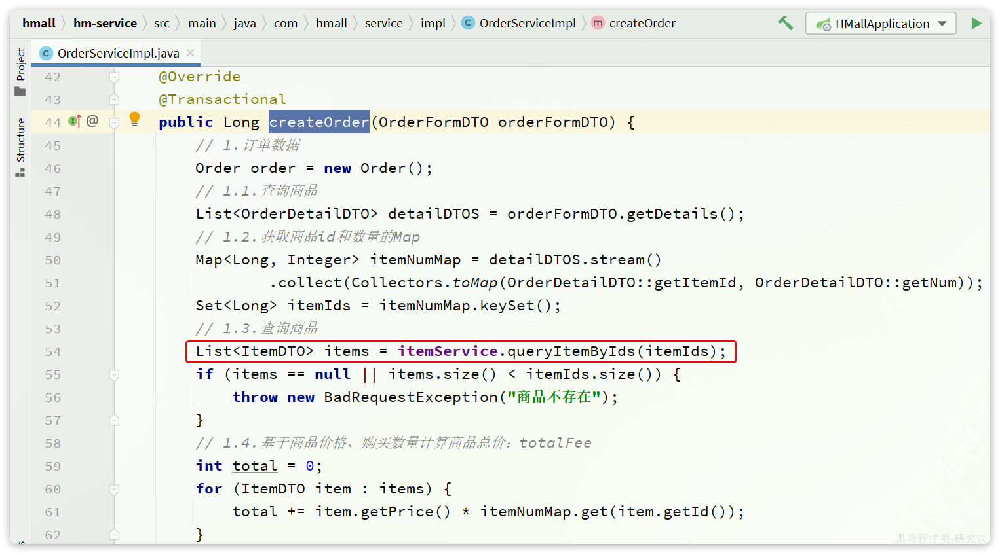
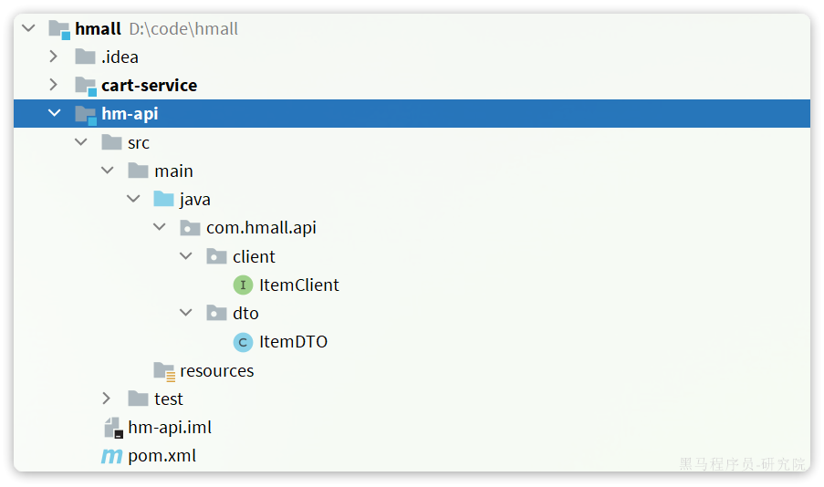

# OpenFeign

在上一章，我们利用Nacos实现了服务的治理，利用RestTemplate实现了服务的远程调用。但是远程调用的代码太复杂了：


而且这种调用方式，与原本的本地方法调用差异太大，编程时的体验也不统一，一会儿远程调用，一会儿本地调用。

因此，我们必须想办法改变远程调用的开发模式，让**远程调用像本地方法调用一样简单**。而这就要用到OpenFeign组件了。

其实远程调用的关键点就在于四个：

- 请求方式
- 请求路径
- 请求参数
- 返回值类型

所以，OpenFeign就利用SpringMVC的相关注解来声明上述4个参数，然后基于动态代理帮我们生成远程调用的代码，而无需我们手动再编写，非常方便。

接下来，我们就通过一个快速入门的案例来体验一下OpenFeign的便捷吧。

## 4.1.快速入门

我们还是以cart-service中的查询我的购物车为例。因此下面的操作都是在cart-service中进行。

### 4.1.1.引入依赖

在`cart-service`服务的pom.xml中引入`OpenFeign`的依赖和`loadBalancer`依赖：

```XML
<!--openFeign-->
<dependency>
    <groupId>org.springframework.cloud</groupId>
    <artifactId>spring-cloud-starter-openfeign</artifactId>
</dependency>
<!--负载均衡器-->
<dependency>
    <groupId>org.springframework.cloud</groupId>
    <artifactId>spring-cloud-starter-loadbalancer</artifactId>
</dependency>
```

### 4.1.2.启用OpenFeign

接下来，我们在`cart-service`的`CartApplication`启动类上添加注解`@EnableFeignClients`，启动OpenFeign功能：


### 4.1.3.编写OpenFeign客户端

在`cart-service`中，定义一个新的接口，编写Feign客户端：

其中代码如下：

```Java
package com.hmall.cart.client;

import com.hmall.cart.domain.dto.ItemDTO;
import org.springframework.cloud.openfeign.FeignClient;
import org.springframework.web.bind.annotation.GetMapping;
import org.springframework.web.bind.annotation.RequestParam;

import java.util.List;

@FeignClient("item-service")
public interface ItemClient {

    @GetMapping("/items")
    List<ItemDTO> queryItemByIds(@RequestParam("ids") Collection<Long> ids);
}
```

这里只需要声明接口，无需实现方法。接口中的几个关键信息：

- `@FeignClient("item-service")` ：声明服务名称
- `@GetMapping` ：声明请求方式
- `@GetMapping("/items")` ：声明请求路径
- `@RequestParam("ids") Collection<Long> ids` ：声明请求参数
- `List<ItemDTO>` ：返回值类型

有了上述信息，OpenFeign就可以利用动态代理帮我们实现这个方法，并且向`http://item-service/items`发送一个`GET`请求，携带ids为请求参数，并自动将返回值处理为`List<ItemDTO>`。

我们只需要直接调用这个方法，即可实现远程调用了。

### 4.1.4.使用FeignClient

最后，我们在`cart-service`的`com.hmall.cart.service.impl.CartServiceImpl`中改造代码，直接调用`ItemClient`的方法：


feign替我们完成了服务拉取、负载均衡、发送http请求的所有工作，是不是看起来优雅多了。

而且，这里我们不再需要RestTemplate了，还省去了RestTemplate的注册。

## 4.2.连接池

Feign底层发起http请求，依赖于其它的框架。其底层支持的http客户端实现包括：

- HttpURLConnection：默认实现，不支持连接池
- Apache HttpClient ：支持连接池
- OKHttp：支持连接池

因此我们通常会使用带有连接池的客户端来代替默认的HttpURLConnection。比如，我们使用OK Http.

### 4.2.1.引入依赖

在`cart-service`的`pom.xml`中引入依赖：

```XML
<!--OK http 的依赖 -->
<dependency>
  <groupId>io.github.openfeign</groupId>
  <artifactId>feign-okhttp</artifactId>
</dependency>
```

### 4.2.2.开启连接池

在`cart-service`的`application.yml`配置文件中开启Feign的连接池功能：

```YAML
feign: # openfeign 远程调用 默认http客户端为HttpURLConnection不支持连接池，效率较低
  okhttp: # okhttp http客户端，支持连接池，效率较高
    enabled: true # 开启 okhttp 连接池
```

重启服务，连接池就生效了。

### 4.2.3.验证

我们可以打断点验证连接池是否生效，在`org.springframework.cloud.openfeign.loadbalancer.FeignBlockingLoadBalancerClient`中的`execute`方法中打断点：


Debug方式启动cart-service，请求一次查询我的购物车方法，进入断点：


可以发现这里底层的实现已经改为`OkHttpClient`

## 4.3.最佳实践

将来我们要把与下单有关的业务抽取为一个独立微服务:`trade-service`，不过我们先来看一下`hm-service`中原本与下单有关的业务逻辑。

入口在`com.hmall.controller.OrderController`的`createOrder`方法，然后调用了`IOrderService`中的`createOrder`方法。

由于下单时前端提交了商品id，为了计算订单总价，需要查询商品信息：



也就是说，如果拆分了交易微服务（`trade-service`），它也需要远程调用`item-service`中的根据id批量查询商品功能。这个需求与`cart-service`中是一样的。

因此，我们就需要在`trade-service`中再次定义`ItemClient`接口，这不是重复编码吗？ 有什么办法能加避免重复编码呢？

### 4.3.1.思路分析

相信大家都能想到，避免重复编码的办法就是**抽取**。不过这里有两种抽取思路：

- 思路1：抽取到微服务之外的公共module
- 思路2：每个微服务自己抽取一个module

如图：


方案1抽取更加简单，工程结构也比较清晰，但缺点是整个项目耦合度偏高。

方案2抽取相对麻烦，工程结构相对更复杂，但服务之间耦合度降低。

由于item-service已经创建好，无法继续拆分，因此这里我们采用方案1.

### 4.3.2.抽取Feign客户端

在`hmall`下定义一个新的module，命名为hm-api


其依赖如下：

```XML
<?xml version="1.0" encoding="UTF-8"?>
<project xmlns="http://maven.apache.org/POM/4.0.0"
         xmlns:xsi="http://www.w3.org/2001/XMLSchema-instance"
         xsi:schemaLocation="http://maven.apache.org/POM/4.0.0 http://maven.apache.org/xsd/maven-4.0.0.xsd">
    <parent>
        <artifactId>hmall</artifactId>
        <groupId>com.heima</groupId>
        <version>1.0.0</version>
    </parent>
    <modelVersion>4.0.0</modelVersion>

    <artifactId>hm-api</artifactId>

    <properties>
        <maven.compiler.source>11</maven.compiler.source>
        <maven.compiler.target>11</maven.compiler.target>
    </properties>

    <dependencies>
        <!--open feign-->
        <dependency>
            <groupId>org.springframework.cloud</groupId>
            <artifactId>spring-cloud-starter-openfeign</artifactId>
        </dependency>
        <!-- load balancer-->
        <dependency>
            <groupId>org.springframework.cloud</groupId>
            <artifactId>spring-cloud-starter-loadbalancer</artifactId>
        </dependency>
        <!-- swagger 注解依赖 -->
        <dependency>
            <groupId>io.swagger</groupId>
            <artifactId>swagger-annotations</artifactId>
            <version>1.6.6</version>
            <scope>compile</scope>
        </dependency>
    </dependencies>
</project>
```

然后把ItemDTO和ItemClient都拷贝过来，最终结构如下：



现在，任何微服务要调用`item-service`中的接口，只需要引入`hm-api`模块依赖即可，无需自己编写Feign客户端了。

### 4.3.3.扫描包

接下来，我们在`cart-service`的`pom.xml`中引入`hm-api`模块：

```XML
  <!--feign模块-->
  <dependency>
      <groupId>com.heima</groupId>
      <artifactId>hm-api</artifactId>
      <version>1.0.0</version>
  </dependency>
```

删除`cart-service`中原来的ItemDTO和ItemClient，重启项目，发现报错了：


这里因为`ItemClient`现在定义到了`com.hmall.api.client`包下，而cart-service的启动类定义在`com.hmall.cart`包下，扫描不到`ItemClient`，所以报错了。

解决办法很简单，在cart-service的启动类上添加声明即可，两种方式：

- 方式1：声明扫描包：


- 方式2：声明要用的FeignClient


## 4.4.日志配置

平时开发不建议开启日志，日志特别多；仅建议在调试时开启日志

OpenFeign只会在FeignClient所在包的日志级别为**DEBUG**时，才会输出日志。而且其日志级别有4级：

- **NONE**：不记录任何日志信息，这是**默认值**。
- **BASIC**：仅记录请求的方法，URL以及响应状态码和执行时间
- **HEADERS**：在BASIC的基础上，额外记录了请求和响应的头信息
- **FULL**：记录所有请求和响应的明细，包括头信息、请求体、元数据。

Feign默认的日志级别就是NONE，所以默认我们看不到请求日志。

### 4.4.1.定义日志级别

在hm-api模块下新建一个配置类，定义Feign的日志级别：

```java
package com.hmall.api.config;

import feign.Logger;
import org.springframework.context.annotation.Bean;

public class DefaultFeignConfig {
    @Bean
    public Logger.Level feignLoggerLevel() {
        return Logger.Level.FULL; // feign的日志级别
    }
}
```

**要自定义日志级别需要声明一个类型为Logger.Level的Bean，在其中定义日志级别：**

代码如下：

```Java
package com.hmall.api.config;
import feign.Logger;
import org.springframework.context.annotation.Bean;
public class DefaultFeignConfig {
    @Bean
    public Logger.Level feignLogLevel(){
        return Logger.Level.FULL;
    }
}
```

### 4.4.2.配置

但此时这个Bean并未生效，要想配置某个FeignClient的日志，还需要配置这个类。有两种方式：

- **局部**生效：在某个`FeignClient`(在openFeign暴露接口上)中配置，只对当前`FeignClient`生效

```Java
@FeignClient(value = "item-service", configuration = DefaultFeignConfig.class) // openFeign暴露的接口类
```

- **全局**生效：在`@EnableFeignClients`（在启动类上）中配置，针对所有`FeignClient`生效。

```Java
@EnableFeignClients(defaultConfiguration = DefaultFeignConfig.class)// 启动类
```

日志格式：

```Plain
17:35:32:148 DEBUG 18620 --- [nio-8082-exec-1] com.hmall.api.client.ItemClient          : [ItemClient#queryItemByIds] ---> GET http://item-service/items?ids=100000006163 HTTP/1.1
17:35:32:148 DEBUG 18620 --- [nio-8082-exec-1] com.hmall.api.client.ItemClient          : [ItemClient#queryItemByIds] ---> END HTTP (0-byte body)
17:35:32:278 DEBUG 18620 --- [nio-8082-exec-1] com.hmall.api.client.ItemClient          : [ItemClient#queryItemByIds] <--- HTTP/1.1 200  (127ms)
17:35:32:279 DEBUG 18620 --- [nio-8082-exec-1] com.hmall.api.client.ItemClient          : [ItemClient#queryItemByIds] connection: keep-alive
17:35:32:279 DEBUG 18620 --- [nio-8082-exec-1] com.hmall.api.client.ItemClient          : [ItemClient#queryItemByIds] content-type: application/json
17:35:32:279 DEBUG 18620 --- [nio-8082-exec-1] com.hmall.api.client.ItemClient          : [ItemClient#queryItemByIds] date: Fri, 26 May 2023 09:35:32 GMT
17:35:32:279 DEBUG 18620 --- [nio-8082-exec-1] com.hmall.api.client.ItemClient          : [ItemClient#queryItemByIds] keep-alive: timeout=60
17:35:32:279 DEBUG 18620 --- [nio-8082-exec-1] com.hmall.api.client.ItemClient          : [ItemClient#queryItemByIds] transfer-encoding: chunked
17:35:32:279 DEBUG 18620 --- [nio-8082-exec-1] com.hmall.api.client.ItemClient          : [ItemClient#queryItemByIds] 
17:35:32:280 DEBUG 18620 --- [nio-8082-exec-1] com.hmall.api.client.ItemClient          : [ItemClient#queryItemByIds] [{"id":100000006163,"name":"巴布豆(BOBDOG)柔薄悦动婴儿拉拉裤XXL码80片(15kg以上)","price":67100,"stock":10000,"image":"https://m.360buyimg.com/mobilecms/s720x720_jfs/t23998/350/2363990466/222391/a6e9581d/5b7cba5bN0c18fb4f.jpg!q70.jpg.webp","category":"拉拉裤","brand":"巴布豆","spec":"{}","sold":11,"commentCount":33343434,"isAD":false,"status":2}]
17:35:32:281 DEBUG 18620 --- [nio-8082-exec-1] com.hmall.api.client.ItemClient          : [ItemClient#queryItemByIds] <--- END HTTP (369-byte body)
```
