# Ⅹ.SpringCloud Alibaba Sentinel实现熔断与限流

## Sentinel 简介

### Sentinel 介绍

面向分布式、多语言异构化服务架构的流量治理组件

随着微服务的流行，服务和服务之间的稳定性变得越来越重要。Sentinel 是面向分布式、多语言异构化服务架构的流量治理组件，主要以流量为切入点，从流量路由、流量控制、流量整形、熔断降级、系统自适应过载保护、热点流量防护等多个维度来帮助开发者保障微服务的稳定性。

等价对标Spring Cloud Circuit Breaker [Spring Cloud Circuit Breaker官网](https://spring.io/projects/spring-cloud-circuitbreaker)

[home | Sentinel官网](https://sentinelguard.io/zh-cn/)

[introduction | Sentinel (sentinelguard.io)](https://sentinelguard.io/zh-cn/docs/introduction.html)

[主页 · alibaba/Sentinel Wiki (github.com)](https://github.com/alibaba/Sentinel/wiki/主页)

<iframe src="https://github.com/alibaba/Sentinel/wiki/主页" style="width: 100%; height: 400px; border: none;"></iframe>  

### Sentinel 思想设计理念


### Sentinel的特征

丰富的应用场景：Sentinel 承接了阿里巴巴近 10 年的双十一大促流量的核心场景，例如秒杀（即突发流量控制在系统容量可以承受的范围）、消息削峰填谷、集群流量控制、实时熔断下游不可用应用等。

完备的实时监控：Sentinel 同时提供实时的监控功能。您可以在控制台中看到接入应用的单台机器秒级数据，甚至 500 台以下规模的集群的汇总运行情况。

广泛的开源生态：Sentinel 提供开箱即用的与其它开源框架/库的整合模块，例如与 Spring Cloud、Apache Dubbo、gRPC、Quarkus 的整合。您只需要引入相应的依赖并进行简单的配置即可快速地接入 Sentinel。同时 Sentinel 提供 Java/Go/C++ 等多语言的原生实现。

完善的 SPI 扩展机制：Sentinel 提供简单易用、完善的 SPI 扩展接口。您可以通过实现扩展接口来快速地定制逻辑。例如定制规则管理、适配动态数据源等。

### Sentinel的主要特性


### Sentinel 怎么用

讲讲什么是缓存穿透？击穿？雪崩？如何解决？[123_redis高级篇之缓存预热雪崩穿透击穿面试题简介_哔哩哔哩_bilibili](https://www.bilibili.com/video/BV13R4y1v7sP?p=123&vd_source=796ed40051b301bfa3a84ba357f4828c)

#### 服务雪崩

多个微服务之间调用的时候，假设微服务A调用微服务B和微服务C，微服务B和微服务C又调用其它的微服务，这就是所谓的“**扇出**”。如果扇出的链路上某个微服务的调用响应时间过长或者不可用，对微服务A的调用就会占用越来越多的系统资源，进而引起系统崩溃，所谓的“雪崩效应”。对于高流量的应用来说，单一的后端依赖可能会导致所有服务器上的所有资源都在几秒钟内饱和。比失败更糟糕的是，这些应用程序还可能导致服务之间的延迟增加，备份队列，线程和其他系统资源紧张，导致整个系统发生更多的级联故障。这些都表示需要对故障和延迟进行隔离和管理，以便单个依赖关系的失败，不能取消整个应用程序或系统。

所以，通常当你发现一个模块下的某个实例失败后，这时候这个模块依然还会接收流量，然后这个有问题的模块还调用了其他的模块，这样就会发生级联故障，或者叫雪崩。**复杂分布式体系结构中的应用程序有数十个依赖关系，每个依赖关系在某些时候将不可避免地失败。**

#### 服务降级

服务降级，说白了就是一种服务托底方案，如果服务无法完成正常的调用流程，就使用默认的托底方案来返回数据。

例如，在商品详情页一般都会展示商品的介绍信息，一旦商品详情页系统出现故障无法调用时，会直接获取缓存中的商品介绍信息返回给前端页面。

#### 服务熔断

在分布式与微服务系统中，如果下游服务因为访问压力过大导致响应很慢或者一直调用失败时，上游服务为了保证系统的整体可用性，会暂时断开与下游服务的调用连接。这种方式就是熔断。**类比保险丝达到最大服务访问后，直接拒绝访问，拉闸限电，然后调用服务降级的方法并返回友好提示。**

服务熔断一般情况下会有三种状态：闭合、开启和半熔断;

闭合状态(保险丝闭合通电OK)：服务一切正常，没有故障时，上游服务调用下游服务时，不会有任何限制。

开启状态(保险丝断开通电Error)：上游服务不再调用下游服务的接口，会直接返回上游服务中预定的方法。

半熔断状态：处于开启状态时，上游服务会根据一定的规则，尝试恢复对下游服务的调用。此时，上游服务会以有限的流量来调用下游服务，同时，会监控调用的成功率。如果成功率达到预期，则进入关闭状态。如果未达到预期，会重新进入开启状态。

#### 服务限流

服务限流就是限制进入系统的流量，以防止进入系统的流量过大而压垮系统。其主要的作用就是保护服务节点或者集群后面的数据节点，防止瞬时流量过大使服务和数据崩溃（如前端缓存大量实效），造成不可用；还可用于平滑请求，类似秒杀高并发等操作，严禁一窝蜂的过来拥挤，大家排队，一秒钟N个，有序进行。

限流算法有两种，一种就是简单的请求总量计数，一种就是时间窗口限流（一般为1s），如令牌桶算法和漏牌桶算法就是时间窗口的限流算法。

#### 服务隔离

有点类似于系统的垂直拆分，就按照一定的规则将系统划分成多个服务模块，并且每个服务模块之间是互相独立的，不会存在强依赖的关系。如果某个拆分后的服务发生故障后，能够将故障产生的影响限制在某个具体的服务内，不会向其他服务扩散，自然也就不会对整体服务产生致命的影响。

互联网行业常用的服务隔离方式有：**线程池隔离和信号量隔离**。

#### 服务超时

整个系统采用分布式和微服务架构后，系统被拆分成一个个小服务，就会存在服务与服务之间互相调用的现象，从而形成一个个调用链。

形成调用链关系的两个服务中，主动调用其他服务接口的服务处于调用链的上游，提供接口供其他服务调用的服务处于调用链的下游。服务超时就是在上游服务调用下游服务时，设置一个最大响应时间，如果超过这个最大响应时间下游服务还未返回结果，则断开上游服务与下游服务之间的请求连接，释放资源。

## Sentinel 安装

Sentinel 分为两部分

- 核心库(java客户端)：不依赖任何框架/库，能够运行于所有java运行时环境，同时对 Dubbo/Spring Cloud 等框架也有较好的支持
- 控制台(Dashboard): 基于 SpringBoot 开发，打包后可以直接运行，不需要额外的 Tomcat 等应用容器

后台默认8719
前台默认8080

安装：[Releases · alibaba/Sentinel (github.com)](https://github.com/alibaba/Sentinel/releases)

运行前提

- java环境OK
- 8080端口不能被占用

**运行命令**：`java -jar sentinel-dashboard-1.8.6.jar`

访问sentinel管理页面

- http://localhost:8080/#/login
- 用户名密码皆为`sentinel`

## 整合Sentinel入门案例

第一步：启动Nacos8848

- 启动命令
  `startup.cmd -m standalone`
- 访问nacos页面
  http://localhost:8848/nacos/|
  账密都是`nacos`

第二步：启动Sentinel8080

1. 运行命令

   `java -jar sentinel-dashboard-1.8.6.jar`

2. 访问sentinel管理页面
   http://localhost:8080/#/login
   账密都是`sentinel`

第三步：新建微服务8401

1. 新建模块`cloudalibaba-sentinel-service8401`

2. pom

   ```html
   <!--SpringCloud alibaba sentinel -->
   <dependency>
       <groupId>com.alibaba.cloud</groupId>
       <artifactId>spring-cloud-starter-alibaba-sentinel</artifactId>
   </dependency>
   
   <!--nacos-discovery-->
   <dependency>
       <groupId>com.alibaba.cloud</groupId>
       <artifactId>spring-cloud-starter-alibaba-nacos-discovery</artifactId>
   </dependency>
   ```

3. yml

   ```yaml
   server:
     port: 8401
   
   spring:
     application:
       name: cloudalibaba-sentinel-service
     cloud:
       nacos:
         discovery:
           server-addr: localhost:8848         #Nacos服务注册中心地址
       sentinel:
         transport:
           dashboard: localhost:8080 #配置Sentinel dashboard控制台服务地址
           port: 8719 #默认8719端口，假如被占用会自动从8719开始依次+1扫描,直至找到未被占用的端口
   ```

4. 主启动

   ```java
   @EnableDiscoveryClient
   @SpringBootApplication
   public class Main8401 {
       public static void main(String[] args) {
           SpringApplication.run(Main8401.class,args);
       }
   }
   ```

5. 业务类

   ```java
   @RestController
   public class FlowLimitController {
   
       @GetMapping("/testA")
       public String testA() {
           return "------testA";
       }
   
       @GetMapping("/testB")
       public String testB() {
           return "------testB";
       }
   }
   ```

第四步：启动8401微服务后查看sentienl控制台

1. 启动8401微服务
2. 查看sentinel控制台
   - 发现控制台空空如也
   - Sentinel采用懒加载
     想使用Sentinel对某个接口进行限流和降级等操作，一定要**先访问下接口，使Sentinel检测出相应的接口**
     http://localhost:8401/testA
     http://localhost:8401/testB
3. 访问接口
   访问接口http://localhost:8401/testA 或 http://localhost:8401/testB 后再次查看控制台
   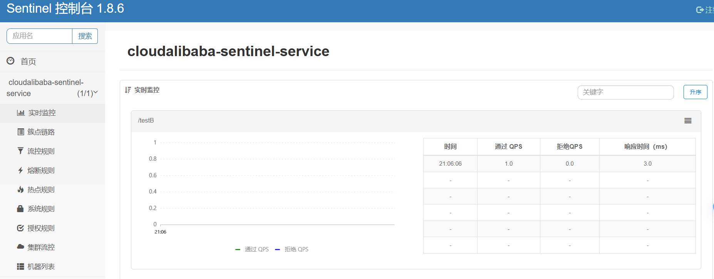

## 流控规则

### 流控规则基本介绍


Sentinel能够对流量进行控制，主要是监控应用的QPS流量或者并发线程数等指标，如果达到指定的阈值时，就会被流量进行控制，以避免服务被瞬时的高并发流量击垮，保证服务的高可靠性。参数见下方：

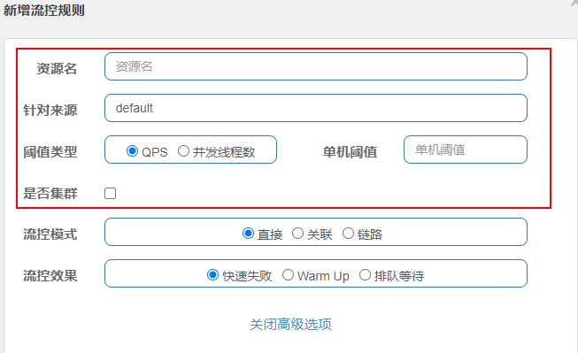

- 资源名：资源的唯一名称，默认就是请求的接口路径，可以自行修改，但是要保证唯一。
- 针对来源：具体针对某个微服务进行限流，默认值为default，表示不区分来源，全部限流。
- 阈值类型：QPS表示通过QPS进行限流，并发线程数表示通过并发线程数限流。
- 单机阈值：与阈值类型组合使用。如果阈值类型选择的是QPS，表示当调用接口的QPS达到阈值时，进行限流操作。如果阈值类型选择的是并发线程数，则表示当调用接口的并发线程数达到阈值时，进行限流操作。
- 是否集群：选中则表示集群环境，不选中则表示非集群环境。

###  流控模式


#### 1. 直接

直接：默认的流控模式，当接口达到限流条件时，直接开启限流功能。

1. 配置及说明
   表示1秒钟内查询1次就是OK，若超过次数1，就直接-快速失败，报默认错
   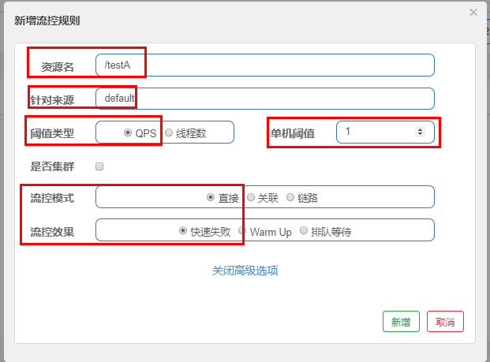
2. 测试
   快速点击访问http://localhost:8401/testA 单机阈值1表示1s中最多可以访问一次
   结果：Blocked by Sentinel (flow limiting)

思考：直接调用默认报错信息，技术方面OK，but是否应该有我们自己的后续处理？类似有个`fallback`的兜底方法？

#### 2. 关联

关联：

- 当关联的资源达到阈值时，就限流自己
- 当与A关联的资源B达到阀值后，就限流A自己
- B惹事，A挂了，即张3感冒，李4吃药

1. 配置及说明
   当关联资源/testB的qps阀值超过1时，就限流/testA的Rest访问地址，**当关联资源到阈值后限制配置好的资源名，B惹事，A挂了**
   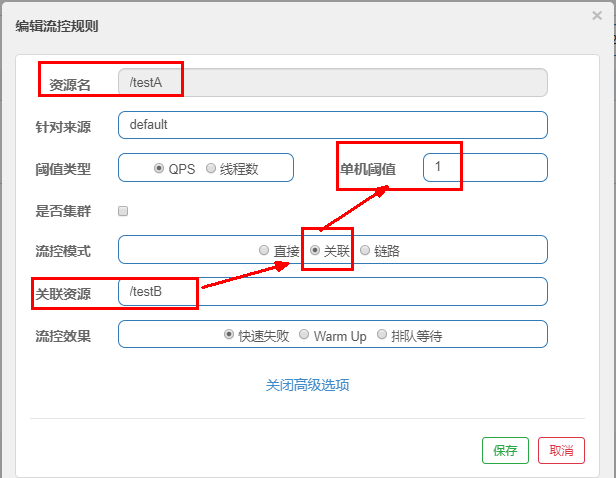

2. 使用Jmeter?模拟并发密集访问testB

   - Jmeter压力测试工具下载地址[Apache JMeter - Download Apache JMeter](https://jmeter.apache.org/download_jmeter.cgi)

   - run
     

     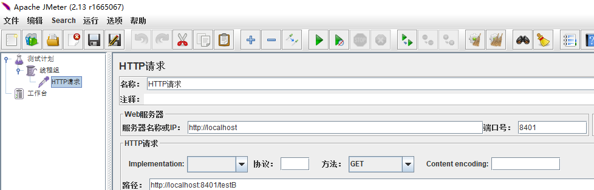

   - 大批量线程高并发访问B,导致A失效了

3. 运行Ahttp://localhost:8401/testA后发现A挂了
   结果`Blocked by Sentinel (flow limiting)`

#### 3. 链路

来自不同链路的请求对同一个目标访问时，实施针对性的不同限流措施，
比如C请求来访问(service)就限流，D请求来访问(service)就是OK

1. 修改微服务8401
   yml:

   ```yaml
   server:
     port: 8401
   
   spring:
     application:
       name: cloudalibaba-sentinel-service #8401微服务提供者后续将会被纳入阿里巴巴sentinel监管
     cloud:
       nacos:
         discovery:
           server-addr: localhost:8848         #Nacos服务注册中心地址
       sentinel:
         transport:
           dashboard: localhost:8080 #配置Sentinel dashboard控制台服务地址
           	port: 8719 #默认8719端口，假如被占用会自动从8719开始依次+1扫描,直至找到未被占用的端口
           web-context-unify: false # controller层的方法对service层调用不认为是同一个根链路
   ```

2. 业务类
   FlowLimitService：`@SentinelResource(value = "common")`[@SentinelResource详解](##@SentinelResource)

   ```java
   @Service
   public class FlowLimitService {
       @SentinelResource(value = "common")
       public void common() {
           System.out.println("------FlowLimitService come in");
       }
   }
   ```

   flowLimitService新增内容：

   ```java
   /**
     * 流控-链路演示demo
     * C和D两个请求都访问flowLimitService.common()方法，阈值到达后对C限流，对D不管
     */
   @Resource
   private FlowLimitService flowLimitService;
   
   @GetMapping("/testC")
   public String testC() {
       flowLimitService.common();
       return "------testC";
   }
   @GetMapping("/testD")
   public String testD() {
       flowLimitService.common();
       return "------testD";
   }
   ```

3. 配置sentinel
   说明：C和D两个请求都访问`flowLimitService.common()`方法，对C限流，对D不管
   

4. 测试 快速多次点击
   http://localhost:8401/testC err 超过一秒钟一次后，就发生限流
   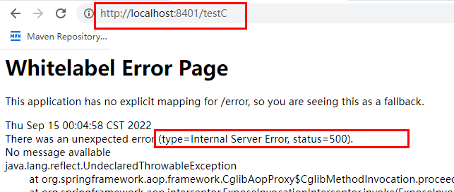
   http://localhost:8401/testD 无论怎么访问都是OK

### 流控效果


#### 1.快速失败

直接一快速失败

默认的流控处理，直接失败，抛出异常`Blocked by Sentinel（flow limiting）`

#### 2. Warm Up

##### 2.1 预热Warm Up说明

[限流 冷启动 ](https://github.com/alibaba/Sentinel/wiki/限流---冷启动)：**当流量突然增大的时候，我们常常会希望系统从空闲状态到繁忙状态的切换的时间长一些**。即如果系统在此之前长期处于空闲的状态，我们希望处理请求的数量是缓步的增多，经过预期的时间以后，到达系统处理请求个数的最大值。Warm Up（冷启动，预热）模式就是为了实现这个目的的。

<iframe src="https://github.com/alibaba/Sentinel/wiki/限流---冷启动" style="width: 100%; height: 400px; border: none;"></iframe>

**公式**：阈值除以冷却因子`coldFactor`(默认值为3)，经过预热时长后才会达到阈值


默认 `coldFactor` 为 3，即请求 QPS 从 `threshold / 3` 开始，经预热时长逐渐升至设定的 QPS 阈值。

源码:


##### 2.2 Warm Up配置及测试

**默认 coldFactor 为 3，即请求QPS从($threshold / 3$) 开始，经多少预热时长才逐渐升至设定的 QPS 阈值。**

**案例：**

- 单机阈值为`10`，预热时长设置5秒。
- 系统初始化的阈值为10 / 3 约等于3,即单机阈值刚开始为3(我们人工设定单机阈值是10，sentinel计算后QPS判定为3开始)；
- 然后过了`5`秒后阀值才慢慢升高恢复到设置的单机阈值10，也就是说5秒钟内QPS为3，过了保护期5秒后QPS为10

1. 设置sentinel
   
2. 测试
   - 进入http://localhost:8401/testB多次快速刷新
   - 发现刚开始多次抛出异常`Blocked by Sentinel（flow limiting）`，5s后不会出现异常
   - 原因：设置阈值为$10$，使用WarmUp预热，刚开始阈值为$10/3=3$，隔热时长5s后阈值变为$10$，仅凭手动很难达到10次/s，因此不会抛出异常

> 应用场景
> 如：秒杀系统在开启的瞬间，会有很多流量上来，很有可能把系统打死，预热方式就是把为了保护系统，可慢慢的把流量放进来，慢慢的把阈值增长到设置的阈值。

#### 3. 排队等待

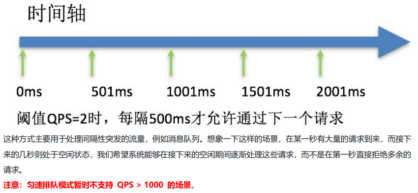


1. controller新增

   ```java
   @GetMapping("/testE")
   public String testE() {
       System.out.println(System.currentTimeMillis()+"      testE,排队等待");
       return "------testE";
   }
   ```

2. 配置sentinel
   按照单机阈值，一秒钟通过一个请求，10秒后的请求作为超时处理，放弃
   

3. 测试
   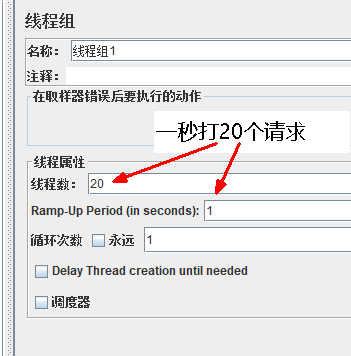

   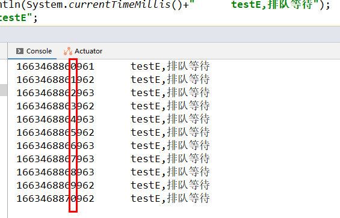

### 流控效果V2-并发线程数

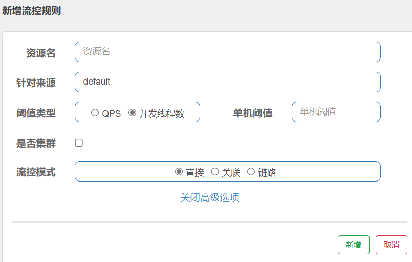

1. 配置sentinel
   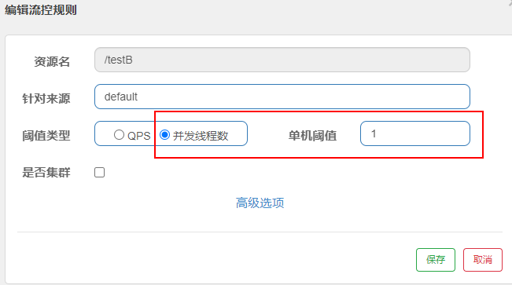
2. 测试
   - Jmeter模拟多个线程并发+循环请求
     
   - 模拟过程中同时手动测试http://localhost:8401/testB
     Jmeter给它打满了，大部分我们自己访问都不好使，偶尔Jmeter线程切换系统判定没访问，我们自己的点击才有点机会

## 熔断规则

### 熔断规则基本介绍

[熔断降级 · alibaba/Sentinel Wiki (github.com)](https://github.com/alibaba/Sentinel/wiki/熔断降级)

<iframe src="https://github.com/alibaba/Sentinel/wiki/%E7%86%94%E6%96%AD%E9%99%8D%E7%BA%A7" style="width: 100%; height: 400px; border: none;"></iframe>  

Sentinel 熔断降级会在调用链路中某个资源出现不稳定状态时（例如调用超时或异常比例升高），对这个资源的调用进行限制，

让请求快速失败，避免影响到其它的资源而导致级联错误。当资源被降级后，在接下来的降级时间窗口之内，对该资源的调用都自动熔断（默认行为是抛出 DegradeException）。

> **注意**：本文档针对 Sentinel 1.8.0 及以上版本。1.8.0 版本对熔断降级特性进行了全新的改进升级，请使用最新版本以更好地利用熔断降级的能力。

### 熔断策略

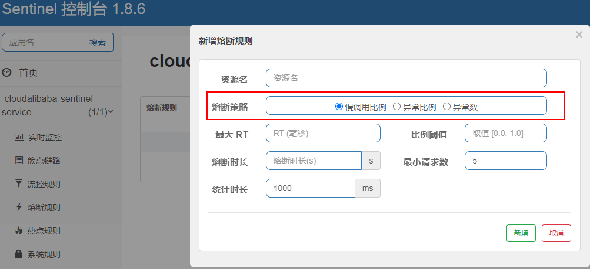

**Sentinel 提供以下几种熔断策略：**

- 慢调用比例 (`SLOW_REQUEST_RATIO`)：选择以慢调用比例作为阈值，需要设置允许的慢调用 RT（即最大的响应时间），请求的响应时间大于该值则统计为慢调用。当单位统计时长（`statIntervalMs`）内请求数目大于设置的最小请求数目，并且慢调用的比例大于阈值，则接下来的熔断时长内请求会自动被熔断。经过熔断时长后熔断器会进入探测恢复状态（HALF-OPEN 状态），**若接下来的一个请求响应时间小于设置的慢调用 RT 则结束熔断**，若大于设置的慢调用 RT 则会再次被熔断。
- 异常比例 (`ERROR_RATIO`)：当单位统计时长（`statIntervalMs`）内请求数目大于设置的最小请求数目，并且异常的比例大于阈值，则接下来的熔断时长内请求会自动被熔断。经过熔断时长后熔断器会进入探测恢复状态（HALF-OPEN 状态），**若接下来的一个请求成功完成（没有错误）则结束熔断**，否则会再次被熔断。异常比率的阈值范围是 `[0.0, 1.0]`，代表 0% - 100%。
- 异常数 (`ERROR_COUNT`)：当单位统计时长内的异常数目超过阈值之后会自动进行熔断。经过熔断时长后熔断器会进入探测恢复状态（HALF-OPEN 状态），**若接下来的一个请求成功完成（没有错误）则结束熔断**，否则会再次被熔断。

#### 1. 慢调用比例

##### 慢调用比例介绍

慢调用比例 (`SLOW_REQUEST_RATIO`)：选择以慢调用比例作为阈值，需要设置允许的慢调用 RT（即最大的响应时间），**请求的响应时间大于该值则统计为慢调用**。当**单位统计时长（`statIntervalMs`）内请求数目大于设置的最小请求数目，并且慢调用的比例大于阈值**，则接下来的熔断时长内请求会自动被熔断。经过熔断时长后熔断器会进入探测恢复状态（HALF-OPEN 状态），**若接下来的一个请求响应时间小于设置的慢调用 RT 则结束熔断**，若大于设置的慢调用 RT 则会再次被熔断。


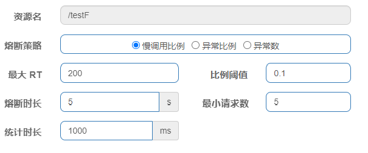

**进入熔断状态依据：**
进入熔断状态判断依据：在统计时长内，$实际请求数目＞设定的最小请求数$  且   $实际慢调用比例＞比例阈值$ ，进入熔断状态。

**名词解释：**

1. 调用：一个请求发送到服务器，服务器给与响应，一个响应就是一个调用。
2. 最大RT：即最大的响应时间，指系统对请求作出响应的业务处理时间。
3. 慢调用：$处理业务逻辑的实际时间>设置的最大RT时间$，这个调用叫做慢调用。
4. 慢调用比例：在所以调用中，$慢调用占有实际的比例＝慢调用次数\div总调用次数$
5. 比例阈值：自己设定的 ， $比例阈值＝慢调用次数\div调用次数$
6. 统计时长：时间的判断依据
7. 最小请求数：设置的调用最小请求数，上图比如1秒钟打进来10个线程（大于我们配置的5个了）调用被触发

**断路器状态：**

1. 熔断状态(保险丝跳闸断电，不可访问)：在接下来的熔断时长内请求会自动被熔断
2. 探测恢复状态(探路先锋)：熔断时长结束后进入探测恢复状态(看看服务是否起来了)
3. 结束熔断(保险丝闭合恢复，可以访问)：在探测恢复状态，如果接下来的一个请求响应时间小于设置的慢调用 RT，则结束熔断，否则继续熔断。

##### 满调用比例案例

1. 代码

   ```java
   /**
     * 新增熔断规则-慢调用比例
     * 10个线程，在一秒的时间内发送完。又因为服务器响应时长设置：暂停1秒，所以响应一个请求的时长都大于1秒综上符合熔断条件，所以当线程开启1秒后，进入熔断状态
     * @return
     */
   @GetMapping("/testF")
   public String testF() {
       //暂停几秒钟线程
       try {
           TimeUnit.SECONDS.sleep(1);
       } catch (InterruptedException e) {
           e.printStackTrace();
       }
       System.out.println("----测试:新增熔断规则-慢调用比例 ");
       return "------testF 新增熔断规则-慢调用比例";
   }
   ```

2. 配置Sentinel
   进入熔断状态判断依据：在统计时长内，$实际请求数目＞设定的最小请求数$  且   $实际慢调用比例＞比例阈值$ ，进入熔断状态。 

   

3. jmeter压测
   

4. 结论
   按照上述配置，熔断触发：

   - **多次循环，一秒钟打进来10个线程(大于5个了)调用/testF，我们希望200毫秒处理完一次调用，和谐系统；**
   - **假如在统计时长内，$实际请求数目＞最小请求数$且$慢调用比例＞比例阈值$ ，断路器打开(保险丝跳闸)微服务不可用(Blocked by Sentinel (flow limiting))，进入熔断状态5秒；**后续我停止jmeter，没有这么大的访问量了，单独用浏览器访问rest地址，断路器关闭(保险丝恢复，合上闸口)，
   - 微服务恢复OK

#### 2. 异常比例

##### 异常比例介绍

异常比例 (`ERROR_RATIO`)：当单位统计时长（`statIntervalMs`）内请求数目大于设置的最小请求数目，并且异常的比例大于阈值，则接下来的熔断时长内请求会自动被熔断。经过熔断时长后熔断器会进入探测恢复状态（HALF-OPEN 状态），**若接下来的一个请求成功完成（没有错误）则结束熔断，否则会再次被熔断**。异常比率的阈值范围是 `[0.0, 1.0]`，代表 0% - 100%。

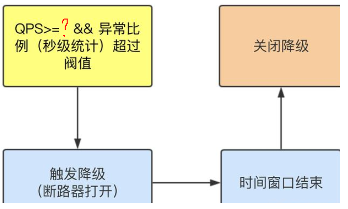


##### 异常比例案例

1. 代码

   ```java
   /**
     * 新增熔断规则-异常比例
     * @return
     */
   @GetMapping("/testG")
   public String testG() {
       System.out.println("----测试:新增熔断规则-异常比例 ");
       int age = 10/0;
       return "------testG,新增熔断规则-异常比例 ";
   }
   ```

2. 配置Sentinel
   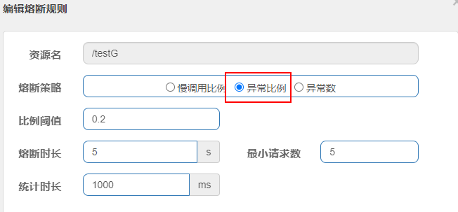

   - 不配置Sentinel，对于int age=10/0，调一次错一次报错error，页面报【Whitelabel Error Page】或全局异常
   - 配置Sentinel，对于int age=10/0，如符合如下异常比例启动熔断，页面报【Blocked by Sentinel (flow limiting)】

3. jmeter压测
   

4. 结论

   - 按照上述配置，单独访问一次，必然来一次报错一次(int age = 10/0)达到100%，调一次错一次报错【Whitelabel Error Page】或全局异常；
   - 开启jmeter后，直接高并发发送请求，多次调用达到我们的配置条件了。
     断路器开启(保险丝跳闸)，微服务不可用了，不再报错error而是服务熔断+服务降级，出提示【Blocked by Sentinel (flow limiting)】。

#### 3. 异常数

##### 异常数介绍

异常数 (`ERROR_COUNT`)：当单位统计时长内的异常数目超过阈值之后会自动进行熔断。经过熔断时长后熔断器会进入探测恢复状态（HALF-OPEN 状态），**若接下来的一个请求成功完成（没有错误）则结束熔断**，否则会再次被熔断。


##### 异常数案例

1. 代码

   ```java
   /**
     * 新增熔断规则-异常数
     * @return
     */
   @GetMapping("/testH")
   public String testH() {
       System.out.println("----测试:新增熔断规则-异常数 ");
       int i = ((int) (10 * Math.random())) % 2;// i 为0或1
       int age = 10/i;
       int j = ((int) (10 * Math.random())) % 2;// i 为0或1
       int age1 = 10/i;
       int k = ((int) (10 * Math.random())) % 2;// i 为0或1
       int age2 = 10/i;
       return "------testH,新增熔断规则-异常数 ";
   }
   ```

2. sentinel配置
   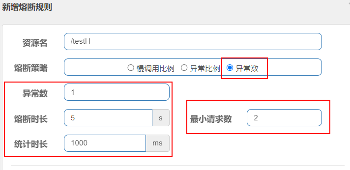

3. jmeter压测

   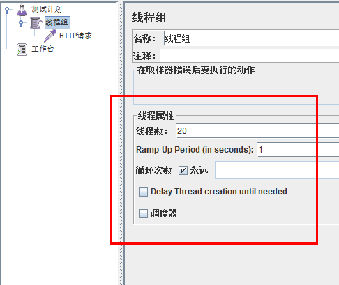

4. 结论

   - http://localhost:8401/testH，第一次访问绝对报错，因为除数不能为零，我们看到error窗口
   - 开启jmeter后，直接高并发干爆他发送请求，多次调用达到我们的配置条件了。
   - 但是jmeter开工，上述配置表示，在1秒钟内最少请求2次，当异常数大于1时，会触发熔断操作断路器开启(保险丝跳闸)，微服务不可用了，熔断的时长为5秒，不再报错error而是服务降级了出提示【Blocked by Sentinel (flow limiting) 】

## @SentinelResource

[@SentinelResource初体验——流控模式-链路的实例](####3. 链路)

### @SentinelResource注解说明

SentinelResource是一个流量防卫防护组件注解，用于指定防护资源，对配置的资源进行流量控制、熔断降级等功能。

- @SentinelResource注解说明

  ```java
  @Target({ElementType.METHOD, ElementType.TYPE})
  @Retention(RetentionPolicy.RUNTIME)
  @Inherited
  public @interface SentinelResource {
  
      //资源名称 告诉sentinel哪些资源需要哨兵去守护
      String value() default "";
  
      //entry类型，标记流量的方向，取值IN/OUT，默认是OUT
      EntryType entryType() default EntryType.OUT;
      //资源分类
      int resourceType() default 0;
  
      //处理BlockException的函数名称,函数要求：
      //1. 必须是 public
      //2.返回类型 参数与原方法一致
      //3. 默认需和原方法在同一个类中。若希望使用其他类的函数，可配置blockHandlerClass ，并指定blockHandlerClass里面的方法。
      String blockHandler() default "";
  
      //存放blockHandler的类,对应的处理函数必须static修饰。
      Class<?>[] blockHandlerClass() default {};
  
      //用于在抛出异常的时候提供fallback处理逻辑。 fallback函数可以针对所
      //有类型的异常（除了 exceptionsToIgnore 里面排除掉的异常类型）进行处理。函数要求：
      //1. 返回类型与原方法一致
      //2. 参数类型需要和原方法相匹配
      //3. 默认需和原方法在同一个类中。若希望使用其他类的函数，可配置fallbackClass ，并指定fallbackClass里面的方法。
      String fallback() default "";
  
      //存放fallback的类。对应的处理函数必须static修饰。
      String defaultFallback() default "";
  
      //用于通用的 fallback 逻辑。默认fallback函数可以针对所有类型的异常进
      //行处理。若同时配置了 fallback 和 defaultFallback，以fallback为准。函数要求：
      //1. 返回类型与原方法一致
      //2. 方法参数列表为空，或者有一个 Throwable 类型的参数。
      //3. 默认需要和原方法在同一个类中。若希望使用其他类的函数，可配置fallbackClass ，并指定 fallbackClass 里面的方法。
      Class<?>[] fallbackClass() default {};
  
      //需要trace(跟踪)的异常
      Class<? extends Throwable>[] exceptionsToTrace() default {Throwable.class};
  
      //指定排除忽略掉哪些异常。排除的异常不会计入异常统计，也不会进入fallback逻辑，而是原样抛出。
      Class<? extends Throwable>[] exceptionsToIgnore() default {};
  }
  ```

### @SentinelResource案例

> 案例开始前准备
>
> 1. 启动nacos`startup.cmd -m standalone`
> 2. 启动sentinel`java -jar xxx.jar`

#### 1. 按照rest地址限流+默认限流返回

通过访问的rest地址来限流，会返回Sentinel自带默认的限流处理信息

1. 业务类  RateLimitController

   ```java
   @RestController
   @Slf4j
   public class RateLimitController {
       @GetMapping("/rateLimit/byUrl")
       public String byUrl() {
           return "按rest地址限流测试OK";
       }
   }
   ```

2. http://localhost:8401/rateLimit/byUrl

3. sentinel配置
   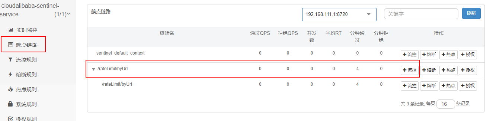

    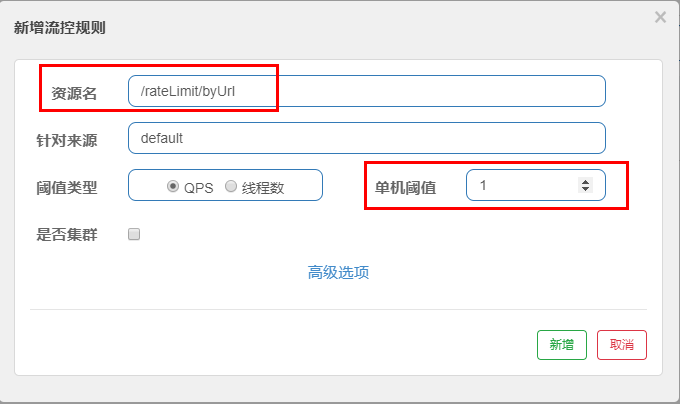

4. 测试
   快速点击http://localhost:8401/rateLimit/byUrl
   结果：会返回Sentinel自带的限流处理结果，默认 
   

#### 2. 按SentinelResource资源名称限流+自定义限流返回

不想用默认的限流提示(Blocked by Sentinel(flow limiting),想返回自定义限流的提示

- 业务类  RateLimitController

  ```java
  /**
    * 按资源名称SentinelResource限流测试
    * @return
    */
  @GetMapping("/rateLimit/byResource")
  // byResourceSentinelResource资源正常走这个方法，异常（违背了sentinel中的配置）走handlerBlockHandler()
     
  @SentinelResource(value = "byResourceSentinelResource",blockHandler = "handlerBlockHandler")
  public String byResource() {
      return "按资源名称SentinelResource限流测试OK";
  }
  public String handlerBlockHandler(BlockException exception) {
      return "服务不可用触发@SentinelResource启动"+"\t"+"o(╥﹏╥)o";
  }
  ```

- sentinel配置
  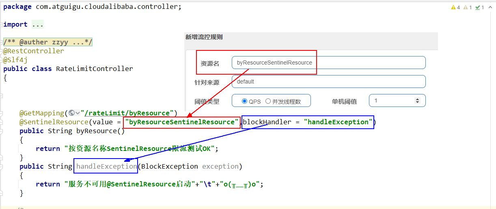

- 测试
  1秒钟点击1下，OK
  超过上述，疯狂点击，返回了**自定义的限流处理信息**，限流发生
  

#### 3. 按SentinelResource资源名称限流+自定义限流返回+服务降级处理

按SentinelResourcel配置，**点击超过限流配置返回自定义限流提示**+**程序异常返回fallback服务降级**

- 业务类  RateLimitController

  ```java
  /**
    * 按SentinelResourcel配置，点击超过限流配置返回自定义限流提示+程序异常返回fallback服务降级
    * @param p1
    * @return
    */
  @GetMapping("/rateLimit/doAction/{p1}")
  // value: 资源名  blockHandler：自定义限流时方法 fallback：兜底的回调方法
  @SentinelResource(value = "doActionSentinelResource",
                    blockHandler = "doActionBlockHandler", fallback = "doActionFallback")
  public String doAction(@PathVariable("p1") Integer p1) {
      if (p1 == 0){
          throw new RuntimeException("p1等于零直接异常");
      }
      return "doAction";
  }
  public String doActionBlockHandler(@PathVariable("p1") Integer p1,BlockException e){
      log.error("sentinel配置自定义限流了:{}", e);
      return "sentinel被限流，配置自定义限流了";
  }
  public String doActionFallback(@PathVariable("p1") Integer p1,Throwable e){
      log.error("程序逻辑异常了:{}", e);
      return "程序逻辑异常了"+"\t"+e.getMessage();
  }
  ```

- sentinel配置
  
  表示1秒钟内查询次数大于1，就跑到我们自定义的处流，限流

- 测试

  - http://localhost:8401/rateLimit/doAction/1
    1秒钟点击1下，**OK**
    超过上述，疯狂点击，**返回了自己定义的限流处理信息**，限流发生，配合了sentinel设定的规则
  - http://localhost:8401/rateLimit/doAction/0
    p1参数为零，异常发生，**返回了自己定义的服务降级处理**

小结：

- blockHandler,主要针对sentinel**配置**后出现的**违规**情况处理
- fallback,程序**异常**了JVM抛出的**异常服务降级**
- 两者可以同时共存

## 热点规则

### 热点规则介绍

[热点参数限流 · alibaba/Sentinel Wiki (github.com)](https://github.com/alibaba/Sentinel/wiki/热点参数限流)

热点即经常访问的数据，很多时候我们希望统计或者限制某个热点数据中访问频次最高的TopN数据，并对其访问进行限流或者其它操作

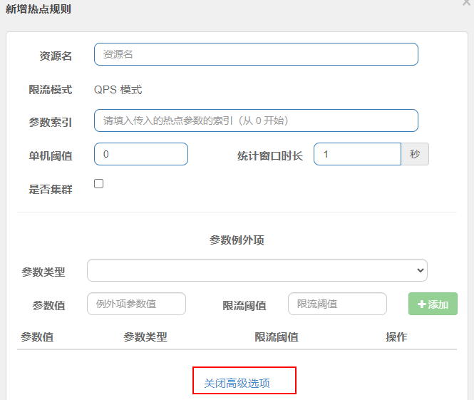

<iframe src="https://github.com/alibaba/Sentinel/wiki/%E7%83%AD%E7%82%B9%E5%8F%82%E6%95%B0%E9%99%90%E6%B5%81" style="width: 100%; height: 400px; border: none;"></iframe>  


### 热点规则案例

1. 业务 RateLimitController

   ```java
   /**
     * 热点参数限流
     * @param p1
     * @param p2
     * @return
     */
   @GetMapping("/testHotKey")
   @SentinelResource(value = "testHotKey",blockHandler = "dealHandler_testHotKey")
   public String testHotKey(@RequestParam(value = "p1",required = false) String p1,
                            @RequestParam(value = "p2",required = false) String p2) {
       return "------testHotKey";
   }
   public String dealHandler_testHotKey(String p1,String p2,BlockException exception) {
       return "-----dealHandler_testHotKey 触发限流";
   }
   ```

2. 配置
   
   方法testHotKey里面第一个参数P1有值只要QPS超过每秒1次，马上降级处理

   > 限流模式只支持QPS模式，固定写死了。（这才叫热点）
   >
   > @SentinelResource注解的方法**参数索引**，0代表第一个参数，1代表第二个参数，以此类推
   >
   > 单机阀值以及统计窗口时长表示在此窗口时间超过阀值就限流。
   >
   > **上面的抓图就是第一个参数有值的话，1秒的QPS为1，超过就限流，限流后调用**dealHandler_testHotKey支持方法。

3. 测试

   - err: http://localhost:8401/testHotKey?p1=abc含有参数P1,当每秒访问的频率超过1次时，会触发Sentinel的限流操作
   - err: http://localhost:8401/testHotKey?p1=abc&p2=33含有参数P1,当每秒访问的频率超过次时，会触发Sentinel的限流操作
   - success： http://localhost:8401/testHotKey?p2=abc没有热点参数P1,不断访问则不会触发限流操作
   - success：http://localhost:8401/testHotKey没有热点参数P1,不断访问则不会触发限流操作

### 参数例外项

**上述案例**演示了第一个参数p1,当QPS超过1秒1次点击后马上被限流

特例情况

- 普通正常限流
  含有P1参数，超过1秒钟一个后，达到阈值1后马上被限流
- 例外特殊限流
  我们期望P1参数当它是某个特殊值时，到达某个约定值后【普通正常限流】规则突然例外、失效了，它的限流值和平时不一样
  假如当p1的值等于5时，它的阈值可以达到200或其它值

1. 配置sentinel
   

   

2. 测试

   - http://localhost:8401/testHotKey?p1=5 快速点击success
     超过1秒钟一个后，达到阈值200后才会被限流当p1等于5的时候，阈值变为200
   - http://localhost:8401/testHotKey?p1=1 快速点击被限流
     超过1秒钟一个后，达到阈值后马上被限流当p1不等于5的时候，阈值就是平常的【普通正常限流】规则

## 授权规则

### 授权规则介绍

在某些场景下，需要根据调用接口的来源判断是否允许执行本次请求。此时就可以使用Sentinel提供的授权规则来实现，Sentinel的授权规则能够根据请求的来源判断是否允许本次请求通过。

在Sentinel的授权规则中，**提供了 白名单与黑名单 两种授权类型。白放行、黑禁止**

[黑白名单控制 · alibaba/Sentinel Wiki (github.com)](https://github.com/alibaba/Sentinel/wiki/黑白名单控制)

> 调用方信息通过 `ContextUtil.enter(resourceName, origin)` 方法中的 `origin` 参数传入。

**规则配置：**

来源访问控制规则（`AuthorityRule`）非常简单，主要有以下配置项：

- `resource`：资源名，即限流规则的作用对象。
- `limitApp`：对应的黑名单/白名单，不同 origin 用 `,` 分隔，如 `appA,appB`。
- `strategy`：限制模式，`AUTHORITY_WHITE` 为白名单模式，`AUTHORITY_BLACK` 为黑名单模式，默认为白名单模式。

### 授权规则案例

1. 业务类

   ```java
   @RestController
   @Slf4j
   public class EmpowerController {
       /**
        * Empower授权规则，用来处理请求的来源
        * @return
        */
       @GetMapping(value = "/empower")
       public String requestSentinel4() {
           log.info("测试Sentinel授权规则empower");
           return "Sentinel授权规则";
       }
   }
   ```

2. 定义授权流控应用属性名配置类

   ```java
   // 自定义请求来源处理器转换 定义sentinel授权规则应用属性名
   @Component
   public class MyRequestOriginParser implements RequestOriginParser {
       @Override
       public String parseOrigin(HttpServletRequest httpServletRequest) {
           //  通过serverName来设定是白名单还是黑名单 定义sentinel授权规则的授权应用属性为serverName
           return httpServletRequest.getParameter("serverName");
       }
   }
   ```

3. sentinel配置
   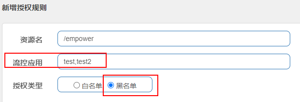

4. 测试

   - err http://localhost:8401/empower?serverName=test Blocked by Sentinel (flow limiting) 

   - err http://localhost:8401/empower?serverName=test2 Blocked by Sentinel (flow limiting)

     > 说明
     >
     > - 不断在浏览器中刷新http://localhost:8401/empower?serverName=test
     > - 不断在浏览器中刷新http://localhost:8401/empower?serverName=test2
     > - 上述2个rest地址，serverName=test或serverName=test2是处于黑名单的状态，无法访问，会发现无法访问，被Sentinel限流了 

   - success http://localhost:8401/empower?serverName=ab

## 规则持久化

一旦我们重启微服务应用，sentine规则将消失，生产环境需要将配置规则进行持久化

将限流配置规则持久化**进Nacos保存**，只要刷新8401某个rest地址，sentinel控制台的流控规则就能看到，只要Nacos里面的配置不删除，针对8401上sentinel上的流控规则持续有效

步骤

1. pom

   ```html
   <!--SpringCloud ailibaba sentinel-datasource-nacos  让nacos具有数据保存持久化的能力 该项目用于sentinel持久化-->
   <dependency>
       <groupId>com.alibaba.csp</groupId>
       <artifactId>sentinel-datasource-nacos</artifactId>
   </dependency>
   ```

2. yml

   ```yaml
   spring:
     cloud:
      sentinel:
        datasource: # sentinel持久化 
          ds1:
            nacos: # 持久化到nacos
              server-addr: localhost:8848
              dataId: ${spring.application.name}
              groupId: DEFAULT_GROUP
              data-type: json
              rule-type: flow # com.alibaba.cloud.sentinel.datasource.RuleType
   ```

   rule-type是什么？看看源码

   ```java
   public enum RuleType {
       FLOW("flow", FlowRule.class),// 流量控制规则
       DEGRADE("degrade", DegradeRule.class),// 熔断降级规则
       PARAM_FLOW("param-flow", ParamFlowRule.class),// 热点规则
       SYSTEM("system", SystemRule.class),// 系统保护规则
       AUTHORITY("authority", AuthorityRule.class),// 访问控制规则
       GW_FLOW("gw-flow", "com.alibaba.csp.sentinel.adapter.gateway.common.rule.GatewayFlowRule"),
       GW_API_GROUP("gw-api-group", "com.alibaba.csp.sentinel.adapter.gateway.common.api.ApiDefinition");
       ......
   ```

   详细介绍
   

3. 添加nacos业务规则配置
   

   ```json
   [
       {
           "resource": "/rateLimit/byUrl",
           "limitApp": "default",
           "grade": 1,
           "count": 1,
           "strategy": 0,
           "controlBehavior": 0,
           "clusterMode": false
       }
   ]
   ```

   > 介绍
   >
   > - resource：资源名称；
   > - limitApp：来源应用；
   > - grade：阈值类型，0表示线程数，1表示QPS；
   > - count：单机阈值；
   > - strategy：流控模式，0表示直接，1表示关联，2表示链路；
   > - controlBehavior：流控效果，0表示快速失败，1表示Warm Up，2表示排队等待；
   > - clusterMode：是否集群。

4. 此时发现sentinel出现nacos中刚配置的持久化的流控规则
   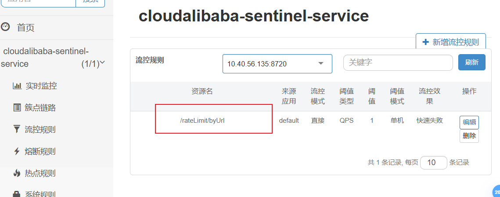
   http://localhost:8401/rateLimit/byUrl业务规则生效

5. 停止8401微服务
   

6. 再次启动8401微服务
   乍一看还是没有，稍等一会儿，多次调用http://localhost:8401/rateLimit/byUrl刷新sentinel发现该配置再次出现，持久化成功

## OpenFeign和Sentinel集成实现fallback服务降级

### 需求说明

cloudalibaba-consumer-nacos-order83  通过OpenFeign调用  cloudalibaba-provider-payment9001

1. 83  通过OpenFeign调用 9001微服务，正常访问OK.

2. 83  通过OpenFeign调用 9001微服务，异常访问error时：
   访问者要有`fallback`服务降级的情况，不要持续访问9001加大微服务负担，但是通过feign接口调用的又方法各自不同，

   **如果每个不同方法都加一个`fallback配对方法，会导致代码膨胀不好管理，工程埋雷....../(ㄒoㄒ)/~~**

3. `public @interface FeignClient`
   通过fallback属性进行统一配置，feign接口里面定义的全部方法都走统一的服务降级，**一个搞定即可**。

4. 9001微服务自身还带着sentinel内部配置的流控规则，如果满足也会被触发，也即本例有2个Case

   1. OpenFeign接口的统一fallback服务降级处理
   2. Sentinel访问触发了自定义的限流配置,在注解`@SentinelResource`里面配置的`blockHandler`方法。

### 程序解耦

前置：

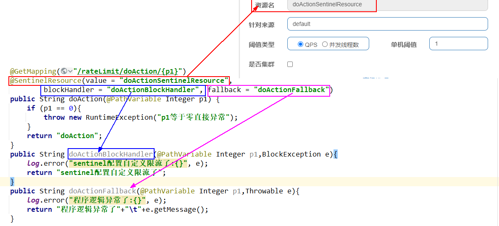

本例：


### 编码步骤

1. 启动nac0s服务器8848
2. 启动Sentinel成功

> 1. c1oudalibaba-provider-payment9001：微服务提供者9001对外提供一个服务，通过openfeign接口调用，该服务也需要被sentinel监控；
> 2. cloud-api-commons：对外暴露的服务纳入到openfeign里面进行管理
> 3. cloudalibaba-consumer-nacos-order83：消费者通过openfeign对9001进行调用，调用过程中该fallback降级就降级，该sentinel流量监控就监控。

1. 修改服务提供方c1oudalibaba-provider-payment9001

   - pom

     ```html
     <!--openfeign-->
     <dependency>
         <groupId>org.springframework.cloud</groupId>
         <artifactId>spring-cloud-starter-openfeign</artifactId>
     </dependency>
     <!--alibaba-sentinel-->
     <dependency>
         <groupId>com.alibaba.cloud</groupId>
         <artifactId>spring-cloud-starter-alibaba-sentinel</artifactId>
     </dependency>
     ```

   - yml

     ```yaml
     spring:
       cloud:
         sentinel:
           transport:
             dashboard: localhost:8080 #配置Sentinel dashboard控制台服务地址
             port: 8719 #默认8719端口，假如被占用会自动从8719开始依次+1扫描,直至找到未被占用的端口
     ```

   - 业务类

     ```java
      // openfeign+sentinel进行服务降级和流量监控的整合处理case
     @GetMapping("/pay/nacos/get/{orderNo}")
     @SentinelResource(value = "getPayByOrderNo",blockHandler = "handlerBlockHandler")
     public ResultData getPayByOrderNo(@PathVariable("orderNo") String orderNo) {
         //模拟从数据库查询出数据并赋值给DTO
         PayDTO payDTO = new PayDTO();
     
         payDTO.setId(1024);
         payDTO.setOrderNo(orderNo);
         payDTO.setAmount(BigDecimal.valueOf(9.9));
         payDTO.setPayNo("pay:"+ IdUtil.fastUUID());
         payDTO.setUserId(1);
     
         return ResultData.success("查询返回值："+payDTO);
     }
     public ResultData handlerBlockHandler(@PathVariable("orderNo") String orderNo, BlockException exception) {
         return ResultData.fail(ReturnCodeEnum.RC500.getCode(),"getPayByOrderNo服务不可用，" +
                                "触发sentinel流控配置规则"+"\t"+"o(╥﹏╥)o");
     }
     /*
         fallback服务降级方法纳入到Feign接口统一处理，全局一个
         public ResultData myFallBack(@PathVariable("orderNo") String orderNo,Throwable throwable) {
             return ResultData.fail(ReturnCodeEnum.RC500.getCode(),"异常情况："+throwable.getMessage());
         }
         */
     ```

2. 修改cloud-api-commons对外提供暴露接口

   - pom

     ```html
      <!--openfeign-->
     <dependency>
         <groupId>org.springframework.cloud</groupId>
         <artifactId>spring-cloud-starter-openfeign</artifactId>
     </dependency>
     <!--alibaba-sentinel-->
     <dependency>
         <groupId>com.alibaba.cloud</groupId>
         <artifactId>spring-cloud-starter-alibaba-sentinel</artifactId>
     </dependency>
     ```

   - 新增PayFeignSentinelApi接口

     ```java
     @FeignClient(value = "nacos-payment-provider",fallback = PayFeignSentinelApiFallBack.class)
     public interface PayFeignSentinelApi {
         @GetMapping("/pay/nacos/get/{orderNo}")
         public ResultData getPayByOrderNo(@PathVariable("orderNo") String orderNo);
     }
     ```

   - 新增全局统一服务降级类PayFeignSentinelApiFallBack

     ```java
     @Component
     public class PayFeignSentinelApiFallBack implements PayFeignSentinelApi {
         @Override
         public ResultData getPayByOrderNo(String orderNo) {
             return ResultData.fail(ReturnCodeEnum.RC500.getCode(),"对方服务宕机或不可用，FallBack服务降级o(╥﹏╥)o");
         }
     }
     ```

   - ```html
     <!-- 引入自己定义的api通用包 -->
     <dependency>
         <groupId>com.xi.cloud</groupId>
         <artifactId>cloud-api-commons</artifactId>
         <version>1.0-SNAPSHOT</version>
     </dependency>
     ```

3. 修改cloudalibaba-consumer-nacos-order83

   - pom

     ```html
      <!-- 引入自己定义的api通用包 -->
     <dependency>
         <groupId>com.xi.cloud</groupId>
         <artifactId>cloud-api-commons</artifactId>
         <version>1.0-SNAPSHOT</version>
     </dependency>
     <!--openfeign-->
     <dependency>
         <groupId>org.springframework.cloud</groupId>
         <artifactId>spring-cloud-starter-openfeign</artifactId>
     </dependency>
     <!--alibaba-sentinel-->
     <dependency>
         <groupId>com.alibaba.cloud</groupId>
         <artifactId>spring-cloud-starter-alibaba-sentinel</artifactId>
     </dependency>
     ```

   - yml

     ```yaml
     # 激活Sentinel对Feign的支持
     feign:
       sentinel:
         enabled: true
     ```

   - 启动类   添加@EnableFeignClients 启用feign的功能

     ```java
     @EnableDiscoveryClient // 启用服务注册发现
     @SpringBootApplication
     @EnableFeignClients // 启用feign
     public class Main83 {
         public static void main(String[] args) {
             SpringApplication.run(Main83.class,args);
         }
     }
     ```

4. 第一次启动

   - err
     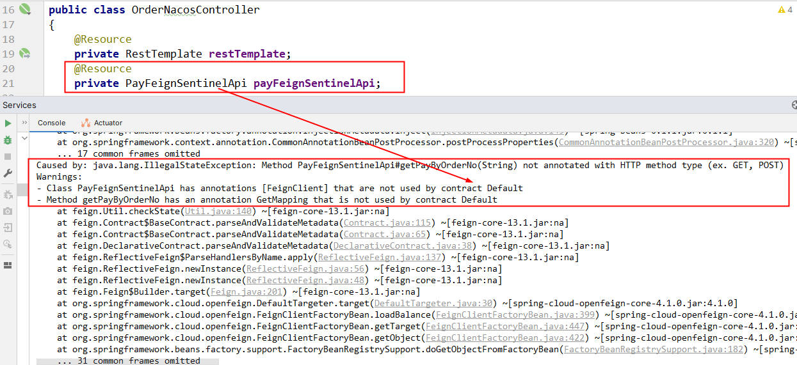
   - 错误原因：boot-cloud-alibaba版本不匹配
     springboot+springcloud版本太高导致和阿里巴巴Sentinel不兼容

5. 解决方案：
   降低总体父工程的版本

   ```html
   <spring.boot.version>3.2.0</spring.boot.version>
   <spring.cloud.version>2023.0.0</spring.cloud.version>
   ```

   上面的配置暂时为本案例注释掉，版本降级一下。
   讲解完后请恢复上述高版本保持前后配置一致，请用下面的版本替代上述

   ```html
   <spring.boot.version>3.0.9</spring.boot.version>
   <spring.cloud.version>2022.0.2</spring.cloud.version>
   ```

   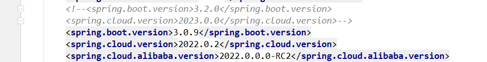

6. 第二次启动 success

### 测试验证

1. 9001正常启动后，再启动83通过feign调用

2. 测试地址
   http://localhost:83/consumer/pay/nacos/get/1024 success

3. sentinel流控为例，进行配置
   

   频繁访问后触发了Sentinel的流控规则b1ockHandler起效
   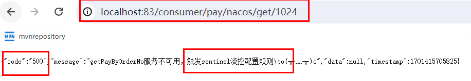

4. 9001宕机了，83通过feign调用
   测试83调用9001，此时故意关闭9001微服务提供者，看83消费侧自动降级，不会被耗死
   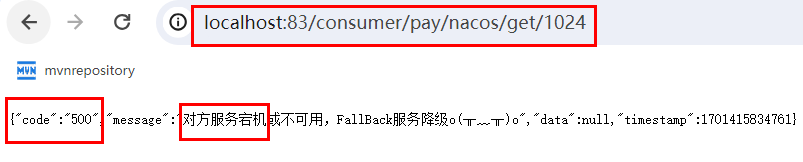

5. ~~最后一步~~
   恢复父工程版本号，升

## GateWay和Sentinel集成实现服务限流

cloudalibaba-sentinel-gateway9528网关     保护     cloudalibaba-provider-payment9001

[网关限流 · alibaba/Sentinel Wiki (github.com)](https://github.com/alibaba/Sentinel/wiki/网关限流#spring-cloud-gateway)

<iframe src="https://github.com/alibaba/Sentinel/wiki/%E7%BD%91%E5%85%B3%E9%99%90%E6%B5%81#spring-cloud-gateway" style="width: 100%; height: 400px; border: none;"></iframe>  

### 集成实现服务限流步骤

- 启动nacos服务器
- 启动sentinel服务器

1. 建Module`cloudalibaba-sentinel-gateway9528`

2. pom

   ```html
   <?xml version="1.0" encoding="UTF-8"?>
   <project xmlns="http://maven.apache.org/POM/4.0.0"
            xmlns:xsi="http://www.w3.org/2001/XMLSchema-instance"
            xsi:schemaLocation="http://maven.apache.org/POM/4.0.0 http://maven.apache.org/xsd/maven-4.0.0.xsd">
       <parent>
           <groupId>com.xi.cloud</groupId>
           <artifactId>cloud2024</artifactId>
           <version>1.0-SNAPSHOT</version>
       </parent>
       <modelVersion>4.0.0</modelVersion>
   
       <artifactId>cloudalibaba-sentinel-gateway9528</artifactId>
   
       <properties>
           <maven.compiler.source>17</maven.compiler.source>
           <maven.compiler.target>17</maven.compiler.target>
       </properties>
   
   
       <dependencies>
           <dependency>
               <groupId>org.springframework.cloud</groupId>
               <artifactId>spring-cloud-starter-gateway</artifactId>
           </dependency>
           <dependency>
               <groupId>com.alibaba.csp</groupId>
               <artifactId>sentinel-transport-simple-http</artifactId>
               <version>1.8.6</version>
           </dependency>
           <dependency>
               <groupId>com.alibaba.csp</groupId>
               <artifactId>sentinel-spring-cloud-gateway-adapter</artifactId>
               <version>1.8.6</version>
           </dependency>
           <dependency>
               <groupId>javax.annotation</groupId>
               <artifactId>javax.annotation-api</artifactId>
               <version>1.3.2</version>
               <scope>compile</scope>
           </dependency>
       </dependencies>
   
       <build>
           <plugins>
               <plugin>
                   <groupId>org.springframework.boot</groupId>
                   <artifactId>spring-boot-maven-plugin</artifactId>
               </plugin>
           </plugins>
       </build>
   </project>
   ```

3. yml

   ```yaml
   server:
     port: 9528
   
   spring:
     application:
       name: cloudalibaba-sentinel-gateway     # sentinel+gataway整合Case
     cloud:
       nacos:
         discovery:
           server-addr: localhost:8848
       gateway:
         routes:
           - id: pay_routh1 #pay_routh1                #路由的ID(类似mysql主键ID)，没有固定规则但要求唯一，建议配合服务名
             uri: http://localhost:9001                #匹配后提供服务的路由地址
             predicates:
             - Path=/pay/**                      # 断言，路径相匹配的进行路由
   ```

4. 启动类

   ```java
   @SpringBootApplication
   @EnableDiscoveryClient// 服务发现
   public class Main9528 {
       public static void main(String[] args) {
           SpringApplication.run(Main9528.class, args);
       }
   }
   ```

5. 业务类
   参照官网改写[eg](https://github.com/alibaba/Sentinel/blob/master/sentinel-demo/sentinel-demo-spring-cloud-gateway/src/main/java/com/alibaba/csp/sentinel/demo/spring/sc/gateway/GatewayConfiguration.java)

   ```java
   @Configuration
   public class GatewayConfiguration {
       private final List<ViewResolver> viewResolvers;
       private final ServerCodecConfigurer serverCodecConfigurer;
   
       public GatewayConfiguration(ObjectProvider<List<ViewResolver>> viewResolversProvider,
                                   ServerCodecConfigurer serverCodecConfigurer) {
           this.viewResolvers = viewResolversProvider.getIfAvailable(Collections::emptyList);
           this.serverCodecConfigurer = serverCodecConfigurer;
       }
   
       @Bean
       @Order(Ordered.HIGHEST_PRECEDENCE)
       public SentinelGatewayBlockExceptionHandler sentinelGatewayBlockExceptionHandler() {
           // Register the block exception handler for Spring Cloud Gateway.
           return new SentinelGatewayBlockExceptionHandler(viewResolvers, serverCodecConfigurer);
       }
   
       @Bean
       @Order(-1)
       public GlobalFilter sentinelGatewayFilter() {
           return new SentinelGatewayFilter();
       }
   
       @PostConstruct// 引入javax包下的
       public void doInit() {
           // 自己写的
   //        initGatewayRules();// 流控规则 官网上的
           initBlockHandler();
   
   
   
       }
   
       /**
        * 处理+自定义返回的 例外信息内容，类似我们的调用触发了流控规则保护
        * 自己写的
        */
       private void initBlockHandler() {
           Set<GatewayFlowRule> rules = new HashSet<>();
           rules.add(new GatewayFlowRule("pay_routh1")
                   .setCount(2)
                   .setIntervalSec(1)
           );// 1s钟两次
   
           GatewayRuleManager.loadRules(rules);
   
           BlockRequestHandler handler = new BlockRequestHandler() {
               @Override
               public Mono<ServerResponse> handleRequest(ServerWebExchange serverWebExchange, Throwable throwable) {
                   HashMap<String, String> map = new HashMap<>();
                   map.put("errorCode", HttpStatus.TOO_MANY_REQUESTS.getReasonPhrase());
                   map.put("errorMessage", "请求太过频繁，系统忙不过来，触发限流(sentinel+gataway整合Case)");
   
                   return ServerResponse.status(HttpStatus.TOO_MANY_REQUESTS)
                           .contentType(MediaType.APPLICATION_JSON)
                           .body(BodyInserters.fromValue(map));
               }
           };
           GatewayCallbackManager.setBlockHandler(handler);
       }
   }
   ```

### 集成实现服务限流测试

1. 原生url
   http://localhost:9001/pay/nacos/333 success
2. 加网关
   http://localhost:9528/pay/nacos/333 success
3. sentinel+gateway:加快点击频率，出现限流容错
   
