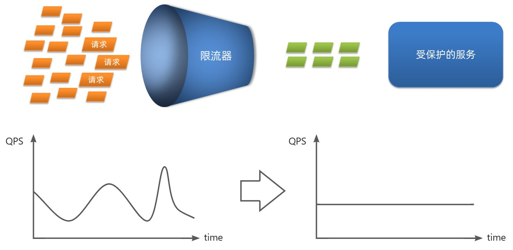
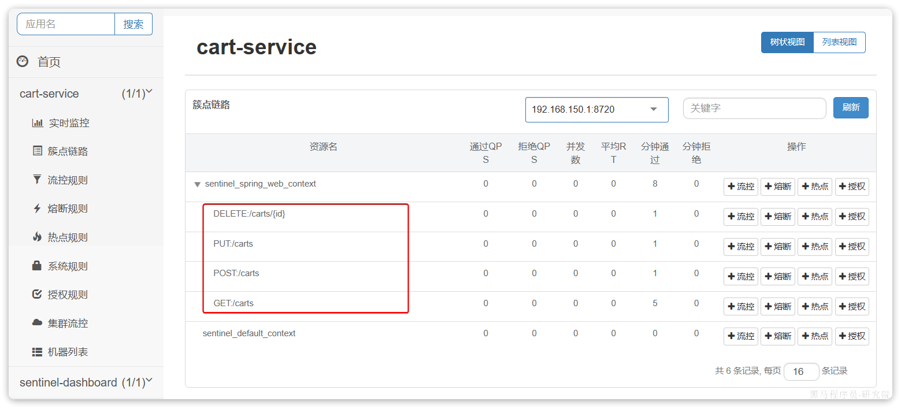
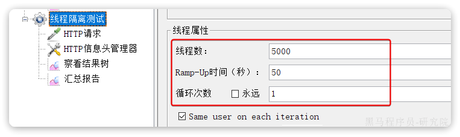
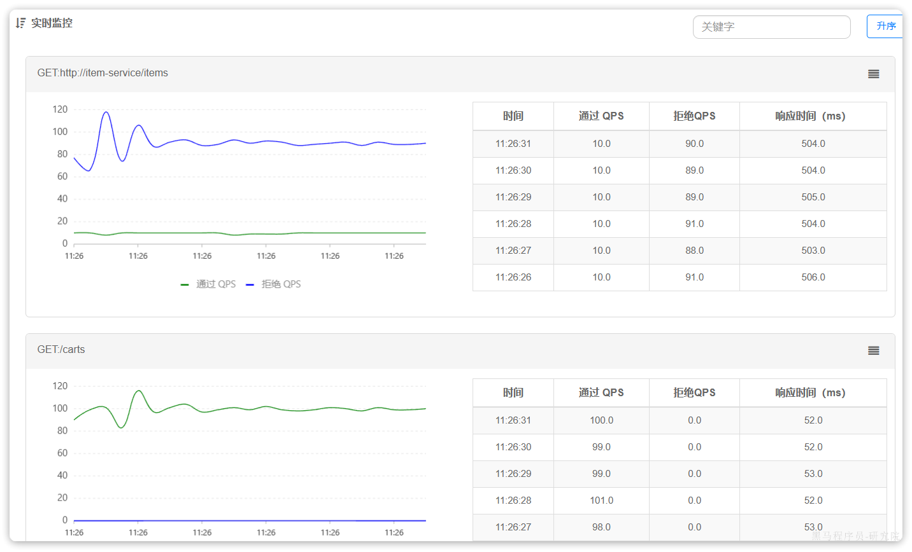

# 10. 微服务保护

保证服务运行的健壮性，避免级联失败导致的雪崩问题，就属于微服务保护。这章我们就一起来学习一下微服务保护的常见方案以及对应的技术。

**解决雪崩问题的常见方案：**

- **请求限流**：限制访问微服务的请求的并发量，避免服务因流量激增出现故障。

- **线程隔离**：也叫做舱壁模式，模拟船舱隔板的防水原理。通过限定每个业务能使用的线程数量而将故障业务隔离，避免故障扩散。

- **快速失败**：给业务编写一个调用失败时的处理的逻辑，称为fallback。当调用出现故障（比如无线程可用）时，按照失败处理逻辑执行业务并返回，而不是直接抛出异常。

- **服务熔断**：由**断路器**统计请求的异常比例或慢调用比例，如果超出阈值则会**熔断**该业务，则拦截该接口的请求。

  熔断期间，所有请求快速失败，全都走fallback逻辑。

**服务保护技术：**

|              | Sentinel                                       | Hystrix                      |
| ------------ | ---------------------------------------------- | ---------------------------- |
| **线程隔离** | 信号量隔离                                     | 线程池隔离/信号量隔离        |
| **熔断策略** | 基于慢调用比例或异常比例                       | 基于异常比率                 |
| **限流**     | 基于QPS，支持流量整形                          | 有限的支持                   |
| **Fallback** | 支持                                           | 支持                         |
| **控制台**   | 开箱即用，可配置规则、查看秒级监控、机器发现等 | 不完善                       |
| **配置方式** | 基于控制台，重启后失效                         | 基于注解或配置文件，永久生效 |

## 10.1 服务保护方案(理论)

微服务保护的方案有很多，比如：

- 请求限流
- 线程隔离
- 服务熔断

这些方案或多或少都会导致服务的体验上略有下降，比如请求限流，降低了并发上限；线程隔离，降低了可用资源数量；服务熔断，降低了服务的完整度，部分服务变的不可用或弱可用。因此这些方案都属于服务**降级**的方案。但通过这些方案，服务的健壮性得到了提升，

**解决雪崩问题的常见方案：**

- **请求限流**：限制流量在服务可以处理的范围，避免因突发流量而故障
- **线程隔离**：控制业务可用的线程数量，将故障隔离在一定范围
- **服务熔断**：将异常比例过高的接口断开，拒绝所有请求，直接走fallback
- **失败处理**：定义fallback逻辑，让业务失败时不再抛出异常，而是返回默认数据或友好提示

接下来，我们就逐一了解这些方案的原理。

### 10.1.1.请求限流

**请求限流**：限制流量在服务可以处理的范围，避免因突发流量而故障

服务故障最重要原因，就是并发太高！解决了这个问题，就能避免大部分故障。当然，接口的并发不是一直很高，而是突发的。因此请求限流，就是**限制或控制**接口访问的并发流量，避免服务因流量激增而出现故障。

请求限流往往会有一个限流器，数量高低起伏的并发请求曲线，经过限流器就变的非常平稳。这就像是水电站的大坝，起到蓄水的作用，可以通过开关控制水流出的大小，让下游水流始终维持在一个平稳的量。



### 10.1.2.线程隔离

**线程隔离**：控制业务可用的线程数量，将故障隔离在一定范围

当一个业务接口响应时间长，而且并发高时，就可能耗尽服务器的线程资源，导致服务内的其它接口受到影响。所以我们必须把这种影响降低，或者缩减影响的范围。线程隔离正是解决这个问题的好办法。

**线程隔离的思想来自轮船的舱壁模式**：


轮船的船舱会被隔板分割为N个相互隔离的密闭舱，假如轮船触礁进水，只有损坏的部分密闭舱会进水，而其他舱由于相互隔离，并不会进水。这样就把进水控制在部分船体，避免了整个船舱进水而沉没。

为了避免某个接口故障或压力过大导致整个服务不可用，我们可以限定每个接口可以使用的资源范围，也就是将其“隔离”起来。


如图所示，我们给查询购物车业务限定可用线程数量上限为20，这样即便查询购物车的请求因为查询商品服务而出现故障，也不会导致服务器的线程资源被耗尽，不会影响到其它接口。

### 10.1.3.服务熔断

**服务熔断**：将异常比例过高的接口断开，拒绝所有请求，直接走fallback

线程隔离虽然避免了雪崩问题，但故障服务（商品服务）依然会拖慢购物车服务（服务调用方）的接口响应速度。而且商品查询的故障依然会导致查询购物车功能出现故障，购物车业务也变的不可用了。

所以，我们要做两件事情：

- **编写服务降级逻辑**：就是服务调用失败后的处理逻辑，根据业务场景，可以抛出异常，也可以返回友好提示或默认数据。
- **异常统计和熔断**：统计服务提供方的异常比例，当比例过高表明该接口会影响到其它服务，应该拒绝调用该接口，而是直接走降级逻辑。


## 10.2 Sentinel

**服务保护技术：**

|              | Sentinel                                       | Hystrix                      |
| ------------ | ---------------------------------------------- | ---------------------------- |
| **线程隔离** | 信号量隔离                                     | 线程池隔离/信号量隔离        |
| **熔断策略** | 基于慢调用比例或异常比例                       | 基于异常比率                 |
| **限流**     | 基于QPS，支持流量整形                          | 有限的支持                   |
| **Fallback** | 支持                                           | 支持                         |
| **控制台**   | 开箱即用，可配置规则、查看秒级监控、机器发现等 | 不完善                       |
| **配置方式** | 基于控制台，重启后失效                         | 基于注解或配置文件，永久生效 |

微服务保护的技术有很多，但在目前国内使用较多的还是Sentinel，所以接下来我们学习Sentinel的使用。

### 10.2.1 介绍和安装

Sentinel是阿里巴巴开源的一款服务保护框架，目前已经加入SpringCloudAlibaba中。官方网站：

https://sentinelguard.io/zh-cn/

Sentinel 的使用可以分为两个部分:

- **核心库**（Jar包）：不依赖任何框架/库，能够运行于 Java 8 及以上的版本的运行时环境，同时对 Dubbo / Spring Cloud 等框架也有较好的支持。在项目中引入依赖即可实现服务限流、隔离、熔断等功能。
- **控制台**（Dashboard）：Dashboard 主要负责管理推送规则、监控、管理机器信息等。

为了方便监控微服务，我们先把Sentinel的控制台搭建出来。

1）下载jar包

下载地址：

https://github.com/alibaba/Sentinel/releases

也可以直接使用课前资料提供的版本：


2）运行

将jar包放在任意非中文、不包含特殊字符的目录下，重命名为`sentinel-dashboard.jar`：


然后运行如下命令启动控制台：

```Shell
java -Dserver.port=8090 -Dcsp.sentinel.dashboard.server=localhost:8090 -Dproject.name=sentinel-dashboard -jar sentinel-dashboard-1.8.6.jar
```

其它启动时可配置参数可参考官方文档：

https://github.com/alibaba/Sentinel/wiki/%E5%90%AF%E5%8A%A8%E9%85%8D%E7%BD%AE%E9%A1%B9

3）访问

访问[http://localhost:8090](http://localhost:8090)页面，就可以看到sentinel的控制台了：


需要输入账号和密码，默认都是：sentinel

登录后，即可看到控制台，默认会监控sentinel-dashboard服务本身：


### 10.2.2 微服务整合

我们在`cart-service`模块中整合sentinel，连接`sentinel-dashboard`控制台，步骤如下： 1）引入sentinel依赖

```XML
<!--sentinel-->
<dependency>
    <groupId>com.alibaba.cloud</groupId> 
    <artifactId>spring-cloud-starter-alibaba-sentinel</artifactId>
</dependency>
```

2）配置控制台

修改application.yaml文件，添加下面内容：

```YAML
spring:
  cloud: 
    sentinel:
      transport:
        dashboard: localhost:8090
```

3）访问`cart-service`的任意端点

重启`cart-service`，然后访问查询购物车接口，sentinel的客户端就会将服务访问的信息提交到`sentinel-dashboard`控制台。并展示出统计信息：


点击簇点链路菜单，会看到下面的页面：


所谓**簇点链路**，就是单机调用链路，是一次请求进入服务后经过的每一个被`Sentinel`监控的资源。默认情况下，`Sentinel`会监控`SpringMVC`的每一个`Endpoint`（接口）。

因此，我们看到`/carts`这个接口路径就是其中一个簇点，我们可以对其进行限流、熔断、隔离等保护措施。

不过，需要注意的是，我们的SpringMVC接口是按照Restful风格设计，因此购物车的查询、删除、修改等接口全部都是`/carts`路径：


默认情况下Sentinel会把路径作为簇点资源的名称，**无法区分路径相同但请求方式不同的接口**，查询、删除、修改等都被识别为一个簇点资源，这显然是不合适的。

所以我们可以**选择打开Sentinel的请求方式前缀，把`请求方式 + 请求路径`作为簇点资源名**：

首先，在`cart-service`的`application.yml`中添加下面的配置：

```YAML
spring:
  cloud:
    sentinel:
      transport:
        dashboard: localhost:8090
      http-method-specify: true # 开启请求方式前缀
```

然后，重启服务，通过页面访问购物车的相关接口，可以看到sentinel控制台的簇点链路发生了变化：



## 10.3.请求限流

**请求限流**：限制流量在服务可以处理的范围，避免因突发流量而故障

在簇点链路后面点击流控按钮，即可对其做限流配置：


在弹出的菜单中这样填写：


这样就把查询购物车列表这个簇点资源的流量限制在了每秒6个，也就是最大QPS为6.

**QPS: 每秒钟请求的数量**

我们利用Jemeter做限流测试，我们每秒发出10个请求：


最终监控结果如下：


可以看出`GET:/carts`这个接口的通过QPS稳定在6附近，而拒绝的QPS在4附近，符合我们的预期。

## 10.4.线程隔离

**线程隔离**：控制业务可用的线程数量，将故障隔离在一定范围。

防止某个业务故障有多个线程打过来导致其他正常请求因服务器无更多线程而失败。

限流可以降低服务器压力，尽量减少因并发流量引起的服务故障的概率，但并不能完全避免服务故障。一旦某个服务出现故障，我们必须隔离对这个服务的调用，避免发生雪崩。

比如，查询购物车的时候需要查询商品，为了避免因商品服务出现故障导致购物车服务级联失败，我们可以把购物车业务中查询商品的部分隔离起来，限制可用的线程资源：

**当商品服务出现阻塞或故障时，调用商品服务的购物车服务可能因此而被拖慢，甚至资源耗尽导致其他没有直接或间接调用坏掉的商品服务的购物车服务请求因为tomcat线程被耗尽而失败。所以必须限制购物车服务中查询商品这个业务的可用线程数，实现线程隔离。**


这样，即便商品服务出现故障，最多导致查询购物车业务故障，并且可用的线程资源也被限定在一定范围，不会导致整个购物车服务崩溃。

所以，我们要对查询商品的FeignClient接口做线程隔离。

### 10.4.1.OpenFeign整合Sentinel

`cart-service`模块远程调用`item-service`模块

**修改`cart-service`模块**的`application.yml`文件，开启Feign的sentinel功能：

```YAML
feign:
  sentinel:
    enabled: true # 开启feign对sentinel的支持
```

需要注意的是，默认情况下SpringBoot项目的tomcat最大线程数是200，**允许的最大连接是8492，单机测试很难打满。**

所以我们需要配置一下`cart-service`模块的`application.yml`文件，修改tomcat连接：

```YAML
server:
  port: 8082
  tomcat:
    threads:
      max: 50 # 允许的最大线程数 默认最大8492
    accept-count: 50 # 线程占满后最大排队等待数量
    max-connections: 100 # 允许的最大连接
```

然后重启`cart-service`服务，可以看到查询商品的**`FeignClient`自动变成了一个簇点资源**：


### 10.4.2.配置线程隔离

接下来，点击查询商品的`FeignClient`对应的簇点资源后面的流控按钮：


在弹出的表单中填写下面内容：


注意，这里勾选的是并发线程数限制，也就是说**这个查询功能最多使用5个线程**，而不是5QPS。如果查询商品的接口每秒处理2个请求，则5个线程的实际QPS在10左右，而超出的请求自然会被拒绝。


我们利用Jemeter测试，每秒发送100个请求：



最终测试结果如下：



进入查询购物车的请求每秒大概在100，而在查询商品时却只剩下每秒10左右，符合我们的预期。

此时如果我们通过页面访问购物车的其它接口，例如添加购物车、修改购物车商品数量，发现不受影响：


响应时间非常短，这就证明线程隔离起到了作用，尽管查询购物车这个接口并发很高，但是它能使用的线程资源被限制了，因此不会影响到其它接口。

## 10.5.服务熔断Fallback

**服务熔断**：将异常比例过高的接口断开，拒绝所有请求，直接走fallback

**失败处理**：定义fallback逻辑，让业务失败时不再抛出异常，而是返回默认数据或友好提示

在上节课，我们利用线程隔离对查询购物车业务进行隔离，保护了购物车服务的其它接口。由于查询商品的功能耗时较高（我们模拟了500毫秒延时），再加上线程隔离限定了线程数为5，导致接口吞吐能力有限，最终QPS只有10左右。这就导致了几个问题：

第一，超出的QPS上限的请求就只能抛出异常，从而导致购物车的查询失败。但从业务角度来说，即便没有查询到最新的商品信息，购物车也应该展示给用户，用户体验更好。也就是给查询失败设置一个**降级处理**逻辑。

第二，由于查询商品的延迟较高（模拟的500ms），从而导致查询购物车的响应时间也变的很长。这样不仅拖慢了购物车服务，消耗了购物车服务的更多资源，而且用户体验也很差。对于商品服务这种不太健康的接口，我们应该直接停止调用，直接走降级逻辑，避免影响到当前服务。也就是将商品查询接口**熔断**。

### 10.5.1.编写降级逻辑

触发限流或熔断后的请求不一定要直接报错，也可以返回一些默认数据或者友好提示，用户体验会更好。


给FeignClient编写失败后的降级逻辑有两种方式：

- 方式一：FallbackClass，无法对远程调用的异常做处理
- 方式二：FallbackFactory，可以对远程调用的异常做处理，我们一般选择这种方式。

这里我们演示方式二的失败降级处理。

**步骤一**：在hm-api模块中给`ItemClient`定义降级处理类，实现`FallbackFactory`：


代码如下：

```Java
@Slf4j
public class ItemClientFallbackFactory implements FallbackFactory<ItemClient> {
    /**
     * @param cause 异常 远程调用出问题了 或者 限流了 等等
     * @return 自定义的OpenFeignApi
     */
    @Override
    public ItemClient create(Throwable cause) {
        log.error("商品微服务出现异常，准备fallback");
        return new ItemClient() {
            // 失败的兜底逻辑
            @Override
            public List<ItemDTO> queryItemByIds(Collection<Long> ids) {
                log.error("查询商品失败！fallback", cause);
                return CollUtils.emptyList();
            }

            // 失败的兜底逻辑
            @Override
            public void deductStock(List<OrderDetailDTO> items) {
                log.error("扣减商品库存失败！fallback", cause);
                throw new RuntimeException(cause);
            }
        };
    }
}
```

**步骤二**：在`hm-api`模块中的`com.hmall.api.config.DefaultFeignConfig`类中将`ItemClientFallback`注册为一个`Bean`：


```java
/**
 * 将定义好的远程调用item-service的fallback注册为bean
 * @return
 */
@Bean
public ItemClientFallbackFactory itemClientFallbackFactory() {
    return new ItemClientFallbackFactory();
}
```

**步骤三**：在`hm-api`模块中的`ItemClient`接口中使用`ItemClientFallbackFactory`：


```java
@FeignClient(value = "item-service", fallbackFactory = ItemClientFallbackFactory.class) // value:远程调用的微服务名字 // fallbackFactory: 编写远程调用降级处理逻辑的类
```

重启后，再次测试，发现被限流的请求不再报错，走了降级逻辑：


但是未被限流的请求延时依然很高：


导致最终的平局响应时间较长。

### 10.5.2.服务熔断

查询商品的RT较高（模拟的500ms），从而导致查询购物车的RT也变的很长。这样不仅拖慢了购物车服务，消耗了购物车服务的更多资源，而且用户体验也很差。

对于商品服务这种不太健康的接口，我们应该停止调用，直接走降级逻辑，避免影响到当前服务。也就是将商品查询接口**熔断**。当商品服务接口恢复正常后，再允许调用。这其实就是**断路器**的工作模式了。

Sentinel中的断路器不仅可以统计某个接口的**慢请求比例**，还可以统计**异常请求比例**。当这些比例超出阈值时，就会**熔断**该接口，即拦截访问该接口的一切请求，降级处理；当该接口恢复正常时，再放行对于该接口的请求。

断路器的工作状态切换有一个状态机来控制：


状态机包括三个状态：

- **closed**：关闭状态，断路器放行所有请求，并开始统计异常比例、慢请求比例。超过阈值则切换到open状态
- **open**：打开状态，服务调用被**熔断**，访问被熔断服务的请求会被拒绝，快速失败，直接走降级逻辑。Open状态持续一段时间后会进入half-open状态
- **half-open**：半开状态，放行一次请求，根据执行结果来判断接下来的操作。 
  - 请求成功：则切换到closed状态
  - 请求失败：则切换到open状态

我们可以在控制台通过点击簇点后的**`熔断`**按钮来配置熔断策略：


在弹出的表格中这样填写：


这种是按照慢调用比例来做熔断，上述配置的含义是：

- RT超过200毫秒的请求调用就是慢调用
- 统计最近1000ms内的最少5次请求，如果慢调用比例不低于0.5，则触发熔断
- 熔断持续时长20s

配置完成后，再次利用Jemeter测试，可以发现：


在一开始一段时间是允许访问的，后来触发熔断后，查询商品服务的接口通过QPS直接为0，所有请求都被熔断了。而查询购物车的本身并没有受到影响。

此时整个购物车查询服务的平均RT影响不大：


