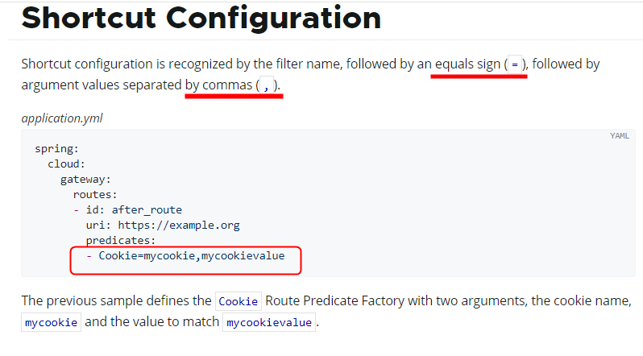
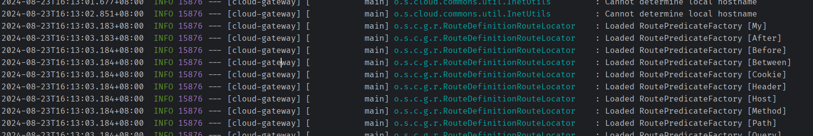
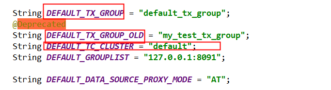

[SpringCloud尚硅谷视频传送门->b站](https://www.bilibili.com/video/BV1gW421P7RD?p=1&vd_source=796ed40051b301bfa3a84ba357f4828c)

# 运行环境要求

| 组件          | 版本         |
| ------------- | ------------ |
| java          | java17+      |
| cloud         | 2023.0.0     |
| boot          | 3.2.0        |
| cloud alibaba | 2022.0.0-RC2 |
| Maven         | 3.9+         |
| Mysql         | 8.0+         |

[前往尚硅谷课程笔记](./note.html)

| 模块                                                         | 用途                                                         |
| :----------------------------------------------------------- | :----------------------------------------------------------- |
| [cloud-provider-payment8001](./cloud-provider-payment8001)   | 微服务提供者支付module模块8001                               |
| [cloud-provider-payment8002](./cloud-provider-payment8002)   | 微服务提供者支付module模块8002                               |
| [cloud-consumer-order80](./cloud-consumer-order80)           | 微服务调用者订单module模块-使用LoadBalancer负载均衡          |
| [cloud-consumer-feign-order80](./cloud-consumer-feign-order80) | 微服务调用者订单module模块-使用OpenFeign负载均衡             |
| [cloud-api-commons](./cloud-api-commons)                     | 对外暴露通用的组件/api/接口/工具类等                         |
| [cloudalibaba-provider-payment9001](./cloudalibaba-provider-payment9001) | 基于nacos的微服务提供者(另拷贝虚拟端口映射为9002测试负载均衡) |
| [cloudalibaba-consumer-nacos-order83](./cloudalibaba-consumer-nacos-order83) | 基于nacos的微服务消费者                                      |
| [cloudalibaba-config-nacos-client3377](./cloudalibaba-config-nacos-client3377) | nacos作为服务配置中心                                        |
| [cloudalibaba-sentinel-service8401](./cloudalibaba-sentinel-service8401) | 整合sentinel                                                 |
| [cloud-gateway9527](./cloud-gateway9527)                     | 网关                                                         |
| [cloudalibaba-sentinel-gateway9528](./cloudalibaba-sentinel-gateway9528) | GateWay和Sentinel集成实现服务限流                            |
| [cloudalibaba-sentinel-service8401](./cloudalibaba-sentinel-service8401) | sentinel                                                     |
| [mybatis_generator2024](./mybatis_generator2024)             | 自动生成实体类mapper的工具模块                               |
| [seata-account-service2003](./seata-account-service2003)     | 分布式事务-账户模块                                          |
| [seata-order-service2001](./seata-order-service2001)         | 分布式事务-订单模块                                          |
| [seata-storage-service2002](./seata-storage-service2002)     | 分布式事务-库存模块                                          |


# Ⅰ. 微服务架构Base工程模块构建

## 一. cloud-provider-payment8001

微服务提供者支付module模块

### 微服务小口诀

建module->改pom->写yml->主启动->业务类

### Swagger3生成接口文档

| 注解           | 标注位置          | 作用                   |
| :------------- | :---------------- | :--------------------- |
| @**Tag**       | controller类      | 标识controller作用     |
| @Parameter     | 参数              | 标识参数的作用         |
| @Parameters    | 参数              | 标识参数的作用         |
| @**Schema**    | model层的JavaBean | 描述模型作用及每个属性 |
| @**Operation** | 方法              | 描述方法的作用         |
| @ApiResponse   | 方法              | 描述响应状态码等       |

含分组迭代的Config配置类

```java
import io.swagger.v3.oas.models.ExternalDocumentation;
import io.swagger.v3.oas.models.OpenAPI;
import io.swagger.v3.oas.models.info.Info;
import org.springdoc.core.models.GroupedOpenApi;
import org.springframework.context.annotation.Bean;
import org.springframework.context.annotation.Configuration;
@Configuration
public class Swagger3Config {
    @Bean
    public GroupedOpenApi PayApi()
    {
        return GroupedOpenApi.builder().group("支付微服务模块").pathsToMatch("/pay/**").build();
    }
    @Bean
    public GroupedOpenApi OtherApi()
    {
        return GroupedOpenApi.builder().group("其它微服务模块").pathsToMatch("/other/**", "/others").build();
    }
    @Bean
    public GroupedOpenApi CustomerApi()
    {
        return GroupedOpenApi.builder().group("客户微服务模块").pathsToMatch("/customer/**", "/customers").build();
    }

    @Bean
    public OpenAPI docsOpenApi()
    {
        return new OpenAPI()
                .info(new Info().title("cloud2024")
                        .description("通用设计rest")
                        .version("v1.0"))
                .externalDocs(new ExternalDocumentation()
                        .description("www.atguigu.com")
                        .url("https://yiyan.baidu.com/"));
    }
}
```

调用方式：[生成的swagger地址](http://localhost:8001/swagger-ui/index.html)
http://localhost:8001/swagger-ui/index.html

## 二. cloud-consumer-order80

微服务调用者订单module模块

### RestTemplate访问远程Http

RestTemplate提供了多种便捷**访问远程Http**服务的方法， 是一种简单便捷的访问restful服务模板类，是Spring提供的用于访问Rest服务的客户端模板工具集

[RestTemplate官网](https://docs.spring.io/spring-framework/docs/6.0.11/javadoc-api/org/springframework/web/client/RestTemplate.html)

使用restTemplate访问restful接口非常的简单粗暴无脑。

(url, requestMap, ResponseBean.class)这三个参数分别代表：REST请求地址、请求参数、HTTP响应转换被转换成的对象类型。


getForObject: 返回对象为响应体中数据转化成的对象，基本上可以理解为Json

getForEntity: 返回对象为ResponseEntity对象，包含了响应中的一些重要信息，比如响应头、响应状态码、响应体等

**get请求方法**

```java
<T> T getForObject(String url, Class<T> responseType, Object... uriVariables);

<T> T getForObject(String url, Class<T> responseType, Map<String, ?> uriVariables);

<T> T getForObject(URI url, Class<T> responseType);

<T> ResponseEntity<T> getForEntity(String url, Class<T> responseType, Object... uriVariables);

<T> ResponseEntity<T> getForEntity(String url, Class<T> responseType, Map<String, ?> uriVariables);

<T> ResponseEntity<T> getForEntity(URI var1, Class<T> responseType);
```

**post请求方法**

```java
<T> T postForObject(String url, @Nullable Object request, Class<T> responseType, Object... uriVariables);

<T> T postForObject(String url, @Nullable Object request, Class<T> responseType, Map<String, ?> uriVariables);

<T> T postForObject(URI url, @Nullable Object request, Class<T> responseType);

<T> ResponseEntity<T> postForEntity(String url, @Nullable Object request, Class<T> responseType, Object... uriVariables);

<T> ResponseEntity<T> postForEntity(String url, @Nullable Object request, Class<T> responseType, Map<String, ?> uriVariables);

<T> ResponseEntity<T> postForEntity(URI url, @Nullable Object request, Class<T> responseType);
```

### 硬编码写死问题

```java
public static final String PaymentSrv_URL = "http://localhost:8001";// 硬编码
```

[解决方式](##硬编码写死问题解决)

## 三. cloud-api-commons

对外暴露通用的组件/api/接口/工具类等

### 工程重构

发现系统中有重复部分，进行**工程重构**，将重复部分写入cloud-api-commons，将其作为对外暴露通用的组件/api/接口/工具类

对cloud-api-commons执行maven命令`clear`、`install`

```html
<!-- 对需要使用cloud-api-commons对外暴露的通用组件/api/接口/工具类的微服务引入自己定义的api通用包 -->
<dependency>
    <groupId>com.xi.cloud</groupId>
    <artifactId>cloud-api-commons</artifactId>
    <version>1.0-SNAPSHOT</version>
</dependency>
```

### 开始引入SpringCloud

微服务所在的IP地址和端口号硬编码到订单微服务中，会存在非常多的问题

1. 如果订单微服务和支付微服务的IP地址或者端口号发生了变化，则支付微服务将变得不可用，需要同步修改订单微服务中调用支付微服务的IP地址和端口号。
2. 如果系统中提供了多个订单微服务和支付微服务，则无法实现微服务的负载均衡功能。
3. 如果系统需要支持更高的并发，需要部署更多的订单微服务和支付微服务，硬编码订单微服务则后续的维护会变得异常复杂。

所以，在微服务开发的过程中，需要引入服务治理功能，实现微服务之间的动态注册与发现，从此刻开始我们**正式进入SpringCloud实战**

# Ⅱ. Consul服务注册与发现

微服务所在的IP地址和端口号硬编码到订单微服务中，会存在非常多的问题

1. 如果订单微服务和支付微服务的IP地址或者端口号发生了变化，则支付微服务将变得不可用，需要同步修改订单微服务中调用支付微服务的IP地址和端口号。
2. 如果系统中提供了多个订单微服务和支付微服务，则无法实现微服务的负载均衡功能。
3. 如果系统需要支持更高的并发，需要部署更多的订单微服务和支付微服务，硬编码订单微服务则后续的维护会变得异常复杂。

所以，在微服务开发的过程中，需要引入服务治理功能，实现微服务之间的动态注册与发现，从此刻开始我们正式进入SpringCloud实战

## consul 简介

[consul官网](https://developer.hashicorp.com/consul/docs)

Consul 是一套开源的**分布式服务发现和配置管理系统**，由 HashiCorp 公司用 Go 语言开发。

提供了微服务系统中的服务治理、配置中心、控制总线等功能。这些功能中的每一个都可以根据需要单独使用，也可以一起使用以构建全方位的服务网格，总之Consul提供了一种完整的服务网格解决方案。它具有很多优点。包括： 基于 raft 协议，比较简洁； 支持健康检查, 同时支持 HTTP 和 DNS 协议 支持跨数据中心的 WAN 集群 提供图形界面 跨平台，支持 Linux、Mac、Windows

[Spring Cloud consul官网](https://spring.io/projects/spring-cloud-consul)

Spring Cloud Consul 功能：

- 服务发现：提供HTTP和DNS两种发现方式
- 健康监测：支持多种方式，HTTP、TCP、Docker、Shell脚本定制
- KV存储：Key、Value的存储方式
- 多数据中心：Consul支持多数据中心

## consul使用

下载consul[Install | Consul | HashiCorp Developer](https://developer.hashicorp.com/consul/install#windows)

安装路径下`consul agent -dev`以开发模式启动

通过http://localhost:8500可以访问Consul的首页

**步骤**

1. pom引入坐标(下方有优化)

   ```html
   <!--SpringCloud consul discovery -->
   <dependency>
       <groupId>org.springframework.cloud</groupId>
       <artifactId>spring-cloud-starter-consul-discovery</artifactId>
   </dependency>
   ```

2. yml
   ```yaml
   spring:
     application:
       name: ???
     ####Spring Cloud Consul for Service Discovery(服务发现)
     cloud:
       consul:
         # 要入驻进的是哪个consul
         host: localhost
         port: 8500
         discovery:
           # 此模块将要以这个名字入驻进Consul
           service-name: ${spring.application.name}
   ```

3. 主启动
   `@EnableDiscoveryClient`: 放在启动类上， 开启服务发现

**启动时出现警告**

启动此服务控制台出现`Standard Commons Logging discovery in action with spring-jcl: please remove commons-logging.jar from classpath in order to avoid potential conflicts`提示，即“使用spring-jcl进行标准Commons日志发现:请从类路径中删除Commons - Logging .jar，以避免潜在的冲突”，可以正常运行，有代码洁癖可以使用以下方法解决

```html
<!--SpringCloud consul discovery -->
<dependency>
    <groupId>org.springframework.cloud</groupId>
    <artifactId>spring-cloud-starter-consul-discovery</artifactId>
    <!-- 排除Commons-Logging.jar，以避免潜在的冲突 -->
    <exclusions>
        <exclusion>
            <groupId>commons-logging</groupId>
            <artifactId>commons-logging</artifactId>
        </exclusion>
    </exclusions>
</dependency>
```

## 硬编码写死问题解决

**原问题**:

```java
public static final String PaymentSrv_URL = "http://localhost:8001";// 硬编码
```

**解决**：

```java
public static final String PaymentSrv_URL = "http://cloud-payment-service";// 入驻进spring cloud consul时8001微服务的名字
```

**但由此引发另一个问题**：`Caused by: java.net.UnknownHostException: cloud-payment-service`，如果通过微服务名称调用，consul默认有负载均衡，后面是多个(一个集群)，因此需要告诉[RestTemplate](###RestTemplate访问远程Http)(远程访问Http)要支持负载均衡

**解决**：
修改RestTemplate的配置类，在构造方法上加`@LoadBalanced`注解，提供RestTemplate(远程访问Http)对负载均衡的支撑

```java
@Configuration// 使用 @Configuration 标记类作为配置类替换 xml 配置文件
public class RestTemplateConfig {
    @Bean
    @LoadBalanced// 提供RestTemplate(远程访问Http)对负载均衡的支撑
    public RestTemplate restTemplate() {
        return new RestTemplate();
    }
}
```

## 三个注册中心异同点

| 组件名    | 语言 | CAP  | 服务健康检查 | 对外暴露接口 | SpriongCloud集成 |
| --------- | ---- | ---- | ------------ | ------------ | ---------------- |
| Eureka    | Java | AP   | 可配支持     | HTTP         | 已集成           |
| Consul    | Go   | CP   | 支持         | HTTP/DNS     | 已集成           |
| Zookeeper | Java | CP   | 支持         | 客户端       | 已集成           |

**CAP**

- C: Consistency（强一致性）
- A: Avaliblity（可用性）
- P: Partition tolerance（分区容错性）

**经典CAP图**

最多只能同时较好的满足两个。

 **CAP理论的核心**：一个分布式系统不可能同时很好的满足一致性，可用性和分区容错性这三个需求，

因此，根据 CAP 原理将 NoSQL 数据库分成了满足 CA 原则、满足 CP 原则和满足 AP 原则三 大类：

- CA - 单点集群，满足一致性，可用性的系统，通常在可扩展性上不太强大。
- CP - 满足一致性，分区容忍必的系统，通常性能不是特别高。
- AP - 满足可用性，分区容忍性的系统，通常可能对一致性要求低一些。


### AP架构


如Eureka，当网络分区出现后，为了保证可用性，系统B**可以返回旧值**，保证系统的可用性。

当数据出现不一致时，虽然A, B上的注册信息不完全相同，但每个Eureka节点依然能够正常对外提供服务，这会出现查询服务信息时如果请求A查不到，但请求B就能查到。如此保证了可用性但牺牲了一致性

**结论**：**违背了一致性**C的要求，只**满足可用性和分区容错**，即AP

### CP架构


如Zookeeper/Consul，当网络分区出现后，为了保证一致性，**就必须拒接请求**，否则无法保证一致性

Consul 遵循CAP原理中的CP原则，保证了强一致性和分区容错性，且使用的是Raft算法，比zookeeper使用的Paxos算法更加简单。虽然保证了强一致性，但是可用性就相应下降了，例如服务注册的时间会稍长一些，因为 Consul 的 raft 协议要求**必须过半数的节点都写入成功才认为注册成功 ；在leader挂掉了之后，重新选举出leader之前会导致Consul 服务不可用**。

**结论**：**违背了可用性**A的要求，只**满足一致性和分区容错**，即CP

## Consul服务的配置与刷新

微服务意味着要将单体应用中的业务拆分成一个个子服务，每个服务的粒度相对较小，因此系统中会出现**大量的服务**。由于**每个服务都需要必要的配置信息**才能运行，**所以一套集中式的、动态的配置管理设施是必不可少的**。

比如某些配置文件中的内容大部分都是相同的，只有个别的配置项不同。就拿数据库配置来说吧，如果每个微服务使用的技术栈都是相同的，则每个微服务中关于数据库的配置几乎都是相同的，有时候主机迁移了，**我希望一次修改，处处生效**。

当下我们每一个微服务自己带着一个application.yml，上百个配置文件的管理....../(ㄒoㄒ)/~~

### 服务配置**步骤**

**需求**

通过全局配置信息，直接注册进Consul服务器，从Consul获取，因此要遵守Consul的配置规则要求

 **步骤**

1. pom
   ```html
   <!--SpringCloud consul config consul配置管理-->
   <dependency>
       <groupId>org.springframework.cloud</groupId>
       <artifactId>spring-cloud-starter-consul-config</artifactId>
   </dependency>
   <dependency>
       <groupId>org.springframework.cloud</groupId>
       <artifactId>spring-cloud-starter-bootstrap</artifactId>
   </dependency>
   ```

2. yml
   [yml配置规则说明](####yml配置规则说明)

   新增bootstrop.yml

   ```yaml
   # 系统级配置
   spring:
     application:
       name: XXX
       ####Spring Cloud Consul for Service Discovery
     cloud:
       consul:
         host: localhost
         port: 8500
         discovery:
           service-name: ${spring.application.name}
         config:
           profile-separator: '-' # 官方默认分隔符为 ","，我们把它更新为 '-'
           format: YAML
   ```

   修改application.yml
   ```yaml
   # 用户级配置
   server:
     port: 8001
   
   # ==========applicationName + druid-mysql8 driver===================
   spring:
     datasource:
       type: com.alibaba.druid.pool.DruidDataSource
       driver-class-name: com.mysql.cj.jdbc.Driver
       url: jdbc:mysql://localhost:3306/db_name?characterEncoding=utf8&useSSL=false&serverTimezone=GMT%2B8&rewriteBatchedStatements=true&allowPublicKeyRetrieval=true
       username: root
       password: password
     profiles:
       active: dev # 多环境配置加载内容dev/prod,不写就是默认default配置
   
   # ========================mybatis===================
   mybatis:
     mapper-locations: classpath:mapper/*.xml
     type-aliases-package: com.xi.cloud.entities
     configuration:
       map-underscore-to-camel-case: true
   ```

3. [Consul服务器key/value配置填写](####Consul服务器key/value配置填写)
   创建文件

   - config/分布式微服务名字/data
   - ​             /分布式微服务名字-dev/data
   - ​             /分布式微服务名字-prod/data

   

4. 

   

#### yml配置规则说明


新增配置文件bootstrop.yml

- bootstrop.yml是什么？
  applicaiton.yml是**用户级**的资源配置项
  bootstrap.yml是**系统级**的，**优先级更加高**

  Spring Cloud会创建一个“Bootstrap Context”，作为Spring应用的`Application Context`的**父上下文**。初始化的时候，`Bootstrap Context`负责从外部源加载配置属性并解析配置。这两个上下文共享一个从外部获取的`Environment`。

  `Bootstrap`属性有高优先级，默认情况下，它们不会被本地配置覆盖。 `Bootstrap context`和`Application Context`有着不同的约定，所以新增了一个`bootstrap.yml`文件，保证`Bootstrap Context`和`Application Context`配置的分离。

   **application.yml文件改为bootstrap.yml,这是很关键的或者两者共存**

  因为bootstrap.yml是比application.yml先加载的。bootstrap.yml优先级高于application.yml

#### Consul服务器key/value配置填写

参考规则

```yaml
# config/分布式微服务名字/data # 不写就是默认default配置
#       /分布式微服务名字-dev/data
#       /分布式微服务名字-prod/data
```

1. 创建config文件夹，以/结尾

   

2. config文件下分别创建三个文件夹，以/结尾
   由于我们配置了`spring: cloud: consul: config: profile-separator: '-' # 官方默认分隔符为 ","，我们把它更新为 '-'`
   所以在config文件夹下创建`分布式微服务名字`、`分布式微服务名字-dev`、`分布式微服务名字-prod`三个文件夹，以/结尾
   

3. 第二步创建的三个文件夹下分别创建data文件(可写入内容)，data不再是文件夹
   

### 动态刷新步骤

主启动类上加上`@RefreshScope`注解，可以在服务器配置变更时自动刷新 默认间隔为55s后自动刷新

可修改配置文件`spring.cloud.consul.config.watch.tait-time: ?`?为秒数，修改间隔时间

## 引出问题

Consul重启后consul里的配置消失了

由此我们需要做Consul的配置持久化

[LoadBalancer解决Consul持久化](###LoadBalancer之Consul持久化)

# Ⅲ.LoadBalancer负载均衡服务调用

前身是Ribbon目前已进入维护模式

Spring Cloud Ribbon是基于Netflix Ribbon实现的一套**客户端    负载均衡**的工具。

简单的说，Ribbon是Netflix发布的开源项目，主要功能是**提供客户端的软件负载均衡算法和服务调用**。Ribbon客户端组件提供一系列完善的配置项如连接超时，重试等。简单的说，就是在配置文件中列出Load Balancer（简称LB）后面所有的机器，Ribbon会自动的帮助你基于某种规则（如简单轮询，随机连接等）去连接这些机器。我们很容易使用Ribbon实现自定义的负载均衡算法。

Ribbon未来替换方案：**spring-cloud-loadbalancer**

[spring-cloud-loadbalancer官网](https://docs.spring.io/spring-cloud-commons/docs/current/reference/html/#spring-cloud-loadbalancer)

## spring-cloud-loadbalancer是什么

**LB负载均衡(Load Balance)是什么**

简单的说就是将用户的请求平摊的分配到多个服务上，从而达到系统的HA（高可用），常见的负载均衡有软件Nginx，LVS，硬件 F5等

**spring-cloud-starter-loadbalancer组件是什么**

Spring Cloud LoadBalancer是由SpringCloud官方提供的一个开源的、简单易用的**客户端负载均衡器**，它包含在SpringCloud-commons中**用它来替换了以前的Ribbon组件**。相比较于Ribbon，SpringCloud LoadBalancer不仅能够支持RestTemplate，还支持WebClient（WeClient是Spring Web Flux中提供的功能，可以实现响应式异步请求）

## loadBalancer负载均衡

### 客户端和服务器端负载均衡的区别

loadbalancer本地负载均衡客户端和Nginx服务端负载均衡区别

- Nginx是**服务器负载均衡**，客户端所有请求都会交给nginx，然后由**nginx实现转发请求**，即负载均衡是由服务端实现的。
- loadbalancer**本地负载均衡**，在调用微服务接口时候，会在**注册中心上获取注册信息服务列表之后缓存到JVM本地**，从而在**本地实现RPC远程服务调用技术**。

### 负载均衡案例

#### 理论

80通过轮询负载访问8001、8002、8003


LoadBalancer 在工作时分成两步：

- **第一步**，先选择ConsulServer从服务端查询并拉取服务列表，知道了它有多个服务(上图3个服务)，这3个实现是完全一样的，默认轮询调用谁都可以正常执行。类似生活中求医挂号，某个科室今日出诊的全部医生，客户端你自己选一个。
- **第二步**，按照指定的负载均衡策略从server取到的服务注册列表中由客户端自己选择一个地址，所以LoadBalancer是一个**客户端的**负载均衡器。

#### 实操

1. 启动Consul，将8001、8002启动后注册进微服务

2. 订单80模块(客户端，消费者侧)**修改POM**并注册进consul**新增LoadBalancer组件**
   ```html
   <!--loadbalancer-->
   <dependency>
       <groupId>org.springframework.cloud</groupId>
       <artifactId>spring-cloud-starter-loadbalancer</artifactId>
   </dependency>
   ```

3. 修改Controller进行测试

   ```java
   @GetMapping(value = "/consumer/pay/get/info")
   private String getInfoByConsul() {
       // PaymentSrv_URL是注册进consul中的微服务名字(同一微服务名可能有多个不同端口的相同微服务)
       return restTemplate.getForObject(PaymentSrv_URL + "/pay/get/info", String.class);
   }
   ```

4. 发现交替访问8001、8002

### 负载均衡算法

默认**轮询**： $rest接口第几次请求数 \% 服务器集群总数量 = 实际调用服务器位置下标$ ，每次服务重启动后rest接口计数从1开始。

`List<ServiceInstance> instances = discoveryClient.getInstances("cloud-payment-service");`

如：` List [0] instances = 127.0.0.1:8002`

　　`　List [1] instances = 127.0.0.1:8001`

8001+ 8002 组合成为集群，它们共计2台机器，集群总数为2， 按照**轮询算法**原理：

- 当总请求数为1时： 1 % 2 =1 对应下标位置为1 ，则获得服务地址为127.0.0.1:8001
- 当总请求数位2时： 2 % 2 =0 对应下标位置为0 ，则获得服务地址为127.0.0.1:8002
- 当总请求数位3时： 3 % 2 =1 对应下标位置为1 ，则获得服务地址为127.0.0.1:8001
- 当总请求数位4时： 4 % 2 =0 对应下标位置为0 ，则获得服务地址为127.0.0.1:8002
- 如此类推......

默认有两种算法 轮询和随机，一般来说轮询就够用了

**修改负载均衡算法**

```java
@Configuration// 使用 @Configuration 标记类作为配置类替换 xml 配置文件
@LoadBalancerClient(value = "cloud-payment-service",configuration = RestTemplateConfig.class)// @LoadBalancerClient 将要对value这个微服务执行实现新的RestTemplate配置 这个配置在configuration这个类中      value值大小写一定要和consul里面的名字一样，必须一样       不使用这个注解默认为轮询
public class RestTemplateConfig {
    @Bean
    @LoadBalanced //使用@LoadBalanced注解赋予RestTemplate负载均衡的能力 提供RestTemplate(远程访问Http)对负载均衡的支撑
    public RestTemplate restTemplate(){
        return new RestTemplate();
    }

    /**
     * 默认轮询 加此方法，修改为了随机
     * @param environment
     * @param loadBalancerClientFactory
     * @return
     */
    @Bean    ReactorLoadBalancer<ServiceInstance> randomLoadBalancer(Environment environment,
                                                           LoadBalancerClientFactory loadBalancerClientFactory) {
        String name = environment.getProperty(LoadBalancerClientFactory.PROPERTY_NAME);

        return new RandomLoadBalancer(loadBalancerClientFactory.getLazyProvider(name, ServiceInstanceListSupplier.class), name);
    }
}
```

## LoadBalancer之Consul持久化

Consul数据持久化配置，并且注册为Windows服务

1. consul下载目录下新建空文件夹`mydata`和`consul_start.bat`文件

2. `consul_start.bat`内容信息

   ```bash
   @echo.服务启动......  
   @echo off  
   @sc create Consul binpath= "D:\devSoft\consul_1.17.0_windows_386\consul.exe agent -server -ui -bind=127.0.0.1 -client=0.0.0.0 -bootstrap-expect  1  -data-dir D:\devSoft\consul_1.17.0_windows_386\mydata   "
   @net start Consul
   @sc config Consul start= AUTO  
   @echo.Consul start is OK......success
   @pause
   ```

   - `@sc create Consul binpath= "Consul安装路径\consul.exe agent -server(以服务器后台形式启动) -ui -bind=127.0.0.1(绑定本机) -client=0.0.0.0 -bootstrap-expect  1  -data-dir consul的配置数据存储路径"`
   - `@sc config Consul start= AUTO (是否每次开机启动) `

3. 右键管理员权限打开

4. 后续consul的配置数据会保存进mydata文件夹

这样每次开机都会自动启动consul服务

# Ⅳ. OpenFeign服务接口调用

## Spring Cloud OpenFeign

**OpenFeign默认集成了LoadBalancer负载均衡功能**

Feign是一个**声明性web服务客户端**。它使编写web服务客户端变得更容易。**使用Feign创建一个接口并对其进行注释**。它具有可插入的注释支持，包括Feign注释和JAX-RS注释。Feign还支持可插拔编码器和解码器。Spring Cloud添加了对Spring MVC注释的支持，以及对使用Spring Web中默认使用的HttpMessageConverter的支持。Spring Cloud集成了Eureka、Spring Cloud CircuitBreaker以及Spring Cloud LoadBalancer，以便在使用Feign时提供负载平衡的http客户端。

**OpenFeign是一个声明式的Web服务客户端，只需创建一个Rest接口，并在该接口上添加注解`@FeignClient`即可**

OpenFeign基本上就是当前微服务之间调用的事实标准

**OpenFeign功能**

1. 可插拔的注解支持，包括Feign注解和JAX-RS注解
2. 支持可插拔的HTTP编码器和解码器
3. 支持Sentinel和它的Fallback
4. 支持SpringCloudLoadBalancer的负载均衡
5. 支持HTTP请求和响应的压缩

前面在使用**SpringCloud LoadBalancer**+RestTemplate时，利用RestTemplate对http请求的封装处理形成了一套模版化的调用方法。

**但是在实际开发中**，由于对服务依赖的调用可能不止一处，**往往一个接口会被多处调用，所以通常都会针对每个微服务自行封装一些客户端类来包装这些依赖服务的调用**。所以，OpenFeign在此基础上做了进一步封装，由他来帮助我们定义和实现依赖服务接口的定义。在OpenFeign的实现下，**我们只需创建一个接口并使用注解的方式来配置它(在一个微服务接口上面标注一个`@FeignClient`注解即可)**，即可完成对服务提供方的接口绑定，统一对外暴露可以被调用的接口方法，大大简化和降低了调用客户端的开发量，也即由服务提供者给出调用接口清单，消费者直接通过OpenFeign调用即可。

**OpenFeign同时还集成SpringCloud LoadBalancer**
可以在使用OpenFeign时提供Http客户端的负载均衡，也可以集成阿里巴巴Sentinel来提供熔断、降级等功能。而与SpringCloud LoadBalancer不同的是，**通过OpenFeign只需要定义服务绑定接口且以声明式的方法**，优雅而简单的实现了服务调用。

## OpenFeign通用步骤

OpenFeign默认集成了LoadBalancer负载均衡功能

微服务Api接口+`@FeignClient`注解标签


服务消费者80 → 调用含有@FeignClient注解的Api服务接口 → 服务提供者(8001/8002)

**流程步骤**

修改客户端

- pom

  ```html
  <!--openfeign-->
  <dependency>
      <groupId>org.springframework.cloud</groupId>
      <artifactId>spring-cloud-starter-openfeign</artifactId>
  </dependency>
  ```

- yml
  ```yaml
  server:
    port: XX
  spring:
    application:
      name: XXX
    ####Spring Cloud Consul for Service Discovery(服务发现)
    cloud:
      consul:
        host: localhost
        port: 8500
        discovery:
          # 80将要以这个名字入驻进Consul
          prefer-agent-address: true # 是否优先使用ip进行注册
          service-name: ${spring.application.name}
  ```

- 启动类

  ```java
  @SpringBootApplication
  @EnableDiscoveryClient // 该注解用于向使用consul为注册中心时注册服务
  @EnableFeignClients// 启用feign客户端,定义服务+绑定接口，以声明式的方法优雅而简单的实现服务调用
  ```

业务类
订单模块要去调用支付模块，订单和支付两个微服务，需要通过Api接口解耦，一般不要在订单模块写非订单相关的业务。
自己的业务自己做 + 其它模块走FeignApi接口调用

**修改对外暴露的通用模块**

- 引入pom
  ```html
  <!--openfeign-->
  <dependency>
      <groupId>org.springframework.cloud</groupId>
      <artifactId>spring-cloud-starter-openfeign</artifactId>
  </dependency>
  ```

- 新建服务接口`PayFeignApi`，头上配置`@FeignClient`注解
  ```java
  @FeignClient("注册进consul中的微服务名")
  public interface PayFeignApi
  ```

- 参考微服务8001的Controller层，新建PayFeignApi中的接口
  

- Controller
  ```java
  @RestController
  @Slf4j
  public class OrderController
  {
      @Resource
      private PayFeignApi payFeignApi;
  
      @PostMapping("/feign/pay/add")
      public ResultData addOrder(@RequestBody PayDTO payDTO) {
          System.out.println("第一步：模拟本地addOrder新增订单成功(省略sql操作)，第二步：再开启addPay支付微服务远程调用");
          ResultData resultData = payFeignApi.addPay(payDTO);
          return resultData;
      }
  }
  ```

## OpenFeign高级特性

配置类:

```java
@Configuration
public class FeignConfig {

    /**
     * OpenFeign配置重试机制bean
     * @return
     */
    @Bean
    public Retryer myRetryer() {
//        return Retryer.NEVER_RETRY; //Feign默认配置是不走重试策略的

        //修改最大请求次数为3(1初始次数+2重复次数)，初始间隔时间为100ms，重试间最大间隔时间为1s
        return new Retryer.Default(100,1,3);
    }

    /**
     * OpenFeign配置日志bean
     * @return
     */
    @Bean
    Logger.Level feignLoggerLevel() {
        return Logger.Level.FULL;
    }
}
```

yml:

```yaml
spring:
  cloud:
    openfeign:
      client:
        config:
#          default: # 全局通用配置
#            #连接超时时间
#            connectTimeout: 3000
#            #读取超时时间
#            readTimeout: 3000
          cloud-payment-service: # 全局通用配置
            #连接超时时间
            connectTimeout: 3000
            #读取超时时间
            readTimeout: 3000
      httpclient:
        hc5:
          enabled: true # 启用httpclient5提升性能. OpenFeign使用 Apache HttpClient 5 替换OpenFeign默认的HttpURLConnection 以提升性能
      compression: # 请求回应压缩
        request: # 请求
          enabled: true # 开启请求压缩功能
          min-request-size: 2048 # 最小触发压缩的大小
          mime-types: text/xml,application/xml,application/json # 触发压缩数据类型
        response: # 响应
          enabled: true # 开启响应压缩功能

# logging.level + 含有@FeignClient注解的完整带包名的接口名+debug级别
# feign日志以什么级别监控哪个接口(OpenFeign对外暴露服务功能清单的接口)
logging:
  level:
    com:
      xi:
        cloud:
          apis:
            # 日志级别:
            #- `NONE`：默认的，不显示任何日志；
            #- `BASIC`：仅记录请求方法、URL、响应状态码及执行时间；
            #- `HEADERS`：除了 `BASIC` 中定义的信息之外，还有请求和响应的头信息；
            #- `FULL`：除了 `HEADERS` 中定义的信息之外，还有请求和响应的正文及元数据。
            PayFeignApi: debug
```


### OpenFeign之超时控制

默认OpenFeign客户端等待60秒钟，但是服务端处理超过规定时间会导致Feign客户端返回报错。

为了避免这样的情况，有时候我们需要设置Feign客户端的超时控制，默认60秒太长或者业务时间太短都不好

**yml文件中开启配置**：

全局配置方式：

```yaml
spring:
 cloud:
  openfeign:
   client:
    config:
     default: # 全局通用配置
      connectTimeout: ??? # 连接超时时间
      readTimeout: ??? # 请求处理超时时间
```

指定配置方式：

```yaml
spring:
 cloud:
  openfeign:
   client:
    config:
     cloud-payment-service: # 调用此微服务的配置
      connectTimeout: ??? # 连接超时时间
      readTimeout: ??? # 请求处理超时时间
```

注：当全局和指定配置都有时，以更细致(指定)的为准

### OpenFeign之重试机制

默认重试机制是关闭的，给了默认值。

默认情况下会创建Retryer.NEVER_RETRY类型为Retryer的bean,这将禁用重试。
请注意，这种重试行为与Feign默认行为不同，它会自动重试 IOExceptions,.将它们视为与网络相关的瞬态异常，以及从ErrorDecoder抛出的任何RetryableException

**修改重试机制：**

```java
@Configuration
public class FeignConfig {
   /**
    * OpenFeign配置重试机制bean
    * 该方法写入OpenFeign的配置类中
    * @return
    */
    @Bean
    public Retryer myRetryer() {
        //return Retryer.NEVER_RETRY; //Feign默认配置是不走重试策略的

        //最大请求次数为3(1初始次数+2重复次数)，初始间隔时间为100ms，重试间最大间隔时间为1s
        return new Retryer.Default(100,1,3);
    }
}
```

以上配置目前控制台没有看到3次重试过程，只看到结果，**正常的，正确的**，是feign的日志打印问题

### OpenFeign之性能优化HttpClient5

PpenFeign中http client 如果不做特殊配置，**OpenFeign默认使用**JDK自带的**HttpURLConnection**发送HTTP请求，由于默认HttpURLConnection没有连接池、**性能和效率比较低**，如果采用默认，性能上不是最牛B的。

**所以使用Apache HttpClient 5** 替换OpenFeign默认的HttpURLConnection 以**提升性能**。

**步骤**

1. pom
   ```html
   <!-- Apache HttpClient 5 替换OpenFeign默认的HttpURLConnection 以提升性能 -->
   <!-- httpclient5-->
   <dependency>
       <groupId>org.apache.httpcomponents.client5</groupId>
       <artifactId>httpclient5</artifactId>
       <version>5.3</version>
   </dependency>
   <!-- feign-hc5-->
   <dependency>
       <groupId>io.github.openfeign</groupId>
       <artifactId>feign-hc5</artifactId>
       <version>13.1</version>
   </dependency>
   ```

2. yml
   ```yaml
   #  Apache HttpClient5 配置开启
   spring:
     cloud:
       openfeign:
         httpclient:
           hc5:
             enabled: true
   ```

### OpenFeign请求回应压缩

**对请求和响应进行GZIP压缩**

Spring Cloud OpenFeign支持对请求和响应进行GZIP压缩，以**减少通信过程中的性能损耗**。

通过下面的两个参数设置，就能**开启请求与相应的压缩功能**：

```yaml
spring:
 cloud:
  openfeign:
   compression: # 压缩
    request: # 请求
     enabled: true # 开启请求压缩
    response: # 响应
     enabled: true # 开启响应压缩
```

**细粒度化设置**

对请求压缩做一些更细致的设置，比如下面的配置内容指定压缩的请求数据类型并设置了请求压缩的大小下限，

只有超过这个大小的请求才会进行压缩：

```yaml
spring:
 cloud:
  openfeign:
   compression:
    request:
     enabled: true # 开启请求压缩
     mime-types: text/xml,application/xml,application/json #触发压缩数据类型
     min-request-size: 2048 #最小触发压缩的大小
```

### OpenFeign日志打印功能

Feign 提供了日志打印功能，我们可以通过配置来调整日志级别，从而了解 Feign 中 Http 请求的细节，说白了就是**对Feign接口的调用情况进行监控和输出**

**日志级别：**

- `NONE`：默认的，不显示任何日志；
- `BASIC`：仅记录请求方法、URL、响应状态码及执行时间；
- `HEADERS`：除了 `BASIC` 中定义的信息之外，还有请求和响应的头信息；
- `FULL`：除了 `HEADERS` 中定义的信息之外，还有请求和响应的正文及元数据。

**步骤**

1. 配置日志bean
   ```java
   /**
     * OpenFeign配置日志bean
     * 该方法写入OpenFeign的配置类中
     * @return
     */
   @Bean
   Logger.Level feignLoggerLevel() {
       return Logger.Level.FULL;// 返回需要的日志级别
   }
   ```

2. yml里配置需要开启日志的feign客户端
   ```yaml
   # logging.level + 含有@FeignClient注解的完整带包名的接口名+debug级别
   # feign日志以什么级别监控哪个接口(OpenFeign对外暴露服务功能清单的接口)
   logging:
     level:
       com:
         xi:
           cloud:
             apis:
               PayFeignApi: debug 
   ```

# Ⅴ.CircuitBreaker断路器

## 概述

### 问题

***上一任Hystrix：***

Hystrix是一个用于处理分布式系统的延迟和容错的开源库，在分布式系统里，许多依赖不可避免的会调用失败，比如超时、异常等，Hystrix能够保证在一个依赖出问题的情况下，不会导致整体服务失败，避免级联故障，以提高分布式系统的弹性。目前已进入维护状态。未来将使用Resilience4j替代。

***分布式系统面临的问题：***

复杂分布式体系结构中的应用程序有数十个依赖关系，每个依赖关系在某些时候将不可避免地失败。

***服务雪崩：***

多个微服务之间调用的时候，假设微服务A调用微服务B和微服务C，微服务B和微服务C又调用其它的微服务，这就是所谓的“扇出”。如果扇出的链路上某个微服务的调用响应时间过长或者不可用，对微服务A的调用就会占用越来越多的系统资源，进而引起系统崩溃，所谓的“雪崩效应”

对于高流量的应用来说，单一的后端依赖可能会导致所有服务器上的所有资源都在几秒钟内饱和。比失败更糟糕的是，这些应用程序还可能导致服务之间的延迟增加，备份队列，线程和其他系统资源紧张，导致整个系统发生更多的级联故障。这些都表示需要对故障和延迟进行隔离和管理，以便单个依赖关系的失败，不能取消整个应用程序或系统。

所以，通常当你发现**一个模块下的某个实例失败后，这时候这个模块依然还会接收流量，然后这个有问题的模块还调用了其他的模块，这样就会发生级联故障，或者叫雪崩。**

### 诉求

***问题：***

禁止服务雪崩故障

***解决：*** 

- 有问题的节点，快速熔断（快速返回失败处理或者返回默认兜底数据【服务降级】）。

“断路器”本身是一种开关装置，当某个服务单元发生故障之后，通过断路器的故障监控（类似熔断保险丝），**向调用方返回一个符合预期的、可处理的备选响应(FallBack)，而不是长时间的等待或者抛出调用方无法处理的异常**，这样就保证了服务调用方的线程不会被长时间、不必要地占用，从而避免了故障在分布式系统中的蔓延，乃至雪崩。

一句话，**出故障了“保险丝”跳闸，别把整个家给烧了，😄**

### 功能

- 服务熔断
  类比保险丝，保险丝闭合状态(CLOSE)可以正常使用，当达到最大服务访问后，直接拒绝访问跳闸限电(OPEN),此刻调用方会接受服务降级的处理并返回友好兜底提示，就是家里保险丝，从闭合CLOSE供电状态→跳闸OPEN打开状态
- 服务降级
  服务器忙，请稍后再试。不让客户端等待并立刻返回一个友好提示，fallback
- 服务限流
  秒杀高并发等操作，严禁一窝蜂的过来拥挤，大家排队，一秒钟N个，有序进行
- 服务限时
- 服务预热
- 接近实时的监控
- 兜底的处理动作
- ……

### CircuitBreaker

[Spring Cloud Circuit Breaker官网](https://spring.io/projects/spring-cloud-circuitbreaker)

CircuitBreaker的目的是保护分布式系统免受故障和异常，提高系统的可用性和健壮性。

当一个组件或服务出现故障时，CircuitBreaker会迅速切换到开放OPEN状态(保险丝跳闸断电)，阻止请求发送到该组件或服务从而避免更多的请求发送到该组件或服务。这可以减少对该组件或服务的负载，防止该组件或服务进一步崩溃，并使整个系统能够继续正常运行。同时，CircuitBreaker还可以提高系统的可用性和健壮性，因为它可以在分布式系统的各个组件之间自动切换，从而避免单点故障的问题。

**CircuitBreaker只是一套规范和接口，落地实现者是Resilience4j**

### Resilience4j

**是什么**

Resilience4j是一个专为函数式编程设计的**轻量级容错库**。Resilience4j提供高阶函数（装饰器），以通过断路器、速率限制器、重试或隔板增强任何功接口、lambda表达式或方法引用。您可以在任何函数式接口、lambda表达式或方法引用上堆叠多个装饰器。优点是您可以选择您需要的装饰器，而没有其他选择。 Resilience4j2需要Java17。

概述

Resilience4j提供了几个核心模块：

- **resilience4j-Circuitbreaker: 断路**
- **resilience4j-ratelimiter: 速率限制**
- **resilience4j-bulkhead: 舱壁**
- resilience4j-retry: 自动重试（同步和异步）
- resilience4j-timelimiter: 超时处理
- resilience4j-cache: 结果缓存
- 还有用于指标、Feign、Kotlin、Spring、Ratpack、Vertx、RxJava2等的附加模块。

## 熔断(CircuitBreaker)(服务熔断+服务降级)

断路器(CircuitBreaker)

### 断路器三大状态

断路器有三个普通状态：**关闭**(CLOSED)、**开启**(OPEN)、**半开**(HALF_OPEN)，还有两个特殊状态：**禁用**(DISABLED、**强制开启**(FORCED_OPEN)

当熔断器关闭时，所有的请求都会通过熔断器。。

- 如果**失败率超过设定的阈值**，熔断器就会从关闭状态**转换到打开状态**，这时**所有的请求都会被拒绝**。
- 当经过**一段时间后**，熔断器会从打开状态转换到半开状态，这时**仅有一定数量的请求会被放入**，并**重新计算失败率**。
- 如果**失败率超过阈值**，则变为**打开**状态；
  如果**失败率低于阈值**，则变为**关闭**状态。

断路器使用滑动窗口来存储和统计调用的结果。你可以选择**基于调用数量的滑动窗口**或者**基于时间的滑动窗口**。

- 基于访问数量的滑动窗口统计了**最近N次**调用的返回结果。
- 居于时间的滑动窗口统计了**最近N秒**的调用回结果。

除此以外，熔断器还会有两种特殊状态：DISABLED(始终允许访问)和FORCED_OPEN(始终拒绝访问)。

- 这两个状态不会生成熔断器事件（除状态装换外），并且不会记录事件的成功或者失败。
- 退出这两个状态的唯一方法是触发状态转换或者重置熔断器。

### 断路器所有配置参数参考

[Resilience4j-Guides-Chinese/中文文档](https://github.com/lmhmhl/Resilience4j-Guides-Chinese/blob/main/core-modules/CircuitBreaker.md)

| 配置                                         | 默认值                                      |含义|
| -------------------------------------------- | ------------------------------------------------------------ | ------------------------------------------------------------ |
| failure-rate-threshold                       | 50                     | 以百分比配置失败率峰值                                       |
| sliding-window-type                          | COUNT_BASED            | 断路器的滑动窗口期类型 可以基于“次数”（COUNT_BASED）或者“时间”（TIME_BASED）进行熔断，默认是COUNT_BASED。 |
| sliding-window-size                          | 100                       | 若COUNT_BASED，则10次调用中有50%失败（即5次）打开熔断断路器；若为TIME_BASED则，此时还有额外的两个设置属性，含义为：在N秒内（sliding-window-size）100%（slow-call-rate-threshold）的请求超过N秒（slow-call-duration-threshold）打开断路器。 |
| slowCallRateThreshold                        | 100            | 以百分比的方式配置，断路器把调用时间大于slowCallDurationThreshold的调用视为慢调用，当慢调用比例大于等于峰值时，断路器开启，并进入服务降级。 |
| slowCallDurationThreshold                    | 60000[ms]           | 配置调用时间的峰值，高于该峰值的视为慢调用。                 |
| permitted-number-of-calls-in-half-open-state | 10 | 运行断路器在HALF_OPEN状态下时进行N次调用，如果故障或慢速调用仍然高于阈值，断路器再次进入打开状态。 |
| minimum-number-of-calls                      | 100                   | 在每个滑动窗口期样本数，配置断路器计算错误率或者慢调用率的最小调用数。比如设置为5意味着，在计算故障率之前，必须至少调用5次。如果只记录了4次，即使4次都失败了，断路器也不会进入到打开状态。 |
| wait-duration-in-open-state                  | 60000[ms]         | 从OPEN到HALF_OPEN状态需要等待的时间                          |

### 断路器流程


**断路器开启或关闭的条件**

1. 当满足一定的峰值和失败率达到一定条件后，断路器将会进入OPEN状态（保险丝跳闸），服务熔断
2. 当OPEN的时候，所有请求都不会调用主业务逻辑方法，而是直接走fallbackmetnod!兜底背锅方法，服务降级
3. 一段时间之后，这个时候断路器会从OPEN进入到HALF_OPEN半开状态，会放几个请求过去探探链路是否通？如成功，断路器会关闭CLOSE(类似保险丝闭合，恢复可用)；如失败，继续开启。重复上述

**基于计数器的滑动窗口**

- 6次访问中当执行方法的失败率达到50%时CircuitBreaker将进入开启OPEN**状态**(保险丝跳闸断电)拒绝所有请求。
- 等待**5**秒后，CircuitBreaker 将自动从开启OPEN状态过渡到半开HALF_OPEN状态，允许一些请求通过以测试服务是否恢复正常。
- 如还是异常CircuitBreaker 将重新进入开启OPEN状态；如正常将进入关闭CLOSE闭合状态恢复正常处理请求。

**基于时间的滑动窗口**

基于时间的滑动窗口是通过有N个桶的环形数组实现。

- 如果滑动窗门的大小为10秒，这个环形数组总是有10个桶，每个桶统计了在这一秒发生的所有调用的结果（部分统计结果)，数组中的第一个桶存储了当前这一秒内的所有调用的结果，其他的桶存储了之前每秒调用的结果。
- 滑动窗口不会单独存储所有的调用结果，而是对每个桶内的统计结果和总的统计值进行增量的更新，当新的调用结果被记录时，总的统计值会进行增量更新。
- 检索快照（总的统计值）的时间复杂度为0()，因为快照已经预先统计好了，并且和滑动窗口大小无关
- 关于此方法实现的空间需求（内存消耗）约等于0)。由于每次调用结果（元组）不会被单独存储，只是对N个桶进行单独统计和一次总分的统计。
- 每个桶在进行部分统计时存在三个整型，为了计算，失败调用数，慢调用数，总调用数。还有一个long类型变量，存储所有调用的响应时间。、

建议不要混合用，推荐按照调用次数count_based。

### 步骤

pom

```html
<!--resilience4j-circuitbreaker服务熔断降级-->
<dependency>
    <groupId>org.springframework.cloud</groupId>
    <artifactId>spring-cloud-starter-circuitbreaker-resilience4j</artifactId>
</dependency>
<!-- 由于断路保护等需要AOP实现，所以必须导入AOP包 -->
<dependency>
    <groupId>org.springframework.boot</groupId>
    <artifactId>spring-boot-starter-aop</artifactId>
</dependency>
```

yml
①基于计数器的滑动窗口案例

```yaml
spring:
 cloud:
  openfeign:
   # 开启circuitbreaker和分组激活 spring.cloud.openfeign.circuitbreaker.enabled
   circuitbreaker: # 断路器
    enabled: true # 开启断路器
    group:
     enabled: true #没开分组永远不用分组的配置。精确优先、分组次之(开了分组)、默认最后
     
 # Resilience4j CircuitBreaker 按照次数：COUNT_BASED 的例子
#  6次访问中当执行方法的失败率达到50%时CircuitBreaker将进入开启OPEN状态(保险丝跳闸断电)拒绝所有请求。
#  等待5秒后，CircuitBreaker 将自动从开启OPEN状态过渡到半开HALF_OPEN状态，允许一些请求通过以测试服务是否恢复正常。
#  如还是异常CircuitBreaker 将重新进入开启OPEN状态；如正常将进入关闭CLOSE闭合状态恢复正常处理请求。
resilience4j:
  circuitbreaker:
    configs:
      default: # default配置
        failureRateThreshold: 50 #设置50%的调用失败时打开断路器，超过失败请求百分⽐CircuitBreaker变为OPEN(跳闸)状态。
        slidingWindowType: COUNT_BASED # 滑动窗口的类型 按计数器统计
        slidingWindowSize: 6 #滑动窗⼝的⼤⼩配置COUNT_BASED表示6个请求，配置TIME_BASED时表示6秒
        minimumNumberOfCalls: 6 #断路器计算失败率或慢调用率之前所需的最小样本(每个滑动窗口周期)。如果minimumNumberOfCalls为10，则必须最少记录10个样本，然后才能计算失败率。如果只记录了9次调用，即使所有9次调用都失败，断路器也不会开启。
        automaticTransitionFromOpenToHalfOpenEnabled: true # 是否启用自动从开启状态过渡到半开状态，默认值为true。如果启用，CircuitBreaker将自动从开启状态过渡到半开状态，并允许一些请求通过以测试服务是否恢复正常
        waitDurationInOpenState: 5s #从OPEN到HALF_OPEN状态需要等待的时间
        permittedNumberOfCallsInHalfOpenState: 2 #半开状态允许的最大请求数，默认值为10。在半开状态下，CircuitBreaker将允许最多permittedNumberOfCallsInHalfOpenState个请求通过，如果其中有任何一个请求失败，CircuitBreaker将重新进入开启状态。
        recordExceptions: # 只要报这个异常 就进入服务熔断
          - java.lang.Exception
    instances: # 实例
      cloud-payment-service: # 微服务名
        baseConfig: default # 指定default配置
```

②基于时间的滑动窗口案例

```yaml
spring:
 cloud:
  openfeign:
   # 开启circuitbreaker和分组激活 spring.cloud.openfeign.circuitbreaker.enabled
   circuitbreaker: # 断路器
    enabled: true # 开启断路器
    group:
     enabled: true #没开分组永远不用分组的配置。精确优先、分组次之(开了分组)、默认最后

# Resilience4j CircuitBreaker 按照时间：TIME_BASED 的例子
resilience4j:
  timelimiter: # 时间限制器
    configs:
      default:
        timeout-duration: 10s #神坑的位置，timelimiter 默认限制远程1s，超于1s就超时异常，配置了降级，就走降级逻辑
  circuitbreaker: # 断路器
    configs:
      default: # default配置
        failureRateThreshold: 50 #设置50%的调用失败时打开断路器，超过失败请求百分⽐CircuitBreaker变为OPEN状态。
        slowCallDurationThreshold: 2s #慢调用时间阈值，高于这个阈值的视为慢调用并增加慢调用比例。
        slowCallRateThreshold: 30 #慢调用百分比峰值，断路器把调用时间⼤于slowCallDurationThreshold，视为慢调用，当慢调用比例高于阈值，断路器打开，并开启服务降级
        slidingWindowType: TIME_BASED # 滑动窗口的类型
        slidingWindowSize: 2 #滑动窗口的大小配置，配置TIME_BASED表示2秒
        minimumNumberOfCalls: 2 #断路器计算失败率或慢调用率之前所需的最小样本(每个滑动窗口周期)。
        permittedNumberOfCallsInHalfOpenState: 2 #半开状态允许的最大请求数，默认值为10。
        waitDurationInOpenState: 5s #从OPEN到HALF_OPEN状态需要等待的时间
        recordExceptions: # 只要报这个异常 就进入服务熔断
          - java.lang.Exception
    instances:  # 实例
      cloud-payment-service: # 微服务名
        baseConfig: default # 指定default配置
```

controller演示

```java
@RestController
public class OrderCircuitController {
    @Resource
    private PayFeignApi payFeignApi;

    @GetMapping(value = "/feign/pay/circuit/{id}")
    @CircuitBreaker(name = "cloud-payment-service", fallbackMethod = "myCircuitFallback")// 保险丝注解，name=要调用的微服务名字 fallbackMethod=出问题时兜底的服务降级的方法
    public String myCircuitBreaker(@PathVariable("id") Integer id) {
        // 正常调用 调用远程feign 异常时走fallbackMethod中的方法
        return payFeignApi.myCircuit(id);
    }

    //myCircuitFallback就是服务降级后的兜底处理方法
    public String myCircuitFallback(Integer id,Throwable t) {
        // 这里是容错处理逻辑，返回备用结果
        return "myCircuitFallback (服务降级)，系统繁忙，请稍后再试-----/(ㄒoㄒ)/~~";
    }
}
```

## 隔离(BulkHead)

### 概述

**是什么：**

- bulkhead(船的)舱壁/(飞机的)隔板
  隔板来自造船行业，床仓内部一般会分成很多小隔舱，一旦一个隔舱漏水因为隔板的存在而不至于影响其它隔舱和整体船。

[Resilience4j-Guides-bulkhead中文文档](https://github.com/lmhmhl/Resilience4j-Guides-Chinese/blob/main/core-modules/bulkhead.md)

**作用：**用于限并发

- 依赖隔离&负载保护：用来限制对于下游服务的最大并发数量的限制
- 基本上就是我们JUC信号灯内容的同样思想

Resilience4**提供了如下两种隔离的实现方式**，可以限制并发执行的数量

- 信号量舱壁（实现SemaphoreBulkhead）
- 固定线程舱壁（实现FixedThreadPoolBulkhead）

### 信号量舱壁（SemaphoreBulkhead）

#### 原理

- 当信号量有空闲时，进入系统的请求会直接获取信号量并开始业务处理。
- 当信号量全被占用时，接下来的请求将会进入阻塞状态，SemaphoreBulkhead提供了一个阻塞计时器。
- 如果阻塞状态的请求在阻塞计时内无法获取到信号量则系统会拒绝这些请求。
- 若请求在阻塞计时内获取到了信号量，那将直接获取信号量并执行相应的业务处理。

#### 步骤

1. pom
   ```html
   <!--resilience4j-bulkhead-->
   <dependency>
       <groupId>io.github.resilience4j</groupId>
       <artifactId>resilience4j-bulkhead</artifactId>
   </dependency>
   ```

2. yml
   ```yaml
   spring:
    cloud:
     #开启circuitbreaker和分组激活
     circuitbreaker:
      enabled: true
      group:
       enabled: true #没开分组永远不用分组的配置。精确优先、分组次之(开了分组)、默认最后
       
   ####resilience4j bulkhead 舱壁隔离的例子
   resilience4j:
    bulkhead: # 舱壁
     configs:
       default:
        maxConcurrentCalls: 2 # 隔离允许并发线程执行的最大数量 默认25
        maxWaitDuration: 1s # 当达到并发调用数量时，新的线程的阻塞时间，我只愿意等待1秒，过时不候进舱壁兜底fallback 默认0s
     instances: # 实例
      cloud-payment-service: # 微服务名
       baseConfig: default # 指定default配置
    timelimiter: # 时间限制器
     configs:
      default:
       timeout-duration: 20s # 神坑的位置，timelimiter 默认限制远程1s，超于1s就超时异常，配置了降级，就走降级逻辑
   ```

3. 业务类
   `@Bulkhead(name = "远程调用的微服务名字",fallbackMethod = "舱壁隔离后的兜底处理方法",type = Bulkhead.Type.EMAPHORE(隔离类型)`

   ```java
   /**
    *(船的)舱壁,隔离
    * @param id
    * @return
    */
   @GetMapping(value = "/feign/pay/bulkhead/{id}")
   @Bulkhead(name = "cloud-payment-service",fallbackMethod = "myBulkheadFallback",type = Bulkhead.Type.SEMAPHORE)
   public String myBulkhead(@PathVariable("id") Integer id)
   {
       return payFeignApi.myBulkhead(id);
   }
   public String myBulkheadFallback(Throwable t)
   {
       return "myBulkheadFallback，隔板超出最大数量限制，系统繁忙，请稍后再试-----/(ㄒoㄒ)/~~";
   }
   ```

本地测试步骤

- 浏览器新打开2个窗口，各点一次，分别点击http://localhost/feign/pay/bulkhead/9999
- 每个请求调用需要耗时5秒，2个线程瞬间达到配置过的最大并发数2
- 此时第3个请求正常的请求访问，http://localhost/feign/pay/bulkhead/3
- 直接被舱壁限制隔离了，碰不到8001

### 固定线程池舱壁（FixedThreadPoolBulkhead）

#### 原理

FixedThreadPoolBulkhead的功能与SemaphoreBulkhead一样也是**用于限制并发执行的次数**的，但是二者的实现原理存在差别而且表现效果也存在细微的差别。FixedThreadPoolBulkhead**使用一个固定线程池和一个等待队列来实现舱壁。**

- 当线程池中存在空闲时，则此时进入系统的请求将直接进入线程池开启新线程或使用空闲线程来处理请求。
- 当线程池中无空闲时时，接下来的请求将进入等待队列，
  -   若等待队列仍然无剩余空间时接下来的请求将直接被拒绝
  -   在队列中的请求等待线程池出现空闲时，将进入线程池进行业务处理。

另外：ThreadPoolBulkhead只对CompletableFuture方法有效，所以我们必创建返回CompletableFuture类型的方法

#### 步骤

1. pom
   ```html
   <!--resilience4j-bulkhead-->
   <dependency>
       <groupId>io.github.resilience4j</groupId>
       <artifactId>resilience4j-bulkhead</artifactId>
   </dependency>
   ```

2. yml
   ```yaml
   ####resilience4j bulkhead -THREADPOOL的例子
   resilience4j:
     timelimiter:
       configs:
         default:
           timeout-duration: 10s #timelimiter默认限制远程1s，超过报错不好演示效果所以加上10秒
     # 由于ThreadPoolBulkhead只对CompletableFuture方法有效，而CompletableFuture使用线程池是新启一个
     # spring.cloud.openfeign.circuitbreaker.group.enabled 请设置为false 新启线程和原来主线程脱离
     thread-pool-bulkhead:
       configs:
         default:
           core-thread-pool-size: 1 # 核心的
           max-thread-pool-size: 1 # 最大的 max-thread-pool-size 包含core-thread-pool-size 所以两个线程就满了
           queue-capacity: 1 # 队列 # max-thread-pool-size + ueue-capacity = 2， 1个在max + 1个在队列，第三个来报错
       instances:
         cloud-payment-service:
           baseConfig: default
   ```

3. 业务类
   ```java
   /**
     *(船的)舱壁,隔离 type = Bulkhead.Type.THREADPOOL 固定线程池舱壁
     * ThreadPoolBulkhead只对CompletableFuture方法有效,而CompletableFuture必须新开一个线程
     * @param id
     * @return CompletableFuture 必须返回CompletableFuture
     */
   @GetMapping(value = "/feign/pay/bulkhead/{id}")
   @Bulkhead(name = "cloud-payment-service",fallbackMethod = "myBulkheadPoolFallback",type = Bulkhead.Type.THREADPOOL)// THREADPOOL：线程池
   public CompletableFuture<String> myBulkhead(@PathVariable("id") Integer id) {
       System.out.println(Thread.currentThread().getName()+"\t"+"-----开始进入");
       try {
           TimeUnit.SECONDS.sleep(3);
       } catch (InterruptedException e) {
           throw new RuntimeException(e);
       }
       System.out.println(Thread.currentThread().getName()+"\t"+"-----准备离开");
       return CompletableFuture.supplyAsync(() -> payFeignApi.myBulkhead(id) + "\t" + "Bulkhead.Type.THREADPOOL固定线程池壁");
   }
   //myBulkheadPoolFallback就是舱壁隔离后的兜底处理方法
   public CompletableFuture<String> myBulkheadPoolFallback(Integer id, Throwable t) {
       return CompletableFuture.supplyAsync(() -> "Bulkhead.Type.THREADPOOL固定线程池壁，系统繁忙，请稍后再试-----/(ㄒoㄒ)/~~");
   }
   ```

## 限流(RateLimiter)

### 概述

[Resilience4j-Guides-ratelimiter中文官网](https://github.com/lmhmhl/Resilience4j-Guides-Chinese/blob/main/core-modules/ratelimiter.md)

限流 就是限制最大访问流量。系统能提供的最大并发是有限的，同时来的请求又太多，就需要限流。 

比如商城秒杀业务，瞬时大量请求涌入，服务器忙不过就只好排队限流了，和去景点排队买票和去医院办理业务排队等号道理相同。

所谓限流，就是通过对并发访问/请求进行限速，或者对一个时间窗口内的请求进行限速，以保护应用系统，一旦达到限制速率则可以拒绝服务、排队或等待、降级等处理。

### 常见限流算法

#### 漏桶算法

**概念：**
一个固定容量的漏桶，按照设定常量固定速率流出水滴，类似医院打吊针，不管你源头流量多大，我设定匀速流出。 如果流入水滴超出了桶的容量，则流入的水滴将会溢出了(被丢弃)，而漏桶容量是不变的。


**缺点**：
这里有两个变量，一个是桶的大小，支持流量突发增多时可以存多少的水（burst），另一个是水桶漏洞的大小（rate）。因为漏桶的漏出速率是固定的参数，所以，即使网络中不存在资源冲突（没有发生拥塞），漏桶算法也不能使流突发（burst）到端口速率。因此，漏桶算法**对于存在突发特性的流量来说缺乏效率**。


#### 令牌桶算法

类似哈尔滨冰雪大世界     载具类比令牌


SpringCloud默认使用该算法

#### 滚动时间窗(tumbling time window)

允许固定数量的请求进入(比如1秒取4个数据相加[每个值代表一个人的请求次数]，超过25值就over)超过数量就拒绝或者排队，等下一个时间段进入。

由于是在一个时间间隔内进行限制，如果用户在上个时间间隔结束前请求（**但没有超过限制**），同时在当前时间间隔刚开始请求（**同样没超过限制**），在各自的时间间隔内，这些请求都是正常的。下图统计了3次，but......

 

**缺点：**
间隔临界的一段时间内的请求就会超过系统限制，可能导致系统被压垮

**由于计数器算法存在时间临界点缺陷，因此在时间临界点左右的极短时间段内容易遭到攻击。**


假如设定1分钟最多可以请求100次某个接口，如12:00:00-12:00:59时间段内没有数据请求但12:00:59-12:01:00时间段内突然并发100次请求，紧接着瞬间跨入下一个计数周期计数器清零；在12:01:00-12:01:01内又有100次请求。那么也就是说在时间临界点左右可能同时有2倍的峰值进行请求，从而造成后台处理请求**加倍过载**的bug，导致系统运营能力不足，甚至导致系统崩溃，/(ㄒoㄒ)/~~

#### 滑动时间窗口（sliding time window）

顾名思义，该时间窗口是滑动的。所以，从概念上讲，这里有两个方面的概念需要理解： 

- 窗口：需要定义窗口的大小(比如时间或者次数)
- 滑动：需要定义在窗口中滑动的大小，但理论上讲滑动的大小不能超过窗口大小

滑动窗口算法是把固定时间片进行划分并且随着时间移动，移动方式为开始时间点变为时间列表中的第2个时间点，结束时间点增加一个时间点

不断重复，通过这种方式可以巧妙的避开计数器的临界点的问题。下图统计了5次


### 步骤

pom

```html
<!--resilience4j-ratelimiter 限流-->
<dependency>
    <groupId>io.github.resilience4j</groupId>
    <artifactId>resilience4j-ratelimiter</artifactId>
</dependency>
```

yml

```yaml
####resilience4j ratelimiter 限流的例子
resilience4j:
  ratelimiter:
    configs:
      default:
        limitForPeriod: 2 #在一次刷新周期内，允许执行的最大请求数
        limitRefreshPeriod: 1s # 限流器每隔limitRefreshPeriod刷新一次，将允许处理的最大请求数量重置为limitForPeriod
        timeout-duration: 1 # 线程等待权限的默认等待时间
    instances:
        cloud-payment-service:
          baseConfig: default
```

业务类

```java
@GetMapping(value = "/feign/pay/ratelimit/{id}")
@RateLimiter(name = "cloud-payment-service",fallbackMethod = "myRatelimitFallback")
public String myRatelimit(@PathVariable("id") Integer id) {
    return payFeignApi.myRatelimit(id);
}
public String myRatelimitFallback(Integer id,Throwable t) {
    return "你被限流了，禁止访问/(ㄒoㄒ)/~~";
}
```

测试

刷新`http://localhost/feign/pay/ratelimit/11`地址，正常后F5按钮狂刷一会儿，停止刷新看到被限流的效果

# Ⅵ. Sleuth(Micrometer)+ZipKin分布式链路追踪

## 概述

Sleuth停止维护，Spring Cloud Sleuth不适用于Spring Boot3.x及以上版本。Sleuth支持的最后一个Spring Boot主要版本是2.x;
新一代替换者是Micrometer Tracing，新一代Spring Cloud Sleuth: Micrometer

在微服务框架中，一个由客户端发起的请求在后端系统中会经过多个不同的的服务节点调用来协同产生最后的请求结果，每一个前段请求都会形成一条复杂的分布式服务调用链路，链路中的任何一环出现高延时或错误都会引起整个请求最后的失败。

在分布式与微服务场景下，我们需要解决如下**问题**：

- 在大规模分布式与微服务集群下，如何实时观测系统的整体调用链路情况。
- 在大规模分布式与微服务集群下，如何快速发现并定位到问题。
- 在大规模分布式与微服务集群下，如何尽可能精确的判断故障对系统的影响范围与影响程度。
- 在大规模分布式与微服务集群下，如何尽可能精确的梳理出服务之间的依赖关系，并判断出服务之间的依赖关系是否合理。
- 在大规模分布式与微服务集群下，如何尽可能精确的分析整个系统调用链路的性能与瓶颈点。
- 在大规模分布式与微服务集群下，如何尽可能精确的分析系统的存储瓶颈与容量规划。

上述问题就是我们的落地议题答案：

分布式链路追踪技术要解决的问题，分布式链路追踪（Distributed Tracing），就是将一次分布式请求还原成调用链路，进行日志记录，性能监控并将一次分布式请求的调用情况集中展示。比如各个服务节点上的耗时、请求具体到达哪台机器上、每个服务节点的请求状态等等。

## 新一代Spring Cloud Sleuth：Micrometer

Spring Cloud Sleuth(micrometer)提供了一套完整的分布式链路追踪(Distributed Tracing)解决方案且兼容支持了zipkin展现

将一次分布式请求还原成调用链路，进行日志记录和性能监控，并将一次分布式请求的调用情况集中web展示

**行内比较成熟的其他分布式链路追踪技术解决方案：**

| 技术           | 说明                                                         |
| -------------- | ------------------------------------------------------------ |
| Cat            | 由大众点评开源，基于开发的实时应用监控平台，包括实时应用监控，业务监控。集成方案是通过代码埋 点的方式来实现监控，比如：拦载器，过滤器等。对代码的侵入性很大，集成成本较高。风险较大。 |
| ZipKin         | 由Twitter公司开源，开放源代码分布式的跟踪系统，用于收集服务的定时数据，以解决微服务架构中的延迟问题，包括：数据的收集、存储、查找和展现。结合spring-cloud-sleuth使用较为简单，集成方便，但是功能较简单。 |
| Pinpoint       | Pinpoint是一款开源的基于字节码注入的调用链分析，以及应用监控分析工具。特点是支持多种插件，UI功能强大，接入端无代码侵入。 |
| **Skywalking** | SkyWalking是国人开源的基于字节码注入的调用链分析，以及应用监控分析工具。特点是支持多种插件，U功能较强，接入端无代码侵入。 |

##  原理

假定三个微服务调用的链路如下图所示：Service 1 调用 Service 2，Service 2 调用 Service 3 和 Service 4。


那么**一条链路追踪会在每个服务调用的时候加上Trace ID (全局id)和 Span ID(每次请求发出的ID)**

- Trace ID: 链路通过TraceId唯一标识
- Span ID: Span标识发起的请求信息，各span通过parent id 关联起来 (Span:表示调用链路来源，通俗的理解span就是一次请求信息)


**上图的精简版：**

一条链路通过Trace Id唯一标识，Span标识发起的请求信息，各span通过parent id 关联起来


1. 第一个节点：Span ID = A，Parent ID = null，Service 1 接收到请求。
2. 第二个节点：Span ID = B，Parent ID= A，Service 1 发送请求到 Service 2 返回响应给Service 1 的过程。
3. 第三个节点：Span ID = C，Parent ID= B，Service 2 的 中间解决过程。
4. 第四个节点：Span ID = D，Parent ID= C，Service 2 发送请求到 Service 3 返回响应给Service 2 的过程。
5. 第五个节点：Span ID = E，Parent ID= D，Service 3 的中间解决过程。
6. 第六个节点：Span ID = F，Parent ID= C，Service 3 发送请求到 Service 4 返回响应给 Service 3 的过程。
7. 第七个节点：Span ID = G，Parent ID= F，Service 4 的中间解决过程。
8. 通过 Parent ID 就可找到父节点，整个链路即可以进行跟踪追溯了。

## ZipKin图形化的工具

### 介绍

Zipkin是一种**分布式链路跟踪系统图形化的工具**，Zipkin 是 Twitter 开源的分布式跟踪系统，能够收集微服务运行过程中的实时调用链路信息，并能够将**这些调用链路信息展示到Web图形化界面上**供开发人员分析，开发人员能够从ZipKin中分析出调用链路中的性能瓶颈，识别出存在问题的应用程序，进而定位问题和解决问题。

### 产生

当没有配置 Sleuth 链路追踪的时候，INFO 信息里面是 [passjava-question,,,]，后面跟着三个空字符串。

当配置了 Sleuth 链路追踪的时候，追踪到的信息是 [passjava-question,504a5360ca906016,e55ff064b3941956,false] ，第一个是 Trace ID，第二个是 Span ID。**只有日志没有图，观看不方便，不美观，so，**引入图形化Zipkin链路监控让你好看，O(∩_∩)O

### 起步

[Quickstart · OpenZipkin下载](https://zipkin.io/pages/quickstart.html)

运行jar包`java -jar xxx.jar`

http://localhost:9411/zipkin/

## Micrometer+ZipKin搭建链路监控

### 分工

- Micrometer：数据采样
- ZipKin：图形展示

### 步骤

#### 总体父工程

pom

```html
<properties>
    <micrometer-tracing.version>1.2.0</micrometer-tracing.version>
    <micrometer-observation.version>1.12.0</micrometer-observation.version>
    <feign-micrometer.version>12.5</feign-micrometer.version>
    <zipkin-reporter-brave.version>2.17.0</zipkin-reporter-brave.version>
</properties>

<!--micrometer-tracing-bom导入链路追踪版本中心  1-->
<dependency>
    <groupId>io.micrometer</groupId>
    <artifactId>micrometer-tracing-bom</artifactId>
    <version>${micrometer-tracing.version}</version>
    <type>pom</type>
    <scope>import</scope>
</dependency>
<!--micrometer-tracing指标追踪  2-->
<dependency>
    <groupId>io.micrometer</groupId>
    <artifactId>micrometer-tracing</artifactId>
    <version>${micrometer-tracing.version}</version>
</dependency>
<!--micrometer-tracing-bridge-brave适配zipkin的桥接包 3-->
<dependency>
    <groupId>io.micrometer</groupId>
    <artifactId>micrometer-tracing-bridge-brave</artifactId>
    <version>${micrometer-tracing.version}</version>
</dependency>
<!--micrometer-observation 4-->
<dependency>
    <groupId>io.micrometer</groupId>
    <artifactId>micrometer-observation</artifactId>
    <version>${micrometer-observation.version}</version>
</dependency>
<!--feign-micrometer 5-->
<dependency>
    <groupId>io.github.openfeign</groupId>
    <artifactId>feign-micrometer</artifactId>
    <version>${feign-micrometer.version}</version>
</dependency>
<!--zipkin-reporter-brave 6-->
<dependency>
    <groupId>io.zipkin.reporter2</groupId>
    <artifactId>zipkin-reporter-brave</artifactId>
    <version>${zipkin-reporter-brave.version}</version>
</dependency>
```

由于Micrometer Tracing是一个门面工具自身并没有实现完整的链路追踪系统，具体的链路追踪另外需要引入的是第三方链路追踪系统的依赖

| 序号 | 引入模块                        | 用途                                                         |
| ---- | ------------------------------- | ------------------------------------------------------------ |
| 1    | micrometer-tracing-bom          | 导入链路追踪版本中心，体系化说明                             |
| 2    | micrometer-tracing              | 指标追踪                                                     |
| 3    | micrometer-tracing-bridge-brave | 一个Micrometer模块，用于与分布式跟踪工具 Brave 集成，以收集应用程序的分布式跟踪数据。Brave是一个开源的分布式跟踪工具，它可以帮助用户在分布式系统中跟踪请求的流转，它使用一种称为"跟踪上下文"的机制，将请求的跟踪信息存储在请求的头部，然后将请求传递给下一个服务。在整个请求链中，Brave会将每个服务处理请求的时间和其他信息存储到跟踪数据中，以便用户可以了解整个请求的路径和性能。 |
| 4    | micrometer-observation          | 一个基于度量库 Micrometer的观测模块，用于收集应用程序的度量数据。 |
| 5    | feign-micrometer                | 一个Feign HTTP客户端的Micrometer模块，用于收集客户端请求的度量数据。 |
| 6    | zipkin-reporter-brave           | 一个用于将 Brave 跟踪数据报告到Zipkin 跟踪系统的库。         |

#### 微服务提供者8001

pom

```html
<!--micrometer链路追踪监控-->
<!--micrometer-tracing指标追踪  1-->
<dependency>
    <groupId>io.micrometer</groupId>
    <artifactId>micrometer-tracing</artifactId>
</dependency>
<!--micrometer-tracing-bridge-brave适配zipkin的桥接包 2-->
<dependency>
    <groupId>io.micrometer</groupId>
    <artifactId>micrometer-tracing-bridge-brave</artifactId>
</dependency>
<!--micrometer-observation 3-->
<dependency>
    <groupId>io.micrometer</groupId>
    <artifactId>micrometer-observation</artifactId>
</dependency>
<!--feign-micrometer 4-->
<dependency>
    <groupId>io.github.openfeign</groupId>
    <artifactId>feign-micrometer</artifactId>
</dependency>
<!--zipkin-reporter-brave 5-->
<dependency>
    <groupId>io.zipkin.reporter2</groupId>
    <artifactId>zipkin-reporter-brave</artifactId>
</dependency>
```

yml

```yaml
# ========================zipkin分布式链路跟踪系统图形化工具===================
management:
  zipkin:
    tracing:
      endpoint: http://localhost:9411/api/v2/spans
  tracing:
    sampling:
      probability: 1.0 #采样率百分比 采样率默认为0.1(0.1就是10次只能有一次被记录下来)，值越大收集越及时。
```

业务类

```java
@RestController
public class PayMicrometerController {
    /**
     * Micrometer(Sleuth)进行链路监控的例子
     * @param id
     * @return
     */
    @GetMapping(value = "/pay/micrometer/{id}")
    public String myMicrometer(@PathVariable("id") Integer id) {
        return "Hello, 欢迎到来myMicrometer inputId:  "+id+" \t    服务返回:" + IdUtil.simpleUUID();
    }
}
```

#### 用于对外暴露的feignApi接口

```java
/**
  * Micrometer(Sleuth)进行链路监控的例子
  * @param id
  * @return
  */
@GetMapping(value = "/pay/micrometer/{id}")
public String myMicrometer(@PathVariable("id") Integer id);
```

#### 服务调用者80

```html
<!--micrometer-tracing指标追踪  1-->
<dependency>
    <groupId>io.micrometer</groupId>
    <artifactId>micrometer-tracing</artifactId>
</dependency>
<!--micrometer-tracing-bridge-brave适配zipkin的桥接包 2-->
<dependency>
    <groupId>io.micrometer</groupId>
    <artifactId>micrometer-tracing-bridge-brave</artifactId>
</dependency>
<!--micrometer-observation 3-->
<dependency>
    <groupId>io.micrometer</groupId>
    <artifactId>micrometer-observation</artifactId>
</dependency>
<!--feign-micrometer 4-->
<dependency>
    <groupId>io.github.openfeign</groupId>
    <artifactId>feign-micrometer</artifactId>
</dependency>
<!--zipkin-reporter-brave 5-->
<dependency>
    <groupId>io.zipkin.reporter2</groupId>
    <artifactId>zipkin-reporter-brave</artifactId>
</dependency>
```

yml

```yaml
# zipkin图形展现地址和采样率设置
management:
  zipkin:
    tracing:
      endpoint: http://localhost:9411/api/v2/spans
  tracing:
    sampling:
      probability: 1.0 #采样率默认为0.1(0.1就是10次只能有一次被记录下来)，值越大收集越及时。
```

### 测试

本次案例默认已经成功启动ZipKin

依次启动8001/80两个微服务并注册进入Consul

测试地址 http://localhost/feign/micrometer/1

查看zipkin http://localhost:9411/

# Ⅶ. Gateway网关

## Gataway概述

**介绍**

Gateway是在Spring生态系统之上构建的API网关服务，基于Spring6，Spring Boot 3和Project Reactor等技术。它旨在为微服务架构提供一种简单有效的**统一的 API 路由管理方式**，并为它们提供跨领域的关注点，例如：安全性、监控/度量和恢复能力。

[Spring Cloud Gateway官网](https://docs.spring.io/spring-cloud-gateway/docs/current/reference/html/)

**体系定位**

Cloud全家桶中有个很重要的组件就是网关，在1.x版本中都是采用的Zuul网关；但在2.x版本中，zuul的升级一直跳票，SpringCloud最后自己研发了一个网关SpringCloud Gateway替代Zuul，那就是SpringCloud Gateway

一句话：**gateway是原zuul1.x版的替代**


**微服务架构中网关的位置：**


**Gateway网关的功能**

- 反向代理
- 鉴权
- 流量控制
- 熔断
- 日志监控

**总结**

Spring Cloud Gateway组件的**核心是一系列的过滤器**，通过这些过滤器可以将客户端发送的请求转发(路由)到对应的微服务。 Spring Cloud Gateway是加在整个微服务**最前沿的防火墙和代理器**，隐藏微服务结点IP端口信息，从而加强安全保护。
Spring Cloud Gateway**本身也是一个微服务**，需要注册进服务注册中心。


## Gateway三大核心

1. Route(路由)
   路由是构建网关的基本模块，它由ID、目标URL、一系列的断言和过滤器组成，如果断言为true则匹配该路由
2. Predicate(断言)
   参考的是Java8的java.util.function.Predicate
   开发人员可以匹配HTTP请求中的所有内容（例如请求头或请求参数），**如果请求与断言相匹配则进行路由**
3. Filter(过滤)
   指的是Spring框架中GatewayFilter的实例，使用过滤器，可以在请求被路由前或者之后对请求进行修改。

web前端请求，通过一些匹配条件，定位到真正的服务节点。并在这个转发过程的前后，进行一些精细化控制。
predicate就是我们的匹配条件；
filter，就可以理解为一个无所不能的拦截器。有了这两个元素，再加上目标uri，就可以实现一个具体的路由了


## Gateway工作流程

核心逻辑：**路由转发+断言判断+执行过滤器链**


客户端向 Spring Cloud Gateway 发出请求。然后在 Gateway Handler Mapping 中找到与请求相匹配的路由，将其发送到 Gateway Web Handler。Handler 再通过指定的过滤器链来将请求发送到我们实际的服务执行业务逻辑，然后返回。

过滤器之间用虚线分开是因为过滤器可能会在发送代理请求之前(Pre)或之后(Post)执行业务逻辑。

在“pre”类型的过滤器可以做参数校验、权限校验、流量监控、日志输出、协议转换等;

在“post”类型的过滤器中可以做响应内容、响应头的修改，日志的输出，流量监控等有着非常重要的作用。

## 入门配置

建model

改pom：
```html
<!--gateway-->
<dependency>
    <groupId>org.springframework.cloud</groupId>
    <artifactId>spring-cloud-starter-gateway</artifactId>
</dependency>
```

```html
<?xml version="1.0" encoding="UTF-8"?>
<project xmlns="http://maven.apache.org/POM/4.0.0"
         xmlns:xsi="http://www.w3.org/2001/XMLSchema-instance"
         xsi:schemaLocation="http://maven.apache.org/POM/4.0.0 http://maven.apache.org/xsd/maven-4.0.0.xsd">
    <modelVersion>4.0.0</modelVersion>
    <parent>
        <groupId>com.atguigu.cloud</groupId>
        <artifactId>mscloudV5</artifactId>
        <version>1.0-SNAPSHOT</version>
    </parent>

    <artifactId>cloud-gateway9527</artifactId>

    <properties>
        <maven.compiler.source>17</maven.compiler.source>
        <maven.compiler.target>17</maven.compiler.target>
        <project.build.sourceEncoding>UTF-8</project.build.sourceEncoding>
    </properties>


    <dependencies>
        <!--gateway-->
        <dependency>
            <groupId>org.springframework.cloud</groupId>
            <artifactId>spring-cloud-starter-gateway</artifactId>
        </dependency>
        <!--服务注册发现consul discovery,网关也要注册进服务注册中心统一管控-->
        <dependency>
            <groupId>org.springframework.cloud</groupId>
            <artifactId>spring-cloud-starter-consul-discovery</artifactId>
        </dependency>
        <!-- 指标监控健康检查的actuator,网关是响应式编程删除掉spring-boot-starter-web dependency-->
        <dependency>
            <groupId>org.springframework.boot</groupId>
            <artifactId>spring-boot-starter-actuator</artifactId>
        </dependency>
    </dependencies>

    <build>
        <plugins>
            <plugin>
                <groupId>org.springframework.boot</groupId>
                <artifactId>spring-boot-maven-plugin</artifactId>
            </plugin>
        </plugins>
    </build>
</project>
```

写yml：

```yaml
server:
  port: 9527

spring:
  application:
    name: cloud-gateway #以微服务注册进consul或nacos服务列表内
  cloud:
    consul: #配置consul地址
      host: localhost
      port: 8500
      discovery:
        prefer-ip-address: true
        service-name: ${spring.application.name}
```

主启动：

```java
@SpringBootApplication
@EnableDiscoveryClient //服务注册和发现   spring cloud consul 服务发现
public class Main9527 {
    public static void main(String[] args) {
        SpringApplication.run(Main9527.class,args);
    }
}
```

业务类：无，不写任何业务代码，网关和业务无关

测试：

1. 先启动8500服务中心Consul
2. 再启动9527网关入驻进Consul

## 路由映射

诉求：我们目前不想暴露8001瑞口，希望在8001真正的支付微服务外面套一层9527网关

### 修改

8001新增Controller

```java
@RestController
public class PayGateWayController {
    @Resource
    PayService payService;

    @GetMapping(value = "/pay/gateway/get/{id}")
    public ResultData<Pay> getById(@PathVariable("id") Integer id) {
        Pay pay = payService.getById(id);
        return ResultData.success(pay);
    }

    @GetMapping(value = "/pay/gateway/info")
    public ResultData<String> getGatewayInfo() {
        return ResultData.success("gateway info test："+ IdUtil.simpleUUID());
    }
}
```

网关yml新增配置
```yaml
spring:
  cloud
	gateway: # 网关
      routes: # 路由
        - id: pay_routh1 #pay_routh1                #路由的ID(类似mysql主键ID)，没有固定规则但要求唯一，建议配合服务名
          uri: http://localhost:8001                #匹配后提供服务的路由地址
          predicates:
            - Path=/pay/gateway/get/**              # 断言，路径相匹配的进行路由

        - id: pay_routh2 #pay_routh2                #路由的ID(类似mysql主键ID)，没有固定规则但要求唯一，建议配合服务名
          uri: http://localhost:8001                #匹配后提供服务的路由地址
          predicates:
            - Path=/pay/gateway/info/**              # 断言，路径相匹配的进行路由
```

### 测试9527→8001

测试9527网关→8001微服务提供者

1. 启动Consul8500服务
2. 启动8001支付
3. 启动9527网关
4. 访问说明
   - 添加网管前
     - http://localhost:8001/pay/gateway/get/1
     - http://localhost:8001/pay/gateway/info
   - 隐真示假，映射说明
     
   - 添加网关后
     - http://localhost:9527/pay/gateway/get/1
     - http://localhost:9527/pay/gateway/info

### 测试80→9527→8001

测试80微服务消费者→9527网关→8001微服务提供者

#### 测试error

我们启动80订单微服务，它从Consul注册中心通过微服务名称找到8001支付微服务进行调用，

80 → 9527 → 8001

**要求访问9527网关后才能访问8001，如果我们此时启动80订单，可以做到吗？**


修改cloud-api-commons的PayFeignApi接口
```java
 /**
   * GateWay进行网关测试案例01
   * @param id
   * @return
   */
@GetMapping(value = "/pay/gateway/get/{id}")
public ResultData getById(@PathVariable("id") Integer id);

/**
  * GateWay进行网关测试案例02
  * @return
  */
@GetMapping(value = "/pay/gateway/info")
public ResultData<String> getGatewayInfo();
```

新建OrderGateWayController

```java
@RestController
public class OrderGateWayController {
    @Resource
    private PayFeignApi payFeignApi;

    @GetMapping(value = "/feign/pay/gateway/get/{id}")
    public ResultData getById(@PathVariable("id") Integer id) {
        return payFeignApi.getById(id);
    }

    @GetMapping(value = "/feign/pay/gateway/info")
    public ResultData<String> getGatewayInfo() {
        return payFeignApi.getGatewayInfo();
    }
}
```

网关开启 测试通过

- http://localhost/feign/pay/gateway/get/1
- http://localhost/feign/pay/gateway/info

网关开启 测试通过

- http://localhost/feign/pay/gateway/get/1
- http://localhost/feign/pay/gateway/info

结论：9527网管是否启动，毫无影响，目前的配置来看，**网关被绕开了**

#### 测试success

**同一家公司自己人，系统内环境，直接找微服务**

```java
@FeignClient(value = "cloud-payment-service")//自己人内部，自己访问自己，写微服务名字OK
public interface PayFeignApi {
    /**
     * GateWay进行网关测试案例01
     * @param id
     * @return
     */
    @GetMapping(value = "/pay/gateway/get/{id}")
    public ResultData getById(@PathVariable("id") Integer id);

    /**
     * GateWay进行网关测试案例02
     * @return
     */
    @GetMapping(value = "/pay/gateway/info")
    public ResultData<String> getGatewayInfo();
}
```

**不同家公司有外人，系统外访问，先找网关再服务**

```java
@FeignClient("cloud-gateway")
//@FeignClient("cloud-payment-service")
public interface PayFeignApi {
    /**
     * GateWay进行网关测试案例01
     * @param id
     * @return
     */
    @GetMapping(value = "/pay/gateway/get/{id}")
    public ResultData getById(@PathVariable("id") Integer id);

    /**
     * GateWay进行网关测试案例02
     * @return
     */
    @GetMapping(value = "/pay/gateway/info")
    public ResultData<String> getGatewayInfo();
}
```

1. 刷新feign接口jar包
2. 重启80订单微服务
3. 有网关正常success
4. 无网关异常

**还有问题**

网关9527，yml映射写死问题，[解决](###Route以微服务名动态获取服务URI)


## Gateway高级特性

### 一. Route以微服务名动态获取服务URI

**痛点：**网关9527，yml映射写死问题，端口变更死翘翘

**是什么：**

**网关修改配置：**

```yaml
server:
  port: 9527

spring:
  application:
    name: cloud-gateway #以微服务注册进consul或nacos服务列表内
  cloud:
    consul: #配置consul地址
      host: localhost
      port: 8500
      discovery:
        prefer-ip-address: true
        service-name: ${spring.application.name}
    gateway:
      routes:
        - id: pay_routh1 #pay_routh1                #路由的ID(类似mysql主键ID)，没有固定规则但要求唯一，建议配合服务名
          #uri: http://localhost:8001                #匹配后提供服务的路由地址 映射写死，端口变更死翘翘
          uri: lb://cloud-payment-service          #匹配后提供服务的路由地址  lb(负载均衡)
          predicates: # 断言
            - Path=/pay/gateway/get/**              # 断言，路径相匹配的进行路由

        - id: pay_routh2 #pay_routh2                #路由的ID(类似mysql主键ID)，没有固定规则但要求唯一，建议配合服务名
          #uri: http://localhost:8001                #匹配后提供服务的路由地址 映射写死，端口变更死翘翘
          uri: lb://cloud-payment-service                #匹配后提供服务的路由地址  lb(负载均衡)
          predicates: # 断言
            - Path=/pay/gateway/info/**              # 断言，路径相匹配的进行路由
```

**测试**

1. 测试1 success
   重启网关9527,80/8001保持不变，http://localhost/feign/pay/gateway/get/1
2. 测试2 success
   如果将8001微服务yml文件**端口修改**为8007，照样访问我实际启动的程序是main8001但是端口名改为8007
   我们依据微服务名字，匹配查找即可 uri:1b://cloud-payment-service，http://localhost/feign/pay/gateway/get/1

### 二. Predicate断言(谓词)

#### 断言介绍

Spring Cloud Gateway将路由匹配作为Spring WebFlux HandlerMapping基础架构的一部分。 

Spring Cloud Gateway包括许多内置的Route Predicate工厂。所有这些Predicate都与HTTP请求的不同属性匹配。多个 Route Predicate.工厂可以进行组合 

Spring Cloud Gateway创建Route对象时，使用RoutePredicateFactory创建Predicate对象，Predicate对象可以赋值给 Route。Spring Cloud Gateway包含许多内置的Route Predicate Factories。所有这些谓词都匹配HTTP请求的不同属性。**多种谓词工厂可以组合，并通过逻辑`and`**。

#### 常用的内置Route Predicate

##### 两种配置断言的方式

[两种配置方式官网](https://docs.spring.io/spring-cloud-gateway/reference/spring-cloud-gateway/configuring-route-predicate-factories-and-filter-factories.html)

1. Shortcut Configuration 快捷方式配置方式
   
2. Full Expanded Arguments 完整的扩展参数配置方式
   

##### 常用断言Api

After Route Predicate、Before Route Predicate、Between Route Predicate、Cookie Route Predicate、Header route 、redicate、Host Route Predicate、Path Route Predicate、Query Route Predicate、RemoteAddr route predicate、Method Route Predicate

```yaml
  #id：我们自定义的路由 ID，保持唯一
  ##uri：目标服务地址
  ##predicates：路由条件，Predicate接受一个输入参数返回一个布尔值。
  ##            该属性包含多种默认方法来将Predicate组合成其他复杂的逻辑(比如：与，或，非)
```

各种断言eg

```yaml
spring:
  cloud:
    gateway: # 网关
      routes: # 路由
        - id: pay_routh1 #pay_routh1 #路由的ID(类似mysql主键ID)，没有固定规则但要求唯一，建议配合服务名
#          uri: http://localhost:8001  #匹配后提供服务的路由地址 映射写死，端口变更死翘翘
          uri: lb://cloud-payment-service #匹配后提供服务的路由地址  lb(负载均衡) 以微服务名动态获取服务URI
          predicates: # 断言&
            - Path=/pay/gateway/get/** # 断言，路径相匹配的进行路由
            - After=2024-08-22T14:20:57.333524+08:00[Asia/Shanghai] # 此谓词匹配在指定日期时间之后发生的请求。  ZonedDateTime zbj = ZonedDateTime.now(); //获得默认时区
#            - Before=2024-08-24T14:59:57.333524+08:00[Asia/Shanghai] # 此谓词匹配在指定日期时间之前发生的请求。  ZonedDateTime zbj = ZonedDateTime.now(); //获得默认时区
#            - Between=2024-08-22T14:20:57.333524+08:00[Asia/Shanghai], 2024-08-22T14:29:11.810761500+08:00[Asia/Shanghai] # 此路线与此时间段之间提出的任何请求匹配。 这对于维护时段可能很有用。
#            - Cookie=username, xi # 此路由与请求的Cookie name值和该正则表达式相同的请求相匹配
#            - Header=X-Request-Id, \d+ # 两个参数：一个是请求头的属性名称和一个正则表达式，这个属性值和正则表达式匹配则执行。  请求头要有X-Request-Id属性并且值为整数的正则表达式
#            - Host=**.xi.com,**.anotherhost.netHost # 接收一组参数，一组匹配的域名列表，这个模板是一个 ant 分隔的模板，用.号作为分隔符。它通过参数中的主机地址作为匹配规则*
#            - Query=username, \d+  # 要有路径参数 参数名username并且值还要是整数才能路由 eg: 路径+?username=1
#            - RemoteAddr=192.168.1.1/24 # 外部访问我的IP限制，最大跨度不超过32，目前是1~24它们是 CIDR 表示法。
            - Method=GET,POST # 配置某个请求地址，只能用Get/Post方法访问，方法限制
```

[各种断言Api介绍及配置：](https://docs.spring.io/spring-cloud-gateway/reference/spring-cloud-gateway/request-predicates-factories.html)

<iframe src="https://docs.spring.io/spring-cloud-gateway/reference/spring-cloud-gateway/request-predicates-factories.html" width="600" height="340"></iframe>  

1. After Route Predicate
   After Route Predicate有一个参数。 此谓词**匹配在指定日期时间之后发生的请求**。 

   - yml
     ```yaml
     spring:
       cloud:
         gateway:
           routes:
             - id: after_route
               uri: https://example.org
               predicates:
                 - Path=/pay/gateway/get/** # 断言，路径相匹配的进行路由
                 - After=2024-08-22T14:10:57.333524+08:00[Asia/Shanghai] # 此路线与该时间之后提出的任何请求匹配。
     ```

   - 获得ZonedDateTime
     `ZonedDateTime zbj = ZonedDateTime.now(); //默认时区`

2. Before Route Predicate
   Before Route Predicate有一个参数。 此谓词**匹配在指定日期时间前发生的请求**。 

   - yml

     ```yaml
     spring:
       cloud:
         gateway:
           routes:
             - id: before_route
               uri: https://example.org
               predicates:
                 - Before=2024-08-22T14:10:57.333524+08:00[Asia/Shanghai] # 此路线与该时间之前提出的任何请求匹配。
     ```

3. Between Route Predicate
   Between Route Predicate需要两个参数，一个是开始时间 ,一个是结束时间。路由规则会**匹配当前时间与此时间段是否匹配**，如果匹配上就会执行路由，如果没有匹配上则不执行。

   - yml
     ```yaml
     spring:
       cloud:
         gateway:
           routes:
           - id: between_route
             uri: https://example.org
             predicates:
             - Between=2017-01-20T17:42:47.789-07:00[America/Denver], 2017-01-21T17:42:47.789-07:00[America/Denver] # 此路线与此时间段之间提出的任何请求匹配。 这对于维护时段可能很有用。
     ```

4. Cookie Route Predicate
   Cookie Route Predicate需要两个参数，一个是 Cookie name ,一个是正则表达式。路由规则会通过获取对应的 **Cookie name 值和正则表达式去匹配**，如果匹配上就会执行路由，如果没有匹配上则不执行

   - yml
     ```yaml
     spring:
       cloud:
         gateway:
           routes:
           - id: cookie_route
             uri: https://example.org
             predicates:
             - Cookie=chocolate, ch.p # 此路由与请求的Cookie name值和该正则表达式相同的请求相匹配
     ```
     
   - 测试
     
     - 原生命令
       不带cookie参数  `curl http://localhost:9527/pay/gateway/get/1` err
       自带cookie参数  `curl http://localhost:9527/pay/gateway/get/1 --cookie "username=xi"`
     - postman
       

5. Header route predicate
   两个参数：一个是请求头的属性名称和一个正则表达式，这个**请求头**属性名称的**属性值和正则表达式匹配**则执行。

   - yml
     ```yaml
     spring:
       cloud:
         gateway:
           routes:
           - id: header_route
             uri: https://example.org
             predicates:
             - Header=X-Request-Id, \d+ # 两个参数：一个是请求头的属性名称和一个正则表达式，这个属性值和正则表达式匹配则执行。  请求头要有X-Request-Id属性并且值为整数的正则表达式
     ```
     
   - 测试

     - 原生命令
       curl http://localhost:9527/pay/gateway/get/1 -H "X-Request-Id:123456"
       curl http://localhost:9527/pay/gateway/get/1 -H "X-Request-Id:abcd" err
     - postman
       

6. Host Route Predicate
   Host Route Predicate 接收一组参数，一组**匹配的域名列表**，这个模板是一个 ant 分隔的模板，**用.号作为分隔符**。它通过**参数中的主机地址作为匹配规则**。

   - yml
     ```yaml
     spring:
       cloud:
         gateway:
           routes:
           - id: host_route
             uri: https://example.org
             predicates:
             - Host=**.xi.com,**.anotherhost.net
     ```
     
   - 测试

     - 原生命令
       `curl http://localhost:9527/pay/gateway/get/3 -H "Host:www.xi.com"`
       `curl http://localhost:9527/pay/gateway/get/3 -H "Host:java.anotherhost.com" `
       `curl http://localhost:9527/pay/gateway/get/3 -H  "Host:www.zz.net"` err
     - postman
       

7. Path Route Predicate
   断言，路径相匹配的进行路由

   - yml
     ```yaml
     spring:
       cloud:
         gateway:
           routes:
             - id: after_route
               uri: https://example.org
               predicates:
               - Path=/pay/gateway/get/** # 断言，路径相匹配的进行路由
     ```

8. Query Route Predicate
   Query Route Predicate支持传入两个参数，一个是**路径参数的属性名，一个为属性值**，属性值**可以是正则表达式**。

   - yml
     ```yaml
     spring:
       cloud:
         gateway:
           routes:
             - id: after_route
               uri: https://example.org
               predicates:
               - Query=username, \d+  # 要有路径参数 参数名username并且值还要是整数才能路由
     ```

   - 测试
     http://localhost:9527/pay/gateway/get/3?username=123
     http://localhost:9527/pay/gateway/get/3?username=ab1 err

9. RemoteAddr route predicate
   CIDR网路IP划分(无类别域间路由Classless Inter--Domain Routing缩写)

   - yml
     ```yaml
     spring:
       cloud:
         gateway:
           routes:
             - id: after_route
               uri: https://example.org
               predicates:
     		  - RemoteAddr=192.168.124.1/24 # 外部访问我的IP限制，最大跨度不超过32，目前是1~24它们是 CIDR 表示法。
     ```

   - ip地址表示方法(CIDR)
     在许多的项目中，如果涉及到的拦截和访问控制都会有这样的写法192.168.31.1/24，这种写法是一个网络标记的标准规范，这种写法称为无类别域间路由(CIDR)
     以ipv4为例解释CIDR标记ipv4/number  number标记网络标识中的连续1的位数计算方式： 
     ipv4&number=dest&number
     192.168.31.1/24标识192.168.31.0-192.168.31.255    /24是指前24位都被占了
     192.168.31.2/30标识192.168.31.0-192.168.31.3

10. Method Route Predicate
    配置某个请求地址，只能用Get/Post方法访问，方法限制

    - yml
      ```yaml
      spring:
        cloud:
          gateway:
            routes:
              - id: after_route
                uri: https://example.org
                predicates:
      		  - Method=GET,POST
      ```

#### 自定义断言

##### 为什么需要自定义断言

**痛点**：原有的断言配置不符合业务要求

**看看AfterRoutePredicateFactory的源码**`public class AfterRoutePredicateFactory extends AbstractRoutePredicateFactory<Config> {`

```java
public abstract class AbstractRoutePredicateFactory<C> extends AbstractConfigurable<C> implements RoutePredicateFactory<C> {
  public AbstractRoutePredicateFactory(Class<C> configClass) {
    super(configClass);
  }
}
```

**模板套路**

- 要么继承AbstractRoutePredicateFactory抽象类(抽象类实现了下面这个接口，功能更强大，因此一般继承抽象类)
- 要么实现RoutePredicateFactory接口
- 类名要求：开头任意取名，但是必须以RoutePredicateFactory后缀结尾

##### 自定义断言步骤

~~可以参考AfterRoutePredicateFactory的源码写~~

步骤

1. 新建类名XXX需要以RoutePredicateFactory结尾并继承AbstractRoutePredicateFactory类 
2. 重写apply方法
3. 新建appIy方法所需要的静态内部类RoutePredicateFactory.Config**这个Config类就是我们的路由断言规则，重要** 
4. 空参构造方法，内部调用super
5. 重写apply方法第二版

自定义断言：

```java
/**
 *  需求说明：自定义配置会员等级userType，按照钻、金、银和yml配置的会员等级，以适配是否可以访问
 */
@Component
// 1. 类名必须以RoutePredicateFactory结尾并继承AbstractRoutePredicateFactory类
public class MyRoutePredicateFactory extends AbstractRoutePredicateFactory<MyRoutePredicateFactory.Config> {

    // 4. 空参构造方法，内部调用super
    public MyRoutePredicateFactory() {
        super(MyRoutePredicateFactory.Config.class);
    }

    // 3. 新建appIy方法所需要的静态内部类RoutePredicateFactory.Config 这个Config类就是我们的路由断言规则，重要
    @Validated
    public static class Config {
        @Setter
        @Getter
        @NotEmpty
        private String userType;// 用户类型

    }

    // 2. 重写apply方法
    @Override
    public Predicate<ServerWebExchange> apply(MyRoutePredicateFactory.Config config) {
        // 重写apply方法第二版
        return new Predicate<ServerWebExchange>() {
            @Override
            public boolean test(ServerWebExchange serverWebExchange) {
                // 检查request的参数里面，userType是否为指定的值，符合配置就通过
                String userType = serverWebExchange.getRequest().getQueryParams().getFirst("userType");
                if (userType == null) {
                    return false;
                }
                // 如果说参数存在，就和config的数据进行比较
                if (userType.equalsIgnoreCase(config.getUserType())) {// 忽略大小写比对
                    return true;
                }
                return false;
            }
        };
    }
    
    // yml短格式配置 不重写这个方法yml中只能使用满格式方式配置
    @Override
    public List<String> shortcutFieldOrder() {
        return Collections.singletonList("userType");
    }
}
```

yml：

```yaml
spring:
  cloud:
    gateway:
      routes:
        - id: after_route
          uri: https://example.org
          predicates:
          - My=diamond # 自定义断言 diamond钻石用户可以访问
```

启动9527可以看到[My]生效了


但是报错 不能使用短促方式


修改
```yaml
spring:
  cloud:
    gateway:
      routes:
        - id: after_route
          uri: https://example.org
          predicates:
          - name: My # Fully Expanded Arguments方式进行配置
            args:
              userType: diamond
```

bug分析：**缺少shortcutFieldOrder方法的实现，所以不支持短格式**

新增方法
```java
@Override
public List<String> shortcutFieldOrder() {
  return Collections.singletonList("userType");
}
```

**完整MyRoutePredicateFactory:**

```java
package com.xi.cloud.mygateway;

import jakarta.validation.constraints.NotEmpty;
import lombok.Getter;
import lombok.Setter;
import org.springframework.cloud.gateway.handler.predicate.AbstractRoutePredicateFactory;
import org.springframework.stereotype.Component;
import org.springframework.validation.annotation.Validated;
import org.springframework.web.server.ServerWebExchange;

import java.util.Collections;
import java.util.List;
import java.util.function.Predicate;

/**
 * @author Wu
 * @date 2024/8/23 15:12:10
 * @description gateway自定义断言
 * 1. 新建类名XXX需要以RoutePredicateFactory结尾并继承AbstractRoutePredicateFactory类
 * 2. 重写apply方法
 * 3. 新建appIy方法所需要的静态内部类RoutePredicateFactory.Config**这个Config类就是我们的路由断言规则，重要**
 * 4. 空参构造方法，内部调用super
 * 5. 重写apply方法第二版
 * 需求说明：自定义配置会员等级userType，按照钻、金、银和yml配置的会员等级，以适配是否可以访问
 */
@Component
// 1. 类名必须以RoutePredicateFactory结尾并继承AbstractRoutePredicateFactory类
public class MyRoutePredicateFactory extends AbstractRoutePredicateFactory<MyRoutePredicateFactory.Config> {

    // 4. 空参构造方法，内部调用super
    public MyRoutePredicateFactory() {
        super(MyRoutePredicateFactory.Config.class);
    }

    // 3. 新建appIy方法所需要的静态内部类RoutePredicateFactory.Config 这个Config类就是我们的路由断言规则，重要
    @Validated
    public static class Config {
        @Setter
        @Getter
        @NotEmpty
        private String userType;// 用户类型

    }

    // 2. 重写apply方法
    @Override
    public Predicate<ServerWebExchange> apply(MyRoutePredicateFactory.Config config) {
        return new Predicate<ServerWebExchange>() {
            @Override
            public boolean test(ServerWebExchange serverWebExchange) {
                // 检查request的参数里面，userType是否为指定的值，符合配置就通过
                // http://localhost:9527/pay/gateway/get/1?userType=diamond 进行测试 // 钻石用户允许访问  yml中配置 `- My=diamond` # 自定义断言 diamond钻石用户可以访问
                String userType = serverWebExchange.getRequest().getQueryParams().getFirst("userType");// 获取路径参数userType的值
                if (userType == null) {
                    return false;
                }
                // 如果说参数存在，就和config的数据进行比较
                if (userType.equalsIgnoreCase(config.getUserType())) {// 忽略大小写比对
                    return true;
                }
                return false;
            }
        };
    }
    
    // yml短格式配置 不重写这个方法只能使用满格式写
    @Override
    public List<String> shortcutFieldOrder() {
        return Collections.singletonList("userType");
    }
}
```

### 三. Filter过滤

#### Filter概述

**概念：**

SpringMvc里面的的拦截器interceptor，Servlet的过滤器 

`pre`和`post`分别会在请求被执行前调用和被执行后调用，用来修改请求和响应信息

[Spring Cloud Gateway-gatewayfilter-factories](https://docs.spring.io/spring-cloud-gateway/docs/current/reference/html/#gatewayfilter-factories)

**作用：**

- 请求鉴权
- 异常处理
- **记录接口调用时长统计**，<u>重点，大厂面试设计题</u>

**类型：**

1. 过滤器GlobalFilters
   gatewat出厂默认已拥有的，直接用即可，不需要在配置文件中配置，作用在所有的路由上，实现GlobalFilter接口即可
2. 单一内置过滤器GatewayFilter
   也可以称为网关过滤器，这种过滤器主要是作用于单一路由或者某个路由分组
3. 自定义过滤器

#### Gateway内置过滤器

<iframe src="https://docs.spring.io/spring-cloud-gateway/docs/current/reference/html/#gatewayfilter-factories" width="600" height="440"></iframe>  

由于内置过滤器过多，这里只讲解常用的过滤器

##### 1. 请求头(RequestHeader)相关组

[测试filter的本地路径](http://localhost:9527/pay/gateway/filter)

1. `- AddRequestHeader=k,v`: 添加请求头
2. `- RemoveRequestHeader=k`: 将请求头中叫k的干掉
3. `- SetRequestHeader=k,v`: 修改请求头的值

```yaml
spring:
  cloud:
    gateway:
      routes:
      - id: add_request_header_route
        uri: https://example.org
        filters:
        - AddRequestHeader=X-Request-red, blue # 添加请求头X-Request-red:blue
        - RemoveRequestHeader=X-Request-Foo # 删除请求头X-Request-Foo信息
        - SetRequestHeader=sec-fetch-mode, Blue-updatebyxi # 将请求头sec-fetch-mode对应的值修改为Blue-updatebyxi
```

##### 2. 请求参数(RequestParameter)相关组

[测试filter的本地路径1](http://localhost:9527/pay/gateway/filter)

[测试filter的本地路径2](http://localhost:9527/pay/gateway/filter?customerId=9999&customerName=z3)

- `- AddRequestParameter=k,v`: 添加路径参数，值为默认值，可被传过来的参数覆盖
- `- RemoveRequestParameter=k`:   删掉路径参数，即使传递过来b也是null

```yaml
spring:
  cloud:
    gateway:
      routes:
      - id: add_request_header_route
        uri: https://example.org
        filters:
        - AddRequestParameter=a,1 # 添加param路径参数a=1，传递过来a可以覆盖默认值1
        - RemoveRequestParameter=b # 删掉param路径参数b,即使传递过来b也是null
```

##### 3. 回应头(ResponseHeader)相关组

[测试filter的本地路径](http://localhost:9527/pay/gateway/filter)

- `- AddResponseHeader=k,v`: 添加response响应头属性
- `- SetResponseHeader=k,v`: 修改响应头信息
- `- RemoveResponseHeader=k`: 删除响应头信息

```yaml
spring:
  cloud:
    gateway:
      routes:
      - id: add_request_header_route
        uri: https://example.org
        filters:
        - AddResponseHeader=X-Response-a, 1 # 添加response响应头属性X-Response-a
        - SetResponseHeader=X-Response-Red, Blue # 将响应头X-Response-Red对应的值修改为Blue
        - RemoveResponseHeader=X-Response-Foo # 删除响应头X-Response-Foo信息
```

##### 4. 前缀和路径相关组

> - `- PrefixPath=/pay`： 添加路径前缀
> - `- SetPath=/aa/bb/{segment}`: 带占位符的地址替换
> - `- RedirectTo=XXX, http://www.example.com/`: 报XXX错就重定向 

**`- PrefixPath=/pay`添加路径前缀：**

- `- PrefixPath=/pay`: 自动添加路径前缀, 解析后路径为PrefixPath+Path

- ```yaml
  spring:
    cloud:
      gateway:
        routes:
        - id: add_request_header_route
          uri: https://example.org
          predicates:
          - Path=/gateway/filter/** # 路径断言
          filters:
          - PrefixPath=/pay # 自动添加路径前缀/pay
  ```

- 测试：原地址 http://localhost:9527/pay/gateway/filter -变为-> http://localhost:9527/gateway/filter实际解析为http://localhost:9527/pay/gateway/filter

**`- SetPath=/aa/bb/{segment}`带占位符的地址替换：**

- `- SetPath=/pay/gateway/{segment}`：修改路径,，{segment}表示占位符，写abc也行但要上下一致

- ```yaml
  spring:
    cloud:
      gateway:
        routes:
        - id: add_request_header_route
          uri: https://example.org
          predicates:
          - Path=/XYZ/abc/{segment} # 断言，为配合SetPath测试，{segment}的内容最后被SetPath的{segment}取代
          filters:
          - SetPath=/pay/gateway/{segment}  # 访问路径修改 {segment}表示占位符
  ```

- 测试：原地址http://localhost:9527/pay/gateway/filter -变为-> http://localhost:9527/XYZ/abc/filter被解析为http://localhost:9527/pay/gateway/filter

**`- RedirectTo=XXX, http://www.example.com/`重定向：** 

- `- RedirectTo=302, http://www.atguigu.com/`: 如果报302的错，访问http://localhost:9527/pay/gateway/filter就会跳转到http://www.atguigu.com/

- ```yaml
  spring:
    cloud:
      gateway:
        routes:
        - id: add_request_header_route
          uri: https://example.org
          predicates:
          - Path=/pay/gateway/filter/** # 路径断言
          filters:
          - RedirectTo=302, http://www.atguigu.com/ # 重定向 访问http://localhost:9527/pay/gateway/filter如果报302的错就会跳转到http://www.atguigu.com/
  ```

##### 5. 其他

配置在此处相当于全局通用，自定义秒变Global

```yaml
spring:
  cloud:
    gateway:
      default-filters: # 添加过滤器应用到所有路由
      - AddResponseHeader=X-Response-Default-Red, Default-Blue
      - PrefixPath=/httpbin
```

还有其他的默认过滤器，详情看[官网](https://docs.spring.io/spring-cloud-gateway/docs/current/reference/html/#gatewayfilter-factories)

#### 自定义过滤器

[Spring Cloud 自定义过滤器](https://docs.spring.io/spring-cloud-gateway/docs/current/reference/html/#global-filters)

##### 1. 自定义全局过滤器

官方给的案例：

```java
@Bean
public GlobalFilter customFilter() {
    return new CustomGlobalFilter();
}

public class CustomGlobalFilter implements GlobalFilter, Ordered {

    @Override
    public Mono<Void> filter(ServerWebExchange exchange, GatewayFilterChain chain) {
        log.info("custom global filter");
        return chain.filter(exchange);
    }

    @Override
    public int getOrder() {
        return -1;
    }
}
```

**案例 自定义全局过滤器实现统计接口调用耗时情况**

```java
/**
 * 案例 自定义全局过滤器实现统计接口调用耗时情况
 */
@Component
@Slf4j
public class MyGlobalFilter implements GlobalFilter, Ordered {
    public static final String BEGIN_VISIT_TIME = "begin_visit_time";// 开始调用方法的时间
    
    @Override
    public Mono<Void> filter(ServerWebExchange exchange, GatewayFilterChain chain) {
        // 1. 先记录下访问接口的开始时间
        exchange.getAttributes().put(BEGIN_VISIT_TIME, System.currentTimeMillis());
        // 2. 返回统计的各个结果给后台
        return chain.filter(exchange).then(Mono.fromRunnable(() -> {
            Long beginVisitTime = exchange.getAttribute(BEGIN_VISIT_TIME);// 获取开始时间
            if (beginVisitTime != null) {// 有接口访问
                log.info("自定义全局过滤器开始: ###################################################");
                log.info("自定义全局过滤器实现统计接口调用耗时情况--访问接口主机：" + exchange.getRequest().getURI().getHost());
                log.info("自定义全局过滤器实现统计接口调用耗时情况--访问接口端口：" + exchange.getRequest().getURI().getPort());
                log.info("自定义全局过滤器实现统计接口调用耗时情况--访问接口URL：" + exchange.getRequest().getURI().getPath());
                log.info("自定义全局过滤器实现统计接口调用耗时情况--访问接口URL后面的参数：" + exchange.getRequest().getURI().getRawQuery());
                log.info("自定义全局过滤器实现统计接口调用耗时情况--访问接口耗时：" + (System.currentTimeMillis() - beginVisitTime) + "毫秒");
                log.info("自定义全局过滤器结束: ###################################################");
                System.out.println();
            }
        }));
    }

    /**
     * 数字越小优先级越高
     * @return
     */
    @Override
    public int getOrder() {
        return 0;
    }
}
```

访问下方路径(红色)会走全局过滤器


##### 2. 自定义条件过滤器

类名除去后面的GatewayFilterFactory剩下的就是yml中的配置项
`AddResponseHeaderGatewayFilterFactory`->`- AddRequestParameter`

**步骤：**

1. 新建类名XXX需要以GatewayFilterFactory结尾并继承AbstractGatewayFilterFactory类
2. 新建XXXGatewayFilterFactory.Config内部类
3. 重写apply方法
4. 重写shortcutFieldOrder空参构造方法，内部调用super

java:

```java
@Component
public class MyGatewayFilterFactory extends AbstractGatewayFilterFactory<MyGatewayFilterFactory.Config> {// 类名去掉GatewayFilterFactory剩下的就是yml中的配置项 - My
    public MyGatewayFilterFactory() {
        super(MyGatewayFilterFactory.Config.class);
    }


    @Override
    public GatewayFilter apply(MyGatewayFilterFactory.Config config) {
        return new GatewayFilter() {
            @Override
            public Mono<Void> filter(ServerWebExchange exchange, GatewayFilterChain chain) {
                ServerHttpRequest request = exchange.getRequest();
                System.out.println("进入了自定义网关过滤器MyGatewayFilterFactory，status："+config.getStatus());
                if(request.getQueryParams().containsKey(config.getStatus())){// queryParam路径参数包含属性xi(这个值在yml文件里)
                    return chain.filter(exchange);
                }else{
                    exchange.getResponse().setStatusCode(HttpStatus.BAD_REQUEST);
                    return exchange.getResponse().setComplete();
                }
            }
        };
    }

    @Override
    public List<String> shortcutFieldOrder() {
        return Arrays.asList("status");
    }

    public static class Config {
        @Getter
        @Setter
        private String status;//设定一个状态值/标志位，它等于多少，匹配后才可以访问
    }
}
```

yml:

```yaml
spring:
  cloud:
    gateway:
      routes:
      - id: add_request_parameter_route
        uri: https://example.org
        predicates:
        - Host: {segment}.myhost.org
        filters:
        - My=xi
```

# Ⅷ. SpringCloud Alibaba

## SpringCloud Alibaba概述

2018.10.31，Spring Cloud Alibaba 正式入驻了 Spring Cloud 官方孵化器，并在 Maven 中央库发布了第一个版本。

[Spring Cloud Alibaba官网](https://spring.io/projects/spring-cloud-alibaba)

[spring-cloud-alibaba——github中文文档)](https://github.com/alibaba/spring-cloud-alibaba/blob/2023.x/README-zh.md)

<iframe src="https://github.com/alibaba/spring-cloud-alibaba/blob/2023.x/README-zh.md" style="width: 100%; height: 400px; border: none;"></iframe>  

Spring Cloud Alibaba 致力于提供微服务开发的一站式解决方案。此项目包含开发分布式应用微服务的必需组件，方便开发者通过 Spring Cloud 编程模型轻松使用这些组件来开发分布式应用服务。

## SpringCloud Alibaba组件

- **[Sentinel](https://github.com/alibaba/Sentinel)**：把流量作为切入点，从流量控制、熔断降级、系统负载保护等多个维度保护服务的稳定性。
- **[Nacos](https://github.com/alibaba/Nacos)**：一个更易于构建云原生应用的动态服务发现、配置管理和服务管理平台。
- **[RocketMQ](https://rocketmq.apache.org/)**：一款开源的分布式消息系统，基于高可用分布式集群技术，提供低延时的、高可靠的消息发布与订阅服务。
- **[Seata](https://github.com/seata/seata)**：阿里巴巴开源产品，一个易于使用的高性能微服务分布式事务解决方案。
- **[Alibaba Cloud OSS](https://www.aliyun.com/product/oss)**: 阿里云对象存储服务（Object Storage Service，简称 OSS），是阿里云提供的海量、安全、低成本、高可靠的云存储服务。您可以在任何应用、任何时间、任何地点存储和访问任意类型的数据。
- **[Alibaba Cloud SchedulerX](https://cn.aliyun.com/aliware/schedulerx)**: 阿里中间件团队开发的一款分布式任务调度产品，提供秒级、精准、高可靠、高可用的定时（基于 Cron 表达式）任务调度服务。
- **[Alibaba Cloud SMS](https://www.aliyun.com/product/sms)**: 覆盖全球的短信服务，友好、高效、智能的互联化通讯能力，帮助企业迅速搭建客户触达通道。
- 更多组件请参考 [Roadmap](https://github.com/alibaba/spring-cloud-alibaba/blob/2023.x/Roadmap-zh.md)。

## SpringCloud Alibaba依赖

[SpringCloud Alibaba版本说明 · alibaba/spring-cloud-alibaba Wiki (github.com)](https://github.com/alibaba/spring-cloud-alibaba/wiki/版本说明)

<iframe src="https://github.com/alibaba/spring-cloud-alibaba/wiki/版本说明" style="width: 100%; height: 400px;"></iframe>  

pom:

```html
<dependencyManagement>
    <dependencies>
        <dependency>
            <groupId>com.alibaba.cloud</groupId>
            <artifactId>spring-cloud-alibaba-dependencies</artifactId>
            <version>2022.0.0.0-RC2</version>
            <type>pom</type>
            <scope>import</scope>
        </dependency>
    </dependencies>
</dependencyManagement>
```

# Ⅸ. SpringCloudAlibaba Nacos 服务注册和配置中心


## Nacos简介

[Nacos 快速开始 | Nacos 官网](https://nacos.io/docs/v2/quickstart/quick-start/)

<iframe src="https://nacos.io/docs/v2/quickstart/quick-start/" title="Nacos 快速入门文档" style="width: 100%; height: 400px; border: none;"></iframe>  

Nacos一个更易于构建云原生应用的动态服务发现、配置管理和服务管理平台

Nacos就是注册中心+配置中心的组合 

等价于 :

- Nacos=Eureka+Config +Bus
- Nacos=Spring Cloud Consul

**功能：**

1. 替代Eureka/Consul做服务注册中心
2. 替代(Config+Bus)/Consul做服务配置中心和满足动态刷新广播通知

**跟其他注册中心的比较：**

| 服务注册和发现框架 | CAP模型 | 控制台管理 | 社区活跃度       |
| ------------------ | ------- | ---------- | ---------------- |
| Eureka             | AP      | 支持       | 低(2.x 版本闭源) |
| Zookeeper          | CP      | 不支持     | 中               |
| Consul             | CP      | 支持       | 高               |
| Nacos              | AP      | 支持       | 高               |

据说 Nacos 在阿里巴巴内部有超过 10 万的实例运行，已经过了类似双十一等各种大型流量的考验，**Nacos默认是AP模式**，但也可以调整切换为CP，我们一般用默认AP即可。

## Nacos下载安装

[nacos安装](https://github.com/alibaba/nacos/releases?q=2023&expanded=true)

[Nacos 快速开始 | Nacos 官网](https://nacos.io/docs/v2/quickstart/quick-start/)

[Spring Cloud Alibaba 参考文档 (spring-cloud-alibaba-group.github.io)](https://spring-cloud-alibaba-group.github.io/github-pages/2022/zh-cn/2022.0.0.0-RC2.html)

官网下载，本地安装，成功运行独立于微服务的第三方的服务注册中心

1. 从官网下载nacos
2. 解压安装包，直接运行bin目录下的startup.cmd，即bin目录下，启动命令：(standalone代表着单机模式运行，非集群模式):`startup.cmd -m standalone`
3. 命令运行后直接访问http://localhost:8848/nacos/，账密都是nacos
4. 关闭服务器`shutdown.cmd`

## Nacos Discovery 服务注册中心

### Nacos Discovery 介绍

通过 Nacos Server 和 spring-cloud-starter-alibaba-nacos-discovery 实现服务的注册与发现。

[Spring Cloud Alibaba 参考文档 (spring-cloud-alibaba-group.github.io)](https://spring-cloud-alibaba-group.github.io/github-pages/2022/zh-cn/2022.0.0.0-RC2.html#_spring_cloud_alibaba_nacos_discovery)

<iframe src="https://spring-cloud-alibaba-group.github.io/github-pages/2022/zh-cn/2022.0.0.0-RC2.html#_spring_cloud_alibaba_nacos_discovery" title="Spring Cloud Alibaba 参考文档" style="width: 100%; height: 400px; border: none;"></iframe>  

### Nacos Discovery 服务注册步骤

#### 基于Nacos的服务提供者

1. 新建模块`cloudalibaba-provider-payment9001`

2. pom

   ```html
   <!-- nacos-discovery 服务注册发现 -->
   <dependency>
       <groupId>com.alibaba.cloud</groupId>
       <artifactId>spring-cloud-starter-alibaba-nacos-discovery</artifactId>
   </dependency>
   ```

3. yml
   ```yaml
   server:
     port: 9001
   
   spring:
     application:
       name: nacos-payment-provider # 入驻进nacos后的微服务名字
     cloud:
       nacos:
         discovery:
           server-addr: localhost:8848 # 配置Nacos地址
   ```

   > application.properties 配置。一些关于 Nacos 基本的配置也必须在 application.properties(也可以是application.yaml)配置，如下所示：
   >
   > application.properties:
   >
   > ```properties
   > server.port=8081
   > spring.application.name=nacos-provider
   > spring.cloud.nacos.discovery.server-addr=127.0.0.1:8848
   > management.endpoints.web.exposure.include=*
   > ```

4. 启动类
   ```java
   @SpringBootApplication
   @EnableDiscoveryClient
   public class Main9001 {
       public static void main(String[] args) {
           SpringApplication.run(Main9001.class,args);
       }
   }
   ```

5. 测试
   启动nacos`startup.cmd -m standalone`
   http://localhost:8848/nacos/
   http://localhost:9001/pay/nacos/11

#### 基于Nacos的服务消费者

Consumer (消费者)应用可能还没像启动一个 Provider 应用那么简单。因为在 Consumer 端需要去调用 Provider 端提供的REST 服务。例子中我们使用最原始的一种方式， 即显示的使用 **LoadBalanceClient 和 RestTemplate** 结合的方式(**负载均衡**)来访问。【通过带有负载均衡的RestTemplate 和 FeignClient 也是可以访问的。】

作为消费者，后面可能是有多个服务为我提供服务(一个微服务名字下有多个服务)，就需要负载均衡。

**步骤**

1. 新建模块`cloudalibaba-consumer-nacos-order83`

2. pom
   ```html
   <!-- nacos-discovery 服务注册发现 -->
   <dependency>
       <groupId>com.alibaba.cloud</groupId>
       <artifactId>spring-cloud-starter-alibaba-nacos-discovery</artifactId>
   </dependency>
   
   <!--loadbalancer 负载均衡 消费端需要负载均衡-->
   <dependency>
       <groupId>org.springframework.cloud</groupId>
       <artifactId>spring-cloud-starter-loadbalancer</artifactId>
   </dependency>
   ```

3. yml
   ```yaml
   server:
     port: 83
   
   spring:
     application:
       name: nacos-order-consumer # 注册进nacos后的微服务名称
     cloud:
       nacos:
         discovery:
           server-addr: localhost:8848
   # 消费者将要去访问的微服务名称(nacos微服务提供者叫什么你写什么)
   service-url:
     nacos-user-service: http://nacos-payment-provider
   ```

4. 主启动
   ```java
   @EnableDiscoveryClient // 启用服务注册发现
   @SpringBootApplication
   public class Main83 {
       public static void main(String[] args) {
           SpringApplication.run(Main83.class,args);
       }
   }
   ```

5. 配置类
   ```java
   @Configuration
   public class RestTemplateConfig {
       @Bean
       @LoadBalanced //赋予RestTemplate负载均衡的能力
       public RestTemplate restTemplate() {
           return new RestTemplate();
       }
   }
   ```

6. 业务类
   ```java
   public class OrderNacosController {
       @Resource
       private RestTemplate restTemplate;
   
       @Value("${service-url.nacos-user-service}")
       private String serverURL;
   
       @GetMapping("/consumer/pay/nacos/{id}")
       public String paymentInfo(@PathVariable("id") Integer id) {
           String result = restTemplate.getForObject(serverURL + "/pay/nacos/" + id, String.class);
           return result+"\t"+" 我是OrderNacosController83调用者";
       }
   }
   ```

7. 测试
   启动nacos、83(服务消费者)、9001(服务提供者)
   http://localhost:8848/nacos/查看是否成功入驻进入nacos
   http://localhost:83/consumer/pay/nacos/11

#### 负载均衡

参照9001新建9002，要么老实新建要么直接拷贝虚拟端口映射

直接拷贝虚拟端口映射: 


输入`-DServer.port=9002`,设置端口号为9002

**测试：**

1. 运行nacos、83(服务消费者)、9001(服务提供者)、9002(服务提供者)
2. http://localhost:8848/nacos/查看是否成功入驻进入nacos
3. 多次运行http://localhost:83/consumer/pay/nacos/11达到负载均衡

## Nacos Config 服务配置中心

### Nacos Config 服务配置中心介绍

通过 Nacos Server 和 spring-cloud-starter-alibaba-nacos-config 实现配置的动态变更。

[Spring Cloud Alibaba 参考文档 (spring-cloud-alibaba-group.github.io)](https://spring-cloud-alibaba-group.github.io/github-pages/2022/zh-cn/2022.0.0.0-RC2.html#_spring_cloud_alibaba_nacos_config)

<iframe src="https://spring-cloud-alibaba-group.github.io/github-pages/2022/zh-cn/2022.0.0.0-RC2.html#_spring_cloud_alibaba_nacos_config" title="Spring Cloud Alibaba 参考文档" style="width: 100%; height: 400px; border: none;"></iframe>  

### Nacos Config 服务配置中心步骤

1. 建module`cloudalibaba-config-nacos-client3377`

2. pom

   ```html
   <!--bootstrap-->
   <dependency>
       <groupId>org.springframework.cloud</groupId>
       <artifactId>spring-cloud-starter-bootstrap</artifactId>
   </dependency>
   <!--nacos-config 服务配置中心-->
   <dependency>
       <groupId>com.alibaba.cloud</groupId>
       <artifactId>spring-cloud-starter-alibaba-nacos-config</artifactId>
   </dependency>
   <!--nacos-discovery 服务注册-->
   <dependency>
       <groupId>com.alibaba.cloud</groupId>
       <artifactId>spring-cloud-starter-alibaba-nacos-discovery</artifactId>
   </dependency>
   ```

3. yml
   bootstrop.yml

   ```yaml
   # nacos配置
   spring:
     application:
       name: nacos-config-client
     cloud:
       nacos:
         discovery:
           server-addr: localhost:8848 #Nacos服务注册中心地址
         config:
           server-addr: localhost:8848 #Nacos作为配置中心地址
           file-extension: yaml #指定yaml格式的配置
   
   # nacos端配置文件DataId的命名规则是：
   # ${spring.application.name}-${spring.profile.active}.${spring.cloud.nacos.config.file-extension}
   # 本案例的DataID是:nacos-config-client-dev.yaml
   ```

   application.yml
   ```yaml
   server:
     port: 3377
   
   spring:
     profiles:
       active: dev # 表示开发环境
          #active: prod # 表示生产环境
          #active: test # 表示测试环境
   ```

   > Nacos同Consul一样，在项目初始化时，要保证先从配置中心进行配置拉取，拉取配置之后，才能保证项目的正常启动，为了满足动态刷新和全局广播通知springboot中配置文件的加载是存在优先级顺序的，**bootstrap优先级高于application**

4. 业务类
   ```java
   @RestController
   @RefreshScope //在控制器类加入@RefreshScope注解使当前类下的配置支持Nacos的动态刷新功能。
   public class NacosConfigClientController {
       @Value("${config.info}")
       private String configInfo;
   
       @GetMapping("/config/info")
       public String getConfigInfo() {
           return configInfo;
       }
   }
   ```

5. 在Nacos中添加配置信息
   

   > 本案例的dataId为`nacos-config-client-dev.yaml`
   >
   > 在 Nacos Spring Cloud 中，`dataId` 的**完整格式如下**：
   >
   > ```
   > ${prefix}-${spring.profiles.active}.${file-extension}
   > ```
   >
   > - `prefix` 默认为 `spring.application.name` 的值，也可以通过配置项 `spring.cloud.nacos.config.prefix`来配置。
   > - `spring.profiles.active` 即为**当前对应的 profile**，详情可以参考 [Spring Boot文档](https://docs.spring.io/spring-boot/docs/current/reference/html/boot-features-profiles.html#boot-features-profiles)。 **注意：当 `spring.profiles.active` 为空时，对应的连接符 `-` 也将不存在，dataId 的拼接格式变成 `${prefix}.${file-extension}`**
   > - `file-exetension` 为配置内容的**数据格式**，可以通过配置项 `spring.cloud.nacos.config.file-extension` 来配置。目前只支持 `properties` 和 `yaml` 类型。
   >
   > 因此最后公式为`${spring.application.name}-${spring.profiles.active}.${spring.cloud.nacos.config.file-extension}`
   >
   > 

6. 测试

   1. 启动Nacos且在nacos后台管理-配置列表下已经存在对应的yaml配置文件
       
   2. 运行cloud-config-nacos-client3377的主启动类
   3. 调用接口查看配置信息 http://localhost:3377/config/info

7. 自带动态刷新
   修改下Nacos中的yaml配置文件，再次调用查看配置的接口，就会发现配置已经刷新

8. 历史配置

   - Nacos会记录配置文件的历史版本默认保留30天，此外还有一键回滚功能，回滚操作将会触发配置更新
   - 回滚
     

## Nacos 数据模型之Namespace-Group-DataId

### Nacos 问题

**问题1：**

实际开发中，通常一个系统会准备

1. dev开发环境
2. test测试环境
3. prod生产环境。

如何保证指定环境启动时服务能正确读取到Nacos上相应环境的配置文件呢？

**问题2：**

一个大型分布式微服务系统会有很多微服务子项目，每个微服务项目又都会有相应的开发环境、测试环境、预发环境、正式环境......

那怎么**对这些微服务配置进行分组和命名空间管理**呢？

 [Nacos 架构 | Nacos 官网](https://nacos.io/docs/v2/architecture/)

<iframe src="https://nacos.io/docs/v2/architecture/" style="width: 100%; height: 400px; border: none;"></iframe>  

### Namespace+Group+DataId三者关系

Nacos 数据模型 Key 由三元组唯一确定, Namespace默认是空串，公共命名空间（public），分组默认是 DEFAULT_GROUP。


1. 是什么
   类似Java里面的package名和类名，最外层的Namespace是可以用于区分部署环境的，Group和DataID逻辑上区分两个目标对象
2. 默认值
   **默认情况：Namespace=public，Group=DEFAULT_GROUP**
   Nacos默认的命名空间是public，Namespace主要用来实现隔离。比方说我们现在有三个环境：开发、测试、生产环境，我们就可以创建三个Namespace，不同的Namespace之间是隔离的。
   Group默认是DEFAULT_GROUP，Group可以把不同的微服务划分到同一个分组里面去
3. Service就是微服务
   一个Service可以包含一个或者多个Cluster（集群），Nacos默认Cluster是DEFAULT，Cluster是对指定微服务的一个虚拟划分。


### Nacos的图形化管理界面


### 三种方案加载配置

#### 1. DataId 方案

指定`spring.profile.active`和配置文件的`DataID`来使不同环境下读取不同的配置

1. 默认空间public+默认分组DEFAULT_GROUP+新建DatalD

   - 新建test配置DataId: `nacos-config-client-test.yaml`
     
   - nacos后台：
     

2. 通过`spring.profile.active`属性就能进行多环境下配置文件的读取

   - application.yml
     ```yaml
     # nacos配置 第一种:默认空间+默认分组+新建DataID
     server:
       port: 3377
     
     spring:
       profiles:
         # active: dev # 表示开发环境
         # active: prod # 表示生产环境
         active: test # 表示测试环境
     ```

   - bootstrap.yml

     ```yaml
     # nacos配置
     spring:
       application:
         name: nacos-config-client
       cloud:
         nacos:
           discovery: # 入驻进哪儿
             server-addr: localhost:8848 # Nacos服务注册中心地址
           config: # 配到哪儿
             server-addr: localhost:8848 # Nacos作为配置中心地址
             file-extension: yaml #指定yaml格式的配置
     ```

3. 测试
   http://localhost:3377/config/info

#### 2. Group 方案

通过Group实现环境区分

1. 默认空间public+新建PROD_GROUP+新建DataID
   

2. 修改YML 

   - 在config下增加一条group的配置即可。可配置为PROD_GROUP

   - bootstrap.yml
     ```yaml
     # nacos配置 第2种:默认空间+新建分组+新建DataID
     spring:
       application:
         name: nacos-config-client
       cloud:
         nacos:
           discovery:
             server-addr: localhost:8848 #Nacos服务注册中心地址
           config:
             server-addr: localhost:8848 #Nacos作为配置中心地址
             file-extension: yaml #指定yaml格式的配置
             group: PROD_GROUP # 指定分组
     ```

   - application.yml
     ```yaml
     server:
       port: 3377
     
     spring:
       profiles:
         #active: dev # 表示开发环境
         #active: test # 表示测试环境
         active: prod # 表示生产环境
     ```

     

3. 测试http://localhost:3377/config/info测试配置是什么就加载什么

#### 3. Namespace 方案

通过Namespace实现命名空间环境区分

- 新建Namespace:Prod_Namespace
  

- 新建Namespace但命名空间ID不填（系统自动生成）：Prod2_Namespace
  

- 后台
  

  

Prod_Namespace+PROD_GROUP+DatalD(nacos-config-client-prod.yaml)

1. 选中Prod_Namespace后新建
   
   后台
   

2. 修改yml

   - application.yml
     ```yaml
     server:
       port: 3377
     
     spring:
       profiles:
     #     active: dev # 表示开发环境
         active: prod # 表示生产环境
     #    active: test # 表示测试环境
     ```

   - bootstrap.yml
     ```yaml
     # nacos配置
     spring:
       application:
         name: nacos-config-client
       cloud:
         nacos:
           discovery: # 入驻进哪儿
             server-addr: localhost:8848 # Nacos服务注册中心地址
           config: # 配到哪儿
             server-addr: localhost:8848 # Nacos作为配置中心地址
             file-extension: yaml #指定yaml格式的配置
             group: PROD_GROUP # 指定group 不指定默认DEFAULT_GROUP
             namespace: Prod_Namespace
     ```

   


# Ⅹ.SpringCloud Alibaba Sentinel实现熔断与限流

## Sentinel 简介

### Sentinel 介绍

面向分布式、多语言异构化服务架构的流量治理组件

随着微服务的流行，服务和服务之间的稳定性变得越来越重要。Sentinel 是面向分布式、多语言异构化服务架构的流量治理组件，主要以流量为切入点，从流量路由、流量控制、流量整形、熔断降级、系统自适应过载保护、热点流量防护等多个维度来帮助开发者保障微服务的稳定性。

等价对标Spring Cloud Circuit Breaker [Spring Cloud Circuit Breaker官网](https://spring.io/projects/spring-cloud-circuitbreaker)

[home | Sentinel官网](https://sentinelguard.io/zh-cn/)

[introduction | Sentinel (sentinelguard.io)](https://sentinelguard.io/zh-cn/docs/introduction.html)

[主页 · alibaba/Sentinel Wiki (github.com)](https://github.com/alibaba/Sentinel/wiki/主页)

<iframe src="https://github.com/alibaba/Sentinel/wiki/主页" style="width: 100%; height: 400px; border: none;"></iframe>  

### Sentinel 思想设计理念


### Sentinel的特征

丰富的应用场景：Sentinel 承接了阿里巴巴近 10 年的双十一大促流量的核心场景，例如秒杀（即突发流量控制在系统容量可以承受的范围）、消息削峰填谷、集群流量控制、实时熔断下游不可用应用等。

完备的实时监控：Sentinel 同时提供实时的监控功能。您可以在控制台中看到接入应用的单台机器秒级数据，甚至 500 台以下规模的集群的汇总运行情况。

广泛的开源生态：Sentinel 提供开箱即用的与其它开源框架/库的整合模块，例如与 Spring Cloud、Apache Dubbo、gRPC、Quarkus 的整合。您只需要引入相应的依赖并进行简单的配置即可快速地接入 Sentinel。同时 Sentinel 提供 Java/Go/C++ 等多语言的原生实现。

完善的 SPI 扩展机制：Sentinel 提供简单易用、完善的 SPI 扩展接口。您可以通过实现扩展接口来快速地定制逻辑。例如定制规则管理、适配动态数据源等。

### Sentinel的主要特性


### Sentinel 怎么用

讲讲什么是缓存穿透？击穿？雪崩？如何解决？[123_redis高级篇之缓存预热雪崩穿透击穿面试题简介_哔哩哔哩_bilibili](https://www.bilibili.com/video/BV13R4y1v7sP?p=123&vd_source=796ed40051b301bfa3a84ba357f4828c)

#### 服务雪崩

多个微服务之间调用的时候，假设微服务A调用微服务B和微服务C，微服务B和微服务C又调用其它的微服务，这就是所谓的“**扇出**”。如果扇出的链路上某个微服务的调用响应时间过长或者不可用，对微服务A的调用就会占用越来越多的系统资源，进而引起系统崩溃，所谓的“雪崩效应”。对于高流量的应用来说，单一的后端依赖可能会导致所有服务器上的所有资源都在几秒钟内饱和。比失败更糟糕的是，这些应用程序还可能导致服务之间的延迟增加，备份队列，线程和其他系统资源紧张，导致整个系统发生更多的级联故障。这些都表示需要对故障和延迟进行隔离和管理，以便单个依赖关系的失败，不能取消整个应用程序或系统。

所以，通常当你发现一个模块下的某个实例失败后，这时候这个模块依然还会接收流量，然后这个有问题的模块还调用了其他的模块，这样就会发生级联故障，或者叫雪崩。**复杂分布式体系结构中的应用程序有数十个依赖关系，每个依赖关系在某些时候将不可避免地失败。**

#### 服务降级

服务降级，说白了就是一种服务托底方案，如果服务无法完成正常的调用流程，就使用默认的托底方案来返回数据。

例如，在商品详情页一般都会展示商品的介绍信息，一旦商品详情页系统出现故障无法调用时，会直接获取缓存中的商品介绍信息返回给前端页面。

#### 服务熔断

在分布式与微服务系统中，如果下游服务因为访问压力过大导致响应很慢或者一直调用失败时，上游服务为了保证系统的整体可用性，会暂时断开与下游服务的调用连接。这种方式就是熔断。**类比保险丝达到最大服务访问后，直接拒绝访问，拉闸限电，然后调用服务降级的方法并返回友好提示。**

服务熔断一般情况下会有三种状态：闭合、开启和半熔断;

闭合状态(保险丝闭合通电OK)：服务一切正常，没有故障时，上游服务调用下游服务时，不会有任何限制。

开启状态(保险丝断开通电Error)：上游服务不再调用下游服务的接口，会直接返回上游服务中预定的方法。

半熔断状态：处于开启状态时，上游服务会根据一定的规则，尝试恢复对下游服务的调用。此时，上游服务会以有限的流量来调用下游服务，同时，会监控调用的成功率。如果成功率达到预期，则进入关闭状态。如果未达到预期，会重新进入开启状态。

#### 服务限流

服务限流就是限制进入系统的流量，以防止进入系统的流量过大而压垮系统。其主要的作用就是保护服务节点或者集群后面的数据节点，防止瞬时流量过大使服务和数据崩溃（如前端缓存大量实效），造成不可用；还可用于平滑请求，类似秒杀高并发等操作，严禁一窝蜂的过来拥挤，大家排队，一秒钟N个，有序进行。

限流算法有两种，一种就是简单的请求总量计数，一种就是时间窗口限流（一般为1s），如令牌桶算法和漏牌桶算法就是时间窗口的限流算法。

#### 服务隔离

有点类似于系统的垂直拆分，就按照一定的规则将系统划分成多个服务模块，并且每个服务模块之间是互相独立的，不会存在强依赖的关系。如果某个拆分后的服务发生故障后，能够将故障产生的影响限制在某个具体的服务内，不会向其他服务扩散，自然也就不会对整体服务产生致命的影响。

互联网行业常用的服务隔离方式有：**线程池隔离和信号量隔离**。

#### 服务超时

整个系统采用分布式和微服务架构后，系统被拆分成一个个小服务，就会存在服务与服务之间互相调用的现象，从而形成一个个调用链。

形成调用链关系的两个服务中，主动调用其他服务接口的服务处于调用链的上游，提供接口供其他服务调用的服务处于调用链的下游。服务超时就是在上游服务调用下游服务时，设置一个最大响应时间，如果超过这个最大响应时间下游服务还未返回结果，则断开上游服务与下游服务之间的请求连接，释放资源。

## Sentinel 安装

Sentinel 分为两部分

- 核心库(java客户端)：不依赖任何框架/库，能够运行于所有java运行时环境，同时对 Dubbo/Spring Cloud 等框架也有较好的支持
- 控制台(Dashboard): 基于 SpringBoot 开发，打包后可以直接运行，不需要额外的 Tomcat 等应用容器

后台默认8719
前台默认8080

安装：[Releases · alibaba/Sentinel (github.com)](https://github.com/alibaba/Sentinel/releases)

运行前提

- java环境OK
- 8080端口不能被占用

**运行命令**：`java -jar sentinel-dashboard-1.8.6.jar`

访问sentinel管理页面

- http://localhost:8080/#/login
- 用户名密码皆为`sentinel`

## 整合Sentinel入门案例

第一步：启动Nacos8848

- 启动命令
  `startup.cmd -m standalone`
- 访问nacos页面
  http://localhost:8848/nacos/|
  账密都是`nacos`

第二步：启动Sentinel8080

1. 运行命令

   `java -jar sentinel-dashboard-1.8.6.jar`

2. 访问sentinel管理页面
   http://localhost:8080/#/login
   账密都是`sentinel`

第三步：新建微服务8401

1. 新建模块`cloudalibaba-sentinel-service8401`

2. pom
   ```html
   <!--SpringCloud alibaba sentinel -->
   <dependency>
       <groupId>com.alibaba.cloud</groupId>
       <artifactId>spring-cloud-starter-alibaba-sentinel</artifactId>
   </dependency>
   
   <!--nacos-discovery-->
   <dependency>
       <groupId>com.alibaba.cloud</groupId>
       <artifactId>spring-cloud-starter-alibaba-nacos-discovery</artifactId>
   </dependency>
   ```

3. yml
   ```yaml
   server:
     port: 8401
   
   spring:
     application:
       name: cloudalibaba-sentinel-service
     cloud:
       nacos:
         discovery:
           server-addr: localhost:8848         #Nacos服务注册中心地址
       sentinel:
         transport:
           dashboard: localhost:8080 #配置Sentinel dashboard控制台服务地址
           port: 8719 #默认8719端口，假如被占用会自动从8719开始依次+1扫描,直至找到未被占用的端口
   ```

4. 主启动
   ```java
   @EnableDiscoveryClient
   @SpringBootApplication
   public class Main8401 {
       public static void main(String[] args) {
           SpringApplication.run(Main8401.class,args);
       }
   }
   ```

5. 业务类
   ```java
   @RestController
   public class FlowLimitController {
   
       @GetMapping("/testA")
       public String testA() {
           return "------testA";
       }
   
       @GetMapping("/testB")
       public String testB() {
           return "------testB";
       }
   }
   ```

第四步：启动8401微服务后查看sentienl控制台

1. 启动8401微服务
2. 查看sentinel控制台
   - 发现控制台空空如也
   - Sentinel采用懒加载
     想使用Sentinel对某个接口进行限流和降级等操作，一定要**先访问下接口，使Sentinel检测出相应的接口**
     http://localhost:8401/testA
     http://localhost:8401/testB
3. 访问接口
   访问接口http://localhost:8401/testA 或 http://localhost:8401/testB 后再次查看控制台
   

## 流控规则

### 流控规则基本介绍


Sentinel能够对流量进行控制，主要是监控应用的QPS流量或者并发线程数等指标，如果达到指定的阈值时，就会被流量进行控制，以避免服务被瞬时的高并发流量击垮，保证服务的高可靠性。参数见下方：


- 资源名：资源的唯一名称，默认就是请求的接口路径，可以自行修改，但是要保证唯一。
- 针对来源：具体针对某个微服务进行限流，默认值为default，表示不区分来源，全部限流。
- 阈值类型：QPS表示通过QPS进行限流，并发线程数表示通过并发线程数限流。
- 单机阈值：与阈值类型组合使用。如果阈值类型选择的是QPS，表示当调用接口的QPS达到阈值时，进行限流操作。如果阈值类型选择的是并发线程数，则表示当调用接口的并发线程数达到阈值时，进行限流操作。
- 是否集群：选中则表示集群环境，不选中则表示非集群环境。

###  流控模式


#### 1. 直接

直接：默认的流控模式，当接口达到限流条件时，直接开启限流功能。

1. 配置及说明
   表示1秒钟内查询1次就是OK，若超过次数1，就直接-快速失败，报默认错
   
2. 测试
   快速点击访问http://localhost:8401/testA 单机阈值1表示1s中最多可以访问一次
   结果：Blocked by Sentinel (flow limiting)

思考：直接调用默认报错信息，技术方面OK，but是否应该有我们自己的后续处理？类似有个`fallback`的兜底方法？

#### 2. 关联

关联：

- 当关联的资源达到阈值时，就限流自己
- 当与A关联的资源B达到阀值后，就限流A自己
- B惹事，A挂了，即张3感冒，李4吃药

1. 配置及说明
   当关联资源/testB的qps阀值超过1时，就限流/testA的Rest访问地址，**当关联资源到阈值后限制配置好的资源名，B惹事，A挂了**
   

2. 使用Jmeter?模拟并发密集访问testB

   - Jmeter压力测试工具下载地址[Apache JMeter - Download Apache JMeter](https://jmeter.apache.org/download_jmeter.cgi)

   - run
     

     

   - 大批量线程高并发访问B,导致A失效了

3. 运行Ahttp://localhost:8401/testA后发现A挂了
   结果`Blocked by Sentinel (flow limiting)`

#### 3. 链路

来自不同链路的请求对同一个目标访问时，实施针对性的不同限流措施，
比如C请求来访问(service)就限流，D请求来访问(service)就是OK

1. 修改微服务8401
   yml:

   ```yaml
   server:
     port: 8401
   
   spring:
     application:
       name: cloudalibaba-sentinel-service #8401微服务提供者后续将会被纳入阿里巴巴sentinel监管
     cloud:
       nacos:
         discovery:
           server-addr: localhost:8848         #Nacos服务注册中心地址
       sentinel:
         transport:
           dashboard: localhost:8080 #配置Sentinel dashboard控制台服务地址
           	port: 8719 #默认8719端口，假如被占用会自动从8719开始依次+1扫描,直至找到未被占用的端口
           web-context-unify: false # controller层的方法对service层调用不认为是同一个根链路
   ```

2. 业务类
   FlowLimitService：`@SentinelResource(value = "common")`[@SentinelResource详解](##@SentinelResource)

   ```java
   @Service
   public class FlowLimitService {
       @SentinelResource(value = "common")
       public void common() {
           System.out.println("------FlowLimitService come in");
       }
   }
   ```

   flowLimitService新增内容：

   ```java
   /**
     * 流控-链路演示demo
     * C和D两个请求都访问flowLimitService.common()方法，阈值到达后对C限流，对D不管
     */
   @Resource
   private FlowLimitService flowLimitService;
   
   @GetMapping("/testC")
   public String testC() {
       flowLimitService.common();
       return "------testC";
   }
   @GetMapping("/testD")
   public String testD() {
       flowLimitService.common();
       return "------testD";
   }
   ```

3. 配置sentinel
   说明：C和D两个请求都访问`flowLimitService.common()`方法，对C限流，对D不管
   

4. 测试 快速多次点击
   http://localhost:8401/testC err 超过一秒钟一次后，就发生限流
   
   http://localhost:8401/testD 无论怎么访问都是OK

### 流控效果


#### 1.快速失败

直接一快速失败

默认的流控处理，直接失败，抛出异常`Blocked by Sentinel（flow limiting）`

#### 2. Warm Up

##### 2.1 预热Warm Up说明

[限流 冷启动 ](https://github.com/alibaba/Sentinel/wiki/限流---冷启动)：**当流量突然增大的时候，我们常常会希望系统从空闲状态到繁忙状态的切换的时间长一些**。即如果系统在此之前长期处于空闲的状态，我们希望处理请求的数量是缓步的增多，经过预期的时间以后，到达系统处理请求个数的最大值。Warm Up（冷启动，预热）模式就是为了实现这个目的的。

<iframe src="https://github.com/alibaba/Sentinel/wiki/限流---冷启动" style="width: 100%; height: 400px; border: none;"></iframe>

**公式**：阈值除以冷却因子`coldFactor`(默认值为3)，经过预热时长后才会达到阈值


默认 `coldFactor` 为 3，即请求 QPS 从 `threshold / 3` 开始，经预热时长逐渐升至设定的 QPS 阈值。

源码:


##### 2.2 Warm Up配置及测试

**默认 coldFactor 为 3，即请求QPS从($threshold / 3$) 开始，经多少预热时长才逐渐升至设定的 QPS 阈值。**

**案例：**

- 单机阈值为`10`，预热时长设置5秒。
- 系统初始化的阈值为10 / 3 约等于3,即单机阈值刚开始为3(我们人工设定单机阈值是10，sentinel计算后QPS判定为3开始)；
- 然后过了`5`秒后阀值才慢慢升高恢复到设置的单机阈值10，也就是说5秒钟内QPS为3，过了保护期5秒后QPS为10

1. 设置sentinel
   
2. 测试
   - 进入http://localhost:8401/testB多次快速刷新
   - 发现刚开始多次抛出异常`Blocked by Sentinel（flow limiting）`，5s后不会出现异常
   - 原因：设置阈值为$10$，使用WarmUp预热，刚开始阈值为$10/3=3$，隔热时长5s后阈值变为$10$，仅凭手动很难达到10次/s，因此不会抛出异常

> 应用场景
> 如：秒杀系统在开启的瞬间，会有很多流量上来，很有可能把系统打死，预热方式就是把为了保护系统，可慢慢的把流量放进来，慢慢的把阈值增长到设置的阈值。

#### 3. 排队等待


1. controller新增
   ```java
   @GetMapping("/testE")
   public String testE() {
       System.out.println(System.currentTimeMillis()+"      testE,排队等待");
       return "------testE";
   }
   ```

2. 配置sentinel
   按照单机阈值，一秒钟通过一个请求，10秒后的请求作为超时处理，放弃
   

3. 测试
   

   

### 流控效果V2-并发线程数


1. 配置sentinel
   
2. 测试
   - Jmeter模拟多个线程并发+循环请求
     
   - 模拟过程中同时手动测试http://localhost:8401/testB
     Jmeter给它打满了，大部分我们自己访问都不好使，偶尔Jmeter线程切换系统判定没访问，我们自己的点击才有点机会

## 熔断规则

### 熔断规则基本介绍

[熔断降级 · alibaba/Sentinel Wiki (github.com)](https://github.com/alibaba/Sentinel/wiki/熔断降级)

<iframe src="https://github.com/alibaba/Sentinel/wiki/%E7%86%94%E6%96%AD%E9%99%8D%E7%BA%A7" style="width: 100%; height: 400px; border: none;"></iframe>  

Sentinel 熔断降级会在调用链路中某个资源出现不稳定状态时（例如调用超时或异常比例升高），对这个资源的调用进行限制，

让请求快速失败，避免影响到其它的资源而导致级联错误。当资源被降级后，在接下来的降级时间窗口之内，对该资源的调用都自动熔断（默认行为是抛出 DegradeException）。

> **注意**：本文档针对 Sentinel 1.8.0 及以上版本。1.8.0 版本对熔断降级特性进行了全新的改进升级，请使用最新版本以更好地利用熔断降级的能力。

### 熔断策略


**Sentinel 提供以下几种熔断策略：**

- 慢调用比例 (`SLOW_REQUEST_RATIO`)：选择以慢调用比例作为阈值，需要设置允许的慢调用 RT（即最大的响应时间），请求的响应时间大于该值则统计为慢调用。当单位统计时长（`statIntervalMs`）内请求数目大于设置的最小请求数目，并且慢调用的比例大于阈值，则接下来的熔断时长内请求会自动被熔断。经过熔断时长后熔断器会进入探测恢复状态（HALF-OPEN 状态），**若接下来的一个请求响应时间小于设置的慢调用 RT 则结束熔断**，若大于设置的慢调用 RT 则会再次被熔断。
- 异常比例 (`ERROR_RATIO`)：当单位统计时长（`statIntervalMs`）内请求数目大于设置的最小请求数目，并且异常的比例大于阈值，则接下来的熔断时长内请求会自动被熔断。经过熔断时长后熔断器会进入探测恢复状态（HALF-OPEN 状态），**若接下来的一个请求成功完成（没有错误）则结束熔断**，否则会再次被熔断。异常比率的阈值范围是 `[0.0, 1.0]`，代表 0% - 100%。
- 异常数 (`ERROR_COUNT`)：当单位统计时长内的异常数目超过阈值之后会自动进行熔断。经过熔断时长后熔断器会进入探测恢复状态（HALF-OPEN 状态），**若接下来的一个请求成功完成（没有错误）则结束熔断**，否则会再次被熔断。

#### 1. 慢调用比例

##### 慢调用比例介绍

慢调用比例 (`SLOW_REQUEST_RATIO`)：选择以慢调用比例作为阈值，需要设置允许的慢调用 RT（即最大的响应时间），**请求的响应时间大于该值则统计为慢调用**。当**单位统计时长（`statIntervalMs`）内请求数目大于设置的最小请求数目，并且慢调用的比例大于阈值**，则接下来的熔断时长内请求会自动被熔断。经过熔断时长后熔断器会进入探测恢复状态（HALF-OPEN 状态），**若接下来的一个请求响应时间小于设置的慢调用 RT 则结束熔断**，若大于设置的慢调用 RT 则会再次被熔断。


**进入熔断状态依据：**
进入熔断状态判断依据：在统计时长内，$实际请求数目＞设定的最小请求数$  且   $实际慢调用比例＞比例阈值$ ，进入熔断状态。

**名词解释：**

1. 调用：一个请求发送到服务器，服务器给与响应，一个响应就是一个调用。
2. 最大RT：即最大的响应时间，指系统对请求作出响应的业务处理时间。
3. 慢调用：$处理业务逻辑的实际时间>设置的最大RT时间$，这个调用叫做慢调用。
4. 慢调用比例：在所以调用中，$慢调用占有实际的比例＝慢调用次数\div总调用次数$
5. 比例阈值：自己设定的 ， $比例阈值＝慢调用次数\div调用次数$
6. 统计时长：时间的判断依据
7. 最小请求数：设置的调用最小请求数，上图比如1秒钟打进来10个线程（大于我们配置的5个了）调用被触发

**断路器状态：**

1. 熔断状态(保险丝跳闸断电，不可访问)：在接下来的熔断时长内请求会自动被熔断
2. 探测恢复状态(探路先锋)：熔断时长结束后进入探测恢复状态(看看服务是否起来了)
3. 结束熔断(保险丝闭合恢复，可以访问)：在探测恢复状态，如果接下来的一个请求响应时间小于设置的慢调用 RT，则结束熔断，否则继续熔断。

##### 满调用比例案例

1. 代码
   ```java
   /**
     * 新增熔断规则-慢调用比例
     * 10个线程，在一秒的时间内发送完。又因为服务器响应时长设置：暂停1秒，所以响应一个请求的时长都大于1秒综上符合熔断条件，所以当线程开启1秒后，进入熔断状态
     * @return
     */
   @GetMapping("/testF")
   public String testF() {
       //暂停几秒钟线程
       try {
           TimeUnit.SECONDS.sleep(1);
       } catch (InterruptedException e) {
           e.printStackTrace();
       }
       System.out.println("----测试:新增熔断规则-慢调用比例 ");
       return "------testF 新增熔断规则-慢调用比例";
   }
   ```

2. 配置Sentinel
   进入熔断状态判断依据：在统计时长内，$实际请求数目＞设定的最小请求数$  且   $实际慢调用比例＞比例阈值$ ，进入熔断状态。 

   

3. jmeter压测
   

4. 结论
   按照上述配置，熔断触发：

   - **多次循环，一秒钟打进来10个线程(大于5个了)调用/testF，我们希望200毫秒处理完一次调用，和谐系统；**
   - **假如在统计时长内，$实际请求数目＞最小请求数$且$慢调用比例＞比例阈值$ ，断路器打开(保险丝跳闸)微服务不可用(Blocked by Sentinel (flow limiting))，进入熔断状态5秒；**后续我停止jmeter，没有这么大的访问量了，单独用浏览器访问rest地址，断路器关闭(保险丝恢复，合上闸口)，
   - 微服务恢复OK

#### 2. 异常比例

##### 异常比例介绍

异常比例 (`ERROR_RATIO`)：当单位统计时长（`statIntervalMs`）内请求数目大于设置的最小请求数目，并且异常的比例大于阈值，则接下来的熔断时长内请求会自动被熔断。经过熔断时长后熔断器会进入探测恢复状态（HALF-OPEN 状态），**若接下来的一个请求成功完成（没有错误）则结束熔断，否则会再次被熔断**。异常比率的阈值范围是 `[0.0, 1.0]`，代表 0% - 100%。


##### 异常比例案例

1. 代码
   ```java
   /**
     * 新增熔断规则-异常比例
     * @return
     */
   @GetMapping("/testG")
   public String testG() {
       System.out.println("----测试:新增熔断规则-异常比例 ");
       int age = 10/0;
       return "------testG,新增熔断规则-异常比例 ";
   }
   ```

2. 配置Sentinel
   

   - 不配置Sentinel，对于int age=10/0，调一次错一次报错error，页面报【Whitelabel Error Page】或全局异常
   - 配置Sentinel，对于int age=10/0，如符合如下异常比例启动熔断，页面报【Blocked by Sentinel (flow limiting)】

3. jmeter压测
   

4. 结论

   - 按照上述配置，单独访问一次，必然来一次报错一次(int age = 10/0)达到100%，调一次错一次报错【Whitelabel Error Page】或全局异常；
   - 开启jmeter后，直接高并发发送请求，多次调用达到我们的配置条件了。
     断路器开启(保险丝跳闸)，微服务不可用了，不再报错error而是服务熔断+服务降级，出提示【Blocked by Sentinel (flow limiting)】。

#### 3. 异常数

##### 异常数介绍

异常数 (`ERROR_COUNT`)：当单位统计时长内的异常数目超过阈值之后会自动进行熔断。经过熔断时长后熔断器会进入探测恢复状态（HALF-OPEN 状态），**若接下来的一个请求成功完成（没有错误）则结束熔断**，否则会再次被熔断。


##### 异常数案例

1. 代码
   ```java
   /**
     * 新增熔断规则-异常数
     * @return
     */
   @GetMapping("/testH")
   public String testH() {
       System.out.println("----测试:新增熔断规则-异常数 ");
       int i = ((int) (10 * Math.random())) % 2;// i 为0或1
       int age = 10/i;
       int j = ((int) (10 * Math.random())) % 2;// i 为0或1
       int age1 = 10/i;
       int k = ((int) (10 * Math.random())) % 2;// i 为0或1
       int age2 = 10/i;
       return "------testH,新增熔断规则-异常数 ";
   }
   ```

2. sentinel配置
   

3. jmeter压测

    

4. 结论

   - http://localhost:8401/testH，第一次访问绝对报错，因为除数不能为零，我们看到error窗口
   - 开启jmeter后，直接高并发干爆他发送请求，多次调用达到我们的配置条件了。
   - 但是jmeter开工，上述配置表示，在1秒钟内最少请求2次，当异常数大于1时，会触发熔断操作断路器开启(保险丝跳闸)，微服务不可用了，熔断的时长为5秒，不再报错error而是服务降级了出提示【Blocked by Sentinel (flow limiting) 】

## @SentinelResource

[@SentinelResource初体验——流控模式-链路的实例](####3. 链路)

### @SentinelResource注解说明

SentinelResource是一个流量防卫防护组件注解，用于指定防护资源，对配置的资源进行流量控制、熔断降级等功能。

- @SentinelResource注解说明
  ```java
  @Target({ElementType.METHOD, ElementType.TYPE})
  @Retention(RetentionPolicy.RUNTIME)
  @Inherited
  public @interface SentinelResource {
  
      //资源名称 告诉sentinel哪些资源需要哨兵去守护
      String value() default "";
  
      //entry类型，标记流量的方向，取值IN/OUT，默认是OUT
      EntryType entryType() default EntryType.OUT;
      //资源分类
      int resourceType() default 0;
  
      //处理BlockException的函数名称,函数要求：
      //1. 必须是 public
      //2.返回类型 参数与原方法一致
      //3. 默认需和原方法在同一个类中。若希望使用其他类的函数，可配置blockHandlerClass ，并指定blockHandlerClass里面的方法。
      String blockHandler() default "";
  
      //存放blockHandler的类,对应的处理函数必须static修饰。
      Class<?>[] blockHandlerClass() default {};
  
      //用于在抛出异常的时候提供fallback处理逻辑。 fallback函数可以针对所
      //有类型的异常（除了 exceptionsToIgnore 里面排除掉的异常类型）进行处理。函数要求：
      //1. 返回类型与原方法一致
      //2. 参数类型需要和原方法相匹配
      //3. 默认需和原方法在同一个类中。若希望使用其他类的函数，可配置fallbackClass ，并指定fallbackClass里面的方法。
      String fallback() default "";
  
      //存放fallback的类。对应的处理函数必须static修饰。
      String defaultFallback() default "";
  
      //用于通用的 fallback 逻辑。默认fallback函数可以针对所有类型的异常进
      //行处理。若同时配置了 fallback 和 defaultFallback，以fallback为准。函数要求：
      //1. 返回类型与原方法一致
      //2. 方法参数列表为空，或者有一个 Throwable 类型的参数。
      //3. 默认需要和原方法在同一个类中。若希望使用其他类的函数，可配置fallbackClass ，并指定 fallbackClass 里面的方法。
      Class<?>[] fallbackClass() default {};
  
      //需要trace(跟踪)的异常
      Class<? extends Throwable>[] exceptionsToTrace() default {Throwable.class};
  
      //指定排除忽略掉哪些异常。排除的异常不会计入异常统计，也不会进入fallback逻辑，而是原样抛出。
      Class<? extends Throwable>[] exceptionsToIgnore() default {};
  }
  ```

### @SentinelResource案例

> 案例开始前准备
>
> 1. 启动nacos`startup.cmd -m standalone`
> 2. 启动sentinel`java -jar xxx.jar`

#### 1. 按照rest地址限流+默认限流返回

通过访问的rest地址来限流，会返回Sentinel自带默认的限流处理信息

1. 业务类  RateLimitController
   ```java
   @RestController
   @Slf4j
   public class RateLimitController {
       @GetMapping("/rateLimit/byUrl")
       public String byUrl() {
           return "按rest地址限流测试OK";
       }
   }
   ```

2. http://localhost:8401/rateLimit/byUrl

3. sentinel配置
   

    

4. 测试
   快速点击http://localhost:8401/rateLimit/byUrl
   结果：会返回Sentinel自带的限流处理结果，默认 
   

#### 2. 按SentinelResource资源名称限流+自定义限流返回

不想用默认的限流提示(Blocked by Sentinel(flow limiting),想返回自定义限流的提示

- 业务类  RateLimitController
  ```java
  /**
    * 按资源名称SentinelResource限流测试
    * @return
    */
  @GetMapping("/rateLimit/byResource")
  // byResourceSentinelResource资源正常走这个方法，异常（违背了sentinel中的配置）走handlerBlockHandler()
     
  @SentinelResource(value = "byResourceSentinelResource",blockHandler = "handlerBlockHandler")
  public String byResource() {
      return "按资源名称SentinelResource限流测试OK";
  }
  public String handlerBlockHandler(BlockException exception) {
      return "服务不可用触发@SentinelResource启动"+"\t"+"o(╥﹏╥)o";
  }
  ```

- sentinel配置
  

- 测试
  1秒钟点击1下，OK
  超过上述，疯狂点击，返回了**自定义的限流处理信息**，限流发生
  

#### 3. 按SentinelResource资源名称限流+自定义限流返回+服务降级处理

按SentinelResourcel配置，**点击超过限流配置返回自定义限流提示**+**程序异常返回fallback服务降级**

- 业务类  RateLimitController
  ```java
  /**
    * 按SentinelResourcel配置，点击超过限流配置返回自定义限流提示+程序异常返回fallback服务降级
    * @param p1
    * @return
    */
  @GetMapping("/rateLimit/doAction/{p1}")
  // value: 资源名  blockHandler：自定义限流时方法 fallback：兜底的回调方法
  @SentinelResource(value = "doActionSentinelResource",
                    blockHandler = "doActionBlockHandler", fallback = "doActionFallback")
  public String doAction(@PathVariable("p1") Integer p1) {
      if (p1 == 0){
          throw new RuntimeException("p1等于零直接异常");
      }
      return "doAction";
  }
  public String doActionBlockHandler(@PathVariable("p1") Integer p1,BlockException e){
      log.error("sentinel配置自定义限流了:{}", e);
      return "sentinel被限流，配置自定义限流了";
  }
  public String doActionFallback(@PathVariable("p1") Integer p1,Throwable e){
      log.error("程序逻辑异常了:{}", e);
      return "程序逻辑异常了"+"\t"+e.getMessage();
  }
  ```

- sentinel配置
  
  表示1秒钟内查询次数大于1，就跑到我们自定义的处流，限流

- 测试

  - http://localhost:8401/rateLimit/doAction/1
    1秒钟点击1下，**OK**
    超过上述，疯狂点击，**返回了自己定义的限流处理信息**，限流发生，配合了sentinel设定的规则
  - http://localhost:8401/rateLimit/doAction/0
    p1参数为零，异常发生，**返回了自己定义的服务降级处理**

小结：

- blockHandler,主要针对sentinel**配置**后出现的**违规**情况处理
- fallback,程序**异常**了JVM抛出的**异常服务降级**
- 两者可以同时共存

## 热点规则

### 热点规则介绍

[热点参数限流 · alibaba/Sentinel Wiki (github.com)](https://github.com/alibaba/Sentinel/wiki/热点参数限流)

热点即经常访问的数据，很多时候我们希望统计或者限制某个热点数据中访问频次最高的TopN数据，并对其访问进行限流或者其它操作


<iframe src="https://github.com/alibaba/Sentinel/wiki/%E7%83%AD%E7%82%B9%E5%8F%82%E6%95%B0%E9%99%90%E6%B5%81" style="width: 100%; height: 400px; border: none;"></iframe>  


### 热点规则案例

1. 业务 RateLimitController

   ```java
   /**
     * 热点参数限流
     * @param p1
     * @param p2
     * @return
     */
   @GetMapping("/testHotKey")
   @SentinelResource(value = "testHotKey",blockHandler = "dealHandler_testHotKey")
   public String testHotKey(@RequestParam(value = "p1",required = false) String p1,
                            @RequestParam(value = "p2",required = false) String p2) {
       return "------testHotKey";
   }
   public String dealHandler_testHotKey(String p1,String p2,BlockException exception) {
       return "-----dealHandler_testHotKey 触发限流";
   }
   ```

2. 配置
   
   方法testHotKey里面第一个参数P1有值只要QPS超过每秒1次，马上降级处理

   > 限流模式只支持QPS模式，固定写死了。（这才叫热点）
   >
   > @SentinelResource注解的方法**参数索引**，0代表第一个参数，1代表第二个参数，以此类推
   >
   > 单机阀值以及统计窗口时长表示在此窗口时间超过阀值就限流。
   >
   > **上面的抓图就是第一个参数有值的话，1秒的QPS为1，超过就限流，限流后调用**dealHandler_testHotKey支持方法。

3. 测试

   - err: http://localhost:8401/testHotKey?p1=abc含有参数P1,当每秒访问的频率超过1次时，会触发Sentinel的限流操作
   - err: http://localhost:8401/testHotKey?p1=abc&p2=33含有参数P1,当每秒访问的频率超过次时，会触发Sentinel的限流操作
   - success： http://localhost:8401/testHotKey?p2=abc没有热点参数P1,不断访问则不会触发限流操作
   - success：http://localhost:8401/testHotKey没有热点参数P1,不断访问则不会触发限流操作

### 参数例外项

**上述案例**演示了第一个参数p1,当QPS超过1秒1次点击后马上被限流

特例情况

- 普通正常限流
  含有P1参数，超过1秒钟一个后，达到阈值1后马上被限流
- 例外特殊限流
  我们期望P1参数当它是某个特殊值时，到达某个约定值后【普通正常限流】规则突然例外、失效了，它的限流值和平时不一样
  假如当p1的值等于5时，它的阈值可以达到200或其它值

1. 配置sentinel
    

    

2. 测试

   - http://localhost:8401/testHotKey?p1=5 快速点击success
     超过1秒钟一个后，达到阈值200后才会被限流当p1等于5的时候，阈值变为200
   - http://localhost:8401/testHotKey?p1=1 快速点击被限流
     超过1秒钟一个后，达到阈值后马上被限流当p1不等于5的时候，阈值就是平常的【普通正常限流】规则

## 授权规则

### 授权规则介绍

在某些场景下，需要根据调用接口的来源判断是否允许执行本次请求。此时就可以使用Sentinel提供的授权规则来实现，Sentinel的授权规则能够根据请求的来源判断是否允许本次请求通过。

在Sentinel的授权规则中，**提供了 白名单与黑名单 两种授权类型。白放行、黑禁止**

[黑白名单控制 · alibaba/Sentinel Wiki (github.com)](https://github.com/alibaba/Sentinel/wiki/黑白名单控制)

> 调用方信息通过 `ContextUtil.enter(resourceName, origin)` 方法中的 `origin` 参数传入。

**规则配置：**

来源访问控制规则（`AuthorityRule`）非常简单，主要有以下配置项：

- `resource`：资源名，即限流规则的作用对象。
- `limitApp`：对应的黑名单/白名单，不同 origin 用 `,` 分隔，如 `appA,appB`。
- `strategy`：限制模式，`AUTHORITY_WHITE` 为白名单模式，`AUTHORITY_BLACK` 为黑名单模式，默认为白名单模式。

### 授权规则案例

1. 业务类
   ```java
   @RestController
   @Slf4j
   public class EmpowerController {
       /**
        * Empower授权规则，用来处理请求的来源
        * @return
        */
       @GetMapping(value = "/empower")
       public String requestSentinel4() {
           log.info("测试Sentinel授权规则empower");
           return "Sentinel授权规则";
       }
   }
   ```

2. 定义授权流控应用属性名配置类

   ```java
   // 自定义请求来源处理器转换 定义sentinel授权规则应用属性名
   @Component
   public class MyRequestOriginParser implements RequestOriginParser {
       @Override
       public String parseOrigin(HttpServletRequest httpServletRequest) {
           //  通过serverName来设定是白名单还是黑名单 定义sentinel授权规则的授权应用属性为serverName
           return httpServletRequest.getParameter("serverName");
       }
   }
   ```

3. sentinel配置
   

4. 测试

   - err http://localhost:8401/empower?serverName=test Blocked by Sentinel (flow limiting) 

   - err http://localhost:8401/empower?serverName=test2 Blocked by Sentinel (flow limiting)

     > 说明
     >
     > - 不断在浏览器中刷新http://localhost:8401/empower?serverName=test
     > - 不断在浏览器中刷新http://localhost:8401/empower?serverName=test2
     > - 上述2个rest地址，serverName=test或serverName=test2是处于黑名单的状态，无法访问，会发现无法访问，被Sentinel限流了 

   - success http://localhost:8401/empower?serverName=ab

## 规则持久化

一旦我们重启微服务应用，sentine规则将消失，生产环境需要将配置规则进行持久化

将限流配置规则持久化**进Nacos保存**，只要刷新8401某个rest地址，sentinel控制台的流控规则就能看到，只要Nacos里面的配置不删除，针对8401上sentinel上的流控规则持续有效

步骤

1. pom
   ```html
   <!--SpringCloud ailibaba sentinel-datasource-nacos  让nacos具有数据保存持久化的能力 该项目用于sentinel持久化-->
   <dependency>
       <groupId>com.alibaba.csp</groupId>
       <artifactId>sentinel-datasource-nacos</artifactId>
   </dependency>
   ```

2. yml
   ```yaml
   spring:
     cloud:
      sentinel:
        datasource: # sentinel持久化 
          ds1:
            nacos: # 持久化到nacos
              server-addr: localhost:8848
              dataId: ${spring.application.name}
              groupId: DEFAULT_GROUP
              data-type: json
              rule-type: flow # com.alibaba.cloud.sentinel.datasource.RuleType
   ```

   rule-type是什么？看看源码
   ```java
   public enum RuleType {
       FLOW("flow", FlowRule.class),// 流量控制规则
       DEGRADE("degrade", DegradeRule.class),// 熔断降级规则
       PARAM_FLOW("param-flow", ParamFlowRule.class),// 热点规则
       SYSTEM("system", SystemRule.class),// 系统保护规则
       AUTHORITY("authority", AuthorityRule.class),// 访问控制规则
       GW_FLOW("gw-flow", "com.alibaba.csp.sentinel.adapter.gateway.common.rule.GatewayFlowRule"),
       GW_API_GROUP("gw-api-group", "com.alibaba.csp.sentinel.adapter.gateway.common.api.ApiDefinition");
       ......
   ```

   详细介绍
   

3. 添加nacos业务规则配置
   

   ```json
   [
       {
           "resource": "/rateLimit/byUrl",
           "limitApp": "default",
           "grade": 1,
           "count": 1,
           "strategy": 0,
           "controlBehavior": 0,
           "clusterMode": false
       }
   ]
   ```

   > 介绍
   >
   > - resource：资源名称；
   > - limitApp：来源应用；
   > - grade：阈值类型，0表示线程数，1表示QPS；
   > - count：单机阈值；
   > - strategy：流控模式，0表示直接，1表示关联，2表示链路；
   > - controlBehavior：流控效果，0表示快速失败，1表示Warm Up，2表示排队等待；
   > - clusterMode：是否集群。

4. 此时发现sentinel出现nacos中刚配置的持久化的流控规则
   
   http://localhost:8401/rateLimit/byUrl业务规则生效

5. 停止8401微服务
   

6. 再次启动8401微服务
   乍一看还是没有，稍等一会儿，多次调用http://localhost:8401/rateLimit/byUrl刷新sentinel发现该配置再次出现，持久化成功

## OpenFeign和Sentinel集成实现fallback服务降级

### 需求说明

cloudalibaba-consumer-nacos-order83  通过OpenFeign调用  cloudalibaba-provider-payment9001

1. 83  通过OpenFeign调用 9001微服务，正常访问OK.

2. 83  通过OpenFeign调用 9001微服务，异常访问error时：
   访问者要有`fallback`服务降级的情况，不要持续访问9001加大微服务负担，但是通过feign接口调用的又方法各自不同，

   **如果每个不同方法都加一个`fallback配对方法，会导致代码膨胀不好管理，工程埋雷....../(ㄒoㄒ)/~~**

3.  `public @interface FeignClient`
   通过fallback属性进行统一配置，feign接口里面定义的全部方法都走统一的服务降级，**一个搞定即可**。

4. 9001微服务自身还带着sentinel内部配置的流控规则，如果满足也会被触发，也即本例有2个Case

   1. OpenFeign接口的统一fallback服务降级处理
   2. Sentinel访问触发了自定义的限流配置,在注解`@SentinelResource`里面配置的`blockHandler`方法。

### 程序解耦

前置：


本例：


### 编码步骤

1. 启动nac0s服务器8848
2. 启动Sentinel成功

> 1. c1oudalibaba-provider-payment9001：微服务提供者9001对外提供一个服务，通过openfeign接口调用，该服务也需要被sentinel监控；
> 2. cloud-api-commons：对外暴露的服务纳入到openfeign里面进行管理
> 3. cloudalibaba-consumer-nacos-order83：消费者通过openfeign对9001进行调用，调用过程中该fallback降级就降级，该sentinel流量监控就监控。

1. 修改服务提供方c1oudalibaba-provider-payment9001

   - pom
     ```html
     <!--openfeign-->
     <dependency>
         <groupId>org.springframework.cloud</groupId>
         <artifactId>spring-cloud-starter-openfeign</artifactId>
     </dependency>
     <!--alibaba-sentinel-->
     <dependency>
         <groupId>com.alibaba.cloud</groupId>
         <artifactId>spring-cloud-starter-alibaba-sentinel</artifactId>
     </dependency>
     ```

   - yml
     ```yaml
     spring:
       cloud:
         sentinel:
           transport:
             dashboard: localhost:8080 #配置Sentinel dashboard控制台服务地址
             port: 8719 #默认8719端口，假如被占用会自动从8719开始依次+1扫描,直至找到未被占用的端口
     ```

   - 业务类
     ```java
      // openfeign+sentinel进行服务降级和流量监控的整合处理case
     @GetMapping("/pay/nacos/get/{orderNo}")
     @SentinelResource(value = "getPayByOrderNo",blockHandler = "handlerBlockHandler")
     public ResultData getPayByOrderNo(@PathVariable("orderNo") String orderNo) {
         //模拟从数据库查询出数据并赋值给DTO
         PayDTO payDTO = new PayDTO();
     
         payDTO.setId(1024);
         payDTO.setOrderNo(orderNo);
         payDTO.setAmount(BigDecimal.valueOf(9.9));
         payDTO.setPayNo("pay:"+ IdUtil.fastUUID());
         payDTO.setUserId(1);
     
         return ResultData.success("查询返回值："+payDTO);
     }
     public ResultData handlerBlockHandler(@PathVariable("orderNo") String orderNo, BlockException exception) {
         return ResultData.fail(ReturnCodeEnum.RC500.getCode(),"getPayByOrderNo服务不可用，" +
                                "触发sentinel流控配置规则"+"\t"+"o(╥﹏╥)o");
     }
     /*
         fallback服务降级方法纳入到Feign接口统一处理，全局一个
         public ResultData myFallBack(@PathVariable("orderNo") String orderNo,Throwable throwable) {
             return ResultData.fail(ReturnCodeEnum.RC500.getCode(),"异常情况："+throwable.getMessage());
         }
         */
     ```

2. 修改cloud-api-commons对外提供暴露接口

   - pom
     ```html
      <!--openfeign-->
     <dependency>
         <groupId>org.springframework.cloud</groupId>
         <artifactId>spring-cloud-starter-openfeign</artifactId>
     </dependency>
     <!--alibaba-sentinel-->
     <dependency>
         <groupId>com.alibaba.cloud</groupId>
         <artifactId>spring-cloud-starter-alibaba-sentinel</artifactId>
     </dependency>
     ```

   - 新增PayFeignSentinelApi接口
     ```java
     @FeignClient(value = "nacos-payment-provider",fallback = PayFeignSentinelApiFallBack.class)
     public interface PayFeignSentinelApi {
         @GetMapping("/pay/nacos/get/{orderNo}")
         public ResultData getPayByOrderNo(@PathVariable("orderNo") String orderNo);
     }
     ```

   - 新增全局统一服务降级类PayFeignSentinelApiFallBack
     ```java
     @Component
     public class PayFeignSentinelApiFallBack implements PayFeignSentinelApi {
         @Override
         public ResultData getPayByOrderNo(String orderNo) {
             return ResultData.fail(ReturnCodeEnum.RC500.getCode(),"对方服务宕机或不可用，FallBack服务降级o(╥﹏╥)o");
         }
     }
     ```

   - ```html
     <!-- 引入自己定义的api通用包 -->
     <dependency>
         <groupId>com.xi.cloud</groupId>
         <artifactId>cloud-api-commons</artifactId>
         <version>1.0-SNAPSHOT</version>
     </dependency>
     ```

3. 修改cloudalibaba-consumer-nacos-order83

   - pom
     ```html
      <!-- 引入自己定义的api通用包 -->
     <dependency>
         <groupId>com.xi.cloud</groupId>
         <artifactId>cloud-api-commons</artifactId>
         <version>1.0-SNAPSHOT</version>
     </dependency>
     <!--openfeign-->
     <dependency>
         <groupId>org.springframework.cloud</groupId>
         <artifactId>spring-cloud-starter-openfeign</artifactId>
     </dependency>
     <!--alibaba-sentinel-->
     <dependency>
         <groupId>com.alibaba.cloud</groupId>
         <artifactId>spring-cloud-starter-alibaba-sentinel</artifactId>
     </dependency>
     ```

   - yml
     ```yaml
     # 激活Sentinel对Feign的支持
     feign:
       sentinel:
         enabled: true
     ```

   - 启动类   添加@EnableFeignClients 启用feign的功能
     ```java
     @EnableDiscoveryClient // 启用服务注册发现
     @SpringBootApplication
     @EnableFeignClients // 启用feign
     public class Main83 {
         public static void main(String[] args) {
             SpringApplication.run(Main83.class,args);
         }
     }
     ```

4. 第一次启动

   - err
     
   - 错误原因：boot-cloud-alibaba版本不匹配
     springboot+springcloud版本太高导致和阿里巴巴Sentinel不兼容

5. 解决方案：
   降低总体父工程的版本

   ```html
   <spring.boot.version>3.2.0</spring.boot.version>
   <spring.cloud.version>2023.0.0</spring.cloud.version>
   ```

   上面的配置暂时为本案例注释掉，版本降级一下。
   讲解完后请恢复上述高版本保持前后配置一致，请用下面的版本替代上述

   ```html
   <spring.boot.version>3.0.9</spring.boot.version>
   <spring.cloud.version>2022.0.2</spring.cloud.version>
   ```

   
   
6. 第二次启动 success

### 测试验证

1. 9001正常启动后，再启动83通过feign调用

2. 测试地址
   http://localhost:83/consumer/pay/nacos/get/1024 success

3. sentinel流控为例，进行配置
   

   频繁访问后触发了Sentinel的流控规则b1ockHandler起效
   

4. 9001宕机了，83通过feign调用
   测试83调用9001，此时故意关闭9001微服务提供者，看83消费侧自动降级，不会被耗死
   

5. ~~最后一步~~
   恢复父工程版本号，升

## GateWay和Sentinel集成实现服务限流

cloudalibaba-sentinel-gateway9528网关     保护     cloudalibaba-provider-payment9001

[网关限流 · alibaba/Sentinel Wiki (github.com)](https://github.com/alibaba/Sentinel/wiki/网关限流#spring-cloud-gateway)

<iframe src="https://github.com/alibaba/Sentinel/wiki/%E7%BD%91%E5%85%B3%E9%99%90%E6%B5%81#spring-cloud-gateway" style="width: 100%; height: 400px; border: none;"></iframe>  

### 集成实现服务限流步骤

- 启动nacos服务器
- 启动sentinel服务器

1. 建Module`cloudalibaba-sentinel-gateway9528`

2. pom
   ```html
   <?xml version="1.0" encoding="UTF-8"?>
   <project xmlns="http://maven.apache.org/POM/4.0.0"
            xmlns:xsi="http://www.w3.org/2001/XMLSchema-instance"
            xsi:schemaLocation="http://maven.apache.org/POM/4.0.0 http://maven.apache.org/xsd/maven-4.0.0.xsd">
       <parent>
           <groupId>com.xi.cloud</groupId>
           <artifactId>cloud2024</artifactId>
           <version>1.0-SNAPSHOT</version>
       </parent>
       <modelVersion>4.0.0</modelVersion>
   
       <artifactId>cloudalibaba-sentinel-gateway9528</artifactId>
   
       <properties>
           <maven.compiler.source>17</maven.compiler.source>
           <maven.compiler.target>17</maven.compiler.target>
       </properties>
   
   
       <dependencies>
           <dependency>
               <groupId>org.springframework.cloud</groupId>
               <artifactId>spring-cloud-starter-gateway</artifactId>
           </dependency>
           <dependency>
               <groupId>com.alibaba.csp</groupId>
               <artifactId>sentinel-transport-simple-http</artifactId>
               <version>1.8.6</version>
           </dependency>
           <dependency>
               <groupId>com.alibaba.csp</groupId>
               <artifactId>sentinel-spring-cloud-gateway-adapter</artifactId>
               <version>1.8.6</version>
           </dependency>
           <dependency>
               <groupId>javax.annotation</groupId>
               <artifactId>javax.annotation-api</artifactId>
               <version>1.3.2</version>
               <scope>compile</scope>
           </dependency>
       </dependencies>
   
       <build>
           <plugins>
               <plugin>
                   <groupId>org.springframework.boot</groupId>
                   <artifactId>spring-boot-maven-plugin</artifactId>
               </plugin>
           </plugins>
       </build>
   </project>
   ```

3. yml
   ```yaml
   server:
     port: 9528
   
   spring:
     application:
       name: cloudalibaba-sentinel-gateway     # sentinel+gataway整合Case
     cloud:
       nacos:
         discovery:
           server-addr: localhost:8848
       gateway:
         routes:
           - id: pay_routh1 #pay_routh1                #路由的ID(类似mysql主键ID)，没有固定规则但要求唯一，建议配合服务名
             uri: http://localhost:9001                #匹配后提供服务的路由地址
             predicates:
             - Path=/pay/**                      # 断言，路径相匹配的进行路由
   ```

4. 启动类
   ```java
   @SpringBootApplication
   @EnableDiscoveryClient// 服务发现
   public class Main9528 {
       public static void main(String[] args) {
           SpringApplication.run(Main9528.class, args);
       }
   }
   ```

5. 业务类
   参照官网改写[eg](https://github.com/alibaba/Sentinel/blob/master/sentinel-demo/sentinel-demo-spring-cloud-gateway/src/main/java/com/alibaba/csp/sentinel/demo/spring/sc/gateway/GatewayConfiguration.java)

   ```java
   @Configuration
   public class GatewayConfiguration {
       private final List<ViewResolver> viewResolvers;
       private final ServerCodecConfigurer serverCodecConfigurer;
   
       public GatewayConfiguration(ObjectProvider<List<ViewResolver>> viewResolversProvider,
                                   ServerCodecConfigurer serverCodecConfigurer) {
           this.viewResolvers = viewResolversProvider.getIfAvailable(Collections::emptyList);
           this.serverCodecConfigurer = serverCodecConfigurer;
       }
   
       @Bean
       @Order(Ordered.HIGHEST_PRECEDENCE)
       public SentinelGatewayBlockExceptionHandler sentinelGatewayBlockExceptionHandler() {
           // Register the block exception handler for Spring Cloud Gateway.
           return new SentinelGatewayBlockExceptionHandler(viewResolvers, serverCodecConfigurer);
       }
   
       @Bean
       @Order(-1)
       public GlobalFilter sentinelGatewayFilter() {
           return new SentinelGatewayFilter();
       }
   
       @PostConstruct// 引入javax包下的
       public void doInit() {
           // 自己写的
   //        initGatewayRules();// 流控规则 官网上的
           initBlockHandler();
   
   
   
       }
   
       /**
        * 处理+自定义返回的 例外信息内容，类似我们的调用触发了流控规则保护
        * 自己写的
        */
       private void initBlockHandler() {
           Set<GatewayFlowRule> rules = new HashSet<>();
           rules.add(new GatewayFlowRule("pay_routh1")
                   .setCount(2)
                   .setIntervalSec(1)
           );// 1s钟两次
   
           GatewayRuleManager.loadRules(rules);
   
           BlockRequestHandler handler = new BlockRequestHandler() {
               @Override
               public Mono<ServerResponse> handleRequest(ServerWebExchange serverWebExchange, Throwable throwable) {
                   HashMap<String, String> map = new HashMap<>();
                   map.put("errorCode", HttpStatus.TOO_MANY_REQUESTS.getReasonPhrase());
                   map.put("errorMessage", "请求太过频繁，系统忙不过来，触发限流(sentinel+gataway整合Case)");
   
                   return ServerResponse.status(HttpStatus.TOO_MANY_REQUESTS)
                           .contentType(MediaType.APPLICATION_JSON)
                           .body(BodyInserters.fromValue(map));
               }
           };
           GatewayCallbackManager.setBlockHandler(handler);
       }
   }
   ```

### 集成实现服务限流测试

1. 原生url
   http://localhost:9001/pay/nacos/333 success
2. 加网关
   http://localhost:9528/pay/nacos/333 success
3. sentinel+gateway:加快点击频率，出现限流容错
   

# XI. SpringCloud Alibaba Seata处理分布式事务

## 面试题

**问题一：**
你简历上写用微服务boot/cloud做过项目，你不可能只有一个数据库吧？请你谈谈多个数据库之间你如何处理分布式事务？

在订单支付成功后，交易中心会调用订单中心的服务把订单状态更新，并调用物流中心的服务通知商品发货，同时还要调用积分中心的服务为用户增加相应的积分。**如何保障分布式事务一致性，成为了确保订单业务稳定运行的核心诉求之一。**


以下场景如何应对？：
下订单、冻库存、做支付、减库存、抵扣减(积分冲抵、XX豆冲抵、礼品卷冲抵...)、送积分、做推送、派物流...

**问题二：**
阿里巴巴的Seata-AT模式如何做到对业务的无侵入？

**问题三：**
对于分布式事务问题，你知道的解决方案有哪些？请你谈谈？

1. 2PC(两阶段提交)
2. 3PC(三阶段提交)
3. TCC方案
   - TCC(Try-Confirm-Cancel)又被称补偿事务
   - 类以2PC的柔性分布式解决方案，2PC改良版
4. LocalMessage本地消息表
5. 独立消息微服务+RabbitMQ/KafKa组件，实现可靠消息最终一致性方案
6. 最大努力通知方案

## 分布式事务的产生

***上述面试问题都指向一个重要问题：*** 

- 一次业务操作需要**跨多个数据源**或需要跨多个系统进行远程调用，就会产生分布式事务问题
- 关系型数据库提供的能力是基于**单机事务**的，一旦遇到分布式事务场景，就需要通过更多其他技术手段来解决问题。

***需要分布式事务之前：***

- 单机单库没这个问题
- 表结构的关系从1:1→1:N→N:N

***需要分布式事务之后：***

- 

- 单体应用被拆分成微服务应用，原来的三个模块被拆分成**三个独立的应用**，分别使用**三个独立的数据源**，业务操作需要调用三个服务来完成。
- **此时每个服务自己内部的数据一致性由*本地*事务来保证，但是*全局*的数据一致性问题没法保证。**

***结论：***迫切希望提供一种分布式事务框架，解决微服务架构下的分布式事务问题

## Seata 简介

***Seata 概念：***

**Simple Extensible Autonomous Transaction Architecture**：简单可扩展自治事务框架

**官网解释**：Seata是一款开源的分布式事务解决方案，致力于在微服务
架构下提供高性能和简单易用的分布式事务服务。

**Seata 发展历程**：阿里巴巴作为国内最早一批进行应用分布式（微服务化）改造的企业，很早就遇到微服务架构下的分布式事务问题。

1. 2019年1月份蚂蚁金服和阿里巴巴共同开源的分布式事务解决方案
2. 2014 年，阿里中间件团队发布 TXC（Taobao Transaction Constructor），为集团内应用提供分布式事务服务。
3. 2016 年，TXC 在经过产品化改造后，以 GTS（Global Transaction Service） 的身份登陆阿里云，成为当时业界唯一一款云上分布式事务产品。在阿云里的公有云、专有云解决方案中，开始服务于众多外部客户。
4. 2019 年起，基于 TXC 和 GTS 的技术积累，阿里中间件团队发起了开源项目 Fescar（Fast & EaSy Commit And Rollback, FESCAR），和社区一起建设这个分布式事务解决方案。
5. 2019 年 **fescar(全称fast easy commit and rollback)** 被重命名为了seata（simple extensiable autonomous transaction architecture）。TXC、GTS、Fescar 以及 seata 一脉相承，为解决微服务架构下的分布式事务问题交出了一份与众不同的答卷。

***Seata 功能***

Seata是一款开源的分布式事务解决方案，致力于在微服务架构下
提供高性能和简单易用的分布式事务服务。

***Seata 下载***

[Seasta源码地址-github](https://github.com/apache/incubator-seata)

[Seata官网地址](https://seata.apache.org/docs/user/quickstart/)

***Seata用法***

- 本地`@Transactional`
- 全局`@GlobalTransactional`
- Seata的分布式交易解决方案
  - [](./cloud-尚硅谷24年学习视频Img/image-20240926175124250.png)

## Seata 工作流程简介

- 纵观整个分布式事务的管理，就是**全局事务ID的传递和变更**，要让开发者无感知
  
  
- Seata对分布式事务的协调和控制，就是1+3

  - 1个XID  XID是全局事务的唯一标识，它可以在服务的调用链路中传递，绑定到服务的事务上下文中。
  - 官网版3个概念(TC→TM-→RM)
    1. TC (Transaction Coordinator) - 事务协调者
       维护全局和分支事务的状态，驱动全局事务提交或回滚。
    2. TM (Transaction Manager) - 事务管理器
       定义全局事务的范围：开始全局事务、提交或回滚全局事务。
    3. RM (Resource Manager) - 资源管理器
       管理分支事务处理的资源，与TC交谈以注册分支事务和报告分支事务的状态，并驱动分支事务提交或回滚。
  - 3个概念简单理解(TC-→TM→RM)
    
    1. TC (Transaction Coordinator)事务协调器
       **就是Seata**,负责维护全局事务和分支事务的状态，驱动全局事务提交或回滚。
    2. TM (Transaction Manager)事务管理器
       **标注全局`@GlobalTransactional`启动入口动作的微服务模块**（比如订单模块），它是事务的发起者，负责定义全局事务的范围，并根据TC维护的全局事务和分支事务状态，做出开始事务、提交事务、回滚事务的决议
    3. RM (Resource Manager)资源管理器
       **就是mysql数据库本身**，可以是多个RM,负责管理分支事务上的资源，向TC注册分支事分，汇报分支事务状态，驱动分支事务的提交或回滚

- 分布式事务的执行流程-小总结
  三个组件相互协作，TC以Seata 服务器(Server)形式独立部署，TM和RM则是以Seata Client的形式集成在微服务中运行，

  流程如下：
  

  1. TM 向 TC 申请开启一个全局事务，全局事务创建成功并生成一个全局唯一的 XID；
  2. XID 在微服务调用链路的上下文中传播；
  3. RM 向 TC 注册分支事务，将其纳入 XID 对应全局事务的管辖；
  4. TM 向 TC 发起针对 XID 的全局提交或回滚决议；
  5. TC 调度 XID 下管辖的全部分支事务完成提交或回滚请求。

- 各事务模式[官网](https://seata.apache.org/zh-cn/docs/user/mode/at)
  Seata AT模式、Seata TCC模式、Seata Saga模式、Seata XA模式

  <iframe src="https://seata.apache.org/zh-cn/docs/user/mode/at" width="600" height="340"></iframe>

  日常工作+企业调研+本次课时安排限制，以AT模式作为入手突破

## Seata-Server2.0.0 安装及配置

### Seata-Server2.0.0 安装

官网下载：[Seata Java Download官网下载](https://seata.apache.org/zh-cn/unversioned/download/seata-server)

github下载：[Release v2.0.0 github下载)](https://github.com/apache/incubator-seata/releases/tag/v2.0.0)

各种seata参数官网参考：[参数配置 | Apache Seata](https://seata.apache.org/zh-cn/docs/v2.0/user/configurations)

<iframe src="https://seata.apache.org/zh-cn/docs/v2.0/user/configurations" width="600" height="340"></iframe>

Seatai新手部署指南：[新人文档 | Apache Seata](https://seata.apache.org/zh-cn/docs/v2.0/ops/deploy-guide-beginner)

### Seata-Server2.0.0 配置

**mySQL8.0数据库里面建库+建表：**

1. 建库Seata
   ```sql
   CREATE DATABASE seata;
   USE seata;
   ```

2. 在seata库里建表

   建表地址：[mysql.sql at develop (github.com)](https://github.com/apache/incubator-seata/blob/develop/script/server/db/mysql.sql)
   ```sql
   -- -------------------------------- The script used when storeMode is 'db' --------------------------------
   -- the table to store GlobalSession data
   CREATE TABLE IF NOT EXISTS `global_table`
   (
       `xid`                       VARCHAR(128) NOT NULL,
       `transaction_id`            BIGINT,
       `status`                    TINYINT      NOT NULL,
       `application_id`            VARCHAR(32),
       `transaction_service_group` VARCHAR(32),
       `transaction_name`          VARCHAR(128),
       `timeout`                   INT,
       `begin_time`                BIGINT,
       `application_data`          VARCHAR(2000),
       `gmt_create`                DATETIME,
       `gmt_modified`              DATETIME,
       PRIMARY KEY (`xid`),
       KEY `idx_status_gmt_modified` (`status` , `gmt_modified`),
       KEY `idx_transaction_id` (`transaction_id`)
   ) ENGINE = InnoDB
     DEFAULT CHARSET = utf8mb4;
   
   -- the table to store BranchSession data
   CREATE TABLE IF NOT EXISTS `branch_table`
   (
       `branch_id`         BIGINT       NOT NULL,
       `xid`               VARCHAR(128) NOT NULL,
       `transaction_id`    BIGINT,
       `resource_group_id` VARCHAR(32),
       `resource_id`       VARCHAR(256),
       `branch_type`       VARCHAR(8),
       `status`            TINYINT,
       `client_id`         VARCHAR(64),
       `application_data`  VARCHAR(2000),
       `gmt_create`        DATETIME(6),
       `gmt_modified`      DATETIME(6),
       PRIMARY KEY (`branch_id`),
       KEY `idx_xid` (`xid`)
   ) ENGINE = InnoDB
     DEFAULT CHARSET = utf8mb4;
   
   -- the table to store lock data
   CREATE TABLE IF NOT EXISTS `lock_table`
   (
       `row_key`        VARCHAR(128) NOT NULL,
       `xid`            VARCHAR(128),
       `transaction_id` BIGINT,
       `branch_id`      BIGINT       NOT NULL,
       `resource_id`    VARCHAR(256),
       `table_name`     VARCHAR(32),
       `pk`             VARCHAR(36),
       `status`         TINYINT      NOT NULL DEFAULT '0' COMMENT '0:locked ,1:rollbacking',
       `gmt_create`     DATETIME,
       `gmt_modified`   DATETIME,
       PRIMARY KEY (`row_key`),
       KEY `idx_status` (`status`),
       KEY `idx_branch_id` (`branch_id`),
       KEY `idx_xid` (`xid`)
   ) ENGINE = InnoDB
     DEFAULT CHARSET = utf8mb4;
   
   CREATE TABLE IF NOT EXISTS `distributed_lock`
   (
       `lock_key`       CHAR(20) NOT NULL,
       `lock_value`     VARCHAR(20) NOT NULL,
       `expire`         BIGINT,
       primary key (`lock_key`)
   ) ENGINE = InnoDB
     DEFAULT CHARSET = utf8mb4;
   
   INSERT INTO `distributed_lock` (lock_key, lock_value, expire) VALUES ('AsyncCommitting', ' ', 0);
   INSERT INTO `distributed_lock` (lock_key, lock_value, expire) VALUES ('RetryCommitting', ' ', 0);
   INSERT INTO `distributed_lock` (lock_key, lock_value, expire) VALUES ('RetryRollbacking', ' ', 0);
   INSERT INTO `distributed_lock` (lock_key, lock_value, expire) VALUES ('TxTimeoutCheck', ' ', 0);
   ```

3. 结果：
   

**更改配置：**

1. 修改`seata-server-2.0.0\conf\application.yml`配置文件，记得先备份
   
   修改后`application.yml`

   ```yaml
   #  Copyright 1999-2019 Seata.io Group.
   #
   #  Licensed under the Apache License, Version 2.0 (the "License");
   #  you may not use this file except in compliance with the License.
   #  You may obtain a copy of the License at
   #
   #  http://www.apache.org/licenses/LICENSE-2.0
   #
   #  Unless required by applicable law or agreed to in writing, software
   #  distributed under the License is distributed on an "AS IS" BASIS,
   #  WITHOUT WARRANTIES OR CONDITIONS OF ANY KIND, either express or implied.
   #  See the License for the specific language governing permissions and
   #  limitations under the License.
    
   server:
     port: 7091
   
   spring:
     application:
       name: seata-server
   
   logging:
     config: classpath:logback-spring.xml
     file:
       path: ${log.home:${user.home}/logs/seata}
     extend:
       logstash-appender:
         destination: 127.0.0.1:4560
       kafka-appender:
         bootstrap-servers: 127.0.0.1:9092
         topic: logback_to_logstash
   
   console:
     user:
       username: seata
       password: seata
   
   seata:
     config:
       type: nacos
       nacos:
         server-addr: 127.0.0.1:8848
         namespace:
         group: SEATA_GROUP #后续自己在nacos里面新建,不想新建SEATA_GROUP，就写DEFAULT_GROUP
         username: nacos
         password: nacos
     registry:
       type: nacos
       nacos:
         application: seata-server
         server-addr: 127.0.0.1:8848
         group: SEATA_GROUP #后续自己在nacos里面新建,不想新建SEATA_GROUP，就写DEFAULT_GROUP
         namespace:
         cluster: default
         username: nacos
         password: nacos    
     store:
       mode: db
       # 这个数据库就是我们刚建的库
       db:
         datasource: druid
         db-type: mysql
         driver-class-name: com.mysql.cj.jdbc.Driver
         url: jdbc:mysql://localhost:3306/seata?characterEncoding=utf8&useSSL=false&serverTimezone=GMT%2B8&rewriteBatchedStatements=true&allowPublicKeyRetrieval=true
         user: root
         password: 123456
         min-conn: 10
         max-conn: 100
         global-table: global_table
         branch-table: branch_table
         lock-table: lock_table
         distributed-lock-table: distributed_lock
         query-limit: 1000
         max-wait: 5000
   
     #  server:
     #    service-port: 8091 #If not configured, the default is '${server.port} + 1000'
     security:
       secretKey: SeataSecretKey0c382ef121d778043159209298fd40bf3850a017
       tokenValidityInMilliseconds: 1800000
       ignore:
         urls: /,/**/*.css,/**/*.js,/**/*.html,/**/*.map,/**/*.svg,/**/*.png,/**/*.jpeg,/**/*.ico,/api/v1/auth/login,/metadata/v1/**
   ```

2. 启动nacos2.2.3
   命令：`startup.cmd -m standalone`
   访问：http://localhost:8848/nacos

3. 启动seata-server-2.0.0
   命令：`seata-server.bat`
   访问：http://localhost:7091

4. 看看cacos
   

## Seata 案例实战-数据库和表准备

订单+库存+账户 3个业务数据库MySQL准备

### 业务说明

以下演示都需要先启动Nacos后          启动Seata，保证两个都OK

分布式事务本案例**业务说明**：这里我们创建三个服务，一个订单服务，一个库存服务，一个账户服务

1. 当用户下单时，会在订单服务中创建一个订单，然后通过远程调用库存服务来扣减下单商品的库存
2. 再通过远程调用账户服务来扣减用户账户里面的余额
3. 最后在订单服务中修改订单状态为已完成。该操作跨越三个数据库，有两次远程调用，很明显会有分布式事务问题

*下订单 → 减库存 → 扣余额 → 改(订单)状态：*


### 建表

1. 创建3个业务数据库DATABASE
   ```sql
   CREATE DATABASE seata_order;
   CREATE DATABASE seata_storage;
   CREATE DATABASE seata_account;
   ```

   > seata order:存储订单的数据库；
   > seata storage:存储库存的数据库；
   > seata account:存储账户信息的数据库。

2. 按照上述3库分别建对应的undo_log回滚日志表（at 模式专用）

   - 订单-库存-账户3个库下都需要建各自的undo_log回滚日志表

   - undo log建表SQL，AT模式专用，其它模式不需要

   - [github上mysql数据库模板](https://github.com/apache/incubator-seata/blob/2.x/script/client/at/db/mysql.sql)

     ```sql
     -- for AT mode you must to init this sql for you business database. the seata server not need it.
     CREATE TABLE IF NOT EXISTS `undo_log`
     (
         `branch_id`     BIGINT       NOT NULL COMMENT 'branch transaction id',
         `xid`           VARCHAR(128) NOT NULL COMMENT 'global transaction id',
         `context`       VARCHAR(128) NOT NULL COMMENT 'undo_log context,such as serialization',
         `rollback_info` LONGBLOB     NOT NULL COMMENT 'rollback info',
         `log_status`    INT(11)      NOT NULL COMMENT '0:normal status,1:defense status',
         `log_created`   DATETIME(6)  NOT NULL COMMENT 'create datetime',
         `log_modified`  DATETIME(6)  NOT NULL COMMENT 'modify datetime',
         UNIQUE KEY `ux_undo_log` (`xid`, `branch_id`)
     ) ENGINE = InnoDB AUTO_INCREMENT = 1 DEFAULT CHARSET = utf8mb4 COMMENT ='AT transaction mode undo table';
     ALTER TABLE `undo_log` ADD INDEX `ix_log_created` (`log_created`);
     ```

3. 按照上述3库分别建对应业务表

   - t_order脚本SQL

     ```sql
     CREATE TABLE t_order(
     `id` BIGINT(11) NOT NULL AUTO_INCREMENT PRIMARY KEY,
     `user_id` BIGINT(11) DEFAULT NULL COMMENT '用户id',
     `product_id` BIGINT(11)DEFAULT NULL COMMENT '产品id',
     `count` INT(11) DEFAULT NULL COMMENT '数量',
     `money` DECIMAL(11,0) DEFAULT NULL COMMENT '金额',
     `status` INT(1) DEFAULT NULL COMMENT '订单状态: 0:创建中; 1:已完结'
     )ENGINE=INNODB AUTO_INCREMENT=1 DEFAULT CHARSET=utf8;
     
     SELECT * FROM t_order;
     ```

   - t_account脚本SQL
     ```sql
     CREATE TABLE t_account(
     `id` BIGINT(11) NOT NULL AUTO_INCREMENT PRIMARY KEY COMMENT 'id',
     `user_id` BIGINT(11) DEFAULT NULL COMMENT '用户id',
     `total` DECIMAL(10,0) DEFAULT NULL COMMENT '总额度',
     `used` DECIMAL(10,0) DEFAULT NULL COMMENT '已用账户余额',
     `residue` DECIMAL(10,0) DEFAULT '0' COMMENT '剩余可用额度'
     )ENGINE=INNODB AUTO_INCREMENT=2 DEFAULT CHARSET=utf8;
     INSERT INTO t_account(`id`,`user_id`,`total`,`used`,`residue`)VALUES('1','1','1000','0','1000');
     SELECT * FROM t_account;
     ```

   - t_storage脚本SQL
     ```sql
     CREATE TABLE t_storage(
     `id` BIGINT(11) NOT NULL AUTO_INCREMENT PRIMARY KEY,
     `product_id` BIGINT(11) DEFAULT NULL COMMENT '产品id',
     `total` INT(11) DEFAULT NULL COMMENT '总库存',
     `used` INT(11) DEFAULT NULL COMMENT '已用库存',
     `residue` INT(11) DEFAULT NULL COMMENT '剩余库存'
     )ENGINE=INNODB AUTO_INCREMENT=1 DEFAULT CHARSET=utf8;
     INSERT INTO t_storage(`id`,`product_id`,`total`,`used`,`residue`)VALUES('1','1','100','0','100');
     
     SELECT * FROM t_storage;
     ```

4. 最终效果
   

## Seata 案例实战-微服务编码落地实现

订单/库存账户业务微服务Java开发准备

业务需求：下订单→减库存→扣余额→改（订单）状态

### 1. MyBatis 一键生成

config.properties:
```properties
#t_pay表包名
package.name=com.atguigu.cloud

# mysql8.0
jdbc.driverClass = com.mysql.cj.jdbc.Driver
jdbc.url= jdbc:mysql://localhost:3306/db2024?characterEncoding=utf8&useSSL=false&serverTimezone=GMT%2B8&rewriteBatchedStatements=true&allowPublicKeyRetrieval=true
jdbc.user = root
jdbc.password =123456

# seata_order
#jdbc.driverClass = com.mysql.cj.jdbc.Driver
#jdbc.url = jdbc:mysql://localhost:3306/seata_order?characterEncoding=utf8&useSSL=false&serverTimezone=GMT%2B8&rewriteBatchedStatements=true&allowPublicKeyRetrieval=true
#jdbc.user = root
#jdbc.password =123456

# seata_storage
#jdbc.driverClass = com.mysql.cj.jdbc.Driver
#jdbc.url = jdbc:mysql://localhost:3306/seata_storage?characterEncoding=utf8&useSSL=false&serverTimezone=GMT%2B8&rewriteBatchedStatements=true&allowPublicKeyRetrieval=true
#jdbc.user = root
#jdbc.password =123456

# seata_account
#jdbc.driverClass = com.mysql.cj.jdbc.Driver
#jdbc.url = jdbc:mysql://localhost:3306/seata_account?characterEncoding=utf8&useSSL=false&serverTimezone=GMT%2B8&rewriteBatchedStatements=true&allowPublicKeyRetrieval=true
#jdbc.user = root
#jdbc.password =123456
```

generatorConfig.xml:

```xml
<?xml version="1.0" encoding="UTF-8"?>
<!DOCTYPE generatorConfiguration
        PUBLIC "-//mybatis.org//DTD MyBatis Generator Configuration 1.0//EN"
        "http://mybatis.org/dtd/mybatis-generator-config_1_0.dtd">

<generatorConfiguration>
    <properties resource="config.properties"/>

    <context id="Mysql" targetRuntime="MyBatis3Simple" defaultModelType="flat">
        <property name="beginningDelimiter" value="`"/>
        <property name="endingDelimiter" value="`"/>

        <plugin type="tk.mybatis.mapper.generator.MapperPlugin">
            <property name="mappers" value="tk.mybatis.mapper.common.Mapper"/>
            <property name="caseSensitive" value="true"/>
        </plugin>

        <jdbcConnection driverClass="${jdbc.driverClass}"
                        connectionURL="${jdbc.url}"
                        userId="${jdbc.user}"
                        password="${jdbc.password}">
        </jdbcConnection>

        <javaModelGenerator targetPackage="${package.name}.entities" targetProject="src/main/java"/>

        <sqlMapGenerator targetPackage="${package.name}.mapper" targetProject="src/main/java"/>

        <javaClientGenerator targetPackage="${package.name}.mapper" targetProject="src/main/java" type="XMLMAPPER"/>

        <table tableName="t_pay" domainObjectName="Pay">
            <generatedKey column="id" sqlStatement="JDBC"/>
        </table>

        <!--  seata_order -->
        <!--<table tableName="t_order" domainObjectName="Order">
            <generatedKey column="id" sqlStatement="JDBC"/>
        </table>-->

        <!--seata_storage-->
        <!--<table tableName="t_storage" domainObjectName="Storage">
            <generatedKey column="id" sqlStatement="JDBC"/>
        </table>-->

        <!--seata_account-->
        <!--<table tableName="t_account" domainObjectName="Account">
            <generatedKey column="id" sqlStatement="JDBC"/>
        </table>-->

    </context>
</generatorConfiguration>
```


### 2. 修改公共cloud-api-commons

新增库存和账户两个Feign服务接口

- StorageFeignApi接口
  ```java
  @FeignClient(value = "seata-storage-service")
  public interface StorageFeignApi {
      /**
       * 扣减库存
       */
      @PostMapping(value = "/storage/decrease")
      ResultData decrease(@RequestParam("productId") Long productId, @RequestParam("count") Integer count);
  }
  ```

- AccountFeignApi接口
  ```java
  @FeignClient(value = "seata-account-service")
  public interface AccountFeignApi {
      //扣减账户余额
      @PostMapping("/account/decrease")
      ResultData decrease(@RequestParam("userId") Long userId, @RequestParam("money") Long money);
  }
  ```

### 3. 新建订单Order微服务

1. 建module：[seata-order-service2001](./seata-order-service2001)（[seata-storage-service2002](./seata-storage-service2002)及[seata-account-service2003](./seata-account-service2003)模块详情看[项目代码](./)，笔记中不再展示）

2. 改pom
   ```html
   <?xml version="1.0" encoding="UTF-8"?>
   <project xmlns="http://maven.apache.org/POM/4.0.0"
            xmlns:xsi="http://www.w3.org/2001/XMLSchema-instance"
            xsi:schemaLocation="http://maven.apache.org/POM/4.0.0 http://maven.apache.org/xsd/maven-4.0.0.xsd">
       <modelVersion>4.0.0</modelVersion>
       <parent>
           <groupId>com.atguigu.cloud</groupId>
           <artifactId>mscloudV5</artifactId>
           <version>1.0-SNAPSHOT</version>
       </parent>
   
       <artifactId>seata-order-service2001</artifactId>
   
       <properties>
           <maven.compiler.source>17</maven.compiler.source>
           <maven.compiler.target>17</maven.compiler.target>
           <project.build.sourceEncoding>UTF-8</project.build.sourceEncoding>
       </properties>
   
   
   
       <dependencies>
           <!-- nacos -->
           <dependency>
               <groupId>com.alibaba.cloud</groupId>
               <artifactId>spring-cloud-starter-alibaba-nacos-discovery</artifactId>
           </dependency>
           <!--alibaba-seata-->
           <dependency>
               <groupId>com.alibaba.cloud</groupId>
               <artifactId>spring-cloud-starter-alibaba-seata</artifactId>
           </dependency>
           <!--openfeign-->
           <dependency>
               <groupId>org.springframework.cloud</groupId>
               <artifactId>spring-cloud-starter-openfeign</artifactId>
           </dependency>
           <!--loadbalancer-->
           <dependency>
               <groupId>org.springframework.cloud</groupId>
               <artifactId>spring-cloud-starter-loadbalancer</artifactId>
           </dependency>
           <!--cloud-api-commons-->
           <dependency>
               <groupId>com.atguigu.cloud</groupId>
               <artifactId>cloud-api-commons</artifactId>
               <version>1.0-SNAPSHOT</version>
           </dependency>
           <!--web + actuator-->
           <dependency>
               <groupId>org.springframework.boot</groupId>
               <artifactId>spring-boot-starter-web</artifactId>
           </dependency>
           <dependency>
               <groupId>org.springframework.boot</groupId>
               <artifactId>spring-boot-starter-actuator</artifactId>
           </dependency>
           <!--SpringBoot集成druid连接池-->
           <dependency>
               <groupId>com.alibaba</groupId>
               <artifactId>druid-spring-boot-starter</artifactId>
           </dependency>
           <!-- Swagger3 调用方式 http://你的主机IP地址:5555/swagger-ui/index.html -->
           <dependency>
               <groupId>org.springdoc</groupId>
               <artifactId>springdoc-openapi-starter-webmvc-ui</artifactId>
           </dependency>
           <!--mybatis和springboot整合-->
           <dependency>
               <groupId>org.mybatis.spring.boot</groupId>
               <artifactId>mybatis-spring-boot-starter</artifactId>
           </dependency>
           <!--Mysql数据库驱动8 -->
           <dependency>
               <groupId>mysql</groupId>
               <artifactId>mysql-connector-java</artifactId>
           </dependency>
           <!--persistence-->
           <dependency>
               <groupId>javax.persistence</groupId>
               <artifactId>persistence-api</artifactId>
           </dependency>
           <!--通用Mapper4-->
           <dependency>
               <groupId>tk.mybatis</groupId>
               <artifactId>mapper</artifactId>
           </dependency>
           <!--hutool-->
           <dependency>
               <groupId>cn.hutool</groupId>
               <artifactId>hutool-all</artifactId>
           </dependency>
           <!-- fastjson2 -->
           <dependency>
               <groupId>com.alibaba.fastjson2</groupId>
               <artifactId>fastjson2</artifactId>
           </dependency>
           <!--lombok-->
           <dependency>
               <groupId>org.projectlombok</groupId>
               <artifactId>lombok</artifactId>
               <version>1.18.28</version>
               <scope>provided</scope>
           </dependency>
           <!--test-->
           <dependency>
               <groupId>org.springframework.boot</groupId>
               <artifactId>spring-boot-starter-test</artifactId>
               <scope>test</scope>
           </dependency>
       </dependencies>
   
       <build>
           <plugins>
               <plugin>
                   <groupId>org.springframework.boot</groupId>
                   <artifactId>spring-boot-maven-plugin</artifactId>
               </plugin>
           </plugins>
       </build>
   </project>
   ```

3. application.yml
   ```yaml
   server:
     port: 2001
   
   spring:
     application:
       name: seata-order-service
     cloud:
       nacos:
         discovery:
           server-addr: localhost:8848         #Nacos服务注册中心地址
   # ==========applicationName + druid-mysql8 driver===================
     datasource:
       type: com.alibaba.druid.pool.DruidDataSource
       driver-class-name: com.mysql.cj.jdbc.Driver
       url: jdbc:mysql://localhost:3306/seata_order?characterEncoding=utf8&useSSL=false&serverTimezone=GMT%2B8&rewriteBatchedStatements=true&allowPublicKeyRetrieval=true
       username: root
       password: 123456
   # ========================mybatis===================
   mybatis:
     mapper-locations: classpath:mapper/*.xml
     type-aliases-package: com.xi.cloud.entities
     configuration:
       map-underscore-to-camel-case: true
   
   # ========================seata简洁版===================
   seata:
     registry:
       type: nacos
       nacos:
         server-addr: 127.0.0.1:8848
         namespace: ""
         group: SEATA_GROUP
         application: seata-server
     tx-service-group: default_tx_group # 事务组，由它获得TC服务的集群名称  DEFAULT_TX_GROUP_OLD:老版本，后续不能用此值
     service:
       vgroup-mapping: # 点击源码分析
         default_tx_group: default # 事务组与TC服务集群的映射关系
     data-source-proxy-mode: AT
   
   #  # ========================seata 详细版(了解即可，太详细了不好维护)===================
   #  seata:
   #    registry: # seata注册配置
   #      type: nacos # seata注册类型
   #      nacos:
   #        application: seata-server #seata应用名称
   #        server-addr: 127.0.0.1:8848
   #        namespace: ""
   #        group: SEATA_GROUP
   #        cluster: default
   #    config:             # seata配置抓取
   #      nacos:
   #        server-addr: 127.0.0.1:8848
   #        namespace: ""
   #        group: SEATA_GROUP
   #        username: nacos
   #        password: nacos
   #    tx-service-group: default_tx_group # 事务组，由它获得TC服务的集群名称
   #    service:
   #      vgroup-mapping:
   #        default_tx_group: default # 事务群组的映射配置关系
   #    data-source-proxy-mode: AT
   #    application-id: seata-server
   
   logging:
     level:
       io:
         seata: info
   ```

   - Namespace+Group+DataId三者关系
     Nacos数据模型Key由三元组唯一确定，Namespace默认是空串，公共命名空间(public),分组默认是DEFAULT_GROUP.
     

   - 对应说明
     
     `DEFAULT_TX_GROUP_OLD`老版本，此值后续版本不会使用，不要再用这个

     

     

### 4. 主启动

```java
@SpringBootApplication
@MapperScan("com.xi.cloud.mapper") //import tk.mybatis.spring.annotation.MapperScan;
@EnableDiscoveryClient //服务注册和发现
@EnableFeignClients
public class SeataOrderMainApp2001 {
    public static void main(String[] args) {
        SpringApplication.run(SeataOrderMainApp2001.class,args);
    }
}
```

### 5. 业务类

entitie 和 Mapper复制mybatis_generator2024模块里自动生成的然后

entry：添加ToString方法，实现`Serializable`接口

...

**最终：**


## Seata 案例实战-测试

> 下订单->减库存->扣余额->改(订单)状态

**启动服务：**

- 启动Nacos
- 启动Seata
- 启动订单微服务2001
- 启动库存微服务2002
- 启动账户微服务2003

**数据库初始数据：**


### 正常下单

此时我们没有在订单模块添加`@GlobalTransactional`

1. http://localhost:2001/order/create?userId=1&productId=1&count=10&money=100
   1号用户花费100块钱买了10个1号产品

   - 故障
     

   - 原因：springboot-+springcloud版本太高导致和阿里巴巴Seata不兼容

   - 解决方案：总体父工程

     - 方式一：boot+cloud降低版本
       ```html
       <!--<spring.boot.version>3.2.0</spring.boot.version>-->
       <!--<spring.cloud.version>2023.0.0</spring.cloud.version>-->
       <!--
       上面的配置暂时为本案例注释掉，版本降级一下。
       讲解完后请恢复上述高版本保持前后配置一致，请用下面的任一个版本替代上述
       -->
       <spring.boot.version>3.0.9</spring.boot.version>
       <spring.cloud.version>2022.0.2</spring.cloud.version>
       <!--仅为了整合openfeign + alibaba seata的案例，降低版本处理下-->
       <spring.boot.version>3.1.7</spring.boot.version>
       <spring.cloud.version>2022.0.4</spring.cloud.version>
       ```

     - SpringBoot+SpringCloud 版本太高导致和阿里巴巴Sentinel版本不兼容问题处理：可以升级SpringCloudAlibaba版本到2023.0.0.0-RC1,springboot继续用3.2.0，完美解决。（实测可以）
       ```html
       <spring.boot.version>3.2.0</spring.boot.version>
       <spring.cloud.version>2023.0.0</spring.cloud.version>
       <!-- 仅为了整合openfeign + alibaba seata的案例提升版本处理下(用的这个)-->
       <spring.cloud.alibaba.version>2023.0.0.0-RC1</spring.cloud.alibaba.version>
       ```

2. 降低版本后继续访问

   - http://localhost:2001/order/create?userId=1&productId=1&count=10&money=100
     1号用户花费100块钱买了10个1号产品
   - 成功访问

### 超时异常出错，无`@GlobalTransaction`

微服务2003(最深的那个微服务)分别添加`myTimeOut();`模拟超时异常和`int age = 10/0;`模拟异常

```java
public void decrease(Long userId, Long money) {
    ...
        myTimeOut(); // 超时错误
    	// int age = 10/0;  // 分母为0错误
    ...
}
private static void myTimeOut() {
    try { TimeUnit.SECONDS.sleep(65); } catch (InterruptedException e) { e.printStackTrace(); }
}
```

当库存和账户金额扣减后，订单状态并没有设置为已经完成，没有从零改为1
数据库情况没有**进行回滚**

### 超时异常出错，有`@GlobalTransaction`

微服务2003(最深的那个微服务)保留`myTimeOut();`模拟超时异常

2001(最外层的)微服务impl方法上加上`@GlobalTransaction`

```java
// name 为分布式事务命名，rollbackFor为发生什么异常时回滚
@GlobalTransactional(name = "xi-create-order",rollbackFor = Exception.class) //AT 模式
//@GlobalTransactional @Transactional(rollbackFor = Exception.class) //XA 模式
public void create(Order order) {
    ...
}
```

此时，订单模块就是TM(事务控制器，有且仅有一个)，也是其中一个RM(各个数据库)，TC(就是Seata)


查看Seata后台：http://localhost:7091/#/transaction/list

- 全局事务id:
  
- 全局锁
  

下单后数据库3个库数据并没有任何改变，被回滚了

undolog数据库表中记录事务开始时表的原始状态，如需回滚则回滚到undolog表中记录的情况，并删掉undolog表中记录的原始状态，如不需回滚，该事务结束后undolog中该记录自动删除

## Seata 原理小总结和面试题

**AT模式如何做到对业务的无侵入:**

- Seata是什么？
  - Seata是一款开源的分布式事务解决方案，致力于提供高性能和简单易用的分布式事务服务。Seata将为用户提供了AT、TCC、SAGA和XA事务模式，为用户打造一站式的分布式解决方案。
- AT模式
  - 前提
    基于支持本地ACID事务的关系型数据库。
  - Java应用，通过DBC访问数据库。
- 整体机制
  两阶段提交协议的演变：
  - 一阶段：
    业务数据和回滚日志记录在同一个本地事务中提交，释放本地锁和连接资源。
  - 二阶段：
    - 提交异步化，非常快速地完成。
    - 回滚涌过一阶段的回滚日志讲行反向补偿

```java
public class OrderService {
	@GlobalTransactional// --->TM
	public void saveorder() {
		//1下订单，本地事务也即一个分支，它就是RM

		//2减库存，
    }
}
```

---

在**一阶段**，Seata 会拦截“业务 SQL”,

1. 解析 SQL 语义，找到“业务 SQL”要更新的业务数据，在业务数据被更新前，将其保存成“before image”，
2. 执行“业务 SQL”更新业务数据，在业务数据更新之后，
3. 其保存成“after image”，最后生成行锁。

以上操作全部在一个数据库事务内完成，这样保证了一阶段操作的原子性。


---

**二阶段**分2种情况：正常提交、异常回滚

- 二阶段**正常提交**：
  二阶段如是顺利提交的话，因为“业务 SQL”在一阶段已经提交至数据库，所以**Seata框架只需将一阶段保存的快照数据和行锁删掉，完成数据清理即可。**
  

- 二阶段回滚：
  二阶段如果是**回滚**的话，**Seata 就需要回滚一阶段已经执行的“业务 SQL”，还原业务数据**。

  回滚方式便是用“before image”还原业务数据；但在还原前要首先要校验脏写，对比“数据库当前业务数据”和 “after image”，

  如果两份数据完全一致就说明没有脏写，可以还原业务数据，如果不一致就说明有脏写，出现脏写就需要转人工处理。
  
