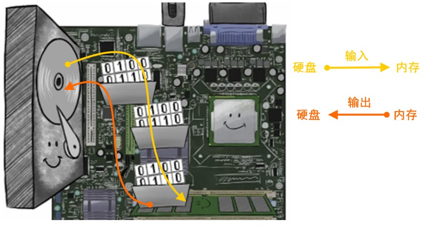
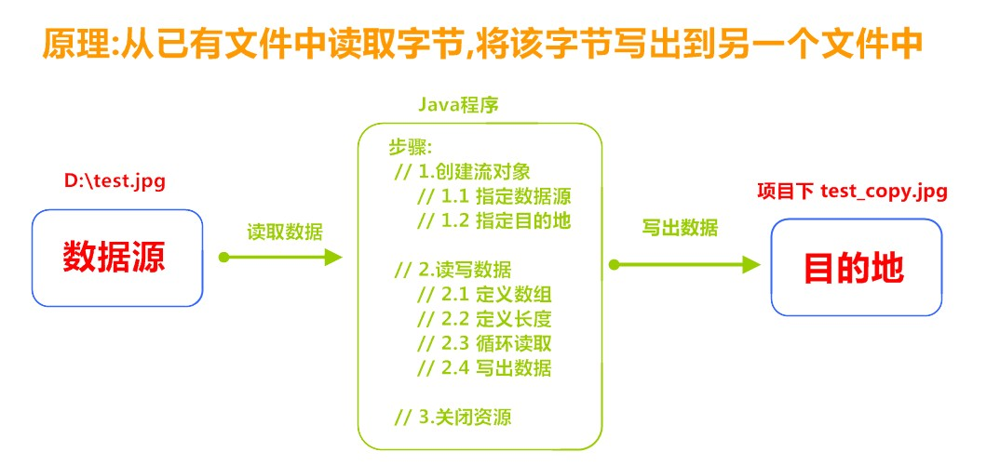
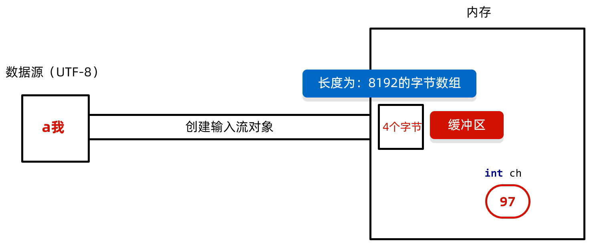

# 1. IO概述

## 1.1 什么是IO

生活中，你肯定经历过这样的场景。当你编辑一个文本文件，忘记了`ctrl+s` ，可能文件就白白编辑了。当你电脑上插入一个U盘，可以把一个视频，拷贝到你的电脑硬盘里。那么数据都是在哪些设备上的呢？键盘、内存、硬盘、外接设备等等。IO流就是存储和读取数据的解决方案

我们把这种数据的传输，可以看做是一种数据的流动，按照流动的方向，以内存为基准，分为`输入input` 和`输出output` ，即流向内存是输入流，流出内存的输出流。

Java中I/O操作主要是指使用`java.io`包下的内容，进行输入、输出操作。**输入**也叫做**读取**数据，**输出**也叫做作**写出**数据。

## 1.2 IO的分类

根据数据的流向分为：**输入流**和**输出流**。

* **输入流** ：把数据从`其他设备`上读取到`内存`中的流。 文件->程序
* **输出流** ：把数据从`内存` 中写出到`其他设备`上的流。程序->文件

根据数据的类型分为：**字节流**和**字符流**。

* **字节流** ：以字节为单位，读写数据的流。可以操作所有类型的文件
* **字符流** ：以字符为单位，读写数据的流。只能操作文本文件

## 1.3 IO的流向说明图解



## 1.4 顶级父类们

|            |           **输入流**            |              输出流              |
| :--------: | :-----------------------------: | :------------------------------: |
| **字节流** | 字节输入流<br />**InputStream** | 字节输出流<br />**OutputStream** |
| **字符流** |   字符输入流<br />**Reader**    |    字符输出流<br />**Writer**    |

# 补. 字符集

[字符集详解及各种编码的原理](https://www.bilibili.com/video/BV1n3411Q7gi?spm_id_from=333.788.player.switch&vd_source=796ed40051b301bfa3a84ba357f4828c&p=13)

---

总结：

在计算机中，任意数据都是以二进制的形式来存储的

计算机中最小的存储单元是一个字节

ASCII字符集中，一个英文占一个字节

简体中文版Windows,默认使用GBK字符集

GBK字符集完全兼容ASCII字符集，GBK中：

- 一个英文占一个字节，二进制第一位是0
- 一个中文占两个字节，二进制高位字节的第一位是1

---

- ASCII：英文
- **GBK：**英文、中文
- **Unicode：**英文、中文。

---

**计算机的存储规则：**

1. **GB2312字符集：**1980年发布，1981年5月1日实施的简体中文汉字编码国家标准。
   收录7445个图形字符，其中包括6763个简体汉字
2. **BIG5字符集：**台湾地区繁体中文标准字符集，共收录13053个中文字，1984年实施。
3. **GBK字符集：**2000年3月17日发布，收录21003个汉字。
   包含国家标准GB13000-1中的全部中日韩汉字，和B1G5编码中的所有汉字。
4. **Unicode：**Unicode字符集：国际标准字符集，它将世界各种语言的每个字符定义一个唯一的编码，以满足跨语言、跨平台的文本信息转换。

windows中文系统默认使用的就是GBK。系统显示：ANSI

## ASCII

ASCII：英文

- 有一张ASCII字符集表，每一个数据(符号)对应一表的一个数据，一个数据占用一个字节，共有($2^8$)128个对应的数据，存储英文一个字节就足以。
- ASCII编码规则：前面补0，补齐8位
- ASCII解码规则：直接转成十进制

## GBK

**计算机的存储规则(GBK)：**

- GBK英文
  - 编码规则：不足8位，前面补0。
  - 要求：英文用一个字节存储，完全兼容ASCII
- GBK汉字
  - 编码规则：不需要变动
  - 要求1：汉字两个字节存储，第一个字节是高位，第二个字节是低位。
  - 要求2：高位字节二进制一定以1开头，转成十进制之后是一个负数。(因此中文一定以1开头，英文一定以0开头)
  - 解码规则：直接转成十进制，查询GBK表

## Unicode

---

总结：

Unicode字符集的**UTF-8编码**格式

- 一个英文占一个字节，二进制第一位是0，转成十进制是正数
- 一个中文占三个字节，二进制第一位是1，第一个字节转成十进制是负数

---

Unicode：万国码

- 研发方：统一码联盟（也叫Unicode组织）
- 总部位置：美国加州
- 研发时间：1990年
- 发布时间：1994年发布1.0版本，期间不断添加新的文字，最新的版本是2022年9月13日发布的15.0版本。
- 联盟组成：世界各地主要的电脑制造商、软件开发商、数据库开发商、政府部门、研究机构、国际机构及个人组成

---

Unicode字符集编码方式：

- UTF-16
  编码规则：用2~4个字节保存
- UTF-32
  编码规则：固定使用四个字节保存
- **UTF-8**
  编码规则：用1~4个字节保存

---

**UTF-8存储方式：**


- 英文：1个字节
- 中文：3个字节

eg：

- 汉字`01101100 0100101` --UTF-编码-->`11100110 10110001 10001001`

UTF-8不是一个字符集，是Unicode字符集的一种编码方式。

## 乱码

**为什么会有乱码？**

- 原因1：读取数据时未读完整个汉字
- z原因2：编码和解码的方式不同

字节流：一次读取一个字节。使用字节流读取汉字时，读取的不是一个完整的汉字，会出现乱码

**如何不产生乱码？**

1. 不要用字节流读取文本文件
2. 编码解码时使用同一个码表，同一个编码方式

**问：**字节流读取中文会乱码，但是为什么拷贝不会乱码呢？
**答：**字节流读取是一个字节一个字节读取的，输出也是单个字节

使用[字符流](#3. 字符流)解决乱码

## java编解码

Java中编码的方法：

| String类中的方法                           | 说明                 |
| ------------------------------------------ | -------------------- |
| public byte[] getBytes()                   | 使用默认方式进行编码 |
| public byte[] getBytes(String charsetName) | 使用指定方式进行编码 |

Java中解码的方法：

| String类中的方法                         | 说明                 |
| ---------------------------------------- | -------------------- |
| String(byte[] bytes)                     | 使用默认方式进行解码 |
| String(byte[] bytes, String charsetName) | 使用指定方式进行解码 |

# 2. 字节流

## 2.1 一切皆为字节

一切文件数据(文本、图片、视频等)在存储时，都是以二进制数字的形式保存，都一个一个的字节，那么传输时一样如此。所以，字节流可以传输任意文件数据。在操作流的时候，我们要时刻明确，无论使用什么样的流对象，底层传输的始终为二进制数据。

## 2.2 字节输出流【OutputStream】

`java.io.OutputStream `抽象类是表示字节输出流的所有类的超类，将指定的字节信息写出到目的地。它定义了字节输出流的基本共性功能方法。

* `public void close()` ：关闭此输出流并释放与此流相关联的任何系统资源。  
* `public void flush() ` ：刷新此输出流并强制任何缓冲的输出字节被写出。  
* `public void write(byte[] b)`：将 b.length字节从指定的字节数组写入此输出流。  
* `public void write(byte[] b, int off, int len)` ：从指定的字节数组写入 len字节，从偏移量 off开始输出到此输出流。  
* `public abstract void write(int b)` ：将指定的字节输出流。

> 小贴士：
>
> close方法，当完成流的操作时，必须调用此方法，释放系统资源。

## 2.3 FileOutputStream类

`OutputStream`有很多子类，我们从最简单的一个子类开始。

`java.io.FileOutputStream `类是文件输出流，用于将数据写出到文件。

**步骤：**

1. 创建字节输出流对象
2. 写数据
3. 释放资源

**字节输出流的细节：** 

1. 创建字节输出流对象
   - 细节1：参数是字符串表示的路径或者是File对象都是可以的
   - 细节2：如果文件不存在会创建一个新的文件，但是要保证父级路径是存在的。
   - 细节3：如果文件已经存在，则会清空文件
2. 写数据
   细节：write方法的参数是整数，但是实际上写到本地文件中的是整数在ASCII上对应的字符。 
   ‘97’->a、'100'->d
3. 释放资源
   每次使用完流之后都要释放资源

### 构造方法

* `public FileOutputStream(File file)`：创建文件输出流以写入由指定的 File对象表示的文件。 
* `public FileOutputStream(String name)`： 创建文件输出流以指定的名称写入文件。 

当你创建一个流对象时，必须传入一个文件路径。该路径下，如果没有这个文件，会创建该文件。如果有这个文件，会清空这个文件的数据。

* 构造举例，代码如下：

```java
public class FileOutputStreamConstructor throws IOException {
    public static void main(String[] args) {
   	 	// 使用File对象创建流对象
        File file = new File("a.txt");
        FileOutputStream fos = new FileOutputStream(file);
      
        // 使用文件名称创建流对象
        FileOutputStream fos = new FileOutputStream("b.txt");
    }
}
```

### 写出字节数据

| 方法名称                               | 说明                         |
| -------------------------------------- | ---------------------------- |
| void write(int b)                      | 一次写一个字节数据           |
| void write(byte[] b)                   | 一次写一个字节数组数据       |
| void write(byte[] b, int off, int len) | 一次写一个字节数组的部分数据 |

1. **写出字节**：`write(int b)` 方法，每次可以写出一个字节数据，代码使用演示：

```java
public class FOSWrite {
    public static void main(String[] args) throws IOException {
        // 使用文件名称创建流对象
        FileOutputStream fos = new FileOutputStream("fos.txt");     
      	// 写出数据
      	fos.write(97); // 写出第1个字节
      	fos.write(98); // 写出第2个字节
      	fos.write(99); // 写出第3个字节
      	// 关闭资源
        fos.close();
    }
}
输出结果：
abc
```

> 小贴士：
>
> 1. 虽然参数为int类型四个字节，但是只会保留一个字节的信息写出。
> 2. 流操作完毕后，必须释放系统资源，调用close方法，千万记得。

2. **写出字节数组**：`write(byte[] b)`，每次可以写出数组中的数据，代码使用演示：

```java
public class FOSWrite {
    public static void main(String[] args) throws IOException {
        // 使用文件名称创建流对象
        FileOutputStream fos = new FileOutputStream("fos.txt");     
      	// 字符串转换为字节数组
      	byte[] b = "黑马程序员".getBytes();
      	// 写出字节数组数据
      	fos.write(b);
      	// 关闭资源
        fos.close();
    }
}
输出结果：
黑马程序员
```

3. **写出指定长度字节数组**：`write(byte[] b, int off, int len)` ,每次写出从off索引开始，len个字节，代码使用演示：

```java
public class FOSWrite {
    public static void main(String[] args) throws IOException {
        // 使用文件名称创建流对象
        FileOutputStream fos = new FileOutputStream("fos.txt");     
      	// 字符串转换为字节数组
      	byte[] b = "abcde".getBytes();
		// 写出从索引2开始，2个字节。索引2是c，两个字节，也就是cd。
        fos.write(b,2,2);
      	// 关闭资源
        fos.close();
    }
}
输出结果：
cd
```

### 数据追加续写

经过以上的演示，每次程序运行，创建输出流对象，都会清空目标文件中的数据。如何保留目标文件中数据，还能继续添加新数据呢？

- `public FileOutputStream(File file, boolean append)`： 创建文件输出流以写入由指定的 File对象表示的文件。  
- `public FileOutputStream(String name, boolean append)`： 创建文件输出流以指定的名称写入文件。  

这两个构造方法，参数中都需要传入一个boolean类型的值，`true` 表示追加数据，`false` 表示清空原有数据。这样创建的输出流对象，就可以指定是否追加续写了，代码使用演示：

```java
public class FOSWrite {
    public static void main(String[] args) throws IOException {
        // 使用文件名称创建流对象
        FileOutputStream fos = new FileOutputStream("fos.txt"，true);     
      	// 字符串转换为字节数组
      	byte[] b = "abcde".getBytes();
		// 写出从索引2开始，2个字节。索引2是c，两个字节，也就是cd。
        fos.write(b);
      	// 关闭资源
        fos.close();
    }
}
文件操作前：cd
文件操作后：cdabcde
```

### 写出换行

Windows系统里，换行符号是`\r\n` 。把

以指定是否追加续写了，代码使用演示：

```java
public class FOSWrite {
    public static void main(String[] args) throws IOException {
        // 使用文件名称创建流对象
        FileOutputStream fos = new FileOutputStream("fos.txt");  
      	// 定义字节数组
      	byte[] words = {97,98,99,100,101};
      	// 遍历数组
        for (int i = 0; i < words.length; i++) {
          	// 写出一个字节
            fos.write(words[i]);
          	// 写出一个换行, 换行符号转成数组写出
            fos.write("\r\n".getBytes());
        }
      	// 关闭资源
        fos.close();
    }
}

输出结果：
a
b
c
d
e
```

> * 回车符`\r`和换行符`\n` ：
>   * 回车符：回到一行的开头（return）。
>   * 换行符：下一行（newline）。
> * 系统中的换行：
>   * Windows系统里，每行结尾是 `回车+换行` ，即`\r\n`；
>   * Unix系统里，每行结尾只有 `换行` ，即`\n`；
>   * Mac系统里，每行结尾是 `回车` ，即`\r`。从 Mac OS X开始与Linux统一。

## 2.4 字节输入流【InputStream】

`java.io.InputStream `抽象类是表示字节输入流的所有类的超类，可以读取字节信息到内存中。它定义了字节输入流的基本共性功能方法。

- `public void close()` ：关闭此输入流并释放与此流相关联的任何系统资源。    
- `public abstract int read()`： 从输入流读取数据的下一个字节。 
- `public int read(byte[] b)`： 从输入流中读取一些字节数，并将它们存储到字节数组 b中 。

> 小贴士：
>
> close方法，当完成流的操作时，必须调用此方法，释放系统资源。

## 2.5 FileInputStream类

`java.io.FileInputStream `类是文件输入流，从文件中读取字节。

**步骤：**

1. 创建字节输入流对象
2. 读数据
3. 释放资源

**FilelnputStream书写细节：**

1. 创建字节输入流对象
   细节1：如果文件不存在，就直接报错。
2. 读取数据
   - 细节1：一次读一个字节，读出来的是数据在ASCII上对应的数字
   - 细节2：**读到文件末尾了，read方法返回-1。**
3. 释放资源
   细节1：每次使用完流必须要释放资源。

### 构造方法

* `FileInputStream(File file)`： 通过打开与实际文件的连接来创建一个 FileInputStream ，该文件由文件系统中的 File对象 file命名。 
* `FileInputStream(String name)`： 通过打开与实际文件的连接来创建一个 FileInputStream ，该文件由文件系统中的路径名 name命名。  

当你创建一个流对象时，必须传入一个文件路径。该路径下，如果没有该文件,会抛出`FileNotFoundException`

- 构造举例，代码如下：

```java
public class FileInputStreamConstructor throws IOException{
    public static void main(String[] args) {
   	 	// 使用File对象创建流对象
        File file = new File("a.txt");
        FileInputStream fos = new FileInputStream(file);
      
        // 使用文件名称创建流对象
        FileInputStream fos = new FileInputStream("b.txt");
    }
}
```

### 读取字节数据

| 方法名称                       | 说明                                               |
| ------------------------------ | -------------------------------------------------- |
| public int read()              | 一次读一个字节数据                                 |
| public int read(byte[] buffer) | 一次读一个字节数组数据，每次读取会尽可能把数组装满 |

1.**读取字节**：`read`方法，每次可以读取一个字节的数据，提升为int类型，读取到文件末尾，返回`-1`，

read :表示读取数据，而且是读取一个数据就移动一次指针

代码使用演示：

```java
public class FISRead {
    public static void main(String[] args) throws IOException{
      	// 使用文件名称创建流对象
       	FileInputStream fis = new FileInputStream("read.txt");
      	// 读取数据，返回一个字节
        int read = fis.read();
        System.out.println((char) read);
        read = fis.read();
        System.out.println((char) read);
        read = fis.read();
        System.out.println((char) read);
        read = fis.read();
        System.out.println((char) read);
        read = fis.read();
        System.out.println((char) read);
      	// 读取到末尾,返回-1
       	read = fis.read();
        System.out.println( read);
		// 关闭资源
        fis.close();
    }
}
输出结果：
a
b
c
d
e
-1
```

循环改进读取方式，代码使用演示：

```java
public class FISRead {
    public static void main(String[] args) throws IOException{
      	// 使用文件名称创建流对象
       	FileInputStream fis = new FileInputStream("read.txt");
      	// 定义变量，保存数据
        int b ；
        // 循环读取
        while ((b = fis.read())!=-1) {
            System.out.println((char)b);
        }
		// 关闭资源
        fis.close();
    }
}
输出结果：
a
b
c
d
e
```

> 小贴士：
>
> 1. 虽然读取了一个字节，但是会自动提升为int类型。
> 2. 流操作完毕后，必须释放系统资源，调用close方法，千万记得。

2.**使用字节数组读取**：`read(byte[] b)`，每次读取b的长度个字节到数组中，返回读取到的有效字节个数，读取到末尾时，返回`-1` ，一次读一个字节数组的数据，每次读取会尽可能把数组装满

代码使用演示：

```java
public class FISRead {
    public static void main(String[] args) throws IOException{
      	// 使用文件名称创建流对象.
       	FileInputStream fis = new FileInputStream("read.txt"); // 文件中为abcde
      	// 定义变量，作为有效个数
        int len ；
        // 定义字节数组，作为装字节数据的容器   
        byte[] b = new byte[2]; // 一般采用1024的整数倍的数组长度，对于大文件的拷贝一般采取1024*1024*5-1024*1024*10即一次读取5-10M的数据
        // 循环读取
        while (( len= fis.read(b))!=-1) {
           	// 每次读取后,把数组变成字符串打印
            System.out.println(new String(b));
        }
		// 关闭资源
        fis.close();
    }
}

输出结果：
ab
cd
ed
```

错误数据`d`，是由于最后一次读取时，只读取一个字节`e`，数组中，上次读取的数据没有被完全替换，所以要通过`len` ，获取有效的字节，代码使用演示：

```java
public class FISRead {
    public static void main(String[] args) throws IOException{
      	// 使用文件名称创建流对象.
       	FileInputStream fis = new FileInputStream("read.txt"); // 文件中为abcde
      	// 定义变量，作为有效个数
        int len ；
        // 定义字节数组，作为装字节数据的容器   
        byte[] b = new byte[2];
        // 循环读取
        while (( len= fis.read(b))!=-1) {
           	// 每次读取后,把数组的有效字节部分，变成字符串打印
            System.out.println(new String(b，0，len));//  len 每次读取的有效字节个数
        }
		// 关闭资源
        fis.close();
    }
}

输出结果：
ab
cd
e
```

> 小贴士：
>
> 使用数组读取，每次读取多个字节，减少了系统间的IO操作次数，从而提高了读写的效率，建议开发中使用。

## 2.6 字节流练习：图片复制

### 复制原理图解



### 案例实现

复制图片文件，代码使用演示：

```java
public class Copy {
    public static void main(String[] args) throws IOException {
        // 1.创建流对象
        // 1.1 指定数据源
        FileInputStream fis = new FileInputStream("D:\\test.jpg");
        // 1.2 指定目的地
        FileOutputStream fos = new FileOutputStream("test_copy.jpg");

        // 2.读写数据
        // 2.1 定义数组
        /* // 如果拷贝的文件过大，那么速度会非常非常的慢，因此要一次读取多个字节，使用read(byte[] buffer)改进
        int b;
        while ((b = fis.read())!=-1) {
            // 2.4 写出数据
            fos.write(b);
        }
        */
        byte[] b = new byte[1024]; // 一次读取1kb
        // 2.2 定义长度
        int len;
        // 2.3 循环读取
        while ((len = fis.read(b))!=-1) {
            // 2.4 写出数据
            fos.write(b, 0 , len);
        }

        // 3.关闭资源
        fos.close();
        fis.close();
    }
}
```

> 小贴士：
>
> 流的关闭原则：先开后关，后开先关。

大文件的拷贝：

```java
public static void main(String[] args) throws IOException {
    /**
     *文件拷贝
     *  把D:\itheima\movie.mp4 (16.8 MB) 拷贝到当前模块下。
     * */
    long start = System.currentTimeMillis();
    //1.创建对象
    FileInputStream fis = new FileInputStream("D:\\itheima\\movie.mp4");
    FileOutputStream fos = new FileOutputStream("myio\\copy.mp4");
    //2.拷贝
    int len;
    byte[] bytes = new byte[1024 * 1024 * 5];
    while((len = fis.read(bytes)) != -1){
        fos.write(bytes,0,len);
    }
    //3.释放资源
    fos.close();
    fis.close();
    long end = System.currentTimeMillis();
    System.out.println(end - start);
}
```

# 3. 字符流

当使用字节流读取文本文件时，可能会有一个小问题。就是遇到中文字符时，可能不会显示完整的字符，那是因为一个中文字符可能占用多个字节存储。所以Java提供一些字符流类，以字符为单位读写数据，专门用于处理文本文件。

字符流的底层其实就是字节流

字符流=字节流+字符集

**特点：**

- **输入流：**一次读一个字节，遇到中文时，一次读多个字节(具体一次读几个字节与字符集有关)
- **输出流：**底层会把数据按照指定的编码方式进行编码，变成字节再写到文件中

使用场景：**对于纯文本文件进行读写**操作

## 3.1 字符输入流【Reader】

`java.io.Reader`抽象类是表示用于读取字符流的所有类的超类，可以读取字符信息到内存中。它定义了字符输入流的基本共性功能方法。

- `public void close()` ：关闭此流并释放与此流相关联的任何系统资源。    
- `public int read()`： 从输入流读取一个字符。 
- `public int read(char[] cbuf)`： 从输入流中读取一些字符，并将它们存储到字符数组 cbuf中 。

## 3.2 FileReader类  

### 字符输入流原理

[IO流-字符输入流的底层原理超详解](https://www.bilibili.com/video/BV1n3411Q7gi?spm_id_from=333.788.player.switch&vd_source=796ed40051b301bfa3a84ba357f4828c&p=20)

> 字节流没有缓冲区，字符流有缓冲区



**底层：**

1. 创建字符输入流对象
   底层：关联文件，并创建缓冲区（长度为8192的字节数组)
2. 读取数据
   底层：
   1. 判断缓冲区中是否有数据可以读取
   2. 缓冲区没有数据：就从文件中获取数据，装到缓冲区中，每次尽可能装满缓冲区
                                     如果文件中也没有数据了，返回-1
   3. 缓冲区有数据：就从缓冲区中读取。
      - 空参的read方法：一次读取一个字节，遇到中文一次读多个字节，把字节解码并**转成十进制返回**
      - 有参的read方法：把读取字节，解码，强转丰步合并了，**强转之后的字符放到数组中，返回**读到的有效字符**个数**

`java.io.FileReader `类是读取字符文件的便利类。构造时使用系统默认的字符编码和默认字节缓冲区。

> 小贴士：
>
> 1. 字符编码：字节与字符的对应规则。Windows系统的中文编码默认是GBK编码表。
>
>    idea中UTF-8
>
> 2. 字节缓冲区：一个字节数组，用来临时存储字节数据。

### 构造方法

- `FileReader(File file)`： 创建一个新的 FileReader ，给定要读取的File对象。   
- `FileReader(String fileName)`： 创建一个新的 FileReader ，给定要读取的文件的名称。  

细节1：如果文件不存在，就直接报错。

当你创建一个流对象时，必须传入一个文件路径。类似于FileInputStream 。

- 构造举例，代码如下：

```java
public class FileReaderConstructor throws IOException{
    public static void main(String[] args) {
   	 	// 使用File对象创建流对象
        File file = new File("a.txt");
        FileReader fr = new FileReader(file);
      
        // 使用文件名称创建流对象
        FileReader fr = new FileReader("b.txt");
    }
}
```

### 读取字符数据

| 成员方法                       | 说明                         |
| ------------------------------ | ---------------------------- |
| public int read()              | 读取数据，读到末尾返回-1     |
| public int read(char[] buffer) | 读取多个数据，读到末尾返回-1 |

细节1：按字节进行读取，如果遇到中文就会一次读取多个，GBK一次读两个字节，UTF-8一次读三个字节，读取后解码，返回一个整数
细节2：读到文件末尾了，read方法返回-1。

1. **读取字符**：`read`方法，每次可以读取一个字符的数据，**提升为int类型并返回**，读取到文件末尾，返回`-1`，循环读取，代码使用演示：

```java
public class FRRead {
    public static void main(String[] args) throws IOException {
      	// 使用文件名称创建流对象
       	FileReader fr = new FileReader("read.txt");
      	// 定义变量，保存数据
        int b ；
        // 循环读取
        while ((b = fr.read())!=-1) {
            System.out.println((char)b); // 如果不强转为char那么这就是一串十进制数字
        }
		// 关闭资源
        fr.close();
    }
}
输出结果：
黑
马
程
序
员
```

> 小贴士：虽然读取了一个字符，但是会自动提升为int类型。
>

2. **使用字符数组读取**：`read(char[] cbuf)`，每次读取b的长度个**字符到数组中**，**返回读取到的有效字符个数**，读取到末尾时，返回`-1` ，代码使用演示：

```java
public class FRRead {
    public static void main(String[] args) throws IOException {
      	// 使用文件名称创建流对象
       	FileReader fr = new FileReader("read.txt");
      	// 定义变量，保存有效字符个数
        int len ；
        // 定义字符数组，作为装字符数据的容器
         char[] cbuf = new char[2];
        // 循环读取
        while ((len = fr.read(cbuf))!=-1) {
            System.out.println(new String(cbuf));
        }
		// 关闭资源
        fr.close();
    }
}
输出结果：
黑马
程序
员序
```

获取有效的字符改进，代码使用演示：

```java
public class FISRead {
    public static void main(String[] args) throws IOException {
      	// 使用文件名称创建流对象
       	FileReader fr = new FileReader("read.txt");
      	// 定义变量，保存有效字符个数
        int len ；
        // 定义字符数组，作为装字符数据的容器
        char[] cbuf = new char[2];
        // 循环读取
        while ((len = fr.read(cbuf))!=-1) {
            System.out.println(new String(cbuf,0,len));
        }
    	// 关闭资源
        fr.close();
    }
}

输出结果：
黑马
程序
员
```

## 3.3 字符输出流【Writer】

`java.io.Writer `抽象类是表示用于写出字符流的所有类的超类，将指定的字符信息写出到目的地。它定义了字节输出流的基本共性功能方法。

- `void write(int c)` 写入单个字符。
- `void write(char[] cbuf) `写入字符数组。 
- `abstract  void write(char[] cbuf, int off, int len) `写入字符数组的某一部分,off数组的开始索引,len写的字符个数。 
- `void write(String str) `写入字符串。 
- `void write(String str, int off, int len)` 写入字符串的某一部分,off字符串的开始索引,len写的字符个数。
- `void flush() `刷新该流的缓冲。  
- `void close()` 关闭此流，但要先刷新它。 

## 3.4 FileWriter类

`java.io.FileWriter `类是写出字符到文件的便利类。构造时使用系统默认的字符编码和默认字节缓冲区。

**步骤：**

1. 创建字符输出流对象
   - 细节1：参数是字符串表示的路径或者File对象都是可以的
   - 细节2：如果文件不存在会创建一个新的文件，但是要保证父级路径是存在的
   - 细节3：如果文件已经存在，则会清空文件，如果不想清空可以打开续写开关
2. 写数据
   细节：如果write方法的参数是整数，但是实际上写到本地文件中的是整数在字符集上对应的字符
3. 释放资源
   细节：每次使用完流之后都要释放资源

### 构造方法

| 构造方法                                           | 说明                             |
| -------------------------------------------------- | -------------------------------- |
| public FileWriter(File file)                       | 创建字符输出流关联本地文件       |
| public FileWriter(String pathname)                 | 创建字符输出流关联本地文件       |
| public FileWriter(File file, boolean append)       | 创建字符输出流关联本地文件，续写 |
| public FileWriter(String pathname, boolean append) | 创建字符输出流关联本地文件，续写 |

当你创建一个流对象时，必须传入一个文件路径，类似于FileOutputStream。

- 构造举例，代码如下：

```java
public class FileWriterConstructor {
    public static void main(String[] args) throws IOException {
   	 	// 使用File对象创建流对象
        File file = new File("a.txt");
        FileWriter fw = new FileWriter(file);
      
        // 使用文件名称创建流对象
        FileWriter fw = new FileWriter("b.txt");
    }
}
```

### 基本写出数据

**写出字符**：`write(int b)` 方法，每次可以写出一个字符数据，代码使用演示：

```java
public class FWWrite {
    public static void main(String[] args) throws IOException {
        // 使用文件名称创建流对象
        FileWriter fw = new FileWriter("fw.txt");     
      	// 写出数据
      	fw.write(97); // 写出第1个字符
      	fw.write('b'); // 写出第2个字符
      	fw.write('C'); // 写出第3个字符
      	fw.write(30000); // 写出第4个字符，中文编码表中30000对应一个汉字。
      
      	/*
        【注意】关闭资源时,与FileOutputStream不同。
      	 如果不关闭,数据只是保存到缓冲区，并未保存到文件。
        */
        // fw.close();
    }
}
输出结果：
abC田
```

> 小贴士：
>
> 1. 虽然参数为int类型四个字节，但是只会保留一个字符的信息写出。
> 2. 未调用close方法，数据只是保存到了缓冲区，并未写出到文件中。

### 关闭和刷新

因为内置缓冲区的原因，如果不关闭输出流，无法写出字符到文件中。但是关闭的流对象，是无法继续写出数据的。如果我们既想写出数据，又想继续使用流，就需要`flush` 方法了。

* `flush` ：刷新缓冲区，流对象可以继续使用。
* `close `:先刷新缓冲区，然后通知系统释放资源。流对象不可以再被使用了。

代码使用演示：

```java
public class FWWrite {
    public static void main(String[] args) throws IOException {
        // 使用文件名称创建流对象
        FileWriter fw = new FileWriter("fw.txt");
        // 写出数据，通过flush
        fw.write('刷'); // 写出第1个字符
        fw.flush();
        fw.write('新'); // 继续写出第2个字符，写出成功
        fw.flush();
      
      	// 写出数据，通过close
        fw.write('关'); // 写出第1个字符
        fw.close();
        fw.write('闭'); // 继续写出第2个字符,【报错】java.io.IOException: Stream closed
        fw.close();
    }
}
```

> 小贴士：即便是flush方法写出了数据，操作的最后还是要调用close方法，释放系统资源。

### 写出其他数据

1. **写出字符数组** ：`write(char[] cbuf)` 和 `write(char[] cbuf, int off, int len)` ，每次可以写出字符数组中的数据，用法类似FileOutputStream，代码使用演示：

```java
public class FWWrite {
    public static void main(String[] args) throws IOException {
        // 使用文件名称创建流对象
        FileWriter fw = new FileWriter("fw.txt");     
      	// 字符串转换为字节数组
      	char[] chars = "黑马程序员".toCharArray();
      
      	// 写出字符数组
      	fw.write(chars); // 黑马程序员
        
		// 写出从索引2开始，2个字节。索引2是'程'，两个字节，也就是'程序'。
        fw.write(b,2,2); // 程序
      
      	// 关闭资源
        fos.close();
    }
}
```

2. **写出字符串**：`write(String str)` 和 `write(String str, int off, int len)` ，每次可以写出字符串中的数据，更为方便，代码使用演示：

```java
public class FWWrite {
    public static void main(String[] args) throws IOException {
        // 使用文件名称创建流对象
        FileWriter fw = new FileWriter("fw.txt");     
      	// 字符串
      	String msg = "黑马程序员";
      
      	// 写出字符数组
      	fw.write(msg); //黑马程序员
      
		// 写出从索引2开始，2个字节。索引2是'程'，两个字节，也就是'程序'。
        fw.write(msg,2,2);	// 程序
      	
        // 关闭资源
        fos.close();
    }
}
```

3. **续写和换行**：操作类似于FileOutputStream。

```java
public class FWWrite {
    public static void main(String[] args) throws IOException {
        // 使用文件名称创建流对象，可以续写数据
        FileWriter fw = new FileWriter("fw.txt"，true);     
      	// 写出字符串
        fw.write("黑马");
      	// 写出换行
      	fw.write("\r\n");
      	// 写出字符串
  		fw.write("程序员");
      	// 关闭资源
        fw.close();
    }
}
输出结果:
黑马
程序员
```

> 小贴士：字符流，只能操作文本文件，不能操作图片，视频等非文本文件。
>
> 当我们单纯读或者写文本文件时  使用字符流 其他情况使用字节流

1. 1. - 

# 4. IO异常的处理

### JDK7前处理

之前的入门练习，我们一直把异常抛出，而实际开发中并不能这样处理，建议使用`try...catch...finally` 代码块，处理异常部分，代码使用演示：

```java  
public class HandleException1 {
    public static void main(String[] args) {
      	// 声明变量
        FileWriter fw = null;
        try {
            //创建流对象
            fw = new FileWriter("fw.txt");
            // 写出数据
            fw.write("黑马程序员"); //黑马程序员
        } catch (IOException e) {
            e.printStackTrace();
        } finally {
            try {
                if (fw != null) {
                    fw.close();
                }
            } catch (IOException e) {
                e.printStackTrace();
            }
        }
    }
}
```

### JDK7的处理(扩展知识点了解内容)

还可以使用JDK7优化后的`try-with-resource` 语句，该语句确保了每个资源在语句结束时关闭。所谓的资源（resource）是指在程序完成后，必须关闭的对象。

格式：当

```java
try (创建流对象语句，如果多个,使用';'隔开) { // ()中只能写实现了AutoCloseabled的对象，当try...catch中的代码全部执行完毕后，()中的就会被自动释放资源
	// 读写数据
} catch (IOException e) {
	e.printStackTrace();
}
```

代码使用演示：

```java
public class HandleException2 {
    public static void main(String[] args) {
      	// 创建流对象
        try ( FileWriter fw = new FileWriter("fw.txt"); ) {
            // 写出数据
            fw.write("黑马程序员"); //黑马程序员
        } catch (IOException e) {
            e.printStackTrace();
        }
    }
}
```

### JDK9的改进(扩展知识点了解内容)

JDK9中`try-with-resource` 的改进，对于**引入对象**的方式，支持的更加简洁。被引入的对象，同样可以自动关闭，无需手动close，我们来了解一下格式。

改进前格式：

```java
// 被final修饰的对象
final Resource resource1 = new Resource("resource1");
// 普通对象
Resource resource2 = new Resource("resource2");
// 引入方式：创建新的变量保存
try (Resource r1 = resource1;
     Resource r2 = resource2) {
     // 使用对象
}
```

改进后格式：

```java
// 被final修饰的对象
final Resource resource1 = new Resource("resource1");
// 普通对象
Resource resource2 = new Resource("resource2");

// 引入方式：直接引入
try (resource1; resource2) {
     // 使用对象
}
```

改进后，代码使用演示：

```java
public class TryDemo {
    public static void main(String[] args) throws IOException {
       	// 创建流对象
        final  FileReader fr  = new FileReader("in.txt");
        FileWriter fw = new FileWriter("out.txt");
       	// 引入到try中
        try (fr; fw) { // 当try...catch中的代码全部执行完毕后，()中的就会被自动释放资源
          	// 定义变量
            int b;
          	// 读取数据
          	while ((b = fr.read())!=-1) {
            	// 写出数据
            	fw.write(b);
          	}
        } catch (IOException e) {
            e.printStackTrace();
        }
    }
}
```

# 5. 综合练习

## 练习1：拷贝文件夹

```java
public class Test01 {
    public static void main(String[] args) throws IOException {
        //拷贝一个文件夹，考虑子文件夹

        //1.创建对象表示数据源
        File src = new File("D:\\aaa\\src");
        //2.创建对象表示目的地
        File dest = new File("D:\\aaa\\dest");

        //3.调用方法开始拷贝
        copydir(src,dest);


    }

    /*
    * 作用：拷贝文件夹
    * 参数一：数据源
    * 参数二：目的地
    *
    * */
    private static void copydir(File src, File dest) throws IOException {
        dest.mkdirs();
        //递归
        //1.进入数据源
        File[] files = src.listFiles();
        //2.遍历数组
        for (File file : files) {
            if(file.isFile()){
                //3.判断文件，拷贝
                FileInputStream fis = new FileInputStream(file);
                FileOutputStream fos = new FileOutputStream(new File(dest,file.getName()));
                byte[] bytes = new byte[1024];
                int len;
                while((len = fis.read(bytes)) != -1){
                    fos.write(bytes,0,len);
                }
                fos.close();
                fis.close();
            }else {
                //4.判断文件夹，递归
                copydir(file, new File(dest,file.getName()));
            }
        }
    }
}

```

## 练习2：文件加密

```java
public class Test02 {
    public static void main(String[] args) throws IOException {
        /*
            为了保证文件的安全性，就需要对原始文件进行加密存储，再使用的时候再对其进行解密处理。
            加密原理：
                对原始文件中的每一个字节数据进行更改，然后将更改以后的数据存储到新的文件中。
            解密原理：
                读取加密之后的文件，按照加密的规则反向操作，变成原始文件。

             ^ : 异或
                 两边相同：false
                 两边不同：true

                 0：false
                 1：true

               100:1100100
               10: 1010

               1100100
             ^ 0001010
             __________
               1101110
             ^ 0001010
             __________
               1100100

        */
    }

    public static void encryptionAndReduction(File src, File dest) throws IOException {
        FileInputStream fis = new FileInputStream(src);
        FileOutputStream fos = new FileOutputStream(dest);
        int b;
        while ((b = fis.read()) != -1) {
            fos.write(b ^ 2);
        }
        //4.释放资源
        fos.close();
        fis.close();
    }


}

```

## 练习3：数字排序

文本文件中有以下的数据：
                2-1-9-4-7-8
 将文件中的数据进行排序，变成以下的数据：
                1-2-4-7-8-9

实现方式一：

```java
public class Test03 {
    public static void main(String[] args) throws IOException {
        /*
            文本文件中有以下的数据：
                2-1-9-4-7-8
            将文件中的数据进行排序，变成以下的数据：
                1-2-4-7-8-9
        */


        //1.读取数据
        FileReader fr = new FileReader("myio\\a.txt");
        StringBuilder sb = new StringBuilder();
        int ch;
        while((ch = fr.read()) != -1){
            sb.append((char)ch);
        }
        fr.close();
        System.out.println(sb);
        //2.排序
        String str = sb.toString();
        String[] arrStr = str.split("-");//2-1-9-4-7-8

        ArrayList<Integer> list = new ArrayList<>();
        for (String s : arrStr) {
            int i = Integer.parseInt(s);
            list.add(i);
        }
        Collections.sort(list);
        System.out.println(list);
        //3.写出
        FileWriter fw = new FileWriter("myio\\a.txt");
        for (int i = 0; i < list.size(); i++) {
            if(i == list.size() - 1){
                fw.write(list.get(i) + "");
            }else{
                fw.write(list.get(i) + "-");
            }
        }
        fw.close();
    }
}
```

实现方式二：

```java
public class Test04 {
    public static void main(String[] args) throws IOException {
        /*
            文本文件中有以下的数据：
                2-1-9-4-7-8
            将文件中的数据进行排序，变成以下的数据：
                1-2-4-7-8-9

           细节1：
                文件中的数据不要换行

            细节2:
                bom头
        */
        //1.读取数据
        FileReader fr = new FileReader("myio\\a.txt");
        StringBuilder sb = new StringBuilder();
        int ch;
        while((ch = fr.read()) != -1){
            sb.append((char)ch);
        }
        fr.close();
        System.out.println(sb);
        //2.排序
        Integer[] arr = Arrays.stream(sb.toString()
                                      .split("-"))
            .map(Integer::parseInt)
            .sorted()
            .toArray(Integer[]::new);
        //3.写出
        FileWriter fw = new FileWriter("myio\\a.txt");
        String s = Arrays.toString(arr).replace(", ","-");
        String result = s.substring(1, s.length() - 1);
        fw.write(result);
        fw.close();
    }
}
```

