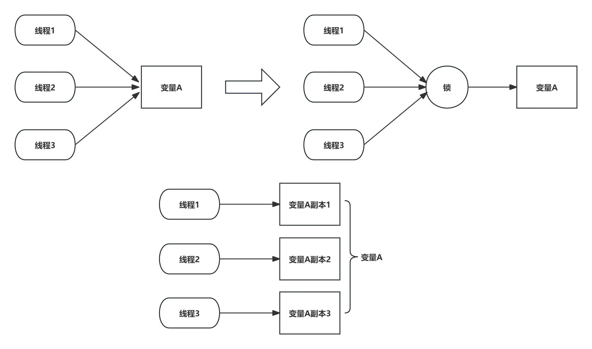
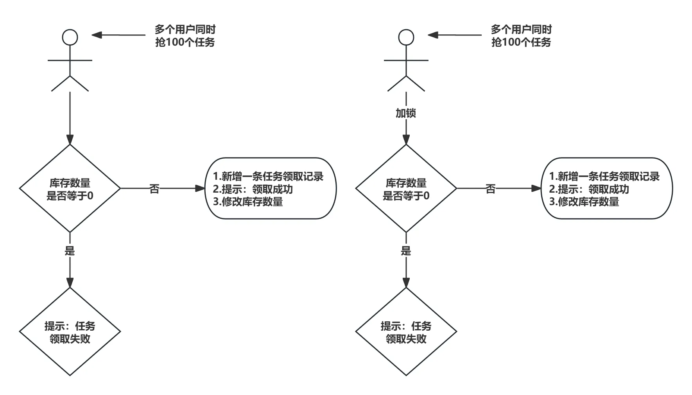
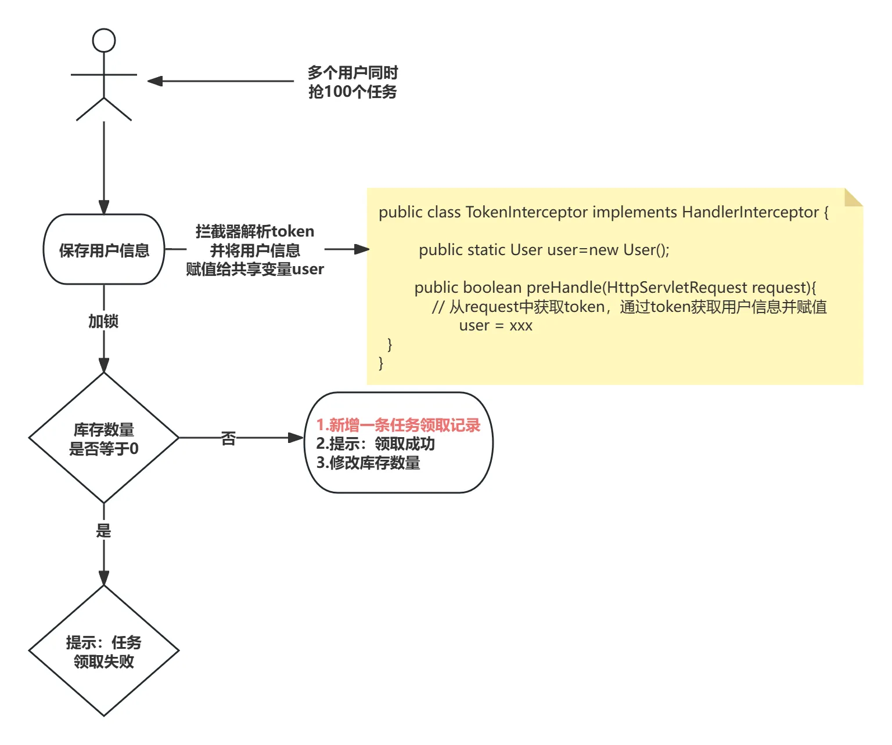
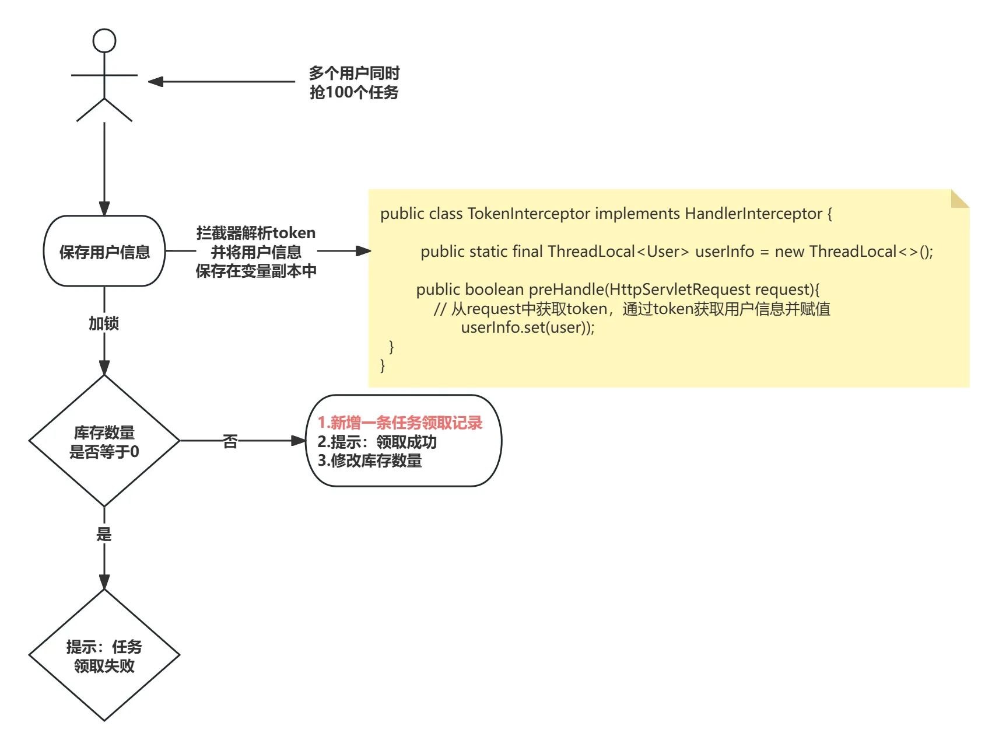
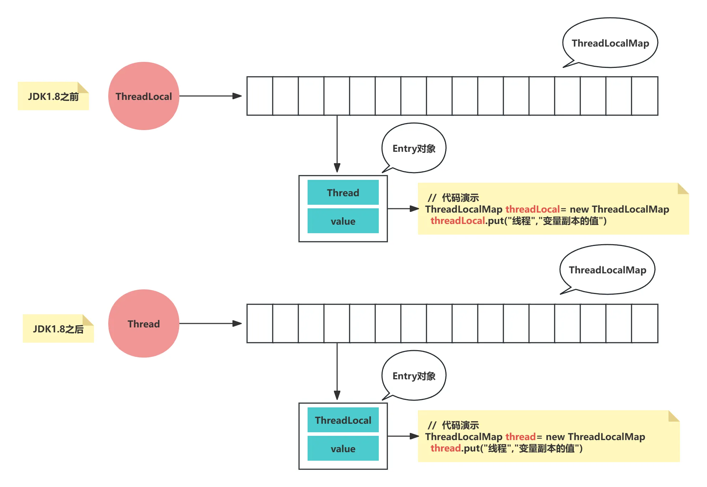
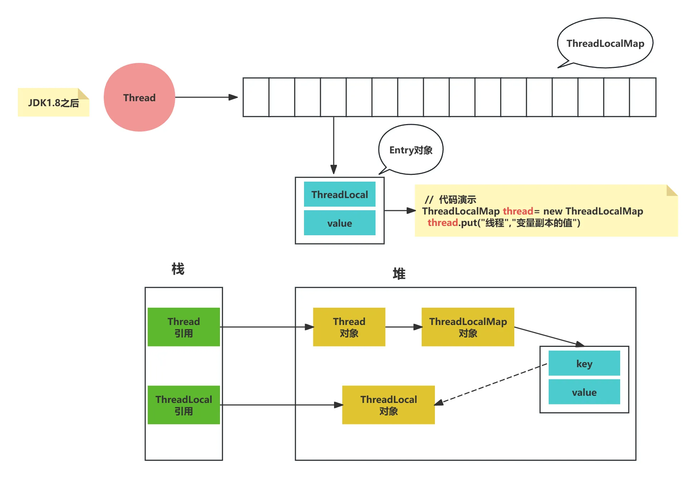

> author: 汐 
> mail: [1302344595@qq.com](mailto:1302344595@qq.com)

# ThreadLocal

[仙可-B站视频](https://www.bilibili.com/video/BV1AyGZzQEe4/?vd_source=104c235925b0c6eba43f5d550810fd21#reply261027076545)

## 一. 使用场景分析 

在并发编程中，当多个线程同时操作一个共享变量，就会出现线程安全问题，这个问题可以通过上锁来解决，但是上锁会产生额外的性能开销，尤其是高并发环境下这样的开销会被放大。

 锁是通过竞争的方式，每次有且只有一个线程能够操作这个变量，而ThreadLocal则是通过 让每个线程能够同时操作 单独属于自己的变量，来保证线程安全



### 1. 上锁解决线程安全问题 

有多个用户要抢这100个任务，一般会先查库存，库存数量只要不等于0，就能成功领取这条任务，库存等于0则已经领完提示任务领取失败。

假设现在只剩下一个任务未被领取，而此时有两个线程同时查询库存数量，查询结果都不是0，那么这两个线程都会领取成功，新增两条任务领取记录，最终领取任务的数量总计就是99+2=101。这就是多线程下发生的任务超领，也就是线程安全问题。

如果我们保证一个时间内只有一个线程，可以查询库存并修改库存数量，就能解决线程安全问题，就是加一把锁

那这个场景能不能用ThreadLocal，来解决线程安全问题呢，答案是不能，因为ThreadLocal 设计初衷是线程隔离，让每个线程拥有自己的变量副本，而不是让线程安全地修改共享变量

`模拟2个用户同时领取一个任务`：

```java
/**
 * 模拟2个用户同时领取一个任务
 * 不加锁
 */
public class TaskStock {

    // 库存数量
    public static int TOTAL_STOCK = 1;

    public static void main(String[] args) {
        // 模拟 2 个线程同时领取
        int numThreads = 2;
        for (int i = 1; i <= numThreads; i++) {
            new Thread(() -> {
                while (true) {
                    // 模拟业务操作耗时
                    try {
                        Thread.sleep(100);
                    } catch (InterruptedException e) {
                        e.printStackTrace();
                    }
                    // 如果库存小于等于0，代表任务已经领完
                    if (TaskStock.TOTAL_STOCK <= 0) {
                        System.out.println(Thread.currentThread().getName() + ": 任务领取失败×");
                        break;
                    }
                    // 库存扣减
                    TaskStock.TOTAL_STOCK = TaskStock.TOTAL_STOCK - 1;
                    System.out.println(Thread.currentThread().getName() + ": 任务领取成功√");
                }
            }, "Thread-" + i).start();
        }
    }
}
```

`模拟2个用户同时领取一个任务（加锁）`：

```java
/**
 * 模拟2个用户同时领取一个任务
 * 加锁
 */
public class TaskStockLocked {

    // 库存数量
    public static int TOTAL_STOCK = 1;

    public static void main(String[] args) {
        // 模拟 2 个线程同时领取
        int numThreads = 2;
        for (int i = 1; i <= numThreads; i++) {
            new Thread(() -> {
                while (true) {
                    int stock = reduceStock();
                    // 如果库存小于等于0，代表任务已经领完
                    if (stock <= 0) {
                        break;
                    }
                }
            }, "Thread-" + i).start();
        }
    }

    private synchronized static int reduceStock() {
        // 模拟业务操作耗时
        try {
            Thread.sleep(100);
        } catch (InterruptedException e) {
            e.printStackTrace();
        }
        // 如果库存小于等于0，代表任务已经领完
        if (TaskStockLocked.TOTAL_STOCK <= 0) {
            System.out.println(Thread.currentThread().getName() + ": 任务领取失败×");
            return 0;
        }
        // 库存扣减
        TaskStockLocked.TOTAL_STOCK = TaskStockLocked.TOTAL_STOCK - 1;
        System.out.println(Thread.currentThread().getName() + ": 任务领取成功√");
        return TaskStockLocked.TOTAL_STOCK;
    }
}
```



图：上锁保证线程安全

### 2. 使用 ThreaLocal 解决线程安全问题 

当需要新增一条任务领取记录，系统肯定需要知道是谁领取了这条记录，所以会把用户的id和名称也存储下来，那这个用户的信息从哪里获取呢？

一般会从Http请求头中获取，因为前端请求会携带这个token，解析token就能拿到用户信息，然后把这个用户信息保存下来，以便后续的业务代码中使用。

通常我们会在请求的一开始，在拦截器类中，把这个用户信息获取并存储在共享变量中，而不是在业务代码需要的时候再去获取。



图：拦截器类保存用户信息

如果用普通的共享变量，当用户A新增一条任务领取记录时，会从这个共享变量中获取自己的用户信息，但是在线程并发状态下，可能前脚这个共享变量存储了用户A信息，后脚用户B就修改了这个共享变量，也就是修改成用户B的信息，那么当用户A新增一条任务领取记录时，从这个共享变量中获取的就是别人的信息，所以新增的这条任务领取记录就出现了线程安全问题。

为解决这个问题，我们可以让每一个线程只获取到自己的变量，而不会获取到别人的变量，可以使用threadlocal。给每一个用户也就是每一个线程，创建一个变量副本，当新增一条任务领取记录时，获取的用户信息就是当前线程的用户信息。而且当我们新增领取任务记录和库存扣减时，也不会去修改用户信息，也就是修改这个变量，所以这种场景threadlocal非常适合。



图：threadlocal保存用户信息

## 二. 核心概念 

锁是通过竞争的方式，每次有且只有一个线程能够操作这个变量，而ThreadLocal则是通过让每个线程能够操作单独属于自己的变量

使用 ThreadLocal 的好处：避免了线程之间的锁竞争，提高了并发性能，尤其是在线程访问频率高但修改频率低的场景下

ThreadLocal核心概念就是，为每个使用该共享变量的线程，创建一个专属的变量副本，使线程隔离互不影响。共享变量一般指的是类变量或者成员变量，而不是指局部变量，因为局部变量是天然的线程安全

（每个线程可以单独操作自己的变量副本，而不会影响到别人的变量副本）

（ThreadLocal 的核心目的是线程隔离，而不是线程安全地修改共享变量）

## 三. 底层结构 

ThreadLocal 的底层维护了一个 ThreadLocalMap，他没有继承Map，而是使用了类似Map的数据结构。和Map一样底层都是一个Entry数组。

java8之前，ThreadLocal维护整个ThreadLocalMap,每个entry对象key是thread，value是变量副本的值，也就是一个ThreadLocal会存储多个key 是线程，value是变量副本的值

java8之后：thread线程维护整个ThreadLocalMap,每个entry对象key是ThreadLocal，value是变量副本的值，也就是一个线程会存储多个key 是threadlocal，value是变量副本的值。

这样就能很清楚的理解为什么threadlocal可以做到线程隔离，因为不同线程维护了不同的ThreadLocalMap，自然线程之间就不可能影响到彼此了。

---

这样设计会有两个好处，**减少 Entry 对象提升性能、降低哈希冲突**，用线程维护一整个ThreadLocalMap，这个map里的entry对象就会减少，因为一个项目里用到threadlocal的地方不会太多。如果用threadlocal维护一整个ThreadLocalMap，按tomcat服务器最大线程数200，高并发场景下entry对象就会很多，ThreadLocalMap就会涉及到扩容等耗时操作，也容易发生哈希冲突

第二个好处：**减少内存的使用**，当一个线程执行结束后，对应的栈帧就会销毁，存在堆内存中的threadlocalmap就没有与之关联的引用，也会随之销毁以减少内存的使用。java8之前用threadlocal维护一整个threadlocalmap，哪怕线程执行完毕threadlocalmap依旧不会回收



## 四. ThreadLocal内存泄漏 

内存泄漏：就是内存中一些不再使用的对象，却没有办法被回收，导致这些对象一直占据着内存空间

线程在使用threadlocal时，在栈中会有两个引用，一个线程引用、一个是threadlocal引用。正常情况下如果是普通线程，线程执行完后，对应的栈引用就会被销毁，与之对应的Thread对象就会被回收，Thread对象都没了，threadlocalmap对象和内部的entry对象也都会被回收。这种情况下是不会发生内存泄漏问题

但是这种情况往往很难达成，因为线程大部分用的是**线程池的核心线程**，核心线程用完不会被销毁而是回到线程池，因为服务器或者自定义的线程池，优先用的都是核心线程。

这样栈中的线程引用就一直存在，堆中的线程对象一直有引用关系，就会一直存在，解决方法就是，在代码中使用threadlocal的remove方法，把这个entry对象移除，这样就能避免内存泄漏了。**因为threadlocal发生内存泄漏的根本原因是这个entry对象**，准确的说是这个entry内部的value，value作为变量副本的值大小是不确定的，可能会非常大。

当然threadlocal底层也额外加了一层保障，就是这个entry对象的key与threadlocal对象的引用是弱引用，只要内存进行gc，这个key指向的弱引用threadlocal对象就会被回收。

（当然这个栈中threadlocal引用，threadlocal 用完就会被回收，但是还是有非常低的概率，threadlocal对象正在使用，这样栈中的threadlocal引用还在，这样哪怕key和threadlocal对象是弱引用也不会被回收，因为threadlocal对象还有另一层引用关系。我们可以看到这个图，threadlocal对象是有两个引用的）

那threadlocal对象被回收了，与threadlocal对象存在引用关系的key就会被设置成null ，那为什么不是回收掉这个key呢，因为threadlocal对象是和key的值存在引用关系，而不是和entry对象存在引用关系，所以entry对象中的key和value还是存在的，只是key的值因为threadlocal对象被回收掉了变成了null，当我们调用threadlocal的get方法，识别key为null就会把value也设置成null。这样entry对象的key和value都是null，就会被垃圾回收，从而避免了内存泄漏。当然不能绝对避免，还是有非常低的概率，原因上面也说了，就是栈中的threadlocal引用还在。所以万无一失的方法就是用完threadlocal，就调用remove方法。



图：ThreadLocal内存泄漏

### 五. ThreadLocalMap 解决哈希冲突 

ThreadLocalMap用的是线性探测法，该方法会探测下一个地址，直到有空的地址后插入，若整个空间都找不到空余的地址，则产生溢出。

举个例子，假设当前table长度为16，如果计算出来key的hash值为14，如果table[14]上已经有值， 并且其key与当前key不一致，那么就发生了hash冲突，这个时候将14加口1得到15，取table[15]进行判断，这个时候如果还是冲突会回到0，取table[0]，以此类推，直到可以插入