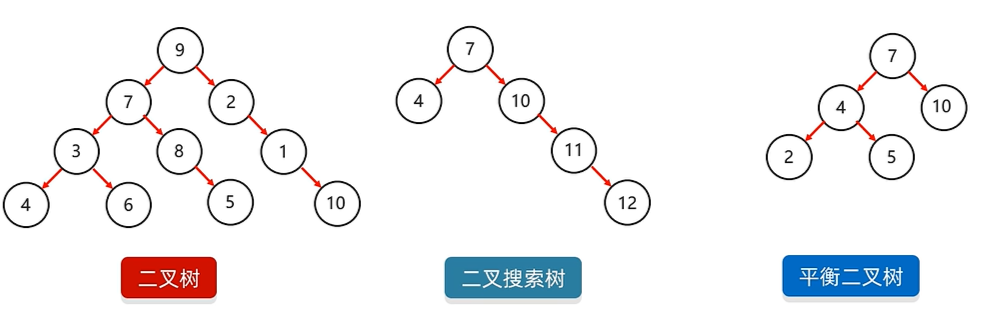
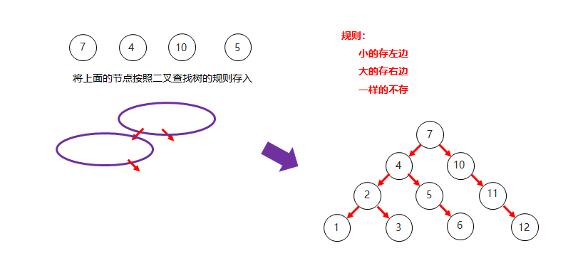
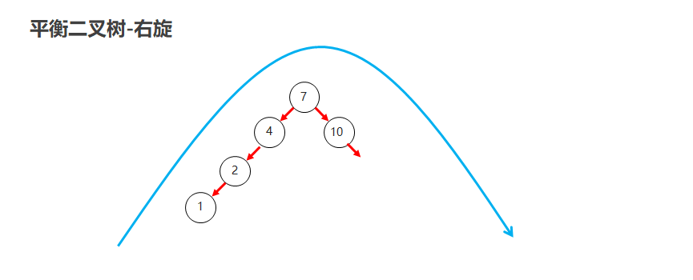

[黑马Java基础教程，零基础快速掌握Java集合框架_哔哩哔哩_bilibili](https://www.bilibili.com/video/BV1fG4y1g76v?spm_id_from=333.788.videopod.episodes&vd_source=796ed40051b301bfa3a84ba357f4828c)

## 一. 集合体系结构

**集合体系分类：**


## 二. Collection 集合

Collection是单列集合的祖宗接口，它的功能是全部单列集合都可以继承使用的。

- Collection是单列集合的顶层接口，所有方法被List和Set系列集合共享
- 常见成员方法：
  `add`、`clear`、`remove`、`contains`、`isEmpty`、`size`
- 三种通用的遍历方式：
  1. 迭代器：在遍历的过程中需要删除元素，请使用迭代器。
  2. 增强 for
  3. Lambda


- ***List系列集合***：添加的元素是**有序、可重复、有索引**
- ***Set系列集合***：添加的元素是**无序、不重复、无索引**

### 实际开发是的集合选择

1. 如果想要集合中的元素**可重复**
   用ArrayList:集合，基于数组的。（用的最多）
2. 如果想要集合中的元素**可重复**，而且当前的**增删**操作明显**多于查询**
   用LinkedList集合，基于链表的。
3. 如果想对集合中的元素**去重**
   用HashSet集合，基于哈希表的。（用的最多）
4. 如果想对集合中的元素**去重**，而且**保证存取顺序**
   用LinkedHashSet集合，基于哈希表和双链表，效率低于HashSet。
5. 如果想对集合中的元素进行**排序**
   用TreeSet集合，基于红黑树。后续也可以用List集合实现排序。

### 1. Collection Api

| 方法名                       | 说明                               |
| :--------------------------- | :--------------------------------- |
| `boolean add(E e)`           | 添加元素                           |
| `boolean remove(Object o)`   | 从集合中移除指定的元素             |
| `boolean removeIf(Object o)` | 根据条件进行移除                   |
| `void clear()`               | 清空集合中的元素                   |
| `boolean contains(Object o)` | 判断集合中是否存在指定的元素       |
| `boolean isEmpty()`          | 判断集合是否为空                   |
| `int size()`                 | 集合的长度，也就是集合中元素的个数 |

注意点：
    Collection是一个接口,我们不能直接创建他的对象。
    所以，现在我们学习他的方法时，只能创建他实现类的对象。
    实现类：ArrayList

```java
public static void main(String[] args) {
/*
       注意点：
        Collection是一个接口,我们不能直接创建他的对象。
        所以，现在我们学习他的方法时，只能创建他实现类的对象。
        实现类：ArrayList
*/
    //目的：为了学习Collection接口里面的方法
    //自己在做一些练习的时候，还是按照之前的方式去创建对象。
    Collection<String> coll = new ArrayList<>();

    //1.添加元素
    //细节1：如果我们要往List系列集合中添加数据，那么方法永远返回true，因为List系列的是允许元素重复的。
    //细节2：如果我们要往Set系列集合中添加数据，如果当前要添加元素不存在，方法返回true，表示添加成功。如果当前要添加的元素已经存在，方法返回false，表示添加失败。因为Set系列的集合不允许重复。
    coll.add("aaa");
    coll.add("bbb");
    coll.add("ccc");
    System.out.println(coll); // [aaa, bbb, ccc]

    //2.清空
    //coll.clear();

    //3.删除
    //细节1：因为Collection里面定义的是共性的方法，所以此时不能通过索引进行删除。只能通过元素的对象进行删除。
    //细节2：方法会有一个布尔类型的返回值，删除成功返回true，删除失败返回false
    //如果要删除的元素不存在，就会删除失败。
    System.out.println(coll.remove("aaa"));
    System.out.println(coll); // [bbb, ccc]

    //4.判断元素是否包含
    //细节：底层是依赖equals方法进行判断是否存在的。
    //所以，如果集合中存储的是自定义对象，也想通过contains方法来判断是否包含，那么在javabean类中，一定要重写equals方法。
    boolean result1 = coll.contains("bbb");
    System.out.println(result1); // true

    //5.判断集合是否为空
    boolean result2 = coll.isEmpty();
    System.out.println(result2);//false

    //6.获取集合的长度
    coll.add("ddd");
    int size = coll.size();
    System.out.println(size);//3
}
```

**`contains()`判断元素是否包含指定的元素**

- 细节：底层是依赖`equals`方法进行判断是否存在的。
- 所以，如果**集合中存储的是自定义对象**，也想**通过`contains`方法来判断是否包含**，那么在javabean类中，一定要**重写equals方法**。

eg:
```java
public class Student {
    private String name;
    private int age;
    public Student() {
    }
    public Student(String name, int age) {
        this.name = name;
        this.age = age;
    }
    public String getName() {
        return name;
    }
    public void setName(String name) {
        this.name = name;
    }
    public int getAge() {
        return age;
    }
    public void setAge(int age) {
        this.age = age;
    }

    // 要使用Collection的contains()判断是否包含在集合中，就必须重写 equals 方法，因为contains方法在底层依赖equals方法判断对象是否一致的。
    @Override
    public boolean equals(Object o) {
        if (this == o) return true;
        if (o == null || getClass() != o.getClass()) return false;
        Student student = (Student) o;
        return age == student.age && Objects.equals(name, student.name);
    }

    public String toString() {
        return "Student{name = " + name + ", age = " + age + "}";
    }
}
public static void main(String[] args) {
    //1.创建集合的对象
    Collection<Student> coll = new ArrayList<>();

    //2.创建三个学生对象
    Student s1 = new Student("zhangsan",23);
    Student s2 = new Student("lisi",24);
    Student s3 = new Student("wangwu",25);

    //3.把学生对象添加到集合当中
    coll.add(s1);
    coll.add(s2);
    coll.add(s3);

    //4.判断集合中某一个学生对象是否包含
    Student s4 = new Student("zhangsan",23);
    //因为contains方法在底层依赖equals方法判断对象是否一致的。
    //如果存的是自定义对象，没有重写equals方法，那么默认使用Object类中的equals方法进行判断，而Object类中equals方法，依赖地址值进行判断。
    //需求：如果同姓名和同年龄，就认为是同一个学生。
    //所以，需要在自定义的Javabean类中，重写equals方法就可以了。
    System.out.println(coll.contains(s4)); // true
}
```

### 2. Collection 的遍历方式

1. 迭代器遍历
2. 增强 for 遍历
3. Lambda 表达式遍历

#### 2.1 迭代器遍历

**迭代器在Java中的类是`Iterator`**,迭代器是**集合专用的遍历方式**。迭代器在遍历集合的时候是**不依赖索引**的

**Collection 集合获取迭代器：**

- `Interator<E> iterator()`：返回迭代器对象，默认指向当前集合的0索引

**`Iterator`中的常用方法：**

- `boolean hasNext()`：判断**当前位置是否有元素**，有元素返回true,没有元素返回false
- `E next()`：**获取当前**位置的**元素**，并将迭代器对象**移向下一个位置**。

```java
//1.创建集合并添加元素
Collection<String> coll = new ArrayList<>();
coll.add("aaa");
coll.add("bbb");
coll.add("ccc");
coll.add("ddd");

//2.获取迭代器对象
//迭代器就好比是一个箭头，默认指向集合的0索引处
Iterator<String> it = coll.iterator();
//3.利用循环不断的去获取集合中的每一个元素
while(it.hasNext()){
    //4.next方法的两件事情：获取元素并移动指针
    String str = it.next();
    System.out.print(str + " "); // aaa bbb ccc ddd 
}
```

细节注意点：

1. 如果当前指针的`hasNext()`为`false`，继续调用`next()`则报错`NoSuchElementException`没有这个元素
2. 迭代器遍历完毕，指针不会复位
3. 迭代器遍历时，不能用集合的方法进行增加或者删除。如果我实在要删除：那么可以用迭代器提供的`remove`方法进行删除。如果我要添加，暂时没有办法。

#### 2.2 增强 for 遍历

- 增强for的底层就是迭代器，为了简化迭代器的代码书写的。
- 它是JDK5之后出现的，其内部原理就是一个Iterator迭代器
- **所有的单列集合**和**数组**才能用增强for进行遍历

格式：
```java
for (元素的数据类型变量名 : 数组或者集合) {
}
```

eg:

```java
//1.创建集合并添加元素
Collection<String> coll = new ArrayList<>();
coll.add("zhangsan");
coll.add("lisi");
coll.add("wangwu");

//2.利用增强for进行遍历
//注意点：
//   s 其实就是一个第三方变量，在循环的过程中依次表示集合中的每一个数据
for(String s : coll){
    s = "qqq"; // 修改s的值，不会影响集合中的数据
}

System.out.println(coll);//zhangsan lisi wangwu
```

小细节：修改增强for中的变量，不会改变集合中原本的数据。

#### 2.3 Lambda 表达式遍历

Iterable.class 接口中的抽象方法：`default void forEach(Consumer<? super T> action;`

```java
//1.创建集合并添加元素
Collection<String> coll = new ArrayList<>();
coll.add("zhangsan");
coll.add("lisi");
coll.add("wangwu");
//2.利用匿名内部类的形式
//底层原理：
//其实也会自己遍历集合，依次得到每一个元素
//把得到的每一个元素，传递给下面的accept方法
//s依次表示集合中的每一个数据
/* coll.forEach(new Consumer<String>() {
	  @Override
	  public void accept(String s) {
  		System.out.println(s);
      }
   });*/
//lambda表达式
coll.forEach(s -> System.out.print(s + " ")); // zhangsan lisi wangwu 
```

## 三. List 集合


**List 集合的特点：**

- **有序**：存和取的元素顺序一致
- **有索引**：可以通过索引操作元素
- **可重复**：存储的元素可以重复

### 1. List集合的特有方法

- [`Collection`的方法](###1. Collection Api)`List`都继承了
- `List`集合因为有索引，所以**多了很多索引操作的方法**。

| 方法名称                        | 说明                                       |
| ------------------------------- | ------------------------------------------ |
| `void add(int index,E element)` | 在此集合中的**指定位置插入**指定的元素     |
| `E remove(int index)`           | **删除指定索引**处的元素，返回被删除的元素 |
| `E set(int index,E element)`    | **修改指定索引**处的元素，返回被修改的元素 |
| `E get(int index)`              | **返回指定索引**处的元素                   |

```java
// 1. 创建一个集合
List<String> list = new ArrayList<>();
// 2. 添加元素
list.add("aaa");
list.add("bbb"); // 1
list.add("ccc");

// void add(int index,E element)       在此集合中的指定位置插入指定的元素
// 细节：原来索引上的元素会依次往后移
list.add(1, "QQQ"); // list:[aaa, QQQ, bbb, ccc]

// E remove(int index)                 删除指定索引处的元素，返回被删除的元素
String remove = list.remove(0); // list:[QQQ, bbb, ccc]
System.out.println(remove); // aaa

// E set(int index,E element)          修改指定索引处的元素，返回被修改的元素
String result = list.set(0, "111"); // list:[111, bbb, ccc]
System.out.println(result); // QQQ

// E get(int index)                    返回指定索引处的元素
String s = list.get(0);
System.out.println(s); // 111

// 3.打印集合
System.out.println(list); // [111, bbb, ccc]
```

`public E remove(int index)`[**通过索引进行删除**]与`boolean remove(Object o)`[**直接删除**元素]***小细节*：**

```java
// 1. 创建集合并添加元素
List<Integer> list = new ArrayList<>();
list.add(1);
list.add(2);
list.add(3);
// 2. 删除元素
// 请问：此时删除的是1这个元素，还是1索引上的元素？为什么？
// 		因为在调用方法的时候，如果方法出现了重载现象
// 		优先调用，实参跟形参类型一致的那个方法。
list.remove(1); // 删除的是索引为1的元素 public E remove(int index)
//手动装箱，手动把基本数据类型的1，变成Integer类型
Integer i = Integer.valueOf(1);
list.remove(i); // 删除的是1这个元素 boolean remove(Object o)
System.out.println(list); // [3]
```

### 2. List 集合的遍历方式

1. **迭代器**：在遍历的过程中需要**删除元素**，请使用迭代器。
2. **增强for**：仅仅**想遍历**，那么使用增强for或Lambda表达式。
3. **Lambda表达式**：仅仅想**遍历**，那么使用增强for或Lambda表达式。
4. **普通for循环**：如果遍历的时候想**操作索引**，可以用普通for。
5. **列表迭代器**：在遍历的过程中需要**添加元素**，请使用列表迭代器。

```java
// 创建集合并添加元素
List<String> list = new ArrayList<>();
list.add("aaa");
list.add("bbb");
list.add("ccc");

// 1. 迭代器
Iterator<String> it = list.iterator();
while(it.hasNext()){
    String str = it.next();
    System.out.println(str);
}

// 2. 增强for
//下面的变量s，其实就是一个第三方的变量而已。
//在循环的过程中，依次表示集合中的每一个元素
for (String s : list) {
    System.out.println(s);
}

// 3. Lambda表达式
// forEach方法的底层其实就是一个循环遍历，依次得到集合中的每一个元素
// 并把每一个元素传递给下面的accept方法
// accept方法的形参s，依次表示集合中的每一个元素
list.forEach(s->System.out.println(s) );

// 4. 普通for循环
// size方法跟get方法还有循环结合的方式，利用索引获取到集合中的每一个元素
for (int i = 0; i < list.size(); i++) {
    // i: 依次表示集合中的每一个索引
    String s = list.get(i);
    System.out.println(s);
}
// 列表迭代器见下
```

***列表迭代器*：**

**List 接口中获取列表迭代器的方法：**`ListIterator<E> listIterator();`

**`ListIterator`中的常用方法：**

- `boolean hasNext()`：判断**当前位置是否有元素**，有元素返回true,没有元素返回false
- `E next()`：**获取当前**位置的**元素**，并将迭代器对象**移向下一个位置**。
- `boolean hasPrevious()`：判断**当前位置是否有前一个元素**，有前一个元素返回true，没有前一个元素返回false
- `E previous()`：**获取当前**位置的**前一个元素**，并将迭代器对象**移向前一个位置**。
- `int nextIndex()`：返回**当前位置的下一个元素的索引**，如果当前位置是最后一个元素，则返回列表的大小。
- `int previousIndex()`：返回**当前位置的前一个元素的索引**，如果当前位置是第一个元素，则返回 -1。
- `void remove()`：删除**最近返回的元素**，这是调用 `next()` 或 `previous()` 后能使用的方法。
- `void set(E e)`：用指定的元素**替换最近返回的元素**，该元素必须是通过 `next()` 或 `previous()` 方法获得的。
- `void add(E e)`：在当前**当前位置插入指定元素**，使得迭代器的当前位置索引发生改变。

```java
//获取一个列表迭代器的对象，里面的指针默认也是指向0索引的

ListIterator<String> it1 = list.listIterator();
while(it1.hasNext()){
    String str = it1.next();
    if("bbb".equals(str)){
        // qqq 使用列表迭代器的方法对原list进行操作不会影响原迭代器的遍历
        it1.add("qqq");
    }
    System.out.print(str + " "); // aaa bbb ccc
}
System.out.println(list); // [aaa, bbb, qqq, ccc]
```

### 3. List集合子类的特点

- ArrayList集合

  ​	底层是数组结构实现，查询快、增删慢

- LinkedList集合

  ​	底层是链表结构实现，查询慢、增删快

### 4. LinkedList集合的特有功能

- 特有方法

  | 方法名                    | 说明                             |
  | ------------------------- | -------------------------------- |
  | public void addFirst(E e) | 在该列表开头插入指定的元素       |
  | public void addLast(E e)  | 将指定的元素追加到此列表的末尾   |
  | public E getFirst()       | 返回此列表中的第一个元素         |
  | public   E getLast()      | 返回此列表中的最后一个元素       |
  | public E removeFirst()    | 从此列表中删除并返回第一个元素   |
  | public   E removeLast()   | 从此列表中删除并返回最后一个元素 |

- 示例代码

  ```java
  public class MyLinkedListDemo4 {
      public static void main(String[] args) {
          LinkedList<String> list = new LinkedList<>();
          list.add("aaa");
          list.add("bbb");
          list.add("ccc");
  //        public void addFirst(E e)	在该列表开头插入指定的元素
          //method1(list);
  
  //        public void addLast(E e)	将指定的元素追加到此列表的末尾
          //method2(list);
  
  //        public E getFirst()		返回此列表中的第一个元素
  //        public E getLast()		返回此列表中的最后一个元素
          //method3(list);
  
  //        public E removeFirst()		从此列表中删除并返回第一个元素
  //        public E removeLast()		从此列表中删除并返回最后一个元素
          //method4(list);
        
      }
  
      private static void method4(LinkedList<String> list) {
          String first = list.removeFirst();
          System.out.println(first);
  
          String last = list.removeLast();
          System.out.println(last);
  
          System.out.println(list);
      }
  
      private static void method3(LinkedList<String> list) {
          String first = list.getFirst();
          String last = list.getLast();
          System.out.println(first);
          System.out.println(last);
      }
  
      private static void method2(LinkedList<String> list) {
          list.addLast("www");
          System.out.println(list);
      }
  
      private static void method1(LinkedList<String> list) {
          list.addFirst("qqq");
          System.out.println(list);
      }
  }
  ```

## 四. Set 集合


Lst系列集合：添加的元素是有序、可重复、有索引
Set系列集合：添加的元素是无序、不重复、无索引

### 1. Set集合概述和特点

Set 集合特点：

+ 无序：存取顺序不一致
+ 不重复：可以去除重复
+ 无索引：没有带索引的方法，所以不能使用普通fo循环遍历，也不能通过索引来获取元素

**Set 集合为的实现类：**

- HashSet:无序、不重复、无索引
- LinkedHashSet:有序、不重复、无索引
- TreeSet:可排序、不重复、无索引

**Set接口中的方法上基本上与Collection的API一致。**

```java
//1.创建一个Set集合的对象
Set<String> s = new HashSet<>();

//2,添加元素
//如果当前元素是第一次添加，那么可以添加成功，返回true
//如果当前元素是第二次添加，那么添加失败，返回false
boolean r1 = s.add("张三"); // true
boolean r2 = s.add("张三"); // false
s.add("李四");
s.add("王五");

//3.打印集合
//无序
System.out.println(s);//[李四, 张三, 王五]

//迭代器遍历
Iterator<String> it = s.iterator();
while (it.hasNext()){
    String str = it.next();
    System.out.print(str + " ");
}

//增强for
for (String str : s) {
    System.out.print(str + " ");
}

// Lambda表达式
s.forEach( str->System.out.print(str + " "));
}
```

### 2. HashSet

#### 2.1 HashSet 特点

- 底层数据结构是**哈希表**
- 存取无序
- 不可以存储重复元素
- 没有索引,不能使用普通for循环遍历
- 哈希表是一种对于增删改查数据性能都较好的结构

#### 2.2 HashSet 底层原理


**HashSet 组成：**

JDK8之前：数组+链表

JDK8开始：

- 数组 + 链表

- 当链表长度超过8，而目数组长度大于等于64时自动转换为红黑树

  数组 + 红黑树

**HashSet 的细节：**

- JDK8以后，当链表长度超过8，而且数组长度大于等于64时，自动转换为红黑树
- 如果集合中存储的是自定义对象，必须要重韦hashCode和equals方法

#### 2.3 哈希值

- 哈希值简介

  ​	是JDK根据对象的地址或者字符串或者数字算出来的int类型的数值

- 如何获取哈希值

  ​	Object类中的public int hashCode()：返回对象的哈希码值

- 哈希值的特点

  - 同一个对象多次调用hashCode()方法返回的哈希值是相同的
  - 默认情况下，不同对象的哈希值是不同的。而重写hashCode()方法，可以实现让不同对象的哈希值相同

#### 2.4 HashSet集合存储学生对象并遍历

- 案例需求

  - 创建一个存储学生对象的集合，存储多个学生对象，使用程序实现在控制台遍历该集合
  - 要求：学生对象的成员变量值相同，我们就认为是同一个对象

- 代码实现

  学生类

  ```java
  public class Student {
      private String name;
      private int age;
  
      public Student() {
      }
  
      public Student(String name, int age) {
          this.name = name;
          this.age = age;
      }
  
      public String getName() {
          return name;
      }
  
      public void setName(String name) {
          this.name = name;
      }
  
      public int getAge() {
          return age;
      }
  
      public void setAge(int age) {
          this.age = age;
      }
  
      @Override
      public boolean equals(Object o) {
          if (this == o) return true;
          if (o == null || getClass() != o.getClass()) return false;
  
          Student student = (Student) o;
  
          if (age != student.age) return false;
          return name != null ? name.equals(student.name) : student.name == null;
      }
  
      @Override
      public int hashCode() {
          int result = name != null ? name.hashCode() : 0;
          result = 31 * result + age;
          return result;
      }
  }
  ```

  测试类

  ```java
  public class HashSetDemo02 {
      public static void main(String[] args) {
          //创建HashSet集合对象
          HashSet<Student> hs = new HashSet<Student>();
  
          //创建学生对象
          Student s1 = new Student("林青霞", 30);
          Student s2 = new Student("张曼玉", 35);
          Student s3 = new Student("王祖贤", 33);
  
          Student s4 = new Student("王祖贤", 33);
  
          //把学生添加到集合
          hs.add(s1);
          hs.add(s2);
          hs.add(s3);
          hs.add(s4);
  
          //遍历集合(增强for)
          for (Student s : hs) {
              System.out.println(s.getName() + "," + s.getAge());
          }
      }
  }
  ```

- 总结

  ​	HashSet集合存储自定义类型元素,要想实现元素的唯一,要求必须重写hashCode方法和equals方法

### 3. LinkedHashSet


LinkedHashSet 底层原理

- 有序、不重复、无索引。
- 这里的有序指的是**保证存储和取出的元素顺序一致**
- 原理：底层数据结构是依然哈希表，**只是每个元素又额外的多了一个双链表的机制记录存储的顺序。**

**总结：**

1. LinkedHashSet:集合的特点和原理是怎么样的？
   - 有序、不重复、无索引
   - 底层基于哈希表，使用双链表记录添加顺序
2. 在以后如果要数据去重，我们使用哪个？
   - 默认使用HashSet
   - 如果要求去重且存取有序，才使用LinkedHashSet

### 4. TreeSet

TreeSet 底层是**红黑树结构**

#### 4.1 TreeSet 特点

+ 可排序、不重复、无索引
+ 底层基于红黑树实现排序，增删改查性能较好


**可以将元素按照规则进行排序**

+ TreeSet()：根据其元素的自然排序进行排序
+ TreeSet(Comparator comparator) ：根据指定的比较器进行排序

TreeSet集合自**定义排序规则**：

- 方式一：Javabean类实现Comparable接口，指定比较规则
- 方式二：创建集合时，自定义Comparator比较器对象，指定比较。两种方式都存在以方式二为准

#### 4.2  TreeSet 默认排序规则

- 数值类型：
  Integer,Double,默认按照从小到大的顺序进行排序。
- 字符、字符串类型：
  按照字符在ASCII码表中的数字升序进行排序。

#### 4.3 TreeSet集合基本使用

存储Integer类型的整数并遍历

```java
//创建集合对象
TreeSet<Integer> ts = new TreeSet<Integer>();

//添加元素
ts.add(10);
ts.add(40);
ts.add(30);
ts.add(50);
ts.add(20);

ts.add(30);

//遍历集合
for(Integer i : ts) {
    System.out.print(i + " "); // 10 20 30 40 50 
}
```

#### 4.4 自然排序Comparable的使用

- 案例需求

  - 存储学生对象并遍历，创建TreeSet集合**使用无参构造方法**
  - 要求：按照**年龄从小到大排序，年龄相同时，按照姓名的字母顺序排序**

- 实现步骤

  1. 使用空参构造创建TreeSet集合
     + 用TreeSet集合存储自定义对象，无参构造方法使用的是自然排序对元素进行排序的
  2. 自定义的Student类实现Comparable接口
     + 自然排序，就是让元素所属的类实现Comparable接口，重写compareTo(T o)方法
  3. 重写接口中的compareTo方法
     + 重写方法时，一定要注意排序规则必须按照要求的主要条件和次要条件来写

- 代码实现

  学生类

  ```java
  public class Student implements Comparable<Student>{
      private String name;
      private int age;
  
      public Student() {
      }
  
      public Student(String name, int age) {
          this.name = name;
          this.age = age;
      }
  
      public String getName() {
          return name;
      }
  
      public void setName(String name) {
          this.name = name;
      }
  
      public int getAge() {
          return age;
      }
  
      public void setAge(int age) {
          this.age = age;
      }
  
      @Override
      public String toString() {
          return "Student{" +
                  "name='" + name + '\'' +
                  ", age=" + age +
                  '}';
      }
  
      @Override
      public int compareTo(Student o) {
          //按照对象的年龄进行排序
          //主要判断条件: 按照年龄从小到大排序
          int result = this.age - o.age;
          //次要判断条件: 年龄相同时，按照姓名的字母顺序排序
          result = result == 0 ? this.name.compareTo(o.getName()) : result;
          return result;
      }
  }
  ```

  测试类

  ```java
  public class MyTreeSet2 {
      public static void main(String[] args) {
          //创建集合对象
          TreeSet<Student> ts = new TreeSet<>();
  	    //创建学生对象
          Student s1 = new Student("zhangsan",28);
          Student s2 = new Student("lisi",27);
          Student s3 = new Student("wangwu",29);
          Student s4 = new Student("zhaoliu",28);
          Student s5 = new Student("qianqi",30);
  		//把学生添加到集合
          ts.add(s1);
          ts.add(s2);
          ts.add(s3);
          ts.add(s4);
          ts.add(s5);
  		//遍历集合
          for (Student student : ts) {
              System.out.println(student);
          }
      }
  }
  ```

#### 4.5 比较器排序Comparator的使用

- 案例需求

  - 存储老师对象并遍历，创建**TreeSet集合使用带参构造方法**
  - 要求：按照年龄从小到大排序，年龄相同时，按照姓名的字母顺序排序

- 实现步骤

  - 用TreeSet集合存储自定义对象，带参构造方法使用的是比较器排序对元素进行排序的
  - 比较器排序，就是让集合构造方法接收Comparator的实现类对象，重写compare(T o1,T o2)方法
  - 重写方法时，一定要注意排序规则必须按照要求的主要条件和次要条件来写

- 代码实现

  老师类

  ```java
  public class Teacher {
      private String name;
      private int age;
  
      public Teacher() {
      }
  
      public Teacher(String name, int age) {
          this.name = name;
          this.age = age;
      }
  
      public String getName() {
          return name;
      }
  
      public void setName(String name) {
          this.name = name;
      }
  
      public int getAge() {
          return age;
      }
  
      public void setAge(int age) {
          this.age = age;
      }
  
      @Override
      public String toString() {
          return "Teacher{" +
                  "name='" + name + '\'' +
                  ", age=" + age +
                  '}';
      }
  }
  ```

  测试类

  ```java
  public class MyTreeSet4 {
      public static void main(String[] args) {
        	//创建集合对象
          TreeSet<Teacher> ts = new TreeSet<>(new Comparator<Teacher>() {
              @Override
              public int compare(Teacher o1, Teacher o2) {
                  //o1表示现在要存入的那个元素
                  //o2表示已经存入到集合中的元素
                
                  //主要条件
                  int result = o1.getAge() - o2.getAge();
                  //次要条件
                  result = result == 0 ? o1.getName().compareTo(o2.getName()) : result;
                  return result;
              }
          });
          
  		//创建老师对象
          Teacher t1 = new Teacher("zhangsan",23);
          Teacher t2 = new Teacher("lisi",22);
          Teacher t3 = new Teacher("wangwu",24);
          Teacher t4 = new Teacher("zhaoliu",24);
  		//把老师添加到集合
          ts.add(t1);
          ts.add(t2);
          ts.add(t3);
          ts.add(t4);
  		//遍历集合
          for (Teacher teacher : ts) {
              System.out.println(teacher);
          }
      }
  }
  ```

#### 4.6 b两种比较方式总结

+ 两种比较方式小结
  + 自然排序: 自定义类实现Comparable接口,重写compareTo方法,根据返回值进行排序
  + 比较器排序: 创建TreeSet对象的时候传递Comparator的实现类对象,重写compare方法,根据返回值进行排序
  + 在使用的时候,默认使用自然排序,当自然排序不满足现在的需求时,必须使用比较器排序
+ 两种方式中关于返回值的规则
  + 如果返回值为负数，表示当前存入的元素是较小值，存左边
  + 如果返回值为0，表示当前存入的元素跟集合中元素重复了，不存
  + 如果返回值为正数，表示当前存入的元素是较大值，存右边

## 五. Map 集合


双列集合的特点

1. 双列集合一次需要存一对数据，分别为键和值
2. 键不能重复，值可以重复
3. 键和值是一一对应的，每一个键只能找到自己对应的值
4. 键 + 值 这个整体我们称之为 “键值对” 或者 “键值对对象” ，在]ava中叫做 “ Entry 对象”

### 1. Map集合概述和特点

- Map集合概述

  ```java
  interface Map<K,V>  K：键的类型；V：值的类型
  ```

- Map集合的特点

  - 双列集合,一个键对应一个值
  - 键不可以重复，值可以重复

- Map集合的基本使用

  ```java
  public class MapDemo01 {
      public static void main(String[] args) {
          // 创建集合对象
          Map<String,String> map = new HashMap<String,String>();
  
          // V put(K key, V value) 将指定的值与该映射中的指定键相关联
          map.put("itheima001","林青霞");
          map.put("itheima002","张曼玉");
          map.put("itheima003","王祖贤");
          map.put("itheima003","柳岩");
  
          //输出集合对象
          System.out.println(map);
      }
  }
  ```

### 2. Map集合的基本功能

Map 是双列集合的顶层接口，它的功能是全部双列集合都可以继承使用的

- 方法介绍

  | 方法名                                | 说明                                     |
  | ------------------------------------- | ---------------------------------------- |
  | `V put(K key,V   value)`              | **添加**元素 返回被覆盖的元素            |
  | `V remove(Object key)`                | **根据键删除**键值对元素                 |
  | `void clear()`                        | **移除所有**的键值对元素                 |
  | `boolean containsKey(Object key)`     | 判断集合是否**包含**指定的**键**         |
  | `boolean containsValue(Object value)` | 判断集合是否**包含**指定的**值**         |
  | `boolean isEmpty()`                   | 判断集合**是否为空**                     |
  | `int size()`                          | 集合的**长度**，也就是集合中键值对的个数 |

- 示例代码

  ```java
  // 1. 创建Map集合的对象
  Map<String, String> m = new HashMap<>();
  
  // 2. 添加元素
  // put方法的细节：
  // 添加/覆盖
  // 在添加数据的时候，如果键不存在，那么直接把键值对对象添加到map集合当中,方法返回null
  // 在添加数据的时候，如果键是存在的，那么会把原有的键值对对象覆盖，会把被覆盖的值进行返回。
  m.put("郭靖", "黄蓉");
  m.put("韦小宝","沐剑屏");
  m.put("尹志平","小龙女");
  
  String value2 = m.put("韦小宝", "双儿");
  System.out.println(value2); // 沐剑屏 被覆盖的值
  
  // 删除
  String result = m.remove("郭靖");
  System.out.println(result); // 黄蓉
  
  // 清空
  //  m.clear();
  
  // 判断是否包含
  boolean keyResult = m.containsKey("郭靖");
  System.out.println(keyResult); // false
  
  boolean valueResult = m.containsValue("小龙女2");
  System.out.println(valueResult); // false
  
  boolean result1 = m.isEmpty();
  System.out.println(result1); // false
  
  int size = m.size();
  System.out.println(size); // 2
  
  //3.打印集合
  System.out.println(m); // {韦小宝=双儿, 尹志平=小龙女}
  ```

### 3. Map集合的获取功能

- 方法介绍

  | 方法名                           | 说明                         |
  | -------------------------------- | ---------------------------- |
  | `V get(Object key)`              | 根据**键获取值**             |
  | `Set<K> keySet()`                | 获取**所有键**的集合         |
  | `Collection<V> values()`         | 获取**所有值**的集合         |
  | `Set<Map.Entry<K,V>> entrySet()` | 获取**所有键值对**对象的集合 |

- 示例代码

  ```java
  public class MapDemo03 {
      public static void main(String[] args) {
          //创建集合对象
          Map<String, String> map = new HashMap<String, String>();
  
          //添加元素
          map.put("张无忌", "赵敏");
          map.put("郭靖", "黄蓉");
          map.put("杨过", "小龙女");
  
          //V get(Object key):根据键获取值
  //        System.out.println(map.get("张无忌"));
  //        System.out.println(map.get("张三丰"));
  
          //Set<K> keySet():获取所有键的集合
  //        Set<String> keySet = map.keySet();
  //        for(String key : keySet) {
  //            System.out.println(key);
  //        }
  
          //Collection<V> values():获取所有值的集合
          Collection<String> values = map.values();
          for(String value : values) {
              System.out.println(value);
          }
      }
  }
  ```

### 4. Map集合的遍历(键找值)

- 遍历思路

  - 我们刚才存储的元素都是成对出现的，所以我们把Map看成是一个夫妻对的集合
    - 把所有的丈夫给集中起来
    - 遍历丈夫的集合，获取到每一个丈夫
    - 根据丈夫去找对应的妻子

- 步骤分析

  - **获取所有键**的集合。用`keySet()`方法实现
  - 遍历键的集合，**获取到每一个键**。
    1. 用增强`for`实现 
    2. 用迭代器实现
    3. 用 lambda 表达式实现
  - **根据键去找值**。用`get(Object key)`方法实现

- 代码实现

  ```java
  // 1. 创建Map集合的对象
  Map<String,String> map = new HashMap<>();
  
  // 2. 添加元素
  map.put("尹志平","小龙女");
  map.put("郭靖","穆念慈");
  map.put("欧阳克","黄蓉");
  
  // 3. 通过键找值
  
  // 3.1 获取所有的键，把这些键放到一个单列集合当中
  Set<String> keys = map.keySet();
  // 3.2 遍历单列集合，得到每一个键 增强for的方式
  for (String key : keys) {
      //System.out.println(key);
      //3.3 利用map集合中的键获取对应的值  get
      String value = map.get(key);
      System.out.println(key + " = " + value);
  }
  
  System.out.println("-------------------------");
  
  // 3.2 遍历单列集合，得到每一个键 迭代器的方式
  Iterator<String> iterator = keys.iterator();
  while (iterator.hasNext()) {
      String next = iterator.next();
      System.out.println(next + " = " + map.get(next));
  }
  
  System.out.println("-------------------------");
  
  // 3.2 遍历单列集合，得到每一个键 lambda 表达式的方式
  keys.forEach(key -> System.out.println(key + " = " + map.get(key)));
  ```

### 5. Map集合的遍历(键值对)

- 遍历思路

  - 我们刚才存储的元素都是成对出现的，所以我们把Map看成是一个夫妻对的集合
    - 获取所有结婚证的集合
    - 遍历结婚证的集合，得到每一个结婚证
    - 根据结婚证获取丈夫和妻子

- 步骤分析

  - **获取所有键值对对象的集合**
    - `Set<Map.Entry<K,V>> entrySet()`：获取所有键值对对象的集合
  - **遍历**键值对对象的**集合**，得到每一个键值对对象
    - 用增强`for`实现，得到每一个`Map.Entry`
  - 根据键值对对象**获取键和值**
    - 用getKey()得到键
    - 用getValue()得到值

- 代码实现

  ```java
  // 1. 创建Map集合的对象
  Map<String, String> map = new HashMap<>();
  
  // 2. 添加元素
  // 键：人物的外号
  // 值：人物的名字
  map.put("标枪选手", "马超");
  map.put("人物挂件", "明世隐");
  map.put("御龙骑士", "尹志平");
  
  // 3. Map集合的第二种遍历方式
  //通过键值对对象进行遍历
  // 3.1 通过一个方法获取所有的键值对对象，返回一个Set集合
  Set<Map.Entry<String, String>> entries = map.entrySet();
  // 3.2 遍历entries这个集合，去得到里面的每一个键值对对象
  for (Map.Entry<String, String> entry : entries) {//entry  --->  "御龙骑士","尹志平"
      //3.3 利用entry调用get方法获取键和值
      String key = entry.getKey();
      String value = entry.getValue();
      System.out.println(key + "=" + value);
  }
  
  System.out.println("-------------------------");
  
  
  // 3. Map集合的第二种遍历方式
  // 通过键值对对象进行遍历
  // 3.1 通过一个方法获取所有的键值对对象，返回一个Set集合
  // 3.2 遍历entries这个集合，去得到里面的每一个键值对对象
  for (Map.Entry<String, String> entry :  map.entrySet()) {//entry  --->  "御龙骑士","尹志平"
      //3.3 利用entry调用get方法获取键和值
      String key = entry.getKey();
      String value = entry.getValue();
      System.out.println(key + "=" + value);
  }
  ```

### 6. Map集合的遍历方式(Lambda表达式)

方法：

```java
default void forEach(BiConsumer<? super K, ? super V> action)
```

结合 Lambda 遍历 Map 集合

```java
// 1. 创建Map集合的对象
Map<String,String> map = new HashMap<>();

// 2. 添加元素
// 键：人物的名字
// 值：名人名言
map.put("鲁迅", "这句话是我说的");
map.put("曹操", "不可能绝对不可能");
map.put("刘备", "接着奏乐接着舞");
map.put("柯镇恶", "看我眼色行事");

// 3. 利用lambda表达式进行遍历
// 底层：
// forEach其实就是利用第二种方式进行遍历，依次得到每一个键和值
// 再调用accept方法
map.forEach(new BiConsumer<String, String>() {
    @Override
    public void accept(String key, String value) {
        System.out.println(key + "=" + value);
    }
});

System.out.println("-----------------------------------");

map.forEach((String key, String value)->{
        System.out.println(key + "=" + value);
    }
);

System.out.println("-----------------------------------");

map.forEach((key, value)-> System.out.println(key + "=" + value));
```

## 六. HashMap 集合


### 1. HashMap集合概述和特点

1. HashMap: 是Map里面的一个实现类。
2. 没有额外需要学习的特有方法，直接使用Map里面的方法就可以了。
3. 特点都是由键决定的：**无序、不重复、无索引**
4. HashMap 跟 HashSet 底层原理是一模一样的，都是**哈希表结构**

注意：

+ 依赖hashCode方法和equals方法保证键的唯一
+ 如果键要存储的是自定义对象，需要重写hashCode和equals方法

### 2. HashMap集合应用案例

#### 2.1 HashMap集合案例一

- 案例需求

  - 创建一个HashMap集合，键是学生对象(Student)，值是居住地 (String)。存储多个元素，并遍历。
  - 要求保证键的唯一性：如果学生对象的成员变量值相同，我们就认为是同一个对象

- 代码实现

  学生类

  ```java
  // 核心点：HashMap的键位置如果存储的是自定义对象，需要重写hashCode和equals方法。
   
  public class Student {
      private String name;
      private int age;
  
      public Student() {
      }
  
      public Student(String name, int age) {
          this.name = name;
          this.age = age;
      }
  
      public String getName() {
          return name;
      }
  
      public void setName(String name) {
          this.name = name;
      }
  
      public int getAge() {
          return age;
      }
  
      public void setAge(int age) {
          this.age = age;
      }
  
      @Override
      public boolean equals(Object o) {
          if (this == o) return true;
          if (o == null || getClass() != o.getClass()) return false;
  
          Student student = (Student) o;
  
          if (age != student.age) return false;
          return name != null ? name.equals(student.name) : student.name == null;
      }
  
      @Override
      public int hashCode() {
          int result = name != null ? name.hashCode() : 0;
          result = 31 * result + age;
          return result;
      }
  }
  ```

  测试类
  
  ```java
  // 1. 创建HashMap的对象
  HashMap<Student,String> hm = new HashMap<>();
  
  // 2. 创建三个学生对象
  Student s1 = new Student("zhangsan",23);
  Student s2 = new Student("lisi",24);
  Student s3 = new Student("wangwu",25);
  Student s4 = new Student("wangwu",25);
  
  // 3. 添加元素
  hm.put(s1,"江苏");
  hm.put(s2,"浙江");
  hm.put(s3,"福建"); // 被覆盖
  hm.put(s4,"山东");
  
  //4.遍历集合
  Set<Student> keys = hm.keySet();
  for (Student key : keys) {
      String value = hm.get(key);
      System.out.println(key + "=" + value);
  }
  
  System.out.println("--------------------------");
  
  Set<Map.Entry<Student, String>> entries = hm.entrySet();
  for (Map.Entry<Student, String> entry : entries) {
      Student key = entry.getKey();
      String value = entry.getValue();
      System.out.println(key + "=" + value);
  }
  
  System.out.println("--------------------------");
  
  hm.forEach((student, s)-> System.out.println(student + "=" +  s));
  ```
  
  ```java
  Student{name = lisi, age = 24}=浙江
  Student{name = zhangsan, age = 23}=江苏
  Student{name = wangwu, age = 25}=山东
  ```

#### 2.2 HashMap集合案例二

 某个班级80名学生，现在需要组成秋游活动，班长提供了四个景点依次是（A、B、C、D）, 每个学生只能选择一个景点，请统计出最终哪个景点想去的人数最多。

```java
// 1. 需要先让同学们投票
// 定义一个数组，存储4个景点
String[] arr = {"A","B","C","D"};
// 利用随机数模拟80个同学的投票，并把投票的结果存储起来
ArrayList<String> list = new ArrayList<>();
Random r = new Random();
for (int i = 0; i < 80; i++) {
    int index = r.nextInt(arr.length);
    list.add(arr[index]);
}
// 2. 如果要统计的东西比较多，不方便使用计数器思想
// 我们可以定义map集合，利用集合进行统计。
HashMap<String,Integer> hm = new HashMap<>();
for (String name : list) {
    // 判断当前的景点在map集合当中是否存在
    if(hm.containsKey(name)){
        // 存在
        // 先获取当前景点已经被投票的次数
        int count = hm.get(name);
        // 表示当前景点又被投了一次
        count++;
        // 把新的次数再次添加到集合当中
        hm.put(name,count);
    } else {
        // 不存在
        hm.put(name,1);
    }
}

System.out.println(hm); // {A=26, B=19, C=19, D=16}

// 3. 求最大值
int max = 0;
Set<Map.Entry<String, Integer>> entries = hm.entrySet();
for (Map.Entry<String, Integer> entry : entries) {
    int count = entry.getValue();
    if(count > max){
        max = count;
    }
}
System.out.println(max); // 26
// 4. 判断哪个景点的次数跟最大值一样，如果一样，打印出来
for (Map.Entry<String, Integer> entry : entries) {
    int count = entry.getValue();
    if(count == max){
        System.out.println(entry.getKey()); // A
    }
}

// lambda 方式打印最大值及其景点
list.stream()
    .collect(groupingBy(k -> k, counting()))
    .entrySet().stream()
    .max(Comparator.comparingLong(entry -> entry.getValue()))
    .ifPresent(entry -> {
        System.out.println("最多投票的选项: " + entry.getKey()); // A
        System.out.println("该选项的票数: " + entry.getValue()); // 26
    });

list.stream()
    .collect(groupingBy(k -> k, counting()))
    .entrySet().stream()
    .max(Map.Entry.comparingByValue())
    .ifPresent(entry -> {
        System.out.println("最多投票的选项: " + entry.getKey()); // A
        System.out.println("该选项的票数: " + entry.getValue()); // 26
    });
```

## 七. LinkedHashMap 集合


特点：

1. 由键决定：**有序、不重复、无索引**。
2. 这里的有序指的是保证存储和取出的元素顺序一致
3. **原理**：底层数据结构是依然哈希表，只是每个键值对元素又额外的多了一个双链表的机制记录存储的顺序。

```java
//1.创建集合
LinkedHashMap<String,Integer> lhm = new LinkedHashMap<>();

//2.添加元素
lhm.put("c",789);
lhm.put("b",456);
lhm.put("a",123);
lhm.put("a",111);

//3.打印集合
System.out.println(lhm); // {c=789, b=456, a=111}
```

## 八. TreeMap 集合

### 1. TreeMap集合概述和特点

特点：

- TreeMap跟TreeSet)底层原理一样，都是红黑树结构的。
- 由键决定特性：**不重复、无索引、可排序**
- 可排序：**对键进行排序。**
- 注意：**默认按照键的从小到大进行排序，也可以自己规定键的排序规则**

代码书写**两种排序规则**

1. 实现 Comparable 接口，指定比较规则。
2. 创建集合时传递 Comparator 比较器对象，指定比较规则。

总结：

+ TreeMap底**层是红黑树**结构
+ 依赖自然排序或者比较器排序,对键进行排序
+ 如果键存储的是自定义对象,需要实现Comparable接口或者在创建TreeMap对象时候给出比较器排序规则

### 2. TreeMap集合应用案例

#### 2.1 TreeMap集合案例一

键：整数表示id
值：字符串表示商品名称
要求1：按照id的升序排列

```java
// 1. 创建集合对象
// Integer Double 默认情况下都是按照升序排列的
// String 按照字母再ASCII码表中对应的数字升序进行排列
// abcdefg ...

// 倒序
/*
TreeMap<Integer,String> tm = new TreeMap<>(new Comparator<Integer>() {
    @Override
    public int compare(Integer o1, Integer o2) {
        //o1:当前要添加的元素
        //o2：表示已经在红黑树中存在的元素
        return o2 - o1;
    }
});
*/

// Integer默认升序
TreeMap<Integer,String> tm = new TreeMap<>();
// 2. 添加元素
tm.put(5,"可恰可乐");
tm.put(4,"雷碧");
tm.put(3,"九个核桃");
tm.put(2,"康帅傅");
tm.put(1,"粤利粤");

// 3. 打印集合
System.out.println(tm); // {1=粤利粤, 2=康帅傅, 3=九个核桃, 4=雷碧, 5=可恰可乐}
```

#### 2.2 TreeMap集合案例二

案例需求

+ 创建一个TreeMap集合,键是学生对象(Student),值是籍贯(String),学生属性姓名和年龄,按照年龄进行排序并遍历
+ 要求按照学生的年龄进行排序,如果年龄相同则按照姓名进行排序

代码实现

学生类

```java
public class Student implements Comparable<Student>{
    private String name;
    private int age;

    public Student() {
    }

    public Student(String name, int age) {
        this.name = name;
        this.age = age;
    }

    public String getName() {
        return name;
    }

    public void setName(String name) {
        this.name = name;
    }

    public int getAge() {
        return age;
    }

    public void setAge(int age) {
        this.age = age;
    }

    @Override
    public String toString() {
        return "Student{" +
                "name='" + name + '\'' +
                ", age=" + age +
                '}';
    }

    @Override
    public int compareTo(Student o) {
        // 按照学生年龄的升序排列，年龄一样按照姓名的字母排列，同姓名年龄视为同一个人。

        // this：表示当前要添加的元素
        // o：表示已经在红黑树中存在的元素

        // 返回值：
        // 负数：表示当前要添加的元素是小的，存左边
        // 正数：表示当前要添加的元素是大的，存右边
        // 0：表示当前要添加的元素已经存在，舍弃
        
        //按照年龄进行排序
        int result = o.getAge() - this.getAge();
        //次要条件，按照姓名排序。
        result = result == 0 ? o.getName().compareTo(this.getName()) : result;
        return result;
    }
}
```

测试类

```java
public class Test1 {
    public static void main(String[] args) {
      	// 创建TreeMap集合对象
        TreeMap<Student,String> tm = new TreeMap<>();
      
		// 创建学生对象
        Student s1 = new Student("xiaohei",23);
        Student s2 = new Student("dapang",22);
        Student s3 = new Student("xiaomei",22);
      
		// 将学生对象添加到TreeMap集合中
        tm.put(s1,"江苏");
        tm.put(s2,"北京");
        tm.put(s3,"天津");
      
		// 遍历TreeMap集合,打印每个学生的信息
        tm.forEach(
                (Student key, String value)->{
                    System.out.println(key + "---" + value);
                }
        );
    }
}
```

#### 2.3 TreeMap集合案例三

字符串“aababcabcdabcde”，请统计字符串中每一个字符出现的次数，并按照 `a（5）b（4）c（3）d（2）e（1）`格式输出

新的统计思想：利用map集合进行统计

- 如果题目中没有要求对结果进行排序，默认使用HashMap
- 如果题目中要求对结果进行排序，请使用TreeMap

键：表示要统计的内容   值：表示次数

测试类

```java
// 1. 定义字符串
String s = "aababcabcdabcde";

// 2. 创建集合
TreeMap<Character,Integer> tm = new TreeMap<>();

// 3. 遍历字符串得到里面的每一个字符
for (int i = 0; i < s.length(); i++) {
    char c = s.charAt(i);
    // 拿着c到集合中判断是否存在
    // 存在，表示当前字符又出现了一次
    // 不存在，表示当前字符是第一次出现
    if(tm.containsKey(c)){
        // 存在
        // 先把已经出现的次数拿出来
        int count = tm.get(c);
        // 当前字符又出现了一次
        count++;
        // 把自增之后的结果再添加到集合当中
        tm.put(c,count);
    } else {
        // 不存在
        tm.put(c,1);
    }
}

// 4. 遍历集合，并按照指定的格式进行拼接
// a（5）b（4）c（3）d（2）e（1）
// StringBuilder sb = new StringBuilder();
// tm.forEach((key, value)->sb.append(key).append("(").append(value).append(")"));

StringJoiner sj = new StringJoiner("","","");
tm.forEach((key, value)->sj.add(key + "").add("(").add(value + "").add(")"));

System.out.println(sj); // a(5)b(4)c(3)d(2)e(1)
```

## 数据结构

数据结构是计算机底层存储、组织数据的方式。
是指数据相互之间是以什么方式排列在一起的。
数据结构是为了更加方便的管理和使用数据，需要结合具体的业务场景来进行选择。
一般情况下，精心选择的数据结构可以带来更高的运行或者存储效率。

### 1. 线性结构

- 栈：后进先出，先进后出
- 队列：先进先出，后进后出
- 数组：内存连续区域，查询快，增删慢。
  1. 查询速度快：查询数据通过地址值和索引定位，查询任意数据耗时相同。（元素在内存中是连续存储的）
  2. 删除效率低：要将原始数据删除，同时后面每个数据前移。
  3. 添加效率极低：添加位置后的每个傲据后移
     再添加元素。
- 链表：元素是游离的，查询慢，首尾操作极快
  1. 链表增删相对快
  2. 链表查询慢，无论查询哪个数据都要从头开始找。

### 2. 二叉树



+ 二叉树的特点

  + 二叉树中,任意一个节点的度要小于等于2
    + 节点: 在树结构中,每一个元素称之为节点
    + 度: 每一个节点的子节点数量称之为度

+ 二叉树结构图

  

+ 二叉树遍历方式

  1. 前序遍历：当前节点，左子节点，右子结点
  2. 中序遍历：左子节点，当前节点，右子结点 **二叉查找树中使用这种方式遍历出来的是从小到大的顺序**
  3. 后序遍历：左子节点，右子结点，当前节点
  4. 层序遍历：一层一层的去遍历

### 3. 二叉查找树

+ 二叉查找树的特点

  + 二叉查找树,又称二叉排序树或者二叉搜索树
  + 每一个节点上最多有两个子节点
  + 左子树上所有节点的值都小于根节点的值
  + 右子树上所有节点的值都大于根节点的值

+ 二叉查找树结构图

  

+ 二叉查找树和二叉树对比结构图

  

+ 二叉查找树添加节点规则

  + 小的存左边
  + 大的存右边
  + 一样的不存

  

+ 中序遍历：左子节点，当前节点，右子结点 **二叉查找树中使用这种方式遍历出来的是从小到大的顺序**

### 4. 平衡二叉树

+ 平衡二叉树的特点

  + **二叉树任意节点左右两个子树的高度差不超过1**
  + 任意节点的左右两个子树都是一颗平衡二叉树

+ 平衡二叉树旋转
  **确定支点**：从添加的节点开始，不断的往父节点找不平衡的节点(节点左右两个子树的高度超过1的节点)

  + 旋转触发时机

    + 当添加一个节点之后,该树不再是一颗平衡二叉树

  + 左旋

    + 就是以不平衡的点作为支点，将根节点的右侧往左拉,原先的右子节点变成新的父节点,并把多余的左子节点出让,给已经降级的根节点当右子节点

    

    
    

  + 右旋

    + 就是将根节点的左侧往右拉,左子节点变成了新的父节点,并把多余的右子节点出让,给已经降级根节点当左子节点

      

      
      

+ 平衡二叉树和二叉查找树对比结构图

  

+ 平衡二叉树旋转的四种情况

  | 情况 | 旋转                   |
  | ---- | ---------------------- |
  | 左左 | 一次右旋               |
  | 左右 | 先后部左旋，再整体右旋 |
  | 右右 | 一次左旋               |
  | 右左 | 先侷部右旋，再整本左旋 |

  + 左左

    + 左左: 当**根节点左子树的左子树有节点插入**,导致二叉树不平衡

    + 如何旋转: 直接对整体**进行右旋**即可


    
    
    

  + 左右

    + 左右: 当**根节点左子树的右子树有节点插入**,导致二叉树不平衡

    + 如何旋转: 先**在左子树对应的节点位置进行左旋**,**在对整体进行右旋**

      
      

  + 右右

    + 右右: 当**根节点右子树的右子树有节点插入**,导致二叉树不平衡

    + 如何旋转: **直接对整体进行左旋即可**

      

  + 右左

    + 右左:当**根节点右子树的左子树有节点插入**,导致二叉树不平衡

    + 如何旋转: **先**在右子树对应的节点位置进行**右旋**,**在对整体进行左旋**

      

### 5. 红黑树

红黑树是一种自平衡的二叉查找树，是计算机科学中用到的一种数据结构。

红黑树增删改查的性能都很好


- 红黑树的特点

  - **平衡二叉B树**
  - **每一个节点可以是红或者黑**
  - **红黑树不是高度平衡的**,它的平衡是通过"自己的**红黑规则**"进行实现的

- 红黑树的**红黑规则**有哪些

  1. 每一个节点或是红色的,或者是黑色的

  2. **根**节点必须是**黑**色

  3. 如果一个节点没有子节点或者父节点,则该节点相应的指针属性值为Nil,这些Nil视为叶节点,每个叶节点(Nil)是黑色的

  4. 如果某一个节点是红色,那么它的子节点必须是黑色(**不能**出现**两个红色节点相连** 的情况)

  5. **对每一个节点,从该节点到其所有后代叶节点的简单路径上,均包含相同数目的黑色节点**

- 红黑树添加节点的默认颜色

  - **添加**节点时,**默认**为**红色**,效率高

- 红黑树添加节点后z如何保持红黑规则
  [](./java集合Img/image-20241110165728918.png)
  - 根节点位置
    - 直接变为黑色
  - 非根节点位置
    - 父节点为黑色
      - 不需要任何操作,默认红色即可
    - 父节点为红色
      - 叔叔节点为红色
        1. 将"父节点"设为黑色,将"叔叔节点"设为黑色
        2. 将"祖父节点"设为红色
        3. 如果"祖父节点"为根节点,则将根节点再次变成黑色
      - 叔叔节点为黑色
        1. 将"父节点"设为黑色
        2. 将"祖父节点"设为红色
        3. 以"祖父节点"为支点进行旋转

## 源码分析

### ArrayList 集合

ArrayList 集合是 List 接口的实现类 


简单理解：

- ArrayList底层是数组结构的，~~数组默认长度为10。~~
- ~~当数组添加满了之后，会自动扩容为1.5倍。~~

详细一点：

1. 利用空参创建的集合，在底层创建一个默认长度为0的数组
2. 添加第一个元素时，底层会创建一个新的长度为10的数组
3. 存满时，会扩容1.5倍
4. 如果一次添加多个元素，1.5倍还放不下，则新创建数组的长度以实际为准

再详细一点：

1. 创建ArrayList对象的时候，他在底层先创建了一个长度为0的数组。

   数组名字：elementDate，定义变量size。

   size这个变量有两层含义：
   ①：元素的个数，也就是集合的长度
   ②：下一个元素的存入位置

2. 添加元素，添加完毕后，size++

   1. 扩容时机一：
      当存满时候，会创建一个新的数组，新数组的长度，是原来的1.5倍，也就是长度为15.再把所有的元素，全拷贝到新数组中。如果继续添加数据，这个长度为15的数组也满了，那么下次还会继续扩容，还是1.5倍。
   2. 扩容时机二：
      如果一次添加多个元素，1.5倍放不下，那么新创建数组的长度以实际为准。|
      - 举个例子：
        在一开始，如果默认的长度为10的数组已经装满了，在装满的情况下，我一次性要添加100个数据很显然，10扩容1.5倍，变成15，还是不够，
        怎么办？
        此时新数组的长度，就以实际情况为准，就是110

**添加一个元素时的扩容：**

[](./java集合Img/image-20241109192111120.png)

**添加多个元素时的扩容：**

[](./java集合Img/image-20241109191950110.png)

### LinkedList 集合

底层是双向链表结构

核心步骤如下：

1. 刚开始创建的时候，底层创建了两个变量：一个记录头结点first，一个记录尾结点last，默认为null
2. 添加第一个元素时，底层创建一个结点对象，first和last都记录这个结点的地址值
3. 添加第二个元素时，底层创建一个结点对象，第一个结点会记录第二个结点的地址值，last会记录新结点的地址值

源码分析：

[](./java集合Img/image-20241109193511514.png)

### 迭代器源码分析

迭代器遍历相关的三个方法：

* `Iterator<E> iterator() ` ：获取一个迭代器对象

* `boolean hasNext()  `：判断当前指向的位置是否有元素

* `E next() `：获取当前指向的元素并移动指针


### TreeSet 集合


### HashMap 集合

**看源码之前需要了解的一些内容：**

`Node<K,V>[] table` ：哈希表结构中数组的名字

`DEFAULT_INITIAL_CAPACITY`：数组默认长度16

`DEFAULT_LOAD_FACTOR`：默认加载因子0.75

**HashMap里面每一个对象包含以下内容：**

- 链表中的键值对对象
  包含

  ```java
  int hash;         //键的哈希值
  final K key;      //键
  V value;          //值
  Node<K,V> next;   //下一个节点的地址值
  ```

- 红黑树中的键值对对象
  包含：

  ```java
  int hash;         		//键的哈希值
  final K key;      		//键
  V value;         	 	//值
  TreeNode<K,V> parent;  	//父节点的地址值
  TreeNode<K,V> left;		//左子节点的地址值
  TreeNode<K,V> right;	//右子节点的地址值
  boolean red;			//节点的颜色
  ```

**添加元素:**

```java
HashMap<String,Integer> hm = new HashMap<>();
hm.put("aaa" , 111);
hm.put("bbb" , 222);
hm.put("ccc" , 333);
hm.put("ddd" , 444);
hm.put("eee" , 555);
```


添加元素的时候至少考虑三种情况：

1. 数组位置为null
2. 数组位置不为null，键不重复，挂在下面形成链表或者红黑树
3. 数组位置不为null，键重复，元素覆盖

```java
// 参数一：键
// 参数二：值
// 返回值：被覆盖元素的值，如果没有覆盖，返回null
public V put(K key, V value) {
    return putVal(hash(key), key, value, false, true);
}


// 利用键计算出对应的哈希值，再把哈希值进行一些额外的处理
// 简单理解：返回值就是返回键的哈希值
static final int hash(Object key) {
    int h;
    return (key == null) ? 0 : (h = key.hashCode()) ^ (h >>> 16);
}

// 参数一：键的哈希值
// 参数二：键
// 参数三：值
// 参数四：如果键重复了是否保留
//		   true，表示老元素的值保留，不会覆盖
//		   false，表示老元素的值不保留，会进行覆盖
// 参数五：暂时不讲，没什么用
final V putVal(int hash, K key, V value, boolean onlyIfAbsent,boolean evict) {
	// 定义一个局部变量，用来记录哈希表中数组的地址值。
	Node<K,V>[] tab; // 局部变量是放在栈里的，定义局部变量比一直使用全局变量去堆里找更快
	// 临时的第三方变量，用来记录键值对对象的地址值
    Node<K,V> p;
	//表示当前数组的长度
	int n;
	//表示索引
    int i;
	
	//把哈希表中数组的地址值，赋值给局部变量tab
	tab = table;

    if (tab == null || (n = tab.length) == 0){
		// 1. 如果当前是第一次添加数据，底层会创建一个默认长度为16，加载因子为0.75的数组
		// 2. 如果不是第一次添加数据，会看数组中的元素是否达到了扩容的条件
		// 如果没有达到扩容条件，底层不会做任何操作
		// 如果达到了扩容条件，底层会把数组扩容为原先的两倍，并把数据全部转移到新的哈希表中
		tab = resize();
		// 表示把当前数组的长度赋值给n
        n = tab.length;
    }

	// 拿着数组的长度跟键的哈希值进行计算，计算出当前键值对对象，在数组中应存入的位置
	i = (n - 1) & hash; // index
	// 获取数组中对应元素的数据
	p = tab[i];
     if (p == null){ // 数组的长度为0 第一次添加
		// 底层会创建一个键值对对象，直接放到数组当中
        tab[i] = newNode(hash, key, value, null);
    } else { // 数组的长度不为0
        Node<K,V> e;
        K k;
		
		// 等号的左边：数组中键值对的哈希值
		// 等号的右边：当前要添加键值对的哈希值
		// 如果键不一样，此时返回false
		// 如果键一样，返回true
		boolean b1 = p.hash == hash;
		
        if (b1 && ((k = p.key) == key || (key != null && key.equals(k)))){
            e = p;
        } else if (p instanceof TreeNode){
			// 判断数组中获取出来的键值对是不是红黑树中的节点
			// 如果是，则调用方法putTreeVal，把当前的节点按照红黑树的规则添加到树当中。
            e = ((TreeNode<K,V>)p).putTreeVal(this, tab, hash, key, value);
        } else {
			// 如果从数组中获取出来的键值对不是红黑树中的节点
			// 表示此时下面挂的是链表
            for (int binCount = 0; ; ++binCount) {
                if ((e = p.next) == null) {
					// 此时就会创建一个新的节点，挂在下面形成链表
                    p.next = newNode(hash, key, value, null);
					// 判断当前链表长度是否超过8，如果超过8，就会调用方法treeifyBin
					// treeifyBin方法的底层还会继续判断
					// 判断数组的长度是否大于等于64
					// 如果同时满足这两个条件，就会把这个链表转成红黑树
                    if (binCount >= TREEIFY_THRESHOLD - 1)
                        treeifyBin(tab, hash);
                    break;
                }
                // 当前元素的hash值与要添加的元素的hash值进行比较
				// e：		   0x0044   ddd   444
				// 要添加的元素： 0x0055   ddd   555
				// 如果哈希值一样，就会调用equals方法比较内部的属性值是否相同
                if (e.hash == hash && ((k = e.key) == key || (key != null && key.equals(k)))){
					 break;
				}

                p = e;
            }
        }
		
		// 如果e为null，表示当前不需要覆盖任何元素
		// 如果e不为null，表示当前的键是一样的，值会被覆盖
		// e:0x0044  ddd  555
		// 要添加的元素： 0x0055   ddd   555
        if (e != null) {
            V oldValue = e.value;
            if (!onlyIfAbsent || oldValue == null){
                // 如果e不为null，表示当前的键是一样的，值会被覆盖
				// 等号的右边：当前要添加的值
				// 等号的左边：0x0044的值
				e.value = value;
			}
            afterNodeAccess(e);
            return oldValue;
        }
    }
	
    // threshold：记录的就是数组的长度 * 0.75，哈希表的扩容时机  16 * 0.75 = 12
    if (++size > threshold){
		 resize();
	}
    
	// 表示当前没有覆盖任何元素，返回null
    return null;
}
```

### TreeMap 集合

**TreeMap中每一个节点TreeMap.Entry的内部属性：**

```java
K key;					// 键
V value;				// 值
Entry<K,V> left;		// 左子节点
Entry<K,V> right;		// 右子节点
Entry<K,V> parent;		// 父节点
boolean color = BLACK;  // 节点的颜色
```

**TreeMap类：**

```java
public class TreeMap<K,V>{
    // 比较器对象
    private final Comparator<? super K> comparator;
	// 根节点
    private transient Entry<K,V> root;
	// 集合的长度
    private transient int size = 0;

	// 空参构造
	// 空参构造就是没有传递比较器对象
	 public TreeMap() {
        comparator = null;
    }

	// 带参构造
	// 带参构造就是传递了比较器对象。
	public TreeMap(Comparator<? super K> comparator) {
        this.comparator = comparator;
    }

	// 添加元素
	public V put(K key, V value) {
        return put(key, value, true);
    }

    // 参数一：键
    // 参数二：值
    // 参数三：当键重复的时候，是否需要覆盖值
    //         true：覆盖
    //         false：不覆盖
	private V put(K key, V value, boolean replaceOld) {
		// 获取根节点的地址值，赋值给局部变量t
        Entry<K,V> t = root;
		// 判断根节点是否为null
		// 如果为null，表示当前是第一次添加，会把当前要添加的元素，当做根节点
		// 如果不为null，表示当前不是第一次添加，跳过这个判断继续执行下面的代码
        if (t == null) { // 第一次添加
			// 方法的底层，会创建一个Entry对象，把他当做根节点
            addEntryToEmptyMap(key, value);
			// 表示此时没有覆盖任何的元素
            return null;
        }
        // 不是第一次添加
		// 表示两个元素的键比较之后的结果
        int cmp;
		// 表示当前要添加节点的父节点
        Entry<K,V> parent;
		
		// 表示当前的比较规则
		// 如果我们是采取默认的自然排序，那么此时comparator记录的是null，cpr记录的也是null
		// 如果我们是采取比较器排序方式，那么此时comparator记录的是就是比较器
        Comparator<? super K> cpr = comparator;
		// 表示判断当前是否有比较器对象
		// 如果传递了比较器对象，就执行if里面的代码，此时以比较器的规则为准
		// 如果没有传递比较器对象，就执行else里面的代码，此时以自然排序的规则为准
        if (cpr != null) { // 有比较器
            do {
                parent = t;
                cmp = cpr.compare(key, t.key);
                if (cmp < 0)
                    t = t.left;
                else if (cmp > 0)
                    t = t.right;
                else {
                    V oldValue = t.value;
                    if (replaceOld || oldValue == null) {
                        t.value = value;
                    }
                    return oldValue;
                }
            } while (t != null);
        } else { // 没有传递比较器
			// 把键进行强转，强转成Comparable类型的
			// 要求：键必须要实现Comparable接口
			// 如果没有实现这个接口，此时在强转的时候，就会报错。
            Comparable<? super K> k = (Comparable<? super K>) key;
            do {
				// 把根节点当做当前节点的父节点
                parent = t;
				// 调用compareTo方法，比较根节点和当前要添加节点的大小关系 k是当前元素的键
                cmp = k.compareTo(t.key);
				
                if (cmp < 0)
					// 如果比较的结果为负数
					// 那么继续到根节点的左边去找
                    t = t.left;
                else if (cmp > 0)
					// 如果比较的结果为正数
					// 那么继续到根节点的右边去找
                    t = t.right;
                else {
					// 如果比较的结果为0，会覆盖
                    V oldValue = t.value;
                    if (replaceOld || oldValue == null) {
                        t.value = value;
                    }
                    return oldValue;
                }
            } while (t != null);
        }
		// 就会把当前节点按照指定的规则进行添加
        addEntry(key, value, parent, cmp < 0);
        return null;
    }	
	
    // 添加节点
	private void addEntry(K key, V value, Entry<K, V> parent, boolean addToLeft) {
		Entry<K,V> e = new Entry<>(key, value, parent);
        if (addToLeft)
            parent.left = e;
        else
            parent.right = e;
		// 添加完毕之后，需要按照红黑树的规则进行调整
        fixAfterInsertion(e);
        size++;
        modCount++;
    }
	
	// 按照红黑树的规则进行调整
	private void fixAfterInsertion(Entry<K,V> x) {
		// 因为红黑树的节点默认就是红色的
        x.color = RED;

		// 按照红黑规则进行调整
		
		// parentOf:获取x的父节点
		// parentOf(parentOf(x)):获取x的爷爷节点
		// leftOf:获取左子节点
        while (x != null && x != root && x.parent.color == RED) {
			
			
			// 判断当前节点的父节点是爷爷节点的左子节点还是右子节点
			// 目的：为了获取当前节点的叔叔节点
            if (parentOf(x) == leftOf(parentOf(parentOf(x)))) {
				// 表示当前节点的父节点是爷爷节点的左子节点
				// 那么下面就可以用rightOf获取到当前节点的叔叔节点
                Entry<K,V> y = rightOf(parentOf(parentOf(x)));
                if (colorOf(y) == RED) {
					// 叔叔节点为红色的处理方案
					
					// 把父节点设置为黑色
                    setColor(parentOf(x), BLACK);
					// 把叔叔节点设置为黑色
                    setColor(y, BLACK);
					// 把爷爷节点设置为红色
                    setColor(parentOf(parentOf(x)), RED);
					
					// 把爷爷节点设置为当前节点
                    x = parentOf(parentOf(x));
                } else {
					// 叔叔节点为黑色当前节点是父节点的右子节点的处理方案
					// 将父节点作为当前节点
                    x = parentOf(x);
                    // 左旋
                    rotateLeft(x);
                }
                // 父红色，叔叔黑色，当前节点是父节点的左孩子的处理方案
                // 将父节点设为黑色
                setColor(parentOf(x), BLACK);
                // 将祖父节点设为红色
                setColor(parentOf(parentOf(x)), RED);
                // 以祖父节点为支点进行右旋
                rotateRight(parentOf(parentOf(x)));
            }
        } else {
            // 表示当前节点的父节点是爷爷节点的右子节点
            // 那么下面就可以用leftOf获取到当前节点的叔叔节点
            Entry<K,V> y = leftOf(parentOf(parentOf(x)));
            if (colorOf(y) == RED) {
                setColor(parentOf(x), BLACK);
                setColor(y, BLACK);
                setColor(parentOf(parentOf(x)), RED);
                x = parentOf(parentOf(x));
            } else {
                if (x == leftOf(parentOf(x))) {
                    x = parentOf(x);
                    rotateRight(x);
                }
                setColor(parentOf(x), BLACK);
                setColor(parentOf(parentOf(x)), RED);
                rotateLeft(parentOf(parentOf(x)));
            }
        }
    }

    // 把根节点设置为黑色
    root.color = BLACK;
}
```

**思考问题：**

1. TreeMap添加元素的时候，键是否需要重写hashCode和equals方法？
   此时是不需要重写的，添加元素时只与key的值有关

2. HashMap是哈希表结构的，JDK8开始由数组，链表，红黑树组成的。
   既然有红黑树，HashMap的键是否需要实现Compareable接口或者传递比较器对象呢？
   不需要的。因为在HashMap的底层，默认是利用哈希值的大小关系来创建红黑树的

3. TreeMap和HashMap谁的效率更高？
   如果是最坏情况，添加了8个元素，这8个元素形成了链表，此时TreeMap的效率要更高
   但是这种情况出现的几率非常的少。
   一般而言，还是HashMap的效率要更高。

4. 你觉得在Map集合中，java会提供一个如果键重复了，不会覆盖的put方法呢？
   `putIfAbsent`方法中调用put方法传递的第三个参数是false，即不覆盖添加

   传递一个思想：
   	代码中的逻辑都有两面性，如果我们只知道了其中的A面，而且代码中还发现了有变量可以控制两面性的发生。
   	那么该逻辑一定会有B面。

   习惯：
   	boolean类型的变量控制，一般只有AB两面，因为boolean只有两个值
   	int类型的变量控制，一般至少有三面，因为int可以取多个值。

5. 三种双列集合，以后如何选择？
   HashMap LinkedHashMap TreeMap

   - **默认**：HashMap（效率最高）
   - 如果要保证**存取有序**：LinkedHashMap
   - 如果要进行**排序**：TreeMap

## 可变参数

JDK5可变参数：**方法形参的个数是可以发生变化**的，0 1 2 3 ...

**格式**：

- `属性类型...名字`

- `int...args`

**作用：**在形参中接收多个数据

**底层：**

- 可变参数**底层就是一个数组**
- 只不过不需要我们自己创建了，Java会帮我们创建好

**小细节：**

- 在方法的形参中**最多只能写一个可变参数**，可变参数，理解为一个大胖子，有多少吃多少
- 在方法的形参当中，如果除了可变参数以外，**还有其他的形参**，那么**可变参数要写在最后**

```java
public static void main(String[] args) {
    int sum = getSum(1, 2, 3, 4, 5, 6, 7, 8, 9, 10);
    System.out.println(sum); // 55
}

// 可变参数求和
public static int getSum(int...args){
    // System.out.println(args); // [I@119d7047
    int sum = 0;
    for (int i : args) {
        sum = sum + i;
    }
    return sum;
}
```

```java
// 在方法的形参当中，如果除了可变参数以外，**还有其他的形参**，那么**可变参数要写在最后**
public static int getSum( int a,int...args) {
    return 0;
}
```

## Collections

- `java.util.Collections`:是**集合工具类**
- 作用：Collections不是集合，而是集合的工具类。

**Collections常用的API:**

| 方法名称                                                     | 说明                            |
| ------------------------------------------------------------ | ------------------------------- |
| `public static  boolean addAll(Collection c, T... elements)` | **批量添加**元素                |
| `public static void shuffle(List list)`                      | **打乱**List集合元素的**顺序**  |
| `public static void sort(List list)`                         | 排序                            |
| `public static void sort(List list, Comparator c)`           | 根据指定的规则进行排序          |
| `public static int binarySearch (List list, T key)`          | 以二分查找法查找元素            |
| `public static void copy(List dest, List src)`               | 拷贝集合中的元素                |
| `public static int fill (List list,T obj)`                   | 使用指定的元素填充集合          |
| `public static void max/min(Collection coll)`                | 根据默认的自然排序获取最大/小值 |
| `public static void swap(List list, int i, int j)`           | 交换集合中指定位置的元素        |

```java
ArrayList<String> list = new ArrayList<>();
System.out.println("-------------addAll 批量添加元素--------------------------");
Collections.addAll(list,"abc","bcd","qwer","df","asdf","zxcv","1234","qwer");
System.out.println(list); // [abc, bcd, qwer, df, asdf, zxcv, 1234, qwer]

System.out.println("-------------shuffle 打乱--------------------------");
Collections.shuffle(list); // [abc, zxcv, df, qwer, 1234, qwer, asdf, bcd]

System.out.println(list); // [df, 1234, zxcv, bcd, asdf, qwer, qwer, abc]
System.out.println("-------------sort默认规则--------------------------");
// 默认规则，需要重写Comparable接口compareTo方法。Integer已经实现，按照从小打大的顺序排列
// 如果是自定义对象，需要自己指定规则
ArrayList<Integer> list1 = new ArrayList<>();
Collections.addAll(list1, 10, 1, 2, 4, 8, 5, 9, 6, 7, 3);
Collections.sort(list1);
System.out.println(list1); // [1, 2, 3, 4, 5, 6, 7, 8, 9, 10]


System.out.println("-------------sort自己指定规则规则--------------------------");
Collections.sort(list1, new Comparator<Integer>() {
    @Override
    public int compare(Integer o1, Integer o2) {
        return o2 - o1;
    }
});
System.out.println(list1); // [10, 9, 8, 7, 6, 5, 4, 3, 2, 1]

Collections.sort(list1, (o1, o2) -> o2 - o1);
System.out.println(list1); // [10, 9, 8, 7, 6, 5, 4, 3, 2, 1]

System.out.println("-------------binarySearch 以二分查找法查找元素--------------------------");
//需要元素有序
ArrayList<Integer> list2 = new ArrayList<>();
Collections.addAll(list2, 1, 2, 3, 4, 5, 6, 7, 8, 9, 10);
System.out.println(Collections.binarySearch(list2, 9)); // 8
System.out.println(Collections.binarySearch(list2, 1)); // 0
System.out.println(Collections.binarySearch(list2, 20)); // -11

System.out.println("-------------copy--------------------------");
//把list3中的元素拷贝到list4中
//会覆盖原来的元素
//注意点：如果list3的长度 > list4的长度，方法会报错
ArrayList<Integer> list3 = new ArrayList<>();
ArrayList<Integer> list4 = new ArrayList<>();
Collections.addAll(list3, 1, 2, 3, 4, 5, 6, 7, 8, 9, 10);
Collections.addAll(list4, 0,0,0,0,0,0,0,0,0,0,0,0,0,0,0);
Collections.copy(list4, list3);
System.out.println(list3); // [1, 2, 3, 4, 5, 6, 7, 8, 9, 10]
System.out.println(list4); //[1, 2, 3, 4, 5, 6, 7, 8, 9, 10, 0, 0, 0, 0, 0]

System.out.println("-------------fill 使用指定的元素填充集合--------------------------");
//把集合中现有的所有数据，都修改为指定数据
ArrayList<Integer> list5 = new ArrayList<>();
Collections.addAll(list5, 1, 2, 3, 4, 5, 6, 7, 8, 9, 10);
Collections.fill(list5, 100);
System.out.println(list5); // [100, 100, 100, 100, 100, 100, 100, 100, 100, 100]

System.out.println("-------------max/min--------------------------");
//求最大值或者最小值
ArrayList<Integer> list6 = new ArrayList<>();
Collections.addAll(list6, 1, 2, 3, 4, 5, 6, 7, 8, 9, 10);
System.out.println(Collections.max(list6)); // 10
System.out.println(Collections.min(list6)); // 1

System.out.println("-------------max/min指定规则--------------------------");
// String中默认是按照字母的abcdefg顺序进行排列的
// 现在我要求最长的字符串
// 默认的规则无法满足，可以自己指定规则
// 求指定规则的最大值或者最小值
ArrayList<String> list7 = new ArrayList<>();
Collections.addAll(list7, "a","aa","aaa","aaaa");
System.out.println(Collections.max(list7, new Comparator<String>() {
    @Override
    public int compare(String o1, String o2) {
        return o1.length() - o2.length();
    }
})); // aaaa

System.out.println("-------------swap 交换集合中指定位置的元素--------------------------");
ArrayList<Integer> list8 = new ArrayList<>();
Collections.addAll(list8, 1, 2, 3);
Collections.swap(list8,0,2);
System.out.println(list8); // [3, 2, 1]
```

## 案例

### 随机点名器

#### 案例一

班级里有N个学生，学生属性：姓名，年龄，性别。实现随机点名器

```java
// 1. 定义集合
ArrayList<String> list = new ArrayList<>();
// 2. 添加数据
Collections.addAll(list,"范闲","范建","范统","杜子腾","杜琦燕","宋合泛","侯笼藤","朱益群","朱穆朗玛峰","袁明媛");
// 3. 随机点名
// 方法一
/*
	Random r = new Random();
	int index = r.nextInt(list.size());
	String name = list.get(index);
	System.out.println(name);
*/

// 方法二
//打乱
Collections.shuffle(list);
String name = list.get(0);
System.out.println(name);
```

#### 案例二

班级里有N个学生

要求：

- 70%的概率随机到男生
- 30%的概率随机到女生

学生："范闲","范建","范统","杜子腾","宋合泛","侯笼藤","朱益群","朱穆朗玛峰", "杜琦燕","袁明媛","李猜","田蜜蜜",

```java
// 1. 创建集合
ArrayList<Integer> list = new ArrayList<>();
// 2. 添加数据 1男生 0女生
Collections.addAll(list,1,1,1,1,1,1,1);
Collections.addAll(list,0,0,0);
// 3. 打乱集合中的数据
Collections.shuffle(list);
// 4. 从list集合中随机抽取0或者1
Random r = new Random();
int index = r.nextInt(list.size());
int number = list.get(index);
System.out.println(number);
// 5. 创建两个集合分别存储男生和女生的名字
ArrayList<String> boyList = new ArrayList<>();
ArrayList<String> girlList = new ArrayList<>();

Collections.addAll(boyList,"范闲","范建","范统","杜子腾","宋合泛","侯笼藤","朱益群","朱穆朗玛峰");
Collections.addAll(girlList,"杜琦燕","袁明媛","李猜","田蜜蜜");

// 6. 判断此时是从boyList里面抽取还是从girlList里面抽取
if(number == 1){
    // boyList
    int boyIndex = r.nextInt(boyList.size());
    String name = boyList.get(boyIndex);
    System.out.println(name);
} else {
    // girlList
    int girlIndex = r.nextInt(girlList.size());
    String name = girlList.get(girlIndex);
    System.out.println(name);
}
```

#### 案例三

班级里有5个学生
要求：

- 被点到的学生不会再被点到。
- 但是如果班级中所有的学生都点完了，需要重新开启第二轮点名。

```java
// 1. 定义集合
ArrayList<String> list1 = new ArrayList<>();
// 2. 添加数据
Collections.addAll(list1, "范闲", "范建", "范统", "杜子腾", "杜琦燕", "宋合泛", "侯笼藤", "朱益群", "朱穆朗玛峰", "袁明媛");
// 创建一个临时的集合，用来存已经被点到学生的名字
ArrayList<String> list2 = new ArrayList<>();
// 外循环：表示轮数
for (int i = 1; i <= 10; i++) {
    System.out.println("=========第" + i + "轮点名开始了======================");
    // 3. 获取集合的长度
    int count = list1.size();
    // 4. 随机点名
    Random r = new Random();
    // 内循环：每一轮中随机循环抽取的过程
    for (int j = 0; j < count; j++) {
        int index = r.nextInt(list1.size());
        String name = list1.remove(index);
        list2.add(name);
        System.out.println(name);
    }
    // 此时表示一轮点名结束
    // list1 空了 list2 10个学生的名字
    list1.addAll(list2);
    list2.clear();
}
```

### 省市遍历

定义一个Map集合，键用表示省份名称province，值表示市city，但是市会有多个。
添加完毕后，遍历结果格式如下：

```shell
 江苏省 = 南京市，扬州市，苏州市，无锡市，常州市
 湖北省 = 武汉市，孝感市，十堰市，宜昌市，鄂州市
 河北省 = 石家庄市，唐山市，邢台市，保定市，张家口市
```

```java
// 1. 创建Map集合
HashMap<String, ArrayList<String>> hm = new HashMap<>();

// 2. 创建单列集合存储市
ArrayList<String> city1 = new ArrayList<>();
city1.add("南京市");
city1.add("扬州市");
city1.add("苏州市");
city1.add("无锡市");
city1.add("常州市");

ArrayList<String> city2 = new ArrayList<>();
city2.add("武汉市");
city2.add("孝感市");
city2.add("十堰市");
city2.add("宜昌市");
city2.add("鄂州市");

ArrayList<String> city3 = new ArrayList<>();
city3.add("石家庄市");
city3.add("唐山市");
city3.add("邢台市");
city3.add("保定市");
city3.add("张家口市");

// 3. 把省份和多个市添加到map集合
hm.put("江苏省",city1);
hm.put("湖北省",city2);
hm.put("河北省",city3);

Set<Map.Entry<String, ArrayList<String>>> entries = hm.entrySet();
for (Map.Entry<String, ArrayList<String>> entry : entries) {
    // entry依次表示每一个键值对对象
    String key = entry.getKey();
    ArrayList<String> value = entry.getValue();
    StringJoiner sj = new StringJoiner(", ","","");
    for (String city : value) {
        sj.add(city);
    }
    System.out.println(key + " = " + sj);
}
```

