## **概述**

- 什么是Mermaid？

- - Mermaid是一种基于Javascript的绘图工具，使用类似于Markdown的语法，使用户可以方便快捷地通过代码创建图表。
  - 项目地址：[https://github.com/mermaid-js/mermaid](https://link.zhihu.com/?target=https%3A//github.com/mermaid-js/mermaid)（需要将梯子设置成全局模式才能访问）

- Mermaid能绘制哪些图？

- - 饼状图：使用`pie`关键字，具体用法后文将详细介绍
  - 流程图：使用`graph`关键字，具体用法后文将详细介绍
  - 序列图：使用`sequenceDiagram`关键字
  - 甘特图：使用`gantt`关键字
  - 类图：使用`classDiagram`关键字
  - 状态图：使用`stateDiagram`关键字
  - 用户旅程图：使用`journey`关键字

- 实例：朱元璋家谱简图，圆圈代表皇帝。

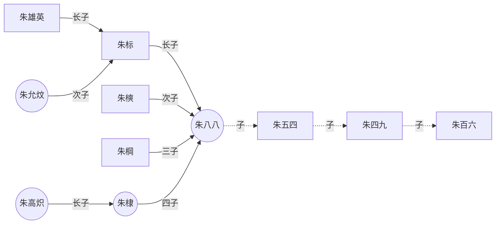

以上是概述，下面详细介绍饼状图和流程图的语法。其他图的语法可访问上文给出的项目地址，自行学习。（记得挂梯子）

## **饼状图**

- 在线渲染器：[Online FlowChart & Diagrams Editor](https://link.zhihu.com/?target=https%3A//mermaidjs.github.io/mermaid-live-editor/%23/edit/eyJjb2RlIjoicGllXG5cIkRvZ3NcIiA6IDQyLjk2XG5cIkNhdHNcIiA6IDUwLjA1XG5cIlJhdHNcIiA6IDEwLjAxIiwibWVybWFpZCI6eyJ0aGVtZSI6ImRlZmF1bHQifX0)（需要梯子）

- 语法——仅供参考，建议直接看实例

- - 从`pie`关键字开始图表

  - 然后使用`title`关键字及其在字符串中的值，为饼图赋予标题。（这是**可选的**）

  - 数据部分

  - - 在`" "`内写上分区名。
    - 分区名后使用`:`作为分隔符
    - 分隔符后写上数值，最多支持2位小数——数据会以百分比的形式展示

- 实例

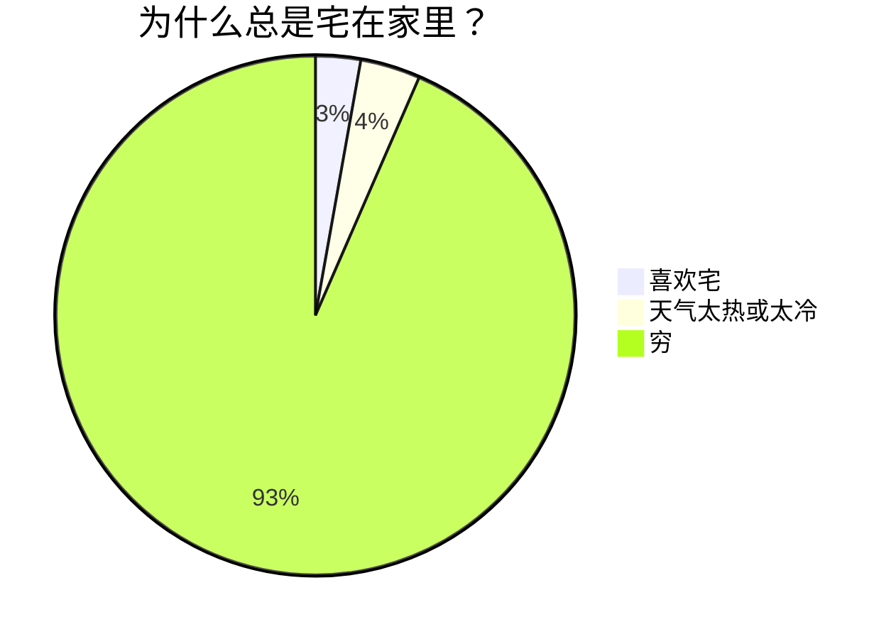

## **流程图**

- 在线渲染器：[Online FlowChart & Diagrams Editor](https://link.zhihu.com/?target=https%3A//mermaidjs.github.io/mermaid-live-editor/%23/edit/eyJjb2RlIjoiZ3JhcGggVERcbiAgICBBW0hhcmRdIC0tPnxUZXh0fCBCKFJvdW5kKVxuICAgIEIgLS0-IEN7RGVjaXNpb259XG4gICAgQyAtLT58T25lfCBEW1Jlc3VsdCAxXVxuICAgIEMgLS0-fFR3b3wgRVtSZXN1bHQgMl0iLCJtZXJtYWlkIjp7InRoZW1lIjoiZGVmYXVsdCJ9fQ)（需要挂梯子）

**实例**

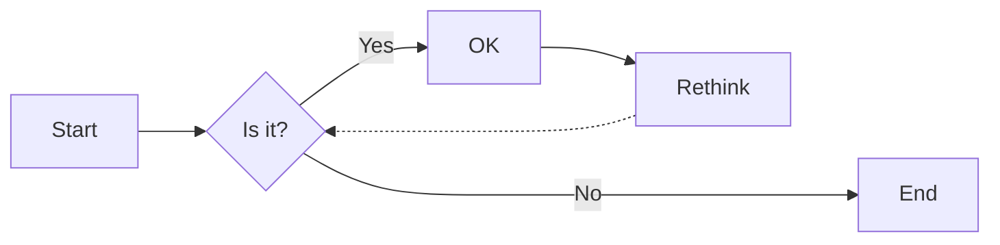

**方向**：用于开头，声明流程图的方向。

- `graph`或`graph TB`或`graph TD`：从上往下
- `graph BT`：从下往上
- `graph LR`：从左往右
- `graph RL`：从右往左

**结点**

- 无名字的结点：直接写内容，此时结点边框为方形；节点内容不支持空格
- 有名字的结点：节点名后书写内容，内容左右有特定符号，结点边框由符号决定；节点内容可以有空格

> 下面的实例中，没有为graph指定方向，因此默认是从上往下的。但是由于各个结点之前没有箭头，所以他们都处于同一排。id1-id6是节点名，可随意定义。

**连线样式**

- 实线箭头：分为无文本箭头和有文本箭头，有文本箭头有2种书写格式

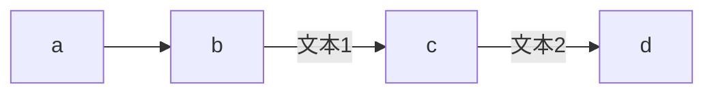

- 粗实线箭头：分为无文本箭头和有文本箭头

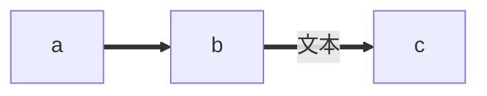

- 虚线箭头：分为无文本箭头和有文本箭头

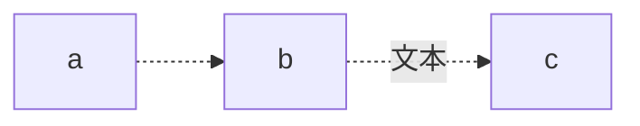

- 无箭头线：即以上三种连线去掉箭头后的形式

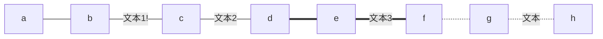

- 其他连线：需要将`graph`关键字改为`flowchart`，除了新增加的连线形式外，上面三种线的渲染效果也会不同

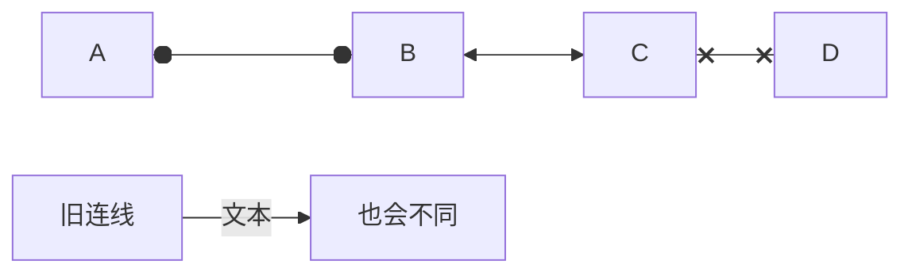

- 延长连线：增加相应字符即可，如下图中的B到E，连线中增加了一个`-`。字符可多次添加。

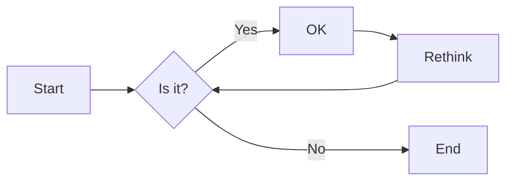

**连线形式**

- 直链

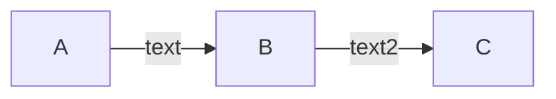

- 多重链：可以使用`&`字符，或单个描述

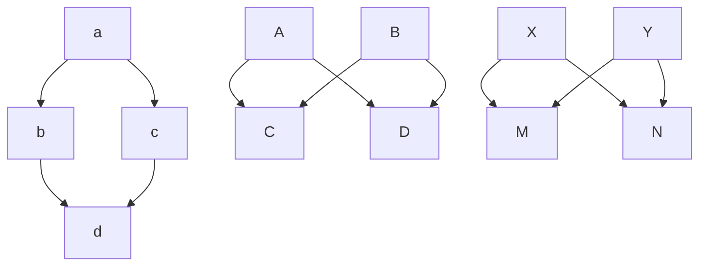

**其他**

- 子图：需要将`graph`关键字改为`flowchart`，在代码段的开始加入`subgraph`，尾部加入`end`

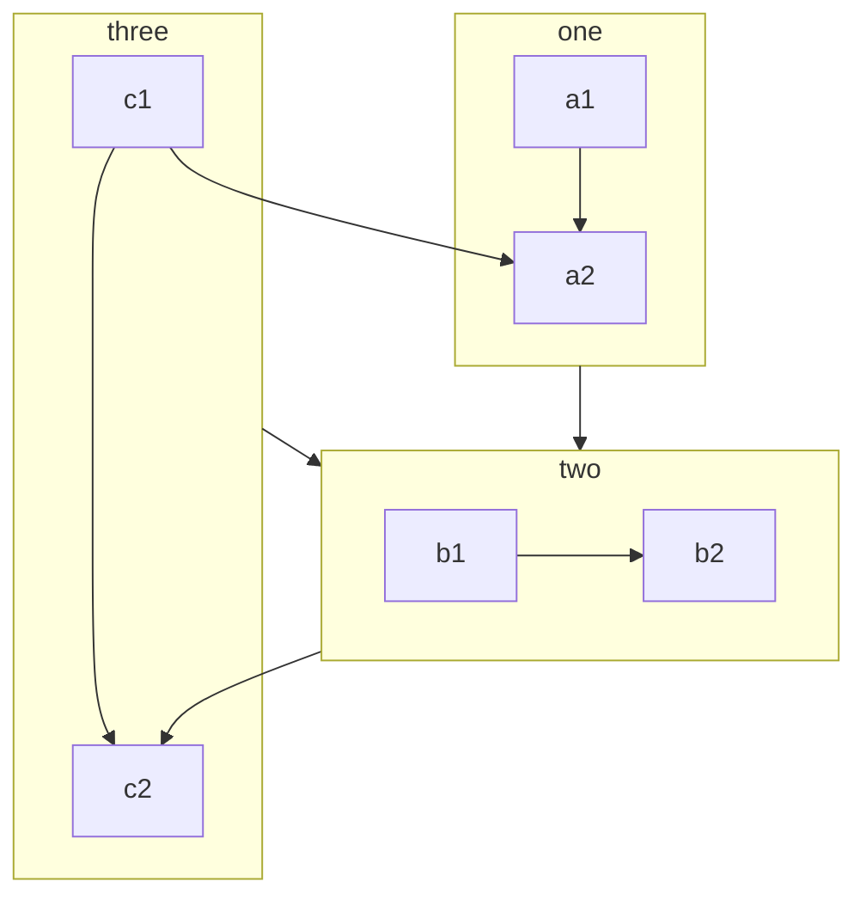

- 注释：在行首加入`%%`即可。

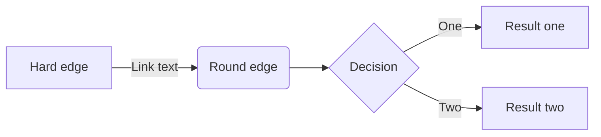

## sequenceDiagram

以下是 **Mermaid 的 `sequenceDiagram` 语法详解**，结合您之前的多线程示例进行说明，并附上常用语法总结：

---

### **1. 基础结构**
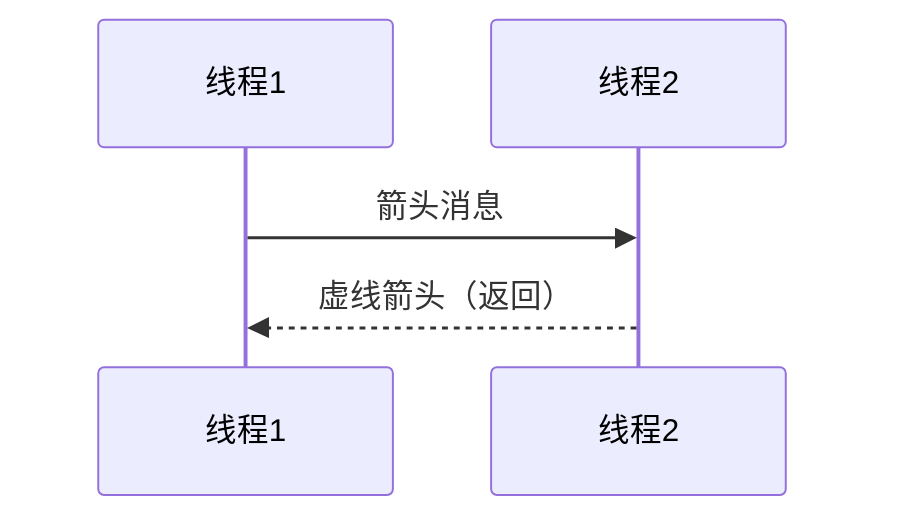
- **`participant`**：定义参与者，`as` 可起别名（如将 `A` 显示为“线程1”）。
- **`->>`**：实线箭头（主动操作）。
- **`-->>`**：虚线箭头（返回/响应）。

---

### **2. 消息类型**
| 语法   | 说明                   | 示例               |
| ------ | ---------------------- | ------------------ |
| `->>`  | 实线箭头（同步消息）   | `A->>B: 请求锁`    |
| `-->>` | 虚线箭头（异步返回）   | `B-->>A: 返回数据` |
| `->`   | 实线无头箭头（不常用） | `A->B: 旧式语法`   |
| `-->`  | 虚线无头箭头（不常用） | `B-->A: 旧式返回`  |
| `-x`   | 同步消息（末端叉号）   | `A-xB: 抛出异常`   |
| `--x`  | 异步消息（末端叉号）   | `B--xA: 异步失败`  |

---

### **3. 激活条（控制流）**
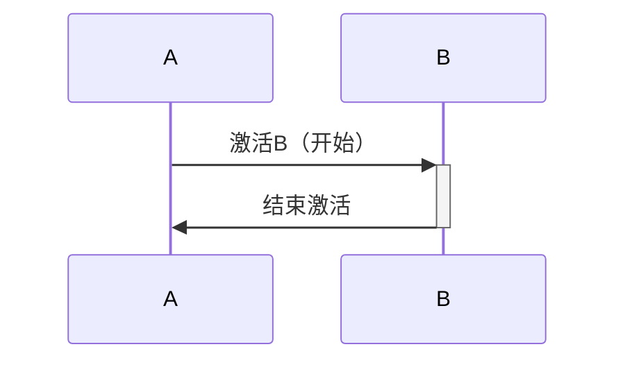
- **`+`**：激活目标（控制流开始）。
- **`-`**：取消激活（控制流结束）。

---

### **4. 注释与标注**
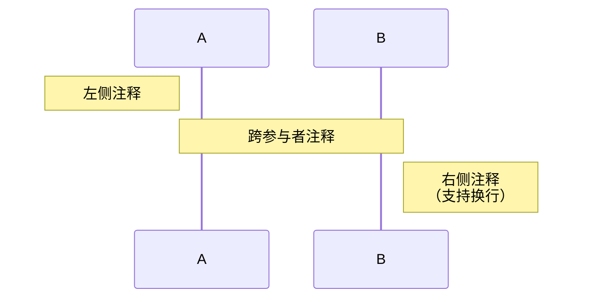
- **`Note`**：添加注释，支持 `left of`、`right of`、`over`（跨多个参与者）。

---

### **5. 循环与条件（高级）**
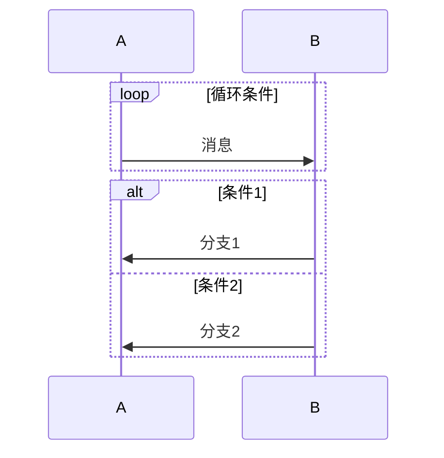
- **`loop`**：循环块。
- **`alt`/`else`**：条件分支。

---

### **6. 多线程示例（结合锁）**
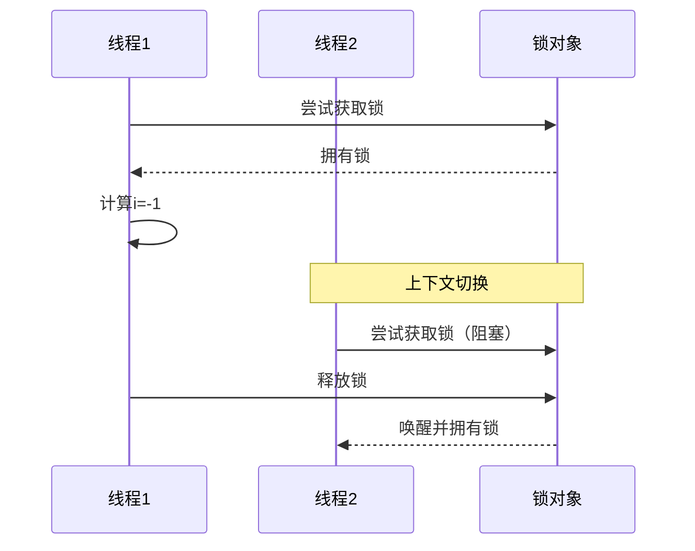

---

### **7. 其他功能**
- **分组**：用 `box` 和 `end` 包裹参与者（需新版Mermaid）。
- **颜色**：非原生支持，但可通过CSS或工具链扩展。

---

### **注意事项**
1. 参与者需先定义后使用。
2. 消息文本中换行需用 ` `。
3. 复杂逻辑建议拆分为多个图。

如果需要更具体的场景示例或调试，可以提供您的完整需求！