[尚硅谷24python——b站传送门](https://www.bilibili.com/video/BV1eZ421b7ag?p=1&vd_source=796ed40051b301bfa3a84ba357f4828c)

## 1. 初识 python



### 1-1 第一个程序

```python
# 打印数字(块注释)
print(11)  # 行内注释 与代码同行，#前面至少有两个空格

# 打印字符 不区分单双引号
print("hello world")
print('hello world')
```

### 1-2 注释

- 作用：方便阅读代码时，能够快速的了解代码的功能，不会被执行。
- 分类：
  - 块注释
  - 行内注释
  - 多行注释
- 使用规范：
  1. 注释不是越多越好，对于一目了然的代码，不需要添加注释
  2. 对于复杂的操作，应该在操作开始前写上若干行注释
  3. 对于不是一目了然的代码，应在其行尾添加注释
  4. 绝不要描述代码，假设阅读代码的人比你更懂Python，他只是不知道你的代码要做什么

```python
# 块注释
# 我是一行注释
print(111)

# 行内注释
print(111)  # 我是行内注释  与代码同行，建议前面至少有两个空格

# 多行注释 不区分单双引号
"""
我是多行注释
我是多行注释
"""

'''
我也是多行注释
我也是多行注释
'''
```

**块注释：**

- 以`#`开始，一直到本行结束都是注释
- 为了保证代码的可读性，**`#`后面建议先添加一个空格**，然后再编写相应的说明文字(PEP8)
- 注释不会运行
- 代码是给机器执行用的，注释是给人看的，方便阅读代码时，能够快速的了解代码的功能

**行内注释：**

- 以#开始，一直到本行结束都是注释
- **与代码写在同一行**
- **`#`前面至少有两个空格**

**多行注释：**

- 如果希望编写的注释信息很多，一行无法显示，就可以使用多行注释
- 要在python程序中使用多行注释，可以用**一对连续的三个引号**(单引号和双引号都可以)

### 1-3 print()

`print()`函数：`print(*objects, sep=' ', end='\n', file=none, flush=False)`

- `*objects`:表示可以接受多个字符串，用逗号隔开，也可以接受一个字符串列表
- `sep`:表示多个字符串之间的分隔符，默认为一个空格
- `end`:表示结尾的字符，默认为一个换行符
- `file`:表示输出位置，默认为标准输出，即屏幕
- `flush`:表示是否立即把内容输出到file中，默认为False

#### 简单的打印

```python
# 任务一：打印字符串 我是nya~
# print(我是shio~)  # 报错，因为字符串需要用引号括起来
print("我是shio~")

# 任务二：打印数字2024
print(2024)

# 任务三：打印变量 创建一个变量year，值为2024，打印这个变量的值
year = 2024
print(year)  # 打印变量的值2024
```

#### 多个内容的打印

```python
# 任务四：一行中打印多个内容
'''
想要在一行中打印多个内容，可以在print()函数中使用逗号隔开多个内容
变量、数字、字符串都可以
注意使用英文的逗号
'''
print("今年是", year, "年，我要减肥")  # 打印多个内容，默认用空格隔开

# 任务五：打印多个内容，指定分隔符和结尾字符
print("hello", "world", sep=" ", end="!")
print("今年是", year, "年，我要减肥", sep="", end="\n\n")  # 打印多个内容，参数间用逗号隔开 指定分隔符为无
print("今年是", year, "年，我要读100本书", sep="", end="\n\n")
print("今年是", year, "年，我要去10个城市旅游", sep="", end="\n\n")
```

#### 格式化输出打印

> 1. `%`格式化操作符方式格式化打印
> 2. `format()`指定格式输出打印

```python
# 任务六：格式化输出
year = 2024
month = 2
day = 20
week = '一'
weather = '晴'
temp = 19.5
# 使用%格式化输出
print("今天是%d年%2d月%d日，星期%s，天气%s，温度%.1f℃。" % (year, month, day, week, weather, temp))
print("今天是%d年%02d月%d日，星期%s，天气%s，温度%.1f℃。" % (year, month, day, week, weather, temp))
# 使用format()函数格式化输出
print("今天是{}年{}月{}日，星期{}，天气{}，温度{}℃。".format(year, month, day, week, weather, temp))
# format指定格式输出  # {0}表示第一个参数，{1:02d}表示第二个参数，保留两位数，不足两位前面补0，..., {5:.1f}表示第六个参数，保留一位小数
print("今天是{0}年{1:02d}月{2}日，星期{3}，天气{4}，温度{5:.1f}℃。"
      .format(year, month, day, week, weather, temp))
```

控制台:

```shell
今天是2024年 2月20日，星期一，天气晴，温度19.5℃。
今天是2024年02月20日，星期一，天气晴，温度19.5℃。
今天是2024年2月20日，星期一，天气晴，温度19.5℃。
今天是2024年02月20日，星期一，天气晴，温度19.5℃。
```

**`%`格式化操作符方式格式化打印：**

`print("格式化字符串" % (变量1， 变量2...))`

- 如果希望输出文字信息的同时，一起输出数据，就需要使用到格式化操作符
- `%`被称为格式化操作符，专门用于处理字符串中的格式
  - 包含`%`的字符串，被称为格式化字符串
  - `%`和不同的`字符`连用，不同类型的数据需要使用不同的格式化字符

| 格式化字符 | 含义                                                         |
| ---------- | ------------------------------------------------------------ |
| `%s`       | 字符串                                                       |
| `%d`       | 有符号十进制整数，`%06d`表示输出整数显示的位数`6`，不足的地方使用`0`补全 |
| `%f`       | 浮点数，`%2f` 表示小数点后只显示两位                         |
| `%%`       | 输出`%                                                       |

**`format()`指定格式输出打印：**

`format()`指定格式输出，使用{}进行占位，也可以进行格式限制

- 如：`{1:02d}`表示第二个参数保留两位数，不足两位前面补0

### 1-4 input()

input函数

- `input()`函数用于接收用户输入，**返回值为字符串类型**
- 语法：`input([提示信息])`
- `提示信息`可选，如果不提供，则默认提示用户输入
- input函数会将用户输入的内容作为字符串返回s

```python
import datetime
# 任务1：创建变量name,保存用户输入的名字;打印变量name
name = input("请输入您的名字：")  # input函数会将用户输入的内容作为字符串返回
type(name)  # <class 'str'> input()返回值为字符串类型
print("您的名字是：", name)

# 任务2：
# 创建变量age,保存用户输入的年龄；打印用户的出生年份
age = int(input("请输入您的年龄："))
type(age)  # <class 'int'> input()返回值为字符串类型，需要使用int()函数将字符串转换为整数
birth_year = datetime.datetime.now().year - age
print("您的出生年份是：", birth_year)
```

### 1-5 案例：个人名片

```python
# 在控制台依次提示用户输入：姓名、公司、职位、电话、邮箱
name = input("请输入姓名：")
company = input("请输入公司：")
job = input("请输入职位：")
phone = input("请输入电话：")
email = input("请输入邮箱：")
# 打印分隔线
print("------------------------------------------------")
# 打印个人名片
print("姓名：", name)
print("公司：%s" % company)
print("职位：", job)
print("电话：", phone)
print("邮箱：", email)
# 打印分隔线
print("------------------------------------------------")
```

## 2. 变量与简单数据类型



### 2.1 变量

**代码**：处理数据用的
**变量**：存储数据的

#### 2.1.1 变量的定义

**创建变量**(变量的赋值、变量的定义)：`变量名=变量值`

>变量定义之后，后续就可以直接使用了
>变量必须先定义后使用
>$=$两边要留一个空格

**多个变量的赋值**：

```python
# 多个变量的值相同
num1 = num2 = num3 = 10

# 多个变量的值不同，元组赋值
a, b = 10, 20
```

**案例**：买苹果：

```python
# 任务：买苹果
price = 10.5
weight = 7.5
money = price * weight
print("需要支付 %.2f 元" % money)
```

#### 2.1.2 修改变量

**修改变量**：创建变量后，可以在代码中重新赋值。

```python
year = 2023
print(year)  # 打印2023
year = 2024
print(year)  # 打印2024
```

**不同类型的变量也可以进行修改**、重新赋值，与类型无关。

```python
money = '十元'
money = 10
print(money)  # 打印10
```

#### 2.1.3 常量

程序在运行的过程中，值永远不会发生改变的量称之为常量。
python没有专门的常量类型，一般**约定俗成使用大写表示常量**。

```python
# 圆周率
PI = 3.1415926
# 我的生日
MY_BIRTHDAY = '2024-01-19'
```

#### 2.1.4 变量的命名

**标示符**：标示符就是程序员定义的**变量名**
**函数名**：名字需要有**见名知义**的效果

**标示符的命名：**

- 可以由字母、下划线 和数字组成
- 不能以数字开头
- 不能与关键字重名

**关键字：**

- 关键字就是在Python内部已经使用的标识符
- 关键字具有特殊的功能和含义
- 开发者不允许定义和关键字相同的名字的标示符

**变量的命名规则：**

- 命名规则可以被视为一种惯例，并无绝对与强制

- 目的是为了增加代码的识别和可读性

- 在Python中，如果**变量名**需要由**二个或多个单词组成时**，可以按照以
  下方式命名

  - 每个单词都使用**小写字母**
  - 单词与单词之间使用**下划线**连接

  > 例如：first_name、last_name、qq_number、qq_password

- **驼峰命名法**
  当**变量名**是由**2个或多个单词**组成时，**还可以利用驼峰命名法**来命名。

  - ***小驼峰式命名法***
    第一单词以小写字母开始，后续单词的首字母大写

    > 例如：firstName、lastName

  - **大驼峰式命名法**
    每一个单词的首字母都采用大写字母

    > 例如：FirstName、LastName、CamelCase

#### 2.1.5 变量的数据类型

在Python中定义变量是不需要指定类型(在其他良多高级语言中都需要)

我们可以使用`type`和`isinstance`来**测试和判断数据类型**

```python
a = '123455asd'
print(type(a))  # <class 'str'>
print(isinstance(a, str))  # True
print(isinstance(a, int))  # False
```

**Python中的数据类型：**

- 整型(Integers)
  表示整数，不带小数点。
  例如：`100`。
- 浮点型(Floating point numbers)
  表示带有小数点的数字。
  例如：`15.20`。
- 复数(Complex Numbers)
  表示带有实部和虚部的数字。
  例如：`3.14`。
- 布尔型(Boolean)
  表示真假。
  有两个值，`True`或`False`。
- 字符串(String)
  一串字符
  例如：`"Hello,World"`。
- 列表(List)
  有序的集合，可以包含任何数据类型
  例如：`[1，'a',2.3]`。
- 元组(Tuple)
  类似于列表，但不可变
  例如：`(1，'a',2.3)`
- 集合(Set)
  无序且不重复的元素集合
  例如：`{1,2,3}`。
- 字典(Dictionary)
  键值对的集合。
  例如：`{name: 'John', age: 30}`

### 2.2 简单数据类型

整型、浮点型、布尔型、字符串、

#### 2.2.1 整形(Integers)

Python可以处理任意大小的整数，当然包括负整数，在程序中的表示方法和数学上的写法一模一样。

```python
# 整数变量的定义
num = 10
print(num)

# 负数
num2 = -10
print(num2)

# 查看变量的数据类型
print(type(num2))  # <class 'int'>
```

#### 2.2.2 浮点型(Floating point numbers)

由整数部分和小数部分组成。

**注意**：运算可能有四舍五入的**误差**。

```python
# 浮点数的计算
n1 = 1.1
n2 = 2.2
print(n1 + n2)  # 3.30000000000000004

# 四舍五入方式进行保留精度
n3 = round(n1 + n2, 1)  # 保留一位小数
print(n3)  # 3.3

import math
print(math.floor(n3))  # 向下取整  3
print(math.ceil(n3))  # 向上取整  4
```

#### 2.2.3 布尔型(Boolean)

- 布尔类型的变量只有`True`、`False`两种值。
- 作用：作为**真假的判断**。
- 在python中，能够解释为假的值有：
  `None`、`0`、`0.0`、`False`、所有的空容器(空列表、空元组、空字典、空集合、空字符串)

#### 2.2.4 字符串(String)

字符串就是**一串字符**，是编程语言中表示文本的数据类型。

- 在Python中可以使用**一对双引号"**或者**一对单引号'**定义一个字符串
- 字符串是以单引号或者双引号括起来的任意文本，**也可以是以三对单引号'''或者双引号"""**引起来的任意文本

```python
# 创建字符串
s1 = 'hello'
print(s1)
s2 = "world"
print(s2)
s3 = '''hello
world'''
print(s3)  # hello
           # world
s4 = "It's a hat"
print(s4)  # It's a hat

s5 = '1234\'\"666'  # 在字符串中使用\转义字符
print(s5)  # 1234'"666
```

**运算：**

- 字符串加法(字符串拼接)
- 字符串乘法(字符串重复)

```py
# 字符串拼接
print(s1 + s2)  # helloworld
# 字符串与数字不能相加
# print(s1 + 1)  # TypeError: can only concatenate str (not "int") to str

# 字符串与字符串相乘
print(s1 * 5)  # hellohellohellohellohello
```

**索引：**可以使用索引获取一个字符串中指定位置的字符，**索引计数从0开始**。

**获取指定索引处字符：**

```python
s = "hello world"
print(s[0])  # h
print(s[4])  # o
print(s[-1])  # d
```

**字符串切片，包头不包尾：**`变量名[起始索引:结束索引(:步长)]`

```python
s = "hello world"
# 字符串切片 包头不包尾
print('字符串切片')
print(s[0:4])  # hell 从索引0开始，到索引4结束，不包括索引4
print(s[1:4])  # ello 从索引1开始，到索引4结束，不包括索引4
print(s[:4])  # hell 从索引0开始，到索引4结束，不包括索引4
print(s[6:])  # world 从索引6开始，到字符串结束
print(s[:])  # hello world 从索引0开始，到字符串结束
```

**字符串步长(不写默认为1)：**

```python
s = "hello world"
print(s[0:11])  # hello world 默认第三个值为1  从索引0开始，到索引10结束，每隔1个取一个字符
print(s[0:-1:1])  # hello world 从索引0开始，到索引-1(最后)结束，每隔2个取一个字符
print(s[0:11:2])  # hlowrd 从索引0开始，到索引10结束，每隔2个取一个字符
print(s[::2])  # hlowrd 从索引0开始，每隔2个取一个字符 到字符串结束
```

**字符串反转：**

```python
# 字符串反转
s2 = '1234567'
print(s2[-1:-10:-1])  # 7654321
print(s2[::-1])  # 7654321
```

#### 2.2.5 数据类型转换

| 函数名          | 函数值                                                       |
| :-------------- | :----------------------------------------------------------- |
| `int(x,[基数])` | 将数字或字符串转换为整数(十进制)，如果x为浮点数，则自动截断小数部分 |
| `float(x)`      | 将x转换成浮点型                                              |
| `bool(x)`       | 转换成bool类型的True或False                                  |
| `str(x)`        | 将x转换成字符串，适合人阅读                                  |

**转换为整形int：**

```py
# 字符串str-->整形int  纯数字的无小数字符串才可以转换
s = '2024'
print(type(int(s)))  # <class 'int'>
'''
s1 = 'aaa223'
print(type(int(s1)))  # ValueError: invalid literal for int() with base 10: 'aaa223'
s3 = '2.23'
print(type(int(s3)))  # ValueError: invalid literal for int() with base 10: '2.23'
'''

# 浮点数float-->整形int
f = 2.23
print(int(f))  # 2
print(type(int(f)))  # <class 'int'>

# 布尔值bool-->整形int
a, b = True, False
print(int(a), int(b))  # 1 0
print(type(int(a)))  # <class 'int'>
```

**转换为浮点数：**

```python
# 字符串str-->浮点数float
s = '2.23'
print(float(s))  # 2.23
print(type(float(s)))  # <class 'float'>
# 整形int-->浮点数float
i = 2
print(float(i))  # 2.0
print(type(float(i)))  # <class 'float'>
# 布尔值bool-->浮点数float
a, b = True, False
print(float(a), float(b))  # 1.0 0.0
print(type(float(a)))  # <class 'float'>
```

**转化为布尔值：**

```py
# 字符串str-->布尔值bool
s = '2.23'
print(bool(s))  # True
print(type(bool(s)))  # <class 'bool'>
# 整形int-->布尔值bool
i = 0
print(bool(i))  # False
print(type(bool(i)))  # <class 'bool'>
# 浮点数float-->布尔值bool
f = 0.0
print(bool(f))  # False
print(type(bool(f)))  # <class 'bool'>
# 空字符串
s = ''
print(bool(s))  # False
print(type(bool(s)))  # <class 'bool'>
# 空列表-->布尔值bool
l = []
print(bool(l))  # False
print(type(bool(l)))  # <class 'bool'>
# ...
```

**转化为字符串：**

```python
# 整形int-->字符串str
i = 2
print(str(i))  # 2
print(type(str(i)))  # <class 'str'>
# 浮点数float-->字符串str
f = 2.23
print(str(f))  # 2.23
print(type(str(f)))  # <class 'str'>
# 布尔值bool-->字符串str
a, b = True, False
print(str(a), str(b))  # True False
print(type(str(a)))  # <class 'str'>
# 空列表-->字符串str
l = []
print(str(l))  # []
# ...
```

**进制转换：**在Python中，`0b`、`0o`、`0x`前缀表示二进制、八进制、十六进制

```python
# 其他进制转为十进制
print(int('0x1a', 16))  # 26 十六进制转十进制
print(int('0b11010', 2))  # 26 二进制转十进制
print(int('0o32', 8))  # 26 八进制转十进制
# 十进制转为其他进制
print(oct(26))  # 0o32 十进制转八进制
print(bin(26))  # 0b11010 十进制转二进制
print(hex(26))  # 0x1a 十进制转十六进制
```

#### 2.2.6 小整数的地址问题

- Python中的小整数，通常指的是**-5至256之间的整数**
- 当你在Python中创建一个整数对象时，Python会根据该整数的值动态地为其分配内存空间。对于小整数Python会使用一种称为**“小整数缓存”的机制来优化内存使用**。**这个缓存池中的整数对象会被重复利用，而不是为每个新创建的小整数分配新的内存空间**。这样可以减少内存分配和释放的开销，提高程序的性能。
- 如果你需要跟踪Python对象的内存地址，可以使用Python提供的**内置函数`id()`来获取对象的唯一标识符**，这个标识符通常可以用来近似地表示对象的内存地址。**但是请注意**，这个标识符并不是真正的内存地址，而是由Pythont解释器生成的一个唯一标识符，用于区分不同的对象实例。

```python
>>> a = 3
>>> id(a)
140709743618552
>>> b = 3
>>> id(b)
140709743618552
>>> b = 4
>>> id(b)
140709743618584
>>> c = 300
>>> id(c)
2156628246032
>>> d = 300
>>> id(d)
2156628246256
```

## 3. 运算符与表达式



**表达式**

- 概念：由变量、常量和运算符组成的式子称为表达式
  在数学上为了计算结果，我们会写一些式子计算。
  例如：$30+5$

### 3.1 算术运算符

| 运算符 | 描述   | 实例                                   |
| ------ | ------ | -------------------------------------- |
| `+`    | 加     | `10+20=30`                             |
| `-`    | 减     | `10-20=-10`                            |
| `*`    | 乘     | `10*20=200`                            |
| `/`    | 除     | `10/20=0.5`                            |
| `//`   | 取整除 | 返回除法的整数部分(商)`9∥2`输出结果`4` |
| `%`    | 取余数 | 返回除法的余数`9%2=1`                  |
| `**`   | 幂     | 又称次方、乘方，`2*3=8`                |

- **功能**：进行符号对象的算术运算，不会修改变量的值
- **值**：相关算术运算的结果

**算数运算符的优先级：**

- `**`   幂(最高优先级)
- `*` `/` `%` `//`  乘、除、取余数、取整除
- `+` `-`  加法、减法

```python
print(a + b)
print(a - b)
print(a * b)
print(a / b)
print(a % b)   # 1  取余运算
print(a ** b)  # 1000  幂运算
print(a // b)  # 3  取整除 - 返回商的整数部分(向下取整)
print(3 + 2 * 4 ** 2)   # 先算指数运算，再算乘除运算，最后算加减运算
```

### 3.2 赋值运算符

| 运算符 | 描述                  | 实例                                 |
| ------ | --------------------- | ------------------------------------ |
| `=`    | 简单的赋值运算符      | `c= a+ b` 将 a +b 的运算结果赋值为 c |
| `+=`   | 加法赋值运算符        | `c += a` 等效于 `c = c + a`          |
| `-=`   | 减法赋值运算符        | `c -= a `等效于` c = c- a`           |
| `*=`   | 乘法赋值运算符        | `c *= a` 等效于` c = c * a`          |
| `/=`   | 除法赋值运算符        | `c /= a` 等效于` c = c/ a`           |
| `//=`  | 取整除赋值运算符      | `c //= a `等效于 `c = c // a`        |
| `%=`   | 取模 (余数)赋值运算符 | `c %= a` 等效于 `c = c % a`          |
| `**=`  | 幂赋值运算符          | `c **= a` 等效于` c = c ** a`        |

```python
a = 2
print(a)  # 2
a += 2
print(a)  # 4
a -= 2
print(a)  # 2
a *= 2
print(a)  # 4
a /= 2
print(a)  # 2.0
a %= 2
print(a)  # 0.0
a **= 2
print(a)  # 0.0
a //= 2
print(a)  # 0.0
```

### 3.3 比较(关系)运算符

| 运算符 | 描述                                                         |
| ------ | ------------------------------------------------------------ |
| `==`   | 检查两个操作数的值是否相等，如果是，则条件成立，返回`True`   |
| `!=`   | 检查两个操作数的值是否不相等，如果是，则条件成立，返回`True` |
| `>`    | 检查左操作数的值是否大于右操作数的值，如果是，则条件成立，返回`True` |
| `<`    | 检查左操作数的值是否小于右操作数的值，如果是，则条件成立，返回`True` |
| `>=`   | 检查左操作数的值是否大于或等于右操作数的值，如果是，则条件成立，返回 `True` |
| `<=`   | 检查左操作数的值是否小于或等于右操作数的值，如果是，则条件成立，返回 `True` |

```pytho
print(3 != 3)
print(3 == 3)
print(True == False)  # False
print('hello' == 'hi')  # False
print('hello' < 'hi')  # True 按ASCII码比较
print(ord('e'), ord('i'))  # 101 105 获取ASCII码值
print(3 > 3)
print(3 < 3)
print(3 >= 3)
print(3 <= 3)
```

### 3.4 逻辑运算符

| 运算符 | 逻辑表达式 | 描述                                                         |
| ------ | ---------- | ------------------------------------------------------------ |
| `and`  | ` x and y` | 只有×和y 的值都为 True，才会返回 True否则只要×或者y有一个值为 False，就返回False |
| `or`   | `x or y`   | 只要×或者y有一个值为True，就返 回 True 只有×和y的值都为 False， 才会返回False |
| `not`  | `not x`    | 如果×为 True，返回 False 如果× 为 False，返回True            |

优先级：`not`>`and`>`or`

```python
# and 运算符，只要有一个为False，结果就是False
# python中and运算符 两个值如果前面的值是false就返回前面的值，前面的值为false后面的值为true就返回后面的值
print(1 and 2)  # 2 True and True
print(1 and 0)  # 0 True and False
print(0 and 1)  # 0 False and True
print(0 and 0)  # 0 False and False
print(True and False)  # False
print('' and 'hi')  # ''
print('hi' and 'hello')  # hello

# or 运算符，只要有一个为True，结果就是True
# python中or运算符 两个值如果前面的值是true就返回前面的值，前面的值为false后面的值为true就返回后面的值
print(1 or 2)  # 1 True or True
print(1 or 0)  # 1 True or False
print(0 or 1)  # 1 False or True
print(0 or 0)  # 0 False or False
print(True or False)  # True
print('' or 'hi')  # hi
print('hi' or 'hello')  # hi


# not 运算符，取反
print(not True)  # False
print(not False)  # True
print(not 1)  # False
print(not 0)  # True
print(not '')  # True
print(not 'hi')  # False

# 优先级 not > and > or
print(True and False and not False)  # False 即 True and False and True
```

### 3.5 位运算符

| 运算符 | 描述           | 功能                                                         | 简述                                                | 实例 |
| ------ | -------------- | ------------------------------------------------------------ | --------------------------------------------------- | ---- |
| `&`    | 按位与运算符   | 参与运算的两个值，如果两个相应位都为1，则该位的结果为1，否则为0 | 只有两个位都为1时，结果才为1)                       | 5&7  |
| `|`    | 按位或运算符   | 参与运算的两个值，如果两个相应位有一个为1时，则 该位的结果为1，否则为0 | 只要两个位有一个为1，结果就为1                      | 517  |
| `^`    | 按位异或运算符 | 参与运算的两个值，如果两个相应位不同时，则该位的结果为1，否则为0 | 两个位不同时，结果为1                               | 5^7  |
| `~`    | 按位取反运算符 | 对数据的每个二进制位进行取反操作，把1变为0，把0变为1         | 将位上的0变为1，1变为0                              | ~5   |
| `<<`   | 左移动运算符   | 运算术的各二进制位全部向左移动若干位，由符号右侧的数字指定移动的位数，高位丢弃，低位补0 | 将二进制位向左移动指定的位数，右边空出来的位用0填充 | 9<<2 |
| `>>`   | 右移动运算符   | 运算术的各二进制位全部向右移动若干位，由符号右侧的数字指定移动的位数，低位丢弃，高位补0 | 将二进制位向右移动指定的位数，左边空出来的位用0填充 | 9>>2 |

```python
# 按位与& (只有两个位都为1时，结果才为1)
'''
101
111
----
101
'''
print(5 & 3)  # 0101 & 0011 = 0001 = 1

# 按位或| (只要两个位有一个为1，结果就为1)
'''
101
111
----
111
'''
print(5 | 3)  # 0101 | 0011 = 0111 = 7

# 按位异或^ (两个位不同时，结果为1)
'''
101
111
----
010
'''
print(5 ^ 3)  # 0101 ^ 0011 = 0110 = 6

# 按位取反~ (将位上的0变为1，1变为0)
print(~5)  # 0101 -> 1010 -> -6
print(~-5)  # 1010 -> 0100 -> 4
print(~0)  # 0000 -> 1111 -> -1

# 左移<< (将二进制位向左移动指定的位数，右边空出来的位用0填充)
print(5 << 2)  # 0101 -> 10100 -> 20

# 右移>> (将二进制位向右移动指定的位数，左边空出来的位用0填充)
print(5 >> 2)  # 0101 -> 0001 -> 1
```

### 3.6 成员运算符

| 运算符   | 描述                                                 | 实例                            |
| -------- | ---------------------------------------------------- | ------------------------------- |
| `in`     | 如果在指定的序列中找到值返回 True，否则返回False     | `3 in (1,2,3)`返回 True         |
| `not in` | 如果在指定的序列中没有找到值返 回True，否则返回False | `3 not in (1, 2, 3) `返回 False |

```python
# in
print("hello" in "hello world")  # True
# not in
print("hello" not in "hello world")  # False
```

### 3.7 身份运算符

| 运算符   | 描述                                                         |
| -------- | ------------------------------------------------------------ |
| `is`     | 判断两个标识符是否引用同一个对象，是的话返回真，否则返回假   |
| `is not` | 判断两个标识符是否不是引用同一个对象, 是的话返回真，否则返回假 |

```python
# is 判断两个变量是否指向同一个对象
a = 1
b = 2
print(a is b)  # False

# is not 判断两个变量是否指向不同的对象
print(a is not b)  # True
```

### 3.8 运算的优先级

| 运算符                                   | 描述                         |
| ---------------------------------------- | ---------------------------- |
| `**`                                     | 幂 (最高优先级)              |
| `~` `+` `-`                              | 按位取反，一元运算符(正负号) |
| `*` ` /` ` %` `//`                       | 乘、除、取余数、取整除       |
| `+` `-`                                  | 加法、减法                   |
| `<<` `>>`                                | 左移，右移                   |
| `&`                                      | 按位与                       |
| `^`                                      | 异或                         |
| `>` `<` `>` `=` ` <`                     | 比较运算符                   |
| `==` `!=`                                | 等于运算符                   |
| `=` `+=` `-=` `*=` `/=` `%=` `//=` `**=` | 赋值运算符                   |
| `is` `is not`                            | 身份运算符                   |
| `in` `not in`                            | 成员运算符                   |
| `not` `or` `and`                         | 逻辑运算符                   |

## 4. 条件判断



### 4-1 单分支选择结构

格式：

```python
if	判断条件:
    条件成立时要做的事
    ...
```

案例：

```python
# 判断年龄 age>18
age = 17
if age > 18:
    print('成年')  # if 语句的下级代码
    print('可以进网吧')
print('hello')
```

控制台：

```shell
hello
```

### 4-2 双分支选择结构

格式：

```python
if 判断条件:
    条件成立时要做的事
    ...
else:
    条件不成立时要做的事
    ...
```

案例：

```
weather = '下雨'
if weather == '下雨':
    print('带伞')
    print(111)
else:
    print('不带伞')
```

控制台：

```shell
带伞
111
```

### 4-3 多分枝选择结构

格式：

```python
if 条件1:
    条件1成立时要做的事
    ...
elif 条件2:
    条件2成立时要做的事
    ...
elif 条件3:
    条件3成立时要做的事
    ...   
else:
    都不满足时要做的事
```

案例：

```python
score = 98
# 多分支写法
if score >= 90:
    print("优秀")
elif score >= 80:
    print("良好")
elif score >= 70:
    print("中等")
elif score >= 60:
    print("及格")
else:
    print("不及格")
```

控制台：

```shell
优秀
```

### 4-4 `if`的嵌套

> - 在开发中，使用`if`进行条件判断，如果希望在条件成立的执行语句中再增加条件判断，就可以使用`if`的嵌套
> - `if`的嵌套的应用场景就是：在之前条件满足的前提下，再增加额外的判断
> - `if`的嵌套的语法格式，除了缩进之外和之前的没有区别

案例：

```python
# 双分支写法
if score >= 90:
    print("A")
else:
    if score >= 80:
        print("B")
    else:
        if score >= 70:
            print("C")
        else:
            if score >= 60:
                print("D")
            else:
                print("E")
```

控制台：

```shell
E
```

### 4-5 `match`语句

> Python中的match语句是Python3.10及以后版本中引入的新特性，用于模式匹配。
> 它允许你根据对象的模式来检查对象，并执行相应的代码块

**格式**：

```python
x = ?
match x:
    case y:
        ...
    case z:
        ...
    case a:
        ...
    case _:  # 匹配所有其它值
        ...
```

>- `match`语句中的每个代码块由一个或多个`case`子句组成
>- 每个`case`子句后面跟着一个模式和一个代码块
>- 当模式匹配成功时，会执行相应的代码块
>- 如果没有任何模式匹配成功，则可以选择使用一个默认的代码块，使用下划线`_`来表示。

案例：

```python
x = 4;
match x:
    case 1:
        print("x is 1")
    case 2:
        print("x is 2")
    case 3 | 4:
        print("x is 3 or 4")
    case _:
        print("x is something else")
        
x = 'hello'
match x:
    case 'hello':
        print("x is hello")
    case 'world':
        print("x is world")
    case _:
        print("x is something else")
```

控制台：

```shell
x is 3 or 4
x is hello
```

**if:**

- `if`语句是最基本的条件控制结构，用于基于条件测试执行不同的代码块。
- `if`语句在处理简单条件和分支时非常有用。
- 你可以使用`elif(else if)`来添加额外的条件分支。
- `if`语句不支持模式匹配，只能基于**布尔表达式**进行条件判断。

**match:**

- match语句是Python3.10及以后版本引入的新特性，主要用于模式匹配。
- matchi语句允许你根据对象的模式结构来检查对象，并根据匹配的模式执行相应的代码块。
- match语句特别适用于处理复杂的数据结构，如元组、列表、字典等，以及自定义类的实例
- 它通过模式匹配提供了更简洁、更直观的方式来处理复杂的条件逻辑。

### 4-6 案例：闰年判断

闰年判断：

```python
year = int(input("请输入一个年份："))
if year % 4 == 0 and year % 100 != 0 or year % 400 == 0:
    print(1)
else:
    print(0)
```

## 5. 循环

### 5.1 `while`循环

>循环的作用就是让指定的代码重复的执行
>`while`循环最常用的应用场景就是让执行的代码按照指定的次数重复执行

格式：

```python
while 条件(判断 计数器 是否达到 目标次数):
    条件满足时，做的事情1
    条件满足时，做的事情1
    条件满足时，做的事情1
    ...
    处理条件(计数器+1)
```

案例：

```python
n = 0;
while n < 10: # 打印0-9
    print(n)
    n += 1;
```

### 5.2 `for`循环

```python
for ? in 序列:
	做的事情
```

> `? in 序列`：如果?在指定的序列中找到值返回 True，否则返回False

案例：

```python
for i in range(10): # 打印0-9
    print(i)
```

> - `range(n)`函数：生成`0-(n-1)`的序列
> - `range(n, m)`函数：生成`n-(m-1)`的序列

### 5.3 循环控制

**`break`：**

- **作用**：退出循环
- **注意**：只能跳出距离最近的for或者while循环
- **在循环过程中**，如果**某一个条件满足**后，希望**循环不再继续执行**，可以使用`break`退出循环

**`continue`：**

- **作用**：跳过本次循环后面的继续剩余语句，然后继续下一次循环
- **注意**：只能跳过距离最近的for或者while循环

**案例：**

```python
i=0
while i < 10:
    # break 某一条件满足时，退出循环，不再执行后续重复的代码
    if i == 3:
    	break
    print(i)
    i += 1
print("over") # 打印0 1 2 over
```

```python
i=0
while i < 10:
    print(i)
    i += 1
    if i == 3:
        # continue 跳过本次循环后面的继续剩余语句，然后继续下一次循环
        continue
print("over") # 打印0 1 2 4 5 6 7 8 9 over
```

```python
num =1
sum 0
while num <= 5:
	sum = sum + num
	if sum==10:
		break
	num +=1
else:
	print('没有执行breaki语句')
```

**与`else`结合：**

- else的下级代码：没有通过break退出循环，循环结束后，会执行的代码

```python
num = 1
sum = 0
while num <= 5:
    sum = sum + num
    if sum == 10:
        print('执行break语句')
        break
        num += 1
    else:
        print('没有执行break语句')

print(sum) # 打印`没有执行break语句`*9 + `执行break语句` + `10`
```

**`pass`：**

- 作用：当语句要求不希望任何命令或代码来执行时使用
- 说明：
  `pass`语句表示一个空操作，在执行时没有任何的响应，pass的位置最终应该有代码来执行，只不过暂时写不出来
- 可以使用在流程控制和循环语句中

```python
if 1:
    pass # 空操作，可以暂时占位
```

### 5.4 指数爆炸

```python
# 纸的厚度
n = 0.1 # mm
w = n; # 折叠后的初始厚度
for i in range(1, 51): # 折纸50次
    w *= 2
    print('第%d次厚度为%.2fmm' % (i, w)) # ...最后一次打印：第50次厚度为112589990684262.41mm
```

### 5.5 九九乘法表

```python
for i in range(1, 10):
    for j in range(1, i+1):
        print('%d*%d=%d' % (j, i, i*j), end='\t') # \t: 制表符
    print()
```

```tex
1*1=1	
1*2=2	2*2=4	
1*3=3	2*3=6	3*3=9	
1*4=4	2*4=8	3*4=12	4*4=16	
1*5=5	2*5=10	3*5=15	4*5=20	5*5=25	
1*6=6	2*6=12	3*6=18	4*6=24	5*6=30	6*6=36	
1*7=7	2*7=14	3*7=21	4*7=28	5*7=35	6*7=42	7*7=49	
1*8=8	2*8=16	3*8=24	4*8=32	5*8=40	6*8=48	7*8=56	8*8=64	
1*9=9	2*9=18	3*9=27	4*9=36	5*9=45	6*9=54	7*9=63	8*9=72	9*9=81	
```

## 6. 组合数据类型

### 6.1 序列

在python中，有这样一些类型，它们的**成员是有序排列**的，并且**可以通过下标访问**成员，这些类
型称之为**序列**。

**序列包括：列表、range、元组和字符串**

**切片**：

- 语法：`支持的数据类型[起始：结束：步长]`

- 支持数据类型：字符串、列表、元组

- 例子：
  ```python
  # 演示切片
  "0123456789"[2:7] # 23456 # 左闭右开，从0开始
  list("0123456789")[2::2] # ['2', '4', '6', '8'] # 从2截取到最后，步长为2
  "0123456789"[::-2] # 97531 # 从开始截取到最后，并且倒着排步长为2
  ```

**序列的通用操作：**

内置函数：

| 函数        | 描述                 | 备注                        |
| ----------- | -------------------- | --------------------------- |
| `len(item)` | 计算容器中元素个数   |                             |
| `del(item)` | 删除变量             | del 有两种方式              |
| `max(item)` | 返回容器中元素最大值 | 如果是字典，只针对 key 比较 |
| `min(item)` | 返回容器中元素最小值 | 如果是字典，只针对 key 比较 |

适用的运算符：

| 运算符        | Python表达式           | 结果                           | 描述           | 支持的数据类型           |
| ------------- | ---------------------- | ------------------------------ | -------------- | ------------------------ |
| +             | `[1, 2] + [3, 4]`      | `[1, 2, 3, 4]`                 | 合并           | 字符串、列表、元组       |
| *             | `["Hi!"] * 4`          | `["Hi!", "Hi!", "Hi!", "Hi!"]` | 重复           | 字符串、列表、元组       |
| in            | `3 in (1,2, 3)`        | `True`                         | 元素是否存在   | 字符串、列表、元组、字典 |
| not in        | `4 not in (1, 2, 3)`   | `True`                         | 元素是否不存在 | 字符串、列表、元组、字典 |
| > > = == < <= | `(1,2, 3) < (2, 2, 3)` | `True`                         | 元素比较       | 字符串、列表、元组       |

### 6.2 列表

#### 6.2.1 列表定义

- List(列表)是Python中使用**最频繁**的数据类型，在其他语言中通常叫做**数组**
- 专门用于存储**一串信息**
- 列表用`[]`定义，数据之间使用`,`分隔
- 列表的**索引**从`0`开始
- **索引**就是数据在**列表**中的位置编号，**索引**又可以被称为**下标**
- 注意：从列表中取值时，如果超出索引范围，程序会报错

#### 6.2.2 操作列表

**语法：**

创建列表：

- `列表名 = [元素，元素2，元素3......]`：直接创建列表
- `列表名 = list(字符串参数)`。类型转换：把参数转换为列表，参数为字符串

获取列表：`列表名[索引]`，索引从`0`开始。也可以使用负数倒着数`-1`就是最后一个

删除变量`del`关键字

**例子：**

```python
# 创建列表
list1 = [] # 空列表
print(list1) # []
print(type(list1)) # <class 'list'>

list2 = [1, 'a', 3.14, True]
print(list2) # [1, 'a', 3.14, True]

list3 = list();
print(list3) # []

list4 = list('hello') # 类型转换 str->list
print(list4) # ['h', 'e', 'l', 'l', 'o']

# 列表的索引
print(list4[1]) # e 非负数是正着数的，从0开始
print(list4[-1]) # o 负数是倒着数的，-1就是最后一个

# 列表的切片
print(list5[2:7]) # ['2', '3', '4', '5', '6'] # 左闭右开，从0开始
print(list5[2:7:2]) # ['2', '4', '6'] # 步长为2

list6 = list("hello")
list7 = list("world")
# 列表的运算
print(list6+list7) # ['h', 'e', 'l', 'l', 'o', 'w', 'o', 'r', 'l', 'd']
print(list6*3) # ['h', 'e', 'l', 'l', 'o', 'h', 'e', 'l', 'l', 'o', 'h', 'e', 'l', 'l', 'o']
# 列表的成员运算
print("h" in list6) # True
print("z" in list6) # False
print("h" not in list6) # False
print("z" not in list6) # True
print("1" in [1, 2, 3, 4]) # True

# 内置函数
print(len(list6)) # 5
print(max(list6)) # o
print(min(list6)) # e


#del list6 # 删除list6变量
#print(list6) # NameError: name 'list6' is not defined. Did you mean: 'list1'?
```

#### 6.2.3 列表的遍历

```python
for i in list6:
    print(i) # 打印h e l l o
for i, j in enumerate(list6):
    print(i, j) # 打印索引和字符
for i in range(5): # range返回0-4
    print(list6[i]) # 根据索引遍历 h e l l o
for i in range(len(list6)):
    print(list6[i]) # 根据索引遍历 h e l l o
```

#### 6.2.4 列表的方法

`变量.方法名`

| 方法名  | 作用                           |
| ------- | ------------------------------ |
| append  | 在列表末尾添加一个元素         |
| extend  | 在列表末尾添加多个元素         |
| insert  | 在指定位置插入一个元素         |
| remove  | 删除指定元素                   |
| pop     | 删除最后一个元素               |
| clear   | 清空列表                       |
| index   | 查找指定元素的位置             |
| count   | 统计指定元素在列表中出现的次数 |
| sort    | 对列表进行排序                 |
| reverse | 反转列表                       |
| copy    | 复制列表                       |
| join    | 将列表中的元素连接成一个字符串 |
| split   | 将字符串分割成列表             |

```python
list6.append("666") # 在列表末尾添加一个元素
print(list6) # ['h', 'e', 'l', 'l', 'o', '666']
list6.extend(["777", "888"]) # 在列表末尾添加多个元素
print(list6) # ['h', 'e', 'l', 'l', 'o', '666', '777', '888']
list6.insert(1, "111") # 在指定位置插入一个元素
print(list6) # ['h', '111', 'e', 'l', 'l', 'o', '666', '777', '888']
list6.remove("111") # 删除指定元素
print(list6) # ['h', 'e', 'l', 'l', 'o', '666', '777', '888']
list6.append("666")
print(list6) # ['h', 'e', 'l', 'l', 'o', '666', '777', '888', '666']
list6.remove("666") # 有两个相同元素时前面的被删除
print(list6) # ['h', 'e', 'l', 'l', 'o', '777', '888', '666']
list6.pop() # 删除最后一个元素
print(list6) # ['h', 'e', 'l', 'l', 'o', '777', '888']
list6.pop(1) # 删除指定位置的元素
print(list6) # ['h', 'l', 'l', 'o', '777', '888']
print(list6.index("888")) # 5 返回指定元素的索引
print(list6.count("l")) # 2 返回指定元素在列表中出现的次数
list6.clear() # 清空列表
print(list6) # []

# 案例：计算若干人的平均年龄
age = [10, 20, 30, 40, 50]
# total = 0
# for i in age:xxx
#     total += i
# print(total / len(age)) # 30.0
print(sum(age) / len(age)) # 30.0
```

### 6.3 元组

- Tuple(元组)与列表类似，不同之处在于**元组的元素不能修改**
- 元组表示多个元素组成的序列
- 用于存储一串信息，数据之间使用`,`分隔
- 元组用`()`定义

#### 6.3.1 元组的创建

```python
tuple1 = (1, 2, 3, True, "hello")
print(tuple1) # (1, 2, 3, True, 'hello')
print(type(tuple1)) # <class 'tuple'>
tuple2 = (1) # 只有一个数字时误以为是数字在做数学运算 是int类型
print(type(tuple2)) # <class 'int'>
tuple3 = (1,) # 加一个逗号表示元组
print(type(tuple3)) # <class 'tuple'>
tuple4 = tuple("hello") # 字符串 -> tuple
print(tuple4) # ('h', 'e', 'l', 'l', 'o')
tuple5 = tuple([1, 2, 3]) # list -> tuple
print(tuple5) # (1, 2, 3)
list1 = list(tuple5) # tuple -> list
print(list1) # [1, 2, 3]
str1 = str(tuple5) # tuple -> str
print(str1) # (1, 2, 3)
print(type(str1)) # <class 'str'>
```

#### 6.3.2 元组的基本操作

索引、切片、函数、删除变量、运算符、元组不可变、元组嵌套、元组拆包、元组的常用方法：

```python
# 索引
tuple6 = (1, 2, 3, 4, 5)
print(tuple6[0]) # 1
print(tuple6[-1]) # 5
# 切片
print(tuple6[1:4]) # (2, 3, 4)
print(tuple6[:3]) # (1, 2, 3)
print(tuple6[2:]) # (3, 4, 5)
# 函数
print(len(tuple6)) # 5
print(max(tuple6), min(tuple6)) # 5 1
# 删除变量
# del tuple6
# print(tuple6) # NameError: name 'tuple6' is not defined
# 运算符
print(tuple6 + tuple5) # (1, 2, 3, 4, 5, 1, 2, 3)
print(tuple6 * 3) # (1, 2, 3, 4, 5, 1, 2, 3, 1, 2, 3, 4, 5, 1, 2, 3)
print(1 in tuple6) # True
print(6 in tuple6) # False
print(1 not in tuple6) # False
print(6 not in tuple6) # True
# 元组不可变
# tuple6[0] = 2 # TypeError: 'tuple' object does not support item assignment
# 元组嵌套
tuple7 = (1, 2, (3, 4, 5))
print(tuple7[2][1]) # 4
# 元组拆包
tuple8 = (1, 2, 3)
a, b, c = tuple8
print(a, b, c) # 1 2 3
# 元组拆包
tuple9 = (1, 2, 3)
a, *b = tuple9
print(a, b) # 1 [2, 3]
# 元组的常用方法
tuple10 = (1, 1, 2, 2, 2, 3, 4, 4, 5)
print(tuple10.count(1)) # 2 count() 统计元素个数
print(tuple10.index(3)) # 5 index() 查找元素索引
```

#### 6.3.3 元组的遍历

```python
for i in tuple10:
    print# 1
for i, j in enumerate(tuple10):
    print(i, j) # 打印索引及元素
for i in range(len(tuple10)):
    print(i, tuple10[i]) # 打印索引及元素
```

### 6.4 range函数

- 系统提供的内建函数`range(start, end, [step=1])`：生成一个等差序列`[start, end)`
- 注意序列属于**不可变序列**，不支持元素修改，不支持`+`和`*`操作。
- `range`一般用于`for-in`循环遍历

**原型：**`range([start,] stop [,step])`

> - `range(stop)`
> - `range(start,stop)`
> - `range(start,stop,step)`

- **功能：**生成列表
- **参数：**
  `start`:表示列表起始值，包含，默认为0
  `stop`:表示列表结束值，但是不包含
  `step`:步长，默认为1

```python
print(list(range(10)))  # end [0, 1, 2, 3, 4, 5, 6, 7, 8, 9]
print(list(range(2, 10)))  # start, end [2, 3, 4, 5, 6, 7, 8, 9]
print(list(range(2, 10, 2)))  # start, end, step [2, 4, 6, 8]
```

### 6.5 字符串

- 字符串就是一串字符，是编程语言中表示文本的数据类型
- 在Python中可以使用一对双引号`" "`或者一对单引号`' '`定义一个字符串
- 字符串是以单引号或者双引号括起来的任意文本，也可以是以三引号`'''`或者`"""`引起来的任意文本。

运算：

- 字符串的加法
- 字符串的乘法

索引：可以使用**索引**获取一个字符串中指定位置的字符，索引计数从`0`开始。

```python
# 字符串的运算
print("hello" + "world")  # 拼接 helloworld
print("hello" * 3)  # 重复 hellohellohello
print("i" in "hello")  # 判断 i 是否在 hello 中 True
print("hello" > "world")  # 比较字符串的Unicode编码 True
print("hello"[0:3])  # 切片 hel
# 字符串的长度
print(len("hello")) # 5
# 字符串的查找
print("hello".find("l")) # 2
# 字符串的替换
print("hello".replace("l", "x"))  # hexxo
# 字符串的分割
print("hello world".split(" "))  # ['hello', 'world']
# 字符串的连接
print(" ".join(["hello", "world"]))  # hello world
# 字符串的格式化
print("hello %s" % "world")  # hello world
# 获取字符的Unicode编码
print(ord("w"))  # 119
# 字符串的编码和解码
print("hello".encode("utf-8"))  # b'hello'

# 字符串的常用方法
# 字符串的查找
print("hello".find("l")) # 2
print("hello".find("o")) # 4
# 字符串的替换
print("hello".replace("l", "x"))  # hexxo
# 字符串的分割
print("hello world".split(" "))  # ['hello', 'world']
# 字符串的连接
print("#".join(["111", "222", "333"]))  # 111#222#333
# 去掉两端空格
print("    hello world ".strip())  # hello world

s1 = "hello"
# 字符串的遍历
for i in s1:
    print(i)
for i, j in enumerate(s1):
    print(i, j)
for i in range(len(s1)):
    print(i, s1[i])
    
# 字符串的统计
s = input("请输入一个字符串：") # da))))12
print("字符串的长度为：", len(s))  # 9
# 字母个数，数字个数，符号个数
a, b, c = 0, 0, 0
for i in s:
    if i.isalpha():  # 判断是否是字母
        a += 1
    elif i.isdigit():  # 判断是否是数字
        b += 1
    else:
        c += 1
print("字母个数：", a, "数字个数：", b, "符号个数：", c)
```

### 6.6 字典

- `dictionary`(字典)是除列表以外pytnon之中最灵活的数据类型
- 字典同样可以用来**存储多个数据**
- 通常用于存储描述一个物体的相关信息
- 和列表的区别：
  - **列表**是**有序**的对象集合
  - **字典**是**无序**的对象集合

定义：

- 字典用`{}`定义
- 字典使用键值对存储数据，键值对之间使用`,`分隔
- 键`key`是索引
- 值`value`是数据
- 键和值之间使用`:`分隔
- 键必须是唯一的
- 值可以取任何数据类型，但键只能使用字符串、数字或元组

#### 6.6.1 字典的创建

```python
d = {
    'name': '张三',
    'age': 18,
    'gender': '男'
}
print(d)  # {'name': '张三', 'age': 18, 'gender': '男'}
print(type(d))  # <class 'dict'>
print(dict(name='张三', age=18, gender='男'))  # {'name': '张三', 'age': 18, 'gender': '男'}
```

#### 6.6.2 字典的基本操作

```python
# 新增键值对
d['height'] = 180
print(d)  # {'name': '张三', 'age': 18, 'gender': '男', 'height': 180}
# 根据键获取值
print(d['name'])  # 张三
# 修改键值对
d['age'] = 19
print(d)  # {'name': '张三', 'age': 19, 'gender': '男', 'height': 180}

# 删除
del d['height']
print(d)  # {'name': '张三', 'age': 19, 'gender': '男'}
# del d
# print(d)  # NameError: name 'd' is not defined

# in
print('name' in d)  # True
print('weight' in d)  # False

print(d.items())  # dict_items([('name', '张三'), ('age', 19), ('gender', '男')]) 返回一个可迭代的对象

# 字典的遍历
for key in d:
    print(key, d[key])  # 打印 键 值

print(d.items())  # dict_items([('name', '张三'), ('age', 19), ('gender', '男')]) 返回一个可迭代的对象
for k, v in d.items():
    print(k, v)  # 打印 键 值

print(d.keys())  # dict_keys(['name', 'age', 'gender']) 返回一个可迭代的对象
for k in d.keys():
    print(k)  # 打印 键
```

#### 6.6.3 字典的常用方法

```python
print(d.values())  # dict_values(['张三', 19, '男']) 返回一个可迭代的对象
d.pop('age')  # 删除键值对
print(d)  # {'name': '张三', 'gender': '男'}
a = d.copy()  # 复制字典
print(a)  # {'name': '张三', 'gender': '男'}
print(d.get("gender"))  # 男 获取键对应的值
d.popitem()  # 删除最后一个键值对
print(d)  # {'name': '张三'}
d.clear()  # 清空字典
print(d)  # {}
d.update({"age": 18})  # 更新字典
print(d)  # {'age': 18}
d.update(name='张三')  # 更新字典
print(d)  # {'name': '张三', 'age': 18}
```

### 6.7 集合

- **不允许有重复**元素，如果添加重复元素，则会自动过滤，可以进行交集、并集的运算。
- 是一种**无序且无重复**元素的数据结构
- 与dict类似，是一组key的集合(不存储value)

#### 6.7.1 集合的创建

```python
s = set()
print(s, type(s))  # set() <class 'set'>
s = {1, 2, 3, 4, 1, 2}
print(s, type(s))  # {1, 2, 3, 4} <class 'set'>
s = set([1, 2, 3, 1, 2])  # list->set
print(s, type(s))  # {1, 2, 3} <class 'set'>
s = set((1, 2, 3, 1, 2))  # tuple->set
print(s, type(s))  # {1, 2, 3}
s = set('hello') # str->set
print(s, type(s))  # {'e', 'h', 'l', 'o'}
s = set({1: 'a', 2: 'b', 3: 'c'})  # {1, 2, 3} dict->set
print(s, type(s))  # {1, 2, 3} <class 'set'>
```

#### 6.7.2 集合的常用操作

```python
# 集合的运算
s = set({1: 'a', 2: 'b', 3: 'c'})  # {1, 2, 3}
print(1 in s)  # True
print(4 not in s)  # True
print(s - {1, 2})  # {3} 差集
print(s | {1, 2, 4, 8})  # {1, 2, 3, 4, 8} 并集
print(s & {1, 2, 4, 8})  # {1, 2} 交集
print(s ^ {1, 2, 4, 8})  # {3, 4, 8} 异或集

print(len(s)) # 3
print(max(s), min(s))  # 3 1

# 集合不支持索引
# print(s[2])  # 报错，集合无序，无法索引

# 集合的遍历
for i in s:
    print(i)
```

#### 6.7.3 集合的常用方法

```python
s = set([1, 2, 3, 1, 2])  # {1, 2, 3}
# 添加元素
s.add(4)
print(s)  # {1, 2, 3, 4}
# 删除元素
s.remove(2)
print(s)  # {1, 3, 4}
# 修改当前集合，可以添加新的元素到当前集合中，如果添加的元素在集合中已存在，则不执行任何操作
s.update({2, 3, 4, 5, 6, 7})
print(s)  # {1, 2, 3, 4, 5, 6, 7}
```

#### 6.7.4 集合小案例

```python
# 列表去重
score = [90, 80, 70, 90, 80, 70]
s = set(score)
print(s)  # {70, 80, 90}
# 统计各个分数都有几个学生
d = {}
for i in s:
    t = score.count(i)
    # print(f'{i}分有{t}个学生')  # 70分有2个学生 80分有2个学生 90分有2个学生 f':格式化输出
    d[i] = t
for k, v in d.items():
    print(f'{k}分有{v}个学生')  # 70分有2个学生 80分有2个学生 90分有2个学生 f':格式化输出
```

### 6.8 可变类型与不可变类型

不可变数据类型在创建后，其值就不能被改变。Python中的以下数据类型是不可变的：

- 数字(例如：int,float,,complex)
- 字符串(例术str)
- 元组(例如：tuple)
- 布尔类型(例如：bool)

```python
s = 'abcd'
print(s)  # abcd
print(s[0])  # a
# s[0] = 'A'  # 不可以修改 TypeError: 'str' object does not support item assignment
s = "bcde"  # 可以重新赋值
print(s)  # bcde
```

