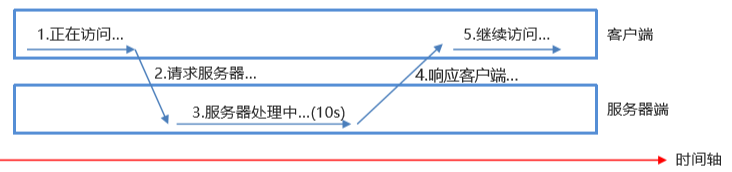
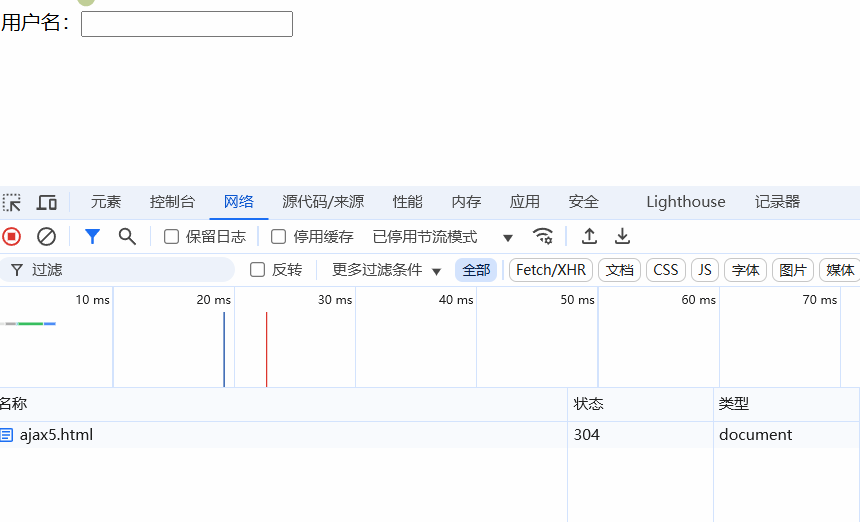
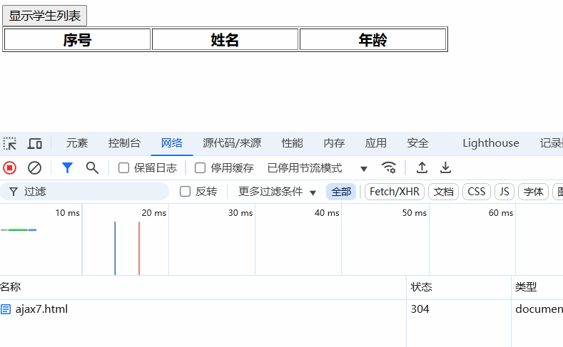

[ajax——b站动力节点 传送门](https://www.bilibili.com/video/BV1cR4y1P7B1/?spm_id_from=333.337.search-card.all.click&vd_source=796ed40051b301bfa3a84ba357f4828c)

# AJAX（Asynchronous Javascript And Xml）

## 传统请求及缺点

- **传统的请求都有哪些？**
  1. 直接在浏览器地址栏上输入URL。
  2. 点击超链接
  3. 提交form表单
  4. 使用JS代码发送请求
    - `window.open(url)`
    - `document.location.href = url`
    - `window.location.href = url`
    - ....
- **传统请求存在的问题**
  1. 页面全部刷新导致了用户的体验较差。
  2. 传统的请求导致用户的体验有空白期。（用户的体验是不连贯的）
  3. 

**演示传统请求**

```html
<!--直接在浏览器地址栏上输入URL-->

<!--超链接-->
<a href="/old/request">传统请求（超链接）</a>

<!--form表单提交-->
<form action="/old/request" method="get">
    <input type="submit" value="传统请求（form表单提交）">
</form>

<!--通过JS代码来发送请求-->
<input type="button" value="传统请求（通过JS代码发送请求）" onclick="sendRequest()">

<script type="text/javascript">
    function sendRequest(){
        // 发送请求
        //window.location.href = ""
        document.location.href = "/old/request"
    }
</script>
</body>
</html>
```

```java
@WebServlet("/request")
public class OldRequestServlet extends HttpServlet {
    @Override
    protected void doGet(HttpServletRequest request, HttpServletResponse response)
            throws ServletException, IOException {
        // 响应信息到浏览器
        response.setContentType("text/html;charset=UTF-8");
        PrintWriter out = response.getWriter();

        // 向浏览器输出HTML代码，浏览器接收到HTML代码之后渲染页面，展现页面给用户。
        out.print("<h1>欢迎学习AJAX。。。。</h1>");
    }
}
```

先能看懂下面这个代码，再学习AJAX:

```html
<script type="text/javascript">
    function sayHello(){
        alert("hello javascript")
    }
</script>
<!--需求：页面上有一个按钮，用户点击按钮之后，执行一段JS代码。-->
<input type="button" value="hello" onclick="sayHello()">

<!--以上的实现方式，当然，大家都是没有问题的，但是通过JS代码给按钮绑定事件，这个你会吗？-->
<input type="button" value="hello2xxxxxxxxxxxxxxx" id="helloBtn">

<script type="text/javascript">
    // 页面加载完毕之后，给id="helloBtn"的元素绑定鼠标单击事件
    // 这个function就是一个回调函数，这个回调函数什么时候执行？当load事件发生之后，这个回调函数才会执行。
    // 什么是load事件？load事件什么时候发生？注意：页面加载完毕之后，load事件发生。
    window.onload = function(){
        // 获取id="helloBtn"的对象
        var helloBtn = document.getElementById("helloBtn");
        // 给id="helloBtn"元素绑定click事件
        // 这个function也是一个回调函数，这个回调函数什么时候执行？
        // 当helloBtn被click的时候，被鼠标单击的时候，这个回调函数会执行。
        // 鼠标单击五次，这个回调函数就会被调用五次。
        helloBtn.onclick = function(){
            //alert("hello javascript2")
            //alert(this)
            // 这个回调函数中的this是谁呢？
            // this是发生事件的事件源对象。是按钮发生了鼠标单击，那么this代表的就是这个按钮对象。
            alert(this.value) // hello2xxxxxxxxxxxxxxx
        }
    }
</script>
```

## AJAX概述

- AJAX不能称为一种技术，它是多种技术的综合产物。
- AJAX可以让浏览器发送一种特殊的请求，这种请求可以是：异步的。
- AJAX的请求发送之后，不会出现页面清空，然后展示新页面的效果。AJAX不是这样的。
- 什么是异步，什么是同步？
  - 假设有t1和t2线程，t1和t2线程并发，就是异步。
  - 假设有t1和t2线程，t2在执行的时候，必须等待t1线程执行到某个位置之后t2才能执行，那么t2在等t1，显然他们是排队的，排队的就是同步。
  - AJAX是可以发送异步请求的。也就是说，在同一个浏览器页面当中，可以发送多个ajax请求，这些ajax请求之间不需要等待，是并发的。
- AJAX代码属于WEB前端的JS代码。和后端的java没有关系，后端也可以是php语言，也可以是C语言。
- AJAX 应用程序可能使用 XML 来传输数据，但将数据作为纯文本或 JSON 文本传输也同样常见。
- AJAX**可以更新网页的部分**，而不需要重新加载整个页面。（页面局部刷新）
- AJAX可以做到在同一个网页中同时启动多个请求，类似于在同一个网页中启动“多线程”，一个“线程”一个“请求”。
- 
- 

## XMLHttpRequest对象

- **XMLHttpRequest对象是AJAX的核心对象**，发送请求以及接收服务器数据的返回，全靠它了。

- XMLHttpRequest对象，现代浏览器都是支持的，都内置了该对象。**直接用即可**。


**创建**`XMLHttpRequest`对象

```js
var xhr = new XMLHttpRequest();
```

`XMLHttpRequest对象`的**方法**:

| 方法                                      | 描述                                                         |
| :---------------------------------------- | :----------------------------------------------------------- |
| `abort()`                                 | **取消**当前**请求**                                         |
| `getAllResponseHeaders()`                 | 返回**头部**信息                                             |
| `getResponseHeader()`                     | 返回**特定的头部**信息                                       |
| **`open(method, url, async, user, psw)`** | **规定请求(打开通道)**<br />- method：请求类型 GET 或 POST<br />- url：文件位置<br />- async：true（异步）或 false（同步）<br />- user：可选的用户名称<br />- psw：可选的密码 |
| **`send()`**                              | **发送请求**到服务器，用于 **GET 请求**                      |
| **`send(string)`**                        | **发送请求**到服务器，用于 **POST 请求**                     |
| **`setRequestHeader()`**                  | 向要发送的**报头添加标签/值对**                              |

`XMLHttpRequest`对象的**属性**:

| 属性                 | 描述                                                         |
| :------------------- | :----------------------------------------------------------- |
| `onreadystatechange` | 定义当 **readyState 属性**发生**变化时**被**调用的函数**     |
| **`readyState`**     | **保存** XMLHttpRequest 的**状态**。<br />- `0`：请求未初始化<br />- `1`：服务器连接已建立<br />- `2`：请求已收到<br />- `3`：正在处理请求<br />- `4`：请求已完成且响应已就绪 |
| `responseText`       | 以**字符串返回响应**数据                                     |
| `responseXML`        | 以 **XML 数据返回响应**数据                                  |
| `status`             | **返回**请求的**状态号**<br />- `200`: "OK<br />- `403`: "Forbidden"<br />- `404`: "Not Found" |
| `statusText`         | **返回状态文本**（比如 "OK" 或 "Not Found"）                 |

XMLHttpRequest的readyState属性:

 

## AJAX GET请求

### 发送GET请求

运行结果：


发送AJAX get请求，前端代码：

```html
<!--给一个按钮，用户点击这个按钮的时候发送ajax请求-->
<input type="button" value="hello ajax" id="helloBtn">
<!--给一个div图层，ajax接收了响应的数据之后，在div中进行渲染。-->
<div id="mydiv"></div>

<script type="text/javascript">
    window.onload = function(){
        document.getElementById("helloBtn").onclick = function (){
            // 发送ajax get请求
            console.log("发送ajax get请求")
            // 1.第一步：创建AJAX核心对象XMLHttpRequest
            var xhr = new XMLHttpRequest();
            // 2.第二步：注册回调函数
            // 这是一个回调函数，这个函数在XMLHttpRequest对象的readyState状态值发生改变的时候被调用。
            xhr.onreadystatechange = function (){
                // 这里的回调函数会被调用多次。
                // 0 -> 1 被调用一次
                // 1 -> 2 被调用一次
                // 2 -> 3 被调用一次
                // 3 -> 4 被调用一次
                console.log("readyState：" + xhr.readyState)
                
                // 当XMLHttpRequest对象的readyState的状态是4的时候，表示响应结束了。
                /*if (xhr.readyState == 4) {
                    if(this.status == 200){
                        // 响应成功
                    }
                }*/
                if (this.readyState == 4) {
                    // 响应结束了。
                    console.log("响应结束了")
                    // 响应结束之后，一般会有一个HTTP的状态码。
                    // HTTP状态码常见的包括：200表示成功了，404表示资源找不到，500表示服务器内部错误。
                    // HTTP状态码是HTTP协议的一部分，HTTP协议中规定的。服务器响应之后都会有一个状态码。
                    // 获取HTTP状态码
                    console.log("HTTP响应状态码：" + this.status)
                    if (this.status == 404) {
                        alert("404 对不起，您访问的资源不存在，请检查请求路径")
                    } else if(this.status == 500){
                        alert("500 对不起，服务器发生了严重的内部错误，请联系管理员")
                    } else if(this.status == 200){
                        alert("200 响应成功，完美")
                        // 200表示完全响应完毕，成功结束了。
                        // 通过XMLHttpRequest对象获取响应的信息。
                        // 通过XMLHttpRequest对象的responseText属性来获取响应的信息。
                        alert(this.responseText)
                        // 把响应信息放到div图层当中，渲染
                        document.getElementById("mydiv").innerHTML = this.responseText
                    }
                }
            }
            // 3.第三步：开启通道（open只是浏览器和服务器建立连接，通道打开，并不会发送请求）
            // XMLHttpRequest对象的open方法
            // open(method, url, async, user, psw)
            // - method: 请求的方式，可以是GET，也可以是POST，也可以是其它请求方式。
            // - url：请求的路径
            // - async: 只能是true或者false，true表示此ajax请求是一个异步请求，false表示此ajax请求是一个同步请求。（大部分请求都是true，要求异步。极少数情况需要同步，以后再说。）
            // - user：用户名 pwd: 密码，用户名和密码是进行身份认证的，说明要想访问这个服务器上的资源，可能需要提供一些口令才能访问。需不需要用户名和密码，主要看服务器的态度。
            xhr.open("GET", "/ajax/ajaxrequest1", true)
            // 4.第四步：发送请求
            xhr.send()
        }
    }
</script>
```

发送AJAX get请求，后端代码：

```java
@WebServlet("/ajaxrequest1")
public class AjaxRequest1Servlet extends HttpServlet {
    @Override
    protected void doGet(HttpServletRequest request, HttpServletResponse response)
            throws ServletException, IOException {
        /*String s = null;
        s.toString();*/

        // 设置响应的内容类型以及字符集
        response.setContentType("text/html;charset=UTF-8");
        // Servlet向浏览器响应一段数据
        PrintWriter out = response.getWriter();

        // out对象向浏览器输出信息
        // 服务器的代码实际上和以前的代码还是完全一样的。
        // 只不过这个out在响应的时候，浏览器客户端的XMLHttpRequest对象会接收到这个响应的信息。
        out.print("<font color='red'>欢迎学习ajax<br/>welcome to study ajax!!!!</font>");
    }
}
```

### 提交数据发GET请求

AJAX get请求如何提交数据呢？

- get请求提交数据是在“请求行”上提交，格式是：`url?name=value&name=value&name=value....`
- 其实这个get请求提交数据的格式是HTTP协议中规定的，遵循协议即可。

运行结果：


前端代码：

```java
usercode<input type="text" id="usercode"><br>
username<input type="text" id="username"><br>
<button id="btn">发送ajax get请求</button>

<span id="myspan"></span>
<div id="mydiv"></div>
<script type="text/javascript">
    window.onload = function () {
        document.getElementById("btn").onclick = function () {
            //1. 创建AJAX核心对象
            var xhr = new XMLHttpRequest();
            //2. 注册回调函数
            xhr.onreadystatechange = function(){
                if (this.readyState == 4) {
                    if (this.status == 200) {
                        // 通过XMLHttpRequest对象的responseText属性可以获取到服务器响应回来的内容。
                        // 并且不管服务器响应回来的是什么，都以普通文本的形势获取。（服务器可能响应回来：普通文本、XML、JSON、HTML...）

                        // innerHTML属性是javascript中的语法，和ajax的XMLHttpRequest对象无关。
                        // innerHTML可以设置元素内部的HTML代码。（innerHTML可以将后面的内容当做一段HTML代码解释并执行）
                        document.getElementById("myspan").innerHTML = "myspan" + this.responseText
                        document.getElementById("mydiv").innerHTML = "mydiv" + this.responseText

                        // innerText也不是AJAX中的，是javascript中的元素属性，和XMLHttpRequest无关。
                        // innerText也是设置元素中的内容，但是即使后面是一段HTML代码，也是将其看做一个普通字符串设置进去。
                        //document.getElementById("myspan").innerText = this.responseText
                    }else{
                        alert(this.status)
                    }
                }
            }
            //3. 开启通道
            // 获取到用户填写的usercode和username
            var usercode = document.getElementById("usercode").value
            var username = document.getElementById("username").value
                
            // AJAX GET请求缓存问题:
            //  对于低版本的IE浏览器来说，AJAX的get请求可能会走缓存。存在缓存问题。对于现代的浏览器来说，大部分浏览器都已经不存在AJAX get缓存问题了。
            // - 在HTTP协议中是这样规定get请求的：get请求会被缓存起来。
            // - 发送AJAX GET请求时，在同一个浏览器上，前后发送的AJAX请求路径一样的话，对于低版本的IE来说，第二次的AJAX GET请求会走缓存，不走服务器。
            // 防止低版本ie浏览器走get请求缓存的方法：使每次请求的路径不同
                
            //  搞一个时间戳，使每次请求的路径不同，防止低版本ie浏览器走get请求缓存
            //alert(new Date().getTime())
            //xhr.open("GET", "/ajax/ajaxrequest2?t="+new Date().getTime()+"&usercode="+usercode+"&username="+username, true)
            // 随机一个数字，使每次请求的路径不同，防止低版本ie浏览器走get请求缓存
            xhr.open("GET", "/ajax/ajaxrequest2?t="+Math.random()+"&usercode="+usercode+"&username="+username, true)
            //4. 发送请求
            xhr.send()
        }
    }
</script>
```

后端代码：

```java
@WebServlet("/ajaxrequest2")
public class AjaxRequest2Servlet extends HttpServlet {
    @Override
    protected void doGet(HttpServletRequest request, HttpServletResponse response)
            throws ServletException, IOException {
        // 设置响应的内容类型以及字符集
        response.setContentType("text/html;charset=UTF-8");
        // 获取响应流
        PrintWriter out = response.getWriter();
        // 响应
        // 获取ajax get请求提交的数据
        String usercode = request.getParameter("usercode");
        String username = request.getParameter("username");

        out.print("usercode=" + usercode + ", username=" + username);
    }
}
```

## 低版本IE 的 AJAX GET请求的缓存问题

- 对于低版本的IE浏览器来说，AJAX的get请求可能会走缓存。存在缓存问题。**对于现代的浏览器来说，大部分浏览器都已经不存在AJAX get缓存问题了。**
- 什么是AJAX GET请求缓存问题呢？
  - 在HTTP协议中是这样规定get请求的：get请求会被缓存起来。
  - 发送AJAX GET请求时，在同一个浏览器上，前后发送的AJAX请求路径一样的话，对于低版本的IE来说，第二次的AJAX GET请求会走缓存，不走服务器。
- POST请求在HTTP协议中规定的是：POST请求不会被浏览器缓存。
- GET请求缓存的优缺点：
  - 优点：直接从浏览器缓存中获取资源，不需要从服务器上重新加载资源，速度较快，用户体验好。
  - 缺点：无法实时获取最新的服务器资源。
- 浏览器什么时候会走缓存？
  - 第一：是一个GET请求
  - 第二：请求路径已经被浏览器缓存过了。第二次发送请求的时候，这个路径没有变化，会走浏览器缓存。
- **如果是低版本的IE浏览器，怎么解决AJAX GET请求的缓存问题呢？**
  - 可以在请求路径url后面添加一个时间戳，这个时间戳是随时变化的。所以每一次发送的请求路径都是不一样的，这样就不会走浏览器的缓存问题了。
  - 可以采用时间戳：`"url?t=" + new Date().getTime()`
  - 或者可以通过随机数：`"url?t=" + Math.random()`
  - 也可以`随机数+时间戳`
  - ....

[get请求防止低版本ie浏览器走缓存的代码演示](###提交数据发请求)

## AJAX POST请求

AJAX POST请求和GET请求的代码区别在哪里？就是前端代码有区别。后端代码没有区别。

- `xhr.send("name=value&name=value&name=value")`,参数格式：放在这里的数据就是**在请求体当中提交**的，格式不能随便来，还是需要遵循HTTP的协议：`name=value&name=value&name=value`

```js
xhr.open("POST", "/ajax/ajaxrequest3", true)
// 设置请求头的内容类型时，必须在open之后。
xhr.setRequestHeader("Content-Type", "application/x-www-form-urlencoded") // 设置请求头类型，模拟form表单提交数据
xhr.send("username=张三&password=123")
```

```java
// 获取提交的数据
String username = request.getParameter("username");
String password = request.getParameter("password");
```

### 发送POST请求

前端：

```html
用户名<input type="text" id="username"><br>
密码<input type="password" id="password"><br>
<button id="mybtn">发送AJAX POST请求</button>

<div id="mydiv"></div>

<script type="text/javascript">
    window.onload = function () {
        document.getElementById("mybtn").onclick = function () {
            // 发送AJAX POST请求
            // 1. 创建AJAX核心对象
            var xhr = new XMLHttpRequest();
            // 2. 注册回调函数
            xhr.onreadystatechange = function (){
                if (this.readyState == 4) {
                    if (this.status == 200) {
                        document.getElementById("mydiv").innerHTML = this.responseText
                    }else{
                        alert(this.status)
                    }
                }
            }
            // 3. 开启通道
            xhr.open("POST", "/ajax/ajaxrequest3", true)
            // 4. 发送请求
            // 怎么模拟AJAX提交form表单呢？设置请求头的内容类型(这行代码非常关键，是模拟form表单提交的关键代码。)
            // 设置请求头的内容类型时，必须在open之后。
            xhr.setRequestHeader("Content-Type", "application/x-www-form-urlencoded")
            // 放到send()这个函数的小括号当中的数据，会自动在请求体当中提交数据。
            // 使用JS代码获取用户填写的用户名和密码
            var username = document.getElementById("username").value;
            var password = document.getElementById("password").value;
            //xhr.send("注意格式：放在这里的数据就是在请求体当中提交的，格式不能随便来，还是需要遵循HTTP的协议：name=value&name=value&name=value")
            xhr.send("username="+username+"&password="+password)
        }
    }
</script>
```

后端：

```java
@WebServlet("/ajaxrequest3")
public class AjaxRequest3Servlet extends HttpServlet {
    @Override
    protected void doPost(HttpServletRequest request, HttpServletResponse response)
            throws ServletException, IOException {
        response.setContentType("text/html;charset=UTF-8");
        PrintWriter out = response.getWriter();

        // 获取提交的数据
        String username = request.getParameter("username");
        String password = request.getParameter("password");
        out.print("用户名是：" + username + "，密码是：" + password);
    }
}
```

### 案例——验证用户名是否可用

使用AJAX POST请求实现用户注册的时候，用户名是否可用。（验证用户名是否可以注册）实现步骤如下：

- 在前端，用户输入用户名之后，**失去焦点事件blur发生**，然后发送AJAX POST请求，提交用户名
- 在后端，接收到用户名，连接数据库，根据用户名去表中搜索
- 如果用户名已存在
  - 后端响应消息：对不起，用户名已存在（在前端页面以红色字体展示）
- 如果用户名不存在
  - 后端响应消息：用户名可以使用（在前端页面以绿色字体展示）

运行结果：



前端代码：

```java
用户名：<input type="text" id="username">

<span id="tipMsg"></span>

<script type="text/javascript">
    window.onload = function(){

        // 得到焦点
        document.getElementById("username").onfocus = function (){
            document.getElementById("tipMsg").innerHTML = ""
        }
        // 失去焦点
        document.getElementById("username").onblur = function (){
            //console.log("正在发送AJAX POST请求验证用户名")
            // 发送AJAX POST请求
            // 1. 创建XMLHttpRequest对象
            var xhr = new XMLHttpRequest()
            // 2. 注册回调函数
            // 这是一个回调函数，这个函数在XMLHttpRequest对象的readyState状态值发生改变的时候被调用。
            xhr.onreadystatechange = function () {
                if (this.readyState == 4) {
                    if (this.status == 200) {
                        document.getElementById("tipMsg").innerHTML = this.responseText
                    }else{
                        alert(this.status)
                    }
                }
            }
            // 3. 开启通道（open只是浏览器和服务器建立连接，通道打开，并不会发送请求）
            xhr.open("POST", "/ajax/ajaxrequest4", true)
            // 4. 发送请求
            xhr.setRequestHeader("Content-Type", "application/x-www-form-urlencoded")
            // 获取表单数据
            var username = document.getElementById("username").value
            xhr.send("uname=" + username)
        }
    }
</script>
```

后端代码：

```java
@WebServlet("/ajaxrequest4")
public class AjaxRequest4Servlet extends HttpServlet {
    @Override
    protected void doPost(HttpServletRequest request, HttpServletResponse response)
            throws ServletException, IOException {
        // 获取用户名
        String uname = request.getParameter("uname");
        // 打布尔标记
        boolean flag = false; // 模拟是用户名不存在,可以使用。实际需要去数据库查
        
        if (uname.equals("lisi")) { // 模拟数据库中有lisi用户了
            flag = true;
        }
        
        // 响应结果到浏览器
        response.setContentType("text/html;charset=UTF-8");
        PrintWriter out = response.getWriter();
        if (flag) {
            // 用户名已存在，不可用
            out.print("<font color='red'>对不起，用户名已存在</font>");
        }else{
            // 用户名不存在，可以使用
            out.print("<font color='green'>用户名可以使用</font>");
        }
    }
}
```

## 基于JSON的数据交换

**问**: 在后端java程序中拼接HTML代码，然后将HTML代码直接响应到浏览器客户端。这种方式不好，不应该在java代码中编写HTML代码，能否在java程序中直接向前端响应数据？

**答**: 可以，可以在后端拼接JSON格式的字符串，或者XML格式的字符串，将这个字符串发送给前端，前端解析即可。

- 在**WEB前端**中，如何将一个json格式的**字符串转换**成json**对象**

  ```javascript
  var jsonStr = "{\"username\" : \"zhangsan\", \"password\" : \"1233344\"}"
  var jsonObj = JSON.parse(jsonStr)
  console.log(jsonObj.username)
  console.log(jsonObj.password)
  ```

- 在**后端拼接**JSON格式的字符串，响应给前端的浏览器

  ```java
  json.append("[");
  while (rs.next()) {
      // 获取每个学生的信息
      String name = rs.getString("name");
      String age = rs.getString("age");
      String addr = rs.getString("addr");
      // 拼接json格式的字符串
      // {"name":"   王五    ","age":    20      ,"addr":"      北京大兴区     "},
      json.append("{\"name\":\"");
      json.append(name);
      json.append("\",\"age\":");
      json.append(age);
      json.append(",\"addr\":\"");
      json.append(addr);
      json.append("\"},");
  }
  jsonStr = json.substring(0, json.length() - 1) + "]";
  ```

- 拼接JSON格式的字符串太痛苦，可以使用阿里巴巴的**fastjson组件**，它可以将**java对象转换成json格式的字符串**

  ```java
  List<Student> studentList = new ArrayList<>();
  while (rs.next()) {
      // 取出数据
      String name = rs.getString("name");
      int age = rs.getInt("age");
      String addr = rs.getString("addr");
      // 将以上数据封装成Student对象
      Student s = new Student(name, age, addr);
      // 将Student对象放到List集合
      studentList.add(s);
  }
  // 将List集合转换成json字符串
  String jsonStr = JSON.toJSONString(studentList);
  ```

  注意：使用fastjson需要引入`fastjson` 的 jar包

### 案例——查看学员列表

**需求：**用户点击按钮之后，发送AJAX请求，显示学生列表。

运行结果：


前端代码：

```html
<input type="button" value="显示学员列表" id="btn">
<table width="50%" border="1px">
    <thead>
    <tr>
        <th>序号</th>
        <th>姓名</th>
        <th>年龄</th>
        <th>住址</th>
    </tr>
    </thead>
    <tbody id="stutbody">

    </tbody>
</table>
<script type="text/javascript">
    window.onload = function () {
        document.getElementById("btn").onclick = function () {
            // 1.创建核心对象
            var xhr = new XMLHttpRequest();
            // 2.注册回调函数
            xhr.onreadystatechange = function () {
                if (this.readyState == 4) {
                    if (this.status == 200) {
                        //document.getElementById("stutbody").innerHTML = this.responseText
                        // 将json格式的字符串转换成json对象
                        var stuList = JSON.parse(this.responseText) // 是一个数组，并且数组中有多个学生数据
                        var html = ""
                        for (var i = 0; i < stuList.length; i++) {
                            var stu = stuList[i]
                            html += "<tr>"
                            html += "<td>"+(i+1)+"</td>"
                            html += "<td>"+stu.name+"</td>"
                            html += "<td>"+stu.age+"</td>"
                            html += "<td>"+stu.addr+"</td>"
                            html += "</tr>"
                        }
                        document.getElementById("stutbody").innerHTML = html
                    } else {
                        alert(this.status)
                    }
                }
            }
            // 3.开启通道
            xhr.open("GET", "/ajax/ajaxrequest5?t=" + new Date().getTime(), true)
            // 4.发送请求
            xhr.send()
        }
    }
</script>
```

后端代码：

```java
@WebServlet("/ajaxrequest5")
public class AjaxRequest5Servlet extends HttpServlet {
    @Override
    protected void doGet(HttpServletRequest request, HttpServletResponse response) throws ServletException, IOException {
        // 连接数据库，查询学员信息，拼接HTML代码，响应HTML代码到浏览器（这里就不再连接数据库了，写死了。）
        response.setContentType("text/html;charset=UTF-8");
        PrintWriter out = response.getWriter();
        // 目前存在的缺点：在后端的java代码中又开始拼接HTML代码了。显然这是在后端java中写前端的HTML代码。不好维护。
        // 能不能直接将数据返回，给WEB前端数据就行了。让WEB前端能够拿到数据就行，然后页面展示的功能交给WEB前端来处理。
        // 我们后端的java代码能不能只返回数据？？？？可以。（返回数据可以采用JSON的格式，也可以采用XML的格式）

        // 将以上程序拼接HTML，换成拼接JSON格式的字符串。
        //String jsonStr = "[{\"name\":\"王五\",\"age\":20,\"addr\":\"北京大兴区\"}, {\"name\":\"李四\",\"age\":22,\"addr\":\"北京海淀区\"}]";

        String jsonStr = "";
        // 连接数据库，查询所有的学生，拼接json字符串
        // 省略查询数据库部分代码
        ResultSet rs = null;
        // ...
        List<Student> studentList = new ArrayList<>();
        while (rs.next()) {
            // 取出数据
            String name = rs.getString("name");
            int age = rs.getInt("age");
            String addr = rs.getString("addr");
            // 将以上数据封装成Student对象
            Student s = new Student(name, age, addr);
            // 将Student对象放到List集合
            studentList.add(s);
        }
        // 将List集合转换成json字符串
        jsonStr = JSON.toJSONString(studentList);

        // 响应JSON格式的字符串给前端。
        out.print(jsonStr);
    }
}
```

## 基于XML的数据交换

- 注意：如果服务器端响应XML的话，响应的内容类型需要写成：

  ```java
  response.setContentType("text/xml;charset=UTF-8");
  ```

- xml和JSON都是常用的数据交换格式

  - XML体积大，解析麻烦。较少用。
  - JSON体积小，解析简单，较常用。

- 运行效果：
  

- 基于XML的数据交换，前端代码

  ```html
  <!DOCTYPE html>
  <html lang="en">
  <head>
      <meta charset="UTF-8">
      <title>使用XML完成数据交换</title>
  </head>
  <body>
  <button id="btn">显示学生列表</button>
  <table width="500px" border="1px">
      <thead>
      <tr>
          <th>序号</th>
          <th>姓名</th>
          <th>年龄</th>
      </tr>
      </thead>
      <tbody id="stutbody">
      <!--<tr>
          <td>1</td>
          <td>zhangsan</td>
          <td>20</td>
      </tr>
      <tr>
          <td>2</td>
          <td>lisi</td>
          <td>22</td>
      </tr>-->
      </tbody>
  </table>
      
  <script type="text/javascript">
      window.onload = function(){
          document.getElementById("btn").onclick = function(){
              // 1.创建XMLHTTPRequest对象
              var xhr = new XMLHttpRequest();
              // 2.注册回调函数
              xhr.onreadystatechange = function () {
                  if (this.readyState == 4) {
                      if (this.status == 200) {
                          // 服务器端响应了一个XML字符串，这里怎么接收呢？
                          // 使用XMLHTTPRequest对象的responseXML属性，接收返回之后，可以自动封装成document对象（文档对象）
                          var xmlDoc = this.responseXML
                          //console.log(xmlDoc)
                          // 获取所有的<student>元素，返回了多个对象，应该是数组。
                          var students = xmlDoc.getElementsByTagName("student")
                          //console.log(students[0].nodeName)
                          var html = "";
                          for (var i = 0; i < students.length; i++) {
                              var student = students[i]
                              // 获取<student>元素下的所有子元素
                              html += "<tr>"
                              html += "<td>"+(i+1)+"</td>"
                              var nameOrAge = student.childNodes
                              for (var j = 0; j < nameOrAge.length; j++) {
                                  var node = nameOrAge[j]
                                  if (node.nodeName == "name") {
                                      //console.log("name = " + node.textContent)
                                      html += "<td>"+node.textContent+"</td>"
                                  }
                                  if (node.nodeName == "age") {
                                      //console.log("age = " + node.textContent)
                                      html += "<td>"+node.textContent+"</td>"
                                  }
                              }
                              html += "</tr>"
                          }
                          document.getElementById("stutbody").innerHTML = html
                      }else{
                          alert(this.status)
                      }
                  }
              }
              // 3.开启通道
              xhr.open("GET", "/ajax/ajaxrequest6?t=" + new Date().getTime(), true)
              // 4.发送请求
              xhr.send()
          }
      }
  </script>
  </body>
  </html>
  ```

- 基于XML的数据交换，后端java程序：

  ```java
  // 服务器端返回XML字符串
  @WebServlet("/ajaxrequest6")
  public class AjaxRequest6Servlet extends HttpServlet {
      @Override
      protected void doGet(HttpServletRequest request, HttpServletResponse response)
              throws ServletException, IOException {
          // 注意：响应的内容类型是XML。
          response.setContentType("text/xml;charset=UTF-8");
          PrintWriter out = response.getWriter();
  
          /*
          <students>
              <student>
                  <name>zhangsan</name>
                  <age>20</age>
              </student>
              <student>
                  <name>lisi</name>
                  <age>22</age>
              </student>
          </students>
           */
  
          StringBuilder xml = new StringBuilder();
          xml.append("<students>");
          xml.append("<student>");
          xml.append("<name>zhangsan</name>");
          xml.append("<age>20</age>");
          xml.append("</student>");
          xml.append("<student>");
          xml.append("<name>lisi</name>");
          xml.append("<age>22</age>");
          xml.append("</student>");
          xml.append("</students>");
  
          out.print(xml);
      }
  }
  ```
  

## AJAX乱码问题

- 测试内容：

  - 发送ajax get请求
    - 发送数据到服务器，服务器获取的数据是否乱码？
    - 服务器响应给前端的中文，会不会乱码？
  - 发送ajax post请求
    - 发送数据到服务器，服务器获取的数据是否乱码？
    - 服务器响应给前端的中文，会不会乱码？

- 包括还要测试tomcat服务器的版本：

  - tomcat10和tomcat9都要进行测试。

- 测试结果：

  - 对于tomcat10来说，关于字符集，我们程序员不需要干涉，不会出现乱码。

  - 对于tomcat9及之前版本来说呢？

    - **响应中文**的时候，会出现乱码，怎么解决？

      ```java
      response.setContentType("text/html;charset=UTF-8");
      ```

    - 发送ajax post请求的时候，发送给服务器的数据，**服务器接收**之后乱码，怎么解决？

      ```java
      request.setCharacterEncoding("UTF-8");
      ```


## AJAX的异步与同步

- 什么是异步？什么是同步？

  - ajax请求1和ajax请求2，同时并发，谁也不用等谁，这就是异步。（a不等b，b也不等a）
  - 如果ajax请求1在发送的时候需要等待ajax请求2结束之后才能发送，那么这就是同步。（a等待b，或者b等待a，只要发生等待，就是同步。）

- 异步和同步在代码上如何实现？

  ```javascript
  // 假设这个是ajax请求1
  // 如果第三个参数是false：这个就表示“ajax请求1”不支持异步，也就是说ajax请求1发送之后，会影响其他ajax请求的发送，只有当我这个请求结束之后，你们其他的ajax请求才能发送。
  // false表示，不支持异步。我这个请求发了之后，你们其他的请求都要靠边站。都等着。你们别动呢，等我结束了你们再说。
  xhr1.open("请求方式", "URL", false) // 同步
  xhr1.send()
  
  // 假设这个是ajax请求2
  // 如果第三个参数是true：这个就表示“ajax请求2”支持异步请求，也就是说ajax请求2发送之后，不影响其他ajax请求的发送。
  xhr2.open("请求方式", "URL", true)  // 异步
  xhr2.send()
  ```

- 什么情况下用同步？（大部分情况下我们都是使用ajax异步方式，同步很少用。）

  - 举一个例子
    - 用户注册
      - 用户名需要发送ajax请求进行**校验**
      - 邮箱地址也需要发送ajax请求**校验**
      - 其他的也可能需要发送ajax请求。。。
      - 并且最终**注册**按钮的时候，也是发送ajax请求进行注册。
      - 那么显然，**注册的Ajax请求和校验的ajax请求不能异步**，必须等待所有的校验ajax请求结束之后，注册的ajax请求才能发。

## 回顾js的类

```html
<script type="text/javascript">
    // 在JS当中怎么定义一个类。
    function User(a, b){
        // 属性
        this.usercode = a;
        this.username = b;
        // 方法（实例方法，通过对象调用的。）
        this.doSome = function(){
            console.log(this.username + " doSome....")
        }
        // 静态方法（直接用类名调用）
        User.doOther = function(){
            console.log("user doOther....")
        }
    }

    /*User = function(usercode, username){
        // 属性
        this.usercode = usercode;
        this.username = username;
        // 方法（实例方法，通过对象调用的。）
        this.doSome = function(){
            console.log(username + " doSome....")
        }
        // 静态方法（直接用类名调用）
        User.doOther = function(){
            console.log("user doOther....")
        }
    }*/

    // 创建对象，访问对象的属性，访问对象的方法，访问静态方法
    // User(); 直接这样调用，你只是把它当做一个普通的函数去执行，不会创建对象，在堆中没有这个对象。
    // new User(); 这样调用的话，其实就是调用该类的构造方法，创建对象，并且在堆中分配空间。
    var user =正常 new User("111", "zhangsan");
    // 访问属性
    alert(user.usercode + "," + user.username)
    // 调用方法（实例方法）
    user.doSome()
    // 调用静态方法
    User.doOther()

    // 后期如果想给某个类型扩展方法，还可以使用prototype属性
    User.prototype.getUserName = function(){ // 扩展的方法
        return this.username;
    }

    user.print() // 调用扩展的方法
</script>
```

## jQuery的AJAX代码封装

- AJAX请求相关的代码都是类似的，有很多重复的代码，这些重复的代码能不能不写，能不能封装一个工具类。要发送ajax请求的话，就直接调用这个工具类中的相关函数即可。

- 接下来，手动封装一个工具类，这个工具类我们可以把它看做是一个JS的库。我们把这个JS库起一个名字，叫做jQuery。（我这里封装的jQuery只是一个前端的库，和后端的java没有关系，只是为了方便web前端代码的编写，提高WEB前端的开发效率）

- 手动开发jQuery，源代码

  ```javascript
  /*封装一个工具类函数，通过这个函数可以获取到html页面中的节点，这个函数我给他起一个名字，叫做：jQuery*/
  /*要封装的代码是：根据id来获取元素。document.getElementById("btn")*/
  /*设计思路来自于CSS的语法。 #id 可以获取到这个元素 */
  function jQuery(selector){
      // 封装document.getElementById("")
      if (typeof selector == "string") { // String类型的参数
          if (selector.charAt(0) == "#") { // 参数是id选择器
              // selector是一个id选择器
              domObj = document.getElementById(selector.substring(1)) // 裁剪掉第一个字符 "#"
              return new jQuery()
          }
          // 其他的选择器
          // if (...) {...}
      }
      if (typeof selector == "function") { // 参数是一个函数
          window.onload = selector // 页面加载完后执行这个函数
      }
      // 定义方法（实例方法，通过对象调用的。）
      // 封装innerHTML $(#aaa).html(htmlStr)
      this.html = function(htmlStr){
          domObj.innerHTML = htmlStr
      }
      // 封装onclick $(#aaa).click(fun)
      this.click = function(fun){
          domObj.onclick = fun
      }
      // 封装onfocus $(#aaa).focus(fun)
      this.focus = function (fun){
          domObj.onfocus = fun
      }
      // 封装onblur $(#aaa).blur(fun)
      this.blur = function(fun) {
          domObj.onblur = fun
      }
      // 封装onchange $(#aaa).change(fun)
      this.change = function (fun){
          domObj.onchange = fun
      }
      // 封装value $(#aaa).val(v)
      this.val = function(v){
          if (v == undefined) {
              return domObj.value
          }else{
              domObj.value = v
          }
      }
  
      // 静态方法（直接用类名调用）
      // 发送ajax请求
      /**
       * 分析：使用ajax函数发送ajax请求的时候，需要程序员给我们传过来什么？
       *      请求的方式(type)：GET/POST
       *      请求的URL(url)：url
       *      请求时提交的数据(data)：data
       *      请求时发送异步请求还是同步请求(async)：true表示异步，false表示同步。
       */
      jQuery.ajax = function(jsonArgs){
          // 1.
          var xhr = new XMLHttpRequest();
          // 2.
          xhr.onreadystatechange = function(){
              if (this.readyState == 4) {
                  if (this.status == 200) {
                      // 我们这个工具类在封装的时候，先不考虑那么多，假设服务器返回的都是json格式的字符串。
                      var jsonObj = JSON.parse(this.responseText)
                      // 调用函数
                      jsonArgs.success(jsonObj)
                  }
              }
          }
  
          if (jsonArgs.type.toUpperCase() == "POST") {
              // 3.
              xhr.open("POST", jsonArgs.url, jsonArgs.async)
              // 4.
              xhr.setRequestHeader("Content-Type", "application/x-www-form-urlencoded")
              xhr.send(jsonArgs.data)
          }
  
          if (jsonArgs.type.toUpperCase() == "GET") {
              xhr.open("GET", jsonArgs.url + "?" + jsonArgs.data, jsonArgs.async)
              xhr.send()
          }
      }
  }
  $ = jQuery
  
  // 这里有个细节，执行这个目的是为了让静态方法ajax生效。
  new jQuery()
  ```

- 使用以上库，怎么用？

  ```html
  <script type="text/javascript" src="/ajax/js/jQuery-1.0.0.js"></script>
  <script type="text/javascript">
      $(function(){ // window.onload = {...}
          $("#btn1").click(function(){ // document.getElementById("btn")
              $.ajax({
                  type : "POST",
                  url : "/ajax/ajaxrequest11",
                  data : "username=" + $("#username").val(),
                  async : true,
                  success : function(json){
                      $("#div1").html(json.uname) // element.innerHTML("json.uname")
                  }
              })
          })
      })
  </script>
  <button id="btn1">发送ajax请求</button><br>
  用户名：<input type="text" id="username"><br>
  <div id="div1"></div>
  ```
  
  ```java
  @WebServlet("/ajaxrequest11")
  public class AjaxRequest11Servlet extends HttpServlet {
      @Override
      protected void doGet(HttpServletRequest request, HttpServletResponse response)
              throws ServletException, IOException {
          String username = request.getParameter("username");
          response.setContentType("text/html;charset=UTF-8");
          // {"uname":"zhangsan"}
          response.getWriter().print("{\"uname\":\""+username.toUpperCase()+"\"}");
      }
      protected void doPost(HttpServletRequest request, HttpServletResponse response)
              throws ServletException, IOException {
          String username = request.getParameter("username");
          response.setContentType("text/html;charset=UTF-8");
          // {"uname":"zhangsan"}
          response.getWriter().print("{\"uname\":\""+username.toLowerCase()+"\"}");
      }
  }
  ```


## AJAX实现省市联动

- 什么是省市联动？

  - 在网页上，选择对应的省份之后，动态的关联出该省份对应的市。选择对应的市之后，动态的关联出该市对应的区。（首先要清楚需求）

- 进行数据库表的设计

  - ```shell
    t_area （区域表）
    id(PK-自增)	  code		name		pcode(父code)
    ---------------------------------------------
    1				001		 河北省		null
    2				002		 河南省		null
    3				003		 石家庄	    001
    4				004		 邯郸			 001
    5				005		 郑州			 002
    6				006		 洛阳			 002
    7				007		 丛台区	    004  
    8               008		 江苏省	    null
    9				009		 南京			 008
    
    将全国所有的省、市、区、县等信息都存储到一张表当中。
    采用的存储方式实际上是code pcode形势。
    ```

- 建表t_area，模拟好数据。

- 需求：

  - 页面加载完毕之后，先把省份全部展现出来。
  - 点击省份后显示对应的市

**实现效果：**


**前端：**

```html
<select id="province">
    <!--<option value="">&#45;&#45;请选择省份&#45;&#45;</option>
    <option value="001">河北省</option>
    <option value="002">河南省</option>-->
</select>
<select id="city"></select>

<!--引入我们自己编写的jQuery库-->
<script type="text/javascript" src="/ajax/js/jQuery-1.0.0.js"></script>

<script type="text/javascript">
    $(function(){
        // 发送ajax请求，获取所有的省份。省份的pcode是null
        $.ajax({
            type : "get",
            url : "/ajax/listArea",
            data : "t=" + new Date().getTime(),
            async : true, // 异步
            success : function(jsonArr){
                // [{"code":"001", "name":"河北省"},{"code":"002", "name":"河南省"}]
                // 以上格式的json是我们自己设计出来的，希望服务器能够给我们返回这样一个json格式的字符串。
                var html = "<option value=''>--请选择省份--</option>";
                for (var i = 0; i < jsonArr.length; i++) {
                    var area = jsonArr[i]
                    html += "<option value='"+area.code+"'>"+area.name+"</option>"
                }
                $("#province").html(html)
            }
        })

        // 只要change发生，就发送ajax请求
        $("#province").change(function(){
            //alert("发送ajax请求")
            //alert(this)
            //alert(this.value)
            // 发送ajax请求
            $.ajax({
                type : "get",
                url : "/ajax/listArea",
                data : "t=" + new Date().getTime() + "&pcode=" + this.value,
                async : true,
                success : function(jsonArr){
                    // [{"code":"006", "name":"XXX"},{"code":"008", "name":"YYYY"}]
                    var html = "<option value=''>--请选择市--</option>";
                    for (var i = 0; i < jsonArr.length; i++) {
                        var area = jsonArr[i]
                        html += "<option value='"+area.code+"'>"+area.name+"</option>"
                    }
                    $("#city").html(html)
                }
            })
        })
    })
</script>
```

**后端：**

```java
@WebServlet("/listArea")
public class ListAreaServlet extends HttpServlet {
    @Override
    protected void doGet(HttpServletRequest request, HttpServletResponse response)
            throws ServletException, IOException {
        String pcode = request.getParameter("pcode");
        // 连接数据库，获取所有的对应区域。最终响应一个JSON格式的字符串给WEB前端。
        Connection conn = null;
        PreparedStatement ps = null;
        ResultSet rs = null;
        List<Area> areaList = new ArrayList<>();
        try {
            // 注册驱动
            Class.forName("com.mysql.cj.jdbc.Driver");
            // 获取连接
            String url = "jdbc:mysql://localhost:3306/linshi?useUnicode=true&characterEncoding=UTF-8";
            String user = "root";
            String password = "123456";
            conn = DriverManager.getConnection(url, user, password);
            // 获取预编译数据库操作对象
            String sql = "";
            if(pcode == null){
                sql = "select code,name from t_area where pcode is null";
                ps = conn.prepareStatement(sql);
            }else{
                sql = "select code,name from t_area where pcode = ?";
                ps = conn.prepareStatement(sql);
                ps.setString(1, pcode);
            }
            // 执行SQL
            rs = ps.executeQuery();
            // 处理结果集
            while (rs.next()) {
                String code = rs.getString("code");
                String name = rs.getString("name");
                Area a = new Area(code, name);
                areaList.add(a);
            }
        } catch (Exception e) {
            e.printStackTrace();
        } finally {
            // 释放资源
            if (rs != null) {
                try {
                    rs.close();
                } catch (SQLException e) {
                    e.printStackTrace();
                }
            }
            if (ps != null) {
                try {
                    ps.close();
                } catch (SQLException e) {
                    e.printStackTrace();
                }
            }
            if (conn != null) {
                try {
                    conn.close();
                } catch (SQLException e) {
                    e.printStackTrace();
                }
            }
        }
        response.setContentType("text/html;charset=UTF-8");
        // 使用fastjson将java对象转换成json字符串。
        String json = JSON.toJSONString(areaList);
        // 响应JSON。
        response.getWriter().print(json);
    }
}
```

## AJAX跨域问题

### 跨域

- 跨域是指**从一个域名的网页去请求另一个域名的资源**。比如从百度(https://baidu.com)页面去请求京东(https://www.jd.com)的资源。
- 通过超链接或者form表单提交或者window.location.href的方式进行**跨域是不存在问题**的（**大家可以编写程序测试一下**）。
  但在一个域名的网页中的一段js代码发送ajax请求去访问另一个域名中的资源，由于同源策略的存在导致无法跨域访问，那么**ajax就存在这种跨域问题**。
- **同源策略**：一段脚本只能读取来自同一来源的窗口和文档的属性，同源就是协议、域名和端口都相同。
- 同源策略有什么用？
  如果你刚刚在网银输入账号密码，查看了自己还有1万块钱，紧接着访问一些不规矩的网站，这个网站可以访问刚刚的网银站点，并且获取账号密码，那后果可想而知。所以，从安全的角度来讲，同源策略是有利于保护网站信息的。
- 有一些情况下，我们是需要使用ajax进行跨域访问的。比如某公司的A页面(a.bjpowernode.com)有可能需要获取B页面(b.bjpowernode.com)。

**ajax模拟跨域请求：**

```html
<!-- http://localhost:8080/a/ajax1.html -->
<button id="btn">发送ajax跨域请求</button>
<div id="mydiv"></div>

<script type="text/javascript">
    /*window.onload = function(){
        document.getElementById("btn").onclick = function(){

        }
    }*/

    /*
     * 默认情况下：发送ajax跨域请求的时候会出现以下错误：
     * Access to XMLHttpRequest at 'http://localhost:8081/b/hello' from origin 'http://localhost:8080' has been blocked by CORS policy:
     * No 'Access-Control-Allow-Origin' header is present on the requested resource.
     * 出现这个错误的根本原因是：跨域的时候，不允许共享同一个XMLHttpRequest对象。因为共享同一个XMLHttpRequest对象是不安全的。
     * 重点提示：CORS策略阻止（这个ajax跨域请求被：同源策略阻止。）
     * 什么是同源策略？？？？？
     *      同源策略是浏览器的一种安全策略。
     * 什么是同源？什么是不同源？
     *      协议一致、域名一致、端口号一致。才是同源。
     *      只要上面的任一元素不一致，就是不同源。
     *      同源：XMLHttpRequest对象可以共享。
     *      不同源：XMLHttpRequest对象不可以共享。
     */
    // 使用ES6新特性：箭头函数
    window.onload = () => {
        document.getElementById("btn").onclick = () => {
            // 发送ajax的跨域请求
            // 1. 创建核心对象
            // let是一个关键字，可以定义变量。
            // ES6的新特性：let和const关键字都可以定义变量。
            // 注意：在JS中声明变量，可以使用：var let const。他们之间有什么区别？自己研究。
            let xmlHttpRequest = new XMLHttpRequest();
            // 2. 注册回调函数
            xmlHttpRequest.onreadystatechange = () => {
                if (xmlHttpRequest.readyState == 4) {
                    if (xmlHttpRequest.status >= 200 && xmlHttpRequest.status < 300) {
                        document.getElementById("mydiv").innerHTML = xmlHttpRequest.responseText
                    }
                }
            }
            // 3. 开启通道
            xmlHttpRequest.open("GET", "http://localhost:8081/b/hello", true)
            // 4. 发送请求
            xmlHttpRequest.send()
        }
    }
</script>
```

### 同源还是不同源

- 区分同源和不同源的三要素

- - 协议
  - 域名
  - 端口

- 协议一致，域名一致，端口号一致，三个要素都一致，才是同源，其它一律都是不同源

| **URL1**                           | **URL2**                        | **是否同源** | 描述               |
| ---------------------------------- | ------------------------------- | ------------ | ------------------ |
| http://localhost:8080/a/index.html | http://localhost:8080/a/first   | 同源         | 协议 域名 端口一致 |
| http://localhost:8080/a/index.html | http://localhost:8080/b/first   | 同源         | 协议 域名 端口一致 |
| http://www.myweb.com:8080/a.js     | https://www.myweb.com:8080/b.js | 不同源       | 协议不同           |
| http://www.myweb.com:8080/a.js     | http://www.myweb.com:8081/b.js  | 不同源       | 端口不同           |
| http://www.myweb.com/a.js          | http://www.myweb2.com/b.js      | 不同源       | 域名不同           |
| http://www.myweb.com/a.js          | http://crm.myweb.com/b.js       | 不同源       | 子域名不同         |

### 复现AJAX跨域问题

### AJAX跨域解决方案

#### 方案1：设置响应头

- **核心原理**：跨域访问的资源允许你跨域访问。

- **实现**：

  - ```java
    response.setHeader("Access-Control-Allow-Origin", "http://localhost:8080"); // 允许某个
    response.setHeader("Access-Control-Allow-Origin", "*"); // 允许所有
    ```

#### 方案2：jsonp

- jsonp：json with padding（带填充的json【学完之后再理解这个什么意思！！！】）
- jsonp不是一个真正的ajax请求。只不过可以完成ajax的局部刷新效果。可以说jsonp是一种类ajax请求的机制。
- jsonp不是ajax请求，但是可以完成局部刷新的效果，并且可以解决跨域问题。
- 注意：jsonp解决跨域的时候，只支持GET请求。不支持post请求。

**JSONP（JSON with Padding）**：是一种用于绕过同源策略限制以实现跨域请求的技术。它允许网页从其他域名的服务器上获取数据，通常是通过一个`<script>`标签来实现，服务器返回的是一段JavaScript代码，这段代码会调用事先定义好的回调函数，从而实现数据的传递。

**JSONP 的工作原理：**

1. **创建请求**：页面中动态创建一个`<script>`元素，并将其`src`属性设为跨域的 URL，通常 URL 中会包含一个查询参数，指定回调函数的名称。
2. **服务器响应**：服务器接收到请求后，将数据包裹在指定的回调函数中，返回给客户端。
3. **执行回调**：一旦脚本加载完成，浏览器会执行这段代码，调用对应的回调函数，并传入数据作为参数。

**使用 JSONP 的注意事项：**

- **安全性**：JSONP 存在安全隐患，因为它允许任意外部脚本的执行。确保只从可信任的源请求 JSONP 数据。
- **限于 GET 请求**：JSONP 仅支持 GET 请求，无法发送 POST 或其他类型的请求。
- **现代替代方案**：由于 JSONP 的安全问题，许多开发者已转向使用 CORS（Cross-Origin Resource Sharing）作为更安全的跨域请求解决方案。

---

```html
<!-- :8080/a/a.html -->
<script type="text/javascript">
    /**
     * 这是我自定义的函数
     */
    function sayHello(data){
        //alert("hello world!")
        alert("hello," + data.name)
    }
    function sum(){
        alert("求和。。。")
    }
</script>
<!--超链接也可以跨域呀？为什么不用呢？因为超链接点击之后会跳转页面，无法做到页面局部刷新效果。-->
<!--script标签是可以跨域的。src属性可以是xxx.js文件，那这个路径可以是一个servlet路径吗？可以-->
<script type="text/javascript" src="http://localhost:8081/b/jsonp1?fun=sum"></script>
```

```java
@WebServlet("/jsonp1")
public class JSONPServlet1 extends HttpServlet {
    @Override
    protected void doGet(HttpServletRequest request, HttpServletResponse response)
            throws ServletException, IOException {
        // 在后台输出
        //System.out.println("jsonp方式完成跨域访问");

        // 向前端响应一段js代码呢？
        PrintWriter out = response.getWriter();
        //out.print("alert(123)"); // 这是响应一段js代码，只不过这个alert函数是JS内置的函数，可以直接用。
        // 注意：不要误以为是后端java代码调用了sayHello()函数，实际上后端只负责响应一个字符串回去。
        // 真正的调用者，还是浏览器，浏览器接收到这个字符串之后，会自动将这个字符串当做一段js代码解释执行。
        //out.print("sayHello()"); // 这也是响应一段JS代码。只不过这个sayHello函数是程序员自定义的。

        //响应一段js代码，然后传一个json数据给前端
        //out.print("sayHello({\"name\" : \"jackson\"})");

        // 动态获取函数名
        String fun = request.getParameter("fun");
        //out.print(fun + "({\"name\" : \"jackson\"})");
        out.print(fun + "()"); // 调用前端传过来的函数
    }
}
```

---

jsonp实现点击按钮发送跨域请求，且区域刷新

```html
<!-- :8080/a/ajax3.html -->
<!--<script type="text/javascript" src="http://localhost:8081/b/jsonp2?fun=sayHello"></script>-->

<script type="text/javascript">
  // 自定义的函数
  function sayHello(data){ // data是一个json：{"username" : "lucy"}
    document.getElementById("mydiv").innerHTML = data.username
  }

  window.onload = () => {
    document.getElementById("btn").onclick = () => {
      // 加载script元素
      // 创建script元素对象
      const htmlScriptElement = document.createElement("script");
      // 设置script的type属性
      htmlScriptElement.type = "text/javascript"
      // 设置script的src属性
      htmlScriptElement.src = "http://localhost:8081/b/jsonp2?fun=sayHello"
      // 将script对象添加到body标签中（这一步就是加载script）
      document.getElementsByTagName("body")[0].appendChild(htmlScriptElement)
    }
  }
</script>
<button id="btn">jsonp解决跨域问题，达到ajax局部刷新的效果</button>
<div id="mydiv"></div>
```

```java
@WebServlet("/jsonp2")
public class JSONPServlet2 extends HttpServlet {
    @Override
    protected void doGet(HttpServletRequest request, HttpServletResponse response)
            throws ServletException, IOException {
        // 获取函数名
        String fun = request.getParameter("fun");
        // 响应一段js代码
        response.getWriter().print(fun + "({\"username\" : \"lucy\"})");
    }
}
```

#### 方案3：jQuery封装的jsonp

- 牛人们写的jQuery库，已经对jsonp进行了封装。大家可以直接拿来用。

- 用之前需要引入jQuery库的js文件。（这里的jQuery库咱们就不再封装了，咱们直接用jQuery写好的jsonp方式。）

- jQuery中的jsonp其实就是我们方案2的高度封装，底层原理完全相同。

- 核心代码

  - ```javascript
    function sayHello(data){
        $("#mydiv").html("欢迎你：" + data.username)
    }
    $.ajax({
        type : "GET",
        url : "跨域的url",
        dataType : "jsonp", // 指定数据类型
        jsonp : "fun", // 指定参数名（不设置的时候，默认是："callback"）
        jsonpCallback : "sayHello" // 指定回调函数的名字,（不设置的时候，jQuery会自动生成一个随机的回调函数，并且这个回调函数还会自动调用success的回调函数。）
    })
    ```
    

---


```html
<!-- :8080/a/ajax4.html -->
<button id="btn">jQuery库封装的jsonp</button>
<div id="mydiv"></div>

<!--引入jQuery库：这个jQuery库是官网的，不是咱们手写封装的山寨版。-->
<script type="text/javascript" src="/a/js/jquery-3.6.0.min.js"></script>
<script type="text/javascript">
    // 这个函数不需要你写，jQuery可以自动帮助你生成
    //function jQuery3600508253314856699_1655528968612(json){ // 系统自动生成的这个函数默认情况，会自动调用success的回调函数。 }
    // 自定义的函数
    function sayHello(data){
        $("#mydiv").html("欢迎你：" + data.username)
    }
    $(function(){
        $("#btn").click(function(){
            // 发送所谓的ajax请求（其实本质上并不是一个ajax请求。只是披着ajax的皮。乔装打扮的ajax。）
            $.ajax({
                type : "GET", // jsonp请求只支持get请求。
                // 虽然这里的url是这样写的，但实际上发送的请求是：/b/jsonp3?callback=jQuery3600508253314856699_1655528968612&_=1655528968613
                // callback=jQuery3600508253314856699_1655528968612
                // callback就是我们之前的fun
                // jQuery3600508253314856699_1655528968612就是我们之前的sayHello，而这个名字是jQuery自动为我们生成的。
                url : "http://localhost:8081/b/jsonp3",
                dataType : "jsonp", // 指定数据类型是jsonp形式。【最关键的是它】
                jsonp : "fun", // 不采用默认的参数名callback，用这个属性来指定具体的参数名。
                jsonpCallback : "sayHello", // 不采用默认的回调函数(success())，用这个属性来指定具体的回调函数。
                /*success : function(data){ // data变量用来接收服务器端的响应(data是一个json：{"username":"lisi"})
                    $("#mydiv").html("欢迎你：" + data.username)
                }*/
            })
        })
    })
</script>
```

```java
@WebServlet("/jsonp3")
public class JSONPServlet3 extends HttpServlet {
    @Override
    protected void doGet(HttpServletRequest request, HttpServletResponse response)
            throws ServletException, IOException {
        // 获取函数名
        //String callback = request.getParameter("callback");
        String callback = request.getParameter("fun");
        // 响应一段js代码，调用函数
        response.getWriter().print(callback + "({\"username\":\"lisi\"})");
    }
}
```

#### 方案4：代理机制（httpclient）


- 使用Java程序怎么去发送get/post请求呢？【GET和POST请求就是HTTP请求。】
  - 第一种方案：使用JDK内置的API（java.net.URL.....），这些API是可以发送HTTP请求的。
  - 第二种方案：使用第三方的开源组件，比如：apache的httpclient组件。（httpclient组件是开源免费的，可以直接用）
- 在java程序中，使用httpclient组件可以发送http请求。
  - 对于httpclient组件的代码，大家目前可以不进行深入的研究，可以从网上直接搜。然后粘贴过来，改一改，看看能不能完成发送get和post请求。
  - 使用httpclient组件，需要先将这个组件相关的jar包引入到项目当中。

```java
public static void main(String[] args) throws Exception {
    // 使用java代码去发送HTTP get请求
    // 目标地址
    //String url = "https://www.baidu.com";
    String url = "http://localhost:8081/b/hello";
    HttpGet httpGet = new HttpGet(url);

    // 设置类型 "application/x-www-form-urlencoded" "application/json"
    httpGet.setHeader("Content-Type", "application/x-www-form-urlencoded");
    //System.out.println("调用URL: " + httpGet.getURI());

    // httpClient实例化
    CloseableHttpClient httpClient = HttpClients.createDefault();
    // 执行请求并获取返回
    HttpResponse response = httpClient.execute(httpGet);
    HttpEntity entity = response.getEntity();
    //System.out.println("返回状态码：" + response.getStatusLine());

    // 显示结果
    BufferedReader reader = new BufferedReader(new InputStreamReader(entity.getContent(), "UTF-8"));
    String line = null;
    StringBuffer responseSB = new StringBuffer();
    while ((line = reader.readLine()) != null) {
        responseSB.append(line);
    }
    System.out.println("服务器响应的数据：" + responseSB);
    reader.close();

    httpClient.close();
}
```

#### 方案5：nginx反向代理

- nginx反向代理中也是使用了这种代理机制来完成AJAX的跨域，实现起来非常简单，只要修改一个nginx的配置即可。以后大家学习nginx之后再说吧。！！！！

## AJAX实现搜索联想 自动补全

- 什么是搜索联想？自动补全？
  - 百度是一个很典型的代表。在百度的搜索框中输入相关信息的时候，会有搜索联想以及自动补全。
  - 搜索联想和自动补全：实际上是为了方便用户的使用。让用户的体验更好。
  - 搜索联想：当用户输入一些单词之后，自动联想出用户要搜索的信息，给一个提示。
  - 自动补全：当联想出一些内容之后，用户点击某个联想的单词，然后将这个单词自动补全到搜索框当中。
  - 搜索联想和自动补全功能，因为是页面局部刷新效果，所以需要使用ajax请求来完成。
- 搜索联想，自动补全功能的核心实现原理？
  - 当键盘事件发生之后，比如：keyup：键弹起事件。
  - 发送ajax请求，请求中提交用户输入的搜索内容，例如：北京（发送ajax请求，携带“北京”两个字）
  - 后端接收到ajax请求，接收到“北京”两个字，执行select语句进行模糊查询。返回查询结果。
  - 将查询结果封装成json格式的字符串，将json格式的字符串响应到前端。
  - 前端接收到json格式的字符串之后，解析这个json字符串，动态展示页面。

运行效果：


```html
<style>
    .userInput {
        width: 300px;
        height: 25px;
        font-size: 20px;
        padding-left: 5px;
    }

    .showDataDiv {
        width: 310px;
        border: 1px solid lightgray;
        background-color: antiquewhite;
        display: none;
    }
    .showDataDiv p {
        padding-left: 5px;
        margin-top: 2px;
        margin-bottom: 2px;
    }
    .showDataDiv p:hover{
        cursor: pointer;
        border: 1px blue solid;
        background-color: aliceblue;
    }
</style>
<script type="text/javascript">
    /*不使用jQuery，也不使用我们自己写的jQuery库。使用原生的ajax实现搜索联想和自动补全。*/
    window.onload = () => {
        document.getElementById("keywords").onkeyup = function(){
            if (this.value == "") {
                document.getElementById("datadiv").style.display = "none"
            }else{
                // 发送ajax请求
                // 1. 创建AJAX核心对象
                const xmlHttpRequest = new XMLHttpRequest();
                // 2. 注册回调函数
                xmlHttpRequest.onreadystatechange = () => {
                    if (xmlHttpRequest.readyState == 4) {
                        if (xmlHttpRequest.status >= 200 && xmlHttpRequest.status < 300) {
                            // [{"content":"javascript"},{"content":"javaweb"},{"content":"java..."}]
                            const json = JSON.parse(xmlHttpRequest.responseText);
                            // 遍历数组
                            let html = ""
                            for (let i = 0; i < json.length; i++) {
                                html += "<p onclick='setInput(\""+json[i].content+"\")'>"+json[i].content+"</p>"
                            }
                            document.getElementById("datadiv").innerHTML = html
                            // 显示出来
                            document.getElementById("datadiv").style.display = "block"
                        }
                    }
                }
                // 3. 开启通道
                xmlHttpRequest.open("GET", "/ajax-autocomplete/query?_="+new Date().getTime()+"&keywords=" + this.value, true)
                // 4. 发送请求
                xmlHttpRequest.send()
            }

        }
    }
    function setInput(content){
        document.getElementById("keywords").value = content
        document.getElementById("datadiv").style.display = "none"
    }
</script>

<input type="text" class="userInput" id="keywords">

<div id="datadiv" class="showDataDiv">
    <!--<p>北京疫情最新情况</p>
    <p>北京天气</p>
    <p>北京时间</p>
    <p>北京人</p>-->
</div>
```

```java
@WebServlet("/query")
public class QueryServlet extends HttpServlet {
    @Override
    protected void doGet(HttpServletRequest request, HttpServletResponse response)
            throws ServletException, IOException {
        // 获取用户输入的关键字
        String keywords = request.getParameter("keywords");
        // jdbc代码连接数据库，根据关键字查询数据库，返回数据，拼接json格式的字符串
        Connection conn = null;
        PreparedStatement ps = null;
        ResultSet rs = null;
        StringBuilder sb = new StringBuilder();
        sb.append("[");
        try {
            // 注册驱动
            Class.forName("com.mysql.cj.jdbc.Driver");
            // 获取连接
            String url = "jdbc:mysql://localhost:3306/linshi?useUnicode=true&characterEncoding=UTF-8";
            String user = "root";
            String password = "123456";
            conn = DriverManager.getConnection(url, user, password);

            String sql = "select content from t_ajax where content like ?"; // 模糊查询的时候，条件不建议使用%开始，因为会让字段上的索引失效，查询效率降低。
            ps = conn.prepareStatement(sql);
            ps.setString(1, keywords + "%");
            rs = ps.executeQuery();
            // [{"content":"javascript"},{"content":"javaweb"},{"content":"java..."}]
            while (rs.next()) {
                String content = rs.getString("content");
                sb.append("{\"content\":\""+content+"\"},");
            }

        }catch(Exception e){
            e.printStackTrace();
        } finally {
            if (conn != null) {
                try {
                    conn.close();
                } catch (SQLException e) {
                    e.printStackTrace();
                }
            }
            if (ps != null) {
                try {
                    ps.close();
                } catch (SQLException e) {
                    e.printStackTrace();
                }
            }
            if (rs != null) {
                try {
                    rs.close();
                } catch (SQLException e) {
                    e.printStackTrace();
                }
            }
        }
        response.setContentType("text/html;charset=UTF-8");
        response.getWriter().print(sb.subSequence(0, sb.length() - 1) + "]");
    }
}
```

## 附录：HTTP状态信息

### 1xx: 信息

| 消息:                   | 描述:                                                        |
| :---------------------- | :----------------------------------------------------------- |
| 100 Continue            | 服务器仅接收到部分请求，但是一旦服务器并没有拒绝该请求，客户端应该继续发送其余的请求。 |
| 101 Switching Protocols | 服务器转换协议：服务器将遵从客户的请求转换到另外一种协议。   |

### 2xx: 成功

| 消息:                             | 描述:                                                        |
| :-------------------------------- | :----------------------------------------------------------- |
| 200 OK                            | 请求成功（其后是对GET和POST请求的应答文档。）                |
| 201 Created                       | 请求被创建完成，同时新的资源被创建。                         |
| 202 Accepted                      | 供处理的请求已被接受，但是处理未完成。                       |
| 203 Non-authoritative Information | 文档已经正常地返回，但一些应答头可能不正确，因为使用的是文档的拷贝。 |
| 204 No Content                    | 没有新文档。浏览器应该继续显示原来的文档。如果用户定期地刷新页面，而Servlet可以确定用户文档足够新，这个状态代码是很有用的。 |
| 205 Reset Content                 | 没有新文档。但浏览器应该重置它所显示的内容。用来强制浏览器清除表单输入内容。 |
| 206 Partial Content               | 客户发送了一个带有Range头的GET请求，服务器完成了它。         |

### 3xx: 重定向

| 消息:                  | 描述:                                                        |
| :--------------------- | :----------------------------------------------------------- |
| 300 Multiple Choices   | 多重选择。链接列表。用户可以选择某链接到达目的地。最多允许五个地址。 |
| 301 Moved Permanently  | 所请求的页面已经转移至新的url。                              |
| 302 Found              | 所请求的页面已经临时转移至新的url。                          |
| 303 See Other          | 所请求的页面可在别的url下被找到。                            |
| 304 Not Modified       | 未按预期修改文档。客户端有缓冲的文档并发出了一个条件性的请求（一般是提供If-Modified-Since头表示客户只想比指定日期更新的文档）。服务器告诉客户，原来缓冲的文档还可以继续使用。 |
| 305 Use Proxy          | 客户请求的文档应该通过Location头所指明的代理服务器提取。     |
| 306 *Unused*           | 此代码被用于前一版本。目前已不再使用，但是代码依然被保留。   |
| 307 Temporary Redirect | 被请求的页面已经临时移至新的url。                            |

### 4xx: 客户端错误

| 消息:                             | 描述:                                                        |
| :-------------------------------- | :----------------------------------------------------------- |
| 400 Bad Request                   | 服务器未能理解请求。                                         |
| 401 Unauthorized                  | 被请求的页面需要用户名和密码。                               |
| 402 Payment Required              | 此代码尚无法使用。                                           |
| 403 Forbidden                     | 对被请求页面的访问被禁止。                                   |
| 404 Not Found                     | 服务器无法找到被请求的页面。                                 |
| 405 Method Not Allowed            | 请求中指定的方法不被允许。                                   |
| 406 Not Acceptable                | 服务器生成的响应无法被客户端所接受。                         |
| 407 Proxy Authentication Required | 用户必须首先使用代理服务器进行验证，这样请求才会被处理。     |
| 408 Request Timeout               | 请求超出了服务器的等待时间。                                 |
| 409 Conflict                      | 由于冲突，请求无法被完成。                                   |
| 410 Gone                          | 被请求的页面不可用。                                         |
| 411 Length Required               | "Content-Length" 未被定义。如果无此内容，服务器不会接受请求。 |
| 412 Precondition Failed           | 请求中的前提条件被服务器评估为失败。                         |
| 413 Request Entity Too Large      | 由于所请求的实体的太大，服务器不会接受请求。                 |
| 414 Request-url Too Long          | 由于url太长，服务器不会接受请求。当post请求被转换为带有很长的查询信息的get请求时，就会发生这种情况。 |
| 415 Unsupported Media Type        | 由于媒介类型不被支持，服务器不会接受请求。                   |
| 416                               | 服务器不能满足客户在请求中指定的Range头。                    |
| 417 Expectation Failed            |                                                              |

### 5xx: 服务器错误

| 消息:                          | 描述:                                              |
| :----------------------------- | :------------------------------------------------- |
| 500 Internal Server Error      | 请求未完成。服务器遇到不可预知的情况。             |
| 501 Not Implemented            | 请求未完成。服务器不支持所请求的功能。             |
| 502 Bad Gateway                | 请求未完成。服务器从上游服务器收到一个无效的响应。 |
| 503 Service Unavailable        | 请求未完成。服务器临时过载或当机。                 |
| 504 Gateway Timeout            | 网关超时。                                         |
| 505 HTTP Version Not Supported | 服务器不支持请求中指明的HTTP协议版本。             |
