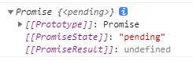
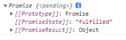
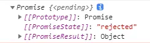
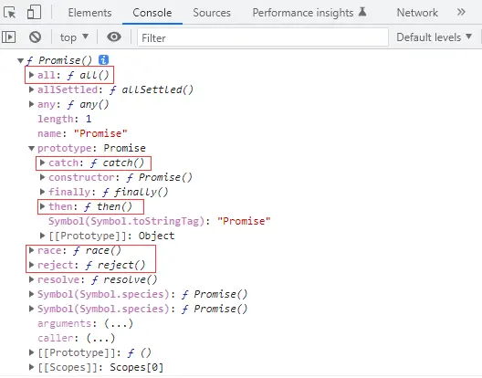
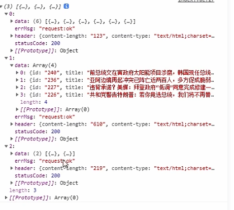
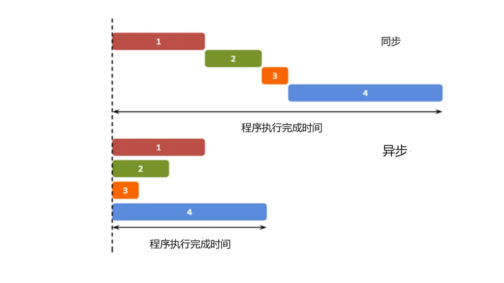

## 一、为什么要使用Promise

“**回调地狱**”这个词，不知道大家听过没有，就是异步调用获取到结果后，为下一个异步函数提供参数，所以就会一层一层的出现回调里面嵌入回调，导致层次很深，代码维护起来特别的复杂，看一下下面的小案例大家就知道什么意思了。

下面的举例就以`uniapp`里面的网络请求`uni.request()`为例了，如果你做的是微信小程序`wx.request()`也是一样的，还有jQuery的`ajax()`，这些都是异步请求，通过`success`回调函数获取数据的，那有童鞋会问为什么不适用`vue`的`axios`那，因为`axios`网络请求已经封装了`promise`了。

```java
// 演示回调地狱
getData(){
    //获取分类列表id
    uni.request({
    url:"https://ku.qingnian8.com/dataApi/news/navlist.php",
        success:res=>{
            let id=res.data[0].id
                // 根据分类id获取该分类下的所有文章
                uni.request({
                    url:"https://ku.qingnian8.com/dataApi/news/newslist.php",
                    data:{
                        cid:id
                    },
                    success:res2=>{
                        //获取到一篇文章的id，根据文章id找到该文章下的评论
                        let id=res2.data[0].id;
                        uni.request({
                            url:"https://ku.qingnian8.com/dataApi/news/comment.php",
                            data:{
                                aid:id
                            },
                            success:res3=>{
                                //找到该文章下所有的评论
                                console.log(res3)
                            }
                        })
                    }
                })
        }
    })
}
```

大家看到上的代码了没有，数一数有几层嵌套，出现了几个success回调，这个案例的嵌套还算是少的那，还有比这更夸张的，这就是所谓的回调地狱，层层嵌套，要是维护起这样的代码来，直接会把新手劝退的，自己写过的代码要是不加注释也不知道这到底是干嘛的。

在**没有ES6的promise时候**原来是怎么优化的那，把每一个request请求封装出一个函数将结果进行返回，这就是原来常用的回调函数方案，将上述代码可以改造成如下代码：

调用部分↓

```js
//传统型的回调函数做回调处理 依然是回调地狱
//在onload初始化后调用相应的函数
onLoad() {
  //调用导航函数，并拿到函数的返回值
  this.getNav(res=>{
    let id=res.data[0].id;
    //拿到分类id作为参数
    this.getArticle(id,res2=>{
      //拿到文章id作为参数
      let id=res2.data[0].id;
      this.getComment(id,res3=>{
        //最终获取到第一个分类下，第一篇文章下，所有评论
        console.log(res3)
      })
    })
  });
} 
```

封装的函数部分↓

```sql
methods: {
    //先获取导航分类接口，将结果进行返回，到调用函数的地方获取
    getNav(callback){
      uni.request({
        url:"https://ku.qingnian8.com/dataApi/news/navlist.php",
        success:res=>{
          callback(res)
        }
      })
    },

    //获取文章数据，将文章列表进行返回
    getArticle(id,callback){
      uni.request({
        url:"https://ku.qingnian8.com/dataApi/news/newslist.php",
        data:{
          cid:id
        },
        success:res=>{
          callback(res)
        }
      })
    },

      //获取文章下的所有评论
      getComment(id,callback){
        uni.request({
          url:"https://ku.qingnian8.com/dataApi/news/comment.php",
          data:{
            aid:id
          },
          success:res=>{
            callback(res)
          }
        })
      }
}
```

看上面大家可能都看懵了，仔细看来，并没有解决回调地狱的问题，还是回调里面嵌套回调，只是把函数独立出来了，看着清晰条理了一些而已，但是维护难度还是有的，所以**随着ES6的普及，这种方案逐渐边缘化，取而代之的就是promise方案了。**

## 二、什么是promise

**promise是解决异步的方法，本质上是一个构造函数，可以用它实例化一个对象。对象身上有resolve、reject、all，原型上有then、catch方法。promise对象有三种状态：pending（初识状态/进行中）、resolved或fulfilled（成功）、rejected（失败）**

```js
let p = new Promise((resolve, reject) => {
    // 打印时PromiseState为 pending
    // resolve(1) // 打印时PromiseState为 fulfilled  PromiseResult为 1
})
console.log(p);
```

1. pending。它的意思是 **待定的**，将发生的，相当于是一个初始状态。
   创建Promise对象时，且没有调用resolve或者是reject方法，相当于是**初始状态**。这个初始状态会随着你调用resolve，或者是reject函数而切换到另一种状态。
   
2. resolved。表示**解决了**，就是说这个承诺实现了。 
   要实现从pending到resolved的转变，需要在 创建Promise对象时，在函数体中**调用了resolve方法**
   
3. rejected。**拒绝，失败**。表示这个承诺没有做到，失败了。
   要实现从pending到rejected的转换，只需要在创建Promise对象时，**调用reject函数**。
   

看上面的引用，promise就是用来解决异步的方法，光看上面的解释可能不懂什么意思，但是它后面说的实例化对象后端方法，你肯定用过，如then、catch等，通过以下代码打印一下他里面的方法。

```javascript
console.dir(Promise)
```

浏览器打印结果：



下面就通过promise实例化，完成对上面回调地狱函数进行重构，看一下这种方案会不会好一些。

## 三、将回调函数修改为promise方案

**promise方案，不用函数封装：**

```js
onLoad() {
    let p = new Promise((resolve,reject)=>{ // 返回promise对象
        uni.request({
            url:"https://ku.qingnian8.com/dataApi/news/navlist.php",
            success:res=>{
                resolve(res) // 解决了
            },
            fail:err=>{
                reject(err) // 失败了
            }
        })
    })
    
    p.then(res => {
        // 成功后的流程 这里省略
        console.log(res)
    }).catch(err => {
        // 失败后的流程 这里省略
        console.log(err)
    })
}
```

**promise方案，用函数封装：**

`.then`的链式调用函数

```javascript
onLoad() {
    //promise链式调用
    this.getNav() // 返回promise对象
        .then(res=>{
        let id=res.data[0].id;
        return this.getArticle(id); // 返回promise对象
    })
        .then(res=>{
        let id=res.data[0].id;
        return this.getComment(id) // 返回promise对象
    })
        .then(res=>{
        console.log(res)
    })   

    // 演示打印所有    
    let p1 = this.getNav()
    let p2 = this.getList(51)
    let p3 = this.getComment(251)
    // 模拟三个同步的都处理完后对数据进行处理
    Promise.all([p1,p2,p3]).then(res => {
        console.log(res)
    })
}
```

打印：


函数返回promise对象

```javascript
methods: {
    //先获取导航分类接口，将结果进行返回，到调用函数的地方获取
    getNav(callback){
      return new Promise((resolve,reject)=>{ // 返回promise对象
        uni.request({
          url:"https://ku.qingnian8.com/dataApi/news/navlist.php",
          success:res=>{
            resolve(res) // 解决了
          },
          fail:err=>{
            reject(err) // 失败了
          }
        })
      })
    },

    //获取文章数据，将文章列表进行返回
    getArticle(id){
      return new Promise((resolve,reject)=>{ // 返回promise对象
        uni.request({
          url:"https://ku.qingnian8.com/dataApi/news/newslist.php",
          data:{
            cid:id
          },
          success:res=>{
            resolve(res)
          },
          fail:err=>{
            reject(err)
          }
        })
      })
    },

      //获取文章下的所有评论
      getComment(id){
        return new Promise((resolve,reject)=>{ // 返回promise对象
          uni.request({
            url:"https://ku.qingnian8.com/dataApi/news/comment.php",
            data:{
              aid:id
            },
            success:res=>{
              resolve(res)
            },
            fail:err=>{
              reject(err)
            }
          })
        })

}
```

经过一番改造，代码的可读性是不是更好了那，虽然多了几行代码，但是在调用的时候实在是太优雅了，清晰明了。

如果你觉得，这种调用方式还是**有嵌套不够清晰**，还有**大杀器，就是**目前最为流行的**await/async**了，这是**ES7新引入的概念**。

## 四、await / async ES7的新规范，异步处理同步化

这两个命令是**成对出现**的

- 如果**使用`await`没有在函数中使用`async`**命令，那就会**报错**
- 如果**直接使用`async`**没有使用await**不会报错**，只是**返回的函数是个promise**，可以，但是没有意义，所以这两个一起使用才会发挥出它们本身重要的作用。

这两个命令怎么用那，还是通过上面的案例，来该着一下then的链式调用代码。

```javascript
// 异步处理同步化
async onLoad() {
    let id,res;
    
    res = await this.getNav(); // await 只有在成功拿到返回结果后才会往下执行，返回值是一个promise
    id = res.data[0].id; // ≈ Promise.then
    
    res = await this.getArticle(id);
    id = res.data[0].id;
    
    res = await this.getComment(id);
    console.log(res)
}
```

以上代码就是最终的改造版了，可以看到onload是函数，这个函数必须有`async`命令，在调用函数的部分，前面都加了一个`await`，这个命令的意思就是等这一行的异步方法执行成功后，将返回的值赋值给`res`变量，然后才能再走下一行代码，这就是将原来的异步编程改为了同步编程，这就是标题提到的“异步处理，同步化”，

**什么？你不知道什么是同步，什么是异步？**

我们编写的JavaScript代码实际上是单线程的程序，那就决定了我们的代码是一行一行的顺序执行的，处理一些简短、快速的运算操作时主线程就够了，如果在同步程序中发送了网络请求，如果超时了，下面的代码依赖于网络请求，那么整个网页将会失去响应。

而异步的概念则与同步恰恰相反，一个异步过程的执行将不再与原有的序列有顺序关系，特别是对发送网络请求，不确保响应时间时候，异步是最优选择，网络请求无论多长时间，程序将不会在此等待，直接走下面的代码，等异步的请求有了响应，主线程几乎不用关心异步任务的状态了，自己完成回调后续的操作，程序间互不影响。

简单来理解：同步按你的代码顺序执行，异步不按照代码顺序执行，异步的执行效率更高。



**总结：**如果涉及到网络请求没有依赖关系的话，异步请求是效率最高的，但是下一个的方法依赖于上一个网络请求的结果，那么久必须使用await命令，将异步结果等待返回之后再执行后面的代码。

---

参考资料

- [ES6 Promise的用法，ES7 async/await异步处理同步化，异步处理进化史_哔哩哔哩_bilibili](https://www.bilibili.com/video/BV1XW4y1v7Md?spm_id_from=333.788.videopod.episodes&vd_source=796ed40051b301bfa3a84ba357f4828c)