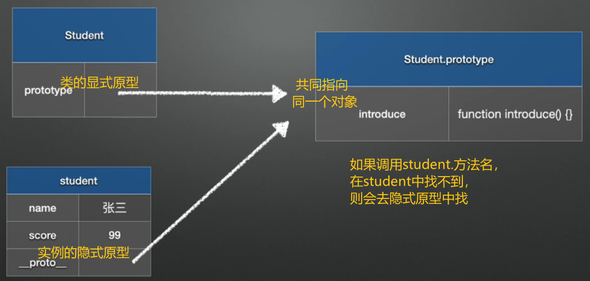
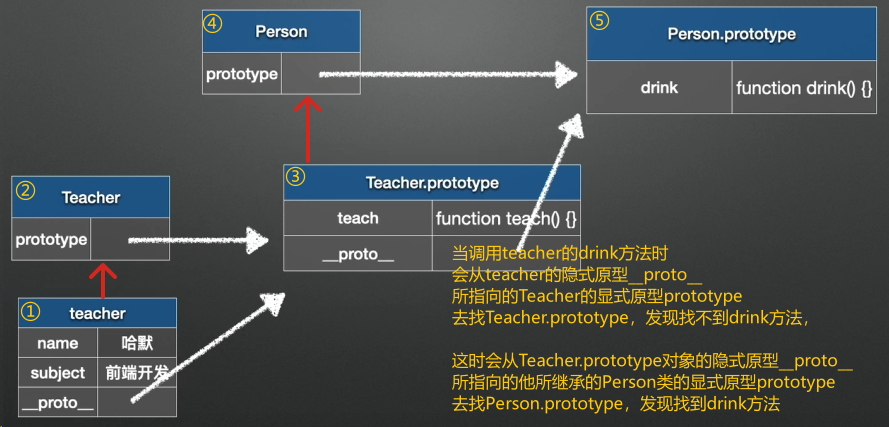
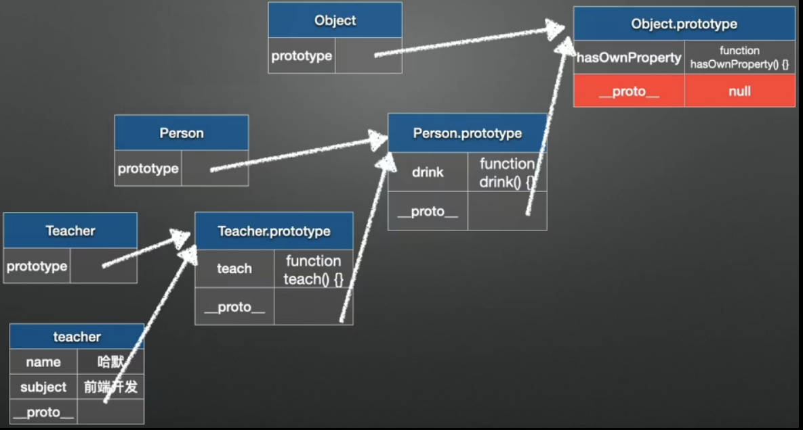

## 类的继承

父类

```js
class Person {
    constructor(name) {
        this.name = name;
    }
    drink() {
        console.log('喝水');
    }
}
```

子类：

```js
class Student extends Person {
    // 构造方法
    constructor(name, score) {
        super(name);
        this.score = score;
    }
    
    // 成员方法
    introduce() {
        console.log(`我是${this.name}，考了${this.score}分。`)
    }
}

// 创建Student对象
const student = new Student对象('张三', 99);
// 调用成员方法
student.introduce();
// 调用子类的成员方法
student.drink();
// 访问类的成员变量
console.log(student.name);
```

```js
class Teacher extends Person {
    constructor(name, subject) {
        super(name);
        this.subject = subject;
    }
    teach() {
        console.log(`我是${this.name}，教${this.subject}。`)
    }
}

const teacher = new Teacher('张三', '语文');
teacher.teach();
teacher.drink();
```

## 原型

运行上述代码

**浏览器控制台：**

符号含义：`->` 输入、`<-` 输出、`▽` 已展开、`▷` 未展开、`//`注释

```shell
// 打印student
-> student // 发现student对象中不包含方法，其实这些被隐式的包含在了__proto__属性中
<- ▽Student {name: '张三', score: 99}
 	 name: "张三"
 	 score: 99
 	 ▷[[Prototype]]: Person // 浏览器中打印的这个属性其实就是__proto__

//当调用student的方法时，会去隐式原型上找，如果还没有则没有这个方法

// student的隐式原型__proto__
-> student.__proto__ // 也就是上面打印的[[Prototype]]
<- ▽Person {introduce: ƒ}
      ▷constructor: class Student
      ▷introduce: ƒ introduce() // 这是我们自定义的方法introduce
      ▷[[Prototype]]: Object

// 直接打印Student类，发现打印了该类
-> Student
<- class Student extends Person {
 	// 构造方法
 	constructor(name, score) {
 	super(name);
 	this.score = score;
 	}
 	
 	// 成员方法
 	introduce() {
 	console.log(`我是${this.name}，考了${this.score}…

// 访问Student类的prototype属性，发现这个属性好像和student对象的__proto__原型属性一样
-> Student.prototype
<- ▽Person {introduce: ƒ}
      ▷constructor: class Student
      ▷introduce: ƒ introduce()
      ▷[[Prototype]]: Object
 
// 判断 Student类的prototype和student对象的__proto__属性是否完全一样
-> Student.prototype === student.__proto__
<- true
```

> 在浏览器控制台中打印对象时，你看到的 `[[Prototype]]` 是一个内部属性，用于表示对象的原型链。这个表示法源自 ECMAScript 规范，意在区分标准属性和内部属性。
>
> 虽然在 JavaScript 中，我们可以通过 `obj.__proto__` 来访问对象的原型，但 `[[Prototype]]` 是一个更为直观的表示方法，强调了原型关系是 JavaScript 对象的核心特性之一。
>
> 简单来说：
>
> - `__proto__` 是一个可访问的属性，可以直接读取或修改对象的原型。
> - `[[Prototype]]` 是一个内部属性，用于描述对象的原型，通常在开发工具和某些调试场景中以视觉上更清晰的方式呈现。
>
> 因此，当你在控制台中查看对象的属性时，控制台通常会用 `[[Prototype]]` 来表示这些内部机制，而不是直接显示 `__proto__`。



## 原型链

**原型链：**当调用对象的属性或方法时，首先**从自身去找**，如果找不到就去它的**原型上找**，如果还是找不到，就去**原型的原型上**去**找**，这样就形成一种链式的结构，叫做**原型链**

**浏览器控制台：**

```shell
// 打印teacher的原型
-> teacher.__proto__
<- ▽Person {teach: ƒ} // teacher的原型
      ▷constructor: class Teacher
	  ▷teach: ƒ teach()
	  ▽[[Prototype]]: Object // teacher的原型的原型
	      ▷constructor: class Person
	      ▷drink: ƒ drink()
	      ▽[[Prototype]]: Object // teacher的原型的原型的原型
	  	      ▷constructor: ƒ Object()
	  	      ▷hasOwnProperty: ƒ hasOwnProperty()
	  	      ▷isPrototypeOf: ƒ isPrototypeOf()
	  	      ▷propertyIsEnumerable: ƒ propertyIsEnumerable()
	  	      ▷toLocaleString: ƒ toLocaleString()
	  	      ▷toString: ƒ toString()
	  	      ▷valueOf: ƒ valueOf()
	  	      ▷__defineGetter__: ƒ __defineGetter__()
	  	      ▷__defineSetter__: ƒ __defineSetter__()
	  	      ▷__lookupGetter__: ƒ __lookupGetter__()
	  	      ▷__lookupSetter__: ƒ __lookupSetter__()
	  	      ▽__proto__: Object // teacher的原型的原型的原型的原型
	  	          ▷constructor: class Person
	  	          ▷drink: ƒ drink()
	  	          ▽[[Prototype]]: Object  // teacher的原型的原型的原型的原型的原型
	  	              ▷constructor: ƒ Object()
	  	              ▷hasOwnProperty: ƒ hasOwnProperty()
	  	              ▷isPrototypeOf: ƒ isPrototypeOf()
	  	              ▷propertyIsEnumerable: ƒ propertyIsEnumerable()
	  	              ▷toLocaleString: ƒ toLocaleString()
	  	              ▷toString: ƒ toString()
	  	              ▷valueOf: ƒ valueOf()
	  	              ▷__defineGetter__: ƒ __defineGetter__()
	  	              ▷__defineSetter__: ƒ __defineSetter__()
	  	              ▷__lookupGetter__: ƒ __lookupGetter__()
	  	              ▷__lookupSetter__: ƒ __lookupSetter__()
	  	              ▽__proto__: Object // teacher的原型的原型的原型的原型的原型的原型
	  	                  ▷constructor: ƒ Object()
                          ▷hasOwnProperty: ƒ hasOwnProperty()
                          ▷isPrototypeOf: ƒ isPrototypeOf()
                          ▷propertyIsEnumerable: ƒ propertyIsEnumerable()
                          ▷toLocaleString: ƒ toLocaleString()
                          ▷toString: ƒ toString()
                          ▷valueOf: ƒ valueOf()
                          ▷__defineGetter__: ƒ __defineGetter__()
                          ▷__defineSetter__: ƒ __defineSetter__()
                          ▷__lookupGetter__: ƒ __lookupGetter__()
                          ▷__lookupSetter__: ƒ __lookupSetter__()
                           __proto__: null
                          ▷get __proto__: __proto__()
	  	                  ▷set __proto__: ƒ __proto__() 
	  	              ▷get __proto__: __proto__()
	  	              ▷set __proto__: ƒ __proto__()
	  	      ▷get __proto__: ƒ __proto__()
	  	      ▷set __proto__: ƒ __proto__()
```

---

**调用`teqacher.drink()`(drink方法存在于Teacher的父类Person中)：**



当调用teacher的drink方法时

1. 会从teacher的隐式原型`__proto__`所指向的Teacher的显式原型`prototype`
2. 去找`Teacher.prototype`，发现找不到`drink`方法，
3. 这时会从`Teacher.prototype`对象的隐式原型`__proto__`所指向的他所继承的Person类的显式原型`prototype`
4. 去找`Person.prototype`，发现找到`drink`方法

---

**如何检查这个属性或方法是否是自身拥有的？**

可以使用`hasOwnProperty`方法，`hasOwnProperty`方法存在于`Object`类中

```js
teacher.hasOwnProperty('name') // true 说明name属性或方法是自身拥有的
teacher.hasOwnProperty('teach')// false 说明teach属性或方法不是自身拥有的
```



## `instanceof`类型判断

```js
const object = {};
const array = [];

console.log('typeof object -', typeof object); // object
console.log('typeof array -', typeof array); // object

const flagObject = object instanceof Array;
const flagArray = array instanceof Array;

console.log('object instanceof Array -', flagObject); // false
console.log('array instanceof Array -', flagArray); // true
```

控制台：

```shell
typeof object - object
typeof array - object
object instanceof Array - false
array instanceof Array - true
```

继续使用上面的代码:

```shell
-> teacher instanceof Teacher
<- true

-> teacher instanceof Person
<- true

-> teacher instanceof Object
<- true

-> teacher instanceof Array
<- false
```

使用`instanceof`去做类型检查的时候，只要存在在它的原型链上都会返回`true`
