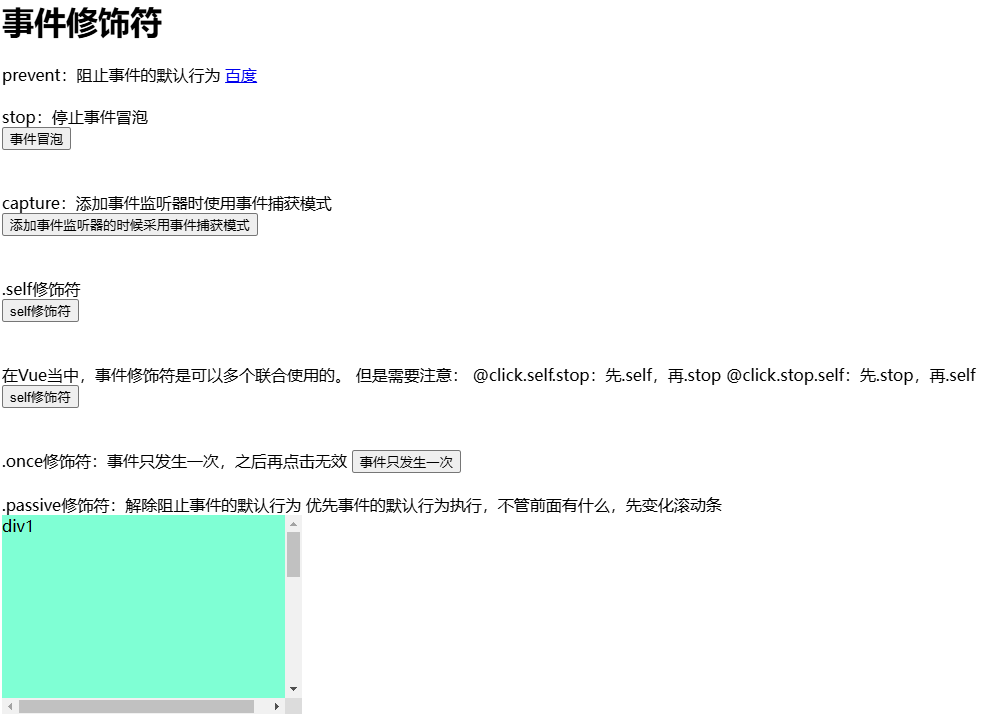

D:\workspace\stuspace\webObject\vue

# Vue程序初体验

我们可以先不去了解Vue框架的发展历史、Vue框架有什么特点、Vue是谁开发的，这些对我们编写Vue程序起不到太大的作用，更何况现在说了一些特点之后，我们也没有办法彻底理解它，因此我们可以先学会用，使用一段时间之后，我们再回头来熟悉一下Vue框架以及它的特点。现在你只需要知道Vue是一个基于JavaScript（JS）实现的框架。要使用它就需要先拿到Vue的js文件。从Vue官网（https://v2.cn.vuejs.org/）下载vue.js文件。

## 01. 第一个Vue程序

**第一步：创建 Vue 实例：**  

1. **为什么要 `new Vue()`，直接调用 `Vue()` 函数不行吗？**  
   
   - 不行，因为直接调用 `Vue()` 函数，不创建实例的话，会出现以下错误：  
     - `Vue is a constructor and should be called with the 'new' keyword`  
   
2. **关于 Vue 构造函数的参数：options**  
   - `option` 翻译为选项  
   - `options` 翻译为多个选项  
   - Vue 框架要求这个 `options` 参数必须是一个纯粹的 JS 对象：`{}`  
   - 在 `{}` 对象中可以编写大量的 key:value 对。  
   - 一个 key:value 对就是一个配置项。  
   - 主要是通过 `options` 这个参数来给 Vue 实例指定多个配置项。  

3. **关于 template 配置项：**  
   - `template` 翻译为：模板。  
   - `template` 配置项用来指定什么？
     用来指定模板语句，模板语句是一个字符串形式的。  
   
   **什么是模板语句？**  
   - Vue 框架自己制定了一些具有特殊含义的特殊符号，例如 `{{}}`。  
   - Vue 的模板语句是 Vue 框架自己搞的一套语法规则。  
   - 我们写 Vue 模板语句的时候，不能乱写，要遵守 Vue 框架的模板语法规则。  
   - 模板语句可以是一个纯粹的 HTML 代码，也可以是 Vue 中的特殊规则，也可以是 HTML 代码 + Vue 的特殊规则。  
   - `template` 后面的模板语句会被 Vue 框架的编译器进行编译，转换成浏览器能够识别的 HTML 代码。  

**第二步：将 Vue 实例挂载到 `id='app'` 的元素位置：**  

1. **Vue 实例都有一个 `$mount()` 方法，这个方法的作用是什么？**  
   - 将 Vue 实例挂载到指定位置。  

2. **`#app` 显然是 ID 选择器。这个语法借鉴了 CSS。**

```html
<!DOCTYPE html>
<html lang="en">
<head>
    <meta charset="UTF-8">
    <meta http-equiv="X-UA-Compatible" content="IE=edge">
    <meta name="viewport" content="width=device-width, initial-scale=1.0">
    <title>第一个Vue程序</title>
    <!-- 安装vue：当你使用script进行Vue安装之后，上下文中就注册了一个全局变量：Vue -->
    <script src="../js/vue.js"></script>
</head>
<body>
    <!-- 指定Vue实例的挂载位置。 -->
    <div id="app"></div>

    <script>
        // 第一步：创建Vue实例
        /* 
        let options = {
            template : '<h1>Hello Vue!!!!!</h1>'
        }
        const myVue = new Vue(options) 
        */

        const myVue = new Vue({
            template : '<h1>Hello Vue!!!!!</h1>'
        })

        // 第二步：将Vue实例挂载到id='app'的元素位置。
        myVue.$mount('#app')
        //myVue.$mount(document.getElementById('app'))
    </script>
</body>
</html>
```

对第一个程序进行解释说明：

1. 当使用script引入vue.js之后，**Vue**会被注册为一个全局变量。就像引入jQuery之后，jQuery也会被注册为一个全局变量一样。
2. 我们必须new一个Vue实例，因为通过源码可以看到this的存在。
3. Vue的构造方法参数是一个options配置对象。配置对象中有大量Vue预定义的配置。每一个配置项都是`key:value`结构。一个`key:value`就是一个Vue的配置项。
4. template配置项：value是一个**模板字符串**。在这里编写符合Vue语法规则的代码（Vue有一套自己规定的语法规则）。写在这里的字符串会被Vue编译器进行编译，将其转换成浏览器能够识别的HTML代码。template称之为模板。
5. Vue实例的$mount方法：这个方法完成挂载动作，将Vue实例挂载到指定位置。也就是说将Vue编译后的HTML代码**渲染**到页面的指定位置。注意：指定位置的元素被**替换**。
6.  ‘#app’的语法类似于CSS中的id选择器语法。表示将Vue实例挂载到id=’app’的元素位置。当然，如果编写原生JS也是可以的：`vm.$mount(document.getElementById(‘app’))`
7.  `#app`是id选择器，也可以使用其它选择器，例如类选择器：`.app`。类选择器可以匹配多个元素（位置），这个时候Vue只会选择第一个位置进行挂载（从上到下第一个）。

## 02. data配置项

模板语句的数据来源data

1. **谁可以给模板语句提供数据支持呢？**  
   - `data` 选项。  

2. **data 选项的类型是什么？**  
   - `Object` 、 `Function` （对象或者函数）  

3. **data 配置项的专业叫法：**  
   - Vue 实例的数据对象。(`data` 实际上是给整个 Vue 实例提供数据来源的。)  

4. **如果 data 是对象的话，对象必须是纯粹的对象：**含有零个或多个的 key/value 对

5. **data 数据如何插入到模板语句当中？**  

   - `{{}}` 这是 Vue 框架自己搞的一套语法，可以从data中根据key来获取value，并且将value插入到对应的位置。别的框架看不懂的，浏览器也是不能够识别的。  
   - Vue 框架自己是能够看懂的。这种语法在 Vue 框架中被称为：模板语法中的插值语法。（有的人把他叫做胡子语法。）  

   **怎么用？**  

   `{{data的key}}`

   **插值语法的小细节：**

   - `{` 这里不能有其它字符包括空格
   - `}` 这里不能有其它字符包括空格

   **当data发生改变时，template模板会被重新编译，重新渲染。**

```html
<!-- 指定挂载位置 -->
<div id="app"></div>
<!-- vue程序 -->
<script>
    new Vue({
        template : 
        `<h1>最近非常火爆的电视剧{{name}}，它的上映日期是{{releaseTime}}。主角是{{lead.name}}，年龄是{{lead.age}}岁。
                其他演员包括：{{actors[0].name}}({{actors[0].age}}岁)，{{actors[1].name}}({{actors[1].age}}岁)。{{a.b.c.d.e.name}}
    	</h1>
    	`,
        data : {
            name : '狂飙!!!',
            releaseTime : '2023年1月2日',
            lead : {
                name : '高启强',
                age : 41
            },
            actors : [
                {
                    name : '安欣',
                    age : 41
                },
                {
                    name : '高启兰',
                    age : 29
                }
            ],
            a : {
                b : {
                    c : {
                        d : {
                            e : {
                                name : '呵呵'
                            }
                        }
                    }
                }
            }
        }
    }).$mount('#app')
</script>
```

以上程序执行原理：Vue编译器对template进行编译，遇到胡子{{}}时从data中取数据，然后将取到的数据插到对应的位置。生成一段HTML代码，最终将HTML渲染到挂载位置，呈现。

## 03. template配置项

**关于 template 配置项：**  

1. `template` 后面指定的是模板语句，但是**模板语句中只能有一个根节点**。  
2. 只要 `data` 中的数据发生变化，模板语句一定会重新编译。  
   - （只要 `data` 变，`template` 就会重新编译，重新渲染）  
3. 如果使用 `template` 配置项的话，指定挂载位置的元素会被**替换**。  
4. template后面的代码如果需要换行的话，建议将代码写到\`\`符号当中，不建议使用 `+` 进行字符串的拼接。
5. 我们**可以不使用 `template` 来编写模板语句**。这些**模板语句可以直接写到 HTML 标签中**。Vue 框架能够找到并编译，然后渲染。 
   需要注意两点：
   - 这种方式不会产生像template那种的元素替换。
   - 虽然是直接写到HTML代码当中的，但它已经不是HTML代码了，它是具有Vue语法特色的模板语句。这段内容在data发生改变后都是要重新编译的。
6. 如果直接将模板语句编写到 HTML 标签中，指定的挂载位置就不会被替换了。  

**关于 $mount('#app')：**  

- 将Vue实例挂载时，也可以不用`$mount`方法，可以使用Vue的`el`配置项。
- 在 Vue 中有一个配置项：`el`  ，**`el` 配置项和 `$mount()` 可以达到同样的效果。**  
  
- **`el` 配置项的作用：**  el配置项主要是用来指定Vue实例关联的容器。也就是说Vue所管理的容器是哪个。
  - 告诉 Vue 实例去接管哪个容器。  
  - `el: '#app'`，表示让 Vue 实例去接管 `id='app'` 的容器。  

- `el` 其实是 `element` 的缩写，被翻译为元素。

```html
<!DOCTYPE html>
<html lang="en">
<head>
    <meta charset="UTF-8">
    <meta http-equiv="X-UA-Compatible" content="IE=edge">
    <meta name="viewport" content="width=device-width, initial-scale=1.0">
    <title>template配置项详解</title>
    <!-- 安装Vue -->
    <script src="../js/vue.js"></script>
</head>
<body>
    <!-- 指定挂载位置 -->
    <!-- 注意：以下代码就是只有Vue框架能够看懂的代码了。下面的代码就是一个模板语句。这个代码是需要Vue框架编译，然后渲染的。 -->
    <div id="app">
        <div>
            <h1>{{msg}}</h1>
            <h1>{{name}}</h1>
        </div>
    </div>

    <!-- vue程序 -->
    <script>
        // Vue.config是Vue的全局配置对象。
        // productionTip属性可以设置是否生成生产提示信息。
        // 默认值：true。如果是false则表示阻止生成生产提示信息。
        // Vue.config.productionTip = false//可能没有效果//如果没有效果可以直接改源码vue.js productionTip = false

        new Vue({
            // 错误的
            //template : '<h1>{{msg}}</h1> <h1>动力节点老杜</h1>',//这里有两个h1根节点，是错误的

            /*
            // 正确的
            template : `
            	<div>
            	    <h1>{{msg}}</h1>
            	    <h1>{{name}}</h1>
           	    </div>`, 
            */
            
            // 定义的数据也可以直接在html被挂载的标签中的{{}}中引用
            data : {
                msg : 'Hello Vue!!!!!!!',
                name : 'a动力节点老杜!!!!!!'
                // vue的谷歌开发者工具插件有个小bug 数据开头一定要是非中文 不然插件无效
            },
            //el配置项和$mount()可以达到同样的效果。
            el : '#app'
            //el : document.getElementById('app')
        })
        //}).$mount('#app')
        
    </script>
</body>
</html>
```

## 04. Vue实例和容器的关系

Vue实例和容器的关系是：一夫一妻制

- 一个Vue实例可以接管多个容器吗？
  不能。一个Vue实例只能接管一个容器。一旦接管到容器之后，即使后面有相同的容器，Vue也是不管的。因为Vue实例已经“娶到媳妇”了。

```html
<!DOCTYPE html>
<html lang="en">
<head>
    <meta charset="UTF-8">
    <meta http-equiv="X-UA-Compatible" content="IE=edge">
    <meta name="viewport" content="width=device-width, initial-scale=1.0">
    <title>Vue实例 和 容器 的关系是：一夫一妻制</title>
    <!-- 安装Vue -->
    <script src="../js/vue.js"></script>
</head>
<body>
    <!-- 准备容器(指定挂载位置) -->
    <!-- 结果： 只有第一个.app挂载了数据 -->
    <div class="app">
        <h1>{{msg}}</h1>
    </div>

    <div class="app">
        <h1>{{msg}}</h1>
    </div>

    <!-- 准备容器 -->
    <div id="app2">
        <h1>{{name}}</h1>
    </div>

    <!-- vue程序 -->
    <script>
        // 验证：一个Vue实例可以接管多个容器吗？ 不能接管多个容器
        new Vue({
            el : '.app',
            data : {
                msg : 'Hello Vue!'
            }
        })

        new Vue({
            el : '#app2',
            data : {
                name : 'zhangsan'
            }
        })

        // 这个Vue实例想去接管 id='app2'的容器，但是这个容器已经被上面那个Vue接管了。他只能“打光棍”了。
        new Vue({
            el : '#app2',
            data : {
                name : 'jackson'
            }
        })    
    </script>
</body>
</html>
```

# Vue核心技术

## 01. 模板语法之插值语法{{}}

{{ 这里可以写什么 }} ?

1. 在**data中**声明的变量、函数等都可以。

2. **常量**都可以。

3. 只要是**合法的javascript表达式**都可以。

4. 模板表达式都被放在沙盒中，只能访问**全局变量的一个白名单**，如 `Math` 和 `Date `等。

   ```js
   // 全局变量的白名单
   Infinity,undefined,NaN,isFinite,isNaN,parseFloat,parseInt,decodeURI,decodeURIComponent,encodeURI,encodeURIComponent,Math,Number,Date,Array,Object,Boolean,String,RegExp,Map,Set,JSON,Intl,require
   ```


```html
<!-- 准备容器 -->
<div id="app">
    <!-- 在data中声明的 -->
    <!-- 这里就可以看做在使用msg变量。 -->
    <h1>{{msg}}</h1>
    <h1>{{sayHello()}}</h1>
    <!-- <h1>{{i}}</h1> -->
    <!-- <h1>{{sum()}}</h1> -->

    <!-- 常量 -->
    <h1>{{100}}</h1>
    <h1>{{'hello vue!'}}</h1>
    <h1>{{3.14}}</h1>

    <!-- javascript表达式 -->
    <h1>{{1 + 1}}</h1>
    <h1>{{'hello' + 'vue'}}</h1>
    <h1>{{msg + 1}}</h1><!--变量＋数字-->
    <h1>{{'msg' + 1}}</h1>
    <h1>{{gender ? '男' : '女'}}</h1>
    <h1>{{number + 1}}</h1>
    <h1>{{'number' + 1}}</h1>
    <h1>{{msg.split('').reverse().join('')}}</h1>

    <!-- 错误的：不是表达式，这是语句。 -->
    <!-- <h1>{{var i = 100}}</h1> -->

    <!-- 在白名单里面的 -->
    <h1>{{Date}}</h1>
    <h1>{{Date.now()}}</h1>
    <h1>{{Math}}</h1>
    <h1>{{Math.ceil(3.14)}}</h1>
</div>

<!-- vue程序 -->
<script>
    // 用户自定义的一个全局变量
    var i = 100
    // 用户自定义的一个全局函数
    function sum(){
        console.log('sum.....');
    }
    new Vue({
        el : '#app',
        data : {
            number : 1,
            gender : true,
            msg : 'abcdef',  // 为了方便沟通，以后我们把msg叫做变量。（这行代码就可以看做是变量的声明。）
            sayHello : function(){
                console.log('hello vue!');
            }
        }
    })
</script>
```

## 02. 模板语法之指令语法 

**指令语法:**  

1. **什么是指令？有什么作用？**  
   
   - 指令的职责是，当表达式的值改变时，将其产生的连带影响，响应式地作用于 DOM。  
   
2. **Vue 框架中的所有指令的名字都以`v-`开始。**  

3. **插值是写在标签体当中的，那么指令写在哪里呢？**  
   - Vue 框架中所有的指令都是以 HTML 标签的属性形式存在的，例如：  
     ```html  
     <span v-指令名:参数="javascript表达式">{{这里是插值语法的位置}}</span>  
     ```
   - 注意：虽然指令是写在标签的属性位置上，但是这个指令浏览器是无法直接看懂的。需要先让 Vue 框架进行编译，编译之后的内容浏览器是可以看懂的。  

4. **指令的语法规则：**  
   
   - 指令的一个完整的语法格式：  
     ```html  
     <HTML标签 v-指令名:参数="javascript表达式"></HTML标签>  
     ```
   - **表达式：**  
     - 之前在插值语法中 `{{这里可以写什么}}`，那么指令中的表达式就可以写什么，实际上是一样的。  
     - 但是需要注意的是：在指令中的表达式位置不能外层再添加一个 `{{}}`。  
   - 不是所有的指令都有参数和表达式：  
     - 有的指令不需要参数，也不需要表达式，例如：`v-once`。  
     - 有的指令不需要参数，但需要表达式，例如：`v-if="表达式"`。  
     - 有的指令既需要参数，又需要表达式，例如：`v-bind:参数="表达式"`。  

## 03. `v-if`,`v-once`

1. **`v-once` 指令**
   - **作用**：只渲染元素一次。随后的重新渲染，元素及其所有的子节点将被视为静态内容并跳过。这可以用于优化更新性能。  

2. **`v-if="表达式"` 指令**  
   - **作用**：表达式的执行结果需要是一个布尔类型的数据：`true` 或者 `false`。  
     - `true`：这个指令所在的标签，会被渲染到浏览器当中。  
     - `false`：这个指令所在的标签，不会被渲染到浏览器当中。

```html
<!-- 准备一个容器 -->
<div id="app">
    <h1>{{msg}}</h1>
    <h1 v-once>{{msg}}</h1>
    <h1 v-if="a > b">v-if测试：{{msg}}</h1>
</div>
<!-- vue程序 -->
<script>
    new Vue({
        el : '#app',
        data : {
            msg : 'Hello Vue!',
            a : 10,
            b : 11
            // b : 9
        }
    })
</script>
```

## 04. `v-bind`单向绑定数据

1. **`v-bind`指令是干啥的？**  

   - 它可以让 HTML 标签的某个**属性的值产生动态的效果**。  

2. **v-bind 指令的语法格式：**  `v-bind:参数="表达式"`

   ```html  
   <HTML标签 v-bind:参数="表达式"></HTML标签>
   ```

   **简写：**`:参数="表达式"`

   ```html
   <HTML标签 :参数="表达式"></HTML标签>
   ```

3. **v-bind 指令的编译原理？**

   - 编译前：

     ```html
     <HTML标签 v-bind:参数="表达式"></HTML标签>  
     ```

   - 编译后：

     ```html
     <HTML标签 参数="表达式的执行结果"></HTML标签>  
     ```

   - 注意两项：

     - 第一：在编译的时候 `v-bind` 后面的“参数名”会被编译为 HTML 标签的“属性名”。
     - 第二：表达式会关联 `data`，当 `data` 发生改变之后，表达式的执行结果就会发生变化。因此，连带的就会产生动态效果。

4. **v-bind 因为很常用，所以 Vue 框架对该指令提供了一种简写方式：**

   - 只是针对`v-bind:参数="表达式"` 提供了**简写方式**`:参数="表达式"`

     ```html
       
     ```

5. **什么时候使用插值语法？什么时候使用指令？**

   - 凡是标签体当中的内容要想动态，需要使用插值语法。
   - 只要希望让 HTML 标签的属性动态，需要使用指令语法。

```html
<!-- 准备一个容器 -->
<div id="app">
    <!-- 注意：以下代码中 msg 是变量名。 -->
    <!-- 注意：原则上v-bind指令后面的这个参数名可以随便写。 -->
    <!-- 虽然可以随便写，但大部分情况下，这个参数名还是需要写成该HTML标签支持的属性名。这样才会有意义。 -->
    <span v-bind:xyz="msg"></span>
    <!-- 编译为 <span xyz="Hello Vue!"></span> -->

    <!-- 这个表达式带有单引号，这个'msg'就不是变量了，是常量。 -->
    <span v-bind:xyz="'msg'"></span>
    <!-- 编译为 <span xyz="msg"></span> -->

    <!-- v-bind实战 -->
     <br>
     <br>

    <!-- v-bind简写形式 -->
     <br>

    <!-- 这是一个普通的文本框 -->
    <input type="text" name="username" value="zhangsan"> <br>
    <!-- 以下文本框可以让value这个数据变成动态的：这个就是典型的动态数据绑定。 -->
    <input type="text" name="username" :value="username"> <br>

    <!-- 使用v-bind也可以让超链接的地址动态 -->
    <a href="https://www.baidu.com">走起</a> <br>
    <a :href="url">走起2</a> <br>

    <!-- 不能采用以下写法吗？ -->
    <!-- 
不能这样，报错了，信息如下：
Interpolation inside attributes has been removed. 
Use v-bind or the colon shorthand instead. For example, 
instead of <div id="{{ val }}">, use <div :id="val">

属性内部插值这种语法已经被移除了。（可能Vue在以前的版本中是支持这种写法的，但是现在不允许了。）
请使用v-bind或冒号速记来代替。
请使用 <div :id="val"> 来代替 <div id="{{ val }}">
-->
    <!-- <a href="{{url}}">走起3</a>  -->

    <h1>{{msg}}</h1>
</div>
<!-- vue程序 -->
<script>
    // 赋值的过程就可以看做是一种绑定的过程。
    //let i = 100

    new Vue({
        el : '#app',
        data : {
            msg : 'Hello Vue!',
            imgPath : '../img/1.jpg',
            username : 'jackson',
            url : 'https://www.baidu.com'
        }
    })
</script>
```

## 05. `v-model`双向数据绑定

**v-model 指令的语法格式：**  `v-model:参数="表达式"`

```html  
<HTML标签 v-model:参数="表达式"></HTML标签>
```

对`v-model:value="表达式"`属性的**简写：**`v-model="表达式"`

```html
<HTML标签 v-model="表达式"></HTML标签>
```

**v-bind 和 v-model 的区别和联系:**  

1. **数据绑定功能**  
   - `v-bind` 和 `v-model` 这两个指令**都可以完成数据绑定**。  

2. **单向与双向数据绑定**  
   - **`v-bind` 是单向**数据绑定。  
     - 数据流向：`data ===> 视图`  
     - 数据变化视图跟着变化，反之不可以。  
   - **`v-model` 是双向**数据绑定。  
     - 数据流向：`data <===> 视图`  
     - 数据变化视图跟着变化，反之也可以。  

3. **适用元素**  
   - `v-bind` 可以使用在任何 HTML 标签当中。  
   - **`v-model` 只能使用在表单类元素上**，例如：  
     - `input` 标签、`select` 标签、`textarea` 标签。  
   - **为什么 `v-model` 的使用会有这个限制呢？**  
     - 因为表单类的元素才能给用户提供交互输入的界面。  
   - `v-model` 指令通常也是用在 `value` 属性上面的。  

4. **简写方式**  
   - `v-bind` 的简写方式：  
     `v-bind:参数="表达式"`简写为`:参数="表达式"  `
   - `v-model` 的简写方式：  
     `v-model:value="表达式"`简写为`v-model="表达式"`

```html
<!-- 准备一个容器 -->
<div id="app">
    v-bind指令：<input type="text" v-bind:value="name1"><br>
    v-model指令：<input type="text" v-model:value="name2"><br>

    <!-- 以下报错了，因为v-model不能使用在这种元素上。 -->
    <!-- <a v-model:href="url">百度</a> -->

    v-bind指令：<input type="text" :value="name1"><br>
    v-model指令：<input type="text" v-model="name2"><br>

    bind简写：<input type="text" :value="msg"><br>
    model简写：<input type="text" v-model="msg"><br>
</div>

<!-- vue程序 -->
<script>
    new Vue({
        el : '#app',
        data : {
            name1 : 'zhangsan',
            name2 : 'wangwu',
            url : 'https://www.baidu.com',
            msg : 'Hello Vue!'
        }
    })
</script>
```

## 06. 初识MVVM分层思想


1. MVVM 是什么？  

   - **M**：Model（模型/数据）  

   - **V**：View（视图）  
   - **VM**：ViewModel（视图模型）  
     - VM 是 MVVM 中的核心部分。（它起到一个核心的非常重要的作用。）  

   MVVM 是目前前端开发领域中非常流行的开发思想（一种架构模式）。目前前端的大部分主流框架都实现了这个 MVVM 思想，例如 Vue、React 等。  

2. Vue 框架遵循 MVVM 吗？  
   虽然没有完全遵循 MVVM 模型，但是 Vue 的设计也受到了它的启发。Vue 框架基本上也是符合 MVVM 思想的。  

3. MVVM 模型当中倡导了 Model 和 View 进行了分离，为什么要分离？
   假如 Model 和 View 不分离，使用最原始的原生 JavaScript 代码写项目：  如果数据发生任意的改动，接下来我们需要编写大篇幅的操作 DOM 元素的 JS 代码。  
   将 Model 和 View 分离之后，出现了一个 VM 核心，这个 VM 把所有的脏活累活给做了。也就是说，当 Model 发生改变之后，VM 自动去更新 View。当 View 发生改动之后，VM 自动去更新 Model。我们再也不需要编写操作 DOM 的 JS 代码了，开发效率提高了很多。

```html
<!-- 准备容器 -->
<!-- View V-->
<div id="app">
    姓名：<input type="text" v-model="name">
</div>

<!-- vue程序 -->
<script>
    // ViewModel  VM
    const vm = new Vue({
        el : '#app',
        // Model  M
        data : {
            name : 'zhangsan'
        }
    })
</script>
```

## 07. 认识vm

**通过Vue实例都可以访问哪些属性？(通过`vm`都可以`vm.什么`)**

- Vue实例中的属性很多，有的以 `$` 开始，有的以 `_` 开始。
  - 所有**以 `$` 开始**的属性，可以看做是**公开的属性**，这些属性是供程序员使用的。
  - 所有**以 `_` 开始**的属性，可以看做是**私有的属性**，这些属性是Vue框架底层使用的。一般我们程序员很少使用。
- 通过vm也可以访问Vue实例对象的原型对象上的属性，例如：vm.$delete...

**为什么`msg` 属性可以通过`vm`来访问呢？**

- 这是因为Vue**框架底层使用了数据代理机制**。
- 要想搞明白数据代理机制，必须有一个基础知识点要学会：`Object.defineProperty()`【[见下一小节](##08. `defineProperty()`操作对象属性)】。

```html

<div id="app">
    <h1>{{msg}}</h1>
</div>
<script>

    let dataObj = {
        msg : 'Hello Vue!'
    }
    const vm = new Vue({
        el : '#app',
        data : dataObj
    })
    // 按说msg是dataObj对象的属性。
    console.log('dataObj的msg', dataObj.msg);

    console.log('vm的msg', vm.msg);
</script>
```

## 08. `defineProperty()`操作对象属性

1. **`Object.defineProperty()  `方法是 ES5 新增的。**  

2. **这个方法的作用是：**  给对象新增属性，或者设置对象原有的属性。  

3. **怎么用？**  

   ```javascript  
   Object.defineProperty(给哪个对象新增属性,   
                         '新增的这个属性名叫啥',  
                         {给新增的属性设置相关的配置项key:value对}
                        )
   ```

4. **第三个参数是属性相关的配置项，配置项都有哪些？每个配置项的作用是啥？**

   - **value 配置项**：给属性指定值。
   - **writable 配置项**：设置该属性的值是否可以被修改。`true` 表示可以修改，`false` 表示不能修改。
   - **getter 方法配置项**：不需要我们手动调用的。当**读取属性值的时候**，getter 方法被**自动调用**。
     - getter 方法的返回值非常重要，这个返回值就代表这个属性的值。
   - **setter 方法配置项**：不需要我们手动调用的。当**修改属性值的时候**，setter 方法被**自动调用**。
     - setter 方法上是有一个参数的，这个参数可以接收传过来的值。

   **注意**：当配置项当中有 setter 和 getter 时，value 和 writable 配置项都不能存在。

5. 关于配置项：`enumerable`、`configurable`

   - `enumerable`(可遍历)：
     - true表示该属性是可以遍历的。（可枚举的，可迭代的。）
     - false表示该属性是不可遍历的。
   - ``configurable`(可删除)：
     - true表示该属性是可以被删除的。
     - false表示该属性是不可以被删除的。

   源码中：

   ```js
   var sharedPropertyDefinition = {
       enumerable: true,
       configurable: true,
       get: noop,
       set: noop
   };      
   ```

   ```js
   let phone = {
       name : '苹果X'
   }
   
   // 给phone对象新增一个color属性
   Object.defineProperty(phone, 'color', {
       value : '奶奶灰',
       // true表示该属性是可以遍历的。（可枚举的，可迭代的。）
       // false表示该属性是不可遍历的。
       enumerable : false,
       // true表示该属性是可以被删除的。
       // false表示该属性是不可以被删除的。
       configurable : true	
   })
   ```

```html
<script>
    // 这是一个普通的对象
    let phone = {}
    // 临时变量
    let temp
    // 给上面的phone对象新增一个color属性
    Object.defineProperty(phone, 'color', {
        //当配置项当中有setter和getter的时候，value和writable配置项都不能存在。
        //value : '太空灰', //给属性指定值
        //writable : true, //设置该属性的值是否可以被修改
        //enumerable : false, //设置该属性的值是否可以被遍历
        //configurable : true，	//设置该属性的值是否可以被删除
        // getter方法配置项
        get : function(){
            console.log('getter方法执行了@@@');
            // this.color = color
            //return '动态'
            // return this.color//xxx: 调用这个属性值会再次get无限递归，会内存溢出
            return temp
        },
        // setter方法配置项
        set : function(val){
            console.log('setter方法执行了@@@',val);
            // this.color = val
            temp = val
        }
    })
</script>
```

## 09. 数据代理机制

1. **什么是数据代理机制？**
通过访问 代理对象的属性 来间接访问 目标对象的属性。
数据代理机制的实现需要依靠：`Object.defineProperty()`方法。
2. **ES6新特性：**
在对象中的函数/方法 `:function` 是可以省略的。

```html
<div id="app">
    <h1>{{msg}}</h1><!--这也是个代理机制，它会调用get方法(框架给写好的)来获取vm的msg属性-->
</div>

<script>
    const vm = new Vue({
        el : '#app',
        data : {
            msg : 'Hello Vue!'
        }
    })
    // 目标对象
    let target = {
        name : 'zhangsan'
    }

    // 代理对象
    let proxy = {}

    // 如果要实现数据代理机制的话，就需要给proxy新增一个name属性。
    // 注意：代理对象新增的这个属性的名字 和 目标对象的属性名要一致。
    Object.defineProperty(proxy, 'name', {
        // get : function(){
        //     // 间接访问目标对象的属性
        //     return target.name
        // },
        // set : function(val){
        //     target.name = val
        // }

        get(){
            console.log('getter方法执行了@@@@');
            return target.name
        },
        set(val){
            target.name = val
        }
    })

    // let target = {
    //     name : 'zhangsan'
    // }

    // const vm = new Vue({
    //     el : '#app',
    //     data : target
    // })
</script>
```

## 10. Vue数据代理机制对属性名的要求

1. **Vue实例不会给以`_`和`$`开始的属性名做数据代理。**
2. 为什么？
    如果允许给`_`或`$`开始的属性名做数据代理的话，vm这个Vue实例上可能会出现`_xxx`或`$xxx`属性，而这个属性名可能会和Vue框架自身的属性名冲突。
    
3. 在Vue当中，给data对象的属性名命名的时候，不能以`_`或`$`开始。

```html
<!-- 容器 -->
<div id="app">
    <h1>{{msg}}</h1> Hello Vue!
    <h1>{{_name}}</h1> undefined
    <h1>{{$age}}</h1> undefined
</div>
<!-- vue程序 -->
<script>
    const vm = new Vue({
        el : '#app',
        data : {
            msg : 'Hello Vue!', // 做了数据代理
            _name : 'zhangsan', // 没有做数据代理
            $age : 20 // 没有做数据代理
        }
    })
</script>
```

## 11. 手写Vue框架数据代理的实现

**手写Vue框架数据代理`myvue.js`：**

```js
// 定义一个Vue类
class Vue {
    // 定义构造函数
    // options是一个简单的纯粹的JS对象：{}
    // options对象中有一个data配置项
    constructor(options){
        // 获取所有的属性名
        Object.keys(options.data).forEach((propertyName, index) => {
            //console.log(typeof propertyName, propertyName, index)
            let firstChar = propertyName.charAt(0)//获取属性的第一个字符
            if(firstChar != '_' && firstChar != '$'){//对_和$开头的属性不做数据代理
                Object.defineProperty(this, propertyName, {
                    //数据代理
                    get(){
                        return options.data[propertyName]
                    },
                    //数据劫持
                    set(val){
                        //1. 修改内存中对象的属性值
                        options.data[propertyName] = val
                        //2. 重新渲染页面
                        console.log('页面上的真实DOM元素更新了！！！')
                    }
                })
            }
        })
    }
}
```

**使用：**

```html
<!-- 安装我们自己的Vue -->
<script src="../js/myvue.js"></script>
<!-- 安装Vue -->
<!-- <script src="../js/vue.js"></script> -->

<!-- 容器 -->
<!-- <div id="app">
<h1>{{msg}}</h1>
</div> -->

<!-- Vue代码 -->
<script>
    // const vm = new Vue({
    //     el : '#app',
    //     data : {
    //         msg : 'Hello Vue!',
    //         name : 'jackson',
    //         age : 30
    //     }
    // })

    const vm = new Vue({
        data : {
            msg : 'Hello Vue!',
            _name : 'jackson',
            $age : 30
        }
    })
</script>
```

## 12. 解读Vue框架源代码

**Vue框架源代码中关键性代码：**  

1. **获取 data**  
   ```javascript  
   var data = vm.$options.data;
   ```

   - **注意**：这是获取 `data`。程序执行到这里的时候 `vm` 上还没有 `_data` 属性。

2. **处理 data**

   ```js
   data = vm._data = isFunction(data) ? getData(data, vm) : data || {};  
   ```

   - 程序执行完这个代码之后，`vm` 对象上多了一个 `_data` 属性。

   - **代码含义**：

     - 如果 `data` 是函数，则调用 `getData(data, vm)` 来获取 `data`。
     - 如果 `data` 不是函数，则直接将 `data` 返回，给 `data` 变量，并且同时将 `data` 赋值给 `vm._data` 属性了。

   - **有一个疑问**：

     - 程序执行到这里，为什么要给`vm`扩展一个`_data`属性呢？

       - `_data` 属性，以 `_` 开始，足以说明，这个属性是 Vue 框架底层需要访问的。

       - Vue 框架底层使用 `vm._data` 这个属性干啥呢？

         - `vm._data`是：

           ```
           {  
               name: 'jackson',  
               age: 35  
           }  
           ```

         - `vm._data` 这个属性直接指向了底层真实的 data 对象。通过 `_data` 访问的 `name` 和 `age` 是不会走数据代理机制的。

         - 通过 `vm._data` 方式获取 `name` 和 `age` 的时候，是不会走 getter 和 setter 方法的。

   - **注意**：对于 Vue 实例 `vm` 来说，不仅有 `_data` 这个属性，还有一个 `$data` 这个属性。

     - `_data` 是框架内部使用的，可以看做私有的。
     - `$data` 这是 Vue 框架对外公开的一个属性，是给我们程序员使用。

3. **重点函数：isReserved**

   ```js
   function isReserved(str) {  
       var c = (str + '').charCodeAt(0);  
       return c === 0x24 || c === 0x5f;  
   }  
   ```

   - 这个函数是用来判断字符串是否以`_`和`$`开始的。
     - `true` 表示以 `_` 或 `$` 开始。
     - `false` 表示不是以 `_` 或 `$` 开始。

4. **数据代理机制**

   ```js
   proxy(vm, "_data", key);  
   ```

   - 通过这行代码直接进入代理机制（数据代理）。

5. **重点函数：proxy**

   ```js
   function proxy(target, sourceKey, key) { // target是vm，sourceKey是"_data"，key是"age"  
       sharedPropertyDefinition.get = function proxyGetter() {  
           return this["_data"]["age"];  
       };  
       sharedPropertyDefinition.set = function proxySetter(val) {  
           this["_data"]["age"] = val;  
       };  
       Object.defineProperty(vm, 'age', sharedPropertyDefinition);  
   }  
   ```

```html
<!-- 容器 -->
<div id="app">
    <h1>姓名：{{name}}</h1>
    <h1>年龄：{{age}}岁</h1>
</div>

<!-- vue代码 -->
<script>
    // 源码中的，判断是否以_或$开始
    function isReserved(str) {
        var c = (str + '').charCodeAt(0);
        return c === 0x24 || c === 0x5f;
    }
    const vm = new Vue({
        el : '#app',
        data : {
            name : 'jackson',
            age : 35
        }
    })

    // 如果我们程序员不想走代理的方式读取data，想直接读取data当中的数据，可以通过_data和$data属性来访问。
    // 建议使用$data这个属性。
    console.log('name = ' + vm.$data.name)
    console.log('age = ' + vm.$data.age)    
</script>
```

## 13. data也可以是一个函数

- **`data:`如果是函数的话，必须使用`return`语句返回`{}`对象。**
- data可以是直接的对象，也可以是一个函数，什么时候使用直接的对象？什么时候使用函数呢？（等你学到组件的时候自然就明白了。）

```html
<!-- 容器 -->
<div id="app">
    <h1>{{msg}}</h1>
</div>
<!-- vue代码 -->
<script>
    const vm = new Vue({
        el : '#app',
        // data : {
        //     msg : 'Hello Vue!'
        // }
        // 报错：data functions should return an object：data函数应该返回一个对象。
        // data 也可以是一个函数。

        // 如果是函数的话，必须使用return语句返回{}对象。
        // data可以是直接的对象，也可以是一个函数，什么时候使用直接的对象？什么时候使用函数呢？（等你学到组件的时候自然就明白了。）
        // data : function(){
        //     return {
        //         msg : 'Hello Vue!'
        //     }
        // }

        // 在对象当中，函数的 :function 可以省略
        data(){
            return {
                msg : 'Hello Zhangsan!'
            }
        }
    })
</script>
```

## 14. `v-on`事件绑定

**Vue事件处理:**

1. **指令的语法格式：**

   ```html
   <标签 v-指令名:参数名="表达式">{{插值语法}}</标签>
   ```

   **“表达式”位置都可以写什么？**

   - 常量、JS表达式、Vue实例所管理的XXX

2. **在Vue当中完成事件绑定需要哪个指令呢？**
    `v-on`指令。
    **语法格式：**

  - ```html
    <标签 v-on:事件名="表达式"></标签>
    ```

  - 例如：

    - `v-on:click="表达式"` 表示当发生鼠标**单击事件**之后，执行表达式。
    - `v-on:keydown="表达式"` 表示当发生**键盘按下事件**之后，执行表达式。
3. 在Vue当中，所有**事件所关联的回调函数**，需要**在**Vue实例的**配置项methods中进行定义**。
**methods是一个对象：`{}`**
在这个**methods对象中可以定义多个回调函数。**
4. **`v-on`指令也有简写形式：**

     - `v-on:click` 简写为 `@click`
     - `v-on:keydown` 简写为 `@keydown`
     - `v-on:mouseover` 简写为 `@mouseover`
     - ....

5. **绑定的回调函数**，如果函数**调用时不**需要**传递任何参数**，**小括号`()`可以省略**。
6. Vue在调用回调函数的时候，会自动给回调函数传递一个对象，这个对象是：当前发生的事件对象。
7. 在绑定回调函数的时候，获取事件对象，可以在回调函数的参数上使用 `$event` 占位符，Vue框架看到这个 `$event` 占位符之后，会自动将当前事件以对象的形式传过去。

```html
<!-- 容器 -->
<div id="app">
    <h1>{{msg}}</h1>
    <!-- 使用javascript原生代码如何完成事件绑定。 -->
    <button onclick="alert('hello')">hello</button>

    <!-- 使用Vue来完成事件绑定 -->
    <!-- 以下是错误的，因为alert()并没有被Vue实例管理。 -->
    <!-- <button v-on:click="alert('hello')">hello</button> -->

    <!-- 以下是错误的，因为sayHello()并没有被Vue实例管理。 -->
    <!-- <button v-on:click="sayHello()">hello</button> -->

    <!-- 正确的写法 -->
    <button v-on:click="sayHello2()">v-on:click hello</button>
    <!-- v-on指令的简写形式 -->
    <button @click="sayHi1()">hi() button</button>
    <!-- 绑定的回调函数，如果不需要传任何参数，小括号() 可以省略 -->
    <button @click="sayHi1">hi button</button>

    <!--$event click事件对象-->
    <button @click="sayHi($event, 'jack')">hi button2</button>
    <!-- 绑定的回调函数，如果不需要传任何参数，小括号() 可以省略 -->
    <button @click="sayWhat">what button</button>
</div>
<!-- vue代码 -->
<script>
    // 自定义一个函数
    // function sayHello(){
    //     alert('hello')
    // }

    const vm = new Vue({
        el : '#app',
        data : {
            msg : 'Vue的事件绑定'
        },
        methods : {
            // 回调函数
            // sayHello : function(){
            //     alert('hello')
            // }
            // : function 可以省略
            sayHello2(){
                alert('hello2')
            },
            sayHi1(){
                alert("hi1")
            },
            sayHi2(event, name){
                console.log(name, event)
                //alert("hi " + name)
            },
            sayWhat(event){
                console.log(event)//事件对象
                console.log(event.target)//事件对象的html代码
                console.log(event.target.innerText)//事件对象按钮上的文本
                alert('what...')
            }
        }
    })
</script>
```

## 15. 事件回调函数中的this

- methods对象中的方法
  - 可以通过vm去访问
  - 没有做数据代理

- 对于普通函数来说，this就是vue实例
- 对于箭头函数来说，this就是window
  - 箭头函数中没有this，箭头函数中的this是从父级作用域当中继承过来的。
  - 对于当前程序来说，父级作用域是全局作用域:window

```html
<!-- 容器 -->
<div id="app">
    <h1>{{msg}}</h1>
    <h1>计数器：{{counter}}</h1>
    <button @click="counter++">点击我加1</button>
    <button @click="add">点击我加1</button>
    <button @click="add2">点击我加1（箭头函数）</button>
</div>
<!-- vue代码 -->
<script>
    const vm = new Vue({
        el : '#app',
        data : {
            msg : '关于事件回调函数中的this',
            counter : 0
        },
        // 1.methods对象中的方法可以通过vm去访问吗？可以。
        // 2.methods对象中的方法有没有做数据代理呢？没有。
        methods : {
            add(){
                //counter++; // 错误的。
                // 在这里需要操作counter变量？怎么办？
                //console.log(vm === this)
                //console.log(this)
                //这个this就是vue实例
                this.counter++;
                //vm.counter++;
            },
            add2:()=>{
                //this.counter++;
                //console.log(this === vm)
                //箭头函数中没有this，箭头函数中的this是从父级作用域当中继承过来的。
                //对于当前程序来说，父级作用域是全局作用域:window
                console.log(this)
            },
            sayHi(){
                alert('hi...')
            }
        }
    })

</script>
```

## 16. methods实现原理

`myvue.js`

```js
// 定义一个Vue类
class Vue {
    // 定义构造函数
    // options是一个简单的纯粹的JS对象：{}
    // options对象中有一个data配置项
    constructor(options){
        // 数据代理 获取所有的属性名
        Object.keys(options.data).forEach((propertyName, index) => {
            //console.log(typeof propertyName, propertyName, index)
            let firstChar = propertyName.charAt(0)//获取属性的第一个字符
            if(firstChar != '_' && firstChar != '$'){//对_和$开头的属性不做数据代理
                Object.defineProperty(this, propertyName, {
                    //数据代理
                    get(){
                        return options.data[propertyName]
                    },
                    //数据劫持
                    set(val){
                        //1. 修改内存中对象的属性值
                        options.data[propertyName] = val
                        //2. 重新渲染页面
                        console.log('页面上的真实DOM元素更新了！！！')

                    }
                })
            }
        })
        // methods实现原理 获取所有的方法名
        Object.keys(options.methods).forEach((methodName, index) => {
            // 给当前的Vue实例扩展一个方法
            this[methodName] = options.methods[methodName]
        })
    }
}
```

```html
<!-- vue程序 -->
<script>
    const vm = new Vue({
        data : {
            msg : 'hello vue!'
        },
        methods : {
            sayHi(){
                //console.log(this === vm)
                console.log(this.msg)
                //alert('hi')
            },
            sayHello(){
                alert('hello')
            },
            sayWhat : () => {
                //console.log(this === vm)
                console.log(this)
            }
        }
    })
</script>
```

## 17. 事件修饰符

**Vue 当中提供的事件修饰符：**  

- **`.stop`** ：

  停止事件冒泡，等同于 `event.stopPropagation()`。  

- **`.prevent`** ：

  - 等同于 `event.preventDefault()`，阻止事件的默认行为。  

- **`.capture`** ：

  - 添加事件监听器时使用事件捕获模式。  
  - 添加事件监听器包括两种不同的方式：  
    - 一种是从内到外添加（事件冒泡模式）。  
    - 另一种是从外到内添加（事件捕获模式）。  

- **`.self`** ：

  - 这个事件如果是“我自己元素”上发生的事件，而不是别人给我传递过来的事件，则执行对应的程序。  

- **`.once`** ：

  - 事件只发生一次。  

- **`.passive`** ：

  - passive 翻译为顺从/不抵抗。  
  - 无需等待，直接继续（立即）执行事件的默认行为。  

**注意**：`.passive` 和 `.prevent` 修饰符是对立的，不可以共存（如果一起用，就会报错）。  

- `.prevent`：阻止事件的默认行为。  
- `.passive`：解除阻止事件的默认行为。

```html
<style>
    .divList{
        width: 300px;
        height: 200px;
        background-color: aquamarine;
        overflow: auto;
    }
    .item{
        width: 300px;
        height: 200px;
    }
</style>

<!-- 容器 -->
<div id="app">
    <h1>{{msg}}</h1>

    prevent：阻止事件的默认行为
    <a href="https://www.baidu.com" @click.prevent="yi">百度</a> <br><br>

    stop：停止事件冒泡
    <div @click="san">
        <div @click.stop="er">
            <button @click="yi">事件冒泡</button>
        </div>
    </div><br><br>

    capture：添加事件监听器时使用事件捕获模式
    <div @click.capture="san">
        <!-- 这里没有添加.capture修饰符，以下这个元素，以及这个元素的子元素，都会默认采用冒泡模式。 -->
        <div @click="er">
            <button @click="yi">添加事件监听器的时候采用事件捕获模式</button>
        </div>
    </div><br><br>
    
    .self修饰符
    <div @click="san">
        <div @click.self="er">
            <!-- 点击这个按钮时会弹出1到2时这个事件并不是在2元素这儿发生的，不会弹出2，直接到3 -->
            <button @click="yi">self修饰符</button>
        </div>
    </div><br><br>

    在Vue当中，事件修饰符是可以多个联合使用的。
    但是需要注意：
    @click.self.stop：先.self，再.stop
    @click.stop.self：先.stop，再.self
    <div @click="san">
        <div @click="er">
            <button @click.self.stop="yi">self修饰符</button>
        </div>
    </div><br><br>

    .once修饰符：事件只发生一次，之后再点击无效
    <button @click.once="yi">事件只发生一次</button><br><br>

    .passive修饰符：解除阻止事件的默认行为 优先事件的默认行为执行，不管前面有什么，先变化滚动条
    <!-- 鼠标滚动事件 -->
    <!-- 如果滚动事件被阻止，滚动时滚动条不变化 -->
    <!-- 优先事件的默认行为执行，不管前面有什么，先变化滚动条 -->
    <div class="divList" @wheel.passive="testPassive">
        <div class="item">div1</div>
        <div class="item">div2</div>
        <div class="item">div3</div>
    </div>
</div>
<!-- vue代码 -->
<script>
    const vm = new Vue({
        el : '#app',
        data : {
            msg : '事件修饰符'
        },
        methods : {
            yi(event){
                //alert('去百度！！！!!!')
                // 手动调用事件对象的preventDefault()方法，可以阻止事件的默认行为。
                //event.preventDefault();

                // 在Vue当中，这种事件的默认行为可以不采用手动调用DOM的方式来完成，可以使用事件修饰符:prevent。
                alert(1)
            },
            er(){
                alert(2)
            },
            san(){
                alert(3)
            },
            testPassive(event){
                for(let i = 0; i < 1000; i++){
                    console.log('test passive' + i)
                }
                // 阻止事件的默认行为
                // event.preventDefault()
            }
        }
    })
</script>
```

**运行效果**：



## 18. 按键、系统修饰符

**9 个比较常用的按键修饰符**  

- **`.enter`** ：响应回车键事件。  
- **`.tab`** ：响应 Tab 键事件（必须配合 `keydown` 事件使用）。  
- **`.delete`** ：响应删除键事件（捕获“删除”和“退格”键）。  
- **`.esc`** ：响应 Esc 键事件。  
- **`.space`** ：响应空格键事件。  
- **`.up`** ：响应上方向键事件。  
- **`.down`** ：响应下方向键事件。  
- **`.left`** ：响应左方向键事件。  
- **`.right`** ：响应右方向键事件。

**如何获取某个键的按键修饰符？**  

1. 通过 `event.key` 获取这个键的真实名字。  
2. 将这个真实名字以 kebab-case 风格进行命名。  
   - 例如：`PageDown` 是实名名字，经过命名之后变为 `page-down`。  
     `<input type=”text” @keyup.page-down=”getInfo”>`

**按键修饰符是可以自定义的？**  

- 通过 Vue 的全局配置对象 `config` 来进行按键修饰符的自定义。  

**语法规则：**  

```javascript  
Vue.config.keyCodes.按键修饰符的名字 = 键值;
```

**系统修饰键：**
4 个比较特殊的键：`ctrl`、`alt`、`shift`、`meta`（win、mac……键）

- 对于 `keydown` 事件来说：只要按下 `ctrl` 键，`keydown` 事件就会触发。
- 对于 `keyup` 事件来说：需要按下 `ctrl` 键，并且加上按下组合键，然后松开组合键之后，`keyup` 事件才能触发。

```html
<div id="app">
    <h1>{{msg}}</h1>
    回车键@keyup.enter：<input type="text" @keyup.enter="getInfo"><br>
    回车键（键值）@keyup.13：<input type="text" @keyup.13="getInfo"><br>
    delete键：<input type="text" @keyup.delete="getInfo"><br>
    esc键：<input type="text" @keyup.esc="getInfo"><br>
    space键：<input type="text" @keyup.space="getInfo"><br>
    up键：<input type="text" @keyup.up="getInfo"><br>
    down键：<input type="text" @keyup.down="getInfo"><br>
    left键：<input type="text" @keyup.left="getInfo"><br>
    right键：<input type="text" @keyup.right="getInfo"><br>
    tab键无法触发keyup事件。只能触发keydown事件。<br>
    tab键： <input type="text" @keyup.tab="getInfo"><br>
    tab键（keydown）： <input type="text" @keydown.tab="getInfo"><br>

    PageDown键： <input type="text" @keyup.page-down="getInfo"><br>
    自定义按键<br>
    huiche键： <input type="text" @keyup.huiche="getInfo"><br>
    ctrl键(keydown)： <input type="text" @keydown.ctrl="getInfo"><br>
    <!-- 松开ctrl+任何键都可以 -->
    ctrl键(keyup)： <input type="text" @keyup.ctrl="getInfo"><br>
    <!-- 只有松开ctrl+i才可以 -->
    ctrl键(keyup)： <input type="text" @keyup.ctrl.i="getInfo"><br>
</div>

<script>

    // 自定义了一个按键修饰符：.huiche 。代表回车键。
    Vue.config.keyCodes.huiche = 13

    const vm = new Vue({
        el : '#app',
        data : {
            msg : '按键修饰符'
        },
        methods : {
            getInfo(event){
                // 当用户键入回车键的时候，获取用户输入的信息。
                //if(event.keyCode === 13){
                console.log(event.target.value)//输的值
                //}
                console.log(event.key)//键的真实名字
            }
        }
    })
</script>
```

## 19. 插值语法实现反转字符串

**三个问题**：

1. 可读性差。
2. 代码没有得到复用。
3. 难以维护。

```html
<div id="app">
    <h1>{{msg}}</h1>
    v-model双向绑定
    输入的信息：<input type="text" v-model="info"> <br>

    <!-- 将info按空字符串拆分，然后反转，然后以空字符串拼接 -->
    反转的信息：{{info.split('').reverse().join('')}} <br>
    反转的信息：{{info.split('').reverse().join('')}} <br>
    反转的信息：{{info.split('').reverse().join('')}} <br>
    反转的信息：{{info.split('').reverse().join('')}} <br>
    反转的信息：{{info.split('').reverse().join('')}} <br>
</div>
<script>
    const vm = new Vue({
        el : '#app',
        data : {
            msg : '反转字符串案例',
            info : ''
        }
    })
</script>
```

## 20. methods实现反转字符串

效率低，即使数据没有发生变化，但每一次仍然会调用method。

```html
<div id="app">
    <h1>{{msg}}</h1>
    输入的信息：<input type="text" v-model="info"> <br>
    <!-- 在插值语法中可以调用方法，小括号不能省略。这个方法需要是Vue实例所管理的。 -->
    反转的信息：{{reverseInfo()}} <br>
    反转的信息：{{reverseInfo()}} <br>
    反转的信息：{{reverseInfo()}} <br>
    反转的信息：{{reverseInfo()}} <br>
</div>
<script>
    const vm = new Vue({
        el : '#app',
        data : {
            msg : 'methods实现-反转字符串案例',
            info : ''
        },
        methods : {
            // 反转信息的方法
            reverseInfo(){
                console.log('@')
                return this.info.split('').reverse().join('');
            }
        }
    })
</script>
```

## 21. 计算属性

**案例：用户输入信息，然后翻转用户输入的字符串。**

**计算属性：**

1. **什么是计算属性？**
   计算属性是**基于**Vue的**原有属性**（即`data`对象中的属性**）经过一系列运算或计算后生成的一个全新属性**。
   这个新的属性与`data`中的属性无关，具有自己的属性名和属性值。

2. **计算属性不能通过vm.$data访问。**
   需要注意的是，计算属性不能通过 `vue实例.$data.属性` 或 `vue实例._data.属性` 来调用，而是通过 `vue实例.属性` 获取。

3. **计算属性怎么用？**
   计算属性的语法格式如下，使用一个新的配置项 `computed`：

   ```js
   computed: {
       // 这是一个计算属性
       计算属性1: {
           // setter 和 getter方法
           // 当读取计算属性1的值时，getter方法会被自动调用
           get() {
               // 计算逻辑
           },
           // 当修改计算属性1的值时，setter方法会被自动调用
           set(val) {
               // 修改逻辑
           }
       },
       // 这是另一个计算属性
       计算属性2: {
           // 计算逻辑
       },
   }
   ```

   访问计算属性：
   ```html
   {{计算属性名}}
   ```

4. **计算属性的简写形式**
   只考虑读取，不考虑修改时，可以启用计算属性的简写形式。

   ```js
   computed : {  
       计算属性1(){  
           // get方法的方法体
       }  
   }
   ```

5. **计算属性的getter方法的调用时机：**

   - 第一个时机：初次访问该属性。
   - 第二个时机：计算属性所依赖的数据发生变化时。

6. **计算属性的setter方法的调用时机：**

   - 当计算属性被修改时。（在setter方法中通常是修改属性，因为只有当属性值变化时，计算属性的值就会联动更新。**注意：计算属性的值被修改并不会联动更新属性的值。**）

7. 计算属性的**getter和setter方法不能使用箭头函数**，因为箭头函数的this不是vm。而是window。

8. **计算属性的作用**

   - **代码复用**：通过计算属性，可以提取共有的计算逻辑，减少代码重复。

   - **便于维护**：单独的计算属性使得管理和维护变得更加简单。

   - **高效的执行**：计算属性在依赖的 `data` 属性不变时，会缓存结果，提高执行效率。

计算属性实现反转字符串：

```html
<div id="app">
    <h1>{{msg}}</h1>
    输入的信息：<input type="text" v-model="info"> <br>      
    反转的信息：{{reversedInfo}}<br>
    反转的信息：{{reversedInfo}}<br>
    {{hehe}} <br>
    {{hehe}} <br>
    {{hello()}} <br>
    {{hello()}} <br>
</div>
<script>
    const vm = new Vue({
        el : '#app',
        data : {
            msg : '计算属性-反转字符串案例',
            info : ''
        },
        methods : {
            hello(){
                console.log('hello方法执行了')
                return 'hello'
            }
        },
        computed : {
            // 可以定义多个计算属性
            hehe : {
                // get方法的调用时机包括两个
                // 第一个时机：第一次访问这个属性的时候。
                // 第二个时机：该计算属性所关联的Vue原有属性的值发生变化时，getter方法会被重新调用一次。
                get(){
                    console.log('getter方法调用了')
                    // console.log(this === vm)
                    return 'haha' + this.info
                },
                // 不能使用箭头函数，使用箭头函数会导致this的指向是：window
                // get:()=>{
                //     console.log('getter方法调用了')
                //     console.log(this === vm)
                //     return 'haha'
                // },
                
                set(val){
                    console.log('setter方法调用了')
                    // console.log(this === vm)
                }
            },
            // 完整写法 
            /* reversedInfo : { 
                    get(){
                        return this.info.split('').reverse().join('')
                    },
                    // 当修改计算属性的时候，set方法被自动调用。
                    set(val){
                        //console.log('setter方法被调用了。')
                        // 不能这么做，这样做就递归了。
                        //this.reversedInfo = val
                        // 怎么修改计算属性呢？原理：计算属性的值变还是不变，取决于计算属性关联的Vue原始属性的值。
                        // 也就是说：reversedInfo变还是不变，取决于info属性的值变不变。
                        // 本质上：修改计算属性，实际上就是通过修改Vue的原始属性来实现的。
                        this.info = val.split('').reverse().join('')
                    }
                } */

            // 新的计算属性 简写形式：set不需要的时候。
            reversedInfo(){ 
                return this.info.split('').reverse().join('')
            }
        }
    })
</script>
```

## 22. 侦听器

**侦听器：**

- **配置项 `watch`**，可以监视多个属性的变化
  侦听属性的变化其实就是监视某个属性的变化。当被监视的属性一旦发生改变时，执行某段代码。

- 格式：
  ```js
  watch : {
      监听的属性1 : {
          immediate : true, // 立即执行一遍回调
          handler(newValue, oldValue) {// 回调函数handler
          }
      },
      监听的属性2 : {
          ...
      }       
  }
  ```

  - **简写方式：**
    当**只有`handler`回调函数，不需要配置`immediate`和`deep`时的时候，可以使用简写形式**。
    格式：

    ```js
    watch : {
        监听的属性(newValue, oldValue) {
            console.log(newValue, oldValue)
        },
        ...
    }
    ```
    
  - **后期添加的监视简写：**
  
    ```js
    vm.$watch(‘监听的属性’, function(newVal, oldVal){})
    ```
  
- 监听的属性：

  - 监视哪个属性，请把这个属性的名字拿过来即可，如`a{}`
  - 也可以监视计算属性
  - 可以监视Vue的原有属性
  - 如果监视的属性具有多级结构，一定要添加单引号，如：`'a.b':{}`

- `watch`配置项：

  - `immediate: true`：来强制侦听器的回调立即执行。默认是懒执行的：仅当数据源变化时，才会执行回调。

  - `deep : true`开启**深度监视**，默认是不开启深度监视的。
    **什么时候开启深度监视？**
    - 当你需要**监视一个具有多级结构的属性**，并且**监视该属性下的所有属性**，需要启用深度监视。

- watch中**有一个固定的方法`handler`**

**`handler`方法：**

- handler方法**什么时候被调用**?
  - **初始化的时候**，调用一次handler方法
  - 当被监视的**属性发生变化的时候**，handler就会自动调用一次。
- **方法的参数**：handler方法上有两个参数：第一个参数newValue，第二个参数是oldValue。如果只传入一个参数，该参数是`newValue`
  - `newValue`是属性值**改变之后的新值**。
  - `oldValue`是属性值**改变之前的旧值**。
- handler方法体中的`this`
  - this是当前的Vue实例。
  - 如果该函数是箭头函数，这个this是window对象。不建议使用箭头函数。

```html
<div id="app">
    <h1>{{msg}}</h1>
    数字：<input type="text" v-model="number"><br>
    数字：<input type="text" v-model="a.b"><br>
    数字：<input type="text" v-model="a.c"><br>
    数字：<input type="text" v-model="a.d.e.f"><br>
    数字(后期添加监视)：
    	 <input type="text" v-model="number2"><br>
</div>
<script>
    const vm = new Vue({
        el : '#app',
        data : {
            number2 : 0,
            msg : '侦听属性的变化',
            number : 0,
            // a属性中保存的值是一个对象的内存地址。
            // a = 0x2356
            a : {
                b : 0,
                c : 0,
                d : {
                    e : {
                        f : 0
                    }
                }
            }
        },
        computed : {
            hehe(){
                return 'haha' + this.number
            }
        },
        watch : {
            // 可以监视多个属性
            // 监视哪个属性，请把这个属性的名字拿过来即可。
            // 可以监视Vue的原有属性
            /* number : {
                    immediate : true, // 强制侦听器的回调立即执行。默认是懒执行的：仅当数据源变化时，才会执行回调。
                    // 初始化的时候，调用一次handler方法。
                    // 这里有一个固定写死的方法，方法名必须叫做：handler
                    // handler方法什么时候被调用呢？当被监视的属性发生变化的时候，handler就会自动调用一次。
                    // handler方法上有两个参数：第一个参数newValue，第二个参数是oldValue
                    // newValue是属性值改变之后的新值。
                    // oldValue是属性值改变之前的旧值。
                    handler(newValue, oldValue){
                        console.log(newValue, oldValue)
                        // this是当前的Vue实例。
                        // 如果该函数是箭头函数，这个this是window对象。不建议使用箭头函数。
                        console.log(this)
                    }
                }, */

            // 无法监视b属性，因为b属性压根不存在。
            /* b : {  
                    handler(newValue, oldValue){
                        console.log('@')
                    } 
                } */

            // 如果监视的属性具有多级结构，一定要添加单引号：'a.b'
            'a.b' : {  
                handler(newValue, oldValue){
                    console.log('@a.b')
                } 
            },

            'a.c' : {  
                handler(newValue, oldValue){
                    console.log('@a.c')
                } 
            }, 

            a : {
                //监视多级属性a
                // 什么时候开启深度监视？
				// - 当你需要监视一个具有多级结构的属性，并且监视其下的所有属性，需要启用深度监视。
                deep : true,  //开启深度监视，默认是不开启深度监视的。

                handler(newValue, oldValue){
                    console.log('@')
                } 
            },

            // 注意：监视某个属性的时候，也有简写形式，什么时候启用简写形式？
            // 当只有handler回调函数的时候，可以使用简写形式。
            number(newValue, oldValue){
                console.log(newValue, oldValue)
            }

            // 也可以监视计算属性
            /* hehe : {
                    handler(a , b){
                        console.log(a, b)
                    }
                } */
        }
    })

    // 如何后期添加监视？调用Vue相关的API即可。
    // 语法：vm.$watch('被监视的属性名', {})
    /* vm.$watch('number2', {
            immediate : true,
            deep : true,
            handler(newValue, oldValue){
                console.log(newValue, oldValue)
            }
        }) */

    // 这是后期添加监视的简写形式。前提是只有 handler()回调函数
    vm.$watch('number2', function(newValue, oldValue){
        console.log(newValue, oldValue)
    })

</script>
```

## 23. watch实现比较大小

```html
<div id="app">
    <h1>{{msg}}</h1>
    数值1：<input type="number" v-model="num1"><br>
    数值2：<input type="number" v-model="num2"><br>
    比较大小：{{compareResult}}
</div>
<script>
    const vm = new Vue({
        el : '#app',
        data : {
            msg : '三秒后比较大小的案例(异步)',
            num1 : 0,
            num2 : 0,
            compareResult : ''
        },
        watch : {
            // 监视num1
            num1 : {
                immediate : true,//刚开始就执行handler
                /* handler(newValue, oldValue){
                        console.log(newValue, oldValue)
                    } */
                handler(val){//这个val是newValue
                    //console.log(val)
                    let result = val - this.num2
                    // 这个箭头函数也不是Vue管理的。是javascript引擎负责管理的。调用这个箭头函数的还是window。
                    // 箭头函数没有this，只能向上一级找this，上一级是num1，num1是Vue实例的属性，num1的this就是vue实例，所以this是Vue实例。
                    setTimeout(() => {
                        console.log(this)
                        if(result == 0){
                            this.compareResult = val + ' = ' + this.num2
                        }else if(result > 0){
                            this.compareResult = val + ' > ' + this.num2
                        }else {
                            this.compareResult = val + ' < ' + this.num2
                        }    
                    }, 1000 * 3)

                }
            },
            // 监视num2
            num2 : {//这个val是newValue
                immediate : true,//刚开始就执行handler
                /* handler(newValue, oldValue){
                        console.log(newValue, oldValue)
                    } */
                handler(val){
                    //console.log(val)
                    let result = this.num1 - val
                    /* setTimeout(() => {
                            // 虽然这个函数是箭头函数，但是this是Vue实例。
                            console.log(this)
                            if(result == 0){
                                this.compareResult = this.num1 + ' = ' + val
                            }else if(result > 0){
                                this.compareResult = this.num1 + ' > ' + val
                            }else {
                                this.compareResult = this.num1 + ' < ' + val
                            }    
                        }, 1000 * 3) */

                    // 这里虽然是普通函数，但是这个函数并不是Vue管理的。是window负责调用的。
                    // 所以这个普通函数当中的this是window。
                    setTimeout(function(){
                        // 虽然这个函数是普通函数，但是this是window。
                        console.log(this)
                        if(result == 0){
                            this.compareResult = this.num1 + ' = ' + val
                        }else if(result > 0){
                            this.compareResult = this.num1 + ' > ' + val
                        }else {
                            this.compareResult = this.num1 + ' < ' + val
                        }    
                    }, 1000 * 3)

                }
            }

        }
    })
</script>
```

## 24. computed实现比较大小

**computed和watch的使用情况：**

1. computed和watch如果都能够完成某个功能，优先选择computed。
2. 有一种情况下，必须使用watch，computed无法完成！
    如果在程序当中采用了**异步的方式，只能使用watch**。
3. 什么时候使用箭头函数？什么时候使用普通函数？
    看看这个函数是否属于Vue管理的。
    - 是Vue管理的函数：统一写普通函数。
    - 不是Vue管理的函数：统一写箭头函数。

```html
<div id="app">
    <h1>{{msg}}</h1>
    数值1：<input type="number" v-model="num1"><br>
    数值2：<input type="number" v-model="num2"><br>
    比较大小：{{compareResult}}
</div>
<script>
    const vm = new Vue({
        el : '#app',
        data : {
            msg : '三秒后比较大小的案例(异步，无法实现)',
            num1 : 0,
            num2 : 0
        },
        computed : {
            // 计算属性的简写形式

            compareResult(){
                let result = this.num1 - this.num2
                /*           
                        if(result == 0){
                            return this.num1 + ' = ' + this.num2
                        }else if(result > 0){
                            return  this.num1 + ' > ' + this.num2
                        }else {
                            return  this.num1 + ' < ' + this.num2
                        }    
                    } 
                    */

                // 这里采用了异步方式,用户输入三秒后再比较大小，
                //     这里的箭头函数是javascript引擎去调用。所以最终return的时候，也会将值返回给javascript引擎。
                //     这是不可以的
                setTimeout(() => {
                    if(result == 0){
                        return this.num1 + ' = ' + this.num2
                    }else if(result > 0){
                        return  this.num1 + ' > ' + this.num2
                    }else {
                        return  this.num1 + ' < ' + this.num2
                    }    
                }, 1000 * 3) // X
            }
        }
    })
</script>
```

- 以上比较大小的案例可以用computed完成，并且比watch还要简单。所以要遵守一个原则：computed和watch都能够完成的，优先选择computed。
- 如果要开启异步任务，只能选择watch。因为computed依靠return。watch不需要依赖return。

## 25. class 与 style 绑定

数据绑定的一个常见需求场景是操纵元素的 CSS class 列表和内联样式。因为 class 和 style 都是 attribute，我们可以和其他 attribute 一样使用 v-bind 将它们和动态的字符串绑定。但是，在处理比较复杂的绑定时，通过拼接生成字符串是麻烦且易出错的。因此，**Vue** **专门为 class** **和 style** **的 v-bind** **用法提供了特殊的功能增强**。除了字符串外，表达式的值也可以是对象或数组。

### 1. class绑定之字符串形式

适用于样式的名字不确定，需要动态指定。

```html
<style>
    .static{
        border: 1px solid black;
        background-color: aquamarine;
    }
    .big{
        width: 200px;
        height: 200px;
    }
    .small{
        width: 100px;
        height: 100px;
    }
</style>

<div id="app">
    <h1>{{msg}}</h1>
    <!-- 静态写法 -->
    <div class="static small">{{msg}}</div>
    <br><br>
    
    <!-- 动态写法：动静都有 -->
    <!-- 适用场景：如果确定动态绑定的样式个数只有1个，但是名字不确定。 -->
    <!-- <div class="static" v-bind:class="c1">{{msg}}</div> -->
    <div class="static" :class="c1">{{msg}}</div>
    <button @click="changeBig">变大</button>
    <button @click="changeSmall">变小</button>
</div>
</div>
<script>
    const vm = new Vue({
        el : '#app',
        data : {
            msg : 'Class绑定之字符串形式',
            c1 : 'small'
        },
        methods: {
            changeBig(){
                this.c1 = 'big'
            },
            changeSmall(){
                this.c1 = 'small'
            }
        },
    })
</script>
```

### 2. class绑定之数组形式

适用于绑定的样式名字不确定，并且个数也不确定。

```html
<style>
    .static {
        border: 1px solid black;
        width: 100px;
        height: 100px;
    }
    .active {
        background-color: green;
    }
    .text-danger {
        color: red;
    }
</style>

<div id="app">
    <h1>{{msg}}</h1>
    <!-- 静态写法 -->
    <div class="static active text-danger">{{msg}}</div>
    <br>
    
    <!-- 动态写法：动静结合 -->
    <div class="static" :class="['active','text-danger']">{{msg}}</div>
    <br>
    <div class="static" :class="[c1, c2]">{{msg}}</div>
    <br>
    <!-- 适用场景：当样式的个数不确定，并且样式的名字也不确定的时候，可以采用数组形式。 -->
    <div class="static" :class="classArray">{{msg}}</div>

</div>
<script>
    const vm = new Vue({
        el : '#app',
        data : {
            msg : 'Class绑定之数组形式',
            c1 : 'active',
            c2 : 'text-danger',
            classArray : ['active', 'text-danger']
        }
    })
</script>
```

### 3. class绑定之对象形式

适用于样式名字和个数都确定，但是要动态决定用或者不用。

```html
<style>
    .static {
        border: 1px solid black;
        width: 100px;
        height: 100px;
    }
    .active {
        background-color: green;
    }
    .text-danger {
        color: red;
    }
</style>

<div id="app">
    <h1>{{msg}}</h1>
    <!-- 动态写法：动静结合 -->
    <!-- 对象形式的适用场景：样式的个数是固定的，样式的名字也是固定的，但是需要动态的决定样式用还是不用。 -->
    <div class="static" :class="classObj">{{msg}}</div>
    <br>
    <div class="static" :class="{active:true,'text-danger':false}">{{msg}}</div>
</div>
<script>
    const vm = new Vue({
        el : '#app',
        data : {
            msg : 'Class绑定之对象形式',
            classObj : {
                // 该对象中属性的名字必须和样式名一致。
                active : false,
                'text-danger' : true
            }
        }
    })
</script>
```

### 4. style绑定

```html
<style>
    .static {
        border: 1px solid black;
        width: 100px;
        height: 100px;
    }
</style>

<div id="app">
    <h1>{{msg}}</h1>
    <!-- 静态写法 -->
    <div class="static" style="background-color: green;">{{msg}}</div>
    <br>
    <!-- 动态写法：字符串形式 -->
    <div class="static" :style="myStyle">{{msg}}</div>
    <br>
    <!-- 动态写法：对象形式  在对象里属性要用大驼峰，值加单引号 -->
    <div class="static" :style="{backgroundColor: 'gray'}">{{msg}}</div>
    <br>
    <div class="static" :style="styleObj1">{{msg}}</div>
    <br>
    <!-- 动态写法：数组形式 -->
    <div class="static" :style="styleArray">{{msg}}</div>
</div>
<script>
    const vm = new Vue({
        el : '#app',
        data : {
            msg : 'Style绑定',
            myStyle : 'background-color: gray;',
            styleObj1 : {
                backgroundColor: 'green'
            },
            styleArray : [
                {backgroundColor: 'green'},
                {color : 'red'}
            ]
        }
    })
</script>
```

## 26. `v-if`,`v-show`条件渲染

**`v-if`：**

- **可以用来按条件显示一个元素**
- `v-if`指令的值：true/false
  - true: 表示该元素会被渲染到页面上。
  - false: 表示该元素不会被渲染到页面上。（注意：不是修改了CSS样式，是这个**元素压根没有加载**）
- ` v-if`,`v-else-if`,`v-else`三者在使用的时候，中间不能断开

**`<template>`与`v-if`结合：**

- 因为 **v-if 是一个指令，他必须依附于某个元素**。但如果我们想要切换不止一个元素呢？
  在这种情况下我们可以在一个` <template>` 元素上使用 v-if，这只是一个不可见的包装器元素，最后渲染的结果并不会包含个 `<template>` 元素。v-else 和 v-else-if 也可以在 `<template> `上使用。

**`v-show`：**

- **可以用来按条件显示一个元素**
- `v-show`指令是通过**修改元素的CSS样式的`display`属性**来达到显示和隐藏的。

**`v-if`和`v-show`应该如何选择？**

- v-if 是“真实的”按条件渲染，因为它确保了在切换时，条件区块内的事件监听器和子组件都会被销毁与重建
- v-if 也是惰性的：如果在初次渲染时条件值为 false，则不会做任何事。条件区块只有当条件首次变为 true 时才被渲染。
- 相比之下，v-show 简单许多，元素无论初始条件如何，始终会被渲染，只有 CSS display属性会被切换。
- 总的来说，v-if 有更高的切换开销，而 v-show 有更高的初始渲染开销。因此，如果需要频繁切换，则使用 v-show 较好；
        1. 如果一个元素在页面上**被频繁的隐藏和显示，建议使用`v-show`**，因为此时使用**`v-if`开销比较大**。
        2. 如果在运行时**绑定条件很少改变，则 `v-if ` 会更合适**。


```html
<div id="app">
    <h1>{{msg}}</h1>
    
	<!-- v-if 不是修改了CSS样式,直接控制页面是否渲染 -->
    <div v-if="false">{{msg}}</div>

    <div v-if="2 === 1">{{msg}}</div>

    <button @click="counter++">点我加1</button>

    <h3>{{counter}}</h3>

    <!-- 奇数显示 -->
    

    <!-- 提醒：v-if和v-else之间不能断开。 -->
    <!-- <div></div> -->
    <!-- 多了这个div下面的else就会报错else缺少if -->

    <!--  -->
    <!-- 为了提高效率，可以使用v-else指令 -->
    <!-- 否则(不是奇数)显示这个 -->
    

    <br><br>

    温度：<input type="number" v-model="temprature"><br><br>

    <!-- 
        天气：<span v-if="temprature <= 10">寒冷</span>
        <span v-if="temprature > 10 && temprature <= 25">凉爽</span>
        <span v-if="temprature > 25">炎热</span> 
    -->

    天气：<span v-if="temprature <= 10">寒冷</span>
    <!-- v-if v-else-if v-else三者在使用的时候，中间不能断开。 -->
    <!-- <br> -->
    <span v-else-if="temprature <= 25">凉爽</span>
    <span v-else>炎热</span>

    <br><br><br>

    <!-- v-show指令是通过修改元素的CSS样式的display属性来达到显示和隐藏的。 -->
    <div v-show="false">你可以看到我吗？</div>

    <!-- template标签/元素只是起到占位的作用，不会真正的出现在页面上，也不会影响页面的结构。 -->
    <template v-if="counter === 10">
        <input type="text">
        <input type="checkbox">
        <input type="radio">            
    </template>

</div>
<script>
    const vm = new Vue({
        el : '#app',
        data : {
            msg : '条件渲染',
            counter : 1,
            imgPath1 : '../img/1.jpg',
            imgPath2 : '../img/2.jpg',
            temprature : 0
        }
    })
</script>
```

## 27. `v-for`列表渲染

**格式：**

- ```js
  v-for="(element, index) in elements" :key="element.id"
  ```

- ```js
  v-for="(element, index) of elements" :key="element.id"
  ```

```html
<div id="app">
    <h1>{{msg}}</h1>

    <h2>遍历对象的属性</h2>
    <ul>
        <li v-for="(value, propertyName) of user">
            {{propertyName}},{{value}}
        </li>
    </ul>

    <h2>遍历字符串</h2>
    <ul>
        <li v-for="(c,index) of str">
            {{index}},{{c}}
        </li>
    </ul>

    <h2>遍历指定的次数</h2>
    <ul>
        <li v-for="(num,index) of counter">
            {{index}}, {{num}}
        </li>
    </ul>


    <h2>遍历数组</h2>
    静态列表
    <ul>
        <li>张三</li>
        <li>李四</li>
        <li>王五</li>
    </ul>

    <!-- 动态列表 -->
    <ul>
        <!-- 
            1. v-for要写在循环项上。
            2. v-for的语法规则：
                v-for="(变量名,index) in/of 数组"
                变量名 代表了 数组中的每一个元素
		-->
        v-for="fdsafds in names"
        <li v-for="fdsafds in names">
            {{fdsafds}}
        </li>
    </ul>

    v-for="name of names"
    <ul>
        <li v-for="name of names">
            {{name}}
        </li>
    </ul>

    v-for="(name,index) of names
    <ul>
        <li v-for="(name,index) of names">
            {{name}}-{{index}}
        </li>
    </ul>
    v-for="(vip,index) of vips"
    <ul>
        <li v-for="(vip,index) of vips">
            会员名：{{vip.name}}，年龄：{{vip.age}}岁
        </li>
    </ul>

    <table>
        <tr>
            <th>序号</th>
            <th>会员名</th>
            <th>年龄</th>
            <th>选择</th>
        </tr>
        <tr v-for="(vip,index) in vips">
            <td>{{index+1}}</td>
            <td>{{vip.name}}</td>
            <td>{{vip.age}}</td>
            <td><input type="checkbox"></td>
        </tr>
    </table>
</div>
<script>
    const vm = new Vue({
        el : '#app',
        data : {
            msg : '列表渲染',
            names : ['jack','lucy','james'],
            vips : [
                {id:'111',name:'jack',age:20},
                {id:'222',name:'lucy',age:30},
                {id:'333',name:'james',age:40}
            ],
            user : {
                id : '111',
                name : '张三',
                gender : '男'
            },
            str : '动力节点',
            counter : 10
        }
    })
</script>
```

### :key属性

**`v-for`指令**所在的标签中，**还有一个**非常重要的**属性：`:key`**

- 如果没有指定 `:key` 属性，会自动拿`index`作为`key`。
- 这个`key`是这个dom元素的身份证号/唯一标识。

分析一下：采用 **index 作为key存在什么问题？**

- 第一个问题：效率低。
- 第二个问题：非常严重了。产生了错乱。尤其是对数组当中的某些元素进行操作。（非末尾元素。）

**怎么解决这个问题？**

- 建议使用对象的id作为key

```html
<style>
    th,td{border: 1px solid black;}
</style>

<div id="app">
    <h1>{{msg}}</h1>
    <table>
        <tr>
            <th>序号</th>
            <th>英雄</th>
            <th>能量值</th>
            <th>选择</th>
        </tr>
        
        <tr v-for="(hero,index) in heros" :key="hero.id">
            <td>{{index+1}}</td>
            <td>{{hero.name}}</td>
            <td>{{hero.power}}</td>
            <td><input type="checkbox"></td>
        </tr>
    </table>

    <button @click="add">添加英雄麦文</button>
</div>
<script>
    const vm = new Vue({
        el : '#app',
        data : {
            msg : '虚拟dom与diff算法',
            heros : [
                {id:'101',name:'艾格文',power:10000},
                {id:'102',name:'麦迪文',power:9000},
                {id:'103',name:'古尔丹',power:8000},
                {id:'104',name:'萨尔',power:6000}
            ]
        },
        methods : {
            add(){
                this.heros.unshift({id:'105',name:'麦文',power:9100})
            }
        }
    })
</script>
```

## 28. 虚拟dom与diff算法


---


## 29. 列表过滤

使用watch和computed分别进行实现

### 1. 监听属性实现列表过滤

```html
<style>
    th,td{border: 1px solid black;}
</style>

<div id="app">
    <h1>{{msg}}</h1>
    <input type="text" placeholder="请输入搜索关键字" v-model="keyword">
    <table>
        <tr>
            <th>序号</th>
            <th>英雄</th>
            <th>能量值</th>
            <th>选择</th>
        </tr>
        <tr v-for="(hero,index) in filteredHeros" :key="hero.id">
            <td>{{index+1}}</td>
            <td>{{hero.name}}</td>
            <td>{{hero.power}}</td>
            <td><input type="checkbox"></td>
        </tr>
    </table>
</div>
<script>
    const vm = new Vue({
        el : '#app',
        data : {
            keyword : '',
            msg : '列表过滤',
            heros : [
                {id:'101',name:'艾格文',power:10000},
                {id:'102',name:'麦迪文',power:9000},
                {id:'103',name:'古尔丹',power:8000},
                {id:'104',name:'萨尔',power:6000}
            ], 
            filteredHeros : []
        },
        watch : {
            /* 
            keyword(val){
            	// 执行过滤规则
            	this.filteredHeros = this.heros.filter((hero) => {
            		return hero.name.indexOf(val) >= 0
            	})
            }
            */

            keyword : {//搜索的关键字
                immediate : true,//刚打开就调用一次heanler(var)
                handler(val){//var就是用户输进去的搜索关键字
                    this.filteredHeros = this.heros.filter((hero) => {
                        //return过滤规则
                        return hero.name.indexOf(val) >= 0
                    })
                }
            }
        }
    })

    // 回顾filter
    let arr = [1,2,3,4,5,6,7,8,9]

    // filter不会破坏原数组的结构，会生成一个全新的数组。
    let newArr = arr.filter((num) => {
        //return 过滤规则
        return num < 5
    })

    console.log(newArr)
</script>
```

### 2. 计算属性实现列表过滤

```html
<style>
    th,td{border: 1px solid black;}
</style>

<div id="app">
    <h1>{{msg}}</h1>
    <input type="text" placeholder="请输入搜索关键字" v-model="keyword">
    <table>
        <tr>
            <th>序号</th>
            <th>英雄</th>
            <th>能量值</th>
            <th>选择</th>
        </tr>
        <tr v-for="(hero,index) in filteredHeros" :key="hero.id">
            <td>{{index+1}}</td>
            <td>{{hero.name}}</td>
            <td>{{hero.power}}</td>
            <td><input type="checkbox"></td>
        </tr>
    </table>
</div>
<script>
    const vm = new Vue({
        el : '#app',
        data : {
            keyword : '',
            msg : '列表过滤',
            heros : [
                {id:'101',name:'艾格文',power:10000},
                {id:'102',name:'麦迪文',power:9000},
                {id:'103',name:'古尔丹',power:8000},
                {id:'104',name:'萨尔',power:6000}
            ]
        },
        computed : {
            filteredHeros(){
                // 执行过滤
                return this.heros.filter((hero) => {
                    return hero.name.indexOf(this.keyword) >= 0
                })
            }
        }
    })
</script>
```

## 30. 列表排序

```html
<style>
    th,td{border: 1px solid black;}
</style>

<div id="app">
    <h1>{{msg}}</h1>
    <input type="text" placeholder="请输入搜索关键字" v-model="keyword">
    <br>
    <button @click="type = 1">升序</button>
    <button @click="type = 2">降序</button>
    <button @click="type = 0">原序</button>
    <table>
        <tr>
            <th>序号</th>
            <th>英雄</th>
            <th>能量值</th>
            <th>选择</th>
        </tr>
        <tr v-for="(hero,index) in filteredHeros" :key="hero.id">
            <td>{{index+1}}</td>
            <td>{{hero.name}}</td>
            <td>{{hero.power}}</td>
            <td><input type="checkbox"></td>
        </tr>
    </table>
</div>
<script>
    const vm = new Vue({
        el : '#app',
        data : {
            type : 0,
            keyword : '',
            msg : '列表排序',
            heros : [
                {id:'101',name:'艾格文',power:10000},
                {id:'102',name:'麦迪文',power:9000},
                {id:'103',name:'古尔丹',power:8000},
                {id:'104',name:'萨尔',power:11000}
            ]
        },
        computed : {
            filteredHeros(){
                // 执行过滤
                const arr = this.heros.filter((hero) => {
                    return hero.name.indexOf(this.keyword) >= 0
                })
                // 排序
                if(this.type === 1){
                    arr.sort((a, b) => {
                        return a.power - b.power
                    })
                }else if(this.type == 2){
                    arr.sort((a, b) => {
                        return b.power - a.power
                    })
                }

                // 返回
                return arr
            }
        }
    })

    // 回顾sort方法
    let arr = [8,9,5,4,1,2,3]

    // sort方法排序之后，不会生成一个新的数组，是在原数组的基础之上进行排序，会影响原数组的结构。
    // 参数a和b是数组中的元素
    arr.sort((a, b) => {
        return b - a
    })

    console.log(arr)
</script>
```

## 31. 表单数据的收集

```html
<div id="app">
    <h1>{{msg}}</h1>
    <!-- @submit.prevent="send"阻止表单提交的默认行为(我们用ajax发请求) -->
    <form @submit.prevent="send">
        用户名：<input type="text" v-model.trim="user.username"><br><br><!-- v-model.trim可以将收集到的字符串去除前后空格-->
        密码：<input type="password" v-model="user.password"><br><br>
        年龄：<input type="number" v-model.number="user.age"><br><br><!-- v-model.number可以将收集到的字符串转为number-->
        性别：
        男<input type="radio" name="gender" value="1" v-model="user.gender">
        女<input type="radio" name="gender" value="0" v-model="user.gender"><br><br>
        爱好：
        <!-- 注意：对于checkbox来说，如果没有手动指定value，那么会拿这个标签的checked属性的值作为value -->
        旅游<input type="checkbox" v-model="user.interest" value="travel">
        运动<input type="checkbox" v-model="user.interest" value="sport">
        唱歌<input type="checkbox" v-model="user.interest" value="sing"><br><br>
        学历：
        <select v-model="user.grade">
            <option value="">请选择学历</option>
            <option value="zk">专科</option>
            <option value="bk">本科</option>
            <option value="ss">硕士</option>
        </select><br><br>
        简介：
        <!-- v-model.lazy：不加时文本域内输入一个字母执行一次双向绑定，加上后光标离开才双向绑定 -->
        <textarea cols="50" rows="15" v-model.lazy="user.introduce"></textarea><br><br>
        <input type="checkbox" v-model="user.accept">阅读并接受协议<br><br>
        <!-- <button @click.prevent="send">注册</button>阻止表单提交的默认行为(我们用ajax发请求) -->
        <button>注册</button>
    </form>
</div>
<script>
    const vm = new Vue({
        el : '#app',
        data : {
            user : {
                username : '',
                password : '',
                age : '',
                gender : '1',
                interest : ['travel'],
                grade : 'ss',
                introduce : '',
                accept : ''
            },
            msg : '表单数据的收集'
        },
        methods : {
            send(){
                alert('ajax...!!!!')
                // 将数据收集好，发送给服务器。
                //console.log(JSON.stringify(this.$data))
                console.log(JSON.stringify(this.user))
            }
        }
    })
</script>
```

## 32. 过滤器

过滤器filters**适用于简单的逻辑处理**，例如：对一些数据进行格式化显示。他的功能完全可以使用methods，computed来实现。过滤器可以进行全局配置，也可以进行局部配置：

- 全局配置：在构建任何Vue实例之前使用Vue.filter(‘过滤器名称’, callback)进行配置。
- 局部配置：在构建Vue实例的配置项中使用filters进行局部配置。

过滤器可以用在两个地方：插值语法和v-bind指令中。

多个过滤器可以串联：{{msg | filterA | filterB | filterC}}

过滤器也可以接收额外的参数，但过滤器的第一个参数永远接收的都是前一个过滤器的返回值。

过滤器只能用在两个地方：插值语法和v-bind中

**在Vue3当中，已经将过滤器语法废弃了。**

**需求：**

从服务器端返回了一个商品的价格 `price`，该值可能是：`''`、`null`、`undefined`、`60.5`。我们需要处理并显示价格，具体要求如下：

- 如果 `price` 的值是 `''`、`null` 或 `undefined`，则页面上统一显示为 `-`。
- 如果 `price` 不是 `''`、`null` 或 `undefined`，则页面上显示真实的数字。

```html
<div id="app">
    <h1>{{msg}}</h1>
    <h2>商品价格：{{formatPrice}}</h2>
    <h2>商品价格：{{formatPrice2()}}</h2>
    <h2>商品价格：{{price | filterA | filterB(2)}}</h2><!-- 将price这个参数通过管道的方式传给过滤器filterA然后再传给过滤器filterB 参数为保留的小数个数 -->
    <input type="text" :value="price | filterA | filterB(3)">
    <!-- <input type="text" v-model="price | filterA | filterB(3)">  报错-->

</div>

<hr>

<div id="app2">
    <h2>商品价格：{{price | filterA | filterB(3)}}</h2>
</div>

<script>

    // 配置全局的过滤器。
    Vue.filter('filterA', function(val){
        if(val === null || val === undefined || val === ''){
            return '-'
        }
        return val
    })

    Vue.filter('filterB', function(val, number){
        return val.toFixed(number)
    })

    const vm2 = new Vue({
        el : '#app2',
        data : {
            price : 20.3
        }
    })

    const vm = new Vue({
        el : '#app',
        data : {
            msg : '过滤器',
            price : 50.6
        },
        methods: {
            formatPrice2(){
                if(this.price === '' || this.price === undefined || this.price === null){
                    return '-'
                }
                return this.price
            }
        },
        computed : {//计算属性
            formatPrice(){
                if(this.price === '' || this.price === undefined || this.price === null){
                    return '-'
                }
                return this.price
            }
        },
		/*
        filters : {//在Vue3已经废弃了过滤器
            // 局部过滤器，只在当前vue中可以用
            filterA(val){//定义一个过滤器叫filterA
                if(val === null || val === undefined || val === ''){
                    return '-'
                }
                return val
            },
            filterB(val, number){//过滤器传参，第一个参数是管道符传来的参数，不用自己写，第二个参数要写
                // 确保传递过来的数据val，保留number位小数。
                return val.toFixed(number)
            }
        } 
        */
    })
</script>
```

## 33. Vue的其它指令

**`v-text`指令：**

- 可以将指令的内容拿出来填充到标签体当中。和JS的`innerText`一样。
  这种填充是以覆盖的形式进行的。先清空标签体当中原有的内容，填充新的内容。
  即使内容是一段HTML代码，这种方式也不会将HTML代码解析并执行。只会**当做普通文本来处理**。

**`v-html`指令：**

- 和`v-text`一样，也是填充标签体内容。也是采用覆盖的形式进行。
- `v-html`会将内容**当做一段HTML代码解析并执行**。
- `v-html`不要用到用户提交的内容上。可能会导致XSS攻击。XSS攻击通常指的是通过利用网页开发时留下的漏洞，通过巧妙的方法注入恶意指令代码到网页，使用户加载并执行攻击者恶意制造的网页程序。这些恶意网页程序通常是JavaScript。

**`v-cloak`指令：**

- v-cloak配置css样式来**解决胡子的闪现问题**。

- v-cloak指令使用在标签当中，当Vue实例接管之后会删除这个指令。

- 这是一段CSS样式：当前页面中所有带有v-cloak属性的标签都隐藏起来。
  ```css
  [v-cloak] {
  	display : none;
  }
  ```

- 用于隐藏尚未完成编译的 DOM 模板。

**`v-once`指令：**

- **只渲染一次**。之后将被视为静态内容。

`只渲染一次。之后将被视为静态内容。

**`v-pre`指令:**

- **使用该指令可以提高编译速度**。**带有该指令的标签将不会被编译**。可以在没有Vue语法规则的标签中使用可以提高效率。不要将它用在带有指令语法以及插值语法的标签中。

```html
<style>
    [v-cloak] {
        display: none; /* 在组件编译完毕前隐藏原始模板 */
    }
</style>
<div id="app">
    <h1>{{msg}},test</h1>
    <!-- v-text 当作普通文本处理 -->
    <h1 v-text="msg">test</h1>
    <h1 v-text="name">test</h1>
    <h1 v-text="s1"></h1>

    <!-- v-html指令：当做一段HTML代码解析并执行 -->
    <h1 v-html="s1"></h1>
</div>
<script>
    const vm = new Vue({
        el : '#app',
        data : {
            msg : 'Vue的其它指令',
            name : 'jack',
            s1 : '<h1>欢迎大家学习Vue！</h1>'
        }
    })
</script>
```

## 34. 自定义指令

### 1. 函数式指令

```js
directives: {  
  'text-reverse': function(element, binding) {  
    // element 是真实dom对象(可以通过 element instanceof HTMLElement 判断)  
    // binding 是绑定的对象  
    element.innerText = binding.value.split('').reverse().join('');  
  }  
}  
```

**在模板中使用**：

```html
<span v-text-reverse="msg"></span>  
```

**函数调用时机**

- **第一时机**：模板初次解析时（元素与指令初次绑定）。
- **第二时机**：模板重新解析时。

### 2. 对象式指令

可以使用对象式完成更加细致的功能。

```js
directives: {  
  'bind-parent': {  
    // 元素与指令初次绑定时自动调用。  
    bind(element, binding) {},  
    
    // 元素已经被插入页面后自动调用。  
    inserted(element, binding) {},  
    
    // 模板重新解析时被自动调用。  
    update(element, binding) {}  
  }  
}  
```

**注意**：自定义指令的函数中的 `this` 是 `window`。

### 3. 全局指令定义

**对象式**

```js
javascriptVue.directive('bind-parent', {  
    bind(element, binding) {},  
    inserted(element, binding) {},  
    update(element, binding) {}  
});  
```

**函数式**

```js
Vue.directive('text-reverse', function(element, binding) {});  
```

需求：需要一个指令，可以和v-bind指令完成相同的功能，同时将该元素的父级元素的背景色设置为蓝色。

```html
<div id="app">
    <h1>自定义指令</h1>
    <div v-text="msg"></div>
    <div v-text-danger="msg"></div>
    用户名：<input type="text" v-bind:value="username">
    <div>
        用户名：<input type="text" v-bind-blue="username">
    </div>
</div>

<div id="app2">
    <div v-text-danger="msg"></div>
    <div>
        用户名：<input type="text" v-bind-blue="username">
    </div>
</div>

<script>
    // 定义全局的指令
    // 函数式自定义指令
    Vue.directive('text-danger', function(element, binding){
        //对于自定义指令来说，函数体当中的this是window，而不是vue实例。
        console.log(this)
        element.innerText = binding.value
        element.style.color = 'red'
    })

    // 定义全局的指令
    // 对象式自定义指令
    Vue.directive('bind-blue', {
        bind(element, binding){
            element.value = binding.value
            console.log(this)
        },
        inserted(element, binding){
            element.parentNode.style.backgroundColor = 'skyblue'
            console.log(this)
        },
        update(element, binding){
            element.value = binding.value
            console.log(this)
        }
    })

    const vm2 = new Vue({
        el : '#app2',
        data : {
            msg : '欢迎学习Vue框架！',
            username : 'lucy'
        }
    })

    const vm = new Vue({
        el : '#app',
        data : {
            msg : '自定义指令',
            username : 'jackson'
        },
        directives : {//局部自定义指令
            // 指令1
            // 指令2
            // ...
            // 关于指令的名字：1. v- 不需要写。 2. Vue官方建议指令的名字要全部小写。如果是多个单词的话，请使用 - 进行衔接。
            // 这个回调函数有两个参数：第一个参数是真实的dom元素。 第二个参数是标签与指令之间绑定关系的对象。

            // 这个回调函数的执行时机包括两个：第一个：标签和指令第一次绑定的时候。第二个：模板被重新解析的时候。
            // 函数式自定义指令
            /* 'text-danger' : function(element, binding){
                    console.log('@')
                    element.innerText = binding.value
                    element.style.color = 'red'
                }, */
            /* 'bind-blue' : function(element, binding){
                    element.value = binding.value
                    console.log(element)
                    // 为什么是null，原因是这个函数在执行的时候，指令和元素完成了绑定，但是只是在内存当中完成了绑定，元素还没有被插入到页面当中。
                    console.log(element.parentNode)//null
                    element.parentNode.style.backgroundColor = 'blue'//报错
                }, */

            // 局部对象式自定义指令 更加细致
            /* 'bind-blue' : {
                    // 这个对象中三个方法的名字不能随便写。
                    // 这三个函数将来都会被自动调用。
                    // 注意：在特定的时间节点调用特定的函数，这种被调用的函数称为钩子函数。

                    // 元素与指令初次绑定的时候，自动调用bind
                    bind(element, binding){
                        element.value = binding.value
                    },
                    // 元素被插入到页面之后，这个函数自动被调用。
                    inserted(element, binding){
                        element.parentNode.style.backgroundColor = 'blue'
                    },
                    // 当模板重新解析的时候，这个函数会被自动调用。
                    update(element, binding){
                        element.value = binding.value
                    }
                } */
        }
    })
</script>
```

## 35. 响应式与数据劫持

**什么是响应式？**

- 响应式编程是一种使对象的数据状态与视图进行自动同步的设计模式。
- 在 Vue 中，修改 `data` 后，页面会自动更新，这就是响应式。举一个类似的例子，当我们在 Excel 中修改一个单元格的值时，依赖于这个单元格的其它单元格会自动更新。这种即时反馈的能力使得开发者能更直观地与数据进行交互。

**Vue 的响应式是如何实现的？**

- **数据劫持**：Vue 底层使用了 `Object.defineProperty`来实现数据的劫持。具体步骤如下：
  - Vue 会对每个属性调用 `Object.defineProperty`，并配置了 `getter` 和 `setter` 方法。
  - 当访问属性时，会触发 `getter` 方法，可以用来收集依赖（比如哪些组件需要依赖这个数据）。
  - 当调用属性的 `setter` 方法来修改属性值时，除了更新属性值，还会触发相应的视图更新（重新渲染）。`setter` 方法就像半路劫持一样，所以称之为数据劫持。
  - 这种机制确保了 Vue 在数据变化时能够及时响应并更新视图。

**响应式的数据内部结构**

- **Vue 会给 `data` 中所有的属性，以及属性中的属性，都会添加响应式。**Vue 会对 `data` 中所有的属性列表进行递归处理，确保所有的属性（包括嵌套的属性）都能够保持响应式。
- 对数组的处理相对特殊，Vue 的响应式系统并未直接监听数组下标的变化。

**后期添加的属性，不会有响应式，怎么处理？**

1. `Vue.set(目标对象, '属性名', 值)`
2. `vm.$set(目标对象, '属性名', 值)`

**Vue 没有给数组下标 0, 1, 2, 3.... 添加响应式，怎么处理？**

1. 调用 Vue 提供的 7 个 API：
   - `push()`：向数组末尾添加一个或多个元素。
   - `pop()`：删除数组末尾的元素。
   - `reverse()`：反转数组中元素的顺序。
   - `splice()`：从数组中添加或删除元素。
   - `shift()`：删除数组开头的元素。
   - `unshift()`：向数组开头添加一个或多个元素。
   - `sort()`：对数组的元素进行排序。
2. 或者使用：
   - `Vue.set(数组对象, 'index', 值)`
   - `vm.$set(数组对象, 'index', 值)`

**响应式的优势**

- **简化状态管理**：开发者不需要手动跟踪数据的变化，减少了代码的复杂性。
- **提升用户体验**：数据变化后自动更新视图，用户能实时看到变化，提升了互动性。
- **易于理解和维护**：响应式特性使得代码逻辑更加清晰，便于后期维护和修改。

**响应式的局限性**

- 对于 `Object.defineProperty` 无法监测到通过索引直接赋值的情况。
- 大量数据的监测可能会影响性能，开发者需要合理管理响应式的数据层级和数量。
- Vue 3.x 使用 Proxy 代替 `Object.defineProperty`，提高了性能和响应式能力，支持更丰富的 API 来监测数据变化。

```html
<div id="app">
    <h1>{{msg}}</h1>
    <div>姓名：{{name}}</div>
    <div>年龄：{{age}}岁</div>
    <div>数字：{{a.b.c.e}}</div>
    <div>邮箱：{{a.email}}</div>
</div>
<script>
    const vm = new Vue({
        el : '#app',
        data : {
            msg : '响应式与数据劫持',
            name : 'jackson',
            age : 20,
            a : {
                b : {
                    c : {
                        e : 1
                    }
                }
            }
        }
    })

    // 测试：后期给Vue实例动态的追加的一些属性，会添加响应式处理吗？
    // 目前来看，通过这种方式后期给vm追加的属性并没有添加响应式处理。
    // vm.$data.a.email = 'jack@126.com'

    // 如果你想给后期追加的属性添加响应式处理的话，调用以下两个方法都可以：
    // Vue.set() 、 vm.$set() 但是添加响应式时不能给根(vm data)添加响应式属性
    // Vue.set(目标对象, 属性名, 属性值)
    // Vue.set(vm.$data.a, 'email', 'jack@126.com')
    // Vue.set(vm.a, 'email', 'jack@123.com')
    vm.$set(vm.a, 'email', 'jack@456.com')

    // 避免在运行时向Vue实例或其根$data添加响应式
    // 不能直接给vm / vm.$data 追加响应式属性。只能在声明时提前定义好。
    // Vue.set(vm, 'x', '1')
    // Vue.set(vm.$data, 'x', '1')
</script>
```

## 36. 数组的响应式处理

**通过数组下标修改数组元素的响应式处理**

在 Vue 中，直接通过下标修改数组元素不会触发视图更新。要解决这个问题，可以使用以下两种方案。

**第一种方案：使用 Vue 提供的 API**

- **`vm.$set(数组对象, 下标, 值)`**
- **`Vue.set(数组对象, 下标, 值)`**

这两种方法都可以在数组指定下标处设置值，并保持响应式更新。

**第二种方案：使用数组的内置方法**

以下方法可以保证数组的响应式处理：

1. **`push()`**向数组最后添加一个或多个元素，并返回新数组的长度。

2. **`pop()`**移除数组的最后一个元素，并返回该元素的值。

3. **`reverse()`**反转数组中的元素顺序。

4. **`splice()`**在数组中添加或删除元素。

   - 如果只传递第一个参数 `index`，则从该索引位置开始删除所有后续元素。
   - 如果传递 `index` 和 `deleteCount`，则删除指定数量的元素。
   - 如果再传递 `item1, item2, ...`，则在删除元素的位置添加这些元素。

   **示例：**

   ```js
   arr = [1, 2, 3, 4, 5];  
   // 从索引位置2开始删除2个元素，再添加两个元素  
   arr.splice(2, 2, 'a', 'b');   
   console.log(arr); // [1, 2, 'a', 'b', 5]  
   
   // 从索引位置1开始删除1个元素  
   arr.splice(1, 1);   
   console.log(arr); // [1, 'a', 'b', 5]  
   
   // 从索引位置0开始删除所有元素  
   arr.splice(0);   
   console.log(arr); // []  
   ```

5. **`shift()`**移除数组的第一个元素，并返回该元素的值。

6. **`unshift()`**在数组的开头添加一个或多个元素，并返回新数组的长度。

7. **`sort()`**对数组中的元素进行排序。

```html
<div id="app">
    <h1>{{msg}}</h1>
    <ul>
        <li v-for="user in users">
            {{user}}
        </li>
    </ul>
    <ul>
        <li v-for="vip in vips" :key="vip.id">
            {{vip.name}}
        </li>
    </ul>
</div>
<script>
    const vm = new Vue({
        el : '#app',
        data : {
            msg : '数组的响应式处理',
            users : ['jack', 'lucy', 'james'],
            vips : [
                {id:'111', name:'zhangsan'},
                {id:'222', name:'lisi'}
            ]
        }
    })
</script>
```

## 37. Vue的生命周期


Vue.js 的生命周期是指 Vue 实例从创建到销毁的过程，包含了许多生命周期钩子。了解这些生命周期钩子有助于在合适的时机执行代码，如初始化状态、请求数据和清理操作等。

**Vue 生命周期概览：**

一个 Vue 实例的生命周期可以分为以下几个阶段：

1. **创建阶段（Creation）**：
   - **beforeCreate**: 实例刚被初始化，数据观测和事件配置尚未进行。此时无法访问 `data` 和 `computed` 属性。
   - **created**: 实例已完成初始化，数据观测和事件配置已完成，此时可以访问 `data`、`computed` 和方法，但 DOM 还未生成。
2. **挂载阶段（Mounting）**：
   - **beforeMount**: 在挂载开始之前被调用，相关的虚拟 DOM 已经渲染，但还没有被挂载到真实 DOM 上。
   - **mounted**: 实例被挂载后调用，此时可以访问真实的 DOM。一般用来处理需要 DOM 操作或请求数据的逻辑。
3. **更新阶段（Updating）**：
   - **beforeUpdate**: 在数据更新之前被调用，此时可以访问当前的 DOM 状态，但尚未更新。
   - **updated**: 数据更新后调用，此时 DOM 已经被重新渲染，可以进行基于新状态的操作。
4. **销毁阶段（Destruction）**：
   - **beforeDestroy**: 实例销毁之前调用，此时可以进行清理操作，比如清理定时器、解绑事件等。
   - **destroyed**: 实例销毁后调用，此时所有的事件监听器和子实例都被移除，数据也被清理。

**生命周期钩子图示：**

以下是生命周期钩子的调用顺序图：


**使用场景示例：**

- **created**: 发起 API 请求以获取数据。
- **mounted**: 操作 DOM 或初始化第三方库。
- **beforeDestroy**: 清理定时器或事件监听器。

了解这些生命周期钩子的运行顺序和用途，可以帮助你更好地管理 Vue 组件

```html
<div id="app">
    <h1>{{msg}}</h1>
    <h3>计数器：{{counter}}</h3>
    <h3 v-text="counter"></h3>
    <button @click="add">点我加1</button>
    <button @click="destroy">点我销毁</button>
</div>
<script>
    const vm = new Vue({
        el : '#app',
        /* 
        template : `
            <h1>{{s}}</h1>
        `, 
        */
        data : {
            msg : 'Vue生命周期',
            counter : 1
        },
        methods: {
            add(){
                console.log('add....')
                this.counter++
            },
            destroy(){
                // 销毁vm
                this.$destroy()
            },
            /* m(){
                    console.log('m....')
                } */
        },
        watch : {
            counter(){
                console.log('counter被监视一次！')
            }
        },
        /*
            1.初始阶段
                el有，template也有，最终编译template模板语句。
                el有，template没有，最终编译el模板语句。
                el没有的时候，需要手动调用 vm.$mount(el) 进行手动挂载，然后流程才能继续。此时如果template有，最终编译template模板语句。
                el没有的时候，需要手动调用 vm.$mount(el) 进行手动挂载，然后流程才能继续。此时如果没有template，最终编译el模板语句。

                结论：
                    流程要想继续：el必须存在。
                    el和template同时存在，优先选择template。如果没有template，才会选择el。
            */
        beforeCreate() {
            // 创建前
            // 创建前指的是：数据代理和数据监测的创建前。
            // 此时还无法访问data当中的数据。包括methods也是无法访问的。
            console.log('beforeCreate', this.counter)
            // 调用methods报错了，不存在。
            //this.m()
        },
        created() {
            // 创建后
            // 创建后表示数据代理和数据监测创建完毕，可以访问data中的数据了。
            console.log('created', this.counter)
            // 可以访问methods了。
            //this.m()
        },
        // 2.挂载阶段
        beforeMount() {
            // 挂载前 在这里修改的数据是暂时的，挂载前之后会开始挂载创建vm.$el并用它来代替el 将这里改的数据顶掉(具体看流程图)
            console.log('beforeMount')
        },
        mounted() {
            // 挂载后 创建vm.$el并用它来代替el后 这里修改数据是真实的
            console.log('mounted')
            console.log(this.$el)
            console.log(this.$el instanceof HTMLElement)
        },
        // 3.更新阶段
        beforeUpdate() {
            // 更新前
            console.log('beforeUpdate')
        },
        updated() {
            // 更新后
            console.log('updated')
        },
        // 4.销毁阶段 或许叫解绑阶段更好
        beforeDestroy() {
            // 销毁前
            console.log('beforeDestroy')
            console.log(this)
            this.counter = 1000
        },
        // 4.销毁阶段(或许叫解绑阶段更好) 销毁前后的方法用途差不多
        beforeDestroy() {
            // 销毁前
            console.log('beforeDestroy')
            console.log(this)
            this.counter = 1000//虽然仍与监听器处于绑定关系，但是监听器已不再工作 这个改动也不会重新渲染
        },
        destroyed() {
            // 销毁后 销毁后vm实例还在 只是把监视器、子组件、自定义事件监听器解绑了 并不释放vm内存空间
            //高版本的不只移除自定义的事件监听器，自带的事件监听器也会移除
            console.log('destroyed')
            console.log(this)
        },
    })
    // 手动挂载
    //vm.$mount('#app')
</script>
```

### 1. 初始阶段

做了这么几件事：

1. 创建 Vue 实例 `vm`（此时 Vue 实例已经完成了创建，这是生命的起点）。
2. 初始化事件对象和生命周期（接产大夫正在给他洗澡）。
3. 调用 `beforeCreate()` 钩子函数（此时还无法通过 `vm` 访问 `data` 对象的属性）。
4. 初始化数据代理和数据监测。
5. 调用 `created()` 钩子函数（此时数据代理和数据监测创建完毕，已经可以通过 `vm` 访问 `data` 对象的属性）。
6. 编译模板语句生成虚拟 DOM（此时虚拟 DOM 已经生成，但页面上还没有渲染）。

**该阶段适合做什么？**

- **beforeCreate**：可以在此时加一些 loading 效果。
- **created**：结束 loading 效果，也可以在此时发送一些网络请求，获取数据。也可以在这里添加定时器。

### 2. 挂载阶段

做了这么几件事：

1. 调用 `beforeMount()` 钩子函数（此时页面还未渲染，真实 DOM 还未生成）。
2. 给 `vm` 追加 `$el` 属性，用它来代替 `el`，`$el` 代表了真实的 DOM 元素（此时真实 DOM 生成，页面渲染完成）。
3. 调用 `mounted()` 钩子函数。

**该阶段适合做什么**？

- **mounted**：可以操作页面的 DOM 元素了。

### 3. 更新阶段

做了这么几件事：

1. `data` 发生变化（这是该阶段开始的标志）。
2. 调用 `beforeUpdate()` 钩子函数（此时只是内存中的数据发生变化，页面还未更新）。
3. 虚拟 DOM 重新渲染和修补。
4. 调用 `updated()` 钩子函数（此时页面已更新）。

**该阶段适合做什么**？

- **beforeUpdate**：适合在更新之前访问现有的 DOM，比如手动移除已添加的事件监听器。
- **updated**：页面更新后，如果想对数据做统一处理，可以在这里完成。

### 4. 销毁阶段

做了这么几件事：

1. `vm.$destroy()` 方法被调用（这是该阶段开始的标志）。
2. 调用 `beforeDestroy()` 钩子函数（此时 Vue 实例还在。虽然 `vm` 上的监视器、`vm` 上的子组件、`vm` 上的自定义事件监听器还在，但是它们都已经不能用了。此时修改 `data` 也不会重新渲染页面了）。
3. 卸载子组件和监视器、解绑自定义事件监听器。
4. 调用 `destroyed()` 钩子函数（虽然 `destroyed` 翻译为已销毁，但此时 Vue 实例还在，空间并没有释放，只不过马上要释放了，这里的已销毁指的是 `vm` 对象上所有的东西都已经解绑完成了）。

**该阶段适合做什么**？

- **beforeDestroy**：适合做销毁前的准备工作，和人临终前写遗嘱类似。例如：可以在这里清除定时器。

# Vue组件化

## 01. 什么是组件

**传统方式开发的应用**


- 一个网页通常包括三部分：结构（HTML）、样式（CSS）、交互（JavaScript）
- 传统应用存在的问题：
  1. 关系纵横交织，复杂，牵一发动全身，不利于维护。
  2. 代码虽然复用，但复用率不高。

**组件化方式开发的应用**


- **使用组件化方式开发解决了以上的两个问题：**
  - 每一个组件都有独立的js，独立的css，这些独立的js和css只供当前组件使用，不存在纵横交错。更加便于维护。
  - 代码复用性增强。组件不仅让js css复用了，HTML代码片段也复用了（因为要使用组件直接引入组件即可）。
- **什么是组件？**
  - 组件：实现应用中局部功能的代码和资源的集合。凡是采用组件方式开发的应用都可以称为组件化应用。
  - 模块：一个大的js文件按照模块化拆分规则进行拆分，生成多个js文件，每一个js文件叫做模块。凡是采用模块方式开发的应用都可以称为模块化应用。
  - 任何一个组件中都可以包含这些资源：HTML CSS JS 图片 声音 视频等。从这个角度也可以说明组件是可以包括模块的。
- **组件的划分粒度**很重要，粒度太粗会影响复用性。为了让复用性更强，Vue的组件也支持父子组件嵌套使用。
  通常一个应用会以一棵嵌套的组件树的形式来组织：
  
  子组件由父组件来管理，父组件由父组件的父组件管理。在Vue中根组件就是vm。因此每一个组件也是一个Vue实例。

## 02. 组件的创建、注册和使用

**组件的使用分为三步：**

---

**第一步：创建组件**

使用 **`Vue.extend()` 方法创建组件**，配置项与 `new Vue` 的配置项几乎相同，但存在以下区别：

1. **不能使用 `el` 配置项**，组件具有通用性，不特定为某个容器服务，它为所有容器服务。
   在创建 Vue 组件的时候，配置项中不能使用 `el` 配置项，需要使用 `template` 配置项来指定模板。
2. **data必须使用函数形式：`return {}`**
   `data` 必须使用函数：配置项中的 `data` 不能使用直接对象的形式，必须使用函数返回对象。
3. **使用`template`配置项配置页面结构：HTML。**

**示例**

```javascript
const MyComponent = Vue.extend({  
  template: '<div>Hello, {{ name }}</div>',  
  data() {  
    return {  
      name: 'Vue'  
    };  
  }  
});  
```

---

**第二步：注册组件**

**局部注册**：在组件的配置项当中使用 `components` 字段进行局部注册，语法格式如下：

```javascript
components: {  
  组件的名字: 组件对象  
}  
```

**全局注册**：使用 `Vue.component()` 方法进行全局注册，语法格式如下：

```javascript
Vue.component('组件的名字', 组件对象);  
```

---

**第三步：使用组件**

- 直接在页面需要使用组件的位置：`<user></user>`
- 也可以这样使用：`<user/>` （不在脚手架环境中使用这种方式会出现后续元素不渲染的问题。）

**小细节**

1. **自闭合标签**：在 Vue 中可以使用自闭合标签，前提是在脚手架环境中进行开发。

2. **`Vue.extend()` 的省略**：创建组件时可以省略 `Vue.extend()`，但底层实际上还是会调用这个方法，并在注册组件时再次调用。

3. **组件的命名**：组件名字的命名方式有以下几种：

   - **全部小写**：如 `mycomponent`
   - **首字母大写**：如 `Mycomponent`
   - **Kebab-case 命名法**（串式命名法）：如 `user-login`
   - **CamelCase 命名法**（驼峰式命名法）：如 `UserLogin`（这种方式只允许在脚手架环境中使用）
   - **不要使用 HTML 内置的标签名作为组件的名字。**
   
4. **组件的 `name` 配置项**：在创建组件时，配置一个 `name` 属性，该属性不是组件的名字，而是设置 Vue 开发者工具中显示的组件名字。

```html
<div id="app">
    <h1>{{msg}}</h1>
    <!-- 3. 使用组件 -->
    <userlogin></userlogin>
    <userlist></userlist>
    <userlist></userlist>
    <userlist></userlist>
    <userlogin></userlogin>

    <!-- <userlogin/> -->
</div>

<div id="app2">
    <userlogin></userlogin>
    <hello-world></hello-world>
    <!-- <form></form> -->
</div>

<script>

    /* 
    // 创建组件
    const abc = {
    	template : `<h1>测试组件的名字????</h1>`
    } 
    // 全局注册组件
    Vue.component('HelloWorld', abc) 
    */

    Vue.component('hello-world', {
        name : 'Xxxxx',
        template : `<h1>测试组件的名字%%%%%</h1>`
    })

    /* 
    Vue.component('form', {
    	template : `<h1>测试组件的名字%%%%%</h1>`
    }) 
    */

    // 1.创建组件(结构HTML 交互JS 样式CSS)
    /*
    const myComponent = Vue.extend({
        template : `
            <ul>
                <li v-for="(user,index) of users" :key="user.id">
                    {{index}},{{user.name}}
    			</li>
    		</ul>
        `,
        data(){
            return {
                users : [
                    {id:'001',name:'jack'},
                    {id:'002',name:'lucy'},
                    {id:'003',name:'james'}
                ]
            }
        }
    }) 
    */

    const myComponent = {
        template : `
            <ul>
                <li v-for="(user,index) of users" :key="user.id">
                    {{index}},{{user.name}}
    			</li>
    		</ul>
        `,
        data(){
            return {
                users : [
                    {id:'001',name:'jack'},
                    {id:'002',name:'lucy'},
                    {id:'003',name:'james'}
                ]
            }
        }
    }

    // 1. 创建组件
    /* 
    const userLoginComponent = Vue.extend({
        template : `
        <div>
            <h3>用户登录</h3>
            <form @submit.prevent="login">
                账号：<input type="text" v-model="username"> <br><br>
                密码：<input type="password" v-model="password"> <br><br>
                <button>登录</button>
  			</form>
  		</div>
        `,
        data(){
            return {
                username : '',
                password : ''
                }
        },
        methods: {
            login(){
                    alert(this.username + "," + this.password)
            }
        },
    }) 
    */

    const userLoginComponent = {
        template : `
            <div>
                <h3>用户登录</h3>
                <form @submit.prevent="login">
                    账号：<input type="text" v-model="username"> <br><br>
                    密码：<input type="password" v-model="password"> <br><br>
                    <button>登录</button>
    			</form>
    		</div>
        `,
        data(){
            return {
                username : '',
                password : ''
            }
        },
        methods: {
            login(){
                alert(this.username + "," + this.password)
            }
        },
    }

    // 全局注册
    Vue.component('userlogin', userLoginComponent)

    const vm2 = new Vue({
        el : '#app2'
    })

    // Vue实例
    const vm = new Vue({
        el : '#app',
        data : {
            msg : '第一个组件'
        },
        // 2. 注册组件（局部注册）
        components : {
            // userlist是组件的名字。myComponent只是一个变量名。
            userlist : myComponent,
            //userlogin : userLoginComponent
        }
    })

    /* 
    let data = {
    	counter : 1
    } 
    */

    function data(){
        return {
            counter : 1
        }
    }

    let x = data();
    let y = data();

</script>
```

## 02. 组件嵌套

```html
<div id="root"></div>
<script>
    // 创建Y1组件
    const y1 = {
        template : `
			<div>
				<h3>Y1组件</h3>
    		</div>
            `
    }
    // 创建X1组件
    const x1 = {
        template : `
			<div>
				<h3>X1组件</h3>
			</div>
            `
    }
    // 创建Y组件
    const y = {
        template : `
        	<div>
        		<h2>Y组件</h2>
        		<y1></y1>
    		</div>
            `,
        components : {y1 : y1}/* 可省略为y1 */
    }
    // 创建X组件
    const x = {
        template : `
        	<div>
        		<h2>X组件</h2>
        		<x1></x1>
    		</div>
            `,
        components : {x1}
    }
    // 创建app组件
    const app = {
        template : `
        	<div>
        		<h1>App组件</h1>
        		<x></x>
        		<y></y>
    		</div>
            `,
        // 注册X组件
        components : {x,y}
    }
    // vm
    const vm = new Vue({
        el : '#root',
        template : `
        	<app></app>
        `,
        // 注册app组件
        components : {app}
    })
</script>
```

## 03. vm实例与vc组件

### 1. vm（Vue Instance）

- `vm` 是 Vue 实例的缩写（Vue instance）。
- 当你通过 `new Vue()` 创建一个 Vue 实例时，`vm` 就是指该实例对象。
- 它拥有 Vue 实例的所有属性和方法，包括数据、计算属性、生命周期钩子、事件处理方法等。
- new Vue({})配置项中的**this就是：Vue实例（`vm`）。**

**示例**：

```js
const vm = new Vue({  
  el: '#app',  
  data: {  
    message: 'Hello Vue!'  
  },  
  methods: {  
    greet() {  
      alert(this.message);  
    }  
  }  
});  
```

在这个例子中，`vm` 就代表了新创建的 Vue 实例。

### 2. vc（Vue Component）

- `vc` 一般指的是 Vue 组件（Vue component）。
- 组件是 Vue 应用的一个重要组成部分，它可以视为一个封装的 Vue 实例，用于创建可复用的 UI 元素。
- 每个 Vue 组件都有自己的数据、方法和生命周期，可以通过父子组件的关系进行组合和复用。
- Vue.extend({})配置项中的**this就是：VueComponent实例（`vc`）**。

**示例**：

```js
Vue.component('my-component', {  
  template: '<div>{{ name }}</div>',  
  data() {  
    return {  
      name: 'Component'  
    };  
  }  
});  
```

在这个例子中，`my-component` 就是一个 Vue 组件，它是一个独立的、可复用的部分。

**总结：**

- **vm**：指的是 Vue 的实例对象，代表整个 Vue 应用或某个具体组件的实例。
- **vc**：指的是 Vue 组件，是构建应用的基本单元，通常用于实现 UI 逻辑和数据的封装。

这两者的区别在于，`vm` 是具体的实例，而 `vc` 是描述一个模版或逻辑封装的集合。

### 3. vm === vc ???

- 只能说差不多一样，不是完全相等。

- 例如：

  - **vm上有el，vc上没有。**
  - 另外data也是不一样的。**vc的data必须是一个函数**。

  只能这么说：**vm上有的vc上不一定有，vc上有的vm上一定有。**

### 4. Vue.extend()方法做了什么

- 每一次的extend调用返回的都是一个全新的VueComponent函数。

  以下是Vue.extend()的源码：

  

  注意：是每一次都会返回一个全新的VueComponent构造函数。**是全新的！！！**

  构造函数有了，什么时候会调用构造函数来实例化VueComponent对象呢？
  ```html
  <div id='app'>
      <mc><mc/>
  </div>
  ```

  Vue在解析**`<mc></mc>`**时会创建一个VueComponent实例，也就是：`new VueComponent()`

### 5. 通过vc可以访问Vue原型对象上的属性

通过vc可以访问Vue原型对象上的属性：

```js
Vue.prototype.counter = 100 
console.log(vc.counter) // 100s
```

**为什么要这么设计？**

- 代码复用。sVue原型对象上有很多方法，例如：`$mount()`，对于组件VueComponent来说就不需要再额外提供了，直接使用vc调用`$mount()`，代码得到了复用。

**Vue框架是如何实现以上机制的呢？**

```js
VueComponent.prototype.__proto__ = Vue.prototype
```

#### 回顾原型对象

- `prototype`称为：显示的原型属性，用法：函数.prototype，例如：Vue.prototype
- `__proto__`称为：隐式的原型属性，用户：实例`.__proto__`，例如：`vm.__proto__`

无论是通过`prototype`还是`__proto__`，获取的对象都是同一个，它是一个共享的对象，称为：XX的原型对象。

- 如果通过`Vue.prototype`获取的对象就叫做：Vue的原型对象。
- 如果通过`User.prototype`获取的对象就叫做：User的原型对象。

请看下图：


#### 原理剖析

```js
VueComponent.prototype.__proto__ = Vue.prototype
```


这样做的话，最终的结果就是：Vue、vm、VueComponent、vc都共享了Vue的原型对象（并且这个Vue的原型对象只有一个）

---

```html
<div id="app">
    <h1>{{msg}}</h1>
    <user></user>
    <user></user>
    <user></user>
</div>
<script>
    // 这个不是给Vue扩展counter属性。
    // 这个是给“Vue的原型对象”扩展一个counter属性。
    Vue.prototype.counter = 1000 // 计数器

    // 创建组件
    const user = Vue.extend({
        template : `
        	<div>
        		<h1>user组件</h1>
    		</div>
        `,
        mounted(){/* 生命周期钩子函数 */
            // this是VueComponent实例
            // user是什么呢？？？？是一个全新的构造函数 VueComponent构造函数。
            //console.log('vc', this === user)
            // 为什么要这样设计？为了代码复用。
            // 底层实现原理：
            // VueComponent.prototype.__proto__ = Vue.prototype
            console.log('vc.counter', this.counter)
            // 这个访问不了，因为msg是vm实例上的属性。
            //console.log('vc.msg', this.msg)
        }
    })

    console.log('user.prototype.__proto__ === Vue.prototype' , user.prototype.__proto__ === Vue.prototype)

    console.log(user)

    // vm
    const vm = new Vue({
        el : '#app',
        data : {
            msg : 'vm与vc'
        },
        components : {/* 注册组件 */
            user
        },
        mounted() {
            // this是Vue实例
            console.log('vm', this)
        },
    })

    console.log('vm.counter', vm.counter)
    // 本质上是这样的：
    console.log('vm.counter', vm.__proto__.counter)

    /* function test(){
            var Sub = function User(){
                this.name = 'admin'
            }
            return Sub
        }

        let a = test()
        // 通过构造函数创建对象
        console.log(new a()) */

    /* console.log(a)
        let b = test()
        console.log(b)
        console.log(a === b) */

    // prototype __proto__
    // 构造函数（函数本身又是一种类型，代表Vip类型）
    function Vip(){}

    // Vip类型/Vip构造函数，有一个 prototype 属性。
    // 这个prototype属性可以称为：显式的原型属性。
    // 通过这个显式的原型属性可以获取：原型对象
    // 获取Vip的原型对象
    let x = Vip.prototype

    // 通过Vip可以创建实例
    let a = new Vip()
    /* let b = new Vip()
        let c = new Vip() */

    // 对于实例来说，都有一个隐式的原型属性: __proto__
    // 注意：显式的(建议程序员使用的)。隐式的（不建议程序员使用的。）
    // 这种方式也可以获取到Vip的原型对象
    let y = a.__proto__
    /* b.__proto__
        c.__proto__ */

    // 原型对象只有一个，其实原型对象都是共享的。
    console.log(x === y) // true

    // 这个不是给Vip扩展属性
    // 是在给“Vip的原型对象”扩展属性
    Vip.prototype.counter = 1000

    // 通过a实例可以访问这个扩展的counter属性吗？可以访问。为什么？原理是啥？
    // 访问原理：首先去a实例上找counter属性，如果a实例上没有counter属性的话，会沿着__proto__这个原型对象去找。
    // 下面代码看起来表面上是a上有一个counter属性，实际上不是a实例上的属性，是a实例对应的原型对象上的属性counter。
    console.log(a.counter)
    //console.log(a.__proto__.counter)
</script>
```

## 04. 单文件组件

一个组件对一个单独的文件

1. **什么是单文件组件？**

   - 一个文件对应一个组件（之前我们所学的是非单文件组件，一个 HTML 文件中定义了多个组件）。
   - 单文件组件的名字通常是：`x.vue`，这是 Vue 框架规定的，只有 Vue 框架能够认识，浏览器无法直接打开运行。需要 Vue 框架进行编译，将 `x.vue` 最终编译为浏览器能识别的 HTML、JS、CSS。
   -  单文件组件的文件名命名规范和组件名的命名规范相同：
     1. 全部小写：`userlist`
     2. 首字母大写，后面全部小写：`Userlist`
     3. kebab-case 命名法：`user-list`
     4. CamelCase 命名法：`UserList`（我们使用这种方式，和 Vue 开发者工具呼应）。

2. **`x.vue` 文件的内容包括三块：**

   - 结构：`<template>HTML代码</template>`
   - 交互：`<script>JS代码</script>`
   - 样式：`<style>CSS代码</style>`

3. **export 和 import，ES6 的模块化语法。**

   - 使用`export`
     导出（暴露）组件，在需要使用组件的`x.vue`文件中使用 `import`导入组件：

     - 默认导入和导出：

       - `export default {}`
       - `import 任意名称 from '模块标识符'`

     - 按需导入和导出：

       - `export {a, b}`
       - `import {a, b} from '模块标识符'`

     - 分别导出：

       ```
       javascriptexport var name = 'zhangsan';  
       export function sayHi() {}  
       ```

4. **VSCode 工具可以安装一些插件，这样在编写 `x.vue` 的时候有提示。例如：vetur 插件。**

   -  使用该插件之后，有高亮显示，并且也可以通过输入 `<v` 生成代码。

5. **把之前“组件嵌套”的例子修改为单文件组件**

记住一个要领：不管是单文件组件还是非单文件组件，永远都包括三步：创建组件、注册组件、使用组件。

创建 `vm` 的代码就不是一个组件了，这个 JS 代码写到一个 JS 文件中即可，一般这个起名：`main.js`。寓意：入口。

**代码执行原理：**

1. 第一步：浏览器打开 `index.html` 页面，加载容器。
2. 第二步：加载 `vue.js` 文件，有了 Vue。
3. 第三步：加载`main.js`
   - `import App from './App.vue'`
   - `import X from './X.vue'`
   - `import X1 from './X1.vue'`
   - `import Y from './Y.vue'`
   - `import Y1 from './Y1.vue'`
   - 这样就完成了所有组件以及子组件的创建和注册。
4. 第四步：创建 Vue 实例 `vm`，编译模板语句，渲染。

写完之后不能直接运行，浏览器不认识 `.vue` 文件，不认识 ES6 的模块化语法。需要安装 Vue 脚手架。

`App.vue`：

```vue
<template>
    <div>
        <h1>App组件</h1>
        <!-- 使用组件 -->
        <X></X>
        <Y></Y>
    </div>
</template>

<script>
    import X from './X.vue'
    import Y from './Y.vue'
    export default {
        // 注册组件
        components : {X, Y}
    }
</script>
```

`index.html`：

```html
<body>
    <div id="root"></div>
    <script src="../js/vue.js"></script>
    <script src="./main.js"></script>
</body>
```

`main.js`：

```js
import App from './App.vue'
new Vue({
    el : '#root',
    // 使用组件
    template : `<App></App>`,
    // 注册App组件
    components : {App}
})
```

`X.vue`：

```vue
<template>
    <div>
        <h2>X组件</h2>
        <!-- 使用组件 -->
        <X1></X1>
    </div>
</template>

<script>
    import X1 from './X1.vue'
    export default {
        // 注册组件
        components : {X1}
    }
</script>
```

`X1.vue`：

```vue
<template>
    <div>
        <h3>X1组件</h3>
    </div>
</template>

<script>
    export default {
    }
</script>

```

`Y.vue`：

```vue
<template>
    <div>
        <h2>Y组件</h2>
        <!-- 使用组件 -->
        <Y1></Y1>
    </div>
</template>

<script>
    // 导入组件Y1（Y1可以使用其它名字。）
    import Y1 from './Y1.vue'
    export default {
        // 注册组件
        components : {Y1}
    }
</script>
```

`Y1.vue`：

```vue
<template>
    <div>
        <h3>Y1组件</h3>
    </div>
</template>

<script>
    export default {
    }
</script>
```

## 05. vue脚手架

**确保npm能用（安装Node.js）**

Node.js的下载地址: https://nodejs.org/zh-cn/download/

### Vue CLI（脚手架安装）

Vue的脚手架（Vue CLI: Command Line Interface）是Vue官方提供的标准化开发平台。它可以将我们.vue的代码进行编译生成html css js代码，并且可以将这些代码自动发布到它自带的服务器上，为我们Vue的开发提供了一条龙服务。脚手架官网地址：https://cli.vuejs.org/zh

注意：Vue CLI 4.x需要Node.js v8.9及以上版本，推荐v10以上。

**脚手架安装步骤：**

- 建议先配置一下npm镜像：
  ```shell
  npm config set registry https://registry.npm.taobao.org
  ```

  `npm config get registry` 返回成功，表示设置成功

- 第一步：**安装脚手架**（全局方式：表示只需要做一次即可）

  - `npm install -g @vue/cli `
  - 安装完成后，重新打开DOS命令窗口，输入`vue`命令可用表示成功了

- 第二步：**创建项目**（项目中自带脚手架环境，自带一个HelloWorld案例）

  - 切换到要创建项目的目录，然后使用 `vue create vue_pro`

  - 这里选择Vue2，

    - babel：负责ES6语法转换成ES5。
    - eslint：负责语法检查的。

    回车之后，就开始创建项目，创建脚手架环境（内置了webpack loader），自动生成HelloWorld案例。

- 第三步：编译Vue程序，自动将生成html css js放入内置服务器，自动启动服务。

  - dos命令窗口中切换到项目根：`cd vue_pro`
  - 执行：`npm run serve`，这一步会编译HelloWorld案例
    `ctrl + c`停止服务
  - 打开浏览器，访问：http://localhost:8080

### 认识脚手架结构

[文档](D:\workspace\stuprofile\vue-动力节点\vue-老杜\document\document\Vue.docx)

---

1. vue-cli和create-vue两个脚手架
	
	* vue2工程是怎么创建的？
		通过vue-cli脚手架来完成创建的。
	
	* vue-cli脚手架是基于webpack项目构建工具实现的。

	* vue3工程也可以通过vue-cli创建。但目前更加流行的方式不是采用vue-cli来创建。

	* 目前比较流行的方式是：采用另一个脚手架create-vue来完成vue3工程的创建。

	* create-vue这个脚手架是基于vite项目构建工具来实现的。(vite和webpack一样，都是项目构建工具。)

	* vite的特点：服务器启动速度非常快，然后代码修改之后，更新非常快。这是使用vite的最主要原因。

	* vite比webpack性能要好很多。

	* vite是尤雨溪团队开发的。

	* vue2 --> vue-cli --> webpack

	* vue3 --> create-vue --> vite

2. 使用vue-cli来完成vue3工程的创建。

	* 需要确认一下vue-cli的版本：要求 vue-cli 最低版本 4.5.0

	* 如果版本较低，可以升级：npm install -g @vue-cli

	* 切换到指定位置：我这里切换到了D盘的根目录。

	* 创建vue3工程：vue create vue3_pro_with_vuecli

	* cd vue3_pro_with_vuecli

	* npm run serve

3. 认识一下vue3的工程
	
	// 在Vue3当中，不再引入Vue了，引入了一个createApp函数，这个函数可以创建app对象。
	import { createApp } from 'vue'

	// 引入了一个根组件App
	import App from './App.vue'

	// 这行代码表示创建了一个app对象
	// 这个app对象类似于Vue2当中的vm。
	// app和vm的区别是：app更加轻量级。(app上的属性更少一些)
	const app = createApp(App)

	// 将app挂载到指定位置
	app.mount('#app')

	另外要注意的是：
		在Vue3当中<template>标签中可以有多个根标签了。不需要只有一个根标签。

4. 了解vite
	* vite是一个项目构建工具。
	* vite比webpack好在哪里？
		第一：服务器启动速度快。
		第二：更新快。

5. 使用create-vue脚手架来创建vue3工程
	
	* 切换到要创建vue3工程的目录。
		d:

	* npm init vue@latest
		安装create-vue脚手架，同时创建vue3工程。
		如果你已经安装了create-vue脚手架，也不需要担心，还是采用这种方式创建vue3的工程。
		第一次检测到没有安装create-vue脚手架时，会提醒你安装： create-vue@3.6.1

		安装好create-vue脚手架之后，提醒你设置项目的名字。vue3_pro_with_createvue

	* cd vue3_pro_with_createvue

	* npm install

	* npm run dev (不是npm run serve)

6. 使用vite创建的工程和webpack创建的工程有何不同？
	
	* index.html放在了public的外面。没有在public当中了。
		vite以index.html作为入口，不再用main.js作为入口了。
	
	* 对于vite构建工具来说，配置文件是：vite.config.js
		vite.config.js类似于之前webpack当中的：vue.config.js
		也就是说如果配置代理的话，需要在vite.config.js文件中完成配置。
	
	* vite.config.js配置文件的说明在哪里？
		去vite官网找就行了。
	
	* 端口号也不一样了，不是8080了。

	* 内部实现肯定不同了，vite启动快，更新快。

7. 简单回顾一下Object.defineProperty是如何实现响应式处理的？

	这种方式存在什么问题？
		这种方式只能对修改(set)和读取(get)进行拦截。
		所以当给对象新增一个属性，或者删除对象的某个属性时，不会经过set和get，导致无法实现响应式。
		并且通过数组下标去修改数组中的数据，也不会实现响应式处理。
		.....

8. ES6新特性：window.Proxy对象。
	通过Proxy可以创建一个代理对象。
	语法规则：
		let proxyObj = new Proxy(targetObj, {
			get(target, propertyName){
				return target[propertyName]
			},
			set(target, propertyName, value){
				target[propertyName] = value
			},
			deleteProperty(target, propertyName){
				return delete target[propertyName]
			}
		})

---

参考资料：

- [老杜Vue视频教程，Vue2，Vue3实战精讲，一套通关vue_哔哩哔哩_bilibili](https://www.bilibili.com/video/BV17h41137i4?spm_id_from=333.788.videopod.episodes&vd_source=796ed40051b301bfa3a84ba357f4828c)
