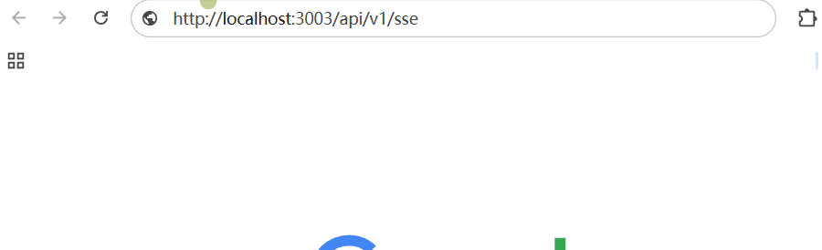
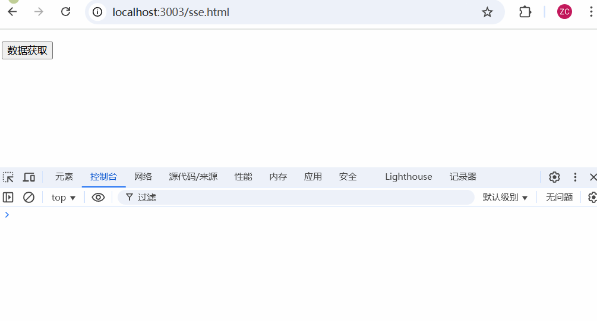
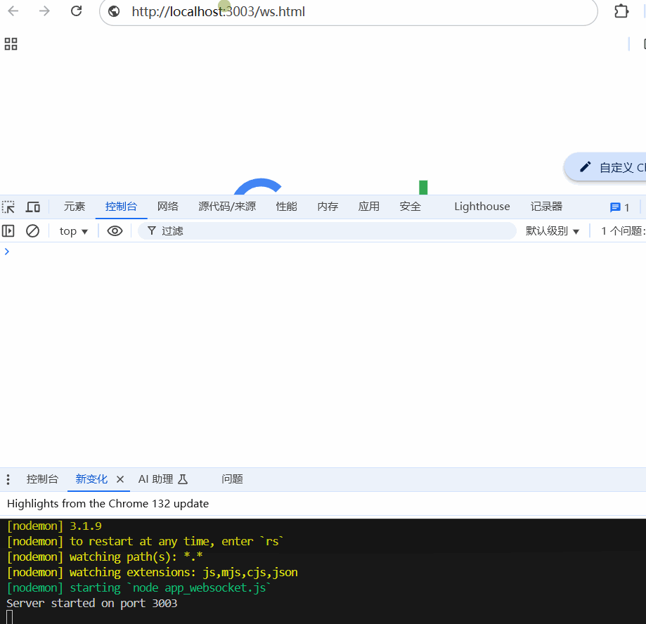

# SSE 与 WebSocket

## 基本知识

SSE(Server-Sent Events)和WebSocket是两种不同的技术，它们都可以用来实现服务器和客户端之间的实时通信，但它们的设计目标和使用场景有所不同。 

### SSE

SSE(Server-Sent Events):

- **单向通信**：SSE 只支持服务器向客户端发送消息，不支持客户端向服务器发送消息。 
- **基于HTTP**：SSE 使用标准的HTTP协议，客户端通过HTTP请求连接到服务器，服务器响应并保持连接打开，用于发送事件。 
- **简单实现**：对于只需要服务器向客户端单向推送数据的场景，SSE 的实现相对简单。 
- **浏览器原生支持**：大多数现代浏览器都支持SSE，无需额外的插件或库。 
- **自动重连**：如果连接被关闭，客户端浏览器会自动尝试重新连接。 
- **适用场景**：适合于服务器需要频繁更新数据到客户端的场景，如新闻订阅、股票价格更新、实时通知等。 

### WebSocket

WebSocket:

- **双向通信**：WebSocket 支持客户端和服务器之间的全双工通信，即双方可以随时向对方发送消息。 
- **独立的协议**：WebSocket 是一个独立的协议（基于TCP），与HTTP不同，它提供了一个持久的连接，用于实时双向通信。 更复杂的实现：相比于SSE，WebSocket的实现更为复杂，需要处理更多的状态和事件。 
- **广泛的应用**：适用于需要实时双向交互的场景，如在线聊天、实时游戏、协作工具等。 
- **手动管理连接**：需要手动管理连接的打开、关闭以及重连逻辑。 
- **适用场景**：适合于需要高度交互性的应用，如在线游戏、实时聊天应用、实时数据交换等。

### SSE与WebSocket的比较

- **性能**：对于大规模的实时数据推送，WebSocket可能更加高效，因为它允许数据在两个方向上流动，而SSE只支持单向。
- **资源消耗**：SSE可能在某些情况下更节省资源，因为它不需要维持一个全双工连接。
- **易用性**：SSE在客户端的实现更简单，因为它直接通过浏览器的`EventSource`接口支持，而WebSocket需要额外的库或APl来管理连接。
- **兼容性**：SSE在所有现代浏览器中都有较好的支持，但不支持旧版浏览器，而WebSocket有广泛的库支持，可以在不支持的浏览器中通过Fallback方案实现。
- **安全性**：WebSocket可以通过WSS(WebSocket Secure)提供加密连接，SSE也可以通过HTTPS提供加密。

总的来说，选择SSE还是WebSocket取决于具体的应用需求。如果只需要服务器向客户端推送数据，SSE可能是一个更简单、更轻量级的解决方案。如果需要客户端和服务器之间的实时双向通信，WebSocket则是更合适的选择。

## 演示

在调试里的网络中：

- sse: 请求可以在fetch中看到
- websocket: 请求可以在ws中看到

```shell
npm init -y # 初始化项目
npm i express # web框架模块
npm i nodemon -D # 保证修改后不用重启，自动更新
npm run devsse # 运行app.js 已提前修改配置文件     
                "devsse": "nodemon app_sse.js",
                "devws": "nodemon app_websocket.js",
```

### SSE单向通信

`app.js`

```js
const express = require('express'); // Node.js web框架模块 

const app = express(); // 创建express应用程序实例

// 设置静态资源目录
app.use('/', express.static('./public'));

let globalIndex = 0;

// 此处我使用的是nodejs实现服务器端功能
app.get('/api/v1/sse', (req, res) => {
    // 响应头部分一定要设置好，否则无法正常接收数据
    res.setHeader('Content-Type', 'text/event-stream') // 设置数据相应类型
    res.setHeader("catche-control", "no-cache") // 不需要缓存
    res.setHeader('Connection', 'keep-alive') // 保持长连接
    
    res.flushHeaders(); // 在服务器向客户端发送响应时，立即将响应头部写入到客户端。这意味着，如果在发送响应主体之前调用 res.flushHeaders()，浏览器将能更早地接收到响应头，而不必等待整个响应体发送完毕。这对于一些实时应用非常方便，例如流式传输或聊天应用。
    
    setInterval(() => {
        const data = `current time is ${new Date().toLocaleString()}, index is ${globalIndex++}`;
        res.write(
            `data: ${JSON.stringify({
                data,
                success: true,
            })}\n\n`)
    }, 2000);
});

app.listen(3003, ()=> {
    console.log('Server started on port 3003');
});
```

访问`http://localhost:3003/api/v1/sse`接口：


`sse.html`: 该文件在`public`目录下

```html
<p id="tagShow"></p>
<button onclick="getData()">数据获取</button>
<script>
    const tagShow = document.getElementById("tagShow");
    function getData() {
        // EventSource 是内部api
        const eventSource = new EventSource("http://localhost:3003/api/v1/sse");
        // 监听传递过来的数据
        eventSource.onmessage = (e) => {
            console.log(e); // 发现每两秒打印一次数据
            tagShow.innerHTML += e.data + '<br/>';
        };
    }
</script>
```

访问`http://localhost:3003/sse.html`ui页面：



### WebSocket双向通信

```shell
npm i ws # nodejs里提供了ws模块，可以使用WebSocket服务
npm run devws
```

`app_websocket.js`

```js
const express = require('express'); // Node.js web框架模块 
const WebSocket = require('ws');
const http = require('http');

const app = express(); // 创建express应用程序实例
const server = http.createServer(app); // 创建一个服务

// 设置静态资源目录
app.use('/', express.static('./public'));

let globalIndex = 0;


// 此处我使用的是nodejs实现服务器端功能
app.get('/api/v1/ws', (req, res) => {
    // 响应头部分一定要设置好，否则无法正常接收数据
    res.setHeader('Content-Type', 'text/event-stream') // 设置数据相应类型
    res.setHeader("catche-control", "no-cache") // 不需要缓存
    res.setHeader('Connection', 'keep-alive') // 保持长连接
    
    res.flushHeaders(); // 在服务器向客户端发送响应时，立即将响应头部写入到客户端。这意味着，如果在发送响应主体之前调用 res.flushHeaders()，浏览器将能更早地接收到响应头，而不必等待整个响应体发送完毕。这对于一些实时应用非常方便，例如流式传输或聊天应用。
    
    setInterval(() => {
        const data = `current time is ${new Date().toLocaleString()}, index is ${globalIndex++}`;
        res.write(
            `data: ${JSON.stringify({
                data,
                success: true,
            })}\n\n`)
    }, 2000);
});

const wss = new WebSocket.Server({ server });

// 监听连接事件
// 每一个客户端连接之后都会生成一个ws实例
wss.on('connection', (ws) => {
    console.log(`客户端连接上了`);

    // 监听客户端发送过来的消息
    // 你可以根据具体业务，对message数据进行组织
    ws.on('message', (message) => {
        console.log(`Received message: ${message}`);
        ws.send('收到客户端的消息：' + message);
        setInterval(() => {
            ws.send(`服务器发送的消息: ${new Date().toLocaleString()}`)
        }, 2000)
    })

    // 监听ws连接关闭 如页面关闭时
    ws.on('close', () => {
        ws.send('客户端关闭了连接');
    })
})

server.listen(3003, ()=> {
    console.log('Server started on port 3003');
});
```

`ws.html`

```html
<!DOCTYPE html>
<html lang="en">
<head>
  <meta charset="UTF-8">
  <meta name="viewport" content="width=device-width, initial-scale=1.0">
  <title>ws-demo</title>
</head>
<body>
  <p id="tagShow"></p>
  <button onclick="sendMsg()">客户端发送消息</button>
  <script>
    ;let index = 0;
    // const tagShow = document.getElementById("tagShow");
    const ws = new WebSocket('ws://localhost:3003')
    // 连接成功
    ws.onopen = () => {
      index++
      // 发送消息
      ws.send('这是客户端发送的消息');
    }
    // 收到的消息
    ws.onmessage = (e) => {
      console.group('接收到的消息: ')
      console.log(e);
      console.groupEnd();
    }

    // 发送消息
    function sendMsg() {
      index++;
      ws.send("消息： " + index)
    }
  </script>
</body>
</html>
```



---

参考资料：

- [SSE与WebSocket_哔哩哔哩_bilibili](https://www.bilibili.com/video/BV1agkSYBEdR/?spm_id_from=333.1391.0.0&vd_source=796ed40051b301bfa3a84ba357f4828c)