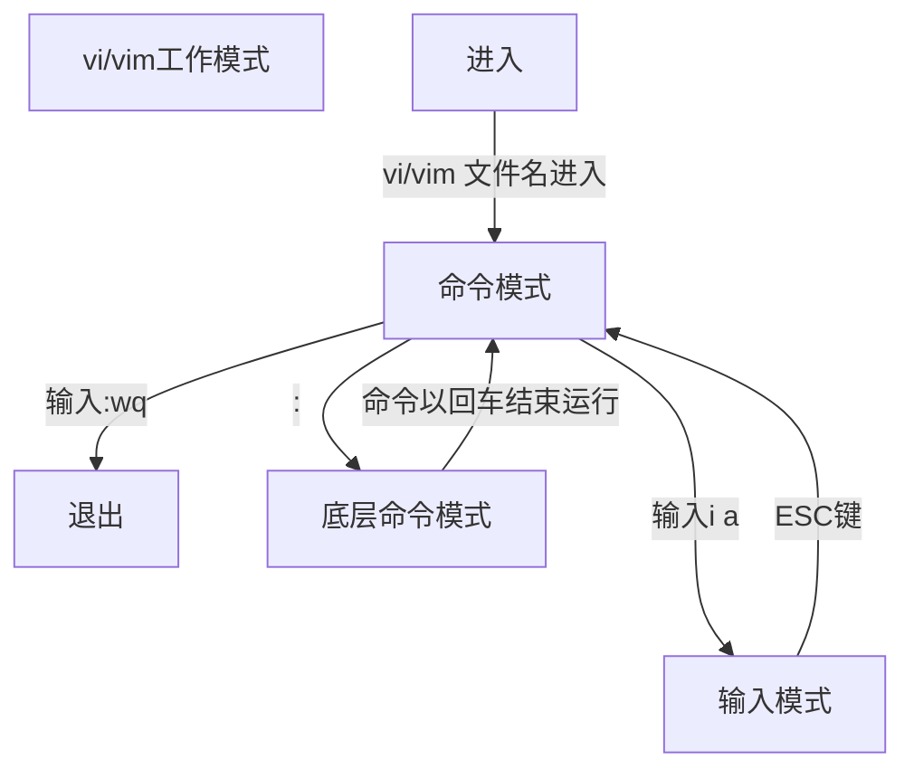

> [Linux命令](#Linux命令)
>
> 1. [vi||vim](##vi||vim)
>
> [Linux使用操作](#Linux使用操作)
>
> 1. [时间相关](##date)

# Linux命令

| 命令本身                   | 用途                                                         | 可选项                                               | 参数                                                         | 语法                                                         | 用户                             |
| -------------------------- | ------------------------------------------------------------ | ---------------------------------------------------- | ------------------------------------------------------------ | ------------------------------------------------------------ | -------------------------------- |
| [ls](##ls)                 | 列出文件夹信息                                               | [-l](##权限信息) -a -h                               | 被查看的文件夹，不提供参数，表示查看当前工作目录             | ls  [-l -a -h] 参数                                          | 任意                             |
| pwd                        | 展示当前工作目录                                             | 无                                                   | 无                                                           | pwd                                                          | 任意                             |
| cd                         | 切换工作目录                                                 | 无                                                   | 目标目录，要切换去的地方，不提供默认切换到`当前登录用户HOME目录`[^HOME目录] | cd 参数[^相对路径][^绝对路径][^特殊路径符]                   | 任意                             |
| [mkdir](##mkdir)           | 创建文件夹                                                   | -p                                                   | 被创建文件夹的路径                                           | mkdir 参数                                                   | 任意                             |
| touch                      | 创建文件                                                     | 无                                                   | 被创建的文件路径                                             | touch 参数                                                   | 任意                             |
| cat                        | 查看全部文件内容                                             | 无                                                   | 被查看的文件路径                                             | cat 参数                                                     | 任意                             |
| more                       | 查看文件，可以支持翻页查看                                   | 无                                                   | 被查看的文件路径                                             | more 文件路径  查看过程中`空格`键翻页 `q`退出查看            | 任意                             |
| [cp](##cp)                 | 复制文件、文件夹                                             | -r                                                   | 参数1，被复制的 参数2，要复制去的地方                        | cp [-r] 参数1 参数2  复制文件[夹]路径1到路径2                | 任意                             |
| mv                         | 移动文件、文件夹                                             |                                                      | 参数1：被移动的 参数2：要移动去的地方，参数2如果文件不存在，则会进行改名 | mv 参数1 参数2                                               | 任意                             |
| [rm](##rm)                 | 删除文件、文件夹                                             | -r -f                                                | 参数1 参数2... 支持多个，每一个表示被删除的，空格进行分隔 支持通配符[^通配符*] | rm [-r -f] 参数1...参数n[^通配符*]                           | 任意                             |
| which                      | 查看命令的程序本体文件路径                                   | 无                                                   | 被查看的命令                                                 | which 参数                                                   | 任意                             |
| [find](##find)             | 搜索文件                                                     | -name -size                                          | 搜索的关键字，支持通配符*   +\|-n[kMG]s                 | find 路径 -name\|-size  参数 按name\|size查找路径下符合参数的文件 | 任意                             |
| [grep](##grep)             | 过滤关键字                                                   | -n                                                   | 参数1："关键字"，必填，表示过滤的关键字，带有空格或其它特殊符号，建议使用""将关键字包围起来 参数2：文件路径，在此文件中搜索关键字 | grep [-n] 参数1关键字 参数2路径                              | 任意                             |
| [wc](##wc)                 | 统计文件相关信息                                             | -c -m -l -w                                          | 文件路径，被统计的文件，可作为管道符的输入[^管道符]          | wc [-c -m -l -w] 参数                                        | 任意                             |
| echo                       | 输出内容                                                     | 无                                                   | 被输出的内容 [^反引号][^重定向符]                            | echo 参数                                                    | 任意                             |
| [tail](##tail)             | 查看文件尾部内容(从后往前查看文件内容)                       | -f -num[num指一个数字]                               | 被查看的文件                                                 | tail [-f -num] 参数                                          | 任意                             |
| [vi\|\|vim](##vi\|\|vim)   | vi/vim编辑器                                                 | 无                                                   | 编辑(并创建)的文件                                           | vi 参数                                                      | 任意                             |
| [su](##su)                 | 切换用户                                                     | -                                                    | 用户名(可省略，默认root用户)                                 | su [-] 参数                                                  | 任意                             |
| exit \|\| ctrl+d           | 回退到上一用户                                               | 无                                                   | 无                                                           | exit \|\| ctrl+d                                             | 任意                             |
| [sudo](##sudo)             | 普通命令的授权(临时以root身份执行)                           | 无                                                   | 其他命令                                                     | sudo 参数                                                    | 获得root认证的用户               |
| groupadd                   | 创建用户组                                                   | 无                                                   | 用户组名                                                     | groupadd 参数                                                | root                             |
| groupdel                   | 删除用户组                                                   | 无                                                   | 用户组名                                                     | groupdel 参数                                                | root                             |
| [useradd](##useradd)       | 创建用户                                                     | -g -d                                                | 参数1：用户名  参数2：组名  参数3：用户home目录    | useradd  参数1 [-g 参数2 -d 参数3]                           | root                             |
| [userdel](##userdel)       | 删除用户                                                     | -r                                                   | 用户名                                                       | userdel 参数                                                 | root                             |
| id                         | 查看用户信息                                                 | 无                                                   | 用户名(查看其它用户仅限root用户使用)                         | id [参数]                                                    | 任意                             |
| usermod                    | 修改用户所属组                                               | -aG                                                  | 参数1：用户组 参数2： 用户名                            | usermod -aG 参数1 参数2                                      | root                             |
| [getent](##getent)         | 查看当前系统中有哪些用户\|\|用户组                           | 无                                                   | passwd:用户 group:用户组                                | getent 参数                                                  | 任意                             |
| [查看权限信息](##权限信息) |                                                              |                                                      |                                                              |                                                              |                                  |
| [chmod](##chmod)           | 修改文件、文件夹的权限信息                                   | -R                                                   | 参数1:权限 参数2:文件或文件夹                           | chmod [-R] 参数1 参数2                                       | 文件、文件夹的所属用户或root用户 |
| [chown](##chown)           | 修改所属用户、用户组                                         | -R \|\| 用户 \|\| 用户组 \|\| :用于分隔用户和用户组  | 文件或文件夹                                                 | chown [-R] [用户] [:] [用户组] 文件或文件夹                  | root                             |
| [yum](##yum)               | CentOS中联网管理软件安装；RPM包软件管理器，用于自动化安装配置Linux软件，并可以自动解决依赖问题。 | -y \|\| install \|\| remove \|\| search              | 软件名                                                       | yum [-y] install 软件名                                      | root                             |
| apt                        | Ubuntu中联网管理软件安装                                     | -y \|\| install \|\| remove \|\| search              |                                                              |                                                              |                                  |
| [systemctl](##systemctl)   | 控制软件[服务](###服务)的启动和关闭                          | start \|\| stop \|\| status \|\| enable \|\| disable | 服务名                                                       | systemctl 可选项 服务名                                      |                                  |
| ln                         | 创建软链接，可以将文件、文件夹链接到其它位置,类似快捷方式    | -s 软连接                                            | 参数1：被链接的文件或文件夹 参数2：要链接去的目的地     | ln -s 参数1 参数2                                            |                                  |
| [date](##date)             |                                                              | -d \|\| +格式换字符串                                |                                                              | date [-d] [+格式化字符串]                                    | 任意                             |
| [修改时区](##修改时区)     |                                                              |                                                      |                                                              |                                                              |                                  |

## 权限信息

> [修改文件权限](##chmod)

通过[ls -l](##ls) 可以以列表形式查看内容，并显示权限细节

| 序号               | 详情                           |
| ------------------ | ------------------------------ |
| [序号1](###序号一) | 表示文件、文件夹的权限控制信息 |
| 序号2              | 表示文件、文件夹所属用户       |
| 序号3              | 表示文件、文件夹所属用户组     |

### 序号一

> •r表示读权限
> •w表示写权限
> •x表示执行权限
>
> 针对文件、文件夹的不同，rwx的含义有细微差别:
> | 权限 | 文件                   | 文件夹                                     |
> | ---- | ---------------------- | ------------------------------------------ |
> | -    | 无此项对应的权限       | 无此项对应的权限                           |
> | r    | 可以查看文件内容       | 可以查看文件夹内容                         |
> | w    | 可以修改此文件         | 可以在文件夹内：创建、删除、改名等操作     |
> | x    | 可以将文件作为程序执行 | 表示可以更改工作目录到此文件夹，即`cd`进入 |

[序号权限r4w2x1](###[权限](##权限信息)的数字序号)

----

## ls

| 可选项 | 用途                                   |
| ------ | -------------------------------------- |
|        | 列出文件夹信息                         |
| -l     | 以列表形式查看[各项信息](##权限信息)   |
| -a     | 配合-l，以更加人性化的方式显示文件大小 |
| -h     | 显示隐藏文件文件夹[^隐藏文件]          |

## mkdir

| 可选项 | 用途                                  |
| ------ | ------------------------------------- |
|        | 创建文件夹,不可创建前置路径           |
| -p     | 表示创建前置路径,可以一次创建多级目录 |

## cp

| 可选项 | 用途       |
| ------ | ---------- |
|        | 复制文件   |
| -r     | 复制文件夹 |

## rm

| 可选项 | 用途                                                      |
| ------ | --------------------------------------------------------- |
|        | 删除文件                                                  |
| -r     | 删除文件夹                                                |
| -f     | 强制删除，不会给出确认提示，一般root用户会用到[^root用户] |

## find

| 可选项 | 用途               | 语法                          | eg                                                    |
| ------ | ------------------ | ----------------------------- | ----------------------------------------------------- |
| -name  | 按文件名搜索文件   | find 起始路径 -name "参数"    | find / -name "text*" 查找根目录下所有以test开头的文件 |
| -size  | 按文件大小搜索文件 | find 起始路径 -size +\|-[kMG] | find / -size +100M 查找根目录下大于100MB的文件        |

## grep

| 可选项 | 用途                                 | 语法                                                         |
| ------ | ------------------------------------ | ------------------------------------------------------------ |
|        | 过滤关键字                           | grep 关键字 文件路径 搜索关键字在文件路径文件中         |
| -n     | 可选，表示在结果中显示匹配的行的行号 | grep [-n] 关键字 文件路径 搜索关键字在文件路径文件中且显示行号 |

## wc

| 可选项 | 用途                                               | 语法           |
| ------ | -------------------------------------------------- | -------------- |
|        | 统计文件 显示文件内容行数 单词数 字节数 以及文件名 | wc 文件路径    |
| -c     | 统计bytes数量                                      | wc -c 文件路径 |
| -m     | 统计字符数量                                       | wc -m 文件路径 |
| -l     | 统计行数                                           | wc -l 文件路径 |
| -w     | 统计单词数量                                       | wc -w 文件路径 |

## tail

| 可选项 | 用途                                                         |
| ------ | ------------------------------------------------------------ |
|        | 查看文件尾部内容                                             |
| -f     | 持续跟踪文件修改 ctrl+c停止追踪                              |
| -num   | 查看尾部多少行，不填默认10行 num指一个数字 例如 tail -5 test.txt |

## vi||vim

| 模式                            | 介绍                                                         |
| ------------------------------- | ------------------------------------------------------------ |
| [命令模式](###命令模式)         | 命令模式下，所敲的按键编辑器都理解为命令，以命令驱动执行不同的功能。 此模型下，不能自由进行文本编辑。 |
| [输入模式](###输入模式)         | 也就是所谓的编辑模式、插入模式。 此模式下，可以对文件内容进行自由编辑。 |
| [底线命令模式](###底线命令模式) | 以：开始，通常用于文件的保存、退出。                         |

### 命令模式

| 命令           | 描述                              |
| -------------- | --------------------------------- |
| i              | 在当前光标位置，进入输入模式      |
| a              | 在当前光标位置之后，进入输入模式  |
| I              | 在当前行开头，进入输入模式        |
| A              | 在当前行结尾，进入输入模式        |
| o              | 在当前光标下一行，进入输入模式    |
| O              | 在当前光标上一行，进入输入模式    |
| esc            | 任何情况下输入esc都能回到命令模式 |
| ↑ \|\| k       | 向上移动光标                      |
| ↓ \|\| j       | 向下移动光标                      |
| ← \|\| h       | 向左移动光标                      |
| → \|\| l       | 向右移动光标                      |
| 0              | 移动光标到当前行的开头            |
| $              | 移动光标到当前行的结尾            |
| pageup(PgUp)   | 向上翻页                          |
| pagedown(PgDn) | 向下翻页                          |
| /              | 进入搜索模式                      |
| n              | 向下继续搜索                      |
| N              | 向上继续搜索                      |
| dd             | 删除光标所在行的内容              |
| ndd            | n是数字，表示删除当前光标向下n行  |
| yy             | 复制当前行                        |
| nyy            | n是数字，复制当前行和下面的n行    |
| p              | 粘贴复制的内容                    |
| u              | 撤销修改                          |
| ctrl+r         | 反向撤销修改                      |
| gg             | 跳到首行                          |
| G              | 跳到行尾                          |
| dG             | 从当前行开始，向下全部删除        |
| dgg            | 从当前行开始，向上全部删除        |
| d$             | 从当前光标开始，删除到本行的结尾  |
| d0             | 从当前光标开始，删除到本行开头    |

### 输入模式

输入模式也就是编辑模式，没有什么特殊的，进入编辑模式后，任何快捷键都没有作用，就是正常输入文本而已。

唯一大家需要记住的，就是：*通过esc，可以退回到命令模式中*即可。

| 命令 | 描述                              |
| ---- | --------------------------------- |
| esc  | 任何情况下输入esc都能回到命令模式 |

### 底线命令模式

| 命令       | 描述         |
| ---------- | ------------ |
| :wq        | 保存并退出   |
| :q         | 仅退出       |
| :q!        | 强制退出     |
| :w         | 仅保存       |
| :set nu    | 显示行号     |
| :set paste | 设置粘贴模式 |

## su

| 可选项 | 用途                   | 语法        |
| ------ | ---------------------- | ----------- |
|        | 切换用户               | su 用户名   |
| -      | 切换用户后加载环境变量 | su - 用户名 |

## sudo

| 命令 | 用途                               | 适用范围               |
| ---- | ---------------------------------- | ---------------------- |
| sudo | 普通命令的授权(临时以root身份执行) | 获得root用户认可的用户 |

### 为普通用户配置`sudo`认证

1. `su - root`切换到root用户，执行`visudo`命令，会自动通过vi编辑器打开：/etc/sudoers
2. 在文件的最后添加：`用户名 ALL=(ALL)     NOPASSWD: ALL`
3. 最后通过`:wq`保存
4. 切换回普通用户
5. 执行的命令均可以root运行`sudo ls /root ...`

## useradd

| 可选项 | 用途                               | 语法                                            |
| ------ | ---------------------------------- | ----------------------------------------------- |
|        | 创建用户并加入到与用户名同名的组中 | useradd itheima                                 |
| -g     | 指定用户的组                       | useradd itheima -g itcast                       |
| -d     | 指定用户的HOME路径                 | useradd itheima2 -g itcast -d  /home/itheima222 |

## userdel

| 可选项 | 用途                            |
| ------ | ------------------------------- |
|        | 删除用户 不删除用户home目录文件 |
| -r     | 删除用户 且删除用户home目录文件 |

## getent

| 参数   | 用途                                                         |
| ------ | ------------------------------------------------------------ |
| passwd | 查看当前系统中有哪些用户 共有7份信息，分别是：用户名:密码(x):用户ID:组ID:描述信息(无用):HOME目录:执行终端(默认bash) |
| group  | 可以查看当前系统中有哪些用户组 包含3份信息，组名称:组认证(显示为x):组ID |

## chmod

| 参数 | 用途                               | 示例                                                         | 含义                                                         |
| ---- | ---------------------------------- | ------------------------------------------------------------ | ------------------------------------------------------------ |
|      | 修改文件、文件夹的权限信息         | chmod u=rwx,g=rx,o=x hello.txt                               | 将文件权限修改为：rwxr-x--x 其中：u表示user所属用户权限，g表示group组权限，o表示other其它用户权限 |
| -R   | 对文件夹内的全部内容应用同样的操作 | chmod -R u=rwx,g=rx,o=x test 除此之外，还有[快捷写法](###权限的数字序号)：chmod 751 hello.txt 注： 751表示： rwx(7) r-x(5) --x(1) | 将文件夹test以及文件夹内全部内容权限设置为：rwxr-x--x        |

### [权限](##权限信息)的数字序号

权限可以用3位数字来代表，第一位数字表示用户权限，第二位表示用户组权限，第三位表示其它用户权限。

数字的细节如下：r记为4，w记为2，x记为1，可以有：
>•0：无任何权限， 即 ---
>•1：仅有x权限， 即 --x
>•2：仅有w权限 即 -w-
>•3：有w和x权限 即 -wx
>•4：仅有r权限 即 r--
>•5：有r和x权限 即 r-x
>•6：有r和w权限 即 rw-
>•7：有全部权限 即 rwx

## chown

| 选项         | 用途                               | 示例                         | 含义                                                         |
| ------------ | ---------------------------------- | ---------------------------- | ------------------------------------------------------------ |
|              | 修改文件、文件夹的所属用户和用户组 | chown  root test             | 将hello.txt所属用户修改为root                                |
| -R           | 对文件夹内全部内容应用相同规则     | chown -R root test           | 将文件夹test的所属用户修改为root并对文件夹内全部内容应用同样规则 |
| 用户         |                                    | chown root hello.txt         | 将hello.txt所属用户修改为root                                |
| 用户组       |                                    | chown :root hello.txt        | 将hello.txt所属用户组修改为root                              |
| 用户及用户组 |                                    | chown root:itheima hello.txt | 将hello.txt所属用户修改为root，用户组修改为itheima           |

# Linux使用操作

## 各类快捷键

| 快捷键          | 用途                                  | 注释                                                         | 分类         |
| --------------- | ------------------------------------- | ------------------------------------------------------------ | ------------ |
| ctrl + c        | 强制停止正在运行的某些程序            |                                                              | 终止         |
|                 | 命令输入错误时,退出当前输入，重新输入 |                                                              | 重新输入     |
| exit            | 退出账户的登录                        |                                                              | 退出账号     |
| ctrl + d        | 退出账户的登录                        |                                                              | 退出账号     |
|                 | 退出某些特定程序的专属页面            | 不能用于退出vi/vim                                           | 退出某些程序 |
| history命令     | 查看历史输入过的命令                  | 可以通过 `| grep 参数`过滤命令                               | 历史命令     |
| !命令前缀       | 自动执行上一次匹配前缀的命令          | 从历史命令中由近及远搜索匹配命令 eg:`!p`                     | 历史命令匹配 |
| ctrl + r        | 输入内容去匹配历史命令                | 如果搜索到的内容是你需要的，那么： •回车键可以直接执行 •键盘左右键，可以得到此命令（不执行） | 历史命令搜索 |
| ctrl + a        | 跳到命令开头                          |                                                              | 光标移动     |
| ctrl + e        | 跳到命令结尾                          |                                                              | 光标移动     |
| ctrl + 键盘左键 | 向左跳一个单词                        |                                                              | 光标移动     |
| ctrl + 键盘右键 | 向右跳一个单词                        |                                                              | 光标移动     |
| ctrl + l        | 清空终端内容                          |                                                              | 清屏         |
| clear           | 清空终端内容                          |                                                              | 清屏         |

## 软件安装

## yum

> CentOS系统中用yum
> yum命令需要联网和root权限

| 选项    | 用途                                                         | 语法                    |
| ------- | ------------------------------------------------------------ | ----------------------- |
|         | RPM包软件管理器，用于自动化安装配置Linux软件，并可以自动解决依赖问题。 | yum [-y] install 软件名 |
| -y      | 自动确认，无需手动确认安装或卸载过程                         | yum [-y] install 软件名 |
| install | 安装                                                         | yum [-y] install 软件名 |
| remove  | 卸载                                                         | yum [-y] remove 软件名  |
| search  | 搜索                                                         | yum [-y] search 软件名  |

## apt

>Ubuntu系统中用apt
>apt命令需要联网和root权限

语法同[yum](##yum)

## systemctl

可以控制软件（服务）的启动、关闭、开机自启动

| 可选项  | 用途               | 语法                     |
| ------- | ------------------ | ------------------------ |
| start   | 开启服务           | systemctl start 服务名   |
| stop    | 停止服务           | systemctl stop 服务名    |
| status  | 查看服务状态       | systemctl status 服务名  |
| enable  | 开机自启动服务     | systemctl enable 服务名  |
| disable | 关闭开机自启动服务 | systemctl disable 服务名 |

> 系统内置服务均可被systemctl控制
> 第三方软件，如果自动注册了可以被systemctl控制
> 第三方软件，如果没有自动注册，可以手动注册

### 服务

Linux系统很多软件（内置或第三方）均支持使用systemctl命令控制：启动、停止、开机自启
能够被systemctl管理的软件，一般也称之为：服务

**系统内置服务**

| 服务名         | 中文释义                                             |
| -------------- | ---------------------------------------------------- |
| NetworkManager | 主网络服务                                           |
| network        | 副网络服务                                           |
| firewalld      | 防火墙服务                                           |
| sshd           | ssh服务（FinalShell远程登录Linux使用的就是这个服务） |

除了内置的服务以外，**部分第三方软件**安装后也可以以systemctl进行控制。
eg:
•yum install -y ntp，安装ntp软件
可以通过ntpd服务名，配合systemctl进行控制
•yum install -y httpd，安装apache服务器软件
可以通过httpd服务名，配合systemctl进行控制
部分软件安装后没有自动集成到systemctl中，我们可以手动添加。

## date

| 可选项                           | 用途                                       |
| -------------------------------- | ------------------------------------------ |
|                                  | 直接查看系统时间                           |
| [-d](###-d)                      | 按照给定的字符串显示日期，一般用于日期计算 |
| [+格式化字符串](###格式化字符串) | 通过特定的字符串标记，来控制显示的日期格式 |

### -d

> 可以按照给定的字符串显示日期，一般用于日期计算
> -d选项可以和 格式化字符串配合一起使用

| 支持的时间标记 | 含义 |
| -------------- | ---- |
| year           | 年   |
| month          | 月   |
| day            | 日   |
| hour           | 时   |
| minute         | 分   |
| second         | 秒   |

可以进行时间的+-

eg:`date -d "-3 month" "+%Y-%m-%d %H:%M:%S"`

### 格式化字符串

| 字符串 | 含义                                    |
| ------ | --------------------------------------- |
| %Y     | 年                                      |
| %y     | 年份后两位数字 (00..99)                 |
| %m     | 月份                                    |
| %d     | 日                                      |
| %H     | 小时                                    |
| %M     | 分钟                                    |
| %S     | 秒                                      |
| %s     | 自 1970-01-01 00:00:00 UTC 到现在的秒数 |

eg:`date "+%Y-%m-%d %H:%M:%S"`

## 修改时区

使用root权限，执行如下命令，修改时区为东八区时区

1. 将系统自带的localtime文件删除
   `rm -f /etc/loacltime`
2. 将/usr/share/zoneinfo/Asia/Shanghai文件链接为localtime文件即可
   `sudo ln -s /usr/share/zoneinfo/Asia/Shanghai /etc/localtime`

## ntp程序 自动校准

1. 安装ntp
   `yum -y install ntp`
2. 启动并设置开机自启：
   `systemctl start ntpd`
   `systemctl enable ntpd`
3. 当ntpd启动后会定期的帮助我们联网校准系统的时间
4. 也可以手动校准(需root权限)
   `ntpdate -u ntp.aliyun.com`
   通过阿里云提供的服务网址配合ntpdate（安装ntp后会附带这个命令）命令自动校准

---

[^隐藏文件]:在Linux中以`.`开头的，均是隐藏的。默认不显示出来，需要`-a`选项才可查看到。
[^HOME目录]:每一个用户在Linux系统中都有自己的专属工作目录，称之为HOME目录。普通用户的HOME目录，默认在：`/home/用户名` root用户的HOME目录，在：`/root`
[^相对路径]:相对路径，`非/`开头的称之为相对路径,相对路径表示以`当前目录`作为起点，去描述路径，如`test/a.txt`，表示当前工作目录内的test文件夹内的a.txt文件
[^绝对路径]: 绝对路径，以`/`开头的称之为绝对路经，绝对路径从`根`开始描述路径
[^特殊路径符]:`.`	表示当前，比如./a.txt，表示当前文件夹内的`a.txt`文件
`..`    表示上级目录，比如`../`表示上级目录，`../../`表示上级的上级目录
`~`    表示用户的HOME目录，比如`cd ~`，即可切回用户HOME目录

[^通配符*]:`test*`表示匹配任何以test开头的内容`*test`表示匹配任何以test结尾的内容`*test*`表示匹配任何包含test的内容
[^root用户]:•可以通过` su - root`，并输入密码123456（和普通用户默认一样）临时切换到root用户体验•通过输入`exit`命令，退回普通用户。（临时用root，用完记得退出，不要一直用，关于root我们后面会讲解）
[^管道符]:写法：`|`功能：将符号左边的结果，作为符号右边的输入- 示例：`cat a.txt | grep itheima`，将cat a.txt的结果，作为grep命令的输入，用来过滤`itheima`关键字 - 可以支持嵌套：`cat a.txt | grep itheima | grep itcast` `ls -l /usr/bin | grep gtf(只查看gtf的详细信息)`
[^反引号]: 被两个反引号包围的内容，会作为命令执行,实例`echo` \`pwd\`  ，会输出当前工作目录

[^重定向符]:功能：将符号左边的结果，输出到右边指定的文件中去`>`，表示覆盖输出`>>`，表示追加输出`echo "hello limux" > test.txt` `echo "im linux" >> test.txt` `ls > test.txt`
