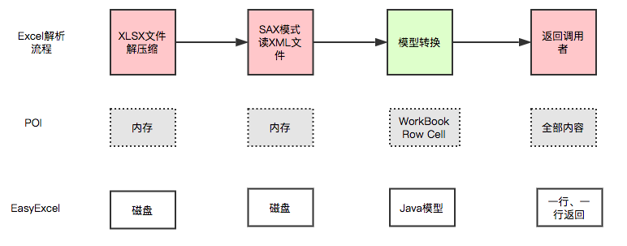
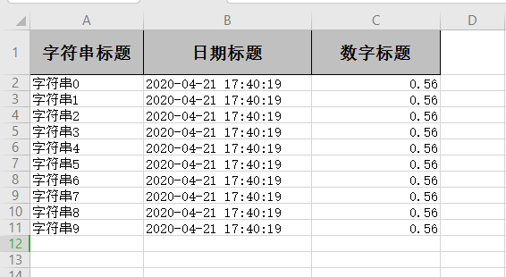

# POI和easyExcel概述

## 常用进程 

1. 将用户信息导出为excel表格（导出数据....） 
2. 将Excel表中的信息录入到网站数据库（习题上传....）

开发中经常会设计到excel的处理，如导出Excel，导入Excel到数据库中！ 

操作Excel目前比较流行的就是 **Apache POI** 和 阿里巴巴的 **easyExcel** ！ 

## Apache POI

Apache POI 官网： https://poi.apache.org/

<iframe 
    src="https://poi.apache.org/" 
    width="100%" 
    height="300px"
    frameborder="0"
    allowfullscreen>
</iframe>

## easyExcel

easyExcel 官网地址：https://github.com/alibaba/easyexcel

<iframe 
    src="https://github.com/alibaba/easyexcel" 
    width="100%" 
    height="300px"
    frameborder="0"
    allowfullscreen>
</iframe>

EasyExcel 是阿里巴巴开源的一个excel处理框架，**以使用简单、节省内存著称。**

EasyExcel 能大大减少占用内存的主要原因是在解析 Excel 时没有将文件数据一次性全部加载到内存中，而是从磁盘上一行行读取数据，逐个解析。

下图是 EasyExcel 和 POI 在解析Excel时的对比图。



官方文档：https://www.yuque.com/easyexcel/doc/easyexcel  

<iframe 
    src="https://www.yuque.com/easyexcel/doc/easyexcel" 
    width="100%" 
    height="300px"
    frameborder="0"
    allowfullscreen>
</iframe>

# POI-Excel写  

## 创建项目

1. 建立一个空项目，创建普通Maven的Moudle

2. 引入pom依赖
   ```xml
   <dependencies>
       <!--xls(03)-->
       <dependency>
           <groupId>org.apache.poi</groupId>
           <artifactId>poi</artifactId>
           <version>3.9</version>
       </dependency>
       <!--xlsx(07)-->
       <dependency>
           <groupId>org.apache.poi</groupId>
           <artifactId>poi-ooxml</artifactId>
           <version>3.9</version>
       </dependency>
       <!--日期格式化工具-->
       <dependency>
           <groupId>joda-time</groupId>
           <artifactId>joda-time</artifactId>
           <version>2.10.1</version>
       </dependency>
       <!--test-->
       <dependency>
           <groupId>junit</groupId>
           <artifactId>junit</artifactId>
           <version>4.12</version>
       </dependency>
   </dependencies>
   ```

   > 07 和 03 版本的写，就是对象不同，方法一样的！
   >
   > 需要注意：2003 版本和 2007 版本存在兼容性的问题！03最多只有 65535 行！    

## 小文件写

### 03版本写HSSF

```java
import org.apache.poi.hssf.usermodel.HSSFWorkbook;
import org.apache.poi.ss.usermodel.Cell;
import org.apache.poi.ss.usermodel.Row;
import org.apache.poi.ss.usermodel.Sheet;
import org.apache.poi.ss.usermodel.Workbook;
import org.joda.time.DateTime;
import org.junit.Test;
import java.io.FileOutputStream;
import java.io.IOException;
public class ExcelWriteTest {
    String path = "D:\\狂神说Java\\【狂神】小专题\\POI-EasyExcel\\Bilibili-狂神说java\\kuang-poi\\";
    @Test
    public void testWrite03() throws IOException {
        // 创建新的Excel 工作簿
        Workbook workbook = new HSSFWorkbook();
        // 在Excel工作簿中建一工作表，其名为缺省值 Sheet0
        //Sheet sheet = workbook.createSheet();
        // 如要新建一名为"会员登录统计"的工作表，其语句为：
        Sheet sheet = workbook.createSheet("狂神观众统计表");
        // 创建行（row 1）
        Row row1 = sheet.createRow(0);
        // 创建单元格（col 1-1）
        Cell cell11 = row1.createCell(0);
        cell11.setCellValue("今日新增关注");
        // 创建单元格（col 1-2）
        Cell cell12 = row1.createCell(1);
        cell12.setCellValue(999);
        // 创建行（row 2）
        Row row2 = sheet.createRow(1);
        // 创建单元格（col 2-1）
        Cell cell21 = row2.createCell(0);
        cell21.setCellValue("统计时间");
        //创建单元格（第三列）
        Cell cell22 = row2.createCell(1);
        String dateTime = new DateTime().toString("yyyy-MM-dd HH:mm:ss");
        cell22.setCellValue(dateTime);
        // 新建一输出文件流（注意：要先创建文件夹）
        FileOutputStream out = new FileOutputStream(path+"狂神观众统计表03.xls");
        // 把相应的Excel 工作簿存盘
        workbook.write(out);
        // 操作结束，关闭文件
        out.close();
        System.out.println("文件生成成功");
    }
}
```

### 07版本写XSSF

```java
@Test
public void testWrite07() throws IOException {
    // 创建新的Excel 工作簿, 只有对象变了
    Workbook workbook = new XSSFWorkbook();
    // 如要新建一名为"会员登录统计"的工作表，其语句为：
    Sheet sheet = workbook.createSheet("狂神观众统计表");
    // 创建行（row 1）
    Row row1 = sheet.createRow(0);
    // 创建单元格（col 1-1）
    Cell cell11 = row1.createCell(0);
    cell11.setCellValue("今日新增关注");
    // 创建单元格（col 1-2）
    Cell cell12 = row1.createCell(1);
    cell12.setCellValue(666);
    // 创建行（row 2）
    Row row2 = sheet.createRow(1);
    // 创建单元格（col 2-1）
    Cell cell21 = row2.createCell(0);
    cell21.setCellValue("统计时间");
    //创建单元格（第三列）
    Cell cell22 = row2.createCell(1);
    String dateTime = new DateTime().toString("yyyy-MM-dd HH:mm:ss");
    cell22.setCellValue(dateTime);
    // 新建一输出文件流（注意：要先创建文件夹）
    FileOutputStream out = new FileOutputStream(path+"狂神观众统计表07.xlsx");
    // 把相应的Excel 工作簿存盘
    workbook.write(out);
    // 操作结束，关闭文件
    out.close();
    System.out.println("文件生成成功");
}
```

## 大文件写

### 大文件写HSSF

- **缺点：**最多只能处理65536行，否则会抛出异常  

  ```java
  java.lang.IllegalArgumentException: Invalid row number (65536) outside
  allowable range (0..65535)
  ```

- **优点：**过程中写入缓存，不操作磁盘，最后一次性写入磁盘，速度快  

```java
@Test
public void testWrite03BigData() throws IOException {
    //记录开始时间
    long begin = System.currentTimeMillis();
    //创建一个SXSSFWorkbook
    Workbook workbook = new HSSFWorkbook();
    //创建一个sheet
    Sheet sheet = workbook.createSheet();
    //xls文件最大支持65536行
    for (int rowNum = 0; rowNum < 65536; rowNum++) {
        //创建一个行
        Row row = sheet.createRow(rowNum);
        for (int cellNum = 0; cellNum < 10; cellNum++) {//创建单元格
            Cell cell = row.createCell(cellNum);
            cell.setCellValue(cellNum);
        }
    }

    System.out.println("done");
    FileOutputStream out = new FileOutputStream(path+"bigdata03.xls");
    workbook.write(out);
    // 操作结束，关闭文件
    out.close();
    //记录结束时间
    long end = System.currentTimeMillis();
    System.out.println((double)(end - begin)/1000);
}
```

### 大文件写XSSF

- **缺点：**写数据时速度非常慢，非常耗内存，也会发生内存溢出，如100万条
- **优点：**可以写较大的数据量，如20万条  

```java
@Test
public void testWrite07BigData() throws IOException {
    //记录开始时间
    long begin = System.currentTimeMillis();
    //创建一个XSSFWorkbook
    Workbook workbook = new XSSFWorkbook();
    //创建一个sheet
    Sheet sheet = workbook.createSheet();
    //xls文件最大支持65536行
    for (int rowNum = 0; rowNum < 100000; rowNum++) {
        //创建一个行
        Row row = sheet.createRow(rowNum);
        for (int cellNum = 0; cellNum < 10; cellNum++) {//创建单元格
            Cell cell = row.createCell(cellNum);
            cell.setCellValue(cellNum);
        }
    } S
        ystem.out.println("done");
    FileOutputStream out = new FileOutputStream(path+"bigdata07.xlsx");
    workbook.write(out);
    // 操作结束，关闭文件
    out.close();
    //记录结束时间
    long end = System.currentTimeMillis();
    System.out.println((double)(end - begin)/1000);
}
```

### 大文件写SXSSF

- **优点：**可以写非常大的数据量，如100万条甚至更多条，写数据速度快，占用更少的内存  

- **注意：**
  - 过程中会产生临时文件，需要清理临时文件
  - 默认由100条记录被保存在内存中，如果超过这数量，则最前面的数据被写入临时文件
  - 如果想自定义内存中数据的数量，可以使用`new SXSSFWorkbook ( 数量 )`

```java
@Test
public void testWrite07BigDataFast() throws IOException {
    //记录开始时间
    long begin = System.currentTimeMillis();
    //创建一个SXSSFWorkbook
    Workbook workbook = new SXSSFWorkbook();
    //创建一个sheet
    Sheet sheet = workbook.createSheet();
    //xls文件最大支持65536行
    for (int rowNum = 0; rowNum < 100000; rowNum++) {
        //创建一个行
        Row row = sheet.createRow(rowNum);
        for (int cellNum = 0; cellNum < 10; cellNum++) {//创建单元格
            Cell cell = row.createCell(cellNum);
            cell.setCellValue(cellNum);
        }
    } 
    System.out.println("done");
    FileOutputStream out = new FileOutputStream(path+"bigdata07-fast.xlsx");
    workbook.write(out);
    // 操作结束，关闭文件
    out.close();
    //清除临时文件
    ((SXSSFWorkbook)workbook).dispose();
    //记录结束时间
    long end = System.currentTimeMillis();
    System.out.println((double)(end - begin)/1000);
}
```

SXSSFWorkbook-来至官方的解释：实现“BigGridDemo”策略的流式XSSFWorkbook版本。这允许写入非常大的文件而不会耗尽内存，因为任何时候只有可配置的行部分被保存在内存中。请注意，仍然可能会消耗大量内存，这些内存基于您正在使用的功能，例如合并区域，注释......仍然只存储在内存中，因此如果广泛使用，可能需要大量内存。

# POI-Excel读

## 03 版本读

```java
@Test
public void testRead03() throws Exception{
    InputStream is = new FileInputStream(path+"狂神观众统计表03.xls");
    Workbook workbook = new HSSFWorkbook(is);
    Sheet sheet = workbook.getSheetAt(0);
    // 读取第一行第一列
    Row row = sheet.getRow(0);
    Cell cell = row.getCell(0);
    // 输出单元内容
    System.out.println(cell.getStringCellValue());
    // 操作结束，关闭文件
    is.close();
}
```

## 07 版本读

```java
@Test
public void testRead07() throws Exception{
    InputStream is = new FileInputStream(path+"/狂神观众统计表07.xlsx");
    Workbook workbook = new XSSFWorkbook(is);
    Sheet sheet = workbook.getSheetAt(0);
    // 读取第一行第一列
    Row row = sheet.getRow(0);
    Cell cell = row.getCell(0);
    // 输出单元内容
    System.out.println(cell.getStringCellValue());
    // 操作结束，关闭文件
    is.close();
}
```

## 读取不同的数据类型

```java
@Test
public void testCellType() throws Exception {
    InputStream is = new FileInputStream(path+"/会员消费商品明细表.xls");
    Workbook workbook = new HSSFWorkbook(is);
    Sheet sheet = workbook.getSheetAt(0);
    // 读取标题所有内容
    Row rowTitle = sheet.getRow(0);
    if (rowTitle != null) {// 行不为空
        // 读取cell
        int cellCount = rowTitle.getPhysicalNumberOfCells();
        for (int cellNum = 0; cellNum < cellCount; cellNum++) {
            Cell cell = rowTitle.getCell(cellNum);
            if (cell != null) {
                int cellType = cell.getCellType();
                String cellValue = cell.getStringCellValue();
                System.out.print(cellValue + "|");
            }
        } 
        System.out.println();
    } 

    // 读取商品列表数据
    int rowCount = sheet.getPhysicalNumberOfRows();
    for (int rowNum = 1; rowNum < rowCount; rowNum++) {
        Row rowData = sheet.getRow(rowNum);
        if (rowData != null) { // 行不为空
            // 读取cell
            int cellCount = rowTitle.getPhysicalNumberOfCells();
            for (int cellNum = 0; cellNum < cellCount; cellNum++) {
                System.out.print("【" + (rowNum + 1) + "-" + (cellNum + 1) +  "】");
                Cell cell = rowData.getCell(cellNum);
                if (cell != null) {
                    int cellType = cell.getCellType();
                    // 判断单元格数据类型
                    String cellValue = "";
                    switch (cellType) {
                        case HSSFCell.CELL_TYPE_STRING:// 字符串
                            System.out.print("【STRING】");
                            cellValue = cell.getStringCellValue();
                            break;
                        case HSSFCell.CELL_TYPE_BOOLEAN://布尔
                            System.out.print("【BOOLEAN】");
                            cellValue = String.valueOf(cell.getBooleanCellValue());
                            break;
                        case HSSFCell.CELL_TYPE_BLANK://空
                            System.out.print("【BLANK】");
                            break;
                        case HSSFCell.CELL_TYPE_NUMERIC:
                            System.out.print("【NUMERIC】");
                            //cellValue =
                            String.valueOf(cell.getNumericCellValue());
                            if (HSSFDateUtil.isCellDateFormatted(cell)) {// 日期
                                System.out.print("【日期】");
                                Date date = cell.getDateCellValue();
                                cellValue = new DateTime(date).toString("yyyy-MM-dd");
                            } else {
                                // 不是日期格式，则防止当数字过长时以科学计数法显示
                                System.out.print("【转换成字符串】");
                                cell.setCellType(HSSFCell.CELL_TYPE_STRING);
                                cellValue = cell.toString();
                            } 
                            break;
                        case Cell.CELL_TYPE_ERROR:
                            System.out.print("【数据类型错误】");
                            break;
                    } 
                    System.out.println(cellValue);
                }
            }
        }
    } 
    is.close();
}
```

## 计算公式  

```java
@Test
public void testFormula() throws Exception{
    InputStream is = new FileInputStream(path + "计算公式.xls");
    Workbook workbook = new HSSFWorkbook(is);
    Sheet sheet = workbook.getSheetAt(0);
    // 读取第五行第一列
    Row row = sheet.getRow(4);
    Cell cell = row.getCell(0);
    //公式计算器
    FormulaEvaluator formulaEvaluator = new
        HSSFFormulaEvaluator((HSSFWorkbook) workbook);
    // 输出单元内容
    int cellType = cell.getCellType();
    switch (cellType) {
        case Cell.CELL_TYPE_FORMULA://2
            //得到公式
            String formula = cell.getCellFormula();
            System.out.println(formula);
            CellValue evaluate = formulaEvaluator.evaluate(cell);
            // String cellValue = String.valueOf(evaluate.getNumberValue());
            String cellValue = evaluate.formatAsString();
            System.out.println(cellValue);
            break;
    }
}
```

# EasyExcel操作

[关于Easyexcel | Easy Excel 官网](https://easyexcel.opensource.alibaba.com/docs/current/)

## 导入依赖

```xml
<dependency>
    <groupId>com.alibaba</groupId>
    <artifactId>easyexcel</artifactId>
    <version>2.1.7</version>
</dependency>
```

## 写入测试

`DemoData.java `：模板实体，定义excel列名及类型

```java
@Data
public class DemoData {
    @ExcelProperty("字符串标题")
    private String string;
    @ExcelProperty("日期标题")
    private Date date;
    @ExcelProperty("数字标题")
    private Double doubleData;
    /**
* 忽略这个字段
*/
    @ExcelIgnore
    private String ignore;
}
```

`  EasyExcelTest`：测试写入数据

```java
import com.alibaba.excel.EasyExcel;
import org.junit.Test;
import java.util.ArrayList;
import java.util.Date;
import java.util.List;
public class EasyExcelTest {
    String path = "D:\\狂神说Java\\【狂神】小专题\\POI-EasyExcel\\Bilibili-狂神说java\\kuang-poi\\";
    private List<DemoData> data() {
        List<DemoData> list = new ArrayList<DemoData>();
        for (int i = 0; i < 10; i++) {
            DemoData data = new DemoData();
            data.setString("字符串" + i);
            data.setDate(new Date());
            data.setDoubleData(0.56);
            list.add(data);
        } 
        return list;
    } 
    // 最简单的写
    @Test
    public void simpleWrite() {
        // 写法1
        String fileName = path+"EasyExcel.xlsx";
        // 这里 需要指定写用哪个class去写，然后写到第一个sheet，名字为模板 然后文件流会自动关闭
        // 如果这里想使用03 则 传入excelType参数即可
        EasyExcel.write(fileName, DemoData.class).sheet("模板").doWrite(data());
    }
}
```

最终的结果：  



## 读取测试

[easyExcel读Excel官方文档](https://easyexcel.opensource.alibaba.com/docs/current/quickstart/read)

<iframe  src="https://easyexcel.opensource.alibaba.com/docs/current/quickstart/read" 
    width="100%" 
    height="600px"
    frameborder="0"
    allowfullscreen>
</iframe>
