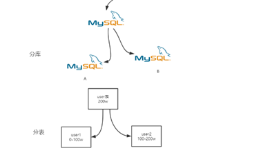
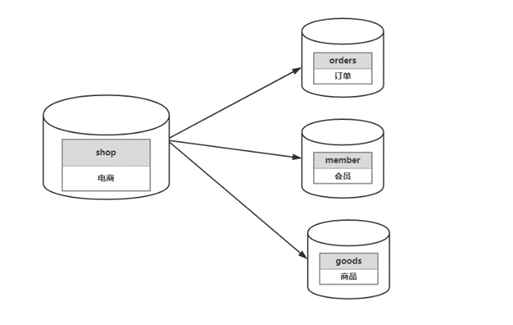

# 为什么需要分库分表

如果一个网站业务快速发展，那这个网站的流量也会增加。数据的压力也会随着而来。

比如电商系统来说双十一大促对订单数据库的压力很大。TPS十几万并发量，

如果是传统的架构（一主多从），主库容量肯定无法满足这么高的TPS。

业务越来越大，单表数据超出了数据库支持的容量。

持久化磁盘IO，传统的数据库性能瓶颈，产品经理业务必须这么做

改变程序。数据库下刀子切分优化：

1、换数据库》onsql

2、Sql、索引、字段

3、读写分离

4、分库分表

5、分区

# 什么是分库分表

即把存于一个库的数据分散到多个库中，把存于一个表的数据分散到多个表中。

一个库一个表 拆分为 N个库N个表

# 分库分表常见方式

## 垂直分表

通俗的说法叫做“大表拆小表”，拆分是基于关系型数据库中的“列”（字段）进行的。

**特点：**

1. 每个库（表）的结构都不一样
2. 每个库（表）的数据都（至少有一列）一样
3. 每个库（表）的并集是全量数据

**总结：**按拆分字段（多表字段拆成少表字段）

**优点：**

1. 拆分后业务清晰（专库专用按业务拆分）
2. 实现动静分离、冷热数据分离设计体现。冷库:发布说说信息 热：说说点赞评论数据 
3. 数据维护简单、按业务不同业务放到不同机器上

**缺点：**

1. 如果单表的数据量大、写读压力大
2. 受某种业务来决定、或者被限制。也就是说一个业务往往会影响到数据库的瓶颈（性能问题）
3. 部分业务无法关联 join、只能通过java程序接口去调用，提供了开发复杂度。 （商品、订单信息、会员信息）

## 水平分表

以某个字段按照一定的规律（取模）将一个表的数据分到多个库中

**特点:**

水平（横向）分库

1. 每个库（表）的结构都一样
2. 每个库（表）的数据都不一样
3. 每个库（表）的并集是全量数据

**总结：按数据（内容）拆分**

**优点:**

1. 单库（表）的数据保持在一定的量（减少），有助于性能提高
2. 提高了系统的稳定性和负载能力。
3. 切分的表的结构相同、程序改造较少

**缺点:**

1. 数据的扩容很有难度维护量大
2. 拆分规则很难抽象出来
3. 分片事务的一致性的问题部分业务无法关联 join、只能通过java程序接口去调用

# 课上问题：

1. 水平拆分，如何解决非拆分字段的检索 》业务拆分
2. 两种拆分：如何解决join问题》（shardingsphere）
3. 电商系统的订单量会很大，订单表数据也大，在分表的时候如果是对订单id作为分表规则，那么在查询某个用户的订单会涉及到很多个表的数据。相反，也会有同样的问题，问下老师如何解决？

#  分表策略

分库分表后关联查询，分表策略要结合业务场景

合理的选择分库分表的策略，以电商订单表为例

- 用户端：拿userId分库分表，如果分4个库，`userId%4`，这样就会让一个用户的数据都会在一个库里
- 商家端：
- 运营管理端：