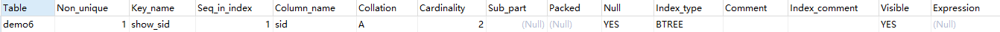
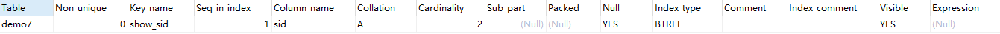

# 视图

视图（view）是一个虚拟表，非真实存在，其本质是根据SQL语句获取动态的数据集，并为其命名，用户使用时只需使用视图名称即可获取结果集，并可以将其当作表来使用

数据库中只存放了视图的定义，而并没有存放视图中的数据。这些数据存放在原来的表中。

使用视图查询数据时，数据库系统会从原来的表中取出对应的数据。因此，视图中的数据是依赖于原来的表中的数据的。一旦表中的数据发生改变，显示在视图中的数据也会发生改变。

## 视图作用

简化代码，可以把重复使用的查询封装成视图重复使用，同时可以使复杂的查询易于理解和使用。

安全原因，如果一张表中有很多数据，很多信息不希望让所有人看到，此时可以使用视图视，如：社会保险基金表，可以用视图只显示姓名，地址，而不显示社会保险号和工资数等，可以对不同的用户，设定不同的视图。

##  基本命令

准备数据

```sql
create table demo1
(
	sid nvarchar(10),
	sname nvarchar(10)
);
```

**什么是视图？**

1. 视图不是表
2. 视图基于表

**视图的基本语法：**

创建视图

- 语法：`create view view_name as sql;`
- 例子：`create view v1 as select * from demo1;`

查询视图：

- 语法：`select * from view_name`
- 例子：`select * from v1`

删除视图：

- 语法：`drop view view_name`
- 只是删除视图，不会影响原表

修改视图：

- 语法：`alter view view_name as sql`
- `alter view v1 as select * from demo2;`

重命名视图：

- 语法：`rename table old_view_name to new_view_name`;

增删改查视图中的数据：

- 语法：和正常的操作表数据语法一样，只是表名变为视图名
- 会操作原表中的数据(但有很多**限制**)

> **限制：**
>
> 视图可以直接用于更新（`INSERT`、`UPDATE`、`DELETE`）操作，这些操作会反映到原表上。要使视图可更新，通常需要满足以下条件：
>
> - 视图必须基于单个表。
> - 视图必须包含基表中所有 `NOT NULL` 且没有默认值的列。
> - 视图不能包含聚合函数（如 `SUM`、`AVG`、`COUNT` 等）。
> - 视图不能包含 `GROUP BY`、`DISTINCT` 或 `HAVING` 子句。
> - 视图不能包含 `UNION` 或 `UNION ALL`。
>
>  **多表连接视图的限制：**
>
> - **更新的二义性：** 当视图涉及到多个表时，更新操作可能会变得不明确。例如，如果要更新视图中的一个字段，MySQL 无法确定应该更新哪个表中的哪个字段。
> - **连接条件的影响：** 连接条件（如 `JOIN` 中的 `ON` 子句）会限制数据的修改。某些连接条件可能导致无法清晰地将视图中的更改映射回到底层表。
> - **复杂性：** 涉及 `UNION`、`GROUP BY`、聚合函数等的视图通常是不可更新的。
>
> **2. 何时可以更新多表连接视图：**
>
> - 在非常有限的情况下，如果多表连接视图满足以下所有条件，MySQL 允许有限的更新操作：
>   - **简单连接：** 视图必须是基于简单的连接，通常是等值连接（`INNER JOIN`，且 `ON` 子句使用 `=`）。
>   - **关键表：** 必须存在一个“关键表”（key table），即更新操作可以明确地映射到该表。
>   - **非 `NULL` 键：** 关键表必须包含所有被连接表的主键或唯一键，且这些键在连接中不能为 `NULL`。
>   - **无歧义：** 更新操作不能引起歧义，即 MySQL 必须能够明确地知道更新哪个表中的哪个字段。

**证明视图不是表：**

```sql
# 创建视图
create view v1 as select * from demo1;
# 先插入demo1表数据
insert into demo1 values('s-01', '小明'),('s-01', '小刘');
# 查看当前数据库中的所有表对象(包含视图)
show tables from linshi;
# 查看视图结构
describe v1;
```

> 发现查出来的表包含v1,但实质上视图不是表

## 视图的特性

准备数据

```sql
create table demo2
(
	sid nvarchar(10),
	sname nvarchar(10)
);
create table demo3
(
	sid nvarchar(10),
	sname nvarchar(10),
    s_cell_phone int
);
```

**视图不是表，但基于表：**

视图的特性：映射

1. 视图具有高操作性
   - 可以通过视图操作原表数据：通过视图插入、修改、删除数据原表也会发生变化。
   - 删除视图不影响原表
2. 视图具有高复用性
   - 只需创建一次视图即可多次调用

### 1. 高操作性

视图具有高操作性：

```sql
# 创建视图
create view v2 as select * from demo2;

# 通过视图插入数据
insert into v2 values('s-01', '小明'),('s-02', '小李');
# 查询原表中的数据
select * from demo2; # 发现原表中也插入了数据

# 删除视图中的数据
delete from v2;
# 查询原表中的数据
select * from demo2; # 发现原表中的数据被删除了

# 删除视图
drop view v2; # 执行删除视图前先向视图中插入数据
select * from demo2; # 发现删除视图后原表中的数据不受影响
```

### 2. 高复用性

视图具有高复用性：

```sql
# 查询学生id和姓名
# - 不用视图时
select sid, sname from demo3;

# - 使用视图时：
create view v3 as select sid, sname from demo3;
# -- 只要调用v3即可
select * from v3;
select * from v3;
```

## 视图和多表的联动

准备数据：

```sql
create table demo4
(
	sid nvarchar(10),
	sname nvarchar(10), # 商品名
);
# 插入数据
insert into demo4 values('s-01', '手机'),('s-02', '电脑');
create table demo5
(
	sid nvarchar(10),
	scomment nvarchar(10), # 评价
);
# 插入数据
insert into demo5 values('s-01', '好评'),('s-02', null);
```

> 视图不是表但基于表
>
> - 表：存储数据
> - 视图：操作数据

### 基于多表的视图

```sql
# 基于多表的视图
create view v4 as
select demo4.sid, demo4.sname, demo5.scomment 
from demo4
inner join demo5
on demo4.sid = demo5.sid;

# 查询视图
select * from v4;
#  查询出的数据：
#  s-01	手机	好评
#  s-02	电脑	
```

多表视图修改数据：

```sql
# 客户需求：给s-02的电脑中评
# - 直接操作表数据
update demo5 set demo5.scomment = '中评' where demo5.sid = 's-02';

# - 通过多表视图操作表数据
# -- 因为客户看不到数据库  客户会通过也只能通过看到的视图进行修改
update v4 set v4.scomment = '中评' where v4.sid = 's-02';
# 查询原表
select * from demo5;
#  查询出的数据
#  s-01	好评
#  s-02	中评
```

视图可以在不改变表结构的前提下 重构数据

# 索引

## 基本命令

MySQL 中创建索引的语句主要有以下几种方式：

**1. 在 `CREATE TABLE` 语句中创建索引：**

```sql
CREATE TABLE 表名 (  
    列名1 数据类型,  
    列名2 数据类型,  
    ...  
    INDEX 索引名 (列名1, 列名2, ...)  -- 普通索引  
    UNIQUE INDEX 索引名 (列名1, 列名2, ...) -- 唯一索引  
    FULLTEXT INDEX 索引名 (列名)       -- 全文索引 (MyISAM, InnoDB 5.6+)  
);  
```

**例如：**

```sql
CREATE TABLE users (  
    id INT PRIMARY KEY AUTO_INCREMENT,  
    username VARCHAR(50) NOT NULL,  
    email VARCHAR(100) NOT NULL,  
    INDEX idx_username (username),  
    UNIQUE INDEX idx_email (email)  
);  
```

**2. 使用 `ALTER TABLE` 语句创建索引：**

```sql
ALTER TABLE 表名 ADD INDEX 索引名 (列名1, 列名2, ...);       -- 普通索引  
ALTER TABLE 表名 ADD UNIQUE INDEX 索引名 (列名1, 列名2, ...);  -- 唯一索引  
ALTER TABLE 表名 ADD PRIMARY KEY (列名);                  -- 主键索引  
ALTER TABLE 表名 ADD FULLTEXT INDEX 索引名 (列名);         -- 全文索引  
```

**例如：**

```sql
ALTER TABLE users ADD INDEX idx_username (username);  
ALTER TABLE users ADD UNIQUE INDEX idx_email (email);  
```

**3. 使用 `CREATE INDEX` 语句创建索引：**

```sql
CREATE INDEX 索引名 ON 表名 (列名1, 列名2, ...);           -- 普通索引  
CREATE UNIQUE INDEX 索引名 ON 表名 (列名1, 列名2, ...);      -- 唯一索引  
CREATE FULLTEXT INDEX 索引名 ON 表名 (列名) ON 表名;     -- 全文索引  
```

**例如：**

```sql
CREATE INDEX idx_username ON users (username);  
CREATE UNIQUE INDEX idx_email ON users (email);  
```

**创建索引:**

```sql
# 创建表
create table demo6
(
	sid nvarchar(10),
	sname nvarchar(10),
	index show_sid (sid(10)) # 建表的同时为sid字段创建索引，索引长度为10
);
# 插入数据
insert into demo6 values('s-01', '小明'),('s-02', '小红'); # 可以执行多次
# 查询数据
select * from demo6;
# 查询表中索引
show index from demo6;
```

查询表中索引的结果：



**创建唯一索引：**

```sql
# 如果要将索引设置为具有唯一标识的信息该怎么办?
create table demo7
(
	sid nvarchar(10),
	sname nvarchar(10),
	unique show_sid (sid(10)) # 唯一索引
);
# 插入数据
insert into demo7 values('s-01', '小明'),('s-02', '小红'); # 只能执行一次 sid不可重复
# 查询数据
select * from demo7;

# 查询索引
show index from demo7;
```

查询表中索引的结果：



**将多列设为唯一索引：**

```sql
# 将多列设置为唯一索引
create table demo8
(
	sid nvarchar(10),
	sname nvarchar(10),
	car_id nvarchar(5),
	unique show_sid (sid(5), car_id(5)) # 唯一索引
);
# 插入数据
insert into demo8 values('s-01', '小明', 'car_1'), ('s-01', '小明', 'car_2'), ('s-02', '小红', 'car_3'); # 只能执行一次，类似联合主键

# 查询索引
show index from demo8;
```

## 索引的用处

在MySQL中创建索引后，您可以通过几种方式来利用这些索引来优化查询速度。下面是一些基本的用法和注意事项：

**1. 创建索引**

首先，例如，如果有一个名为`users`的表，可以这样创建索引：
```sql
CREATE INDEX idx_username ON users(username);
```

**2. 查询优化**

索引最主要的用途是在执行查询时加速数据检索。在`WHERE`子句中可以使用索引列，例如：
```sql
SELECT * FROM users WHERE username = 'john_doe';
```
这里，如果`username`列上有索引，查询将更快。

**3. 使用覆盖索引**

如果查询只涉及到索引的列，数据库可以直接从索引中返回数据，而不需要访问表，这叫做覆盖索引。例如：
```sql
SELECT username FROM users WHERE username = 'john_doe';
```
如果`username`是唯一且有索引的，这将非常高效。

**4. 连接查询**

在连接多个表时，如果连接条件的列上有索引，则查询性能会显著提高：
```sql
SELECT u.*, o.* FROM users u JOIN orders o ON u.id = o.user_id WHERE u.username = 'john_doe';
```

**5. 使用EXPLAIN查看执行计划**

您可以使用`EXPLAIN`来查看MySQL如何处理您的查询，理解索引的使用情况：
```sql
EXPLAIN SELECT * FROM users WHERE username = 'john_doe';
```
这将显示索引的使用情况，以及查询的优化程度。

**6. 定期维护索引**

随着数据的增删改，索引可能会变得不够高效。可以使用`ANALYZE TABLE`命令来维护索引：
```sql
ANALYZE TABLE users;
```

**注意事项**

- **不要过度使用索引**：虽然索引可以加速查询，但过多的索引会影响数据写入（INSERT、UPDATE、DELETE）的性能。
- **选择合适的列**：优先考虑那些在`WHERE`子句中频繁使用的列、用于JOIN的列，以及用于ORDER BY和GROUP BY的列。

## 索引信息的含义

查询表中索引: `show index from table_name`;

这条语句会返回一个结果集，其中包含多个字段，**每个字段的含义**如下：

- **`Table`**: 索引所在的表名。
- **`Non_unique`**: 如果索引不能包含重复的值，则为 `0`；如果可以包含重复的值，则为 `1`。换句话说，`0` 表示这是一个唯一索引。
- **`Key_name`**: 索引的名称。`PRIMARY` 表示主键索引。
- **`Seq_in_index`**: 索引中字段的顺序。从 `1` 开始计数。如果索引包含多个字段，则每个字段都会有一个序号。
- **`Column_name`**: 索引的字段名。
- **`Collation`**: 字段的排序方式。`A` 表示升序，`D` 表示降序，`NULL` 表示未排序。
- **`Cardinality`**: 索引中唯一值的数量的估计值。这个值越大，索引的选择性越好。MySQL 优化器会使用这个值来判断是否使用索引。
- **`Sub_part`**: 如果字段只是部分被索引，则显示被索引的字符数。如果整个字段都被索引，则为 `NULL`。例如，对于 `VARCHAR` 或 `TEXT` 类型的字段，可以只索引前几个字符。
- **`Packed`**: 指示关键字如何被压缩。如果没有被压缩，则为 `NULL`。
- **`Null`**: 如果字段可以包含 `NULL` 值，则为 `YES`；否则为 `''`。
- **`Index_type`**: 索引的类型。常见的类型包括 `BTREE`、`HASH`、`FULLTEXT` 和 `SPATIAL`。
- **`Comment`**: 索引的注释。
- **`Index_comment`**: 索引的注释（MySQL 5.7 及更高版本）。
- **`Visible`**: 索引对优化器是否可见。如果为 `YES`，则优化器可以使用该索引；如果为 `NO`，则优化器会忽略该索引。
- **`Expression`**: 如果索引是基于表达式的，则显示表达式（MySQL 8.0 及更高版本）。

> 参考资料
>
> - [MYSQL强大的视图_哔哩哔哩_bilibili](https://www.bilibili.com/video/BV13g411W7Pe?spm_id_from=333.788.videopod.sections&vd_source=796ed40051b301bfa3a84ba357f4828c)
> - ai