## MySql锁分类

 

 

### 一、按粒度分

MySQL的锁按粒度主要分为全局锁、表锁和行锁。

---

#### 1. 全局锁

---

**Q:什么是全局锁？**
MySQL全局锁是针对整个数据库的锁。最常用的全局锁是读锁和写锁。

1. **读锁(共享锁)**：它**阻止其他用户更新数据**，但允许他们读取数据。这在你需要在一段时间内保持数据一致性时很有用。
2. **写锁(排他锁)**：它**阻止其他用户读取和更新数据**。这在你需要修改一些大量的数据，并且不希望其他用户在这段时间内干扰时很有用。

**MySQL全局锁的典型使用场景**是，进行一些需要确保整个数据库一致性的操作，例如全库备份、全库导出等。

在MySQL中，可以使用`FLUSH TABLES WITH READ LOCK`(FTWRL)语句来**添加全局读锁**，这将阻止其他线程进行更新操作。使用`UNLOCK TABLES`语句来**释放锁定**。

请注意，全局锁的开销非常大，因为它会阻止其他所有的数据修改操作，并且在高并发情况下可能导致大量的线程等待锁定。因此，你应该尽量避免在生产环境中使用全局锁，或者尽量减少全局锁的持有时间。
虽然全局锁有其应用场景，但是过度使用或不正确使用全局锁可能导致性能问题。因此，根据应用的特性和需求选择适合的锁策略是很重要的。对于大多数应用，优先使用更精细粒度的锁，如行锁和表锁，可以更有效地处理并发请求，同时避免全局锁的开销。

---

#### 2. 表级锁

---

表级别的锁定是MySQL各存储引擎中最大颗粒度的锁定机制。该锁定机制最大的特点是实现逻辑非常简单，带来的系统负面影响最小。所以获取锁和释放锁的速度很快。

当然，**锁定颗粒度大所带来最大的负面影响就是出现锁定资源争用的概率也会最高，致使并发度大打折扣**。

使用表级锁定的主要是MyISAM，MEMORY，CSV等一些非事务性存储引擎。

---

**Q:什么是表级锁？**

表级锁是MySQL中最基本的锁策略，是MySQL最早采用的锁策略。

**表级锁的特点**：开销小，加锁快，不会出现死锁；锁定粒度大，发生锁冲突的概率最高，并发度最低。

**表锁有两种模式：**

1. **表共享读锁(Table Read Lock)**：又称为表读锁，允许一个事务锁定的表进行读取操作，不允许其他事务对其进行写操作，但是可以进行读操作。读锁之间是不会互相阻塞的。
2. **表独占写锁(Table Write Lock)**：又称为表写锁，允许一个事务锁定的表进行读取和写入(更新)操作，但是其他任何事务都不能再对该表进行任何操作，必须等待表写锁结束。写锁会阻塞其他所有锁，包括读锁和写锁。

在MySQL中，对MyISAM表的读操作，会自动加上读锁，对MyISAM表的写操作，会自动加上写锁。

InnoDB引擎在必要情况下会使用表锁，但主要是使用行锁来实现多版本并发控制(MVCC)，它能提供更好的并发性能和更少的锁冲突。

总的来说，表锁适用于读操作多、写操作少的应用，当并发争用不是特别激烈，以及记录级锁并发控制开销大于访问冲突开销的情况。在并发度高，或者写操作较多的情况下，表锁可能会成为瓶颈。

---

**Q：表级锁有哪些使用场景**

1. **读密集型应用**：如果你的应用主要进行读取操作，很少进行写入操作，那么使用表级锁可能是一个好选择。因为表级读锁不会阻塞其他的读锁，所以这种场景下表级锁能够提供很高的性能。
2. **写操作不频繁的场景**：表级锁对写操作的处理并不高效，因为一个写锁会阻塞所有其他的锁，无论它们是读锁还是写锁。但是，如果你的应用不需要频繁地进行写操作，或者可以容忍写操作的延迟，那么使用表级锁可能是可行的。
3. **数据量不大的简单应用**：如果数据库的数据量不大，那么即使在写操作中，由于锁定整张表，对性能的影响也不大。
4. **全表更新或者删除**：在某些情况下，可能需要对一张表进行全表的更新或者删除操作，例如，删除表中的所有记录，或者更新表中所有记录的某个字段的值。在这种情况下，使用表级锁是合适的。

但要注意，虽然表级锁的开销较小，但由于其锁定粒度大，可能会导致并发度下降，特别是在写操作较多或者并发度较高的场景下。所以，如果应用的并发度较高，或者需要频繁进行写操作，那么可能需要考虑使用更精细粒度的锁，如行锁。

---

**Q:MySQL哪些命令会发生表级锁**

1. **`ALTER TABLE`**:这个命令用于更改表的结构，如添加列、删除列、改变列的类型等。执行这个命令的时候，MySQL需要锁定整个表以防止在更改过程中有新的数据写入。
2. **`DROP TABLE和TRUNCATE TABLE`**:这两个命令都会导致表级锁。DROP TABLE命令会删除整个表，而TRUNCATE TABLE命令会删除表中的所有数据。在执行这些命令的时候，MySQL需要锁定整个表以防止在删除过程中有新的数据写入。
3. **`LOCK TABLES`:**这个命令可以显式地为一个或多个表加上读锁或写锁。LOCK TABLES命令后面可以跟上一系列的表名和锁模式，用来指定需要锁定哪些表，以及使用什么样的锁模式。例如，LOCK TABLES t1 NRITE,t2READ;命令会给表t1加上写锁，给表t2加上读锁。
4. **全表扫描或大范围扫描**：对于MyISAM存储引擎，全表扫描或大范围扫描会触发表级锁。
5. **`FLUSH TABLES WITH READ LOCK`(FTWRL)**:这个命令可以给所有表加上全局读锁，其他会话在此期间不能对数据进行修改。

请注意，noDB存储引擎主要使用行级锁，并在一些情况下使用表级锁，比如在执行某些`ALTER TABLE`命令或者`LOCK TABLES`命令时。MyISAM存储引擎只支持表级锁。

---

**Q:MySQL表锁风险点**

1. **性能下降**：因为表锁会锁定整个表，所以在高并发的环境中，它可能导致大量的请求阻塞，从而降低性能。对于读取和写入混合密集的负载，表锁可能会成为一个性能瓶颈。
2. **并发性能差**：表锁的最大问题在于其并发性能。一旦一个线程对表获得了写锁，其他线程的任何读写操作都会被阻塞，直到写锁被释放。同样的，如果一个读锁被持有，那么其他的写操作将被阻塞。这就使得并发性能大大降低。
3. **可能导致锁等待和超时**：在高并发的环境中，由于表级锁的粒度较大，可能会有很多线程在等待锁，如果等待的时间过长，可能会导致锁超时，进一步影响应用的性能和可用性。
4. **写操作影响大**：如果一个长时间运行的写操作（比如大数据量的JPDATE或者NSERT语句)获取了写锁，那么会阻塞所有其他的读操作和写操作，直到这个写操作完成。
5. **死锁的可能性**：虽然表锁本身不会出现死锁，但在多表操作中，如果没有按照一定的顺序获得锁，可能会导致死锁。

为了避免这些问题，我们通常会选择InnoDB存储引擎，它主要使用行级锁，可以提供更好的并发性能，并且在一定程度上减少了锁争用的问题。而且，InnoDB还支持事务，可以保证数据的一致性和完整性。在实际应用中，我们应该根据具体的业务需求和系统负载，选择合适的存储引擎和锁策略。

---

#### 3. 行级锁

---

行级锁定最大的特点就是**锁定对象的颗粒度很小**，由于锁定颗粒度很小，所以发生锁定资源争用的概率也最小，能够给予应用程序尽可能大的并发处理能力而提高一些需要高并发应用系统的整体性能。

虽然能够在并发处理能力上面有较大的优势，但是行级锁定也因此带来了不少弊端。

**由于锁定资源的颗粒度很小，所以每次获取锁和释放锁需要做的事情也更多，带来的消耗自然也就更大了。此外，行级锁定也最容易发生死锁**。

使用行级锁定的主要是InnoDB存储引擎。

---

**Q:什么是行锁？**

行级锁是MySQL中的一种锁定机制，它可以对数据库表中的单独一行进行锁定。相比于表级锁和页锁，**行级锁的粒度更小**，因此在处理高并发事务时，能**提供更好的并发性能和更少的锁冲突**。然而，行级锁也**需要更多的内存和CPU资源**，因为需要对每一行都进行管理。
在MySQL中，行级锁主要由InnoDB存储引擎提供。**InnoDB支持两种类型的行级锁：共享锁(S锁)和排他锁(X锁)**

1. **共享锁(S锁)**：共享锁也称为**读锁**，它允许一个事务读取一行数据。当一行数据被共享锁锁定时，**其他事务可以读取这行数据，但不能对其进行修改。**
2. **排他锁(X锁)**：排他锁也称为**写锁**，它允许一个事务读取和修改一行数据。当一行数据被排他锁锁定时，**其他事务不能读取也不能修改这行数据。**

在实际使用中，InnoDB**还提供了一种名为“间隙锁”(Gap Lock)的特性**。间隙锁不仅锁定一个具体的行，还锁定它前后的“间隙”(范围)，即这一行之前的行和之后的行之间的空间。间隙锁可以防止其他事务插入新的行到已锁定行的前后，从而可以解决一些并发问题。

值得注意的是，**行级锁只在事务中有效**，也就是说，只有在一个事务开始(BEGN)后并在事务提交(COMMIT)或回滚(ROLLBACI)之前，才能对数据行进行锁定。如果在非事务环境中执行SQL语句，那么InnoDB会在语句执行结束后立即释放所有的锁。

---

**Q:MySQL行锁有哪些使用场景**
MySQL中的行级锁(Row Level Locks)通常在以下几种场景中被使用：

1. **高并发读写操作**：在需要高并发读写操作的场景中，行级锁可以提高性能和并发性，因为它允许多个事务并发地操作不同的行。
2. **单行操作**：对于需要操作单行数据的SQL语句（例如基于主键或者唯一索引的UPDATE、DELETE和INSERT语句)，行级锁可以提供较好的并发性和性能。
3. **短期锁**：在需要对数据行进行短时间锁定的情况下，行级锁可以防止长时间阻塞其他事务。
4. **实现并发控制**：在需要确保数据一致性和隔离性的事务中，行级锁是实现并发控制的重要机制。
5. **复杂的事务处理**：在需要对多行数据进行复杂处理的事务中，可以使用行级锁来锁定这些行，防止在事务处理过程中数据被其他事务修改。

使用行级锁需要注意，由于行级锁的锁定粒度较小，它可能会消耗更多的系统资源（例如内存和CPU)，特别是在处理大量数据时。此外，使用行级锁也可能导致死锁，需要使用合适的策略来避免死锁，例如在事务中按照一定的顺序锁定行。

---

**Q:MySQL那些命令会导致发生行锁？**

在MySQL中，主要是InnoDB存储引擎提供了行级锁(Row Level Locking)。一般来说，以下这些类型的操作会导致InnoDB对数据行进行加锁：

1. `SELECT ... FOR UPDATE`：这种查询会对选定的**行添加一个排他锁**(X锁)，这意味着其他事务不能修改这些行，也不能对这些行添加共享锁。
2. `SELECT ... LOCK IN SHARE MODE`：这种查询会对选定的**行添加一个共享锁**(S锁)，这意味着其他事务不能修改这些行，但可以对这些行添加共享锁。
3. `INSERT`：插入操作会对**新添加的行添加一个排他锁**(X锁)。
4. `UPDATE`：更新操作会对**被更新的行添加一个排他锁**(X锁)
5. `DELETE`：删除操作会对**被删除的行添加一个排他锁**(X锁)

这些加锁操作都是在事务中进行的，即只有在事务开始(BEGN)后并在事务提交(COMMIT)或回滚(ROLLBACK)之前，才会对数据行进行加锁。如果在非事务环境中执行上述SQL语句，那么InnoDB会在语句执行结束后立即释放所有的锁。

请注意，加锁的粒度和范围取决于VHERE子句中用到的索引。如果WHERE子句中用到了唯一索引（例如主键索引），那么InnoDB只会锁定匹配的行。如果没有用到唯一索引，那么InnoDB可能会锁定更多的行，甚至是整个表，这就可能导致锁冲突和性能问题。

此外，InnoDB还支持间隙锁(Gap Locks)和临键锁(Next-Key Locks),这两种锁都可以在某些情况下提供更好的并发控制。

---

**Q:MySQL行锁有什么风险点？**

尽管行级锁(Row-Level Locking)可以提供高并发性并减少锁冲突，但在使用过程中也可能遇到一些风险和问题，主要包括以下几点：

1. **死锁**：当两个或更多的事务相互等待对方释放资源时，就会发生死锁。例如，事务1锁定了行A并试图锁定行B,同时事务2锁定了行B并试图锁定行A,这就形成了死锁。MySQL会检测到死锁并终止其中一个事务，但这仍可能导致性能问题和事务失败。
2. **锁升级**：如果一个事务试图锁定的行过多，InnoDB可能会将锁从行级升级为表级，这就可能导致更多的锁冲突。
3. **锁等待**：如果一个事务已经锁定了某行，其他试图访问这行的事务就必须等待，这可能导致性能下降。如果有大量的事务在等待锁，就可能导致系统出现性能瓶颈。
4. **资源消耗**：行级锁需要更多的内存来存储锁信息，而且需要更多的CPU时间来处理锁请求和释放锁。如果数据库中的行数非常多，或者并发事务的数量非常多，这可能会导致显著的资源消耗。
5. **难以调试和排查**：由于行级锁的粒度较小，如果出现性能问题或锁冲突，可能需要复杂的调试和排查工作来找出问题的原因。
6. **事务隔离级别**：不同的事务隔离级别会影响锁的行为和性能，可能需要根据具体的应用场景来调整事务隔离级别。

为了避免上述问题，需要合理地设计数据库表和索引，合理地编写SQL语句，合理地管理事务，以及合理地设置事务隔离级别。

---

#### 4. 页级锁

---

页级锁定是MySQL中比较独特的一种锁定级别。页级锁定的特点是锁定颗粒度介于行级锁定与表级锁之间，所以获取锁定所需要的资源开销，以及所能提供的并发处理能力也同样是介于上面二者之间。

使用页级锁定的主要是BerkeleyDB存储引擎。

---

总的说

- **表级锁**：开销小，加锁快；不会出现死锁；锁定粒度大，发生锁冲突的概率最高，并发度最低；
- **行级锁**：开销大，加锁慢；会出现死锁；锁定粒度最小，发生锁冲突的概率最低，并发度也最高；
- **页面锁**：开销和加锁时间界于表锁和行锁之间；会出现死锁；锁定粒度界于表锁和行锁之间，并发度一般。

---

### 二、按模式分

MySQL的锁按模式主要分为乐观锁和悲观锁

---

#### 1. 乐观锁

---

**Q：什么是乐观锁？**

乐观锁(Optimistic Locking)是一种在数据库操作中用于处理并发问题的技术。

**它的基本思想是**假设在多个事务同时访问同一条数据时，**冲突发生的概率较低**，因此在操作数据时不会立即进行锁定，而是在**提交数据更改时检查是否有其他事务修改了这条数据。如果没有，就提交更改，否则就回滚事务。**

在MySQL中，乐观锁并没有内置的实现，但是可以通过一些编程技巧来实现。一种常见的实现方式是使用版本号（或时间戳）字段。每当一条记录被修改时，就增加版本号（或更新时间戳)。在更新记录时，先检查版本号（或时间戳）是否和读取记录时的版本号（或时间戳）致，如果一致则执行更新并增加版本号（或更新时间戳），否则就拒绝更新。这样就可以保证只有当记录没有被其他事务修改时，当前事务的更改才会被提交。

乐观锁的优点在于，由于大部分时间都不需要锁定，所以在冲突较少的情况下可以获得较高的并发性能。然而，如果冲突较多，那么乐观锁可能会导致大量的事务回滚，从而影响性能。因此，选择使用乐观锁还是其他锁定技术，需要根据实际的并发情况和性能需求来决定。

---

**Q:乐观锁有哪些使用场景？**

乐观锁(Optimistic Locking)是一种**对并发控制的策略**，适用于以下的应用场景：

1. **低冲突环境**：在多数情况下，数据并发修改的冲突较低，即同一时间内，同一条数据不会被多个事务同时修改。
2. **读多写少的场景**：在读操作远多于写操作的情况下，乐观锁可以避免由于频繁的读操作导致的不必要的锁定开销。
3. **短事务操作**：如果数据库的事务都是简短并且快速完成的，那么使用乐观锁可以减少因为等待锁而导致的时间消耗。
4. **分布式系统**：在分布式系统中，由于网络延迟等原因，事务冲突的可能性较低，因此乐观锁是一个合适的选择。
5. **互联网应用**：对于互联网应用，如电子商务网站，用户浏览商品和下单等操作，多数情况下是读取操作，且并发修改同一条数据的几率较小，因此使用乐观锁可以提高系统性能。

需要注意的是，如果事务冲突的可能性较高，或者需要长时间锁定某个资源，那么使用乐观锁可能会导致大量的事务冲突和回滚，这种情况下，悲观锁或者其他并发控制技术可能会是更好的选择。

---

**Q:MySQL如何使用乐观锁**

在MySQL中，乐观锁并没有明确的SQL语句或命令，通常是通过在应用程序代码中实现特定的逻辑来达到乐观锁的效果。一个常见的实现乐观锁的方式是使用版本号或者时间戳字段。

假设我们有一个名为`Products`的表，其中**有一个`version`字段用于实现乐观锁**：

1. 查询数据

   ```sql
   SELECT id,name,quantity,version FROM Products WHERE id = 1;
   ```

2. 修改数据：在应用程序中修改数据。

3. 更新数据：更新数据时，**需要检查版本号是否仍然和原来读取的版本号一致**。如果一致，就增加版本号并更新数据；如果不一致，说明数据已经被其他事务修改过，因此应该回滚当前事务。

   ```sql
   UPDATE Products
   SET name = 'NewName',quantity = 10,version = version + 1
   WHERE id = 1 AND version = :oldVersion;
   ```

   其中，`:oldVersion`是参数，应该替换为原来读取的版本号。

   如果更新操作影响的行数（可以通过检查`UPDATE`语句的返回值得到）等于`0`，那么说明版本号不匹配，应该回滚当前事务。具体的回滚操作取决于你的应用程序和事务管理器的具体实现。

> **注意:** 乐观锁适用于冲突较少的情况。如果你的应用中有大量的冲突，那么可能需要使用悲观锁或其他并发控制技术。

eg:

```sql
CREATE TABLE `employee` (
	`id` bigint NOT NULL COMMENT '员工ID',
	`name` varchar(50)NOT NULL COMMENT '员工姓名',
	`address` varchar(100) DEFAULT NULL COMMENT '员工地址',
	`payment_type` int NOT NULL COMMENT '支付方式(I:支票邮寄，2：支票暂存出纳处，3：银行账户存入)',
	`salary_type` int NOT NULL COMMENT '薪水类型(1：钟点工，2：固定月薪，3：销售佣金)',
	`hourly_rate` decimal(10,2) DEFAULT NULL COMMENT '时薪',
	`monthly_salary` decimal(10,2) DEFAULT NULL COMMENT '月薪',
	`commission_rate` decimal(5,2) DEFAULT NULL COMMENT '用金率',
	`union_member` tinyint(1) DEFAULT NULL COMMENT '是否工会成员',
	`weekly_dues` decimal(10,2) DEFAULT NULL COMMENT '每周会费',
	`create_time` datetime NOT NULL COMMENT '记录创建时间',
	`update_time` datetime DEFAULT NULL COMMENT '记录更新时间',
	`deleted` tinyint(1) NOT NULL DEFAULT '0' COMMENT '是否已别除',
	`bank_account` varchar(50) DEFAULT NULL,
	`mailing_address` varchar(200) DEFAULT NULL,
	`version` tinyint DEFAULT '0' COMMENT '版本标识',
	PRIMARY KEY (`id`),
	KEY `idx_employee_name` (`name`)
) ENGINE=InnoDB DEFAULT CHARSET=Utf8mb4 COLLATE:=Utf8mb4_0900_ai_ci COMMENT='员工表';
```

```sql
-- 线程1
SELECT * from employee where id = 1; -- 查出 version = 0
UPDATE employee set name = '张三',version = version + 1 where id = 1 and version = 0; -- 修改
-- 线程2
SELECT * from employee where id = 1; -- 查出 version = 1
UPDATE employee set name = '张三1',version = version + 1 where id = 1 and version = 1; -- 线程2执行
-- 线程3
SELECT * from employee where id = 1; -- 查出 version = 1
UPDATE employee set name = '张三2',version = version + 1 where id = 1 and version = 1; -- 在该语句执行前线程2的修改语句执行了，version=2，导致该修改语句未修改任何行
```

---

**Q：乐观锁的缺点**

1. **冲突检测**：在高并发的环境中，乐观锁可能会导致大量的冲突。因为乐观锁只有在提交事务时才检查是否有冲突，如果多个事务在同一时间操作同一行，那么只有一个事务能提交成功，其他的事务都需要回滚并重新尝试。
2. **处理开销**：在冲突发生时，需要进行回滚和重试，这可能会增加系统的开销。在一些场景中，这可能会导致性能下降。
3. **版本管理**：乐观锁通常通过版本号（或时间戳）来检测冲突。这就要求系统能够正确地管理这些版本号，否则可能会导致错误的冲突检测。
4. **编程复杂性**：使用乐观锁需要更复杂的编程，因为程序需要处理可能发生的冲突和重试。

总的来说，乐观锁是一种有效的并发控制策略，但在冲突较多的情况下，可能会带来更大的开销和编程复杂性。因此，是否选择使用乐观锁，需要根据应用的具体需求和场景来决定。

---

#### 2. 悲观锁

---

**Q:什么是悲观锁？**

**悲观锁(Pessimistic Locking)**：是一种并发控制的方法，基于一个假设：认为数据在并发处理过程中很可能会出现冲突。因此，为了保证数据的完整性和一致性，每次在读写数据时都会先加锁，这样可以避免其他事务进行并发的读写操作。

是否使用悲观锁需要根据应用的具体需求和场景来决定。在冲突较少，但需要保证数据完整性和一致性的情况下，可以考虑使用悲观锁。

---

**Q：MySQL悲观锁适用哪些场景？**

悲观锁的策略是假设数据在并发处理过程中会发生冲突，因此在进行任何读写操作前，都会预先加锁。这种策略在某些特定的应用场景下是比较有优势的，主要包括：

1. **写操作较多的场景**：如果一个系统中的写操作比读操作多，或者说写操作占主导，那么悲观锁可能是一个比较好的选择。因为在这种场景下，数据冲突的可能性相对较高，预先加锁可以确保数据的完整性和一致性。
2. **并发冲突高的场景**：在并发冲突较高的场景，使用悲观锁可以避免重复尝试操作，提高系统的整体效率。
3. **业务需要强一致性的场景**：在一些需要保证数据强一致性的业务场景下，例如银行转账等金融业务，通常会选择使用悲观锁，以确保在任何情况下数据的一致性和准确性。

但是值得注意的是，**悲观锁也可能引入死锁等问题**，也可能因为锁定过程中事务长时间等待而影响性能。因此，选择和使用悲观锁都需要根据具体业务场景和需求来进行。

---

**Q:MySQL如何使用悲观锁**

在MySQL中，悲观锁主要通过以下两种SQL语句实现：

1. **`SELECT ... FOR UPDATE`**：这个语句会在所选的**行上设置排他锁**(Exclusive Lock)。在锁定期间，其他事务无法修改这些行，也无法在这些行上设置新的排他锁或共享锁。
2. **`SELECT ... LOCK IN SHARE MODE`**:这个语句会在所选的**行上设置共享锁**(Shared Lock)。在锁定期间，其他事务可以读取这些行，但不能修改这些行，也不能在这些行上设置排他锁。

**下面是一些使用悲观锁的例子：**

例1：使用排他锁

```sql
-- 线程1
START TRANSACTION; -- 开启事务
SELECT * FROM employee WHERE id = 1 for UPDATE; -- 悲观排他锁
UPDATE employee SET name = 'beiming2' where id = 1;
COMMIT;

-- 线程2
UPDATE employee SET name = 'beiming3' where id = 1; -- 线程1开启悲观排他锁后该语句被阻塞直到线程1事务提交
```

例2：使用共享锁

```sql
-- 线程1
START TRANSACTION; -- 开启事务
SELECT * FROM employee WHERE id = 1 lock in share mode; -- 悲观共享锁
UPDATE employee SET name = 'beiming2' where id = 1;
COMMIT;

-- 线程2
-- 悲观共享锁
UPDATE employee SET name = 'beiming3' where id = 1; -- 线程1开启悲观共享锁后该语句被阻塞直到线程1事务提交
SELECT * FROM employee WHERE id = 1; -- 在线程开启悲观共享锁后其他用户也可以查询该数据
```

---

**Q：悲观锁的缺点**

1. **性能开销**：在悲观锁机制下，锁定资源的操作会影响到系统性能。因为每次对数据的读写都需要进行加锁和解锁的操作，这会增加系统的开销，特别是在高并发的环境下，锁的竞争更是会严重影响到系统性能。
2. **并发度降低**：由于悲观锁在操作数据前就会加锁，这就导致了在同一时间，只有一个事务能操作数据，其他事务只能等待，大大降低了系统的并发度。
3. **死锁**：悲观锁在并发事务中可能导致死锁的情况发生。**当两个或者更多的事务互相等待对方释放锁时，就可能发生死锁**。虽然数据库系统通常能够检测并解决死锁，但这会导致事务回滚，增加了系统的开销。
4. **锁超时**：如果一个事务长时间持有锁而不释放，可能导致其他等待锁的事务超时。这不仅可能导致等待的事务失败，还可能影响到整个系统的稳定性。

因此，虽然悲观锁能有效地防止数据冲突，但由于其在并发处理中的限制，以及可能引发的问题，如死锁、锁竞争和锁超时，我们需要根据具体的应用场景和需求，来权衡是否使用悲观锁。

### 三、按属性分

MySQL的锁按属性主要分为共享锁和排他锁

nnoDB 实现了标准的**行级锁**，包括两种：**共享锁**（简称 s 锁）、**排它锁**（简称 x 锁）。

对于共享锁而言，对当前行加**共享锁**，不会阻塞其他事务对同一行的读请求，但会阻塞对同一行的写请求。只有当读锁释放后，才会执行其它事物的写操作。

对于排它锁而言，会阻塞其他事务对同一行的读和写操作，只有当写锁释放后，才会执行其它事务的读写操作。

| 兼容性 | 共享锁 | 排他锁 |
| ------ | ------ | ------ |
| 共享锁 | 兼容   | 不兼容 |
| 排他锁 | 不兼容 | 不兼容 |

简而言之，就是`读锁会阻塞写(X)，但是不会堵塞读(S)。而写锁则会把读(S)和写(X)都堵塞`

对于InnoDB 在RR(MySQL默认隔离级别) 而言，对于 update、delete 和 insert 语句， 会自动给涉及数据集加排它锁（X）；

对于普通 select 语句，innodb 不会加任何锁。如果想在select操作的时候加上 S锁 或者 X锁，需要我们手动加锁。

```sql
-- 加共享锁（S）
select * from table_name where ... lock in share mode

-- 加排它锁（X)
select * from table_name where ... for update
```

用 **select... in share mode** 获得共享锁，主要用在需要数据依存关系时来确认某行记录是否存在，并确保没有人对这个记录进行 update 或者 delete 操作。

但是如果当前事务也需要对该记录进行更新操作,则有可能造成死锁，对于锁定行记录后需要进行更新操作的应用，应该使用 **select... for update** 方式获得排他锁。

### 三、按状态分

MySQL的锁按模式主要分为意向共享锁和意向排它锁

---

#### 意向共享锁和意向排它锁

----

**意向锁的概念**

意向锁是表锁，为了协调行锁和表锁的关系，支持多粒度（表锁与行锁）的锁并存。

---

**意向锁的作用**

当有事务A有行锁时，MySQL会自动为该表添加意向锁，事务B如果想申请整个表的写锁，那么不需要遍历每一行判断是否存在行锁，而直接判断是否存在意向锁，增强性能。

---

**为什么意向锁是表级锁呢？**

当我们需要加一个排他锁时，需要**根据意向锁去判断表中有没有数据行被锁定**
(行锁)；

1. ~~**如果意向锁是行锁**，则需要**遍历每一行**数据去确认；~~
2. **如果意向锁是表锁**，则只需要**判断一次**即可知道有没数据行被锁定，**提升性能**。

---

**意向锁怎么支持表锁和行锁并存？**

1. **并存的概念**是指数据库同时支持表、行锁，而不是任何情况都支持一个表中同时有一个事务A持有行锁、又有一个事务B持有表锁，因为**表一旦被上了一个表级的写锁，肯定不能再上一个行级的锁。**
2. 如果事务A对某一行上锁，其他事务就不可能修改这一行。这与“事务B锁住整个表就能修改表中的任意一行”形成了冲突。
   所以，没有意向锁的时候，让行锁与表锁共存，就会带来很多问题。于是有了意向锁的出现，如前面所言，数据库不需要在检查每一行数据是否有锁，而是直接判断一次意向锁是否存在即可，能提升很多性能。

---

**意向锁的兼容互斥性**

|           | 意向共享锁(IS) | 意向排他锁(IX) |
| --------- | -------------- | -------------- |
| 共享锁(S) | 兼容           | 互斥           |
| 排他锁(X) | 互斥           | 互斥           |

排他锁和意向锁：

```sql
-- 线程1
START TRANSACTION;
SELECT * FROM employee WHERE id = 1 FOR UPDATE; -- 开启行级的排他锁(写锁)
SELECT * FROM performance_schema.data_locks; -- 查看锁 可以看到此时有一个行级的排他锁同时存在一个表级的意向锁排他锁
COMMIT; -- 暂时不提交

-- 线程2 只执行下方命令的其中一条
-- 如果线程2执行write 写锁(共享锁)
lock table employee write; -- 阻塞 给该表一个写锁(排他锁)，执行该命令发现被阻塞。 原因: 排他锁和意向排他锁是互斥的
-- 如果线程2执行read 读锁(排他锁)
lock table employee read; -- 阻塞 给该表一个读锁(共享锁)，执行该命令发现被阻塞。 原因: 共享锁和意向排他锁是互斥的
```

共享锁和意向锁：

```sql
-- 线程1
START TRANSACTION;
SELECT * FROM employee WHERE id = 1 lock in share mode; -- 开启行级的共享锁(读锁)
SELECT * FROM performance_schema.data_locks; -- 查看锁 可以看到此时有一个行级的共享锁同时存在一个表级的意向锁共享锁
COMMIT; -- 暂时不提交

-- 线程2 只执行下方命令的其中一条
-- 如果线程2执行read 读锁(排他锁)
lock tables employee read; -- 可以执行，说明共享锁和意向共享锁兼容
-- 如果线程2执行write 写锁(共享锁)
lock tables employee write; -- 阻塞 说明排他锁和意向共享锁不兼容
```

### 四、按算法分

MySQL的锁按模式主要分为间隙锁、临建锁、记录锁

**InnoDB** 中的**行锁**的实现依赖于**索引**，一旦某个加锁操作没有使用到索引，那么该锁就会退化为`表锁`。

**记录锁**存在于包括**主键索引**在内的**唯一索引**中，锁定单条索引记录。

**间隙锁**存在于**非唯一索引**中，锁定**开区间**范围内的一段间隔，它是基于**临键锁**实现的。

**临键锁**存在于**非唯一索引**中，该类型的每条记录的索引上都存在这种锁，它是一种特殊的**间隙锁**，锁定一段**左开右闭**的索引区间。

---

#### 1. 间隙锁

间隙锁 是 **Innodb 在 RR(可重复读) 隔离级别** 下为了解决**幻读问题**时引入的锁机制。**间隙锁是innodb中行锁的一种**。

请务必牢记：**使用间隙锁锁住的是一个区间，而不仅仅是这个区间中的每一条数据**。

举例来说，假如emp表中只有101条记录，其empid的值分别是1,2,...,100,101，下面的SQL：

```sql
SELECT * FROM emp WHERE empid > 100 FOR UPDATE
```

当我们用条件检索数据，并请求共享或排他锁时，InnoDB不仅会对符合条件的empid值为101的记录加锁，也会对empid大于101（这些记录并不存在）的“间隙”加锁。

这个时候如果你插入empid等于102的数据的，如果那边事物还没有提交，那你就会处于等待状态，无法插入数据。

#### 2. 临键锁

---

**什么是临键锁？**

Next-key锁是**记录锁和间隙锁的组合**，它指的是加在某条记录以及这条记录前面间隙上的锁。Next-Key可以理解为一种**特殊的间隙锁**，也可以理解为一种**特殊的算法**。

通过临建锁可以**解决幻读的问题**。每个数据行上的**非唯一索引列**上都会存在一把**临键锁**，当某个事务持有该数据行的**临键锁**时，会锁住一段**左开右闭区间**的数据。需要强调的一点是，InnoDB中**行级锁**是基于索引实现的，**临键锁**只与**非唯一索引列**有关，在唯一索引列（包括主键列）上不存在**临键锁。**

| id   | age  | name |
| ---- | ---- | ---- |
| 1    | 10   | 张三 |
| 3    | 24   | 李四 |
| 5    | 32   | 王五 |
| 7    | 45   | 赵六 |

该表中age列潜在的临键锁有：`(-∞，10]`，`(10,24]`,`(24,32]`,`(32,45]`,`(45,+∞]`，

```sql
-- 线程1
START TRANSACTION;
-- 根据非唯一索引列 锁住某条记录 
SELECT * FROM user WHERE age = 24 FOR UPDATE; -- 开启行级的排他锁(写锁)
-- 或根据非唯一索引列 UPDATE 某条记录 
UPDATE user SET name = lisi WHERE age = 24; -- 开启行级的排他锁(写锁)
SELECT * FROM performance_schema.data_locks; -- 查看锁 可以看到此时有一个行级的排他锁同时存在一个表级的意向锁

-- 线程2
-- 不管执行了上述 SQL 中的哪一句，之后如果在事务 B 中执行以下命令，则该命令会被阻塞：
START TRANSACTION;
insert into user values(100, 26, '张三'); -- 阻塞 原因 我们锁住了24，同时在(24, 32]之间有一把临界锁锁住了26
```

---
**临键锁有哪些使用场景？**

临键锁(Next-Key Lock)在MySQL数据库的JInnoDB存储引擎中主要用于以下场景：

1. **防止幻读**：幻读是指在一个事务执行过程中，同样的查询操作返回了不同的结果集，这是由于其他事务在这两次查询操作之间插入了新的记录。临键锁可以防止在锁定范围内插入新的行，从而避免了幻读问题。

2. **范围查询和修改**：在执行范围查询和修改操作时，临键锁可以确保数据的一致性。比如，当你在一个事务中执行了如下查询，并且请求了一个排他锁：

   ```sql
   SELECT * FROM Orders WHERE OrderID BETWEEN 100 AND 200 FOR UPDATE
   ```

   在这种情况下，InnoDB会对OrderID值在100到200之间的所有记录加上行锁，并且对这个范围内的间隙加上间隙锁，合在一起就形成了临键锁。这样，直到事务结束，其他事务都不能在这个范围内插入新的记录。

   1. **防止死锁**：临键锁可以在某些情况下防止死锁。比如，两个事务都想在同一间隙中插入新的行，由于临键锁的存在，这可能防止了死锁的发生。

需要注意的是，临键锁只在可重复读(REPEATABLE READ)和序列化(SERIALIZABLE)
这两个隔离级别下使用，在读已提交(READ COMMITTED)和读未提交(READ
UNCOMMITTED)这两个隔离级别下，InnoDB不会使用临键锁。

---

**临键锁有什么缺点？**

临键锁(Next-Key Lock)是一种强大的锁定机制，可以帮助保持数据库的一致性并防止幻读(phantom reads)。然而，它也有一些潜在的缺点，包括：

1. **性能影响**：临键锁可以防止其他事务在已经锁定的范围内插入新的行。这种锁定级别可能会影响到数据库的并发性能，尤其是在高并发的插入操作中。
2. **过度锁定**：临键锁可能导致比实际需要锁定的行更多的数据被锁定。因为临键锁不仅锁定了数据行，还锁定了索引间隙，这可能会导致更多的数据被锁定，从而影响到其他事务。
3. **复杂性**：理解临键锁及其对数据库操作的影响可能需要相当深入的数据库知识，特别是在处理并发问题和调优数据库性能时。
4. **死锁风险**：虽然临键锁可以在某些情况下防止死锁，但在其他情况下，它可能会增加死锁的风险。比如，如果两个事务都试图在同一个间隙中插入新行，就可能发生死锁。

请注意，这些潜在的缺点主要取决于具体的使用场景和工作负载，有时候，为了保持数据的一致性和防止并发问题，这些缺点可能是可以接受的。

---

#### 3. 记录锁(行锁)

---

**什么是记录锁？**

记录锁(Record Lock)是MySQL数据库中InnoDB存储引擎的一种锁定机制，主要用于锁定和控制对单个行记录的访问。记录锁是在索引记录上设置的，对于表没有主键或唯一索引的表，InnoDB会生成一个隐藏的聚簇索引，并在这个隐藏索引上加锁。

记录锁其实很好理解，对表中的记录加锁，叫做记录锁，简称行锁。比如

```sql
SELECT * FROM `test` WHERE `id`=1 FOR UPDATE;
```

它会在 id=1 的记录上加上记录锁，以阻止其他事务插入，更新，删除 id=1 这一行。

在实际操作中，记录锁通常会在进行数据查询、更新或删除等操作时自动被数据库引擎应用。

例如，当执行以下查询时，MySQL会在Orders表的OrderID为1的行上设置记录锁：

```sql
SELECT * FROM Orders WHERE OrderID = 1 FOR UPDATE;
```

需要注意的是：

- **id 列必须为唯一索引列或主键列**，否则上述语句加的锁就会变成临键锁。
- **同时查询语句必须为精准匹配（=）**，不能为 >、<、like等，否则也会退化成临键锁。

其他实现：

在通过 **主键索引** 与 **唯一索引** 对数据行进行 UPDATE 操作时，也会对该行数据加记录锁：

```sql
-- id 列为主键列或唯一索引列 
UPDATE SET age = 50 WHERE id = 1;
```

**记录锁是锁住记录，锁住索引记录，而不是真正的数据记录**.

如果要锁的列没有索引，进行全表记录加锁

记录锁也是排它(X)锁,所以会阻塞其他事务对其**插入、更新、删除**。

**记录锁主要有两种类型**：共享锁(Shared Locks)和排他锁(Exclusive Locks)。

- **共享锁**(S锁)，允许多个事务同时读取同一数据，但阻止任何事务进行写操作（包括该事务自身）。
- **排他锁**(X锁)，又称写锁，当一个事务持有排他锁时，其他事务不能读取也不能写入被锁定的数据。

## MySQL锁生动讲解

### 悲观锁和乐观锁

**悲观锁：**

- 假如在一个**公共厕所**当中，你肯定会**以悲观的心态认为**这个厕所它的**竞争**会很**高**，那此时你**来到厕所之后**呢，肯定就会**上锁**那**此时**如果**还有人进来**，它就需要**排队等待**。
- 就像`synchronized`、`ReentrantLock`都是悲观锁，**也**可以**叫做排他锁或者互斥锁**
- 适用于**并发量非常高**，然后对**读写资源竞争高**的场景

**乐观锁：**

但是如果你是**家里的厕所**，那你会以一种**乐观的心态**呢去思考，你会**认为**呢这个资源的**竞争**反正**很小**，那此时你**来到厕所之后**呢，我就**不上锁**，哪怕**此时还有人进来**，出现了少量的竞争，那也可以**采用确认**

如果**里面有人**呢进行**重试**，那这种方式呢我们也**称之为*自旋锁***，直到**确认里面没有人之后**呢，**再**进行**进驻**，那这其实就是***乐观锁的CAS机制***，也就是比较并且替换

关于**乐观锁的CAS机制以及自旋锁**，可以通过这一段简单的**示例代码**来进行查看：
```java
public static AtomicInteger stock = new AtomicInteger(1000000); // 声明库存数量 该类可以原子性地更新整数值
static class StockRunnable implements Runnable {
    @Override
    public void run() {
        int oldValue;
        int newValue;
        // 通过循环完成自旋锁
        do {
            oldValue = stock.get(); // 获取到库存的共享数据
        	newValue = stock.get()-1; // 扣减库存
        } while (!stock.compareAndSet(oldValue, newValue)); // 将oldValue与AtomicInteger维护的值进行对比，如果不同则不赋值，返回false，如果相同，则将newValue赋值AtomicInteger维护的值到并返回true
    }
}
```

那在这里呢我们

- 通过原子类型 `AtomicInteger`，来声明了一个库存数量
- 然后呢**通过**一个**循环**来**完成自旋锁**
  - 首先呢我们**获取到已有的库存的共享数据**
  - 然后呢进行**扣减库存**
  - 然后我们通过原子类型的 `compareAndSet`，先**将**之前取出来的**老数据，跟**已有的库存(**`AtomicInteger`维护的数据**)进行**对比**
    - 如果对比不上呢，则说明库存已经被其他的线程进行了修改，那么此时新扣减完的库存则不会进行存入，那 `compareAndSet` 呢会返回 `false`，`!false`重新进行循环
    - 如果相等，那将扣减完的新数据`newValue`赋值到`AtomicInteger`返回`true`，`!true`退出循环

### 公平锁和非公平锁

**公平锁：**

当**一个人进入厕所之后**，那他会进行**上锁**，**后面的**人呢必须**排队等待**，并且他们进入的方式，也一定会**按照先来后到的顺序**，也就是先排队的人呢先进去，所以呢这就是公平锁

即当一个线程持有锁之后，其他线程的进入顺序，会按照他们的先来后到的顺序，依次的去竞争所资源

**非公平锁：**

当**一个人进去厕所之后**，那他会进行**上锁**，他**不**会**遵循先来后到的规则**，就比如说此时他女朋友过来了，那么当他出来之后呢，他会先让他的女朋友进去，那这个时候对排在前面的那个哥们来说，显然是不公平的，但是对于CPU而言呢，它的性能是更高的。

来我用代码给你解释一下：

```java
private static int num 0;
// 默认非公平锁，true公平锁
private static ReentrantLock fairLock = new ReentrantLock(true); // 公平锁
public static class T extends Thread {
    public T(String name) {
        super(name)
    };
    @Override
    public void run(){
        // 获取5次锁
        for (int i=0;i<5;i++) {
            fairLock.Lock();
            try {
            	System.out.println(this.getName()+"获得锁！")；
            } finally {
            	fairLock.unlock();
            }
        }
    }
    
    public static void main(String[] args) throws InterruptedException {
        T t1 = new T("t1");
        T t2 = new T("t2")
        T t3 = new T("t3");
        
        t1.start();
        t2.start();
        t3.start()
            
        t1.join()
        t2.join();
		t3.join();
    }
}
```

就比如说我这里呢**创建三个线程**，那**每一个线程**呢会**循环的加五次锁**，那么在**这里**我们采**用**的是**公平锁**的方式，通过 `ReentrantLock` 构造函数，传一个 true 的参数呢，我们就可以实现公平锁

那么这个代码示例啊，按道理来说

- 如果是**公平锁**，它会**依次的输出** T1 获得锁，T2 获得锁，T3 获得锁
- 而假如是**非公平的**情况下呢，他首先就会**输出五次** T1 获得锁，**然后五次** T2 获得锁，**然后五次** T3 获得锁，它会**一次性的先让本线程优先的去获取锁**，因为这样呢可以**减少对上下文的一个切换**，从而呢**提升性能**

### 排它锁(写锁)和共享锁(读锁)

当这个人他**想上大号**，由于**马桶只有一个**，那么他**上大号(写)**时就会**加上锁**，那这个时候如果**还有人**也**想上大号(写)**，那他们必须**阻塞等待**，此时**马桶上面的这把锁我们可以看作是*排他锁***，但是如果他们只是想**小便(读)**的话，其实呢是可以共享门外这把锁的

那么在程序当中呢，

- ***共享锁***我们可以**看作是读锁**，由于读锁所有的线程任务都是读，并**不会造成线程安全的问题**，所以我们完全可以**把锁共享出来**，让**大家一起用**，从而呢**提升读的性能**。

- ***排它锁***呢我们可以**看作是写锁**，由于多线程竞争写的时候呢，就会**造成线程不安全的问题**，所以**写锁就需要有排它锁的特性**

那在程序当中呢，我们可以直接利用 `ReactionReadWriteLock` 来去分别创建读锁和解锁:

```java
private static ReentrantReadWriteLock readWriteLock =  new ReentrantReadWriteLock()
// 读锁(共享锁)
orivate static ReentrantReadWriteLock.ReadLock readlock = readWriteLock.readLock()
// 写锁(排他锁)
private static ReentrantReadWriteLock.WriteLock writeLock = readWriteLock.writeLock
```

就如我们刚刚所说啊，读锁呢是共享的，不会进行互斥，那写锁呢它具有排他锁的特性，会进行互斥

### 可重入锁(递归锁)

当一个人进来**上厕所**，那么**其他的人**呢当然同样的需要**阻塞等待**，但如果这个人**上完厕所之后**呢，他想**回去吃个饭**，他并**没有释放锁**，
他**依然可以再次进去**。

所以可重入锁其实就是**同一个线程持有的锁，它可以重复的持有**。

```java
private static final object objectLockA = new object();
public static void main(String[] args) {
    new Thread(()->{
        relock();
    }, "a").start();
}
private static Integer i = 0;
public static void relock() {
    synchronized (objectLockA){
        if(i==3){
        	return;
        } else{
            i++;
            System.out.println(i+"调用")：
            relock(); // 每一次递归，它会再一次的去持有锁
        }
    }
}
```

那在程序当中呢，我们的 `synchronized` 、`reactionLock`，它们都有可重入锁的特性，就比如说这个 `relock` 方法，那么每一次递归呢，它会再一次的去持有锁，所以在同一个线程当中呢是可重入锁

### 无锁、偏向锁、轻量级锁和重量级锁

他们是 **`synchronized` 底层所升级的四种状态**，那 `synchronize` 啊它会**随着并发量的增加，锁的重量呢也会逐个增加**，**锁越重**，它的**性能**呢就**越低**，但是它就**越安全**

我们来看一下例子啊，

- 那如果啊这个**厕所**干净利还**没有投入使用**，肯定是**不需要**去**加**任何的**锁**的，**此时他是一个*无锁*的状态**

- 那么当**第一个人进去**啊，他会**升级为*偏向锁***，这把锁呢会偏向第一个进来的这个人，此时你**可以看作**是一个**可重入锁**，也就是同一个人，我可以重复的进出，但是他也仅仅会偏向同一个人，也就是同一个线程

- 但是啊如果**此时串行进来了另外一个人**，那锁呢会**升级为*轻量*锁**，其实它的**底层啊是一个自旋锁实现的**

- 那如果呢**此时多个人并发**的时候，一**起进入这个厕所**，那这个时候锁会**升级为*重量级锁***，此时的锁它是由**操作系统底层 monitor 所实现**的，**性能更低**

  > **monitor** 呢它**是操作系统底层**，专门用于实现资源互斥的一个排它锁的实现，所以使用**重量级锁**呢，它会**涉及到从我们的应用态切换到内核态**，那**性能**呢肯定是**比自旋锁更低的**
  >
  > 因为**自旋锁**，它是由我们 **java 通过一个循环所实现的**，它一直都停留**在**我们的**应用态**
  >
  > 但是如果是在**特别高并发的情况下**，**自旋锁**他一直**获取不到资源**，它会**一直自旋**下去，从而呢会**占用**我们 **CPU 的性能**而得不到释放
  >
  > 所以**在特别高并发的情况下**，虽然**升级到重量级**，所会**导致应用态切换到内核**了，**但**是呢它**不会出现像自旋锁一样，浪费 CPU 性能**的问题

---

参考资料：

- [【MySQL各种锁】1. 前言_哔哩哔哩_bilibili](https://www.bilibili.com/video/BV17P6rYXEYJ?spm_id_from=333.788.videopod.episodes&vd_source=796ed40051b301bfa3a84ba357f4828c&p=14)
- [8分钟用动画把Java各种锁讲明白！悲观锁/乐观锁/公平锁/非公平锁/排他锁/共享锁/可重入锁/递归锁/自旋锁_哔哩哔哩_bilibili](https://www.bilibili.com/video/BV1R5NreGEsk/?spm_id_from=333.1387.favlist.content.click&vd_source=796ed40051b301bfa3a84ba357f4828c)
