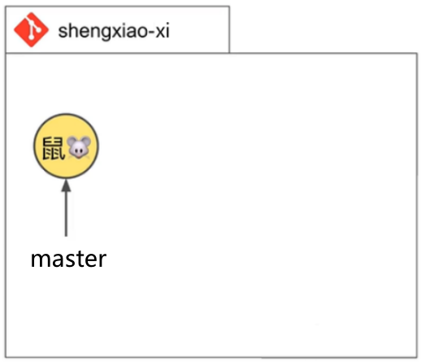
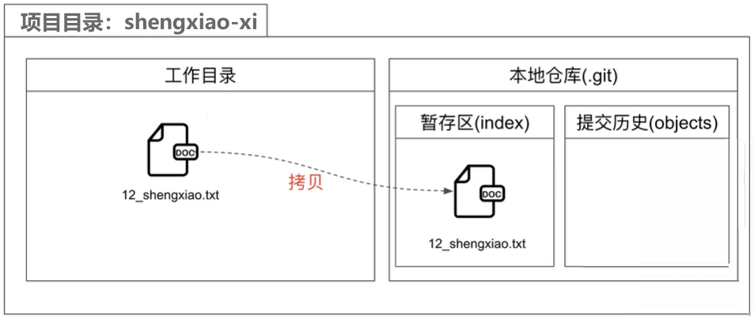
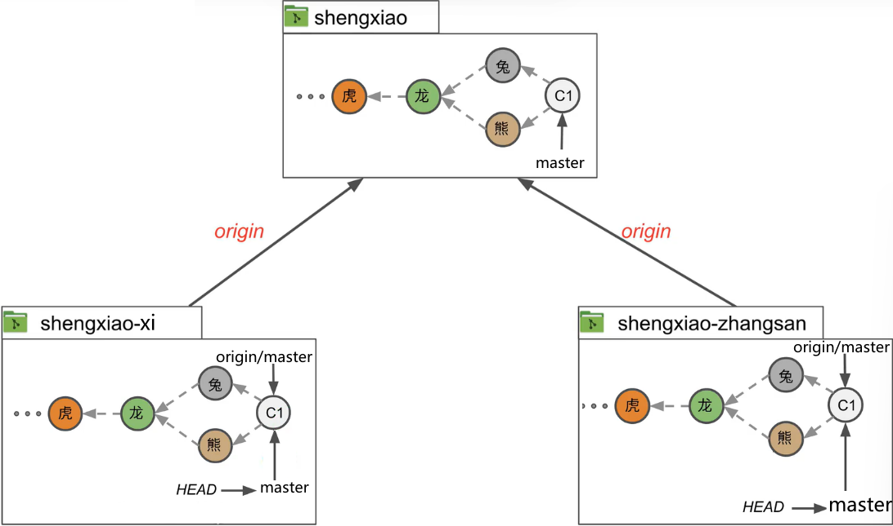
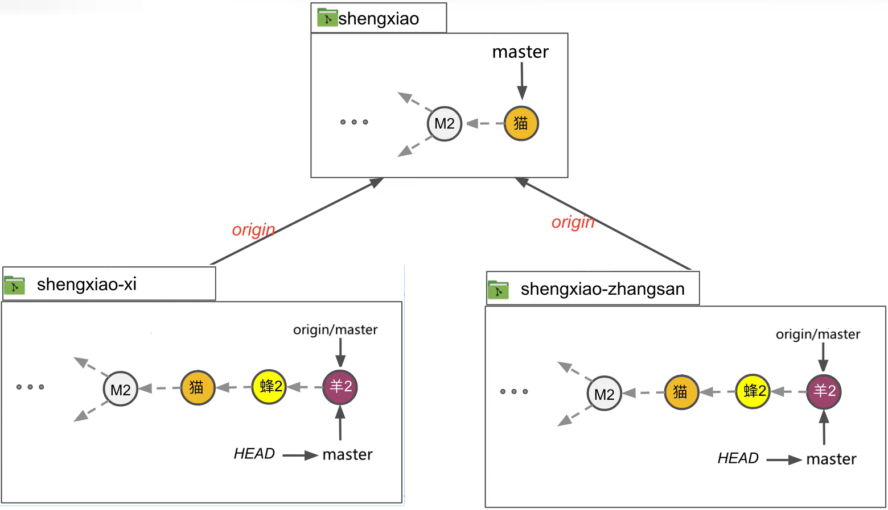

# 起步

## 环境设置

### 配置一些Gt配置变量

设置`user.name`和`user.email`全局Git配置变量

命令

- `git config --global --list`
  - 列出全局Git配置文件中的变量和值
- `git config-global user.name “<name>”`
  - 在全Gt配置文件中设置你的名字
- `git config-global user.email “<email>”`
  - 在全局Git配置文件中设置你的email地址

## 本地仓库(Repository)

**仓库**(repository/repo)：表示受git版本控制的一个项目目录

- 本地仓库(Local Repository)
- 远程仓库(Remote Repository)）
  GitHub/GitLab/Bitbucket

教程前半部分学习本地仓库，后半部分引入远程仓库

### 初始化本地仓库

`git init`：初始化一个Git仓库，创建一个`.git`文件
`git init -b <branch name>`：

- 初始化一个Git仓库，同时将初始分支设为`<branch_name>`
- `git init -b master`
- 全局配置项`init.defaultBranch`：设置默认分支名
  `git config --global init.defaultBranch <name> `

### git工作区


**工作目录(Working directory)**

- 项目文件/目录编辑区（增删改）
- 工作区(workbench)

**本地仓库(Local repository)**

**暂存区(Staging area)**

- 草稿区，可添加移除文件
- 由`index`文件表示，在暂存区至少添加一个文件时才会创建index文件

**提交历史(Commit History)**

- 什么是提交(commit)?
  - 项目的一个版本/快照(snapshot))
  - 包含针对这个提交的所有文件引用
  - 对应一个唯一的commit hash/commit ID,40个字符的hash值
- 保存所有提交历史记录的地方
- 保存在objects目录中

---

**操作：创建一个文件到工作目录**


- **未跟踪的文件(untracked file)**
  - 在工作目录中，未受Gt版本控制的文件
  - 未在暂存区和提交历史中
- **跟踪的文件(tracked file)**
  - 被添加到暂存区并进入提交历史的文件
  - 受Git版本控制的文件

## 提交(Commit)

**为什么要提交：**

- 避免工作成果丢失

**什么时候提交？**

- 取决于项目类型，个人团队，关键/非关键
- Git格言：commit early,.commit often。即尽早提交，尽可能多的提交

**两步提交流程：**

1. 将需要提交的文件添加到暂存区
2. 提交文件+提交消息

**添加到暂存区常用命令：**

- `git status`：查看工作目录和暂存区
- `git log`：查看目前已有提交命令
- `git add <filename>`：将一个文件添加到暂存区
- `git add <filename><filename>...`：将多个文件添加到暂存区
- `git add -A`：将多个修改（增/删/改）过的文件添加到暂存区，整个项目
- `git add .`：将多个修改（增/删/改）过的文件添加到暂存区，当前目录及其
  子目录
- `git commit -m <提交信息>`：提交

**演示：[添加并提交](##实操：添加到暂存区，并提交)**

`git log`：

- `git log`：只展示**当前所在分支**上的所有提交
- `git log --all`：以逆时间序，展示**本地仓库中的所有分支**上的提交
- 包括：
  - Commit Hash
  - 作者名和email地址
  - 提交的日期时间
  - 提交消息
  - HEAD

## 分支(Branch)

### 介绍


**什么是分支？**

- 多条开发线(lines of development)支持多人合作
- 每个分支表示项目的一个独立版本
- 常用模式：主分支(main/master)+主题(topic)/功能(feature)分支
- 主题/功能分支通常是短期的，最终被合并入主分支后删除
- 合并有两种方式：merging or rebasing(后续讲解)

**分支是指向提交(commit)的可移动指针：**

 

在.git的head目录中可以看到master分支，heads中的每一个文件表示一个本地分支，其中是对最新提交的引用

### 被跟踪文件的状态

**工作目录中已被Git跟踪的文件可可以有两种状态：Unmodified files 和 Modified files**

- Unmodified files：自上次提交后未被修改过的文件
- Modifiedfiles：自上次提交后又被修改的文件
- 通过`git status`查看工作目录和暂存区状态，可展示哪些`modifiedfiles`还未被添加到暂存区

### 命令-新建分支

- `git branch`：列出本地分支
- `git branch <new_branch_name>`：创建个分支

**演示：[新建分支](##实操：查看并新建分支)**

**什么是HEAD？**

- **指向当前你所在分支的指针**
- 惯例全大写
- 可通过`git log`或`git branch`查看
- `HEAD`和`heads(.git>refs>heads)`目录不同，heads目录中存放的是本地有分支的指针

当前状态(对应[实操：查看并新建分支](##实操：查看并新建分支)操作完成后)：


### 命令-切换分支

- `git switch <branch_name>`：切换分支。>=2.23版本
- `git checkout <branch_name>`：切换分支+额外工作(检出提交)

**切换分支实质上做了三个事情：**

1. 将HEAD指向目标分支
2. 使用和目标分支相对应的提交快照填充暂存区
3. 将暂存区内容拷贝到工作目录

**演示：[switch 切换分支](##实操：切换分支并修改文件提交)**

切换分支会改变工作目录的内容

### 命令-创建分支的同时切换到分支

- `git switch -c <new branch name>`：创建并同时切换到分支
- `git checkout -b <new branch name>`：创建并同时切换到分支

### Git保护未提交的分支

**Git如何防止未提交的变更丢失?**

**如果切换前，当物工作目录中已经有变更的内容，并且还没有提交，怎么办？**

- **Git会保护未提交的内容**——阻止切换，给出错误提示
- 只有在**未提交的内容和要切换到的目标分支有冲突时**才会**阻止**切换

**演示：[Git会保护未提交的内容](##实操：切换分支(有内容变更,受保护))**

### 命令-删除本地分支

`git branch -d <branch name>`：删除一个本地分支

**演示：[删除本地分支](####3.2 删除本地分支)**

### 定义上有分支的快捷方式

- `git branch u <shortname>/<branch_name>`：指定连接名对应的上游分支
- `git push --set-upstream <shortname> <branch_name>`：在push推送的同时指定上有分支
- `git push -u <shortname> <branch_name>`：在push推送的同时指定上有分支，在功能上和`--set-upstream`一样

## 合并(Merging)

### 合并的概念

- **合并**就是将一个分支的变更集成到另外一个分支中去
- **源分支：**包含有变更，要被合并到另外一个分支的分支
- **目标分支：**接收变更，合并后内容发生改变的分支
- 合并时，先要切换到目标分支


### 合并方式

**将一个分支的变更集成到另外一个分支的两种方式：**

- 合并(Merging)
- 变基(Rebasing)

**两种合并方式：**

- **快进合并**(fast-forward merge)
- **[三方合并](##三方合并(Three Way Merges))**(three-way merge)
  更复杂，可能会产生冲突
- **两者之间的差异**
  区别在于两个分支的开发历史**是否出现了分叉**(diverge)(一个分支的开发历史可以通过父链追溯)。

**快速合并示意图(无分叉)：**


**三方合并示意图(有分叉)：**


### **合并分支-快进合并**

`git merge <branch_name>`：将源分支的变更集成到目标分支中

**步骤：**

1. 切换到目标分支
2. 使用`git merge`命令，传入源分支作为参数

**演示：[合并分支-快进合并](##实操：分支合并-快进合并)**

### 命令-检出提交

**将HEAD指向commit而不是指向分支，不建议使用**

`git checkout <commit hash>`

- 检出提交(checkout commit)
- 进入`detached HEAD`(不存在的，没有分支的分支) 状态（**不推荐**）
- 可用于查看任意commit或项目版本的内容
- **推荐**创建分支+切换分支

**步骤（和switch branch切换分支类似）：**

1. 将HEAD指向指定的commit
2. 使用和目标commit相对应的提交快照填充暂存区
3. 将暂存区内容拷贝到工作目录

**演示：[检出提交](##实操：检出提交)**

变更分支通常会改变工作目录中的内容

## 创建+推送远程仓库

### 使用Git开始项目的两种方式

**使用Git开始项目的两种方式：**

- 从本地仓库开始
- 从远程仓库开始

**步骤：**

在GitHub上创建个人访问令牌(Personal Access Token)

1. 在GitHub上创建远程仓库`shengxiao`
2. 在本地和远程仓库之间建立连接
3. 将数据从本地推(push)到远程仓库

**注意：**

- 本地和远程仓库之间相互独立
- 两者之间的交互不会自动发生
- 两者之间的数据同步需通过命令执行

**从本地仓库开始：**


**从远程仓库开始：**


### 远程仓库的作用

- 将本地数据**备份**到远程服务器
- 从**多台**计算机上访问Git项目
- 和他人**协作**开发Git项目

### 命令-在本地和远程仓库之间建立连接

- `git remote add <shortname> <URL>`：将本地仓库连接到远程仓库
  - 连接名`<shortname>`,远程仓库地址`<URL>`
  - 后续通过引用`shortname`访问远程仓库，惯例命名为`origin`
  - 远程地址可以是HTTPS URL(案例中使用)或者SSH URL
  - 一个本地仓库可有多个到远程仓库的连接（不常见）
- `git remote`：**列出**本地到远程仓库的所有连接的**连接名**(`shortname`)
- `git remote -v`：**列出**本地到远程仓库的所有连接的**连接名和远程地址**`(shortname)+URLs`
- `git remote remove <shortname>`：根据连接名删除连接

**演示：[在本地和远程仓库之间建立连接](##实操：在本地和远程仓库之间建立连接)**

### 概念

- **分支(branch)**：指向提交(commit)的可移动指针
- **本地分支(local branch)**：在本地仓库中的分支
- **远程分支(remote branch)**：在远程仓库中的分支
  - 本地分支变化时，远程分支并不会自动变化，需要显式`push commits`
- **远程跟踪分支(remote-tracking branch)**：在本地仓库中的对远程分支所指向的提交(commit)的一个引用
- **上游分支(upstream branch)**：在本地和远程分支之间建立的跟踪关系，上游分支是本地分支指向的远程分支。
  - `git push/pull`时，如果上游分支已经设定，则不需要跟额外参数

### 命令-推到远程仓库

- `git push <shortname> <branch name>`：**推送**
  - 作用：
    将**本地分支`<branch name>`**中的内容**推到**和**`<shortname>`对应的远程分支**中
  - 步骤：
    - 在远程仓库中创建一个远程分支
    - 在本地仓库创建一个远程跟踪分支
  - 需求：联网
  - `git push -u <shortname> <branch name>`：设定上游分支
    这样就会记住上游分支，直接使用`git push`即可推送到记住的`<shortname>`和` <branch name>`
- `git branch --all`：列出所有本地分支+远程跟踪分支
- `git push --set-upstream <shortname> <branch_name>`：在push**推送的同时指定上有分支**
- `git push -u <shortname> <branch_name>`：在push**推送的同时指定上有分支**，在功能上和`--set-upstream`一样

**演示：[将master推送到远程分支](##实操：将master分支推送到远程分支)**

**演示：[将feature推送到远程分支](##实操：将feature分支推送到远程分支)**

eg：

- ` git push origin master`：将本地master分支推送到远端仓库origin的master分支
- `git push origin master:main`： 将本地master推送到远程仓库origin的main分支

### 修改远程仓库的两种方式

1. 先修改本地仓库，再推到远程仓库
2. 直接在GitHub上通过界面修改
   - 提交/创建远程分支/通过pull request合并分支
   - 具体参考官方文档

## 克隆(cloning)+拉取(Fetching)

**演示：[模拟两人协作开发(快进合并)](##实操：模拟两人协作开发(快进合并))**

### 命令-克隆远程仓库

`git clone <URL> <directory_name>`

**步骤：**

- 在当前目录中创建一个项目目录
- 初始化一个本地仓库
- 从远程仓库下载所有的数据
- 在本地和远程仓库之间建立一个连接（缺省shortname是origin)

**注意：**如果不指定directory._name(目录名)，那么将采用远程的项目目录名

### 命令-删除分支(本地及远端)

- `git push <shortname> -d <branch name>`
  - **删除**一个**远程分支和本地相关联的远程跟踪分支**
  - **也可以GitHub.界面操作**，但是并**不删除本地的远程跟踪分支**
- `git branch -d <branch name>`：**删除**一个**本地分支**
- `git fetch -p`
  - **删除本地的远程跟踪分支**，其在远程仓库中对应的分支已经被删除时使用
  - `-p`表示prune(修剪)

**注意：**删除某个本地分支前需切换到另外一个本地分支

**演示：**

1. **[删除远程分支及和本地相关联的分支](####3.1 删除远程分支及和本地相关联的分支)**
2. **[删除本地分支](####3.2 删除本地分支)**
3. **[远程对应分支已被删除时删除本地的远程跟踪分支](####3. 远程对应分支已被删除时删除本地的远程跟踪分支)**

**删除分支说明：**

- **目的：**保持项目结构清析
- **删除某个分支前，需确保：**
  - 该分支上的新内容已经被合并到另外一个分支
  - 或者已不需要该分支上的新内容
- **如果删除了**一个**包含新提交的分支**，这些**新提交**并**不会被删除**，它们仍然在提交历史中，**只是没有**易于访问的**分支引用**
- **要完全删除一个分支**，需要同时删除：
  - 远程分支(remote branch)
  - 远程跟踪分支(remote-tracking branch)
  - 本地分支(local branch)

### 命令-查看本地和上游分支关系

- `git branch -vv`
  - 列出本地分支是否定义了上游分支
  - 同时显示本地是提前还是落后于上游分支
- 建立上游分支关系后，`git push`命令不需要传额外参数
- 如果本地仓库是从远程`clone`的，那么上游分支关系会自动建立

**演示：[查看本地和上游分支关系](####5. 查看本地和上游分支关系)**

### 命令-从远程分支拉取变更

- `git fetch <shortname>`：从`<shortname>`对应的远程仓库中拉取数据
- `git fetch`：从shortname 为`origin`对应的远程仓库中拉取数据

`git fetch`只影响远程跟踪分支，并不影响本地分支（并不自动集成进本地)

**演示：[模拟两人协作开发(快进合并)](##实操：模拟两人协作开发(快进合并))**

## 三方合并-无冲突(Three Way Merges)

本地分支和远端分支有分叉时会进行三方合并

1. `git fetch`：从远端拉取
2. `git merge origin/master`，输入`:wq`保存：将origin/master合并到当前本地所在分支

**演示：[三方合并无冲突](##实操：三方合并无冲突)**

- 三方合并(Three-Way Merge)
- 为本地分支设定上游分支(upstream branch)
- `Pull`拉取&合并


### 三方合并示意图(有分叉)


### 命令-设定上游分支

`git branch -u <shortname>/<branch-name>`

- **为当前本地分支设定上游分支**
- **设定后**，`git push/pull`时无需指定远程分支名
- `git clone`时**自动设定**上游分支

**演示：[设定上游分支](####xi准备三方合并-无冲突场景)**

### 命令-查看提交的父提交

`git cat-file -p 提交id前n位`

**演示：[查看提交的父提交](###张三执行三方合并-无冲突)**

### 命令-pull拉取&合并

- `git pull <shortname> <branch_name>`
  - 从和`shortname`对应的远程仓库的`branch_name`分支中，**拉取变更并合并**入本地当前分支
- `git pull`
  - **如果**和本地当前分支**对应的上游分支已经设定**，那么**拉取变更并合并入**本地当前分支
- **fetch和pull该如何选择？**
  - 如果本地和远程分支**没有分叉**，则使用**`git pull`进行快进合并**
  - **否则**分两步合并，**先`git fetch`拉取**，**然后视情况做**`merge(--no-rebase) or rebase(--rebase)`
  - 本文档只在满足快进合并条件时才用`git pull`


> 建议：**满足快进合并的条件下使用`git pull`拉取合并，否则使用`git fetch`拉取+`merge(--no-rebase) or rebase(--rebase)`**

**演示：[fetch合并](###张三执行三方合并-无冲突)**

**演示：[pull合并](###xi拉取并快进合并`pull`)**

**演示：[三方合并无冲突](##实操：三方合并无冲突)**

## 三方合并-有冲突(Merge Conflicts)


演示带有冲突(Conflicts)的三方合并(Three-Way Merge)

### 合并冲突(Merge Conflicts)

- 原因，在不同的分支上：
  - 两人对**同一（或多个）**文件的**相同部分**进行了修改
  - 一人**删除**了文件，另一人**修改**了同一文件
- Merge合并和Rebase变基过程中都可能发生合并冲突
- 解决合并冲突是Git工作流程的一部分
- 两步流程
  1. 合并-编辑+保存
  2. 添加到暂存区+提交
- 建议**尽早合并**

**演示：[三方合并有冲突](##实操：三方合并有冲突)**

## 变基(Rebase)

 

- 演示变基(rebase)+冲突解决
- 变基过程的五个步骤

### 什么是变基？

- 三方合并→非线性历史
- 有些团队或个人希望维持**线性的**项目提交历史→简单清晰
- **变基可以维持线性提交历史**
- **命令**：`git rebase <branch_name>`
  - **在另外一个分支上重新应用当前分支上的新提交**

**注意⚠：变基会产生新提交，改变提交历史**


> **上图含义：**
>
> - 蓝色圆圈：当前分支的提交
> - 黄色圆圈：另一分支的提交
> - 红色圆圈：新的提交

### 变基

**命令：**

- `git rebase --continue`：解决冲突后继续变基过程
- `git rebase --abort`：撤销并回到变基前的状态，撤销变基

**变基过程的五个步骤:**

1. 找到共同祖先
2. 暂存要变基的分支信息
3. 重置HEAD
4. 应用+提交变更
5. 切换到变基后的分支

**变基+合并冲突：**

- 冲突时需人工介入（类似三方合并）
  - 对同一文件的相同部分的变更
  - 一删一改
- 可能会有**多次**冲突
- 每次解决冲突，添加到暂存区（**无需提交**），继续或撤销变基过程

**变基的黄金法则：**

- 不要对他人可能已基于其工作的分支进行rebase
- 可rebase的情况
  - 你的本地分支还未被推到远程仓库
  - 你的本地分支已经被推到远程仓库，但是你100%确信其他人还没有在这个分支上工作/贡
    献

## 合并请求(Pull Request)

合并清求(Pull Requests)

- 是一种协作开发方式
- 通过远程仓库，将一个分支的变更集成到另外一个分支

穿插介绍定义上游分支的快捷方式

### 合并请求(Pull Request)介绍

- **Pull Request(合并请求)**是一种在代码托管平台上提交代码的方式，方便你将分支上的工作分享给协作者，收集反馈，最终将代码合并到项目中。
- Pull Request能方便地进行代码审查，**促进团队沟通和协作**。它具有评论功能，允许协作者对代码的具体行添加评论、回复讨论，帮助更有序地完成代码审核。
- 代码托管平台支持的功能，非Git支持的功能
  - Github/Bitbucket→Pull Request
  - GitLab→merge request
- Pull Request合并支持Merge和Rebase，**缺省是Merge(non-fast-forward/explicit merge)**,所以中文翻译为**合并请求**
- 目前**主流的**企业级Gt协作开发方式
- `pull Request`的`pull`和`git pull`没有关系

### Pull Request流程

**步骤：**

1. 在本地创建分支
2. 在本地分支上工作+提交
3. Push推到远程仓库
4. 在远程代码托管平台上创建(open)pull request
5. 请求另一个人评审+收集反馈
6. 评审通过则合并请求，否则拒绝
   - 合并可能会有冲突，可以在远程解决，建议本地解决
   - 企业定制流程，例如本人不能approve,合并后触发CI/CD
7. 删除远程分支
8. 在本地同步远程仓库(pull拉取合并)，删除本地分支和远程跟踪分支

# 实操

## 准备

创建了`shengxiao`项目目录，在目录下创建`shengxiao-xi`文件夹

将`shengxiao-xi`项目目录转成一个Git仓库(Repository)

```shell
git init
```

向`shengxiao-xi`项目目录中添加第一个文件`12_shengxiao.txt`

向`12_shengxiao.txt`文件中追加第一行文本：`十二生肖中的第一个，生肖是鼠🐀`

## 实操：添加到暂存区，并提交

将文件添加到暂存区，并提交

```shell
git add 12_shengxiao.txt # 将文件添加到暂存区
```



```shell
git commit -m "鼠" # 提交文件
```


```shell
$ git log # 查看目前已有提交命令
commit 919ba9822d00687c80d504409c4731f56f0981de (HEAD -> master)
Author: xi <1302344595@qq.com>
Date:   Mon Feb 24 20:45:02 2025 +0800

    鼠
```

**当前仓库状态：**


## 实操：修改并提交

修改文件`12_shengxiao.txt`，在后面新增`十二生肖中的第二个，生肖是牛🐂`，并提交该文件

```shell
# 修改txt文件后
$ git status # 查看状态
On branch master
Changes not staged for commit:
  (use "git add/rm <file>..." to update what will be committed)
  (use "git restore <file>..." to discard changes in working directory)
        modified:   12_shengxiao.txt # 发现该文件被修改
```

```shell
git add 12_shengxiao.txt # 添加到暂存区
```

```shell
$ git commit -m "牛" # 提交
[master a4c51fa] 牛
 1 file changed, 2 insertions(+), 1 deletion(-)

xi@130com MINGW64 /d/workspace/stuspace/Other/GitWorkSpace/shengxiao/shengxiao-xi (master)
$ git log # 查看提交记录
commit a4c51fae9438622509380e3ea676b5acafbb0681 (HEAD -> master)
Author: xi <1302344595@qq.com>
Date:   Mon Feb 24 21:08:16 2025 +0800

    牛

commit 919ba9822d00687c80d504409c4731f56f0981de
Author: xi <1302344595@qq.com>
Date:   Mon Feb 24 20:45:02 2025 +0800

    鼠
```

**当前仓库状态：**


上图中

- 灰色虚线箭头表示父链接（后续进一步讲解）可视化提交历史
- 黑色实线箭头表示分支指针

## 实操：查看并新建分支

```shell
$ git branch # 查看当前分支
* master
$ git branch feature # 添加一个分支，叫做 feature
$ git branch
  feature
* master # 带有*号，是当前所在分支
$ git log # 查看当前提交记录
commit a4c51fae9438622509380e3ea676b5acafbb0681 (HEAD -> master, feature) # HEAD 指向 master
Author: xi <1302344595@qq.com>
Date:   Mon Feb 24 21:08:16 2025 +0800

    牛

commit 919ba9822d00687c80d504409c4731f56f0981de
Author: xi <1302344595@qq.com>
Date:   Mon Feb 24 20:45:02 2025 +0800

    鼠

```

**当前仓库状态：**

 

## 实操：切换分支并修改文件提交

### 切换分支

```shell
$ git branch # 查看当前分支
  feature
* master

$ git switch feature # 切换到 feature 分支
Switched to branch 'feature'
D       23_shengxiao.txt

$ git branch # 查看当前分支
* feature
  master

$ git log # 查看提交记录
commit a4c51fae9438622509380e3ea676b5acafbb0681 (HEAD -> feature, master) # HEAD 指向 feature
Author: xi <1302344595@qq.com>
Date:   Mon Feb 24 21:08:16 2025 +0800

    牛

commit 919ba9822d00687c80d504409c4731f56f0981de
Author: xi <1302344595@qq.com>
Date:   Mon Feb 24 20:45:02 2025 +0800

    鼠
```

**当前仓库状态：**

 

`.git/HEAD`文件：HEAD指向了feature分支

```tex
ref: refs/heads/feature
```

### 修改文件进行提交

实操：向文件中追加`十二生肖中的第三个，生肖是虎🐅`

```shell
# 修改txt文件后
$ git add 12_shengxiao.txt # 添加到暂存区

$ git commit -m "虎" # 提交文件
[feature 3fdc0ed] 虎
 1 file changed, 2 insertions(+), 1 deletion(-)
 
$ git log # 查看提交记录
commit 3fdc0ed9e41be1bb8f66c463e3ba03d03fb82fae (HEAD -> feature) # 当前在feature分支
Author: xi <1302344595@qq.com>
Date:   Mon Feb 24 21:45:37 2025 +0800
    虎

commit a4c51fae9438622509380e3ea676b5acafbb0681 (master) # master分支还指向牛
Author: xi <1302344595@qq.com>
Date:   Mon Feb 24 21:08:16 2025 +0800
    牛

commit 919ba9822d00687c80d504409c4731f56f0981de
Author: xi <1302344595@qq.com>
Date:   Mon Feb 24 20:45:02 2025 +0800
    鼠

$ git branch
* feature # 当前指向 feature 分支
  master
```

**当前仓库状态：**


## 实操：切换分支(有内容变更,受保护)

**演示Git会保护未提交的分支的内容**

在feature分支修改文件，在后面追加：`十二生肖中的第四个，生肖是兔🐇`文本

```shell
# 修改feature分支的文件后
$ git status
On branch feature
Changes not staged for commit:
  (use "git add/rm <file>..." to update what will be committed)
  (use "git restore <file>..." to discard changes in working directory)
        modified:   12_shengxiao.txt # 修改过的文件
 
# 切换到master分支  被阻止
$ git switch master
error: Your local changes to the following files would be overwritten by checkout: #  被阻止切换
        12_shengxiao.txt
Please commit your changes or stash them before you switch branches.
Aborting
```

**撤销修改：**

手动将修改的内容恢复没有追加兔子前,方便后续演示，其文本内容为：

```shell
十二生肖中的第一个，生肖是鼠🐀 # master 和 feature 分支共有
十二生肖中的第二个，生肖是牛🐂 # master 和 feature 分支共有
十二生肖中的第三个，生肖是虎🐅 # 该行是feature分支独有的
```

**当前项目目录情况：**


## 实操：切换分支

**切换分支(查看工作目录内容变化)：**

```shell
$ git switch master # 切换到 master 分支 切换成功，原因修改已被撤回
Switched to branch 'master'
D       12_shengxiao.txt
```

**当前工作目录情况：**


## 实操：命令`git log`

```shell
$ git log # 只展示当前所在分支上的提交
commit a4c51fae9438622509380e3ea676b5acafbb0681 (HEAD -> master)
Author: xi <1302344595@qq.com>
Date:   Mon Feb 24 21:08:16 2025 +0800

    牛

commit 919ba9822d00687c80d504409c4731f56f0981de
Author: xi <1302344595@qq.com>
Date:   Mon Feb 24 20:45:02 2025 +0800

    鼠
$ git log --all # 展示本地仓库所有分支上的提交
commit 3fdc0ed9e41be1bb8f66c463e3ba03d03fb82fae (feature)
Author: xi <1302344595@qq.com>
Date:   Mon Feb 24 21:45:37 2025 +0800

    虎

commit a4c51fae9438622509380e3ea676b5acafbb0681 (HEAD -> master)
Author: xi <1302344595@qq.com>
Date:   Mon Feb 24 21:08:16 2025 +0800

    牛

commit 919ba9822d00687c80d504409c4731f56f0981de
Author: xi <1302344595@qq.com>
Date:   Mon Feb 24 20:45:02 2025 +0800

    鼠
```

## 实操：分支合并-快进合并

```shell
$ git merge feature # 当前位置在master 与 feature 分支进行合并
Updating a4c51fa..3fdc0ed
Fast-forward # 快进合并 原因：提交在同一条链上，见上图提交历史
 12_shengxiao.txt | 3 ++-
 1 file changed, 2 insertions(+), 1 deletion(-)
 
$ git log # 查看提交日志
commit 3fdc0ed9e41be1bb8f66c463e3ba03d03fb82fae (HEAD -> master, feature) # 发现master和feature分支都指向最后一次提交虎
Author: xi <1302344595@qq.com>
Date:   Mon Feb 24 21:45:37 2025 +0800

    虎

commit a4c51fae9438622509380e3ea676b5acafbb0681
Author: xi <1302344595@qq.com>
Date:   Mon Feb 24 21:08:16 2025 +0800

    牛

commit 919ba9822d00687c80d504409c4731f56f0981de
Author: xi <1302344595@qq.com>
Date:   Mon Feb 24 20:45:02 2025 +0800

    鼠

```

**当前项目目录情况：**


## 实操：检出提交

将HEAD指向commit而不是指向分支，不建议使用

```shell
$ git log # 查看提交记录
commit 3fdc0ed9e41be1bb8f66c463e3ba03d03fb82fae (HEAD -> master, feature)
Author: xi <1302344595@qq.com>
Date:   Mon Feb 24 21:45:37 2025 +0800

    虎

commit a4c51fae9438622509380e3ea676b5acafbb0681 # 这是牛的commit标识
Author: xi <1302344595@qq.com>
Date:   Mon Feb 24 21:08:16 2025 +0800

    牛 # 准备切换到此次提交，注意commit后的编号，可以唯一标识即可

commit 919ba9822d00687c80d504409c4731f56f0981de
Author: xi <1302344595@qq.com>
Date:   Mon Feb 24 20:45:02 2025 +0800

    鼠

$ git checkout a4c51 # 检出提交
Note: switching to 'a4c51'. # 可以唯一标识一个commit，使用前几位数即可

You are in 'detached HEAD' state. You can look around, make experimental # 提示进入'detached HEAD'状态
changes and commit them, and you can discard any commits you make in this
state without impacting any branches by switching back to a branch.
# 你处于“分离的头脑”状态。你可以环顾四周，做一个实验性的“分离头”
# 更改并提交它们，您可以丢弃在此中所做的任何提交状态，
# 而不会通过切换回分支来影响任何分支。

If you want to create a new branch to retain commits you create, you may
do so (now or later) by using -c with the switch command. Example:
# 如果您想创建一个新的分支来保留您创建的提交，您可以这样做
# 通过在switch命令中使用-c来执行此操作（现在或以后）。例子:
  git switch -c <new-branch-name>

Or undo this operation with:
# 或使用以下命令撤消此操作：

  git switch -

Turn off this advice by setting config variable advice.detachedHead to false
# 通过将配置变量advice. detachedhead设置为false来关闭此通知
HEAD is now at a4c51fa 牛
D       23_shengxiao.txt
```

**当前项目目录情况：**


此时HEAD指向`commit a4c51fae9438622509380e3ea676b5acafbb0681`牛这个提交，不属于任何分支。

**然后，切换到master分支：**

```shell
git switch master
```

**当前项目目录情况：**


## 远程仓库准备

1. 创建github账号
2. 创建个人访问令牌(Personal Access Token)

**目前本地和远程仓库情况：**


## 实操：在本地和远程仓库之间建立连接

**与远程仓库建立连接前`config`：**


```shell
$ git remote # 列出远程分支
# 目前没有远程分支，所以没有列出来
$ git remote add origin https://github.com/ZC-Wu-Xi/shengxiao.git # 添加远程仓库，远程仓库名为origin 使用的http建立的，也可以使用ssh
$ git remote # 列出远程分支名
origin
$ git remote -v # 列出远程分支名和远程仓库地址
origin  https://github.com/ZC-Wu-Xi/shengxiao.git (fetch)
origin  https://github.com/ZC-Wu-Xi/shengxiao.git (push)
```

**与远程仓库建立连接后`config`：**


**目前本地与远程仓库情况：**


## 实操：将master分支推送到远程分支

在前面我们已经添加了远程分支

**push前：**


```shell
$ git push origin master # 将本地master推送到远程仓库origin的master分支，没有:时本地分支和远程分支都是上面的master
# $ git push origin master:main # 将本地master推送到远程仓库origin的main分支
Enumerating objects: 9, done.
Counting objects: 100% (9/9), done.
Delta compression using up to 12 threads
Compressing objects: 100% (8/8), done.
Writing objects: 100% (9/9), 817 bytes | 272.00 KiB/s, done.
Total 9 (delta 1), reused 0 (delta 0), pack-reused 0 (from 0)
remote: Resolving deltas: 100% (1/1), done.
To https://github.com/ZC-Wu-Xi/shengxiao.git
 * [new branch]      master -> master
$ git branch # 查看本地分支
  feature
* master
$ git branch --all # 查看本地分支和远程跟踪分支
  feature
* master
  remotes/origin/master

```

**push后：**多了`.git/refs/remotes/origin/master`文件


**目前本地和远程仓库情况：**


## 实操：将feature分支推送到远程分支

```shell
$ git switch feature # 切换到 feature 分支
Switched to branch 'feature'
$ git push git@github.com:ZC-Wu-Xi/shengxiao.git feature # 将feature推送到远端的不存在的分支feature(远端会自动创建feature分支)中，使用ssh连接

Total 0 (delta 0), reused 0 (delta 0), pack-reused 0 (from 0)
remote:
remote: Create a pull request for 'feature' on GitHub by visiting:
remote:      https://github.com/ZC-Wu-Xi/shengxiao/pull/new/feature
remote:
To github.com:ZC-Wu-Xi/shengxiao.git
 * [new branch]      feature -> feature
```

**目前本地和远程仓库情况：**


## 实操：模拟两人协作开发(快进合并)

模拟两人协作开发

- **[张三]克隆(cloning)**远程仓库（自动关联上游分支）
- **[张三]**如何**删除**远程+本地**分支**
- **[张三]添加提交生肖龙🐉并push**到远程仓库
- **[xi]**从远程仓库**拉取(fetching)**张三变更的数据
- **[xi]将变更集成到本地分支（快进合并）**
- **[xi]裁剪(删除)本地有而远端没有的远程跟踪分支**

两个协作者，每个都有自己的本地仓库，每个将代码贡献到远程仓库

本案例使用同一台计算机的两个不同目录来模拟两个本地仓库

- shengxiao-xi
- shengxiao-zhangsan

建议：两个IDE+终端窗口


### 张三

#### 1. clone克隆

```shell
$ git clone git@github.com:ZC-Wu-Xi/shengxiao.git # 直接克隆，创建的项目名为github上的项目名
Cloning into 'shengxiao'...
remote: Enumerating objects: 9, done.
remote: Counting objects: 100% (9/9), done.
remote: Compressing objects: 100% (7/7), done.
remote: Total 9 (delta 1), reused 9 (delta 1), pack-reused 0 (from 0)
Receiving objects: 100% (9/9), done.
Resolving deltas: 100% (1/1), done.
```

发现克隆后的文件目录为`shengxiao`：
 

删除克隆的文件重新克隆，张三想要将clone后的文件名为`shengxiao-zhangsan`而不是github上的项目名

```shell
$ git clone https://github.com/ZC-Wu-Xi/shengxiao.git shengxiao-zhangsan # clone，创建的项目名为shengxiao-zhangsan
Cloning into 'shengxiao-zhangsan'...
remote: Enumerating objects: 9, done.
remote: Counting objects: 100% (9/9), done.
remote: Compressing objects: 100% (7/7), done.
remote: Total 9 (delta 1), reused 9 (delta 1), pack-reused 0 (from 0)
Receiving objects: 100% (9/9), done.
Resolving deltas: 100% (1/1), done.
```

 克隆后的文件目录为`shengxiao-zhangsan`：

 

```shell
$ git remote -v # 列出本地到远程仓库的所有连接的连接名和远程地址
origin  https://github.com/ZC-Wu-Xi/shengxiao.git (fetch)
origin  https://github.com/ZC-Wu-Xi/shengxiao.git (push)
$ git branch --all # 查看所有分支
* master
  remotes/origin/HEAD -> origin/master
  remotes/origin/feature
  remotes/origin/master
  
$ git log # 查看提交日志
commit 3fdc0ed9e41be1bb8f66c463e3ba03d03fb82fae (HEAD -> master, origin/master, origin/feature, origin/HEAD)
Author: xi <1302344595@qq.com>
Date:   Mon Feb 24 21:45:37 2025 +0800

    虎

commit a4c51fae9438622509380e3ea676b5acafbb0681
Author: xi <1302344595@qq.com>
Date:   Mon Feb 24 21:08:16 2025 +0800

    牛

commit 919ba9822d00687c80d504409c4731f56f0981de
Author: xi <1302344595@qq.com>
Date:   Mon Feb 24 20:45:02 2025 +0800

    鼠
```

**目前本地和远程仓库情况：**


**说明：**

- `origin/HEAD`指向当前所在分支(master)
- 克隆项目`shengxiao-zhangsan`自动具有缺省 shortname 为 origin。
  不需要使用命令`git remote add <shortname> <URL>`
- `shengxiao-xi`项目当前分支为`feature`，`shengxiao-zhangsan`项目当前分支为`master`
- **`shengxiao-zhangsan`中没有本地feature，但有远程跟踪分支feature**

#### 2. 切换到远程分支feature

`shengxiao-zhangsan`中没有本地feature，但有远程跟踪分支feature

```shell
$ git branch --all # 查看所有分支
* master
  remotes/origin/HEAD -> origin/master
  remotes/origin/feature
  remotes/origin/master
  
$ git switch feature # 切换到分支feature
Switched to a new branch 'feature'
branch 'feature' set up to track 'origin/feature'.

$ git branch --all # 查看所有分支
* feature # 发现多了一个本地的feature并且已切换到feature分支
  master
  remotes/origin/HEAD -> origin/master
  remotes/origin/feature
  remotes/origin/master

```

**目前本地和远程仓库情况：**


#### 3.1 删除远程分支及和本地相关联的分支

[命令-删除分支(本地及远端)](###命令-删除分支(本地及远端))

```shell
$ git branch --all # 查看所有分支
* feature
  master
  remotes/origin/HEAD -> origin/master
  remotes/origin/feature # 本地跟踪的feature
  remotes/origin/master
$ git push origin -d feature # 删除远端feature分支，同时删除本地跟踪的feature
To https://github.com/ZC-Wu-Xi/shengxiao.git
 - [deleted]         feature
$ git branch --all # 查看所有分支 发现本地的feature还在，但是本地跟踪的feature没有了
* feature
  master
  remotes/origin/HEAD -> origin/master
  remotes/origin/master
```

去github上看，发现远程仓库只有一个master分支，feature没有了

#### 3.2 删除本地分支

删之前需要切换到另一个分支上去

```shell
$ git switch master # 切换到另一个分支
Switched to branch 'master'
Your branch is up to date with 'origin/master'.
$ git branch -d feature # 删除feature分支
Deleted branch feature (was 3fdc0ed).
$ git branch --all # 查看所有分支
* master # 发现feature分支已被删除
  remotes/origin/HEAD -> origin/master
  remotes/origin/master
```

**目前本地和远程仓库情况：**


#### 4. 添加第四个生肖龙

txt文件追加：`十二生肖中的第四个，生肖是龙🐉`

```shell
# 追加文本后
$ git status # 查看状态
On branch master
Your branch is up to date with 'origin/master'.

Changes not staged for commit:
  (use "git add <file>..." to update what will be committed)
  (use "git restore <file>..." to discard changes in working directory)
        modified:   12_shengxiao.txt # 有一个文件被修改了

no changes added to commit (use "git add" and/or "git commit -a")
$ git add ./12_shengxiao.txt
$ git commit -m "龙"
[master b208b56] 龙
 1 file changed, 2 insertions(+), 1 deletion(-)
$ git log # 查看提交日志
commit b208b5640a38b38df6585ebb5a931862021e0b31 (HEAD -> master)
Author: xi <1302344595@qq.com>
Date:   Sat Mar 1 11:22:07 2025 +0800

    龙

commit 3fdc0ed9e41be1bb8f66c463e3ba03d03fb82fae (origin/master, origin/HEAD)
Author: xi <1302344595@qq.com>
Date:   Mon Feb 24 21:45:37 2025 +0800

    虎

commit a4c51fae9438622509380e3ea676b5acafbb0681
Author: xi <1302344595@qq.com>
Date:   Mon Feb 24 21:08:16 2025 +0800

    牛

commit 919ba9822d00687c80d504409c4731f56f0981de
Author: xi <1302344595@qq.com>
Date:   Mon Feb 24 20:45:02 2025 +0800

    鼠
```

**目前本地和远程仓库情况：**


#### 5. 查看本地和上游分支关系

```shell
$ git branch -vv # 查看本地和上游分支关系
* master b208b56 [origin/master: ahead 1] 龙 # 发现本地提前于上游分支origin/master一次提交"龙"

```

#### 6.张三将本地分支推到远程仓库

```shell
$ git push # 直接git push，因为clone下来的项目直接建立了远程跟踪关系，自动跟踪远端的上有分支
Enumerating objects: 5, done.
Counting objects: 100% (5/5), done.
Delta compression using up to 12 threads
Compressing objects: 100% (3/3), done.
Writing objects: 100% (3/3), 329 bytes | 329.00 KiB/s, done.
Total 3 (delta 1), reused 0 (delta 0), pack-reused 0 (from 0)
remote: Resolving deltas: 100% (1/1), completed with 1 local object.
To https://github.com/ZC-Wu-Xi/shengxiao.git
   3fdc0ed..b208b56  master -> master
$ git log
commit b208b5640a38b38df6585ebb5a931862021e0b31 (HEAD -> master, origin/master, origin/HEAD)
Author: xi <1302344595@qq.com>
Date:   Sat Mar 1 11:22:07 2025 +0800

    龙

commit 3fdc0ed9e41be1bb8f66c463e3ba03d03fb82fae
Author: xi <1302344595@qq.com>
Date:   Mon Feb 24 21:45:37 2025 +0800

    虎

commit a4c51fae9438622509380e3ea676b5acafbb0681
Author: xi <1302344595@qq.com>
Date:   Mon Feb 24 21:08:16 2025 +0800

    牛

commit 919ba9822d00687c80d504409c4731f56f0981de
Author: xi <1302344595@qq.com>
Date:   Mon Feb 24 20:45:02 2025 +0800
```

**目前本地和远程仓库情况：**


### xi

将远程分支的变换集成到本地：

1. 从远程分支**拉取**(fetch)变更
2. 将**变更集成到本地分支**

#### 1. `fetch`远程变更到`shengxiao-xi`本地仓库

```shell
$ git log --all
commit 3fdc0ed9e41be1bb8f66c463e3ba03d03fb82fae (HEAD -> feature, origin/master, master) # 跟远程仓库并不同步，目前在feature分支上
Author: xi <1302344595@qq.com>
Date:   Mon Feb 24 21:45:37 2025 +0800

    虎

commit a4c51fae9438622509380e3ea676b5acafbb0681
Author: xi <1302344595@qq.com>
Date:   Mon Feb 24 21:08:16 2025 +0800

    牛

commit 919ba9822d00687c80d504409c4731f56f0981de
Author: xi <1302344595@qq.com>
Date:   Mon Feb 24 20:45:02 2025 +0800

    鼠
$ git fetch # 因为xi在前面已经建立了origin连接了，所以不写连接名会直接从origin对应的连接中拉取数据
remote: Enumerating objects: 5, done.
remote: Counting objects: 100% (5/5), done.
remote: Compressing objects: 100% (2/2), done.
remote: Total 3 (delta 1), reused 3 (delta 1), pack-reused 0 (from 0)
Unpacking objects: 100% (3/3), 309 bytes | 30.00 KiB/s, done.
From https://github.com/ZC-Wu-Xi/shengxiao
   3fdc0ed..b208b56  master     -> origin/master
$ git log --all # 查看所有提交
commit b208b5640a38b38df6585ebb5a931862021e0b31 (origin/master)
Author: xi <1302344595@qq.com>
Date:   Sat Mar 1 11:22:07 2025 +0800

    龙

commit 3fdc0ed9e41be1bb8f66c463e3ba03d03fb82fae (HEAD -> feature, master) # 目前在feature分支上
Author: xi <1302344595@qq.com>
Date:   Mon Feb 24 21:45:37 2025 +0800

    虎

commit a4c51fae9438622509380e3ea676b5acafbb0681
Author: xi <1302344595@qq.com>
Date:   Mon Feb 24 21:08:16 2025 +0800

    牛

commit 919ba9822d00687c80d504409c4731f56f0981de
Author: xi <1302344595@qq.com>
Date:   Mon Feb 24 20:45:02 2025 +0800

    鼠
```

**目前本地和远程仓库情况：**


#### 2. 集成变更到本地分支

- 将`origin/master`**远程分支合并到本地**master分支(shengxiao-xi)
- 也是属于**[快进合并](###合并方式)**
- 需要**先切换到目标分支**(master)

```shell
$ git switch master # 切换到本地目标分支master
Switched to branch 'master'
$ git log --all # 查看当前提交记录
commit b208b5640a38b38df6585ebb5a931862021e0b31 (origin/master) # 合并这个
Author: xi <1302344595@qq.com>
Date:   Sat Mar 1 11:22:07 2025 +0800

    龙

commit 3fdc0ed9e41be1bb8f66c463e3ba03d03fb82fae (HEAD -> master, feature) # 本地当前在这里
Author: xi <1302344595@qq.com>
Date:   Mon Feb 24 21:45:37 2025 +0800

    虎

commit a4c51fae9438622509380e3ea676b5acafbb0681
Author: xi <1302344595@qq.com>
Date:   Mon Feb 24 21:08:16 2025 +0800

    牛

commit 919ba9822d00687c80d504409c4731f56f0981de
Author: xi <1302344595@qq.com>
Date:   Mon Feb 24 20:45:02 2025 +0800

    鼠
$ git merge origin/master # 合并，将远程的origin对应连接的master分支合并到当前分支
Updating 3fdc0ed..b208b56
Fast-forward # 快进合并
 12_shengxiao.txt | 3 ++-
 1 file changed, 2 insertions(+), 1 deletion(-)
$ git log # 查看当前提交记录
commit b208b5640a38b38df6585ebb5a931862021e0b31 (HEAD -> master, origin/master)
Author: xi <1302344595@qq.com>
Date:   Sat Mar 1 11:22:07 2025 +0800

    龙

commit 3fdc0ed9e41be1bb8f66c463e3ba03d03fb82fae (feature) # 发现远程跟踪分支origin/feature也消失了，可能是版本或配置原因，正常来说是不会自动裁剪掉对应远端没有的本地远程分支，需要我们自己裁剪
Author: xi <1302344595@qq.com>
Date:   Mon Feb 24 21:45:37 2025 +0800

    虎

commit a4c51fae9438622509380e3ea676b5acafbb0681
Author: xi <1302344595@qq.com>
Date:   Mon Feb 24 21:08:16 2025 +0800

    牛

commit 919ba9822d00687c80d504409c4731f56f0981de
Author: xi <1302344595@qq.com>
Date:   Mon Feb 24 20:45:02 2025 +0800

    鼠
```

**目前本地和远程仓库情况：**


#### 3. 远程对应分支已被删除时删除本地的远程跟踪分支

删除xi本地的远程跟踪分支`origin/feature`，该分支对应的远程分支origin连接上的feature已经被张三删除了

```shell
$ git fetch -p # 裁剪掉本地远程跟踪分支对应的分支在远端没有的该分支的本地远程跟踪分支
$ git log # 查看当前提交记录
commit b208b5640a38b38df6585ebb5a931862021e0b31 (HEAD -> master, origin/master)
Author: xi <1302344595@qq.com>
Date:   Sat Mar 1 11:22:07 2025 +0800

    龙

commit 3fdc0ed9e41be1bb8f66c463e3ba03d03fb82fae (feature)
Author: xi <1302344595@qq.com>
Date:   Mon Feb 24 21:45:37 2025 +0800

    虎

commit a4c51fae9438622509380e3ea676b5acafbb0681
Author: xi <1302344595@qq.com>
Date:   Mon Feb 24 21:08:16 2025 +0800

    牛

commit 919ba9822d00687c80d504409c4731f56f0981de
Author: xi <1302344595@qq.com>
Date:   Mon Feb 24 20:45:02 2025 +0800

    鼠
```


#### 4. 删除本地feature分支

```shell
$ git branch -d feature # 删除本地分支feature
Deleted branch feature (was 3fdc0ed).
$ git branch --all
* master
  remotes/origin/master
```

**目前本地和远程仓库情况：**


**目前本地和远程仓库简化视图：**


## 实操：三方合并无冲突

演示三方合并无冲突的情况

### 准备三方合并-无冲突场景

- xi在`shengxiao-xi`中添加文件`not_shengxiao.txt`并push到origin/master
- 张三在`shengxiao-zhangsan`中的`12_shengxiao.txt`中追加`十二生肖中的第五个，生肖是兔🐇`文本
- 张三准备push，push失败

#### xi准备三方合并-无冲突场景

**1. 新建文件并提交：**

`shengxiao-xi`中添加文件`not_shengxiao.txt`，在该文件中填充`熊🐻不是十二生肖的一个动物`文本

```shell
$ git add not_shengxiao.txt # 添加到暂存区
$ git commit -m "熊" # 提交
[master 842c337] 熊
 1 file changed, 1 insertion(+)
 create mode 100644 not_shengxiao.txt
$ git log # 查看提交日志，发现本地优先远程分支一次提交
commit 842c337a469a6951e599cca9b25d8f5a72d73e70 (HEAD -> master) # 本地
Author: xi <1302344595@qq.com>
Date:   Sat Mar 1 15:11:41 2025 +0800

    熊

commit b208b5640a38b38df6585ebb5a931862021e0b31 (origin/master) # 远程
Author: xi <1302344595@qq.com>
Date:   Sat Mar 1 11:22:07 2025 +0800

    龙

commit 3fdc0ed9e41be1bb8f66c463e3ba03d03fb82fae
Author: xi <1302344595@qq.com>
Date:   Mon Feb 24 21:45:37 2025 +0800

    虎

...

```

**当前视图：**


**2. 为master分支指定上游分支：**

```shell
$ git branch -vv # 查看本地和上游分支关系
* master 842c337 熊 # 没有上游分支
$ git branch -u origin/master # 为当前的本地分支建立上游分支为origin连接的master分支
branch 'master' set up to track 'origin/master'.
$ git branch -vv # 查看本地和上游分支关系
* master 842c337 [origin/master: ahead 1] 熊 # 发现成功建立上游分支
```

**3. `push`到远程仓库：**

```shell
$ git push # 推送到远程仓库
Enumerating objects: 4, done.
Counting objects: 100% (4/4), done.
Delta compression using up to 12 threads
Compressing objects: 100% (2/2), done.
Writing objects: 100% (3/3), 339 bytes | 339.00 KiB/s, done.
Total 3 (delta 0), reused 0 (delta 0), pack-reused 0 (from 0)
To https://github.com/ZC-Wu-Xi/shengxiao.git
   b208b56..842c337  master -> master
$ git log # 查看提交记录
commit 842c337a469a6951e599cca9b25d8f5a72d73e70 (HEAD -> master, origin/master)
Author: xi <1302344595@qq.com>
Date:   Sat Mar 1 15:11:41 2025 +0800

    熊

commit b208b5640a38b38df6585ebb5a931862021e0b31
Author: xi <1302344595@qq.com>
Date:   Sat Mar 1 11:22:07 2025 +0800

    龙

commit 3fdc0ed9e41be1bb8f66c463e3ba03d03fb82fae
Author: xi <1302344595@qq.com>
Date:   Mon Feb 24 21:45:37 2025 +0800

    虎
...
```

**当前视图：**


#### 张三准备三方合并-无冲突场景

```shell
$ git log
commit b208b5640a38b38df6585ebb5a931862021e0b31 (HEAD -> master, origin/master, origin/HEAD)
Author: xi <1302344595@qq.com>
Date:   Sat Mar 1 11:22:07 2025 +0800

    龙

commit 3fdc0ed9e41be1bb8f66c463e3ba03d03fb82fae
Author: xi <1302344595@qq.com>
Date:   Mon Feb 24 21:45:37 2025 +0800

    虎

commit a4c51fae9438622509380e3ea676b5acafbb0681
Author: xi <1302344595@qq.com>
Date:   Mon Feb 24 21:08:16 2025 +0800

    牛
...
```

张三在`shengxiao-zhangsan`的`shengxiao,txt`文件中追加`十二生肖中的第五个，生肖是兔🐇`文本

```shell
# 追加文本后
$ git add 12_shengxiao.txt # 添加到暂存区
$ git commit -m "兔" # 提交
[master 0934399] 兔
 1 file changed, 2 insertions(+), 1 deletion(-)
$ git log
commit 0934399711ab3b8c94b36ec8d70681354ae3a27c (HEAD -> master)
Author: xi <1302344595@qq.com>
Date:   Sat Mar 1 15:38:51 2025 +0800

    兔

commit b208b5640a38b38df6585ebb5a931862021e0b31 (origin/master, origin/HEAD)
Author: xi <1302344595@qq.com>
Date:   Sat Mar 1 11:22:07 2025 +0800

    龙

commit 3fdc0ed9e41be1bb8f66c463e3ba03d03fb82fae
Author: xi <1302344595@qq.com>
Date:   Mon Feb 24 21:45:37 2025 +0800

    虎
...
```

### 张三`git push`失败

```shell
$ git push # push被拒绝 本地和远程master分支产生了分岔
To https://github.com/ZC-Wu-Xi/shengxiao.git
 ! [rejected]        master -> master (fetch first)
error: failed to push some refs to 'https://github.com/ZC-Wu-Xi/shengxiao.git'
hint: Updates were rejected because the remote contains work that you do not
hint: have locally. This is usually caused by another repository pushing to
hint: the same ref. If you want to integrate the remote changes, use
hint: 'git pull' before pushing again.
hint: See the 'Note about fast-forwards' in 'git push --help' for details.
# 到https://github.com/ZC-Wu-Xi/shengxiao.git
# ！ [已拒绝]master -> master （fetch优先）
# 错误：未能将一些refs推到‘https://github.com/ZC-Wu-Xi/shengxiao.git’,更新被拒绝，因为远程包含您不需要的工作,提示：有本地。这通常是由于另一个存储库推送到相同的引用。如果要集成远程更改，请使用再推之前先拉一下。
```

**当前视图：**


### 张三执行三方合并-无冲突

**张三本地和远程master分支产生了分岔，**因此需要执行**三方合并：**

1. `git fetch`：从远端**拉取**
2. `git merge origin/master`，输入`:wq`保存：将origin/master**合并**到当前本地所在分支
3. `git push`：**推**到远端分支

**拉取+合并：**

```shell
$ git fetch # 拉取 拉取到了远端的熊
From github.com:ZC-Wu-Xi/shengxiao
 * [new branch]      master     -> origin/master

$ git merge origin/master # 合并
# 进入编辑这个文件的界面
# ----
Merge remote-tracking branch 'origin/master' # 这是默认的提交消息，可以修改
# Please enter a commit message to explain why this merge is necessary,
# especially if it merges an updated upstream into a topic branch.
#
# Lines starting with '#' will be ignored, and an empty message aborts
# the commit.
~
# ----
:wq # 输入的:wq，保存并退出
Merge made by the 'ort' strategy. # ort就是三方合并
 not_shengxiao.txt | 1 +
 1 file changed, 1 insertion(+)
 create mode 100644 not_shengxiao.txt
$ git log # 查看提交记录
commit 08a3a24191f544c34c5fd1e0c46115d5be53559a (HEAD -> master) # 提交
Merge: 0934399 842c337 # 合并，两个commit的Hash
Author: xi <1302344595@qq.com>
Date:   Sun Mar 2 00:19:25 2025 +0800

    Merge remote-tracking branch 'origin/master' # 这是三方合并的默认提交信息

commit 0934399711ab3b8c94b36ec8d70681354ae3a27c # 提交
Author: xi <1302344595@qq.com>
Date:   Sat Mar 1 15:38:51 2025 +0800

    兔

commit 842c337a469a6951e599cca9b25d8f5a72d73e70 (origin/master) # 远程的依然指向熊
Author: xi <1302344595@qq.com>
Date:   Sat Mar 1 15:11:41 2025 +0800

    熊

commit b208b5640a38b38df6585ebb5a931862021e0b31
Author: xi <1302344595@qq.com>
Date:   Sat Mar 1 11:22:07 2025 +0800

$ git cat-file -p 08a3a24 # 查看合并提交的父提交，08a3a24是合并提交记录的提交id前n位(只要能唯一标记即可)
tree 8ee27031be0523754c6a8b67d4f172945d3e4877
parent 0934399711ab3b8c94b36ec8d70681354ae3a27c # 可以看到本次提交有两个父亲，也就是根据这两个提交合并的
parent 842c337a469a6951e599cca9b25d8f5a72d73e70
author xi <1302344595@qq.com> 1740845965 +0800
committer xi <1302344595@qq.com> 1740845965 +0800
Merge remote-tracking branch 'origin/master'
```

**当前视图：**


**推送：**

```shell
# $ git push # 我这里push时显示没有设置上游分支，可能在前面某个地方没有整好
# fatal: The current branch master has no upstream branch.
# To push the current branch and set the remote as upstream, use
# 
#     git push --set-upstream origin master
To have this happen automatically for branches without a tracking
upstream, see 'push.autoSetupRemote' in 'git help config'.

$ git push --set-upstream origin master # 推送到上有分支，并设置上游分支为origin master
Enumerating objects: 9, done.
Counting objects: 100% (8/8), done.
Delta compression using up to 12 threads
Compressing objects: 100% (5/5), done.
Writing objects: 100% (5/5), 568 bytes | 568.00 KiB/s, done.
Total 5 (delta 2), reused 0 (delta 0), pack-reused 0 (from 0)
remote: Resolving deltas: 100% (2/2), completed with 1 local object.
To github.com:ZC-Wu-Xi/shengxiao.git
   842c337..08a3a24  master -> master
branch 'master' set up to track 'origin/master'.

$ git log
commit 08a3a24191f544c34c5fd1e0c46115d5be53559a (HEAD -> master, origin/master)
Merge: 0934399 842c337
Author: xi <1302344595@qq.com>
Date:   Sun Mar 2 00:19:25 2025 +0800

    Merge remote-tracking branch 'origin/master'

commit 0934399711ab3b8c94b36ec8d70681354ae3a27c
Author: xi <1302344595@qq.com>
Date:   Sat Mar 1 15:38:51 2025 +0800

    兔

commit 842c337a469a6951e599cca9b25d8f5a72d73e70
Author: xi <1302344595@qq.com>
Date:   Sat Mar 1 15:11:41 2025 +0800

    熊
...
```

**当前视图：**


### xi拉取并快进合并`pull`

`shengxiao-xi`这边：

```shell
$ git log
commit 842c337a469a6951e599cca9b25d8f5a72d73e70 (HEAD -> master, origin/master)
Author: xi <1302344595@qq.com>
Date:   Sat Mar 1 15:11:41 2025 +0800

    熊

commit b208b5640a38b38df6585ebb5a931862021e0b31
Author: xi <1302344595@qq.com>
Date:   Sat Mar 1 11:22:07 2025 +0800

    龙

commit 3fdc0ed9e41be1bb8f66c463e3ba03d03fb82fae
Author: xi <1302344595@qq.com>
Date:   Mon Feb 24 21:45:37 2025 +0800

    虎

commit a4c51fae9438622509380e3ea676b5acafbb0681
Author: xi <1302344595@qq.com>
Date:   Mon Feb 24 21:08:16 2025 +0800

    牛
```

由于现在没有分叉且有又称跟踪分支，使用`git pull`进行拉取并快进合并

```shell
$ git pull # 无分叉，快进合并
remote: Enumerating objects: 9, done.
remote: Counting objects: 100% (8/8), done.
remote: Compressing objects: 100% (3/3), done.
remote: Total 5 (delta 2), reused 5 (delta 2), pack-reused 0 (from 0)
Unpacking objects: 100% (5/5), 548 bytes | 32.00 KiB/s, done.
From https://github.com/ZC-Wu-Xi/shengxiao
   842c337..08a3a24  master     -> origin/master
Updating 842c337..08a3a24
Fast-forward # 快进合并
 12_shengxiao.txt | 3 ++-
 1 file changed, 2 insertions(+), 1 deletion(-)
$ git log
commit 08a3a24191f544c34c5fd1e0c46115d5be53559a (HEAD -> master, origin/master)
Merge: 0934399 842c337
Author: xi <1302344595@qq.com>
Date:   Sun Mar 2 00:19:25 2025 +0800

    Merge remote-tracking branch 'origin/master'

commit 0934399711ab3b8c94b36ec8d70681354ae3a27c
Author: xi <1302344595@qq.com>
Date:   Sat Mar 1 15:38:51 2025 +0800

    兔

...
```

**当前视图：**



## 实操：三方合并有冲突

**当前视图：**

从这里开始我们将图示中的`C1`提交改为`M1`提交，因为这是一次merge合并，使用M1更合适。


### 准备三方合并-有冲突场景

#### xi准备三方合并-有冲突场景

**1. 追加蛇并提交**

`shengxiao-xi`的`12_shengxiao.txt`文件追加`十二生肖中的第六个，生肖是蛇🐍`文本，并添加暂存区提交、推送

```shell
# 追加文本后
$ git add 12_shengxiao.txt # 添加到暂存区
$ git commit -m "蛇" # 提交
[master 949d570] 蛇
 1 file changed, 2 insertions(+), 1 deletion(-)
# $ git push # 推送，使用http推送失败，我们使用ssh
# fatal: unable to access 'https://github.com/ZC-Wu-Xi/shengxiao.git/': Failed to connect to github.com port 443 after 21086 ms: Could not connect to server
$ git remote -v # 查看所有的远程连接
origin  https://github.com/ZC-Wu-Xi/shengxiao.git (fetch)
origin  https://github.com/ZC-Wu-Xi/shengxiao.git (push)
$ git remote remove origin # 删除远程连接
$ git remote add origin git@github.com:ZC-Wu-Xi/shengxiao.git # 添加远程连接
$ git push --set-upstream origin master # 推送 并设置上游分支
Enumerating objects: 5, done.
Counting objects: 100% (5/5), done.
Delta compression using up to 12 threads
Compressing objects: 100% (3/3), done.
Writing objects: 100% (3/3), 355 bytes | 355.00 KiB/s, done.
Total 3 (delta 1), reused 0 (delta 0), pack-reused 0 (from 0)
remote: Resolving deltas: 100% (1/1), completed with 1 local object.
To github.com:ZC-Wu-Xi/shengxiao.git
   08a3a24..949d570  master -> master
branch 'master' set up to track 'origin/master'.
$ git log # 查看提交记录
commit 949d57029f6da08371bc6c99808010e8fa631ff1 (HEAD -> master, origin/master)
Author: xi <1302344595@qq.com>
Date:   Sun Mar 2 14:21:08 2025 +0800

    蛇

commit 08a3a24191f544c34c5fd1e0c46115d5be53559a
Merge: 0934399 842c337
Author: xi <1302344595@qq.com>
Date:   Sun Mar 2 00:19:25 2025 +0800

    Merge remote-tracking branch 'origin/master'

commit 0934399711ab3b8c94b36ec8d70681354ae3a27c
Author: xi <1302344595@qq.com>
Date:   Sat Mar 1 15:38:51 2025 +0800

    兔
...
```

**当前视图：**


#### 张三准备三方合并-有冲突场景

`shengxiao-zhangsan`的`12_shengxiao.txt`文件追加`十二生肖中的第七个，生肖是马🐎`文本，并添加暂存区、提交、拉取远程变更

**`12_shengxiao.txt`文件追加第七个生肖：**

```tex
十二生肖中的第一个，生肖是鼠🐀
十二生肖中的第二个，生肖是牛🐂
十二生肖中的第三个，生肖是虎🐅
十二生肖中的第四个，生肖是龙🐉
十二生肖中的第五个，生肖是兔🐇
十二生肖中的第七个，生肖是马🐎
```

**添加暂存区、提交：**

```shell
$ git add 12_shengxiao.txt # 添加到暂存区
$ git commit -m "马" # 提交
[master 765968a] 马
 1 file changed, 2 insertions(+), 1 deletion(-)
$ git log # 查看提交日志
commit 765968a80640be5c3dc5ac439b648383c34cc832 (HEAD -> master)
Author: xi <1302344595@qq.com>
Date:   Sun Mar 2 14:41:59 2025 +0800

    马

commit 08a3a24191f544c34c5fd1e0c46115d5be53559a (origin/master)
Merge: 0934399 842c337
Author: xi <1302344595@qq.com>
Date:   Sun Mar 2 00:19:25 2025 +0800

    Merge remote-tracking branch 'origin/master'

commit 0934399711ab3b8c94b36ec8d70681354ae3a27c
Author: xi <1302344595@qq.com>
Date:   Sat Mar 1 15:38:51 2025 +0800

    兔
...
```

**当前视图：**


zhangsan本地和远程master分支产生分岔

### 张三拉取远程变更

```shell
$ git fetch # 拉取远程变更
remote: Enumerating objects: 5, done.
remote: Counting objects: 100% (5/5), done.
remote: Compressing objects: 100% (2/2), done.
remote: Total 3 (delta 1), reused 3 (delta 1), pack-reused 0 (from 0)
Unpacking objects: 100% (3/3), 335 bytes | 30.00 KiB/s, done.
From github.com:ZC-Wu-Xi/shengxiao
   08a3a24..949d570  master     -> origin/master
$ git status
On branch master
Your branch and 'origin/master' have diverged, # 提示当前分支和origin/master产生了分叉
and have 1 and 1 different commits each, respectively. # 远程分支和本地有一个不同的提交
  (use "git pull" if you want to integrate the remote branch with yours) # 建议使用git pull来合并本地和远程分支
$ git log --all
commit 765968a80640be5c3dc5ac439b648383c34cc832 (HEAD -> master)
Author: xi <1302344595@qq.com>
Date:   Sun Mar 2 14:41:59 2025 +0800

    马

commit 949d57029f6da08371bc6c99808010e8fa631ff1 (origin/master)
Author: xi <1302344595@qq.com>
Date:   Sun Mar 2 14:21:08 2025 +0800

    蛇 # 如果使用git log是看不到远端的蛇提交的

commit 08a3a24191f544c34c5fd1e0c46115d5be53559a
Merge: 0934399 842c337
Author: xi <1302344595@qq.com>
Date:   Sun Mar 2 00:19:25 2025 +0800

    Merge remote-tracking branch 'origin/master'
...
```

**当前视图：**


### 张三执行合并-有冲突

**合并：**

```shell
$ git merge origin/master # 合并
Auto-merging 12_shengxiao.txt
CONFLICT (content): Merge conflict in 12_shengxiao.txt # 有冲突
Automatic merge failed; fix conflicts and then commit the result. # 提示修复冲突后提交结果
```

**vscode中出现提示：**

```shell
十二生肖中的第一个，生肖是鼠🐀
十二生肖中的第二个，生肖是牛🐂
十二生肖中的第三个，生肖是虎🐅
十二生肖中的第四个，生肖是龙🐉
十二生肖中的第五个，生肖是兔🐇
<<<<<<< HEAD
十二生肖中的第七个，生肖是马🐎 # 这是本地的
=======
十二生肖中的第六个，生肖是蛇🐍 # 这是远程的
>>>>>>> origin/master
```

**手动解决冲突（手动剪切粘贴，删除冲突标记）：**

```shell
十二生肖中的第一个，生肖是鼠🐀
十二生肖中的第二个，生肖是牛🐂
十二生肖中的第三个，生肖是虎🐅
十二生肖中的第四个，生肖是龙🐉
十二生肖中的第五个，生肖是兔🐇
十二生肖中的第六个，生肖是蛇🐍
十二生肖中的第七个，生肖是马🐎
```

**添加到暂存区、提交：**

```shell
$ git add 12_shengxiao.txt
$ git commit -m "M2"
[master b298929] M2
$ git log
commit b29892976c2d8c3f68e2c4688038bfc9df405db7 (HEAD -> master)
Merge: 765968a 949d570 # 马 蛇 的合并
Author: xi <1302344595@qq.com>
Date:   Sun Mar 2 15:07:21 2025 +0800

    M2

commit 765968a80640be5c3dc5ac439b648383c34cc832
Author: xi <1302344595@qq.com>
Date:   Sun Mar 2 14:41:59 2025 +0800

    马

commit 949d57029f6da08371bc6c99808010e8fa631ff1 (origin/master)
Author: xi <1302344595@qq.com>
Date:   Sun Mar 2 14:21:08 2025 +0800

    蛇
...
```

**当前视图：**


### 张三推到远程仓库

```shell
$ git push
Enumerating objects: 10, done.
Counting objects: 100% (10/10), done.
Delta compression using up to 12 threads
Compressing objects: 100% (6/6), done.
Writing objects: 100% (6/6), 653 bytes | 653.00 KiB/s, done.
Total 6 (delta 2), reused 0 (delta 0), pack-reused 0 (from 0)
remote: Resolving deltas: 100% (2/2), completed with 1 local object.
To github.com:ZC-Wu-Xi/shengxiao.git
   949d570..b298929  master -> master
```

### xi拉取合并到本地

```shell
$ git pull # 成功拉取到合并
remote: Enumerating objects: 10, done.
remote: Counting objects: 100% (10/10), done.
remote: Compressing objects: 100% (4/4), done.
remote: Total 6 (delta 2), reused 6 (delta 2), pack-reused 0 (from 0)
Unpacking objects: 100% (6/6), 633 bytes | 30.00 KiB/s, done.
From github.com:ZC-Wu-Xi/shengxiao
   949d570..b298929  master     -> origin/master
Updating 949d570..b298929
Fast-forward # 快进合并
 12_shengxiao.txt | 3 ++-
 1 file changed, 2 insertions(+), 1 deletion(-)
$ git log
commit b29892976c2d8c3f68e2c4688038bfc9df405db7 (HEAD -> master, origin/master)
Merge: 765968a 949d570
Author: xi <1302344595@qq.com>
Date:   Sun Mar 2 15:07:21 2025 +0800

    M2

commit 765968a80640be5c3dc5ac439b648383c34cc832
Author: xi <1302344595@qq.com>
Date:   Sun Mar 2 14:41:59 2025 +0800

    马

commit 949d57029f6da08371bc6c99808010e8fa631ff1
Author: xi <1302344595@qq.com>
Date:   Sun Mar 2 14:21:08 2025 +0800

    蛇

commit 08a3a24191f544c34c5fd1e0c46115d5be53559a
Merge: 0934399 842c337
Author: xi <1302344595@qq.com>
Date:   Sun Mar 2 00:19:25 2025 +0800
...
```

**当前视图：**


**当前本地和远程仓库完整情况：**


## 实操：变基

**当前简化视图：**


### 准备变基场景

#### xi准备变基场景

xi在`shengxiao-xi`的`not_shendxiao.txt `文件中追加`猫🐱不是十二生肖的一个动物`

**添加、提交、推送：**

```shell
$ git add not_shengxiao.txt
$ git commit -m "猫"
[master 4aeeb71] 猫
 1 file changed, 2 insertions(+), 1 deletion(-)
$ git push
Enumerating objects: 5, done.
Counting objects: 100% (5/5), done.
Delta compression using up to 12 threads
Compressing objects: 100% (3/3), done.
Writing objects: 100% (3/3), 297 bytes | 297.00 KiB/s, done.
Total 3 (delta 1), reused 0 (delta 0), pack-reused 0 (from 0)
remote: Resolving deltas: 100% (1/1), completed with 1 local object.
To github.com:ZC-Wu-Xi/shengxiao.git
   b298929..4aeeb71  master -> master
$ git log
commit 4aeeb716f560a7788b3b18d21a6ddb4a2d70dede (HEAD -> master, origin/master) # 这是没有参与变基的commit，commitId没有发生改变
Author: xi <1302344595@qq.com>
Date:   Sun Mar 2 15:55:56 2025 +0800

    猫

commit b29892976c2d8c3f68e2c4688038bfc9df405db7
Merge: 765968a 949d570
Author: xi <1302344595@qq.com>
Date:   Sun Mar 2 15:07:21 2025 +0800

    M2
...
```

**当前视图：**


#### 张三准备变基场景

**张三在`shengxiao-zhangsan`的`not_shendxiao.txt `文件中追加`蜂🐝不是十二生肖的一个动物`**

**添加、提交：**

```shell
$ git add not_shengxiao.txt
$ git commit -m "蜂"
[master 49303ee] 蜂
 1 file changed, 2 insertions(+), 1 deletion(-)
$ git log
commit 49303ee5b28b3d90b87b3dcb36d225ae72e83476 (HEAD -> master)
Author: xi <1302344595@qq.com>
Date:   Sun Mar 2 16:02:25 2025 +0800

    蜂

commit b29892976c2d8c3f68e2c4688038bfc9df405db7 (origin/master)
Merge: 765968a 949d570
Author: xi <1302344595@qq.com>
Date:   Sun Mar 2 15:07:21 2025 +0800

    M2
...
```

**张三在`shengxiao-zhangsan`的`12_shendxiao.txt `文件中追加`十二生肖中的第八个，生肖是羊🐏`**

```shell
$ git add 12_shengxiao.txt
$ git commit -m "羊"
[master 7cf72d8] 羊
 1 file changed, 1 insertion(+)
$ git log
commit 7cf72d857e32c5784d9f7532750b8905642bd1fb (HEAD -> master)
Author: xi <1302344595@qq.com>
Date:   Sun Mar 2 16:04:25 2025 +0800

    羊 # 相比于xi多的提交

commit 49303ee5b28b3d90b87b3dcb36d225ae72e83476
Author: xi <1302344595@qq.com>
Date:   Sun Mar 2 16:02:25 2025 +0800

    蜂 # 相比于xi多的提交

commit b29892976c2d8c3f68e2c4688038bfc9df405db7 (origin/master)
Merge: 765968a 949d570
Author: xi <1302344595@qq.com>
Date:   Sun Mar 2 15:07:21 2025 +0800

    M2
...
```

**当前视图：**


### 张三拉取fetch远程变更

```shell
$ git fetch
remote: Enumerating objects: 5, done.
remote: Counting objects: 100% (5/5), done.
remote: Compressing objects: 100% (2/2), done.
remote: Total 3 (delta 1), reused 3 (delta 1), pack-reused 0 (from 0)
Unpacking objects: 100% (3/3), 277 bytes | 25.00 KiB/s, done.
From github.com:ZC-Wu-Xi/shengxiao
   b298929..4aeeb71  master     -> origin/master
$ git log --all
commit 7cf72d857e32c5784d9f7532750b8905642bd1fb (HEAD -> master)
Author: xi <1302344595@qq.com>
Date:   Sun Mar 2 16:04:25 2025 +0800

    羊

commit 49303ee5b28b3d90b87b3dcb36d225ae72e83476
Author: xi <1302344595@qq.com>
Date:   Sun Mar 2 16:02:25 2025 +0800

    蜂

commit 4aeeb716f560a7788b3b18d21a6ddb4a2d70dede (origin/master)
Author: xi <1302344595@qq.com>
Date:   Sun Mar 2 15:55:56 2025 +0800

    猫 # 刚刚拉下来的xi的提交

...

```

**当前视图：**


### 张三变基

#### 张三变基操作

```shell
# zhangsan
(master)$ git log
commit 7cf72d857e32c5784d9f7532750b8905642bd1fb (HEAD -> master)
Author: xi <1302344595@qq.com>
Date:   Sun Mar 2 16:04:25 2025 +0800

    羊

commit 49303ee5b28b3d90b87b3dcb36d225ae72e83476
Author: xi <1302344595@qq.com>
Date:   Sun Mar 2 16:02:25 2025 +0800

    蜂

commit b29892976c2d8c3f68e2c4688038bfc9df405db7
Merge: 765968a 949d570
Author: xi <1302344595@qq.com>
Date:   Sun Mar 2 15:07:21 2025 +0800

    M2
...
(master)$ git rebase origin/master # 从 origin/master开始变基
Auto-merging not_shengxiao.txt
CONFLICT (content): Merge conflict in not_shengxiao.txt # 试图合并not_shengxiao
error: could not apply 49303ee... 蜂 # 产生冲突，不能应用蜂
hint: Resolve all conflicts manually, mark them as resolved with
hint: "git add/rm <conflicted_files>", then run "git rebase --continue".
hint: You can instead skip this commit: run "git rebase --skip".
hint: To abort and get back to the state before "git rebase", run "git rebase --abort".
hint: Disable this message with "git config advice.mergeConflict false"
Could not apply 49303ee... 蜂
```

vscode的`not_shengxiao.txt`出现提示：

```shell
熊🐻不是十二生肖的一个动物
<<<<<<< HEAD
猫🐱不是十二生肖的一个动物
=======
蜂🐝不是十二生肖的一个动物
>>>>>>> 49303ee (蜂)
```

手动修改`not_shengxiao.txt`：

```shell
熊🐻不是十二生肖的一个动物
猫🐱不是十二生肖的一个动物
蜂🐝不是十二生肖的一个动物
```

```shell
(master|REBASE 1/2)$ git status # 查看当前状态
interactive rebase in progress; onto 4aeeb71 # 交互式变基正在进行中，在4aeeb71分支上
Last command done (1 command done):
   pick 49303ee 蜂
Next command to do (1 remaining command):
   pick 7cf72d8 羊
  (use "git rebase --edit-todo" to view and edit)
You are currently rebasing branch 'master' on '4aeeb71'. # 正在变基master在4aeeb71分支上
  (fix conflicts and then run "git rebase --continue") # 继续变基
  (use "git rebase --skip" to skip this patch) # 跳过这个补丁
  (use "git rebase --abort" to check out the original branch) # 撤销变基

Unmerged paths:
  (use "git restore --staged <file>..." to unstage)
  (use "git add <file>..." to mark resolution)
        both modified:   not_shengxiao.txt # 目前not_shengxiao.txt文件已经修改好了

no changes added to commit (use "git add" and/or "git commit -a")

(master|REBASE 1/2)$ git add not_shengxiao.txt # 添加到暂存区，不需要提交
(master|REBASE 1/2)$ git status # 查看当前状态
interactive rebase in progress; onto 4aeeb71
Last command done (1 command done):
   pick 49303ee 蜂
Next command to do (1 remaining command):
   pick 7cf72d8 羊
  (use "git rebase --edit-todo" to view and edit)
You are currently rebasing branch 'master' on '4aeeb71'.
  (all conflicts fixed: run "git rebase --continue") # 所有冲突已修复，可以使用这个命令继续

Changes to be committed:
  (use "git restore --staged <file>..." to unstage)
        modified:   not_shengxiao.txt # 
(master|REBASE 1/2)$ git rebase --continue # 使用该命令继续，会进行提交
# 跳转到----中----
# ----
蜂 # 默认的提交信息，可以修改
# Conflicts:
#       not_shengxiao.txt

# Please enter the commit message for your changes. Lines starting
# with '#' will be ignored, and an empty message aborts the commit.
#
# interactive rebase in progress; onto 4aeeb71
# Last command done (1 command done):
#    pick 49303ee 蜂
# Next command to do (1 remaining command):
#    pick 7cf72d8 羊
# You are currently rebasing branch 'master' on '4aeeb71'.
#
# Changes to be committed:
#       modified:   not_shengxiao.txt
#
~
# ----
:wq # 输入:wq写入并退出
[detached HEAD b3e5fc9] 蜂 # 分离峰提交
 1 file changed, 1 insertion(+)
Successfully rebased and updated refs/heads/master. # 变基成功
(master)$ git log # 查看提交记录，发现变基改变了提交历史
commit cd5dae8c1c92e91531514a18074c38929cac28e5 (HEAD -> master) # 变基时的提交是新的提交，与原来commitId不同
Author: xi <1302344595@qq.com>
Date:   Sun Mar 2 16:04:25 2025 +0800

    羊

commit b3e5fc9e3d7cc275b79788ba790db4c3b635d2a6 # 变基时的提交是新的提交，与原来commitId不同
Author: xi <1302344595@qq.com>
Date:   Sun Mar 2 16:02:25 2025 +0800

    蜂

commit 4aeeb716f560a7788b3b18d21a6ddb4a2d70dede (origin/master)
Author: xi <1302344595@qq.com>
Date:   Sun Mar 2 15:55:56 2025 +0800

    猫
...
```

**当前视图：**


#### 变基步骤

**步骤一：找到共同祖先**

 

**步骤二：暂存要变基的分支信息**


**步骤三：重置HEAD**

将HEAD重置到远程分支


**步骤四：应用+提交变更**

对本地分支新提交依次提交

有**冲突**时需人工介入

提交蜂(有冲突)：


提交羊(无冲突)：


步骤五：当前本地分支master切换到变基后的分支


### 张三将变基后内容推到远程仓库

```shell
$ git push
Enumerating objects: 9, done.
Counting objects: 100% (9/9), done.
Delta compression using up to 12 threads
Compressing objects: 100% (6/6), done.
Writing objects: 100% (6/6), 612 bytes | 612.00 KiB/s, done.
Total 6 (delta 3), reused 0 (delta 0), pack-reused 0 (from 0)
remote: Resolving deltas: 100% (3/3), completed with 3 local objects.
To github.com:ZC-Wu-Xi/shengxiao.git
   4aeeb71..cd5dae8  master -> master
$ git log
commit cd5dae8c1c92e91531514a18074c38929cac28e5 (HEAD -> master, origin/master)
Author: xi <1302344595@qq.com>
Date:   Sun Mar 2 16:04:25 2025 +0800

    羊

commit b3e5fc9e3d7cc275b79788ba790db4c3b635d2a6
Author: xi <1302344595@qq.com>
Date:   Sun Mar 2 16:02:25 2025 +0800

    蜂

commit 4aeeb716f560a7788b3b18d21a6ddb4a2d70dede
Author: xi <1302344595@qq.com>
Date:   Sun Mar 2 15:55:56 2025 +0800

    猫

commit b29892976c2d8c3f68e2c4688038bfc9df405db7
Merge: 765968a 949d570
```

### xi拉取编辑后的内容合并到本地

```shell
$ git status
On branch master
Your branch is up to date with 'origin/master'.

nothing to commit, working tree clean
$ git log
commit 4aeeb716f560a7788b3b18d21a6ddb4a2d70dede (HEAD -> master, origin/master)
Author: xi <1302344595@qq.com>
Date:   Sun Mar 2 15:55:56 2025 +0800

    猫

commit b29892976c2d8c3f68e2c4688038bfc9df405db7
Merge: 765968a 949d570
Author: xi <1302344595@qq.com>
Date:   Sun Mar 2 15:07:21 2025 +0800

    M2

commit 765968a80640be5c3dc5ac439b648383c34cc832
Author: xi <1302344595@qq.com>
Date:   Sun Mar 2 14:41:59 2025 +0800

    马
$ git pull # 拉取
remote: Enumerating objects: 9, done.
remote: Counting objects: 100% (9/9), done.
remote: Compressing objects: 100% (3/3), done.
remote: Total 6 (delta 3), reused 6 (delta 3), pack-reused 0 (from 0)
Unpacking objects: 100% (6/6), 592 bytes | 31.00 KiB/s, done.
From github.com:ZC-Wu-Xi/shengxiao
   4aeeb71..cd5dae8  master     -> origin/master
Updating 4aeeb71..cd5dae8
Fast-forward # 快进合并
 12_shengxiao.txt  | 1 +
 not_shengxiao.txt | 1 +
 2 files changed, 2 insertions(+)
 
$ git log
commit cd5dae8c1c92e91531514a18074c38929cac28e5 (HEAD -> master, origin/master)
Author: xi <1302344595@qq.com>
Date:   Sun Mar 2 16:04:25 2025 +0800

    羊

commit b3e5fc9e3d7cc275b79788ba790db4c3b635d2a6
Author: xi <1302344595@qq.com>
Date:   Sun Mar 2 16:02:25 2025 +0800

    蜂

commit 4aeeb716f560a7788b3b18d21a6ddb4a2d70dede
Author: xi <1302344595@qq.com>
Date:   Sun Mar 2 15:55:56 2025 +0800

    猫

commit b29892976c2d8c3f68e2c4688038bfc9df405db7
Merge: 765968a 949d570

```

**当前视图：**



**当前完整的提交视图：**


## 实操：合并请求Pull Request

**当前视图：**


### 准备合并请求场景

#### xi准备合并请求场景

1. 创建并切换到`feature1`分支
2. 添加第九个生肖猴🐒
3. git add & commit
4. git log
5. 推送push

```shell
$ git switch -c feature1 # 创建并切换到feature分支
Switched to a new branch 'feature1'
```

`shegnxiao-xi`的`12_shengxiao.txt`追加文本`十二生肖中的第九个，生肖是猴🐒`

```shell
$ git add 12_shengxiao.txt
$ git commit -m "猴"
[feature1 b6cae3c] 猴
 1 file changed, 1 insertion(+)
$ git log
commit b6cae3ca69cefc2ceae762a703681ff8c389a55a (HEAD -> feature1)
Author: xi <1302344595@qq.com>
Date:   Sun Mar 2 21:33:42 2025 +0800

    猴

commit cd5dae8c1c92e91531514a18074c38929cac28e5 (origin/master, master)
Author: xi <1302344595@qq.com>
Date:   Sun Mar 2 16:04:25 2025 +0800

    羊

commit b3e5fc9e3d7cc275b79788ba790db4c3b635d2a6
Author: xi <1302344595@qq.com>
Date:   Sun Mar 2 16:02:25 2025 +0800

    蜂
...
```

**当前视图：**


**xi推送Push到远程仓库：**

```shell
$ git branch -vv # 查看分支对应的远程上有分支
* feature1 b6cae3c 猴 # feature1没有上游跟踪分支
  master   cd5dae8 [origin/master] 羊
$ git push # push失败，feature1分支没有设定上游分支
fatal: The current branch feature1 has no upstream branch.
To push the current branch and set the remote as upstream, use

    git push --set-upstream origin feature1

To have this happen automatically for branches without a tracking
upstream, see 'push.autoSetupRemote' in 'git help config'.
$ git push -u origin feature1 # push的同时指定上游分支
Enumerating objects: 5, done.
Counting objects: 100% (5/5), done.
Delta compression using up to 12 threads
Compressing objects: 100% (3/3), done.
Writing objects: 100% (3/3), 352 bytes | 352.00 KiB/s, done.
Total 3 (delta 1), reused 0 (delta 0), pack-reused 0 (from 0)
remote: Resolving deltas: 100% (1/1), completed with 1 local object.
remote:
remote: Create a pull request for 'feature1' on GitHub by visiting: # 提示通过访问github上的下面这个连接可以创建pull request
remote:      https://github.com/ZC-Wu-Xi/shengxiao/pull/new/feature1
remote:
To github.com:ZC-Wu-Xi/shengxiao.git
 * [new branch]      feature1 -> feature1
branch 'feature1' set up to track 'origin/feature1'.
$ git branch -vv
* feature1 b6cae3c [origin/feature1] 猴 # feature1有上游跟踪分支
  master   cd5dae8 [origin/master] 羊
$ git log
commit b6cae3ca69cefc2ceae762a703681ff8c389a55a (HEAD -> feature1, origin/feature1)
Author: xi <1302344595@qq.com>
Date:   Sun Mar 2 21:33:42 2025 +0800

    猴

commit cd5dae8c1c92e91531514a18074c38929cac28e5 (origin/master, master)
Author: xi <1302344595@qq.com>
Date:   Sun Mar 2 16:04:25 2025 +0800

    羊

commit b3e5fc9e3d7cc275b79788ba790db4c3b635d2a6
Author: xi <1302344595@qq.com>
Date:   Sun Mar 2 16:02:25 2025 +0800

    蜂
...
```

github上提示：`[feature1](https://github.com/ZC-Wu-Xi/shengxiao/tree/feature1) had recent pushes 18 minutes ago       Compare & pull request`


### xi创建pull request

1. Open pull request
2. add a title
3. Pull request created

**第一步：Open pull request：**

github切换到feature1分支，点击Contribute→Open pull request


点击后跳转到这里，title默认为猴，点击`Create pull request`


跳转到这里：


这里发现没有冲突，可以合并，但我们这里使用的是Pull Request，一般来说不会自己合并的，而是另一个人去rebuild并且审批这个Pull request

- 张三可以添加评论(comment)
- xi可以根据评论修改、提交，再push
- 张三也可以拉到本地，修改，提交，再push
- 张三可以Approve批准这个Pull Request

假设张三已经通过了，xi直接合并，点击上方图片的`Merge pull request`，弹出：


跳转到这里：


`Files changed`：可以查看这个合并与master相比改了哪些东西


`commit`：展示提交


点击commit下的猴跳转到：


可以看到commit id

**当前视图：**


**xi删掉远程分支`feature1`：**


发现成功删除分支feature1


**当前视图：**


### xi同步远程仓库+清理

本地master和远程master做同步

```shell
$ git switch master
Switched to branch 'master'
Your branch is up to date with 'origin/master'.
$ git pull -p # 拉取下来，并将本地远程跟踪分支没有所对应的远程分支的本地远程跟踪分支裁剪(删除)掉
From github.com:ZC-Wu-Xi/shengxiao
 - [deleted]         (none)     -> origin/feature1
remote: Enumerating objects: 1, done.
remote: Counting objects: 100% (1/1), done.
remote: Total 1 (delta 0), reused 0 (delta 0), pack-reused 0 (from 0)
Unpacking objects: 100% (1/1), 893 bytes | 446.00 KiB/s, done.
   cd5dae8..4815f41  master     -> origin/master
Updating cd5dae8..4815f41
Fast-forward # 快进合并
 12_shengxiao.txt | 1 +
 1 file changed, 1 insertion(+)
$ git log
commit 4815f4184ce4338334cae5461f9636e1674992b6 (HEAD -> master, origin/master)
Merge: cd5dae8 b6cae3c
Author: ZC-Wu-Xi <114287796+ZC-Wu-Xi@users.noreply.github.com>
Date:   Mon Mar 3 00:22:25 2025 +0800

    Merge pull request #1 from ZC-Wu-Xi/feature1

    猴 # 这是pull request的合并，上图中展示位M3

commit b6cae3ca69cefc2ceae762a703681ff8c389a55a (feature1)
Author: xi <1302344595@qq.com>
Date:   Sun Mar 2 21:33:42 2025 +0800

    猴 # 这是之前的猴

commit cd5dae8c1c92e91531514a18074c38929cac28e5
Author: xi <1302344595@qq.com>
Date:   Sun Mar 2 16:04:25 2025 +0800

    羊
...
$ git branch -d feature1 # 删除本地分支feature1
Deleted branch feature1 (was b6cae3c).
$ git log
commit 4815f4184ce4338334cae5461f9636e1674992b6 (HEAD -> master, origin/master)
Merge: cd5dae8 b6cae3c
Author: ZC-Wu-Xi <114287796+ZC-Wu-Xi@users.noreply.github.com>
Date:   Mon Mar 3 00:22:25 2025 +0800

    Merge pull request #1 from ZC-Wu-Xi/feature1

    猴

commit b6cae3ca69cefc2ceae762a703681ff8c389a55a
Author: xi <1302344595@qq.com>
Date:   Sun Mar 2 21:33:42 2025 +0800

    猴

commit cd5dae8c1c92e91531514a18074c38929cac28e5
Author: xi <1302344595@qq.com>
Date:   Sun Mar 2 16:04:25 2025 +0800

    羊
...
```

**当前视图：**


### 张三Pull拉取合并

```shell
$ git pull
remote: Enumerating objects: 6, done.
remote: Counting objects: 100% (6/6), done.
remote: Compressing objects: 100% (3/3), done.
remote: Total 4 (delta 1), reused 3 (delta 1), pack-reused 0 (from 0)
Unpacking objects: 100% (4/4), 1.18 KiB | 86.00 KiB/s, done.
From github.com:ZC-Wu-Xi/shengxiao
   cd5dae8..4815f41  master     -> origin/master
Updating cd5dae8..4815f41
Fast-forward # 快进合并
 12_shengxiao.txt | 1 +
 1 file changed, 1 insertion(+)
$ git log
commit 4815f4184ce4338334cae5461f9636e1674992b6 (HEAD -> master, origin/master)
Merge: cd5dae8 b6cae3c
Author: ZC-Wu-Xi <114287796+ZC-Wu-Xi@users.noreply.github.com>
Date:   Mon Mar 3 00:22:25 2025 +0800

    Merge pull request #1 from ZC-Wu-Xi/feature1

    猴

commit b6cae3ca69cefc2ceae762a703681ff8c389a55a
Author: xi <1302344595@qq.com>
Date:   Sun Mar 2 21:33:42 2025 +0800

    猴

commit cd5dae8c1c92e91531514a18074c38929cac28e5
Author: xi <1302344595@qq.com>
Date:   Sun Mar 2 16:04:25 2025 +0800

    羊
...
```

**当前视图：**


**当前完整的提交视图：**


