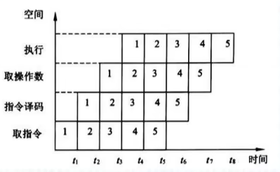
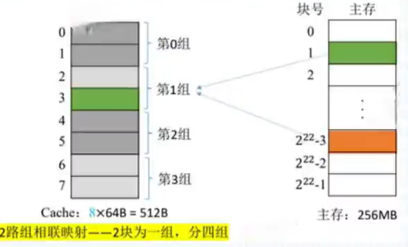
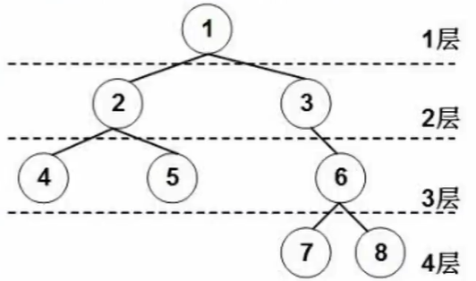
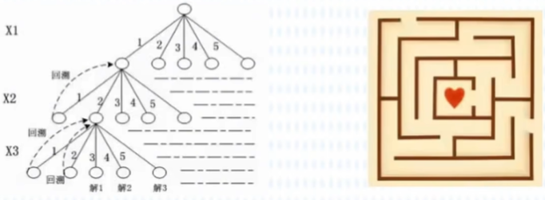
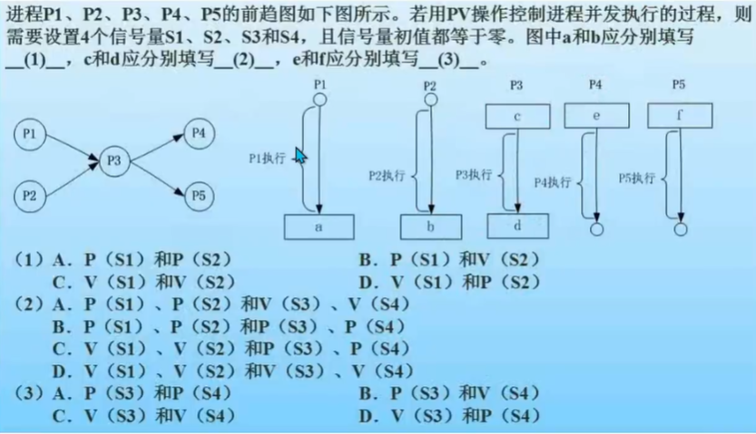
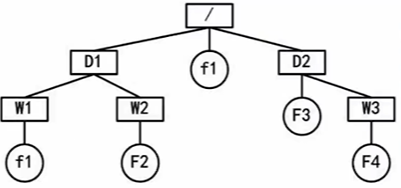
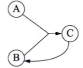
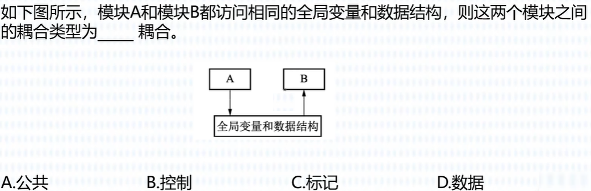
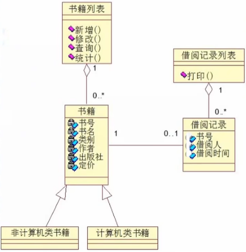
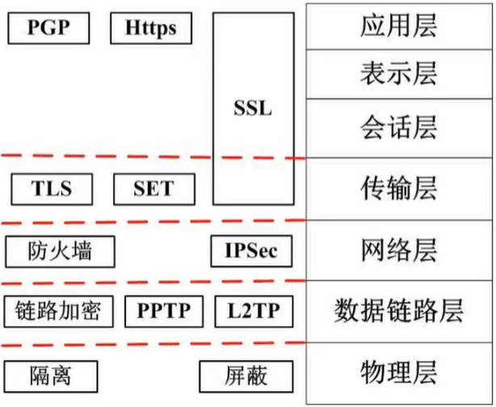

# Ⅰ. 计算机系统知识

**考纲要求：**

1. 数值及其转换
   - 二进制、十进制和十六进制等常用数制及其相互转换
2. 计算机内数据的表示
   - 数的表示(原码、反码、补码、移码表示，整数和实数的机内表示，精度和溢出)
   - 非数值表示(字符和汉字表示、声音表示、图像表示)
   - 校验方法和校验码(奇偶校验码、海明校验码、循环冗余校验码)
3. 算术运算和逻辑运算
   - 计算机中的二进制数运算方法
   - 逻辑代数的基本运算
4. 其他数学基础知识
5. 计算机系统的组成、体系结构的分类及特性
   - CPU和存储器的组成、性能和基本工作原理
   - 常用I/O设备、通信设备的性能以及基本工作原理
   - I/O接口的功能、类型和特性
   - I/O控制方式(中断系统、DMA、I/O处理机方式)
   - CISC/RISC、流水线操作、多处理机、并行处理
6. 存储系统
   - 主存-Cache存储系统的工作原理
   - 虚拟存储器的基本工作原理、多级存储体系
   - RAID的类型和特性
7. 可靠性与系统性能评测的基础知识
   - 诊断和容错
   - 系统可靠性分析评价
   - 计算机系统性能评测

**章节考点：**

1. 数值及其转换
2. 计算机内数据的表示
3. 计算机系统组成
4. 指令系统
5. 输入输出技术
6. 存储系统
7. 总线系统
8. 磁盘阵列技术
9. 计算机可靠性

## 一.  数值及其转换

引入：

计算机硬件唯一能识别的数据——二进制 0/1

用 低/高 电平xx分别表示 0/1 

### 1. 进制

“进位计数制”：十进制有0~9，共10种符号.逢十进一

推广：

### 2. R进制转十进制

**⽅法：“位权展开求和”**

1. 按位权展开
2. 求和

> 将R进制数按位权展开，然后各项相加，得到⼗进制数。

eg：⼆进制转⼗进制

### 3. 十进制转R进制

**⽅法：**整数除R倒取余，小数部分乘R正取整

- **整数部分：除R倒取余**

  1. ⽤⼗进制整数依次除以R,可以得到⼀个商和余数;**直到商为0时为⽌**。
  2. 把先得到的余数作为⼆进制数的低位，后得到的余数作为⼆进制数的⾼位，排列起来。

  

- **⼩数部分：乘R正取整**

  1. ⽤R乘⼗进制得到积，将整数部分取出,再⽤R乘余下的⼩数部分，⼜得到⼀个积,再将其整数部分取出，**直到积中的⼩数部分为零**。
  2. 把先得到的数作为⾼位,后得到的作为低位，排列起来。

  

### 4. 二八十六进制的转换

前置：

- 1 位⼋进制数等于 3 位⼆进制数
- 1 位⼗六进制数等于 4 位⼆进制数

***⼆与⼋互转：***

- **⼋进制转⼆进制**
  - **⽅法：⼀拆三**
    1. 将每1个⼋进制数转换为3位⼆进制数
    2.  转换后，去掉整数部分前⾯的0和⼩数部分后⾯的0
  - eg:
    
- **⼆进制转⼋进制**
  - **⽅法：三合⼀**  
    1. ⼆进制⼩数点左右两边三个⼀组
    2. 补零时整数部分前⾯补，⼩数部分后⾯补
  - eg:
    

***⼗六与⼆进制互转：***

- **⼗六进制转⼆进制**
  - **⽅法：⼀拆四**
  - eg:
    
- **⼆进制转⼗六进制**
  - **⽅法：四合⼀**  
  - eg：
    

### 特殊方法

某种数值计算已知$3\times4=15$，则 $3\times5=?$

 

## 二. 计算机内数据的表示(真值与机器数)

真值→机器数：

- $15$→$1111$      $+15$→0 1111
- $8$  →$1000$      $-8$  →1 1000

- **真值：**符合人类习惯的数字
- **机器数：**各种数据在计算机中表示的形式称为机器数，其特点是数的符号用0、1表示。即**正负号需要被“数字化”**

### 1. 机器数

**⽆符号整数**：取值范围由位数决定

- 8位:可表⽰0~255($2^8-1$)范围内的所有正整数
- 16位:可表⽰ 0～ 65535($2^{16}-1$)范围内的所有正整数
- n位:可表⽰$2^n-1$范围内的所有正整数

**有符号整数**

- 表⽰⽅法：
  ⽤⼀位表⽰符号，其余⽤来表⽰数值部分。
  **符号⽤最⾼位表⽰**: 0正1负
  - “0”表⽰正号(+)
  - “1”表⽰负号(-)

### 2. 原码反码补码和移码

数值的表⽰⽅法：原码、反码、补码、移码(针对有符号的⼆进制数)

- 对正数来说，原码=反码=补码
- **⼀般**来说我们⽤**⼀个字节(⼋位⼆进制数)来表⽰**

其符号位规则相同，数值部分的表⽰形式有差异  

| 011001 | 正数   | 负数   | 负数规则                               |
| ------ | ------ | ------ | -------------------------------------- |
| 原码   | 011001 | 111001 | 原码                                   |
| 反码   | 011001 | 100110 | 原码符号位不变，其他取反               |
| 补码   | 011001 | 100111 | 反码+1                                 |
| 移码   | 111001 | 000111 | 补码符号位取反(正数和负数都适用该规则) |

- $[+0]_原=00000000$      $[-0]_原=100000000$
- $[+0]_反=00000000$      $[-0]_反=11111111$
- $[+0]_补=[-0]_补=00000000$
- $[+0]_移=[-0]_移=10000000$
- 原码和反码的取值范围相同
- 补码和移码的取值范围相同

**原码：**用数值部分表示真值的绝对值，符号位“**0/1**”对应“**正/负**”**。(⼀般假设字⻓为8)**

- 原码⽤第⼀位表⽰符号,其余位表⽰值。
- **符号位(0正1负) + 数值位**
- 范围：若**机器字长**n+1(数值位n+符号位1)位，原码整数的表示范围$-(2^n-1)\leq x\leq 2^n-1$(关于原点对称(**真值0的表示方法有两种既有-0也有+0**))
- eg：
  

**反码：**若符号位为0(正数)，则反码与原码相同。若符号位为1(负数)，则数值位全部取反。

- **正数**的反码是其**原码本⾝**
- **负数**的反码是在其原码的基础上,**符号位不变**，**其余各个位取反**。
- **符号位(0正1负) + 数值位**
- 范围：若机器字长n+1(数值位n+符号位1)位，反码整数的表示范围$-(2^n-1)\leq x\leq 2^n-1$(关于原点对称(**真值0的表示方法有两种既有-0也有+0**))

**补码：**

- **正数**的补码就是其**本⾝**

- **负数**的补码是在其原码的基础上，**符号位不变,其余各位取反,最后+1**(即在反码的基础上+1,**要考虑进位**)

- 0正 + 不变
  1负 + (取反+1)

- **符号位(0正1负) + 数值位**

- **范围：**若机器字长n+1(数值位n+符号位1)位，补码整数的表示范围$-2^n\leq x\leq 2^n-1$(比原码和反码多一个$-2^n$(**补码的真值0只有一种表示形式**))

  > - 补码的真值0只有一种表示形式：$[+0]_补=[-0]_补=00000000$
  > - 补码比原码和反码多一个$-2^n$的原因：当反码为负数时，数值位取反 并+1

**移码：**

- **补码的基础上将符号位取反。**
- **范围：**若机器字长n+1(数值位n+符号位1)位，补码整数的表示范围$-2^n\leq x\leq 2^n-1$
- 注意：移码只能用于表示整数

### 3. 定点数和浮点数

**定点数：**

- 就是**小数点的位置固定不变的数**。

- 小数点的位置通常有两种约定方式：
  - 定点整数(纯整数，小数点在最低有效数值位之后)
  - 定点小数(纯小数，小数点在最高有效数值位之前)。

**浮点数：**

- 是**小数点位置不固定的数**，它能表示更大范围的数。

- 在浮点表示法中，阶码通常为带符号的纯整数，尾数为带符号的纯小数。

  浮点数的表示格式：
  

- 浮点数通常表示成
  $$
  N=M.R^E
  $$
  其中，M称为尾数，R称为基数，E称为阶码。
  **阶码：**决定浮点数所能表示的**数值范围**
  **尾数：**决定浮点数所能表示的**数值精度**

### 4. 校验码

数据交换难免出错，**为确保数据在传送过程中正确无误：**

- 一是提高硬件电路的可靠性
- 二是提高代码的校验能力。

**校验码：**用来**检测传送的数据是否出错。**

**码距：**指一个编码系统中任意两个合法编码之间至少有多少个二进制位不同。

校验码中的**奇偶校验码和循环冗余校验码：**(了解即可，非重点)

- **奇偶校验**基本思想是：通过在编码中**增加一位校验位**来使编码中1的个数为奇数(奇校验)或者为偶数(偶校验)，从而使码距变为2。

  对于奇校验，它可以检测代码中奇数位出错的编码，但不能发现偶数位出错的情况，即当合法编码中奇数位发生了错误，也就是编码中的1变成0或0变成1，则该编码中1的个数的奇偶性就发生了变化，从而**==可以发现错误(不可以纠正错误)==**。

- **循环冗余校验码**(CRC)广泛应用于数据通信领域和磁介质存储系统中。它利用生成多项式为$k$个数据位产生$r$个校验位来进行编码，其编码长度为$k+r$。

### 5. 海明码⭐

**海明码**的构成方法是：在数据位之间插入k个校验码，通过扩大码距来**==实现检错和纠错==**。

设数据位是$n$位，校验位是$k$位，==**则$n$和$k$必须满足：$2^k-1\geq n+k$**==

eg：

> 也就是n=16求k，这里直接带入试就行

## 三. 计算机系统组成(五大部件)

**冯诺依曼计算机的特点：**

1. 计算机由五大部件组成
2. **指令和数据以同等地位存于存储器**，可按地址寻访
3. 指令和数据用二进制表示
4. 指令由操作码和地址码组成
5. 存储程序
6. 以运算器为中心

输入/输出设备与存储器之间的**数据传送**通过==运算器==完成。

**五大部件：**

- 输入设备：将信息转换为机器能识别的形式
- 输出设备：将结果转换为人们熟知的形式
- 主存储器：存放数据和程序
- 运算器：算术运算、逻辑运算
- 控制器：指挥各部件，使程序得以运行

### 1. 主存储器

 

- **存储元：**即存储二进制的电子元件，每个存储元可存1bit(1位)。存储元构成了存储单元
- **存储单元：**每个存储单元存放一串二进制代码。
- **存储字(word)：**存储单元中二进制代码的组合。
- **存储字长：**存储单元中二进制代码的位数。
  - 机器字长：计算机进行一次数据处理过程中可以处理的二进制位数。
  - 存储字长：存储字长决定了内存中一个地址可以存放的数据大小
- **MAR：**地址寄存器，它的位数可以标记存储单元的个数
- **MDR：**数据寄存器

例：

- 若MAR=4位，则共有$2\times2\times2\times2$即$2^4$个存储单元
- 若MDR=16位，则每个存储单元可存放16bit的数据

1个字节(Byte)=8bit
1B=1个字节，1b=1bit

### 2. CPU-运算器

 

- **运算器：**用于实现**算术运算**(如：加减乘除)、**逻辑运算**(如：与或非)
- **ACC：**累加器，用于存放操作数，或运算结果。
- **MQ：**乘商寄存器，在乘、除运算时，用于存放操作数或运算结果。
- **X：**通用的操作数寄存器，用于存放操作数。
- ==**ALU：**算术逻辑单元==，通过内部复杂的电路实现算数运算、逻辑运算。
- **DR：**数据缓存寄存器。
- **PSW：**状态条件寄存器，用来保存指令运行标志。

速度：$cpu(通用寄存器)>cache>内存>外存$

### 3. CPU-控制器

 

- **CU：**控制单元，分析指令，给出控制信号。
- **IR：**指令寄存器，存放**当前执行的指令**。
- **PC：**程序计数器，存放**下一条指令地址**，有**自动加1**功能。
- **AR：**地址寄存器，保存当前CPU所访问的内存单元地址。
- **ID：**指令译码器，对操作码进行分析。

**完成一条指令的步骤：**

1. 取指令
2. 分析指令
3. 执行指令

### 4. Flynn分类法

**按Flynn分类法将计算机体系结构分为**：SISD、SIMD、MISD、MIMD

> Single：单一的
> Multiple：倍数，多种多样的

## 四. 指令系统

### 1. 指令

- 指令(又称机器指令)：是指示计算机执行某种操作的命令，是计算机运行的最小功能单位。
- 一台计算机的所有指令的集合构成该机的**指令系统**，也称为**指令集**。

### 2. 指令格式

一条指令就是机器语言的一个语句，它是一组**有意义**的二进制代码。

一条指令通常要包括**操作码字段**和**地址码字段**两部分：

- **操作码(OP)**：指明**操作的类型**(告诉用户要干什么)
  eg：停机中断、求反求补、加减乘除……
- **地址码(A)**：主要指明**操作数及运算结果存放的地址**(对谁进行操作)
  eg：不需要操作对象、需要一个操作对象、需要两个操作对象

### 3. 七种寻址方式

**一条指令的结构：**操作码(OP)和地址码(A)

**寻找指令中操作数有效地址的方式**称为==寻址方式==。

- **立即寻址：操作数**作为指令的一部分**直接写在指令中**，直接读指令即可，这种操作数称为立即数。
- **寄存器寻址：**指令所要的**操作数**已存储在某**寄存器中**，或把目标操作数存入寄存器，操作数存放的寄存器编号放在指令中，取操作数需 要到寄存器中。
- **直接寻址：**指令所要的**操作数**存放在**内存中**，在指令中直接给出该操作数的有效地址，取操作数需要到内存中中。
- **寄存器间接寻址：操作数**在**存储器**中，操作数的有效地址用SI、DI、BX和BP四个寄存器之一来指定。
- **寄存器相对寻址：操作数**在**存储器**中，其有效地址是一个基址寄存器或变址寄存器中的内容和指令中的8位/16位偏移量之和。
- **基址加变址寻址方式：操作数**在**存储器**中，其有效地址是一个基址寄存器和一个变址寄存器的内容之和。
- **相对基址加变址寻址：操作数**在**存储器**中，其有效地址是一个基址寄存器的值、一个变址寄存器的值和指令中的8位/16位偏移量之和。

> ==**寻址速度：**立>寄>直>间==
>
> - **立即寻址**的是将**操作数放在指令中**，取操作数只用到指令中，**速度最快**；
> - **寄存器寻址**是将**操作数存放的寄存器编号放在指令中**，取操作数需要到寄存器中，**速度次之**；
> - **直接和间接寻址**都需要**到内存单元取操作数**，**速度最慢**。
>
> 其中直接寻址是将操作数在内存单元的地址存放在指令中，而间接寻址是，操作数的地址存放在某个内存单元A中，内存单元A的地址又存放在内存单元B中，最终将内存单元B的地址保存在指令中。因此**间接寻址比直接寻址的速度还要慢**。

### 4. 复杂指令集计算机-CISC vs 精简指令集计算机-RISC

> - CISC：Complex Instruction Set Computer复杂指令集计算机
> - RISC：Reduced Instruction Set Computer简化指令集计算机

|                  | CISC (Complex复杂的) | RISC (Reduced精简的)   |
| ---------------- | -------------------- | ---------------------- |
| 指令系统         | 复杂，庞大           | 简单，精简             |
| 指令数目         | 一般大于200条        | 一般小于100条          |
| 指令字长         | 不固定               | 定长                   |
| 可访存指令       | 不加限制             | 只有Load/Store指令     |
| 各种指令执行时间 | 相差较大             | 绝大多数一个周期内完成 |
| 各种指令使用频度 | 相差较大             | 都比较常用             |
| 通用寄存器数量   | 较少                 | 多                     |
| 控制方式         | 绝大多数为微程序控制 | 绝大多数为组合逻辑控制 |
| 指令流水线       | 可以通过一定方式实现 | 必须实现               |

### 5. 指令的流水处理

指令控制方式有顺序方式、重叠方式和流水方式三种。

 

在概念上，“流水”可以看成是“重叠”的延伸。

差别仅在于“一次重叠”只是把一条指令解释分解为两个子过程，而“流水”则是分解为更多的子过程。

### 6. 流水线的计算

#### 6.1 流水线执行时间的计算

**流水线执行时间计算公式**为：
$$
1条指令执行时间+(指令条数-1)\times流水线周期
$$
**流水线的周期**就是三个步骤中**用时最长的那个的时间**

**例6.1：**若指令流水线把一条指令分为取指、分析和执行三部分，且三部分的时间分别是取指$2ns$,分析$2ns$,执行$1ns$。
问：流水线周期是多少？100条指令全部执行完毕需要的时间是多少？

 

**答：**

- 流水线周期2 ns。原因：三个步骤中用时最长的时间为2 ns
- 100 条指令执行完毕需要的时间是203纳秒：

$$
2+2+1+(100-1)\times2=203
$$

#### 6.2 流水线吞吐率的计算

流水线的吞吐率(Though Put rate,TP)：是指在单位时间内流水线所完成的任务数量或输出的结果数量。

**计算流水线吞吐率的最基本的公式如下：**
$$
TP=\frac{指令条数}{流水线执行时间}
$$
**例6.1的流水线吞吐率为**：
$$
TP=\frac{100}{2+2+1+(100-1)\times2}
$$

#### 6.3 流水线的加速比计算

完成同样一批任务，不使用流水线所用的时间与使用流水线所用的时间之比称为**流水线的加速比**。

**计算流水线加速比的基本公式如下：**
$$
S=\frac{不使用流水线执行时间}{使用流水线执行时间}
$$
**例6.1的流水线加速比为**：
$$
S=\frac{100\times(2+2+1)}{(2+2+1)+2\times(100-1)}=2.463
$$

## 五.  输入输出技术(CPU与外设之间的数据传送方式)

> 掌握每一种数据传输方式的特点，前三种是经常考的

CPU与外设之间的数据传送方式：

1. **直接程序控制方式：**
   直接程序控制方式是指在完成数据的输入/输出中，整个输入/输出过程是==在CPU执行程序的控制下完成的==。这种方式还可以分为以下两种：
   1. **无条件传送方式**：无条件地与CPU交换数据，**不需要CPU执行程序指令来传送数据**。
   2. **程序查询方式**：先通过**CPU查询外设状态**，准备好**之后再与CPU交换数据**。
2. **中断方式：**
   中断方式利用中断机制，使I/O系统在与外设交换数据时，==CPU无须等待(不是不用CPU)，也不必查询I/O状态==，即可以抽身出来处理其他任务，因此提高了系统效率。
3. **直接存储器存取方式(DMA)：**
   直接存储器存取(Direct Memory Access，**DMA**)方式是在存储器与I/O设备间直接传送数据，即在内存与I/O设备之间传送一个数据块的过程中，==不需要CPU的任何干涉==，是一种==完全由DMA**硬件**完成==I/O操作的方式。
4. 输入/输出处理机：
   输入/输出处理机(IOP)是一个专用处理机，用于完成主机的输入/输出操作。IOP**根据主机的I/O命令**，完成对外设数据的输入/输出。

例：

## 六. 存储系统

### 1. 层次结构

 

- **主存——辅存：**实现虚拟存储系统，==解决了**主存容量不够**的问题==。
- **Cache——主存：**解决了==**主存与CPU速度不匹配**的问题==，

我们国家迄今为止运算速度最快的计算机：神威·太湖之光

### 2. 分类

**按位置分类：**可分为内存和外存。

- **内存(主存)：**用来存储当前运行所需要的程序和数据，速度快，容量小。
- **外存(辅存)：**用来存储当前不参与运行的数据，容量大但速度慢。

---

**按材料分类：**可分为磁存储器、半导体存储器和光存储器。

- **磁存储器：**用磁性介质做成，如磁芯、磁泡、磁盘、磁带等。
- **半导体存储器：**
  - 根据**所用元件**又可分为双极型和MOS型两类
  - 根据**是否需要刷新**又可分为静态和动态两类。
- **光存储器：**由光学、电学和机械部件等组成，如光盘存储器。

---

**按工作方式：**可分为读/写存储器和只读存储器。

- **读/写存储器(RAM)：**它指**既能读取数据也能存入**数据的存储器。
- **只读存储器(ROM)：**工作过程中**仅能读取的存储器**。

**根据数据的写入方式，又可细分为**ROM、PROM、EPROM和EEPROM等类型。

- **固定只读存储器(ROM)：**这种存储器是在厂家生产时就写好数据的，其内容只能读出，不能改变。一般用于**存放系统程序BIOS**和用于**微程序控制**。
- **可编程的只读存储器(PROM)：**其中的内容可以由**用户一次性地写入**，写入后**不能再修改**。
- **可擦除可编程的只读存储器(EPROM)：**其中的内容既可以读出，也可以由用户写入，写入后还可以修改，**紫外线照射擦除信息**。
- **电擦除可编程的只读存储器(EEPROM)：**与EPROM相似，EEPROM中的内容既可以读出，也可以进行改写，**电擦除**的方法进行数据的改写。
- **闪速存储器(Flash Memory)：简称闪存**，闪存的特性介于EPROM和EEPROM之间，类似于EEPROM,也可使用电信号进行信息的擦除操作。整块闪存可以在数秒内删除，**速度远快于EPROM**。

### 3. 高速缓存Cache

CPU速度很快，内存速度很慢，怎么办呢？

- **高速缓存(Cache)**是位于**CPU和主存之间**的高速存储子系统。
- 采用**高速缓存的主要目的**是：提高存储器的平均访问速度，使**存储器的速度与CPU的速度相匹配**。
- Cache的存在对程序员是透明的。其地址变换和数据块的替换**算法均由硬件实现**
- 通常**Cache被集成到CPU内**，以**提高访问速度**，其主要特点是**容量小、速度快、成本高**。

#### 3.1 Cache的组成

Cache由两部分组成：

1. **Cache存储器部分**：用来==存放主存的部分**复制**信息(只存储复制数据，不存储新的数据)==。
2. **控制部分**：**功能**是判断CPU**要访问的信息是否在Cache存储器中**，若在，即为命中，若不在则没有命中。

#### 3.2 Cache的三种地址映像

因为处理机都是按主存地址访问的，而应从Cache存储器中读写信息，因此就需要==**地址映像**，即把**主存中的地址映射成Cache存储器中的地址**==。**地址映像方法有三种，直接映像、全相联映像和**。

---

**直接映像：**

- 就是主存的块与Cache中块的对应关系是固定的。主存中的块**只能存放在Cache存储器的相同块号中**。因此，只要主存地址中的主存区号与Cache中的主存区号相同，则表明访问Cache命中。
-  
- **优点：**==地址变换很简单==
  **缺点：**==灵活性差==。

---

**全相联映像：**

- 允许主存的任一块**可以调入Cache的任一块的空间**。在地址变换时，将主存地址高位表示的主存块号与Cache中的主存块号进行比较，若相同则为命中。
-  
- **优点：**主存的块调入Cache的位置==不受限制，十分灵活==。
  **缺点：**无法从主存块号中直接获得Cache的块号，==变换比较复杂，速度比较慢==。

---

**组相联映像：**

- 这种方式是前面两种方式的折中。
-  
- 具体方法是将Caches**先分成组再分块**。
- 组相联映像就是==**组间**采用**直接映像**方式==，而==**组内**的块采用**全相联映像**方式==。

#### 3.3 Cache的性能分析

若$H$为Cache的命中率，$t_c$为Cache的存ddddddddddddddddd取时间，$t_m$为主存的访问时间，则**Cache的等效访问时间$t_a$为**：
$$
t=Ht_e+(1-H)t_m
$$
**使用Cache**比不使用Cache的CPU**访问存储器的速度提高的倍数$r$**可以用下式求得：
$$
r=\frac{t_m}{t_a}
$$

答：

12：A
其中C: Cache的命中率并不随其容量增大线性地提高是正确的，**Cache的命中率并不随其容量增大线性地提高，而是有一个临界点**

答：A

### 4. 主存的扩展

- **位扩展：**就是把存储位数扩展，**容量大小不变，位数变化(一次可以处理更多位的数据(**上图是从4位扩展为8位))
- **字扩展：**就是**扩大他的容量(上图中从8扩展为16)**，位数不变(一次可以处理的位数不变)

> - $1K=2^{10}$
> - $1M=2^{20}$
> - $1G=2^{30}$

解：
$$
C6FFFH-AC000H+1=1C000H=1,1100,0000,0000,0000B\\
1K=2^{10}\\
1,1100,0000,0000,0000B(前移十位)=1110000BK=112D K\\\\
内存大小=112K\times16bit\\
内存大小=28\times16K\times?\\
即112K\times16bit=(28\times16)K\times?bit\\
解得：?=4bit
$$
答案：(1) B112 K   (2) A4

### 5. 虚拟存储器

**虚拟存储器**是由主存、辅存、存储管理单元及操作系统中的存储管理软件组成的存储系统。

程序员使用该存储系统时，可以使用的内存空间可远远大于主存的物理空间，但实际上并不存在那么大的主存，故称其为虚拟存储器。

**虚拟存储器**使存储系统==既具有相当于外存的容量又具有接近于主存的访问速度==。

### 6. 磁盘存储器

 

 
$$
存取时间=寻道时间+等待时间(平均定位时间+转动延迟)
$$

注意：

- **寻道时间**是指磁头移动到磁道所需的时间
- **等待时间**为等待读写的扇区转到磁头下方所用的时间。

### 7. 总线系统

 

1. **片内总线(内部总线)**
   片内总线是芯片内部的总线。它是CPU芯片内部寄存器与寄存器之间、寄存器与ALU之间的公共连接线。
2. **系统总线**
   系统总线是计算机系统内各功能部件(CPU、主存、I/O接口)之间相互连接的总线。
   **按系统总线传输信息内容的不同**，又可分为3类：==数据总线、地址总线和控制总线==。
3. **通信总线(外部总线)**
   用于设备一级的互连，计算机可通过该总线和其他设备进行信息与数据交换。

### 8. 磁盘阵列技术(RAID)

磁盘阵列由多台磁盘存储器组成，是快速、大容量且高可靠的外存子系统。

现在常见的独立冗余磁盘阵列(RAID)就是一种由多块独立磁盘构成的冗余阵列。RAD技术分为几种不同的等级，分别可以提供不同的速度、安全性和性价比。

| RAID级 | 说明(注意对号入座)                                           |
| ------ | ------------------------------------------------------------ |
| RAID-0 | RAID-0是一种**不具各容错能力**的磁盘阵列                     |
| RAID-1 | RAID-1是采用**镜像容错技术**改善可靠性的一种磁盘阵列         |
| RAID-2 | RAID-2是采用**海明码**进行错误检测的一种磁盘阵列             |
| RAID-3 | RAID-3**减少了**用于**检验的磁盘存储器的台数**，从而提高了磁盘阵列的有效容量。一般只有**一个检验盘** |
| RAID-4 | RAID-4是一种可以**独立地对组内各磁盘进行读写的磁盘阵列**，该阵列也只用**一个检验盘** |
| RAID-5 | RAID-5是对RAID-4的一种改进，它**不设置专门的检验盘**，同一台磁盘上**既记录数据， 也记录检验信息**。这就**解决了前面多台磁盘机争用一台检验盘的间题** |
| RAID-6 | RAID-6磁盘阵列采用**两级数据冗余和新的数据编码以解决数据恢复问题**，在**两个磁盘出现故障时仍然能够正常工作。在进行写操作时，RAID-6分别进行两个独立的校验运算， 形成两个独立的冗余数据，并写入两个不同的磁盘** |

### 9. 计算机可靠性

计算机系统的可靠性是指从它开始运行$(t=0)$到某个时刻$t$这段时间内能正常运行的概率，用$R(t)$表示。

**公式为：**
$$
串联部件的可靠度=各部件的可靠度的乘积\\
并联部件的可靠度=1-部件失效率的乘积。
$$

例：

答案：B

# Ⅱ. 数据结构与算法基础

## 一. 基本概念与三要素

数据结构在学什么？

- 如何用程序代码把现实世界的问题信息化。
- 如何用计算机高效地处理这些信息从而创造价值。

> 人类社会的发展，迄今经历了和经历着三个浪潮：第一次浪潮为农业阶段，从约1万年前开始；第二次浪潮为工业阶段，从17世纪末开始；**第三次浪潮为正在到来的信息化阶段**。
>                                                                         ——《第三次浪潮(1980版)》，阿尔文托夫勒

### 1. 基本概念

**数据：**是==信息的载体==，是描述客观事物属性的数、字符及所有能输入到计算机中并被计算机程序识别和处理的符号的集合。==数据是计算机程序加工的原料==。

**数据元素、数据项：**

- **数据元素：**数据的==基本单位==**，通常作为一个整体进行考虑和处理。**一个数据元素可由==若干数据项==组成
- **数据项：**构成**数据元素的**不可分割的==最小单位==。

**数据结构：**相互之间存在一种或多种==特定关系==的数据元素的集合。

### 2. 数据结构三要素

**数据结构：**相互之间存在一种或多种**特定关系**的数据元素的集合。

**数据结构的三要素：**逻辑结构、物理结构(存储结构)、数据的运算

1. **逻辑结构：**集合、线性结构、树形结构、图状结构(网状结构)
2. **物理结构(存储结构)：**顺序存储、链式存储、索引存储、散列存储(哈希(Hash)存储)

---

**逻辑结构：**

- **集合：**各个元素同属一个集合，别**无其他关系**
- **线性结构：**数据元素之间是**一对一**的关系。除了第一个元素，所有元素**都有唯一前驱**；除了最后个元素，所有元素**都有唯一后继**。
- **树形结构：**数据元素之间是**一对多**的关系
- **图结构：**数据元素之间是**多对多**的关系。

---

**物理结构：**

- **顺序存储：**把**逻辑上相邻**的元素存储在**物理位置上也相邻**的存储单元中
- **链式存储：逻辑上相邻**的元素在**物理位置上==可以不相邻(也可以相邻)==**
- **索引存储：**在存储元素信息的同时，还**建立附加的索引表**。
- **散列存储(哈希(Hash)存储)：**根据元素的关键字**直接计算**出该元素的**存储地址**，又称哈希(Hash)存储

## 二. 算法

### 1. 什么是算法

$$
程序=数据结构+算法
$$

- **数据结构：**如何把现实世界的问题信息化将信息存进计算机。同时还要实现对数据结构的基本操作。
- **算法：**如何处理这些信息，以解决实际问题。

### 2. 算法的五个特性

- **有穷性：**一个算法必须总在执行有穷步之后结束，且每一步都可在**有穷时间内完成**。
- **确定性：**算法中每条指令必须有确切的含义，对于**相同的输入**只能**得出相同的输出**。
- **可行性：**算法中描述的操作都可以通过已经实现的**基本运算执行有限次来实现**。
- **输入：**一个算法==有**零个或多个**输入==，这些输入取自于某个特定的对象的集合。
- **输出：**一个算法==有**一个或多个**输出==，这些输出是与输入有着某种特定关系的量。

### 3. 算法效率的度量

- **时间复杂度$T(n)$：**时间开销与问题规模n之间的关系
- **空间复杂度$S(n)$：**空间开销(内存开销)与问题规模之间的关系

---

**时间复杂度：**时间开销与问题规模n之间的关系

- **简化**
  - 例子
    $T1(n)=3n+3$ → $T1(n)=O(n)$
    $T2(n)=n^2+3n+1000$ → $T2(n)=O(n^2)$
    $T3(n)=n^3+n^2+99999$ → $T3(n)=O(n^3)$

**eg：输出3000次爱你**

$$
即：T(n)=O(n)
$$

---

**空间复杂度：**空间开销(内存开销)与问题规模之间的关系

无论问题规模怎么变，**算法运行所需的内存空间都是固定的常量**。

**算法空间复杂度为$S(n)=O(1)$**

> 注：S表示"Space”

算法原地工作——算法所需内存空间为常量

==只需关注存储空间大小与问题规模相关的变量==

**函数递归调用带来的内存开销(空间复杂度)：就等于递归调用的深度**
$$
S(n)=O(n)\\
空间复杂度=递归调用的深度
$$

$O(1)<O(\log_2n)<O(n)<O(n\log_2n)<O(n^2)<O(n^3)<O(2^n)<O(n!)<O(n^n)$

## 三. 线性表

### 1. 定义

线性表是具有相同数据类型的$n(n≥0)$个数据元素的有限序列，其中为$n$表长，当$n=0$时线性表是一个空表。若用L命名线性表，则其一般表示为：
$$
L=(a_1,a_2,…,a_i,a_{i+1},…,a_n)
$$
几个概念：

- $a_i$是线性表中的"第i个”元素线性表中的**位序**。
- $a_1$是**表头元素**；$a_n$是**表尾元素**。
- **除第一个**元素**外**，每个元素**有且仅有一个直接前驱**；**除最后**一个元素外每个元素**有且仅有一个直接后继**。

eg 当n=5时：

### 2. 存储结构

| 性能类别     | 具体项目 | 顺序存储                                | 链式存储                                 |
| ------------ | -------- | --------------------------------------- | ---------------------------------------- |
| **空间**性能 | 存储密度 | $=1$，更优                              | $<1$                                     |
| **空间**性能 | 容量分配 | 事先确定                                | 动态改变，更优                           |
| **时间**性能 | 查找运算 | $O(n/2)$                                | $O(n/2)$                                 |
| **时间**性能 | 读运算   | $O(1)$，更优                            | $O([n+1]/2)$，最好情况为1，最坏情况为$n$ |
| **时间**性能 | 插入运算 | $O(n/2)$，最好情况为 $0$，最坏情况为$n$ | $O(1)$，更优                             |
| **时间**性能 | 删除运算 | $O([n-1]/2)$                            | $O(1)$，更优                             |

### 3. 线性表插入删除操作

- **顺序存储：**

  - 插入元素前**要移动元素**以挪出空的存储单元，**然后再插入元素**。
  - 删除元素时同样**需要移动元素**，以填充被删除元素的存储单元。

- **链式存储：**

  

## 四. 栈和队列

**线性表**是具有相    同数据类型的$n(n≥0)$个数据元素的有限序列，其中为$n$表长，当$n=0$时线性表是一个空表。若用L命名线性表，则其一般表示为：
$$
L=(a_1,a_2,…,a_i,a_{i+1},…,a_n)
$$

### 1. 栈的定义

**栈(Stack)：**只==允许在**一端进行插入或删除**操作的线性表==

 

### 2. 队列的定义

**队列：**一种==**先进先出**(FIFO)的线性表==，它只允许在表的**一端插入**元素，而在表的**另一端删除**元素。

- **队尾(Rear)：**在队列中，允许插入元素的一端
- **队头(Front)：**允许删除元素的一端

**循环队列：**

 

**例题：**

答案：D

## 五. 串、数组、矩阵和广义表

**串**是仅由字符构成的有限序列，是取值范围受限的线性表。一般记为
$$
S='a_1a_2\sim\sim\sim a_n'
$$

,其中S是串名，a1a2an是串值。

- **空串：长度为零**的串，空串不包含任何字符
- **空格串：**由**一个或多个空格(空格也是字符字符)**组成的串。
- **子串：**由串中任意长度的连续字符构成的序列。含有子串的串称为**主串**。子串在主串中的位置指子串首次出现时，该子串的第个字符在主串中的位置。**空串是任意串的子串**。
- **串相等：**指两个串长度相等且对应位置上的字符也相同。
- **串比较：**两个串比较大小时以字符的**ASCII码**值作为依据。比较操作从两个串的第一个字符开始进行，字符的ASCI码值大者所在的串为大；若其中一一个串先结束，则以串长较大者为大。

### 1. 串

**对串进行的基本操作有以下几种：**

- **赋值操作`StrAssign(s,)`:**将串t的值赋给串s。
- **连接操作`Concat(s,t)`:**将串t接续在串s的尾部，形成一个新串。
- **求串长`StrLength(s)`**:返回串s的长度。
- **串比较`StrCompare(s,t)`:**比较两个串的大小。
- **求子串`SubString(,tart,len)`:**返回串s中从start开始的、长度为len的字符序列。

**串的存储结构：**

- 串的顺序存储：定长存储结构
- 串的链式存储：块链
  子串的定位操作通常称为串的**模式匹配**，它是各种串处理系统中最重要的运算之一。子串也称为模式串。

### 2. 数组

| 数组类型           | 存储地址计算                                                 |
| ------------------ | ------------------------------------------------------------ |
| 一维数组 `a[n]`    | `a[i]`的**存储地址**为：$a+i\times len$                      |
| 二维数组 `a[m][n]` | `a[i][j]`的**存储地址**(按行存储)为：$a+(i\times n+j)\times len$  `a[i][j]`的**存储地址**(按列存储)为：$a+(j\times m+i)\times len$ |

eg：

$$
a+(2\times 5+3)\times 2=a+26
$$

### 3. 稀疏矩阵

**上三角矩阵：**

在矩阵中下标分别为`i`和`j`的元素，**对应的一维数组的下标**计算公式为：$(2n-i+1)×i\div2+j$

---

**下三角矩阵**

在矩阵中下标分别为`i`和`j` 的元素，**对应的一维数组 的下标**计算公式为：$(i+1) \times i\div 2+j$

解：A 代入选项

### 4. 广义表

**广义表**是$n$个表元素组成的有限序列，是**线性表的推广**。

**通常用*递归*的形式进行定义，记做：$LS(a_0,a_1,\ldots,a_n)$。**

**注：**其中LS是表名，$a_i$是表元素，它可以是表(称做子表)，也可以是数据元素(称为原子)。其中$n$是广义表的长度(也就是最外层包含的元素个数)，$n=0$的广义表为空表；而递归定义的重数就是广义表的深度，直观地说，就是定义中所含括号的重数(**原子的深度为0，空表的深度为1**)。

**基本运算：**取表头head(Ls)和取表尾tail(Ls)
$$
若有：LS1=(a,(b,c),(d,e))\\
取表头head(LS1)=a\\
取表尾tail(LS1)=((b,c),(d,e))
$$
eg：

答：

例一：长度3(每一个数据元素和子表算一个长度)，深度2

例二：`head(head((tail(LS1))))`

## 六. 树和二叉树

### 1. 树的基本概念

1. 结点的度：结点的分支有几个
2. 树的度：树中所有节点最大的度
3. 叶子结点：没有子节点的节点
4. 分支结点：如2和3是1的分支节点
5. 内部结点：除了根节点和叶子节点的节点
6. 父结点：相对的概念，如1节点是2、3节点的父节点
7. 子结点：相对的概念，如2、3节点是1节点的子节点
8. 兄弟结点：相对的概念，如2、3节点互为兄弟节点
9. 层次：树有几层

### 2. 二叉树的基本概念

1. **满二叉树** (Full Binary Tree)
   - 满二叉树是指**每个节点都有0个或2个子节点的二叉树**。
     **换言之，==除了叶子节点外，每个节点都有两个子节点==**。
   - **特性**：如果它有高度 $h$，那么总节点数 $n$ 可以用公式计算为：$n=2^{h+1}-1$
   - 例如，包含7个节点的树(高度为2)就是一个满二叉树。
2. **完全二叉树** (Complete Binary Tree)
   - 完全二叉树是一种特定类型的二叉树，==**除了最后一层**，**其余各层的节点数都达到最大**，并且**最后一**层的节点都**集中在左侧**==。
   - **特点：**尽量填满每一层，直至最后一层。
   - 例如，如果一棵树的高度为3，且前两层都被节点填满，最后一层是从左到右依次填入节点，这棵树就是完全二叉树。
3. **非完全二叉树** (Incompletely Binary Tree)
   - 非完全二叉树是指不满足完全二叉树定义的二叉树
   - 通常说明某些节点**可能只有一个子节点或某些层没有被完全填满**。
   - 简单来说，**任何不符合完全二叉树特性的二叉树**都可以称为非完全二叉树。

### 3. 二叉树的重要特性

1. 在二叉树的**第$i$层上最多**有$2^{i-1}$个**结点**($i\geqslant1$)
2. **深度为$k$的**二叉树**最多**有 $2^k-1$个**结点**($k\geqslant1$)
3. 对任何一棵二叉树，如果其**叶子结点数**为$n_0$，**度为$2$的结点数**为$n_2$，则$n_0=n_2+1$
4. 如果对一棵**有$n$个结点**的**完全二叉树**的结点**按层序编号**(从第1层到$\llcorner\log2n\lrcorner+1$层，每层从左到右)，则对任一结点$i(1\leqslant i\leqslant n)$，有：
   - 如果$i=1$，则结点$i$无父结点，是二叉树的根；如果$i>1$，则父结点是$\llcorner i/2\lrcorner $
   - 如果$2i>n$，则结点$i$为叶子结点，无左子结点；否则，其左子结点是结点$2i$
   - 如果$2i+1>n$,则结点$i$无右子叶点，否则，其右子结点是结点$2i+1$。

> $\llcorner \lrcorner$：向下取整

### 4. 二叉树的遍历

- **前序遍历：**根左右
- **中序遍历：**左根右
- **后序遍历：**左右根
- **层次遍历：**一层一层从上往下，从左往右

---

- 图中前序遍历结果：12457836
- 图中中序遍历结果：42785136
- 图中后序遍历结果：48752631
- 图中层次遍历结果：12345678

### 5. 反向构造二叉树

给你前序中序后序遍历的值反推二叉树

eg：

由前序序列ABHFDECG，中序遍历HBEDFAGC构造二叉树：

1. A为根节点，前A BHFDECG。中：HBEDF A GC
2. B为父节点，前A B H FDECG。 中：H B EDF A GC
3. F为父节点，前A B H F DECG。 中：H B ED F A GC
4. 分析DE和GC

### 6. 树转二叉树

- 孩子结点一**左子树结点**
- 兄弟结点一**右孩子结点**

互为兄弟节点的保留左兄弟，将所有的兄弟节点列起来

---

eg：

### 7. 二叉排序树(查找二叉树)

**特点：左**孩子**小**于根，**右**孩子**大**于根。

**例如：**序列：89,48,56,112,51,20

**插入结点：**

1. 若该键值结点**已存在**，则**不再插入**，如：48。
2. 若查找二叉树为空树，则以新结点为查找二叉树。
3. 将**要插入结点键值与插入后父结点键值比较**，就能**确定**新结点是父结点的**左子结点，还是右子结点**。

**删除结点：**

1. 若待删除结点是**叶子结点则直接删除**。
2. 若待删除**结点只有一个子结点**，则将这个**子结点与待删除结点的父结点直接连接**，
   如：56，直接将51与48连接。
3. 若待删除的结点p**有两个子结点**，则**在其左子树上，用中序遍历寻找关键值最大的结点s,用结点s的值代替结点的值，然后删除节点s,**节点s必属于上述1.2.情况之一。
   如：89，使用中序遍历找到最大值为56，将56替换89，并删除原56节点

### 8. 构造霍夫曼树(最优)

霍夫曼树是**树的带权路径最小的树**。

**所有的值都处于叶子节点上。**

对于$1，2，4，8$节点，可以构造出很多树，如

- **树的路径长度：**如左图中的2的路径长度就是：2(从根节点到2节点有两个“—”)

- **权：**权重，如4节点的权重就是4

- **带权路径长度：**$权重\times 路径长度，$如左图4的带权路径长度$4\times3=12$

- **树的带权路径长度**(树的代价)：

  左图中：$2\times2+4\times3+8\times3+1\times1=41$
  右图中：$4\times2+1\times3+2\times3+8\times1=25$

**构造霍夫曼树使树的带权路径长度最小：**

1. 将所有的数从小到大排序
2. 取前两个最小的构造叶子节点，并生成一个中间节点(两个最小的值的和)，并将中间节点与其他节点再次排序
3. 以此类推

**例：**假设有一组权值$5,29,7,8,14,23,3,11$请尝试构造哈夫曼树。

1. 排序：$3,5,7,8,11,14,23,29$
2. 选出前两个$3,5$为子节点，生成中间节点$8$
3. 再次排序$7,8,8,11,14,23,29$
4. 选出前两个$7,8$为子节点，生成中间节点$15$
5. 再次排序$8,11,14,15,23,29$
6. 依次重复循环

### 9. 线索二叉树

> 上图中绿色为前驱，红色为后置

**线索二叉树(Threaded Binary Tree)**是一种特殊的二叉树，它**通过使用空的左子指针(指向前驱)或右子指针(指向后继)来存储指向前驱或后继节点的线索**，以便于在遍历树时更高效地访问节点。这种结构避免了使用栈或递归的方式进行树的遍历，能够提高遍历的效率。

**线索二叉树的特点：**

1. **节点结构**：每个节点除了包含通常的左右子节点指针外，还用其中的空指针存储指向其前驱或后继的指针。
2. **不保持完整的子树结构**：线上指向前驱或后继的指针替代了原本可能指向子节点的空指针。
3. **遍历方式**：使用线索二叉树可以进行中序、前序或后序遍历，且可以在遍历时高效地访问节点。

**线索二叉树的类型：**

- **单线索二叉树**：每个节点最多存储一个线索(前驱或后继)。
- **双线索二叉树**：每个节点可以同时存储前驱和后继的线索。

**线索二叉树的优点：**

- 遍历更高效：减少了栈空间的使用。
- 更方便的前驱和后继获取，不需要额外的存储结构。

### 10. 平衡二叉树

**定义：**任意结点的**左右子树深度相差不超过1**，每结点的**平衡度(节点左右子树的深度差)只能为-1、0或1**。

例如：对数列$\{1,5,7,9,8,39,73,88\}$构造排序二叉树，可以构造出多棵形式不同的排序二叉树。

## 七. 图

### 1. 图的定义

- **有向图：**
  - **定义**：有向图是由一组顶点(节点)和一组有方向的边(连接顶点的线段)组成的图。每条边都有一个方向，表示从一个顶点指向另一个顶点。
  - **表示**：有向图通常表示为 $G=(V,E)$，其中 $V$ 是顶点集，$E$ 是边集，每条边可以表示为一个有序对 $(u,v)$，表示从顶点 $u$ 指向顶点$v$。
- **无向图：**
  - **定义**：无向图是由一组顶点和一组无方向的边组成的图。边在两个顶点之间没有方向，表示两个顶点之间的连接关系。
  - **表示**：无向图也可以表示为 $G=(V,E)$，其中 $V$ 是顶点集，$E$ 是边集，边可以表示为一个无序对 ${u,v}$，表示顶点 $u$ 和顶点 $v$ 之间的连接。
- **完全图：**
  
  - **在无向图中**，若**每对顶点之间都有一条边相连**，则称该图为完全图。
  - **在有向图中**，若**每对顶点之间都有二条有向边相互连接**，则称该图为完全图。
- **度，入度与出度**
  - 度：一个节点有几条连线就有几个度
  - 入度：指向它的箭头有几个就是有几个入度(针对有向图)
  - 出度：指出它的箭头有几个就是有几个出度(针对有向图)

### 2. 存储结构(邻接矩阵)

用一个$n$阶方阵$R$来存放图中各结点的关联信息，其矩阵元素$R_{ij}$定义为：
$$
R_{ij}=
\begin{Bmatrix}
1 & 若顶点i到顶点j有邻接边 \\
0 & 若顶点i到顶点j无邻接边
\end{Bmatrix}
$$
eg：

### 3. 存储结构(邻接表)

首先把每个顶点的邻接顶点用链表示出来，然后用一个一维数组来顺序存储上面每个链表的头指针。

### 4. 图的遍历

**遍历方法：**深度优先遍历、广度优先遍历

**深度优先遍历步骤：**

1. 首先访问**出发顶点V**
2. 依次**从V出发搜索V的任意一个邻接点W**
3. 若**W未访问过，则从该点出发继续深度优先遍历**，它类似于树的前序遍历。

**广度优先遍历步骤：**

1. 首先访问**出发顶点V**
2. 然后访问与顶点**V邻接的全部未访问顶点**W、X、Y.…
3. 然后再**依次访问W、X、Y...邻接的未访问**的顶点

**示例：**

 

深度优先遍历：$V_1,V_2,V_4,V_8,V_5,V_3,V_6,V_7$

广度优先遍历：$V_1,V_2,V_3,V_4,V_5,V_6,V_7,V_8$

### 5. 拓扑排序

我们把用有向边**表示活动之间开始的先后关系**。这种有向图称为**用顶点表示活动网络**，简称AOV网络。

上图的拓朴序列有：$02143567,01243657,02143657,01243567$，拓扑序列不止有一种

### 6. 最小生成树

1. **定义**：在一个无向连通图中，最小生成树是一个包含图中所有顶点的子集，同时边的总权重是最小的。
2. **性质**：
   - **包含所有顶点**：最小生成树包含图中的所有顶点，但不形成环。
   - **权重最小**：在所有可能的生成树中，最小生成树的边权重之和最小。
3. **算法**：常用的构造最小生成树的算法有：
   - **Kruskal算法(克鲁斯卡尔算法)**：通过边权进行排序，逐步添加边到生成树中，避免形成环。
   - **Prim算法(普利姆算法)**：从一个起始顶点出发，逐步添加与已有生成树连接的最小权重边。

**Prim算法(普利姆算法)：**

- 选择一个顶点(节点)，选择与该节点连接的权重最小的边的节点，连起来
- 然后考虑在连线中的节点的边的权值，将最小的权值连起来，避免形成环路
- 依次重复，不要形成环，全部顶点连玩为止

**Kruskal算法(克鲁斯卡尔算法)：**

- 直接找权重最小的一些边先连起来
- 避免形成环路，然后将没有添加进连线的顶点纳入进来

## 八. 查找

### 1. 概念

- **查找：**在数据集合中寻找满足某种条件的数据元素的过程称为查找
- **查找表(查找结构)**：用于查找的数据集合称为查找表，它由同一类型的数据元素(或记录)组成
- **关键字：**数据元素中唯一标识该元素的某个数据项的值，使用基于关键字的查找，**查找结果应该是唯一的**。
- **查找长度：**在查找运算中，需要对比关键字的次数称为查找长度。
- **平均查找长度**(ASL,Average Search Length)：所有查找过程中进行
  键字的比较次数的平均值。

### 2. 静态查找表——顺序查找

**顺序查找：**又叫“线性查找”，通常用于线性表。
**算法思想：**从头到尾挨个找(或者反过来也OK)

eg：查找43

一般情况下，$c_i=n-i+1$，因此在等概率情况下，**顺序查找成功的平均查找长度为：**
$$
ASL_{ss}=\sum^n_{i=1}p_ic_i=\frac{1}{n}\sum^n_{i=1}(n-i+1)=\frac{n+1}{2}
$$

### 3. 静态查找表——折半查找(二分查找)

折半查找，又称”二分查找”，**仅适用于有序的顺序表**。

- $mid=\frac{low+high}{2}$
- **折半时若存在小数则取整**，如$mid=7.5$，则mid取7
- 找到mid后要比较的区域记得去掉已经比较过的mid本身
  - 找左区域，比较时就比较$[min, (mid-1)]$
  - 找右区域，比较时就比较$[(mid+1),high]$

折半查找在查找成功时关键字的**比较次数最多为$\llcorner \log_2n\lrcorner+1$次**。
**折半查找的时间复杂度为$O(\log_2n)$**。

eg：

步骤：

1. mid取$\frac{1+12}{2}=6.5即6$，索引6处值为18。
   17<18，在左区域$[1\sim(6-1)]$找。
2. mid取$\frac{1+5}{2}=3$，索引3处值为10。
   17>10，在右区域$[(3+1),5]$找。
3. mid取$\frac{4+5}{2}=4.5$即$4$，索引4处值为16。
   17>16，在右区域$[(4+1),5]$找。
4. mid取$\frac{5+5}{2}=5$即，索引5处值为17。
   17=17，查找到17

### 4. 静态查找表——分块查找

**特点：**==块内无序、块间有序==。

**步骤：**

1. 第一步：索引表中确定待查记录所在的块
2. 第二步：块内顺序查找。

### 5. 哈希表(散列表)

**散列表(Hash Table)：**又称哈希表。是一种数据结构

**特点：**数据元素的**关键字**与其**存储地址直接相关**。

**例：**有一堆数据元素，关键字分别为$\{19,14,23,1,68,20,84,27,55,11,10,79\}$，使用散列函数$H(key)=key\%13$

**冲突：**

- **同义词：**若**不同的关键字**通过散列函数**映射到同一个值**，则称它们为“**同义词**”
- **冲突：**通过散列函数**确定的位置**已经**存放了其他元素**，则称这种情况为“**冲突**”
- **解决冲突：**
  - 开放地址法
  - 链地址法
  - 再哈希法
  - 建立一个公共溢出区

## 九. 排序

### 1.  排序的概念及分类

**排序：**就是重新排列表中的元素，使表中的元素满足按关键字有序的过程。

分类：

**稳定与不稳定排序：根据是否保持相等元素的相对顺序**

- **稳定排序：**是指在排序完成后，**相等元素的相对顺序保持不变**的排序方法。
  常见的稳定排序算法包括：冒泡排序、插入排序、归并排序、计数排序、基数排序
- **不稳定排序**：**不保证相等元素的相对顺序**。在这些算法中，相等元素的顺序可能会在排序后改变。
  常见的不稳定排序算法包括：快速排序、选择排序、堆排序

**内部排序与外部排序：根据数据存储的位置和处理方式的不同进行分类**

- **内部排序：**在计算机的**主存(RAM)中进行排序**操作，
  适用于数据量较小且能够完全加载到内存中的情况。
  特点：

  - 数据量较小，能够完成内存操作。
  - 速度相对较快，因为内存的读写速度远高于磁盘。

  常用的内部排序算法包括：冒泡排序、选择排序、插入排序、快速排序、合并排序

- **外部排序：**在计算机的**外部存储(如硬盘)上进行排序**，
  通常用于处理大量数据，超出了内存的处理能力。
  特点：

  - 数据量大，不能全部加载到内存中。
  - 通常采用分块的方法，将数据分成多个小块，分别进行内部排序后再合并。

  主流的外部排序算法包括：外部归并排序、多路归并排序

**排序方法分类：**

- **插入类排序：**直接插入排序、希尔排序
- **交换类排序：**冒泡排序、快速排序
- **选择类排序：**简单选择排序、堆排序
- 归并排序、基数排序

### 2. 插入类——直接插入排序

**算法思想：**每次将一个待排序的记录按其关键字大小插入到前面已排好序的子序列中直到全部记录插入完成。

### 3. 插入类——希尔排序

**算法思想：**先将待排序表分割成若干形如$L[i,i+d,i+2d,...,i+kd]$的"特殊”子表，**对各个子表分别进行直接插入排序**。缩小增量$d$,重复上述过程，直到$d=1$为止。

eg：

1. 第一轮，增量$d_1=n\div2=5$的时候，
   第一个子表(第一个$57$和第六个$28$)进行直接插入排序，$57>28$，将28和57交换位置
   第二个子表(第二个$68$和第七个$86$)进行直接插入排序，$68<86$，不交换位置
   ...
   直到第五个子表(第五个和第十个)进行比较。

2. 第二轮，增量$d_2=n_1\div2=2.5取奇数=3$的时候，

   第一个子表($28,24,96,72$)进行直接插入排序交换位置，最终为$24,28,72,96$
   第二个子表($68,19,59$)进行直接插入排序交换位置，最终为$19,59,68$
   第三个子表($33,57,52$)进行直接插入排序交换位置，最终为$33,52,57$

3. 第三轮，增量为1，此时经第二轮的结果为$24,19,33,28,59,52,72,68,57,86$，该结果就是第三轮的子表，对其进行直接插入排序交换位置，得到最终结果

### 4. 交换类——冒泡排序

**算法思想：**从后往前(或从前往后)两两比较相邻元素的值，若为逆序(即$A[i-1]>A[i]$)则交换它们，直到序列比较完。称这样过程为“一趟”冒泡排序。

eg：从后往前两两比较，$前>后$交换位置(小的放前面)

第一趟下来，第一个元素就是最小的，以此类推

### 5. 交换类——快速排序

**算法思想：**

- 在待排序表$L[1...n]$中任取一个**元素pivot作为枢轴**(或基准，通常取首元素)
  通过一趟排序将待排序表划分为独立的两部分$L[1.…k-1]$和$L[k+1...n]$,使得$L[1...k-1]$中的所有元素小于pivot,$L[k+1...n]$中的所有元素大于等于pivot,
  则pivot放在了其最终位置$L(k)$上，这个过程称为**一次“划分”**。
- 然后分别递割归地对两个子表重复上述过程，直到每部分内只有一个元素或空为止，即所有元素放在了其最终位置上。

快速排序算法属于**分治法**。

**时间复杂度：**

- **最好**：$O(n\lg_n)$，每一轮过后左右两边都是均分的
- **最坏**：$O(n^2)$，每一轮过后左右两边都是极其不平均的

eg：

1. 任取一个一般取首元素(这里我们取的57)为基准枢纽pivot，将$57$与$68,59,52,...,24,19$进行比较，小的放$57$前面，大的放$57$后面，经过一次划分后形成$[19,24,33,52,28],57,[96,72,59,68]$
2. 然后对左右子表分别进行重复操作
   左子表取19为基准枢纽pivot，小的前面大的放后面，右子表同理
3. 以此类推，直至每部分内只有一个元素或空为止，即所有元素放在了其最终位置上

### 6. 选择类——简单选择排序

**算法思想：**每一趟在待排序元素中**选取关键字最小的元素加入有序子序**列。

eg：

### 7. 选择类——堆排序

设有$n$个元素的序列$\{K1,K2,...,Kn\}$,当且仅当满足下述关系之时，称之为堆。

- 小顶堆：$K_i\leqslant K_{2i}$且$K_i\leqslant K_{2i+1}$
  堆顶的元素是最小的，父节点小于子节点
- 大顶堆：$K_i\geqslant K_{2i}$且$K_i\geqslant K_{2i+1}$
  堆顶的元素是最大的，父节点大于子节点

**假设**有数组$A=\{1,3,4,5,7,2,6,8,0\}$,初**建大顶堆(**根节点最大)过程如下：

1. 首先顺序建立基本的树，即图1.1
2. 从最下面的叶子节点开始比对，将8和0与根节点5比较，发现8>5将8和5交换，产生图1.2
3. 然后将叶子节点2,6与其父节点4比对，发现6>4进行交换形成图1.3
4. 然后将8,7与其父节点3比较，发现8最大，交换位置形成图1.4
5. 然后将变化了的原本已排好序的1.3中8的子节点5,0与其新父节点3进行比较，发现5最大，交换位置形成图1.5
6. 然后将8,6节点与其父节点1进行比较，发现8最大，交换位置形成图1.6
7. 然后将发生改变的5,7与其父节点1进行比较发现7最大，交换位置，形成图1.7
8. 然后将发生改变的3,0与其父节点5进行比较，发现父节点5最大，无需变化位置，图1.7即为大顶堆

### 8. 归并排序

**算法思想：**把两个或多个**已经有序的序列合并成一个**。

eg：

先将前两个合并到一起，后两个合并到一起，然后将合并起来的两个再次合并

归并排序时间复杂度：$O(n\lg n)$

### 9. 基数排序

**基数排序**是一种借助**多关键字排序思想**对单逻辑关键字进行排序的方法。

基数的选择和关键字的分解是根据关键字的类型来决定的。

**例如：关键字是十进制数，则按个位、十位来分解。**

### 10. 排序的评价指标

选择题形式:

**稳定性：**假如一个序列中有多个相同数据，排序前和排序后相同数据的前后关系不变就是稳定

# Ⅲ. 算法设计与分析

- 分治法：子问题独立，每一个子问题视为一个新问题，如递归
- 动态规划法：子问题不独立，整体最优，子问题的结果存储在一个表中
  - 最优子结构
  - 重叠子问题
- 贪心法：局部最优
  - 最优子结构
  - 贪心选择，问题的整体最优解可以通过一系列局部最优的选择
- 回溯法：深度优先搜索法

## 一. 分治法——分而治之

### 1. 介绍

**对于一个规模为$n$的问题，**

- **若**该问题**可以容易地解决**(比如说规模n较小)则**直接解决**，
- **否则**将其**分解为$k$个规模较小的子问题**，
  - ==这些子问题**互相独立且与原问题形式相同**==，**递归**地解这些子问题，然后将各子问题的解合，并得到原问题的解。

**问题的要求：**

- 该问题的规模**缩小到一定的程度就可以容易地解决**
- 该问题可以**分解为若干个规模较小的相同问题**。
- 利用该问题分解出的**子问题的解可以合并为该问题的解**
- 该问题所分解出的**各个子问题是相互独立的**。

### 2. 步骤

一般来说，分治算法在每一层递归上都有3个步骤。

1. **分解：**将原问题分解成一系列子问题。
2. **求解：**递归地求解各子问题。若子问题足够小，则直接求解
3. **合并：**将子问题的解合并成原问题的解

### 3. 递归

**递归：**就是在运行的过程中调用自己。

**函数递归调用带来的内存开销：**$S(n)=O(n)$即$空间复杂度=递归调用的深度$

eg：递归求阶乘

## 二. 回溯法

==深度优先搜索法：==

回溯法是种**选优搜索法**，按选优条件向前搜索，以达到目标。但当搜索到某一步时，发现原先选择并不优或达不到目标，就退回一步重新选择。这种<u>走不通就退回再走的技术</u>就是**回溯法**。

eg：

## 三. 贪心法

==局部最优==

总是做出在当前来说是最好的选择，而**并不从整体上加以考虑**，它所做的每步选择只是==当前步骤的**局部最优选择**==，但从整体来说不一定是最优的选择。由于它不必为了寻找最优解而穷尽所有可能解，因此其耗费时间少，**一般可以快速得到满意的解，但得不到最优解**。也==常用于解决**最优化的问题**==。

用贪心法求解的**问题一般具有两个重要的性质：**

1. **最优子结构：**当一个问题的最优解包含其子问题的最优解时，称此问题具有最优子结构。==<u>问题的最优子结构</u>是该问题**可以采用动态规划法或者贪心法求解**的关键性质==。
2. **贪心选择性质：**指问题的==<u>整体最优解可以通过一系列**局部最优**的选择</u>，即贪心选择来得到。这是**贪心法和动态规划法的主要区别**==

## 四. 动态规划法

> 与分治法最大的区别：**子问题不独立**

==**子问题不独立(区别于分治法)：**==

**基本思想：**将待求解问题分解成若干个子问题，先求解子问题，然后从这些子问题的解得到原问题的解。

**与分治法不同的是**，适合于用动态规划法求解的问题，==经分解得到的**子问题往往不是独立的。**==

动态规划算法==通常用于求解**具有某种最优性质的问题**==。在这类问题中，可能会有许多可行解，每个解都对应于一个值，我们希望找到具有最优值的那个解。当然，最优解可能会有多个，**动态规划算法能找出其中的一个最优解**。

---

==**整体最优(区别于贪心法)：**==

对一个给定的问题，若其**具有以下两个性质**，则可以**考虑用动态规划法**来求解

- **最优子结构**。如果一个问题的最优解中包含了其子问题的最优解，就说该问题具有最优子结构。
  ==当一个问题具有最优子结构时，提示我们**动态规划法可能会适用**，但是此时**贪心策略可能也是适用的**==。
- **重叠子问题**。指用来解原问题的递归算法可反复地解同样的子问题，而不是总在产生新的子问题。
  即当一个递归算法不断地调用同一个问题时，就说该问题包含重叠子问题。
  - **此时若用分治法递归求解**，则每次遇到子问题都会视为新问题，会极大地**降低算法的效率**，
  - ==而**动态规划法**总是充分**利用重叠子问题**，对**每个子问题仅计算一次**，把**解保存在**一个在需要时就可以查看的**表中**，而每次**查表**的时间为常数。==

eg：

**0-1背包问题：**要么装上，要么不装。不可以将物品拆开
例如背包容量2，把重量为2价值为6的物品装上，再装一个重量为2的东西就装不上了，不可以把这个重量为2的东西拆开为重量为1的东西

**解题：**

1. 得到的**最大装包价值**：价值从大到小排序为`{6,6,5,4,3}`，装上两个6后再装5和4时背包的承重不够，只能再装3，背包此时装了重量$2+4+2=8<10$，价值$6+6+3=15$的东西
2. **时间复杂度：**$O(nW)$暂时不懂[视频位置，28分钟](https://www.bilibili.com/video/BV1rc411t71D/?spm_id_from=333.788.player.switch&vd_source=796ed40051b301bfa3a84ba357f4828c&p=9)

**解题：**

1. **最大装包价值：**计算出每一个东西每一重量的价值($v/w$)，计算得$\{3,1.5,0.83,0.8,1.5\}$排序后为${3,1.5,1,5,0.833,0.8}$，要凑满背包容量10，平均价值从大到小放入背包中，重量为$2+2+4=8<10$，此时放入前三个物品，还可以放一个平均物品价值为$0.83$的物品的两个重量，此时重量为$2+2+4+2=10$，价值为$6+3+6+0.833\times2=16.67$
2. **时间复杂度：**归并排序$O(n\lg n)$

# Ⅳ. 操作系统基本原理(上午5-7分)

## 一. 基本概念

### 1. 操作系统的概念

**操作系统(Operating System, OS)：**指控制和管理整个计算机系统的硬件和软件资源，并合理地组织调度计算机的工作和资源的分，以提供给用户和其他软件方便的接口和环境，它是**计算机系统中最基本的==系统软件==**。

### 2. 操作系统的功能和目标

操作系统的功能和目标：

1. 作为系统资源的管理者
2. 向上层提供方便易用的服务
3. 作为最接近硬件的层次

### 3. 操作系统的特征

**操作系统的特征：**<u>并发性、共享性、虚拟性、异步(不确定性)</u>

其中<u>并发性、共享性</u>是**最基本的特征**

1. 并发性

   - 是指两个或者多个事件在**同⼀个时间间隔**内发⽣。
   - 这些事件在宏观上是同时发⽣的，在微观上是交替发⽣的。

   > 多个程序同时运⾏

2. 共享性

   - 就是**资源共享**
   - 是指系统中的**资源**可供内存中**多个并发执⾏的进程共同使⽤**。

   > 资源为⽤⼾程序共同访问和使⽤

3. 虚拟性

   - 虚拟是指把⼀个物理上的实体变为若⼲个逻辑上的对应物
   - 物理实体是实际存在的，⽽逻辑上的是⽤⼾感受到的。

4. 异步性(不确定性)

   - 在多道程序环境下，运⾏**多个程序并发执⾏**，但是由于资源有限，进程的执⾏并不是⼀贯到底的，⽽是⾛⾛停停(⽐如⽤⼾突然不想听歌了，想看电影)，以**不可预知**的速度向前推进，这就是进程的异步性。

### 4. 操作系统的发展与分类

## 二. 进程管理

### 1. 状态转换图

创建态→就绪态→运行态→阻塞态→终止态

1. 进程正在被创建时，它的状态是“**创建态**"，在这个阶段操作系统会为进程分配资源、初始化**PCB**
   
   > 扩展：PCB
   > **PCB** 指的是 **Process Control Block**(进程控制块)。它是一个重要的数据结构，用于存储关于进程的信息，以便于操作系统对进程进行管理和控制。PCB 包含以下几个关键内容：
   >
   > 1. **进程标识符(PID)**：唯一标识一个进程的编号。
   > 2. **进程状态**：指示进程当前的执行状态，如“创建态”、“就绪态”、“运行态”、“阻塞态”等。
   > 3. **程序计数器**：指向当前正在执行的指令位置。
   > 4. **寄存器状态**：包括 CPU 寄存器的当前值，以便在进程切换时保存和恢复。
   > 5. **内存管理信息**：如页表、段表等，用于管理进程使用的内存。
   > 6. **调度信息**：与进程调度相关的数据，例如优先级、调度队列指针等。
   > 7. **进程间通信信息**：用于管理进程之间的通信信息，例如信号量或消息队列的状态。
   
2. 当进程创建完成后，便进入“**就绪态**”处于就绪态的进程己经具备运行条件，但由于没有空闲CPU，就暂时不能运行。

3. 如果一个进程此时在CPU上运行，那么这个进程处于“**运行态**”，CPU会执行该进程对应的程序(执行指令序列)。

4. 在进程运行的过程中，可能会**请求等待某个事件的发生**(如等待某种系统资源的分配，或者等待其他进程的响应)。在这个事件发生之前，进程无法继续往下执行，此时操作系统会让这个进程下CPU，并让它进入“**阻塞态**”，当CPU空闲时，又会选择另一个“就绪态”进程上CPU运行。

5. 一个进程可以执行exit系统调用，请求操作系统终止该进程。此时该进程会进入“**终止态**”，操作系统会让该进程下CPU,并回收内存空间等资源，最后还要回收该进程的PCB。当终止进程的工作完成之后，这个进程就彻底消失了。

**注意：**

- ==不能由阻塞态直接转换为运行态，也不能由就绪态直接转换为阻塞态==(因为进入阻塞态是进程主动请求的，必然需要进程在运行时能发出这种请求)
- <u>运行态→阻塞态</u>是一种进程自身做出的**主**
  **动行为。**
- <u>阻塞态→就绪态</u>不是进程自身能控制的，是一种**被动行为**。

### 2. 前驱图

---

扩展：

**前驱图(Precedence Graph)**：一种用于表示进程间依赖关系的图形结构。这种图形在并发程序设计和资源管理中非常有用，特别是在解决死锁和资源争用问题时。

**前驱图的基本要素：**

1. **节点**：代表进程或者任务。
2. **边**：表示两个进程间的依赖关系。在有向图中，从一个进程到另一个进程的边表示前者必须在后者之前完成。

**主要用途：**

- **可达性分析**：通过分析图中的节点和边，可以确定哪些进程能够被同时执行，哪些进程必须等待其他进程完成。
- **死锁检测**：前驱图可以用来检测死锁状态，即在图中找到闭合环路(cycle)，如果存在这样的环路，说明进程间存在互相等待的情况。

### 3. 进程同步机制

进程具有**异步**性的特征。

**异步性**：各并发执行的进程以**各自独立的、不可预知**的速度向前推进。

看一个例子：进程通信一管道通信：

读进程和写进程并发地运行，由于并发必然导致异步性，因此“写数据”和“读数据”两个操作执行的先后顺序是不确定的。而实际应用中，又必须按照“写数据→读数据”的顺序来执行的。

如何解决这种异步问题，就是“**进程同步机制**”所讨论的内容。

**同步亦称直接制约关系**，它是指为完成某种任务而建立的两个或多个进程，这些进程因为**需要在某些位置上协调它们的工作次序而产生的制约关系。**进程间的直接制约关系就是源于它们之间的相互合作。

### 4. 进程互斥机制

进程的“并发”需要“**共享**”的支持。各个并发执行的进程不可避免的需要共享一些系统资源(比如内存，又比如打印机、摄像头这样的I/0设备)

我们把<u>一个时间段内只允许一个进程使用的资源</u>称为**临界资源**。许多物理设备(比如摄像头、打印机)者属于临界资源。此外还有许多变量、数据、内存缓冲区等都属于临界资源。

如打印机就是临界资源，让他打印一个演讲稿，在打印一段歌词，不能同时打印演讲稿和歌词(这样可能会打印一段歌词一段演讲稿交替，是不合理的)

**对临界资源的访问，必须互斥地进行。**互斥，亦称间接制约关系。进程互厅指当一个进程访问某临界资源时，另一个想要访问该临界资源的进程必须等待。当前访问临界资源的进程访问结束，释放该资源之后，另一个进程才能去访问临界资源。

---

**对临界资源的互斥访问**，可以在**逻辑上分**为如下四个部分：

1. **进入区：**负责检查是否可进入临界区，若可进入，则设置**正在访问临界资源的标志**(可理解为“锁”)，以阻止其他程同时进入临界区
2. **临界区：访问临界资源**的那段代码
3. **退出区：**负责解除**正在访问临界资源的标志**(可理解为解锁“)
4. **剩余区：**做其他处理

**注意：**

- **临界区**是进程中<u>访问临界资源的代码段</u>。
- **进入区和退出区**是负责<u>实现互斥的代码段</u>。
- 临界区也可称为"临界段"

q：如果一个进程暂时不能进入临界区，那么该进程是否应该一直占着处理机？该进程有没有可能一直进不了临界区？

为了实现对临界资源的互斥访问，同时保证系统整体性能，需要**遵循以下原则：**

1. **空闲让进**。临界区空闲时，可以允许一个请求进入临界区的进程立即进入临界区；
2. **忙则等待**。当己有进程进入临界区时，其他试图进入临界区的进程必须等待；
3. **有限等待**。对请求访问的进程，应保证能在有限时间内进入临界区(保证不会饥饿)
4. **让权等待**。当进程不能进入临界区时，应立即释放处理机，防止进程忙等待。

### 5. 信号量机制

用户进程可以通过使用操作系统提供的一对原语来对信号量进行操作，从而很方便的实现了进程互斥、进程同步。

- **信号量**其实就是一个变量(可以是一个整数，也可以是更复杂的记录型变量)，可以用一个信号量来表示系统中某种资源的数量，比如：系统中只有一台打印机，就可以设置个初值为1的信号量。
- **原语：**是一种特殊的程序段，其执行只能一气呵成，不可被中断。原语是由关中断/开中断指令实现的。软件解决方案的主要问题是由“进入区的各种操作无法一气呵成”，
  因此如果能把进入区、退出区的操作都用“原语”实现，使这些操作能“一气呵成”就能避免问题。
- 一对原语：`wait(S)`原语和`signal(S)`原语，可以把原语理解为我们自己写的函数，函数名分别为`wait`和`signal`,括号里的信号量S其实就是函数调用时传入的一个参数。
- `wait`、`signal`原语常**简称为P、V操作**(来自荷兰语proberen:和verhogen)。因此，做题的时候常把`wait(S)`、`signal(S)`两个操作分别写为**P(S)、V(S)**。

**信号量机制作用：**

1. 实现进程互斥
2. 实现进程同步
3. 实现进程的前驱关系

不要一头钻到代码里，要注意理解信号量背后的含义：**$一个信号量对应种资源信号量的值=这种资源的剩余数量$(信号量的值如果小于0，说明此时有进程在等待这种资源)**。

S是可用资源数

- `P(S)`——申请一个资源$S$,如果资源不够就阻塞等待，即$S-1$。
- `V(S)`——释放一个资源$S$,如果有进程在等待该资源，则唤醒一个进程，即$S+1$

### 6. PV 操作

P锁定资源，V释放资源

**eg：**

P1P2两个线程，初识S=0

- 如果P1先拿到资源，先执行代码1，然后进行V操作释放资源S+1，此时S=1，然后执行代码3，然后P2线程拿到资源进行P操作获取资源S-1，此时S=0，继续执行代码4，5，6
- 如果P2先拿到资源，执行P操作获取资源S-1此时S=-1，没有可用资源，被阻塞

保证了代码4一定是在代码2之后执行。

### 7. PV 操作实现前驱操作

P锁定资源，V释放资源

进程P1中有句代码S1,P2中有句代码S2,P3中有句代码S3...P6中有句代码S6。这些代码要求**按如下前驱图所示的顺序来执行：**

> S1执行后S2和S3才能执行，以此类推

其实每一对前驱关系都是一个进程同步问题(需要保证一前一后的操作)

因此：

1. 要为每一对前驱关系各设置一个同步信号量
2. 在**“前操作”之后**对相应的同步信号量**执行V(锁定资源)操作**
3. 在**“后操作”之前**对相应的同步信号量**执行P(释放资源)操作**

**eg：**

CAA

### 8. 死锁

互相等待对方占有的资源

**进程管理一死锁产生的必要条件：**

产生死锁必须同时满足以下四个条件，只要其中任一条件不成立，死锁就不会发生：

1. **互斥条件：**只有对必须互斥使用的资源的争抢才会导致死锁(如哲学家的筷子、打印机设备)。像内存、扬声器这样可以同时让多个进程使用的资源是不会导致死锁的(因为进程不用阻塞等待这种资源)。
2. **不剥夺条件：**进程所获得的资源在未使用完之前，**不能由其他进程强行夺走**，只能主动释放。
3. **请求和保持条件：**进程**已经保持了至少一个资源**，但又提出了新的资源**请求**，而该资源又被其他进程占有，此时请求进程被阻塞，但又对自己已有的资源**保持**不放。
4. **循环等待条件：**存在一种进程**资源的循环等待链**，链中的每一个进程已获得的资源同时被下一个进程所请求。

### 9. 死锁的处理策略

1. **预防死锁：**破坏死锁产生的四个必要条件中的一个或几个
2. **避免死锁：**用某种方法防止系统进入不安全状态，从而避免死锁(**银行家算法**)。
3. **死锁的检测和解除：**允许死锁的发生，不过操作系统会负责检测出死锁的发生，然后采取某种措施解除死锁。

eg：

- 解题思路：将要有富余即可 B
- 有三个进程，每个进程需要5个R，**先给每一个进程$5-1=4$个R**，
  然后**再给第一个进程1个R**(这个R是三个进程共同使用的，此时第一个进程满足5个R)
  第一个进程完成后释放一个R给第二个进程，第二个进程在完成后释放一个R给第三个进程，
  这样就满足了每个进程5个R，即**共需$(5-1)\times3+1=13$个R**

### 10. 避免死锁——银行家算法

**安全序列：**就是指如果系统按照这种序列分配资源，则每个进程**都能顺利完成**。只要能找出一个安全序列，系统就是安全状态。当然，安全序列可能有多个。

如果分配了资源之后，系统中找不出任何一个安全序列，系统就进入了**不安全状态**。这就意味着之后，可能所有进程都无法顺利的执行下去。

==如果系统<u>处于安全状态</u>，就一定**不会发生死锁**==。如果系统进入不安全就有安全序列，**不安全状态未必就是发生了死锁，但发生死锁时一定是在不安全状态。**

因此可以在资源分配之前预先判断这次分配是否会导致系统进入不安全状态，以此决定是否答应资源分配请求。这也是**“银行家算法”的核心思想**。

eg：[视频讲解(后半段)](https://www.bilibili.com/video/BV1rc411t71D/?spm_id_from=333.788.videopod.episodes&vd_source=796ed40051b301bfa3a84ba357f4828c&p=10)

解题：B

先计算剩下的资源数，然后进行分配

## **三. 存储管理**

操作系统作为系统资源的管理者，当然也需要**对内存进行管理，要管些什么**呢？

1. 操作系统负责内存空间的分配与回收。

2. 操作系统需要提供某种技术**从逻辑上对内存空间进行扩充。**

   > **问：**游戏GTA的大小超过60GB,按理来说这个游戏程序运行之前需要把60GB数据全部放入内存。然而，实际我的电脑内存才8GB,但为什么这个游戏可以在我的电脑上顺利运行呢？
   > **答：**操作系统使用**虚拟技术**从逻辑上对内存空间进行扩充。

### 1. 内存的分配与回收

**连续分配管理方式：**

1. **单一连续分配**

2. **固定分区分配：**将内存分成若干个固定大小的分区，每个分区可以被一个作业或进程占用。

   - **固定大小**：每个分区的大小在系统启动时就已经设定，并且不再变化。这意味着每个分区在整个系统运行期间都是固定不变的。

   - **简化管理**：由于分区大小固定，操作系统可以更简便地管理内存分配，避免了动态分配带来的复杂性。

   - **内存浪费**：如果一个作业的内存需求小于分区大小，多余的内存(又叫碎片)就会浪费掉。此外，当作业大小不一时，可能会出现内存不足或分区不合理的现象。

     > **碎片**(Fragmentation)是指在内存分配和释放过程中，内存空间被分成了许多小块，这些小块无法被有效利用，从而导致内存使用效率降低。

   - **易于实现**：相对于动态分区分配，固定分区分配的实现相对简单，适合一些对内存效率要求不高的应用场景。

3. **动态分区分配**

   - 首次适应算法
   - 最佳适应算法
   - 最差适应算法
   - 邻近适应算法

| 算法         | 简述                                                         |                                                              |
| ------------ | ------------------------------------------------------------ | ------------------------------------------------------------ |
| 首次适应算法 | 从低地址查找，找到**第一个满足大小的空闲分区**               |                                                              |
| 最佳适应算法 | 空闲分区按**容量递增次序**链接，找到满足大小的**最小的**空闲分区 | 保证当“大进程”到来时能有连续的大片空间，可以尽可能多地留下大片的空闲区 |
| 最差适应算法 | 空闲分区按**容量递减次序**链接，找到满足大小的**最大的**空闲分区 | 分配后剩余的空闲区就不会太小，更方便使用                     |
| 邻近适应算法 | 空闲分区以**地址递增**的顺序排列(**可排成一个循环链表**)，每次都**从上次查找结束的位置开始检索**，找到满足大小的空闲分区 | 有点均匀分布的思想                                           |

### 2. 动态分区分配——首次适应算法

**算法思想：**每次都**从低地址开始**查找，**找到第一个能满足大小的空闲分区**。

**如何实现：**空闲分区以地址递增的次序排列。每次分配内存时顺序查找空闲分区链
(或空闲分区表)，找到大小能满足要求的第一个空闲分区。

eg：某计算机系统的内存大小为128k,采用可变分区分配方式进行内存分配，当前系统的内存分块情况如下图所示，
**现有作业4申请内存9k**,几种不同的存储分配算法在分配中，会产生什么样的结果呢？

### 3. 动态分区分配——最佳适应算法

**算法思想：**由于动态分区分配是一种连续分配方式，为各进程分配的空间必须是连续的一整片区域。因此为了**保证当“大进程”到来时能有连续的大片空间，可以尽可能多地留下大片的空闲区**，即，**优先使用更小的空闲区**。

**如何实现：**空闲分区按**容量递增次序**链接。每次分配内存时**顺序查找空闲分区链**(或空闲分区表)，找到大小能**满足要求的第一个空闲分区**。

eg：某计算机系统的内存大小为128k,采用可变分区分配方式进行内存分配，当前系统的内存分块情况如下图所示，
**现有作业4申请内存9k**,几种不同的存储分配算法在分配中，会产生什么样的结果呢？

### 4. 动态分区分配——最差适应算法

**算法思想：**为了解决最佳适应算法的问题，即留下太多难以利用的小碎片可以在每次分配时**优先使用最大的连续空闲区**，这样分配后剩余的空闲区就不会太小，更方便使用。

**如何实现：**空闲分区按容量**递减次序**链接。
每次分配内存时**顺序查找空闲分区链**(或空闲分区表)，找到大小能**满足要求的第一个空闲分区**。

eg：某计算机系统的内存大小为128k,采用可变分区分配方式进行内存分配，当前系统的内存分块情况如下图所示，
**现有作业4申请内存9k**,几种不同的存储分配算法在分配中，会产生什么样的结果呢？

### 5. 动态分区分配——邻近适应算法

**算法思想：**首次适应算法每次都从链头开始查找的。这可能会导致低地址部分出现很多小的空闲分区，而每次分配查找时，都要经过这些分区，因此也增加了查找的开销。如果**每次都从上次查找结束的位置开始检索**，就能解决上述问题。

**如何实现：**空闲分区以地址递增的顺序排列(可排成一个循环链表)。每次分配内存时从上次查找结束的位置开始查找空闲分区链(或空闲分区表)，找到大小能满足要求的第一个空闲分区。

### 6. 分页存储管理

**分页存储管理**是一种将内存划分为固定大小的单元(称为页)来简化和优化内存使用的方法。

- **优点：**内存利用率高，碎片小，内存分配及管理简单，安全性高
- **缺点：**增加了系统开销；可能产生抖动现象

---

**分页**：内存被分成若干个相同大小的小块，称为“页面”(page)，每个页面在物理内存中都有一个对应的页框(frame)。

---

**逻辑地址与物理地址**：程序使用的地址称为逻辑地址(由程序生成)，而实际的内存地址称为物理地址。分页机制负责将逻辑地址转换为物理地址。

---

**逻辑地址**通常由两个部分组成：<u>页号和页内地址</u>

**页号(Page Number)**：

- 定义：在逻辑地址空间中，特定页面的位置。逻辑地址空间被划分为**固定大小**的页面，每个页面都有一个唯一的页号。
- 作用：用于指示逻辑地址所对应的虚拟内存页面。这部分地址能够帮助系统找到与该页号对应的页面框在物理内存中的位置。

**页内地址(页内偏移)(Offset)**：

- 定义：表示逻辑地址在特定页面内的具体位置。它指向该页的具体字节位置。

- 作用：页内地址用于决定在当前所访问页面内的确切位置。
- 计算：当进程访问内存时，操作系统会根据页号找到对应的物理页框，然后结合页内地址获取确切的数据。

---

**页表：**

**页表**的作用：是==实现**从页号到物理块号的地址映射**==。

---

**地址变换机构：**计算机中用来转换虚拟地址为物理地址的一个系统。

- **基本任务**是利用页表把==用户程序中的**逻辑地址变换**成内存中的**物理地址**==

**eg：**

**解题步骤：**

1.$6A29H$：

逻辑地址($页号+页内地址$)转物理地址()$页帧号(物理块号)+页内地址$)

页面大小4K，即$2^{12}$b，即页面地址12位

逻辑地址分为页号和页内地址

逻辑地址$5A29H$即，每一个16进制可以拆为4个2进制，后12位$A29$为页内地址，$5$为页号

查表发现页号5对应的页帧号(物理块号)为6，那么其物理地址就是$页帧号+页内地址$即$6A29H$

2.B

在内存的页面(转态位为1)有页号$0,1,2,5$

访问位1表示刚刚被访问过，0表示没有被访问过，页号$0,1,2,5$中只有页号$1$没有被访问过

访问过可能就会加入内存

### 7. 分段存储管理

分段存储管理：

- **优点：**多道程序共享内存，各段程序修改互不影响
- **缺点：**内存利用率低，内存碎片浪费大

**逻辑地址**分为：段号和段内地址

----

**段表：**

- 主要作用是跟踪每个段的起始地址、长度以及其他相关属性。**逻辑地址到物理地址映射**

**地址变换机构：**

地址变换的过程通常包括以下几个步骤：

1. **查找段表**：操作系统维护一张段表，每个段都有一个表项，表项记录该段在物理内存中的起始地址和段的长度。
2. **段号和偏移量**：
   - 提取逻辑地址的段号和偏移量。
   - 通过段号在段表中查找对应的物理地址(基地址)和段长度。
3. **地址验证**：
   - 检查偏移量是否在段的有效范围内(即是否小于段的长度)。
   - 如果偏移量越界，触发地址错误(如段错误)。
4. **计算物理地址**：有效时，将段的基地址与偏移量相加，得到最终的物理地址。

### 8. 段页式存储管理

当程序需要访问数据时，首**先通过段表找到对应的段**，然后**通过段内的页表找到具体的物理地址**(先分段再分页)。

这种方式结合了段式管理的灵活性和页式管理的高效性，更适合现代复杂的计算机系统。

- **优点：**空间浪费小、存储共享容易、存储保护容易、能动态连接。
- **缺点：**由于管理软件的增加，复杂性和开销也随之增加，需要的硬件以及占用的内容也有所增加，使得执行速度大大下降。

**逻辑地址分为**：段号、段内页号、页内地址

### 9. 页面置换算法

不管使用哪种存储管理，最后内存都会被基本装满，而在后续程序执行过程中，当所需要的数据信息又不在内存时，应该怎么办呢？

由操作系统负责将内存中暂时用不到的信息换出到外存，而==用页面置换算法用来决定应该将哪个页面换出内存==

页面置换算法：

- **最佳置换算法(OPT)**
- **先进先出置换算法(FIFO)**
- **最近最久未使用置换算法(LRU)**
- 时钟置换算法(CLOCK)

### 10. 页面置换算法——最佳置换算法(OPT)

**最佳置换算法(OPT,Optimal)):**每次选择==淘汰的是**以后永不使用**，或者**在最长时间内不再被访问**==**的页面**，这样可以**保证最低的缺页率**。

淘汰的之后最久的，要往后看

**例：**假设系统为某进程分配了三个内存块，并考虑到有一下页面号引用串(会依次访问这些页面)：$7,0,1,2,0,3,0,4,2,3,0,3,2,1,2,0,1,7,0,1$

[视频解析26分](https://www.bilibili.com/video/BV1rc411t71D?spm_id_from=333.788.player.switch&vd_source=796ed40051b301bfa3a84ba357f4828c&p=11)

当前内存访问不到就是缺页

从左往右看这个表，往后看找内存中相对来说长时间不用或用不适用的替换掉

**按最佳置换的规则，往后寻找，最后一个出现的页号就是要淘汰的页面。**

### 11. 页面置换算法——先进先出FIFO

**先进先出置换算法(FIFO)：**每次选择==淘汰的页面是**最早进入内存的页面**==

**例：**假设系统为某进程分配了三个内存块，并考虑到有以下页面号引 用串：$3,2,1,0,3,2,4,3,2,1,0,4$

**按先进先出的规则，往前寻找，最前一个出现的页号就是要淘汰的页面。**

### 12. 页面置换算法——最近最久未使用LRU

**最近最久未使用置换算法(LRU,leastrecentlyused)：**每次==淘汰的页面是**最近最久未使用的页面**==

淘汰的之前最久的，要往前看

可以==往前找在内存中的几个页面号==，最后一个出现的页号就是要淘汰的页面。

**例：**假设系统为某进程分配了四个内存块，并考虑到有以下页面号引用串$1,8,1,7,8,2,7,2,1,8,3,8,2,1,3,1,7,1,3,7$

## 四. 文件管理

### 1. 初识文件管理

**文件的定义：**一组有意义的信息集合

**文件的属性：**文件名、标识符、类型、位置、大小…

**文件的逻辑结构：**文件在内部如何组织起来

**目录结构：**文件之间如何组织起来

**文件的物理结构：**研究文件如何存放在外存中

**存储空间的管理：**操作系统如何管理外村中的空闲块

**操作系统需要提供的其他文件管理功能：**

- 文件共享
- 文件保护

### 2. 文件目录

**文件控制块(FCB)：**是系统为管理文件而设置的一个**数据结构**。

FCB是文件存在的标志，它记录了系统管理文件所需要的全部信息。

**目录结构：**

- 一级目录结构
- 二级目录结构
- 多级目录(树形目录结构)
  - 绝对路径
  - 相对路径

**文件目录：**

- **绝对路径：**是从盘符开始的路径。
- **相对路径：**是从当前路径开始的路径。
- 若当前目前为：D1，要求F2路径，则：
  - 绝对路径：`/D1/W2/F2`
  - 相对路径：`W2/F2`

### 3. 文件结构

**文件的逻辑结构：**

- 无结构的流式文件
- 有结构的记录式文件

**文件的物理结构(文件的分配方式)：**

- 连续分配
- 链接分配
- **索引分配**

### 4. 索引分配

> 三级间接索引在中图示省略了三个索引节点，最后再指向物理盘块

**eg：**

**解：**

(1)C

1. **逻辑块号一般从0开始排**，图示中的**正方形就是逻辑块号**，从上往下正方形对应的逻辑块号位0,1,2...，其中物理块号58后面的正方形逻辑块号为5，即(1)58
2. 地址项大小$4字节$即$2^2位$，每个磁盘索引块和磁盘数据块大小为$1kb$，即$2^{10}位$，也就是说每个磁盘索引块和数据块有$2^{10}\div2^2=2^8即256$个地地址项，
   由于58对应的物理块号为5，90对应的一级间接索引地址有256个，则136对应的逻辑块号为$5+256-1=260$，
   因此需要求的逻辑块号261就是260下面一个，也就是物理块号**$187$**对应的逻辑块号

(2)D

### 5. 空闲存储空间的管理(位示图法)

1. **空闲区表**
   将外存空间上一个连续未分配区域称为空闲区。操作系统为外存上所有空闲区建立一张空闲表来管理空闲存储空间。
2. **位示图**
   这种方法是在外存.上建立一张位示图，记录文件存储器的使用情况。每一位对应文件存储器上的一个物理块，**取值0和1分别表示空闲和占用。**
3. **空闲块链**
   每个空闲物理块中都有指向下一个空闲物理块的指针，所有空闲物理块构成一个链表链表的头指针放在文件存储器的特定位置(如管理块中)。
4. **成组链接法**
   在UNIX系统中，将空闲块分成若干组，每100个空闲块为一组，每组的第一个空闲块登记下一组空闲块的物理盘块号和空闲块总数，假如一个组的第一个空闲块号等于0，就意味着该组是最后一组，即无下一组空闲块。

eg：

**解：**(1)D (2)B

1. 从0开始编号，4195号就是第4196个，字长为32即每一个字中有32位，即，使用$4196\div 32=131.125$即131个字的时候还没有到，第132个存的就是4195号
2. 题目中说4195号物理块分配给某文件，所以一定是将该字的某个位置设为$1$，$4196\div 32=131\cdots4$，因为从0开始编号，所以是在第131后面即132个字的第四个也就是编号3的位置，及那个该字的编号第3位置设为1
   思路二：
   

## 五. 设备管理

### 1. I/O设备基本概念

**什么是I/O设备：**将数据输入/输出计算机的外部设备

**分类：**

按使用特性分：

- 人机交互外部设备
- 存储设备
- 网络通信设备

按传输速率分：

- 低速设备
- 中速设备
- 高速设备

按信息交换单位分：

- 字设备
- 字符设备

### 2. I/O控制方式

|                                                | 完成一次读/写的过程                                          | CPU干 预频率 | 每次I/O的数 据传输单位 | 数据流向                         |
| ---------------------------------------------- | ------------------------------------------------------------ | ------------ | ---------------------- | -------------------------------- |
| 程序直接控 制方式                              | CPU发出I/O命令后需要**不断轮询**                             | 极高         | 字                     | 设备→CPU→内存 内存→CPU→设备 |
| 中断驱动方 式                                  | CPU发出I/O命令后**可以做其他事**，本次I/O完成后**设备控制器发出中断**信号 | 高           | 字                     | 设备→CPU→内存 内存→CPU→设备 |
| DMA方式                                        | CPU发出I/O命令后**可以做其他事**，本次I/O完成后**DMA控制器发出中断**信号 | 中           | 块                     | 设备→内存  内存→设备        |
| **通道控制方式**(可以理解为阉割版CPU,只进行IO) | CPU发出I/O命令后**可以做其他事**。**通道**会执行通道程序以**完成I/O**，**完成后通道向CPU发出中断信号** | 低           | 一组块                 | 设备→内存  内存→设备        |

**优缺点：**

- 每一个阶段的优点都是解决了上一阶段的最大缺点。
- 总体来说，整个发展过程就是要尽量减少CPU对I/O过程的干预，把CPU从繁杂的I/O控制事务中解脱出来，以便更多地去完成数据处理任务。

## 六. 微内核操作系统

|          | 实质                                                         | 优点                                                         | 缺点                                                         |
| -------- | ------------------------------------------------------------ | ------------------------------------------------------------ | ------------------------------------------------------------ |
| 单体内核 | 将图形、设备驱动及文件系统等功能全部在内核中实现，运行在内核状态和同一地址空间。 | 减少进程间通信和状态切换的系统开销，获得较高的运行效率。     | 内核庞大，占用资源较多且 不易剪裁。 系统的稳定性和安全性不好。 |
| 微内核   | 只实现基本功能，将图形系统、文件系统、设备驱动及通信功能放在内核之外。 | 内核精练，便于剪裁和移植。 系统服务程序运行在用户地址空间，系统的可靠性、 稳定性和安全性较高。 可用于分布式系统 | 用户状态和内核状态需要频 繁切换，从而导致系统效率 不如单体内核。 |

# Ⅴ. 计算机网络基础(上午2分)

根据考试大纲中相应的考核要求，要求考生掌握以下方面的内容。

计算机网络基础知识：

- 网络体系结构
- 传输介质、传输技术?传输方法、传输控制
- 常用网络设备和各类通信设备的特点
- Client-Server结构、Browser-Server结构
- LAN (拓扑、存取控制、组网、网间连接)
- Internet和Intranet基础知识以及应用
- 网络软件
- 网络管理、网络性能分析

## 一. 计算机网络的分类

## 二. 七层网络体系结构

物、数、网、传、会、表、应

| 层次 | 名称       | 主要功能                          | 主要设备及协议                                           |
| ---- | ---------- | --------------------------------- | -------------------------------------------------------- |
| 7    | 应用层     | 实现**具体的应用功能**            | **POP3、FTP、HTTP、Telnet、SMTP、DHCP、TFTP、SNMP、DNS** |
| 6    | 表示层     | 数据的**格式与表达、加 密、压缩** | 同上                                                     |
| 5    | 会话层     | **建立、管理和终止会话**          | 同上                                                     |
| 4    | 传输层     | **端到端**的连接                  | **TCP、UDP**                                             |
| 3    | 网络层     | **分组传输和路由选择**            | **三层交换机、路由器**、ARP、RARP、IP、ICMP、IGMP        |
| 2    | 数据链路层 | 传送以**帧为单位**的信息          | **网桥、交换机**、网卡、PPTP、L2TP、SLIP、PPP            |
| 1    | 物理层     | **二进制**传输                    | **中继器、集线器**                                       |

eg：B

解析：

- 集线器、中继器属于物理层设备；
- 网桥、交换机属于数据链路层设备；
- 路由器、三层交换机属于网络层设备；
- 防火墙用于隔离内网和外网，是一种隔离技术，分为应用层防火墙、网络层防火墙和数据库防火墙

## 三. 网络的设备与标准

主要的国际标准化组织如下。

- ISO：国际标准化组织
- ANSI：美国国家标准研究所。
- NIST：美国国家标准和技术研究所。
- IEEE：电气和电子工程师协会。
- EIA：电子工业协会。

## 四. TCP/IP协议族

TCP/IP作为Internet的核心协议，被广泛应用于局域网和广域网中，目前已成为事实上的国际标准。

1. **TCP/IP分层模型**
   TCP/IP协议是Internet的基础和核心，和OSl参考模型一样，也是采用层次体系结构，从==**上而下分**为<u>应用层、传输层、网际层和网络接口层</u>==。

2. 网络接口层协议

3. 网际层协议一IP

4. **ARP和RARP**
   地址解析协议(Address Resolution Protocol,ARP)及反地址解析协议(RARP)。

   - ==**ARP的作用**是<u>将IP地址**转换**为物理地址</u>==
   - ==**RARP的作用**是<u>将物理地址**转换**为IP地址</u>==。

   > 出题角度：辨析ARP和RARP的作用

5. 网际层协议一ICMP

6. 传输层协议

   - **TCP**
     **TCP**(Transmission Control Protocol,传输控制协议)为应用程序提供了一个**可靠的、面向连接**的数据传输服务。
   - **UDP**
     用户数据报协议(User Datagram Protocol,**UDP**)是一种**不可靠的、无连接**的协议，可以**保证应用程序进程间的通信**。

   ==**TCP**有助于<u>提供可靠性</u>，而**UDP**则有助于<u>提高传输的高速率性</u>==。

   > 出题角度：辨析TCP和UDP

   **TCP与UDP区别：**

   - **TCP**<u>面向连接</u>；**UDP**是<u>无连接的</u>。
   - **TCP**提供<u>可靠的服务</u>，通过TCP连接传送的数据，无<u>差错、不丢失、不重复，且按序到达</u>；**UDP**尽<u>最大努力交付，不保证可靠交付</u>。
   - **TCP**<u>面向字节</u>流：**UDP**是<u>面向报文</u>的，<u>**没有**拥塞控制</u>，因此**网络出现拥塞不会使源主机的发送速率降低**。
   - 每一条**TCP**连接只能是<u>点到点</u>的；**UDP**支持<u>一对一、一对多、多对一和多对多的交互通信</u>；
   - **TCP**首部开销20字节；**UDP**的<u>首部开销小</u>，只有8个字节；
   - **TCP**的逻辑通信信道是<u>全双工的可靠信道</u>；**UDP**则是<u>不可靠信道</u>，整体来看UDP<u>开销较小</u>。

eg：B

## 五. IP地址和IPv6简介

### 1. 域名

**域名**(Domain Name)通常是用户所在的**主机名字或地址**。

域名格式由若干部分组成，每个部分又称子域名，它们之间用”`.`”分开，每个部分最少由两个字母或数字组成。域名通常按分层结构来构造，每个子域名都有其特定的含义。通常情况下，一个完整、通用的层次型**主机域名由如下4部分组成：**
$$
计算机主机名.本地名.组名.最高层域名
$$

### 2. IP地址

Internet地址是按名字来描述的，这种地址表示方式易于理解和记忆。实际上，Internet中的**主机地址是**用<u>IP地址</u>来**唯一标识**的。

IP地址的长度为**32位二进制数**，分为**4段，每段8位**，可以用十进制数和二进制数表示。每段数字范围为0~255，段与段之间用句点隔开。

**判断合法 ip：**

1. 形式：⼩圆点隔开、4组数字
2. 范围：每⼀组数字是⼋位⼆进制数的范围$0\sim255$

==**IP地址**由<u>⽹络号</u>和<u>主机号</u>组成==：

- 规定每⼀组不能全0或全1
- 全0代表⽹络本⾝的IP地址
- 全1代表⽹络⼴播的IP地址。

==**IP地址由两部分组成**，一部分为<u>网络地址</u>，另一部分为<u>主机地址</u>==。

**IP地址分为A、B、C、D、E 5类：**

| 类型    | 前n位值 | 第一个8位二进制数字范围 | 网络号位数  |
| ------- | ------- | ----------------------- | ----------- |
| A类地址 | 0       | **1-126**               | 8(1个字节)  |
| B类地址 | 10      | **128-191**             | 16(2个字节) |
| C类地址 | 110     | **192-223**             | 24(3个字节) |
| D类地址 | 1110    | 224-239用于组播         |             |
| E类地址 | 11110   | 240-155用于研究         |             |

- **A类IP地址。**
  - 由**1个**字节的**网络地址和3个**字节的**主机地址**组成，
  - **网络地址的最高位必须是“$0$”，**
  - 地址范围是$1.0.0.1\sim126.255.255.254$。
  - 可用的A类网络有126个，每个网
    络能容纳$2^{24}-2$个主机。
- **B类IP地址。**
  - 由**2个**字节的**网络地址和2个**字节的**主机地址**组成，
  - **网络地址的最高位必须是“$10$”**，
  - 地址范围是$128.0.0.0\sim191.255.255.254$。
  - 可用的B类网络有16384个，每
    个网络能容纳65534个主机。
- **C类P地址。**
  - 由**3个**字节的**网络地址和1个**字节的**主机地址**组成，
  - **网络地址的最高位必须是“$110$”**，
  - 地址范围是$192.0.1.1\sim223.255.255.254$。
  - 可用的C类网络有$2^{21}-2$个，每个网络能容纳254个主机。
- D类P地址。
  - 第一个字节**以“$1110$”开始**，是专门保留的地址。
  - 它并不指向特定的网络，目前这一类地址被用在**多点广播**Multicast)中。多点广播地址用来一次寻址一组计算机，它标识共享同一协议的一组计算机。
  - D类P地址的地址范围是$224.0.0.1\sim239.255.255.254$。
- E类P地址。
  - **以“$1111$”开始**，为将来使用保留，仅做实验和开发用。

## 3. IPv6

IPv6是设计用于替代现行版本IP协议(IPv4)的下一代IP协议。

IPv6的出现是为了结局IPv4不够用的问题

- IPV6地址长度为**128位**，**地址空间增大了$2^{96}$倍**
- 灵活的IP报文头部格式。使用一系列固定格式的扩展头部取代了IPV4中可变长度的选项字段。IPV6中选顶部分的出现方式也有所变化，使路由器可以简单路过选项而不做任何处理，**加快了报文处理速度**：
- IPV6简化了报文头部格式，字段只有8个，加快报文转发，**提高了吞吐量**；
- **提高安全性**。身份认证和隐私权是IPV6的关键特性；
- 支持更多的服务类型；
- 允许协议继续演变，增加新的功能，使之适应未来技术的发展

**eg：**B

**解析：**B
检测网络故障，一般可以按以下步骤来检测：

1. ping 127.0.0.1先检查TCP/IP协议栈是否正常；
2. ping本地ip检查你网卡是否工作正常；
3. ping网关地址检查和网关连接性；
4. ping远程网站，来检查远程连接

## 六. Internet服务

| 服务               | 协议                                           | 端口                               |
| ------------------ | ---------------------------------------------- | ---------------------------------- |
| DNS域名服务        | UDP                                            | 53                                 |
| 远程登录服务Telnet | TCP                                            | 23                                 |
| 电子邮件服务       | SMTP：简单邮件传送协议 POP3协议：接收邮件 | SMTP：25 POP3：110            |
| WWW服务            | TCP                                            | 80                                 |
| 文件传输服务       | 客户机与服务器的内部建立两条**TCP**连接        | 传输命令和参数：21 传送文件20 |

1. DNS域名服务
   **DNS**用的是==**UDP**端口，端口号是**53**==。
2. 远程登录服务
   **Telnet**协议用的是==**TCP**端口，端口号—般是**23**==。
3. 电子邮件服务
   电子邮件就是利用计算机进行信息交换的电子媒体信件。所用协议有**简单邮件传送协议<u>SMTP</u>和用于接收邮件的<u>POP3</u>协议**，两者==均利用**TCP端口**，**SMTP**所用的端口号是**25**，**POP3**所用的端口号是**110**==。
4. WWW服务
   WWW服务是一种交互式图形界面的Internet服务，具有强大的信息连接功能。==WWW用的是**TCP端口**，端口号是**80**==。
5. 文件传输服务
   文件传输服务用来在计算机之间传输文件。
   在客户机与服务器的内部建立两条**TCP**连接：
   - 一条是控制连接，主要==用于**传输命令和参数**(端口号是**21**)==
   - 另一条是数据连接，主要==用于**传送文件**(端口号是**20**)==。

eg：A

# Ⅵ. 数据库系统基础知识(上午6下午15)

## 一. 基本概念

### 1. 概念

1. **数据库**
   数据库(Database,缩写为**DB**)是指长期存储在计算机内的、有组织的、可共享的数据
   集合。数据库中的数据按一定的数据摸型组织、描述和存储，具有较小的冗余度、较高的数据独立性和易扩展性，并可为各种用户共享。
2. **数据库管理系统**
   数据库管理系统(DatabaseManagement System,**DBMS**)是数据库系统的核心软件
   要在操作系统的支持下工作，解决如何科学地组织和存储数据、如何高效地获取和维护数据的系统软件问题。其==**主要功能**包括<u>数据定义功能、数据操纵功能、数据库的运行管理、数据组织存储、管理和数据库的建立与维护</u>。==

### 2. DBMS

1. **DBMS的特征：**
   - 数据结构化且统一管理
   - 有较高的数据独立性。
   - 提供数据控制功能。
2. **DBMS的分类：**
   - **关系数据库系统：**是支持==关系模型==的数据库系统。
   - **面向对象的数据库系统：**是支持以对象形式对数据建模的数据库系统。
   - **对象关系数据库系统：**在传统的关系数据模型基础上，提供元组、数组、集合等更丰富的数据类型以及处理新的数据类型操作的能力，这样形成的数据模型称为对象关系数据模型。基于对象关系数据模型的DBS称为对象关系数据库系统。

## 二. 数据库三级模式两级映像

数据库系统采用三级模式结构，这是数据库管理系统内部的系统结构。

- **外模式：也称用户模式或子模式**，==是**用户与数据库系统的接口**==，是**用户用到的那部分**数据的描述，由若干个外部记录类型组成。描述外模式的数据定义语言称为外模式DDL。==对应数据库的**视图**==。
- **概念模式：也称模式**，是数据库中==全体**数据的逻辑结构和特征的描述**==，它由若干个概念记录类型组成，只涉及行的描述，不涉及具体的值。概念模式的一个具体值称为模式的一个实例，同一个模式可以有很多实例。==对应数据库的**基本表**==。
- **内模式：也称存储模式**，==是**数据物理结构和存储方式的描述**==，是数据在数据库内部的表示方式，定义所有的内部记录类型、索引和文件的组织方式，以及数据控制方面的细节。描述**内模式**的数据定义语言称为内模式DDL。==对应数据库的**存储文件**==。

**外模式/模式映像：**该映像存在于外部级和慨念级之间，实现了外模式到概念模式之间的相互转换

**模式/内模式映像：**该映像存在于概念级和内部级之间，实现了概念模式到内模式之间的相互转换。DBMS的两级映像功能==保证了数据的**独立性**==。

## 三. 数据库的分析与设计过程

 

## 四. 数据模型

### 1. 基本概念

- **模型**：对现实世界特征的模拟和抽象。
- **数学模型**：对现实世界数据特征的抽象。
- **数据模型**是用来描述数据的一组概念和定义。
- **数据模型的三要素**是数据结构、数据操作、数据的约束条件。
- **数据结构：**==是所研究的对象类型的集合==，是对系统静态特性的描述。
- **数据操作：**==是对数据库中各种对象的实例(值)允许执行的操作的集合==，包括操作及操作规侧。数据操作是对系统动态特性的描述。
- **数据的约束条件：**是==一组完整性规则的集合==。对于具体的应用数据必须遵循特定的
  语义约束条件，以保证数据的正确、有效、相容。

### 2. E-R模型

**实体-联系模型**简称**E-R模型**，所采用的==3个主要概念是<u>实体、联系和属性</u>==。

- **实体：**矩形
- **联系：**菱形
  - **1:1：**一对一
  - **1:n：**一对多
  - **m:n：**多对多
- **属性：**椭圆

### 3. 关系模型(类似数据库中的表)

关系数据库系统采用==<u>关系模型</u>作为**数据的组织方式**==，在关系模型中用表格结构表达实体集以及实体集之间的联系，其最大特色是==**描述的一致性**==

==**关系模型**是由若干个<u>关系模式</u>**组成的集合**==。一个关系模式相当于一个记录型，对应于程序设计语言中类型定义的概念。

关系模型的优点是：概念单一，存储路径对用户是透明的，所以具有更好的数据独立性和安全保密性，简化了程序的开发和数据库的建立工作。

==关系模式中**有下划线的**属性是<u>**主码**属性</u>(可以理解为主键)==

- **一个实体型转换为一个关系模式**
  - 1:1联系
  - 1:n联系
  - m:n联系
- 如果**实体间存在联系**(例如，学生和课程之间的选课关系)，可以**创建一个新的关系表示这种联系**，这个关系通常包含参与联系的实体的主键作为外键。

演示：

eg：C 4

解析：三个实体ABC分别转换为一个关系模式(表)，因为是问的最少转换为多少关系模式，所以ABC中间的菱形联系可以转换为一个关系模式(表)来存储关系，因此共 A、B、C、菱形 4个关系模式

## 五. 关系代数

### 1. 关系模式相关名词

**候选码(键、码)：**若关系中的==某一**属性或属性组**的值**能唯一标识一个元组**==，则称该属性或属性组为候选码。

**主码(主键)：**若一个关系==有**多个候选码**，则**选**定其中**一个为主码**==。

**主属性：**包含==在任何候选码中的诸(诸位的诸)属性称为主属性==。不包含在任何候选码中的属性称为非主属性。

- **主属性：**指出现**在**至少一个**候选码中的属性；**
- **非主属性：**指**不**包含**在任何候选码中的属性**。

**外码(外键)：**如果公共属性在一个关系中是主属性，那么这个公共属性被称为另一个关系(可理解为表)的外码(可理解为外键)。由此可见，==**外码**表示了**两个关系(表)之间的相关联系**==。(可以理解为**在一个表中引用另一个表主键的属性**)

**全码：**若关系模式的所有属性组都是这个关系模式的候选码，则称为全码。

**演示：教学数据库的4个关系模式如下：**

学生S关系模式(表):

- 主属性：学号，唯一标识学生的一个元组(记录、行)

教师T关系模式(表)：

- 主属性：教师号

课程C关系模式(表)：

- 主属性：课程号

学生选课SC关系模式(表)：

- 主属性：学号和课程号
- 外码(外键)：学号和课程号是

### 2. 关系的三种类型

关系的三种类型：

- **基本关系**(通常又称为**基本表、基表**)：==是**实际存在的表**，它是**实际存储数据的逻辑表示**==。
- **查询表：**==查询**结果对应的表**==
- **视图表：**是==由**基本表或其他视图表导出的**表==。由于==它**本身不独立存储在数据库中**，数据库中只存放它的定义，所以常称为**虚表**==。

eg：

### 3. 七种基本运算

==七种关系的基本运算：**并$\cup$、交$\cap$、差$-$、笛卡尔积$\times$、投影$\pi$、选择$\sigma$、联接(连接)$\bowtie$  **==

- 传统的集合运算:(交、差、并、⼴义笛卡尔积)  
- 专⻔的关系运算:(投影，选择，连接、~~除~~)  

**并操作：**

- 设有两个关系R和S，它们具有相同的结构。  R和S的并是由**属于R和属于S**的元组组成的集合，运算符为$\cup$
- 记为：$T=R\cup S$
- 

**差操作：**

- 设关系R和S具有相同的关系模式，R和S的差是由**属于R但不属于S**的元组组成的集合，运算符为$-$。
- 记为$T=R-S$
- 

**交操作:**

- 设关系R和S具有相同的关系模式,
  R和S的交是由**既属于R⼜属于S**的元组组成的集合，运算符为$\cap$。
- 记为$T=R\cap S$ 。
- 

**笛卡尔积：**

- 设有关系R和S：⾏数分别为a和b，列数分别为m和n
- 则R和S的笛卡尔积有$(a\times b)$⾏，有$(m+n)$列，每个元组的前$m$列来⾃$R$的⼀个元组，
  后$n$列来⾃$S$的⼀个元组
- 记为 $R\times S$
- 

**选择$\sigma$：**

- 在关系R中选择满⾜给定条件所有元组。最终是==筛选符合条件的⾏==。(==⽔平分割==)

- 例如，如果要从关系 **R** 中选择属性 **A** 的值大于 10 的所有行，可以表示为：$\sigma_{A>10}(R)$

- 符号：$\sigma_{条件}(关系名)$

- 学生表中
  $\sigma_{性别=女}(学生表)$：

  
  

**投影$\pi$：**

- 从关系模式中==挑选若⼲属性组成新的关系==，并**去掉重复元组**。(==垂直分解==)
- 投影是**列的⻆度的运算**，是对属性进⾏筛选。
- 符号：$\pi_{列名1, 列名2, ...} (关系名)$
- 学生表中
  $\pi_{姓名，专业}(学生表)$：
  

**连接：**

是从==两个关系的笛卡尔积中**选择属性满⾜⼀定条件的元组**==。

连接(Join,也作联接)**分为$\theta$连接、等值连接和自然连接**3种。连接运算是从两个关系的笛卡儿积中选取满足条件的元组。

$\bowtie$

- **$\theta$连接：**从关系R和S的笛卡儿积中选取**属性间满足一定条件的元组**，记作：

  

- **等值连接：**当$\theta$为“$=$”时称为等值连接，记作：
  

  - 从两个关系R和S中，给定**属性值相等作为连接条件**进⾏的连接。
  - 
  - 等值连接==**必须**要**有等值的条件**,当**条件不同**时连接的**结果也不相同**==。不要求两个关系有相同的属性列  

- **⾃然连接：**

  - 是⼀种特殊的等值连接，它要求两个关系中进⾏**⽐较的分量必须是相同的属性组**，并且在结果中把**重复的属性列去掉**。用$?$表示
  - ==⾃然连接是**去掉重复列的等值连接**。==
  - 
  - ⾃然连接必须要有相同的属性列,它既从⾏的⻆度⼜从列的⻆度运算  

> 1. ⾃然连接⼀定是等值连接，反之不是。
> 2. 等值连接不需要相同的属性名称,

**eg：**

54：6

55：B

**解析：**

54：自然连接，去掉重复的属性列，所以共有ABCDEF六列

55：B

编号，从第一列开始编号为1，依次递增

| R.A  | R.B  | R.C  | R.D  | S.A  | S.C  | S.E  | S.F  |
| :--: | :--: | :--: | :--: | :--: | :--: | :--: | :--: |
|  A   |  B   |  C   |  D   |  A   |  C   |  E   |  F   |
|  1   |  2   |  3   |  4   |  5   |  6   |  7   |  8   |
|  A   |  B   |  C   |  D   |  -   |  -   |  E   |  F   |
|  1   |  2   |  3   |  4   |  -   |  -   |  7   |  8   |

因此投影$\pi_{1,2,3,4,7,8}$列

选择$\sigma$，$R.A=S.A$，$R.C=S.C$为连接条件，且由题意知还有一条件$R.B>S.E$，
即$1=5\land3=6\land2>7$

> $\land$是与符号

$R\times B$：R和B求笛卡尔积

即B选项

### 4. 查询的优化原则

关系代数表达式**查询优化的原则**如下：

1. **提早执行选取运算**。对于有选择运算的表达式，应优化成**尽可能先执行选择运算**的等价表达式，以得到较小的中间结果，减少运算量以及从外存读块的次数。
2. **合并乘积与其后的选择运算为连接运算**。
3. 将**投影运算与其后的其他运算同时进行，以避免重复扫描关系**
4. 将**投影运算和其前后的二目运算结合起来**，因为没有必要为未去掉某些字段再扫描一遍关系。
5. 在**执行连接前对关系适当地预处理**，就能快速地找到要连接的元组。
6. **存储公共子表达式。**对于有公共子表达式的结果应存于外存(中间结果)，这样，当从外存读出它的时间比计算的时间少时，就可节约操作时间。

**eg：D**

提早执行选取运算，直接秒D，**先进行选择操作**再进行笛卡尔连接操作

## 六. 数据库完整性约束

完整性规则提供了一种手段来保证当授权用户对数据库作修改时不会破坏数据的一致性，因此，==**完整性规则**是为了<u>防止对数据的意外破坏</u>==。

关系模型的完整性规侧是对关系的某种约束条件。**完整性共分为3类：**

1. **实体完整性：**规定基本关系==R的主属性A不能取空值==(主键不能为空且不能重复)。
2. **参照完整性：**若F是基本关系R的外码，它与基本关系S的主码相对应(基本关系R和S不一定是不同的关系)，则==对于**R(有外码的表)中每个元组(记录)在F(外码)上的值必须为**：**取空值(**F的每个属性值均为空值)，**或**者**等于目标S中某个元组的主码值**==。(也就是说作为外码(外键)的元组属性必须为空或为外码所对应的表的主码值)。
3. **用户定义完整性：**就是==针对某一具体的关系数据库的**约束**条件==，反映某一具体应用所涉及的数据必须满足的语义要求，由应用的环境决定。

**演示：教学数据库的4个关系模式如下：**

**实体完整性：**每个表的主码(主键)不能为空，即S中元组(记录)的学号不能为空

**参照完整性：**学生选课SC关系模式(表)中，学号和课程号作为外码(外键)，那么

- SC中学号的属性值必须为空或者为S中的某一元组(记录)中学号的属性值
- SC中课程号的属性值必须为空或者为C中的某一元组(记录)中课程号属性值

## 七. 关系型数据库SQL简介

SQL是在关系数据库中最普遍使用的语言，它不仅包含数据查询功能，还包括插入、删除、更新和数据定义功能。

SQL具有综合统一、高度非过程化、面向集合的操作方式，两种使用方式，语言简洁且易学易用等特点。

SQL支持关系数据库的**三级模式结构**：视图对应外模式、基本表对应模式、存储文件对应内模式。

SQL数据定义：

- 创建表
- 修改和删除表
- 创建和删除索引
- 创建和删除视图

SQL数据查询：

- select查询
- 简单查询
- 连接查询
- 子查询和聚集函数

SQL数据更新：

- 插入
- 删除
- 修改

## 八. 关系数据库的规范化

### 1. 函数依赖

- **完全函数依赖**表示：
  $X \rightarrow Y$ 是完全函数依赖
- **真子集**表示：
  $S \subset X$
- **依赖的否定**：
  $S \nrightarrow Y$

- **函数依赖：**设$R(U)$是属性集$U$上的关系模式，$X$和$Y$是$U$的子集。若对$R(U)$的任何一个可能的关系$r$，$r$中可能存在两个元组在$X$上的属性值相等，而在$Y$上的属性值不等，则称$X$函数决定$Y$或$Y$函数依赖于$X$，记作$X→Y$。

- **非平凡的函数依赖：**如果$X→Y$,但$Y\nsubseteq X$,则称$X→Y$是非平凡的函数依赖。

- **平凡的函数依赖：**如果$X→Y$,但$Y\subset X$,则称$X→Y$是平凡的函数依赖。

- **完全函数依赖：**在$R(U)$中，如果$X→Y$，并且对于$X$的任何一个真子集$X^{'}$，都有$X^{'}$不能决定$Y$，则称$Y$对$X$完全函数依赖，记作$X \xrightarrow{f} Y$。

- **==部分函数依赖==：**如果$X→Y$，但$Y$不完全函数依赖于$X$，则称$Y$对$X$部分函数依赖，记作$X \xrightarrow{p} Y$。部分函数依赖也称局部函数依赖。

  > 下图中左图A决定C，但是C不完全依赖于A。

- **==传递依赖==：**在$R(U,F)$中，如果$X→Y$,$Y\nsubseteq X$，$Y$不能函数决定$X$，$Y→Z$,则称$Z$对$X$传递依赖。

  > 下图中右图A决定B，B又决定A，那么A就能到C，这就是传递，但是B不能到A

### 2. 求候选码(键)

- **第一步：**将关系模式的==函数依赖关系用“有向图”==的方式表示。
- **第二步：**==找入度为0的属性==，并以该属性集合为起点，尝试遍历有向图，若能正常遍历图中所有结点，则该属性集即为关系模式的候选键。
- **第三步：**若入度为0的属性集不能遍历图中所有结点，则==需要尝试性的将一些中间结点(既有入度，也有出度的结点)并入入度为0的属性集中==，直至该集合能遍历所有结点，集合为候选键。

eg：

**解析：**B

1. 关系模式R的函数依赖关系表达的有向图表示为：
2. **入度为0的属性为$A$**，以A为起点，看是否可以遍历全图，发现**不可以遍历全图**
3. 尝试性的将其他节点并入A中，发现以$AB$组合为起点，**可以遍历全图**，$AC$组合也**可以遍历全图**，所以$AB$，$AC$为**候选关键字**。
   **主属性**是在候选关键字中包含的属性，即$ABC$三个

### 3. 规范化理论

**非规范化存在的问题：**

**非规范化**的关系模式，**可能存在的问题包括：**<u>数据冗余、更新异常、插入异常、删除异常</u>

---

**规范化理论(概念)：**

关系数据库设计的方法之一就是==**设计满足适当范式的模式**，通常可以通过判断分解后的模式达到几范式来评价模式规范化的程度。==

范式有**`1NF`、`2NF`、`3NF`、`BCNF`(巴斯克斯范式)**、`4NF`和`5NF`,其中`1NF`级别最低。这几种范式之间有$5NF\subset4 NF\subset BCNF\subset3NF\subset2NF\subset1NF$成立。即满足`2NF`(第二范式)的必定满足`1NF`(第一范式)，以此类推

==通过分解，可以将一个低一级范式的关系模式转换成若干个高一级范式的关系模式，这种过程叫作**规范化**==。

---

**范式：**

**第一范式(1NF)：**

- 若关系模式R的==每一个分量都是**不可再分的数据项**==，则关系模式R属于第一范式(1NF)。
- 反例：高级职称可以分为教授和副教授，因此不满足第一范式
  

**第二范式(2NF)：**

- 若关系模式==$R∈1NF$,且每一个非主属性完全依赖于主键==,则关系模式$R∈2NF$。

- 换句话说，==当1NF**消除了非主属性**对码的**部分函数依赖**==，则称为2NF。

- 正例：

  - **关系模式：** `学生课程(学生ID, 课程ID, 学生姓名, 课程名称)`

  - **主键：** `(学生ID, 课程ID)`(组合主键)

  - **非主属性：** `学生姓名, 课程名称`

    在这个关系模式中：

    - `学生姓名` 依赖于 `学生ID`(但 `学生ID` 是主键的一部分)，因此没有违反2NF。
    - `课程名称` 依赖于 `课程ID`(同样只属于主键的一部分)，也没有违反2NF。

- 反例：
  **关系模式：** `订单(订单ID, 商品ID, 商品名称, 商品价格)`

  - **主键：** `订单ID`
  - **非主属性(不包含在候选码中的属性)：** `商品名称, 商品价格`

  - `商品名称` 和 `商品价格` 都依赖于 `商品ID` 而不是依赖于整个主键(假设订单ID本身不携带商品信息)。这形成了部分依赖，因此，该关系模式不满足第二范式(2NF)。

**第三范式(3NF)：**

- 若关系模式$R(U,F)$中不存在这样的码$X$、属性组$Y$及非主属性$Z$($Z$不属于$Y$),使得$X\rightarrow Y$,$Y \nrightarrow X$,$Y→Z$成立，则称关系模式$R∈3NF$。

- 换句话说，==当在2NF的基础上**消除了非主属性**对码的**传递函数依赖**==，则称为3NF。

- ==**3NF的模式必是**<u>2NF的模式</u>。**产生冗余和异常的两个重要原因**是<u>部分依赖和传递依赖</u>==

- 正例：S(Sno,Sname,SD,Sage,Sex)：学生S关系模式，属性为学号、姓名、系、年龄和性别
  

  学号是主属性，其他属性(姓名 Sname、系 SD、年龄 Sage 和性别 Sex)都直接依赖于主属性 Sno，而没有属性之间的传递依赖。例如，Sname、SD、Sage 和 Sex 都应该依赖于 Sno，而不是相互依赖。不可能会有传递函数依赖
  满足第三范式

**BCNF(巴克斯范式)：**

- 若关系模式$R∈1NF$,若$X→Y$,且$Y$属于$X$,$X$必含有码，则关系模式$R
  ∈BCNF$。

- 换句话说，==当$3NT$**消除了<u>主属性</u>对码的部分和传递函数依赖**==，则称为$BCNF$。
  一个满足**BCNF的关系模式应具有以下性质**。

  - **所有非主属性对每一个码都是完全函数依赖。**
  - **所有非主属性对每一个不包含它的码也是完全函数依赖，**
  - **没有任何属性完全函数依赖于非码的任何一组属性。**

  > 回顾：
  >
  > - 非主属性：不在候选码中的属性
  > - 码：即候选码，可以唯一决定一行记录的字段

eg：

解析：A3A5、B

(55):A3A5

1. 找入度为0的属性，找到A3和A5
2. $A3A5\rightarrow A6$，$A5A6\rightarrow A1$，那么传递后$A3A5\rightarrow A1$
3. 又$A1\rightarrow A2$，那么传递后$A3A5\rightarrow A2$
4. 又$A1A3\rightarrow A4$，那么传递后$A3A5\rightarrow A4$
5. 又$A3A5\rightarrow A6$
6. 即$A3A5$可以$\rightarrow A1A2A4A6$，既可以遍历整个图，那么$A3A5$就是主键

(56)：B
通过上面的推导发现一定没有达到第三范式(消除非主属性对码的传递函数依赖)

达到了第二范式(**消除了非主属性对码的部分函数依赖**)

### 4. 关系模式分解

对一个给定的模式进行分解，使得分解后的模式是否与原来的模式等价**有3种情况：**

1. 分解具有**无损连接性**
2. 分解要**保持函数依赖。**
3. 分解**既要**有无损连接性，**又要**保持函数依赖。

例如：有关系模式$R(A,B,C)$,并且存在函数依赖$A\rightarrow B$,$B\rightarrow C$。

- 分解为$R_1(A,B)$和$R_2(B,C)$就是**保持了函数依赖**
- 若是分解为$R_3(A,C)$就是**破坏函数依赖关系**

---

**无损联接分解：**指将**一个**关系模式**分解成若干**个关系模式**后，通过**自然联接和投影等**运算仍能还原到原来的关系模式**。

**eg：**

**有关系模式：**$成绩(学号，姓名，课程号，课程名，分数)$，
其中**函数依赖为：**$学号\rightarrow姓名$，$课程号\rightarrow课程名$，$(学号，课程号)\rightarrow分数$。

**若将其分解为：**

- $成绩(学号，课程号，分数)$
- $学生(学号，姓名)$
- $课程(课程号，课程名)$

问：该分解是否为无损分解？

答：是无损分解。由s于有函数依赖：$学号→姓名$
所以：将学生和成绩合并，即$成绩(学号，课程号，分数，姓名)$
又因为有函数依赖：$课程号\rightarrow 课程名$
所以合并后：$成绩(学号，课程号，分数，姓名，课程名)$还原到了原来的关系模式

## 九. 数据库的控制功能

### 1. 事务管理

事务是一个操作序列，是数据库环境中不可分割的逻辑工作单位。

**事务的4个特性是：**<u>原子性、一致性、隔离性和持久性。</u>

- **原子性：**事务的所有操作在数据库中要么全做，
  要么全都不做。
- **一致性：**一个事务独立执行的结果将保持数据的一致性，即数据不会因为事务的执行而遭受破坏。
- **隔离性：**一个事务的执行不能被其他事务干扰。
- **持久性：**一个事务一旦提交，它对数据库中数据的改变必须是永久的，即便系统出现故障时也是如此。

### 2. 并发控制

==并发操作是指在多用户共享的系统中，**许多用户可能同时对同一数据进行操作**。==

==并发操作**带来问题的原因**是<u>事务的并发操作破坏了事务的隔离性</u>。==

DBMS的并发控制子系统负责协调并发事务的执行，保证数据库的完整性不受破坏，避免用户得到不正确的数据。

### 3. 封锁协议

并发控制的主要技术是封锁。

1. **排他锁(X锁)：又称写锁**，==若事务T对数据对象A加上X锁，则**只允许T读取和修改A,其他事务都不能再对A加任何类型的锁，直到T释放A上的锁**。==
2. **共享锁(S锁)：又称读锁**，==若事务T对数据对象A加上S锁，则**只允许T读取A，但不能修改A,其他事务只能再对A加S锁，直到T释放A上的S锁**。==

eg：(1)D (2)C

### 4. 备份和恢复

人为错误、硬盘损坏、计算机病毒、断电或是天灾人祸等都有可能造成数据的丢失，所以应该强调备份的重要性。

1. **静态转储和动态转储**。
   - 静态转储是指在转储期间不允许对数据库进行任何存取、修改操作；
   - 动态转储是指在转储期间允许对数据库进行存取、修改操作，因此，转储和用户事务可并发执行。
2. **海量转储和增量转储**。
   - 海量转储是指每次转储全部数据；
   - 增量转储是指每次只转储上次转储后更新过的数据。
3. **日志文件。**在事务处理的过程中，DBMS把事务开始、事务结束以及对数据库的插入、删除和修改的每一次操作写入日志文件。一旦发生故障，DBMS的恢复子系统便利用日志文撤铛事务对数据库的改变，回退到事务的初始状态。因此，DBMS利用日志文件来进行事务故障恢复和系统故障恢复，并可协助后备副本进行介质故障恢复。

---

**数据恢复有3个步骤：**

1. 向扫描日志文件，查找该事务的更新操作。
2. 对事务的更新操作执行逆操作。
3. 继续反向扫描日志文件，查找该事务的其他更新操作，并做同样的处理，直到回到事务的开始标志。

## 十. 数据仓库与数据挖掘基础(了解)

**数据仓库：**

**数据仓库(Data Warehouse)**,可简写为DW或DWH,数据仓库，是为了企业所有级别的决策制定计划过程，提供所有类型数据类型的战略集合。它出于**分析性报告和决策支持**的目的而创建。为需要业务智能的企业，为需要指导业务流程改进、监视时间，成本，质量以及控制等。数据仓库是依照**分析需求、分析维度、分析指标**进行设计的。

数据仓库是一个**面向主题的、集成的、相对稳定的、反映历史变化的**数据集合，它用于支持企业或组织的**决策分析处理**。是为了便于多维分析和多角度展现而将数据按特定的模式进行存储所建立起来的关系型数据库，它的数据基于OLTP源系统。

---

**数据挖掘：**

数据挖掘(Data Mining)就是从大量的数据中，提取隐藏在其中的，事先不知道的、但潜在有用的信息的过程。**数据挖掘的目标是建立一个决策模型**，根据过去的行动数据来预测未来的行为。

**分类：**

- 关联分析：挖掘出隐藏在数据间的相互关系。
- 序列模式分析：侧重点是分析数据间的前后关系(因果关系)。
- 分类分析：为每一个记录赋予一个标记再按标记分类。
- 聚类分析：分类分析法的逆过程。

**方法：**决策树、神经网络、遗传算法、关联规则挖掘算法

## 十一. 大数据基本概念

**大数据：**一种规模大到在获取、存储、管理、分析方面大大超出了传统数据库软件工具能力范围的数据集合，具有<u>海量的数据规模、快速的数据流转、多样的数据类型和价值密度低</u>**四大特征**。

大数据处理系统应该具有的重要特征：

1. 高度可扩展性
2. 高性能
3. 高度容错
4. 支持异构环境
5. 较短的分析延迟
6. 易用且开放的接口
7. 较低成本
8. 向下兼容性

| 比较维度     | 传统数据             | 大数据                       |
| ------------ | -------------------- | ---------------------------- |
| 数据量       | GB或TB级             | PB级或以上                   |
| 数据分析需求 | 现有数据的分析与检测 | 深度分析(关联分析、回归分析) |
| 硬件平台     | 高端服务器           | 集群平台                     |

# Ⅶ. 程序设计语言基础知识(上午6分)

## 一. 基本概念

### 1. 低级语言和高级语言

1. **低级语言：**通常称==<u>机器语言和汇编语言</u>为**低级语言**==。
   - 机器语言是指用0、1字符串组成的机器指令序列，是最基本的计算机语言。
   - 汇编语言是指用符号表示指令的语言。
2. **高级语言：**是从人类的逻辑思维角度出发、面向各类应用的程序语言，其抽象程度大大提高，需要编译成特定机器上的目标代码才能执行。这类语言与人们使用的自然语言比较接近大大提高了程序设计的效率。

### 2. 程序设计语言的定义

**程序设计语言的定义一般都涉及语法、语义、语用和语境等方面：**

- **语法：**由程序设计语言的基本符号组成程序中的各个语法成分的一组规则，其中由基本字符构成的符号书写规则称为词法规则，由符号构成语法成分的规则侧称为语法规则。程序语言的语法可通过形式语言进行描述。
- **语义：**程序语言中按语法规则构成的各个语法成分的含义，可分为静态语义和动态语义。
- **语用：**表示构成语言的各个记号和使用者的关系，涉及符号的来源、使用和影响。
- **语境：**理解和实现程序设计语言的环境，包括编译环境和运行环境：

### 2. 程序设计语言的分类

- **命令式程序设计语言：**
  命令式程序设计语言是基于动作的语言，在这种语言中，计算被看作是动作的序列命令式语言族开始于Fortran、Pascal和C语言，体现了命令式程序设计的关键思想。
- **面向对象的程序设计语言：**
  面向对象的程序设计在很大程度上应归功于从模拟领域发展而来的Simula,Simula提出了对象和类的概念。C++、Java和Smalltalk是面向对象程序设计语言的代表。
- **函数式程序设计语言：**
  函数式程序设计语言是一类以$\lambda$演算为基础的语言。该语言的代表是LISP,其中大量使用了递归。
- **逻辑型程序设计语言：**
  逻辑型程序设计语言是一类以形式逻辑为基础的语言。该语言的代表是建立在关系理论和一阶谓词理论基础上的Prolog。

### 3. 基本概念

程序设计语言的基本成分：

1. 数据成分
   - 常量和变量
   - 全局量和局部量
   - 数据类型
     - 基本类型：整型(int)、字符型(char)、实型(loat、double)和布尔类型(bool)。
     - 特殊类型：空类型(void)
     - 用户定义类型：枚举类型(enum)
     - 构造类型：数组、结构和联合
     - 指针类型：type
     - 抽象数据类型：类类型
2. 运算成分
   - 算术运算：加减乘除
   - 逻辑运算：或与非
   - 关系运算
3. 控制成分
   - 顺序结构
   - 选择结构
   - 循环结构
4. 函数和函数的调用

## 二. 编译与解释

==**汇编语言**是为特定的计算机或计算机系统设计的**面向机器的符号化的**程序设计语言==。用汇编语言编写的程序称为汇编语言源程序。汇编语言源程序由若干条语句组成。一个程序中可以有3类语句：指令语句、伪指令语句和宏指令语句。

**编译程序**的功能是把用高级语言书写的源程序**翻译成与之等价的目标程序**。==**编译过程划分成：**<u>词法分析、语法分析、语义分析、中间代码生成、代码优化和目标代码生成</u>**六个阶段**==，实际的编译器可能会将其中的某些阶段结合在一起进行处理。

**解释程序**是一种语言处理程序，在词法、语法和语义分析方面与编译程序的工作原理基本相同，但==在运行用户程序时，它直接执行源程序或源程序的内部形式(中间代码)==。因此，==**解释程序并不产生目标程序**==，这是它和编译程序的主要区别。

---

**编译：**

- **词法错误：**非法字符，关键字或标识符拼写错误
- **语法错误：**语法结构出错，if endif不匹配，缺分号
- **语义错误：**死循环，零除数，其它逻辑错误

1. **词法分析阶段**
   - **任务：**对源程序从前到后(从左到右)逐个字符进行扫描，从中识别出一个个“单词”符号。
   - “单词”符号：程序设计语言的基本语法单位，==如**关键字、标识符**等==。
2. **语法分析阶段**
   - **任务**：在词法分析的基础上，根据语言的语法规则将单词符号序列分解成各类语法单位，==如**“表达式”，“语句”和“程序”**等==。
   - ==**词法分析和语法分析本质上**都是<u>对源程序的结构进行分析</u>==。
3. **语义分析阶段**
   - ==主要是**审查源程序**<u>是否存在语义错误</u>==，并收集类型信息供后面的代码生成阶段使用
   - 只有语法和语义都正确的源程序才能翻译成正确的目标代码。
   - ==**语义分析一个主要工作**：<u>进行类型分析和检查</u>。==
4. **中间代码生成阶段**
   - 工作：是根据语义分析的输出生成中间代码。
5. **代码优化阶段**
   - **任务：**对前一阶段产生的中间代码进行变换或
     进行改造，
   - **目的：**使生成的目标代码更为高效，即省时间和省空间。
6. **目标代码生成阶段**
   - **任务：**把中间代码变换成特定机器上的绝
     对指令代码、可重定位的指令代码或汇编指令代码。
   - 这是编译的最后阶段。
   - 它的工作与具体的机器密切相关。

## 三. 文法

### 1. 文法的组成

**一个形式文法是一个有序四元组$G=(V,T,S,P)$**,其中：

1. $V$：非终结符。不是语言组成部分，不是最终结果，可理解为占位符。
2. $T$：终结符。是语言的组成部分，是最终结果。$V\cap T=\emptyset$
3. $S$：起始符。是语言的开始符号。
4. $P$：产生式。**用终结符替代非终结符的规则**。形如$α→β$

### 2. 文法的类型

| 类型    | 别称                | 说明                                                         | 对应自动机          |
| ------- | ------------------- | ------------------------------------------------------------ | ------------------- |
| **0型** | **短语文法**        | $G$的每条产生式$α→β$满足$a$属于$V$的正则闭包 且至少含有一个非终结符，而属于$V$的闭包 | 图灵机              |
| **1型** | **上下文有关文法**  | $G$的任何产生式$α→β$满足$|α|<=|β|$，仅仅 $S→\varepsilon$例外，但$S$不得出现在任何产生式右部 | 线性界限自动机      |
| **2型** | **上下文无关文 法** | $G$的任何产生式为$A一β$，$A$为非终结符，$β$为$ V$的闭包      | 非确定的下推自 动机 |
| **3型** | **正规文法**        | $G$的任何产生式为$A→αB$或$A→α$，$α$属于非终结符的闭包，$A$、$B$都属于非终结符 | 有限自动机          |

### 3. 语法推导树

一棵语法树应具有以下特征：

1. 每个结点都有一个标记，此标记是$V$的一个符号
2. **根的标记是$S$**
3. 若一结点$n$至少有一个它自己除外的子孙，并且有标记$A$,则$A$肯定在$V_n$中
4. 如果结点$n$的直接子孙，从左到右的次序是结点$n_1,n_2,\dots, n_k$,其标记分别是：$A_1,A_2,…,A_k$,那么$A\rightarrow A1,A2\dots A_k$,一定是$P$中的一个产生式。

**eg：**

 

> |可以理解为 或

解：

- 可以分解为以下关系

  $S\rightarrow aAS$、$S\rightarrow a$、$A\rightarrow SbA$、$A\rightarrow SS$、$A\rightarrow ba$

- 

## 四. 有限自动机

$$
M=(S,\Sigma,\delta,S0,Z)
$$

- $S$一个有限集，每个元素为一个状态
- $\Sigma$是一个有穷字母表，每个元素为一个输入字符
- $δ$是转换函数：是一个单值对照
- $S0$,属于$S$,是其唯一的**初态**
- $Z$是一个**终态**集(可空)

有限状态自动机可以形象地用状态转换图表示，设有限状态自动机：
$$
DFA=(\{S,A,B,C,f\},\{1,0\},δ,S,\{f\})
$$
其中：
$$
δ(S,0)=B,\\
δ(S,1)=A,\\
δ(A,0)=f,\\
δ(A,1)=C,\\
δ(B,0)=C,\\
δ(B,1)=f,\\
δ(C,0)=f,\\
δ(C,1)=f
$$

- 终点：在有限自动机中双圆表示终点，即f为
- 可以理解为从S输入1可以到A，从A输入0可以到f...

**eg：C**

解析：C

A初态，C终态，即从A开始，C结束，将选项依次带入图：

- A：A输入0到B，在输入0到B，在输入0到B，在输入0到B，没有到达C
- B：A-1->A-1->A-1->A-1->A，没有到C
- C：A-0->B-1->C-0->B-1->C，到达C
- D：A-1->A-0->B-1->C-0->B，没有到达C

## 五. 正规式

正规式——**有限自动机的另外一种表达形式**

正规式是描述程序语言单词的表达式，对于字母$\Sigma$，其上的正规式及其表示的正规集可以递归定义如下。

- $\varepsilon$是一个正规式，它表示集合$L(\varepsilon)=\{\varepsilon\}$。

- 若$a$是$\Sigma$上的字符，则$a$是一个正则式，它所表示的正规$L(a)=\{a\}$。

- **若正规式$r$和$s$分别表示正规集$L(r)=L(s)$,则**

  - $r|s$是正规式，表示集合$L(r)\cup L(s)$;
  - $r·s$是正规式，表示集合$L(r)L(s)$;
  - $r^*$是正规式，表示集合$(L(r))^*$;
  - $(r)$是正规式，表示集合$L(r)$。

  可以简单理解为正则，正则表达式中

  1. **`*`(星号)**：
     - 表示前面的字符或子表达式可以出现**零次或多次**。例如，`a*`匹配空字符串、`a`、`aa`、`aaa`等等。
  2. **`|`(管道符)**：
     - 表示“**或**”操作，用于**匹配多个选项**。例如，`abc|def`会匹配字符串`abc`或`def`。
  3. **`.`(点)**：
     - 匹配**除换行符以外的任何单个字符**。例如，`a.b`可以匹配`acb`、`a1b`等，但不匹配`ab`。
  4. **`()`(圆括号)**：
     - 用于分组，可以**将多个字符或表达式组合在一起**。也可以用于捕获子表达式。例如，`(abc)*`会匹配`空字符串`、`abc`、`abcabc`等，`(a|b)c`会匹配`ac`或`bc`。

仅由有限次地使用上述三个步骤定义的表达式才是$\Sigma$上的正规式。由此可见，

- 正规式要么为空，要么由字母、或、连接、闭包运算符组成。
- 其中闭包运算符“$*$”具有最高的优先级，
  连接运算具有次高优先级，
  或运算“$|$”具有最低优先级。

eg：

解析：D C

(1)：D

(2)：C

当正则表达式做就行，找可以匹配题目1中的ABC不可匹配D的正则表达式 

- A选项，有a或b的都能表示，A选项太广了，不止能表示1D还可以表示1A、1B、1C，不符合$G[S]$文法(题目中文法能表示1A1B1C)
- B选项，表示多个ab组合或空的，可以表示1A，不符合$G[S]$文法
- C选项，表示多个ab或ba组合或为空，可以表示1A、1B、1C，符合$G[S]$文法(可以表示ABC不可以表示D)
- D选项，表示0个或多个ab组合+0个或多个ba组合，可以表示1A、1B，不符合$G[S]$文法

## 六. 表达式

一句话，就是利用树的遍历来求前缀、中缀和后缀表达式。

- 前缀表达式(根左右)：(+ab)
- 中缀表达式(左根右)：(a+b)
- 后缀表达式(左右根)：(ab+)

eg：

解析：D

1. 画出树：
   
2. 写出后缀表达式(左右根)：$ab-c5+*$

## 七. 传值与引用(传址)

- **传值调用：形参取**的是**实参的值**，==**形参**的改**变不会导致实参**的值发生改**变**。==
- **引用（传址）调用：形参取**的是**实参的地址**，即相当于==**实参存储**单元地址的**引用**，因此其**值**改**变**的同时**就改变**了**实参**的值==。

eg：D

解析：$x=10$->`f(x,a)`->$x=2\times10-1=19$->$a=a+x=10+19$，因为a是引用函数，a读取的是实参的地址，所以a的值改变会使引用的实参x改变，即$x=29$

## 八. 各种程序语言特点

1. Fortran语言（科学计算，执行效率高）
2. Fascal语言（为教学而开发的，表达能力强，Delphi)
3. C语言（指针操作能力强，高效）
4. Lisp语言（函数式程序语言，符号处理，人工智能）
5. C++语言（面向对象，高效）
6. Java语言（面向对象，中间代码，跨平台）
7. C#语言（面向对象，中间代码，Net)
8. Prolog语言（逻辑推理，简洁性，表达能力，数据库和专家系统)

# Ⅷ. 软件工程基础知识

## 一. 软件工程概述

### 1. 软件生存周期

同任何事物一样，软件也有一个孕育、诞生、成长、成熟、衰亡的生存过程，我们称其为计算机软件的生存周期。通常，**软件生存周期包括**<u>可行性分析、项目开发计划、需求分析、设计（概要设计和详细设计)、编码、测试、维护</u>等活动。

1. **可行性分析：**由软件开发方与需求方共同讨论，主要确定软件的开发目标及其可行性。
2. **需求分析：**在确定软件开发可行的情况下，对软件需要实现的各个功能进行详细分析。
   ==主要解决“**做什么**”的问题。==
3. **概要设计：**主要根据需求分析的结果，对整个软件系统进行设计，==如**系统框架设计、数据库设计**
   **等**==。
4. **详细设计：**是对每个模块完成的功能进行具体描述，==要把功能转变为**精确的、结构化**的过程==
5. **程序编码：**==将软件设计的结果**转换成计算机可运行的程序代码**==。在程序编码时，必须要制定统一、符合标准的编写规范，以保证程序的可读性、易维护性，提高程序的运行效率。
6. **软件测试：**在软件设计完成后要经过严密的测试，==以**发现软件在整个设计过程中存在的问题并分以纠正**==。
7. **维护：**在软件开发完成并投入使用后，由于各种原因，软件会不能继续适应用户的要求。延续软件的使用寿命，就要对软件进行维护，==包括**纠错性维护和改进性维护**两个方面==。

### 2. 能力成熟度模型(CMM)

**软件能力成熟度模型(CMM)**将软件组织的过程能力**分成5个成熟度级别**：<u>初始级、可重复级、已定义级、已管理级和优化级</u>。

==按照**成熟度级别由低到高**，软件开发生产**精度越来越高**，每**单位工程**的**生产周期越来越短**。==

1. **初始级：**软件过程是==无序的==，有时甚至是==混乱的==，对过程几乎没有定义，成功取决于个人努力。
2. **可重复级：建**立了基本的项目管理过程来跟踪费用、进度和功能特性，制定了必要的过程纪律，==能重复早先类似应用项目取得的成功==
3. **已定义级：**已将软件管理和工程两方面的过程==文档化、标准化==，并综合成该组织的标准软件过程。所有项目均使用经批准、剪裁的标准软件过程来开发和维护软件
4. **已管理级：**收集对软件过程和产品质量的详细度量，对软件过程和产品都==有定量的理解和控制==。
5. **优化级：**==过程的量化反馈和先进的新思想==、新技术促使过程不断改进。

### 3. 能力成熟度模型(CMMI)

1. **阶段式模型：**结构类似于CMM，它关注组织的成熟度。有5个成熟度等级。
   - **初始的：**过程不可预测且缺乏控制。
   - **已管理的：**过程为项目服务。
   - **已定义的：**过程为组织服务。
   - **定量管理的：**过程已度量和控制：
   - **优化的：**集中于过程改进
2. **连续式模型：**关注每个过程域的能力，一个组织对不同的过程域可以达到不同的过程域能力等级。CMMI中包括6个过程域能力等级，等级号为0~5。
   - **CL0(未完成的)：**过程域未执行或未得到CL1中定义的所有目标。
   - **CL1(已执行的)：**其共性目标是过程将可标识的输入工作产品转换成可标识的输出工作产品，以实现支持过程域的特定目标。
   - **CL2(已管理的)：**其共性目标集中于已管理的过程的制度化。根据组织级政策规定过程的运作将使用哪个过程，项目遵循已文档化的计划和过程描述，所有正在工作的人都有权使用足够的资源，所有工作任务和工作产品都被监控、
     控制和评审。
   - **CL3(已定义级的)：**其共性目标集中于已定义的过程的制度化。过程是按照组织的剪裁指南从组织的标准过程集中剪裁得到的，还必须收集过程资产和过程的度量，并用于将来对过程的改进。
   - **CL4(定量管理的)：**其共性目标集中于可定量管理的过程的制度化。使用测量
     和质量保证来控制和改进过程域，建立和使用关于质量和过程执行的定量目标作为管理准则。
   - **CL5(优化的)：**使用量化（统计学）手段改变和优化过程域，以满足客户要求的改变和持续改进计划中的过程域的功效。

### 5. 统一过程模型

**统一过程(UP)模型：**是一种“==用例和风险驱动，以架构为中心，迭代并且增量==”的开发过程，由UML方法和工具支持。迭代的意思是将整个软件开发项目划分为许多个小的“袖珍项目”，每个“袖珍项目”都包含正常软件项目的所有元素：计划、分析和设计、构造、集成和测试，以及内部和外部发布。

**统一过程包括4个阶段：**初始阶段、精化阶段、
构建阶段、移交阶段：

1. 初始阶段一生命周期目标。
2. 精化阶段一生命周期架构。
3. 构建阶段一初始运作功能。
4. 移交阶段一产品发布。

## 二. 软件开发模型

- **瀑布模型：**迭代模型/迭代开发方法。
- **演化模型：**快速应用开发。
- **增量模型：**构件组装模型/基于构件的开发方法。
- **螺旋模型：**统一过程/统一开发方法。
- **快速原型模型：**敏捷开发方法。
- **V模型：**基于架构的开发方法。
- **喷泉模型：**模型驱动的开发方法。
- **基于构件的开发模型：**本质上是演化模型，以迭代方式构件软件。

### 1. 瀑布模型

### 2. 演化模型

**演化模型：**==在**获取**一组**基本的需求**后，通过快速分析构造出该软件的一个初始可运行版本，这个初始的软件通常称为**原型**==，**然后**根据用户在使用原型的过程中提出的意见和建议对原型进行**改**进，获得原型的新版本。重复这一过程，最终可得到令用户满意的软件产品。

==主要用于**对软件需求缺乏准确认识的情况**。==

### 3. 增量模型

**增量模型**==融合了**瀑布模型**的基本成分和**原型**实现的选代特征==，该型采用随着日程时间的进展而交错的线性序列，每一个线性序列产生软件的一个可发布的“增量”

==增量模型的**特点**是：引进了**增量包**的概念==

### 4. 螺旋模型

**螺旋模型：**==将**瀑布模型和演化模型**相结合就成了螺旋模型==。

这种模型综合了瀑布模型和演化模型的优点。

- **螺旋模型包括4个方面的活动：**==制订计划、风险分析、实施工程、客户评估。==
- **螺旋模型的最大特点：**==增加了风险分析==

### 5. 快速原型模型

快速原型模型是在**原型模型的基础上衍生出来的**

==**快速原型模型最大的特点：**采用了敏捷开发的方法==

### 6. 原型模型

### 7. V模型

V模型：**瀑布模型的变体**

### 8. 喷泉模型

==**喷泉模型**是一种以**用户需求为动力**，以**<u>对象</u>为驱动**的模型==。==主要用于采用**<u>对象</u>技术的软件开发过程**，具有**迭代和无间隙特性**==。

- **迭代：**意味着模型中的开发活动常常需要重复多次，在迭代中不断完善软件系统。
- **无间隙：**指在开发活动之间不存在明显的边界，允许开发活动交叉、迭代地进行。

### 9. 基于构建的开发模型

**基于构件的开发模型：**是指利用预先包装的构件来构造应用系统。构件可以是组织内部开发的构件，也可以是商品化成品软件构件。

基于构件的开发模型**本质上是<u>演化</u>模型**，==需要**以<u>迭代</u>方式构件软件**==，**不同之处**在于采用**预先打包**的软件构件开发应用系统。

## 三. 软件开发方法

### 1. 结构化方法

**结构化方法**由结构化分析、结构化设计、结构化程序设计构成，它==是一种**面向数据流**开发方法==。

**结构化分析**是根据==**分解与抽象的原则**==，按照系统中数据处理的流程，==用**数据流图**来建立系统==的功能模型，从而完成需求分析工作。

- **总的指导思想**：==自顶向下、逐层分解==
- **基本原则：**==功能的分解与抽象==。

它是软件工程中最早出现的开发方法，

- 特别适合于数据处理领域的问题
- 但是不适合解决大规模、特别复杂的项目，且难以适应需求的变化。

### 2. Jackson方法

**Jackson**方法是一种==面向数据结构==的开发方法。因为一个问题的数据结构与处理该数据结构的控制结构有着惊人的相似之处。
**Jackson**方法首先描述问题的输入，输出数据结构，分析其对应性，然后推出相应的程序结构，从而给出问题的软件过程描述。

**JSP**方法是==以数据结构为驱动==的，适合于小规模的项目。当输入数据结构与输出数据结构之间没有对应关系时，难以应用此方法。基于JSP方法的局限性，又发展了JSD方法，它是JSP方法的扩充。

### 3. 原型化方法

**原型化方法：**并非所有的需求都能够预先定义，而且反复修改是不可避免的。开发原型化系统首先要确定用户需求，开发原始模型，然后征求用户对初始原型的改进意见，并根据意见修改原型。

**比较适合于：**==用户需求不清、业务理论不确定、需求经常变化==的情况，当系统规模不是很大也不太复杂时，采用该方法是比较好的。

### 3. 面向对象方法

**面向对象开发方法** 包括面向对象分析、面向对象设计和面向对象实现。面向对象开发方法有Booch方法、Coad方法和OMT方法等。

为了统一各种面向对象方法的术语、概念和模型OMG 1997年推出了==**统一建模语言**(Unified Modeling Language, **UML**)==。它是面向对象的标准建模语言，通过统一的语义和符号表示，使各种方法的建模过程和表示统一起来，
已成为面向对象建模的工业标准。

### 4. 敏捷开发方法

**敏捷开发：**

- **总体目标：**通过==“**尽可能早地、持续地对有价值的软件的交付**”使客户满意==。
- **基本原则：**短平快的会议、小型版本发布
  较少的文档、合作为重、客户直接参与、自动化测试、适应性计划、调整、结对编程、测试驱动开发、持续集成、重构

**敏捷过程：**

- **典型方法：**很多，主要有**极限编程**、水晶法、并列争球法、自适应软件开发几种。
- 图示如下：

**敏捷开发方法——极限编程(XP)：**

- **定义：**是一种==**轻量级（敏捷）、高效、低风险、柔性、可预测、科学**的软件开发方式==。

- **组成：**它由==**价值观、原则、实践**和**行为**4个部分组成==，它们彼此相互依赖、关联，并通过行为贯穿于整个生存周期。
- **四大价值观：**沟通、简单、反馈、勇气
- **五大原则：**快速反馈、简单性假设、逐步修改、提倡更改、优质工作
- **12个最佳实践：**计划游戏、小型发布、隐喻、简单设计、测试先行、重构、结对编程、集体代码所有制、持续集成、每周工作40小时、现场客户、编码标准

## 四. 需求分析

### 1. 分类

- **功能需求：**考虑软件要做什么。
- **性能需求：**考虑软件开发的技术性指标。
- **用户或人的因素：**考虑用户的类型。
- **环境需求：**考虑未来软件应用的环境，包括软件和硬件。
- **界面需求：**考虑对数据格式、数据存储介质的规定。
- **文档需求：**考虑需要哪些文档，针对哪些读者：
- **数据需求**：考虑数据的格式、接收、发送数据的频率等
- **资源使用需求：**考虑软件运行时所需数据、内存空间等资源。
- **安全保密要求。**
- **可靠性要求：**考虑系统的可靠性。
- **软件成本消耗与开发进度需求。**
- **其他非功能性要求。**

### 2. 获取方法

**获取方法：**收集资料、联含需求计划、用户访谈、书面调查、情节串联板、现场观摩、参加业务实践、阅读历史文档、抽样调查

## 五. 系统设计

### 1. 采用了结构化方法的结构化设计

==易出选择==

**主要分为：**

- 概要设计
-  详细设计

**思想：**

- 自顶向下、逐步求精
- 信息隐蔽
- 模块独立（高内聚、低耦合、复杂度)

**一些要求：**

- 保持模块的大小适中
- 尽可能减少调用的深度
- 多扇入，少扇出
- 单入口，单出口
- 模块的作用域应该在模块之内
- 功能应该是可预测的

### 2. 内聚 和 耦合

[ 系统设计基本原理之——模块独立](##一. 系统设计基本原理)

内聚：

| 内聚类型                     | 描述                                                     |
| ---------------------------- | -------------------------------------------------------- |
| **功能**内聚                 | 完成一个**单一功能**，各个部分**协同工作**，**缺一不可** |
| **顺序**内聚                 | 处理**元素相关**，而且必须**顺序执行**                   |
| **通信**内聚                 | 所有处理元素集中在**一个数据结构的区域**上               |
| **过程**内聚                 | 处理**元素相关**，而且必须按**特定的次序执行**           |
| **瞬时**内聚(**时间**内聚)   | 所包含的任务必须在**同一时间间隔内执行**                 |
| **逻辑**内聚                 | 完成**逻辑上相关的一组**任务                             |
| **偶然**内聚（**巧合**内聚） | 完成一组**没有关系或松散关系**的任务                     |

**耦合：**

| 耦合类型       | 描述                                                         |
| -------------- | ------------------------------------------------------------ |
| **非直接**耦合 | 两个模块之间**没有直接关系**，它们之间的**联系完全是**通过**主模块的控制和调用**来实现的 |
| **数据**耦合   | 一组模块借助**参数**表**传递简单数据**                       |
| **标记**耦合   | 一组模块通过**参数**表**传递记录信息（数据结构）**           |
| **控制**耦合   | 模块之间**传递**的信息中**包含**用于**控制模块内部逻辑**的信息 |
| **外部**耦合   | 一组模块都访问**同一全局简单变量**，而且**不是通过参数表传递该全局变量的信息** |
| **公共**耦合   | 多个模块**都访问同一个公共数据环境**                         |
| **内容**耦合   | 一个模块直接访问另一个模块的内部数据；一个模块不通过正常入口转到另一个模块的内部；两个模块有一部分程序代码重叠；一个模块有多个入口 |

eg：A

## 六. 系统测试

### 1. 原则和目的

尽早、不断的进行测试。

程序员避免测试自己设计的程序。

既要选择有效、合理的数据，也要选择无效、不合理的数据。

修改后应进行回归测试。

尚未发现的错误数量与该程序已发现错误数成正比：

### 2. 测试方法

- **静态测试：**人工检测、计算机辅助静态检测
- **动态测试：**<u>黑盒测试、白盒测试</u>

**黑盒测试：**内部不可见

- 等价类划分
- 边界值分析
- 错误推测
- 因果图

**白盒测试：**内部可见

- 基本路径测试
- 循环覆盖测试
- 逻辑覆盖测试

**白盒测试——逻辑覆盖测试：**

- 语句覆盖
- 判定覆盖
- 条件覆盖
- 条件判定覆盖
- 修正的条件判断覆盖
- 条件组合覆盖
- 点覆盖
- 边覆盖
- 路径覆盖

### 3. 测试阶段

- **单元测试：**也称为**模块测试**。
  - 在模块编写完成且无编译错误后就可以进行。
  - 单元测试**侧重于模块中的内部处理逻辑和数据结构**。
  - **一般用白盒测试法。**
- **集成测试：**
  - 把模块**按系统设计说明书**的要求**组合起来进行测试**。
  - **即使**所有的模块都**通过了测试**，在**集成之后，仍然可能出现问题**。
- **确认测试：**
  - **始于集成测试的结束**，那时已测试完单个构件，软件已组装成完整的软件包，且接口错误已被发现和改正。
- **系统测试：**
  - 是将已经确认的**软**件、计算机**硬**件、**外设**和**网络**等其他因素**结合在一**起，进行信息系统的各种集成测试和确认测试。
  - **目的：**通过与系统的需求相较，发现所开发的系统与用户需求不符或矛盾的地方。

## 七. 软件开发项目管理

### 1. Gantt(甘特)图

**Gantt(甘特)图**是一种简单的水平条形图，它==以**日历为基准**描述项目任务==。

- **水平轴：**表示日历时间线(如时、天、周、月和年等)
- **条形：**每个条形表示一个任务
  - **水平条的起点和终点：**==对应水平轴上的时间，分别表示该任务的**开始时间和结束时间**==。
  - **水平条的长度：**==表示完成该任务所**持续的时间**。==
  - 当日历中**同一时段存在多个水平条时**：==表示任务之间的**并发**。==
- **任务名称：**垂直地列在左边的列中

**优点：**可以反映任务之间的**并行**关系

**缺点：** ==**不能**清晰地**反映**出各**任务之间的依赖关系**==

**eg：**下图所示的Gantt(甘特)图描述了3个任务的进度安排。

- 任务1首先开始，完成它需要6个月时间。
- 任务2在1个月后开始，完成它需要9个月时间。
- 任务3在6个月后开始，完成它需要5个月时间。

### 2. PERT图

PERT(皮特)图是一个==**有向图**，用**箭头表示任务**，它**可以表示完成该任务所需的时间**==，箭头指向节点表示流入节点的任务的结束，并开始流出节点的任务，这里==把节点当成事件==。

==只有当**流入该节点**的所有任务**都结束**时，**节点所表示的事件才出现**，**流出节点**的任务**才可以开始**==。

- 事件本身不消耗时间和资源，它仅表示某个时间点。
- **一个事件有：**一个事件号和出现该事件的最早时刻和最迟时刻。
- 每个任务还有一个**松弛时间**：==表示在**不影响整个工期的前提下**，完成该任务有多少**机动余地**==。
  - **松弛时间：**反映了完成某些任务时可以推迟其开始时间 或延长其所需的完成时间。

**PERT图可以表示：**

- 每个任务的**开始**时间、**结束**时间
- 完成该任务**所需的时间**
- **任务之间的关系，**即哪些任务完成后才能开始另外一些任务，
- ==如期完成整个工程的**关键路径**==。

**优点：**可以反映任务之间的**依赖关系**

**缺点：**==**PERT图不能反映**任务之间的**并行**关系==。

---

eg：(1)D    (2)C

进度安排的常用图形描述方法有Gantt图和PERT图。Gantt图不能清晰地描`__(1)__`，PERT图可以给出哪些任务完成后才能开始另一些任务。下图所示的PERT图中，事件6的最晚开始时间是`__(2)__`。

解析：(2)C [视频解析(在第12分钟)](https://www.bilibili.com/video/BV1rc411t71D?spm_id_from=333.788.player.switch&vd_source=796ed40051b301bfa3a84ba357f4828c&p=18)

1. 先算出最早完成全部任务的时间(完成9最早的开始时间)
   - 当有两个依赖时取时间久的
   - 
   - 算出事件9(最后一个)的最早和最晚开始时间均为为15
2. 从最后倒推回事件6，从事件9最晚开始时间15，减去4到事件8最晚开始时间为$15-4=11$，然后减去1到事件6即事件6的最晚开始时间为$11-1=10$

### 3. 风险管理

风险：==损失或伤害的可能性==。

风险管理包含：

1. 风险识别
2. 风险预测
3. 风险评估
4. 风险控制

## 八. 软件质量

### 1. 软件质量特性

软件质量模型由**3个层次组成**：

- 第一层是==质量特性==
- 第二层是==质量子特性==
- 第三层是==度量指标==

该模型的**质量特性**和**质量子特性**的**含义如下：**

> 记住大点对应的子特性，上次是这样考的

> 下面的格式：
>
> 1. 质量特性
>
>    - 质量子特性1
>
>    - 质量子特性2

1. **==功能性：==**与一组功能及其指定的性质有关的一组属性。这里的功能是指满足明确或隐含需求的那些功能。
   - **适合性：**与规定任务能否提供-一组功能以及这组功能的适合程度有关的软件属性。
   - **准确性：**与能否得到正确的或相符的结果或效果有关的软件属性。
   - **互用性：**与同其他指定系统进行交互操作的能力有关的软件属性。
   - **依从性：**使软件服从有关的标准、约定、法规及类似规定的软件属性。
   - **安全性：**与避免对程序及数据的非授权的故意或意外访问的能力有关的软件属性。
2. **==可靠性：==**与在规定的一段时间内和规定的条件下，软件维持其性能水平的能力有关的一组属性。
   - **成熟性：**与由软件故障引起失效的频度有关的软件属性。
   - **容错性：**与在软件错误或违反指定接口情况下，维持指定的性能水平的能有关
     的软件属性。
   - **易恢复性：**与在故障发生后重新建立其性能水平并恢复直接受影响数据的能力，以及为达此目的所需的时间有关的软件属性。
3. **==易使用性：==**与为使用所需的努力和由一组规定的或隐含的用户对这样的使用所做的个别评价有关的一组属性。(上次考的这个)
   - **易理解性：**与用户为理解逻辑概念及其应用范围所需努力有关的软件属性。
   - **易学性：**与用户为学习软件应用所需努力有关的软件属性。
   - **易操作性：**与用户为进行操作或控制所需努力有关的软件属性。
4. **==效率：==**与在规定条件下，软件的性能水平与所用资源量之间的关系有关的一组属性。
   - **时间特性：**与软件执行其功能时的响应和处理时间以及吞吐量有关的软件属性。
   - **资源特性：**与软件执行其功能时所使用的资源量以及使用资源的持续时间有关的
     软件属性。
5. **==可维护性：==**与进行规定的修改所需努力有关的一组属性。
   - **易分析性：**与为诊断缺陷或失效原因，或为判定待修改的部分所需努力有关
     的软件属性。
   - **易改变性：**与进行修改、调试或适应环境变化所需努力有关的软件属性。
   - **稳定性：**与修改造成的未预料后果的风险有关的软件属性。
   - **易测试性：**与为确认经修改软件所需努力有关的软件属性。
6. **==可移植性：==**与软件从一种环境转移到另一种环境的能力有关的一组属性。
   - **适应性：**与软件无须采用有别于为该软件准备的处理和手段就能适应规定的环境有关的软件属性。
   - **易安装性：**与在指定环境下安装软件所需努力有关的软件属性。
   - **一致性：**使软件服从与可移植性有关的标准或约定的软件属性。
   - **易替换性：**与软件在该软件环境中用来替代指定的其他软件的可能和努力有关的软件属性。

## 九. 软件度量

### 1. McCabe度量法

**McCabe复杂性度量**又称为**环路度量**，它认为程序的复杂性很大程度上取决于控制的复杂性。单一的顺序程序结构最为简单，循环和选择所构成的环路越多，程序就越复杂。根据图论，在一个强连通的有向图G中，**环的个数V(G)**由以下公式给出：
$$
V(G)=m-n+2
$$
**上式中：**

- $V(G)$：为有向图G中的==环路数==
- $m$：为有向图G中==弧的个数==
- $n$：为有向图G中的==节点数。==

还有一个**不成文的**环的个数V(G)的**计算方法：**
$$
V(G)=数出图中环的个数+1
$$
eg：计算下图的环路度量

答：5

解析：

方法一：

- 弧的个数$m$：11个
- 节点的个数$n$：8
- 环路度量：$11-8+2=5$

方法二：

- 数出图中环的个数：$4$
- 环路度量：$4+1=5$

# Ⅸ. 结构化开发方法（数据流图）

## 一. 系统设计基本原理

1. **抽象**
   抽象是一种设计技术，**重点**说明一个实体的**本质**方面，而忽略或者掩盖不是很重要或非本质的方面。
2. **模块化**
   - 模块化是指将一个待开发的软件分解成若干个小的、简单的部分一模块，每个模块可独立地开发、测试，最后组装成完整的程序。
   - 模块化的**目的：**是使程序的结构清晰，容易阅读、理解、测试和修改。
3. **信息隐蔽**
   - 信息隐蔽是开发整体程序结构时使用的法则，即将每个程序的成分隐蔽或**封装**在一个单一的设计模块中，定义每一个模块时尽可能少地显露其内部的处理。
   - 信息隐蔽原则对提高软件的可修改性、可测试性和可移植性都有重要的作用。
4. **模块独立**
   - **模块独立：**每个模块完成一个相对独立的特定子功能，并且与其他模块之间的联系简单。
   - **衡量模块独立程度的标准：**[耦合和内聚](###2. 内聚 和 耦合)。
     - **耦合：**==**模块之间联系的紧密程度**。**藕合度越高**，则模块的**独立性越差**==。
     - **内聚：**==模块**内部各元素之间联系的紧密程度**。**内聚度越低**，则模块的**独立性越差**。==
   - 因此，**模块独立就是**希望**每个模块**都是**高内聚、低藕合**的。

## 二. 系统总体结构设计

### 1. 系统结构设计遵循的原则

系统结构设计应**遵循以下原则：**

- 分解——协调原则。
- 自顶向下原则。
- 信息隐蔽、抽象的原则
- 一致性原则。
- 明确性原则。
- 模块之间的藕合度尽可能小，模块的内聚度尽可能高。
- 模块的扇入系数和扇出系数要合理。
- 模块的规模适当。

### 2. 子系统划分遵循的原则

**子系统划分要遵循**以下原则：

- 子系统要具有**相对独立性**。
- 子系统之间数据的**依赖性尽量小**。
- 子系统划分的结果应**使数据冗余较小**。
- 子系统的设置应**考虑今后管理发展**的需要。
- 子系统的划分应**便于系统分阶段实现**。
- 子系统的划分应**考虑到各类资源的充分利用**

### 3. 模块

**模块：**

- ==模块是**组成系统的基本单位**==
- **特点：**==可以**组合、分解和更换**==。
- 系统中任何一个处理功能都可以看成是一个模块。
- 根据模块**功能具体化程度**的不同，可以**分为**：**逻辑模块和物理模块**。

一个模块要**具备以下4个要素：**

1. **输入和输出：**模块的**输入来源和输出去向**都是**同一个调用者**，即一个模块从调用者那里取得输入，进行加工后再把输出返回给调用者。
2. **处理功能：**指模块把**输入转换成输出所做的工作**。
3. **内部数据：**指仅供该模块**本身引用的数据**。
4. **程序代码：**指用来**实现模块功能的程序**。

## 三. 数据流图

### 1. 基本概念

**数据流图：**

- 又称**数据流程图**
- **定义：**是一种==便于用户理解、分析系统数据流程的图形工具==。
- 它摆脱了系统的物理内容，精确地在逻辑上描述系统的功能、输入、输出和数据存储等，是系统逻辑模型的重要组成部分。
- **功能：**描述了系统的分解，但没有对图中各成分进行说明。

**数据字典：**

- **定义：**==用于对数据流图中的每个数据流、文件、加工，以及组成数据流或文件的数据项**做出说明**。==
- **有4类条目：**==数据流条目、数据存储条目、加工条目和数据项条目==。
- **数据字典管理：**主要是指把字典条目按照某种格式组织后存储在字典中并提供排序、查找、统计等功能。

### 2. 数据字典

| 符号                                 | 含义     | 举例说明                                            |
| ------------------------------------ | -------- | --------------------------------------------------- |
| $=$                                  | 被定义为 |                                                     |
| $+$                                  | 与       | $x=a+b$，表示x由**a和b**组成                        |
| $[\cdots,\cdots]$或$[\cdots|\cdots]$ | 或       | $x=[a,b]$，$x=[alb]$,表示x由**a 或b**组成           |
| $\{\cdots\}$                         | 重复     | $x=\{a\}$，表示x由**0个或多个**a组成                |
| $(\cdots)$                           | 可选     | $x=(a)$，表示a**可**在x中**出现，也可**以**不出现** |

eg：
$$
机票=姓名+日期+航班号+起点+终点+费用\\
终点=[长沙|上海|北京|西安]
$$

- 终点是长沙或上海或北京或西安

### 3. 数据流图——基本成分

**数据流图的基本成分(元素)有：**==数据流、加工、数据存储(文件)、外部实体==

| 元素            | 说明                                                         | 图元                                                         |
| --------------- | ------------------------------------------------------------ | ------------------------------------------------------------ |
| 数据流          | 由一组固定成分的数据组成，**表示数据的流向**。 每个数据流**通常有一个合适的名词**，**反映**数据流的**含义** |  |
| 加工            | 加工描述了**输入**数据流**到输出**数据流之间**的变换**， 也就是输入数据流做了什么处理后变成了输出数据 |   |
| 数据存储 (文件) | 用来表示暂时存储的数据，每个文件都有 名字。 **流向文件的数据流表示写文件**，**流出的表示读文件** |   |
| 外部实体        | 指存在于软件系统外的人员或组织                               | 矩形  |

### 4. 数据流图

一些解释：

- D1可以理解为用户表
- **E2** 将 **用户信息**数据 输入到**用户管理**加工 读取**D1**用户表 输出读取的**用户信息**将其作为**用户验证**加工的输入 

### 5. 数据流图的分层

解释：

- 顶层图：
  - 椭圆(中间的那个)：加工，代表要开发的系统
  - 方框(左右两边的那两个)：外部实体，代表外部实体
  - 箭头(方框与椭圆之间的那个)：数据流，代表实体与系统之间的数据流(数据交换关系)
- 0层图：
  - 椭圆(1、2、3三个)：加工，代表节点(模块)，把系统分为了123三个节点
  - 箭头(方框与椭圆、椭圆与椭圆之间)：数据流，表示外部实体与节点(模块)、节点(模块)与节点(模块)之间的数据流(数据交换关系)
  - 0层图相较于顶层图刻画出了三个节点(模块)之间的数据交换关系
- 进一步细分，每个节点又往下分
  - 节点(模块)1又分为了1.1、1.2、1.3三个节点(模块)
  - ...

**怎么画：**

1. 顶层图
   - 画出系统的输入和输出，把整个系统看作一个大的加工(椭圆)
   - 根据系统从外部实体接收或流出的数据流，就可以画出系统的输入和输出
2. 细化，画这个系统的内部，即0层图
   将顶层图的加工分解为三个小的加工，并用数据流将这些加工及实体联系起来
3. 继续细化加工

### 6. 对图和加工进行编号

对于一个软件系统，其数据流图可能有许多层，每一层又有许多张图。为了区分不同的加工和不同的DFD子图，应该对每张图和每个加工进行编号，以利于管理。

1. **父图与子图**
   - 假设分层数据流图里的某张图**A中**的某个**加工可用**另一张图**B来分解**，**则**称图**A是**图**B的父图**，图B是图A的子图。
   - 在一张图中，有些加工需要进一步分解，有些加工则不必分解。因此，如果父图中有n个加工，那么它可以有$0\sim n$张子图（这些子图位于同一层)，但每张子图都只对应于一张父图。
2. **编号**
   - 顶层图只有一张，图中的加工也只有一个，所以不必编号。
   - 0层图只有一张，图中的加工号可以分别是$0.1$、$0.2$、或者$1.2$、$\cdots$
   - 子图号就是父图中被分解的加工号。
   - 图的加工号由图号、圆点和序号组成。

### 7. 应注意的问题

1. 适当地为数据流、加工、数据存储、外部实体**命名**，名字应反映该成分的实际含义，避免空洞的名字。
2. 画**数据流**而不要画控制流。
3. 每条数据流的**输入或者输出都是加工**。
4. 一个**加工的输出**数据流**不应与输入**数据流**同名**，即使它们的组成成分相同。
5. 允许一个加工有多条数据流流向另一个加工，也允许一个加工有两个相同的输出数据流流向两个不同的加工。
6. **==保持父图与子图平衡==。**也就是说，父图中某加工的输入/输出数据流必须与它的子图的输入/输出数据流在数量和名字上相同。
   值得注意的是，如果父图的一个输入(或输出)数据流对应子图中几个输入(或输出)数据流，而子图中组成这些数据流的数据项全体正好是父图中的这一个数据流，那么它们仍然算是平衡的。
7. 在自顶向下的分解过程中，若一个数据存储首次出现时只与一个加工有关，那么这个数据存储应作为这个加工的内部文件而不必画出。
8. 保持**数据守恒**。也就是说，一个加工所有输出数据流中的数据必须能从该加工的输入数据流中直接获得，或者是通过该加工产生的数据中获得。
9. 每个**加工必须既有输入**数据流，**又有输出**数据流。
10. 在整套数据流图中，每个**数据存储必须既有读**的数据流，**又有写**的数据流。**但在某一张子图中，可能是只有读没有写，或者是只有写没有读。**

**eg：找缺失的数据流：**

1. 父图与子图之间的平衡
2. 子图内平衡

顶层数据流图：

---

0层数据流图：

**解析：**

- **父图与子图之间的平衡：**对比父图中外部实体的输入和输出，去0层数据流图中对比其输入输出，发现0层数据流图缺失的数据流为<u>处理后的操作结果</u>、<u>操作结果</u>、<u></u>
- **子图内平衡(加工必须既有输入又有输出)：**发现0层数据流图将**数据管理中间件**加工分解为了**用户验证、用户管理、操作管理、权限管理、格式检查、权限验证、连接管理**7个加工，这**七个加工都有输入和输出**

# Ⅹ. UML建模

## 一. 概述

### 1. UML概述

统一建模语言(UML)是面向对象软件的==标准化建模语言==。

==UML的3个要素：==

- UML的基本构造块
- 支配这些构造块如何放置在一起的规则
- 运用于整个语言的些公共机制。

UML的词汇表的**3种构造块：**==事物、关系、图==

- **事物：**对模型中最具代表性的成分的抽象
- **关系：**事物结合在一起
- **图：**聚集了相关的事物。

### 2. 事物

1. **事物包括**<u>结构事物、行为事物、分组事物和注释事物。</u>
   1. ==结构事物==(Structural Thing)。
      - 通常是模型的**静态部分**，描述**概念或物理元素**。
      - 结构事物包括类(Class)、接口(lnterface)、协作(Collaboration)、用例(UseCase)、主动类(Active Class)、构件(Component)和节点(Node)。
   2. ==行为事物==(Behavior Thing)。
      - 是UML模型的**动态部分**。
      - 它们是模型中的**动词**，描**述了跨越时间和空间的行为**。
      - 共有两类主要的行为事物：交互(lnteraction)和状态机(State
        Machine)。
   3. ==分组事物==(Grouping Thing)。
      - 是UML模型的**组织部分**。
      - 它们是一些由**模型分解成的"盒子”**。
      - ==在所有的分组事物中，**最主要的分组事物是<u>包</u>**==(Package)。
   4. ==注释事物==(Annotational Thing)。
      - 是UML模型的**解释部分**。
      - 这些注释事物用来描述、说明和标注模型的任何元素。
      - 注解(Note)是一种主要的注释事物。
      - 注解是一个依附于一个元素或者一组元素之上，对它进行约束或解释的简单符号。

### 3.  关系

**UML中有4种关系：**<u>依赖、关联、泛化和实现。</u>

1. **依赖(Dependency)：**是两个事物间的语义关系，其中一个事物（独立事物）发生变化会影响另一个事物（依赖事物）的语义。
2. **关联(Association)：**一种结构关系，它描述了一组链，链是对象之间的连接(**关联关系用一条直线表示**)。
   - **聚合(Aggregation)：**一种特殊类型的关联
     - ==它描述了**整体和部分**间的结构关系==
     - ==**部分可以独立**于整体而存在==
   - **组合(Compositio)：一种特殊类型的关联**
     - ==体现了**整体与部分间的关系**==，但比聚合更强，**也称为强聚合**
     - ==部分**不可以独立**于整体而存在==。
3. **泛化(Generalization)：**==一种特殊/一般关系==，特殊元素（子元素）的对象可替代一般元素（父元素）的对象。用这种方法，子元素共享了父元素的结构和行为。
4. **实现(Realization)：**实现是类元之间的语义关系，其中一个类元制定了由另一个类元保证执行的契约。
   **在两种地方要遇到实现关系：**
   - 一种是在==接口和实现它们的类或构件之间==
   - 另一种是在==用例和实现它们的协作之间==

### 4. UML各种视图及其主要概念

类图考的概率最大

UML各种视图及其主要概念：

| 主要的域 | 视图         | 图         | 主要概念                             |
| -------- | ------------ | ---------- | ------------------------------------ |
| 结构     | 静态视图     | **类图**   | 类、关联、泛化、依赖关系、实现、接口 |
| 结构     | 用例视图     | **用例图** | 用例、参与者、关联、扩展、用例泛化   |
| 结构     | 实现视图     | 构件图     | 构件、接口、依赖关系、实现           |
| 结构     | 部署视图     | 部署图     | 节点、构件、依赖关系、实现           |
| 动态     | 状态机视图   | **状态图** | 状态、事件、转换、动作               |
| 动态     | 活动视图     | **活动图** | 状态、活动、完成转换、分叉、结合     |
| 动态     | 交互视图     | **顺序图** | 交互、对象、消息、激活               |
| 动态     | 交互视图     | 协作图     | 协作、交互、协作角色、消息           |
| 模型管理 | 模型管理视图 | 类图       | 包、子系统、模型                     |
| 可扩展性 | 所有         | 所有       | 约束、构造型、标记值                 |

## 二. 类图

### 1. 概述

类图(Class Diagram)：**展现了一组对象、接口、协作及其之间的关系**。在面向对象系统的建模中所建立的最常见的图就是类图。

类图==给出了系统的静态设计视图==，包含主动类的类图给出了系统的静态进程视图。作为模型管理视图还可以含有包或子系统，二者都用于把模型元素聚集成更大的组块。

类图用于对系统的静态视图建模。这种视图主要支持系统的功能需求，即系统要提供给最终用户的服务。

当对系统的静态设计建模时，通常以下述3种方式之一使用类图：对系统的词汇建模，对简单的协作建模，对逻辑数据库模式建模。

### 2. 类图

**考查方式：**

1. 填类名，方法名，属性名
2. 填多重度
3. 填关系

---

- `1`：表示一个集合中的一个对象**对应**另一个集合中**1个**对象。
- `0..*`：表示一个集合中的一个对象**对应**另一个集合中的**0个或多个**对象（可以不对应）。
- `1..*`：表示一个集合中的一个对象对应另一个集合中的**一个或多个**对象（至少对应一个)。
- `*`：表示一个集合中的一个对象对应另一个集合中的**多个**的对象。

---

**关系：**

关联关系用一条直线表示

**依赖（Dependency）：**==使用了另一个类的对象，指向被调用的类==

- **定义**：表示一个类依赖于另一个类，通常是某个类的方法使用了另一个类的对象。
- **箭头指向**：箭头从依赖者指向被依赖者。
  **示例**：类 A 依赖于类 B 时，箭头从 A 指向 B。

**泛化（Generalization）：**==继承关系，子指向父==

- **定义**：表示一个类是另一个类的子类，**形成继承关系**。
- **箭头指向**：箭头从子类指向父类。
- **示例**：类 B 继承类 A 时，箭头从 B 指向 A。

**关联（Association）：**==类之间的**普通关系**，任何情况下其结构性联系。==

- **定义**：表示类之间的结构性关系。例如，类 A 和类 B 之间可能存在某种业务上的联系。
- **箭头**：如果在横线上有箭头，表示关系的方向性；箭头指向一方，表示另一方对这一方的引用。
- **多重性（Multiplicity）**：可以在关联线上加上多重性说明（如 1..*、0..1等），表示该关联的数量性质

**组合（Composition）：**==部分**不可以独立**于整体而存在，**实心菱形指向整体**==

- **定义**：表示一种**强关系**，代表一个类是另一个类的一部分，并且生命周期依赖于整体类（**如果整体被销毁，部件也会被销毁**）。
- **箭头指向**：实心菱形指向整体类，箭头指向部件类(可能没有箭头)。
- **示例**：如果类 A 包含类 B，菱形在 A 旁边，箭头指向 B。
- **多重性（Multiplicity）**：可以在关联线上加上多重性说明（如 1..*、0..1等），表示该关联的数量性质

**聚合（Aggregation）**：==部分**可以独立**于整体而存在，空心菱形指向整体==

- **定义**：表示一种**较弱的关系**，表示一个类是另一个类的一部分，但生命周期并不完全依赖于整体类（**整体可以存在而部分可以独立存在**）。
- **箭头指向**：空心菱形指向整体类，箭头指向部件类(可能没有箭头)。
- **示例**：如果类 A 聚合类 B，菱形在 A 旁边，箭头指向 B。
- **多重性（Multiplicity）**：可以在关联线上加上多重性说明（如 1..*、0..1等），表示该关联的数量性质

## 三. 用例图

用例图(Use Case Diagram)展现了==一组用例、**参与者(Actor)**以及两者之间的关系==。

用例图通常包括**用例、参与者、==扩展关系`<<extend>>`、包含关系`<<include>>`==**。

用例图==用于对系统的静态用例视图进行建模==，主要支持系统的行为，即该系统在它的周边环境的语境中所提供的外部可见服务。

当对系统的静态用例视图建模时，可以用下列两种方式来使用用例图：对系统的语境建模；对系统的需求建模。

- **包含关系**（include）：表示一个用例总是包含另一个用例的执行。也就是说，当你执行某个用例时，相关的“包含用例”将会被执行。这是一个**强制的关系**。
- **扩展关系**（extend）：表示某个用例在特定条件下可以选择性地包含另一个用例的执行。也就是说，在执行主用例时，可以选择执行扩展的用例，也可以不执行。这是一个**可选的关系**。

简而言之：

- **包含关系**：必定执行。
- **扩展关系**：可选执行。

## 四. 顺序图

顺序图（或称序列图）和协作图均被称为交互图，它们用于对系统的动态方面进行建模。

一张交互图显示的是一个交互，由一组对象及其之间的关系组成，包含它们之间可能传递的消息。

- **顺序图**：==强调**消息时间序列**的交互**图==
- **协作图：**==强调**接收和发送消息的对象**的结构组织的交互图。==

交互图用于对一个系统的动态方面建模。在大多数情况下，它包括对类接口、构件和节点的具体的或原型化的实例及其之间传递的消息进行建模。

交互图可以单独使用，用于可视化、详述、构造和文档化一个特定的对象群体的动态方面，也可以用来对一个用例的特定控制流进行建模。

## 五. 活动图

活动图(Activity Diagram)是一种**特殊的状态图**，它展现了在系统内从一个活动到另一个活动的流程。

**活动图**==专注于系统的**动态视图**==，它对于系统的功能建模特别重要，并强调对象间的控制流程。

活动图对工作流程进行建模：

活动图对操作流程进行建模：

## 六. 状态图

状态图(State Diagram)展现了一个状态机，它由状态、转换、事件和活动组成。==状态图关注系统的**动态视图**==，对于接口、类和协作的行为建模尤为重要，==**强调**对象行为的**事件顺序**==。

状态图通常包含简单状态和组合状态、转换（事件和动作）。

状态图关注系统的动态视图，它对接口、类和协作的行为建模尤为重要，它强调对象行为的事件顺序。

## 七. 通信图

通信图(Communication Diagram)强调**收发消息**的对象的结构组织。**通信图**==强调**参加交互的对象的组织**。==

**特点：**

- 通信图**有路径**
- 通信图**有顺序号**

产生一张通信图，如图所示，首先要将参加交互的对象作为图的顶点，然后把连接这些
对象的链表示为图的弧，最后用对象发送和接收的消息来修饰这些链。这就提供了在协作对象的结构组织的语境中观察控制流的一个清蜥的可视化轨迹。

## 八. 构件图

主要在选择题里出

**构件图**(Component Diagram)==展现了一组**构件之间的组织和依赖**==。构件图==专注于系统的**静态实现**视图==。

如图所示，它与类图相关，通常把构件映射为一个或多个类、接口或协作。

# XI. 面向对象技术

## 一. 基本概念

$$
面向对象=对象+分类+继承+通过消息的通信
$$

1. **对象**
   在面向对象的系统中，对象是基本的运行实体，它既包括数据（属性），也包括作用于数据的操作（行为），所以一个对象把属性和行为封装为一个整体。从程序设计者角度看，对象是一个程序模块，从用户角度看，对象为他们提供了所希望的行为。在对象内的操作通常叫作方法。**一个对象通常可由**==对象名、属性和操作3部分组成==。
2. **消息**
   **对象之间进行通信的一种构造叫作消息**。当一个消息发送给某个对象时，包含要求接收对象去执行某些活动的信息，接收到消息的对象经过解释，然后予以响应，这种通信机制叫作消息传递。发送消息的对象不需要知道接收消息的对象如何对请求予以响应。
3. **类**
   一个类定义了一组大体上相似的对象，一个类所包含的方法和数据描述一组对象的共同行为和属性。**类是在对象之上的抽象，对象是类的具体化，是类的实例。**
4. **继承**
   ==继承是父类和子类之间共享数据和方法的机制==。这是类之间的一种关系，在定义和实现一个类的时候，可以在一个已经存在的类的基础上来进行，把这个已经存在的类所定义的内容作为自己的内容，并加入若干新的内容。
   ==一个父类可以有多个子类，这些子类都是父类的特例==，父类描述了这些子类的公共属性和操作。一个子类可以继承它的父类中的属性和操作，这些属性和操作在子类中不必定义。子类中还可以定义自己的属性和操作。
5. **多态**
   ==不同的对象**收到同一消息**可以**产生**完全**不同的结果**，这一现象叫作多态==。在使用多态的时候，用户可以发送一个通用的消息，而实现的细节则由接收对象自行决定，这样，把具有通用功能的消息存放在高层次，而把不同的实现这一功能的行为放在较低层次，在这些低次上生成的对象能够给通用消息以不同的响应。

eg：A

## 二. 设计原则

- **单一职责原则：**设计目的单一的类。
- **开放——封闭原则：**对扩展开放，对修改封闭。
- **李氏（Liskov)替换原则：**子类可以替换父类。
- **依赖倒置原则：**要依赖于抽象，而不是具体实现：针对接口编程，不要针对实现编
- **接口隔离原则：**使用多个专门的接口比使用单一的总接口要好。
- **组合重用原则：**要尽量使用组合，而不是继承关系达到重用的目的。
- **迪米特（Demeter)原则：**一个对象应当对其他对象有尽可能少的了解。

## 三. 设计模式的概念与分类

### 1. 设计模式的概念

**设计模式：**==主要**关注软件系统的设计**，与具体的实现语言无关==

**设计模式一般有以下4个要素：**

1. **模式名称：**用一两个词来描述模式的问题、解决方案和效果。设计模式允许在较高的抽象层次上进行设计。
2. **问题：**描述了应该在何时使用模式。它解释了设计问题和问题存在的前因后果，可能描述了特定的设计问题，如怎样用对象表示算法等也可能描述了导致不灵活设计的类或对象结构。
3. **解决方案：**描述了设计的组成成分、它们之间的相互关系及各自的职责和协作方式。模式就像一个模板，提供设计问题的抽象描述和怎样用一个具有一般意义的元素组合（类或对象组合）来解决这个问题。
4. **效果：**描述了模式应用的效果及使用模式应权衡的问题。

### 2. 设计模式的分类

创建型模式：

1. **工厂方法(factory method模式**
2. **抽象工厂(abstract factory)模式**
3. 原型(prototype)模式
4. 单例(singleton)模式
5. **构建器(builder)模式**

结构型模式：

1. **适配器(adapter)模式**
2. 桥接(bridge)模式
3. 组合(composite)模式
4. **装饰(decorator)模式**
5. **外观(facade)模式**
6. 享元(flyweight)模式
7. 代理(proxy)模式

行为型模式：

1. 职责链(chain of responsibility)模式
2. **命令(command模式**
3. 解释器(interpreter)模式
4. 迭代器(iterator)模式
5. **中介者(mediator)模式**
6. 备忘录(memento)模式
7. **观察者(observer))模式**
8. 状态(state)模式
9. 策略(strategy)模式
10. 模板方法(template method模式
11. 访问者(visitor)模式

## 四. 创建型模式

创建型模式==抽象了实例化过程==。它们帮助一个系统独立于如何创建、组合和表示它的那些对象。一个类创建型模式使用继承改变被实例化的类，而一个对象创建型模式将实例化委托给另一个对象。

创建型模式中有两个不断出现的主旋律：

- 第一，它们都将**关于该系统使用哪些具体的类的信息封装起来**。
- 第二，它们**隐藏了这些类的实例是如何被创建和放在起的整个系统关于这些对象所知道的是由抽象类所定义的接口**。

因此，创建型模式在为什么被创建，谁创建它，它是怎样被创建的，以及何时创建这些方面给予了很大的灵活性。它们允许用结构和功能差别很大的"产品”对象配置-一个系统。配置可以是静态的（即在编译时指定），也可以是动态的（在运行时指定)。

| 设计模式名称                 | 简要说明                                                     |
| ---------------------------- | ------------------------------------------------------------ |
| AbstractFactory 抽象工厂模式 | 提供一个接口，可以**创建一系列相关或相互依赖的对象，而无需指定它们具体的类** |
| Builder 构建器模式           | **将一个复杂类的表示与其构造相分离**，使得相同的构建过程能够得出不同的表示 |
| FactoryMethod 工厂方法模式   | 定义一个创建对象的接口，但由子类决定需要实例化哪一个类。**工厂方法使得子类实例化的过程推迟** |
| Prototype 原型模式           | 用原型实例指定创建对象的类型，并且通过拷贝这个原型来创建新的对 象 |
| Singleton 单例模式           | **保证一个类只有一个实例**，并提供一个访问它的全局访问点     |

## 五. 结构型模式

结构性模式涉及==如何组合类和对象以获得更大的结构==。结构性模式采用
继承机制来组合接口或实现。

结构性对象模式不是对接口和实现进行组合，而是描述了如何对一些对
象进行组合，从而实现新功能的一些方法。

| 设计模式名称       | 简要说明                                                     | 速记关键字   |
| ------------------ | ------------------------------------------------------------ | ------------ |
| Adapter 适配器模式 | 将**一个**类的**接口转换成**用户希望得到的**另一种接口**。它使原本不相容的接口得以协同工作 | **转换**接口 |
| Bridge 桥接模式    | 将类的**抽象**部分**和**它的**实现**部分**分离开**来，使它们可以独立地变化 | 继承树拆分   |
| Composite 组合模式 | 将**对象组合成树型结构以表示“整体部分”的层次结构**， 使得用户对单个对象和组合对象的使用具有一致性 A | 树形目录结构 |
| Decorator 装饰模式 | **动态地**给一个对象**添加一些额外的职责**。它提供了用子类 扩展功能的一个灵活的替代，比派生一个子类更加灵活 | **附加职责** |
| Facade 外观模式    | 定义一个**高层接口**，为子系统中的一组接口**提供**一个**一致的外观**，从而**简化了该子系统的使用** | 对外统一接口 |
| Flyweight 享元模式 | 提供支持大量细粒度对象共享的有效方法                         |              |
| Proxy 代理模式     | 为其他对象提供一种代理以控制这个对象的访问                   |              |

## 六. 行为型模式

行为模式涉及==算法和对象间职责的分配==。行为模式**不仅描述对象或类的模式，还描述它们之间的通信模式**。这些模式刻画了在运行时难以跟踪的复杂的控制流。它们将用户的注意力从控制流转移到对象间的联系方式上来。

行为类模式使用继承机制在类间分派行为，主要有Template Method(模板方法)和Interpreter(解释器)两种模式。

行为对象模式**使用对象复合而不是继承**。一些行为对象模式描述了一组对等的对象怎样相互协作以完成其中任一个对象都无法单独完成的任务。其他的行为对象模式常将行为封装在一个对象中并将请求指派给它。

| 设计模式名称                       | 简要说明                                                     | 速记关键字           |
| ---------------------------------- | ------------------------------------------------------------ | -------------------- |
| Chain of Responsibility 职贡链模代 | 通过给多个对象处理请求的机会，减少请求的发送者与接收者之间的耦合。将接收对象链接起来，在链中传递请求，直到有一个对象处理这个请求 | **传递职责**         |
| Command 命令模式                   | 将一个请求封装为一个对象，从而可用不同的请求对 客户进行参数化，将请求排队或记录请求日志，支持可撤销的操作 | 日志记录，可**撤销** |
| Interpreter 解释器模式             | 给定一种语言，定义它的文法表示，并定义一个解释 器，该解释器用来根据文法表示来解释语言中的句子 |                      |
| Iterator 选代器模式                | 提供一种方法来顺序访问一个聚合对象中的各个元素 而不需要暴露该对象的内部表示 |                      |
| Mediator 中介者模式                | 用一个中介对象来封装一系列的对象交互。它使各对象不需要显式地相互调用，从而达到低耦合，还可以独立地改变对象间的交互 | 不直接引用           |
| Memento 备忘录模式          | 在不破坏封装性的前提下，**捕获**一个**对象的内部状态**，并在 该**对象之外保存**这个状态，从而可以在以后将该对象恢复到 原先保存的状态 |            |
| Observer 观察者模式         | 定义对象间的一种**一对多的依赖关系**，当一个对象的状态发 生改变时，所有依赖于它的对象都得到通知并**自动更新** |            |
| State 状态模式              | 允许一个对象在其**内部状态改变**时**改变**它的**行为**       | 状态变成类 |
| Strategy 策略模式           | 定义一系列算法，把它们**一个个封装**起来，并且使它们之间 **可互相替换**，从而让算法可以独立于使用它的用户而变化 | 多方案切换 |
| Template Method 模板方法模式 | **定义一个**操作中的**算法骨架**，而将一些步骤延迟到子类中， 使得子类可以不改变一个算法的结构即可重新定义算法的某些特定步骤 |            |
| Visitor 访问者模式          | 表示一个作用于某对象结构中的各元素的操作，使得在**不改变**各元素的**类的前提下定义**作用于这些元素的**新操作** |            |

## 七. Java程序设计

### 1. 概述

**优点：**

- 跨平台。
- 代码可移动（与html相结合）
- 完全面向对象。
- 编出来的程序不易出错（没有指针，内存垃圾自动回收，不会产生内存泄露)。

此外，还有简单、安全、多线程等优点。

**Java与C++的区别：**

- 完全面向对象：无全局变量、无结构和联合、自动回收内存垃圾
- 没有指针。
- 没有多继承。
- 解释执行。

### 2. 基本语法

1. **注释：**多行用“`/*...*/`”，单行用“`//`"
2. **基本数据类型：**char(8bit)、short(16bit)、int(32bit)、long(64bit)
   float(32bit)、double(64bit)。
3. **常量：**使用`final`关键字，如`final float pi=3.14f`，`final bytec=12`。浮点常数后面要加“`f`",如`12.7f`、`1.02f`。
4. **运算符：**算术运算符、赋值运算符、逻辑运算符、比较运算符、自增自减运算符、位运算符和移位运算符。
5. **类型转换：**如`int s=(int)4.7f`。
6. **基本语句：**if、switch、while、.do...while、for。
   输出函数：`System out.println`，如`System.out.println("Id="+nNum)`。

### 3. 类

一个类是==一些属性和方法的封装体==，类的定义用关键字`class`
声明，用关键字public、protected、private指定类的成员的存取控制属性：

- `private`(私有)成员，只有类内部的方法才能访问；
- `protected`(保护)成员，可被派生类和同一文件夹下的类访问；
- `public`(公有)成员，可以从类的外部访问。

默认是包私有，仅在同包中访问 。这体现了面向对象的以下指导思想：尽量将类内部的细节隐藏起来，对类的属性的操作应该通过类的方法来进行。

### 4. 继承

Java中用关键字`extends`表示类间的继承关系。

父类的公有属性和方法成为子类的属性和方法，子类如果有和父类同名、同参数类型的方法，那么子类对象在调用该方法时，调用的是子类的方法，亦即方法的重置。如果想要调用父类的同名方法，需要用`super`关键字（属性同理)。

子类的对象可以作为祖先类的对象使用，即所谓类的向上转换，反之则
不行。具体表现在：**可以用子类对象来对祖先类对象赋值，可以用子类对象作为实参去调用以父类对象为形参的函数。**

### 5. 重载

重载：同一个类中的两个或两个以上方法，名字相同，而参数个数不同或参数类型不同，叫作重载。

注意：**方法名字和参数都一样，而仅仅返回值类型不同，这不是重载。**

### 6. 静态属性和静态方法

静态属性和静态方法的声明用关键字`static`实现。一个类的静态属性只有一个，由所有该类的对象共享。不需要创建对象也能访问类的静态属性和方法，访问方式为“`类名.静态属性`或`类名.静态方法`”。静态方法与对象无关，因此不能在静态方法中访问非静态属性和调用非静态方法。

### 7. `this`、`super`、`final`

==`this`代表**当前对象**，`super`代表**当前对象的父类**==

**ths的主要用途：**

1. ==一个构造函数调用另一个构造函数，对**构造函数的调用必须**是**第一条**语句==。
2. ==将对象自身作为参数来调用一个函数。==

**supe的用途：**

1. ==在子类中调用父类的同名方法==
2. ==在子类的构造函数中调用父类的构造函数，此时也必须是第一条语句。==

用`final`关键字定义的常量，在其**初始化或第一次赋值后**，其**值不能被改变**。常量必须先有值，然后才能使用。对于常量的第一次赋值只能在构造函数中进行。

**`final`对象的值不能被改变，指**的是该对象**不能再指向其他对象**，而**不是指不能改变**当前对象**内部的属性值**。

函数参数声明为`final`后，函数中的值不能改变。

`final`方法是不能被重置的方法。

`final`类**不能被继承**，其所有**方法都是final**的，但**属性可以不是final**的。

### 8. 抽象类和接口

1. **抽象类**
   抽象类通过**关键字`abstract`实现**，抽象类的目的是定义一个框架，规定某些类必须具有的一些共性。包含抽象方法的类一定是抽象类，所谓抽象方法是指没有函数体的方法。抽象类的直接派生类必须实现其抽象方法，==抽象类**只能**用于**继承，不能创建对象**==。
2. **接口**
   接口用**关键字`interface`声明**，==只能用于继承==。**注意：**此时关键字为**`implements`(实现)**。**接口用于替代多继承的概念**，==能实现多继承的部分特点，又避免了多继承的混乱==，还能起到规定程序框架的作用。**注意：**接口也可以用于多态。**直接继承了接口的类，必须实现接口中的抽象方法，间接的则可以实现，也可以不实现**。
3. **抽象类与接口的异同**
   - **接口和抽象类**都==不能创建对象==
   - **抽象类**==不能参与多继承==，抽象类可以有非静态的成员变量，可以有非抽象方法。
   - **接口**==可以参与多继承==，所有属性都是静态常量，所有方法都是public抽象方法。

# XII. 信息安全与多媒体基础知识(上午三四道题)

## 一. 网络安全基本概念

计算机网络安全是指计算机、网络系统的硬件、软件以及系统中的数据受到保护，不因偶然的或恶意的原因而遭到破坏、更改、泄露，确保系统能连续和可靠地运行，使网络服务不中断。广义地说，凡是涉及网络上信息的保密性完整性、可用性、真实性和可控性的相关技术和理论，都是网络安全所要研究的领域。

网络安全涉及的主要内容包括运行系统的安全、信息系统的安全、信息传播的安全和信息内容的安全。**信息系统对安全的基本需求**有==保密性、完整性，可用性、可控性和可核查性==。

**信息系统安全属性：**

1. **保密性：**确保信息**不暴露给未授权**的实体或进程。
2. **完整性：**只有**得到允许的人才能修改**数据，并且**能够判别**出数据**是否已被篡改**
3. **可用性：**得到**授权的**实体在**需要时可访问**数据，即攻击者不能占用所有的资源而阻碍授权者的工作。
4. **可控性：**可以**控制授权范围内的信息流向及行为**方式。
5. **可审查性：**对出现的信息安全问题**提供调查的依据和手段**。

## 二. 网络安全威胁

- **物理威胁：**指计算机硬件和存储介质受到的偷窃、废物搜寻及线路劫取活动的威胁。
- **网络攻击：**计算机网络的使用对数据造成了新的安全威胁，攻击者可通过网络利用电子窃听、入侵拨号入网、冒名顶替等方式进行入侵攻击、偷窃和篡改。
- **身份鉴别：**由于身份鉴别通常是用设置口令的手段实现的，入侵者可通过口令圈套、密码破译等方式扰乱身份鉴别。
- **编程威胁：**指通过病毒进行攻击的一种方法。
- **系统漏洞：**也称代码漏洞，是操作系统设计者有意设置的，目的是为了使用户在失去对系统的访问权时仍有机会进入系统。入侵者可使用扫描器发现系统漏洞，从而进行攻击。

| 威胁名称         | 描述                                                         |
| ---------------- | ------------------------------------------------------------ |
| 重放攻击（ARP）  | 所截获的某次合法的通信数据拷贝，出于非法的目的而被重新发送。 |
| 拒绝服务（DOS）  | 对信息或其它资源的合法访问被无条件地阻止。                   |
| 窃听             | 用各种可能的合法或非法的手段窃取系统中的信息资源和敏感信息。 例如对通信线路中传输的信号进行搭线监听，或者利用通信设备在工作过程中产生的电磁泄露截取有用信息等。 |
| 业务流分析       | 通过对系统进行长期监听，利用统计分析方法对诸如通信频度、通信的信息流向、通信总量的变化等参数进行研究，从而发现有价值的信 息和规律。 |
| 信息泄露         | 信息被泄露或透露给某个非授权的实体。                         |
| 破坏信息的完整性 | 数据被非授权地进行增删、修改或破坏而受到损失。               |
| 非授权访问       | 某一资源被某个非授权的人、或以非授权的方式使用。             |
| 假冒         | 通过欺骗通信系统（或用户）达到非法用户冒充成为合法用户，或者特权 小的用户冒充成为特权大的用户的目的。黑客大多是采用假冒进行攻击。 |
| 旁路控制     | 攻击者利用系统的安全缺陷或安全性上的脆弱之处获得非授权的权利或特权。例如，攻击者通过各种攻击手段发现原本应保密，但是却又暴露出来 的一些系统“特性”。利用这些“特性”，攻击者可以绕过防线守卫者侵入系统的内部。 |
| 授权侵犯     | 被授权以某一目的使用某一系统或资源的某个人，却将此权限用于其它非 授权的目的，也称作“内部攻击”。 |
| 特洛伊木马 | 软件中含有一个察觉不出的或者无害的程序段，当它被执行时，会破坏用 户的安全。 |
| 陷阱门       | 在某个系统或某个部件中设置了“机关”，使得当提供特定的输入数据时允许违反安全策略。 |
| 抵赖         | 这是一种来自用户的攻击，比如：否认自己曾经发布过的某条消息、伪造 一份对方来信等。 |

## 三. 网络攻击

黑客(Hacker)常用的攻击手段主要有口令入侵、放置特洛伊木马、DoS攻击、端口扫描、网络监听、欺骗攻击、电子邮件攻击等。

1. **口令入侵**
   是指黑客使用某些合法用户的账号和口令登录到目的主机，然后再实施攻击活动。使用这种方法的前提是必须先得到该主机上的某个合法用户的账号，然后再进行合法用户的口令的破译。
2. **放置特洛伊木马**
   在计算机领域里，有一类特殊的程序，黑客可以通过它来远程控制别人的计算机这类程序称为特洛伊木马程序。特洛伊木马程序一般分为服务器端(Server)和客户端(Client)。
3. **DoS攻击**
   DoS即拒绝服务，其攻击目的是使计算机或网络无法提供正常的服务。最常见的DoS攻击有计算机网络带宽攻击和连通性攻击。
4. **端口扫描**
   端口扫描就是利用Socket编程与目标主机的某些端口建立TCP连接、进行传输协议的验证等，从而获知目标主机的扫描端口是否处于激活状态、主机提供了哪些服务、提供的服务中是否含有某些缺陷等。常用的扫描方式有TCP connect()扫描、TCP SYN扫描、TCPFIN扫描、IP段扫描和FTP返回攻击等。
5. **网终监听**
   网络听是主机的一种工作模式，在这种模式下，主机可以接收到本网段在同条物理通道上传输的所有信息，而不管这些信息的发送方和接收方是谁。
   Sniffer是一款著名的监听工具，可以监听到网上传输的所有信息。Sniffer可以是硬件也可以是软件，主要用来接收在网络上传输的信息。
6. **欺骗攻击**
   欺骗攻击是指攻击者创造一个易于误解的上下文环境，以诱使受攻击者进入并且做出缺乏安全考虑的决策。常见的欺骗攻击有Wb欺骗、ARP欺骗、IP欺骗。
7. **电子邮件攻击**
   电子邮件攻击主要表现为向目标信箱发送电子邮件炸弹。所谓的邮件炸弹实质上就是发送地址不详且容量庞大的垃圾邮件。由于邮件信箱容量是有限的，当庞大的垃圾邮件到达信箱时，就会把信箱挤爆。

## 四. 防火墙技术

防火墙可分为以下几类

1. **包过滤型防火墙。**
   包过滤型防火墙**工作在网络层**，对数据包的源及目的IP具有识别和控制作用，对于传输层，它只能识别数据包是TCP还是UDP及所用的端口信息。
2. **应用代理网关防火墙。**
   应用代理网关防火墙**彻底隔断内网与外网的直接通信**，**内网用户对外网的访问变成防火墙对外网的访问**，然后再由防火墙将结果转发
   内网用户
3. **状态检测技术防火墙。**
   状态检测技术防火墙结合了代理防火墙的安全性和包过滤防火墙的高速度等优点，在**不损失安全性的基础上将代理防火墙的性能提高**
   **了10倍**。

**典型防火墙的体系结构：**

- 一个**防火墙系统通常是由**==过滤路由器 和 代理服务器==**组成**。
- 典型防火墙的体系结构包括：包过滤路由器、双宿主主机、被屏蔽主机、被屏蔽子网等。

## 五. 加密与数字签名

### 1. 概述

**数据加密的基本思想：**==通过**变换信息的表示形式**来伪装需要保护的敏感信息，使非授权者不能了解被加密的内容==。

- 隐藏的信息称为**明文**
- 产生的结果称为**密文**
- 加密时使用的变换规则称为**密码算法**。

### 2. 加密的分类

信息安全的核心是密码技术。**根据**密码算法所使用的**加密密钥和解密密**
**钥是否相同**，可将密码体制**分为**==对称密钥密码体制、非对称密钥密码体制==。

---

**对称密钥密码体制**

- 对称密钥密码体制中，**发送和接收数据的双方必须使用相同的或对称的密钥对明文进行加密和解密运算**。
- **常用的对称加密算法有**==<u>DES、IDEA、TDEA、AES、RC2、RC4、RC5</u>==等。
  - **DES：**替换+移位、56位密钥、64位数据块、速度快、密钥易产生
  - **3DES(三重DES)：**两个56位的密钥K1、K2
    - 加密：K1加密->K2解密->K1加密
    - 解密：K1解密->K2加密->K1解密
  - **AES：**高级加密标准Rijndael加密法，是美国联邦政府采用的一种区块加密标准
  - **RC-5：**RSA数据安全公司的很多产品都使用了RC-5。
  - **DEA算法：**128位密钥、64位数据块、比DES的加密性好、对计算机功能要求相对低。

**非对称密钥密码体制**

- 非对称密钥密码体制也叫公开密钥密码体制。
- 该体制中，每个用户都有一对密钥：公开密钥（简称公钥）和私有密钥（简称私钥）。公钥对外公开，私钥由个人秘密保存。用其中一把密钥来加密，另一把密钥来解密。由于私钥带有个人特征，因此**可以解决数据的签名验证问题**。
- 常见**非对称密钥加密算法：**
  - **RSA：**512位（或1024位）密钥、计算量极大、难破解
  - **Elgamal：**其基础是Diffie-Hellman密钥交换算法。
  - **ECC：**椭圆曲线算法。
  - 其它非对称算法包括：**背包算法、Rabin、D-H**

### 3. 数字签名

**数字签名**是==用于**确认**发送者**身份和**消息**完整性**的一个加密的消息摘要。==

**数字签名应满足以下3点：**

1. 接收者能够**核实发送者**。
2. 发送者事后**不能抵赖**对报文的签名。
3. 接收者**不能伪造**对报文的签名。

数字签名可以利用对称密码体制（如DES)、公钥密码体制或公证体制来实现最常用的实现方法建立在公钥密码体制和单向散列函数算法（如MD5、SHA)的组合基础上。

## 六. 各个网络层次的安全保障

计算机网络中各个层次的安全保障：

## 七. 音频相关概念

声音的带宽：

- 人耳：$20Hz-20kHz$
- 说话：$300-3400Hz$
- 乐器：$20Hz-20kHz$

采样：

- 采样频率

- 采样精度

  注意：**采样频率应为声音最高频率**的==2倍==

## 八. 图像相关概念

- 亮度
- 色调（红，绿）
- 饱和度

## 九. 多媒体的种类

- ==感觉媒体：==指**人们接触信息的感觉形式**。如：视觉、听觉、触觉、嗅觉和味觉等
- ==表示媒体：==指**信息的表示**形式。如：文字、图形、图像、动画、音频和视频等。
- ==显示媒体（表现媒体）：==**表现和获取信息的物理设备**。如：输入显示媒体键盘、鼠标和麦克风等；输出显示媒体显示器、打印机和音箱等。
- ==存储媒体：==**存储数据的物理设备**，如磁盘、光盘和内存等。
- ==传输媒体：==**传输数据的物理载体**，如电缆、光缆和交换设备等。

## 十. 多媒体的计算问题

**图像容量计算：**

| 条件           | 示例                                                         |
| -------------- | ------------------------------------------------------------ |
| 知道像素，位数 | 每个像素为$16$位，图像为$640×480$像素，求容量： $640×480×16\div8=614,400B$ |
| 知道像素，色数 | $640×480$像素，$256$色的图像，求容量：$ 640×480\times \log_2(256)\div8=307,200B$ |

**音频容量计算：**
$$
音频容量(字节)=\frac{采样频率(Hz)×量化位数或采样位数（位）×声道数}{8}
$$
**视频容量计算：**
$$
容量(字节)=每帧图像容量(Byte)×每秒帧数×时间+音频容量×时间
$$
eg：

答：1、D  2、C  3、D

解析：

1、步骤：

1. 求出一张照片占多大：$1600\times1200\times24\div8=5760000B$

2. 相机可以存储的照片个数：
   $$
   128MB\div 5760000B\\
   =(128\times2^{20})B\div5760000B\\
   =23.3014...\\
   向下取整为23张照片
   $$

2、
$$
44.1\times16\times2=1411.02
$$
3、
$$
6.4\times30\times10=1920
$$

# XIII. 法律法规与标准化知识(上午2分)

## 一. 知识产权

知识产权又称为智慧财产权，是指人们通过自己的智力活动创造的成果和经营管理活动中的经验、知识而依法所享有的权利。传统的知识产权可分为“工业产权”和著作权”

知识产权包括以下内容：

1. 关于文学、艺术和科学作品的权利。
2. 关于表演艺术家的表演以及唱片和广播节目的权利
3. 关于人类一切活动领域的发明的权利。
4. 关于科学发现的权利。
5. 关于工业品外观设计的权利。
6. 关于商标、服务标记以及商业名称和标志的权利。
7. 关于制止不正当竞争的权利。
8. 在工业、科学、文学艺术领域内由于智力创造活动而产生的一切其他权利

**考察角度：**

- 从所涉及的法律法规角度：
  1. 著作权法
  2. 计算机软件保护条例
  3. 商标法
  4. 专利法
- 从试题考点分布的角度：
  1. 保护期期限
  2. 知识产权人确定
  3. 侵权判断

## 二. 保护期限

## 三. 知识产权人确定

## 四. 侵权判定

中国公民、法人或者其他组织的作品，不论是否发表，都享有**著作权**。

开发软件所用的思想、处理过程、操作方法或者数学概念**不受保护**

**著作权法不适用于下列情形：**

1. 法律、法规，国家机关的决议、决定、命令和其他具有立法、行政、司法性质的文件，及其官方正式译文；
2. 时事新闻
3. 历法、通用数表、通用表格和公式。

**不侵权：**

1. 个人学习、研究或者欣赏：
2. 适当引用：
3. 公开演讲内容
4. 用于教学或科学研究
5. 复制馆藏作品：
6. 免费表演他人作品：
7. 室外公共场所艺术品临摹、绘画、摄影、录像：
8. 将汉语作品译成少数民族语言作品或盲文出版。

**侵权：**

1. 未经许可，发表他人作品：
2. 未经合作作者许可，将与他人合作创作的作品当作自己单独创作的作品发表的；
3. 未参加创作，在他人作品署名：
4. 歪曲、篡改他人作品的；
5. 剽窃他人作品的：
6. 使用他人作品，未付报酬：
7. 未经出版者许可，使用其出版的图书期刊的版式设计的。

## 五. 标准的分类与标准的编号

### 1. 标准的分类

- **国际标准：**ISO、IEC等国际标准化组织
- **国家标准：**GB一中国、ANSI美国、BS一英国、JIS一日本
- **区域标准：**又称为地区标准，如PASC——太平洋地区标准会议、CEN——欧洲标准委员会、ASAC——亚洲标准咨询委员会、ARSO——非洲地区标准化组织
- **行业标准：**GJB——中国军用标准、MIT-S——美国军用标准、IEEE——美国电气电子工程师协会
- **地方标准：**国家的地方一级行政机构制订的标准
- **企业标准**
- **项目规范**

### 2. 标准的编号

- **国际、国外标准代号：**标准代号+专业类号+顺序号+年代号
- **我国国家标准代号：**强制性标准代号为GB、推荐性标准代号为GB/T，指导性标准代号为GB/Z、实物标准代号GSB
- **行业标准代号：**由汉语拼音大写字母组成（如电子行业为SJ)
- **地方标准代号：**由DB加上省级行政区划代码的前俩位
- **企业标准代号：**由Q加上企业代号组成

# XIV. 专业英语词汇知识(5分)

## 一. 试题分析

### 1. 考题

计算机专业英语一般是以**完形填空**的形式出现在71~75题中。具体而言，完形填空主要考查对语篇中句法、词语和短语的把握能力，具有较强的测试性。每个空处都要通过上下文进行综合考虑，仅仅依靠一个单句往往无法确定正确选项。

语篇的内容往往是对软件设计中相关知识的描述，需要对于这些内容有一定的了解。

完形填空中的短语和固定用法：

- 英语中有相当数量的动词短语、介词短语和固定搭配，其来源广泛，搭配方式丰富多变。因此需要==**从动词入手**，熟悉固定搭配，尤其是动词短语，**从介词入手**了解介词本身的意义，进而了解同一个介词与不同动词、名词搭配产生的不同或相关的意义==，理解固定搭配的外延，增强对语义提示的审查力。

### 2. 完形填空中的句法

计算机英语的完形填空句法==强调时态、语态、倒装、复合，同时要求主语谓语和宾语结构在数、格等方面的一致性==。此外，连接手段包括关系代词、关系副词、连接词等，要求与整个语篇的行文相一致，起到或承接或转折或加强的作用，有着非常突出的个性特征。

时态在描述某项事物的发展历史时，一般采用==过去时态==。对目前尚还使用中的技术，采取==完成时态或现在时==。对未来技术的展望，大都采用将来时。句中几个受同一时间状态限制的动词时态在==表达形式上要保持一致==。这里包括并列的谓语动词以及主句和从句中谓语动词在表达形式上的一致。

计算机英语的语篇在描述技术类知识时，语态一般力求客观，采用描述，被动语态较多。这里要注意只有及物动词及相当于及物动词的词组才有被动表达形式。在并列结构中，同样的语义往往需要同样的语态表达形式。

## 二. 答题要领

1. **通过首句或出现的核心词汇来推断全文的信息**。短文的首句往往是主题句或出现了核心词汇，能为理解文章的大意和主要内容提供必要线索。一般首句还提供背景资料，因此要特别注意首句，抓住整个段落的纲要。
2. **把握文章发展的基本线索。**文章总是按照一定思路发展起来的，不同的逻辑关系主要依靠使用逻辑连接词来表达，文章如果没有内在的逻辑关系，就会出现
   语义不清、逻辑混乱的问题。所以，通过表示逻辑关系的词汇把握文章发展的基本线索是至关重要的。
3. **借助语法知识和专业背景知识确定正确的词汇选项。**计算机专业英语词汇的考查在试题中占一定比例，词汇选项的设计和文章难度的制定与语法都息息相关
   务必借助语法知识和专业背景知识来确定正确的词汇选项，同时注意填入的词汇和文中句子的结构要相一致。

## 三. 答题步骤

1. **通读全文。**完形填空考查在全面理解内容的基础上运用语言的能力，由于试题篇幅较短，完全有时间利用通读对全文内容有一个基本的了解。要快速阅读段落，把握基本观点，通读时以浏览为主，可以忽略细节。
2. **复读答题。**在通读的基础上，最好能立即复读，并结合选项，从语法结构、语义、词义、固定搭配等方面结合专业知识来考虑选项。选定之后，还需要回读
   答题过程中，切记把握全文的整体意义，保持思路的连贯性，从而做出正确选择。
3. **重读检查。**在确定所有选项以后，一定要重读全文，检查并核实每个选项在整篇文章中没有造成语义、结构、逻辑等方面的差错，确保短文是一个内容连贯、
   层次清晰、中心思想突出的整体，

## 四. 专业词汇

| 专业英文                                          | 含义                 |
| :------------------------------------------------ | :------------------- |
| abstract class                                    | 抽象类               |
| abstraction                                       | 抽象化               |
| access modifier                                   | 访问修饰符           |
| accessor methods                                  | 访问器方法           |
| acceptance                                        | 验收                 |
| action                                            | 动作                 |
| action sequence                                   | 动作序列             |
| action state                                      | 动作状态             |
| activation                                        | 激活                 |
| active class                                      | 主动类               |
| activity                                          | 活动                 |
| active object                                     | 主动对象             |
| activity graph                                    | 活动图               |
| actor                                             | 参与者               |
| actor class                                       | 参与者类             |
| actor-generalization                              | 参与者泛化关系       |
| actual parameter                                  | 实际参数             |
| aggregate class                                   | 聚合类               |
| aggregation                                       | 聚合关系             |
| analysis                                          | 分析                 |
| analysis class                                    | 分析类               |
| analysis & design                                 | 分析与设计           |
| analysis mechanism                                | 分析机制             |
| analysis pattern                                  | 分析模式             |
| analyst                                           | 分析师               |
| application programming interface (API)           | 应用程序编程接口     |
| appraisal                                         | 评估                 |
| architecture baseline                             | 架构基线             |
| architecture mechanism                            | 架构机制             |
| architecture pattern                              | 架构模式             |
| architecture view                                 | 架构视图             |
| artifact                                          | 制品                 |
| artifact guidelines                               | 制品指南             |
| artifact set                                      | 制品集               |
| association class                                 | 关联类               |
| association                                       | 关联关系             |
| association end                                   | 关联端点             |
| asynchronous action                               | 异步动作             |
| asynchronous review                               | 异步评审             |
| attribute                                         | 属性                 |
| base class                                        | 基类                 |
| baseline                                          | 基线                 |
| Bean                                              | Java组件             |
| behavior                                          | 行为                 |
| behavioral feature                                | 行为特征             |
| behavioral model aspect                           | 模型行为视角         |
| beta testing                                      | Beta测试             |
| binary association                                | 二元关联             |
| binding                                           | 绑定                 |
| boundary class                                    | 边界类               |
| break point                                       | 断点                 |
| business actor                                    | 业务参与者           |
| business actor class                              | 业务参与者类         |
| business creation                                 | 业务创建             |
| business engineering                              | 业务工程             |
| business entity                                   | 业务实体             |
| business improvement                              | 业务改进             |
| business object model                             | 业务对象模型         |
| business modeling                                 | 业务建模             |
| business process                                  | 业务流程             |
| business process engineering                      | 业务流程工程         |
| business reengineering                            | 业务重组             |
| business rule                                     | 业务规则             |
| business use case                                 | 业务用例             |
| business use case instance                        | 业务用例实例         |
| business use case model                           | 业务用例模型         |
| business use case package                         | 业务用例包           |
| business use case realization                     | 业务用例实现         |
| business worker                                   | 业务工作者           |
| capsule                                           | 胶囊                 |
| cardinality                                       | 基数                 |
| causal analysis                                   | 因果分析             |
| change control board (CCB)                        | 变更控制委员会       |
| change management                                 | 变更管理             |
| change request (CR)                               | 变更请求             |
| checklist                                         | 检查清单             |
| checkpoints                                       | 检查点               |
| class                                             | 类                   |
| class diagram                                     | 类图                 |
| class hierarchy                                   | 类层次结构           |
| class library                                     | 类库                 |
| class method                                      | 类方法               |
| classifier                                        | 分类器               |
| client                                            | 客户端               |
| client/server                                     | 客户端/服务器        |
| collaboration                                     | 协作                 |
| collaboration diagram                             | 协作图               |
| comment                                           | 注释                 |
| commit                                            | 提交                 |
| Common Gateway Interface (CGI)                    | 通用网关接口         |
| Common Object Request Broker Architecture (CORBA) | 公共对象请求代理架构 |
| communicate-association                           | 通信关联             |
| communication association                         | 通信关联             |
| component                                         | 组件                 |
| component diagram                                 | 组件图               |
| component model                                   | 组件模型             |
| component-based development (CBD)                 | 基于组件的开发       |
| composite aggregation                             | 组合聚合             |
| composite class                                   | 组合类               |
| composite state                                   | 组合状态             |
| composite substate                                | 组合子状态           |
| composition                                       | 组合                 |
| concrete                                          | 具体                 |
| concrete class                                    | 具体类               |
| concurrency                                       | 并发                 |
| concurrent substate                               | 并发子状态           |
| configuration                                     | 配置                 |
| configuration item                                | 配置项               |
| configuration management                          | 配置管理             |
| constraint                                        | 约束条件             |
| construction                                      | 构建                 |
| constructor                                       | 构造函数             |
| container                                         | 容器                 |
| containment hierarchy                             | 包含层次             |
| context                                           | 上下文               |
| control chart                                     | 控制图               |
| control class                                     | 控制类               |
| conversational                                    | 会话式               |
| critical design review (CDR)                      | 关键设计评审         |
| customer                                          | 客户                 |
| cycle                                             | 周期                 |
| database                                          | 数据库               |
| database management system (DBMS)                 | 数据库管理系统       |
| datetype                                          | 数据类型             |
| deadlock                                          | 死锁                 |
| decision rule                                     | 决策规则             |
| defect                                            | 缺陷                 |
| defect checklist                                  | 缺陷检查表           |
| defect density                                    | 缺陷密度             |
| defect log                                        | 缺陷日志             |
| defining model                                    | 定义模型             |
| delegation                                        | 委托                 |
| deliverable                                       | 可交付物             |
| de-marshal                                        | 反序列化             |
| demilitarized zone (DMZ)                          | 隔离区               |
| dependency                                        | 依赖关系             |
| deployment                                        | 部署                 |
| deployment diagram                                | 部署图               |
| deployment unit                                   | 部署单元             |
| deployment view                                   | 部署视图             |
| derived element                                   | 派生元素             |
| deserialize                                       | 反序列化             |
| design                                            | 设计                 |
| design mechanism                                  | 设计机制             |
| design model                                      | 设计模型             |
| design pattern                                    | 设计模式             |
| design subsystem                                  | 设计子系统           |
| developer                                         | 开发者               |
| development case                                  | 开发案例             |
| development process                               | 开发流程             |
| device                                            | 设备                 |
| diagram                                           | 图表                 |
| disjoint substate                                 | 互斥子状态           |
| distributed processing                            | 分布式处理           |
| document                                          | 文档                 |
| document description                              | 文档描述             |
| document template                                 | 文档模板             |
| domain                                            | 领域                 |
| domain model                                      | 领域模型             |
| domain name server                                | 域名服务器           |
| dynamic classification                            | 动态分类             |
| dynamic information                               | 动态信息             |
| e-Business                                        | 电子商务             |
| elaboration                                       | 精化                 |
| element                                           | 元素                 |
| encapsulation                                     | 封装                 |
| enclosed document                                 | 附属文档             |
| enhancement request                               | 增强请求             |
| entity class                                      | 实体类               |
| entry action                                      | 入口动作             |
| error                                             | 错误                 |
| event                                             | 事件                 |
| event-to-method connection                        | 事件-方法连接        |
| evolution                                         | 演进                 |
| evolutionary                                      | 演进式               |
| executable architecture                           | 可执行架构           |
| exit action                                       | 出口动作             |
| exit criteria                                     | 退出标准             |
| export                                            | 导出                 |
| expression                                        | 表达式               |
| extend                                            | 扩展                 |
| extend-relationship                               | 扩展关系             |
| facade                                            | 外观模式             |
| factory                                           | 工厂模式             |
| fault                                             | 故障                 |
| feature                                           | 特性/功能            |
| field                                             | 字段/域              |
| file transfer protocol (FTP)                      | 文件传输协议         |
| final state                                       | 终止状态             |
| fire                                              | 触发                 |
| firewall                                          | 防火墙               |
| flatten                                           | 扁平化               |
| focus of control                                  | 控制焦点             |
| follow up                                         | 跟进                 |
| formal review                                     | 正式评审             |
| formal parameter                                  | 形式参数             |
| framework                                         | 框架                 |
| gateway                                           | 网关                 |
| generalizable element                             | 可泛化元素           |
| generalization                                    | 泛化关系             |
| generation                                        | 代/生成              |
| graphical user interface (GUI)                    | 图形用户界面         |
| green-field development                           | 绿地开发             |
| guard condition                                   | 监护条件             |
| home page                                         | 首页                 |
| hyperlinks                                        | 超链接               |
| hypertext                                         | 超文本               |
| hypertext markup language (HTML)                  | 超文本标记语言       |
| idiom                                             | 惯用法               |
| implementation                                    | 实现                 |
| implementation inheritance                        | 实现继承             |
| implementation mechanism                          | 实现机制             |
| implementation model                              | 实现模型             |
| implementation pattern                            | 实现模式             |
| implementation subsystem                          | 实现子系统           |
| implementation view                               | 实现视图             |
| import                                            | 导入                 |
| import-dependency                                 | 导入依赖关系         |
| inception                                         | 初始阶段             |
| include                                           | 包含                 |
| include-relationship                              | 包含关系             |
| increment                                         | 增量                 |
| incremental                                       | 增量式               |
| informal review                                   | 非正式评审           |
| inheritance                                       | 继承                 |
| injection rate                                    | 缺陷注入率           |
| input                                             | 输入                 |
| inspection                                        | 审查                 |
| inspection effectiveness                          | 审查有效性           |
| inspection efficiency                             | 审查效率             |
| inspection package                                | 审查包               |
| inspection summary report                         | 审查总结报告         |
| inspector                                         | 审查员               |
| issue                                             | 问题                 |
| issue log                                         | 问题日志             |
| instance                                          | 实例                 |
| integrated development environment (IDE)          | 集成开发环境         |
| integration                                       | 集成                 |
| integration build plan                            | 集成构建计划         |
| interaction                                       | 交互                 |
| interaction diagram                               | 交互图               |
| interface                                         | 接口                 |
| interface inheritance                             | 接口继承             |
| internal transition                               | 内部转换             |
| Internet                                          | 互联网               |
| Internet Protocol (IP)                            | 网际协议             |
| Intranet                                          | 内联网               |
| iteration                                         | 迭代                 |
| Java archive (JAR)                                | Java归档文件         |
| Java database connectivity (JDBC)                 | Java数据库连接       |
| Java Development Kit (JDK)                        | Java开发工具包       |
| Java foundation classes (JFC)                     | Java基础类库         |
| key mechanism                                     | 关键机制             |
| keyword                                           | 关键字               |
| layer                                             | 层                   |
| link                                              | 链接                 |
| link end                                          | 链接端点             |
| listener                                          | 监听器               |
| local area network (LAN)                          | 局域网               |
| logical view                                      | 逻辑视图             |
| major defect                                      | 严重缺陷             |
| management                                        | 管理                 |
| marshal                                           | 序列化               |
| measurement dysfunction                           | 测量异常             |
| mechanism                                         | 机制                 |
| message                                           | 消息                 |
| messaging                                         | 消息传递             |
| metaclass                                         | 元类                 |
| meta-metamodel                                    | 元-元模型            |
| metamodel                                         | 元模型               |
| metaobject                                        | 元对象               |
| method                                            | 方法                 |
| method call                                       | 方法调用             |
| metric                                            | 度量指标             |
| milestone                                         | 里程碑               |
| minor defect                                      | 轻微缺陷             |
| model aspect                                      | 模型视角             |
| model elaboration                                 | 模型精化             |
| model element                                     | 模型元素             |
| model view controller (MVC)                       | 模型-视图-控制器     |
| modeling convention                               | 建模规范             |
| moderator                                         | 评审主持人           |
| module                                            | 模块                 |
| multiple classification                           | 多重分类             |
| multiple inheritance                              | 多重继承             |
| multiplicity                                      | 多重性               |
| multipurpose Internet mail extension (MIME)       | 多用途互联网邮件扩展 |
| multi-valued                                      | 多值                 |
| mutator methods                                   | 设值方法             |
| n-ary association                                 | n元关联关系          |
| n-fold inspection                                 | n重检查              |
| namespace                                         | 命名空间             |
| node                                              | 节点                 |
| object                                            | 对象                 |
| object class                                      | 对象类               |
| object diagram                                    | 对象图               |
| object flow state                                 | 对象流状态           |
| object lifeline                                   | 对象生命线           |
| object model                                      | 对象模型             |
| object request broker (ORB)                       | 对象请求代理         |
| object-oriented programming (OOP)                 | 面向对象编程         |
| online transaction processing (OLTP)              | 在线事务处理         |
| open database connectivity                        | 开放数据库连接(ODBC) |
| operation                                         | 操作                 |
| operating system process                          | 操作系统进程         |
| organization unit                                 | 组织单元             |
| originator                                        | 发起人               |
| output                                            | 输出                 |
| outside link                                      | 外部链接             |
| package                                           | 包                   |
| pair programming                                  | 结对编程             |
| palette                                           | 调色板/工具面板      |
| parameter                                         | 参数                 |
| parameter connection                              | 参数连接             |
| parameterized element                             | 参数化元素           |
| parent                                            | 父级                 |
| parent class                                      | 父类                 |
| participates                                      | 参与                 |
| partition                                         | 分区                 |
| passround                                         | 轮查                 |
| pattern                                           | 模式                 |
| peer deskcheck                                    | 同行桌面检查         |
| peer review                                       | 同行评审             |
| peer review coordinator                           | 同行评审协调员       |
| persistent object                                 | 持久化对象           |
| phase                                             | 阶段                 |
| port                                              | 端口                 |
| post-condition                                    | 后置条件             |
| pre-condition                                     | 前置条件             |
| preliminary design review (PDR)                   | 初步设计评审         |
| primitive type                                    | 基本类型             |
| private                                           | 私有                 |
| process                                           | 进程/流程            |
| process assets library                            | 过程资产库           |
| process owner                                     | 过程负责人           |
| process view                                      | 进程视图             |
| processor                                         | 处理器               |
| product                                           | 产品                 |
| product champion                                  | 产品倡导者           |
| product-line architecture                         | 产品线架构           |
| product requirements document (PRD)               | 产品需求文档         |
| project                                           | 项目                 |
| project manager                                   | 项目经理             |
| project review authority (PRA)                    | 项目评审委员会       |
| projection                                        | 投影                 |
| promotion                                         | 晋升/提升            |
| property                                          | 属性                 |
| property-to-property connection                   | 属性-属性连接        |
| protected                                         | 受保护               |
| Protocol                                          | 协议                 |
| prototype                                         | 原型                 |
| proxy                                             | 代理                 |
| pseudo-state                                      | 伪状态               |
| published model                                   | 已发布模型           |
| qualifier                                         | 限定符               |
| quality assurance (QA)                            | 质量保证             |
| race condition                                    | 竞态条件             |
| rank                                              | 等级                 |
| rationale                                         | 原理/依据            |
| receive a message                                 | 接收消息             |
| receiver object                                   | 接收方对象           |
| reception                                         | 接收                 |
| reference                                         | 引用                 |
| refinement                                        | 精化                 |
| relationship                                      | 关系                 |
| release                                           | 发布版本             |
| release manager                                   | 发布经理             |
| remote method invocation (RMI)                    | 远程方法调用         |
| report                                            | 报告                 |
| repository                                        | 仓库/存储库          |
| requirement                                       | 需求                 |
| requirement attribute                             | 需求属性             |
| requirements                                      | 需求                 |
| requirements management                           | 需求管理             |
| requirements tracing                              | 需求追踪             |
| requirement type                                  | 需求类型             |
| resource file                                     | 资源文件             |
| responsibility                                    | 职责                 |
| result                                            | 结果                 |
| resurrect                                         | 反序列化             |
| reuse                                             | 复用                 |
| review                                            | 评审                 |
| rework                                            | 返工                 |
| risk                                              | 风险                 |
| role                                              | 角色                 |
| RSA                                               | RSA非对称加密算法    |
| rule                                              | 规则                 |
| sandbox                                           | 沙箱                 |
| scenario                                          | 场景                 |
| scope management                                  | 范围管理             |
| semantic variation point                          | 语义变化点           |
| send a message                                    | 发送消息             |
| sender object                                     | 发送方对象           |
| sequence diagram                                  | 顺序图               |
| serialize                                         | 序列化               |
| server                                            | 服务器               |
| severity                                          | 严重程度             |
| signal                                            | 信号                 |
| signature                                         | 签名                 |
| single inheritance                                | 单继承               |
| single valued                                     | 单值                 |
| single-byte character set                         | 单字节字符集         |
| socket secure                                     | 安全套接字           |
| software architecture                             | 软件架构             |
| software engineering process group (SEPG)         | 软件工程过程组       |
| software requirement                              | 软件需求             |
| software requirements specification (SRS)         | 软件需求规格说明书   |
| software specification review (SSR)               | 软件规格评审         |
| specification                                     | 规格说明             |
| stakeholder                                       | 利益相关者           |
| stakeholder need                                  | 利益相关者需求       |
| stakeholder request                               | 利益相关者请求       |
| start page                                        | 起始页               |
| state                                             | 状态                 |
| statechart diagram                                | 状态图               |
| static artifact                                   | 静态工件             |
| static classification                             | 静态分类             |
| static information                                | 静态信息             |
| stereotype                                        | 构造型               |
| stimulus                                          | 刺激                 |
| structural feature                                | 结构特征             |
| structural model aspect                           | 模型结构视角         |
| stub                                              | 桩                   |
| subactivity state                                 | 子活动状态           |
| subclass                                          | 子类                 |
| submachine state                                  | 子机状态             |
| substate                                          | 子状态               |
| subsystem                                         | 子系统               |
| subtype                                           | 子类型               |
| superclass                                        | 超类/父类            |
| supertype                                         | 超类型               |
| supplier                                          | 供应端               |
| swimlane                                          | 泳道                 |
| synch state                                       | 同步状态             |
| synchronous action                                | 同步动作             |
| system                                            | 系统                 |
| system requirements review (SRR)                  | 系统需求评审         |
| tagged value                                      | 标记值               |
| task                                              | 任务                 |
| team leader                                       | 团队负责人           |
| technical authority                               | 技术权威             |
| template                                          | 模板                 |
| test                                              | 测试                 |
| test case                                         | 测试用例             |
| test coverage                                     | 测试覆盖率           |
| test driver                                       | 测试驱动             |
| test item                                         | 测试项               |
| test procedure                                    | 测试规程             |
| thin client                                       | 瘦客户端             |
| thread                                            | 线程                 |
| time event                                        | 时间事件             |
| time expression                                   | 时间表达式           |
| timing mark                                       | 时间标记             |
| tool mentor                                       | 工具指导             |
| traceability                                      | 可追溯性             |
| trace                                             | 跟踪                 |
| transaction                                       | 事务                 |
| transaction processing                            | 事务处理             |
| transient object                                  | 临时对象             |
| transition                                        | 转移/过渡            |
| type                                              | 类型                 |
| type expression                                   | 类型表达式           |
| typo list                                         | 拼写错误清单         |
| Unicode                                           | Unicode编码          |
| unified modeling language (UML)                   | 统一建模语言         |
| uniform resource location (URL)                   | 统一资源定位符       |
| usage                                             | 使用方式             |
| use case                                          | 用例                 |
| use case diagram                                  | 用例图               |
| use case instance                                 | 用例实例             |
| use case model                                    | 用例模型             |
| use case package                                  | 用例包               |
| use case realization                              | 用例实现             |
| use case view                                     | 用例视图             |
| user interface (UI)                               | 用户界面             |
| utility                                           | 实用工具             |
| validation                                        | 验证                 |
| value                                             | 值                   |
| variable                                          | 变量                 |
| verification                                      | 校验                 |
| version                                           | 版本                 |
| vertex                                            | 顶点                 |
| view                                              | 视图                 |
| view element                                      | 视图元素             |
| view projection                                   | 视图投影             |
| virtual machine (VM)                              | 虚拟机               |
| visibility                                        | 可见性               |
| vision                                            | 愿景                 |
| visual programming tool                           | 可视化编程工具       |
| walkthrough                                       | 走查                 |
| web application                                   | Web应用              |
| web browser                                       | 网页浏览器           |
| web server                                        | Web服务器            |
| web site                                          | 网站                 |
| web system                                        | Web系统              |
| widget                                            | 控件/组件            |
| work breakdown structure (WBS)                    | 工作分解结构         |
| work guideline                                    | 工作指南             |
| work product                                      | 工作产物             |
| worker                                            | 工作者               |
| workflow                                          | 工作流               |
| workflow detail                                   | 工作流细节           |
| workspace                                         | 工作空间             |
| workstations                                      | 工作站               |
| World Wide Web (WWW)                              | 万维网               |
