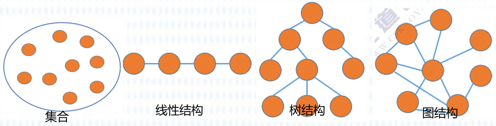

# Ⅰ. 计算机系统知识

**考纲要求：**

1. 数值及其转换
   - 二进制、十进制和十六进制等常用数制及其相互转换
2. 计算机内数据的表示
   - 数的表示(原码、反码、补码、移码表示，整数和实数的机内表示，精度和
     溢出)
   - 非数值表示(字符和汉字表示、声音表示、图像表示)
   - 校验方法和校验码(奇偶校验码、海明校验码、循环冗余校验码)
3. 算术运算和逻辑运算
   - 计算机中的二进制数运算方法
   - 逻辑代数的基本运算
4. 其他数学基础知识
5. 计算机系统的组成、体系结构的分类及特性
   - CPU和存储器的组成、性能和基本工作原理
   - 常用I/O设备、通信设备的性能以及基本工作原理
   - I/O接口的功能、类型和特性
   - I/O控制方式(中断系统、DMA、I/O处理机方式)
   - CISC/RISC、流水线操作、多处理机、并行处理
6. 存储系统
   - 主存-Cache存储系统的工作原理
   - 虚拟存储器的基本工作原理、多级存储体系
   - RAID的类型和特性
7. 可靠性与系统性能评测的基础知识
   - 诊断和容错
   - 系统可靠性分析评价
   - 计算机系统性能评测

**章节考点：**

1. 数值及其转换
2. 计算机内数据的表示
3. 计算机系统组成
4. 指令系统
5. 输入输出技术
6. 存储系统
7. 总线系统
8. 磁盘阵列技术
9. 计算机可靠性

## 一.  数值及其转换

引入：

计算机硬件唯一能识别的数据——二进制 0/1

用 低/高 电平xx分别表示 0/1 

### 1. 进制

“进位计数制”：十进制有0~9，共10种符号.逢十进一

推广：

### 2. R进制转十进制

**⽅法：“位权展开求和”**

1. 按位权展开
2. 求和

> 将R进制数按位权展开，然后各项相加，得到⼗进制数。

eg：⼆进制转⼗进制

### 3. 十进制转R进制

**⽅法：**整数除R倒取余，小数部分乘R正取整

- **整数部分：除R倒取余**

  1. ⽤⼗进制整数依次除以R,可以得到⼀个商和余数;**直到商为0时为⽌**。
  2. 把先得到的余数作为⼆进制数的低位，后得到的余数作为⼆进制数的⾼位，排列起来。

  

- **⼩数部分：乘R正取整**

  1. ⽤R乘⼗进制得到积，将整数部分取出,再⽤R乘余下的⼩数部分，⼜得到⼀个积,再将其整数部分取出，**直到积中的⼩数部分为零**。
  2. 把先得到的数作为⾼位,后得到的作为低位，排列起来。

  

### 4. 二八十六进制的转换

前置：

- 1 位⼋进制数等于 3 位⼆进制数
- 1 位⼗六进制数等于 4 位⼆进制数

***⼆与⼋互转：***

- **⼋进制转⼆进制**
  - **⽅法：⼀拆三**
    1. 将每1个⼋进制数转换为3位⼆进制数
    2.  转换后，去掉整数部分前⾯的0和⼩数部分后⾯的0
  - eg:
    
- **⼆进制转⼋进制**
  - **⽅法：三合⼀**  
    1. ⼆进制⼩数点左右两边三个⼀组
    2. 补零时整数部分前⾯补，⼩数部分后⾯补
  - eg:
    

***⼗六与⼆进制互转：***

- **⼗六进制转⼆进制**
  - **⽅法：⼀拆四**
  - eg:
    
- **⼆进制转⼗六进制**
  - **⽅法：四合⼀**  
  - eg：
    

### 特殊方法

某种数值计算已知$3\times4=15$，则 $3\times5=?$

 

## 二. 计算机内数据的表示(真值与机器数)

真值→机器数：

- $15$→$1111$      $+15$→0 1111
- $8$  →$1000$      $-8$  →1 1000

- **真值：**符合人类习惯的数字
- **机器数：**各种数据在计算机中表示的形式称为机器数，其特点是数的符号用0、1表示。即**正负号需要被“数字化”**

### 1. 机器数

**⽆符号整数**：取值范围由位数决定

- 8位:可表⽰0~255($2^8-1$)范围内的所有正整数
- 16位:可表⽰ 0～ 65535($2^{16}-1$)范围内的所有正整数
- n位:可表⽰$2^n-1$范围内的所有正整数

**有符号整数**

- 表⽰⽅法：
  ⽤⼀位表⽰符号，其余⽤来表⽰数值部分。
  **符号⽤最⾼位表⽰**: 0正1负
  - “0”表⽰正号(+)
  - “1”表⽰负号(-)

### 2. 原码反码补码和移码

数值的表⽰⽅法：原码、反码、补码、移码(针对有符号的⼆进制数)

- 对正数来说，原码=反码=补码
- **⼀般**来说我们⽤**⼀个字节(⼋位⼆进制数)来表⽰**

其符号位规则相同，数值部分的表⽰形式有差异  

| 011001 | 正数   | 负数   | 负数规则                               |
| ------ | ------ | ------ | -------------------------------------- |
| 原码   | 011001 | 111001 | 原码                                   |
| 反码   | 011001 | 100110 | 原码符号位不变，其他取反               |
| 补码   | 011001 | 100111 | 反码+1                                 |
| 移码   | 111001 | 000111 | 补码符号位取反(正数和负数都适用该规则) |

- $[+0]_原=00000000$      $[-0]_原=100000000$
- $[+0]_反=00000000$      $[-0]_反=11111111$
- $[+0]_补=[-0]_补=00000000$
- $[+0]_移=[-0]_移=10000000$
- 原码和反码的取值范围相同
- 补码和移码的取值范围相同

**原码：**用数值部分表示真值的绝对值，符号位“**0/1**”对应“**正/负**”**。(⼀般假设字⻓为8)**

- 原码⽤第⼀位表⽰符号,其余位表⽰值。
- **符号位(0正1负) + 数值位**
- 范围：若**机器字长**n+1(数值位n+符号位1)位，原码整数的表示范围$-(2^n-1)\leq x\leq 2^n-1$(关于原点对称(**真值0的表示方法有两种既有-0也有+0**))
- eg：
  

**反码：**若符号位为0(正数)，则反码与原码相同。若符号位为1(负数)，则数值位全部取反。

- **正数**的反码是其**原码本⾝**
- **负数**的反码是在其原码的基础上,**符号位不变**，**其余各个位取反**。
- **符号位(0正1负) + 数值位**
- 范围：若机器字长n+1(数值位n+符号位1)位，反码整数的表示范围$-(2^n-1)\leq x\leq 2^n-1$(关于原点对称(**真值0的表示方法有两种既有-0也有+0**))

**补码：**

- **正数**的补码就是其**本⾝**

- **负数**的补码是在其原码的基础上，**符号位不变,其余各位取反,最后+1**(即在反码的基础上+1,**要考虑进位**)

- 0正 + 不变
  1负 + (取反+1)

- **符号位(0正1负) + 数值位**

- **范围：**若机器字长n+1(数值位n+符号位1)位，补码整数的表示范围$-2^n\leq x\leq 2^n-1$(比原码和反码多一个$-2^n$(**补码的真值0只有一种表示形式**))

  > - 补码的真值0只有一种表示形式：$[+0]_补=[-0]_补=00000000$
  > - 补码比原码和反码多一个$-2^n$的原因：当反码为负数时，数值位取反 并+1

**移码：**

- **补码的基础上将符号位取反。**
- **范围：**若机器字长n+1(数值位n+符号位1)位，补码整数的表示范围$-2^n\leq x\leq 2^n-1$
- 注意：移码只能用于表示整数

### 3. 定点数和浮点数

**定点数：**

- 就是**小数点的位置固定不变的数**。

- 小数点的位置通常有两种约定方式：
  - 定点整数(纯整数，小数点在最低有效数值位之后)
  - 定点小数(纯小数，小数点在最高有效数值位之前)。

**浮点数：**

- 是**小数点位置不固定的数**，它能表示更大范围的数。

- 在浮点表示法中，阶码通常为带符号的纯整数，尾数为带符号的纯小数。

  浮点数的表示格式：
  

- 浮点数通常表示成
  $$
  N=M.R^E
  $$
  其中，M称为尾数，R称为基数，E称为阶码。
  **阶码：**决定浮点数所能表示的**数值范围**
  **尾数：**决定浮点数所能表示的**数值精度**

### 4. 校验码

数据交换难免出错，**为确保数据在传送过程中正确无误：**

- 一是提高硬件电路的可靠性
- 二是提高代码的校验能力。

**校验码：**用来**检测传送的数据是否出错。**

**码距：**指一个编码系统中任意两个合法编码之间至少有多少个二进制位不同。

校验码中的**奇偶校验码和循环冗余校验码：**(了解即可，非重点)

- **奇偶校验**基本思想是：通过在编码中**增加一位校验位**来使编码中1的个数为奇数(奇校验)或者为偶数(偶校验)，从而使码距变为2。

  对于奇校验，它可以检测代码中奇数位出错的编码，但不能发现偶数位出错的情况，即当合法编码中奇数位发生了错误，也就是编码中的1变成0或0变成1，则该编码中1的个数的奇偶性就发生了变化，从而**==可以发现错误(不可以纠正错误)==**。

- **循环冗余校验码**(CRC)广泛应用于数据通信领域和磁介质存储系统中。它利用生成多项式为$k$个数据位产生$r$个校验位来进行编码，其编码长度为$k+r$。

### 5. 海明码⭐

**海明码**的构成方法是：在数据位之间插入k个校验码，通过扩大码距来**==实现检错和纠错==**。

设数据位是$n$位，校验位是$k$位，==**则$n$和$k$必须满足：$2^k-1\geq n+k$**==

eg：

> 也就是n=16求k，这里直接带入试就行

## 三. 计算机系统组成(五大部件)

**冯诺依曼计算机的特点：**

1. 计算机由五大部件组成
2. 指令和数据以同等地位存于存储器，可按地址寻访
3. 指令和数据用二进制表示
4. 指令由操作码和地址码组成
5. 存储程序
6. 以运算器为中心

输入/输出设备与存储器之间的**数据传送**通过==运算器==完成。

**五大部件：**

- 输入设备：将信息转换为机器能识别的形式
- 输出设备：将结果转换为人们熟知的形式
- 主存储器：存放数据和程序
- 运算器：算术运算、逻辑运算
- 控制器：指挥各部件，使程序得以运行

### 1. 主存储器

 

- **存储元：**即存储二进制的电子元件，每个存储元可存1bit(1位)。存储元构成了存储单元
- **存储单元：**每个存储单元存放一串二进制代码。
- **存储字(word)：**存储单元中二进制代码的组合。
- **存储字长：**存储单元中二进制代码的位数。
  - 机器字长：计算机进行一次数据处理过程中可以处理的二进制位数。
  - 存储字长：存储字长决定了内存中一个地址可以存放的数据大小
- **MAR：**地址寄存器，它的位数可以标记存储单元的个数
- **MDR：**数据寄存器

例：

- 若MAR=4位，则共有$2\times2\times2\times2$即$2^4$个存储单元
- 若MDR=16位，则每个存储单元可存放16bit的数据

1个字节(Byte)=8bit
1B=1个字节，1b=1bit

### 2. CPU-运算器

 

- **运算器：**用于实现**算术运算**(如：加减乘除)、**逻辑运算**(如：与或非)
- **ACC：**累加器，用于存放操作数，或运算结果。
- **MQ：**乘商寄存器，在乘、除运算时，用于存放操作数或运算结果。
- **X：**通用的操作数寄存器，用于存放操作数。
- ==**ALU：**算术逻辑单元==，通过内部复杂的电路实现算数运算、逻辑运算。
- **DR：**数据缓存寄存器。
- **PSW：**状态条件寄存器，用来保存指令运行标志。

速度：$cpu(通用寄存器)>cache>内存>外存$

### 3. CPU-控制器

 

- **CU：**控制单元，分析指令，给出控制信号。
- **IR：**指令寄存器，存放**当前执行的指令**。
- **PC：**程序计数器，存放**下一条指令地址**，有**自动加1**功能。
- **AR：**地址寄存器，保存当前CPU所访问的内存单元地址。
- **ID：**指令译码器，对操作码进行分析。

**完成一条指令的步骤：**

1. 取指令
2. 分析指令
3. 执行指令

### 4. Flynn分类法

**按Flynn分类法将计算机体系结构分为**：SISD、SIMD、MISD、MIMD

> Single：单一的
> Multiple：倍数，多种多样的

## 四. 指令系统

### 1. 指令

- 指令(又称机器指令)：是指示计算机执行某种操作的命令，是计算机运行的最小功能单位。
- 一台计算机的所有指令的集合构成该机的**指令系统**，也称为指d令集。

### 2. 指令格式

一条指令就是机器语言的一个语句，它是一组**有意义**的二进制代码。

一条指令通常要包括**操作码字段**和**地址码字段**两部分：

- **操作码(OP)**：指明**操作的类型**(告诉用户要干什么)
  eg：停机中断、求反求补、加减乘除……
- **地址码(A)**：主要指明**操作数及运算结果存放的地址**(对谁进行操作)
  eg：不需要操作对象、需要一个操作对象、需要两个操作对象

### 3. 七种寻址方式

**一条指令的结构：**操作码(OP)和地址码(A)

**寻找指令中操作数有效地址的方式**称为==寻址方式==。

- **立即寻址：操作数**作为指令的一部分直接**写在指令中**，这种操作数称为立即数。
- **寄存器寻址：**指令所要的**操作数**已存储在某**寄存器中**，或把目标操作数存入寄存器。
- **直接寻址：**指令所要的**操作数**存放在**内存中**，在指令中直接给出该操作数的有效地址。
- **寄存器间接寻址：操作数**在**存储器**中，操作数的有效地址用SI、DI、BX和BP四个寄存器之一来指定。
- **寄存器相对寻址：操作数**在**存储器**中，其有效地址是一个基址寄存器或变址寄存器中的内容和指令中的8位/16位偏移量之和。
- **基址加变址寻址方式：操作数**在**存储器**中，其有效地址是一个基址寄存器和一个变址寄存器的内容之和。
- **相对基址加变址寻址：操作数**在**存储器**中，其有效地址是一个基址寄存器的值、一个变址寄存器的值和指令中的8位/16位偏移量之和。

### 4. 复杂指令集计算机-CISC vs 精简指令集计算机-RISC

|                  | CISC (Complex复杂的) | RISC (Reduced精简的)   |
| ---------------- | -------------------- | ---------------------- |
| 指令系统         | 复杂，庞大           | 简单，精简             |
| 指令数目         | 一般大于200条        | 一般小于100条          |
| 指令字长         | 不固定               | 定长                   |
| 可访存指令       | 不加限制             | 只有Load/Store指令     |
| 各种指令执行时间 | 相差较大             | 绝大多数一个周期内完成 |
| 各种指令使用频度 | 相差较大             | 都比较常用             |
| 通用寄存器数量   | 较少                 | 多                     |
| 控制方式         | 绝大多数为微程序控制 | 绝大多数为组合逻辑控制 |
| 指令流水线       | 可以通过一定方式实现 | 必须实现               |

### 5. 指令的流水处理

指令控制方式有顺序方式、重叠方式和流水方式三种。

 

在概念上，“流水”可以看成是“重叠”的延伸。

差别仅在于“一次重叠”只是把一条指令解释分解为两个子过程，而“流水”则是分解为更多的子过程。

### 6. 流水线的计算

#### 6.1 流水线执行时间的计算

**流水线执行时间计算公式**为：
$$
1条指令执行时间+(指令条数-1)\times流水线周期
$$
**流水线的周期**就是三个步骤中**用时最长的那个的时间**

**例6.1：**若指令流水线把一条指令分为取指、分析和执行三部分，且三部分的时间分别是取指$2ns$,分析$2ns$,执行$1ns$。
问：流水线周期是多少？100条指令全部执行完毕需要的时间是多少？

 

**答：**

- 流水线周期2 ns。原因：三个步骤中用时最长的时间为2 ns
- 100 条指令执行完毕需要的时间是203纳秒：

$$
2+2+1+(100-1)\times2=203
$$

#### 6.2 流水线吞吐率的计算

流水线的吞吐率(Though Put rate,TP)：是指在单位时间内流水线所完成的任务数量或输出的结果数量。

**计算流水线吞吐率的最基本的公式如下：**
$$
TP=\frac{指令条数}{流水线执行时间}
$$
**例6.1的流水线吞吐率为**：
$$
TP=\frac{100}{2+2+1+(100-1)\times2}
$$

#### 6.3 流水线的加速比计算

完成同样一批任务，不使用流水线所用的时间与使用流水线所用的时间之比称为**流水线的加速比**。

**计算流水线加速比的基本公式如下：**
$$
S=\frac{不使用流水线执行时间}{使用流水线执行时间}
$$
**例6.1的流水线加速比为**：
$$
S=\frac{100\times(2+2+1)}{(2+2+1)+2\times(100-1)}=2.463
$$

## 五.  输入输出技术(CPU与外设之间的数据传送方式)

> 掌握每一种数据传输方式的特点，前三种是经常考的

CPU与外设之间的数据传送方式：

1. **直接程序控制方式：**
   直接程序控制方式是指在完成数据的输入/输出中，整个输入/输出过程是==在CPU执行程序的控制下完成的==。这种方式还可以分为以下两种：
   1. **无条件传送方式**：无条件地与CPU交换数据，**不需要CPU执行程序指令来传送数据**。
   2. **程序查询方式**：先通过**CPU查询外设状态**，准备好**之后再与CPU交换数据**。
2. **中断方式：**
   中断方式利用中断机制，使I/O系统在与外设交换数据时，==CPU无须等待(不是不用CPU)，也不必查询I/O状态==，即可以抽身出来处理其他任务，因此提高了系统效率。
3. **直接存储器存取方式(DMA)：**
   直接存储器存取(Direct Memory Access，**DMA**)方式是在存储器与I/O设备间直接传送数据，即在内存与I/O设备之间传送一个数据块的过程中，==不需要CPU的任何干涉==，是一种==完全由DMA**硬件**完成==I/O操作的方式。
4. 输入/输出处理机：
   输入/输出处理机(IOP)是一个专用处理机，用于完成主机的输入/输出操作。IOP**根据主机的I/O命令**，完成对外设数据的输入/输出。

例：

## 六. 存储系统

### 1. 层次结构

 

- **主存——辅存：**实现虚拟存储系统，==解决了**主存容量不够**的问题==。
- **Cache——主存：**解决了==**主存与CPU速度不匹配**的问题==，

我们国家迄今为止运算速度最快的计算机：神威·太湖之光

### 2. 分类

**按位置分类：**可分为内存和外存。

- **内存(主存)：**用来存储当前运行所需要的程序和数据，速度快，容量小。
- **外存(辅存)：**用来存储当前不参与运行的数据，容量大但速度慢。

---

**按材料分类：**可分为磁存储器、半导体存储器和光存储器。

- **磁存储器：**用磁性介质做成，如磁芯、磁泡、磁盘、磁带等。
- **半导体存储器：**
  - 根据**所用元件**又可分为双极型和MOS型两类
  - 根据**是否需要刷新**又可分为静态和动态两类。
- **光存储器：**由光学、电学和机械部件等组成，如光盘存储器。

---

**按工作方式：**可分为读/写存储器和只读存储器。

- **读/写存储器(RAM)：**它指**既能读取数据也能存入**数据的存储器。
- **只读存储器(ROM)：**工作过程中**仅能读取的存储器**。

**根据数据的写入方式，又可细分为**ROM、PROM、EPROM和EEPROM等类型。

- **固定只读存储器(ROM)：**这种存储器是在厂家生产时就写好数据的，其内容只能读出，不能改变。一般用于**存放系统程序BIOS**和用于**微程序控制**。
- **可编程的只读存储器(PROM)：**其中的内容可以由**用户一次性地写入**，写入后**不能再修改**。
- **可擦除可编程的只读存储器(EPROM)：**其中的内容既可以读出，也可以由用户写入，写入后还可以修改，**紫外线照射擦除信息**。
- **电擦除可编程的只读存储器(EEPROM)：**与EPROM相似，EEPROM中的内容既可以读出，也可以进行改写，**电擦除**的方法进行数据的改写。
- **闪速存储器(Flash Memory)：简称闪存**，闪存的特性介于EPROM和EEPROM之间，类似于EEPROM,也可使用电信号进行信息的擦除操作。整块闪存可以在数秒内删除，**速度远快于EPROM**。

### 3. 高速缓存Cache

CPU速度很快，内存速度很慢，怎么办呢？

- **高速缓存(Cache)**是位于**CPU和主存之间**的高速存储子系统。
- 采用**高速缓存的主要目的**是：提高存储器的平均访问速度，使**存储器的速度与CPU的速度相匹配**。
- Cache的存在对程序员是透明的。其地址变换和数据块的替换**算法均由硬件实现**
- 通常**Cache被集成到CPU内**，以**提高访问速度**，其主要特点是**容量小、速度快、成本高**。

#### 3.1 Cache的组成

Cache由两部分组成：

1. **Cache存储器部分**：用来==存放主存的部分**复制**信息(只存储复制数据，不存储新的数据)==。
2. **控制部分**：**功能**是判断CPU**要访问的信息是否在Cache存储器中**，若在，即为命中，若不在则没有命中。

#### 3.2 Cache的三种地址映像

因为处理机都是按主存地址访问的，而应从Cache存储器中读写信息，因此就需要==**地址映像**，即把**主存中的地址映射成Cache存储器中的地址**==。**地址映像方法有三种，直接映像、全相联映像和**。

---

**直接映像：**

- 就是主存的块与Cache中块的对应关系是固定的。主存中的块**只能存放在Cache存储器的相同块号中**。因此，只要主存地址中的主存区号与Cache中的主存区号相同，则表明访问Cache命中。
-  
- **优点：**==地址变换很简单==
  **缺点：**==灵活性差==。

---

**全相联映像：**

- 允许主存的任一块**可以调入Cache的任一块的空间**。在地址变换时，将主存地址高位表示的主存块号与Cache中的主存块号进行比较，若相同则为命中。
-  
- **优点：**主存的块调入Cache的位置==不受限制，十分灵活==。
  **缺点：**无法从主存块号中直接获得Cache的块号，==变换比较复杂，速度比较慢==。

---

**组相联映像：**

- 这种方式是前面两种方式的折中。
-  
- 具体方法是将Caches**先分成组再分块**。
- 组相联映像就是==**组间**采用**直接映像**方式==，而==**组内**的块采用**全相联映像**方式==。

#### 3.3 Cache的性能分析

若$H$为Cache的命中率，$t_c$为Cache的存ddddddddddddddddd取时间，$t_m$为主存的访问时间，则**Cache的等效访问时间$t_a$为**：
$$
t=Ht_e+(1-H)t_m
$$
**使用Cache**比不使用Cache的CPU**访问存储器的速度提高的倍数$r$**可以用下式求得：
$$
r=\frac{t_m}{t_a}
$$

答：

12：A
其中C: Cache的命中率并不随其容量增大线性地提高是正确的，**Cache的命中率并不随其容量增大线性地提高，而是有一个临界点**

答：A

### 4. 主存的扩展

- **位扩展：**就是把存储位数扩展，**容量大小不变，位数变化(一次可以处理更多位的数据(**上图是从4位扩展为8位))
- **字扩展：**就是**扩大他的容量(上图中从8扩展为16)**，位数不变(一次可以处理的位数不变)

> - $1K=2^{10}$
> - $1M=2^{20}$
> - $1G=2^{30}$

解：
$$
C6FFFH-AC000H+1=1C000H=1,1100,0000,0000,0000B\\
1K=2^{10}\\
1,1100,0000,0000,0000B(前移十位)=1110000BK=112D K\\\\
内存大小=112K\times16bit\\
内存大小=28\times16K\times?\\
即112K\times16bit=(28\times16)K\times?bit\\
解得：?=4bit
$$
答案：(1) B112 K   (2) A4

### 5. 虚拟存储器

**虚拟存储器**是由主存、辅存、存储管理单元及操作系统中的存储管理软件组成的存储系统。

程序员使用该存储系统时，可以使用的内存空间可远远大于主存的物理空间，但实际上并不存在那么大的主存，故称其为虚拟存储器。

**虚拟存储器**使存储系统==既具有相当于外存的容量又具有接近于主存的访问速度==。

### 6. 磁盘存储器

 

 
$$
存取时间=寻道时间+等待时间(平均定位时间+转动延迟)
$$

注意：

- **寻道时间**是指磁头移动到磁道所需的时间
- **等待时间**为等待读写的扇区转到磁头下方所用的时间。

### 7. 总线系统

 

1. **片内总线(内部总线)**
   片内总线是芯片内部的总线。它是CPU芯片内部寄存器与寄存器之间、寄存器与ALU之间的公共连接线。
2. **系统总线**
   系统总线是计算机系统内各功能部件(CPU、主存、I/O接口)之间相互连接的总线。
   **按系统总线传输信息内容的不同**，又可分为3类：==数据总线、地址总线和控制总线==。
3. **通信总线(外部总线)**
   用于设备一级的互连，计算机可通过该总线和其他设备进行信息与数据交换。

### 8. 磁盘阵列技术(RAID)

磁盘阵列由多台磁盘存储器组成，是快速、大容量且高可靠的外存子系统。

现在常见的独立冗余磁盘阵列(RAID)就是一种由多块独立磁盘构成的冗余阵列。RAD技术分为几种不同的等级，分别可以提供不同的速度、安全性和性价比。

| RAID级 | 说明(注意对号入座)                                           |
| ------ | ------------------------------------------------------------ |
| RAID-0 | RAID-0是一种**不具各容错能力**的磁盘阵列                     |
| RAID-1 | RAID-1是采用**镜像容错技术**改善可靠性的一种磁盘阵列         |
| RAID-2 | RAID-2是采用**海明码**进行错误检测的一种磁盘阵列             |
| RAID-3 | RAID-3**减少了**用于**检验的磁盘存储器的台数**，从而提高了磁盘阵列的有效容量。一般只有**一个检验盘** |
| RAID-4 | RAID-4是一种可以**独立地对组内各磁盘进行读写的磁盘阵列**，该阵列也只用**一个检验盘** |
| RAID-5 | RAID-5是对RAID-4的一种改进，它**不设置专门的检验盘**，同一台磁盘上**既记录数据， 也记录检验信息**。这就**解决了前面多台磁盘机争用一台检验盘的间题** |
| RAID-6 | RAID-6磁盘阵列采用**两级数据冗余和新的数据编码以解决数据恢复问题**，在**两个磁盘出现故障时仍然能够正常工作。在进行写操作时，RAID-6分别进行两个独立的校验运算， 形成两个独立的冗余数据，并写入两个不同的磁盘** |

### 9. 计算机可靠性

计算机系统的可靠性是指从它开始运行$(t=0)$到某个时刻$t$这段时间内能正常运行的概率，用$R(t)$表示。

**公式为：**
$$
串联部件的可靠度=各部件的可靠度的乘积\\
并联部件的可靠度=1-部件失效率的乘积。
$$

例：

答案：B

# Ⅱ. 数据结构与算法基础

## 一. 基本概念与三要素

数据结构在学什么？

- 如何用程序代码把现实世界的问题信息化。
- 如何用计算机高效地处理这些信息从而创造价值。

> 人类社会的发展，迄今经历了和经历着三个浪潮：第一次浪潮为农业阶段，从约1万年前开始；第二次浪潮为工业阶段，从17世纪末开始；**第三次浪潮为正在到来的信息化阶段**。
>                                                                         ——《第三次浪潮(1980版)》，阿尔文托夫勒

### 1. 基本概念

**数据：**是==信息的载体==，是描述客观事物属性的数、字符及所有能输入到计算机中并被计算机程序识别和处理的符号的集合。==数据是计算机程序加工的原料==。

**数据元素、数据项：**

- **数据元素：**数据的==基本单位==**，通常作为一个整体进行考虑和处理。**一个数据元素可由==若干数据项==组成
- **数据项：**构成**数据元素的**不可分割的==最小单位==。

**数据结构：**相互之间存在一种或多种==特定关系==的数据元素的集合。

### 2. 数据结构三要素

**数据结构：**相互之间存在一种或多种**特定关系**的数据元素的集合。

**数据结构的三要素：**逻辑结构、物理结构(存储结构)、数据的运算

1. **逻辑结构：**集合、线性结构、树形结构、图状结构(网状结构)
2. **物理结构(存储结构)：**顺序存储、链式存储、索引存储、散列存储(哈希(Hash)存储)

---

**逻辑结构：**

- **集合：**各个元素同属一个集合，别**无其他关系**
- **线性结构：**数据元素之间是**一对一**的关系。除了第一个元素，所有元素**都有唯一前驱**；除了最后个元素，所有元素**都有唯一后继**。
- **树形结构：**数据元素之间是**一对多**的关系
- **图结构：**数据元素之间是**多对多**的关系。

---

**物理结构：**

- **顺序存储：**把**逻辑上相邻**的元素存储在**物理位置上也相邻**的存储单元中
- **链式存储：逻辑上相邻**的元素在**物理位置上==可以不相邻(也可以相邻)==**
- **索引存储：**在存储元素信息的同时，还**建立附加的索引表**。
- **散列存储(哈希(Hash)存储)：**根据元素的关键字**直接计算**出该元素的**存储地址**，又称哈希(Hash)存储

## 二. 算法

### 1. 什么是算法

$$
程序=数据结构+算法
$$

- **数据结构：**如何把现实世界的问题信息化将信息存进计算机。同时还要实现对数据结构的基本操作。
- **算法：**如何处理这些信息，以解决实际问题。

### 2. 算法的五个特性

- **有穷性：**一个算法必须总在执行有穷步之后结束，且每一步都可在**有穷时间内完成**。
- **确定性：**算法中每条指令必须有确切的含义，对于**相同的输入**只能**得出相同的输出**。
- **可行性：**算法中描述的操作都可以通过已经实现的**基本运算执行有限次来实现**。
- **输入：**一个算法==有**零个或多个**输入==，这些输入取自于某个特定的对象的集合。
- **输出：**一个算法==有**一个或多个**输出==，这些输出是与输入有着某种特定关系的量。

### 3. 算法效率的度量

- **时间复杂度：**时间开销与问题规模n之间的关系
- **空间复杂度：**空间开销(内存开销)与问题规模之间的关系

---

**时间复杂度：**时间开销与问题规模n之间的关系

- **简化**
  - 例子
    $T1(n)=3n+3$ → $T1(n)=O(n)$
    $T2(n)=n^2+3n+1000$ → $T2(n)=O(n^2)$
    $T3(n)=n^3+n^2+99999$ → $T3(n)=O(n^3)$

**eg：输出3000次爱你**

$$
即：T(n)=O(n)
$$

---

**空间复杂度：**空间开销(内存开销)与问题规模之间的关系

无论问题规模怎么变，**算法运行所需的内存空间都是固定的常量**。

**算法空间复杂度为$S(n)=O(1)$**

> 注：S表示"Space”

算法原地工作——算法所需内存空间为常量

==只需关注存储空间大小与问题规模相关的变量==

**函数递归调用带来的内存开销(空间复杂度)：就等于递归调用的深度**
$$
S(n)=O(n)\\
空间复杂度=递归调用的深度
$$

$O(1)<O(\log_2n)<O(n)<O(n\log_2n)<O(n^2)<O(n^3)<O(2^n)<O(n!)<O(n^n)$

## 三. 线性表

### 1. 定义

线性表是具有相同数据类型的$n(n≥0)$个数据元素的有限序列，其中为$n$表长，当$n=0$时线性表是一个空表。若用L命名线性表，则其一般表示为：
$$
L=(a_1,a_2,…,a_i,a_{i+1},…,a_n)
$$
几个概念：

- $a_i$是线性表中的"第i个”元素线性表中的**位序**。
- $a_1$是**表头元素**；$a_n$是**表尾元素**。
- **除第一个**元素**外**，每个元素**有且仅有一个直接前驱**；**除最后**一个元素外每个元素**有且仅有一个直接后继**。

eg 当n=5时：

### 2. 存储结构

| 性能类别     | 具体项目 | 顺序存储                                | 链式存储                                 |
| ------------ | -------- | --------------------------------------- | ---------------------------------------- |
| **空间**性能 | 存储密度 | $=1$，更优                              | $<1$                                     |
| **空间**性能 | 容量分配 | 事先确定                                | 动态改变，更优                           |
| **时间**性能 | 查找运算 | $O(n/2)$                                | $O(n/2)$                                 |
| **时间**性能 | 读运算   | $O(1)$，更优                            | $O([n+1]/2)$，最好情况为1，最坏情况为$n$ |
| **时间**性能 | 插入运算 | $O(n/2)$，最好情况为 $0$，最坏情况为$n$ | $O(1)$，更优                             |
| **时间**性能 | 删除运算 | $O([n-1]/2)$                            | $O(1)$，更优                             |

### 3. 线性表插入删除操作

- **顺序存储：**

  - 插入元素前**要移动元素**以挪出空的存储单元，**然后再插入元素**。
  - 删除元素时同样**需要移动元素**，以填充被删除元素的存储单元。

- **链式存储：**

  

## 四. 栈和队列

**线性表**是具有相    同数据类型的$n(n≥0)$个数据元素的有限序列，其中为$n$表长，当$n=0$时线性表是一个空表。若用L命名线性表，则其一般表示为：
$$
L=(a_1,a_2,…,a_i,a_{i+1},…,a_n)
$$

### 1. 栈的定义

**栈(Stack)：**只==允许在**一端进行插入或删除**操作的线性表==

 

### 2. 队列的定义

**队列：**一种==**先进先出**(FIFO)的线性表==，它只允许在表的**一端插入**元素，而在表的**另一端删除**元素。

- **队尾(Rear)：**在队列中，允许插入元素的一端
- **队头(Front)：**允许删除元素的一端

**循环队列：**

 

**例题：**

答案：D

## 五. 串、数组、矩阵和广义表

**串**是仅由字符构成的有限序列，是取值范围受限的线性表。一般记为
$$
S='a_1a_2\sim\sim\sim a_n'
$$

,其中S是串名，a1a2an是串值。

- **空串：长度为零**的串，空串不包含任何字符
- **空格串：**由**一个或多个空格(空格也是字符字符)**组成的串。
- **子串：**由串中任意长度的连续字符构成的序列。含有子串的串称为**主串**。子串在主串中的位置指子串首次出现时，该子串的第个字符在主串中的位置。**空串是任意串的子串**。
- **串相等：**指两个串长度相等且对应位置上的字符也相同。
- **串比较：**两个串比较大小时以字符的**ASCII码**值作为依据。比较操作从两个串的第一个字符开始进行，字符的ASCI码值大者所在的串为大；若其中一一个串先结束，则以串长较大者为大。

### 1. 串

**对串进行的基本操作有以下几种：**

- **赋值操作`StrAssign(s,)`:**将串t的值赋给串s。
- **连接操作`Concat(s,t)`:**将串t接续在串s的尾部，形成一个新串。
- **求串长`StrLength(s)`**:返回串s的长度。
- **串比较`StrCompare(s,t)`:**比较两个串的大小。
- **求子串`SubString(,tart,len)`:**返回串s中从start开始的、长度为len的字符序列。

**串的存储结构：**

- 串的顺序存储：定长存储结构
- 串的链式存储：块链
  子串的定位操作通常称为串的**模式匹配**，它是各种串处理系统中最重要的运算之一。子串也称为模式串。

### 2. 数组

| 数组类型           | 存储地址计算                                                 |
| ------------------ | ------------------------------------------------------------ |
| 一维数组 `a[n]`    | `a[i]`的**存储地址**为：$a+i\times len$                      |
| 二维数组 `a[m][n]` | `a[i][j]`的**存储地址**（按行存储）为：$a+(i\times n+j)\times len$  `a[i][j]`的**存储地址**（按列存储）为：$a+(j\times m+i)\times len$ |

eg：

$$
a+(2\times 5+3)\times 2=a+26
$$

### 3. 稀疏矩阵

**上三角矩阵：**

在矩阵中下标分别为`i`和`j`的元素，**对应的一维数组的下标**计算公式为：$(2n-i+1)×i\div2+j$

---

**下三角矩阵**

在矩阵中下标分别为`i`和`j` 的元素，**对应的一维数组 的下标**计算公式为：$(i+1) \times i\div 2+j$

解：A 代入选项

### 4. 广义表

**广义表**是$n$个表元素组成的有限序列，是**线性表的推广**。

**通常用*递归*的形式进行定义，记做：$LS(a_0,a_1,\ldots,a_n)$。**

**注：**其中LS是表名，$a_i$是表元素，它可以是表（称做子表），也可以是数据元素（称为原子)。其中$n$是广义表的长度（也就是最外层包含的元素个数），$n=0$的广义表为空表；而递归定义的重数就是广义表的深度，直观地说，就是定义中所含括号的重数（**原子的深度为0，空表的深度为1**）。

**基本运算：**取表头head(Ls)和取表尾tail(Ls)
$$
若有：LS1=(a,(b,c),(d,e))\\
取表头head(LS1)=a\\
取表尾tail(LS1)=((b,c),(d,e))
$$
eg：

答：

例一：长度3(每一个数据元素和子表算一个长度)，深度2

例二：`head(head((tail(LS1))))`

## 六. 树和二叉树

### 1. 树的基本概念

1. 结点的度：结点的分支有几个
2. 树的度：树中所有节点最大的度
3. 叶子结点：没有子节点的节点
4. 分支结点：如2和3是1的分支节点
5. 内部结点：除了根节点和叶子节点的节点
6. 父结点：相对的概念，如1节点是2、3节点的父节点
7. 子结点：相对的概念，如2、3节点是1节点的子节点
8. 兄弟结点：相对的概念，如2、3节点互为兄弟节点
9. 层次：树有几层

### 2. 二叉树的基本概念

1. **满二叉树** (Full Binary Tree)
   - 满二叉树是指**每个节点都有0个或2个子节点的二叉树**。
     **换言之，==除了叶子节点外，每个节点都有两个子节点==**。
   - **特性**：如果它有高度 $h$，那么总节点数 $n$ 可以用公式计算为：$n=2^{h+1}-1$
   - 例如，包含7个节点的树（高度为2）就是一个满二叉树。
2. **完全二叉树** (Complete Binary Tree)
   - 完全二叉树是一种特定类型的二叉树，==**除了最后一层**，**其余各层的节点数都达到最大**，并且**最后一**层的节点都**集中在左侧**==。
   - **特点：**尽量填满每一层，直至最后一层。
   - 例如，如果一棵树的高度为3，且前两层都被节点填满，最后一层是从左到右依次填入节点，这棵树就是完全二叉树。
3. **非完全二叉树** (Incompletely Binary Tree)
   - 非完全二叉树是指不满足完全二叉树定义的二叉树
   - 通常说明某些节点**可能只有一个子节点或某些层没有被完全填满**。
   - 简单来说，**任何不符合完全二叉树特性的二叉树**都可以称为非完全二叉树。

### 3. 二叉树的重要特性

1. 在二叉树的**第$i$层上最多**有$2^{i-1}$个**结点**($i\geqslant1$)
2. **深度为$k$的**二叉树**最多**有 $2^k-1$个**结点**($k\geqslant1$)
3. 对任何一棵二叉树，如果其**叶子结点数**为$n_0$，**度为$2$的结点数**为$n_2$，则$n_0=n_2+1$
4. 如果对一棵**有$n$个结点**的**完全二叉树**的结点**按层序编号**（从第1层到$\llcorner\log2n\lrcorner+1$层，每层从左到右)，则对任一结点$i(1\leqslant i\leqslant n)$，有：
   - 如果$i=1$，则结点$i$无父结点，是二叉树的根；如果$i>1$，则父结点是$\llcorner i/2\lrcorner $
   - 如果$2i>n$，则结点$i$为叶子结点，无左子结点；否则，其左子结点是结点$2i$
   - 如果$2i+1>n$,则结点$i$无右子叶点，否则，其右子结点是结点$2i+1$。

> $\llcorner \lrcorner$：向下取整

### 4. 二叉树的遍历

- **前序遍历：**根左右
- **中序遍历：**左根右
- **后序遍历：**左右根
- **层次遍历：**一层一层从上往下，从左往右

---

- 图中前序遍历结果：12457836
- 图中中序遍历结果：42785136
- 图中后序遍历结果：48752631
- 图中层次遍历结果：12345678

### 5. 反向构造二叉树

给你前序中序后序遍历的值反推二叉树

eg：

由前序序列ABHFDECG，中序遍历HBEDFAGC构造二叉树：

1. A为根节点，前A BHFDECG。中：HBEDF A GC
2. B为父节点，前A B H FDECG。 中：H B EDF A GC
3. F为父节点，前A B H F DECG。 中：H B ED F A GC
4. 分析DE和GC

### 6. 树转二叉树

- 孩子结点一**左子树结点**
- 兄弟结点一**右孩子结点**

互为兄弟节点的保留左兄弟，将所有的兄弟节点列起来

---

eg：

### 7. 二叉排序树(查找二叉树)

**特点：左**孩子**小**于根，**右**孩子**大**于根。

**例如：**序列：89,48,56,112,51,20

**插入结点：**

1. 若该键值结点**已存在**，则**不再插入**，如：48。
2. 若查找二叉树为空树，则以新结点为查找二叉树。
3. 将**要插入结点键值与插入后父结点键值比较**，就能**确定**新结点是父结点的**左子结点，还是右子结点**。

**删除结点：**

1. 若待删除结点是**叶子结点则直接删除**。
2. 若待删除**结点只有一个子结点**，则将这个**子结点与待删除结点的父结点直接连接**，
   如：56，直接将51与48连接。
3. 若待删除的结点p**有两个子结点**，则**在其左子树上，用中序遍历寻找关键值最大的结点s,用结点s的值代替结点的值，然后删除节点s,**节点s必属于上述1.2.情况之一。
   如：89，使用中序遍历找到最大值为56，将56替换89，并删除原56节点

### 8. 构造霍夫曼树(最优)

霍夫曼树是**树的带权路径最小的树**。

**所有的值都处于叶子节点上。**

对于$1，2，4，8$节点，可以构造出很多树，如

- **树的路径长度：**如左图中的2的路径长度就是：2(从根节点到2节点有两个“—”）

- **权：**权重，如4节点的权重就是4

- **带权路径长度：**$权重\times 路径长度，$如左图4的带权路径长度$4\times3=12$

- **树的带权路径长度**（树的代价）：

  左图中：$2\times2+4\times3+8\times3+1\times1=41$
  右图中：$4\times2+1\times3+2\times3+8\times1=25$

**构造霍夫曼树使树的带权路径长度最小：**

1. 将所有的数从小到大排序
2. 取前两个最小的构造叶子节点，并生成一个中间节点(两个最小的值的和)，并将中间节点与其他节点再次排序
3. 以此类推

**例：**假设有一组权值$5,29,7,8,14,23,3,11$请尝试构造哈夫曼树。

1. 排序：$3,5,7,8,11,14,23,29$
2. 选出前两个$3,5$为子节点，生成中间节点$8$
3. 再次排序$7,8,8,11,14,23,29$
4. 选出前两个$7,8$为子节点，生成中间节点$15$
5. 再次排序$8,11,14,15,23,29$
6. 依次重复循环

### 9. 线索二叉树

> 上图中绿色为前驱，红色为后置

**线索二叉树（Threaded Binary Tree）**是一种特殊的二叉树，它**通过使用空的左子指针(指向前驱)或右子指针(指向后继)来存储指向前驱或后继节点的线索**，以便于在遍历树时更高效地访问节点。这种结构避免了使用栈或递归的方式进行树的遍历，能够提高遍历的效率。

**线索二叉树的特点：**

1. **节点结构**：每个节点除了包含通常的左右子节点指针外，还用其中的空指针存储指向其前驱或后继的指针。
2. **不保持完整的子树结构**：线上指向前驱或后继的指针替代了原本可能指向子节点的空指针。
3. **遍历方式**：使用线索二叉树可以进行中序、前序或后序遍历，且可以在遍历时高效地访问节点。

**线索二叉树的类型：**

- **单线索二叉树**：每个节点最多存储一个线索（前驱或后继）。
- **双线索二叉树**：每个节点可以同时存储前驱和后继的线索。

**线索二叉树的优点：**

- 遍历更高效：减少了栈空间的使用。
- 更方便的前驱和后继获取，不需要额外的存储结构。

### 10. 平衡二叉树

**定义：**任意结点的**左右子树深度相差不超过1**，每结点的**平衡度(节点左右子树的深度差)只能为-1、0或1**。

例如：对数列$\{1,5,7,9,8,39,73,88\}$构造排序二叉树，可以构造出多棵形式不同的排序二叉树。

## 七. 图

### 1. 图的定义

- **有向图：**
  - **定义**：有向图是由一组顶点（节点）和一组有方向的边（连接顶点的线段）组成的图。每条边都有一个方向，表示从一个顶点指向另一个顶点。
  - **表示**：有向图通常表示为 $G=(V,E)$，其中 $V$ 是顶点集，$E$ 是边集，每条边可以表示为一个有序对 $(u,v)$，表示从顶点 $u$ 指向顶点$v$。
- **无向图：**
  - **定义**：无向图是由一组顶点和一组无方向的边组成的图。边在两个顶点之间没有方向，表示两个顶点之间的连接关系。
  - **表示**：无向图也可以表示为 $G=(V,E)$，其中 $V$ 是顶点集，$E$ 是边集，边可以表示为一个无序对 ${u,v}$，表示顶点 $u$ 和顶点 $v$ 之间的连接。
- **完全图：**
  
  - **在无向图中**，若**每对顶点之间都有一条边相连**，则称该图为完全图。
  - **在有向图中**，若**每对顶点之间都有二条有向边相互连接**，则称该图为完全图。
- **度，入度与出度**
  - 度：一个节点有几条连线就有几个度
  - 入度：指向它的箭头有几个就是有几个入度(针对有向图)
  - 出度：指出它的箭头有几个就是有几个出度(针对有向图)

### 2. 存储结构(邻接矩阵)

用一个$n$阶方阵$R$来存放图中各结点的关联信息，其矩阵元素$R_{ij}$定义为：
$$
R_{ij}=
\begin{Bmatrix}
1 & 若顶点i到顶点j有邻接边 \\
0 & 若顶点i到顶点j无邻接边
\end{Bmatrix}
$$
eg：

### 3. 存储结构(邻接表)

首先把每个顶点的邻接顶点用链表示出来，然后用一个一维数组来顺序存储上面每个链表的头指针。

### 4. 图的遍历

**遍历方法：**深度优先遍历、广度优先遍历

**深度优先遍历步骤：**

1. 首先访问**出发顶点V**
2. 依次**从V出发搜索V的任意一个邻接点W**
3. 若**W未访问过，则从该点出发继续深度优先遍历**，它类似于树的前序遍历。

**广度优先遍历步骤：**

1. 首先访问**出发顶点V**
2. 然后访问与顶点**V邻接的全部未访问顶点**W、X、Y.…
3. 然后再**依次访问W、X、Y...邻接的未访问**的顶点

**示例：**

 

深度优先遍历：$V_1,V_2,V_4,V_8,V_5,V_3,V_6,V_7$

广度优先遍历：$V_1,V_2,V_3,V_4,V_5,V_6,V_7,V_8$

### 5. 拓扑排序

我们把用有向边**表示活动之间开始的先后关系**。这种有向图称为**用顶点表示活动网络**，简称AOV网络。

上图的拓朴序列有：$02143567,01243657,02143657,01243567$，拓扑序列不止有一种

### 6. 最小生成树

1. **定义**：在一个无向连通图中，最小生成树是一个包含图中所有顶点的子集，同时边的总权重是最小的。
2. **性质**：
   - **包含所有顶点**：最小生成树包含图中的所有顶点，但不形成环。
   - **权重最小**：在所有可能的生成树中，最小生成树的边权重之和最小。
3. **算法**：常用的构造最小生成树的算法有：
   - **Kruskal算法(克鲁斯卡尔算法)**：通过边权进行排序，逐步添加边到生成树中，避免形成环。
   - **Prim算法(普利姆算法)**：从一个起始顶点出发，逐步添加与已有生成树连接的最小权重边。

**Prim算法(普利姆算法)：**

- 选择一个顶点(节点)，选择与该节点连接的权重最小的边的节点，连起来
- 然后考虑在连线中的节点的边的权值，将最小的权值连起来，避免形成环路
- 依次重复，不要形成环，全部顶点连玩为止

**Kruskal算法(克鲁斯卡尔算法)：**

- 直接找权重最小的一些边先连起来
- 避免形成环路，然后将没有添加进连线的顶点纳入进来

## 八. 查找

### 1. 概念

- **查找：**在数据集合中寻找满足某种条件的数据元素的过程称为查找
- **查找表（查找结构）**：用于查找的数据集合称为查找表，它由同一类型的数据元素（或记录）组成
- **关键字：**数据元素中唯一标识该元素的某个数据项的值，使用基于关键字的查找，**查找结果应该是唯一的**。
- **查找长度：**在查找运算中，需要对比关键字的次数称为查找长度。
- **平均查找长度**(ASL,Average Search Length)：所有查找过程中进行
  键字的比较次数的平均值。

### 2. 静态查找表——顺序查找

**顺序查找：**又叫“线性查找”，通常用于线性表。
**算法思想：**从头到尾挨个找（或者反过来也OK)

eg：查找43

一般情况下，$c_i=n-i+1$，因此在等概率情况下，**顺序查找成功的平均查找长度为：**
$$
ASL_{ss}=\sum^n_{i=1}p_ic_i=\frac{1}{n}\sum^n_{i=1}(n-i+1)=\frac{n+1}{2}
$$

### 3. 静态查找表——折半查找(二分查找)

折半查找，又称”二分查找”，**仅适用于有序的顺序表**。

- $mid=\frac{low+high}{2}$
- **折半时若存在小数则取整**，如$mid=7.5$，则mid取7
- 找到mid后要比较的区域记得去掉已经比较过的mid本身
  - 找左区域，比较时就比较$[min, (mid-1)]$
  - 找右区域，比较时就比较$[(mid+1),high]$

折半查找在查找成功时关键字的**比较次数最多为$\llcorner \log_2n\lrcorner+1$次**。
**折半查找的时间复杂度为$O(\log_2n)$**。

eg：

步骤：

1. mid取$\frac{1+12}{2}=6.5即6$，索引6处值为18。
   17<18，在左区域$[1\sim(6-1)]$找。
2. mid取$\frac{1+5}{2}=3$，索引3处值为10。
   17>10，在右区域$[(3+1),5]$找。
3. mid取$\frac{4+5}{2}=4.5$即$4$，索引4处值为16。
   17>16，在右区域$[(4+1),5]$找。
4. mid取$\frac{5+5}{2}=5$即，索引5处值为17。
   17=17，查找到17

### 4. 静态查找表——分块查找

**特点：**==块内无序、块间有序==。

**步骤：**

1. 第一步：索引表中确定待查记录所在的块
2. 第二步：块内顺序查找。

### 5. 哈希表(散列表)

**散列表(Hash Table)：**又称哈希表。是一种数据结构

**特点：**数据元素的**关键字**与其**存储地址直接相关**。

**例：**有一堆数据元素，关键字分别为$\{19,14,23,1,68,20,84,27,55,11,10,79\}$，使用散列函数$H(key)=key\%13$

**冲突：**

- **同义词：**若**不同的关键字**通过散列函数**映射到同一个值**，则称它们为“**同义词**”
- **冲突：**通过散列函数**确定的位置**已经**存放了其他元素**，则称这种情况为“**冲突**”
- **解决冲突：**
  - 开放地址法
  - 链地址法
  - 再哈希法
  - 建立一个公共溢出区

## 九. 排序

### 1.  排序的概念及分类

**排序：**就是重新排列表中的元素，使表中的元素满足按关键字有序的过程。

分类：

**稳定与不稳定排序：根据是否保持相等元素的相对顺序**

- **稳定排序：**是指在排序完成后，**相等元素的相对顺序保持不变**的排序方法。
  常见的稳定排序算法包括：冒泡排序、插入排序、归并排序、计数排序、基数排序
- **不稳定排序**：**不保证相等元素的相对顺序**。在这些算法中，相等元素的顺序可能会在排序后改变。
  常见的不稳定排序算法包括：快速排序、选择排序、堆排序

**内部排序与外部排序：根据数据存储的位置和处理方式的不同进行分类**

- **内部排序：**在计算机的**主存（RAM）中进行排序**操作，
  适用于数据量较小且能够完全加载到内存中的情况。
  特点：

  - 数据量较小，能够完成内存操作。
  - 速度相对较快，因为内存的读写速度远高于磁盘。

  常用的内部排序算法包括：冒泡排序、选择排序、插入排序、快速排序、合并排序

- **外部排序：**在计算机的**外部存储（如硬盘）上进行排序**，
  通常用于处理大量数据，超出了内存的处理能力。
  特点：

  - 数据量大，不能全部加载到内存中。
  - 通常采用分块的方法，将数据分成多个小块，分别进行内部排序后再合并。

  主流的外部排序算法包括：外部归并排序、多路归并排序

**排序方法分类：**

- **插入类排序：**直接插入排序、希尔排序
- **交换类排序：**冒泡排序、快速排序
- **选择类排序：**简单选择排序、堆排序
- 归并排序、基数排序

## 2. 插入类——直接插入排序

**算法思想：**每次将一个待排序的记录按其关键字大小插入到前面已排好序的子序列中直到全部记录插入完成。

### 3. 插入类——希尔排序

**算法思想：**先将待排序表分割成若干形如$L[i,i+d,i+2d,...,i+kd]$的"特殊”子表，**对各个子表分别进行直接插入排序**。缩小增量$d$,重复上述过程，直到$d=1$为止。

eg：

1. 第一轮，增量$d_1=n\div2=5$的时候，
   第一个子表(第一个$57$和第六个$28$)进行直接插入排序，$57>28$，将28和57交换位置
   第二个子表(第二个$68$和第七个$86$)进行直接插入排序，$68<86$，不交换位置
   ...
   直到第五个子表(第五个和第十个)进行比较。

2. 第二轮，增量$d_2=n_1\div2=2.5取奇数=3$的时候，

   第一个子表($28,24,96,72$)进行直接插入排序交换位置，最终为$24,28,72,96$
   第二个子表($68,19,59$)进行直接插入排序交换位置，最终为$19,59,68$
   第三个子表($33,57,52$)进行直接插入排序交换位置，最终为$33,52,57$

3. 第三轮，增量为1，此时经第二轮的结果为$24,19,33,28,59,52,72,68,57,86$，该结果就是第三轮的子表，对其进行直接插入排序交换位置，得到最终结果

### 4. 交换类——冒泡排序

**算法思想：**从后往前（或从前往后）两两比较相邻元素的值，若为逆序（即$A[i-1]>A[i]$)则交换它们，直到序列比较完。称这样过程为“一趟”冒泡排序。

eg：从后往前两两比较，$前>后$交换位置(小的放前面)

第一趟下来，第一个元素就是最小的，以此类推

### 5. 交换类——快速排序

**算法思想：**

- 在待排序表$L[1...n]$中任取一个**元素pivot作为枢轴**（或基准，通常取首元素)
  通过一趟排序将待排序表划分为独立的两部分$L[1.…k-1]$和$L[k+1...n]$,使得$L[1...k-1]$中的所有元素小于pivot,$L[k+1...n]$中的所有元素大于等于pivot,
  则pivot放在了其最终位置$L(k)$上，这个过程称为**一次“划分”**。
- 然后分别递割归地对两个子表重复上述过程，直到每部分内只有一个元素或空为止，即所有元素放在了其最终位置上。

eg：

1. 任取一个一般取首元素(这里我们取的57)为基准枢纽pivot，将$57$与$68,59,52,...,24,19$进行比较，小的放$57$前面，大的放$57$后面，经过一次划分后形成$[19,24,33,52,28],57,[96,72,59,68]$
2. 然后对左右子表分别进行重复操作
   左子表取19为基准枢纽pivot，小的前面大的放后面，右子表同理
3. 以此类推，直至每部分内只有一个元素或空为止，即所有元素放在了其最终位置上

### 6. 选择类——简单选择排序

**算法思想：**每一趟在待排序元素中**选取关键字最小的元素加入有序子序**列。

eg：

### 7. 选择类——堆排序

设有$n$个元素的序列$\{K1,K2,...,Kn\}$,当且仅当满足下述关系之时，称之为堆。

- 小顶堆：$K_i\leqslant K_{2i}$且$K_i\leqslant K_{2i+1}$
  堆顶的元素是最小的，父节点小于子节点
- 大顶堆：$K_i\geqslant K_{2i}$且$K_i\geqslant K_{2i+1}$
  堆顶的元素是最大的，父节点大于子节点

**假设**有数组$A=\{1,3,4,5,7,2,6,8,0\}$,初**建大顶堆(**根节点最大)过程如下：

1. 首先顺序建立基本的树，即图1.1
2. 从最下面的叶子节点开始比对，将8和0与根节点5比较，发现8>5将8和5交换，产生图1.2
3. 然后将叶子节点2,6与其父节点4比对，发现6>4进行交换形成图1.3
4. 然后将8,7与其父节点3比较，发现8最大，交换位置形成图1.4
5. 然后将变化了的原本已排好序的1.3中8的子节点5,0与其新父节点3进行比较，发现5最大，交换位置形成图1.5
6. 然后将8,6节点与其父节点1进行比较，发现8最大，交换位置形成图1.6
7. 然后将发生改变的5,7与其父节点1进行比较发现7最大，交换位置，形成图1.7
8. 然后将发生改变的3,0与其父节点5进行比较，发现父节点5最大，无需变化位置，图1.7即为大顶堆

### 8. 归并排序

**算法思想：**把两个或多个**已经有序的序列合并成一个**。

eg：

先将前两个合并到一起，后两个合并到一起，然后将合并起来的两个再次合并

### 9. 基数排序

**基数排序**是一种借助**多关键字排序思想**对单逻辑关键字进行排序的方法。

基数的选择和关键字的分解是根据关键字的类型来决定的。

**例如：关键字是十进制数，则按个位、十位来分解。**

### 10. 排序的评价指标

选择题形式

