## a

### 原码反码补码移码

| 011001    | 正数   | 负数   | 范围(整数)                         | 个数    | 负数规则                         |
| --------- | ------ | ------ | ---------------------------------- | ------- | -------------------------------- |
| 原码(+-0) | 011001 | 111001 | $-(2^{n-1}-1)\leq x\leq 2^{n-1}-1$ | $2^n-1$ | 原码                             |
| 反码(+-0) | 011001 | 100110 | $-(2^{n-1}-1)\leq x\leq 2^{n-1}-1$ | $2^n-1$ | 原码符号位不变，其他取反         |
| 补码(0)   | 011001 | 100111 | $-2^{n-1}\leq x\leq 2^{n-1}-1$     | $2^n$   | 反码+1                           |
| 移码(0)   | 111001 | 000111 | $-2^{n-1}\leq x\leq 2^{n-1}-1$     | $2^n$   | 补码符号位取反(正数和负数都适用) |

**补码**可以将==减法运算转化为加法运算==

### 浮点

**浮点数通常表示成**
$$
N=M.R^E
$$
其中，M称为尾数，R称为基数，E称为阶码。
**阶码：**决定浮点数所能表示的**数值范围**
**尾数：**决定浮点数所能表示的**数值精度**

### 海明码

**海明码**的构成方法是：在数据位之间插入k个校验码，通过扩大码距来**==实现检错和纠错==**。

海明码的码距为3，拓展海明码的码距为4

设数据位是$n$位，校验位是$k$位，==**则$n$和$k$必须满足：$2^k-1\geqslant n+k$**==

### CPU

**运算器：**用于实现**算术运算**(如：加减乘除)、**逻辑运算**(如：与或非)

- **ACC：累加寄存器**，简称累加器，用于==存放操作数，或运算结果==。它是一个通用寄存器。其功能是当运算器的算术逻辑单元ALU执行**算术或逻辑运算**时，为ALU提供一个工作区。
- **MQ：乘商寄存器**，在==**乘、除运算时**，用于存放操作数或运算结果==。
- **X：通用的操作数寄存器**，用于**存放操作数**。
- ==**ALU：算术逻辑单元**==，通过内部复杂的电路实现**算数运算、逻辑运算**。
- **DR：数据缓存寄存器**。在对内存储器进行读写操作时，用DR**暂时存放**由内存储器读写的**一条指令或一个数据字**，并将不同时间段内读写的**数据隔离**开。
- **PSW：状态条件寄存器**，用来保存**指令运行标志**。

速度：$cpu(通用寄存器)>cache>内存>外存$

---

**控制器：**

- **CU：控制单元**，分析指令，给出控制信号。

- ==**IR：指令寄存器**，存放**当前正在执行的指令**。==

- ==**PC：程序计数器**，存放**下一条指令地址**，有**自动加1**功能==。

  ==当执行一条指令时，处理器首先需要从**PC**中取出指令在内存中的地址，通过**地址总线寻址**获取。==
  PC具**有寄存信息和计数两种功能**，又称为指令计数器

- ==**AR：地址寄存器**，保存当前CPU所访问的内存单元地址。==

- ==**ID：指令译码器**，对操作码进行分析。==

  

### Flynn分类法

**按Flynn分类法将计算机体系结构分为**：SISD、SIMD、MISD、MIMD

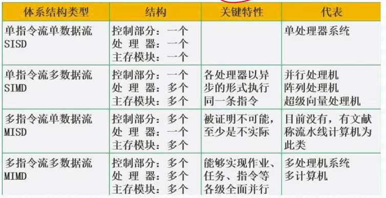

Single：单一的
Multiple：倍数，多种多样的

其中==**MISD(多指令流单数据流)**只有理论没有实例==，可以理解为多个领导指挥一个干活的，这不合理

### 指令

**CPU如何区分指令和数据：**

**指令和数据**都存储在==内存==中，传统计算机CPU在执行过程中**根据**==指令周期的不同阶段==来**区分是指令还是数据**

- **取指周期**取出的是**指令**
- **执行周期**取出的是**数据**

指令格式：**一条指令通常要包括：**==**操作码**字段和**地址码**字段==

### 指令的其中寻址方式

| 寻址方式         | 指令存储的数据                       | 取操作数的位置    | 速度 |
| ---------------- | ------------------------------------ | ----------------- | ---- |
| 立即寻址         | 操作数本身                           | 指令本身          | 最快 |
| 寄存器寻址       | 寄存器编号                           | CPU的通用寄存器中 | 较快 |
| 直接寻址         | 操作数的有效地址                     | 内存              | 较慢 |
| 间接寻址(好几种) | 操作数的有效地址(须通过计算得到地址) | 内存              | 慢   |

==**寻址速度：**立>寄>直>间==

### 流水线处理

**流水线执行时间计算公式**为：
$$
1条指令执行时间+(指令条数-1)\times流水线周期
$$
==**流水线的周期**就是三个步骤中**用时最长的那个的时间**==，因此**要使加速比和效率最大化，应该对流水线各级采用相同的运行时间**使得流水线的周期最低

**例6.1：**若指令流水线把一条指令分为取指、分析和执行三部分，且三部分的时间分别是取指$2ns$,分析$2ns$,执行$1ns$。
问：流水线周期是多少？100条指令全部执行完毕需要的时间是多少？

 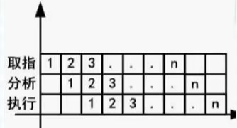

**答：**

- 流水线周期2 ns。原因：三个步骤中用时最长的时间为2 ns
- 100 条指令执行完毕需要的时间是203纳秒：

$$
2+2+1+(100-1)\times2=203
$$

### CPU与外设的数据传送方式

1. **直接程序控制方式：**
   直接程序控制方式是指在完成数据的输入/输出中，整个输入/输出过程是==在**CPU执行程序的控制**下完成的==。即**轮询**方式。
2. **中断方式：**
   中断方式利用中断机制，使I/O系统在与外设交换数据时，==CPU**无须等待**(不是不用CPU)，也不必查询I/O状态==，即可以抽身出来处理其他任务，因此提高了系统效率。这是**管理键盘最适合的 I/O 控制方式**。
3. ==**直接存储器存取方式(DMA)：**==
   - 直接存储器存取(Direct Memory Access，**DMA**)方式是在存储器与I/O设备间直接传送数据，即在内存与I/O设备之间传送一个数据块的过程中，==**不需要CPU的任何干涉**==，是一种==**完全由DMA硬件完成**==I/O操作的方式。因此**可以**实现CPU与外设的**并行**工作。
   - ==CPU在一个**总线周期**结束时响应DMA请求==

### 存储

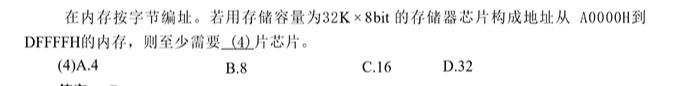

解：B

求出要表示的内存大小(由于**采用字节编址**，所以每一个地址是8bit)：
$$
(DFFFFH-A0000H+1)\times8=40000H\times8=262,144D\times8=2,097,152bit
$$
每一块芯片所表示的内存大小：
$$
32\times2^{10}\times8=262,144bit
$$
共需要的芯片数量为：
$$
2,097,152\div262.144==8
$$
或使用另一种方式计算化简(式子一样)：
$$
\frac{40000H\times8}{32k\times8}\\
=\frac{100,0000,0000,0000,0000B\times8}{32k\times8}\\
=\frac{1\times2^8\times2^{10}\times8}{2^5k\times8}\\
=\frac{2^8k\times8}{2^5k\times8}\\
=2^3
=8
$$

### Cache

**Cache存储器部分**：用来==存放主存的部分**复制**信息(只存储复制数据，不存储新的数据，Cache不是主存(内存)的扩展)==。

---

**Cache的三种地址映像**

**直接映像：**

- 就是主存的块与Cache中块的对应关系是固定的。主存中的块**只能存放在Cache存储器的相同块号中**。因此，只要主存地址中的主存区号与Cache中的主存区号相同，则表明访问Cache命中。
- 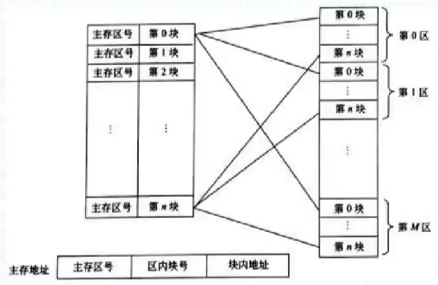
- **优点：**==地址变换很简单==
  **缺点：**==灵活性差==。

---

**全相联映像：**

- 允许主存的任一块**可以调入Cache的任一块的空间**。在地址变换时，将主存地址高位表示的主存块号与Cache中的主存块号进行比较，若相同则为命中。
- 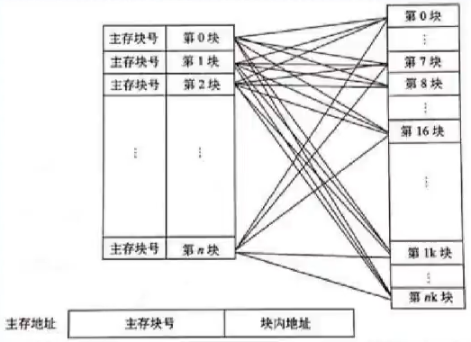
- **优点：**主存的块调入Cache的位置==不受限制，十分灵活,，块冲突次数最小==。
  **缺点：**无法从主存块号中直接获得Cache的块号，==变换比较复杂，速度比较慢==。

---

**组相联映像：**

- 这种方式是前面两种方式的折中。
- 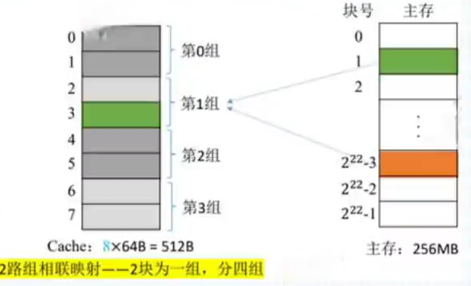
- 具体方法是将Caches**先分成组再分块**。
- 组相联映像就是==**组间**采用**直接映像**方式==，而==**组内**的块采用**全相联映像**方式==。

### 总线

**地址总线(AB)：**

- ==若总线为$n$位，**最大寻址空间**为$2^nB$==
- ==单向==传输总线在计算机存储器中，要想**访问某存储单元的内容**， **CPU需要首先**<u>通过==地址总线==给出存储单元的地址</u>
- 地址总线的**位数** **决定**了CPU可**直接寻址的内存空间的大小**

**串⾏总线**：适用于长距离传输

并⾏总线：适合**近距离高速**数据传输

### 计算机的可靠性

**计算机系统的可靠性**是指从它开始运行$(t=0)$到某个时刻$t$这段时间内能正常运行的概率，用$R(t)$表示。

**公式为：**
$$
串联部件的可靠度=各部件的可靠度的乘积\\
并联部件的可靠度=1-部件失效率的乘积。
$$

---

**~~失效率~~**是指单位时间内失效的元件数与元件总数的比例，用$\lambda$表示。当$\lambda$为常数时，对于某一特定时间 t，存活的元件数可以用 **指数分布** 来表示，其形式为：
$$
R(t)=e^{\lambda t}
$$
这里，**R(t)** 是在时间 t 时元件仍然有效的概率。


例：

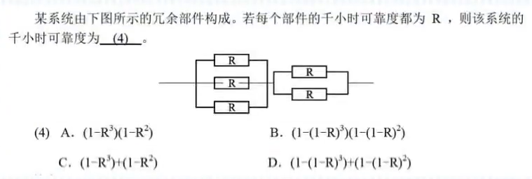

答案：B

## 算法

- **输入：**一个算法==有**零个或多个**输入==，这些输入取自于某个特定的对象的集合。
- **输出：**一个算法==有**一个或多个**输出==，这些输出是与输入有着某种特定关系的量。

**空格串：**由**一个或多个空格(==空格也是字符==)**组成的串。

### 二叉树

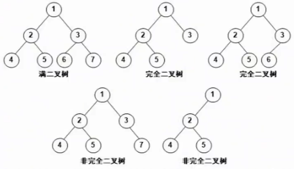

1. 平衡二叉树
   **定义：**任意结点的**左右子树深度相差不超过1**，每结点的**平衡度(节点左右子树的深度差)只能为-1、0或1**。
2. **满二叉树** (Full Binary Tree)
   - 满二叉树是指**每个节点都有0个或2个子节点的二叉树**。
     **换言之，==除了叶子节点外，每个节点都有两个子节点==**。
   - **特性**：如果它有高度 $h$，那么总节点数 $n$ 可以用公式计算为：$n=2^{h+1}-1$
   - 例如，包含7个节点的树(高度为2)就是一个满二叉树。
3. **完全二叉树** (Complete Binary Tree)
   - 完全二叉树是一种特定类型的二叉树，==**除了最后一层**，**其余各层的节点数都达到最大**，并且**最后一**层的节点都**集中在左侧**==。
   - **特点：**尽量填满每一层，直至最后一层。
   - 例如，如果一棵树的高度为3，且前两层都被节点填满，最后一层是从左到右依次填入节点，这棵树就是完全二叉树。
4. **非完全二叉树** (Incompletely Binary Tree)
   - 非完全二叉树是指不满足完全二叉树定义的二叉树
   - 通常说明某些节点**可能只有一个子节点或某些层没有被完全填满**。
   - 简单来说，**任何不符合完全二叉树特性的二叉树**都可以称为非完全二叉树。

### 树转二叉树

- 孩子结点一**左子树结点**
- 兄弟结点一**右孩子结点**

互为兄弟节点的保留左兄弟，将所有的兄弟节点列起来

eg：

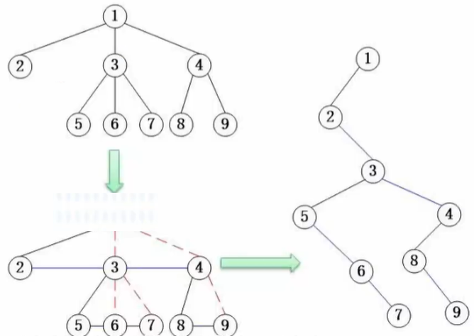

### 邻接表

存储结构(邻接表)

首先把每个顶点的邻接顶点用链表示出来，然后用一个一维数组来顺序存储上面每个链表的头指针。

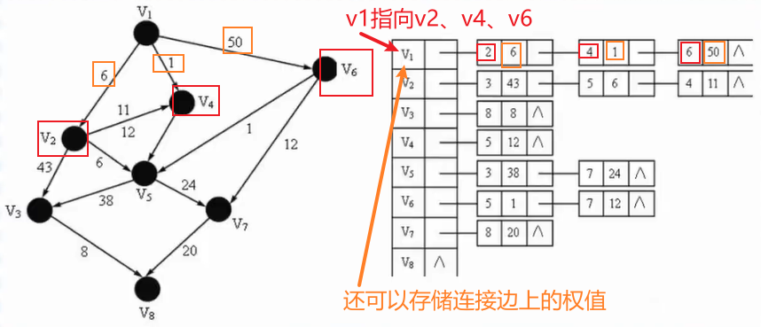

### 邻接矩阵

用一个$n$阶方阵$R$来存放图中各结点的关联信息，其矩阵元素$R_{ij}$定义为：
$$
R_{ij}=
\begin{Bmatrix}
1 & 若顶点i到顶点j有邻接边 \\
0 & 若顶点i到顶点j无邻接边
\end{Bmatrix}
$$
邻接矩阵演示：左边是图结构，右边表示该图的邻接矩阵

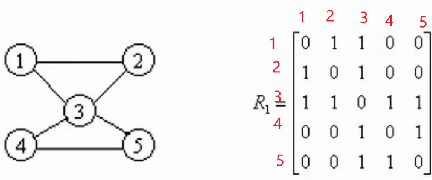

eg：

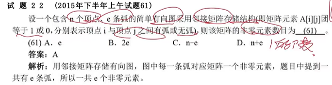

### 图的遍历

设n个顶点e条弧，无论深度优先还是广度优先，==时间复杂度都为$O(n+e)$==

### 最小生成树

1. **定义**：在一个无向连通图中，最小生成树是一个包含图中所有顶点的子集，同时边的总权重是最小的。
2. **性质**：
   - **包含所有顶点**：最小生成树包含图中的所有顶点，但不形成环。
   - **权重最小**：在所有可能的生成树中，最小生成树的边权重之和最小。
3. **算法**：常用的构造最小生成树的算法有：
   - **Kruskal算法(克鲁斯卡尔算法)**：通过边权进行排序，逐步添加边到生成树中，避免形成环。
   - **Prim算法(普利姆算法)**：从一个起始顶点出发，逐步添加与已有生成树连接的最小权重边。

### Prim算法(普利姆算法)：

- 选择一个顶点(节点)，选择与该节点连接的权重最小的边的节点，连起来
- 然后考虑在连线中的节点的边的权值，将最小的权值连起来，避免形成环路
- 依次重复，不要形成环，全部顶点连玩为止

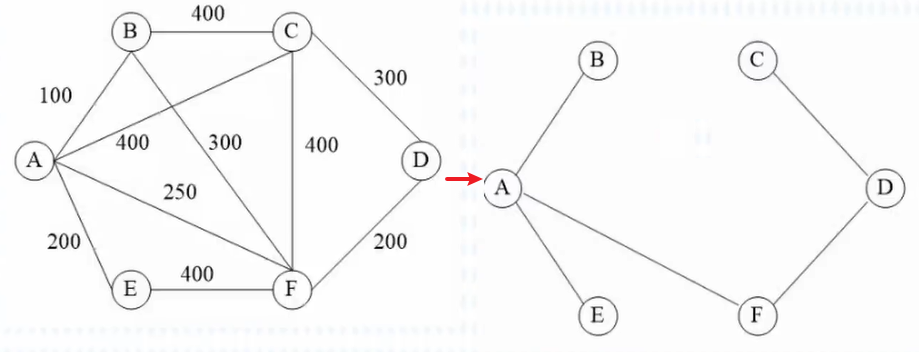

### Kruskal算法(克鲁斯卡尔算法)：

属于**贪心法**

1. 直接找权重最小的一些边先连起来
2. 避免形成环路，然后将没有添加进连线的顶点纳入进来
3. 循环1，2步骤直到遍历完所有顶点


### 二分查找

折半查找，又称”二分查找”，**仅适用于有序的顺序表**。

- $mid=\frac{low+high}{2}$
- **折半时若存在小数则取整**，如$mid=7.5$，则mid取7
- 找到mid后要比较的区域记得去掉已经比较过的mid本身
  - 找左区域，比较时就比较$[min, (mid-1)]$
  - 找右区域，比较时就比较$[(mid+1),high]$

折半查找在查找成功时关键字的**比较次数最多为$\llcorner \log_2n\lrcorner+1$次**。
**折半查找的时间复杂度为$O(\log_2n)$**。

### 分块查找

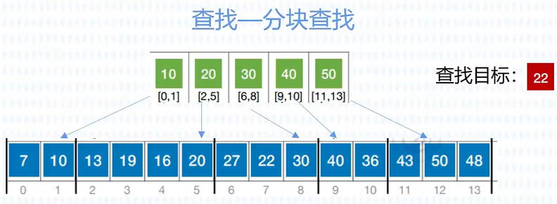

**特点：**==块内无序、块间有序==。

**步骤：**

1. 第一步：索引表中确定待查记录所在的块
2. 第二步：块内顺序查找。

### 直接插入排序

每一趟将一个待排序的记录，按照其关键字的大小插入到有序队列的合适位置里，直到全部插入完成,比如**斗地主抽牌就是这样的规则**。

**算法思想：**每次将一个待排序的记录按其关键字大小插入到前面已排好序的子序列中直到全部记录插入完成。

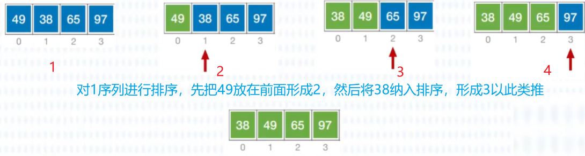

==**待排序的关键字基本有序时**宜采用**插入排序**算法==，**每趟排序移动元素较少**。

### 希尔排序

**算法思想：**先将待排序q表分割成若干形如$L[i,i+d,i+2d,...,i+kd]$的"特殊”子表，**对各个子表分别进行直接插入排序**。缩小增量$d$,重复上述过程，直到$d=1$为止。

**即**把记录**按步长 gap 分组**，对每组记录**采用直接插入排序方法进行排序**。随着步长逐渐减小，所分成的组包含的记录越来越多，**当步长的值减小到 1** 时，整个数据**合成为一组**，构成一组有序记录，则完成排序。

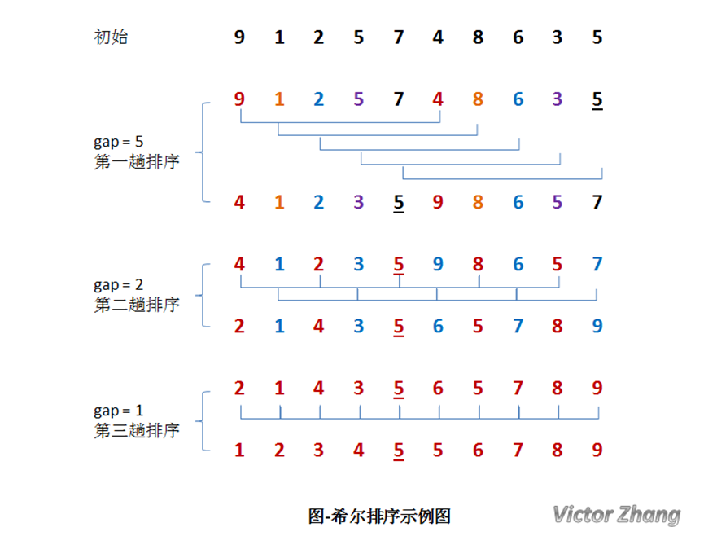

### 快速排序

**算法思想：**

- 在待排序表$L[1...n]$中任取一个**元素pivot作为枢轴**(或基准，通常取首元素)
  通过一趟排序将待排序表划分为独立的两部分$L[1.…k-1]$和$L[k+1...n]$,使得$L[1...k-1]$中的**所有元素小于pivot**,$L[k+1...n]$中的**所有元素大于等于pivot,**
  则pivot放在了其最终位置$L(k)$上，这个过程称为**一次“划分”**。
- 然后分别递割归地对两个子表重复上述过程，直到每部分内只有一个元素或空为止，即所有元素放在了其最终位置上。

快速排序算法属于**分治法**。

**时间复杂度：**

- **最好**：$O(n\lg_n)$，每一轮过后左右两边都是均分的，最佳的基准元素选择的是选择待划分数组的**中位数**元素，如eg29题。
- **最坏**：$O(n^2)$，每一轮过后左右两边都是极其不平均的，即每次选的都是最大值或最小值

### 简单选择排序

**算法思想：**每一趟在待排序元素中选取关键字最小的元素加入有序子序列。**每趟**从待排序的记录中**选出关键字最小的**记录，顺序**放在已排序的记录序列末尾**，直到全部排序结束为止。

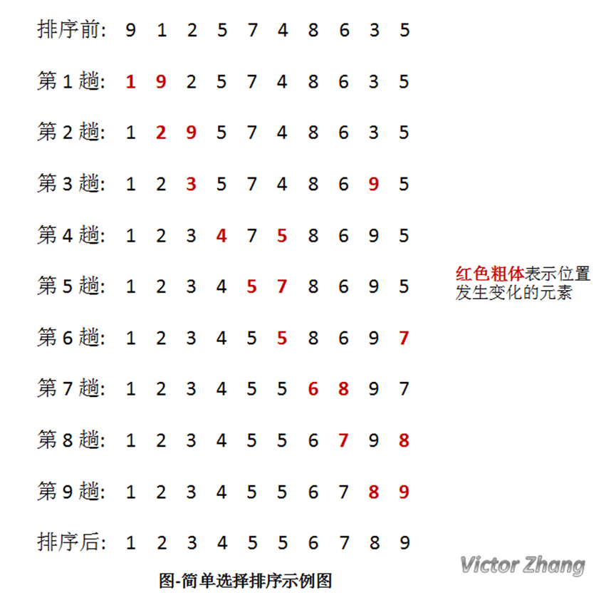

### 归并排序

**算法思想：**把两个或多个**已经有序的序列合并成一个**。将待排序序列R[0...n-1]看成是n个长度为1的有序序列，将相邻的有序表成对归并，得到n/2个长度为2的有序表；将这些有序序列再次归并，得到n/4个长度为4的有序序列；如此反复进行下去，最后得到一个长度为n的有序序列。

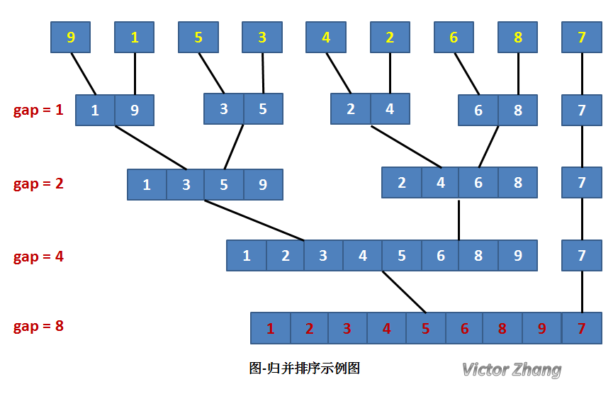

### 排序的评价指标

| 排序方法         | 时间复杂度  | 空间复杂度 | 稳定性   |
| ---------------- | ----------- | ---------- | -------- |
| **直接插入排序** | 0(n²)       | 0(1)       | **稳定** |
| 简单选择排序     | 0(n²)       | 0(1)       | 不稳定   |
| **冒泡排序**     | 0(n²)       | 0(1)       | **稳定** |
| 希尔排序         | 0(n1.3)     | 0(1)       | 不稳定   |
| 快速排序         | O(nlog2n)   | 0(logzn)   | 不稳定   |
| 堆排序           | O(nlog2n)   | 0(1)       | 不稳定   |
| **归并排序**     | O(nlog2n)   | o(n)       | **稳定** |
| **基数排序**     | o(d(n + r)) | 0(rd)      | **稳定** |

选择题形式:

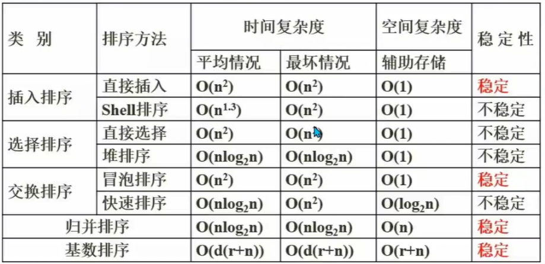

**稳定性：**假如一个序列中有多个相同数据，排序前和排序后相同数据的前后关系不变就是稳定

### 基数排序

**基数排序**是一种借助**多关键字排序思想**对单逻辑关键字进行排序的方法。

基数排序与本系列前面讲解的七种排序方法都不同，**它不需要比较关键字的大小**。它是根据关键字中各位的值，通过对排序的N个元素进行若干趟“分配”与“收集”来实现排序的。

---

设有一个初始序列为: R {50, 123, 543, 187, 49, 30, 0, 2, 11, 100}。

我们知道，任何一个阿拉伯数，它的各个位数上的基数都是以0\~9来表示的。所以我们不妨把0\~9视为10个桶。 我们先根据序列的个位数的数字来进行分类，将其分到指定的桶中。例如：R[0] = 50，个位数上是0，将这个数存入编号为0的桶中。

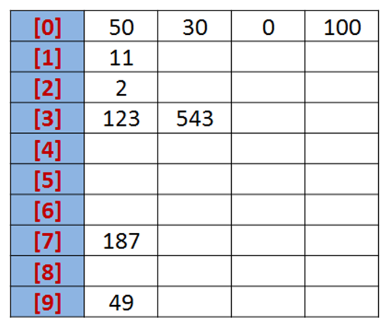

分类后，我们在从各个桶中，将这些数按照从编号0到编号9的顺序依次将所有数取出来。这时，得到的序列就是个位数上呈递增趋势的序列。 按照个位数排序： {50, 30, 0, 100, 11, 2, 123, 543, 187, 49}。

### 分治法——分而治之

**对于一个规模为$n$的问题，**

- **若**该问题**可以容易地解决**(比如说规模n较小)则**直接解决**，
- **否则**将其**分解为$k$个规模较小的子问题**，
  - ==这些子问题**互相独立且与原问题形式相同**==，**递归**地解这些子问题，然后将各子问题的解合，并得到原问题的解。

**问题的要求：**

- 该问题的规模**缩小到一定的程度就可以容易地解决**
- 该问题可以**分解为若干个规模较小的相同问题**。
- 利用该问题分解出的**子问题的解可以合并为该问题的解**
- 该问题所分解出的**各个子问题是相互独立的**。

**步骤**

一般来说，分治算法在每一层递归上都有3个步骤。

1. **分解：**将原问题分解成一系列子问题。
2. **求解：**递归地求解各子问题。若子问题足够小，则直接求解
3. **合并：**将子问题的解合并成原问题的解

### 递归

**递归：**就是在运行的过程中调用自己。

**函数递归调用带来的内存开销：**$S(n)=O(n)$即$空间复杂度=递归调用的深度$

### 回溯法

==深度优先搜索法：==

回溯法是种**选优搜索法**，按选优条件向前搜索，以达到目标。但当搜索到某一步时，发现原先选择并不优或达不到目标，就退回一步重新选择。这种<u>走不通就退回再走的技术</u>就是**回溯法**。

### 贪心法

==局部最优==

总是做出在当前来说是最好的选择，而**并不从整体上加以考虑**，它所做的每步选择只是==当前步骤的**局部最优选择**==，但从整体来说不一定是最优的选择。由于它不必为了寻找最优解而穷尽所有可能解，因此其耗费时间少，**一般可以快速得到满意的解，但得不到最优解**。也==常用于解决**最优化的问题**==。

用贪心法求解的**问题一般具有两个重要的性质：**

1. **最优子结构：**当一个问题的最优解包含其子问题的最优解时，称此问题具有最优子结构。==<u>问题的最优子结构</u>是该问题**可以采用动态规划法或者贪心法求解**的关键性质==。
2. **贪心选择性质：**指问题的==<u>整体最优解可以通过一系列**局部最优**的选择</u>，即贪心选择来得到。这是**贪心法和动态规划法的主要区别**==

### 动态规划法

> 与分治法最大的区别：**子问题不独立**

==**子问题不独立(区别于分治法)：**==

**基本思想：**将待求解问题分解成若干个子问题，先求解子问题，然后从这些子问题的解得到原问题的解。

**与分治法不同的是**，适合于用动态规划法求解的问题，==经分解得到的**子问题往往不是独立的。**==

动态规划算法==通常用于求解**具有某种最优性质的问题**==。在这类问题中，可能会有许多可行解，每个解都对应于一个值，我们希望找到具有最优值的那个解。当然，最优解可能会有多个，**动态规划算法能找出其中的一个最优解**。

- ==当一个问题具有最优子结构时，提示我们**动态规划法可能会适用**，但是此时**贪心策略可能也是适用的**==。
- **动态规划法**总是充分**利用重叠子问题**，对**每个子问题仅计算一次**，把**解保存在**一个在需要时就可以查看的**表中**，而每次**查表**的时间为常数

### 背包问题

- 01背包问题：用**动态规划**，因为需要全局搜索且不可分割。
- 分数背包问题：用**贪心算法**，因为局部最优（按性价比选择）能保证**全局最优**。

01背包问题**时间复杂度：**$O(nW)$

部分背包问题**时间复杂度：**归并排序$O(n\lg n)$

## 操作系统

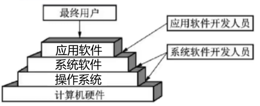

### 操作系统的特征

**操作系统的特征：**<u>并发性、共享性、虚拟性、异步(不确定性)</u>

其中<u>并发性、共享性</u>是**最基本的特征**

### 进程

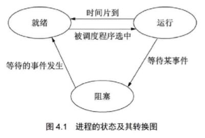

### 动态分区分配

#### 4.1 动态分区分配——首次适应算法

**算法思想：**每次都**从低地址开始**查找，**找到第一个能满足大小的空闲分区**。

**如何实现：**空闲分区以地址递增的次序排列。每次分配内存时顺序查找空闲分区链(或空闲分区表)，找到大小能满足要求的第一个空闲分区。

eg：某计算机系统的内存大小为128k,采用可变分区分配方式进行内存分配，当前系统的内存分块情况如下图所示，
**现有作业4申请内存9k**,几种不同的存储分配算法在分配中，会产生什么样的结果呢？

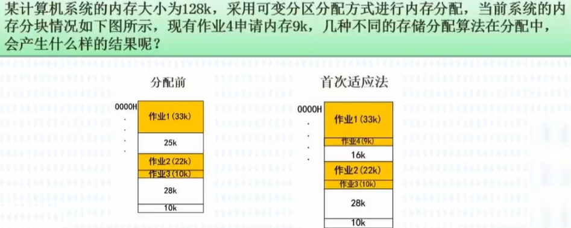

#### 4.2 动态分区分配——最佳适应算法

**算法思想：**由于动态分区分配是一种连续分配方式，为各进程分配的空间必须是连续的一整片区域。因此为了**保证当“大进程”到来时能有连续的大片空间，可以尽可能多地留下大片的空闲区**，即，**优先使用更小的空闲区**。

**如何实现：**空闲分区按**容量递增次序**链接。每次分配内存时**顺序查找空闲分区链**(或空闲分区表)，找到大小能**满足要求的第一个空闲分区**。

eg：某计算机系统的内存大小为128k,采用可变分区分配方式进行内存分配，当前系统的内存分块情况如下图所示，
**现有作业4申请内存9k**,几种不同的存储分配算法在分配中，会产生什么样的结果呢？

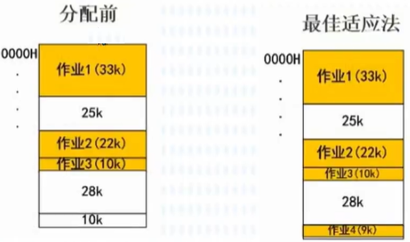

#### 4.3 动态分区分配——最差适应算法

**算法思想：**为了解决最佳适应算法的问题，即留下太多难以利用的小碎片可以在每次分配时**优先使用最大的连续空闲区**，这样分配后剩余的空闲区就不会太小，更方便使用。

**如何实现：**空闲分区按容量**递减次序**链接。
每次分配内存时**顺序查找空闲分区链**(或空闲分区表)，找到大小能**满足要求的第一个空闲分区**。

eg：某计算机系统的内存大小为128k,采用可变分区分配方式进行内存分配，当前系统的内存分块情况如下图所示，
**现有作业4申请内存9k**,几种不同的存储分配算法在分配中，会产生什么样的结果呢？

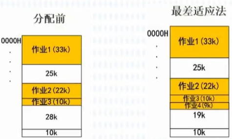

#### 4.4 动态分区分配——邻近适应算法

**算法思想：**首次适应算法每次都从链头开始查找的。这可能会导致低地址部分出现很多小的空闲分区，而每次分配查找时，都要经过这些分区，因此也增加了查找的开销。如果**每次都从上次查找结束的位置开始检索**，就能解决上述问题。

**如何实现：**空闲分区以地址递增的顺序排列(可排成一个循环链表)。每次分配内存时从上次查找结束的位置开始查找空闲分区链(或空闲分区表)，找到大小能满足要求的第一个空闲分区。

### 分页存储管理

#### 5.1 纯分页存储管理

**地址结构(逻辑地址)**通常由两个部分组成：<u>页号和页内地址</u>

分页系统的地址结构如图4.2所示。

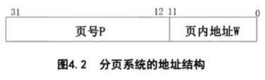

- ==分页系统的地址结构：前一部分为**页号P**；后一部分为**偏移量W、即页内地址**==。

- 图中的地址长度为32位，其中0～11位为页内地址（每页的大小为4KB)，12～31位为页号，所以允许地址空间的大小最多为1MB每页。

**页号(Page Number)**：

- 定义：在逻辑地址空间中，特定页面的位置。逻辑地址空间被划分为**固定大小**的页面，每个页面都有一个唯一的页号。
- 作用：用于指示逻辑地址所对应的虚拟内存页面。这部分地址能够帮助系统找到与该页号对应的页面框在物理内存中的位置。
- **页号P**==决定**虚拟内存的页数**==，若页号占 n位，则系统支持的**最大页面数量**为 $2^n$ 页。

**页内地址(页内偏移)(Offset)**：

- 定义：表示逻辑地址在特定页面内的具体位置。它指向该页的具体字节位置。

- 作用：页内地址用于决定在当前所访问页面内的确切位置。
- **偏移量W**==决定**页的大小（每页的字节数）**==，若偏移量占 m*m* 位，则**页的大小**为 2^m2*m* 字节。

**页表**的作用：是==实现**从页号到物理块号的地址映射**==。

### 分段存储管理

**逻辑地址**：==**段号(名)S和段内地址D**两部分组成==，如图4.3所示。在该地址结构中，允许一个作业最多有$2^{(31-16+1=16)}$即64K个段，每个段的最大长度为$2^{(15-0+1)=16}$即64KB。

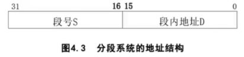

- **段号S**决定**最多多少个段**
- **段内地址**决定**段的最大长度**

### 段页式存储管理

**原理：**先将整个主存划分成大小相同的存储块，将用户程序按程序的逻辑关系分为若干个段，并为每个段赋予一个段名，再将每个段划分成若干个页，以页架为单位离散分配。

**访问数据：**当程序需要访问数据时，首**先通过段表找到对应的段**，然后**通过段内的页表找到具体的物理地址**(先分段再分页)。

这种方式结合了段式管理的灵活性和页式管理的高效性，更适合现代复杂的计算机系统。

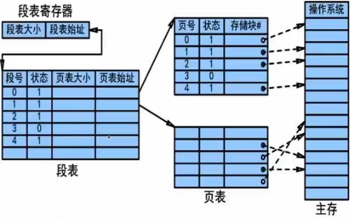

- **优点：**空间浪费小、存储共享容易、存储保护容易、能动态连接。
- **缺点：**由于管理软件的增加，复杂性和开销也随之增加，需要的硬件以及占用的内容也有所增加，使得执行速度大大下降。

**地址结构(逻辑地址)组成**：==段号S、段内页号P、页内地址W==。

### 页面置换算法

不管使用哪种存储管理，最后内存都会被基本装满，而在后续程序执行过程中，当所需要的数据信息又不在内存时，应该怎么办呢？

由操作系统负责将内存中暂时用不到的信息换出到外存，而==用页面置换算法用来决定应该将哪个页面换出内存==

页面置换算法：

- **最佳置换算法(OPT)**
- **先进先出置换算法(FIFO)**
- **最近最久未使用置换算法(LRU)**
- 时钟置换算法(CLOCK)

#### 9.1 页面置换算法——最佳置换算法(OPT)

**最佳置换算法(OPT,Optimal)):**每次选择==淘汰的是**以后永不使用**，或者**在最长时间内不再被访问**==**的页面**，这样可以**保证最低的缺页率**。

淘汰的之后最久的，要往后看

**例：**假设系统为某进程分配了三个内存块，并考虑到有一下页面号引用串(会依次访问这些页面)：$7,0,1,2,0,3,0,4,2,3,0,3,2,1,2,0,1,7,0,1$

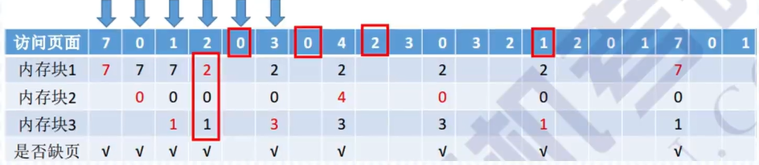

[视频解析26分](https://www.bilibili.com/video/BV1rc411t71D?spm_id_from=333.788.player.switch&vd_source=796ed40051b301bfa3a84ba357f4828c&p=11)

当前内存访问不到就是缺页

从左往右看这个表，往后看找内存中相对来说长时间不用或用不适用的替换掉

**按最佳置换的规则，往后寻找，最后一个出现的页号就是要淘汰的页面。**

#### 9.2 页面置换算法——先进先出FIFO

**先进先出置换算法(FIFO)：**每次选择==淘汰的页面是**最早进入内存的页面**==

**例：**假设系统为某进程分配了三个内存块，并考虑到有以下页面号引 用串：$3,2,1,0,3,2,4,3,2,1,0,4$

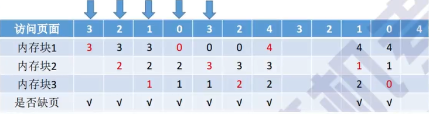

**按先进先出的规则，往前寻找，最前一个出现的页号就是要淘汰的页面。**

#### 9.3 页面置换算法——最近最久未使用LRU

**最近最久未使用置换算法(LRU,leastrecentlyused)：**每次==淘汰的页面是**最近最久未使用的页面**==

淘汰的之前最久的，要往前看

可以==往前找在内存中的几个页面号==，最后一个出现的页号就是要淘汰的页面。

**例：**假设系统为某进程分配了四个内存块，并考虑到有以下页面号引用串$1,8,1,7,8,2,7,2,1,8,3,8,2,1,3,1,7,1,3,7$

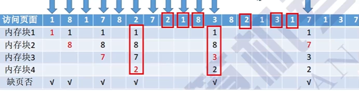

## 七层网络体系结构

| 层次 | 名称       | 主要功能                          | 主要设备及协议                                           |
| ---- | ---------- | --------------------------------- | -------------------------------------------------------- |
| 7    | 应用层     | 实现**具体的应用功能**            | **POP3、FTP、HTTP、Telnet、SMTP、DHCP、TFTP、SNMP、DNS** |
| 6    | 表示层     | 数据的**格式与表达、加 密、压缩** | 同上                                                     |
| 5    | 会话层     | **建立、管理和终止会话**          | 同上                                                     |
| 4    | 传输层     | **端到端**的连接                  | **TCP、UDP**                                             |
| 3    | 网络层     | **分组传输和路由选择**            | **三层交换机、路由器**、ARP、RARP、IP、ICMP、IGMP        |
| 2    | 数据链路层 | 传送以**帧为单位**的信息          | **网桥、交换机**、网卡、PPTP、L2TP、SLIP、PPP            |
| 1    | 物理层     | **二进制**传输                    | **中继器、集线器**                                       |

### TCP/IP分层模型

从==**上而下分**为<u>应用层、传输层、网际层和网络接口层</u>==。

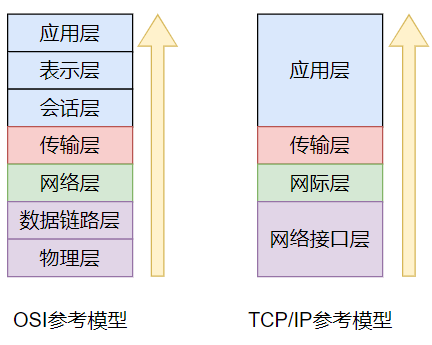

### ARP和RARP

- ==**ARP的作用**是<u>将IP地址**转换**为物理地址</u>==
- ==**RARP的作用**是<u>将物理地址**转换**为IP地址</u>==。

### 网络协议

ICMP：就是一个专门用于**发送差错报文**的协议。

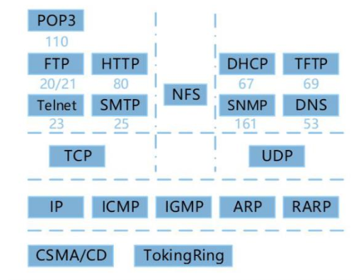

| 服务                                                         | 协议                                    | 端口                                           |
| ------------------------------------------------------------ | --------------------------------------- | ---------------------------------------------- |
| DNS域名服务                                                  | UDP                                     | 53                                             |
| 远程登录服务Telnet                                           | TCP                                     | 23                                             |
| 电子邮件服务<br />SMTP：简单邮件传送协议<br />POP3协议：接收邮件 | TCP                                     | SMTP：25<br />POP3：110                        |
| WWW服务                                                      | TCP                                     | 80                                             |
| 文件传输服务                                                 | 客户机与服务器的内部建立两条**TCP**连接 | 控制，传输命令和参数：21<br />数据，传送文件20 |

==$SSL+HTTP=HTTPS$==

==Http端口是**80**，==
==Https端口是**443**。==

## 数据库运算

==七种关系的基本运算：**并$\cup$、交$\cap$、差$-$、笛卡尔积$\times$、投影$\pi$、选择$\sigma$、联接(连接)$\bowtie$  **==

### 查询的优化原则

关系代数表达式**查询优化的原则**如下：

1. **提早执行选取运算**。对于有选择运算的表达式，应优化成**尽可能先执行==选择($\sigma$选取行)==运算**的等价表达式，以得到较小的中间结果，减少运算量以及从外存读块的次数。
2. **==再进行连接($\times$笛卡尔积)运算==，合并乘积与其后的选择运算为连接运算**。
3. 将**投影运算与其后的其他运算同时进行，以避免重复扫描关系**
4. 将**投影运算和其前后的二目运算结合起来**，因为没有必要为未去掉某些字段再扫描一遍关系。
5. 在**执行连接前对关系适当地预处理**，就能快速地找到要连接的元组。
6. **存储公共子表达式。**对于有公共子表达式的结果应存于外存(中间结果)，这样，当从外存读出它的时间比计算的时间少时，就可节约操作时间。

**eg：D**

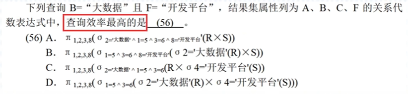

提早执行选择$\sigma$运算，直接秒D，**先进行选择$\sigma$操作再进行笛卡尔$\times$连接**操作

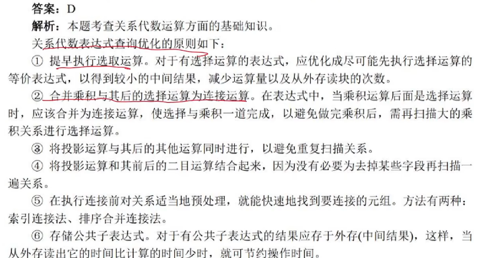

### 函数依赖

- **完全函数依赖：**在$R(U)$中，如果$X→Y$，并且对于$X$的任何一个真子集$X^{'}$，都有$X^{'}$不能决定$Y$，则称$Y$对$X$完全函数依赖，记作$X \xrightarrow{f} Y$。

- **==部分函数依赖==：**如果$X→Y$，但$Y$不完全函数依赖于$X$，则称$Y$对$X$部分函数依赖，记作$X \xrightarrow{p} Y$。部分函数依赖也称局部函数依赖。

  > 下图中左图A决定C，但是C不完全依赖于A。

- **==传递依赖==：**在$R(U,F)$中，如果$X→Y$,$Y\nsubseteq X$，$Y$不能函数决定$X$，$Y→Z$,则称$Z$对$X$传递依赖。

  > 下图中右图A决定B，B又决定A，那么A就能到C，这就是传递，但是B不能到A

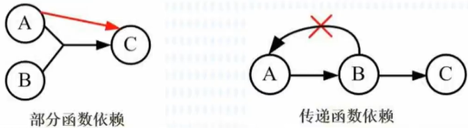

### 范式

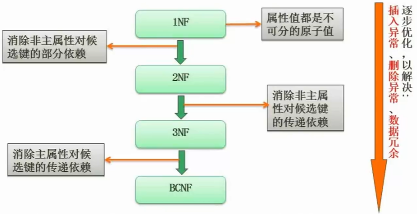

**第一范式(1NF)：**

- 若关系模式R的==每一个分量都是**不可再分的数据项**==，则关系模式R属于第一范式(1NF)。
- 反例：高级职称可以分为教授和副教授，因此不满足第一范式
  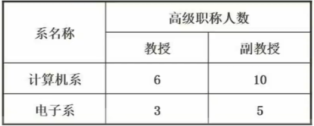

**第二范式(2NF)：**

- 若关系模式==$R∈1NF$,且每一个非主属性完全依赖于主键==,则关系模式$R∈2NF$。

- 换句话说，==当1NF**消除了非主属性**对码的**部分函数依赖**==，则称为2NF。

- 正例：

  - **关系模式：** `学生课程(学生ID, 课程ID, 学生姓名, 课程名称)`

  - **主键：** `(学生ID, 课程ID)`(组合主键)

  - **非主属性：** `学生姓名, 课程名称`

    在这个关系模式中：

    - `学生姓名` 依赖于 `学生ID`(但 `学生ID` 是主键的一部分)，因此没有违反2NF。
    - `课程名称` 依赖于 `课程ID`(同样只属于主键的一部分)，也没有违反2NF。

- 反例：
  **关系模式：** `订单(订单ID, 商品ID, 商品名称, 商品价格)`

  - **主键：** `订单ID`
  - **非主属性(不包含在候选码中的属性)：** `商品名称, 商品价格`

  - `商品名称` 和 `商品价格` 都依赖于 `商品ID` 而不是依赖于整个主键(假设订单ID本身不携带商品信息)。这形成了部分依赖，因此，该关系模式不满足第二范式(2NF)。

**第三范式(3NF)：**

- 若关系模式$R(U,F)$中不存在这样的码$X$、属性组$Y$及非主属性$Z$($Z$不属于$Y$),使得$X\rightarrow Y$,$Y \nrightarrow X$,$Y→Z$成立，则称关系模式$R∈3NF$。

- 换句话说，==当在2NF的基础上**消除了非主属性**对码的**传递函数依赖**==，则称为3NF。

- ==**3NF的模式必是**<u>2NF的模式</u>。**产生冗余和异常的两个重要原因**是<u>部分依赖和传递依赖</u>==

- 正例：S(Sno,Sname,SD,Sage,Sex)：学生S关系模式，属性为学号、姓名、系、年龄和性别
  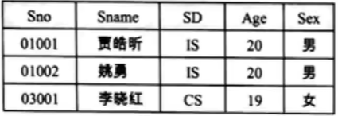

  学号是主属性，其他属性(姓名 Sname、系 SD、年龄 Sage 和性别 Sex)都直接依赖于主属性 Sno，而没有属性之间的传递依赖。例如，Sname、SD、Sage 和 Sex 都应该依赖于 Sno，而不是相互依赖。不可能会有传递函数依赖
  满足第三范式

**BCNF(巴克斯范式)：**

- 若关系模式$R∈1NF$,若$X→Y$,且$Y$属于$X$,$X$必含有码，则关系模式$R
  ∈BCNF$。

- 换句话说，==当$3NT$**消除了<u>主属性</u>对码的部分和传递函数依赖**==，则称为$BCNF$。
  一个满足**BCNF的关系模式应具有以下性质**。

  - **所有非主属性对每一个码都是完全函数依赖。**
  - **所有非主属性对每一个不包含它的码也是完全函数依赖，**
  - **没有任何属性完全函数依赖于非码的任何一组属性。**

因此==**程序设计语言**的**大多**数语法现象可用其中的**上下文无关文法(2型)**==

###  软件开发模型

| 模型      | 核心思想               | 灵活性 | 适用场景               |
| --------- | ---------------------- | ------ | ---------------------- |
| **瀑布**  | 线性阶段，文档驱动     | 低     | 需求明确、变更少       |
| **增量**  | 分模块逐步交付         | 中     | 可模块化需求           |
| **迭代**  | 循环改进，逐步细化     | 高     | 需求不明确             |
| **螺旋**  | 迭代+==风险==分析      | 中高   | 高风险复杂项目         |
| **V模型** | 测试与开发并行设计     | 低     | 高可靠性系统           |
| **敏捷**  | 快速迭代，响应变化     | 极高   | 需求易变的创新项目     |
| **喷泉**  | ==面向对象==，阶段重叠 | 中高   | 面向对象开发（OOP）    |
| **原型**  | 快速构建原型，用户反馈 | 高     | 需求模糊，需快速验证   |
| **演化**  | 逐步完善，适应需求变化 | 高     | 长期项目，需求逐步清晰 |

- **瀑布模型：**迭代模型/迭代开发方法，是经典的**线性顺序**软件开发模型，将开发过程划分为明确的阶段，各阶段依次进行且**不可回溯**（除非发现严重问题）。
- **演化模型：**快速应用开发。
- **增量模型：**构件组装模型/基于构件的开发方法，将软件拆分为多个**功能模块**，**分批次**开发、交付。每个增量都是一个可运行的子集，逐步叠加至完整系统。。
- **螺旋模型：**统一过程/统一开发方法，结合**迭代+瀑布+风险分析**的混合模型，每个循环包含4阶段：规划、风险评估、开发、用户评价。。
- **快速原型模型：**敏捷开发方法。
- **V模型：**基于架构的开发方法，瀑布模型的变种，将**测试阶段**与**开发阶段并行设计**，形成“V”形对应关系（如单元测试对应编码阶段）。。
- **喷泉模型：**模型驱动的开发方法。
- **基于构件的开发模型：**本质上是演化模型，以迭代方式构件软件。
- **迭代模型：**通过**重复循环**的开发过程完善产品，每次迭代完成一个完整周期（设计→实现→测试），逐步细化需求与设计。
- **敏捷模型：**以**用户需求进化**为核心，通过短周期（2~4周）的迭代（Sprint）持续交付可运行软件，强调团队协作与快速响应变化。

### 2. 内聚 和 耦合

内聚：

| 内聚类型                   | 描述                                                     |
| -------------------------- | -------------------------------------------------------- |
| **功能**内聚               | 完成一个**单一功能**，各个部分**协同工作**，**缺一不可** |
| **顺序**内聚               | 处理**元素相关**，而且必须**顺序执行**                   |
| **通信**内聚               | 所有处理元素集中在**一个数据结构的区域**上               |
| **过程**内聚               | 处理**元素相关**，而且必须按**特定的==次序==执行**       |
| **瞬时**内聚(**时间**内聚) | 所包含的任务必须在**同一时间间隔内执行**(如初始化模块)   |
| **逻辑**内聚               | 完成**逻辑上相关的一组**任务                             |
| **偶然**内聚(**巧合**内聚) | 完成一组**没有关系或松散关系**的任务                     |

**耦合：**

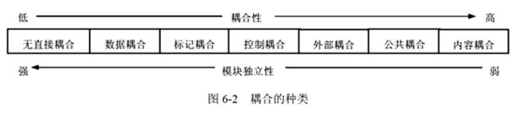

| 耦合类型       | 描述                                                         |
| -------------- | ------------------------------------------------------------ |
| **非直接**耦合 | 两个模块之间**没有直接关系**，它们之间的**联系完全是**通过**主模块的控制和调用**来实现的，独立性最高 |
| **数据**耦合   | 模块之间通过==值传递==完成调用关系，一组模块借助**参数**表**传递简单数据** |
| **标记**耦合   | 模块之间传递的是==数据结构==，一组模块通过**参数**表**传递记录信息(数据结构)** |
| **控制**耦合   | 模块之间传递的是==控制变量==，模块之间**传递**的信息中**包含**用于**控制模块内部逻辑**的信息 |
| **外部**耦合   | 模块之间通过==外部环境联结==，一组模块都访问**同一全局简单变量**，而且**不是通过参数表传递该全局变量的信息** |
| **公共**耦合   | 多个模块**都访问同一个公共数据环境**（如全局数据结构、共享通信、公共内存) |
| **内容**耦合   | 直接使用另一个模块的内部数据，或者非正常入口转入另一个模块；两个模块有一部分程序代码重叠；一个模块有多个入口 |

## UML

### 数据流图

**找缺失的数据流：**

1. ==父图与子图之间的平衡==；==数据流的起点或终点必须有一个是加工==
2. ==子图内平衡，加工至少有一个输入和一个输出==
3. ==数据守恒==，看题目中的描述与图进行对应，在进行数据守恒的时候记得维持父图与子图之间的平衡

###  关系

**UML中有4种关系：**<u>依赖、关联、泛化和实现。</u>

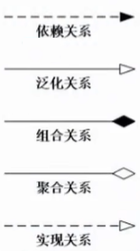

1. **依赖(Dependency)：**是两个事物间的语义关系，其中一个事物(独立事物)发生变化会影响另一个事物(依赖事物)的语义。
2. **关联(Association)：**一种结构关系，它描述了一组链，链是对象之间的连接(**关联关系用一条直线表示**)。
   - **聚合(Aggregation)：**一种特殊类型的关联
     - ==它描述了**整体和部分**间的结构关系==
     - ==**部分可以独立**于整体而存在==
   - **组合(Compositio)：一种特殊类型的关联**
     - ==体现了**整体与部分间的关系**==，但比聚合更强，**也称为强聚合**
     - ==部分**不可以独立**于整体而存在==。
3. **泛化(Generalization)：**==一种特殊/一般关系==，特殊元素(子元素)的对象可替代一般元素(父元素)的对象。用这种方法，子元素共享了父元素的结构和行为。
4. **实现(Realization)：**实现是类元之间的语义关系，其中一个类元制定了由另一个类元保证执行的契约。
   **在两种地方要遇到实现关系：**
   - 一种是在==接口和实现它们的类或构件之间==
   - 另一种是在==用例和实现它们的协作之间==

## 用例图

用例图(Use Case Diagram)展现了==一组用例、**参与者(Actor)**以及两者之间的关系==。

用例图通常包括**用例、参与者、==扩展关系`<<extend>>`、包含关系`<<include>>`==**。

用例图==用于对系统的静态用例视图进行建模==，主要支持系统的行为，即该**系统在它的周边环境的语境中所提供的外部可见服务**。

当对系统的静态用例视图建模时，可以用下列两种方式来使用用例图：对系统的语境建模；对系统的需求建模。

- **包含关系**(include)：表示一个用例总是包含另一个用例的执行。也就是说，当你执行某个用例时，相关的“包含用例”将会被执行。这是一个**强制的关系**。
- **扩展关系**(extend)：表示某个用例在特定条件下可以选择性地包含另一个用例的执行。也就是说，在执行主用例时，可以选择执行扩展的用例，也可以不执行。这是一个**可选的关系**。

简而言之：

- **包含关系**：必定执行。
- **扩展关系**：可选执行。

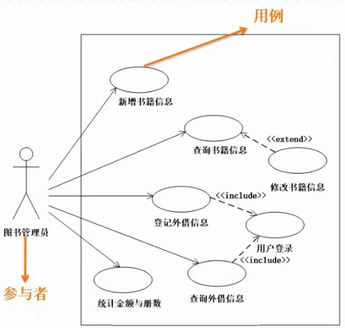


## 面向对象

### 设计模式的分类

**创建型模式**：创建型模式==抽象了实例化过程==。它们帮助一个系统独立于如何创建、组合和表示它的那些对象。一个类创建型模式使用继承改变被实例化的类，而一个对象创建型模式将实例化委托给另一个对象。

1. **==工厂方法==**：定义一个创建对象的**接口**，但让**子类决定实例化哪个类**。
2. **==抽象工厂==**：提供一个**接口**，用于**创建**相关或依赖对象的**家族**，而**不指定具体类**。
3. **原型**：通过**复制现有对象**来**创建新**对象，而**非通过实例化**。
4. **单例**：确保一个类**只有一个实例**，并提供全局访问点。
5. **==构建器(生成器)==**：将复杂对象的构建与其表示分离，使**同样的构建过程**可以**创建不同的表示**。

**结构型模式**：结构性模式涉及==如何组合类和对象以获得更大的结构==。结构性模式采用继承机制来组合接口或实现。

1. **==适配器==**：将一个类的**接口转换成**客户希望的**另一个接口**。
2. <u>**桥接**</u>：将**抽象**部分**与**其**实现**部分**分离**，使它们**可以独立变化**。
3. **<u>组合</u>**：将**对象组合**成树形结构以**表示“部分-整体”层次**结构。
4. **==装饰==**：**动态**地给对象**添加**额外的**职责**，**比子类更灵活**。
5. **==外观==**：为子系统中的**一组接口提供**一个**统一的简化接口**。这个接口使得这一子系统更加容易使用。
6. **~~享元~~**：通过共享技术高效地支持大量细粒度对象。
7. **~~代理~~**：为其他对象提供一种代理以控制对这个对象的访问。

**行为型模式**：行为模式涉及==算法和对象间职责的分配==。行为模式**不仅描述对象或类的模式，还描述它们之间的通信模式**。这些模式刻画了在运行时难以跟踪的复杂的控制流。它们将用户的注意力从控制流转移到对象间的联系方式上来。

1. **职责链**：将请求的发送者和接收者解耦，使**多个对象**都有机会**处理请求**。
2. **==命令==**：将**请求封装为对象**，以便参数化、队列化或日志化请求。
3. **解释器**：**定义**语言的**文法**，并**提供一个解释器**来处理该语言。
4. **迭代器**：提供一种**方法顺序访问聚合对象的元素**，而**不暴露其底层**表示。
5. **==中介者==**：定义一个**对象来封装**一系列**对象之间的交互**，**降低耦合**。
6. **备忘录**：在**不破坏封装**的前提下，**捕获并外部化**对象的内部状态以便恢复。
7. **==观察者==**：定义对象间的一对多依赖，当一个对象**改变状态时**，所有**依赖者自动更新**。
8. **状态**：允许**对象**在其**内部状态改变时改变其行为**。
9. **策略**：定义**一系列算法**，封装每个算法，并使它们**可以互换**。
10. **模板方法**：定义一个操作中的**算法骨架**，将某些**步骤延迟到子类**。
11. **访问者**：表示一个**作用于**某对象**结构**中的**各元素的操作**，**不改变元素**的类。


## 安全

## 加密与数字签名

**加密技术**


1. **对称密钥密码体制**
   - 对称密钥密码体制中，发送和接收数据的双方必须使用==**相同的或对称的密钥**对明文进行加密和解密运算==。
   - ==常用的对称加密算法有**DES、IDEA、TDEA、AES、C2、RCA、RC5**==等。
2. **非对称密钥密码体制**
   - 非对称密钥密码体制也叫公开密钥密码体制。该体制中，每个用户都有**一对密钥：**<u>公开密钥（简称公钥）和私有密钥（简称私钥）</u>。
   - **公钥对外公开，私钥由个人秘密保存**
     ==**私钥**在任何情况下都是**不允许交换**的==
   - 用其中==一把密钥来加密，另一把密钥来解密==。由于**私钥带有个人特征，因此可以解决数据的签名验证问题**。

### 音频

**采样频率应为声音最高频率**的==2倍==

## 知识产权

### 保护期限

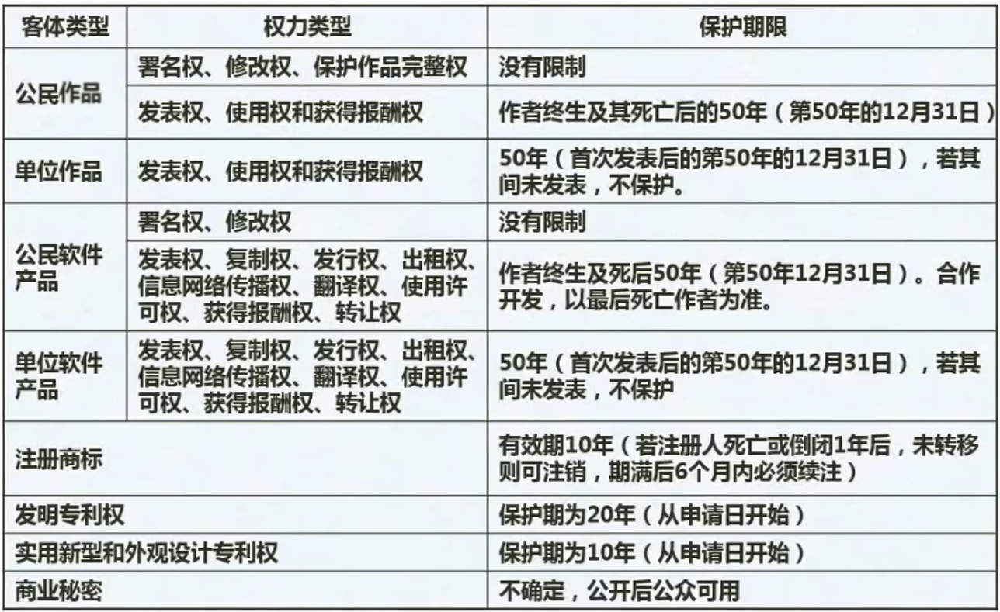

- 商标权可以延长
- 商业秘密权无期限限制

### 知识产权人确定★

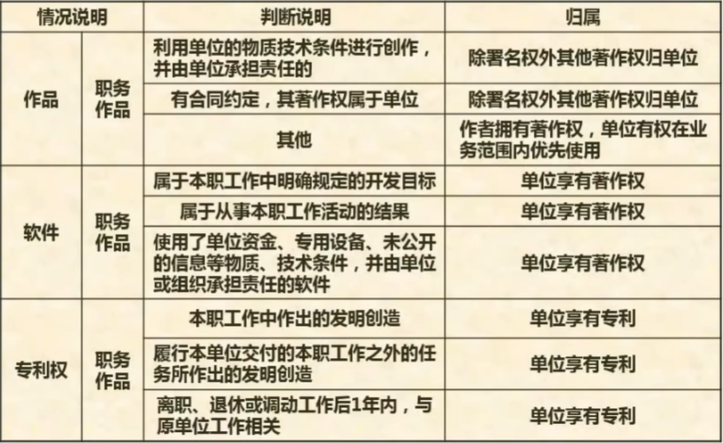

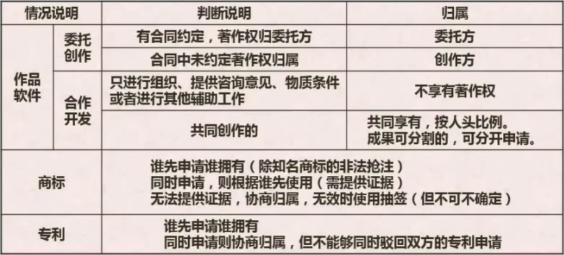

## C

`strlen()` - 计算字符串长度

```c
char str[] = "Software Designer";
int length = strlen(str);
```

`abs()`计算绝对值