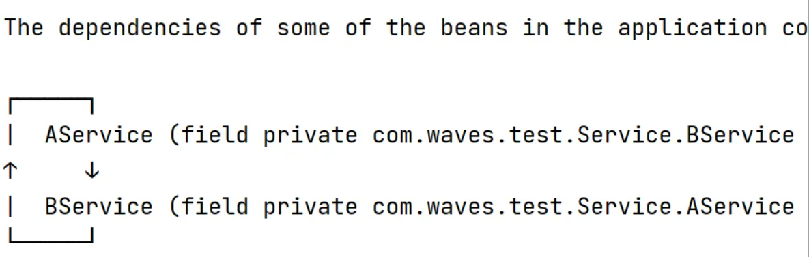
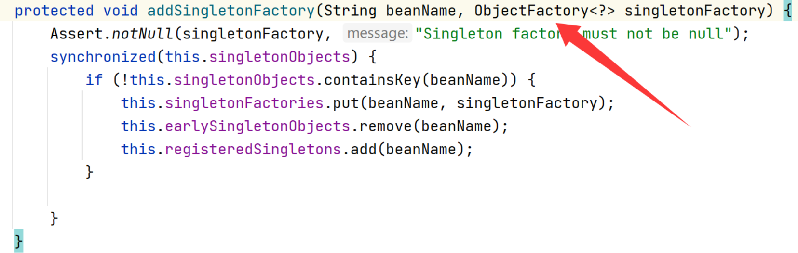
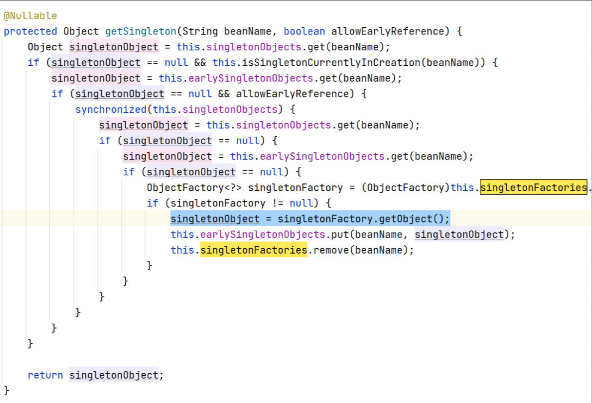
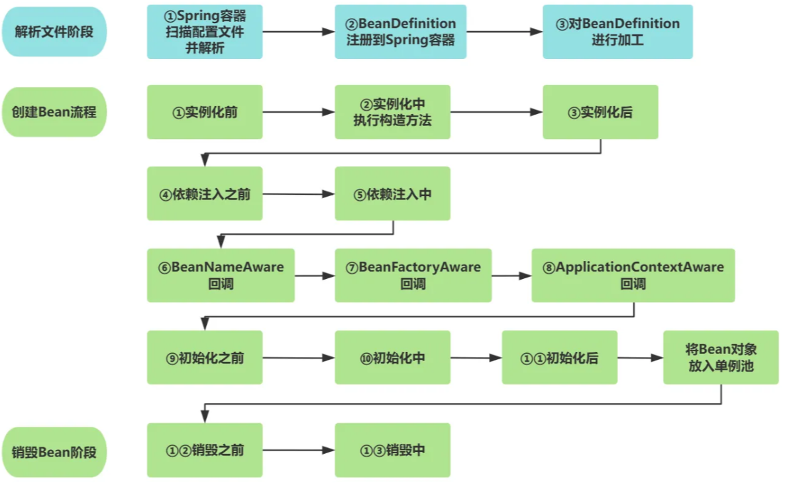
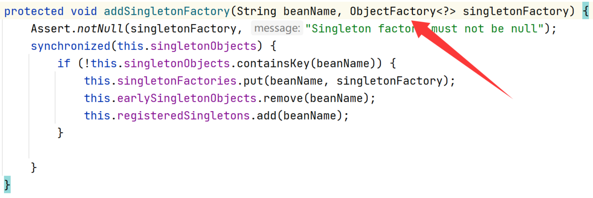

[原文](https://www.yuque.com/xianer-9khdn/vhvl00/hgmv1zwko470pxfn)

## Spring

## 简单★

**前言** 

- 标准回答：面试题内容背诵
- 内容扩展：面试题知识点的深入学习
- 【】内容：了解即可

### 1. 什么是 Spring lOC 

**标准回答**

Spring loC（lnversion of Control）是 Spring 框架的核心概念之一。IoC 让对象的创建与依赖关系交由 Spring 容器负责，而不是由对象自身控制（即控制反转）

---

**内容扩展** 

lnversion of Control 翻译过来就是 控制反转。理解 Ioc 重点就是理解控制和反转

- 控制是什么？
  就是控制对象的创建，IoC 容器根据@Component 注解或 XML 配置文件来创建对象，在一个对象的生命周期内，根据不同的配置，进行对象的创建和改造
- 反转是什么？
  创建对象和注入依赖对象的两个动作，反转之后这些动作就由 IoC 容器触发，IoC容器在创建对象A的时候，发现依赖了对象B，如果容器中没有对象 B 就会创建B，并将对象B注入A中 

【 而反转之前，这些动作就得有我们程序员自己指定，如果对象 A依赖对象 B，就得在创建对象 A 的代码里，自己写创建对象 B 的代码 】 

---

### 2. Spring loC 有什么好处

**标准回答**

1. **解耦：**组件不再需要自己创建或查找依赖对象，而是由容器负责提供
2. **可配置化：**Bean 的配置信息（依赖关系、作用域、初始化方法、销毁方法）可以通过注解、 XML 或 Java Config 等方式进行配置，无需修改代码
3. **切面编程：** IoC 容器与 AOP 模块集成，可以方便地将横切关注点（日志、事务、安全）从业务逻辑中分离出来
4. **集中化管理：** IoC 容器负责创建、配置和管理 Bean 的生命周期

---

**内容扩展** 

【 

1. **解耦：**IoC 最核心的优势在于它能够降低组件之间的耦合度。组件不再直接依赖于其他组件的实现细节，而是依赖于抽象接口
2. **可测试性：**使得单元测试更加容易。由于组件不再负责创建依赖对象，因此可以使用 Mock 对象来模拟依赖，从而进行单元测试
3. **可维护性：**提高了代码的可维护性。当需要更换组件的实现时，只需要修改容器的配置，而不需要修改组件的代码 
4. **可扩展性：**提高了代码的可扩展性。可以通过配置容器来添加新的组件，而不需要修改现有组件的代码
5. **代码重用：**组件可以在不同的上下文中重用，因为它们不再依赖于特定的环境
6. **集中配置：**IoC 容器集中管理了所有组件的配置信息，包括组件的创建、依赖关系和属性设置
7. **简化对象创建：**IoC 容器负责创建对象，并将所需的依赖对象注入到对象中。这使得组件的代码更加简洁，只需要关注自身的业务逻辑，而不需要关心依赖对象的创建
8. **支持多种配置方式：**Spring IoC 容器支持多种配置方式，包括 XML 配置文件、注解和 Java 配置 

】

---

### 3. Spring 中的 DI是什么

**标准回答**

Dl(Dependency Injection) 在 Spring 框架中用于实现控制反转。DI的核心思想是由容器负责对象的依赖注入，而不是由对象自行创建或查找依赖对象

```java
@Component
public class AService {
    // DI 依赖注入
    @Autowired
    private BService bService;
}
```

---

**内容扩展** 

通过 Dl，Spring 容器在创建一个对象时，会自动将这个对象的依赖注入进去，这样可以让对象与其依赖的对象解耦 

【 通过 DI，A 和 B 之间的依赖关系被解耦了。 A 不再需要关心 B 的创建和管理，只需要依赖于 B 接口即可。 如果需要更换 B 的实现，只需要修改 Spring 容器的配置，而不需要修改 A 的代码（如在 B 的某实现类上加@Primary注解） 】

*依赖注入的优势：* 

- 解耦合：通过将对象的依赖从代码中抽离出来，由容器负责管理，降低了类之间的耦合度 
- 提高测试性：通过注入 mock 对象或替代实现，DI使得单元测试变得更容易
-  提高可维护性和灵活性：通过配置文件或注解，开发者可以在不修改代码的情况下更改依赖，增加了应用程序的可扩展性和灵活性 

---

### 4. 什么是 Spring Bean

**标准回答**

指的是由 Spring 容器管理的对象。 Spring Bean 是由 IoC 容器实例化、配置和组装的对象，并且通过依赖注入来与其他 Bean 进行互相依赖

Bean 可以看作是 Spring 应用中的一个对象，它的生命周期完全由 Spring 容器管理 

（生命周期：解析文件阶段、实例化、依赖注入、Aware 回调、初始化、销毁）

---

**内容扩展**

**定义 Spring Bean 的方式：** 

1. **注解：**使用 @Component 及其衍生注解@RestController、@Controller、@Repository、@Service 
2. **Java 配置类：**通过@Configuration 注解和 @Bean 注解。在 Java 类的方法上添加 @Bean 注解，可以将方法的返回值注册为Bean 
3. **XML 配置：**使用 XML 文件来定义 Bean。 使用  元素来声明 Bean，并指定 Bean 的属性、依赖关系等

生命周期具体内容，见 [Spring 面试题困难篇]()

---

### 5. Spring Bean 一共有几种作用域

**标准回答**

六种作用域：

1. Singleton：IoC 容器中只有一个单例 Bean（默认单例）
2. Prototype：原型；每次请求该 Bean，IoC 容器都会创建新的实例（多实例）
3. Request：每个 Http 请求都会新建一个自己的 Bean 实例，请求结束后就销毁（仅 Web 应用）
4. Session：一个 http session 用户会话中有一个 bean 实例，会话结束时就销毁（仅 Web 应用）
5. Application：整个 ServletContext 生命周期里，只有一个bean（仅 Web 应用）
6. Websocket：一个 WebSocket 生命周期内就会有一个 bean 实例，会话结束销毁（仅 Web 应用）

---

**内容扩展**

request、session、application和websocket作用域只有在 Web 感知的 Spring 应用环境中才可用（如 Spring MVC) 

【 在使用 request、session 和 application 作用域时，需要配置 RequestContextListener 或 RequestContextFilter (在 web.xml 中) 来注册相应的 scope。 Spring Boot 通常会自动配置这些 listener/filter 】

 singleton 单例：

```java
import org.springframework.context.annotation.Scope;
import org.springframework.stereotype.Component;

@Component
@Scope("singleton") // 可以省略，因为 singleton 是默认作用域
public class SingletonBean {

}
```

prototype 原型：

```java
import org.springframework.context.annotation.Scope;
import org.springframework.stereotype.Component;
@Component
@Scope("prototype")
public class PrototypeBean {

}
```

request 请求：

```java
import org.springframework.context.annotation.Scope;
import org.springframework.stereotype.Component;
import org.springframework.web.context.WebApplicationContext;

@Component
@Scope(value = "request", proxyMode = org.springframework.context.annotation.ScopedProxyMode.TARGET_CLASS) // proxyMode 解决循环依赖
public class RequestBean {
    
}
```

session 会话：

```java
import org.springframework.context.annotation.Scope;
import org.springframework.stereotype.Component;
import org.springframework.web.context.WebApplicationContext;

@Component
@Scope(value = "session", proxyMode = org.springframework.context.annotation.ScopedProxyMode.TARGET_CLASS) // proxyMode 解决循环依赖
public class SessionBean {

}
```

application 应用：

```java
import org.springframework.context.annotation.Scope;
import org.springframework.stereotype.Component;
import org.springframework.web.context.WebApplicationContext;

@Component
@Scope(value = "application", proxyMode = org.springframework.context.annotation.ScopedProxyMode.TARGET_CLASS) // proxyMode 解决循环依赖
public class ApplicationBean {

}
```

websocket：

```java
import org.springframework.context.annotation.Scope;
import org.springframework.stereotype.Component;

@Component
@Scope("websocket")
public class WebSocketBean {

}
```

---

### 6. @Bean和@Component有什么区别

**标准回答**

都是用于定义 Spring 容器中的 Bean，但使用的场景和方式不同

- @Bean注解通常用于 Java配置类的方法上。该方法会返回一个对象，Spring 将该对象作为 Bean 注册到 IoC 容器中。@Bean 注解通常与 @Configuration 注解一起使用
- @Component注解用于类级别。Spring 会自动扫描带有 @Component注解的类，并将它作为 Bean 注册到 IoC 容器中

**内容扩展**

@Bean 注解用于显式声明 Spring 容器管理的 Bean，通常用于以下场景：

1. **手动创建复杂的对象：**需要进行复杂的初始化过程，或者需要传递参数给构造函数的对象
2. **第三方库或无法修改的类：**如果某个类不是自己开发，你无法直接修改这些类库的源代码，就可以通过 @Bean 来手动注册

创建和配置第三方类MybatisPlusInterceptor，将其注册为Bean：

```java
@Configuration
public class MybatisPlusConfig {

    @Bean
    public MybatisPlusInterceptor mybatisPlusInterceptor() {
        MybatisPlusInterceptor interceptor = new MybatisPlusInterceptor();
        PaginationInnerInterceptor innerInterceptor = new PaginationInnerInterceptor(new CustomDialect());
        // 添加分页插件
        interceptor.addInnerInterceptor(innerInterceptor);
        // 添加执行分析插件
        interceptor.addInnerInterceptor(new BlockAttackInnerInterceptor());
        // 添加乐观锁插件
        interceptor.addInnerInterceptor(new OptimisticLockerInnerInterceptor());
        return interceptor;
    }
}
```

@Component 注解用于类级别的自动扫描与注入，Spring 会自动发现和管理这些类。它是 Spring 中实现自动扫描 Bean 的基础，@Component 是一个通用的注解，还有一些特定用途的衍生注解：

-  @Service：用于标识服务层的类
- @Repository：用于标识数据访问层的类(DAO 层) 
- @Controller：用于标识控制器类，通常用于Spring MVC 中处理 HTTP 请求

```java
@Component
public class UserService {
    public void createUser(String name) {
        System.out.println("Creating user: " + name);
    }
}
```

| 特性     | @Bean                             | @Component                                 |
| -------- | --------------------------------- | ------------------------------------------ |
| 使用位置 | 方法级别（在 GConfiguration 类中) | 类级别                                     |
| 扫描机制 | 不支持自动扫描，手动注册          | 支持自动扫描，通过 @ComponentScan 自动发现 |
| 主要用途 | 用于配置第三方库或复杂对象        | 用于自动发现井注册自定义类                 |
| 常见场景 | 手动配置复杂对象、第三方库类      | 自定义服务、DAO 层、控制器等类的自动注册   |
| 灵活性   | 更灵活，适合复杂初始化            | 自动化更强，适合类的简单注册               |

---

### 7. @Component、@Controller、@Repository和@Service 的区别

**标准回答**

本质没区别，其它三个都是 Component 的衍生注解，之所以做了划分，是为了更好地组织和管理应用的各个层级，提高代码的可维护性

1. @Component：通用的注解，将任意类注册为 Spring 容器中的 Bean 
2. @Controller：用于 Spring MVC 中的控制器层（Controller）的注解。用于处理 HTTP 请求，并将结果返回给客户端
3. @Service：用于标识业务层（Service）的类。表明该类承担业务操作
4. @Repository：用于数据访问层（DAO）的类，与数据库交互

---

**内容扩展**

1. @Component 是其他注解的基础，@Controller、@Service、@Repository 都是它的特定用法 
   用于没有明确职责的类或通用组件，比如工具类、任务调度器等：

   ```java
   @Component
   public class GeneralComponent {
       public void doSomething() {
           System.out.println("Doing something...");
       }
   }
   ```

2. @Controller 是 Spring MVC 专用的注解，主要用于标识控制器层的类。它将 HTTP 请求映射到对应的处理方法，返回视图名称或响应数据 
   处理 HTTP 请求、返回视图或 JSON 响应。通常与前端交互，属于 MVC 模式中的控制器层：

   ```java
   @Controller
   @RequestMapping("/user")
   public class UserController {
       @GetMapping("/profile")
       public String getUserProfile(Model model) {
           // 添加数据到模型
           model.addAttribute("user", new User("John", "Doe"));
           return "userProfile";  // 返回视图名称
       }
   }
   ```

3. @Service 表示业务逻辑层的类。虽然它在功能上与@Compnent类似，但 @Service表明该类具有特定的业务功能，适合放置业务处理代码。使用场景：处理复杂的业务功能，通常与DA0层和Controller层交互

4. @Repository 用于标识数据访问层的类，通常与数据库或其他持久化存储系统交互。使用场景：主要用于数据访问层，与数据库交互，通常封装 CRUD 操作

【 @Repository 注解还具有异常转换功能，当与数据库交互时，@Repository 注解会自动将低层次的数据库异常(如 SQLException)转换为 Spring 统的 DataAccessException，从而简化了异常处理流程 】 

异常转换：

```java
@Repository
public class UserRepository {

    public User findById(Long id) {
        try {
            // 执行数据库查询
        } catch (SQLException e) {
            // Spring 会将其转换为 DataAccessException
            throw new DataAccessException("Database error");
        }
        return new User();
    }
}
```

---

### 8. @RequestBody 和 @ResponseBody 注解的作用 

**标准回答** 

1.  **@RequestBody：**将HTTP请求体中的数据绑定到方法参数上。Spring会将JSON、XML或其他格式的请求体转换为Java对象，并将其传递给 Controller 层方法的参数 
2. **@ResponseBody：**将 Controller 层方法的返回结果直接写入HTTP响应体中。用于返回JSON或XML格式的数据。Spring会将返回的Java对象转换为JSON或XML格式，并写入响应体

---

**内容扩展**

 @ResponseBody 由于使用了 @RestController，所有方法的返回值都会自动被转换为 JSON 格式，并作为响应体返回给客户端，所以就不需要加@ResponseBody 了

```java
import org.springframework.http.HttpStatus;
import org.springframework.http.ResponseEntity;
import org.springframework.web.bind.annotation.*;

@RestController
@RequestMapping("/api/users")
public class UserController {

    @PostMapping
    public ResponseEntity<User> createUser(@RequestBody User user) {
        // 模拟创建用户逻辑
        System.out.println("Received user: " + user);
        user.setUsername(user.getUsername().toUpperCase());
        // 实际应用中，应该将用户保存到数据库
        return new ResponseEntity<>(user, HttpStatus.CREATED); 
}
```

---

### 9. Spring中的@Value注解的作用是什么

**标准回答**

通过@Value注解，可以将属性文件、环境变量、系统属性等外部资源中的值，注入到 Spring Bean 的字段、方法参数或构造函数参数中 

---

**内容扩展**

使用场景代码： 

1. **配置文件注入：**将属性文件中的值注入到 Bean 中 

   ```java
   // Properties 文件配置
   app.name=MyApp
   app.version=1.0.0
   
   // java类
   import org.springframework.beans.factory.annotation.Value;
   import org.springframework.stereotype.Component;
   @Component
   public class AppConfig {
       @Value("${app.name}")
       private String appName;
   
       @Value("${app.version}")
       private String appVersion;
   
       public String getAppName() {
           return appName;
       }
   
       public String getAppVersion() {
           return appVersion;
       }
   }
   ```

2. **系统属性和环境变量：**将系统属性或环境变量的值注入到 Bean 中

   ```java
   @Component
   public class MyBean {
   
       @Value("#{systemProperties['java.version']}")
       private String javaVersion;
   
       @Value("#{systemProperties['my.custom.property'] ?: 'default value'}")
       private String myProperty;  // 默认值
   
       public String getJavaVersion() {
           return javaVersion;
       }
   
       public String getMyProperty() {
           return myProperty;
       }
   }
   ```

### 10. Spring中拦截器和过滤器的区别

**标准回答**

Spring 拦截器（Interceptor）和 Servlet 过滤器（Filter）都可以用来拦截请求，并在请求处理前后进行一些处理，但它们在**作用范围、实现方式、应用场景**等方面存在显著的区别：

1. **作用范围：** 
   - Filter 是 Servlet 容器级别的组件。 拦截的是所有进入 Servlet 容器的请求，包括静态资源的请求（如 CSS、JS、图片等）
   - Interceptor 是 Spring MVC 的组件。 它只拦截由 DispatcherServlet 处理的请求，通常是针对 Controller 中的方法进行拦截。 不会拦截静态资源的请求
2. **实现方式：** 
   - Filter实现 javax.servlet.Filter 接口，需要实现 init(), doFilter() 和 destroy() 方法
   - Interceptor实现 org.springframework.web.servlet.HandlerInterceptor 接口，需要实现preHandle(), postHandle() 和 afterCompletion() 方法
3. **执行顺序：**
   - Filter 的执行顺序由 web.xml 中配置的顺序决定（或使用 @WebFilter 注解）
   - Interceptor 的执行顺序由 Spring 配置中注册的顺序决定。 可以通过使用 @Order 注解来指定顺序
4. **依赖关系：**
   - Filter 不依赖于 Spring 容器，可以在任何 Servlet 容器中使用 
   - Interceptor 依赖于 Spring 容器，需要在 Spring MVC 环境中使用，能够访问 Spring 容器中的 Bean
5. **获取 Context 信息：**
   - 在 Filter 中获取 Spring Context 信息需要通过WebApplicationContextUtils.getWebApplicationContext(servletContext) 手动获取
   - 在 Interceptor 中可以直接访问 Spring 容器中的 Bean
6. **应用场景：**
   - Filter 字符编码转换、跨域资源共享 (CORS) 
   - Interceptor 用户身份验证和授权、日志记录、防止重复提交 

---

**内容扩展**

Java 过滤器和拦截器的实战使用场景示例：

**1. 过滤器** 

字符编码转换

```java
@WebFilter("/*") // 拦截所有请求
public class CharacterEncodingFilter implements Filter {

    private String encoding = "UTF-8";

    @Override
    public void init(FilterConfig filterConfig) throws ServletException {
        String encodingParam = filterConfig.getInitParameter("encoding");
        if (encodingParam != null) {
            encoding = encodingParam;
        }
    }

    @Override
    public void doFilter(ServletRequest request, ServletResponse response, FilterChain chain)
            throws IOException, ServletException {
        request.setCharacterEncoding(encoding);
        response.setCharacterEncoding(encoding);
        chain.doFilter(request, response);
    }

    @Override
    public void destroy() {
    }
}
```

跨域资源共享 (CORS)：

```java
@WebFilter("/*")
public class CORSFilter implements Filter {

    @Override
    public void doFilter(ServletRequest request, ServletResponse response, FilterChain chain)
            throws IOException, ServletException {
        HttpServletResponse httpResponse = (HttpServletResponse) response;

        // 允许来自所有域的跨域请求
        httpResponse.setHeader("Access-Control-Allow-Origin", "*");

        // 允许使用的 HTTP 方法
        httpResponse.setHeader("Access-Control-Allow-Methods", "GET, POST, PUT, DELETE, OPTIONS");

        // 允许携带的 HTTP 请求头
        httpResponse.setHeader("Access-Control-Allow-Headers", "Content-Type, Authorization");

        // 允许携带 Cookie
        httpResponse.setHeader("Access-Control-Allow-Credentials", "true");

        chain.doFilter(request, response);
    }
}
```

**2. 拦截器**

用户身份验证和授权：

```java
public class AuthInterceptor implements HandlerInterceptor {

    @Override
    public boolean preHandle(HttpServletRequest request, HttpServletResponse response, Object handler)
            throws Exception {
        HttpSession session = request.getSession(false);
        if (session == null || session.getAttribute("user") == null) {
            response.sendRedirect(request.getContextPath() + "/login");
            return false; // 阻止请求继续执行
        }
        return true; // 允许请求继续执行
    }
}
```

日志记录：

```java
public class LoggingInterceptor implements HandlerInterceptor {

    private static final Logger logger = LoggerFactory.getLogger(LoggingInterceptor.class);

    @Override
    public boolean preHandle(HttpServletRequest request, HttpServletResponse response, Object handler)
            throws Exception {
        long startTime = System.currentTimeMillis();
        request.setAttribute("startTime", startTime);
        return true;
    }

    @Override
    public void afterCompletion(HttpServletRequest request, HttpServletResponse response, Object handler,
            Exception ex) throws Exception {
        long startTime = (Long) request.getAttribute("startTime");
        long endTime = System.currentTimeMillis();
        long executionTime = endTime - startTime;

        // 获取 Handler 方法的信息
        HandlerMethod handlerMethod = (HandlerMethod) handler;
        String methodName = handlerMethod.getMethod().getName();
        String className = handlerMethod.getBeanType().getSimpleName();

        logger.info("Method {} in class {} executed in {} ms", methodName, className, executionTime);
    }
}
```

防止重复提交：

```java
public class PreventDuplicateSubmissionInterceptor implements HandlerInterceptor {

    @Override
    public boolean preHandle(HttpServletRequest request, HttpServletResponse response, Object handler)
            throws Exception {

        HttpSession session = request.getSession();
        String token = request.getParameter("token");

        if (token == null) {
            return true; // 首次请求，允许执行
        }

        String sessionToken = (String) session.getAttribute("token");
        if (sessionToken == null || !sessionToken.equals(token)) {
            // token 不匹配，说明是重复提交
            response.sendError(HttpServletResponse.SC_CONFLICT, "Duplicate submission detected.");
            return false; // 阻止请求继续执行
        }

        // 验证成功，移除 session 中的 token，防止多次重复提交
        session.removeAttribute("token");
        return true;
    }
}
```

---

### 11. Spring中的@Primary注解的作用是什么 

**标准回答** 

- **类级别 Bean：**@Primary注解可以解决 Bean 注入时的歧义问题，当一个接口或父类有多个实现时，Spring无法确定该注入哪个具体的 Bean，此时可以使用 @Primary 来指明首选的 Bean
- **配置类方法上的 Bean：** 当存在多个候选 Bean，使用 @Primary 选择优先注入某一个Bean

---

**内容扩展** 

使用场景： 

1. **多实现类：**当一个接口有多个实现类，并且在注入时未明确指定要注入哪个实现类时，Spring 会报错。这时可以使用 @primany 注解来指定一个首选的实现类
2. **注入优先级：**在某些情况下，虽然存在多个候选 Bean，某个特定的 Bean 在没有明确指定时被优先注入，这时可以使用 @Primary 注解

多实现类——多实现类：

```java
import org.springframework.context.annotation.Primary;
import org.springframework.stereotype.Component;

public interface MyService {
    void performAction();
}

@Component
@Primary
public class MyServiceImpl1 implements MyService {
    @Override
    public void performAction() {
        System.out.println("表演1");
    }
}

@Component
public class MyServiceImpl2 implements MyService {
    @Override
    public void performAction() {
        System.out.println("表演2");
    }
}
```

多实现类——默认注入加了@primany注解的MyServiceImpl1：

```java
import org.springframework.beans.factory.annotation.Autowired;
import org.springframework.stereotype.Component;

@Component
public class MyComponent {
    private final MyService myService;

    @Autowired
    public MyComponent(MyService myService) {
        this.myService = myService;
    }

    public void doSomething() {
        myService.performAction();
    }
}
```

注入优先级——@Primary 注解优先注入某个Bean：

```java
@Component
public class MyConfiguration {
    private String value;

    public MyConfiguration(String value) {
        this.value = value;
    }

    public String getValue() {
        return value;
    }
}

@Configuration
public class AppConfig {

    @Bean
    public MyConfiguration config1() {
        return new MyConfiguration("Config 1");
    }

    @Bean
    @Primary
    public MyConfiguration config2() {
        return new MyConfiguration("Config 2");
    }
}

@Component
public class MyService {

    @Autowired
    private MyConfiguration configuration; // 注入默认的 MyConfiguration

    public void printConfig() {
        System.out.println("Configuration value: " + configuration.getValue());
    }
}
```

---

### 12. @Qualifier 注解的作用是什么

**标准回答** 

@Qualifier注解用于在依赖注入时消除歧义。当容器中有多个相同类型的Bean 时，即精确地告诉 Spring 容器要注入哪个 Bean。不然就会导致 NoSuchBeanDefinitionException异常，表明存在歧义 

【 与@Primary注解作用相似，区别是@Primary 一般用在类和方法上，而@Qualifier 用在类属性字段或者方法参数上，当然@Qualifier 也可以用在类上，用于覆盖@Primary 效果 】 

---

**内容扩展**

当 Service 有多个实现类的时候，可以通过 @Qualifier 指定名称选择对应的实现 Bean

`@Qualifier 指定名称选择对应的实现 Bean`：

```java
@Component
public class Client {
    private final Service service;
    @Autowired
    public Client(@Qualifier("serviceImpl1") Service service) {
        this.service = service;
    }
    public void doSomething() {
        service.serve();
    }
}
```

@Primary 注解用于指定当有多个候选 Bean 时默认注入哪个 Bean，也就是指定了第一顺位，当结合 @Qualifier 使用时，可以覆盖 @Primary 的默认行为 

【 即使 DefaultService 被标记为 @Primary，但由于 @Qualifier("specificService")，所以最终注入的仍然是SpecificService 】 

`使用@Qualifier 覆盖 @Primary 的默认行为`：

```java
@Component
@Primary
public class DefaultService implements Service {
    public void serve() {
        System.out.println("Default Service");
    }
}

@Component
@Qualifier("specificService")
public class SpecificService implements Service {
    public void serve() {
        System.out.println("Specific Service");
    }
}

@Component
public class Client {

    private final Service service;

    @Autowired
    public Client(@Qualifier("specificService") Service service) {
        this.service = service;
    }

    public void doSomething() {
        service.serve();
    }
}
```

---

### 13. @PathVariable和@RequestParam的区别

**标准回答** 

两者都是 Spring MVC 中用于从 HTTP 请求中获取数据的注解

- @PathVariable：从 URI 路径中获取数据；
- @RequestParam：从请求参数中获取数据。请求参数都可以设置为可选

---

**内容扩展**

`@PathVariable`：

```java
@GetMapping("/users/{userId}")
public String getUser(@PathVariable Long userId) {
    // ...
}
// 如果想要参数可选，去掉参数即可
@GetMapping("/users")
public String getUser() {
    // ...
}
```

`@RequestParam`：

```java
// 参数设置可不必填
@GetMapping("/products")
public String searchProducts(@RequestParam(required = false) String keyword) {
    // ...
}
```

---

### 14. Spring 中的 @Profile 注解的作用

**标准回答** 

@Profile 注解用于定义一组 Bean 的配置文件所属的环境，比如dev表示开发环境，prod表示生产环境

**内容扩展**

1. @Profile 定在在类上。只有当指定的 Profile 激活时，整个类及其内部的所有 Bean 定义才会被 扫描和注册。如果 Profile 未激活，则该类及其内部的所有 Bean 都会被 Spring 忽略，相当于该类根本不存在 
   `@Profile 定在在类上`：

   ```java
   @Configuration
   @Profile("dev") // 这个配置类只在 "dev" profile激活时加载
   public class DevConfig {
       @Bean
       public DataSource dataSource() {
           // 返回开发环境的DataSource
           return new EmbeddedDatabaseDataSource();
       }
   }
   
   @Configuration
   @Profile("prod") // 这个配置类只在 "prod" profile激活时加载
   public class ProdConfig {
       @Bean
       public DataSource dataSource() {
           // 返回生产环境的DataSource
           return new SomeProductionDataSource();
       }
   }
   ```

2. @Profile 定义在方法上。只有当指定的 Profile 激活时，该方法才会被调用，并创建 Bean。如果 Profile 未激活，则该方法不会被调用，也不会创建 Bean 
   `@Profile 定义在方法上`：

   ```java
   import org.springframework.context.annotation.Bean;
   import org.springframework.context.annotation.Configuration;
   import org.springframework.context.annotation.Profile;
   import javax.sql.DataSource;
   import org.springframework.jdbc.datasource.DriverManagerDataSource;
   
   @Configuration
   public class DataSourceConfig {
   
       @Bean
       @Profile("dev")
       public DataSource h2DataSource() {
           DriverManagerDataSource dataSource = new DriverManagerDataSource();
           dataSource.setDriverClassName("org.h2.Driver");
           dataSource.setUrl("jdbc:h2:mem:testdb");
           dataSource.setUsername("sa");
           dataSource.setPassword("");
           return dataSource;
       }
   
       @Bean
       @Profile("prod")
       public DataSource mysqlDataSource() {
           DriverManagerDataSource dataSource = new DriverManagerDataSource();
           dataSource.setDriverClassName("com.mysql.cj.jdbc.Driver");
           dataSource.setUrl("jdbc:mysql://localhost:3306/mydb");
           dataSource.setUsername("root");
           dataSource.setPassword("password");
           return dataSource;
       }
   }
   ```

---

### 15. Spring 和 Spring MVC 的关系

**标准回答**

Spring MVC 是 Spring 的一部分，Spring  提供了构建各种应用所需的基础设施，包括 Web 应用。Spring MVC 专门用于构建 Web 应用，并利用了 Spring 的核心功能

---

**内容扩展** 

Spring 核心功能： 

1. 依赖注入 (DI) 
2. 面向切面编程 (AOP) 
3. 事务管理
4. 数据访问
5. 消息传递
6. 资源管理
7. 测试支持

Spring MVC 提供了构建 Web 应用所需的所有组件： 

1. DispatcherServlet: 前端控制器，接收所有请求并将其分发给合适的处理器
2. HandlerMapping: 将请求映射到处理器 (通常是 Controller 方法) 
3. HandlerAdapter: 调用处理器 
4. ViewResolver: 将逻辑视图名解析为实际的视图对象
5. View: 将数据渲染成 HTML 页面 6 @Controller、@RequestMapping 等注解：用于定义控制器和请求映射 7 数据绑定、验证、国际化等功能

## 普通★★

### 1. 什么是循环依赖

**标准回答**

循环依赖是指两个或多个模块、类、组件之间相互依赖，形成一个闭环。即 AService 依赖于 BService，BService 又依赖于 AService，这会导致依赖链的循环，无法确定加载或初始化的顺序

---

**内容扩展**

当然也可以是三个 Bean 甚至更多 Bean 相互依赖，原理都是一样的

这种循环依赖可能会产生问题，例如 A 要依赖注入 B，发现 B 还没创建，于是开始创建 B，创建的过程发现 B 要依赖 A，而 A 也还没创建好呀，因为它要等B创建好后依赖注入 B

`循环依赖代码示例`：

```java
@Service
public class A {
    @Autowired
    private B b;
}

@Service
public class B {
    @Autowired
    private A a;
}

//或者自己依赖自己
@Service
public class A {
    @Autowired
    private A a;
}
```



【为什么 Spring 解决了循环依赖，启动还是会报错呢？ 

因为在2.6.0版本后，就默认关闭循环依赖的开关。其实循环依赖说到底是因为编写代码不规范导致的，为了约束代码规范，于是spring官方默认关闭了开关，但仍然保留开启循环依赖 

】

开启循环依赖`application.yml`：

```yaml
spring:
	main:
		allow-circular-references:true
```

---

### 2. Spring 由哪些重要的模块组成

**标准回答**

1. Core Container(核心容器) 

   - Spring Core：提供了依赖注入（DI）和控制反转（Ioc）的实现，所有其他 Spring模块的基础，别的模块都会依赖此模块

   - Spring Beans：负责管理 Bean 的定义和生命周期。通过 loC 容器完成 Bean的创建、依赖注入、初始化、销毁等操作

   - Spring Context：即 ApplicationContext 接口及其实现类，基于Core和Beans的高级容器，提供了类似JNDI的上下文功能，还包含了国际化、事件发布、资源访问等功能 

     【 JNDI (Java Naming and Directory Interface) 用于访问各种命名和目录服务 】

   - Spring Expression Language(SpEL)：一个强大的表达式语言，用于在运行时查询和操作对象的值

2. AOP(面向切面编程) 

   - Spring AOP：提供面向切面编程的功能，可以在方法执行前后或抛出异常时，动态插入额外的逻辑，比如日志记录、权限验证、事务管理等

3. Data Access(数据访问)

   - Spring JDBC：简化了原生JDBC的操作，提供模板方法来管理连接、资源的释放和异常处理
   - Spring ORM：支持与主流ORM框架集成（如Hibernate、JPA、MyBatis等），简化持久层开发
   - Spring Transaction(事务管理)：提供声明式和编程式的事务管理机制，与数据库操作密切结合

4. Web层

   - Spring Web：提供基础的Web开发支持，包括Servlet API的集成，适用于构建MVC架构
   - Spring MVC：实现了Model-View-Controller(MVC)模式的框架，用于构建基于HTTP请求的Web应用。它是一个常用的模块，支持注解驱动的Web开发
   - Spring WebFlux：提供基于Reactive Streams的响应式编程模型，专为高并发的异步非阻塞请求设计

---

**内容扩展** 

【 

除了核心模块外，Spring还提供了许多扩展模块，以支持不同的技术需求：

1. Spring Batch：用于批处理的框架，支持大规模数据的处理与分块执行
2. Spring Integration：提供消息驱动的应用程序集成方案，适用于构建企业集成架构 
3. Spring Cloud：用于构建微服务架构的模块集合，支持分布式系统中的服务注册、配置管理、服务调用等功能

 】

---

### 3. Spring 中的 BeanFactory 是什么

**标准回答**

BeanFactory 其实就是 IoC 的底层容器，它是 IoC 容器的基础实现。BeanFactory负责从配置源（XML、Java 配置类、注解等）中读取 Bean 的定义，并负责创建、管理这些 Bean 基本的生命周期 【ApplicationContext 在 BeanFactory 基础上提供了更完整的生命周期】

---

**内容扩展**

顾名思义 BeanFactory就是 Bean 的工厂，它帮我们生产 Bean，如果我们需要 Bean 就从工厂拿到bean

BeanFactory 本身只是一个接口，一般我们所述的 BeanFactory 指的是它实现类DefaultListableBeanFactory，通常用于内部处理 Bean 的实例化和管理工作

---

### 4. Spring 中的 FactoryBean 是什么

**标准回答**

FactoryBean 是 Spring 提供的一个特殊接口，允许开发者通过自定义逻辑创建复杂的 Bean 实例。与普通的 Bean 不同，通过 FactoryBean 创建的 Bean 不一定是 FactoryBean 本身，而是 FactoryBean 的 getObject() 方法返回的对象

```java
public class MyFactoryBean implements FactoryBean<MyBean> {
    public MyBean getObject() throws Exception {
        // 复杂逻辑创建MyBean对象
        return new MyBean();
    }
}
```

它提供了一种灵活的方式来控制 Bean 的创建过程，尤其适用于生成动态代理或需要复杂配置的 Bean

---

**内容扩展**

FactoryBean 的主要方法：
1. getObject()：返回实际的 Bean 对象。Spring 容器会调用这个方法来获取 Bean
2. getObjectType()：返回 Bean 对象的类型，Spring 可以根据这个类型进行 Bean 的类型检查
3. isSingleton()：返回的是否为单例Bean。如果返回 true，那么 Spring 容器只会创建一个实例;如果返回 false，每次调用都会创建一个新的实例

FactoryBean 的典型使用场景：
1. 复杂对象创建：某个 Bean的创建过程比较复杂，比如需要动态加载配置文件或执行其他逻辑才能实例化对象，FactoryBean 是非常合适的选择
2. 代理对象生成：FactoryBean 常用于生成动态代理对象。例如，Spring AOP 使用 FactoryBean 来生成代理对象，使得 AOP 切面能够透明地应用于目标对象
3. 条件性 Bean：在某些条件下返回不同的 Bean 实例，例如根据应用的环境配置不同的数据库连接池或者日志框架实现

使用 FactoryBean 示例：
1. 实现 FactoryBean接口：首先需要定义一个类，实现 FactoryBean接口，并实现 getObject()、getObjectType()和 isSingleton() 等方法
   `实现 FactoryBean接口`：

   ```java
   public class MyFactoryBean implements FactoryBean<MyBean> {
      @Override
      public MyBean getObject() throws Exception {
          // 复杂逻辑创建 MyBean 对象
          return new MyBean();
      }
   
      @Override
      public Class<?> getObjectType() {
          return MyBean.class;
      }
   
      @Override
      public boolean isSingleton() {
          return true;
      }
   }
   ```
2. 使用 FactoryBean：在 Spring 容器中定义 FactoryBean，Spring 会通过 FactoryBean 创建实际的 Bean 实例。这样我们 getBean("myBean")会得到 MyFactoryBean#getobject 的结果，如果单纯只想要 MyFactoryBean，那么加个"&"即可，即getBean("&MyFactoryBean")

FactoryBean 与普通 Bean 的区别：
1. **创建逻辑不同：**普通的 Bean 直接由 Spring 容器创建，而 FactoryBean 通过自定义的 getObject()方法创建实际的对象
2. **动态代理和复杂对象：**FactoryBean 适用于创建动态代理或复杂的 Bean，而普通 Bean 通常只处理简单的对象创建

---

### 5. Spring 中的 ObjectFactory 是什么

**标准回答**

ObjectFactory是 Spring 框架中的一个接口，主要用于延迟获取 Bean 实例。

ObjectFactory 提供了一种延迟加载的机制，通过 getObject() 返回一个Bean的实例。这样可以避免在容器启动时立即创建所有Bean，只有在真正需要使用 时才会创建，并从容器中获取 Bean 实例，有助于优化性能

---

**内容扩展**

ObjectFactory 的使用场景：
1. 懒加载 Bean：当某个 Bean 的创建过程可能耗时较长或依赖的资源较重时，可以通过 ObjectFactory 进行懒加载，避免容器启动时不必要的 Bean 创建
2. 避免循环依赖：当两个 Bean 相互依赖，发生循环依赖问题。通过使用 ObjectFactory，可以延迟其中一个 Bean 的创建，避免循环依赖

`ObjectFactory 使用示例`：

```java
@Component
public class MyService {

    @Autowired
    private ObjectFactory<MyBean> myBeanFactory;

    public void doSomething() {
        // 当需要时，获取 Bean 实例
        MyBean myBean = myBeanFactory.getObject();
        // 使用 myBean 执行逻辑
    }
}
```

在 Spring 的循环依赖里就用到它了，三级缓存的 map 里面存储的就是 ObjectFactory，用于延迟代理对象的创建

搜索 Spring 源码AbstractAutowireCapableBeanFactory类搜索addSingletonFactory()就能找到这个代码

【 如想深入学习，前往 Spring面试题-困难篇 学习循环依赖 】

`使用ObjectFactory`：



`通过getObject()获取单例Bean`：



---

### 6. Spring 的启动流程

**标准回答**

1. 加载配置文件初始化容器：Spring 启动时首先会读取配置文件(如 XML 配置文件、java Config 类等)，包括配置数据库连接、事务管理、AOP 配置等
2. 实例化容器：Spring 根据配置文件中的信息创建容器 ApplicationContext，在容器启动阶段实例化 BeanFactory，并加载容器中的 BeanDefinitions
3. 解析 BeanDefinitions：Spring 容器会解析配置文件中的 BeanDefinitions，即声明的 Bean 元数据，包括 Bean 的作用域、依赖关系等信息
4. 实例化 Bean：Spring 根据 BeanDefinitions 实例化 Bean 对象，将其放入容器管理
5. 注入依赖：Spring 进行依赖注入，将 Bean 之间的依赖关系进行注入，包括构造函数注入、属性注入等
6. 处理 Bean 生命周期初始化方法：Spring 调用 Bean 初始化方法(如果有定义的话)，对 Bean 进行初始化；如果 Bean 实现了 InitializingBean 接口，Spring 会调用其 afterPropertiesSet 方法
7. 处理 BeanPostProcessors：容器定义了很多 BeanPostProcessor，处理其中的自定义逻辑，例如 postProcessBeforeInitialization 会在 Bean 初始化前调用postProcessAfterInitialization 则在之后调用，Spring AOP 代理也在这个阶段生成
8. 发布事件：Spring 可能会在启动过程中发布一些事件，比如容器启动事件
9. 完成启动：当所有 Bean 初始化完毕、依赖注入完成、AOP 配置生效等都准备就绪时，Spring 容器启动完成

---

**内容扩展**

`加载配置文件初始化容器`：

```java
ApplicationContext context = new ClassPathXmlApplicationContext("applicationContext.xml");
// 或者使用注解配置
ApplicationContext context = new AnnotationConfigApplicationContext(AppConfig.class);
```

`实例化 Bean`：

```java
@Service
public class UserService {

    @Autowired
    private UserRepository userRepository;

    // 或者通过构造函数注入
    @Autowired
    public UserService(UserRepository userRepository) {
        this.userRepository = userRepository;
    }
}
```

`处理 Bean 生命周期初始化方法`：

```java
@Service
public class UserService implements InitializingBean {

    @Override
    public void afterPropertiesSet() throws Exception {
        // 初始化逻辑
    }
    
    @PostConstruct
    public void init() {
        // 另一种初始化方法
    }
}
```

`处理 BeanPostProcessors`：

```java
@Component
public class CustomBeanPostProcessor implements BeanPostProcessor {

    @Override
    public Object postProcessBeforeInitialization(Object bean, String beanName) throws BeansException {
        // Bean 初始化前的处理
        return bean;
    }

    @Override
    public Object postProcessAfterInitialization(Object bean, String beanName) throws BeansException {
        // Bean 初始化后的处理
        return bean;
    }
}
```

---

### 7. Spring 中的 ApplicationContext 是什么

**标准回答**

他是 BeanFactory 的一个子接口，BeanFactory 提供了最核心的功能，但 ApplicationContext 扩展了 BeanFactory。

换一种理解方式：BeanFactory 是一个基本的 Bean 工厂，负责生产和管理 Bean；ApplicationContext 是一个应用上下文，它不仅是一个 Bean 工厂，还提供了一系列额外的服务。所以严格来说 ApplicationContext 更适合作为 Spring 的整体容器

---

**内容扩展**

除了 BeanFactory 的所有功能外，还提供提供了五大功能：
1. 核心容器 BeanFactory
2. 国际化 MessageSource
3. 资源获取 ResourceLoader
4. 环境信息 EnvironmentCapable
5. 事件发布 ApplicationEventPublisher

ApplicationContext 是一个接口，无法直接使用，可以通过其实现类ConfigurableApplicationContext，来间接使用 ApplicationContext

`通过SpringBoot获取 ConfigurableApplicationContext`：

```java
@SpringBootApplication
public class Main {
    public static void main(String[] args) throws Exception{
        ConfigurableApplicationContext context = SpringApplication.run(Main.class, args);
    }
}
```

---

### 8. Spring 单例 Bean 是否有线程安全问题

**标准回答**

有并发安全问题，因为 Sping 容器默认将 Bean 作为单例管理，因此同一个 Bean 的实例会在整个应用程序中被多个线程共享，在多线程环境中，如果 Bean 中包含全局可变状态，即有状态的 Bean，则会引发线程安全问题

 （有状态的 Bean 就是有成员变量的 Bean）

`有状态和无状态的Bean`：

```java
// 有状态，线程不安全
@Component
public class Counter {

    private int count = 0;  // 状态

    public void increment() {
        count++;  // 多个线程同时访问，可能出现线程安全问题
    }

    public int getCount() {
        return count;
    }
}

// 无状态，线程安全
@Component
public class Calculator {

    public int add(int a, int b) {
        return a + b;
    }

    public int subtract(int a, int b) {
        return a - b;
    }
}
```

---

**内容扩展**

如何避免线程安全问题：
1. 使用无状态的 Bean：这是最简单也是最有效的方法。无状态的 Bean 不保存任何实例变量，所有操作都依赖于方法参数。无状态 Bean 本身是线程安全的 （例如一个简单的计算器 Bean，只提供 add()、subtract() 方法，不保存任何中间结果）
2. 使用线程安全的实例变量：如果 Bean 必须有状态，可以使用线程安全的类，例如：java.util.concurrent 包下的类，如 AtomicInteger、ConcurrentHashMap 等；ThreadLocal 来为每个线程创建变量的副本，避免共享状态
3. 同步方法或代码块：使用 synchronized 关键字来同步方法或代码块，保证同一时间只有一个线程可以访问共享状态。但过度使用同步可能会降低性能
4. 不可变对象：如果 Bean 的状态只需要初始化一次，可以使用不可变对象。一旦创建不可变对象的状态就不能被修改，因此是线程安全的

---

### 9. Spring 常用的几种注入方式

**标准回答**

1. 构造器注入：Spring 提倡构造函数注入，因为构造器注入返回给客户端使用的时候一定是完整的
2. setter 注入：可选的注入方式，好处是在有变更的情况下，可以重新注入
3. 字段注入：就是平日我们用 @Autowired 标记字段
4. 接口回调注入：就是实现 Spring 定义的一些内建接口，例如 BeanFactoryAware，会进行 BeanFactory 的注入

---

**内容扩展**

`构造器注入`：

```java
@Component
public class MyService {

    private final MyRepository myRepository;

    // 构造器注入
    // 如果只有一个构造方法，可以省略这个注解
    @Autowired
    public MyService(MyRepository myRepository) {
        this.myRepository = myRepository;
    }
}

@Component
class MyRepository {
    public void saveData(String data) {
        System.out.println("Saving data: " + data);
    }
}
```

`setter 注入`：

```java
@Component
public class MyService {

    private MyRepository myRepository;

    // Setter 注入
    @Autowired
    public void setMyRepository(MyRepository myRepository) {
        this.myRepository = myRepository;
    }
}

@Component
class MyRepository {
    public void saveData(String data) {
        System.out.println("Saving data: " + data);
    }
}
```

`字段注入`：

```java
@Component
public class MyService {

    // 字段注入
    @Autowired
    private MyRepository myRepository; 

}

@Component
class MyRepository {
    public void saveData(String data) {
        System.out.println("Saving data: " + data);
    }
}
```

`接口回调注入`：

```java
import lombok.extern.slf4j.Slf4j;
import org.springframework.beans.BeansException;
import org.springframework.beans.factory.BeanFactory;
import org.springframework.beans.factory.BeanFactoryAware;
import org.springframework.beans.factory.BeanNameAware;
import org.springframework.beans.factory.annotation.Autowired;
import org.springframework.context.ApplicationContext;
import org.springframework.context.ApplicationContextAware;
import org.springframework.stereotype.Component;
import javax.annotation.PostConstruct;
import javax.annotation.PreDestroy;
@Slf4j
@Component
public class TestBean implements BeanNameAware, BeanFactoryAware, ApplicationContextAware {

    private AService aService;
    
    @Override
    public void setBeanName(String s) {
        log.info(">>>⑥BeanNameAware回调 bean名称是:{}",s);
    }

    @Override
    public void setBeanFactory(BeanFactory beanFactory) throws BeansException {
        log.info(">>>⑦BeanFactoryAware回调 beanFactory容器是: {}",beanFactory);
    }

    @Override
    public void setApplicationContext(ApplicationContext applicationContext) throws BeansException {
        // 接口回调注入
        aService = applicationContext.getBean("beanName",AService.class);
        log.info(">>>⑧ApplicationContextAware回调 applicationContext容器是:{}",applicationContext);
    }
}
```

---

### 10. 什么是 AOP

**标准回答**

它是**面向对象编程**（OOP）的一种补充，也叫**面向切面编程**。面向切面的理解方式可以有很多种，比如封装多个类的公共行为、比如给程序动态的添加额外功能

核心思想：AOP 是将与业务逻辑无关的横切关注点抽取出来，**通过声明的方式**动态地应用到业务方法上，而不是将这些代码直接嵌入业务逻辑中

**主要组成部分：**切面(Aspect)、连接点(Join Point)、通知(Advice)、切入点(Pointcut)和织入(Weaving)

【"通过声明的方式" 指的是不需要修改或侵入目标对象的源代码，而是通过配置文件或注解来描述切面和通知的信息，Spring AOP 框架会根据这些声明的信息，在运行时动态地将切面织入到目标对象中 】

---

**内容扩展**

---

### 11. Spring AOP默认用的是什么动态代理，两者的区别

**标准回答**

Spring 默认使用的动态代理是JDK 动态代理，SpringBoot 2.x 版本的默认动态代理是 CGLIB。两者的主要区别：

1. 代理方式：
   - JDK 动态代理：基于接口实现，通过java.lang.reflect.Proxy 动态生成代理类
   - CGLIB 动态代理：基于类继承，通过字节码技术生成目标类的子类，来实现对目标方法的代理

2. 使用场景:
   - JDK 动态代理：推荐用于代理接口的场景，适合代理的类实现了接口
   - CGLIB 动态代理：适合没有接口的类，或需要代理具体类中的非接口方法的场景。由于基于继承实现，不能代理 final类和 final方法

---

**内容扩展**

---

### 12. Spring 拦截链的实现

**标准回答**

在 Spring 中，拦载链指的是一系列拦截器（如 AOP 切面、过滤器、拦截器等）依次作用于请求或方法调用，实现横切关注点的处理。比如日志记录、权限控制、事务管理等。Spring 拦截链的核心实现包括以下几个方面：

1. **HandlerInterceptor(MVC拦截器)：**用于拦载 HTTP请求并进行预处理和后处理。通过实现 HandlerInterceptor 接口的preHandle、postHandle 和 afterCompletion 方法，可以在请求到达控制器之前、控制器方法执行之后以及请求完成后进行处理
2. **Filter(过滤器)：**基于 ServletAPI 的过滤器，可对请求进行初步筛选，应用于安全验证、编码过滤、跨域处理等场景。过滤器通过 Filter 接口的doFilter 方法拦截请求
3. **AOP拦截链(切面)：**Spring AOP 提供的方法级别的拦载，通过定义切面(Aspect)可以实现方法的前后处理。切面中的@Before、 @After、 @Around等注解用于控制拦截的执行顺序

---

**内容扩展**

`HandlerInterceptor(MVC拦截器)`：

```java
import lombok.extern.slf4j.Slf4j;
import org.slf4j.MDC;
import org.springframework.core.annotation.Order;
import org.springframework.stereotype.Component;
import org.springframework.web.servlet.HandlerInterceptor;
import javax.annotation.Resource;
import javax.servlet.http.HttpServletRequest;
import javax.servlet.http.HttpServletResponse;
import java.util.Objects;
import java.util.Optional;
@Order(1)
@Component
@Slf4j
public class TokenInterceptor implements HandlerInterceptor {
    @Resource
    private JwtUtils jwtUtils;
    @Override
    public boolean preHandle(HttpServletRequest request, HttpServletResponse response, Object handler) {
      
    }
    @Override
    public void afterCompletion(HttpServletRequest request, HttpServletResponse response, Object handler, Exception ex) {
    }
}
```

`Filter(过滤器)`：

```java
import lombok.extern.slf4j.Slf4j;
import org.slf4j.MDC;

import javax.servlet.*;
import javax.servlet.annotation.WebFilter;
import java.io.IOException;
import java.util.UUID;

@Slf4j
@WebFilter(urlPatterns = "/*")
public class HttpTraceIdFilter implements Filter {

    @Override
    public void doFilter(ServletRequest request, ServletResponse response, FilterChain chain) throws IOException, ServletException {
       
    }

}
```

`AOP拦截链(切面)`：

```java
import lombok.extern.slf4j.Slf4j;
import org.aspectj.lang.JoinPoint;
import org.aspectj.lang.ProceedingJoinPoint;
import org.aspectj.lang.annotation.Around;
import org.aspectj.lang.annotation.Aspect;
import org.aspectj.lang.annotation.Before;
import org.aspectj.lang.annotation.Pointcut;
import org.springframework.stereotype.Component;
import org.springframework.web.context.request.RequestContextHolder;
import org.springframework.web.context.request.ServletRequestAttributes;
import javax.servlet.http.HttpServletRequest;
import java.util.Arrays;
@Component
@Aspect
@Slf4j
public class LogAspect {
    //切入点为自定义注解
    @Pointcut("@annotation(com.waves.core.annotation.MyLog)")
    public void MyLog(){}
    @Before("MyLog()")
    public void Before(JoinPoint jp){  
    }
    @Around("MyLog()")
    public Object Around(ProceedingJoinPoint proceedingJoinPoint) throws Throwable {
    }
} 
```

---

### 13. Spring AOP 和 AspectJ 有什么区别

**标准回答**

1. Spring AOP是 Spring 提供的一种 AOP 实现，主要用于运行时的代理机制，基于动态代理实现的，适用于Spring 容器管理的 Bean，较轻量级，使用方便
2. AspectJ 是功能更强大的 AOP 框架，支持编译时、类加载时和运行时的 AOP 功能。支持更加灵活的切点和增强操作，提供编译期和加载期的织入方式，性能较高

---

**内容扩展**

通过添加@Aspect 注解，对添加了自定义注解的方法，动态的添加额外功能

通过AspectJ 编译器，把切面直接织入目标类的字节码中，生成一个带有切面逻辑代码的 class 二进制文件

`AOP代码示例`：

```java
import lombok.extern.slf4j.Slf4j;
import org.aspectj.lang.JoinPoint;
import org.aspectj.lang.ProceedingJoinPoint;
import org.aspectj.lang.annotation.Around;
import org.aspectj.lang.annotation.Aspect;
import org.aspectj.lang.annotation.Before;
import org.aspectj.lang.annotation.Pointcut;
import org.springframework.stereotype.Component;
import org.springframework.web.context.request.RequestContextHolder;
import org.springframework.web.context.request.ServletRequestAttributes;

import javax.servlet.http.HttpServletRequest;
import java.util.Arrays;

@Component
@Aspect
@Slf4j
public class LogAspect {

    //切入点为自定义注解
    @Pointcut("@annotation(com.waves.core.annotation.MyLog)")
    public void MyLog(){}


    @Before("MyLog()")
    public void Before(JoinPoint jp){
       
    }

    @Around("MyLog()")
    public Object Around(ProceedingJoinPoint proceedingJoinPoint) throws Throwable {
       
    }

}
```

`AspectJ的代码示例`：

```java
// 目标类
public class MyService {
    public void doSomething() {
        System.out.println("MyService: doing work...");
    }
}


// 切面
@Aspect
public class SimpleAspect {
    
    @Pointcut("execution(* com.example.MyService.doSomething(..))")
    public void doSomething() {}

    @Before("doSomething()")
    public void before() {
        System.out.println("SimpleAspect: before work...");
    }
}

// ajc编译后改写MyService生成的class文件内容
public class MyService {
    public void doSomething() {
        SimpleAspect.aspectOf().before();
        System.out.println("MyService: doing work...");
        
    }
}
```

---

### 14. 说下对 Spring MVC 的理解

**标准回答**

它是 Spring 中基于经典的 MVC 模式(Model-view-Controler)来开发 Web应用的模块。Spring MVC 将请求处理流程分为三层：模型层(Model)、视图层(View)和控制层(Controller)

它提供了一种松耦合的方式将用户请求、业务逻辑和视图渲染分离开来

Spring MVC 基于 servlet API 构建的，核心就是 DispatcherServlet（前端控制器）。它通过注解、配置等方式，将 HTTP 请求映射到控制器方法，然后由控制器处理请求并将数据返回给视图层进行渲染

主要功能包括：请求映射、数据绑定、视图解析、表单处理、异常处理等

---

**内容扩展**

Spring MVC的核心组件：
1. DispatcherServlet：Spring MVC 的核心它是一个 Servlet，负责接收 HTTP 请求并调度请求到适当的处理器
2. @Controller 和 @RequestMaping：@Controller 用于标记控制器类，@RequestMapping用于定义控制器类中的方法与 URL 请求的映射关系
3. ModelAndview：控制器返回的数据和视图封装在 ModelAndView 对象中。 Model用于传递数据，View 用于指定视图名称
4. 视图解析器(ViewResolver)：它负责将逻辑视图名称解析为物理视图，Spring 提供了多种视图解析器，如InternalResourceViewResolver、ThymeleafViewResolver 等
   `InternalResourceViewResolver视图解析器`：

   ```java
   @Bean
   public InternalResourceViewResolver viewResolver() {
     InternalResourceViewResolver resolver = new InternalResourceViewResolver();
     resolver.setPrefix("/WEB-INF/views/");
     resolver.setSuffix(".jsp");
     return resolver;
   }
   ```
5. @RequestParam和@PathVariable：@RequestParam 用于获取请求参数，@Pathvariable 用于获取 URL 中的路径变量
   `@RequestParam和@PathVariable`：

   ```java
   @RequestMapping("/user")
   public String getUser(@RequestParam("id") String userId) {
     // 使用请求参数
   }
   
   @RequestMapping("/user/{id}")
   public String getUserById(@PathVariable("id") String userId) {
     // 使用路径变量
   }
   ```
6. 数据绑定：通过 @ModelAttribute 注解，Spring 自动将表单数据绑定到模型对象上，并将其传递给控制器方法（Spring MVC 提供了强大的表单处理和数据绑定功能，允许将表单数据直接绑定到模型对象中）
   `@ModelAttribute 注解`：

   ```java
   @RequestMapping("/submitForm")
   public String submitForm(@ModelAttribute("user") User user) {
     // 处理表单提交的数据
     return "result";
   }
   ```
7. 表单校验：通过 @Valid 和 BindingResult 可以在处理表单数据之前进行数据验证，Spring MVC 集成了JSR 303/JSR 380 Bean Validation 来进行数据校验
   `@Valid 和 BindingResult`：

   ```java
   @RequestMapping("/submitForm")
   public String submitForm(@Valid @ModelAttribute("user") User user, BindingResult result) {
     if (result.hasErrors()) {
         return "form";
     }
     return "result";
   }
   ```
8. 全局异常处理：通过 @ControllerAdvice和 @ExceptionHandler 注解可以定义全局异常处理器，捕获应用中抛出的异常，并进行统一的异常处理
   `@ControllerAdvice和 @ExceptionHandler`：

   ```java
   @ControllerAdvice
   public class GlobalExceptionHandler {
     @ExceptionHandler(Exception.class)
     public String handleException(Exception ex) {
         // 处理异常
         return "error";
     }
   }
   ```

---

### 15. Spring MVC 具体的工作原理

**标准回答**

1. 客户端请求：用户通过浏览器发送 HTTP 请求，所有请求都被 DispatcherServlet 接收
2. 请求映射：DispatcherServlet 根据配置的处理器映射器(HandlerMapping)查找与请求URL对应的控制器(Controller)
3. 调用控制器方法：找到控制器后，DispatcherSerlet 将请求转发给对应的控制器方法进行处理。控制器方法处理业务逻辑后，返回一个 ModelAndView对象，包含数据模型和视图名称
4. 视图解析：DispatcherServlet根据控制器返回的视图名称，使用视图解析器(ViewResolver)将逻辑视图名称解析为实际的视图(如JSP、Thymeleaf 等)
5. 视图渲染返回：视图渲染引擎根据数据模型渲染视图，并将生成的 HTML响应返回给客户端 

（前后端分离的架构中，视图解析器ViewResolver 就没有作用了 ）

---

**内容扩展**

Spring MVC 工作详细流程：
1. 客户端请求：用户发送 HTTP 请求，DispatcherServlet 接收请求
2. 执行拦截器的 preHandle()：如果配置了拦载器，Spring MVC会首先执行 preHandle()方法。如果返回 false，请求处理终止;否则，继续处理
3. 请求映射：DispatcherServlet 通过 HandleMaping 找到对应的 HandlerExecutionChain(这里面包含了很多定义的 HandlerInterceptor，拦截器)然后通过 HandlerAdapter 适配器的适配(适配器模式)后，执行 handler，即通过 controller 的调用
4. 执行控制器方法：如果返回的是视图(如 JSP、Thymeleaf)，则执行视图解析器进行视图解析和渲染;如果返回的是对象(如JSON)，则通过消息转换器(如 MappingJackson2HttpMessageConverter)将对象转换为 JSON 数据
5. 执行拦截器的 postHandle()：如果返回视图，拦截器的 postHandle()方法会在视图渲染之前执行。对于JSON 响应，该方法仍然会执行
6. 视图渲染或 JSON 响应：对于视图，视图解析器会解析视图名称，并将其演染为 HTML页面。对于 JSON 响应，Spring MVC 会将对象序列化为 JSON，并返回给客户端
7. 执行拦截器的 afterCompletion()：视图渲染或 JSON 响应完成后，Spring MVC 调用拦截器的 afterCompletion()方法，进行资源清理或日志记录
8. 响应客户端：最终将渲染的视图或 JSON 数据返回给客户端

拦截器三个核心方法：
1. preHandle()：在控制器方法执行之前调用。如果该方法返回 false，请求将被拦截，不会进入控制器方法
2. postHandle()：在控制器方法执行之后，视图渲染之前调用。可以用于修改模型数据或视图
3. afterCompletion()：在视图渲染完成后调用，用于清理资源或记录执行时间等

`拦截器的配置`：

```java
public class MyInterceptor implements HandlerInterceptor {
    @Override
    public boolean preHandle(HttpServletRequest request, HttpServletResponse response, Object handler) throws Exception {
        // 在处理器方法调用前进行拦截
        return true;
    }

    @Override
    public void postHandle(HttpServletRequest request, HttpServletResponse response, Object handler, ModelAndView modelAndView) throws Exception {
        // 处理器方法执行后，但视图渲染前执行
    }

    @Override
    public void afterCompletion(HttpServletRequest request, HttpServletResponse response, Object handler, Exception ex) throws Exception {
        // 视图渲染后执行
    }
}
```

`在配置类中注册拦截器`：

```java
@Configuration
public class WebConfig implements WebMvcConfigurer {
    @Override
    public void addInterceptors(InterceptorRegistry registry) {
        registry.addInterceptor(new MyInterceptor())
                .addPathPatterns("/**") // 拦截所有路径
                .excludePathPatterns("/login", "/error"); // 排除某些路径
    }
}
```

---

### 16. Spring 事务有哪些隔离级别

**标准回答**

- Isolation.DEFAULT：默认的事务隔离级别，以连接的数据库的事务隔离级别为准
- Isolation.READ_UNCOMMITTED：读未提交，可以读取到未提交的事务，存在脏读
- Isolation.READ_COMMITTED：读已提交，只能读取到已经提交的事务，解决了脏读，存在不可重复读
- Isolation.REPEATABLE_READ：可重复读，解决了不可重复读，但存在幻读（MySQL 数据库默认的事务隔离级别）
- Isolation.SERIALIZABLE：串行化，可以解决所有并发问题，但性能太低

---

**内容扩展**

MySQL 中有四种不同的隔离级别  Spring 中默认的事务隔离级别是 default，即数据库本身的隔离级别是啥就是啥

1. 编程式事务设置隔离级别：通过如下方式修改事务的隔离级别 
   （TransactionDefinition 中定义了各种隔离级别）
   `DefaultTransactionDefinition对象设置事务隔离级别`：

   ```java
   public void update2() {
       //创建事务的默认配置
       DefaultTransactionDefinition definition = new DefaultTransactionDefinition();
       definition.setIsolationLevel(TransactionDefinition.ISOLATION_SERIALIZABLE);
       TransactionStatus status = platformTransactionManager.getTransaction(definition);
       try {
           jdbcTemplate.update("update account set money = ? where username=?;", 999, "zhangsan");
           int i = 1 / 0;
           //提交事务
           platformTransactionManager.commit(status);
       } catch (DataAccessException e) {
           e.printStackTrace();
           //回滚
           platformTransactionManager.rollback(status);
       }
   }
   ```
2. 声明式事务设置隔离级别：通过如下方式修改隔离级别
   `在XML里 method中加 isolation`：

   ```java
   <tx:advice id="txAdvice" transaction-manager="transactionManager">
     <tx:attributes>
       <!--以 add 开始的方法，添加事务-->
       <tx:method name="add*"/>
       <tx:method name="insert*" isolation="SERIALIZABLE"/>
     </tx:attributes>
   </tx:advice>
   ```

   `Java里在@Transactional注解中配置`：

   ```java
   @Transactional(isolation = Isolation.SERIALIZABLE)
   public void update4() {
       jdbcTemplate.update("update account set money = ? where username=?;", 998, "lisi");
       int i = 1 / 0;
   }
   ```

---

### 17. Spring 有哪些事务传播行为

**标准回答**

| 传播性           | 描述                                                         |
| ---------------- | ------------------------------------------------------------ |
| REQUIRED（默认） | 如果当前存在事务，则加入该事务；如果当前没有事务，则创建一个新的事务 |
| SUPPORTS         | 如果当前存在事务，则加入该事务；如果当前没有事务，则以非事务的方式继续运行 |
| MANDATORY        | 如果当前存在事务，则加入该事务；如果当前没有事务，则抛出异常 |
| REQUIRES_NEW     | 创建一个新的事务，如果当前存在事务，则把当前事务挂起（脱离当前事务的影响） |
| NOT_SUPPORTED    | 以非事务方式运行，如果当前存在事务，则把当前事务挂起（脱离当前事务的影响） |
| NEVER            | 以非事务方式运行，如果当前存在事务，则抛出异常               |
| NESTED           | 如果当前存在事务，则创建一个事务作为当前事务的嵌套事务来运行；如果当前没有事务，就创建一个新的事务 |

---

**内容扩展**

[B站视频教程 （05：27 - Spring事务的传播性）](https://www.bilibili.com/video/BV1FnR9YhEwH/?vd_source=104c235925b0c6eba43f5d550810fd21)

事务传播行为是为了解决业务方法之间互相调用的事务问题，当一个事务方法被另一个事务方法调用时（即 A 方法调用 B 方法），事务会以何种状态存在，这些规则就涉及到事务的传播行为。简单来说，就是三条规则来定义这7种传播行为：
1. 创建新事务还是加入当前事务
2. 多个事务并存的时候是否会互相影响
3. 有事务抛异常，还是没事务抛异常

---

### 18. Spring AOP 有哪些通知

**标准回答**

1. 前置通知(Before advice)：在目标方法执行之前执行的通知 
   （它不会影响目标方法的执行流程，但可以在方法执行前执行一些逻辑，例如验证参数）
2. 后置通知(AfterReturning advice)：在目标方法成功执行并返回结果后执行的通知 
   （它可以访问目标方法的返回值，但无法修改返回值，可以用于记录日志或清理资源等操作）
3. 后置异常通知(AfterThrowing advice)：在目标方法地出异常后执行的通知 
   （它可以访问目标方法抛出的异常，并且可以根据异常类型进行相应的处理，例如记录异常信息或执行异常处理逻辑）
4. 后置最终通知(After(finally)advice)：无论目标方法如何结束，都会执行的通知 
   （它类似于Java中的finally块，在方法结束时执行一些清理工作，例如释放资源或关闭连接）
5. 环绕通知(Around advice)：环绕通知是最强大的一种通知类型，它可以在目标方法执行前后都执行，并目可以控制目标方法的执行过程 
   （它需要负责调用目标方法，并且可以决定是否继续执行目标方法以及是否返回自定义的返回值）

---

**内容扩展**

---

### 19. Spring 事务什么情况会失效

**标准回答**

1. **类的自调用，**如果我们不通过代理对象来调用，那代理对象内部的事务拦截器就不会拦截到这次行为，行为都没有获取到怎么可能对他应用事务
2. **在私有方法上，**添加 @Transactional 注解也不会生效，Spring 的事务管理是基于 AOP实现的，AOP 代理无法拦截 目标对象内部的私有方法调用
3. **使用了多线程，**在主线程中开启的事务不会自动传播到其创建并执行的子线程中
4. 事务回滚必须要有运行时异常，如果被捕获了自然也不会生效了
5. 使用了一些可以脱离当前线程的传播性行为，如REQUIRES_NEW和NOT_SUPPORTED

---

**内容扩展**

如何避免事务失效？
1. **明确异常处理策略：**确保捕获的异常被正确处理并重新抛出
2. **使用正确的调用方式：**避免方法内部调用，确保事务方法是 public 的，并且在 Spring 管理的 Bean 中
3. **合理配置事务传播行为：**根据业务需求选择合适的传播行为
4. **确保数据源配置正确：**配置正确的事务管理器，并确保所有参与事务的数据源都使用同一个事务管理器或分布式事务协调器
5. **处理并发问题：**在高并发场景下，考虑使用乐观锁、悲观锁或分布式锁来保证数据一致性
6. **注意事务超时：**合理设置事务超时时间，并处理 TransactionTimedOutException
7. **使用分布式事务：**在涉及多个数据源或微服务的情况下，考虑使用分布式事务

---

### 20. Spring 中的 @PostConstruct 的作用

**标准回答**

@PostConstruct 注解在构造函数和依赖注入完成后、但在 Bean 被完全初始化之前执行。主要用于执行一些额外的初始化逻辑，如资源加载、参数校验等。开发者可以方便地在 Bean 初始化时做一些必要的设置或处理，而不必手动调用这些方法

---

**内容扩展**

【 

@PostConstruct 在 BeanPostProcessor.postProcessBeforeInitialization() 在之后执行，在BeanPostProcessor.postProcessAfterInitialization() 之前执行 

】

---

### 21. Spring 中的@ExceptionHandler 注解的作用

**标准回答**

@ExceptionHandler 是 Spring MVC 中用于处理控制器方法中抛出的异常的注解。它允许开发者定义一个专门用于处理特定异常类型的方法，避免将异常信息直接暴露给客户端，进而返回一个自定义的响应结果

---

**内容扩展**

@ExceptionHandler 注解的方法可以绑定一个或多个异常类型。当指定的异常类型在控制器方法中被抛出时，Spring 会捕获该异常，并调用相应的异常处理方法

```java
@ExceptionHandler({UserNotFoundException.class, InvalidUserException.class})
public String handleMultipleExceptions(Exception ex, Model model) {
    model.addAttribute("errorMessage", ex.getMessage());
    return "errorPage";
}
```

---

### 22. Spring 中的 @Validated 和 @Valid 注解有什么区别

**标准回答**

@validated 和 @valid 都是用于在 Spring 中执行对象验证的注解，但它们的使用场景和特性有一些区别：

1. **@valid：**来自 javax.validation 包，它通常用于**方法参数或字段**上，以触发基于注解的验证规则。在 Spring 中，它可以用于验证单个对象或嵌套对象
2. **@validated**：来自org.springframework.validation.annotation.validated 包。它的主要作用是支持分组验证，允许开发者根据不同的场景定义不同的校验逻辑。它也可以用在类级别、方法参数上来触发不同验证组的规则

---

**内容扩展**

1. @Valid 注解会根据类中的验证注解自动进行校验（如@NotNull、@size 、@Min）
2. @Validated 是 Spring 框架特有的注解，它除了支持所有 @Valid 的功能之外，还允许开发者通过分组来进行不同场景下的验证

`@Valid 代码示例`：

```java
public class User {

    @NotNull(message = "Name cannot be null")
    @Size(min = 2, max = 30, message = "Name must be between 2 and 30 characters")
    private String name;

    // getters and setters
}

@RestController
public class UserController {

    @PostMapping("/users")
    public ResponseEntity<String> createUser(@Valid @RequestBody User user, BindingResult result) {
        if (result.hasErrors()) {
            return new ResponseEntity<>(result.getAllErrors().toString(), HttpStatus.BAD_REQUEST);
        }
        return new ResponseEntity<>("User created successfully", HttpStatus.OK);
    }
}
```

`@Validated分组校验代码示例`：

```java
public class User {

    public interface Create {}
    public interface Update {}

    @NotNull(groups = Create.class, message = "Name cannot be null")
    @Size(min = 2, max = 30, message = "Name must be between 2 and 30 characters")
    private String name;

    @NotNull(groups = Update.class, message = "ID cannot be null for update")
    private Long id;

    // getters and setters
}

@RestController
public class UserController {

    @PostMapping("/users")
    public ResponseEntity<String> createUser(@Validated(User.Create.class) @RequestBody User user, BindingResult result) {
        if (result.hasErrors()) {
            return new ResponseEntity<>(result.getAllErrors().toString(), HttpStatus.BAD_REQUEST);
        }
        return new ResponseEntity<>("User created successfully", HttpStatus.OK);
    }

    @PutMapping("/users")
    public ResponseEntity<String> updateUser(@Validated(User.Update.class) @RequestBody User user, BindingResult result) {
        if (result.hasErrors()) {
            return new ResponseEntity<>(result.getAllErrors().toString(), HttpStatus.BAD_REQUEST);
        }
        return new ResponseEntity<>("User updated successfully", HttpStatus.OK);
    }
}
```

---

### 23. Spring 中的 @Scheduled 注解的作用

**标准回答**

@Scheduled 注解用于定时执行方法。将某个方法标记为一个定时任务，根据设定的时间间隔、固定速率、或 Cron 表达式来定时触发方法的执行。**主要作用就是定时任务执行、多种时间配置**

`@Scheduled代码示例`：

```java
@Scheduled(fixedRate = 5000)  // 每隔 5 秒执行一次
public void performTask() {
    System.out.println("Task executed at: " + new Date());
}
```

---

**内容扩展**

fixedRate 固定速率执行

```java
@Scheduled(fixedRate = 5000)
public void fixedRateTask() {
    System.out.println("Task executed at: " + new Date());
}
```

fixedDelay 固定延迟执行

```java
@Scheduled(fixedDelay = 5000)
public void fixedDelayTask() {
    System.out.println("Task executed at: " + new Date());
}
```

initialDelay 延迟首次执行

```java
@Scheduled(initialDelay = 10000, fixedRate = 5000)
public void initialDelayTask() {
    System.out.println("Task executed after 10 seconds, then every 5 seconds");
}
```

表达式 cron

```java
@Scheduled(cron = "0 0 12 * * ?")  // 每天中午 12 点执行
public void cronTask() {
    System.out.println("Task executed at 12 PM every day");
}
```

---

### 24. Spring 中 @Cacheable 和 @CacheEvict 注解的作用

**标准回答**

1. @Cacheable：用于将方法的返回结果缓存起来。下次再调用相同参数的方法时，直接从缓存中获取结果，而不是重新执行该方法
2. @CacheEvict：用于从缓存中移除一项或多项数据，通常在更新或删除操作时使用，确保缓存中的数据保持一致性

---

**内容扩展**

**1. 自定义缓存键：**默认情况下，Spring 会使用方法参数作为缓存的键，也可以通过 key 属性自定义缓存键

```java
@Cacheable(cacheNames = "msg", key = "'msg'+#msgId")
public Message getMsg(Long msgId) {
    return messageDao.getById(msgId);
}

@CacheEvict(cacheNames = "msg", key = "'msg'+#msgId")
public Message evictMsg(Long msgId) {
    return null;
}
```

**2. 缓存条件：**可以通过 condition 属性设置条件，只有满足条件时才会缓存结果

```java
@Cacheable(value = "users", condition = "#id > 10")
public User getUserById(Long id) {
    return userRepository.findById(id);
}
```

**3. **@cacheEvict 用于在数据更新或删除操作时，从缓存中移除不再有效的数据，防止缓存中的数据与实际数据源不一致

```java
@CacheEvict(value = "users", key = "#id")
public void deleteUser(Long id) {
    userRepository.deleteById(id);
}
```

---

### 25. Spring 中 @Conditional 注解的作用

**标准回答**

1. **有条件地加载 Bean：**@Conditional 根据某个条件来决定某个 Bean 是否需要注入到 Spring 容器中。条件可以是操作系统类型、类路径是否存在某个类、某个属性的值等
2. **实现动态配置：**可以根据环境(如开发、测试、生产)或特定上下文条件动态装配 Bean，避免不必要的 Bean 被加载

---

**内容扩展**

`在配置类中使用@Conditional`：

```java
@Configuration
public class AppConfig {
    // 只有在linux环境才会注入
    @Bean
    @Conditional(OnLinuxCondition.class)
    public MyService myService() {
        return new MyService();
    }
}
```

---

### 26. Spring 中的 @Lazy 注解的作用

**标准回答**

1. 和注解 @Component 或 @Bean 一起使用，可以延迟 Bean 的创建时机，当用到这个 Bean 的时候才进行创建
   ```java
   @Component
   @Lazy // 延迟 SingletonBean 的初始化
   public class SingletonBean {
       public SingletonBean() {
           System.out.println("SingletonBean is being initialized...");
       }
   }
   ```
2. 和注解 @Autowired 一起使用，Spring 将注入一个代理类
   ```java
   @Component
   public class MyUserBean {
   
       @Lazy
       @Autowired
       private MyLazyBean myLazyBean; 
   }
   ```

---

**内容扩展**

1. **延迟 Bean 的实例化：**阻止 Spring 容器在启动时立即创建 Bean 的实例
2. **按需创建 Bean：**只有在第一次访问 Bean 时才创建实例
3. **优化启动时间：**减少应用程序的启动时间，特别是当应用程序包含大量 Bean 或某些 Bean 的创建代价很高时
4. **解决循环依赖：**在某些情况下，两个或多个 Bean 之间存在循环依赖关系，使用 @Lazy 可以打破循环依赖

---

### 27. Spring 中的 @PropertySource 注解的作用

**标准回答**

Spring 中用于加载外部属性文件（如.properties 文件）的注解。它的主要作用是让 Spring 程序可以从外部的属性文件中读取配置，并将这些属性注入到 Spring 的 Environment 中，从而实现应用的外部化配置，这样应用程序在不同环境下更容易管理和维护

---

**内容扩展**

可以通过 @Propertysource 注解加载一个 .properties 文件，并通过 @Value 注解或 Environment 对象访问文件中的属性

```java
@Configuration
@PropertySource("classpath:application.properties")
public class AppConfig {

    @Value("${app.name}")
    private String appName;

    @Bean
    public MyBean myBean() {
        System.out.println("App Name: " + appName);
        return new MyBean();
    }
}
```

---

### 28. Spring 中的 @EventListener 注解的作用

**标准回答**

它用于监听和处理事件。通过标注在方法上，@Eventlistener 可以使方法自动监听特定类型的事件，并在事件发布时触发执行

它提供了一种松耦合的方式来处理事件，一般使用 ApplicationEventPublisher 来发布事件，@Eventlistener 进行监听以及处理

---

**内容扩展**

在方法上添加@Eventlistener 注解，也可以使用@Async 来执行耗时任务

```java
// 事件发布
applicationEventPublisher.publishEvent(new TaskRedisSetEvent(this, pojo));

// 事件监听
@Component
public class TaskRedisSetListener {
    @Order(1)
    @Async
    @EventListener
    public void handleEvent(TaskRedisSetEvent event) {
       
    }
}
```

---

### 29. Spring 中的@Async 注解的原理

**标准回答**

@Async 注解的核心原理是基于 Spring AOP的动态代理机制，结合线程池实现异步任务调度。通过合理的线程池配置和异常处理，可以高效地实现异步操作

Spring 底层通过动态代理为 @Async 方法生成代理对象。当调用被 @Async 注解的方法时，实际调用的是代理对象的方法

---

**内容扩展**

`自定义Async的线程池`：

```java
@Configuration
@EnableAsync
public class AsyncConfig implements AsyncConfigurer {
    @Override
    public Executor getAsyncExecutor() {
        ThreadPoolTaskExecutor executor = new ThreadPoolTaskExecutor();
        executor.setCorePoolSize(5);
        executor.setMaxPoolSize(10);
        executor.setQueueCapacity(100);
        executor.initialize();
        return executor;
    }
}
```

---

### 30. Spring WebFlux 是什么

**标准回答**

1. **异步非阻塞框架：**Spring WebFlux 是 Spring5 引入的响应式 Web 框架，旨在支持异步非阻塞编程模型
2. **基于 Reactor：**WebFlux基于 Reactor 库，支持响应式流(Reactive Streams)规范，使用 Mono 和 Flux 来表示单个和多个异步序列
3. **适用于高并发：**WebFlux 适用于需要处理大量并发请求的场景，如实时数据流和高负载应用

---

**内容扩展**

1. 响应式编程模型：Spring WebFlux 基于响应式流规范，依赖于 Reactor 库中的 Mono 和 Flux 类型。Mono表示包含0或1个元素的响应式流，通常用于处理单一结果的操作，如 HTTP 请求的响应或数据库査询的单个结果。Flux 表示包含 0到 N 个元素的响应式流，适用于流式数据，如实时数据流、WebSocket 等
   `响应式编程模型`：

   ```java
   @RestController
   public class ReactiveController {
   
       @GetMapping("/mono")
       public Mono<String> getMono() {
           return Mono.just("Hello, WebFlux!");
       }
   
       @GetMapping("/flux")
       public Flux<String> getFlux() {
           return Flux.just("Hello", "WebFlux", "World");
       }
   }
   ```
2. 异步非阻塞：在传统的 Spring MVC 中，线程会在 I/O 操作（如数据库查询、外部服务调用）时阻塞。而在 Webflux 中，异步操作可以让线程被释放，用于处理其他任务极大提高了资源利用率
   `异步非阻塞获取数据`：

   ```java
   public Mono<User> getUser(String id) {
       return webClient.get()
                       .uri("/users/{id}", id)
                       .retrieve()
                       .bodyToMono(User.class);  // 异步获取数据
   }
   ```

---

### 31. Servlet 是什么，和 Spring 有什么关系

**标准回答**

Servlet 是 Java Servlet API 定义的一个接口，用于扩展 Web 服务器的功能。Servlet 是一个运行在 Web 服务器或应用服务器上的 Java 程序，用于处理客户端的 HTTP 请求，并生成动态的响应

Spring（MVC）使用 Servlet 作为其底层基础来处理 HTTP 请求和响应。DispatcherServlet 是 Spring MVC 的核心组件，它本质上就是一个 Servlet，负责接收所有请求并将它们分发给合适的处理器。

在 Spring 框架中，Spring 容器可以管理 Servlet 的生命周期，并将其作为 Bean 进行管理

---

**内容扩展**

Servlet 的工作流程
1. 客户端发送 HTTP 请求
2. Web 服务器接收请求
3. Web 服务器将请求传递给 Servlet 容器（如Tomcat、Jetty）
4. Servlet 容器加载 Servlet：Servlet 容器根据请求的 URL 查找对应的 Servlet，如果 Servlet 尚未加载，则加载并初始化 Servlet
5. Servlet 容器调用 Servlet 的 service()方法：service() 方法会根据请求的类型调用 doGet()、doPost() 等方法
6. Servlet 根据请求的内容生成动态的响应
7. Servlet 容器将响应传递给 Web 服务器
8. Web 服务器将响应发送给客户端

## 困难★★★

### 1. Spring Bean 的生命周期

**标准回答**

Spring Bean 的生命周期包括以下阶段：解析文件阶段、实例化、依赖注入、Aware 回调、初始化、销毁

【如果发生循环依赖，实际情况就会比较复杂，循环依赖时会讲解】



---

**内容扩展**

[Spring生命周期视频讲解链接：](https://www.bilibili.com/video/BV1oEwbegEy3/?spm_id_from=333.1387.upload.video_card.click&vd_source=104c235925b0c6eba43f5d550810fd21)

- 00:44 - 介绍IoC容器中Bean的生命周期流程
- 03:24 - 手写代码，演示并验证Bean生命周期

[Bean生命周期详细文档链接：](https://www.yuque.com/xianer-9khdn/yb4z3n/zq9h8rmgv24tww3i)

第一部分内容 BEANFACTORYAPPLICATIONCONTEXT创建的生命周期APOSTCONSTRUCT(正常情况)后置处理器1.BEAN

---

### 2. Spring 的三级缓存是什么

**标准回答**

1. singletonObjects（一级缓存/单例池）：日常实际获取Bean的地方，保存的都是经历完整生命周期的Bean对象（除销毁阶段）
   
2. earlySingletonObjects（二级缓存）：存放发生循环依赖时提前创建的代理对象，存放还没进行属性填充的bean对象，(真正作用：服务三级缓存，存放发生循环依赖时生成的代理对象，如没发生循环依赖二级缓存则为空)
   
3. singletonFactories（三级缓存）：存放一个ObjectFactory操作，这个操作就是给刚刚实例化后的普通对象创建一个代理对象，当发生循环依赖时才会触发（打破循环依赖）

```java
this.addSingletonFactory(beanName,()-> {
    return this.getEarlyBeanReference(beanName,mbd,bean);
});
```



---

**内容扩展**

Spring 为什么不使用二级缓存？
- 二级缓存的作用就是当出现循环依赖时存储提前创建的代理对象
- 如果没有发生循环依赖，那不会提前创建代理对象
- 直接使用二级缓存意味着不管有没有发生循环依赖都会提前创建一个代理对象

[Spring循环依赖视频讲解：08:42 - 循环依赖和三级缓存（难）](https://www.bilibili.com/video/BV1oEwbegEy3/?spm_id_from=333.1387.upload.video_card.click&vd_source=104c235925b0c6eba43f5d550810fd21)

【建议这个视频和第三题一起看】

---

### 3. Spring 发生循环依赖，Bean的生命周期流程

**标准回答**

`循环依赖的代码`：

```java
@Component
public class AService {
    @Autowired
    private BService bService;
}
@Component
public class BService {
    @Autowired
    private AService aService;
}
```

1. 创建一个 set 集合，存放正在创建中的AService的名字（用于判断创建bean时是否出现循环依赖）
2. 实例化 AService对象获取一个普通对象
   - 存放一个ObjectFactory操作到三级缓存中
   - 注意：这个操作会为AService的普通对象创建一个代理对象，但此时不会执行
3. 依赖注入 BService
   - 先从单例池中获取，获取不到则创建BService的bean对象
   - 开始进行BService的生命周期：
     A. 实例化BService获取一个普通对象
     B. 属性填充aService
       - 从单例池中获取不到
       - 查询set集合是否存在aService名字，存在说明出现了循环依赖
       - 先从二级缓存中获取代理对象
       - 获取不到就执行三级缓存中的操作（提前创建AService代理对象，并将AService代理对象放到二级缓存中）
     C. 一系列初始化的操作（AOP生成代理对象）
     D. 将BService的代理对象添加到单例池（一级缓存）
4. 一系列初始化操作
   - 由于已经提前创建了代理对象，直接从二级缓存中获取AService代理对象
5. 将AService添加到单例池
   - 删除二级缓存AService的代理对象
   - 删除set集合中的AService名称

---

**内容扩展**

具体查看

Spring 通过三级缓存和提前暴露机制来解决循环依赖问题。
核心思想是允许Bean在被完全初始化之前被其他Bean引用，但这种方式会导致其他Bean引用到半成品的Bean对象

因此，在设计Bean的依赖关系时，应该尽量避免循环依赖。
如果必须使用循环依赖，可以使用@Lazy注解配合使用，防止启动报错

---

### 4. Spring 用到了哪些设计模式

**标准回答**

1. 单例模式：
   - 在IoC容器中，对于每个Bean的定义，只创建一个实例对象

2. 工厂模式：
   - BeanFactory、ApplicationContext、FactoryBean、ObjectFactory用的都是工厂模式

3. 建造者模式：
   - BeanDefinitionBuilder用来构建BeanDefinition对象

4. 代理模式：
   - AOP通常用的就是代理模式
   - 通过代理对象拦截对目标对象的方法调用

5. 责任链模式：
   - ①AOP适配成统一的环绕通知，就将这些通知以调用链的形式进行执行
   - ②Spring MVC中的HandlerInterceptor拦截器，preHandle、postHandle和afterCompletion这三个方法定义了责任链模式的每个环节中应该执行什么操作

6. 适配器模式：
   - ①在Spring AOP中各种类型的通知，适配成统一的环绕通知MethodInterceptor，Spring进行统一的调用链的方式执行
   - ②在Spring MVC中的handlerAdapter将各种类型的处理器适配成统一的接口交给DispatcherServlet来处理请求

7. 模版方法模式：
   - RedisTemplate、RestTemplate
   - 名字是xxxTemplate的都是模板

---

**内容扩展**

Spring设计模式详细文档
Spring设计模式视频链接

---


 1 Spring Bean 的生命周期 1.1 标准回答 Spring Bean 的生命周期：解析文件阶段、实例化、依赖注入、Aware 回调、初始化、销毁 【如果发生循环依赖，实际情况就会比较复杂，循环依赖时会讲解】

1.2 内容扩展 Spring生命周期视频讲解链接 00：44 - 介绍IoC容器中Bean的生命周期流程 03：24 - 手写代码，演示并验证Bean生命周期 03:27-手写代码,演示并验证BEAN生命周期00:47-介绍LOC容器中BEAN的生命周期流程08:46-循环依赖和三级缓存(难视频内容总结:仙可程序员笔记置顶LUHUP

Bean生命周期详细文档链接	第一部分内容 BEANFACTORYAPPLICATIONCONTEXT创建的生命周期APOSTCONSTRUCT(正常情况)后置处理器1.BEAN

2 Spring 的三级缓存是什么 2.1 标准回答 1 singletonObjects（一级缓存也叫单例池）：日常实际获取Bean的地方，保存的都是经历（除销毁阶段）完整生命周期的Bean对象 2 earlySingletonObjects（二级缓存）：存放发生循环依赖时提前创建的代理对象，即还没进行属性填充的bean对象（真正作用：服务三级缓存，存放发生循环依赖时生成的代理对象。如没发生循环依赖二级缓存则为空） 3 singletonFactories（三级缓存）：存放一个ObjectFactory 操作，这个操作就是给刚刚实例化后的普通对象，创建一个他的代理对象。当发生循环依赖时才会触发（打破循环依赖） NETURNTHIS.GETEANLYBEANREFERENCE(BEANNAME,MBD,BEAN;THIS.ADDSINGLETONFACTORY(BEANNAME,()->);

2.2 内容扩展 Spring 为什么不使用二级缓存？ 二级缓存的作用就是，当出现循环依赖时，存储提前创建的代理对象。如果没有发生循环依赖，那不会提前创建代理对象，直接使用二级缓存，意味着不管有没有发生循环依赖都会提前创建一个代理对象

Spring循环依赖视频讲解	08：42 - 循环依赖和三级缓存（难）

【建议这个视频和第三题一起看】 3 Spring 发生循环依赖，Bean的生命周期流程 3.1 标准回答 1）创建一个 set 集合，存放正在创建中的AService的名字（用于判断创建bean时是否出现循环依赖） 2）实例化 AService对象获取一个普通对象；存放一个ObjectFactory 操作到三级缓存中（注意：这个操作会为AService 的普通对象创建一个代理对象，这边并不会执行） 3）依赖注入 BService，先从单例池中获取，获取不到则创建BService 的 bean 对象 开始进行BService的生命周期： A. 实例化BService获取一个普通对象 B. 属性填充aService，从单例池中获取不到，就查询 set 集合是否存在aService名字，存在说明出现了循环依赖；先从二级缓存中获取代理对象，获取不到就执行三级缓存中的操作（提前创建AService代理对象，并将 AService代理对象放到二级缓存中） C. 一系列初始化的操作（AOP生成代理对象） D. 将 BService的代理对象添加到单例池（一级缓存） 4）一些列初始化操作，由于已经提前创建了代理对象，直接从二级缓存中获取 AService代理对象 5）将 AService添加到单例池，并删除二级缓存 AService的代理对象，删除set 集合中的 AService 名称

3.2 内容扩展 Spring循环依赖视频讲解	08：42 - 循环依赖和三级缓存（难） 【 难度较大，建议观看视频学习 】 【 本视频循环依赖的讲解一共是四张流程图，前三张图都存在一点点错误，目的是便于理解，并一步步引出第四张图完整且准确的流程 】

Bean生命周期详细文档链接	第二部分内容

Spring 通过三级缓存和提前暴露机制来解决循环依赖问题。 核心思想是允许 Bean 在被完全初始化之前被其他 Bean 引用，但这种方式会导致其他 Bean 引用到半成品的 Bean 对象 因此，在设计 Bean 的依赖关系时，应该尽量避免循环依赖。 如果必须使用循环依赖，可以使用@Lazy注解配合使用，防止启动报错 4 Spring 用到了哪些设计模式 4.1 标准回答 1 单例模式：在 IoC 容器中，对于每个 Bean 的定义，只创建一个实例对象 2 工厂模式：BeanFactory、ApplicationContext、FactoryBean、ObjectFactory 用的都是工厂模式 3 建造者模式：BeanDefinitionBuilder 用来构建BeanDefinition 对象 4 代理模式：AOP 通常用的就是代理模式，通过代理对象拦截对目标对象的方法调用 5 责任链模式：①AOP适配成统一的环绕通知，就将这些通知以调用链的形式进行执行。②Spring MVC 中的 HandlerInterceptor 拦截器，preHandle、postHandle和afterCompletion 这三个方法定义了责任链模式的每个环节中 应该执行什么操作 6 适配器模式：① 在 Spring AOP 中各种类型的通知，适配成统一的环绕通知 MethodInterceptor，Spring 进行统一的调用链的方式执行。② 在 Spring MVC 中的 handlerAdapter将各种类型的处理器 适配成统一的接口交给 DispatcherServlet 来处理请求 7 模版方法模式：RedisTemplate、RestTemplate，名字是 xxxTemplate 的都是模板 4.2 内容扩展 Spring设计模式 详细文档 Spring设计模式 视频链接